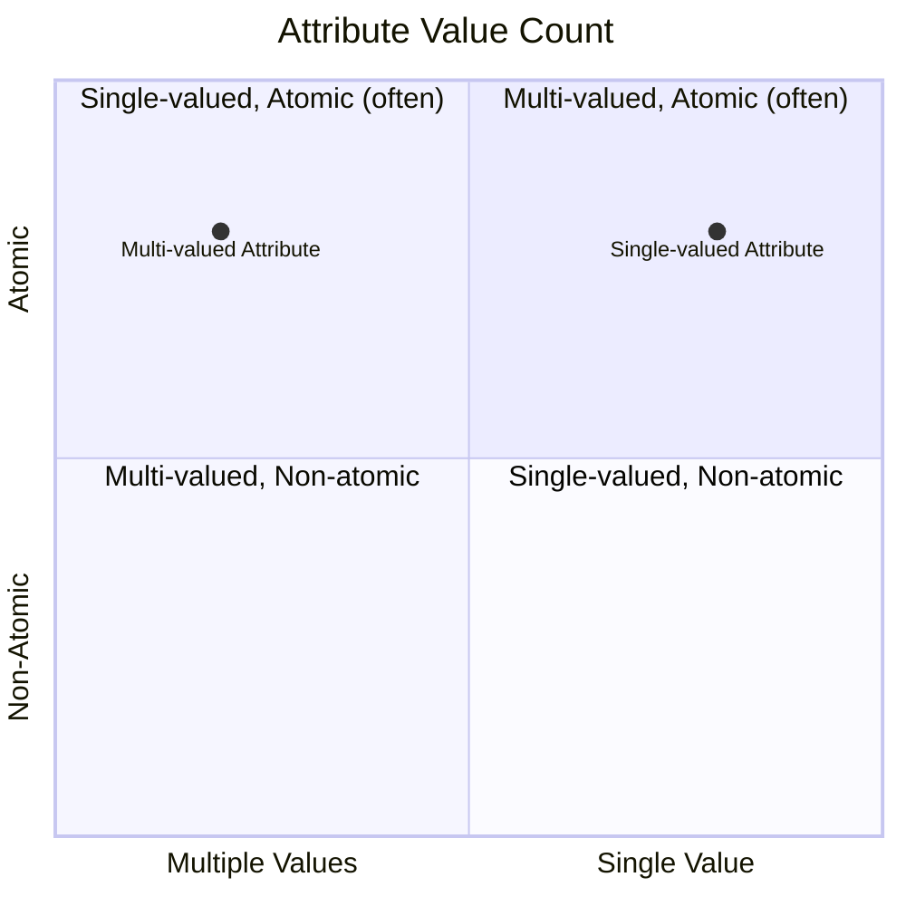

# Definition
Before proceeding, ensure you master [[Multi_Valued_Attribute]] and [[Simple_Attribute]].
A **Single-Valued Attribute** is an [[Attributes_in_ER_Model]] that holds **only one value** for each occurrence of an [[Entity_Types]] (or relationship type). This means that for any given instance of an entity, that attribute will have exactly one piece of data associated with it, or be null if no value exists. For example, `DateOfBirth` for a `Person`, `StudentID` for a `Student`, or `Price` for a `Product` are typically single-valued attributes. Think of it as a field on a passport where there's only one entry allowed for "Date of Birth."

# The Mental Model
Imagine a unique identifier, like a Social Security Number or a Driver's License Number. Each person has only **one** of these. That's a **Single-Valued Attribute**: a property where each instance of the entity can possess only a single, distinct value.

*Note: This `quadrantChart` visually differentiates `Single-Valued Attributes` from `Multi-Valued Attributes` based on the number of values they can hold.*

# Context & Framework
### The Family Tree
Within the broad classification of [[Attributes_in_ER_Model]], the single-valued attribute is fundamental for capturing discrete, individual pieces of information. It directly contrasts with a [[Multi_Valued_Attribute]], which can store a collection of values for a single entity occurrence. Most attributes are inherently single-valued, often being also [[Simple_Attribute]]s or [[Composite_Attribute]]s. Understanding this distinction is crucial for accurately representing cardinality constraints on attribute values and ensuring data integrity in the [[Entity_Relationship_ER_Model]].

# The Mastery Deep Dive
### Opening the Hood: What's Inside?
The defining characteristic of a single-valued attribute is its **uniqueness per entity instance**. For example, a `Book` entity might have a `Publication_Year` attribute. Each book instance will have only one publication year. Even if an attribute is composite (like `Address`), it is still considered single-valued if each entity occurrence has only one address, albeit an address composed of multiple parts. The "single value" refers to the entire conceptual attribute, not necessarily that it must be a single, indivisible data element.

### Spot the Impostor: Clarifying that a single-valued attribute holds only one value per entity occurrence.
A common "impostor" scenario involves a single-valued attribute that is mistakenly modeled as multi-valued, or vice-versa. For example, if a `Person` entity has an `Email` attribute, and the business rule states each person can only have *one primary email address*, then it's a single-valued attribute. However, if the business later decides to track *all* email addresses (work, personal, secondary), then it becomes a [[Multi_Valued_Attribute]]. The key is to understand the explicit business rule governing the number of values an attribute can hold for each entity instance.

# Constraints & Limitations
### The Devil's Advocate: Why might this be wrong?
While most attributes are naturally single-valued, rigidly enforcing this can sometimes oversimplify real-world data. For instance, a `PhoneNumber` attribute for a `Person` might seem single-valued, but in reality, many people have a home phone, a work phone, and a mobile phone. Forcing this into a single-valued attribute would either lead to loss of information or complex, non-normalized storage (e.g., storing multiple numbers as a comma-separated string). The trade-off is between **modeling simplicity** (single-valued) and **real-world fidelity/flexibility** (potentially multi-valued or a separate entity).

# Significance & Application
Understanding Single-Valued Attributes is academically significant as it introduces the concept of unique attribute values per entity instance, crucial for defining unambiguous data. In the real world, it's a fundamental skill for **Database Designers** and **Data Modelers**. It is applied extensively in defining attributes for almost all entities, such as `EmployeeID`, `Product_Name`, `Order_Date`, and `Customer_Age`. Correctly identifying single-valued attributes ensures that each piece of information uniquely describes its corresponding entity occurrence, maintaining data integrity and simplifying data retrieval.

# The Worked Example
*Test your mastery. Cover the solutions below to test yourself first.*

Consider a database for an online forum tracking `Users`.

### Level 1: The Sanity Check (Verification)
**The Question:** For a `User` entity, would `Username` be considered a single-valued attribute?
> **Solution:** Yes, `Username` would be considered a single-valued attribute.

### Level 2: The Crucible (Mastery & Edge Cases)
**The Scenario:** The forum decides to track the `Spoken_Language` of each user. A designer initially models `Spoken_Language` as a single-valued attribute, assuming each user only speaks one language. However, the requirement is that users can speak *multiple* languages.
**The Challenge:**
(a) Explain why modeling `Spoken_Language` as a single-valued attribute would be insufficient for this new requirement.
(b) Identify the correct type of attribute that `Spoken_Language` should be modeled as, given the updated requirement.
(c) Describe the potential data integrity issues that would arise if `Spoken_Language` were incorrectly left as a single-valued attribute despite the multi-language requirement.
> **Solution:**
> (a) Modeling `Spoken_Language` as a single-valued attribute would be insufficient because a single-valued attribute can only store *one* piece of information for each user. If a user speaks multiple languages, this attribute would only be able to capture one of them, leading to a loss of information or an inaccurate representation of the user's language proficiencies.
> (b) Given the updated requirement that users can speak multiple languages, `Spoken_Language` should be modeled as a [[Multi_Valued_Attribute]].
> (c) Potential data integrity issues would include:
>    *   **Data Loss:** Only one language could be stored per user, losing information about other languages spoken.
>    *   **Inconsistency:** Users might try to store multiple languages in a single field (e.g., "English, Spanish"), making querying and validation difficult and inconsistent.
>    *   **Redundancy:** To store multiple languages, one might create separate `Spoken_Language1`, `Spoken_Language2` columns, leading to empty fields and inflexible design.
>    *   **Querying Difficulty:** Retrieving all users who speak Spanish would require complex string matching if multiple languages were crammed into a single field, leading to inefficient queries.

# Key Takeaways
*   A single-valued attribute holds only one value for each occurrence of an entity or relationship type.
*   It represents a discrete, individual piece of information that uniquely describes an entity instance.
*   Correctly identifying single-valued attributes is crucial for ensuring the accurate and unambiguous representation of data and maintaining data integrity within a database.

# Knowledge Graph Connections
| Concept                     | Connection / Relationship                                                                   |
| :
-------------------------- | :
------------------------------------------------------------------------------------------ |
| [[Attributes_in_ER_Model]] | This is a specific classification of attributes based on the number of values they can hold. |
| [[Multi_Valued_Attribute]]  | This is the contrasting classification, representing attributes that can hold multiple values. |
| [[Simple_Attribute]]        | Single-valued attributes are often simple, though they can also be composite.               |
| [[Composite_Attribute]]     | A composite attribute can still be single-valued if an entity has only one instance of that composite attribute. |
| [[Entity_Relationship_ER_Model]] | Single-valued attributes are elementary components used to define properties of entities and relationships. |
---