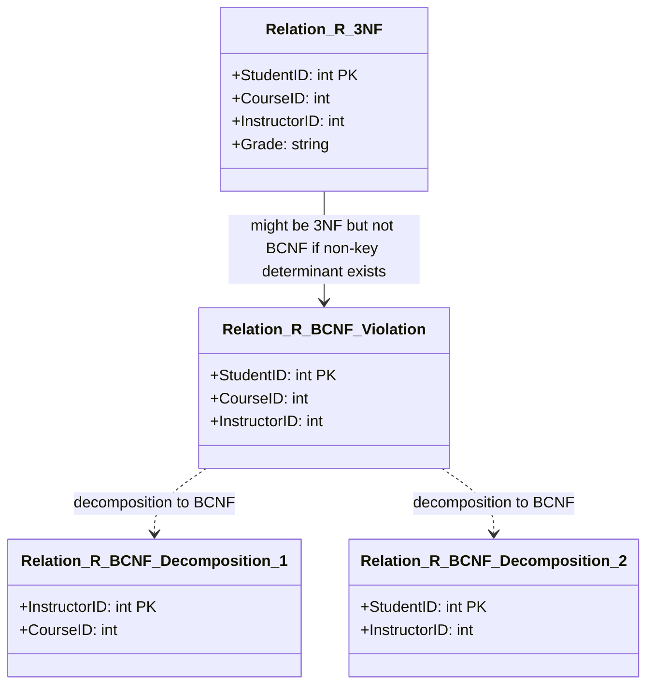

# Definition
Before proceeding, ensure you master [[Third_Normal_Form_3NF]] and Candidate_Keys.
Boyce-Codd Normal Form (BCNF) is a stricter form of Third Normal Form (3NF) and is considered one of the highest levels of normalization. A relation (table) is in BCNF if and only if **every determinant is a candidate key**. A determinant is any attribute or set of attributes on the left-hand side of a functional dependency. While 3NF addresses functional dependencies where a non-key attribute determines another non-key attribute (transitive dependencies), BCNF goes further by ensuring that *any* attribute that determines another attribute *must* be a candidate key, even if the determined attribute is part of a candidate key. This form fully eliminates redundancy based on functional dependencies. Think of it as a rule where only the "boss" (candidate key) can give orders (determine attributes).

# The Mental Model
Imagine a specialized course registration system where a `Student` can sign up for `Courses`, and `Instructors` teach `Courses`.
*   `Student, Course → Instructor` (A student taking a course is taught by one instructor for that instance).
*   `Instructor → Course` (An instructor teaches only one specific course for simplicity, but teaches many students in it).
Here, `Instructor` determines `Course`, but `Instructor` itself is not a candidate key for the whole table `(Student, Course, Instructor)`. This would violate BCNF. To get to BCNF, you'd split this into:
*   `Student_Instructor (Student, Instructor)`
*   `Instructor_Course (Instructor, Course)`
Now, in `Instructor_Course`, `Instructor` is the "boss" (PK) and determines `Course`.

*Note: This `classDiagram` illustrates how a relation in 3NF might still violate BCNF and how it's decomposed. `Relation_R_3NF` is a hypothetical 3NF table. `Relation_R_BCNF_Violation` shows a scenario where a non-key determinant (e.g., `InstructorID`) determines another attribute (`CourseID`), even if `CourseID` is part of a candidate key, causing a BCNF violation. The dotted lines indicate the decomposition into `Relation_R_BCNF_Decomposition_1` and `Relation_R_BCNF_Decomposition_2` to achieve BCNF.*

# Context & Framework
### The Engineering Trade-off
BCNF is typically applied to resolve extremely subtle forms of redundancy that 3NF might miss, usually involving relations with multiple, overlapping `Candidate_Keys`. While achieving BCNF ensures the highest level of normalization based on functional dependencies, it comes with an engineering trade-off: in rare cases, a BCNF decomposition might not be `Dependency_Preserving`. This means enforcing some original functional dependencies might require joining tables, which can be less efficient. Database designers must weigh the benefits of eliminating the last vestiges of redundancy against the potential for more complex dependency enforcement.

### The Translator: From "Lego" to "Jargon"
BCNF acts as the ultimate "boss" in the normalization hierarchy, ensuring that all "orders" (functional determinations) come directly from a "boss" (candidate key). While 3NF ensures that non-key attributes don't determine other non-key attributes, BCNF expands this to say, "If anything determines anything else, the determiner *must* be a candidate key." This rigorous jargon ensures an absolute elimination of functional dependency-based redundancy. If a dependency `A → B` exists, and `A` is not a candidate key, it's like a non-boss giving orders, and BCNF fixes this by restructuring the "chain of command."

# The Mastery Deep Dive
### Rules for Boyce-Codd Normal Form (BCNF)
A relation is in BCNF if and only if:
*   **Every determinant is a candidate key.**

**Key Concepts:**
*   **Determinant:** Any attribute or set of attributes on the left-hand side of a functional dependency.
*   **Candidate Key:** An attribute or set of attributes that uniquely identifies tuples in a relation. A relation can have multiple candidate keys, and one is chosen as the primary key.

### Difference between 3NF and BCNF
*   **3NF allows:** A functional dependency `A → B` to exist if `B` is a primary-key attribute (or part of a primary key) AND `A` is not a candidate key. This means 3NF permits a non-key attribute to determine a *part* of a candidate key, as long as the determined attribute is a prime attribute (part of *some* candidate key).
*   **BCNF insists:** For the same `A → B` dependency, `A` **must** be a candidate key (or superkey). BCNF is stricter and does not make exceptions for primary-key attributes.

**When does a 3NF relation *not* satisfy BCNF?**
A relation can be in 3NF but not in BCNF when:
1.  The relation has two (or more) composite candidate keys.
2.  The candidate keys overlap (i.e., share at least one common attribute).
3.  A non-prime attribute determines a prime attribute (a part of a candidate key).
4.  A non-key attribute determines a part of a candidate key, AND the determinant is not itself a candidate key.

This scenario is quite rare in practice.

**Example of a BCNF Violation:**
Consider `STUDENT_COURSE_INSTRUCTOR(StudentID, CourseID, InstructorID)`.
Assume FDs:
1.  `(StudentID, CourseID)` → `InstructorID` (Primary Key: `(StudentID, CourseID)`)
2.  `InstructorID` → `CourseID` (An instructor teaches only one course, but many students can take it).

*   This relation is in 3NF because there are no transitive dependencies (no non-key attribute determines another non-key attribute). `InstructorID` determines `CourseID`, but `CourseID` is part of the primary key.
*   However, it violates BCNF. The determinant `InstructorID` determines `CourseID`, but `InstructorID` is **not** a candidate key for the `STUDENT_COURSE_INSTRUCTOR` relation (because `InstructorID` alone cannot uniquely identify `StudentID`).

### Converting 3NF to BCNF (Decomposition)
To convert a relation from 3NF to BCNF, the violating functional dependency (`A → B`, where `A` is not a candidate key) needs to be removed by decomposition.
**Steps:**
1.  Identify the functional dependency `A → B` where `A` is a determinant but not a candidate key.
2.  Create a **new relation** with `A` as its primary key and `B` as its non-key attribute(s).
3.  Remove `B` from the original relation.
4.  Ensure `A` remains in the original relation as a foreign key, referencing the primary key of the new relation.

**Applying to `STUDENT_COURSE_INSTRUCTOR` example:**
*   Violating FD: `InstructorID → CourseID` (Determinant `InstructorID` is not a candidate key).
*   New relation: `INSTRUCTOR_COURSE(InstructorID, CourseID)`. `InstructorID` is PK.
*   Remove `CourseID` from `STUDENT_COURSE_INSTRUCTOR`.
*   Original relation: `STUDENT_INSTRUCTOR(StudentID, InstructorID)`. `InstructorID` is an FK to `INSTRUCTOR_COURSE`.

**Resulting BCNF relations:**
*   `INSTRUCTOR_COURSE(InstructorID, CourseID)`
*   `STUDENT_INSTRUCTOR(StudentID, InstructorID)`

# Constraints & Limitations
### The Engineering Trade-off
The major limitation of BCNF is that achieving it might sometimes lead to a **loss of dependency preservation**. This means that after decomposition to BCNF, some original functional dependencies might not be enforceable solely by checking the individual decomposed relations; you might need to join tables to verify them. This is the classic trade-off between achieving the highest possible normal form (BCNF, eliminating all redundancy due to FDs) and maintaining dependency preservation (which simplifies integrity checking). In practice, if dependency preservation is critical, designers might opt to stay in 3NF, even if a BCNF violation exists.

# Significance & Application
BCNF provides the most stringent criteria for eliminating data redundancy based on functional dependencies. Academically, it represents a deeper understanding of functional dependencies and their implications for schema design. Practically, BCNF is most relevant for highly sensitive or complex databases where even subtle forms of redundancy are unacceptable, and where the trade-off of potentially losing dependency preservation is carefully considered against the benefits of maximum redundancy elimination. It is particularly valuable for analytical systems or scenarios where update anomalies must be absolutely minimized.

# The Worked Example
Consider a relation `CLIENT_ADVISOR(ClientID, AdvisorName, AdvisorLocation)`.
Assume functional dependencies:
1.  `ClientID` → `AdvisorName` (Each client has one advisor)
2.  `AdvisorName` → `AdvisorLocation` (Each advisor is based at one location)
3.  `(ClientID, AdvisorName)` is a candidate key (meaning a client can only be advised by a specific advisor once).
4.  `ClientID → AdvisorLocation` (Transitive through `AdvisorName`).

This relation is in 3NF (no transitive dependencies via `ClientID` as the primary key, `AdvisorName` is a non-key attribute that determines `AdvisorLocation` but `AdvisorName` is not a prime attribute here as per 3NF definition).
However, it violates BCNF:
The determinant `AdvisorName` determines `AdvisorLocation`, but `AdvisorName` is **not** a candidate key for `CLIENT_ADVISOR`.

**Decomposition to BCNF:**

1.  Identify violating FD: `AdvisorName → AdvisorLocation`. `AdvisorName` is the determinant, but not a candidate key for `CLIENT_ADVISOR`.
2.  Create a new relation for the violating FD:
    `ADVISOR_DETAILS(AdvisorName, AdvisorLocation)`. `AdvisorName` is PK.
3.  Remove `AdvisorLocation` from `CLIENT_ADVISOR`.
4.  `AdvisorName` remains in `CLIENT_ADVISOR` as a foreign key.

**Resulting BCNF relations:**
*   `CLIENT(ClientID, AdvisorName (FK))`
*   `ADVISOR_DETAILS(AdvisorName, AdvisorLocation)`

# The Proving Ground
*Test your mastery. Cover the solutions below to test yourself first.*

### Level 1: The Fact Check (Verification)
**The Question:** What is the defining rule for a relation to be in Boyce-Codd Normal Form (BCNF)?
> **Solution:** A relation is in BCNF if and only if every determinant is a candidate key.

### Level 2: The Sort (Mastery & Edge Cases)
**The Scenario:** Explain the key difference between a relation in 3NF and one in BCNF, providing a scenario where a 3NF relation might not be in BCNF.
> **Solution:**
> **Key Difference:**
> *   **3NF** focuses on eliminating transitive dependencies (where a non-key attribute determines another non-key attribute). It allows certain functional dependencies `A → B` where `A` is not a candidate key, specifically if `B` is a prime attribute (part of *some* candidate key).
> *   **BCNF** is stricter. It requires that *every* determinant (left-hand side of an FD) in the relation must be a candidate key. It makes no exceptions for prime attributes.
>
> **Scenario where 3NF is not BCNF:**
> Consider a relation `TEACHING(Student, Subject, Instructor)`.
> Assume:
> 1.  `Student, Subject → Instructor` (PK: `(Student, Subject)`) - A student taking a subject has a specific instructor.
> 2.  `Instructor → Subject` (An instructor teaches only one subject, but teaches many students in it).
>
> This relation is in 3NF because there are no transitive dependencies (no non-key attribute determines another non-key attribute).
> However, it is **not in BCNF** because `Instructor` is a determinant (`Instructor → Subject`), but `Instructor` is **not** a candidate key for the `TEACHING` relation (an instructor teaches many students). This violates the BCNF rule that every determinant must be a candidate key.

### Level 3: The Impostor (Mastery & Edge Cases)
**The Scenario:** You have a `STUDENT_ADVISOR` relation with attributes `StudentID`, `AdvisorID`, `CourseCode`. The candidate keys are `(StudentID, CourseCode)` and `(AdvisorID, CourseCode)`. There's also a dependency `AdvisorID → StudentID`. A colleague states this relation is in 3NF and therefore also in BCNF. Identify if this is a "False Friend" and explain why this 3NF relation is not in BCNF.
> **Solution:** This is a **"False Friend"** statement.
>
> **Explanation:**
> 1.  **Is it in 3NF?** Yes, it is. There are no non-prime attributes that are transitively dependent on the primary key, nor are there non-prime attributes partially dependent on the primary key (assuming a primary key of `(StudentID, CourseCode)` or `(AdvisorID, CourseCode)`).
> 2.  **Is it in BCNF?** No, it is **not** in BCNF.
>     *   The functional dependency `AdvisorID → StudentID` exists.
>     *   Here, `AdvisorID` is a determinant.
>     *   However, `AdvisorID` by itself is **not a candidate key** for the `STUDENT_ADVISOR` relation (since it cannot uniquely determine `CourseCode`).
>     *   Since a determinant (`AdvisorID`) is not a candidate key, the relation violates the BCNF rule.
>
> This is a classic example of a relation that is in 3NF but not in BCNF, specifically because a non-candidate-key attribute (`AdvisorID`) determines another prime attribute (`StudentID`, which is part of candidate key `(StudentID, CourseCode)`).

# Key Takeaways
*   BCNF is the strictest normal form, requiring every determinant to be a candidate key.
*   A relation can be in 3NF but not BCNF, typically when multiple overlapping candidate keys exist, and a non-candidate-key determinant exists.
*   Converting to BCNF involves decomposition, which might sometimes lead to a loss of `Dependency_Preservation`.
*   BCNF eliminates all redundancy based on functional dependencies, offering the highest level of structural integrity for FDs.

# Knowledge Graph Connections
| Concept                     | Connection / Relationship                                                                                                               |
| :
-------------------------- | :
-------------------------------------------------------------------------------------------------------------------------------------- |
| [[Third_Normal_Form_3NF]]   | BCNF is a stricter normal form that refines relations beyond the requirements of 3NF, addressing subtle redundancy issues.                |
| [[Normalization_in_Database_Design]] | BCNF represents one of the highest levels in the overall process of database normalization.                                           |
| [[Functional_Dependencies]] | BCNF's definition is entirely based on functional dependencies, specifically that all determinants must be candidate keys.                |
| Candidate_Keys          | Understanding candidate keys is crucial for applying BCNF, as every determinant in a BCNF relation must be a candidate key.             |
| [[Data_Redundancy_and_Update_Anomalies]] | BCNF aims to eliminate all remaining forms of data redundancy that are based on functional dependencies, thus preventing update anomalies. |
| [[Lossless_Join_and_Dependency_Preservation]] | Achieving BCNF often ensures lossless-join, but it may sometimes compromise dependency preservation, which is a key engineering trade-off. |
---