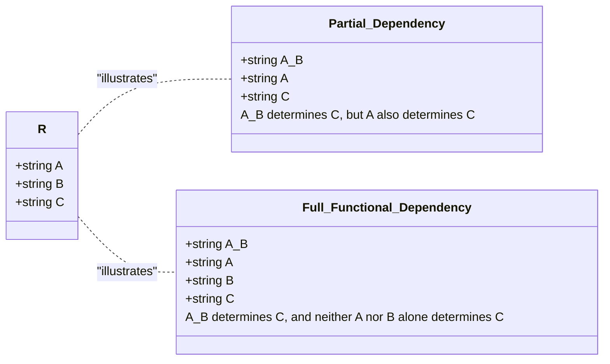

# Definition
Before proceeding, ensure you master [[Functional_Dependencies]] and Primary_Keys.
The characteristics of functional dependencies (FDs) describe the specific properties that make them useful for database normalization. Key characteristics include: they are a property of the meaning (semantics) of attributes, they must hold for all possible values in a relation (not just sample data), and their determinants (the left-hand side) should be **minimal**. This minimality leads to the concept of **full functional dependency**, where an attribute B is fully functionally dependent on A if B depends on A but not on any proper subset of A. Understanding these characteristics is crucial for correctly identifying FDs and applying normalization rules. Think of it like a legal contract: it defines precise terms, applies universally (not just specific cases), and its conditions must be as concise as possible.

# The Mental Model
Imagine you have a compound key for a lock, like "Key A + Key B." If both Key A and Key B are needed to open the lock, then the lock's opening is `fully functionally dependent` on "Key A + Key B." If Key A alone could also open the lock, then the lock's opening is *partially* dependent on "Key A + Key B" because Key A is a `proper subset` (a part) of the compound key. Normalization wants only "full" dependencies on the primary key to avoid problems.

*Note: This `classDiagram` visually compares Partial Dependency and Full Functional Dependency. It shows that for a Partial Dependency (`A + B --> C`), a subset of the determinant (`A --> C`) also determines the dependent attribute. In contrast, for a Full Functional Dependency (`A + B --> C`), no proper subset of the determinant (`A` or `B` individually) determines `C`, emphasizing minimality.*

# Context & Framework
### How the Parts Talk to Each Other
The characteristics of functional dependencies dictate how attributes "talk" to each other within a relation. For example, the `staffNo` attribute uniquely determines `sName`. This is a property of the data's meaning, not just a coincidence in a few records. The `determinant` (left-hand side) acts as the speaker, and the `dependent` (right-hand side) is the listener, consistently responding with one piece of information. This framework is vital because it formalizes the implicit business rules and data relationships, making them explicit and amenable to the systematic analysis required by normalization.

### The Translator: From "Lego" to "Jargon"
The concept of "full functional dependency" is a direct translation from the intuitive idea of "all parts of the key are necessary" into formal database jargon. If a composite primary key `(StudentID, CourseID)` determines `Grade`, then `Grade` is fully functionally dependent on `(StudentID, CourseID)` if neither `StudentID` alone nor `CourseID` alone can determine `Grade`. This precision, moving from a general understanding to a strict definition, is crucial for `Second Normal Form (2NF)`, which specifically targets and removes partial functional dependencies.

# The Mastery Deep Dive
### Property of Semantics (Meaning)
*   **The Rule:** Functional dependencies are a property of the *meaning* or *semantics* of the attributes within a relation. They are derived from the real-world business rules, not just observed data.
*   **Example:** `ISBN → Title`. The `ISBN` (International Standard Book Number) *by definition* uniquely identifies a book's `Title`. You wouldn't expect two different books to share the same `ISBN`. This is a semantic rule.
*   **Why it Matters:** Relying solely on sample data to infer FDs is risky, as a sample might coincidentally satisfy a dependency that doesn't hold for all possible future data.

### Holds for All Time
*   **The Rule:** A functional dependency `A → B` must hold for *all possible* values that can ever exist in the relation, not just the current snapshot of data.
*   **Example:** In a `STAFF` table, if `staffNo='S001'` is `sName='John Doe'` and `staffNo='S002'` is `sName='Jane Smith'`, you might infer `sName → staffNo` from *this sample*. But if a new `staffNo='S003'` is also `sName='John Doe'` (different person, same name), then `sName → staffNo` is violated.
*   **Why it Matters:** Database design must be robust for future data, not just current data. FDs are design constraints, not just observations.

### Minimal Determinant (Full Functional Dependency)
*   **The Rule:** The determinant (the attribute or group of attributes on the left-hand side of the `→`) must have the minimal number of attributes necessary to maintain the functional dependency with the attribute(s) on the right-hand side. This is called **full functional dependency**.
*   **Formal Definition:** An attribute B is **fully functionally dependent** on attribute A (or a set of attributes A) if B is functionally dependent on A, but **not** on any proper subset of A.
    *   **Partial Functional Dependency:** Occurs when a non-key attribute is dependent on only *part* of a composite primary key. This violates `Second Normal Form (2NF)`.
*   **Example:** Consider `ORDER_ITEM(OrderID, ProductID, OrderDate, ProductName)`.
    *   Assume `(OrderID, ProductID)` is the primary key.
    *   `OrderID → OrderDate` (Partial dependency: `OrderDate` depends only on `OrderID`, not `ProductID`).
    *   `ProductID → ProductName` (Partial dependency: `ProductName` depends only on `ProductID`, not `OrderID`).
    *   ` (OrderID, ProductID) → ProductName` (This holds, but `ProductName` is *also* dependent on `ProductID` alone, so `ProductName` is **partially functionally dependent** on `(OrderID, ProductID)`).
    *   **Full FD Example:** If `(EmployeeID, ProjectID)` determines `HoursWorked`, and neither `EmployeeID` alone nor `ProjectID` alone determines `HoursWorked`, then `HoursWorked` is fully functionally dependent on `(EmployeeID, ProjectID)`.
*   **Why it Matters:** Eliminating partial functional dependencies is the core objective of 2NF, as they introduce redundancy and update anomalies.

# Constraints & Limitations
### The Engineering Trade-off
The critical limitation in applying these characteristics is the reliance on the database designer's semantic understanding. If business rules are ambiguous, incomplete, or incorrectly interpreted, even a rigorous application of these characteristics can lead to an incorrect set of FDs, and consequently, a suboptimal or flawed normalized schema. This emphasizes the importance of thorough requirements gathering and close collaboration with domain experts.

# Significance & Application
Understanding the characteristics of FDs is paramount for proper database normalization. Academically, it formalizes the conditions under which normal forms are violated and how to correct them. Professionally, database designers use these properties to accurately identify redundancies, predict update anomalies, and decompose relations correctly to achieve higher normal forms, resulting in efficient, consistent, and maintainable databases.

# The Worked Example
Consider a relation `EMP_PROJ_SKILL(EmpID, ProjID, EmpName, ProjName, Skill)`
Assume the primary key is `(EmpID, ProjID, Skill)`.
And the following business rules/functional dependencies:
1.  `EmpID` → `EmpName` (Each employee ID determines one employee name)
2.  `ProjID` → `ProjName` (Each project ID determines one project name)
3.  `(EmpID, ProjID, Skill)` → `EmpName, ProjName` (The full key determines all attributes)

Let's analyze the dependencies against the "Full Functional Dependency" characteristic:

*   `EmpID` → `EmpName` is a **partial functional dependency** because `EmpName` depends on `EmpID`, which is a proper subset of the primary key `(EmpID, ProjID, Skill)`.
*   `ProjID` → `ProjName` is also a **partial functional dependency** because `ProjName` depends on `ProjID`, which is a proper subset of the primary key `(EmpID, ProjID, Skill)`.

These partial dependencies indicate that the table is not in Second Normal Form (2NF) and needs decomposition to resolve the redundancy they cause. For example, `EmpName` would be repeated for every project and skill an employee has.

# The Proving Ground
*Test your mastery. Cover the solutions below to test yourself first.*

### Level 1: The Fact Check (Verification)
**The Question:** What does "full functional dependency" imply about the determinant of a functional dependency?
> **Solution:** It implies that the determinant (the left-hand side) has the minimal number of attributes necessary to maintain the functional dependency with the attribute(s) on the right-hand side, meaning the dependent attribute does not depend on any *proper subset* of the determinant.

### Level 2: The Sort (Mastery & Edge Cases)
**The Scenario:** Distinguish between a partial functional dependency and a full functional dependency using a clear example for each.
> **Solution:**
> *   **Partial Functional Dependency:** Occurs when a non-key attribute is functionally dependent on only *part* of a composite primary key.
>     *   *Example:* In `ORDER_DETAILS(OrderID, ProductID, OrderDate, ProductName)`, with primary key `(OrderID, ProductID)`, `OrderDate` is partially functionally dependent on `OrderID` because `OrderID → OrderDate` holds, and `OrderID` is a proper subset of the primary key.
> *   **Full Functional Dependency:** Occurs when a non-key attribute is functionally dependent on an entire composite primary key, and not on any proper subset of that key.
>     *   *Example:* In `ASSIGNMENT(EmployeeID, ProjectID, HoursWorked)`, with primary key `(EmployeeID, ProjectID)`, `HoursWorked` is fully functionally dependent on `(EmployeeID, ProjectID)` if neither `EmployeeID` alone nor `ProjectID` alone determines `HoursWorked`.

### Level 3: The Impostor (Mastery & Edge Cases)
**The Scenario:** You are analyzing a relation `ORDER_ITEM(OrderID, ItemID, OrderDate, ItemName, Price)`. A colleague claims that `OrderID, ItemID → Price` is a full functional dependency. Identify if this is a "False Friend" statement and explain why, considering that `ItemID` alone determines `ItemName` and `Price`.
> **Solution:** This is a **"False Friend"** statement.
>
> **Explanation:** The claim that `OrderID, ItemID → Price` is a *full* functional dependency is incorrect because `Price` is functionally dependent on `ItemID` alone (`ItemID → Price`). Since `ItemID` is a proper subset of the determinant `(OrderID, ItemID)`, the dependency `OrderID, ItemID → Price` is actually a **partial functional dependency**, not a full one. `Price` does not require the `OrderID` component of the composite key for its determination. This situation indicates a violation of Second Normal Form (2NF).

# Key Takeaways
*   Functional dependencies are semantic properties, holding for all time, not just sample data.
*   The determinant of an FD should be minimal.
*   **Full functional dependency** means a dependent attribute relies on the *entire* determinant, not just a subset.
*   **Partial functional dependency** (where a dependent attribute relies on only a *part* of a composite key) is a common violation of 2NF.

# Knowledge Graph Connections
| Concept                     | Connection / Relationship                                                                                                               |
| :
-------------------------- | :
-------------------------------------------------------------------------------------------------------------------------------------- |
| [[Functional_Dependencies]] | These characteristics define the properties and validity of functional dependencies.                                                    |
| Primary_Keys            | Understanding full functional dependency is crucial when dealing with composite primary keys in relation to 2NF.                         |
| [[Second_Normal_Form_2NF]]  | The definition of 2NF directly relies on the concept of full functional dependency, specifically addressing partial dependencies.          |
| Partial_Functional_Dependency | Partial functional dependency is a key characteristic that, when present, indicates a violation of 2NF.                               |
| [[Data_Redundancy_and_Update_Anomalies]] | Identifying partial functional dependencies helps in understanding and eliminating sources of data redundancy and anomalies.         |
| [[Normalization_in_Database_Design]] | These characteristics provide the analytical tools required to perform effective normalization.                                   |
---