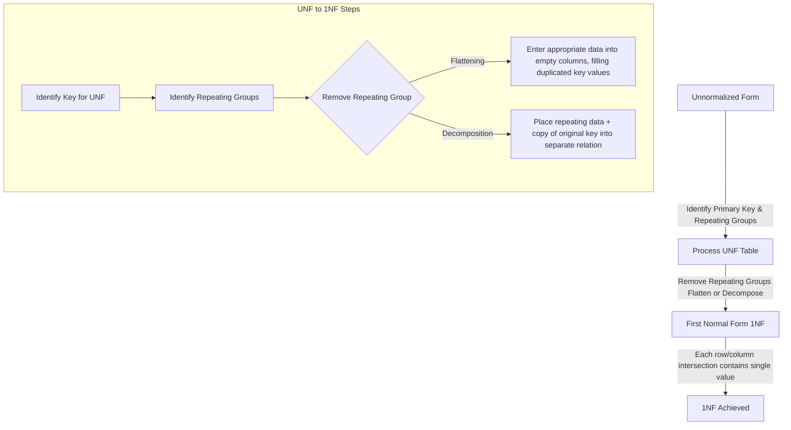

# Definition
Before proceeding, ensure you master [[Unnormalized_Form_UNF]] and Attributes.
First Normal Form (1NF) is the most basic level of database normalization. A relation (table) is in 1NF if and only if the intersection of each row and column contains one and only one atomic value. This means that: 1. There are no repeating groups within the table. 2. Each column contains only single, indivisible values (i.e., no multi-valued attributes stored in a single cell). 3. All attributes are related to the primary key. Achieving 1NF eliminates a significant source of data redundancy and sets the foundation for higher normal forms. Think of it as ensuring every cell in your spreadsheet contains just one piece of information, not a list.

# The Mental Model
Imagine you have a shopping list for a party. If your list looks like: "Guest 1: Milk, Eggs, Bread; Guest 2: Chips, Soda", this is `UNF` because the items are a `repeating group`. To get to `1NF`, you'd break it down so each item for each guest is on its own separate line: "Guest 1: Milk; Guest 1: Eggs; Guest 1: Bread; Guest 2: Chips; Guest 2: Soda". Now, each "cell" (Guest/Item pairing) has just one piece of information, and there are no lists inside other lists.

*Note: This `graph TD` diagram illustrates the transformation process from Unnormalized Form (UNF) to First Normal Form (1NF). It highlights the key steps of identifying repeating groups and then shows two methods (flattening or decomposing) to remove them, ensuring that each cell in the resulting 1NF table contains only a single atomic value.*

# Context & Framework
### System Architecture & Dependencies
Achieving First Normal Form is the initial architectural clean-up of a database schema. It fundamentally changes how data is structured by removing repeating groups, which often represent implicit one-to-many relationships hidden within a single row. This process creates a flatter, more structured set of tables where each column holds atomic values. This newfound atomicity is crucial because it allows for the explicit definition of functional dependencies and proper primary key identification, which are dependencies for achieving higher normal forms and building a robust database architecture.

### The "Pilot's Checklist" (Do Not Skip)
The conversion from UNF to 1NF is a critical "pilot's checklist" item that must be executed meticulously. It directly addresses the most egregious forms of data redundancy and ambiguity. The two primary methods—flattening the table or placing repeating data into a separate relation—are essential tools. Flattening involves duplicating the primary key of the original table for each entry in the repeating group, filling in otherwise empty cells. Decomposing involves creating a new table for the repeating group, using the original primary key (as a foreign key) and the repeating group's identifier (or the entire group if no identifier) to form a new primary key.

# The Mastery Deep Dive
### Rules for First Normal Form (1NF)
A relation is in 1NF if and only if:
1.  **No Repeating Groups:** Each intersection of a row and column contains only one value. There are no sets of attributes that repeat within a single tuple (row). This directly addresses the main issue of `Unnormalized_Form_UNF`.
2.  **Atomic Values:** Each attribute (column) must contain atomic (indivisible) values. This means no multi-valued attributes stored in a single cell (e.g., a comma-separated list of values in one column) and no composite attributes whose components are not individually accessible.
3.  **Unique Rows:** Each row must be unique, typically ensured by a primary key (though 1NF itself doesn't strictly *require* a formal primary key, its existence is implied for uniqueness).

### Converting UNF to 1NF
The process of converting an Unnormalized Form (UNF) table to 1NF involves removing the repeating groups. There are two main approaches:

1.  **Flattening the Table (Filling Empty Columns):**
    *   This involves duplicating the non-repeating data for each occurrence of the repeating group.
    *   **Steps:**
        *   Identify the primary key of the UNF table.
        *   Identify the repeating group(s).
        *   For each instance of the repeating group, create a new row.
        *   Fill the "empty" columns (non-repeating data) by duplicating the original primary key and any other non-repeating attributes.
    *   **Example:**
        **UNF:**
        | OrderID | CustomerName | (ProductID, ProductName, Quantity) |
        | :
------ | :
----------- | :
--------------------------------- |
        | O101    | Alice        | (P01, Laptop, 1), (P02, Mouse, 2)  |

        **1NF (Flattened):**
        | OrderID | CustomerName | ProductID | ProductName | Quantity |
        | :
------ | :
----------- | :
-------- | :
---------- | :
------- |
        | O101    | Alice        | P01       | Laptop      | 1        |
        | O101    | Alice        | P02       | Mouse       | 2        |
        *   **Primary Key for 1NF:** `(OrderID, ProductID)` (composite key).

2.  **Decomposing into Separate Relations:**
    *   This involves creating a new relation for the repeating group.
    *   **Steps:**
        *   Identify the primary key of the UNF table.
        *   Identify the repeating group(s).
        *   Create a new relation for the repeating group, including all its attributes.
        *   Add a copy of the original (non-repeating) primary key to this new relation. This becomes a foreign key.
        *   The primary key of the new relation is typically the composite of the original primary key and a unique identifier from the repeating group.
    *   **Example (from UNF above):**
        **1NF (Decomposed):**
        *   **`ORDERS` Relation:**
            | OrderID | CustomerName |
            | :
------ | :
----------- |
            | O101    | Alice        |
            *   **PK:** `OrderID`
        *   **`ORDER_ITEMS` Relation:**
            | OrderID | ProductID | ProductName | Quantity |
            | :
------ | :
-------- | :
---------- | :
------- |
            | O101    | P01       | Laptop      | 1        |
            | O101    | P02       | Mouse       | 2        |
            *   **PK:** `(OrderID, ProductID)`
            *   **FK:** `OrderID` references `ORDERS(OrderID)`

Both methods achieve 1NF, but decomposition is generally preferred as it isolates the repeating group, further reducing redundancy and laying the groundwork for higher normal forms more cleanly.

# Constraints & Limitations
### The Engineering Trade-off
While achieving 1NF is fundamental, it often leaves significant data redundancy and `Update_Anomalies` unresolved. For instance, in the flattened `ORDER_DETAILS` example, `CustomerName` is still repeated for every item in an order, and `ProductName` and `Price` are repeated for every order that includes that product. Therefore, 1NF is a necessary first step, but it is rarely sufficient for a robust database design, necessitating progression to 2NF and 3NF.

# Significance & Application
First Normal Form is the absolute minimum requirement for a table to be considered a "relation" in a relational database. Academically, it introduces the core concept of atomicity and eliminates the most primitive forms of data structuring issues. Professionally, every relational database must satisfy 1NF. It provides the essential, well-defined structure that allows for the precise application of `Functional_Dependencies` and the further refinement of the database schema through higher normal forms, forming the base layer of data integrity.

# The Worked Example
Let's convert a `STUDENT_COURSES` table in UNF to 1NF using decomposition, as it's the more common and structurally sound approach.

**UNF Table:**
| StudentID | StudentName | EnrollmentDate | (CourseID, CourseTitle, Credits, Grade) |
| :
-------- | :
---------- | :
------------- | :
-------------------------------------- |
| S001      | Alice       | 2024-09-01     | (C101, Intro DB, 3, A), (C102, Prog I, 4, B) |
| S002      | Bob         | 2024-09-01     | (C101, Intro DB, 3, C)                 |
| S003      | Charlie     | 2024-09-02     | (C103, Netwks, 3, A), (C104, AI, 4, A) |

**Conversion to 1NF (Decomposition):**

1.  **Identify Primary Key of UNF:** `StudentID` (conceptually for the student's part). The repeating group is `(CourseID, CourseTitle, Credits, Grade)`.

2.  **Create a new relation for the non-repeating attributes:**
    `STUDENTS(StudentID, StudentName, EnrollmentDate)`
    *   Primary Key: `StudentID`

3.  **Create a new relation for the repeating group:**
    `ENROLLMENTS(StudentID, CourseID, CourseTitle, Credits, Grade)`
    *   The primary key of the original (non-repeating) part (`StudentID`) is copied to this new relation.
    *   `CourseID` is the unique identifier within the repeating group.
    *   The primary key of `ENROLLMENTS` becomes the composite key `(StudentID, CourseID)`.
    *   `StudentID` in `ENROLLMENTS` is a foreign key referencing `STUDENTS(StudentID)`.

**Resulting 1NF Relations:**
*   `STUDENTS(StudentID, StudentName, EnrollmentDate)`
*   `ENROLLMENTS(StudentID (FK), CourseID, CourseTitle, Credits, Grade)`

# The Proving Ground
*Test your mastery. Cover the solutions below to test yourself first.*

### Level 1: The Tool Check (Verification)
**The Question:** What is the defining rule for a relation to be in First Normal Form (1NF)?
> **Solution:** A relation is in First Normal Form (1NF) if the intersection of each row and column contains one and only one atomic value, meaning there are no repeating groups.

### Level 2: The Routine Run (Mastery & Edge Cases)
**The Scenario:** Take the `CUSTOMER_ORDER` unnormalized table from question 50 (Batch 3, UNF note's Proving Ground) which has `CustomerID`, `CustomerName`, `(OrderID, OrderDate)`, and `(ProductID, ProductName, Quantity)` as repeating groups. Show the step-by-step process to convert it into 1NF using decomposition.
> **Solution:**
> **UNF Table:**
> | CustomerID | CustomerName | (OrderID, OrderDate) | (ProductID, ProductName, Quantity) |
> | :
--------- | :
----------- | :
------------------- | :
--------------------------------- |
> | C1         | Alice        | (O100, 2025-01-01)   | (P01, Laptop, 1), (P02, Mouse, 2)  |
> | C1         | Alice        | (O101, 2025-01-05)   | (P03, Keyboard, 1)                 |
> | C2         | Bob          | (O102, 2025-01-03)   | (P04, Monitor, 1)                  |
>
> **Step-by-Step Conversion to 1NF (Decomposition):**
> 1.  **Identify the outermost repeating group:** `(OrderID, OrderDate)` associated with each `CustomerID`.
> 2.  **Create a `CUSTOMERS` table for non-repeating attributes related to `CustomerID`:**
>     `CUSTOMERS(CustomerID, CustomerName)`
>     *   Primary Key: `CustomerID`
> 3.  **Create an `ORDERS` table for the first repeating group:** This table will link back to `CUSTOMERS`.
>     `ORDERS(OrderID, OrderDate, CustomerID)`
>     *   Primary Key: `OrderID`
>     *   Foreign Key: `CustomerID` references `CUSTOMERS(CustomerID)`
> 4.  **Identify the innermost repeating group:** `(ProductID, ProductName, Quantity)` associated with each `OrderID`.
> 5.  **Create an `ORDER_ITEMS` table for this innermost repeating group:** This table will link back to `ORDERS`.
>     `ORDER_ITEMS(OrderID, ProductID, ProductName, Quantity)`
>     *   Primary Key: `(OrderID, ProductID)` (composite key)
>     *   Foreign Key: `OrderID` references `ORDERS(OrderID)`
>
> **Resulting 1NF Relations:**
> *   `CUSTOMERS(CustomerID, CustomerName)`
> *   `ORDERS(OrderID, OrderDate, CustomerID (FK))`
> *   `ORDER_ITEMS(OrderID (FK), ProductID, ProductName, Quantity)`

### Level 3: The Disaster Drill (Mastery & Edge Cases)
**The Scenario:** A `PRODUCT_SUPPLIER` table has `ProductID`, `ProductName`, `SupplierName`, `SupplierAddress` (a composite attribute with `Street`, `City`, `Zip`). This table also has a `SupplierPhoneNumbers` column which contains multiple phone numbers separated by semicolons. Explain two distinct violations of 1NF in this table and describe the exact steps to rectify them.
> **Solution:**
> **Two Distinct Violations of 1NF:**
> 1.  **Multi-valued Attribute (`SupplierPhoneNumbers`):** The `SupplierPhoneNumbers` column contains multiple phone numbers within a single cell (e.g., "123-4567; 890-1234"). This violates 1NF because each cell should hold only one atomic value.
> 2.  **Composite Attribute (`SupplierAddress`):** The `SupplierAddress` attribute is composite, consisting of `Street`, `City`, and `Zip`. While it might appear as a single column, its components are not atomic or individually accessible without parsing, violating the atomicity principle of 1NF.
>
> **Exact Steps to Rectify:**
> 1.  **Rectify `SupplierPhoneNumbers` (Multi-valued Attribute):**
>     *   **Step 1a:** Create a new table, for example, `SUPPLIER_PHONES`.
>     *   **Step 1b:** This new table will have two columns: `SupplierID` (the primary key of the original `PRODUCT_SUPPLIER` table, acting as a foreign key) and `PhoneNumber`.
>     *   **Step 1c:** The primary key of `SUPPLIER_PHONES` will be the composite key `(SupplierID, PhoneNumber)`.
>     *   **Step 1d:** Remove the `SupplierPhoneNumbers` column from the original `PRODUCT_SUPPLIER` table.
>
> 2.  **Rectify `SupplierAddress` (Composite Attribute):**
>     *   **Step 2a:** Remove the `SupplierAddress` column from the original `PRODUCT_SUPPLIER` table.
>     *   **Step 2b:** Add three new atomic columns to the `PRODUCT_SUPPLIER` table: `SupplierStreet`, `SupplierCity`, and `SupplierZip`.
>
> **Resulting Tables (after rectification):**
> *   `PRODUCT_SUPPLIER(ProductID, ProductName, SupplierID, SupplierName, SupplierStreet, SupplierCity, SupplierZip)`
> *   `SUPPLIER_PHONES(SupplierID (FK), PhoneNumber)`

# Key Takeaways
*   1NF ensures atomic values at the intersection of each row and column, eliminating repeating groups.
*   The conversion from UNF to 1NF typically involves either flattening the table or, preferably, decomposing it into separate relations.
*   Achieving 1NF is the foundational step for all further normalization, providing a structured base.

# Knowledge Graph Connections
| Concept                     | Connection / Relationship                                                                                                               |
| :
-------------------------- | :
-------------------------------------------------------------------------------------------------------------------------------------- |
| [[Unnormalized_Form_UNF]]   | 1NF is the direct result of transforming an Unnormalized Form by removing repeating groups.                                             |
| [[Normalization_in_Database_Design]] | 1NF is the first and most fundamental step in the overall normalization process.                                                      |
| Attributes              | 1NF dictates that all attributes must hold atomic values, preventing multi-valued or composite attributes within a single cell.         |
| [[Data_Redundancy_and_Update_Anomalies]] | Achieving 1NF significantly reduces redundancy and helps mitigate some update anomalies, though not all.                              |
| Relational_Tables       | A table must be in 1NF to truly be considered a "relation" in a relational database.                                                    |
| Primary_Keys            | Identifying a primary key (often composite) for the 1NF table is crucial for unique row identification after removing repeating groups.    |
---