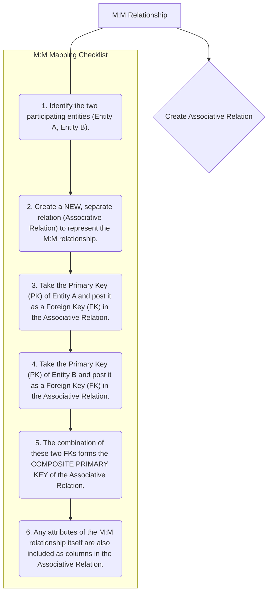

# Definition
Before proceeding, ensure you master Binary_Relationships and Associative_Entities.
Many-to-many (M:M or \*:*) binary relationships represent an association between two entities where one instance of the first entity can be related to multiple instances of the second entity, and one instance of the second entity can also be related to multiple instances of the first. This reciprocal multiplicity makes direct foreign key posting problematic. To map M:M relationships to a relational model, a **new associative relation (or bridge table)** is always created, containing the primary keys of both participating entities as foreign keys, which together form its composite primary key. Think of students enrolling in courses: one student can take many courses, and one course can have many students.

# The Mental Model
Imagine a classroom where many students (`Entity A`) are learning many subjects (`Entity B`). One student can take multiple subjects, and one subject can be taken by multiple students. You can't just put "all subjects" in a student's record, or "all students" in a subject's record – that would be messy and redundant. Instead, you create a separate "Enrollment List" (`Associative Relation`). This list simply pairs up "Student ID" with "Subject ID," and potentially adds details like "Grade" for that specific pairing. Each entry on this list is unique, and it acts as the bridge connecting the two main entities.

*Note: This `graph TD` diagram provides a "Pilot's Checklist" for mapping many-to-many (M:M) binary relationships. It clearly outlines the steps for creating an associative relation, incorporating foreign keys from both participating entities, and forming a composite primary key.*

# Context & Framework
### System Architecture & Dependencies
The creation of an associative relation for M:M mappings fundamentally alters the database architecture by introducing an intermediary table. This intermediary table depends on both participating entities for its existence, enforcing a crucial set of referential integrity constraints. For example, an `ENROLLMENT` record (linking `STUDENT` and `COURSE`) cannot exist unless both the `STUDENT` and `COURSE` records it references are present. This structure ensures that all relationships are valid and prevents inconsistent data, while also allowing for attributes specific to the relationship (e.g., a `Grade` in an `ENROLLMENT` relationship) to be stored accurately.

# The Mastery Deep Dive
### The "Pilot's Checklist" (Do Not Skip)
Mapping M:M relationships is a distinct process that always involves creating a new table.
- [ ] **1. Identify the Two Participating Entities:** Clearly define Entity A and Entity B, along with their respective primary keys. These are the two entities involved in the M:M relationship.
- [ ] **2. Create a NEW, Separate Relation (Associative Relation):** This new table will serve as the bridge between Entity A and Entity B. Its name should reflect the relationship (e.g., `ENROLLMENT` for `STUDENT` and `COURSE`, or `PRODUCT_ORDER` for `PRODUCT` and `ORDER`).
- [ ] **3. Post Primary Key of Entity A as Foreign Key:** Take the primary key attribute(s) of Entity A and add it as a column (or columns) to the new associative relation. This attribute(s) functions as a foreign key, referencing Entity A's original relation.
- [ ] **4. Post Primary Key of Entity B as Foreign Key:** Similarly, take the primary key attribute(s) of Entity B and add it as a column (or columns) to the new associative relation. This attribute(s) functions as a foreign key, referencing Entity B's original relation.
- [ ] **5. Form the Composite Primary Key:** The combination of these two foreign keys (the primary key of Entity A and the primary key of Entity B) together forms the **composite primary key** of the new associative relation. This composite key uniquely identifies each instance of the relationship.
- [ ] **6. Include Relationship Attributes:** If the M:M relationship itself has any attributes (e.g., `Date_Enrolled`, `Grade`, `Quantity`), these are also included as non-key columns in the new associative relation.

### How the Parts Talk to Each Other
In an M:M relationship, the associative entity (the "bridge table") acts as the central switchboard through which the other two entities communicate. For example, in a `CUSTOMER` `BUYS` `PRODUCT` scenario, the `PURCHASE_ITEM` table links specific `CustomerID`s with specific `ProductID`s. When you want to know what products a customer bought, you go to `PURCHASE_ITEM`, find all entries with that `CustomerID`, and then use the `ProductID`s to look up details in the `PRODUCT` table. Similarly, to see who bought a specific `PRODUCT`, you reverse the process. This intermediary table is essential for maintaining integrity and enabling flexible querying.

# Constraints & Limitations
### The Engineering Trade-off
The primary engineering trade-off with M:M relationships is the introduction of an extra table and an additional join operation required to retrieve related data. While this is necessary for correctness and normalization, it can sometimes introduce a slight performance overhead compared to a hypothetical (but incorrect) direct linking. However, the benefits in terms of data integrity, reduced redundancy, and the ability to store relationship-specific attributes far outweigh this minor cost. Attempts to avoid the associative table typically lead to severe redundancy and update anomalies.

# Significance & Application
Correctly mapping M:M relationships is critical in almost all complex database designs. Academically, it's a fundamental concept for understanding database normalization and relational integrity. In the real world, it's applied in countless scenarios: `DOCTOR` to `PATIENT` (visits), `AUTHOR` to `BOOK` (writes), `STUDENT` to `CLUB` (joins), ensuring that complex, multi-faceted relationships between business entities are accurately and efficiently managed within the database.

# The Worked Example
Let's map an M:M relationship:

**Scenario:** `STUDENT` (attributes: `StudentID` (PK), `Name`) `TAKES` `COURSE` (attributes: `CourseID` (PK), `Title`) with relationship attribute `Grade`:
*   A `STUDENT` can `TAKE` many `COURSE`s.
*   A `COURSE` can be `TAKEN` by many `STUDENT`s.
*   The `Grade` is specific to a student's performance in a particular course.

**Mapping Steps:**

1.  **Participating Entities:** `STUDENT` (PK: `StudentID`), `COURSE` (PK: `CourseID`)
2.  **Create Associative Relation:** `ENROLLMENT`
3.  **Post PK of `STUDENT` as FK:** `StudentID` in `ENROLLMENT` (FK to `STUDENT`)
4.  **Post PK of `COURSE` as FK:** `CourseID` in `ENROLLMENT` (FK to `COURSE`)
5.  **Form Composite PK:** `(StudentID, CourseID)` is the composite PK of `ENROLLMENT`.
6.  **Include Relationship Attribute:** `Grade` in `ENROLLMENT`.

**Resulting Relations:**
*   `STUDENT(StudentID, Name)`
*   `COURSE(CourseID, Title)`
*   `ENROLLMENT(StudentID (FK), CourseID (FK), Grade)`

# The Proving Ground
*Test your mastery. Cover the solutions below to test yourself first.*

### Level 1: The Tool Check (Verification)
**The Question:** What is the standard approach for representing an M:M binary relationship in a relational schema?
> **Solution:** Create a new associative relation (or bridge table) that includes the primary keys of both participating entities as foreign keys, which together form its composite primary key.

### Level 2: The Routine Run (Mastery & Edge Cases)
**The Scenario:** Given an M:M relationship between `STUDENT` and `PROJECT` with a relationship attribute `Role`, describe how you would map this to relations, including the primary key of the new relationship table.
> **Solution:**
> 1.  Create a new associative relation, for example, `STUDENT_PROJECT`.
> 2.  Include the primary key of `STUDENT` (`StudentID`) as a foreign key in `STUDENT_PROJECT`.
> 3.  Include the primary key of `PROJECT` (`ProjectID`) as a foreign key in `STUDENT_PROJECT`.
> 4.  The primary key of the `STUDENT_PROJECT` relation will be the composite key `(StudentID, ProjectID)`.
> 5.  The relationship attribute `Role` is also included as a non-key column in the `STUDENT_PROJECT` relation.

### Level 3: The Disaster Drill (Mastery & Edge Cases)
**The Scenario:** A database tracks `AUTHOR`s and `BOOK`s with an M:M relationship. A junior designer created a new `AUTHOR_BOOK` table but made `AuthorID` its primary key. Explain why this is incorrect and what the correct composite primary key should be.
> **Solution:**
> **Why it's Incorrect:** If `AuthorID` is the sole primary key of the `AUTHOR_BOOK` table, it implies that each author can be listed only once in this table. This contradicts the nature of a many-to-many relationship, where a single author can write *multiple* books, and thus `AuthorID` would appear multiple times for different books. This would violate the primary key's uniqueness constraint and prevent an author from being linked to more than one book.
>
> **Correct Composite Primary Key:** For an M:M relationship, the primary key of the associative table must be a **composite key** consisting of the primary keys of *both* participating entities. In this case, the correct composite primary key for the `AUTHOR_BOOK` table should be `(AuthorID, BookID)`. This composite key ensures that each unique pairing of an author and a book is recorded only once, accurately representing the many-to-many relationship.

# Key Takeaways
*   M:M relationships always require an associative relation (bridge table) in the relational model.
*   This associative relation's primary key is a composite of the primary keys of the two entities it links.
*   Relationship attributes for M:M relationships are stored in the associative relation.

# Knowledge Graph Connections
| Concept                     | Connection / Relationship                                                                                                       |
| :
-------------------------- | :
-------------------------------------------------------------------------------------------------------------------------------------- |
| [[Mapping_Relationships_to_Relations]] | This is a specific and essential type of relationship mapping, crucial for handling complex associations.                           |
| Binary_Relationships    | M:M relationships are a fundamental type of binary relationship, describing reciprocal multiplicity between two entities.             |
| Associative_Entities    | Associative entities are the relational construct specifically designed to represent M:M relationships.                               |
| Foreign_Keys            | The primary keys of the related entities become foreign keys within the associative relation to establish the links.                   |
| Composite_Keys          | The foreign keys in an associative relation typically combine to form its composite primary key.                                      |
| Primary_Keys            | Primary keys of the original entities are used to form both the foreign keys and the composite primary key of the associative relation. |
---