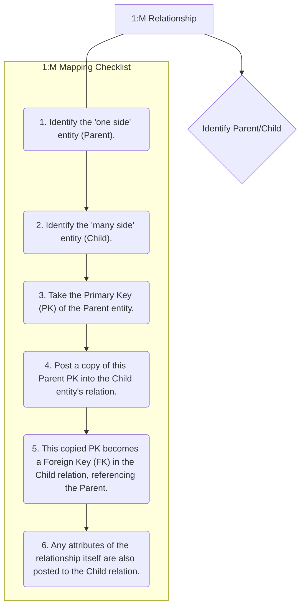

# Definition
Before proceeding, ensure you master Binary_Relationships and Foreign_Keys.
One-to-many (1:M) binary relationships describe an association between two entities where one instance of the first entity can be related to multiple instances of the second entity, but each instance of the second entity can only be related to at most one instance of the first. This is one of the most common relationship types in database design. When mapping to a relational model, the primary key of the 'one side' entity is always placed as a foreign key in the 'many side' entity, ensuring correct referential integrity. Think of it like a single teacher (`one`) teaching many students (`many`), but each student only has one primary teacher for a given class.

# The Mental Model
Imagine a single "Department" (`one` side) that employs many "Employees" (`many` side). An Employee, however, only works for one Department. When you build your database, you don't want to list the entire Department's details (name, budget, location) in every Employee's record. Instead, you just add the Department's unique ID (its `Primary Key`) to each Employee's record. This ID in the Employee table acts as a "pointer" or a `Foreign Key` back to the full Department details. This way, many employees point to one department, achieving the 1:M link without redundancy.

*Note: This `graph TD` diagram provides a "Pilot's Checklist" for mapping one-to-many (1:M) binary relationships. It outlines the clear, sequential steps involved in identifying parent and child entities and correctly placing the foreign key to establish the relationship.*

# Context & Framework
### System Architecture & Dependencies
1:M relationships form a crucial part of the hierarchical dependencies within a database schema. The foreign key placed in the 'many side' entity creates a direct dependency on the 'one side' entity, ensuring referential integrity. This means an instance on the 'many side' (e.g., an `ORDER`) cannot exist without a corresponding instance on the 'one side' (e.g., a `CUSTOMER`). This architectural choice simplifies data retrieval and updates, as changes to the 'one side' entity automatically cascade or are constrained based on the existence of 'many side' records, maintaining a consistent data model.

# The Mastery Deep Dive
### The "Pilot's Checklist" (Do Not Skip)
Mapping 1:M relationships is a relatively straightforward process with a clear rule:
- [ ] **1. Identify the 'One Side' Entity (Parent):** This is the entity that can be related to multiple instances of the other entity. Its primary key will be propagated.
- [ ] **2. Identify the 'Many Side' Entity (Child):** This is the entity where each instance can only be related to at most one instance of the 'one side' entity. This is where the foreign key will be placed.
- [ ] **3. Take the Primary Key (PK) of the Parent Entity:** Obtain the unique identifier attribute(s) of the 'one side' entity.
- [ ] **4. Post a copy of this Parent PK into the Child Entity's Relation:** Add a new column (or columns, if the PK is composite) to the relation representing the 'many side' entity. The name of this new column should clearly indicate that it's a foreign key (e.g., `DeptID` in `EMPLOYEE` when `DEPARTMENT` is the parent).
- [ ] **5. Designate this Copied PK as a Foreign Key (FK):** Explicitly define this new column(s) in the child relation as a foreign key that references the primary key of the parent relation. This establishes the link and enforces referential integrity.
- [ ] **6. Include Relationship Attributes (if any) in the Child Relation:** If the 1:M relationship itself has attributes (which is rare, as relationship attributes typically belong to the 'many' side anyway in a 1:M relationship), these attributes are also included in the 'many side' (child) relation.

### How the Parts Talk to Each Other
In a 1:M relationship, the "parent" entity (on the 'one' side) is like a central authority, and the "child" entities (on the 'many' side) are its dependents. For example, a `UNIVERSITY` (`one` side) has many `DEPARTMENTS` (`many` side). Each `DEPARTMENT` record contains the `UniversityID` (a foreign key) that points back to the specific `UNIVERSITY` it belongs to. This `UniversityID` is the direct line of communication, allowing you to trace from any `DEPARTMENT` to its `UNIVERSITY`, and from a `UNIVERSITY` to all its `DEPARTMENTS` by matching IDs.

# Constraints & Limitations
### The Engineering Trade-off
While mapping 1:M relationships is straightforward, an engineering trade-off might emerge if the 'one side' entity is rarely accessed, but its primary key is very large (e.g., a long UUID). Posting such a large foreign key into potentially millions of 'many side' records could lead to increased storage consumption and slightly slower join operations. However, this is generally a minor concern compared to the benefits of normalization and referential integrity. The fundamental rule of placing the FK in the 'many' side is almost always followed for 1:M relationships.

# Significance & Application
1:M relationships are ubiquitous in relational databases, making their correct mapping essential. Academically, it's a core concept illustrating the power of foreign keys for data linking. Practically, almost every business application, from inventory systems (one `PRODUCT_CATEGORY` to many `PRODUCTS`) to customer relationship management (one `CUSTOMER` to many `ORDERS`), relies on correctly implemented 1:M relationships to organize and access related data efficiently.

# The Worked Example
Let's map a 1:M relationship:

**Scenario:** `CUSTOMER` (attributes: `CustomerID` (PK), `Name`) `PLACES` `ORDER` (attributes: `OrderID` (PK), `OrderDate`):
*   A `CUSTOMER` can `PLACE` many `ORDER`s.
*   An `ORDER` is `PLACE`d by exactly one `CUSTOMER`.

**Mapping Steps:**

1.  **'One Side' Entity (Parent):** `CUSTOMER` (PK: `CustomerID`)
2.  **'Many Side' Entity (Child):** `ORDER` (PK: `OrderID`)
3.  **Take Parent PK:** `CustomerID`
4.  **Post to Child Relation:** Add `CustomerID` as a column in the `ORDER` relation.
5.  **Designate as FK:** `CustomerID` in `ORDER` is a foreign key referencing `CustomerID` in `CUSTOMER`.

**Resulting Relations:**
*   `CUSTOMER(CustomerID, Name)`
*   `ORDER(OrderID, OrderDate, CustomerID (FK))`

# The Proving Ground
*Test your mastery. Cover the solutions below to test yourself first.*

### Level 1: The Tool Check (Verification)
**The Question:** Which entity in a 1:M relationship is designated as the 'parent entity'?
> **Solution:** The entity on the 'one side' of the relationship.

### Level 2: The Routine Run (Mastery & Edge Cases)
**The Scenario:** Consider a 1:M relationship where `PUBLISHER` is on the 'one side' and `BOOK` is on the 'many side'. Detail the steps to map this relationship to relations, including where the foreign key will reside.
> **Solution:**
> 1.  Identify `PUBLISHER` as the 'one side' (parent) entity and `BOOK` as the 'many side' (child) entity.
> 2.  Take the primary key of the `PUBLISHER` entity (e.g., `PublisherID`).
> 3.  Post a copy of this `PublisherID` into the `BOOK` relation.
> 4.  This copied `PublisherID` becomes a foreign key in the `BOOK` relation, referencing the `PublisherID` in the `PUBLISHER` relation. The foreign key will reside in the `BOOK` relation.

### Level 3: The Disaster Drill (Mastery & Edge Cases)
**The Scenario:** A `CUSTOMER` (one side) and `ORDER` (many side) relationship was mapped, but the `customerID` was added to the `CUSTOMER` table as a foreign key referencing the `ORDER` table. Explain the fundamental error and correct the mapping.
> **Solution:**
> **Fundamental Error:** The fundamental error is placing the foreign key (`CustomerID`) in the `CUSTOMER` table, which is the 'one' side of the relationship, and having it reference the `ORDER` table, which is the 'many' side. This violates the core principle of 1:M mapping. If a customer can place many orders, then the `CUSTOMER` table would either have to duplicate customer information for each order (redundancy) or the `CustomerID` column would need to hold multiple `OrderID` values (violating atomicity), neither of which correctly models the relationship.
>
> **Correct Mapping:**
> 1.  Identify `CUSTOMER` as the 'one' side (parent) and `ORDER` as the 'many' side (child).
> 2.  The primary key of the `CUSTOMER` table (e.g., `CustomerID`) should be posted as a foreign key in the `ORDER` table.
> 3.  The `ORDER` table would then have a `CustomerID` column that links each order to its corresponding customer.
>
> **Example:**
> *   `CUSTOMER(CustomerID, CustomerName)`
> *   `ORDER(OrderID, OrderDate, CustomerID (FK))`

# Key Takeaways
*   The primary key of the 'one side' entity (parent) is always placed as a foreign key in the 'many side' entity (child).
*   This mapping establishes referential integrity, ensuring that records on the 'many side' always link back to a valid record on the 'one side'.
*   Relationship attributes in a 1:M relationship are typically placed in the 'many side' (child) relation.

# Knowledge Graph Connections
| Concept                     | Connection / Relationship                                                                                                       |
| :
-------------------------- | :
-------------------------------------------------------------------------------------------------------------------------------------- |
| [[Mapping_Relationships_to_Relations]] | This is a specific type of relationship mapping, representing a common form of association.                                         |
| Binary_Relationships    | 1:M relationships are a fundamental type of binary relationship, establishing a link between two distinct entities.                   |
| Foreign_Keys            | Foreign keys are the explicit mechanism used to implement 1:M relationships, ensuring referential integrity.                            |
| Cardinality             | The 1:M cardinality directly dictates the rule for placing the foreign key in the 'many' side relation.                                 |
| Primary_Keys            | The primary key of the 'one side' entity is copied to serve as the foreign key in the 'many' side.                                    |
---