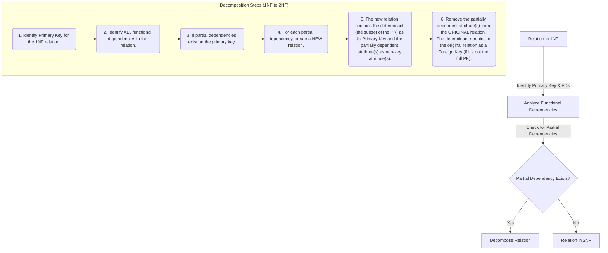

# Definition
Before proceeding, ensure you master [[First_Normal_Form_1NF]] and Full_Functional_Dependency.
Second Normal Form (2NF) is the next level of database normalization, building upon 1NF. A relation (table) is in 2NF if and only if it is in **First Normal Form (1NF)** AND every non-primary-key attribute is **fully functionally dependent** on the primary key. This means that no non-primary-key attribute can be dependent on only a *proper subset* of a composite primary key (i.e., there are no partial functional dependencies). Achieving 2NF further reduces data redundancy and eliminates update anomalies associated with partial dependencies. Think of it as ensuring that every detail in a report about a multi-part item (like an order item) genuinely belongs to the *entire* item's identifier, not just one part of it.

# The Mental Model
Imagine a combined report for "Order Items" that lists the `Order ID`, `Product ID`, `Order Date`, and `Product Name`. If the `Order ID` and `Product ID` together form the unique identifier (primary key), `Order Date` only depends on the `Order ID`, and `Product Name` only depends on the `Product ID`. This means `Order Date` and `Product Name` are **partially dependent** on the primary key. To get to `2NF`, you'd split this into three reports: one for "Orders" (with `Order Date`), one for "Products" (with `Product Name`), and a linking report for "Order Items" (just `Order ID` and `Product ID`). Each report now only contains information fully related to its main identifier.

*Note: This `graph TD` diagram outlines the process of converting a 1NF relation to Second Normal Form (2NF). It emphasizes the critical step of identifying and removing partial functional dependencies by decomposing the relation into new, more focused relations. The determinant of the partial dependency becomes the primary key of the new relation.*

# Context & Framework
### How the Parts Talk to Each Other
Second Normal Form (2NF) ensures a more refined conversation between attributes and the primary key. Before 2NF, some attributes might be whispering to just *part* of a composite primary key, creating confusion and redundancy. 2NF forces every non-key attribute to speak directly and exclusively to the *entire* primary key. This clarification is vital for database architecture, as it isolates facts that don't depend on the whole key into their own tables. This structural integrity is a foundational dependency for moving to 3NF and for building a truly robust relational model.

### The Translator: From "Lego" to "Jargon"
The concept of "full functional dependency" is the precise jargon used to enforce 2NF. It's the "Lego" instruction that says, "If this block (attribute) attaches to a multi-part structure (composite key), it must attach to *all* parts, not just one side." A partial dependency is like a piece stuck to only half a block. By ensuring full functional dependency, 2NF translates potential data integrity failures into distinct, well-defined tables, making the database's structure clear and preventing the anomalies that arise from facts that aren't fully dependent on their identifier.

# The Mastery Deep Dive
### Rules for Second Normal Form (2NF)
A relation is in 2NF if and only if:
1.  It is in **First Normal Form (1NF)**.
2.  Every **non-primary-key attribute** is **fully functionally dependent** on the primary key. This means there are **no partial functional dependencies**.

**Partial Functional Dependency (Reminder):** Occurs when a non-primary-key attribute is dependent on only *part* of a composite primary key.

### Converting 1NF to 2NF
The process of converting a 1NF relation to 2NF involves identifying and removing partial functional dependencies.

**Steps:**
1.  **Identify the Primary Key:** Determine the primary key (which might be a composite key) for the 1NF relation.
2.  **Identify All Functional Dependencies:** List all functional dependencies present in the relation.
3.  **Check for Partial Dependencies:** Examine if any non-primary-key attribute is functionally dependent on only a proper subset of the primary key.
4.  **Remove Partial Dependencies (Decomposition):**
    *   For each partial dependency identified:
        *   Create a **new relation**.
        *   The **determinant** of the partial dependency (the subset of the primary key) becomes the **primary key** of this new relation.
        *   The **partially dependent attribute(s)** are moved to this new relation as non-key attributes.
        *   The partially dependent attributes are **removed from the original relation**.
        *   The determinant (the subset of the original PK) **remains in the original relation** as a foreign key, ensuring the link is maintained.

**Example:**
Consider a 1NF relation `ORDER_DETAILS(OrderID, ProductID, CustomerName, OrderDate, ProductName, Price, Quantity)`.
Assume `(OrderID, ProductID)` is the primary key.

**Functional Dependencies:**
*   `OrderID` → `CustomerName`, `OrderDate` (Partial dependency on `OrderID`)
*   `ProductID` → `ProductName`, `Price` (Partial dependency on `ProductID`)
*   `OrderID, ProductID` → `Quantity` (Fully dependent on the composite PK)

**Conversion to 2NF:**

1.  **Remove `OrderID` → `CustomerName, OrderDate`:**
    *   Create new relation: `ORDERS(OrderID, CustomerName, OrderDate)`
    *   `OrderID` is PK of `ORDERS`.
    *   Remove `CustomerName`, `OrderDate` from `ORDER_DETAILS`.
    *   `OrderID` remains in `ORDER_DETAILS` as a foreign key.

2.  **Remove `ProductID` → `ProductName, Price`:**
    *   Create new relation: `PRODUCTS(ProductID, ProductName, Price)`
    *   `ProductID` is PK of `PRODUCTS`.
    *   Remove `ProductName`, `Price` from `ORDER_DETAILS`.
    *   `ProductID` remains in `ORDER_DETAILS` as a foreign key.

**Resulting 2NF Relations:**
*   `ORDERS(OrderID, CustomerName, OrderDate)`
*   `PRODUCTS(ProductID, ProductName, Price)`
*   `ORDER_ITEMS(OrderID (FK), ProductID (FK), Quantity)`
    *   `ORDER_ITEMS` now has `(OrderID, ProductID)` as its primary key, and `Quantity` is fully dependent on it.
    *   `OrderID` is FK to `ORDERS`, `ProductID` is FK to `PRODUCTS`.

# Constraints & Limitations
### The Engineering Trade-off
While 2NF eliminates partial dependencies and reduces redundancy, it does not address transitive dependencies (where a non-key attribute depends on another non-key attribute). This means a relation in 2NF can still contain redundancy and be susceptible to update anomalies, particularly modification anomalies. Therefore, 2NF is a necessary improvement over 1NF but is typically not the final goal of normalization; progression to `Third_Normal_Form_3NF` is usually required.

# Significance & Application
Second Normal Form is a crucial step in database normalization, ensuring that each non-key attribute in a relation directly relates to the entire primary key. Academically, it formalizes the concept of eliminating partial dependencies. Professionally, achieving 2NF significantly reduces data redundancy and prevents update anomalies that arise when attributes are only partially dependent on the primary key, leading to a more consistent and maintainable database schema, especially for composite primary keys.

# The Worked Example
Consider a 1NF relation for `EMPLOYEE_PROJECT_HOURS`:
`EMPLOYEE_PROJECT_HOURS(EmpID, ProjID, EmpName, ProjName, HoursWorked)`
Primary Key: `(EmpID, ProjID)`

Functional Dependencies:
1.  `EmpID` → `EmpName` (Partial dependency: `EmpName` depends on `EmpID` only)
2.  `ProjID` → `ProjName` (Partial dependency: `ProjName` depends on `ProjID` only)
3.  `(EmpID, ProjID)` → `HoursWorked` (Full functional dependency)

**Conversion to 2NF:**

1.  **Remove `EmpID` → `EmpName`:**
    *   Create new relation: `EMPLOYEES(EmpID, EmpName)`
    *   `EmpID` is PK of `EMPLOYEES`.
    *   Remove `EmpName` from original relation.
    *   `EmpID` remains in original relation as a foreign key.

2.  **Remove `ProjID` → `ProjName`:**
    *   Create new relation: `PROJECTS(ProjID, ProjName)`
    *   `ProjID` is PK of `PROJECTS`.
    *   Remove `ProjName` from original relation.
    *   `ProjID` remains in original relation as a foreign key.

**Resulting 2NF Relations:**
*   `EMPLOYEES(EmpID, EmpName)`
*   `PROJECTS(ProjID, ProjName)`
*   `ASSIGNMENTS(EmpID (FK), ProjID (FK), HoursWorked)`
    *   `ASSIGNMENTS` has `(EmpID, ProjID)` as its primary key, and `HoursWorked` is fully dependent on it.
    *   `EmpID` is FK to `EMPLOYEES`, `ProjID` is FK to `PROJECTS`.

# The Proving Ground
*Test your mastery. Cover the solutions below to test yourself first.*

### Level 1: The Tool Check (Verification)
**The Question:** What two conditions must a relation satisfy to be in Second Normal Form (2NF)?
> **Solution:** A relation must be in First Normal Form (1NF), and every non-primary-key attribute must be fully functionally dependent on the primary key (i.e., there are no partial functional dependencies).

### Level 2: The Routine Run (Mastery & Edge Cases)
**The Scenario:** Consider a 1NF relation `ORDER_DETAILS(OrderID, ProductID, CustomerID, CustomerName, Quantity, Price)`. Assume `OrderID, ProductID` is the primary key. If `CustomerID → CustomerName` and `ProductID → Price`, demonstrate the steps to convert this relation to 2NF.
> **Solution:**
> **Initial 1NF Relation and FDs:**
> `ORDER_DETAILS(OrderID, ProductID, CustomerID, CustomerName, Quantity, Price)`
> Primary Key: `(OrderID, ProductID)`
> Functional Dependencies:
> 1.  `OrderID` → `CustomerID`, `CustomerName` (Partial dependency on `OrderID`)
> 2.  `ProductID` → `Price` (Partial dependency on `ProductID`)
> 3.  `CustomerID` → `CustomerName` (This is a transitive dependency that 2NF doesn't address, but it's important to note for 3NF later).
> 4.  `(OrderID, ProductID)` → `Quantity` (Full functional dependency)
>
> **Steps to Convert to 2NF:**
> 1.  **Address Partial Dependency `OrderID` → `CustomerID`, `CustomerName`:**
>     *   Create a new relation: `ORDERS(OrderID, CustomerID, CustomerName)`
>     *   `OrderID` is the primary key of `ORDERS`.
>     *   Remove `CustomerID`, `CustomerName` from `ORDER_DETAILS`. `OrderID` remains as a foreign key.
> 2.  **Address Partial Dependency `ProductID` → `Price`:**
>     *   Create a new relation: `PRODUCTS(ProductID, Price)`
>     *   `ProductID` is the primary key of `PRODUCTS`.
>     *   Remove `Price` from `ORDER_DETAILS`. `ProductID` remains as a foreign key.
>
> **Resulting 2NF Relations:**
> *   `ORDERS(OrderID, CustomerID, CustomerName)` (Note: `CustomerID → CustomerName` is still a transitive dependency in this table, to be addressed in 3NF).
> *   `PRODUCTS(ProductID, Price)`
> *   `ORDER_ITEMS(OrderID (FK), ProductID (FK), Quantity)`

### Level 3: The Disaster Drill (Mastery & Edge Cases)
**The Scenario:** A `PROJECT_ASSIGNMENT` table is in 1NF with `(ProjectID, EmployeeID)` as its primary key. It also contains `ProjectName`, `EmployeeName`, and `HourlyRate`. Functional dependencies are `ProjectID → ProjectName` and `EmployeeID → EmployeeName, HourlyRate`. Explain why this table is not in 2NF and precisely outline the decomposition required to achieve 2NF.
> **Solution:**
> **Why the table is not in 2NF:**
> The `PROJECT_ASSIGNMENT` table is not in 2NF because it contains **partial functional dependencies**.
> 1.  `ProjectName` is dependent only on `ProjectID`, which is a proper subset of the composite primary key `(ProjectID, EmployeeID)`.
> 2.  `EmployeeName` and `HourlyRate` are dependent only on `EmployeeID`, which is also a proper subset of the composite primary key `(ProjectID, EmployeeID)`.
> These partial dependencies violate the 2NF rule that all non-primary-key attributes must be fully functionally dependent on the entire primary key.
>
> **Decomposition Required to Achieve 2NF:**
> 1.  **For the partial dependency `ProjectID → ProjectName`:**
>     *   Create a new relation named `PROJECTS`.
>     *   `PROJECTS` will have `ProjectID` as its primary key and `ProjectName` as its non-key attribute.
>     *   Remove `ProjectName` from the `PROJECT_ASSIGNMENT` table.
> 2.  **For the partial dependency `EmployeeID → EmployeeName, HourlyRate`:**
>     *   Create a new relation named `EMPLOYEES`.
>     *   `EMPLOYEES` will have `EmployeeID` as its primary key and `EmployeeName` and `HourlyRate` as its non-key attributes.
>     *   Remove `EmployeeName` and `HourlyRate` from the `PROJECT_ASSIGNMENT` table.
>
> **Resulting 2NF Relations:**
> *   `PROJECTS(ProjectID, ProjectName)`
> *   `EMPLOYEES(EmployeeID, EmployeeName, HourlyRate)`
> *   `PROJECT_ASSIGNMENT(ProjectID (FK), EmployeeID (FK))`
>     *   The `PROJECT_ASSIGNMENT` table now only contains the components of its original primary key. Its primary key remains `(ProjectID, EmployeeID)`. `ProjectID` is an FK to `PROJECTS`, and `EmployeeID` is an FK to `EMPLOYEES`.

# Key Takeaways
*   2NF builds on 1NF by requiring every non-primary-key attribute to be fully functionally dependent on the entire primary key.
*   It eliminates partial functional dependencies, where a non-key attribute depends only on a subset of a composite primary key.
*   Achieving 2NF typically involves decomposing the original relation into smaller, more focused relations.

# Knowledge Graph Connections
| Concept                     | Connection / Relationship                                                                                                               |
| :
-------------------------- | :
-------------------------------------------------------------------------------------------------------------------------------------- |
| [[First_Normal_Form_1NF]]   | A relation must be in 1NF as a prerequisite to being in 2NF.                                                                          |
| [[Normalization_in_Database_Design]] | 2NF is the second step in the hierarchical process of database normalization.                                                           |
| Full_Functional_Dependency | The definition of 2NF directly relies on the concept of full functional dependency and the absence of partial functional dependencies.    |
| Partial_Functional_Dependency | 2NF is specifically designed to identify and eliminate partial functional dependencies, which are a source of redundancy.               |
| [[Data_Redundancy_and_Update_Anomalies]] | By removing partial dependencies, 2NF significantly reduces data redundancy and prevents associated update anomalies.                 |
| Primary_Keys            | Understanding composite primary keys is crucial for identifying partial functional dependencies and applying 2NF rules.                   |
| [[Third_Normal_Form_3NF]]   | 2NF is a necessary step before achieving 3NF, which addresses transitive dependencies.                                                  |
---