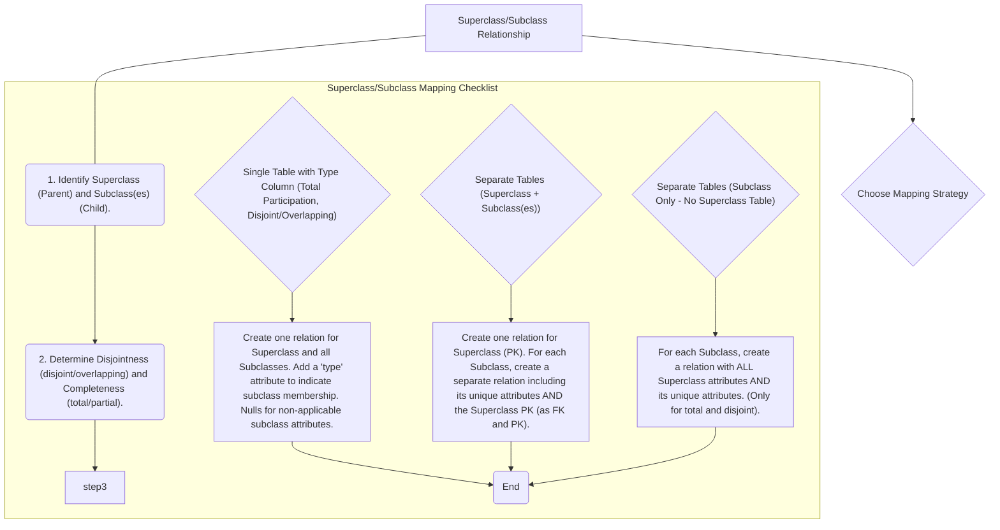

# Definition
Before proceeding, ensure you master [[Entity_Types]] and Generalization_Specialization.
Superclass/subclass relationships (also known as generalization/specialization hierarchies) represent a hierarchical association between a general entity type (superclass) and one or more specialized entity types (subclasses). Subclasses inherit attributes and relationships from their superclass, but also possess their own unique attributes and relationships. When mapping these to a relational model, several strategies exist, chosen based on factors like disjointness, completeness (participation), and attribute distribution, ensuring that both shared and specialized characteristics are accurately represented without redundancy. Think of `Vehicle` as a superclass with subclasses `Car` and `Truck`.

# The Mental Model
Imagine a broad category "Animal" (`Superclass`). Within "Animal," you have more specific types like "Mammal" and "Bird" (`Subclasses`). Both Mammals and Birds are Animals (they inherit "lives," "eats"), but Mammals have "fur" and "give live birth," while Birds have "feathers" and "lay eggs." When mapping this, you need to decide: do you put all animal characteristics and *all possible* mammal/bird characteristics into one giant "Animal" table (with many empty fields)? Or do you create a main "Animal" table and separate "Mammal" and "Bird" tables that only store their unique traits and link back to the Animal table? The best choice depends on how often you need to see all animals versus just one type.

*Note: This `graph TD` diagram provides a "Pilot's Checklist" for mapping superclass/subclass relationships. It guides the decision-making process based on disjointness and completeness constraints, outlining three primary mapping strategies for these complex hierarchies.*

# Context & Framework
### System Architecture & Dependencies
Superclass/subclass mappings fundamentally shape the hierarchical and inheritance-like aspects of a database schema. Each mapping strategy (single table, multiple tables with shared primary key, or separate tables for subclasses only) creates different architectural dependencies and data distributions. For instance, using separate tables for subclasses establishes strong referential integrity: a `CAR` record is dependent on a `VEHICLE` record, with `VIN` acting as both a primary and foreign key. This framework ensures that common attributes are managed efficiently while specialized attributes are handled appropriately, providing flexibility in modeling complex entities.

# The Mastery Deep Dive
### The "Pilot's Checklist" (Do Not Skip)
Mapping superclass/subclass relationships involves choosing one of several strategies, based on the `disjointness` (whether an instance of the superclass can belong to more than one subclass) and `completeness` (whether every instance of the superclass *must* belong to at least one subclass).

- [ ] **1. Identify Superclass and Subclass(es):** Clearly define the general superclass entity (e.g., `PERSON`) and its specialized subclass entities (e.g., `STUDENT`, `FACULTY`).
- [ ] **2. Determine Disjointness and Completeness:**
    -   **Disjoint:** An instance of the superclass belongs to at most one subclass (`d`).
    -   **Overlapping:** An instance of the superclass can belong to multiple subclasses (`o`).
    -   **Total (Mandatory Participation):** Every instance of the superclass must belong to at least one subclass.
    -   **Partial (Optional Participation):** An instance of the superclass may not belong to any subclass.

- [ ] **Strategy A: Single Table with Type Column (Table-per-Hierarchy)**
    - [ ] **Applicability:** Works well for both disjoint and overlapping, and total or partial participation.
    - [ ] **Method:** Create **one single relation** that includes all attributes of the superclass AND all unique attributes of all subclasses.
    - [ ] Add a special "type" or "discriminator" attribute to indicate which subclass an instance belongs to.
    - [ ] Non-applicable subclass attributes for a given row will contain `NULL` values.
    - *Example*: `PERSON(PersonID, Name, DateOfBirth, StudentID, Major, FacultyID, Department, Type)` (`Type` could be 'Student' or 'Faculty').

- [ ] **Strategy B: Separate Tables (Superclass Table + Subclass Tables) (Table-per-Concrete-Class or Table-per-Type)**
    - [ ] **Applicability:** Best for disjoint relationships, especially if partial participation is allowed, or if subclasses have many unique attributes/relationships.
    - [ ] **Method:**
        1.  Create one relation for the **Superclass**, containing all its common attributes and its primary key.
        2.  For **each Subclass**, create a separate relation. This subclass relation contains only its unique attributes AND the primary key of the superclass.
        3.  The superclass primary key in the subclass table acts as both its **primary key** and a **foreign key** referencing the superclass table.
    - *Example*: `PERSON(PersonID, Name, DateOfBirth)`
                `STUDENT(PersonID (PK,FK), StudentID, Major)`
                `FACULTY(PersonID (PK,FK), FacultyID, Department)`

- [ ] **Strategy C: Separate Tables (Subclass Only - No Superclass Table) (Table-per-Subclass)**
    - [ ] **Applicability:** Only for **total and disjoint** relationships.
    - [ ] **Method:** For **each Subclass**, create a separate relation. Each subclass relation includes **all** attributes of the superclass AND its own unique attributes. There is no separate superclass table.
    - *Example*: (If `PERSON` is *always* either `STUDENT` or `FACULTY`, and never both)
                `STUDENT(PersonID, Name, DateOfBirth, StudentID, Major)`
                `FACULTY(PersonID, Name, DateOfBirth, FacultyID, Department)`
                *(Here `PersonID` is PK in both tables)*

### How the Parts Talk to Each Other
In the "Separate Tables (Superclass + Subclass(es))" strategy, the `PersonID` in the `STUDENT` table is the direct link (foreign key and primary key) that connects a student record back to its corresponding general `PERSON` record. This allows `STUDENT` and `FACULTY` to inherit common "person-ness" from the `PERSON` table, while still maintaining their unique characteristics. This shared `PersonID` acts as a common language, enabling all parts of the hierarchy to communicate and reference each other accurately.

# Constraints & Limitations
### The Engineering Trade-off
The engineering trade-off for superclass/subclass relationships is significant.
*   **Single Table (Strategy A):** Simpler for querying *all* instances (e.g., "all persons"), but leads to many `NULL` values for non-applicable subclass attributes, wasting space and potentially complicating queries for specific subclass data.
*   **Separate Tables (Superclass + Subclass(es)) (Strategy B):** Reduces `NULL`s, clearer semantic separation, but requires joins to retrieve complete information about a subclass instance (e.g., a student's name and major).
*   **Separate Tables (Subclass Only) (Strategy C):** Avoids joins for subclass-specific queries but duplicates superclass attributes across multiple tables, increasing redundancy and making updates to common attributes more complex.

The choice is a trade-off between query performance, storage efficiency, and ease of maintenance, and should be based on the specific access patterns and business requirements.

# Significance & Application
Superclass/subclass mapping is crucial for modeling complex, real-world hierarchies in database systems, enabling code reusability and more structured data. Academically, it's an advanced E-R concept. Practically, it's used in diverse fields like human resources (`EMPLOYEE` as superclass, `HOURLY_EMPLOYEE`, `SALARIED_EMPLOYEE` as subclasses), product catalogs (`PRODUCT` as superclass, `ELECTRONICS`, `CLOTHING`), and financial systems, allowing for efficient management of entities with both common and specialized characteristics.

# The Worked Example
Let's map a Superclass/Subclass relationship using Strategy B (Superclass Table + Subclass Tables):

**Scenario:** `STAFF` (attributes: `StaffID` (PK), `Name`, `StartDate`) is a superclass with two disjoint and total subclasses: `PERMANENT_STAFF` (unique attributes: `PensionPlanNo`, `Salary`) and `CONTRACT_STAFF` (unique attributes: `ContractEndDate`, `HourlyRate`).

**Mapping Strategy (Strategy B chosen due to disjoint and total, but allows for clear separation):**

1.  **Superclass Table:** `STAFF`
    *   Attributes: `StaffID` (PK), `Name`, `StartDate`
    *   Result: `STAFF(StaffID, Name, StartDate)`

2.  **Subclass Table: `PERMANENT_STAFF`**
    *   Attributes: `PensionPlanNo`, `Salary`
    *   Inherits `StaffID` from `STAFF` as PK and FK.
    *   Result: `PERMANENT_STAFF(StaffID (PK,FK), PensionPlanNo, Salary)`

3.  **Subclass Table: `CONTRACT_STAFF`**
    *   Attributes: `ContractEndDate`, `HourlyRate`
    *   Inherits `StaffID` from `STAFF` as PK and FK.
    *   Result: `CONTRACT_STAFF(StaffID (PK,FK), ContractEndDate, HourlyRate)`

# The Proving Ground
*Test your mastery. Cover the solutions below to test yourself first.*

### Level 1: The Tool Check (Verification)
**The Question:** What are superclass/subclass relationships, and why are they complex to map to relations?
> **Solution:** Superclass/subclass relationships are hierarchical associations between a general entity (superclass) and specialized entities (subclasses). They are complex to map because subclasses inherit attributes and relationships from the superclass while also having their own unique ones, requiring careful strategies to avoid redundancy and manage data distribution.

### Level 2: The Routine Run (Mastery & Edge Cases)
**The Scenario:** Outline one common option for representing a superclass `PERSON` with subclasses `STUDENT` and `FACULTY` in a relational schema, assuming disjoint and mandatory participation.
> **Solution:** A common option for this scenario (disjoint and mandatory) is **Strategy B: Separate Tables (Superclass Table + Subclass Tables)**.
> 1.  Create a `PERSON` table with common attributes (e.g., `PersonID` (PK), `Name`, `DateOfBirth`).
> 2.  Create a `STUDENT` table with its unique attributes (e.g., `StudentID`, `Major`) and include `PersonID` as both its primary key and a foreign key referencing the `PERSON` table.
> 3.  Create a `FACULTY` table with its unique attributes (e.g., `FacultyID`, `Department`) and include `PersonID` as both its primary key and a foreign key referencing the `PERSON` table.

### Level 3: The Disaster Drill (Mastery & Edge Cases)
**The Scenario:** A superclass `VEHICLE` has subclasses `CAR` and `TRUCK`. A designer decided to create separate tables for `CAR` and `TRUCK`, each duplicating common `VEHICLE` attributes like `VIN` and `Manufacturer`. Explain the potential redundancy and a better approach for this scenario.
> **Solution:**
> **Potential Redundancy:** If `CAR` and `TRUCK` tables each contain all common `VEHICLE` attributes (like `VIN`, `Manufacturer`, `Model`), this leads to significant data redundancy. If `VIN` or `Manufacturer` details need to be updated, they would have to be updated in potentially multiple tables, increasing the risk of inconsistencies (e.g., a `CAR` record having one `Manufacturer` while a `TRUCK` record has another for the same conceptual vehicle if the design allowed for overlapping subclasses, or simply if the data entry was inconsistent).
>
> **Better Approach:** A much better approach is **Strategy B: Separate Tables (Superclass Table + Subclass Tables)**.
> 1.  Create a **`VEHICLE` table** as the superclass, containing all common attributes (e.g., `VIN` (PK), `Manufacturer`, `Model`, `Year`).
> 2.  Create separate subclass tables for `CAR` and `TRUCK`.
> 3.  The `CAR` table would contain only its unique attributes (e.g., `NumberOfDoors`, `CarType`) and have `VIN` as both its primary key and a foreign key referencing the `VEHICLE` table.
> 4.  The `TRUCK` table would contain only its unique attributes (e.g., `PayloadCapacity`, `AxleConfiguration`) and also have `VIN` as both its primary key and a foreign key referencing the `VEHICLE` table.
>
> This design eliminates redundancy for common attributes, centralizes their management in the `VEHICLE` table, and maintains clear separation for subclass-specific details, while still allowing for full vehicle information to be retrieved via a simple join.

# Key Takeaways
*   Superclass/subclass relationships model hierarchical data (general to specific).
*   Mapping strategies (single table, superclass + subclass tables, subclass only) depend on disjointness and completeness.
*   The chosen strategy impacts redundancy, data sparsity, query complexity, and maintenance.

# Knowledge Graph Connections
| Concept                     | Connection / Relationship                                                                                                       |
| :
-------------------------- | :
-------------------------------------------------------------------------------------------------------------------------------------- |
| [[Mapping_Relationships_to_Relations]] | This is an advanced and complex type of relationship mapping within E-R to relational translation.                                  |
| [[Entity_Types]]            | Superclass and subclass are specialized types of entities that participate in hierarchical relationships.                             |
| Generalization_Specialization | This concept is synonymous with superclass/subclass relationships, forming the basis for their mapping.                             |
| Foreign_Keys            | Foreign keys (often combined with primary keys) are used to link subclass tables to superclass tables.                                |
| Primary_Keys            | Primary keys, particularly shared ones, are central to linking superclass and subclass tables.                                        |
| Disjointness_Constraint | The disjointness constraint (disjoint or overlapping) is a key factor in choosing the appropriate mapping strategy.                     |
| Completeness_Constraint | The completeness constraint (total or partial participation) also significantly influences the mapping strategy for these hierarchies.  |
---