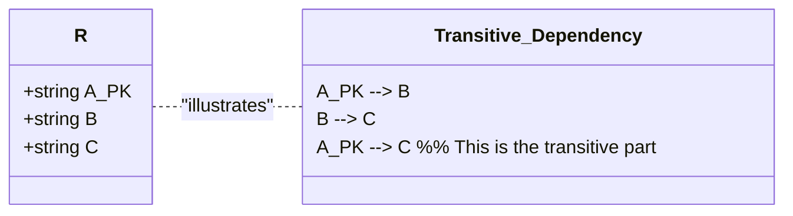

# Definition
Before proceeding, ensure you master [[Functional_Dependencies]] and [[Second_Normal_Form_2NF]].
A transitive dependency is a specific type of functional dependency that violates Third Normal Form (3NF) and occurs when a non-key attribute in a relation is functionally dependent on another non-key attribute, which in turn is functionally dependent on the primary key. Formally, if A, B, and C are attributes of a relation such that `A → B` and `B → C`, then C is transitively dependent on A via B, provided that A is not functionally dependent on B or C (i.e., B is not a superkey of A, and C is not functionally dependent on A directly, independent of B). The presence of a transitive dependency indicates indirect reliance and introduces redundancy, which can lead to update anomalies. Think of it like a chain of command: A gives orders to B, and B gives orders to C. C indirectly relies on A through B.

# The Mental Model
Imagine you have an `Employee` (A), their `Department Head` (B), and the `Department Head's Office Number` (C).
`Employee (A) → Department Head (B)`: Each employee has one department head.
`Department Head (B) → Department Head's Office Number (C)`: Each department head has one office number.
Therefore, `Employee (A) → Department Head's Office Number (C)` *transitively* through `Department Head (B)`.
The problem: if `Department Head's Office Number` (C) is stored in the `Employee` (A) table, and a `Department Head` changes their `Office Number`, you'd have to update every `Employee` who reports to them. This is redundant because the office number *only* depends on the department head, not on each individual employee.

*Note: This `classDiagram` illustrates a transitive dependency. It shows a relation `R` with attributes `A`, `B`, and `C`. The functional dependencies `A --> B` and `B --> C` are present, which leads to `A --> C` (transitivity). Crucially, it highlights that `B` and `C` are non-key attributes relative to `A` and `B` is not a determinant for `A`, confirming the transitive nature.*

# Context & Framework
### The Villain's Plan: How Transitive Dependency Leads to Anomalies
Transitive dependencies are a subtle yet potent "villain" that allows redundancy to creep into database designs, even after achieving Second Normal Form (2NF). They create indirect dependencies that lead to update anomalies. When `A → B` and `B → C` exist (and `B` is not a candidate key for `A`), any change to `C` (which directly depends on `B`) would require updating every record where that `B` value appears, even if `A` is the primary key. This is a classic source of modification anomalies, as ensuring consistency across all redundant `C` values becomes a significant challenge.

### The Engineering Trade-off
Recognizing a transitive dependency is crucial because its existence directly violates 3NF and introduces redundancy. The engineering trade-off for eliminating transitive dependencies involves decomposing the relation into smaller, more focused relations. This decomposition reduces redundancy and improves data integrity, making updates simpler and less prone to errors. While it might increase the number of tables and potentially require an additional join for certain queries, the benefits of avoiding update anomalies typically outweigh this minor overhead in a well-designed transactional database.

# The Mastery Deep Dive
### Understanding Transitive Dependency
A transitive dependency exists in a relation `R` if:
1.  `A → B` (A functionally determines B)
2.  `B → C` (B functionally determines C)
3.  `A → C` (This is implied transitively by the first two)
4.  **Crucially:** `B` is a **non-key attribute** (or a set of non-key attributes) with respect to `A`, meaning `B` is not a candidate key for `R`, and `A` is not functionally dependent on `B` (i.e., `B` does not determine `A`).
5.  Also, `C` is a non-key attribute.

**Why it's a problem:** If `C` is stored in the same table as `A` and `B`, and `B` is not a primary key, then `C` will be redundantly repeated for every instance of `A` that shares the same `B` value. When `B` changes, or `C` changes for a given `B`, all records containing that `B` value would need to be updated.

**Example:**
Consider the `STAFF_BRANCH` relation:
`STAFF_BRANCH(staffNo, sName, position, salary, branchNo, bAddress)`
Assume `staffNo` is the primary key.
Functional Dependencies:
1.  `staffNo` → `sName, position, salary, branchNo, bAddress`
2.  `branchNo` → `bAddress`

Here:
*   `A = staffNo` (Primary Key)
*   `B = branchNo` (Non-key attribute)
*   `C = bAddress` (Non-key attribute)

We have `staffNo → branchNo` and `branchNo → bAddress`.
Thus, `bAddress` is transitively dependent on `staffNo` via `branchNo`.
This violates Third Normal Form (3NF).

### Removing Transitive Dependencies (Achieving 3NF)
To remove a transitive dependency and achieve 3NF, the relation is decomposed. The attributes involved in the transitive dependency are moved into a new relation.
**Steps:**
1.  Identify the functional dependency `B → C` that represents the transitive dependency.
2.  Create a **new relation** containing `B` as its primary key and `C` as its non-key attribute(s).
3.  Remove `C` from the original relation.
4.  Ensure `B` remains in the original relation as a foreign key, referencing the primary key of the new relation.

**Applying to `STAFF_BRANCH` example:**
*   Transitive dependency: `staffNo → branchNo → bAddress`
*   New relation from `branchNo → bAddress`: Create `BRANCH(branchNo, bAddress)`. `branchNo` is PK.
*   Remove `bAddress` from `STAFF_BRANCH`.
*   Original relation `STAFF(staffNo, sName, position, salary, branchNo)` remains. `branchNo` is now an FK to `BRANCH`.

**Resulting 3NF relations:**
*   `STAFF(staffNo, sName, position, salary, branchNo (FK))`
*   `BRANCH(branchNo, bAddress)`

# Constraints & Limitations
### The Engineering Trade-off
The only "limitation" of removing transitive dependencies is the need for an additional JOIN operation when retrieving data that was previously available in a single table (e.g., staff name and branch address). This is a well-understood and acceptable engineering trade-off. The minor performance cost of a join is overwhelmingly offset by the significant gains in data integrity, reduced redundancy, and simplified update operations achieved by moving to 3NF.

# Significance & Application
Transitive dependencies are a critical concept for understanding and achieving Third Normal Form (3NF), which is a widely accepted standard for good relational database design. Academically, it formalizes a common type of redundancy that leads to update anomalies. Professionally, database designers must diligently identify and eliminate transitive dependencies to build robust, efficient, and easily maintainable databases, ensuring data consistency for critical business operations.

# The Worked Example
Consider a `STUDENT_ADVISOR_DEPARTMENT` relation:
`STUDENT_ADVISOR_DEPARTMENT(StudentID, StudentName, AdvisorID, AdvisorName, DeptName)`
Assume `StudentID` is the primary key.
Functional Dependencies:
1.  `StudentID` → `StudentName, AdvisorID`
2.  `AdvisorID` → `AdvisorName, DeptName`
3.  `AdvisorID` → `DeptName` (This is the key transitive dependency, as `AdvisorID` is a non-key attribute and determines other non-key attributes)

Here:
*   `A = StudentID` (Primary Key)
*   `B = AdvisorID` (Non-key attribute)
*   `C = AdvisorName, DeptName` (Non-key attributes determined by `B`)

We have `StudentID → AdvisorID` and `AdvisorID → AdvisorName, DeptName`.
Thus, `AdvisorName` and `DeptName` are transitively dependent on `StudentID` via `AdvisorID`.
This violates Third Normal Form (3NF).

**Removing Transitive Dependency:**

1.  Create a new relation for `AdvisorID` and the attributes it determines:
    `ADVISOR_DETAILS(AdvisorID, AdvisorName, DeptName)` (Here, `AdvisorID` becomes the PK).
2.  Remove `AdvisorName` and `DeptName` from the original `STUDENT_ADVISOR_DEPARTMENT` relation.
3.  The original `STUDENT` table now has `AdvisorID` as a foreign key.

**Resulting 3NF relations:**
*   `STUDENT(StudentID, StudentName, AdvisorID (FK))`
*   `ADVISOR_DETAILS(AdvisorID, AdvisorName, DeptName)`

# The Proving Ground
*Test your mastery. Cover the solutions below to test yourself first.*

### Level 1: The Fact Check (Verification)
**The Question:** Define a transitive dependency involving attributes A, B, and C.
> **Solution:** A transitive dependency exists when A, B, and C are attributes of a relation such that `A → B` and `B → C`, then C is transitively dependent on A via B. Crucially, B must be a non-key attribute (or non-superkey) with respect to A, and C must be a non-key attribute.

### Level 2: The Sort (Mastery & Edge Cases)
**The Scenario:** In a `STAFF_BRANCH` relation with attributes `StaffID`, `StaffName`, `BranchNo`, `BranchAddress`, `BranchNo → BranchAddress` and `StaffID → BranchNo`. Identify the transitive dependency.
> **Solution:** The transitive dependency is `StaffID → BranchNo → BranchAddress`.
> Here, `BranchAddress` is transitively dependent on `StaffID` through `BranchNo`.

### Level 3: The Impostor (Mastery & Edge Cases)
**The Scenario:** Consider a relation `FLIGHT_DETAIL(FlightNo, DepartureCity, ArrivalCity, DepartureTime)`. A student states that `DepartureCity → DepartureTime` is a transitive dependency via `FlightNo → DepartureCity`. Identify if this statement is a "False Friend" and explain why, given that `DepartureCity` does not uniquely determine `DepartureTime` independently.
> **Solution:** This statement is a **"False Friend"**.
>
> **Explanation:** For `DepartureCity → DepartureTime` to be a transitive dependency via `FlightNo → DepartureCity`, two conditions must hold:
> 1.  `FlightNo → DepartureCity`
> 2.  `DepartureCity → DepartureTime`
>
> The problem statement explicitly states that `DepartureCity` does **not** uniquely determine `DepartureTime` independently (`DepartureCity` does not determine `DepartureTime`). A `DepartureCity` (e.g., London) can have many `DepartureTime`s throughout the day for different flights. Therefore, the dependency `DepartureCity → DepartureTime` does not hold. Without this second functional dependency, there cannot be a transitive dependency in the chain `FlightNo → DepartureCity → DepartureTime`. The concept of "transitive dependency" requires both links in the chain (`A→B` and `B→C`) to be valid functional dependencies.

# Key Takeaways
*   Transitive dependencies occur when a non-key attribute depends on another non-key attribute, which in turn depends on the primary key (`A → B → C`).
*   They violate Third Normal Form (3NF) and introduce redundancy, leading to update anomalies.
*   Removing transitive dependencies involves decomposing the relation into smaller tables, with the intermediate attribute (B) becoming a primary key in the new table and a foreign key in the original.

# Knowledge Graph Connections
| Concept                     | Connection / Relationship                                                                                                               |
| :
-------------------------- | :
-------------------------------------------------------------------------------------------------------------------------------------- |
| [[Functional_Dependencies]] | Transitive dependencies are a specific form of functional dependency that needs to be addressed during normalization.                     |
| [[Third_Normal_Form_3NF]]   | The primary goal of 3NF is to eliminate transitive dependencies from a relation.                                                      |
| [[Second_Normal_Form_2NF]]  | A relation must already be in 2NF before considering the elimination of transitive dependencies to achieve 3NF.                           |
| [[Data_Redundancy_and_Update_Anomalies]] | Transitive dependencies are a direct source of data redundancy and lead to modification anomalies.                                |
| [[Characteristics_of_Functional_Dependencies]] | Understanding the properties of FDs (like minimality and what constitutes a non-key attribute) is essential for identifying transitive dependencies. |
---