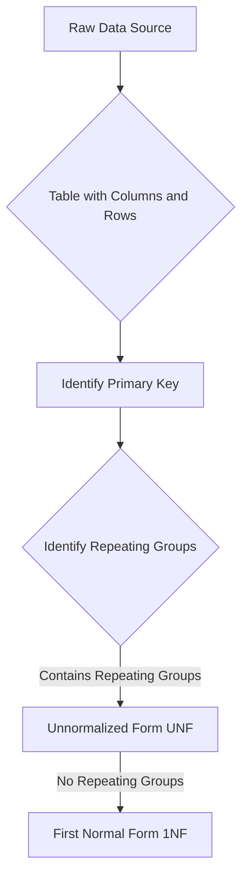

# Definition
Before proceeding, ensure you master Relational_Tables and [[First_Normal_Form_1NF]].
Unnormalized Form (UNF) refers to a table that contains one or more "repeating groups." A repeating group occurs when multiple values for a single attribute (or a set of attributes) are stored within a single row for a specific primary key value. This directly violates the principle of atomicity, where each column should contain a single, indivisible value. UNF is the starting point of the normalization process, representing raw, unstructured data that needs to be refined to achieve better database design. Think of it as a spreadsheet cell that contains a comma-separated list of items, rather than each item having its own row.

# The Mental Model
Imagine you have a single recipe card for "Pizza." On that card, under "Ingredients," you just list: "Dough, Tomato Sauce, Cheese, Pepperoni, Mushrooms." This entire list of ingredients is a `repeating group` for the "Pizza" recipe. The card itself is `Unnormalized Form`. To make it normalized, you'd want each ingredient to be on its own separate line or linked to a separate list of ingredients, so you can easily manage each one individually.

*Note: This `graph TD` diagram illustrates the characteristics of Unnormalized Form (UNF). It shows the process from a raw data source to a table, where the presence of "Repeating Groups" defines a table as being in UNF. It also shows the direct path to 1NF once these repeating groups are eliminated.*

# Context & Framework
### The Family Tree
Unnormalized Form sits at the very root of the normalization "family tree." It represents the most basic, often direct, translation of raw data (like a paper form or spreadsheet) into a table-like structure, without any formal rules applied yet. All subsequent normal forms (1NF, 2NF, 3NF, etc.) are descendants of UNF, each building upon the previous one by removing specific types of data anomalies. Understanding UNF is crucial because it highlights the initial problems (primarily repeating groups and non-atomic values) that normalization aims to solve.

### System Architecture & Dependencies
In terms of system architecture, a database in Unnormalized Form would be highly prone to `Data_Redundancy_and_Update_Anomalies`. Its structure, containing repeating groups within single rows, makes it inefficient for querying, updating, and maintaining data. This state demonstrates the direct architectural problem that a logical database design seeks to overcome through normalization. The dependencies between attributes are unclear, and relationships are often implicitly hidden within these repeating groups, rather than explicitly defined through foreign keys.

# The Mastery Deep Dive
### Characteristics of Unnormalized Form
The defining characteristic of a table in Unnormalized Form is the presence of **repeating groups**.
*   **Repeating Group:** A set of one or more attributes that can have multiple values for a single primary key instance. This means a single cell in a table might contain a list of values, or a set of columns (`Item1_Name`, `Item1_Quantity`, `Item2_Name`, `Item2_Quantity`) is repeated within a row.
*   **Non-Atomic Values:** Implicitly, the existence of repeating groups often means that columns contain non-atomic values (e.g., a single cell containing "Book A, Book B, Book C" for a `Books_Read` column).

**How to Create an Unnormalized Table (Initial Step from a Source):**
1.  **Transform Data Source:** Take raw data from an information source (like a form, report, or spreadsheet) and convert it into a basic table format with columns and rows.
2.  **Identify Primary Key:** Nominate an attribute or group of attributes that could uniquely identify each "conceptual" row, even if it has repeating groups.

**Example of an Unnormalized Table (`ORDER`):**

| OrderID | CustomerName | OrderDate | (ProductID, ProductName, Quantity) |
| :
------ | :
----------- | :
-------- | :
--------------------------------- |
| O101    | Alice        | 2025-01-15 | (P01, Laptop, 1), (P02, Mouse, 2)  |
| O102    | Bob          | 2025-01-16 | (P03, Keyboard, 1)                 |

*   Here, `(ProductID, ProductName, Quantity)` is a **repeating group** because multiple sets of these attributes exist for a single `OrderID`. This `ORDER` table is in UNF.

# Constraints & Limitations
### The Engineering Trade-off
The primary limitation of Unnormalized Form is its severe vulnerability to data redundancy and all three types of update anomalies (insertion, deletion, modification). It is extremely difficult to query and manipulate data efficiently due to the lack of clear structure within repeating groups. While it might seem "simple" to store everything in one big row, this simplicity is an illusion that leads to immense complexity and cost in terms of data integrity, application development, and maintenance over the long term. Thus, UNF is almost never suitable for operational databases.

# Significance & Application
Unnormalized Form (UNF) is primarily a conceptual starting point in database design. Academically, it serves to illustrate the problems that normalization aims to solve. In real-world data processing, data may briefly exist in a UNF state (e.g., during data extraction, transformation, and loading (ETL) from legacy systems or flat files) before being normalized for insertion into a relational database. It is a state to be moved *away* from as quickly and systematically as possible.

# The Worked Example
Consider a `STUDENT_COURSES` form that contains:
*   `StudentID`
*   `StudentName`
*   `EnrollmentDate`
*   **A list of courses taken by the student, where each course has:**
    *   `CourseID`
    *   `CourseTitle`
    *   `Credits`
    *   `Grade`

**Converting to an Unnormalized Table:**

| StudentID | StudentName | EnrollmentDate | (CourseID, CourseTitle, Credits, Grade) |
| :
-------- | :
---------- | :
------------- | :
-------------------------------------- |
| S001      | Alice       | 2024-09-01     | (C101, Intro DB, 3, A), (C102, Prog I, 4, B) |
| S002      | Bob         | 2024-09-01     | (C101, Intro DB, 3, C)                 |
| S003      | Charlie     | 2024-09-02     | (C103, Netwks, 3, A), (C104, AI, 4, A) |

In this `STUDENT_COURSES` table:
*   `(CourseID, CourseTitle, Credits, Grade)` is a **repeating group** because for each `StudentID`, there can be multiple sets of these course-related attributes.
*   The `StudentID` can be considered the (conceptual) primary key for the row, even though the row itself contains repeating data.

This table is clearly in Unnormalized Form (UNF).

# The Proving Ground
*Test your mastery. Cover the solutions below to test yourself first.*

### Level 1: The Neighbor Check (Verification)
**The Question:** What characteristic defines an unnormalized form (UNF) table?
> **Solution:** An unnormalized form (UNF) table is defined by the presence of one or more repeating groups, meaning that multiple values for an attribute or a set of attributes are stored within a single row.

### Level 2: The Sort (Mastery & Edge Cases)
**The Scenario:** You have a form for `CUSTOMER_ORDER` that lists `CustomerID`, `CustomerName`, and then for each order, `OrderID`, `OrderDate`, and repeating `ProductID`, `ProductName`, `Quantity`. Represent this information in an unnormalized table structure.
> **Solution:**

| CustomerID | CustomerName | (OrderID, OrderDate) | (ProductID, ProductName, Quantity) |
| :
--------- | :
----------- | :
------------------- | :
--------------------------------- |
| C1         | Alice        | (O100, 2025-01-01)   | (P01, Laptop, 1), (P02, Mouse, 2)  |
| C1         | Alice        | (O101, 2025-01-05)   | (P03, Keyboard, 1)                 |
| C2         | Bob          | (O102, 2025-01-03)   | (P04, Monitor, 1)                  |

*   In this structure, `(OrderID, OrderDate)` could be considered a repeating group for `CustomerID`, and `(ProductID, ProductName, Quantity)` is a repeating group within each order. This clearly illustrates the unnormalized form.

### Level 3: The Impostor (Mastery & Edge Cases)
**The Scenario:** A table contains `CourseID`, `CourseName`, and `StudentNames` (a comma-separated list of names). Is this table in UNF, and if so, what is the 'repeating group'?
> **Solution:** Yes, this table is in UNF.
>
> The 'repeating group' is the `StudentNames` column itself. Although it's a single column, it contains multiple, individual values (a list of student names) within a single cell, which violates the atomicity requirement. This makes `StudentNames` a multi-valued attribute, which is a form of a repeating group for the `CourseID` primary key.

# Key Takeaways
*   UNF is a table containing one or more repeating groups.
*   A repeating group is multiple values for an attribute or set of attributes within a single row.
*   UNF is the starting point for normalization, needing refinement to become usable in a relational database.
*   It inherently leads to significant data redundancy and update anomalies.

# Knowledge Graph Connections
| Concept                     | Connection / Relationship                                                                                                               |
| :
-------------------------- | :
-------------------------------------------------------------------------------------------------------------------------------------- |
| [[Normalization_in_Database_Design]] | UNF is the initial, unrefined state from which the normalization process begins.                                                        |
| Relational_Tables       | UNF describes a type of table structure that needs to be transformed into proper relational tables.                                     |
| [[First_Normal_Form_1NF]]   | The primary goal of converting UNF to 1NF is to eliminate repeating groups.                                                               |
| [[Data_Redundancy_and_Update_Anomalies]] | UNF inherently suffers from severe data redundancy and all types of update anomalies due to its unstructured nature.                      |
| Attributes              | The concept of repeating groups often involves non-atomic attributes, which is a fundamental violation of relational principles addressed by 1NF. |
---