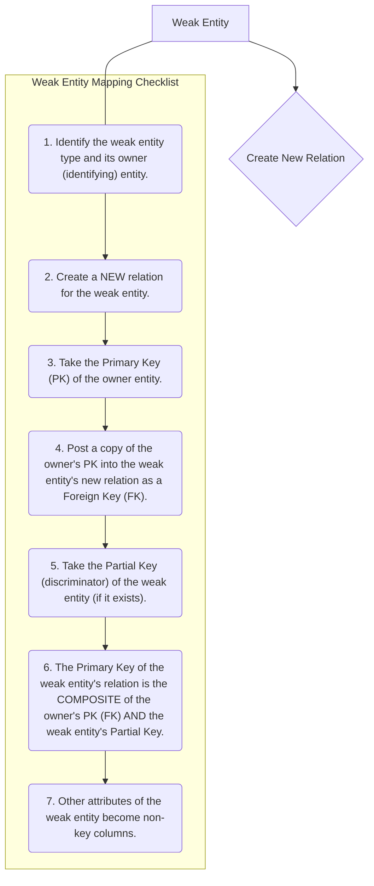

# Definition
Before proceeding, ensure you master [[Entity_Types]] and Identifying_Relationships.
Weak entity types are entities in an E-R model that cannot be uniquely identified by their own attributes alone. Instead, their identification is dependent on the primary key of another entity type, known as the "owner" or "identifying" entity, through an identifying relationship. When mapping weak entities to a relational model, a new relation is created for the weak entity, and its primary key is formed by combining its partial key (if it has one) with the primary key of its owner entity (which is posted as a foreign key). Think of it like a `Dependent` (`weak entity`) whose existence and unique identification rely entirely on a specific `Employee` (`owner entity`).

# The Mental Model
Imagine you're trying to uniquely identify a "Room Number" within a large building. A "Room Number" by itself (like '101') isn't unique across the whole campus. It only becomes unique when you know which "Building" it's in (e.g., 'Building A, Room 101'). Here, "Room" is the `weak entity`, and "Building" is the `owner entity`. When mapping, the "Room" table needs both its `RoomNumber` and the `BuildingID` from the "Building" table to form its complete, unique ID.

*Note: This `graph TD` diagram provides a "Pilot's Checklist" for mapping weak entity types. It clearly outlines the steps for creating a new relation, incorporating the owner entity's primary key as a foreign key, and forming a composite primary key for the weak entity.*

# Context & Framework
### System Architecture & Dependencies
Weak entities introduce a direct and mandatory dependency in the database schema. The relation representing the weak entity cannot exist without its owner entity, as its primary key is partly or wholly derived from the owner's primary key. This architectural choice enforces strong referential integrity, preventing "orphaned" weak entity records. For example, a `DEPENDENT` record requires an `EMPLOYEE` record, and its `DependentID` is unique only within that `EmployeeID`. This ensures a hierarchical structure where the owner entity provides the context for the weak entity's identity.

# The Mastery Deep Dive
### The "Pilot's Checklist" (Do Not Skip)
Mapping weak entities is a specific process that always involves combining keys.
- [ ] **1. Identify the Weak Entity and its Owner:** Clearly distinguish the weak entity type (e.g., `DEPENDENT`) and its identifying owner entity (e.g., `EMPLOYEE`).
- [ ] **2. Create a NEW Relation for the Weak Entity:** A separate table is always created for the weak entity. Its name should reflect the entity (e.g., `DEPENDENT`).
- [ ] **3. Take the Primary Key (PK) of the Owner Entity:** Obtain the unique identifier attribute(s) of the strong owner entity (e.g., `EmployeeID` from `EMPLOYEE`).
- [ ] **4. Post a Copy of the Owner's PK into the Weak Entity's Relation as a Foreign Key:** Add the owner's primary key as a column (or columns) to the new weak entity relation. This attribute(s) functions as a foreign key, referencing the owner entity's original relation.
- [ ] **5. Identify the Partial Key of the Weak Entity (if any):** The partial key (also called discriminator) is the attribute(s) that uniquely identifies instances of the weak entity *within the context of its owner*. For `DEPENDENT`, this might be `DependentName`.
- [ ] **6. Form the Composite Primary Key of the Weak Entity Relation:** The primary key of the weak entity's relation is the **composite of the owner's primary key (now a foreign key in the weak entity's table) AND the weak entity's partial key.** This composite key ensures global uniqueness.
    *Example*: For `DEPENDENT` (partial key `DependentName`) owned by `EMPLOYEE` (PK `EmployeeID`), the `DEPENDENT` table's PK is `(EmployeeID, DependentName)`.
- [ ] **7. Include Other Attributes:** Any other attributes of the weak entity become non-key columns in its new relation.

### Opening the Hood: What's Inside?
When we "open the hood" of a weak entity, we discover its identity is not self-contained. For an `ORDER_ITEM` (`weak entity`) that belongs to an `ORDER` (`owner entity`), its `ItemNumber` is only unique *within* a specific `ORDER`. To make `ORDER_ITEM` globally unique in a relational table, we *must* combine its `ItemNumber` (partial key) with the `OrderID` (primary key of its owner, `ORDER`). Thus, the `ORDER_ITEM` table's primary key becomes `(OrderID, ItemNumber)`. The `OrderID` also serves as a foreign key, explicitly linking it back to the `ORDER` table and solidifying its dependence.

# Constraints & Limitations
### The Engineering Trade-off
The engineering trade-off for weak entities is minor, primarily related to the size of the composite primary key. Since the owner's primary key is incorporated, a weak entity's primary key can become longer, potentially affecting index size and query performance slightly for very large tables. However, this is a necessary structural decision to ensure data integrity and unique identification, so the benefits far outweigh the minimal overhead. Strict adherence to this mapping rule is crucial.

# Significance & Application
Understanding and correctly mapping weak entities is crucial for database design, particularly when modeling real-world scenarios where some entities cannot exist independently (e.g., `LINE_ITEM` within an `INVOICE`, `ROOM` within a `BUILDING`, `VERSION` of a `PRODUCT`). Academically, it reinforces the concept of identification dependence. Practically, it ensures that all data instances have a proper, unique, and referentially sound identity within the database, preventing inconsistencies and enabling accurate data retrieval.

# The Worked Example
Let's map a weak entity:

**Scenario:** `ORDER_ITEM` (attributes: `ItemNumber` (partial key), `Quantity`) is a weak entity owned by `ORDER` (attributes: `OrderID` (PK), `OrderDate`):
*   `ItemNumber` is unique only within a given `OrderID`.

**Mapping Steps:**

1.  **Weak Entity:** `ORDER_ITEM`
    *   **Owner Entity:** `ORDER` (PK: `OrderID`)
    *   **Partial Key of Weak Entity:** `ItemNumber`
2.  **Create New Relation:** `ORDER_ITEM`
3.  **Post Owner PK as FK:** `OrderID` from `ORDER` is posted as `OrderID` (FK) in `ORDER_ITEM`.
4.  **Form Composite PK:** The primary key of `ORDER_ITEM` becomes `(OrderID, ItemNumber)`.
5.  **Other Attributes:** `Quantity` becomes a non-key column.

**Resulting Relations:**
*   `ORDER(OrderID, OrderDate)`
*   `ORDER_ITEM(OrderID (FK), ItemNumber, Quantity)`

# The Proving Ground
*Test your mastery. Cover the solutions below to test yourself first.*

### Level 1: The Tool Check (Verification)
**The Question:** Why is the primary key of a weak entity often dependent on its owner entity?
> **Solution:** Because a weak entity cannot be uniquely identified by its own attributes alone; its uniqueness requires the context provided by its owner entity's primary key.

### Level 2: The Routine Run (Mastery & Edge Cases)
**The Scenario:** Consider a `DEPENDENT` entity that is weak with respect to `EMPLOYEE`. If `DEPENDENT` has attributes `DependentName` and `Relationship`, and `EMPLOYEE` has `EmployeeID` (PK), describe how to form the primary key for the `DEPENDENT` relation.
> **Solution:** The primary key for the `DEPENDENT` relation will be a **composite key** consisting of:
> 1.  The primary key of the owner `EMPLOYEE` entity (`EmployeeID`), which will also be a foreign key in the `DEPENDENT` table.
> 2.  The partial key of the `DEPENDENT` entity (`DependentName`).
> So, the primary key of `DEPENDENT` would be `(EmployeeID, DependentName)`.

### Level 3: The Disaster Drill (Mastery & Edge Cases)
**The Scenario:** A weak entity `ORDER_ITEM` (attributes: `ItemNumber`, `Quantity`) is owned by `ORDER` (attributes: `OrderID`, `OrderDate`). A mapping was done such that `ORDER_ITEM`'s primary key is just `ItemNumber`. Explain why this creates an issue and how to correctly define the primary key.
> **Solution:**
> **Issue Created:** If `ORDER_ITEM`'s primary key is solely `ItemNumber`, it implies that `ItemNumber` must be unique across *all* orders. This is incorrect for a weak entity. For example, `ItemNumber '1'` for `OrderID '101'` is a different concept from `ItemNumber '1'` for `OrderID '102'`. Using just `ItemNumber` as the PK would prevent multiple orders from having an `ORDER_ITEM` with the same `ItemNumber`, or it would lead to overwriting existing `ORDER_ITEM` data if `ItemNumber` is reused across orders. This violates the unique identification requirement for each specific order item.
>
> **Correct Primary Key Definition:** The primary key of the `ORDER_ITEM` relation must be a **composite key** formed by combining the primary key of its owner entity (`OrderID`) with its own partial key (`ItemNumber`). Thus, the correct primary key would be `(OrderID, ItemNumber)`. This ensures that each `ORDER_ITEM` is uniquely identified within the context of a specific `ORDER`.

# Key Takeaways
*   Weak entities cannot be uniquely identified without their owner entity.
*   Mapping involves creating a new relation for the weak entity.
*   The primary key of the weak entity's relation is a composite key, combining its partial key with the primary key of its owner entity (as a foreign key).

# Knowledge Graph Connections
| Concept                     | Connection / Relationship                                                                                                       |
| :
-------------------------- | :
-------------------------------------------------------------------------------------------------------------------------------------- |
| [[Mapping_Relationships_to_Relations]] | This is a specific mapping technique for identifying (weak) relationships within the overall E-R to relational translation.           |
| [[Entity_Types]]            | Weak entities are a specific type of entity that requires unique handling during mapping.                                               |
| Identifying_Relationships | Weak entities are always connected to their owner via an identifying relationship, which is key to their mapping.                       |
| Primary_Keys            | The formation of a composite primary key is central to correctly mapping weak entities.                                                 |
| Foreign_Keys            | The primary key of the owner entity becomes a foreign key in the weak entity's relation, establishing the dependency.                   |
| Composite_Keys          | Weak entities inherently rely on composite keys for unique identification in the relational model.                                      |
---