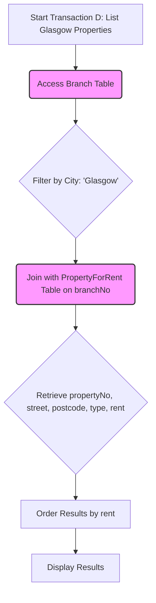

# Definition
Before proceeding, ensure you master Database_Workload and Performance_Optimization because `Analyzing_Transactions` fundamentally involves understanding the workload to optimize performance.
`Analyzing_Transactions` is the process of understanding the functionality and characteristics of the operations (transactions) that will run on the database, particularly focusing on their frequency, impact on performance, and criticality to the business. This analysis identifies which parts of the database are most heavily used, which attributes are frequently updated or searched, and when the database experiences `peak load`. The goal is to gather crucial information for making informed decisions about `file organizations`, `indexes`, and other physical design elements to achieve optimal `Performance_Optimization`. A simpler way to think about it is studying how people use a popular public library: do they mostly check out new books, return old ones, or look up specific authors? Knowing this helps you organize the library (database) to best serve their needs.

# The Mental Model
Imagine you're running a very busy restaurant. `Analyzing_Transactions` is like observing your kitchen and dining room during a typical shift. You note:
*   What dishes are ordered most frequently (`transactions that run frequently`)?
*   Which tasks cause bottlenecks (`significant impact on performance`)?
*   When are you busiest (`peak load`)?
*   What ingredients are used most (`attributes that are updated`)?
This understanding helps you re-organize your kitchen (database) layout, staff scheduling (resource allocation), and ingredient storage (file organization/indexes) to keep things running smoothly.

# Context & Framework
### System Architecture & Dependencies
`Analyzing_Transactions` is a foundational activity within the `Designing_File_Organizations_and_Indexes` phase of `Physical_Database_Design`. The output of this analysis – a detailed understanding of the `Database_Workload` – directly informs decisions regarding `Choosing_File_Organizations` and `Choosing_Indexes`. It also provides critical input for `Estimating_Disk_Space_Requirements` and for subsequent `Monitoring_and_Tuning_Operational_Systems`. Without accurate transaction analysis, physical design choices would be based on guesswork, leading to suboptimal performance and potential scalability issues in the `DBMS_Implementation`.

# The Mastery Deep Dive
### The "Pilot's Checklist": Understanding Database Workload
To effectively `Analyze_Transactions`, a systematic approach is necessary to understand the `Database_Workload` and identify performance-critical areas. The process involves:
1.  **Identifying Performance Criteria:**
    *   **Frequently Running Transactions:** Which transactions occur most often? These are prime candidates for `Performance_Optimization`.
    *   **Transactions with Significant Performance Impact:** Even if not frequent, some transactions (e.g., complex reports, bulk updates) can heavily consume resources and should be optimized.
    *   **Critical Business Transactions:** Transactions that are essential for the business (e.g., placing an order, processing a payment) must be highly performant and reliable.
    *   **Peak Load Times:** Identifying periods of high demand (e.g., end-of-month reporting, holiday sales) allows for designing systems that can handle maximum stress.
2.  **Mapping Transaction Paths:**
    *   **Transaction/Relation Cross-Reference Matrix:** A tabular representation showing which transactions access which `base relations` and what type of access (`INSERT`, `READ`, `UPDATE`, `DELETE`) is performed. This helps visualize dependencies and identify heavily used tables.
    *   **Transaction Usage Map:** A diagram (often a `flowchart TD` or similar) illustrating the flow of transactions and their interaction with different relations, often annotating with average and peak usage statistics. This provides a visual overview of data flow and hotspots.
3.  **Analyzing Data Usage:**
    *   **Attributes Updated:** Identifying which attributes are frequently modified helps in making decisions about `indexing` (avoid indexing frequently updated columns unless absolutely necessary).
    *   **Search Criteria Used:** Understanding the `WHERE` clauses of queries (e.g., `WHERE customerName = 'X'`) helps in designing effective `indexes`.
    *   **Ordering and Grouping:** Attributes used in `ORDER BY` or `GROUP BY` clauses are also strong candidates for `indexing` to speed up sorting and aggregation.

This comprehensive analysis helps pinpoint specific parts of the database that are likely to cause `Performance_Optimization` problems if not physically designed correctly.

# Constraints & Limitations
### The Engineering Trade-off: Comprehensive Analysis vs. Resource Constraints
A significant constraint in `Analyzing_Transactions` is the practical impossibility of analyzing *every single transaction* in a complex system due to time and resource limitations. This forces an engineering trade-off: focus on the "most important" transactions. However, this introduces the risk of overlooking less frequent but critical transactions or unexpected `workload` patterns. Furthermore, the `workload` can change over time, rendering initial analyses obsolete. The challenge lies in developing a robust methodology for identifying the genuinely critical transactions (often using `transaction/relation cross-reference matrix` and `transaction usage maps`), and then having mechanisms (like `monitoring and tuning operational systems`) to adapt the physical design as the workload evolves, ensuring the database remains performant without incurring excessive analysis costs.

# Significance & Application
`Analyzing_Transactions` is foundational to effective `Physical_Database_Design` and `Performance_Optimization`. Academically, it emphasizes the importance of data-driven decision-making in system design. In the real world, it enables:
*   **Targeted Optimization:** By identifying hotspots and critical transactions, resources (e.g., `indexes`, faster hardware) can be applied precisely where they will have the greatest impact, avoiding wasted effort.
*   **Proactive Problem Solving:** Anticipating performance bottlenecks before implementation or during `monitoring and tuning operational systems` allows for proactive design adjustments, preventing costly outages or slowdowns.
*   **Efficient Resource Allocation:** Understanding `peak load` helps in provisioning appropriate hardware and software resources, avoiding over- or under-provisioning.
*   **Improved User Experience:** A database optimized for its actual workload translates directly to faster application response times and a better user experience. Without this analysis, physical design is effectively blind, leading to a database that might be technically sound but practically unusable under real-world loads.

# The Worked Example
### Example: Using a Transaction Analysis Form and Usage Map
Consider a `PropertyForRent` database. We want to analyze a specific transaction (D): "List the property number, address, type, and rent of all properties in Glasgow, ordered by rent."

**1. Transaction Analysis Form (Summary):**
*   **Transaction:** (D) List the property number, address, type, and rent of all properties in Glasgow, ordered by rent.
*   **Transaction Volume:** Average: 50 per hour; Peak: 100 per hour (17.00 - 19.00 Mon-Sat).
*   **SQL Query:**
    ```sql
    SELECT propertyNo, p.street, p.postcode, type, rent
    FROM Branch b INNER JOIN PropertyForRent p ON b.branchNo = p.branchNo
    WHERE p.city = 'Glasgow'
    ORDER BY rent;
    ```
*   **Predicate:** `p.city = 'Glasgow'`
*   **Join Attributes:** `b.branchNo = p.branchNo`
*   **Ordering Attribute:** `rent`
*   **Attributes Updated:** `none`

**2. Transaction Usage Map (Simplified View for Transaction D):**
The transaction usage map would visually depict the flow and interaction. For Transaction D, it starts from a general request, accesses `Branch` (to get relevant branch numbers for Glasgow, assuming city is linked to branch), then `PropertyForRent` (to get property details and filter by city/join with branch).


```text
// Scenario 1: Tracing Transaction D
// Output:
// (Visual representation of the flowchart illustrating the steps of Transaction D.)
// Start Transaction D -> Access Branch Table -> Filter by City: 'Glasgow' -> Join with PropertyForRent Table -> Retrieve property details -> Order Results by rent -> Display Results.
// (Highlights `Branch Table` and `PropertyForRent Table` as key entities accessed.)
```
*Note: The `Transaction Usage Map` above is a simplified `flowchart TD` focusing on the steps for Transaction D. A full usage map would show all transactions and their interactions with relations, along with cardinality and frequency data, like the example in the lecture slides (Figure 17.4).*

**Analysis for `Physical_Database_Design` Decisions:**
*   **`PropertyForRent` and `Branch` are key relations:** These tables are accessed by this transaction.
*   **`p.city` and `p.branchNo` in `PropertyForRent` are frequently used in `WHERE` and `JOIN` clauses:** Strong candidates for `secondary indexes`.
*   **`rent` in `PropertyForRent` is used for `ORDER BY`:** Another strong candidate for a `secondary index` (or `clustering index` if appropriate) to speed up sorting.
*   **The transaction is read-only (`Attributes updated: none`):** This means `indexing` overhead on updates is not a concern for *this specific transaction*, making indexes more appealing.
*   **High `peak load` (100 per hour):** Emphasizes the need for efficient access to prevent slowdowns.

This analysis would then feed directly into `Choosing_File_Organizations` and `Choosing_Indexes`.

# The Proving Ground
*Test your mastery. Cover the solutions below to test yourself first.*

### Level 1: The Sanity Check (Verification)
**The Question:** What are two specific types of diagrams or matrices that can be employed to identify which relations are most heavily used or accessed by various transactions?
> **Solution:** A `transaction/relation cross-reference matrix` and a `transaction usage map`.

### Level 2: The Crucible (Mastery & Edge Cases)
**The Scenario:** An online game database has a `PlayerScore` table that records `PlayerID`, `GameID`, `Score`, and `Timestamp`. The two most important types of transactions are:
    1.  **Real-time Score Update:** `UPDATE PlayerScore SET Score = X WHERE PlayerID = Y AND GameID = Z;` (occurs constantly during gameplay).
    2.  **Leaderboard Display:** `SELECT PlayerID, Score FROM PlayerScore WHERE GameID = A ORDER BY Score DESC LIMIT 100;` (accessed frequently by many users).
**The Challenge:** Based on `Analyzing_Transactions` principles, identify which attributes in the `PlayerScore` table are prime candidates for:
    (a) `Indexing` to support `WHERE` clause conditions.
    (b) `Indexing` to support `ORDER BY` clauses.
    (c) Attributes that should be `carefully considered` before indexing due to high update frequency.
> **Solution:**
> (a) **Attributes for `WHERE` clause indexing:** `PlayerID` and `GameID` (from the update transaction).
> (b) **Attributes for `ORDER BY` clause indexing:** `Score` (from the leaderboard display transaction). A composite index on `(GameID, Score DESC)` would be particularly effective for the leaderboard.
> (c) **Attributes for careful consideration before indexing:** `Score` (as it's frequently updated by the real-time score update transaction). While indexing `Score` is critical for the leaderboard, the high update frequency means each score change requires updating the index, which adds overhead. This highlights a classic trade-off where the benefits for reads must outweigh the costs for writes.

### Level 3: Mastery (The Crucible)
**The Scenario:** A new social media platform needs to analyze user engagement. They have `Post` records (`PostID`, `UserID`, `Timestamp`, `Likes`, `CommentsCount`). Two crucial operational needs are:
    1.  **User Feed Generation:** Fetching a user's `Posts` ordered by `Timestamp` in descending order.
    2.  **Trending Posts:** Identifying `Posts` with the highest `Likes` count within the last 24 hours.
**The Constraint:** The data volume is expected to be massive (billions of posts), and the database cannot afford to perform full table scans for these operations.
**The Challenge:**
(a) For **User Feed Generation**, describe the ideal `indexing strategy` and explain why it's optimal, considering both the `WHERE` clause (implicit `UserID` filter) and the `ORDER BY` (`Timestamp DESC`).
(b) For **Trending Posts**, describe the ideal `indexing strategy` and explain its optimization, considering the `WHERE` clause (`Timestamp` range) and `ORDER BY` (`Likes DESC`).
(c) Given that `Likes` and `CommentsCount` are frequently updated, discuss the `trade-offs` and potential `performance problems` this might introduce for your proposed indexes, and how you might manage them in a very high-volume system.
> **Solution:**
> (a) **User Feed Generation:**
>     *   **Ideal Indexing Strategy:** A **composite `secondary index` on `(UserID, Timestamp DESC)`**.
>     *   **Explanation:** This index allows the DBMS to efficiently locate a specific user's posts (`UserID`) and then retrieve them pre-sorted by `Timestamp` in descending order, directly from the index. This avoids a separate sort operation, which is highly beneficial for large datasets.
> (b) **Trending Posts:**
>     *   **Ideal Indexing Strategy:** A **composite `secondary index` on `(Timestamp DESC, Likes DESC)`**.
>     *   **Explanation:** This index allows for efficient range queries on `Timestamp` (e.g., last 24 hours) and then provides the `Likes` count in descending order within that range, again avoiding a full table scan and a separate sort.
> (c) **Trade-offs and Management for Frequently Updated Attributes (`Likes`, `CommentsCount`):**
>     *   **Trade-offs/Performance Problems:** When `Likes` or `CommentsCount` (if indexed) are updated, the corresponding index entries must also be updated. In a high-volume system with billions of posts and frequent updates (e.g., likes changing constantly), this can lead to:
>         *   **Increased Write Overhead:** Every `LIKE` operation becomes an `UPDATE` on the `Posts` table *and* an update on the `(Timestamp DESC, Likes DESC)` index, slowing down write transactions.
>         *   **Index Fragmentation:** Frequent updates and deletes can cause indexes to become fragmented, degrading read performance over time.
>         *   **Lock Contention:** Updates to heavily accessed index pages can lead to lock contention, slowing down concurrent operations.
>     *   **Management Strategies:**
>         *   **Sacrifice `CommentsCount` Index:** If `CommentsCount` is not as critical for real-time `ORDER BY`, avoid indexing it to reduce write overhead.
>         *   **Asynchronous Updates for `Likes`:** For `Likes`, consider an `asynchronous updating mechanism` for the index or the `Likes` counter itself. For example, instead of immediately updating the `Likes` count in the `Posts` table and its index for every single like, aggregate likes in a temporary cache and then apply batch updates to the database (and thus the index) every few seconds or minutes. This allows reads to be slightly stale but greatly reduces write contention.
>         *   **Materialized Views for Trending:** For `Trending Posts`, a `materialized view` or a dedicated `cache` that is *periodically refreshed* (e.g., every 5 minutes) might be more suitable than a live index. This provides fast reads for trending data at the cost of slight staleness, offloading the real-time aggregation and sorting burden from the primary `Posts` table and its indexes.

# Key Takeaways
*   `Analyzing_Transactions` identifies `workload` characteristics, critical operations, and `peak load` times.
*   Tools like `transaction/relation cross-reference matrices` and `transaction usage maps` help map data access patterns.
*   It's crucial for `Performance_Optimization` and informs decisions on `file organizations` and `indexes`.
*   The process involves trade-offs, especially for frequently updated attributes that are also candidates for indexing.

# Knowledge Graph Connections
| Concept                          | Connection / Relationship                                                                                              |
| :
------------------------------- | :
--------------------------------------------------------------------------------------------------------------------- |
| Database_Workload            | The primary input to transaction analysis, describing the types and frequencies of operations on the database.         |
| Performance_Optimization     | Transaction analysis directly supports performance optimization by identifying bottlenecks and critical paths.           |
| [[Designing_File_Organizations_and_Indexes]] | The insights from transaction analysis are crucial for making informed decisions about file organizations and indexes. |
| File_Organization_Strategies | Knowledge of transaction patterns helps in choosing the most suitable file organization for each relation.             |
| Indexing_Strategies          | Understanding search criteria, order-by clauses, and update frequencies guides the selection of appropriate indexes.   |
| Peak_Load                    | Identifying peak load times helps design the database to handle maximum demand without performance degradation.        |
---