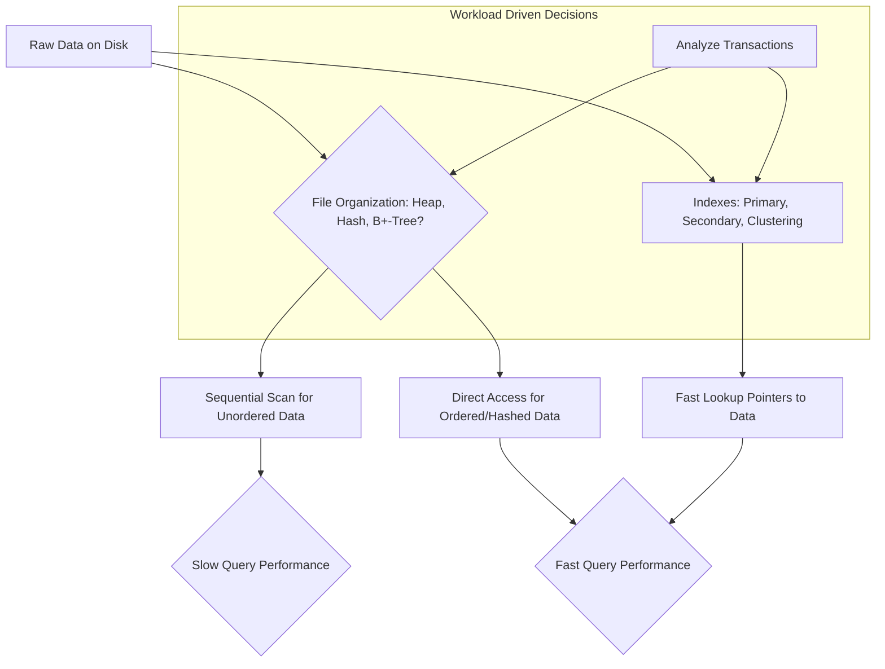

# Definition
Before proceeding, ensure you master Secondary_Storage and Performance_Optimization because `Designing_File_Organizations_and_Indexes` fundamentally dictates how data is stored and accessed to optimize performance on secondary storage.
`Designing_File_Organizations_and_Indexes` is the process of determining the optimal strategies for storing base relations (tables) and creating access structures (indexes) on secondary storage to achieve acceptable performance. This involves deciding how records (tuples) will be physically arranged on disk (`file organizations`) and which auxiliary data structures (`indexes`) will be used to speed up data retrieval. The goal is to optimize the way data is accessed and processed based on the typical workload and transaction patterns of the database. A simpler way to think about it is organizing a massive library: file organization is about how books are physically arranged on shelves, while indexes are like the card catalog or a sophisticated search engine that quickly points you to the exact book you need.

# The Mental Model
Imagine you have thousands of records of student data. `Designing_File_Organizations_and_Indexes` is like building a smart physical storage system for them.
*   **File Organization:** Do you just pile the records randomly (Heap file), sort them alphabetically by name (Sequential file), or use a system where you can go directly to a record based on their ID (Hash file)?
*   **Indexes:** Beyond the main organization, do you create a separate "lookup table" (index) for quick searches by student ID, or by major, even if the main pile isn't sorted that way? The goal is to make sure students (users) can find specific records (data) as quickly as possible.

# Context & Framework
### System Architecture & Dependencies
`Designing_File_Organizations_and_Indexes` is a cornerstone of `Physical_Database_Design`, directly impacting the `DBMS_Implementation`'s read/write performance. It relies heavily on insights gained from `Analyzing_Transactions` to understand the database's `workload` and access patterns. The chosen `file organizations` dictate how tuples are physically stored, while `indexes` create fast access paths to those tuples. Both are critical for `Performance_Optimization` and influence `Estimating_Disk_Space_Requirements`. This phase essentially defines the low-level data access strategy within the overall database architecture.

# The Mastery Deep Dive
### How the Parts Talk to Each Other: Storage, File Organization, and Indexes
The core objective of `Designing_File_Organizations_and_Indexes` is to optimize how data is physically stored and accessed to ensure the database operates efficiently under its typical `workload`.
*   **File Organizations:** These determine the physical layout of data records (`tuples`) on `secondary storage`. Different organizations (e.g., `Heap`, `Hash`, `ISAM`, `B+-Tree`, `Clusters`) offer varying strengths in terms of insertion speed, sequential access, and direct record retrieval. Choosing the right one is paramount.
*   **Indexes:** These are auxiliary data structures that provide fast access paths to data records based on the values of one or more attributes. Instead of scanning an entire table, an index allows the DBMS to directly locate relevant records. `Indexes` are essential for `Performance_Optimization` for query operations.

The interaction between these components is critical:
1.  **Understand Workload:** First, it's mandatory to `Analyze_Transactions` to understand the database's `workload` (frequent queries, updates, `peak load`).
2.  **Choose File Organizations:** Based on the workload, decide on the most efficient `file organization` for each `base relation`.
3.  **Choose Indexes:** Then, determine where `indexes` (e.g., `primary`, `clustering`, `secondary`) are needed to further improve query performance without incurring excessive overhead for updates or storage.
4.  **Estimate Disk Space:** Finally, `Estimate_Disk_Space_Requirements` to ensure enough physical storage is allocated for both the data and the chosen indexes.
This iterative process ensures that data is not only stored but also retrieved and managed in the most performant way possible.

# Constraints & Limitations
### The Engineering Trade-off: Read Speed vs. Write Speed vs. Storage
The primary constraint in `Designing_File_Organizations_and_Indexes` is navigating the complex `Performance_Optimization` trade-offs among `read speed`, `write speed`, and `storage space`.
*   **Read Speed:** `Indexes` are excellent for accelerating read operations (queries) by providing fast lookup paths.
*   **Write Speed:** However, every index created adds overhead to write operations (`INSERT`, `UPDATE`, `DELETE`), as the index itself must also be updated. Too many indexes can significantly degrade write performance.
*   **Storage Space:** `Indexes` consume additional `secondary storage`. A database with many indexes will require more disk space than one with fewer.
The choice of `file organization` also impacts these factors. A `Heap` file is fast for insertions but slow for reads, while a `B+-Tree` offers a good balance. The challenge is to optimize for the most critical operations (e.g., frequent reads, or rapid inserts) while minimizing negative impacts on other aspects, all within budget for storage and acceptable performance thresholds. This often involves careful profiling and `monitoring and tuning operational systems`.

# Significance & Application
`Designing_File_Organizations_and_Indexes` is absolutely critical for the operational speed and scalability of any database. Academically, it illustrates the practical application of data structures and algorithms in a large-scale system. In the real world, effective design in this area directly translates to:
*   **High Query Performance:** Users experience fast response times, enabling interactive applications and rapid reporting.
*   **Efficient Data Access:** Applications can retrieve specific data records or ranges quickly, minimizing latency.
*   **Scalability:** The database can handle increasing volumes of data and higher transaction loads without degrading performance unacceptably.
*   **Reduced Hardware Costs:** Optimized access methods can reduce the need for more expensive hardware by making existing resources more efficient.
Conversely, poor file organization and missing or incorrectly designed indexes are primary causes of slow database performance, leading to frustrated users and inefficient operations, even with a perfectly logical design.

# The Worked Example
### Example: Impact of File Organization and Indexing on Query Performance
Consider a simple `Customer` table with `CustomerID` (Primary Key), `CustomerName`, `City`, and `JoinDate`.
**Scenario 1: `Heap` File Organization (No Index)**
*   Data is stored in the order it's inserted, without any logical sorting.
*   **Query:** `SELECT * FROM Customer WHERE CustomerName = 'Alice';`
*   **Performance:** Requires a full table scan. The DBMS must read every record from disk to find 'Alice', which is extremely slow for large tables.

**Scenario 2: `B+-Tree` File Organization on `CustomerID` (Primary Index)**
*   Data records are physically ordered by `CustomerID`, and a `B+-Tree` index is built on `CustomerID`.
*   **Query:** `SELECT * FROM Customer WHERE CustomerID = 12345;`
*   **Performance:** Very fast. The `B+-Tree` index allows the DBMS to quickly navigate to the exact block containing `CustomerID = 12345` with minimal disk I/O (logarithmic time complexity).

**Scenario 3: `B+-Tree` File Organization on `CustomerID`, plus a `Secondary Index` on `CustomerName`**
*   **Query:** `SELECT * FROM Customer WHERE CustomerName = 'Bob';`
*   **Performance:** Faster than Scenario 1. The secondary index on `CustomerName` allows the DBMS to quickly find the `CustomerID`s corresponding to 'Bob', then use the primary index (or direct access if data pointers are included) to retrieve the full customer records. This avoids a full table scan, but might involve two index lookups (one for the secondary index, one for the primary index if data is not directly in the secondary index leaf nodes).

**Illustrative `Mermaid` Diagram:**


```text
// Scenario 1: Interplay of Storage and Access Methods
// Output:
// (Visual representation of the graph diagram showing how raw data is handled by file organizations, leading to sequential or direct access, which impacts query performance.)
// (Also shows that indexes provide fast lookup pointers, also leading to fast query performance.)
// (The 'Workload Driven Decisions' subgraph highlights that `Analyze Transactions` influences choices for both `File Organization` and `Indexes`.)
```
*Note: This `graph TD` illustrates the high-level relationship between raw data, file organizations, and indexes in impacting query performance. The decision to use a particular file organization or index is always driven by `Analyzing_Transactions` to understand the database's `workload`.*

# The Proving Ground
*Test your mastery. Cover the solutions below to test yourself first.*

### Level 1: The Sanity Check (Verification)
**The Question:** What is the overarching objective when making decisions about `file organizations` and `indexes` during physical database design?
> **Solution:** The overarching objective is to determine optimal `file organizations` to store base relations and the `indexes` required to achieve acceptable `Performance_Optimization`, specifically how relations and tuples will be held on `secondary storage`.

### Level 2: The Crucible (Mastery & Edge Cases)
**The Scenario:** A high-volume logging database stores `LogEntry` records with `LogID` (PK), `Timestamp`, `Severity`, `Message`. New log entries are inserted at a rate of thousands per second. The most frequent query retrieves log entries for a specific `LogID`, while a less frequent but critical operation involves analyzing all 'Error' severity messages within a given `Timestamp` range.
**The Challenge:**
1.  Explain why a simple `Heap` file organization, despite its fast insertion, would be inadequate for this scenario.
2.  Propose a combined strategy of `file organization` and `indexing` that would best balance the high insertion rate with the need for efficient retrieval by `LogID` and ranged `Timestamp`/`Severity` queries.
> **Solution:**
> 1.  **Inadequacy of Heap File:** While a `Heap` file is fast for insertions, retrieving by `LogID` would require a full table scan, becoming prohibitively slow for thousands of records per second. Similarly, querying by `Timestamp` range and `Severity` would also involve scanning large portions of the table, making the critical analysis operations inefficient.
> 2.  **Combined Strategy:**
>     *   **File Organization:** A **`B+-Tree` file organization** on the `LogID` (as the primary key). This offers a good balance, providing efficient insertions (logarithmic time) and extremely fast direct lookups by `LogID`.
>     *   **Indexing:** In addition to the primary index (if `B+-Tree` is chosen for the file organization), a **`secondary index` on `(Timestamp, Severity)`** (composite index) would significantly speed up the critical range queries for 'Error' messages within a specific time frame. The index would allow the DBMS to quickly narrow down to the relevant `Timestamp` range and then filter by `Severity` within the index structure.

### Level 3: Mastery (The Crucible)
**The Scenario:** A university enrollment system has a `Student` table with `StudentID` (PK), `StudentName`, `Major`, `GPA`. The table is extremely large (hundreds of thousands of students).
**The Constraint:** The two most critical and frequent operations are:
    1.  Looking up student details by `StudentID` (millions of times a day).
    2.  Generating lists of students by `Major` in alphabetical order (hundreds of times a day, for departmental reports).
**The Challenge:** The current `file organization` is a `B+-Tree` on `StudentID`. Propose a strategy that optimizes *both* critical operations as much as possible, specifically considering the use of `primary`, `clustering`, and `secondary` indexes. Explain why your chosen approach is superior to just having a primary index on `StudentID` or a secondary index on `Major`.
> **Solution:**
> The current `B+-Tree` on `StudentID` already optimizes operation 1 (lookup by `StudentID`). To optimize both operations:
>
> **Proposed Strategy:**
> 1.  **Primary Index/File Organization:** Maintain the existing `B+-Tree` file organization (and thus the primary index) on `StudentID`. This is essential for very fast, direct lookups by `StudentID`.
> 2.  **Clustering Index:** Create a **`Clustering Index` on `Major`**.
> *   **Explanation:** A clustering index physically reorders the data rows on disk according to the indexed attribute (`Major` in this case). This means all students within the same `Major` would be stored together physically on disk, and within each major, they might be further sorted (e.g., by `StudentName` or `GPA` if specified in the clustering index definition).
> *   **Why it's superior:**
>     *   For operation 2 (listing students by `Major` in alphabetical order), a clustering index on `Major` would be **highly efficient**. The DBMS would only need to read contiguous blocks of data from disk, as all records for a given `Major` are grouped together. This minimizes disk I/O and avoids expensive sorts. A mere `secondary index` on `Major` would still require multiple random disk I/Os to fetch individual student records if they are scattered across different physical locations, even if the index itself is ordered.
>     *   While a relation can only have one clustering index, the `B+-Tree` on `StudentID` ensures efficient random access for primary key lookups. The trade-off is that insertions into the `Student` table would now involve maintaining two ordered structures (the primary index on `StudentID` and the physically clustered data by `Major`), which adds some overhead. However, the gains for highly frequent, range-based and sorted queries by `Major` would likely outweigh this.

# Key Takeaways
*   `Designing_File_Organizations_and_Indexes` optimizes data storage and retrieval on `secondary storage` for `Performance_Optimization`.
*   `File organizations` dictate physical data layout, while `indexes` provide fast access paths.
*   This process requires `Analyzing_Transactions` to understand `workload` and involves `Performance_Optimization` trade-offs between read speed, write speed, and storage.

# Knowledge Graph Connections
| Concept                     | Connection / Relationship                                                                                              |
| :
-------------------------- | :
--------------------------------------------------------------------------------------------------------------------- |
| Secondary_Storage       | File organizations and indexes determine how data is physically stored and accessed on secondary storage devices.      |
| Performance_Optimization | The primary goal of designing file organizations and indexes is to achieve optimal database performance.               |
| [[Analyzing_Transactions]]  | Transaction analysis provides the necessary workload information to make informed decisions about file organizations and indexes. |
| [[Choosing_File_Organizations]] | This specific decision involves selecting the best physical arrangement for data records on disk.                     |
| [[Choosing_Indexes]]        | This specific decision involves creating auxiliary data structures to speed up data retrieval operations.              |
| [[Estimating_Disk_Space_Requirements]] | The choice of file organizations and indexes directly impacts the overall disk space needed for the database.    |
---