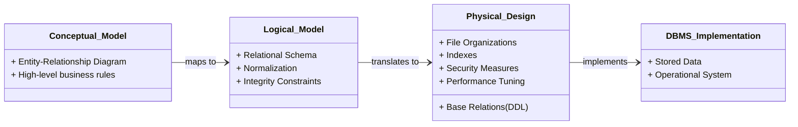

# Definition
Before proceeding, ensure you master [[Conceptual_Database_Design]] and [[Logical_Database_Design]] because Physical Database Design fundamentally relies on these preceding stages to create an executable database schema.
Physical Database Design is the process of producing a description of the implementation of the database on secondary storage. It describes the base relations, file organizations, and indexes used to achieve efficient access to the data, and any associated integrity constraints and security measures. A simpler way to think about it is like building a house: logical design creates the blueprint and layout (what rooms are needed), while physical design specifies the actual materials, construction techniques, and infrastructure (how to build it to be strong and efficient).

# The Mental Model
Imagine you've meticulously planned a library (logical design), deciding which sections to have and how books relate to each other. Now, `Physical_Database_Design` is about *actually building* that library. It involves choosing the type of shelves (file organization), how to label and sort books for quick retrieval (indexing), deciding where the librarian's desk goes for security (user views/security), and figuring out the building's capacity (disk space). It's the tangible construction that makes the theoretical library functional.


```text
// Scenario 1: Design Flow
// Output:
// (Visual representation of the class diagram showing the progression from Conceptual Model to Logical Model, then to Physical Design, and finally to DBMS Implementation.)
// This diagram illustrates the sequential flow in database design. The Conceptual Model defines entities and relationships, which are then formalized into a Relational Schema (Logical Model). The Physical Design translates this logical schema into concrete DBMS constructs (tables, indexes, security), which are then implemented as the actual operational database (DBMS Implementation).
```
*Note: This `classDiagram` illustrates the high-level progression from conceptual modeling to the final DBMS implementation, highlighting the role of Physical Design as the bridge.*

# Context & Framework
### System Architecture & Dependencies
`Physical_Database_Design` serves as the critical bridge between the abstract data models (conceptual and logical) and the concrete implementation within a Database Management System (DBMS). It is inherently dependent on the decisions made in the `Logical_Database_Design` phase, where the "what" of the data (entities, attributes, relationships) is established. Physical design then translates this "what" into the "how" – determining the physical storage structures, access methods, and security protocols tailored for a specific DBMS and its underlying hardware. This deep dependency ensures that the resulting physical database accurately reflects the business requirements while optimizing for performance.

# The Mastery Deep Dive
### The Exploded View: What's Inside?
At its core, `Physical_Database_Design` involves a multi-faceted approach to realizing a database. It begins with **translating the logical data model**, which means mapping the relational schema (tables, columns, keys) into Data Definition Language (DDL) commands for the chosen DBMS. This includes defining `base relations` (tables), designing the representation of `derived data` (e.g., whether to store a calculated value or compute it on the fly), and establishing `general constraints` (rules that maintain data integrity beyond basic key constraints). This foundational step ensures that the logical blueprint is accurately reflected in the physical structure, setting the stage for subsequent optimizations.

### Component Interactions: How the Parts Talk to Each Other
The various components of physical design interact to form a cohesive, efficient system. `File organizations` determine the physical arrangement of data records on disk, impacting how quickly entire tables can be scanned or specific records accessed. `Indexes` then act as accelerators, providing quick pointers to data records based on specific attribute values, thus speeding up queries significantly. `Security measures` are integrated to control who can access what data and how, while `user views` offer customized perspectives of the data without altering the underlying structure. Finally, `controlled redundancy` can be introduced through `denormalization` to enhance performance for frequently accessed data, balancing the benefits of normalization with the need for speed. All these elements must be harmonized to achieve optimal database performance and security.

# Constraints & Limitations
### The Engineering Trade-off: Performance vs. Storage vs. Complexity
Physical database design inherently involves managing complex trade-offs. Optimizing for `query performance` often means creating numerous `indexes` or introducing `controlled redundancy` through `denormalization`. However, indexes consume additional `disk storage`, and redundancy can complicate `data consistency` and `update operations`. Conversely, a highly normalized design (minimal redundancy) simplifies updates and maintains high data integrity but might lead to slower query performance due to extensive `join` operations. The challenge lies in finding the optimal balance that meets the application's specific performance requirements while managing storage costs and maintaining a reasonable level of complexity for administration and development.

# Significance & Application
`Physical_Database_Design` is paramount for the operational efficiency and long-term viability of any database system. Academically, it bridges theoretical database concepts with practical implementation challenges. In the real world, effective physical design directly translates to: **high performance** (fast query response times, efficient data processing), **scalability** (ability to handle increasing data volumes and user loads), **data integrity** (enforcing business rules and preventing inconsistencies), and **robust security** (controlling access and protecting sensitive information). A poorly designed physical database can lead to slow applications, frustrated users, increased hardware costs, and even data loss, underscoring its critical importance for database administrators, developers, and system architects.

# The Worked Example
### Example: Choosing a File Organization for a High-Volume Transaction System
Consider an online banking system where the `Transactions` table is extremely large (billions of rows) and experiences:
1.  **Very frequent insertions:** New transactions are added continuously.
2.  **Frequent retrievals by `TransactionID` (Primary Key):** Users checking their specific transaction history.
3.  **Less frequent, but still important, retrievals by `AccountID` and `TransactionDate` range:** For statements and fraud detection.

**Analysis:**
*   A simple `Heap` file organization would be poor for retrievals as it's unordered, requiring full table scans for most queries.
*   An `Indexed Sequential Access Method (ISAM)` or `B+-Tree` would be better for `TransactionID` lookups. A `B+-Tree` is generally preferred for very high-volume, dynamic data due to its self-balancing nature, which handles insertions and deletions gracefully without requiring periodic reorganization, unlike ISAM.

**Decision for File Organization:**
Given the high volume of insertions and the need for efficient retrieval by `TransactionID`, a **`B+-Tree` file organization** on the `TransactionID` is the most suitable choice. This will provide:
*   **Fast insertions:** Logarithmic time complexity for insertions, as the tree self-balances.
*   **Fast `TransactionID` lookups:** Logarithmic time to traverse the tree to find a specific transaction.

**Illustrative `CREATE TABLE` Snippet (Conceptual):**

```sql
-- Conceptual DDL for a Transactions table with a B+-Tree file organization.
-- Actual syntax varies significantly by DBMS (e.g., PostgreSQL, Oracle, SQL Server).
-- This example illustrates the intent.

CREATE TABLE Transactions (
    TransactionID       BIGINT PRIMARY KEY, -- Primary key for unique identification
    AccountID           BIGINT NOT NULL,    -- Foreign key to Accounts table
    TransactionDate     TIMESTAMP NOT NULL, -- Date and time of transaction
    Amount              DECIMAL(18, 2) NOT NULL, -- Transaction amount
    TransactionType     VARCHAR(50) NOT NULL, -- e.g., 'Deposit', 'Withdrawal', 'Transfer'
    Description         VARCHAR(255)
)
-- The file organization is typically specified outside the CREATE TABLE statement
-- or implicitly managed by the DBMS when a PRIMARY KEY is defined.
-- Example (conceptual, not standard SQL):
-- WITH FILE_ORGANIZATION = B_PLUS_TREE ON (TransactionID);

-- We would then add indexes for other frequent search criteria
-- For AccountID and TransactionDate range queries:
-- CREATE INDEX idx_account_date ON Transactions (AccountID, TransactionDate);
```
```text
// Scenario 1: Applying a B+-Tree organization
// Output:
// The `CREATE TABLE` statement defines the schema for the `Transactions` table, including data types and `PRIMARY KEY` for `TransactionID`.
// (Conceptual comment regarding `FILE_ORGANIZATION` indicates the intent to use a B+-Tree on `TransactionID` for fast, ordered access and efficient insertions/deletions.)
// (Comment regarding a secondary index on `(AccountID, TransactionDate)` for faster range queries and account-specific lookups.)
```
*Note: The actual syntax for specifying `FILE_ORGANIZATION` varies significantly by DBMS and is often implicitly handled when defining a `PRIMARY KEY` or explicitly managed through storage parameters. The SQL above is conceptual to illustrate the logical design choice.*

# The Proving Ground
*Test your mastery. Cover the solutions below to test yourself first.*

### Level 1: The Sanity Check (Verification)
**The Question:** What is the fundamental difference between the "what" concern of `Logical_Database_Design` and the "how" concern of `Physical_Database_Design`?
> **Solution:** Logical Database Design focuses on *what* data needs to be stored and *what* relationships exist between data elements, without considering specific implementation details. Physical Database Design focuses on *how* that data will be physically stored and accessed on secondary storage to optimize performance, security, and integrity for a specific DBMS.

### Level 2: The Crucible (Mastery & Edge Cases)
**The Scenario:** A new social media application expects viral growth, leading to billions of user posts. The `Posts` table is designed logically with `PostID` (PK), `UserID` (FK), `Content`, `Timestamp`, and `LikesCount`. The developers initially propose a simple heap file organization for the `Posts` table because they anticipate very high insertion rates and want to avoid the overhead of maintaining order.
**The Constraint:** However, the application's most critical feature is displaying a user's *most recent posts* instantly upon profile visit, and also showing a global feed of *trending posts* (highest `LikesCount` within the last hour).
**The Challenge:** Explain why the simple heap file organization for the `Posts` table, given these critical retrieval constraints, is a "broken system" that will inevitably lead to severe performance issues. Point to at least two specific inefficiencies introduced by the heap file and suggest the fundamental change needed in the physical design to address these.
> **Solution:** A heap file organization stores records without any specific order, meaning new posts are simply appended. This design is highly inefficient for the critical retrieval constraints:
> 1.  **Retrieving recent posts:** To find a user's most recent posts, the system would likely have to scan a significant portion, or even the entire `Posts` table, sorting by `Timestamp` after retrieval. This becomes extremely slow as the table grows, violating the "instantly" requirement.
> 2.  **Trending posts:** Identifying posts with the highest `LikesCount` within the last hour would also require scanning a large subset of the table and then sorting/aggregating, which is highly inefficient for a real-time "trending" feature.
> The fundamental change needed is to introduce **indexing** and potentially a more optimized `file organization`. Specifically, a `clustering index` or `primary index` on `PostID` (if that's the natural order of insertion) would help, but a **`secondary index` on `(UserID, Timestamp DESC)`** would dramatically speed up retrieving recent posts for a specific user. For trending posts, a **`secondary index` on `(Timestamp DESC, LikesCount DESC)`** would be beneficial, allowing efficient range queries and ordering. The key is to order or provide quick access paths to data based on the *frequently queried attributes*, not just `PostID`.

# Key Takeaways
*   Physical Database Design translates logical models into concrete DBMS implementation, focusing on `how` data is stored and accessed.
*   It involves designing `base relations`, `file organizations`, `indexes`, `security measures`, and considering `controlled redundancy`.
*   Decisions in physical design involve crucial trade-offs between performance, storage, and complexity, necessitating careful analysis of application `workload` and `transaction` patterns.

# Knowledge Graph Connections
| Concept                     | Connection / Relationship                                                                                              |
| :
-------------------------- | :
--------------------------------------------------------------------------------------------------------------------- |
| [[Conceptual_Database_Design]] | Physical design builds upon the high-level data understanding established during conceptual design.                       |
| [[Logical_Database_Design]] | The relational schema produced during logical design is translated into DDL during physical design.                      |
| [[Database_Management_System]] | Physical design is tailored to the specific features and capabilities of a chosen database management system.             |
| Data_Integrity          | Physical design implements specific constraints to ensure the integrity and consistency of stored data.                  |
| Performance_Optimization | The primary goal of physical design is to optimize the database for efficient data retrieval and transaction processing. |
---