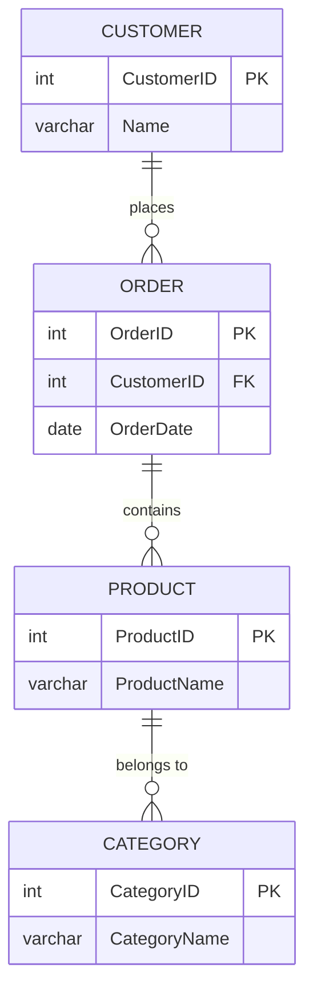

# Definition
Before proceeding, ensure you master [[SQL_Retrieval_Queries_(SELECT)]] and Relational_Database_Model because SQL join operations combine rows from two or more tables based on a related column between them, allowing the retrieval of comprehensive datasets from across a relational database.
SQL join operations are a fundamental technique in `SQL_Retrieval_Queries_(SELECT)` used to combine data from two or more tables based on the values of one or more common (related) columns. They are essential for reconstructing relationships defined in a `Relational_Database_Model`, allowing you to fetch information that is spread across multiple normalized tables into a single, unified result set. A simpler way to think about it is like matching up related information from different lists: if you have one list of students and another list of courses they are enrolled in, a join lets you combine them to see "which student is taking which course."

# The Mental Model
Imagine you have two separate spreadsheets: one lists `Employees` and their `DepartmentID`, and another lists `Departments` and their `DepartmentName`.
*   A `JOIN` is like taking these two spreadsheets and carefully lining them up side-by-side.
*   You find matching `DepartmentID`s on both sheets.
*   For every match, you create a new combined row that includes all the employee's details and all the department's details.
This allows you to see "John Doe works in Sales" even though "Sales" isn't explicitly in the `Employees` sheet.

# Context & Framework
### How the Parts Talk to Each Other
SQL join operations are the primary mechanism for traversing the relationships between tables in a `Relational_Database_Model`. They are typically specified in the `FROM` clause of a `SQL_Retrieval_Queries_(SELECT)` statement. The database engine effectively combines rows from the tables being joined based on the specified join condition. Different types of joins dictate how rows that don't have a match in the other table are handled. This ability to link and combine data is what makes normalized relational databases so powerful and flexible.

# The Mastery Deep Dive
### The Transformation: Before and After
Joins are categorized by how they handle matching and non-matching rows. The most common types are `INNER JOIN`, `LEFT (OUTER) JOIN`, `RIGHT (OUTER) JOIN`, `FULL (OUTER) JOIN`, `CROSS JOIN`, and `NATURAL JOIN`.


```text
-- Scenario 1: Illustrating Entity-Relationship Diagram for join context
-- Output:
-- (A visual representation of an ER Diagram.)
-- Customer places Order (One-to-Many).
-- Order contains Product (Many-to-Many, implicitly via an Order_Items table).
-- Product belongs to Category (Many-to-One).
--
-- Notation Legend for erDiagram:
-- ||--|| : Exactly one to exactly one
-- ||--o{ : Exactly one to zero or many
-- }o--o{ : Zero or many to zero or many
-- }|--o{ : One or many to zero or many
-- PK     : Primary Key
-- FK     : Foreign Key
```
*Note: This `erDiagram` illustrates entities and their relationships, providing context for how tables might be joined. The Notation Legend explains the cardinality symbols used.*

**Common Join Types:**

1.  **`INNER JOIN`**:
    *   **Purpose**: Returns only the rows that have matching values in *both* tables based on the join condition. It's the most common type of join.
    *   **Analogy**: Finding common friends in two different groups.
    *   **Syntax**: `SELECT ... FROM TableA INNER JOIN TableB ON TableA.ID = TableB.ID;`

2.  **`LEFT (OUTER) JOIN`**:
    *   **Purpose**: Returns all rows from the *left* table, and the matching rows from the *right* table. If there's no match in the right table, `SQL_NULL_Values_and_Comparison` are returned for the right table's columns.
    *   **Analogy**: Listing all your friends, and if they also have a car, showing their car. If not, just showing your friend's name.
    *   **Syntax**: `SELECT ... FROM TableA LEFT JOIN TableB ON TableA.ID = TableB.ID;`

3.  **`RIGHT (OUTER) JOIN`**:
    *   **Purpose**: Returns all rows from the *right* table, and the matching rows from the *left* table. If there's no match in the left table, `NULL`s are returned for the left table's columns.
    *   **Analogy**: Listing all cars in a parking lot, and if one of your friends owns it, showing their name. If not, just showing the car.
    *   **Syntax**: `SELECT ... FROM TableA RIGHT JOIN TableB ON TableA.ID = TableB.ID;`

4.  **`FULL (OUTER) JOIN`** (Less common, not supported by all DBMS like MySQL):
    *   **Purpose**: Returns all rows when there is a match in *either* the left or the right table. If no match, `NULL`s are returned for the non-matching side.
    *   **Analogy**: Listing everyone who is either your friend OR owns a car (or both).
    *   **Syntax**: `SELECT ... FROM TableA FULL JOIN TableB ON TableA.ID = TableB.ID;`

5.  **`CROSS JOIN`**:
    *   **Purpose**: Returns the Cartesian product of the two tables. Every row from the first table is combined with every row from the second table. This generally produces a very large result set and is rarely used explicitly except in specific scenarios.
    *   **Analogy**: Matching every friend you have with every single car in the parking lot, regardless of who owns it.
    *   **Syntax**: `SELECT ... FROM TableA CROSS JOIN TableB;` (no `ON` clause)

6.  **`NATURAL JOIN`**:
    *   **Purpose**: Joins two tables implicitly based on columns that have the same name and compatible `SQL_Data_Types` in both tables. No `ON` clause is specified. Can be risky if unintended column matches exist.
    *   **Analogy**: Automatically finding friends and cars based on a shared "OwnerName" column without you explicitly saying so.
    *   **Syntax**: `SELECT ... FROM TableA NATURAL JOIN TableB;`

# Constraints & Limitations
### The "Unseen Crack": Common Structural Flaws
A common structural flaw in `SQL_Join_Operations` is omitting or incorrectly specifying the join condition (`ON` clause). This can lead to an unintended `CROSS JOIN` (Cartesian product) if multiple tables are listed in the `FROM` clause without a `WHERE` or `ON` condition, resulting in a massive and meaningless result set that can crash a system. Another limitation is the potential for `SQL_NULL_Values_and_Comparison` in join keys. `INNER JOIN`s will inherently exclude rows where the join column has a `NULL` value in either table, as `NULL` does not match `NULL`. This often necessitates the use of `OUTER JOIN`s to preserve rows with `NULL` keys from one side.

# Significance & Application
SQL join operations are foundational for building complex queries and extracting meaningful information from normalized relational databases. They enable the reconstruction of business entities and relationships that are distributed across multiple tables. Academically, joins are the practical implementation of relational algebra's join operator. In industry, joins are used in virtually every data-driven application: from displaying customer details alongside their orders, to linking product information with their categories, or combining employee data with their department managers. Mastery of different join types is essential for efficient and accurate data retrieval.

# The Worked Example
This example demonstrates `INNER JOIN`, `LEFT JOIN`, and `CROSS JOIN` using `Employees` and `Departments` tables.

1.  **Initial Tables and Data:**
    ```sql
```sql
    CREATE TABLE Employees (
        EmpID INT PRIMARY KEY,
        EmpName VARCHAR(100),
        DeptID INT -- Foreign key to Departments
    );

    CREATE TABLE Departments (
        DeptID INT PRIMARY KEY,
        DeptName VARCHAR(100)
    );

    INSERT INTO Employees (EmpID, EmpName, DeptID)
    VALUES (1, 'Alice', 10),
           (2, 'Bob', 20),
           (3, 'Charlie', 10),
           (4, 'Diana', NULL); -- Diana is not assigned to a department yet

    INSERT INTO Departments (DeptID, DeptName)
    VALUES (10, 'HR'),
           (20, 'IT'),
           (30, 'Finance'); -- Finance has no employees yet
```
```text
    -- Scenario 1: Successful table creation and initial data insertion
    -- Output:
    -- 'Tables created.'
    -- '4 row(s) affected.' (Employees)
    -- '3 row(s) affected.' (Departments)
    --
    -- Scenario 2: Initial table content
    -- Employees: (Alice:10, Bob:20, Charlie:10, Diana:NULL)
    -- Departments: (10:HR, 20:IT, 30:Finance)
```

2.  **`INNER JOIN` (Employees matched with their Departments):**
    ```sql
```sql
    SELECT E.EmpName, D.DeptName
    FROM Employees E
    INNER JOIN Departments D ON E.DeptID = D.DeptID;
```
```text
    -- Scenario 1: Combining employees with their matching departments
    -- Output:
    -- EmpName | DeptName
    -- --------|----------
    -- Alice   | HR
    -- Bob     | IT
    -- Charlie | HR
    -- Diana (NULL DeptID) and Finance (no employees) are excluded because no match is found for them in both tables.
```

3.  **`LEFT JOIN` (All Employees and their Departments, if any):**
    ```sql
```sql
    SELECT E.EmpName, D.DeptName
    FROM Employees E
    LEFT JOIN Departments D ON E.DeptID = D.DeptID;
```
```text
    -- Scenario 1: Including all employees, even those without a department
    -- Output:
    -- EmpName | DeptName
    -- --------|----------
    -- Alice   | HR
    -- Bob     | IT
    -- Charlie | HR
    -- Diana   | NULL
    -- All employees are listed. Diana has NULL for DeptName as no match was found in Departments.
```

4.  **`RIGHT JOIN` (All Departments and their Employees, if any):**
    ```sql
```sql
    SELECT E.EmpName, D.DeptName
    FROM Employees E
    RIGHT JOIN Departments D ON E.DeptID = D.DeptID;
```
```text
    -- Scenario 1: Including all departments, even those without employees
    -- Output:
    -- EmpName | DeptName
    -- --------|----------
    -- Alice   | HR
    -- Bob     | IT
    -- Charlie | HR
    -- NULL    | Finance
    -- All departments are listed. Finance has NULL for EmpName as no employee is in that department.
```

5.  **`CROSS JOIN` (Cartesian Product):**
    ```sql
```sql
    SELECT E.EmpName, D.DeptName
    FROM Employees E
    CROSS JOIN Departments D;
```
```text
    -- Scenario 1: Combining every employee with every department (4 employees * 3 departments = 12 rows)
    -- Output (partial):
    -- EmpName | DeptName
    -- --------|----------
    -- Alice   | HR
    -- Alice   | IT
    -- Alice   | Finance
    -- Bob     | HR
    -- Bob     | IT
    -- Bob     | Finance
    -- ... and so on for all combinations.
    -- Each employee is matched with every department, regardless of actual assignment.
```

# The Proving Ground
*Test your mastery. Cover the solutions below to test yourself first.*

### Level 1: The Sanity Check (Verification)
**The Question:** What is the primary purpose of an SQL join operation, and which type of join returns only the rows that have matching values in both tables?
> **Solution:** The primary purpose of an SQL join operation is to **combine rows from two or more tables** based on a related column between them. The `INNER JOIN` returns only the rows that have matching values in both tables.

### Level 2: The Crucible (Mastery & Edge Cases)
**The Scenario:** You have a `Customers` table (`CustomerID`, `CustomerName`) and an `Orders` table (`OrderID`, `CustomerID`, `OrderDate`). Some customers have not placed any orders yet, and some orders might have a `NULL CustomerID` due to data entry errors. You need to retrieve a list of *all customers* and their associated orders (if any), but also clearly identify any orders that do *not* belong to an existing customer.
**The Question:** Write an SQL query using an appropriate join type (or combination of joins) to satisfy this complex requirement. Explain how your chosen join ensures all customers are listed, and how it identifies orders without valid customer links.
> **Solution:** The SQL query to achieve this complex requirement would involve a `FULL OUTER JOIN` (if supported) or a combination of `LEFT JOIN` and `RIGHT JOIN` with `UNION ALL`. Let's assume `FULL OUTER JOIN` is available for clarity.
> ```sql
> SELECT C.CustomerID, C.CustomerName, O.OrderID, O.OrderDate
> FROM Customers C
> FULL OUTER JOIN Orders O ON C.CustomerID = O.CustomerID;
> ```
> This query uses a `FULL OUTER JOIN` to combine the `Customers` and `Orders` tables.
> *   It ensures **all customers are listed** because it includes all rows from the `Customers` table (the "left" side), even if they have no matching orders. For these customers, the `Orders` table columns (`OrderID`, `OrderDate`) will show `NULL`.
> *   It identifies **orders without valid customer links** because it also includes all rows from the `Orders` table (the "right" side) that do *not* have a matching `CustomerID` in the `Customers` table (e.g., if `Orders.CustomerID` is `NULL` or points to a non-existent customer). For these orders, the `Customers` table columns (`CustomerID`, `CustomerName`) will show `NULL`.
>
> If `FULL OUTER JOIN` is not supported (e.g., in MySQL), an equivalent solution would be:
> ```sql
> SELECT C.CustomerID, C.CustomerName, O.OrderID, O.OrderDate
> FROM Customers C LEFT JOIN Orders O ON C.CustomerID = O.CustomerID
> UNION ALL
> SELECT C.CustomerID, C.CustomerName, O.OrderID, O.OrderDate
> FROM Customers C RIGHT JOIN Orders O ON C.CustomerID = O.CustomerID
> WHERE C.CustomerID IS NULL; -- Only include rows from RIGHT JOIN that LEFT JOIN missed (i.e., unmatched orders)
> ```
> This combination also ensures all customers and all (potentially unlinked) orders are presented.

# Key Takeaways
*   SQL joins combine data from multiple tables based on related columns.
*   `INNER JOIN` returns only matched rows; `LEFT JOIN` returns all left rows plus matches; `RIGHT JOIN` returns all right rows plus matches; `FULL JOIN` returns all rows from both tables.
*   `CROSS JOIN` produces a Cartesian product; `NATURAL JOIN` joins on similarly named columns.
*   Joins are crucial for reconstructing relationships and retrieving comprehensive datasets.

# Knowledge Graph Connections
| Concept                     | Connection / Relationship                                                                   |
| :
-------------------------- | :
------------------------------------------------------------------------------------------ |
| [[SQL_Retrieval_Queries_(SELECT)]]| Join operations are a fundamental part of the `FROM` clause in `SELECT` statements.     |
| Relational_Database_Model| Joins are used to combine relations (tables) based on their defined relationships.          |
| [[Referential_Integrity_Constraints]]| Foreign keys are the basis for join conditions, linking related tables.             |
| [[SQL_NULL_Values_and_Comparison]]| `NULL` values in join columns affect which rows are included, especially in `INNER JOIN`s.|
| [[Aliases_and_Wildcards_in_SQL]]| Table aliases are commonly used in joins to shorten and clarify table references.       |
| [[Nested_SQL_Queries]]      | Joins can often be an alternative (and sometimes more performant) to nested queries.        |
| [[Grouping_Data_in_SQL_(GROUP_BY)]]| The results of join operations can then be grouped for aggregation.                     |
---