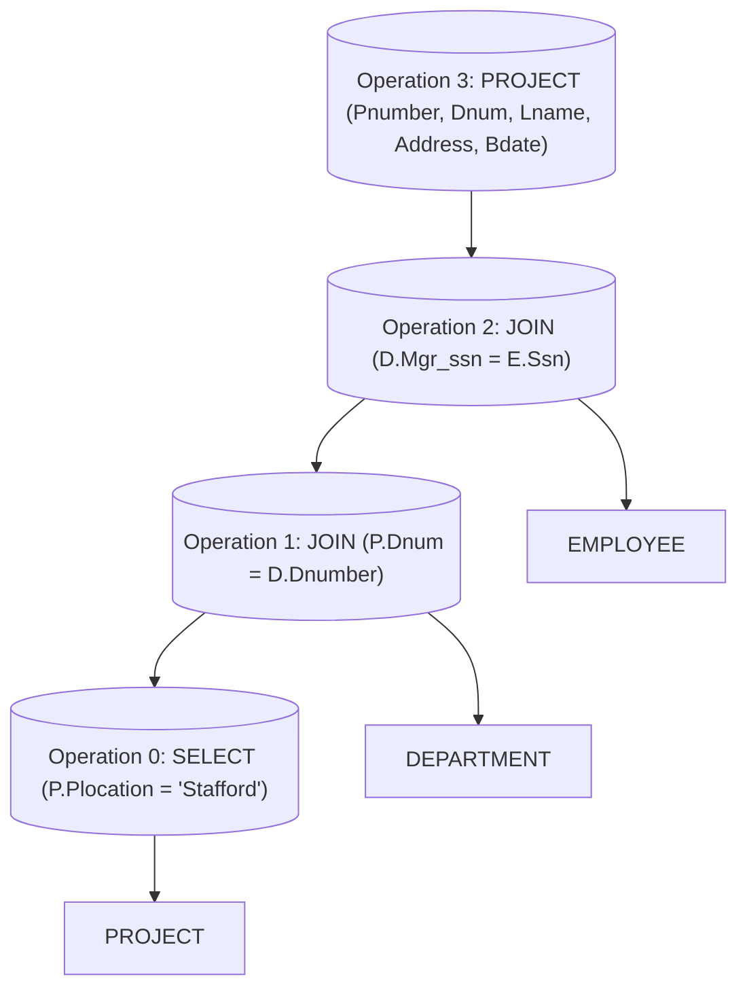
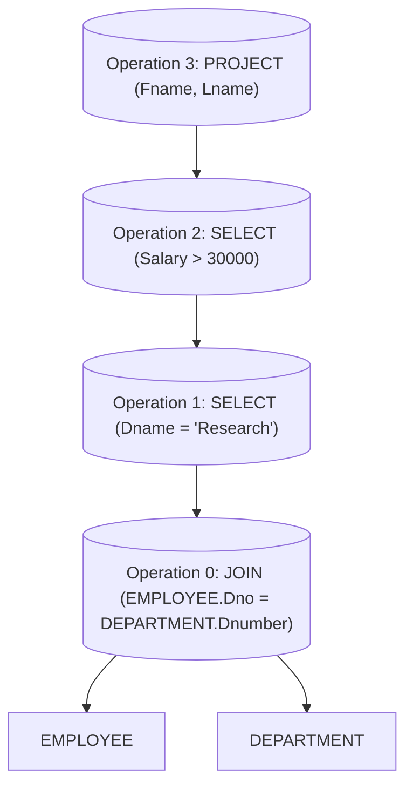

# Definition
Before proceeding, ensure you master [[Relational_Algebra]] and Data_Structures because Query Tree Notation visually represents relational algebra expressions using a tree data structure.
**Query Tree Notation** is an internal data structure used by database management systems (DBMS) to represent a relational algebra expression (a database query). It is a graphical, tree-like representation where:
*   **Leaf nodes** represent base relations (tables) from the database.
*   **Internal nodes** represent relational algebra operations (like `SELECT`, `PROJECT`, `JOIN`, `UNION`, etc.).
*   **Edges** indicate the flow of data, with the results of child operations feeding into parent operations.
This notation provides a clear visual feel for the complexity of a query and the operations involved, and it's a standard technique for estimating the work involved in executing the query and for query optimization.

# The Mental Model
Imagine you're building a complex query like a Lego structure. Each Lego brick is a basic operation (e.g., "filter by department," "select names"). A Query Tree is like the instruction manual that shows you how to stack these bricks to achieve the final result. The base plates are your original tables (leaf nodes). The different types of connections between bricks are your relational algebra operations (internal nodes). The entire stacked structure is your complete query, and the "top" brick is the final output.


```text
// Scenario 1: A query to find project details and employee information related to projects in 'Stafford'.
// Output:
// (A visual representation of the query tree with nodes for operations and base tables.)
//
// Diagram Description:
// - P_Table (PROJECT), D_Table (DEPARTMENT), E_Table (EMPLOYEE) are base relations (leaf nodes).
// - Op0 (SELECT) filters the PROJECT table for 'Stafford' location.
// - Op1 (JOIN) then combines the result of Op0 with the DEPARTMENT table based on Dnum.
// - Op2 (JOIN) then combines the result of Op1 with the EMPLOYEE table based on manager SSN.
// - Op3 (PROJECT) is the final operation, selecting specific attributes from the combined result.
```
*Note: This `graph TD` illustrates a Query Tree, where rectangular nodes represent base relations (tables) and rounded rectangular nodes represent relational algebra operations. The arrows show the flow of data from input relations up through intermediate operations to the final result.*

# Context & Framework
### Components of a Query Tree
A Query Tree explicitly shows the sequence and dependencies of operations within a relational algebra expression. Each internal node specifies a particular relational algebra operation and its associated parameters (e.g., the selection condition for `SELECT`, the attribute list for `PROJECT`). The leaves of the tree are always the base tables stored in the database. The root of the tree represents the final operation whose result is the answer to the query.

# The Mastery Deep Dive
### The Engineering Trade-off
Query Tree Notation is crucial for **Algebraic Query Optimization**. Database query optimizers work by taking an initial query tree (parsed directly from a SQL query, for example) and transforming it into an equivalent, but more efficient, query tree. These transformations leverage properties of relational algebra operations (e.g., commutativity of `SELECT`, pushing `SELECT` operations down the tree) to reduce the number of tuples or operations at earlier stages, thereby improving execution performance. This represents a significant trade-off: abstracting the query into a tree allows for systematic, rule-based improvements, even if the tree itself adds an internal layer of complexity.

### The "Same Story, Different Setting"
The concept of a tree data structure is pervasive in computer science (e.g., parse trees for programming languages, directory structures in file systems). In the context of databases, the Query Tree applies this familiar structure to represent the logical flow of data manipulation. Just as a parse tree breaks down a sentence into its grammatical components, a Query Tree breaks down a query into its fundamental relational operations, providing a standardized way to analyze and optimize data retrieval.

# Constraints & Limitations
### The "Oops!" List: Where Everyone Fails
A common misunderstanding is confusing the Query Tree with the physical execution plan. While closely related, the Query Tree is a *logical* representation of the query; the physical execution plan details the specific algorithms (e.g., hash join vs. nested loop join) and data access methods (e.g., index scan vs. table scan) chosen by the optimizer. Another challenge is manually constructing complex Query Trees, as they can become unwieldy for very elaborate queries, underscoring the need for automated query parsers and optimizers.

# Significance & Application
Query Tree Notation is fundamental to how database systems process and optimize queries. It serves as an intermediate representation that allows the query optimizer to analyze the query, identify potential inefficiencies, and apply various transformation rules to generate a more efficient execution plan. Without Query Trees, systematic query optimization would be incredibly difficult, making them a cornerstone of database performance and scalability.

# The Worked Example
Consider a request: "Find the names of all employees who work in the 'Research' department and earn more than $30,000."

We can break this down into relational algebra operations:
1.  Select employees in the 'Research' department from `EMPLOYEE` table.
2.  From the result, select those employees who earn more than $30,000.
3.  From that result, project the `Fname` and `Lname` attributes.

**Relational Algebra Expression:**
$$ \boxed{\displaystyle \pi_{\text{Fname, Lname}}(\sigma_{\text{Salary > 30000}}(\sigma_{\text{Dno = (SELECT Dnumber FROM DEPARTMENT WHERE Dname = 'Research')}}(EMPLOYEE)))} $$
(For simplicity, assume `Dno` can be directly matched with a Department ID derived from `Dname = 'Research'`.)


```text
// Scenario 1: Representing a query for employees in 'Research' department with salary > 30000.
// Output:
// (A visual representation of the query tree.)
//
// Diagram Description:
// - E_Table (EMPLOYEE) and D_Table (DEPARTMENT) are base relations.
// - Op0 (JOIN) initially combines EMPLOYEE and DEPARTMENT on Dno=Dnumber.
// - Op1 (SELECT) filters the joined result for Dname='Research'.
// - Op2 (SELECT) further filters for Salary > 30000.
// - Op3 (PROJECT) selects the final Fname and Lname.
```
This Query Tree visually represents the sequence of operations: first, a join to link employees to departments, then two selection operations to filter by department name and salary, and finally a projection to retrieve the desired employee names.

# The Proving Ground
*Test your mastery. Cover the solutions below to test yourself first.*

### Level 1: Understanding (The Basics)
**The Element ID:** In a Query Tree, what do the leaf nodes represent, and what do the internal nodes represent?
> **Solution:** Leaf nodes represent the **base relations (tables)** in the database. Internal nodes represent **relational algebra operations** (e.g., SELECT, PROJECT, JOIN).

### Level 2: Competence (Application)
**The Flow Chart:** Draw or describe the Query Tree for the Relational Algebra expression: `π_Lname, Fname (σ_Dno=5 (EMPLOYEE))`.
> **Solution:**
> A Query Tree would look like this:
>
> ```mermaid
> graph TD
>     Project_Lname_Fname[("PROJECT (Lname, Fname)")]
>     Select_Dno5[("SELECT (Dno=5)")]
>     Employee_Table[EMPLOYEE]
>
>     Employee_Table --> Select_Dno5
>     Select_Dno5 --> Project_Lname_Fname
> ```
> Description: The `EMPLOYEE` relation (leaf node) feeds into the `SELECT (Dno=5)` operation (internal node), which then feeds into the `PROJECT (Lname, Fname)` operation (root node).

### Level 3: Mastery (The Crucible)
**The Broken System:** A junior DBA designs a Query Tree where a `PROJECT` operation to select a few columns occurs at the very top (root) of the tree, directly above a `JOIN` of two very large tables. An experienced DBA argues that this structure is inefficient. Explain *why* placing the `PROJECT` operation higher in the tree in this scenario is a performance "trap," and how the concept of "pushing down" operations in query optimization addresses this.
> **Solution:** Placing the `PROJECT` operation at the very top of the tree in this scenario is a performance "trap" because it means the `JOIN` operation (of two very large tables) will first generate an intermediate result that includes **all columns** from both tables. This intermediate result could be extremely wide and consume significant memory and processing time, even if most of those columns are ultimately discarded by the final `PROJECT`.
>
> The concept of "pushing down" operations in query optimization addresses this by moving `PROJECT` operations (and `SELECT` operations) **as low as possible** in the Query Tree. By pushing the `PROJECT` down to occur *before* or *during* the `JOIN` operation, only the necessary columns are carried through the computationally expensive join. This drastically reduces the size of the intermediate relations, leading to substantial improvements in performance by minimizing data transfer and memory usage.

# Key Takeaways
*   `Query_Tree_Notation` is a graphical representation of relational algebra expressions.
*   It uses leaf nodes for base relations and internal nodes for operations.
*   Crucial for database query optimizers to transform queries into efficient execution plans.

# Knowledge Graph Connections
| Concept                     | Connection / Relationship                                                                   |
| :
-------------------------- | :
------------------------------------------------------------------------------------------ |
| [[Relational_Algebra]]      | `Query_Tree_Notation` provides a visual and structural representation of `Relational_Algebra` expressions. |
| Query_Optimization      | The primary use of `Query_Tree_Notation` is for `Query_Optimization` in database systems.   |
| Data_Structures         | `Query_Tree_Notation` is a tree-based `Data_Structures` for logical query representation.   |
| [[Database_Management_System]] | `Query_Tree_Notation` is an internal component of a `Database_Management_System`'s query processor. |
---