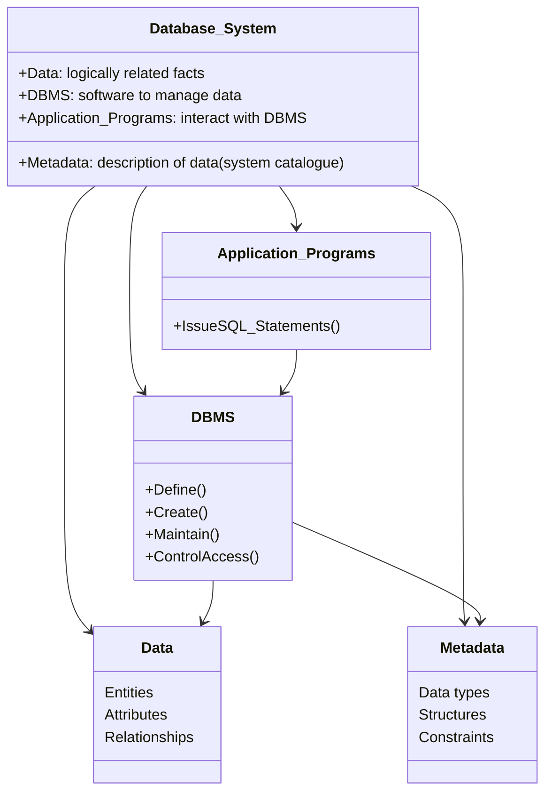
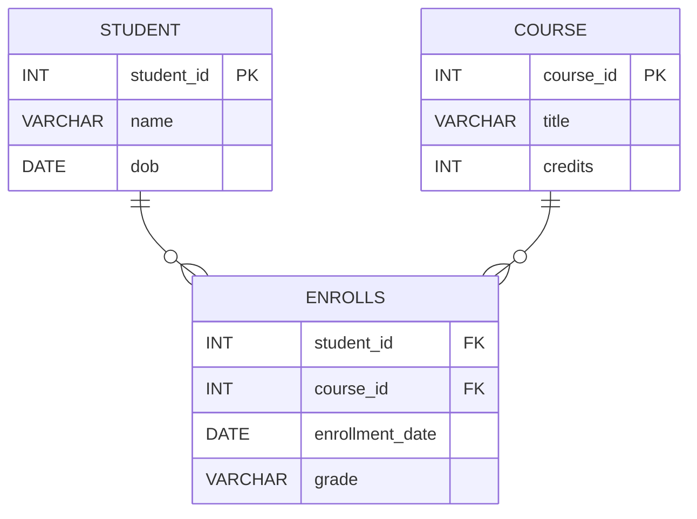
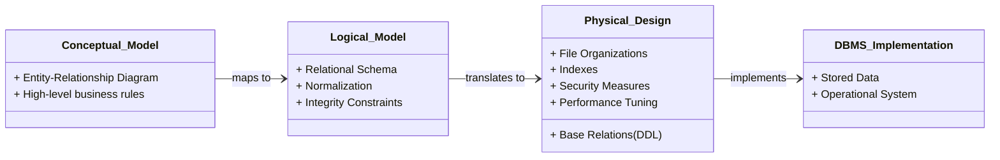
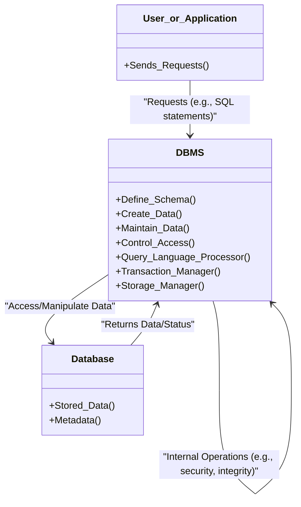

# 1 Introduction To Database Systems

Comprehensive resource for 1 Introduction To Database Systems.


---

## 1 Introduction To Database Systems Hub


## Overview
Database systems are central to nearly every modern organization, providing the backbone for managing vast amounts of information. This unit introduces the fundamental concepts of databases, contrasting them with traditional file-based and manual data handling approaches. It explores the advantages and disadvantages of Database Management Systems (DBMS), the roles of various personnel in a database environment, and key components like Data Definition Language (DDL), Data Manipulation Language (DML), and database views. By the end of this unit, you will understand why database systems have become indispensable in today's data-driven world.

## Learning Objectives
*   Understand the common uses and necessity of database systems in modern organizations.
*   Identify the characteristics and limitations of traditional file-based data handling approaches.
*   Define the terms "database" and "Database_Management_System_DBMS."
*   Explain the role of Data_Definition_Language_DDL and Data_Manipulation_Language_DML in managing databases.
*   Describe the various personnel involved in a DBMS environment, including their distinctions.
*   Analyze the Advantages_of_DBMSs and Disadvantages_of_DBMSs of adopting a DBMS approach.
*   Comprehend the concept and benefits of Database_Views.

## Unit Applications & Real-World Relevance
Database systems are ubiquitous, forming the invisible infrastructure behind many daily activities. For instance, **purchases from a supermarket** rely on databases to track inventory and transactions. **Using a credit card** involves complex database operations for authorization and record-keeping. **Booking a holiday** at a travel agency requires accessing and updating multiple databases for flights, hotels, and customer information. **Social media platforms** are entirely dependent on databases to store user profiles, posts, and interactions. In **e-commerce, banking, and insurance**, databases are paramount for managing customer data, financial records, and policy details, demonstrating their critical role across diverse commercial and social processes.

## Active Learning Prompts
*   Consider a small business you are familiar with. How would implementing a [[Database_Systems]], rather than a [[Manual_Approach_to_Data_Handling]] or [[File_Based_Systems]] approach, fundamentally change its operations and efficiency?
*   Think about a common online service you use daily (e.g., a streaming platform, an online game). Identify at least three distinct types of data that would be stored in its underlying database, and explain why a [[Database_Management_System_DBMS]] is essential for managing each.
*   Imagine you are a [[Database_Administrator_DBA]] for a large corporation. A new regulation requires stricter [[Database_Access_Control]] for sensitive customer data. How would you approach implementing this change, considering the principles of access control?

## Unit Challenges & Common Misconceptions
A primary challenge in this unit lies in understanding the **fundamental shift in paradigm** from isolated, program-specific data files to a shared, integrated database. Students often initially struggle with appreciating the depth of [[Problems_with_File_Based_Approach]] (like data redundancy, inconsistency, and program-data dependence) that the database approach solves, especially when their experience is limited to simpler data structures. A common misconception is viewing a database as merely a collection of tables, overlooking the crucial role of the [[Database_Management_System_DBMS]] in defining, creating, maintaining, and controlling access to that data. Another challenge is differentiating the distinct, yet complementary, roles within the database environment, such as [[Data_Administrator_DA]] versus [[Database_Administrator_DBA]], and the various types of [[Database_End_Users]].

## Connections
  - [[Database_Systems]]
    - [[Database_Management_System_DBMS]]
      - [[Advantages_of_DBMSs]]
      - [[Disadvantages_of_DBMSs]]
      - [[Data_Definition_Language_DDL]]
      - [[Data_Manipulation_Language_DML]]
      - [[Database_Access_Control]]
    - [[Database_Views]]
      - [[Benefits_of_Database_Views]]
  - [[Manual_Approach_to_Data_Handling]]
    - [[Manual_Approach_Limitations]]
  - [[File_Based_Systems]]
    - [[Problems_with_File_Based_Approach]]
  - [[Database_Roles_and_Personnel]]
    - [[Data_Administrator_DA]]
    - [[Database_Administrator_DBA]]
    - [[Database_Designers]]
      - [[Logical_and_Conceptual_Database_Design]]
      - [[Physical_Database_Design]]
    - [[Application_Programmers_in_DBMS_Environment]]
    - [[Database_End_Users]]
      - [[Naïve_Users]]
      *   [[Sophisticated_Users]]
      *   [[Casual_Users]]

## Next Steps for Deeper Understanding
To further deepen your understanding, explore the historical evolution of database models (e.g., hierarchical, network, relational, object-oriented). Research specific commercial DBMS products (e.g., Oracle, MySQL, PostgreSQL) and their unique features. Consider delving into database normalization and advanced SQL querying to build practical skills.

## Possible Questions
[[CS1241_1_Introduction_to_Database_Systems_Possible_Questions]]
---

---

## Database Roles And Personnel


## Definition
Before proceeding, ensure you master [[Database_Systems]] and [[Database_Management_System_DBMS]].
Database_Roles_and_Personnel refers to the various individuals and groups who interact with a [[Database_Systems]] and [[Database_Management_System_DBMS]] in different capacities, each with distinct responsibilities and skill sets. These roles are essential for the effective design, implementation, administration, and utilization of an organization's data assets. Think of it like a complex orchestral performance: different musicians (personnel) play different instruments (perform specific roles) under the guidance of a conductor (the system manager) to produce a harmonious outcome.

## The Mental Model
Imagine a large, functional hospital. The "Database_Roles_and_Personnel" are all the different staff members, from the CEO to the front desk receptionist. Each has a distinct role: the CEO sets strategic direction (like a Data Administrator), the surgeons perform complex operations (like Database Administrators), the nurses manage day-to-day patient care (like Application Programmers), and the patients themselves are the end-users. All are essential, but their functions and access levels are vastly different.

## Context & Framework
#### The Family Tree
The various Database_Roles_and_Personnel form a natural hierarchy and interconnected web within an organization. Understanding this structure is crucial for efficient data governance and operations. Roles like [[Data_Administrator_DA]] and [[Database_Administrator_DBA]] sit at the strategic and technical helm, respectively, while [[Database_Designers]] and [[Application_Programmers_in_DBMS_Environment]] focus on creation and implementation. Finally, [[Database_End_Users]] represent the diverse consumers of the database's information, each with varying needs and access patterns.

## The Mastery Deep Dive
#### The Family Tree
The Database_Roles_and_Personnel can be broadly categorized into several key groups, each with distinct responsibilities within the database environment:
*   **Management & Strategic Roles:** These roles are concerned with the overall data resources of the organization. The [[Data_Administrator_DA]] falls into this category, focusing on conceptual and logical design, policies, and standards.
*   **Technical & Operational Roles:** These roles are hands-on with the technical aspects of the database. The [[Database_Administrator_DBA]] is responsible for the physical realization, implementation, security, and performance optimization. [[Database_Designers]] (both logical/conceptual and physical) identify data, choose structures, and design security measures.
*   **Development Roles:** These individuals build the applications that interact with the database. [[Application_Programmers_in_DBMS_Environment]] implement user requirements, code, test, and maintain programs that interface with the database.
*   **End-User Roles:** These are the ultimate consumers of the database's information. [[Database_End_Users]] include [[Naïve_Users]], [[Sophisticated_Users]], and [[Casual_Users]], each with different levels of technical proficiency and interaction patterns.

#### The Cheat Code: How to Remember This
To remember the Database_Roles_and_Personnel, think of a "DATA FACTORY" hierarchy:
*   **D**ata **A**dministrator: The **CEO** – Big picture, policies, what data means.
*   **D**atabase **A**dministrator: The **Factory Manager** – Keeps the machines running, secure, and fast.
*   **D**atabase **D**esigners: The **Architects** – Design the factory layout and processes.
*   **A**pplication **P**rogrammers: The **Engineers** – Build the machines that use the factory.
*   **E**nd **U**sers: The **Customers** – Use the products from the factory.
This mnemonic helps categorize the different levels of responsibility and interaction with the database.

## Constraints & Limitations
#### The Engineering Trade-off
A key constraint in managing Database_Roles_and_Personnel is ensuring clarity of responsibilities and preventing role overlap or skill gaps. Without clear definitions, conflicts can arise (e.g., between a [[Data_Administrator_DA]] and a [[Database_Administrator_DBA]]), or critical tasks might be neglected. Furthermore, finding individuals with the diverse and specialized skill sets required for modern database environments (e.g., in [[Database_Designers]], [[Application_Programmers_in_DBMS_Environment]]) can be challenging and costly. This trade-off emphasizes the importance of robust organizational planning and clear role delineation.

## Significance & Application
Understanding Database_Roles_and_Personnel is crucial for effective database management and IT governance. It ensures that all aspects of data from strategic planning to daily operations are covered by qualified individuals. Proper role definition facilitates efficient workflows, strengthens [[Database_Access_Control]] by assigning appropriate privileges, and ensures accountability for data integrity and security. In essence, correctly allocating these roles is fundamental to maximizing the value and minimizing the risks associated with an organization's data assets.

## The Worked Example
Consider a large e-commerce company. Here’s how different Database_Roles_and_Personnel interact with a database system:

| Role                              | Key Responsibility                                                                   | Interaction Example                                                                    |
| :
-------------------------------- | :
----------------------------------------------------------------------------------- | :
------------------------------------------------------------------------------------- |
| [[Data_Administrator_DA]]         | Defines data standards, policies, and conceptual schema.                            | Determines the naming convention for `Customer` data across all systems.              |
| [[Database_Administrator_DBA]]    | Installs DBMS, tunes performance, manages backups and security.                     | Ensures the database server is running optimally and configures [[Database_Access_Control]]. |
| [[Database_Designers]]            | Designs the database schema (tables, relationships).                                | Creates the `Products` table structure, including primary and foreign keys.            |
| [[Application_Programmers_in_DBMS_Environment]] | Develops the website's shopping cart and checkout modules.                          | Writes [[Data_Manipulation_Language_DML]] to insert new orders into the database.       |
| [[Naïve_Users]]                   | Places an order on the website.                                                     | Clicks buttons on the e-commerce website, unaware of the underlying database.          |
| [[Sophisticated_Users]]           | Analyzes sales trends to optimize marketing campaigns.                              | Writes complex SQL queries to identify top-selling products and customer demographics. |
| [[Casual_Users]]                  | Department head runs a weekly sales report.                                         | Uses a pre-built reporting tool to view sales figures.                                 |

This table illustrates the diverse Database_Roles_and_Personnel within a single organization, showcasing their distinct responsibilities and how they interact with the database environment.

## The Proving Ground
*Test your mastery. Cover the solutions below to test yourself first.*

#### Level 1: The Sanity Check (Verification)
**The Question:** Name two distinct categories of Database_Roles_and_Personnel and give an example role for each.
> **Solution:** Two categories are **Management & Strategic Roles** (e.g., [[Data_Administrator_DA]]) and **Technical & Operational Roles** (e.g., [[Database_Administrator_DBA]]).

#### Level 2: The Crucible (Mastery & Edge Cases)
**The Scenario:** A fast-growing tech startup is experiencing significant data management issues. They have a single "Data Specialist" who is currently responsible for defining data governance policies, designing the logical database schema, installing database software, managing daily backups, and developing all user-facing applications.
**The Question:**
(a) Identify two distinct Database_Roles_and_Personnel that the "Data Specialist" is attempting to fulfill.
(b) Explain why combining these roles into a single individual is problematic for the startup's long-term data integrity and security, specifically referencing the primary focus of each role.
> **Solution:**
> (a) The "Data Specialist" is attempting to fulfill at least two distinct roles:
>     1.  [[Data_Administrator_DA]]: Responsible for defining data governance policies and designing the logical database schema.
>     2.  [[Database_Administrator_DBA]]: Responsible for installing database software and managing daily backups.
>     (They are also fulfilling [[Database_Designers]] for logical design and Application_Programers_In_DBMS_Environment for developing user applications.)
>
> (b) Combining these roles into a single individual is problematic for several reasons:
>     1.  **Conflict of Interest / Lack of Segregation of Duties:** The primary focus of a [[Data_Administrator_DA]] is strategic: defining *what* data means, *what* policies govern it, and its *conceptual structure*. The primary focus of a [[Database_Administrator_DBA]] is technical: *how* the database is implemented, physically maintained, and secured. If one person holds both roles, there's a risk that strategic policies might be overlooked for technical convenience, or that security measures might be implemented weakly if the DBA function isn't rigorously checked by an independent DA function. This **lack of segregation of duties** can lead to internal vulnerabilities and poor adherence to best practices, compromising both data integrity (policies might be ignored during implementation) and security (a single point of failure for both policy definition and enforcement).
>     2.  **Overload and Skill Gap:** Each of these roles (DA, DBA, Designer, Programmer) requires distinct and often specialized skill sets. One person attempting to cover all of them is likely to be overloaded and may lack deep expertise in all areas. This can lead to suboptimal database design, inefficient performance tuning, outdated security measures, or poorly developed applications, impacting the startup's long-term scalability and reliability.

## Key Takeaways
*   Database_Roles_and_Personnel are diverse, each with specific responsibilities for effective data management.
*   Key roles include [[Data_Administrator_DA]], [[Database_Administrator_DBA]], [[Database_Designers]], [[Application_Programmers_in_DBMS_Environment]], and various [[Database_End_Users]].
*   Clear role definition and segregation of duties are crucial for data integrity, security, and efficient operations.

## Knowledge Graph Connections
| Concept                             | Connection / Relationship                                                                 |
| :
---------------------------------- | :
---------------------------------------------------------------------------------------- |
| [[Database_Systems]]                | Various personnel interact with and manage database systems.                             |
| [[Database_Management_System_DBMS]] | These roles are essential for the effective use and administration of a DBMS.             |
| [[Data_Administrator_DA]]           | This is a key strategic role within the database environment.                             |
| [[Database_Administrator_DBA]]      | This is a key technical and operational role within the database environment.             |
| [[Database_Designers]]              | This role focuses on the structural design of the database.                               |
| [[Application_Programmers_in_DBMS_Environment]] | This role develops applications that interact with the database.                        |
| [[Database_End_Users]]              | These are the various categories of individuals who consume data from the database.       |
---

---

## Database Systems


## Definition
Before proceeding, ensure you master [[Manual_Approach_to_Data_Handling]] and [[File_Based_Systems]].
A Database_System refers to an organized collection of logically related data, along with a description of this data, designed to meet the information needs of an organization. This system utilizes a special software, the [[Database_Management_System_DBMS]], to facilitate data management. Think of it like a highly organized digital library where the books (data) are logically categorized, and there's a librarian (DBMS) who knows everything about the books, including how to find, add, or update them efficiently. Database systems are essential to every business today, used to maintain internal records, present data to customers, and support various commercial processes.

## The Mental Model
Imagine a bustling construction site. The "Database_System" isn't just the pile of bricks (raw data); it's the entire organized storage area, the blueprints, the inventory manifests, and the foreman who knows exactly where every material is, what it's for, and how it connects to the overall structure. This structured approach ensures that information (like brick types, quantities, and their placement in the building) is consistent, readily available, and managed effectively.


*Note: A `classDiagram` illustrates the structural relationships between components. Arrows indicate dependencies or associations.*

## Context & Framework
#### Opening the Hood: What's Inside?
At its core, a Database_System comprises several key components working in concert. It includes the actual **data** itself, which consists of entities, their attributes, and the relationships between them, all logically structured to represent an organization's information. Crucially, it also contains **metadata** (often referred to as a system catalog), which is a description of the data, detailing its types, structures, and any constraints. The [[Database_Management_System_DBMS]] is the software engine that manages all these components. Finally, **application programs** serve as the interface through which end-users interact with the DBMS to perform various data operations.

## The Mastery Deep Dive
#### How the Parts Talk to Each Other
The various parts of a Database_System communicate through well-defined interfaces. Application programs, written by [[Application_Programmers_in_DBMS_Environment]], send requests (often in the form of SQL statements) to the [[Database_Management_System_DBMS]]. The DBMS then interprets these requests, interacts with the stored data and metadata, and performs the necessary operations like retrieval, insertion, or modification. For instance, when a user asks for customer details, the application program sends a query to the DBMS, which then uses the metadata to locate the customer data and returns it to the application for display.

#### The Translator: From "Lego" to "Jargon"
The intuitive understanding of a "digital library" with "books" and a "librarian" translates directly to formal database terminology. The "books" are the **logically related data** (entities, attributes, and relationships) that an organization needs to store and manage. The "librarian" is the [[Database_Management_System_DBMS]], the software that defines, creates, maintains, and controls access to this data. The "card catalog" that helps the librarian manage books corresponds to the **system catalogue** or **metadata**, which describes the structure and constraints of the data. This translation from simple analogy to formal terminology is crucial for understanding the robust and complex nature of these systems.

## Constraints & Limitations
#### The Engineering Trade-off
While database systems offer immense power and flexibility, they do introduce a degree of complexity compared to simpler data handling methods. The initial setup and configuration of a [[Database_Management_System_DBMS]] can be resource-intensive, requiring specialized skills and potentially significant hardware investments. This complexity is an inherent trade-off for the advanced capabilities they provide, such as data integrity, security, and concurrent access. Organizations must weigh these initial investments and learning curves against the long-term benefits of robust, scalable data management.

## Significance & Application
Database_Systems are the cornerstone of information technology, enabling organizations to efficiently store, retrieve, and manage their critical data. They are foundational for virtually all modern applications, from simple websites to complex enterprise resource planning (ERP) systems. Their ability to ensure data consistency, reduce redundancy, and provide secure, controlled access is vital for informed decision-making, operational efficiency, and maintaining a competitive edge in today's data-driven economy.

## The Worked Example
Consider a university managing student enrollment.


*Note: `||--o{` indicates a one-to-many relationship where enrollment is optional for the student and course, but a specific enrollment links to exactly one student and one course.*

This ER Diagram visually represents the structure of the data for a university's course management.
1.  **Entities:** `STUDENT`, `COURSE`, `ENROLLS` are the main entities (like "tables" in a relational database), representing distinct real-world objects or concepts.
2.  **Attributes:** Inside each entity, `student_id`, `name`, `dob` are attributes of `STUDENT`. Similarly, `course_id`, `title`, `credits` are attributes of `COURSE`.
3.  **Relationships:** The lines connecting the entities represent relationships. `STUDENT ||--o{ ENROLLS` means "a student can enroll in zero or many courses." `COURSE ||--o{ ENROLLS` means "a course can have zero or many students enrolled in it." The `ENROLLS` entity itself acts as a linking table, representing the many-to-many relationship between students and courses.
4.  **Primary and Foreign Keys:** `student_id PK` in `STUDENT` means `student_id` uniquely identifies each student. `student_id FK` in `ENROLLS` means it references the `student_id` in the `STUDENT` table, establishing the link.

This example shows how a database system uses structured models to organize complex information, ensuring that data about students, courses, and their enrollments are clearly defined and interconnected.

## The Proving Ground
*Test your mastery. Cover the solutions below to test yourself first.*

#### Level 1: The Sanity Check (Verification)
**The Question:** Identify and briefly describe the three fundamental components that constitute a complete Database_System.
> **Solution:** The three fundamental components are: 1) **Data**, the raw facts and figures structured logically; 2) **Metadata**, the "data about data" that describes the structure and constraints of the data; and 3) the [[Database_Management_System_DBMS]], the software that manages and controls access to the data.

#### Level 2: The Crucible (Mastery & Edge Cases)
**The Scenario:** A small non-profit decides to store all its donor information, event schedules, and volunteer lists in a single, large spreadsheet application, arguing it's simpler and cheaper than a dedicated database system.
**The Question:** You are tasked with explaining to them why, despite its apparent simplicity, this spreadsheet approach will eventually evolve into a "broken system" fundamentally different from a true database system. Identify two critical issues related to data integrity and access control that will inevitably arise, and explain why a [[Database_Management_System_DBMS]] would prevent them.
> **Solution:** This spreadsheet approach will become a "broken system" primarily due to **data redundancy and inconsistency** and **lack of robust access control**.
> 1.  **Data Redundancy and Inconsistency:** In a single large spreadsheet, donor names, addresses, and phone numbers might be duplicated across different sheets (e.g., in a "Donors" sheet and an "Event Attendees" sheet). If a donor's address changes, it must be updated manually in multiple places. Forgetting to update one instance leads to **inconsistent data**. A [[Database_Management_System_DBMS]] prevents this by storing each piece of information (e.g., donor details) only once, and then linking to it from other related data (e.g., events), ensuring consistency.
> 2.  **Lack of Robust Access Control:** Spreadsheets typically offer very coarse-grained access control (e.g., entire file access). It's difficult to allow volunteers to see only event schedules, while preventing them from seeing donor financial information. A [[Database_Management_System_DBMS]], however, provides granular [[Database_Access_Control]] through roles and privileges, allowing specific users or groups (like volunteers) to access only the data relevant to their tasks (e.g., just the event schedule), thereby protecting sensitive information like donor financial details.

## Key Takeaways
*   A Database_System integrates data, metadata, and a [[Database_Management_System_DBMS]] to efficiently manage an organization's information needs.
*   It provides a structured, logical approach to data storage, overcoming the limitations of manual and [[File_Based_Systems]].
*   While introducing some complexity, database systems are indispensable for ensuring data integrity, security, and scalability in modern applications.

## Knowledge Graph Connections
| Concept                                 | Connection / Relationship                                                          |
| :
-------------------------------------- | :
----------------------------------------------------------------------------------- |
| [[Manual_Approach_to_Data_Handling]]    | Database systems evolved as a solution to the limitations of manual data handling.   |
| [[File_Based_Systems]]                  | Database systems offer significant advantages over traditional file-based systems.   |
| [[Database_Management_System_DBMS]]     | The DBMS is the core software component of a database system.                       |
| [[Advantages_of_DBMSs]]                 | Database systems provide numerous advantages in data management.                     |
| [[Disadvantages_of_DBMSs]]              | Despite benefits, database systems also come with certain disadvantages.             |
| [[Data_Definition_Language_DDL]]        | DDL is used to define the structure of data within a database system.               |
| [[Data_Manipulation_Language_DML]]      | DML is used to interact with and manage the data stored in a database system.       |
---

---

## File Based Systems


## Definition
Before proceeding, ensure you master [[Manual_Approach_to_Data_Handling]] and [[Database_Systems]].
File_Based_Systems represent an early computerized approach to data management, where a collection of application programs are developed to perform services for end-users (e.g., generating reports). In this paradigm, each program defines and manages its own data files, often in specialized formats, independent of other programs. It's like having separate, dedicated digital filing cabinets for each department in a company, where each department's software is the only one that truly understands how its specific files are organized.

## The Mental Model
Imagine a company where the Sales Department has its own computer, its own software, and all its customer data is in a `Sales.txt` file that *only* the Sales software can read. The HR Department has a different computer, different software, and its employee data is in an `HR.dat` file that *only* the HR software can read. There's no central coordination, and if HR needs customer info, they can't easily get it from Sales. This perfectly illustrates a File_Based_Systems.

## Context & Framework
#### The Problem: Why Did We Invent This?
File_Based_Systems emerged as a significant improvement over the [[Manual_Approach_to_Data_Handling]], offering greater efficiency in storage and retrieval through computerization. However, despite their initial advantages, they introduced a new set of complex challenges, such as data redundancy and isolation, which ultimately paved the way for the development of [[Database_Systems]]. Understanding the nature of file-based systems is crucial for recognizing the historical progression of data management paradigms.

## The Mastery Deep Dive
#### Spot the Impostor (Don't be Fooled)
In a File_Based_Systems, the core characteristic is that data is organized into discrete files, and each file is typically managed by a specific application program. For example, a payroll application would have its own set of files (e.g., employee records, salary history), and an inventory application would have its separate inventory files. Crucially, the **definition of the file's structure is embedded directly within the application program's code**. This means that the application program not only performs services for the end-users but also exclusively defines and manages its own data files. There is no central metadata repository; each program is aware only of the files it uses.

#### The "Wikipedia One-Liner"
A File_Based_Systems involves a collection of application programs, where each program independently defines and manages its own data files to perform specific services for end-users, lacking a centralized data definition or management system and often leading to data isolation and redundancy across different applications.

## Constraints & Limitations
#### The Engineering Trade-off
The fundamental constraint of File_Based_Systems lies in its lack of centralized data management. Because each application program defines and manages its own data files independently, it leads to significant issues such as data redundancy (the same data stored in multiple files) and data isolation (data in one file cannot be easily accessed by another program). This inherent design flaw makes it incredibly difficult to maintain data consistency across the organization, leading to the [[Problems_with_File_Based_Approach]] that database systems were designed to solve.

## Significance & Application
Understanding File_Based_Systems is vital for comprehending the evolution of data management and appreciating the innovations introduced by [[Database_Systems]]. It serves as a historical benchmark, highlighting the intermediate step between manual methods and fully integrated database solutions. Academically, it provides a clear contrast, making it easier to articulate the specific problems that modern DBMS architectures are designed to overcome, such as data redundancy, inconsistency, and program-data dependence.

## The Worked Example
Consider a simplified "Sales" department in an organization, using a file-based system to track property rentals.

```mermaid
graph TD
    User_Sales[Sales User] --> Sales_App(Sales Application Program)
    Sales_App --> Sales_Data_Entry[Data Entry and Reports]
    Sales_Data_Entry --> Sales_File_Handling[File Handling Routines]
    Sales_File_Handling --> Sales_File_Def[File Definition]
    Sales_File_Def --> Sales_Files(Sales Files)

    User_Contracts[Contracts User] --> Contracts_App(Contracts Application Program)
    Contracts_App --> Contracts_Data_Entry[Data Entry and Reports]
    Contracts_Data_Entry --> Contracts_File_Handling[File Handling Routines]
    Contracts_File_Handling --> Contracts_File_Def[File Definition]
    Contracts_File_Def --> Contracts_Files(Contracts Files)

    Sales_App -.-> Sales_Files Manages PropertyForRent, PrivateOwner, Client
    Contracts_App -.-> Contracts_Files : Manages Lease, PropertyForRent, Client
```
*Note: `->` indicates an interaction or flow. `-.->` indicates that the application directly defines and manages its own set of files.*

This diagram illustrates:
1.  **Separate Applications:** `Sales Application Program` and `Contracts Application Program` are distinct.
2.  **Dedicated File Handling:** Each application has its own `File Handling Routines` and `File Definition` (schema embedded in code).
3.  **Independent Files:** The `Sales Files` (e.g., `PropertyForRent.txt`, `PrivateOwner.txt`, `Client.txt`) are managed by the Sales app, and `Contracts Files` (e.g., `Lease.txt`, `PropertyForRent.txt`, `Client.txt`) are managed by the Contracts app.
4.  **Redundancy:** Notice `PropertyForRent` and `Client` data might be duplicated and independently defined in both the Sales and Contracts files. This leads to [[Problems_with_File_Based_Approach]].

This visual clearly shows the independent, siloed nature of File_Based_Systems, where each application operates on its own set of data, leading to the characteristic problems associated with this approach.

## The Proving Ground
*Test your mastery. Cover the solutions below to test yourself first.*

#### Level 1: The Sanity Check (Verification)
**The Question:** Describe how data is typically organized and managed in a File_Based_Systems.
> **Solution:** In a File_Based_Systems, data is organized into **separate files**, and each file is typically **defined and managed by its own dedicated application program**, which also performs services for end-users.

#### Level 2: The Crucible (Mastery & Edge Cases)
**The Scenario:** A small manufacturing company has two main software applications: one for `Inventory Management` (tracking parts and stock levels) and another for `Customer Orders` (recording customer details and their ordered products). Both applications operate using individual flat files (e.g., `.csv` or `.txt` files), and each application's code contains the logic for reading and writing to its specific files.
**The Question:**
(a) Explain why this setup constitutes a classic File_Based_Systems.
(b) Identify two specific [[Problems_with_File_Based_Approach]] that will inevitably arise from this system as the company grows.
> **Solution:**
> (a) This setup is a classic File_Based_Systems because:
>     *   **Collection of Application Programs:** There are two distinct application programs (`Inventory Management` and `Customer Orders`).
>     *   **Program-Specific Data Management:** Each program defines and manages its own data files independently. The `Inventory Management` app handles its inventory files, and the `Customer Orders` app handles its customer and order files, with the file structure defined within the respective program code.
>
> (b) Two specific [[Problems_with_File_Based_Approach]] that will arise are:
> 1.  **Duplication of data:** It's highly likely that customer information (e.g., customer name, address) will need to be stored in both the `Inventory Management` system (for shipping purposes related to stocked items) and the `Customer Orders` system. This leads to the same data being held by different programs, wasting storage space and creating the potential for conflicting values.
> 2.  **Data dependence (Program Data Dependence):** The file structure (e.g., what fields are in a customer record, their order) is hard-coded within each application program. If the `Customer Orders` application needs to add a new field to customer records (e.g., a "loyalty status"), the `Inventory Management` application would also need significant code changes to understand this new structure if it ever needed to access that customer data, even if it only used a subset of it. Any change in data structure necessitates changes in all programs that interact with it.

## Key Takeaways
*   File_Based_Systems use separate application programs, each managing its own data files.
*   Data definition is embedded in program code, leading to program-data dependence.
*   This approach is a direct precursor to [[Database_Systems]], highlighting early challenges in data management.

## Knowledge Graph Connections
| Concept                               | Connection / Relationship                                                                 |
| :
------------------------------------ | :
---------------------------------------------------------------------------------------- |
| [[Manual_Approach_to_Data_Handling]]  | File-based systems represent an advancement over manual data handling.                   |
| [[Database_Systems]]                  | Database systems were developed to overcome the limitations of file-based systems.       |
| [[Problems_with_File_Based_Approach]] | This note specifically details the inherent drawbacks of file-based data management.     |
| [[Database_Management_System_DBMS]]   | A DBMS provides a centralized solution to the issues found in file-based systems.        |
---

---

## Manual Approach To Data Handling


## Definition
Before proceeding, ensure you master [[Database_Systems]] and [[File_Based_Systems]].
The Manual_Approach_to_Data_Handling refers to the traditional method of managing information primarily using physical records such as cards, paper files, and ledgers, without the aid of automated computer systems. In this approach, data is stored in physical files, often organized in cabinets, and insertion and retrieval are performed through manual searching and indexing. It's like managing a small shop's inventory solely with notebooks and handwritten receipts, where every update and query requires human effort.

## The Mental Model
Imagine a detective's office from an old movie. The "Manual_Approach_to_Data_Handling" is represented by stacks of case files, handwritten notes, and a wall covered in photos and string connecting clues. Each piece of paper is a data record, and finding information involves physically sifting through files, looking at different labels, and manually cross-referencing. The entire system relies on human organization and memory, making it prone to errors and very slow.

## Context & Framework
#### The Problem: Why Did We Invent This?
The Manual_Approach_to_Data_Handling was the prevalent method for managing information before the advent of computing. While seemingly simple, it presented significant challenges in scalability, accuracy, and efficiency, which ultimately drove the development of more automated solutions like [[File_Based_Systems]] and eventually [[Database_Systems]]. Understanding its limitations provides crucial context for appreciating the advantages of modern data management approaches.

## The Mastery Deep Dive
#### Spot the Impostor (Don't be Fooled)
The Manual_Approach_to_Data_Handling is characterized by its reliance on physical documents. Cards and paper are the primary mediums for recording information, and files are created for various events and objects within an organization. These files are typically labeled and stored in physical cabinets or lockers, often organized based on their sensitivity for security. Insertion and retrieval are laborious processes, requiring a human to first search for the correct cabinet, then the right file, and finally the specific information within that file. While some indexing systems might exist to facilitate access, these are also typically physical (e.g., an alphabetical card index).

#### The "Wikipedia One-Liner"
The Manual_Approach_to_Data_Handling involves the storage of data on physical media like paper and cards, with all data management operations (storage, retrieval, updating) performed by human effort. This method relies on physical organization, labeling, and often manual indexing systems to provide access to information, making it inherently slow, error-prone, and difficult to scale or integrate.

## Constraints & Limitations
#### The Engineering Trade-off
The Manual_Approach_to_Data_Handling, while seemingly straightforward for very small-scale operations, quickly encounters severe constraints as data volume grows. Its primary limitation is scalability; it is simply not feasible to manage large amounts of information efficiently using only physical records. The human effort involved in organizing, updating, and retrieving data becomes a significant bottleneck, making it impractical for modern businesses that require rapid access to vast and dynamic datasets. This lack of scalability is a fundamental trade-off for its low initial technical cost.

## Significance & Application
Understanding the Manual_Approach_to_Data_Handling is essential for grasping the historical context and foundational problems that modern [[Database_Systems]] were designed to solve. It highlights the inherent inefficiencies, high error rates, and severe limitations in data integration and sharing that propelled the evolution towards computerized data management. While largely obsolete for primary record-keeping in organizations today, elements of manual data handling might still exist in niche scenarios or as a fallback for specific, non-critical processes.

## The Worked Example
Consider a small, old-fashioned video rental store managing its inventory and customer rentals purely with paper.

| Data Aspect      | Manual Approach Operation                                                |
| :
--------------- | :
----------------------------------------------------------------------- |
| **New Video Added** | Write video title, genre, ID on a new index card; file it alphabetically. |
| **Customer Rents** | Write customer name, video ID, rental date on a paper ledger; remove video's card from "Available" stack, add to "Rented" stack. |
| **Customer Returns** | Find customer's ledger entry; mark video as returned; move video's card back to "Available". |
| **Search for Genre** | Manually sift through all video index cards, looking for genre label.      |
| **Cross-Reference** | To see all videos rented by one customer, find all their ledger entries and then cross-reference video IDs with index cards. |

This table illustrates the painstaking, step-by-step human effort required for each data operation in a Manual_Approach_to_Data_Handling. It shows how even simple tasks become complex and time-consuming, highlighting the critical inefficiencies that advanced systems aim to eliminate.

## The Proving Ground
*Test your mastery. Cover the solutions below to test yourself first.*

#### Level 1: The Sanity Check (Verification)
**The Question:** Describe the primary method of data storage and the means of retrieval in a Manual_Approach_to_Data_Handling.
> **Solution:** In a Manual_Approach_to_Data_Handling, data is primarily stored on **physical records such as cards and paper files**. Retrieval involves **manual searching** through these physical files and cabinets, often aided by simple physical indexing systems.

#### Level 2: The Crucible (Mastery & Edge Cases)
**The Scenario:** A new, very small community library has just opened, and to save costs, the volunteer manager proposes using a system of index cards for each book and a ledger for each borrower, all stored in physical cabinets, for managing their collection and loans.
**The Question:** Explain why, even for a very small library, this Manual_Approach_to_Data_Handling will quickly face significant limitations if the library grows, specifically in terms of `efficiency of information retrieval` and `data integrity`.
> **Solution:**
> Even for a small, growing library, the Manual_Approach_to_Data_Handling will face significant limitations:
> 1.  **Efficiency of Information Retrieval:** As the library's collection and borrower base grow, the sheer volume of index cards and ledger entries will make information retrieval incredibly inefficient. For example, finding all books by a specific author would require a tedious, manual search through hundreds or thousands of cards. Determining which books are currently out on loan would involve sifting through borrower ledgers and then cross-referencing with book cards. This manual sifting and sorting is slow and becomes a severe bottleneck as the library expands.
> 2.  **Data Integrity:** The manual nature introduces a high risk of "proneness to error." A volunteer might misfile a book card, incorrectly record a return date in the ledger, or forget to update a borrower's contact information in all relevant places. This can lead to **data inconsistency** (e.g., a book marked as available on its card but still listed as borrowed in a ledger), lost records, or incorrect information about borrowers. Without automated checks, maintaining accurate and consistent data becomes an overwhelming challenge.

## Key Takeaways
*   Manual_Approach_to_Data_Handling relies on physical records and human effort for data management.
*   It is characterized by physical storage (cards, paper), manual search, and physical indexing.
*   This approach is inefficient, error-prone, and lacks scalability and integration capabilities.

## Knowledge Graph Connections
| Concept                               | Connection / Relationship                                                                 |
| :
------------------------------------ | :
---------------------------------------------------------------------------------------- |
| [[Database_Systems]]                  | Database systems emerged to overcome the severe limitations of manual data handling.     |
| [[File_Based_Systems]]                | File-based systems were an early step to automate beyond the manual approach.            |
| [[Manual_Approach_Limitations]]       | This note specifically details the numerous drawbacks of the manual approach.            |
| [[Problems_with_File_Based_Approach]] | The manual approach shares some problems with file-based, but to a greater extent.       |
---

---

## Physical Database Design


## Definition
Before proceeding, ensure you master [[Conceptual_Database_Design]] and [[Logical_Database_Design]] because Physical Database Design fundamentally relies on these preceding stages to create an executable database schema.
Physical Database Design is the process of producing a description of the implementation of the database on secondary storage. It describes the base relations, file organizations, and indexes used to achieve efficient access to the data, and any associated integrity constraints and security measures. A simpler way to think about it is like building a house: logical design creates the blueprint and layout (what rooms are needed), while physical design specifies the actual materials, construction techniques, and infrastructure (how to build it to be strong and efficient).

## The Mental Model
Imagine you've meticulously planned a library (logical design), deciding which sections to have and how books relate to each other. Now, `Physical_Database_Design` is about *actually building* that library. It involves choosing the type of shelves (file organization), how to label and sort books for quick retrieval (indexing), deciding where the librarian's desk goes for security (user views/security), and figuring out the building's capacity (disk space). It's the tangible construction that makes the theoretical library functional.


```text
// Scenario 1: Design Flow
// Output:
// (Visual representation of the class diagram showing the progression from Conceptual Model to Logical Model, then to Physical Design, and finally to DBMS Implementation.)
// This diagram illustrates the sequential flow in database design. The Conceptual Model defines entities and relationships, which are then formalized into a Relational Schema (Logical Model). The Physical Design translates this logical schema into concrete DBMS constructs (tables, indexes, security), which are then implemented as the actual operational database (DBMS Implementation).
```
*Note: This `classDiagram` illustrates the high-level progression from conceptual modeling to the final DBMS implementation, highlighting the role of Physical Design as the bridge.*

## Context & Framework
#### System Architecture & Dependencies
`Physical_Database_Design` serves as the critical bridge between the abstract data models (conceptual and logical) and the concrete implementation within a Database Management System (DBMS). It is inherently dependent on the decisions made in the `Logical_Database_Design` phase, where the "what" of the data (entities, attributes, relationships) is established. Physical design then translates this "what" into the "how" – determining the physical storage structures, access methods, and security protocols tailored for a specific DBMS and its underlying hardware. This deep dependency ensures that the resulting physical database accurately reflects the business requirements while optimizing for performance.

## The Mastery Deep Dive
#### The Exploded View: What's Inside?
At its core, `Physical_Database_Design` involves a multi-faceted approach to realizing a database. It begins with **translating the logical data model**, which means mapping the relational schema (tables, columns, keys) into Data Definition Language (DDL) commands for the chosen DBMS. This includes defining `base relations` (tables), designing the representation of `derived data` (e.g., whether to store a calculated value or compute it on the fly), and establishing `general constraints` (rules that maintain data integrity beyond basic key constraints). This foundational step ensures that the logical blueprint is accurately reflected in the physical structure, setting the stage for subsequent optimizations.

#### Component Interactions: How the Parts Talk to Each Other
The various components of physical design interact to form a cohesive, efficient system. `File organizations` determine the physical arrangement of data records on disk, impacting how quickly entire tables can be scanned or specific records accessed. `Indexes` then act as accelerators, providing quick pointers to data records based on specific attribute values, thus speeding up queries significantly. `Security measures` are integrated to control who can access what data and how, while `user views` offer customized perspectives of the data without altering the underlying structure. Finally, `controlled redundancy` can be introduced through `denormalization` to enhance performance for frequently accessed data, balancing the benefits of normalization with the need for speed. All these elements must be harmonized to achieve optimal database performance and security.

## Constraints & Limitations
#### The Engineering Trade-off: Performance vs. Storage vs. Complexity
Physical database design inherently involves managing complex trade-offs. Optimizing for `query performance` often means creating numerous `indexes` or introducing `controlled redundancy` through `denormalization`. However, indexes consume additional `disk storage`, and redundancy can complicate `data consistency` and `update operations`. Conversely, a highly normalized design (minimal redundancy) simplifies updates and maintains high data integrity but might lead to slower query performance due to extensive `join` operations. The challenge lies in finding the optimal balance that meets the application's specific performance requirements while managing storage costs and maintaining a reasonable level of complexity for administration and development.

## Significance & Application
`Physical_Database_Design` is paramount for the operational efficiency and long-term viability of any database system. Academically, it bridges theoretical database concepts with practical implementation challenges. In the real world, effective physical design directly translates to: **high performance** (fast query response times, efficient data processing), **scalability** (ability to handle increasing data volumes and user loads), **data integrity** (enforcing business rules and preventing inconsistencies), and **robust security** (controlling access and protecting sensitive information). A poorly designed physical database can lead to slow applications, frustrated users, increased hardware costs, and even data loss, underscoring its critical importance for database administrators, developers, and system architects.

## The Worked Example
#### Example: Choosing a File Organization for a High-Volume Transaction System
Consider an online banking system where the `Transactions` table is extremely large (billions of rows) and experiences:
1.  **Very frequent insertions:** New transactions are added continuously.
2.  **Frequent retrievals by `TransactionID` (Primary Key):** Users checking their specific transaction history.
3.  **Less frequent, but still important, retrievals by `AccountID` and `TransactionDate` range:** For statements and fraud detection.

**Analysis:**
*   A simple `Heap` file organization would be poor for retrievals as it's unordered, requiring full table scans for most queries.
*   An `Indexed Sequential Access Method (ISAM)` or `B+-Tree` would be better for `TransactionID` lookups. A `B+-Tree` is generally preferred for very high-volume, dynamic data due to its self-balancing nature, which handles insertions and deletions gracefully without requiring periodic reorganization, unlike ISAM.

**Decision for File Organization:**
Given the high volume of insertions and the need for efficient retrieval by `TransactionID`, a **`B+-Tree` file organization** on the `TransactionID` is the most suitable choice. This will provide:
*   **Fast insertions:** Logarithmic time complexity for insertions, as the tree self-balances.
*   **Fast `TransactionID` lookups:** Logarithmic time to traverse the tree to find a specific transaction.

**Illustrative `CREATE TABLE` Snippet (Conceptual):**

```sql
-- Conceptual DDL for a Transactions table with a B+-Tree file organization.
-- Actual syntax varies significantly by DBMS (e.g., PostgreSQL, Oracle, SQL Server).
-- This example illustrates the intent.

CREATE TABLE Transactions (
    TransactionID       BIGINT PRIMARY KEY, -- Primary key for unique identification
    AccountID           BIGINT NOT NULL,    -- Foreign key to Accounts table
    TransactionDate     TIMESTAMP NOT NULL, -- Date and time of transaction
    Amount              DECIMAL(18, 2) NOT NULL, -- Transaction amount
    TransactionType     VARCHAR(50) NOT NULL, -- e.g., 'Deposit', 'Withdrawal', 'Transfer'
    Description         VARCHAR(255)
)
-- The file organization is typically specified outside the CREATE TABLE statement
-- or implicitly managed by the DBMS when a PRIMARY KEY is defined.
-- Example (conceptual, not standard SQL):
-- WITH FILE_ORGANIZATION = B_PLUS_TREE ON (TransactionID);

-- We would then add indexes for other frequent search criteria
-- For AccountID and TransactionDate range queries:
-- CREATE INDEX idx_account_date ON Transactions (AccountID, TransactionDate);
```
```text
// Scenario 1: Applying a B+-Tree organization
// Output:
// The `CREATE TABLE` statement defines the schema for the `Transactions` table, including data types and `PRIMARY KEY` for `TransactionID`.
// (Conceptual comment regarding `FILE_ORGANIZATION` indicates the intent to use a B+-Tree on `TransactionID` for fast, ordered access and efficient insertions/deletions.)
// (Comment regarding a secondary index on `(AccountID, TransactionDate)` for faster range queries and account-specific lookups.)
```
*Note: The actual syntax for specifying `FILE_ORGANIZATION` varies significantly by DBMS and is often implicitly handled when defining a `PRIMARY KEY` or explicitly managed through storage parameters. The SQL above is conceptual to illustrate the logical design choice.*

## The Proving Ground
*Test your mastery. Cover the solutions below to test yourself first.*

#### Level 1: The Sanity Check (Verification)
**The Question:** What is the fundamental difference between the "what" concern of `Logical_Database_Design` and the "how" concern of `Physical_Database_Design`?
> **Solution:** Logical Database Design focuses on *what* data needs to be stored and *what* relationships exist between data elements, without considering specific implementation details. Physical Database Design focuses on *how* that data will be physically stored and accessed on secondary storage to optimize performance, security, and integrity for a specific DBMS.

#### Level 2: The Crucible (Mastery & Edge Cases)
**The Scenario:** A new social media application expects viral growth, leading to billions of user posts. The `Posts` table is designed logically with `PostID` (PK), `UserID` (FK), `Content`, `Timestamp`, and `LikesCount`. The developers initially propose a simple heap file organization for the `Posts` table because they anticipate very high insertion rates and want to avoid the overhead of maintaining order.
**The Constraint:** However, the application's most critical feature is displaying a user's *most recent posts* instantly upon profile visit, and also showing a global feed of *trending posts* (highest `LikesCount` within the last hour).
**The Challenge:** Explain why the simple heap file organization for the `Posts` table, given these critical retrieval constraints, is a "broken system" that will inevitably lead to severe performance issues. Point to at least two specific inefficiencies introduced by the heap file and suggest the fundamental change needed in the physical design to address these.
> **Solution:** A heap file organization stores records without any specific order, meaning new posts are simply appended. This design is highly inefficient for the critical retrieval constraints:
> 1.  **Retrieving recent posts:** To find a user's most recent posts, the system would likely have to scan a significant portion, or even the entire `Posts` table, sorting by `Timestamp` after retrieval. This becomes extremely slow as the table grows, violating the "instantly" requirement.
> 2.  **Trending posts:** Identifying posts with the highest `LikesCount` within the last hour would also require scanning a large subset of the table and then sorting/aggregating, which is highly inefficient for a real-time "trending" feature.
> The fundamental change needed is to introduce **indexing** and potentially a more optimized `file organization`. Specifically, a `clustering index` or `primary index` on `PostID` (if that's the natural order of insertion) would help, but a **`secondary index` on `(UserID, Timestamp DESC)`** would dramatically speed up retrieving recent posts for a specific user. For trending posts, a **`secondary index` on `(Timestamp DESC, LikesCount DESC)`** would be beneficial, allowing efficient range queries and ordering. The key is to order or provide quick access paths to data based on the *frequently queried attributes*, not just `PostID`.

## Key Takeaways
*   Physical Database Design translates logical models into concrete DBMS implementation, focusing on `how` data is stored and accessed.
*   It involves designing `base relations`, `file organizations`, `indexes`, `security measures`, and considering `controlled redundancy`.
*   Decisions in physical design involve crucial trade-offs between performance, storage, and complexity, necessitating careful analysis of application `workload` and `transaction` patterns.

## Knowledge Graph Connections
| Concept                     | Connection / Relationship                                                                                              |
| :
-------------------------- | :
--------------------------------------------------------------------------------------------------------------------- |
| [[Conceptual_Database_Design]] | Physical design builds upon the high-level data understanding established during conceptual design.                       |
| [[Logical_Database_Design]] | The relational schema produced during logical design is translated into DDL during physical design.                      |
| [[Database_Management_System]] | Physical design is tailored to the specific features and capabilities of a chosen database management system.             |
| Data_Integrity          | Physical design implements specific constraints to ensure the integrity and consistency of stored data.                  |
| Performance_Optimization | The primary goal of physical design is to optimize the database for efficient data retrieval and transaction processing. |
---

---

## Advantages Of Dbmss


## Definition
Before proceeding, ensure you master [[Database_Management_System_DBMS]] and [[Problems_with_File_Based_Approach]].
The Advantages_of_DBMSs refer to the numerous benefits and improvements gained by adopting a [[Database_Management_System_DBMS]] for data management, especially when compared to traditional [[File_Based_Systems]] or manual approaches. These advantages primarily stem from the centralized control and structured nature that a DBMS provides over an organization's data assets. It's like upgrading from separate, disorganized paper files to a sophisticated, integrated digital system that streamlines every aspect of information handling.

## The Mental Model
Imagine you're managing a complex project using hundreds of sticky notes scattered across multiple whiteboards in different rooms. That's a [[File_Based_Systems]]. Now, imagine consolidating all that information into a single, intelligent project management software that automatically tracks dependencies, updates related tasks, controls who can change what, and generates real-time reports. That's the leap in efficiency and capability offered by the Advantages_of_DBMSs.

## Context & Framework
#### The Engineering Trade-off
The decision to adopt a [[Database_Management_System_DBMS]] is often an engineering trade-off. While it introduces initial complexity and cost (see [[Disadvantages_of_DBMSs]]), the long-term benefits in data management, scalability, and security typically far outweigh these drawbacks for any growing organization. The advantages enable organizations to achieve higher levels of data integrity and accessibility, which are critical for robust application development and informed decision-making.

## The Mastery Deep Dive
#### The Hard Choice: Option A or Option B?
When faced with managing organizational data, the choice often comes down to a traditional [[File_Based_Systems]] (Option A) or a [[Database_Management_System_DBMS]] (Option B). The DBMS consistently wins due to its ability to **control data redundancy**, ensuring the same piece of information isn't stored in multiple places. This directly leads to **data consistency**, meaning that updates to data are reflected universally, preventing conflicting values. A DBMS also facilitates **sharing of data** among diverse users and applications, breaking down information silos prevalent in file-based systems.

#### The Devil's Advocate: Why might this be wrong?
A common argument against DBMS adoption is the upfront investment. However, the benefits in **improved data integrity** through centralized validation rules, and **improved security** via granular access controls (like those defined in [[Database_Access_Control]]), provide a stronger defense against errors and unauthorized access than individual file systems. Furthermore, the **enforcement of standards** for data formats and naming conventions simplifies data integration and reduces development effort. These advantages contribute to long-term **increased productivity** and **improved maintenance** through data independence.

## Constraints & Limitations
#### The Engineering Trade-off
While the [[Advantages_of_DBMSs]] are compelling, they do not come without a price. The benefits in data sharing and consistency are weighed against the inherent **complexity** and **cost** of installing, configuring, and maintaining a sophisticated DBMS. This trade-off often means smaller, simpler applications might initially opt for less robust solutions. However, as data volume and user demands grow, the scalability and integrity features of a DBMS become indispensable, making the initial investment a strategic necessity rather than an optional luxury.

## Significance & Application
The Advantages_of_DBMSs are fundamental to modern business operations. They enable organizations to reliably manage massive datasets, power complex applications, and provide real-time information for decision-making. From ensuring that financial transactions are accurate and secure (improved data integrity, improved security) to allowing multiple departments to access and update shared customer information simultaneously (sharing of data, increased concurrency), these benefits are critical for operational efficiency, regulatory compliance, and fostering innovation.

## The Worked Example
Consider a large e-commerce platform that needs to manage products, customers, and orders. Without a DBMS, this would involve numerous separate files.

| Feature               | File-Based System (Option A)                      | DBMS Approach (Option B)                                   | Benefit (Advantage of DBMS)             |
| :
-------------------- | :
------------------------------------------------ | :
--------------------------------------------------------- | :
-------------------------------------- |
| **Data Redundancy**   | Product descriptions duplicated in sales & inventory files. | Stored once in `Products` table, referenced by `Orders`. | **Control of Data Redundancy**          |
| **Data Consistency**  | Price change for a product might be missed in one file. | Update `Products.Price` once, reflected everywhere.      | **Data Consistency**                    |
| **Data Sharing**      | Sales team cannot easily access customer service notes. | Both teams access shared customer data from DBMS.        | **Sharing of Data**                     |
| **Data Integrity**    | Manual checks needed to ensure order numbers are unique. | DBMS enforces `UNIQUE` constraint on `OrderID`.          | **Improved Data Integrity**             |
| **Security**          | File permissions only; hard to restrict specific data. | DBMS `GRANT/REVOKE` access to specific tables/columns.   | **Improved Security**                   |
| **Productivity**      | Developers write custom file I/O logic for each app. | Standardized SQL for all data access, faster development. | **Increased Productivity**              |
| **Recovery**          | Manual backup; complex recovery from crashes.     | DBMS provides automated backup and recovery services.    | **Improved Backup and Recovery Services** |

This table clearly illustrates how the Advantages_of_DBMSs (Option B) address and overcome the inherent limitations of a file-based system (Option A). The **"Benefit"** column highlights the specific advantage gained from using a DBMS, directly showing the value proposition.

## The Proving Ground
*Test your mastery. Cover the solutions below to test yourself first.*

#### Level 1: The Sanity Check (Verification)
**The Question:** Name three distinct advantages that a Database Management System provides over traditional data handling methods.
> **Solution:** Three advantages of a DBMS include: **Control of data redundancy**, **Data consistency**, and **Sharing of data**.

#### Level 2: The Crucible (Mastery & Edge Cases)
**The Scenario:** A fast-growing online clothing retailer initially managed all customer and product data using a collection of interconnected spreadsheets. As they scaled, they encountered frequent data inconsistencies, slow report generation, and difficulty in ensuring only authorized personnel could access sensitive customer information. They are now considering adopting a [[Database_Management_System_DBMS]].
**The Question:** Explain how the `Improved data integrity` and `Improved security` advantages of a DBMS would directly address the retailer's current problems. What specific features or mechanisms of a DBMS enable these improvements?
> **Solution:**
> 1.  **Improved data integrity:** The retailer's problem of "frequent data inconsistencies" is directly addressed by improved data integrity in a DBMS. In spreadsheets, data for a single customer might be duplicated across multiple files, leading to inconsistencies if an update is missed. A DBMS enforces data integrity through **centralized constraints** (e.g., `PRIMARY KEY` for unique customer IDs, `FOREIGN KEY` to link orders to valid products, `CHECK` constraints for valid price ranges). These rules are defined once in the database schema (using [[Data_Definition_Language_DDL]]) and automatically enforced by the DBMS for all data operations, ensuring accuracy and consistency across the entire dataset.
> 2.  **Improved security:** The "difficulty in ensuring only authorized personnel could access sensitive customer information" is solved by improved security in a DBMS. Spreadsheets offer limited, coarse-grained access control. A DBMS provides **granular [[Database_Access_Control]]** through mechanisms like **user roles** and **privileges (GRANT/REVOKE statements)**. The retailer can define roles (e.g., 'Sales', 'CustomerService', 'Manager') and assign specific privileges (e.g., 'Sales' can only view product and order details, 'CustomerService' can update customer contact info, 'Manager' can view sensitive payment data), ensuring that only authorized personnel can access or modify specific portions of the data.

## Key Takeaways
*   DBMSs significantly reduce data redundancy and improve data consistency by centralizing data management.
*   They enhance data sharing, integrity, and security through robust, built-in mechanisms.
*   The advantages of a DBMS lead to increased productivity, better data accessibility, and more resilient systems, outweighing initial complexities for most organizations.

## Knowledge Graph Connections
| Concept                               | Connection / Relationship                                                                 |
| :
------------------------------------ | :
---------------------------------------------------------------------------------------- |
| [[Database_Management_System_DBMS]]   | These are the benefits provided by a Database Management System.                         |
| [[Disadvantages_of_DBMSs]]            | The advantages must be weighed against the disadvantages of using a DBMS.                |
| [[File_Based_Systems]]                | DBMS advantages directly address the limitations and problems of file-based systems.     |
| [[Problems_with_File_Based_Approach]] | DBMSs resolve issues such as data redundancy, inconsistency, and data isolation.         |
| [[Database_Access_Control]]           | Improved security is a key advantage, facilitated by robust access control mechanisms.   |
| [[Data_Definition_Language_DDL]]      | Enforcement of standards and data integrity are enabled by DDL.                          |
---

---

## Data Administrator DA


## Definition
Before proceeding, ensure you master [[Database_Roles_and_Personnel]] and [[Database_Administrator_DBA]].
A Data_Administrator_DA is a strategic management role responsible for the overall management of an organization's data resources. This involves defining data policies, standards, and procedures at the conceptual and logical design phases of a database system. The DA focuses on the "what" and "why" of data, ensuring data quality, integrity, and privacy across the enterprise, rather than the technical implementation details. Think of the DA as the chief architect of an entire city's planning department: they define zoning laws, building codes, and overall urban strategy, but don't lay bricks or install plumbing.

## The Mental Model
Imagine a government's "Chief Information Strategist." The "Data_Administrator_DA" is this person: they don't actually manage the physical servers or networks, but they define *what* information the government needs, *how* it should be categorized, *who* should own it, and *what rules* govern its use and privacy. They focus on the high-level policy, conceptual design, and long-term vision for all organizational data.

## Context & Framework
#### The Family Tree
The Data_Administrator_DA occupies a high-level, strategic position within the broader [[Database_Roles_and_Personnel]] hierarchy. They are distinct from the more technically oriented [[Database_Administrator_DBA]], who executes the DA's policies. The DA's work directly influences the requirements for [[Database_Designers]] and sets the foundation for how [[Application_Programmers_in_DBMS_Environment]] interact with data. Understanding this distinction is crucial for effective data governance.

## The Mastery Deep Dive
#### The Family Tree
The Data_Administrator_DA's responsibilities are primarily non-technical and strategic, focusing on the management of data as an organizational asset:
*   **Data Planning & Strategy:** Involves identifying the organization's data needs, defining data architecture principles, and setting long-term data management goals.
*   **Conceptual and Logical Design:** Works with business users to define entities, attributes, and relationships from a business perspective, independent of any specific database technology. This forms the blueprint for database designers.
*   **Standards, Policies, and Procedures:** Establishes naming conventions, data definitions, data quality rules, data ownership, and data security policies (e.g., who owns what data, what privacy regulations apply). These policies guide the entire data lifecycle.
*   **Data Integrity and Quality:** Ensures the accuracy, consistency, and reliability of data by implementing and overseeing data quality initiatives and auditing processes.
*   **Data Security & Privacy:** Collaborates with IT security to define data classification, access rules, and compliance with regulations (e.g., GDPR, HIPAA), informing the [[Database_Access_Control]] strategy.

#### The Cheat Code: How to Remember This
The Data_Administrator_DA is focused on the "DAta" (the information itself) and the "Advising" (setting policies, standards). They are the **CEO of Data**, concerned with the overall **vision, governance, and business meaning** of information, rather than the hands-on technical management.

## Constraints & Limitations
#### The Engineering Trade-off
The Data_Administrator_DA's role, while strategic, can be constrained by a lack of technical authority or direct control over implementation. They rely heavily on the [[Database_Administrator_DBA]] and [[Database_Designers]] to translate their policies and designs into physical reality. A disconnect between the DA's strategic vision and the technical team's implementation can lead to suboptimal database systems that fail to meet business requirements or adhere to established standards, highlighting the need for strong collaboration and communication.

## Significance & Application
The Data_Administrator_DA plays a critical role in maximizing the value of an organization's data assets. By defining clear data strategies, policies, and standards, the DA ensures data consistency, quality, and compliance across all systems. This role is essential for effective data governance, enabling organizations to make informed business decisions, adhere to regulatory requirements, and foster a data-driven culture. Without a DA, data can become fragmented, inconsistent, and ultimately lose its strategic value.

## The Worked Example
Consider a large bank that manages vast amounts of customer financial data. A Data_Administrator_DA would be involved in:

| DA Responsibility               | Practical Application                                                                  |
| :
------------------------------ | :
------------------------------------------------------------------------------------- |
| **Data Planning & Strategy**    | Defining the bank's long-term vision for customer data, including its ethical use.      |
| **Conceptual Design**           | Working with business units to define what "Customer," "Account," "Transaction" mean from a business perspective. |
| **Standards & Policies**        | Establishing naming conventions (e.g., `cust_id` vs `customer_identifier`), data types (e.g., `currency` for money), and data retention policies for all financial records. |
| **Data Integrity & Quality**    | Defining rules that an account balance cannot be negative, or a transaction must have a valid date. |
| **Data Security & Privacy**     | Mandating that customer Social Security Numbers (SSN) must be encrypted and accessible only by specific roles, adhering to compliance regulations. |

This table illustrates the high-level, policy-driven responsibilities of a Data_Administrator_DA within a complex organization like a bank, emphasizing their focus on data as a strategic asset.

## The Proving Ground
*Test your mastery. Cover the solutions below to test yourself first.*

#### Level 1: The Sanity Check (Verification)
**The Question:** What is the primary management focus of a Data_Administrator_DA?
> **Solution:** The primary management focus of a Data_Administrator_DA is the **overall management of an organization's data resources**, including defining data policies, standards, and procedures at the conceptual and logical design phases.

#### Level 2: The Crucible (Mastery & Edge Cases)
**The Scenario:** A global e-commerce company decides to expand into new markets, which have different data privacy regulations (e.g., GDPR in Europe). The company's current "Data Team" is solely focused on ensuring database server uptime, performance tuning, and managing backups.
**The Question:**
(a) Explain why the current "Data Team" (which sounds like a [[Database_Administrator_DBA]]-focused team) is insufficient to address the new data privacy challenges.
(b) Describe the specific responsibilities a newly appointed Data_Administrator_DA would undertake to ensure compliance with the new regulations, especially in the conceptual and logical design phases.
> **Solution:**
> (a) The current "Data Team," focused on database server uptime, performance tuning, and backups, is primarily performing the technical duties of a [[Database_Administrator_DBA]]. This team is insufficient to address new data privacy challenges because their expertise lies in the *physical implementation and operational efficiency* of the database, not in the *strategic governance, policy definition, and legal compliance* related to the data itself. They ensure the data system works, but not necessarily that the *data within the system is handled appropriately* from a legal and ethical standpoint.
>
> (b) A newly appointed Data_Administrator_DA would undertake the following specific responsibilities to ensure compliance with new data privacy regulations:
> *   **Data Classification and Policy Definition:** During the conceptual design phase, the DA would work with legal and business stakeholders to **classify data** (e.g., personally identifiable information - PII, sensitive financial data) according to the new regulations. They would then **define clear data policies** on how each class of data should be collected, stored, processed, and retained, ensuring these policies align with GDPR principles (e.g., data minimization, purpose limitation).
> *   **Conceptual and Logical Model Adjustments:** In the logical design phase, the DA would collaborate with [[Database_Designers]] to **incorporate privacy-by-design principles** into the data models. This might involve identifying which attributes are sensitive, defining new entities for consent management, or specifying data anonymization/pseudonymization strategies at the logical level. They would ensure that the logical schema explicitly supports the privacy requirements before any physical database is built.
> *   **Standards and Procedures for Compliance:** The DA would establish **organizational standards and procedures** for data access, auditing, and breach response that meet the new regulations. This includes defining data ownership, establishing data governance committees, and creating protocols for fulfilling data subject rights requests (e.g., right to erasure). These policies would then guide the technical implementation by the DBA.

## Key Takeaways
*   Data_Administrator_DA is a strategic role focused on organizational data resources, not technical implementation.
*   Responsibilities include data planning, conceptual/logical design, defining standards and policies, and ensuring data integrity and privacy.
*   The DA works with business users to define the "what" and "why" of data, informing technical roles.

## Knowledge Graph Connections
| Concept                             | Connection / Relationship                                                                 |
| :
---------------------------------- | :
---------------------------------------------------------------------------------------- |
| [[Database_Roles_and_Personnel]]    | The Data Administrator is a strategic role among database personnel.                     |
| [[Database_Administrator_DBA]]      | The DA focuses on strategic data management, distinct from the DBA's technical focus.    |
| [[Database_Designers]]              | The DA provides conceptual and logical design blueprints for database designers.           |
| [[Database_Access_Control]]         | The DA defines high-level data security and privacy policies that inform access control. |
| [[Database_Management_System_DBMS]] | The DA's policies govern how data is managed within the context of the DBMS.             |
---

---

## Data Definition Language DDL


## Definition
Before proceeding, ensure you master [[Database_Management_System_DBMS]] and [[Data_Manipulation_Language_DML]].
Data_Definition_Language_DDL is a set of SQL commands used to define, modify, and delete database structures (schemas), rather than the data itself. It allows users to specify data types, structures, and any data constraints. Think of DDL as the architectural blueprint language for a building: it describes the number of floors, the room layouts, the types of materials, and the structural rules, but it doesn't furnish the rooms or move people in. The commands are primarily concerned with the metadata—the data about data—within the [[Database_Management_System_DBMS]].

## The Mental Model
Imagine you are building a new house. The "Data_Definition_Language_DDL" is the set of instructions and tools you use to lay the foundation, erect the walls, and put on the roof. It defines the *structure* of the house: where the rooms are, how big they are, and what materials are used. It *doesn't* involve painting the walls, moving furniture in, or adding people – that's data manipulation. DDL focuses exclusively on the rigid, underlying structure.

## Context & Framework
#### The Engineering Trade-off
DDL is a critical part of the engineering process when designing a database. While it defines a rigid structure, this rigidity is a deliberate trade-off for ensuring data integrity and consistency. Without a precisely defined schema via DDL, the [[Database_Management_System_DBMS]] would not be able to enforce rules, manage storage efficiently, or provide a stable foundation for applications. The effort invested in DDL upfront minimizes problems with data quality and application stability later on.

## The Mastery Deep Dive
#### Opening the Hood: What's Inside?
Data_Definition_Language_DDL operates by interacting with the metadata (system catalog) of the [[Database_Management_System_DBMS]]. When a DDL command is executed, the DBMS doesn't just apply it; it records the changes to the database's schema in the system catalog. This metadata then serves as the central repository for understanding the database's structure, including table names, column types, relationships, and constraints. This ensures that all applications and users interacting with the database adhere to the same structural rules.

#### How the Parts Talk to Each Other
DDL commands facilitate a fundamental dialogue between the database designer and the [[Database_Management_System_DBMS]]. A designer uses DDL to communicate the desired structure of the database (e.g., "create a table with these columns and these rules"). The DBMS interprets these commands and updates its internal representation of the database's schema. Subsequently, any [[Data_Manipulation_Language_DML]] operations or queries must conform to this schema. If a DML command attempts to insert data of the wrong type or violate a constraint, the DBMS refers to the DDL-defined schema in its metadata and rejects the operation, maintaining data integrity.

## Constraints & Limitations
#### The Engineering Trade-off
While DDL is essential for defining database structure, its inherent rigidity can become a limitation. Any change to the database structure defined by DDL (e.g., adding a new column, changing a data type) often requires careful planning and can impact existing application programs that rely on the old structure. This "program-data dependence" means that modifications to the schema often necessitate changes in the application code. This is a trade-off for the strong data integrity and type safety that DDL provides, but it emphasizes the importance of thorough initial design.

## Significance & Application
Data_Definition_Language_DDL is indispensable for the initial setup and long-term evolution of any database. It forms the foundation upon which all data storage and manipulation operations depend. DDL ensures that data is stored consistently, adheres to specified types and constraints, and maintains its integrity over time. It is crucial for database administrators and designers in creating and managing the fundamental architectural elements of a database, guaranteeing a stable and reliable environment for information systems.

## The Worked Example
Consider defining a table for `Orders` and then modifying it to add a new column for `ShippingDate`.

```sql
-- 1. Create an 'Orders' table using DDL
CREATE TABLE Orders (
    OrderID INT PRIMARY KEY,
    CustomerID INT NOT NULL,
    OrderDate DATE DEFAULT CURRENT_DATE,
    TotalAmount DECIMAL(10, 2)
);
-- This command defines the initial structure of the Orders table, including column names,
-- data types (INT, DATE, DECIMAL), and constraints (PRIMARY KEY, NOT NULL, DEFAULT).
-- The DBMS stores this schema definition in its metadata.

-- 2. Modify the 'Orders' table to add a 'ShippingDate' column using DDL
ALTER TABLE Orders
ADD COLUMN ShippingDate DATE;
-- This command alters the existing structure of the Orders table.
-- The DBMS updates its metadata to include the new column. Existing rows in the table
-- will have a NULL value for ShippingDate until updated.

-- 3. (Optional) Delete the 'Orders' table using DDL
-- DROP TABLE Orders;
-- This command completely removes the table structure and all its data from the database.
-- It's a powerful and irreversible DDL operation.
```
*Note: Comments explain the purpose of each DDL statement and its effect on the database schema.*

This example demonstrates the primary DDL operations:
1.  **`CREATE TABLE`**: Defines a new table with its columns, data types, and initial constraints.
2.  **`ALTER TABLE`**: Modifies an existing table's structure, in this case, adding a new column.
3.  **`DROP TABLE`**: Removes an entire table, including all its data and its schema definition.

## The Proving Ground
*Test your mastery. Cover the solutions below to test yourself first.*

#### Level 1: The Sanity Check (Verification)
**The Question:** What is the primary purpose of Data_Definition_Language_DDL in a database, and what kind of elements does it typically operate on?
> **Solution:** The primary purpose of Data_Definition_Language_DDL is to **define, modify, and delete database structures (schemas)**. It operates on elements such as **data types, structures, and data constraints**, which are part of the database's metadata.

#### Level 2: The Crucible (Mastery & Edge Cases)
**The Scenario:** A database for a social media application currently stores user profiles. A new requirement emerges to track each user's "last active date." The development team needs to add a new column to the existing `Users` table for this purpose.
**The Question:** Write the Data_Definition_Language_DDL command to add a new column named `LastActiveDate` with a `DATE` data type to the `Users` table. Additionally, explain what happens to existing user records in the `Users` table after this DDL command is executed.
> **Solution:**
> ```sql
> ALTER TABLE Users
> ADD COLUMN LastActiveDate DATE;
> ```
> After this DDL command is executed, a new column named `LastActiveDate` will be added to the `Users` table. For all **existing user records**, the value in this new `LastActiveDate` column will typically be `NULL` (or a default value if one was specified in the `ALTER TABLE` statement, e.g., `DEFAULT CURRENT_DATE`), until an [[Data_Manipulation_Language_DML]] `UPDATE` statement is used to populate it with actual 'last active' dates.

## Key Takeaways
*   Data_Definition_Language_DDL commands are used to manage the structural aspects of a database (schema).
*   Key DDL commands include `CREATE`, `ALTER`, and `DROP` for tables, indexes, and other database objects.
*   DDL changes are recorded in the DBMS's system catalog (metadata) and enforce data integrity.

## Knowledge Graph Connections
| Concept                             | Connection / Relationship                                                                 |
| :
---------------------------------- | :
---------------------------------------------------------------------------------------- |
| [[Database_Management_System_DBMS]]   | DDL is a core component and function of a DBMS for schema management.                    |
| [[Data_Manipulation_Language_DML]]  | DDL defines the structure on which DML operations are performed.                         |
| [[Database_Access_Control]]         | DDL can be used to define security objects like users, roles, and grants (implicitly).   |
| [[Advantages_of_DBMSs]]             | DDL contributes to improved data integrity and enforcement of standards, key DBMS benefits. |
| [[Disadvantages_of_DBMSs]]          | Changing DDL can be complex and impact existing applications, a DBMS disadvantage.       |
---

---

## Data Manipulation Language DML


## Definition
Before proceeding, ensure you master [[Database_Management_System_DBMS]] and [[Data_Definition_Language_DDL]].
Data_Manipulation_Language_DML is a family of commands used in a [[Database_Management_System_DBMS]] to retrieve, insert, update, and delete data within the database. Unlike [[Data_Definition_Language_DDL]], which deals with the database schema (structure), DML focuses entirely on managing the actual data instances stored in the tables. Think of DML as the language you use to interact with the contents of a filing cabinet: you can pull out a specific file (retrieve), add a new file (insert), change information in an existing file (update), or throw a file away (delete).

## The Mental Model
Imagine a busy librarian (the [[Database_Management_System_DBMS]]) in a vast library. The "Data_Manipulation_Language_DML" is the specific set of instructions you give the librarian to interact with the *books themselves*. You can ask: "Find all books by Author X" (retrieve), "Add this new book to the collection" (insert), "Update the genre of this book" (update), or "Remove this damaged book" (delete). DML is all about the content, not the shelves or the building structure.

## Context & Framework
#### The Engineering Trade-off
DML is the primary language through which applications and users interact with the data itself. Its power comes with a significant responsibility: `poorly written DML can severely impact database performance and data integrity`. For instance, an `UPDATE` statement without a `WHERE` clause could modify every record in a table, leading to widespread data corruption. This inherent capability for both great utility and potential harm necessitates careful design and, often, strict [[Database_Access_Control]] to ensure DML commands are used appropriately and efficiently.

## The Mastery Deep Dive
#### Opening the Hood: What's Inside?
Data_Manipulation_Language_DML commands are processed by the [[Database_Management_System_DBMS]]'s query language processor. When a DML statement is executed, the DBMS interacts with its internal components, primarily the transaction manager and storage manager. The transaction manager ensures that operations like `INSERT`, `UPDATE`, and `DELETE` maintain data integrity and consistency, especially in multi-user environments. It also handles locking mechanisms to prevent conflicts. The storage manager then translates these logical data requests into physical operations on the actual database files. The DBMS refers to the schema (defined by [[Data_Definition_Language_DDL]]) to validate DML operations against column types and constraints.

#### How the Parts Talk to Each Other
DML forms the communicative bridge between applications/users and the database's content. Applications issue DML statements to the [[Database_Management_System_DBMS]] to fetch specific data needed for display, to record new information from user input, or to modify existing records. For example, a web application might use a `SELECT` statement to retrieve a user's profile, an `INSERT` statement when a new user registers, or an `UPDATE` statement when a user changes their email address. This interaction is critical for the dynamic functionality of nearly all software systems.

## Constraints & Limitations
#### The Engineering Trade-off
While DML is indispensable, a significant constraint lies in ensuring its correct and efficient usage. Inefficient DML (e.g., queries that scan entire tables unnecessarily) can lead to severe performance bottlenecks, slowing down applications and consuming excessive database resources. Furthermore, incorrect DML (e.g., accidentally deleting too many records) can lead to data loss. This highlights the need for robust testing, careful query optimization, and strong [[Database_Access_Control]] to restrict potentially destructive operations to authorized personnel.

## Significance & Application
Data_Manipulation_Language_DML is the backbone of all database interactions, enabling applications to dynamically manage and retrieve information. It is essential for populating databases with data, keeping that data current, and extracting specific insights. From online transaction processing (OLTP) systems that handle frequent inserts and updates, to business intelligence tools that perform complex data retrieval, DML is critical for the operational functionality and analytical capabilities of modern information systems.

## The Worked Example
Consider a `Customers` table. We will perform `INSERT`, `SELECT`, `UPDATE`, and `DELETE` operations using DML.

```sql
-- Assuming 'Customers' table already exists (defined by DDL)

-- 1. Insert new customer data using DML
INSERT INTO Customers (CustomerID, FirstName, LastName, Email, RegistrationDate)
VALUES (101, 'Bob', 'Johnson', 'bob.j@example.com', '2023-01-15');
-- This DML command adds a new row to the Customers table.

-- 2. Select customer data using DML (retrieve)
SELECT CustomerID, FirstName, Email
FROM Customers
WHERE LastName = 'Johnson';
-- This DML command retrieves specific columns for customers with the last name 'Johnson'.

-- 3. Update existing customer data using DML
UPDATE Customers
SET Email = 'robert.johnson@example.com'
WHERE CustomerID = 101;
-- This DML command modifies the Email for the customer with CustomerID 101.

-- 4. Delete customer data using DML
DELETE FROM Customers
WHERE CustomerID = 101;
-- This DML command removes the customer record with CustomerID 101.
```
*Note: Comments explain the purpose of each DML statement and its effect on the database data.*

This example demonstrates the core DML operations:
1.  **`INSERT`**: Adds new rows (records) into a table.
2.  **`SELECT`**: Retrieves data from a table based on specified criteria.
3.  **`UPDATE`**: Modifies existing data in a table.
4.  **`DELETE`**: Removes rows (records) from a table.

## The Proving Ground
*Test your mastery. Cover the solutions below to test yourself first.*

#### Level 1: The Sanity Check (Verification)
**The Question:** Name the four fundamental operations performed by Data_Manipulation_Language_DML.
> **Solution:** The four fundamental operations performed by Data_Manipulation_Language_DML are **retrieve (SELECT), insert (INSERT), update (UPDATE), and delete (DELETE)** data.

#### Level 2: The Crucible (Mastery & Edge Cases)
**The Scenario:** A retail company's `Products` table has a `Price` column. Due to an error in a batch script, a `DML UPDATE` statement was accidentally executed without a `WHERE` clause, incorrectly setting all product prices to zero.
**The Question:**
(a) Explain the immediate impact of this faulty `UPDATE` statement on the `Products` table.
(b) Discuss why, from a [[Database_Management_System_DBMS]] perspective, this type of error highlights the critical importance of [[Database_Access_Control]] and transaction management.
> **Solution:**
> (a) **Immediate Impact:** The immediate impact of the faulty `UPDATE` statement (`UPDATE Products SET Price = 0;`) without a `WHERE` clause is that **every single product's price in the `Products` table would be set to 0**. This would lead to catastrophic data corruption, as all products would effectively become free, causing significant financial loss and operational disruption for the retail company.
>
> (b) **Importance of Access Control and Transaction Management:**
> *   [[Database_Access_Control]]: This error underscores the critical importance of robust [[Database_Access_Control]]. The DBMS, through its access control mechanisms, should ideally restrict users/applications from executing such broad, potentially destructive DML statements on production databases without specific, highly elevated privileges. For instance, the batch script's user account should ideally only have `UPDATE` privileges on specific columns or rows, or be constrained to always include a `WHERE` clause, preventing accidental widespread data changes.
> *   **Transaction Management**: If the `UPDATE` statement was executed within a **transaction**, the DBMS's transaction management capabilities would be vital. A transaction groups multiple database operations into a single logical unit of work. If the error was detected *before* the transaction was committed, the `ROLLBACK` command could be used to undo all changes made within that transaction, effectively restoring the `Products` table to its state *before* the faulty `UPDATE`. This illustrates how transaction management provides a critical safety net against DML errors, ensuring Atomicity (all or nothing) and Durability.

## Key Takeaways
*   Data_Manipulation_Language_DML commands (SELECT, INSERT, UPDATE, DELETE) are used to manage the actual data within a database.
*   DML interacts directly with the DBMS's internal components to process data requests and maintain integrity.
*   Careful use of DML, coupled with strong [[Database_Access_Control]] and transaction management, is crucial for data integrity and application performance.

## Knowledge Graph Connections
| Concept                             | Connection / Relationship                                                              |
| :
---------------------------------- | :
------------------------------------------------------------------------------------- |
| [[Database_Management_System_DBMS]]   | DML is a primary interface for users and applications to interact with data via the DBMS. |
| [[Data_Definition_Language_DDL]]    | DML operates on the database structure defined by DDL.                                 |
| [[Database_Access_Control]]         | Access to execute DML commands is managed by database access control.                 |
| [[Advantages_of_DBMSs]]             | DML enables efficient data retrieval and modification, contributing to DBMS benefits.    |
| [[Disadvantages_of_DBMSs]]          | Inefficient DML can lead to performance issues, a potential DBMS disadvantage.        |
---

---

## Database Access Control


## Definition
Before proceeding, ensure you master [[Database_Management_System_DBMS]] and [[Data_Manipulation_Language_DML]].
Database_Access_Control refers to the set of mechanisms and policies implemented within a [[Database_Management_System_DBMS]] to regulate who (users or applications) can perform what actions (e.g., read, write, update, delete) on which database objects (e.g., tables, columns, views). Its primary goal is to ensure data security, privacy, and integrity by preventing unauthorized access and misuse of information. Think of it as the security system for a highly sensitive vault: only authorized personnel with specific keys can open certain compartments or perform particular actions inside.

## The Mental Model
Imagine a high-security government building. The "Database_Access_Control" is the entire system of badges, biometric scanners, security guards, and clearance levels that determines who can enter which rooms, what files they can view, and what actions they can take (e.g., only read, not modify). A junior intern might only access public records (limited `SELECT`), while a senior analyst can access classified documents and make updates (broader `SELECT`, `UPDATE`).

## Context & Framework
#### The Engineering Trade-off
Database_Access_Control is a crucial aspect of system design, representing an essential engineering trade-off between convenience and security. While robust access control can introduce overhead in administration and potentially slightly impact performance (due to checks), its absence would lead to unacceptable risks of data breaches, corruption, and regulatory non-compliance. Therefore, the complexity and resource investment in implementing and maintaining strong access control are necessary costs for ensuring the trustworthiness and confidentiality of an organization's data.

## The Mastery Deep Dive
#### The Shield: How We Stop the Villain
Database_Access_Control primarily operates through various systems embedded within the [[Database_Management_System_DBMS]]:
1.  **Security System:** This manages user accounts, authentication (verifying user identity), and authorization (granting permissions). Users are typically assigned roles, and these roles are then granted specific privileges on database objects.
2.  **Integrity System:** While distinct from security, an integrity system (using constraints defined by [[Data_Definition_Language_DDL]]) implicitly supports access control by ensuring that even authorized users cannot insert or update data in a way that violates predefined business rules or data types.
3.  **Concurrency Control System:** In a multi-user environment, this system manages simultaneous access to data, preventing conflicts and ensuring that transactions are executed in an isolated manner. This indirectly protects data integrity by preventing users from overwriting each other's changes without proper coordination.
4.  **Recovery Control System:** This system is vital for restoring the database to a consistent state after a failure. While not directly access control, it ensures that even after a system crash, data integrity is maintained, preventing unauthorized "backdoor" access through corrupted states.
5.  **User-Accessible Catalogue:** The system catalog (metadata) allows authorized users to query schema information, including details about permissions, helping administrators manage access effectively.

#### The Translator: Hacker Slang to Exam Terms
The intuitive concept of "stopping the villain" translates directly to formal Database_Access_Control. The "villain" represents an **unauthorized user or malicious entity** attempting to compromise data. The "shield" encompasses the **security system, integrity system, and concurrency control system** within the [[Database_Management_System_DBMS]]. These systems collectively work to enforce **privilege assignment/revocation** and **access enforcement** based on user/role definitions, thereby preventing exploits and maintaining data integrity and confidentiality.

## Constraints & Limitations
#### The Engineering Trade-off
Implementing effective Database_Access_Control involves a trade-off between security granularity and administrative overhead. Highly granular control (e.g., restricting access at the column or even row level for specific users) provides maximum security but significantly increases the complexity for [[Data_Administrator_DA]]s and [[Database_Administrator_DBA]]s in managing permissions. Conversely, less granular control is easier to manage but offers weaker security. Organizations must find the right balance, prioritizing protection for sensitive data while keeping administrative burden manageable.

## Significance & Application
Database_Access_Control is paramount for safeguarding an organization's most valuable asset: its data. It ensures compliance with data privacy regulations (e.g., GDPR, HIPAA), prevents insider threats, and protects against external cyberattacks. Robust access control is essential for maintaining data confidentiality, integrity, and availability, fostering trust, and enabling organizations to operate securely in a highly interconnected and data-dependent world.

## The Worked Example
Consider a `Sales` database with a `Customers` table. We want to grant the 'Sales_Team' role `SELECT` privileges on customer names but restrict access to sensitive financial data, and allow a 'Manager' role to `UPDATE` customer addresses.

```sql
-- 1. Create User Roles (DDL - implicitly part of access control setup)
CREATE ROLE Sales_Team;
CREATE ROLE Manager;

-- 2. Grant specific privileges to roles (DDL/DCL)
-- Grant Sales_Team read-only access to specific columns in the Customers table
GRANT SELECT (CustomerID, FirstName, LastName, Email) ON Customers TO Sales_Team;
-- This means users assigned to Sales_Team can only see CustomerID, FirstName, LastName, Email.
-- They cannot see sensitive financial columns or modify any data.

-- Grant Manager update access to the Address column and read access to all columns
GRANT UPDATE (Address) ON Customers TO Manager;
GRANT SELECT ON Customers TO Manager;
-- Managers can modify customer addresses and view all customer information.

-- 3. Revoke privileges (if needed)
-- REVOKE UPDATE (Address) ON Customers FROM Manager;
-- This DCL command would remove the manager's ability to update the address.

-- 4. Assign users to roles (handled by DBAs/DAs, typically not direct SQL for end users)
-- For example, associating user 'John_Sales' with 'Sales_Team' role.
```
*Note: Comments explain the purpose of each SQL statement in setting up access control.*

This example demonstrates how Database_Access_Control uses SQL commands (often referred to as Data Control Language - DCL, a subset of DDL in some contexts) to:
1.  **Define Roles:** Logical groupings of users with similar access needs.
2.  **Grant Privileges:** Assign specific permissions (e.g., `SELECT`, `UPDATE`) on granular database objects (e.g., specific columns within a table) to these roles.
3.  **Revoke Privileges:** Remove previously granted permissions.

## The Proving Ground
*Test your mastery. Cover the solutions below to test yourself first.*

#### Level 1: The Sanity Check (Verification)
**The Question:** What is the primary purpose of Database_Access_Control in a [[Database_Management_System_DBMS]]?
> **Solution:** The primary purpose of Database_Access_Control is to **regulate who can perform what actions on which database objects** to ensure data security, privacy, and integrity by preventing unauthorized access and misuse.

#### Level 2: The Crucible (Mastery & Edge Cases)
**The Scenario:** A hospital's patient database contains highly sensitive medical records. The hospital has three types of users:
    1.  **Doctors:** Need to view and update *their own patients'* medical records.
    2.  **Nurses:** Need to view *any patient's* basic information (name, room number) but *not* medical history, and can *only update* a patient's room number.
    3.  **Administrative Staff:** Need to view only patient names and contact information, and *cannot update* any medical or room data.
**The Question:** Explain how Database_Access_Control mechanisms (roles, privileges, and potentially views) in a [[Database_Management_System_DBMS]] would be configured to precisely meet these three distinct requirements, ensuring maximum data confidentiality and integrity.
> **Solution:**
> This scenario requires a multi-layered approach using roles, specific privileges, and potentially [[Database_Views]] for effective Database_Access_Control:
> 1.  **Doctors:**
>     *   **Role:** `Doctor_Role`
>     *   **Privileges:** `GRANT SELECT, UPDATE ON PatientRecords TO Doctor_Role;`
>     *   **Additional Control (Row-Level Security):** To ensure doctors only update *their own patients'* records, a more advanced feature like **row-level security** (if supported by the DBMS) or application-level logic would be implemented. This would filter the records a doctor can see/update based on their association with a patient (e.g., `WHERE DoctorID = CurrentUserID()`).
> 2.  **Nurses:**
>     *   **Role:** `Nurse_Role`
>     *   **Privileges:** `GRANT SELECT (PatientID, Name, RoomNumber) ON PatientRecords TO Nurse_Role;` (Allows viewing basic info only). `GRANT UPDATE (RoomNumber) ON PatientRecords TO Nurse_Role;` (Allows updating only room number).
>     *   **This granular privilege** ensures nurses cannot access sensitive medical history or modify other fields.
> 3.  **Administrative Staff:**
>     *   **Role:** `Admin_Staff_Role`
>     *   **View:** Create a specific [[Database_Views]] for administrative staff: `CREATE VIEW AdminPatientInfo AS SELECT PatientID, Name, ContactInfo FROM PatientRecords;`
>     *   **Privileges:** `GRANT SELECT ON AdminPatientInfo TO Admin_Staff_Role;`
>     *   This approach ensures administrative staff only see non-sensitive data via the view and have no update capabilities on patient records.
>
> By combining roles, specific column-level `SELECT` and `UPDATE` privileges, and strategic use of [[Database_Views]], the DBMS can enforce precise data access, maintaining both confidentiality (e.g., medical history hidden from admin) and integrity (e.g., nurses only update room numbers, doctors only their patients).

## Key Takeaways
*   Database_Access_Control governs who can do what on which database objects.
*   It utilizes security, integrity, concurrency, and recovery systems within the DBMS.
*   Implementing granular access control through roles and privileges is crucial for data security and compliance.

## Knowledge Graph Connections
| Concept                               | Connection / Relationship                                                                 |
| :
------------------------------------ | :
---------------------------------------------------------------------------------------- |
| [[Database_Management_System_DBMS]]   | The DBMS is responsible for implementing and enforcing access control.                   |
| [[Data_Definition_Language_DDL]]      | DDL commands like `CREATE ROLE`, `GRANT`, `REVOKE` are used to set up access control.   |
| [[Data_Manipulation_Language_DML]]    | Access control regulates the execution of DML commands.                                 |
| [[Advantages_of_DBMSs]]               | Improved security is a key advantage, directly provided by robust access control.         |
| [[Disadvantages_of_DBMSs]]            | Complexity of implementation and management is a drawback of advanced access control.    |
| [[Database_Views]]                    | Views can be used to provide a restricted subset of data for specific user groups.       |
---

---

## Database Administrator DBA


## Definition
Before proceeding, ensure you master [[Database_Roles_and_Personnel]] and [[Data_Administrator_DA]].
A Database_Administrator_DBA is a technically oriented role responsible for the physical realization, implementation, and operational management of a database. The DBA focuses on the "how" of data, ensuring the database system is installed, configured, secured, optimized, and maintained to support organizational applications and meet performance requirements. Think of the DBA as the chief engineer and maintenance manager for a city's power grid: they are responsible for physically building, maintaining, optimizing, and securing the entire electrical infrastructure, ensuring it runs reliably and efficiently.

## The Mental Model
Imagine the "Chief Mechanic" for a fleet of high-performance racing cars. The "Database_Administrator_DBA" is this individual: they are hands-on, ensuring the engines (database servers) are tuned for maximum performance, the tires (storage) are optimal, the security systems are impenetrable, and there's a robust backup plan in case of a crash. They are concerned with the technical intricacies and continuous operation of the database machinery.

## Context & Framework
#### The Family Tree
The Database_Administrator_DBA is a critical technical role within the broader [[Database_Roles_and_Personnel]] structure. They implement the policies and designs established by the [[Data_Administrator_DA]] and [[Database_Designers]]. The DBA collaborates closely with [[Application_Programmers_in_DBMS_Environment]] to ensure applications perform optimally and with [[Database_End_Users]] to resolve access or performance issues. This role is central to the operational health of the [[Database_Management_System_DBMS]].

## The Mastery Deep Dive
#### The Family Tree
The Database_Administrator_DBA's responsibilities are heavily technical and operational, focusing on the practical management of the [[Database_Management_System_DBMS]] and its underlying data:
*   **Physical Realization and Implementation:** Installs and configures the DBMS software (e.g., Oracle, SQL Server, MySQL), creates the physical database structures (tablespaces, data files), and manages storage.
*   **Security and Integrity Control:** Implements the [[Database_Access_Control]] policies defined by the DA, manages user accounts, roles, and privileges, and ensures data integrity through physical constraints.
*   **Performance Optimization:** Monitors database performance, identifies bottlenecks, tunes queries, configures indexing, and manages memory and CPU usage to ensure optimal application response times. This often involves collaborating with application programmers to optimize [[Data_Manipulation_Language_DML]].
*   **Backup and Recovery:** Designs and implements strategies for regular database backups and establishes disaster recovery plans to ensure business continuity in case of data loss or system failure.
*   **Maintenance and Troubleshooting:** Performs routine maintenance tasks (e.g., space management, patching), troubleshoots database-related issues, and applies updates to the DBMS software.
*   **Optimizing the performance of the system:** A dedicated focus of the DBA is to proactively identify and resolve performance issues, ensuring the database operates at peak efficiency.

#### The Cheat Code: How to Remember This
The Database_Administrator_DBA is focused on the "DB" (the actual database) and the "Administering" (the technical management). They are the **Chief Engineer of the Database**, concerned with its **physical health, performance, security, and uptime**.

## Constraints & Limitations
#### The Engineering Trade-off
The Database_Administrator_DBA's role requires deep technical expertise and often demands a reactive "firefighting" approach to performance issues or system failures, which can be stressful and resource-intensive. A significant constraint is the continuous need to stay updated with rapidly evolving database technologies and security threats. Furthermore, the DBA's decisions on physical implementation can have a direct impact on application performance, requiring a careful balance between optimization goals and the needs of various applications. This trade-off underscores the need for continuous learning and strategic decision-making.

## Significance & Application
The Database_Administrator_DBA is indispensable for the operational stability, performance, and security of any organization relying on a [[Database_Systems]]. They ensure that data is continuously available, protected from unauthorized access, and performs optimally to support critical business applications. Without a skilled DBA, databases are prone to performance bottlenecks, security vulnerabilities, and data loss, directly impacting business operations, customer trust, and financial stability.

## The Worked Example
Consider an online banking system that experiences millions of transactions daily. A Database_Administrator_DBA's daily tasks would include:

| DBA Responsibility           | Practical Application                                                                  |
| :
--------------------------- | :
------------------------------------------------------------------------------------- |
| **Performance Monitoring**   | Analyzing SQL query execution plans to identify slow queries and tune indexes for faster transaction processing. |
| **Backup and Recovery**      | Scheduling automated full and incremental backups of all financial transaction databases and regularly testing the recovery process. |
| **Security Management**      | Implementing [[Database_Access_Control]] by granting/revoking user privileges, monitoring for suspicious activity, and applying security patches to the DBMS software. |
| **High Availability**        | Configuring database clustering or replication to ensure the system remains online even if one server fails. |
| **Troubleshooting**          | Investigating sudden slowdowns in banking application response times, identifying the root cause (e.g., a locked table, exhausted disk space), and resolving it. |
| **Optimizing System Performance** | Proactively reconfiguring database parameters (e.g., buffer cache size) based on workload analysis to prevent future performance degradation during peak hours. |

This table illustrates the critical, hands-on technical responsibilities of a Database_Administrator_DBA in a high-stakes environment like online banking, emphasizing their role in ensuring system reliability and performance.

## The Proving Ground
*Test your mastery. Cover the solutions below to test yourself first.*

#### Level 1: The Sanity Check (Verification)
**The Question:** What is the primary technical focus of a Database_Administrator_DBA?
> **Solution:** The primary technical focus of a Database_Administrator_DBA is the **physical realization, implementation, and operational management of a database**, including ensuring its security, optimization, and maintenance.

#### Level 2: The Crucible (Mastery & Edge Cases)
**The Scenario:** A fast-growing tech startup is experiencing frequent application slowdowns and occasional data corruption. Their existing "Database Guru" has an excellent understanding of business data needs and has designed a comprehensive logical data model. However, this "Guru" consistently overlooks routine backups and struggles to implement efficient indexes, preferring to focus on data definitions.
**The Question:**
(a) Explain why the "Database Guru," despite their logical design skills, is failing in the critical responsibilities of a Database_Administrator_DBA.
(b) Describe two specific actions a true Database_Administrator_DBA would immediately take to address the application slowdowns and data corruption.
> **Solution:**
> (a) The "Database Guru," despite strong logical design skills (which align more with a [[Data_Administrator_DA]] or [[Logical_and_Conceptual_Database_Design]] role), is failing in critical responsibilities of a Database_Administrator_DBA because the DBA's core focus is on the *physical realization, implementation, and operational health* of the database. Overlooking routine backups directly compromises the DBA's responsibility for `backup and recovery`, risking catastrophic data loss. Struggling to implement efficient indexes indicates a failure in `performance optimization`, leading to application slowdowns. The guru's preference for data definitions (the "what" of data) over technical implementation (the "how") demonstrates a misalignment with the DBA's technical-oriented duties.
>
> (b) A true Database_Administrator_DBA would immediately take the following actions:
>     1.  **Address Application Slowdowns (Performance Optimization):** The DBA would begin by conducting **performance monitoring and tuning**. This involves analyzing database logs, identifying slow-running queries ([[Data_Manipulation_Language_DML]] `SELECT` statements), examining query execution plans, and then strategically creating or optimizing **indexes** on frequently queried columns. They would also evaluate database configuration parameters (e.g., memory allocation) and server resource utilization to eliminate bottlenecks and ensure optimal query response times.
>     2.  **Address Data Corruption (Backup & Recovery, Integrity Control):** The DBA would immediately **implement a robust backup and recovery strategy**, ensuring automated full and incremental backups are regularly taken and stored securely. Furthermore, they would perform **integrity checks** on the database to identify and repair any existing corruption. Proactively, they would review and reinforce database **integrity constraints** (e.g., `PRIMARY KEY`, `FOREIGN KEY`, `CHECK` constraints) defined by [[Data_Definition_Language_DDL]] to prevent future data inconsistencies or corruption caused by invalid data entry or application errors.

## Key Takeaways
*   Database_Administrator_DBA is a technical, operational role focused on DBMS implementation and management.
*   Key responsibilities include physical implementation, security, performance optimization, backup/recovery, and troubleshooting.
*   The DBA ensures database stability, efficiency, and continuous availability to support applications.

## Knowledge Graph Connections
| Concept                             | Connection / Relationship                                                                 |
| :
---------------------------------- | :
---------------------------------------------------------------------------------------- |
| [[Database_Roles_and_Personnel]]    | The Database Administrator is a key technical role among database personnel.             |
| [[Data_Administrator_DA]]           | The DBA implements the policies defined by the DA, focusing on technical aspects.        |
| [[Database_Designers]]              | The DBA works with physical database design and implements the logical designs.          |
| [[Database_Management_System_DBMS]] | The DBA is responsible for the installation, configuration, and maintenance of the DBMS. |
| [[Database_Access_Control]]         | The DBA implements and manages database access control.                                |
| [[Data_Manipulation_Language_DML]]  | The DBA optimizes DML queries for better performance.                                    |
---

---

## Database Designers


## Definition
Before proceeding, ensure you master [[Database_Roles_and_Personnel]] and [[Logical_and_Conceptual_Database_Design]].
Database_Designers are specialized personnel responsible for identifying the data to be stored in a database and choosing the appropriate structures to represent and store that data. They play a critical role in the design phase before the implementation of the [[Database_Systems]], ensuring that the database effectively meets user requirements, maintains data integrity, and supports efficient data processing. Think of them as the architects and interior designers of a building: they determine the number of rooms, their layout, how they connect, and what materials are used to ensure the building is functional and meets the client's needs.

## The Mental Model
Imagine you're planning a new city. The "Database_Designers" are the urban planners and architects. They don't build the roads or houses (that's the DBA), but they meticulously plan out the city's structure: where the residential zones are, where the business districts are, how the roads connect, and what utilities are needed. They translate vague client desires into concrete, functional blueprints that others can then build upon.

## Context & Framework
#### The Family Tree
Database_Designers are integral members of the [[Database_Roles_and_Personnel]] ecosystem. They work closely with [[Data_Administrator_DA]]s to translate high-level data policies and conceptual models into detailed database schemas. Their designs are then implemented by [[Database_Administrator_DBA]]s and consumed by [[Application_Programmers_in_DBMS_Environment]]. This role is fundamental to bridging the gap between business requirements and technical database implementation.

## The Mastery Deep Dive
#### The Family Tree
Database_Designers typically operate in two distinct phases, reflecting the conceptual journey from abstract requirements to concrete implementation:
1.  **[[Logical_and_Conceptual_Database_Design]] (Logical DBD):** This phase involves identifying entities (major data subjects), attributes (characteristics of entities), and relationships (how entities are connected) relevant to the organization. Designers during this phase focus on understanding business rules and user requirements, aiming to create a database model that is independent of any specific [[Database_Management_System_DBMS]]. They determine *what* data needs to be stored and the logical connections between them.
2.  **[[Physical_Database_Design]] (Physical DBD):** Taking the logical design specification as input, this phase decides *how* the database should be physically realized. This includes mapping the logical data model to a specific DBMS (e.g., creating tables and integrity constraints in SQL), selecting appropriate storage structures, access paths (like indexes), and designing security measures within the chosen DBMS.

#### The Cheat Code: How to Remember This
Database_Designers are like the **ARCHITECTS of the Database**. They design the blueprints (schema) before construction (implementation). They have two main hats:
*   **Logical (Big Picture):** What data is needed, how it connects (like floor plans).
*   **Physical (Details):** How it's built in a specific system (like choosing specific materials and wiring).

## Constraints & Limitations
#### The Engineering Trade-off
Database_Designers face a significant constraint in balancing optimal theoretical design with practical implementation limitations and performance requirements. A perfectly normalized logical design might lead to too many tables and complex joins, impacting query performance. Conversely, denormalizing for performance might introduce data redundancy and integrity risks. This trade-off requires designers to make informed decisions that balance data integrity, query efficiency, and ease of application development, often necessitating compromises based on the specific use case and available DBMS technology.

## Significance & Application
Database_Designers are crucial for the long-term success and maintainability of any [[Database_Systems]]. Their work ensures that the database is structurally sound, capable of accurately representing an organization's information, and able to support the performance demands of its applications. A well-designed database prevents data integrity issues, simplifies application development, and provides a scalable foundation for future growth, thereby directly impacting an organization's operational efficiency and ability to leverage its data assets.

## The Worked Example
Consider designing a database for a new university library system. A Database_Designer's role would be central.

| Designer Role           | Key Task                                                                       | Example Output/Activity                                                  |
| :
---------------------- | :
----------------------------------------------------------------------------- | :
----------------------------------------------------------------------- |
| **Logical Designer**    | Identify core entities like `Book`, `Patron`, `Loan`. Define their attributes (e.g., `Book` has `Title`, `Author`, `ISBN`). Establish relationships (e.g., `Patron` `borrows` `Book`). | An Entity-Relationship Diagram (ERD) showing entities and their relationships. |
| **Physical Designer**   | Map the ERD to SQL tables, define primary/foreign keys, choose data types, and select indexes for a specific DBMS (e.g., MySQL). | `CREATE TABLE` statements for `Books`, `Patrons`, `Loans`; `CREATE INDEX` on `Book_Title`. |
| **User Requirements**   | Understand that librarians need to search for books by title or author, and patrons need to view their loan history. | Flowchart showing librarian's search process; wireframe for patron's web interface. |
| **Security Measures**   | Design access control so patrons can't see other patrons' personal data.     | Specify that `Patron_Role` only has `SELECT` access to their own `Loans` table records. |

This table illustrates the dual nature of Database_Designers' roles, showing how they translate abstract requirements into concrete, implementable database structures while considering both logical coherence and physical efficiency.

## The Proving Ground
*Test your mastery. Cover the solutions below to test yourself first.*

#### Level 1: The Sanity Check (Verification)
**The Question:** What is the main task of a Database_Designer?
> **Solution:** The main task of a Database_Designer is to **identify the data to be stored and choose the appropriate structures** to represent and store that data, ensuring it meets user requirements.

#### Level 2: The Crucible (Mastery & Edge Cases)
**The Scenario:** A startup is developing a new social media application. The project manager, who is an expert in frontend development, proposes to rapidly build the backend by creating a single, very wide table with hundreds of columns to store all user data (profile, posts, friends list, messages) in one place, arguing it's "simpler" than using multiple tables.
**The Question:**
(a) Explain why this approach demonstrates a fundamental misunderstanding of the responsibilities and principles of a Database_Designer, particularly regarding [[Logical_and_Conceptual_Database_Design]].
(b) Describe two significant problems this "single wide table" design would create for the application's long-term maintainability and performance.
> **Solution:**
> (a) This approach demonstrates a fundamental misunderstanding of a Database_Designer's responsibilities and principles, especially regarding [[Logical_and_Conceptual_Database_Design]]. A key principle for logical designers is to **identify entities, attributes, and relationships** to create a structured, normalized data model that accurately reflects the real world and avoids redundancy. The project manager's "single wide table" approach ignores the natural separation of concerns: users, posts, and friends are distinct entities with their own attributes and relationships. A logical designer would identify these as separate entities (e.g., `User`, `Post`, `Friendship`) and define appropriate relationships between them, not cram them into one monolithic structure. This single-table design fails to properly model the data logically.
>
> (b) This "single wide table" design would create significant problems:
>     1.  **Maintainability (Data Redundancy and Anomaly):** Storing all data in one table would lead to massive **data redundancy**. For example, a user's profile information would be duplicated for every post they make or every message they send. This makes updates extremely difficult (if a user changes their name, it must be updated in hundreds of rows) and creates update anomalies (if one instance is missed, data becomes inconsistent). Adding new types of data (e.g., new social features) would require adding more columns to an already unwieldy table, impacting schema evolution.
>     2.  **Performance (Inefficient Storage and Retrieval):** A table with hundreds of columns and potentially millions of rows would be incredibly inefficient. If an application only needs to retrieve a user's friend list, it would still have to read and process entire rows containing post data, message data, and profile data, leading to excessive I/O and slower queries. Furthermore, indexing such a wide table becomes complex, and queries that only touch a few columns would still involve reading much more data than necessary, severely degrading application performance, especially as the database scales.

## Key Takeaways
*   Database_Designers identify data needs and choose structures, working in logical/conceptual and physical phases.
*   They translate business requirements into efficient, maintainable database schemas.
*   Good design ensures data integrity, supports user requirements, and optimizes performance.

## Knowledge Graph Connections
| Concept                             | Connection / Relationship                                                                 |
| :
---------------------------------- | :
---------------------------------------------------------------------------------------- |
| [[Database_Roles_and_Personnel]]    | Database designers are a key group among database personnel.                             |
| [[Logical_and_Conceptual_Database_Design]] | This is one of the primary phases a database designer is involved in.                    |
| [[Physical_Database_Design]]        | This is the other primary phase a database designer is involved in.                      |
| [[Data_Administrator_DA]]           | Designers work with the DA to understand strategic data policies and conceptual models.  |
| [[Database_Administrator_DBA]]      | The DBA implements the physical designs created by database designers.                   |
| [[Database_Management_System_DBMS]] | Designers create schemas that are implemented within a DBMS.                             |
---

---

## Database Management System DBMS


## Definition
Before proceeding, ensure you master [[Database_Systems]] and [[Data_Definition_Language_DDL]].
A Database_Management_System_DBMS is a software system that enables users to define, create, maintain, and control access to a database. It acts as an intermediary between the user/applications and the actual physical database, providing a structured and programmatic way to interact with data. Imagine it as the central control panel for your entire digital library: it doesn't just store books, but it provides all the tools and rules for organizing, adding, finding, and securing them.

## The Mental Model
Consider a large, complex warehouse. The "Database_Management_System_DBMS" is not the warehouse itself (which is the physical database), nor is it the inventory (the data). Instead, the DBMS is the entire operational infrastructure: the forklifts, the inventory management software, the security system, the personnel who operate these, and the rules governing what goes where and who can access what. It handles every operation from receiving new goods (inserting data) to retrieving specific items (querying data) and ensuring the warehouse operates smoothly and securely.


*Note: Arrows indicate the flow of requests and data between users, the DBMS, and the database. The DBMS orchestrates all interactions.*

## Context & Framework
#### Opening the Hood: What's Inside?
A [[Database_Management_System_DBMS]] is far more than just a storage mechanism; it's a sophisticated software suite with several interconnected components. Key internal components include a **Query Language Processor** which interprets user requests (like SQL statements), a **Transaction Manager** that ensures data integrity and consistency during concurrent operations, and a **Storage Manager** responsible for the physical storage and retrieval of data on disk. Additionally, it incorporates **security and integrity subsystems** to enforce rules and control access, and a **recovery system** to handle failures. This complex architecture allows the DBMS to abstract away the physical details of data storage from the users and applications.

## The Mastery Deep Dive
#### How the Parts Talk to Each Other
The interaction within a [[Database_Management_System_DBMS]] starts when a user or an application program issues a request, often in the form of a [[Data_Manipulation_Language_DML]] statement (like an SQL query) or a [[Data_Definition_Language_DDL]] statement. This request is first processed by the query language processor. If it's a DML request, the transaction manager ensures that any data modifications adhere to ACID properties (Atomicity, Consistency, Isolation, Durability), especially in multi-user environments. The storage manager then translates these logical requests into physical I/O operations to interact with the actual data stored in the database. The DBMS uses its internal metadata (system catalog) throughout this process to understand the database structure and enforce rules.

#### The Translator: From "Lego" to "Jargon"
The idea of a "control panel" managing a "digital library" translates to the formal definition of a [[Database_Management_System_DBMS]]. The "control panel" encompasses the DBMS's role in enabling users to **define** (using DDL), **create**, **maintain** (using DML), and **control access** (using [[Database_Access_Control]]) to the database. The "digital library" is the **database** itself, a shared collection of logically related data. This software system acts as the core engine, transforming user commands into actual database operations, thereby providing a high level of abstraction and a powerful interface for data management.

## Constraints & Limitations
#### The Engineering Trade-off
While the [[Database_Management_System_DBMS]] provides robust data management, it introduces its own set of constraints. The **complexity** of the software itself can be substantial, requiring specialized expertise for installation, configuration, and optimization. This often translates to a **higher cost** of both software licenses and specialized hardware. Furthermore, the DBMS consumes significant system resources (memory, CPU, storage), which can impact **performance** if not properly tuned. These factors mean that while a DBMS solves many problems, it also necessitates a significant investment in terms of money, time, and skilled personnel.

## Significance & Application
The [[Database_Management_System_DBMS]] is the central enabling technology for all modern data-driven applications. It liberates applications from the complexities of direct file management, allowing developers to focus on business logic. DBMSs ensure data integrity, facilitate concurrent access for multiple users, provide robust security mechanisms, and enable efficient data retrieval and storage. From airline reservation systems to online banking and enterprise resource planning, the DBMS is the fundamental layer that underpins reliable and scalable data operations across virtually every industry.

## The Worked Example
Consider the process of defining a simple database table for `Customers` using SQL, then inserting a new customer record. This demonstrates the "Create" and "Maintain" aspects managed by the DBMS.

```sql
-- 1. Define the structure of the 'Customers' table using DDL
CREATE TABLE Customers (
    CustomerID INT PRIMARY KEY,
    FirstName VARCHAR(50),
    LastName VARCHAR(50),
    Email VARCHAR(100) UNIQUE,
    RegistrationDate DATE DEFAULT CURRENT_DATE
);
-- This DDL statement tells the DBMS to create a new table.
-- The DBMS processes this, updating its internal metadata (system catalog)
-- to store the table's structure, column types, and constraints (PRIMARY KEY, UNIQUE, DEFAULT).

-- 2. Insert a new customer record into the 'Customers' table using DML
INSERT INTO Customers (CustomerID, FirstName, LastName, Email)
VALUES (1, 'Alice', 'Smith', 'alice.smith@example.com');
-- This DML statement instructs the DBMS to add a new row of data.
-- The DBMS verifies that the data conforms to the table's definition (e.g., CustomerID is INT, Email is UNIQUE).
-- If all checks pass, the DBMS's storage manager physically writes this data to the database.
```
*Note: Comments explain the purpose of each SQL statement and how the DBMS interacts.*

This example shows:
1.  **DDL (`CREATE TABLE`):** The DBMS processes this to define the schema, including column types and constraints (like `PRIMARY KEY` and `UNIQUE`). It updates its internal metadata, making the database aware of the new table structure.
2.  **DML (`INSERT INTO`):** The DBMS executes this to add new data. It ensures that the incoming data conforms to the schema defined by the DDL (e.g., `CustomerID` is an integer, `Email` is unique). If a violation occurs (e.g., inserting a duplicate email), the DBMS will reject the operation to maintain data integrity.

## The Proving Ground
*Test your mastery. Cover the solutions below to test yourself first.*

#### Level 1: The Sanity Check (Verification)
**The Question:** Define a [[Database_Management_System_DBMS]] and state its four primary functions.
> **Solution:** A Database_Management_System_DBMS is a software system that enables users to **define**, **create**, **maintain**, and **control access** to a database.

#### Level 2: The Crucible (Mastery & Edge Cases)
**The Scenario:** An older software application directly writes and reads data from plain text files, each program managing its own files. A new, integrated system is being proposed using a [[Database_Management_System_DBMS]].
**The Question:** Explain how the `control access` function of a [[Database_Management_System_DBMS]] fundamentally improves upon the old file-based approach, specifically addressing two potential security and integrity risks that the file-based system would struggle to mitigate.
> **Solution:** The `control access` function of a [[Database_Management_System_DBMS]] provides robust mechanisms that are severely lacking in a direct file-based approach, mitigating critical security and integrity risks:
> 1.  **Granular Security:** In a file-based system, access control is often at the file level (e.g., read/write permissions for the entire file). This makes it difficult to specify that User A can only see certain columns or rows, while User B can see others. A DBMS, through its [[Database_Access_Control]] features (like roles and privileges), allows for **granular control**, specifying precisely which parts of the data a user or application can access and what operations they can perform (e.g., only select data, not delete it).
> 2.  **Data Integrity Enforcement:** File-based systems rely on individual applications to enforce data rules (e.g., ensuring a customer ID is unique, or an order date is valid). If one application has a bug or bypasses checks, data integrity is compromised across the board. A DBMS, however, centralizes data integrity enforcement. When `control access` is established, the DBMS itself (not individual applications) ensures that all data entering or being modified in the database adheres to predefined constraints (e.g., `PRIMARY KEY`, `FOREIGN KEY`, `UNIQUE`, `CHECK` constraints). This guarantees data consistency and validity regardless of the application interacting with it.

## Key Takeaways
*   A [[Database_Management_System_DBMS]] is software that centralizes the definition, creation, maintenance, and access control of data.
*   It acts as an essential abstraction layer between users/applications and the physical database.
*   DBMSs provide critical functions like query processing, transaction management, and storage management to ensure data integrity and security.

## Knowledge Graph Connections
| Concept                             | Connection / Relationship                                                              |
| :
---------------------------------- | :
------------------------------------------------------------------------------------- |
| [[Database_Systems]]                | The DBMS is a fundamental component of any database system.                           |
| [[Advantages_of_DBMSs]]             | DBMSs offer numerous advantages, such as improved data consistency and security.        |
| [[Disadvantages_of_DBMSs]]          | DBMSs also come with challenges like complexity and cost.                             |
| [[Data_Definition_Language_DDL]]    | DDL is used to define the database schema, a core function of the DBMS.                |
| [[Data_Manipulation_Language_DML]]  | DML is used to interact with data, managed and executed by the DBMS.                  |
| [[Database_Access_Control]]         | The DBMS is responsible for implementing and enforcing database access control.         |
| [[Database_Roles_and_Personnel]]    | Various roles, such as the DBA, interact directly with the DBMS.                      |
---

---

## Database Views


## Definition
Before proceeding, ensure you master [[Database_Management_System_DBMS]] and [[Data_Definition_Language_DDL]].
Database_Views are virtual tables based on the result-set of an SQL query. They do not store data themselves but rather represent a customized, simplified, or restricted "window" into one or more underlying base tables. A view allows each user to have his or her own perception of the database, presenting only the data relevant to them. Think of a view as a personalized lens or filter you apply to a complex dataset: it shows you only what you need to see, without altering the original data.

## The Mental Model
Imagine a large, detailed city map. The "Database_Views" are like custom overlays you can place on that map. One overlay might show only public transportation routes (for commuters). Another might show only tourist attractions (for visitors). A third might show only utility lines (for engineers). Each overlay simplifies the overall map, hides irrelevant details, and presents a focused perspective without actually changing the underlying master map.

## Context & Framework
#### The Engineering Trade-off
Database_Views are an elegant solution to manage complexity and enforce security, but they represent a trade-off. While they provide a simplified interface for users and applications, they can introduce a performance overhead if the underlying query defining the view is complex or poorly optimized. This means designers must balance the benefits of abstraction and security with the potential for slower query execution. Careful design and optimization of the view's defining query are crucial to maximize its utility without incurring significant performance penalties.

## The Mastery Deep Dive
#### Opening the Hood: What's Inside?
A Database_Views is essentially a stored SQL `SELECT` statement. When a user queries a view, the [[Database_Management_System_DBMS]] doesn't retrieve data from a separate physical table for the view. Instead, it re-executes the underlying `SELECT` statement that defines the view, and then presents the result to the user. This means the view's "data" is always up-to-date with the base tables. The DBMS records the view's definition in its system catalog (metadata), just like it does for base tables (defined by [[Data_Definition_Language_DDL]]), but it marks it as a virtual object.

#### How the Parts Talk to Each Other
Database_Views act as an intermediary layer between the end-user/application and the physical base tables. When a user executes a [[Data_Manipulation_Language_DML]] `SELECT` statement against a view, the [[Database_Management_System_DBMS]] intercepts this request. It then "rewrites" the user's query to incorporate the view's underlying `SELECT` statement, effectively executing a more complex query against the base tables. The result of this combined query is then presented to the user as if it came directly from a single, simplified table. This seamless interaction allows for data abstraction and controlled access.

## Constraints & Limitations
#### The Engineering Trade-off
While Database_Views offer valuable benefits, they come with certain limitations and constraints. Most importantly, not all views are "updatable." If a view's definition involves complex joins, aggregate functions, or distinct clauses, the [[Database_Management_System_DBMS]] may not be able to unambiguously determine how to translate an `INSERT`, `UPDATE`, or `DELETE` operation on the view back to the underlying base tables. In such cases, the view is read-only, limiting its utility for data entry applications. This constraint necessitates careful design to ensure a view is updatable if that functionality is required.

## Significance & Application
Database_Views are powerful tools for enhancing database security, simplifying complex queries, and customizing user experiences. They allow administrators to restrict users to specific rows or columns, effectively hiding sensitive or irrelevant data, which is a key component of robust [[Database_Access_Control]]. Views also simplify application development by abstracting away complex join logic or calculations, presenting developers with pre-computed or pre-filtered data. This improves efficiency, consistency, and maintains a stable data interface even if underlying table structures change.

## The Worked Example
Consider a `Employees` table with sensitive salary information. We want to create a view for the 'Department Heads' that shows only basic employee information, hiding salary, but allows them to see the entire `Employees` table for their department.

```sql
-- Assuming an 'Employees' table exists:
-- CREATE TABLE Employees (
--     EmployeeID INT PRIMARY KEY,
--     FirstName VARCHAR(50),
--     LastName VARCHAR(50),
--     DepartmentID INT,
--     Salary DECIMAL(10, 2),
--     HireDate DATE
-- );

-- 1. Create a Database_Views for Department Heads
CREATE VIEW Department_Employees_View AS
SELECT
    EmployeeID,
    FirstName,
    LastName,
    DepartmentID,
    HireDate
FROM
    Employees
WHERE
    DepartmentID = 101; -- Example: Department 101, which would be dynamically linked to the user's department
-- This DDL statement creates a view that filters employees by DepartmentID 101 and
-- omits the 'Salary' column, providing a restricted subset of the data.

-- 2. Query the view (as a Department Head)
SELECT FirstName, LastName, HireDate
FROM Department_Employees_View;
-- When this DML SELECT statement is executed, the DBMS runs the underlying view definition
-- and returns only the filtered, non-sensitive employee data for Department 101.

-- 3. Attempt to query the salary column through the view (will fail)
-- SELECT Salary FROM Department_Employees_View;
-- This would result in an error, as the 'Salary' column is not part of the view's definition,
-- demonstrating how views enforce security and hide irrelevant data.
```
*Note: Comments explain the purpose of the view creation and querying, highlighting its security aspect.*

This example shows:
1.  **Creation of a View:** Using `CREATE VIEW`, a new virtual table `Department_Employees_View` is defined. This view explicitly selects only certain columns (`EmployeeID`, `FirstName`, `LastName`, `DepartmentID`, `HireDate`) from the `Employees` table, *excluding* the `Salary` column. It also filters rows based on `DepartmentID`.
2.  **Querying the View:** When a user queries `Department_Employees_View`, they only see the columns and rows defined in the view. The `Salary` column is completely hidden from their perspective, even though it exists in the underlying `Employees` table.
3.  **Security and Simplification:** This view achieves two goals: (a) **Security:** Sensitive `Salary` data is abstracted away, enhancing [[Database_Access_Control]]. (b) **Simplification:** Department heads see a simpler, pre-filtered list of employees relevant to them, reducing query complexity.

## The Proving Ground
*Test your mastery. Cover the solutions below to test yourself first.*

#### Level 1: The Sanity Check (Verification)
**The Question:** Define what a Database_Views is and state whether it stores its own data.
> **Solution:** A Database_Views is a **virtual table based on the result-set of an SQL query**. It **does not store data itself** but provides a customized, simplified, or restricted window into one or more underlying base tables.

#### Level 2: The Crucible (Mastery & Edge Cases)
**The Scenario:** A university maintains a comprehensive `Students` table containing `StudentID`, `Name`, `Major`, `GPA`, and `FinancialAidStatus`. The Admissions department needs to see `StudentID`, `Name`, and `Major` for all applicants. The Financial Aid office needs to see `StudentID`, `Name`, and `FinancialAidStatus` for all students. Both departments should *not* see `GPA`, and neither should be able to modify any data directly through their interface.
**The Question:**
(a) Write the SQL [[Data_Definition_Language_DDL]] commands to create two separate Database_Views: `Admissions_View` and `FinancialAid_View`, that precisely meet these requirements.
(b) Explain how these views `reduce complexity` and `provide a level of security` for each department.
> **Solution:**
> (a) **SQL DDL Commands for Views:**
> ```sql
> -- View for the Admissions Department
> CREATE VIEW Admissions_View AS
> SELECT StudentID, Name, Major
> FROM Students;
>
> -- View for the Financial Aid Office
> CREATE VIEW FinancialAid_View AS
> SELECT StudentID, Name, FinancialAidStatus
> FROM Students;
> ```
> (b) **Explanation of Benefits:**
> *   **Reduce Complexity:** For the Admissions department, the `Admissions_View` automatically filters out irrelevant columns like `GPA` and `FinancialAidStatus`, presenting only the `StudentID`, `Name`, and `Major` they need. Similarly, `FinancialAid_View` simplifies the data for the Financial Aid office. Each department interacts with a table that is precisely tailored to their needs, reducing cognitive load and the potential for errors caused by extraneous information.
> *   **Provide a level of security:** By creating these views, a level of [[Database_Access_Control]] is immediately established. Even if the underlying `Students` table contains sensitive `GPA` data, neither the Admissions nor the Financial Aid department can `SELECT` this information directly through their assigned view. To further strengthen security and prevent modification, specific `GRANT SELECT ON Admissions_View TO Admissions_Role;` and `GRANT SELECT ON FinancialAid_View TO FinancialAid_Role;` commands would be issued, ensuring they only have read access to their respective, restricted data subsets. This protects sensitive information from unauthorized viewing and modification.

## Key Takeaways
*   Database_Views are virtual tables based on SQL query results, offering customized perspectives on data.
*   They do not store data independently but execute their defining query against base tables upon access.
*   Views are powerful tools for simplifying queries, enhancing [[Database_Access_Control]], and maintaining a consistent data interface.

## Knowledge Graph Connections
| Concept                               | Connection / Relationship                                                                 |
| :
------------------------------------ | :
---------------------------------------------------------------------------------------- |
| [[Database_Management_System_DBMS]]   | Views are a feature provided and managed by the DBMS to abstract data.                   |
| [[Data_Definition_Language_DDL]]      | Views are created using DDL commands (CREATE VIEW).                                      |
| [[Data_Manipulation_Language_DML]]    | DML `SELECT` statements are used to query views.                                         |
| [[Database_Access_Control]]           | Views are a crucial tool for implementing granular security and data partitioning.       |
| [[Benefits_of_Database_Views]]        | These notes detail the advantages derived from using database views.                     |
---

---

## Disadvantages Of Dbmss


## Definition
Before proceeding, ensure you master [[Database_Management_System_DBMS]] and [[Advantages_of_DBMSs]].
The Disadvantages_of_DBMSs refer to the challenges, costs, and potential drawbacks associated with implementing, managing, and operating a [[Database_Management_System_DBMS]]. While a DBMS offers significant benefits, these negative aspects must be carefully considered during the planning and adoption phases. It's like building a high-tech, centralized city: it offers incredible efficiency and services, but it comes with a high construction cost, requires complex infrastructure, and any system failure can have a widespread impact.

## The Mental Model
Imagine buying a state-of-the-art supercomputer for tasks you currently do on a basic calculator. The "Disadvantages_of_DBMSs" are not about the supercomputer being bad; they're about the **inherent complexities and costs**: the supercomputer is massive (size), extremely expensive to buy and maintain (cost of DBMS, additional hardware costs), requires expert technicians to run (complexity), takes time to convert old data (cost of conversion), and if it breaks, the impact is huge (higher impact of a failure).

## Context & Framework
#### The Engineering Trade-off
Implementing a [[Database_Management_System_DBMS]] is a significant engineering decision. Organizations must explicitly acknowledge the Disadvantages_of_DBMSs as part of this trade-off. While the [[Advantages_of_DBMSs]] like data consistency and security are compelling, these benefits are balanced against factors such as the initial investment, the steep learning curve for personnel, and the increased resource consumption. Understanding these trade-offs is crucial for strategic planning and successful long-term deployment of database systems.

## The Mastery Deep Dive
#### The Hard Choice: Option A or Option B?
When deciding on a data management solution, a key part of the evaluation involves the Disadvantages_of_DBMSs. A major factor is **complexity**: a DBMS is a sophisticated software system with many features and intricate configurations, requiring specialized skills for installation, tuning, and ongoing maintenance. This inherent complexity often leads to a **higher cost of DBMS**, including licensing fees, and typically necessitates **additional hardware costs** for servers, storage, and networking infrastructure to support its resource demands.

#### The Devil's Advocate: Why might this be wrong?
While a [[Database_Management_System_DBMS]] can significantly improve data management, ignoring its drawbacks can lead to significant problems. The **size** of a DBMS (both software footprint and data storage requirements) can be substantial, and the **cost of conversion** from an existing system to a new DBMS can be considerable, involving data migration, application re-writing, and extensive testing. Furthermore, a DBMS can introduce **performance** overheads if not properly designed and optimized, especially for high-transaction workloads. Critically, due to its centralized nature, a DBMS also carries a **higher impact of a failure**, meaning a system outage can bring down multiple applications simultaneously, demanding robust backup and recovery strategies.

## Constraints & Limitations
#### The Engineering Trade-off
The Disadvantages_of_DBMSs represent the fundamental trade-offs inherent in choosing a powerful, centralized data management solution. While a DBMS offers unparalleled benefits in data integrity, security, and scalability, these come at the cost of increased complexity, higher financial outlay (for software, hardware, and specialized personnel), and the risk of a broader impact if the system fails. Organizations must engage in careful cost-benefit analysis and strategic planning to ensure they are prepared for these constraints and can mitigate the associated risks effectively.

## Significance & Application
Understanding the Disadvantages_of_DBMSs is vital for realistic project planning and risk management. It informs budgetary decisions for software licenses, hardware infrastructure, and skilled personnel. Recognizing the potential for performance issues ensures that database design and optimization are prioritized. Acknowledging the higher impact of failure necessitates robust backup, recovery, and high-availability strategies, which are critical for business continuity in a data-dependent world.

## The Worked Example
Consider a small business with limited IT staff and budget currently using simple spreadsheet files for all its operations. The owner is considering moving to a full-fledged [[Database_Management_System_DBMS]] but is hesitant due to the perceived difficulties.

| Disadvantage               | Small Business Concern                                   | Mitigation Strategy                                                              |
| :
------------------------- | :
------------------------------------------------------- | :
------------------------------------------------------------------------------- |
| **Complexity**             | "Our staff isn't technical enough to manage this."      | Start with a simpler, open-source DBMS; invest in targeted training or outsource DBA tasks. |
| **Size**                   | "It seems too big for our current needs."              | Choose a scalable DBMS that can start small and grow; optimize schema design to minimize storage. |
| **Cost of DBMS**           | "The license fees are too expensive."                   | Explore open-source alternatives (e.g., PostgreSQL, MySQL) that have no licensing costs. |
| **Additional hardware costs** | "We don't have powerful servers."                      | Utilize cloud-based database services (PaaS) to avoid upfront hardware investment. |
| **Cost of conversion**     | "Migrating all our old data will be a nightmare."      | Plan a phased migration; use ETL tools to automate data transfer; hire temporary data migration specialists. |
| **Performance**            | "Will it slow down our applications?"                   | Begin with a well-designed schema; optimize queries; monitor performance and scale resources as needed. |
| **Higher impact of a failure** | "What if the whole system crashes?"                    | Implement regular automated backups; establish a clear disaster recovery plan; consider high-availability solutions. |

This table illustrates common Disadvantages_of_DBMSs for a small business and provides practical, corresponding mitigation strategies. The goal is to acknowledge the drawbacks but demonstrate that they are manageable with proper planning and resource allocation.

## The Proving Ground
*Test your mastery. Cover the solutions below to test yourself first.*

#### Level 1: The Sanity Check (Verification)
**The Question:** Identify two key disadvantages of implementing a [[Database_Management_System_DBMS]].
> **Solution:** Two key disadvantages are **Complexity** and **Cost of DBMS** (or **Higher impact of a failure**).

#### Level 2: The Crucible (Mastery & Edge Cases)
**The Scenario:** A new, highly specialized scientific research project requires managing a unique, rapidly evolving dataset. The lead researcher, while aware of the [[Advantages_of_DBMSs]], is concerned about the potential `Cost of conversion` and `Performance` overheads of a traditional, fully-featured [[Database_Management_System_DBMS]]. They are considering a custom flat-file solution to avoid these.
**The Question:** Explain how the `Cost of conversion` and `Performance` can indeed be significant Disadvantages_of_DBMSs in this specific context. Then, propose a strategic approach that still utilizes some benefits of a DBMS while mitigating these two concerns for the research project.
> **Solution:**
> 1.  **Cost of conversion:** In a rapidly evolving research project with unique data structures, the "cost of conversion" to a traditional DBMS can be very high. This is because every time the research data schema changes (which happens frequently in early-stage research), the DBMS schema (tables, columns, constraints) would need to be re-defined using [[Data_Definition_Language_DDL]], and existing data might need complex migration. This continuous re-engineering can consume significant time and resources, making the initial investment in conversion less viable for a fluid dataset.
> 2.  **Performance:** For highly specialized, rapidly evolving datasets, a general-purpose DBMS might introduce a "performance" overhead. If the custom flat-file solution is hyper-optimized for specific, niche data access patterns unique to the research (e.g., highly sequential reads, minimal updates), the overhead of a DBMS's transaction management, indexing, and general-purpose query processing might actually be slower than a tailor-made file system, at least in initial stages.
>
> **Strategic Approach for Mitigation:**
> To mitigate these, the research project could consider a **NoSQL database** (e.g., a document-oriented database like MongoDB) instead of a traditional relational DBMS.
> *   **Mitigating Cost of Conversion:** NoSQL databases often offer **schema flexibility (schemaless design)**. This allows the data structure to evolve organically without requiring rigid DDL-based schema alterations every time the research data format changes. New fields can be added to documents without impacting existing data, drastically reducing the "cost of conversion" for evolving datasets.
> *   **Mitigating Performance:** Many NoSQL databases are designed for **high performance and horizontal scalability** with specific data models (e.g., key-value, document, graph) that can be highly optimized for certain access patterns (like retrieving entire documents). If the research data naturally fits one of these models, a NoSQL solution could offer performance benefits comparable to or exceeding a custom flat-file, while still providing some of the data integrity, querying capabilities, and distributed features of a managed database system.

## Key Takeaways
*   DBMSs come with inherent disadvantages, including significant complexity, cost, and resource requirements.
*   The initial investment in software, hardware, and data conversion can be substantial.
*   Due to their centralized nature, DBMS failures can have a higher impact, necessitating robust recovery plans.

## Knowledge Graph Connections
| Concept                               | Connection / Relationship                                                              |
| :
------------------------------------ | :
------------------------------------------------------------------------------------- |
| [[Database_Management_System_DBMS]]   | These are the drawbacks and challenges associated with using a DBMS.                  |
| [[Advantages_of_DBMSs]]               | The disadvantages must be carefully weighed against the benefits of a DBMS.           |
| [[Manual_Approach_to_Data_Handling]]  | The cost and complexity of a DBMS can sometimes make manual approaches seem appealing initially. |
| [[File_Based_Systems]]                | While solving file-based problems, DBMSs introduce new challenges.                    |
| [[Database_Access_Control]]           | High impact of failure makes robust access control and security critical for DBMS.    |
---

---

## Application Programmers In DBMS Environment


## Definition
Before proceeding, ensure you master [[Database_Roles_and_Personnel]] and [[Data_Manipulation_Language_DML]].
Application_Programmers_in_DBMS_Environment are skilled individuals who develop and maintain the software applications that interact with a [[Database_Management_System_DBMS]] to serve end-users. Their primary role involves translating user requirements into functional programs, writing code to retrieve, insert, update, and delete data using [[Data_Manipulation_Language_DML]], testing, debugging, and documenting these applications. Think of them as the chefs in a restaurant: they take customer orders (user requirements), prepare the food (develop the application logic), and deliver it to the customer (provide the interface), relying on the kitchen's pantry (the database) for ingredients.

## The Mental Model
Imagine a specialized car mechanic who builds custom dashboards and control panels for vehicles. The "Application_Programmers_in_DBMS_Environment" are these mechanics: they create the user interface and the underlying logic that *uses* the car's engine (the database). They don't design the engine itself (that's the DBA/Designers), but they make sure the driver (end-user) can interact with it effectively and safely to achieve their goals.

## Context & Framework
#### The Family Tree
Application_Programmers_in_DBMS_Environment are crucial intermediaries within the [[Database_Roles_and_Personnel]] structure. They take the logical design provided by [[Database_Designers]] (guided by the [[Data_Administrator_DA]]) and, in collaboration with the [[Database_Administrator_DBA]] (for performance and access considerations), build the applications that [[Database_End_Users]] interact with. This role is fundamental to bringing data to life for practical business functions.

## The Mastery Deep Dive
#### The Family Tree
The responsibilities of Application_Programmers_in_DBMS_Environment are focused on the software layer that sits atop the database:
*   **System analyst determines the user requirement and how the user wants to view the database:** While not always the primary role, application programmers often work closely with (or even act as) system analysts to gather detailed functional and non-functional requirements from users. This includes understanding the user interface, reporting needs, and workflow.
*   **The application programmer implements these specifications as programs; code, test, debug, document and maintain the application program:** This is the core development cycle. They write the application logic, ensuring it correctly interacts with the database.
*   **The application programmer determines the interface on how to retrieve, insert, update and delete data in the database:** This involves writing [[Data_Manipulation_Language_DML]] statements (e.g., SQL queries) embedded within the application code to perform the necessary data operations. They define how the application will present data to users and collect input from them.

#### The Cheat Code: How to Remember This
Application_Programmers_in_DBMS_Environment are the **BUILDERS of the "FRONT END"** that interacts with the database. They make the database usable for people. Think: **A**pplication **P**rogrammers = **A**lways **P**roviding interfaces.

## Constraints & Limitations
#### The Engineering Trade-off
A key constraint for Application_Programmers_in_DBMS_Environment is the need to balance application functionality with database performance and security considerations. Poorly written [[Data_Manipulation_Language_DML]] (e.g., inefficient queries) can severely degrade database performance, impacting all users. Furthermore, a lack of awareness of [[Database_Access_Control]] best practices can lead to security vulnerabilities. This trade-off requires programmers to not only understand application logic but also to have a solid grasp of database principles and to collaborate closely with [[Database_Administrator_DBA]]s.

## Significance & Application
Application_Programmers_in_DBMS_Environment are essential for transforming raw database capabilities into functional, user-friendly applications. They bridge the gap between complex database structures and the needs of end-users. Their work enables businesses to automate processes, support decision-making, and deliver services to customers. Without them, even the most perfectly designed database would remain an inaccessible collection of data.

## The Worked Example
Consider a web-based online registration system for a university. An Application_Programmers_in_DBMS_Environment would develop the code for student registration.

| Programmer's Task                         | Example Activity                                                                | DML/Logic Involved                                                          |
| :
---------------------------------------- | :
------------------------------------------------------------------------------ | :
-------------------------------------------------------------------------- |
| **User Requirement Analysis**             | Understand that students need to view available courses and register for them.  | Identify data needed: `CourseID`, `CourseName`, `Capacity`, `EnrolledStudents`. |
| **Implement "View Courses" Feature**      | Write code to fetch course list from database and display on a web page.        | `SELECT CourseID, CourseName, Capacity FROM Courses WHERE Status = 'Open';`   |
| **Implement "Register for Course" Feature** | Write code to insert a student's enrollment into the database.                  | `INSERT INTO Enrollments (StudentID, CourseID, EnrollmentDate) VALUES (..., ..., CURRENT_DATE);` |
| **Error Handling/Validation**             | Check if a course is full before allowing registration.                         | Application logic to query `COUNT(StudentID)` in `Enrollments` for a `CourseID` vs. `Capacity` in `Courses`. |
| **Interface Design**                      | Create the HTML forms and JavaScript for students to select courses.            | Connects the web form input to the DML statements.                          |

This table highlights the diverse tasks of an Application_Programmer_in_DBMS_Environment, from understanding user needs to writing the code that interacts with the database to make applications functional.

## The Proving Ground
*Test your mastery. Cover the solutions below to test yourself first.*

#### Level 1: The Sanity Check (Verification)
**The Question:** What is a primary responsibility of an Application_Programmers_in_DBMS_Environment?
> **Solution:** A primary responsibility of an Application_Programmers_in_DBMS_Environment is to **implement user requirements as programs, including coding, testing, debugging, documenting, and maintaining the application programs** that interact with the database.

#### Level 2: The Crucible (Mastery & Edge Cases)
**The Scenario:** A junior application programmer is developing a feature for an online forum that allows users to create new posts. The programmer, trying to be efficient, writes a single, complex SQL query to both insert the new post content into the `Posts` table and immediately update the `UserActivity` table with the user's latest post count, all within one database call. However, after deployment, the forum experiences occasional performance lags when users submit posts.
**The Question:**
(a) Explain why combining these two distinct database operations (inserting a post and updating user activity) into a single, complex query might lead to performance lags, referencing the programmer's role in the DBMS environment.
(b) Describe how a senior programmer, collaborating with a [[Database_Administrator_DBA]], might refactor this approach to improve performance while maintaining data consistency.
> **Solution:**
> (a) Combining two distinct operations (inserting a post and updating user activity) into a single, complex query might lead to performance lags because it creates a **larger, more resource-intensive database transaction**.
> *   **Increased Lock Contention:** The single complex query might require locks on multiple tables (`Posts` and `UserActivity`) for a longer duration. If many users are submitting posts concurrently, these locks can create contention, causing other operations to wait and leading to performance lags.
> *   **Complexity for Optimizer:** The [[Database_Management_System_DBMS]]'s query optimizer might struggle to efficiently execute a single, complex statement that modifies multiple tables, potentially leading to a suboptimal execution plan compared to simpler, more targeted operations. The programmer's attempt at "efficiency" through a single call might, paradoxically, hinder the DBMS's ability to optimize.
>
> (b) A senior programmer, collaborating with a [[Database_Administrator_DBA]], might refactor this approach to improve performance while maintaining data consistency by:
>     1.  **Separating Operations into Atomic Transactions:** Instead of one large query, the operations could be separated into two distinct, smaller [[Data_Manipulation_Language_DML]] statements (an `INSERT` for the post and an `UPDATE` for user activity). Each operation would be executed within its own, smaller transaction. This reduces the duration of locks on individual tables, thereby reducing lock contention and improving concurrency.
>     2.  **Utilizing Asynchronous Processing or Database Triggers:** For the `UserActivity` update, if immediate real-time consistency is not absolutely critical, the update could be performed **asynchronously** (e.g., using a message queue or a scheduled job), offloading the work from the immediate post submission request. Alternatively, the DBA could suggest implementing a **database trigger** on the `Posts` table. This trigger would automatically execute the `UserActivity` update whenever a new post is inserted, centralizing the logic within the database and allowing the application programmer to simply focus on inserting the post without additional DML for activity tracking. The DBA would ensure the trigger is optimized for performance. This ensures data consistency without burdening the application layer with complex multi-step queries.

## Key Takeaways
*   Application_Programmers_in_DBMS_Environment develop applications that interface with databases.
*   They write code using DML to perform data retrieval, insertion, update, and deletion.
*   Balancing functionality with performance and security is a key challenge, requiring collaboration with DBAs.

## Knowledge Graph Connections
| Concept                             | Connection / Relationship                                                                 |
| :
---------------------------------- | :
---------------------------------------------------------------------------------------- |
| [[Database_Roles_and_Personnel]]    | Application programmers are a key development role among database personnel.             |
| [[Data_Manipulation_Language_DML]]  | Programmers use DML to interact with data in the database.                               |
| [[Database_Designers]]              | Programmers implement applications based on the database designs.                        |
| [[Database_Administrator_DBA]]      | Programmers collaborate with DBAs for performance optimization and access control.       |
| [[Database_End_Users]]              | Programmers build the interfaces that end-users interact with.                           |
| [[Database_Management_System_DBMS]] | Applications developed by programmers interact with the database via the DBMS.           |
---

---

## Benefits Of Database Views


## Definition
Before proceeding, ensure you master [[Database_Views]] and [[Database_Access_Control]].
The Benefits_of_Database_Views refer to the advantageous outcomes achieved by creating and utilizing [[Database_Views]] within a [[Database_Management_System_DBMS]]. These benefits primarily revolve around simplifying complex data interactions, enhancing data security, and providing a stable, customized interface for various users and applications. Think of it as installing a specialized, user-friendly dashboard for complex machinery: it reduces clutter, highlights critical information, and restricts access to sensitive controls, making the system safer and easier to operate for different personnel.

## The Mental Model
Imagine a busy airport control tower. The "Benefits_of_Database_Views" are like the customized screens given to different air traffic controllers. One screen might show only departing flights (simplifying complexity), another only emergency aircraft (highlighting critical data), and a third might hide sensitive flight manifest details from junior staff (providing security). Each view makes the complex operation manageable and secure for a specific role, without changing the raw flight data.

## Context & Framework
#### The Engineering Trade-off
The decision to implement [[Database_Views]] is a strategic engineering trade-off. While there are [[Disadvantages_of_DBMSs]] associated with database operations, the Benefits_of_Database_Views, such as enhanced security and reduced complexity, often justify their use, especially in large, multi-user environments. These advantages contribute significantly to overall system maintainability and user satisfaction, making views a valuable tool in the database designer's arsenal.

## The Mastery Deep Dive
#### The Hard Choice: Option A or Option B?
When presenting data to users or applications, you can either expose the raw, complex base tables (Option A) or utilize [[Database_Views]] (Option B). The Benefits_of_Database_Views make Option B a clear winner. A primary benefit is to **reduce complexity**. Views can simplify intricate queries involving multiple joins or complex calculations, presenting the result as a single, straightforward virtual table. This abstraction means users and applications don't need to understand the underlying complex schema, only the view.

#### The Devil's Advocate: Why might this be wrong?
Some might argue that views add another layer of abstraction, potentially complicating debugging or maintenance. However, views also **provide a level of security**. By explicitly selecting only certain columns or rows from underlying tables, views can hide sensitive or irrelevant data from specific user groups, effectively implementing a form of [[Database_Access_Control]]. For instance, a view for the HR department might hide salary information from managers, even if managers have general access to employee data. Furthermore, views **provide a mechanism to customize the appearance of the database**, allowing data to be presented in a way that is most intuitive or convenient for different applications or user roles, making it seem as if the database structure is tailored to their specific needs.

## Constraints & Limitations
#### The Engineering Trade-off
A key limitation of [[Database_Views]] is that they do not always support data modification (INSERT, UPDATE, DELETE) directly. This "updatability" constraint means that while views are excellent for simplifying queries and security, applications requiring direct data entry or modification might still need to interact with the underlying base tables, adding a layer of complexity for developers. This trade-off requires careful design to ensure that views are used appropriately for their read-only or limited-update capabilities.

## Significance & Application
The Benefits_of_Database_Views are crucial for creating robust, secure, and user-friendly database applications. They empower [[Database_Designers]] to provide tailored data access for diverse [[Database_End_Users]], from [[Naïve_Users]] to [[Sophisticated_Users]], ensuring that each user group sees only what they need while sensitive information remains protected. Views simplify maintenance by providing a stable interface to applications, even if underlying physical tables are restructured, thereby contributing significantly to data independence and overall system flexibility.

## The Worked Example
Consider a `Employees` table that contains sensitive salary and personal contact details, along with `Department` and `Project` tables. We want to show only essential employee data (ID, Name, Department Name) for a general company directory, without exposing sensitive financial or personal information.

| Feature                 | Scenario without View (Option A)                                  | Scenario with View (Option B)                                   | Benefit (Advantage of View)               |
| :
---------------------- | :
---------------------------------------------------------------- | :
-------------------------------------------------------------- | :
---------------------------------------- |
| **Complexity Reduction**| Users must write complex JOIN queries between `Employees` and `Departments`. | Users simply query `Employee_Directory_View`.                 | **Reduce Complexity**                     |
| **Security Enhancement**| Direct access to `Employees` table exposes `Salary`, `PhoneNumber`. | `Employee_Directory_View` hides `Salary`, `PhoneNumber`.        | **Provide a level of security**           |
| **Customization**       | Data is presented in raw table format.                            | View combines `FirstName`, `LastName` into `FullName` for display. | **Customize database appearance**         |
| **Stability**           | Renaming `Employees` table requires app changes.                  | View definition updated, apps still query `Employee_Directory_View`. | **Consistent, unchanging picture of database** |

This table clearly demonstrates how the Benefits_of_Database_Views (Option B) address and overcome the challenges of direct base table access (Option A). The **"Benefit"** column highlights the specific advantage gained from using a view, directly showing its value proposition.

## The Proving Ground
*Test your mastery. Cover the solutions below to test yourself first.*

#### Level 1: The Sanity Check (Verification)
**The Question:** Name two primary benefits of using database views.
> **Solution:** Two primary benefits of using database views are to **reduce complexity** and **provide a level of security**.

#### Level 2: The Crucible (Mastery & Edge Cases)
**The Scenario:** A financial institution has a `CustomerAccounts` table that contains `AccountID`, `CustomerName`, `Balance`, `AccountNumber`, and `CreditScore`. The marketing department needs a report of all customer names and their account IDs, but they must *never* see the `Balance` or `CreditScore`. Furthermore, the marketing application is designed to query a simple table with just two columns.
**The Question:** Explain how creating a database view specifically for the marketing department would provide a level of security and reduce complexity. Write the SQL [[Data_Definition_Language_DDL]] command to create this view.
> **Solution:**
> A database view would provide both security and reduce complexity for the marketing department:
> *   **Provide a level of security:** By creating a view that explicitly excludes the `Balance` and `CreditScore` columns, the marketing department is prevented from accessing this sensitive financial data, even if they have `SELECT` privileges on the view. This granular control over data visibility is a core security benefit.
> *   **Reduce complexity:** The marketing application expects a simple two-column table. The view simplifies the underlying complex `CustomerAccounts` table by presenting only the `CustomerName` and `AccountID`, exactly matching the application's needs without requiring complex joins or filters within the application itself.
>
> **SQL DDL Command:**
> ```sql
> CREATE VIEW Marketing_Customer_Accounts_View AS
> SELECT CustomerName, AccountID
> FROM CustomerAccounts;
> ```

## Key Takeaways
*   Views simplify complex data for users and applications, reducing cognitive load and development effort.
*   They enhance security by hiding sensitive or irrelevant data, offering granular [[Database_Access_Control]].
*   Views provide a stable, customizable interface, ensuring applications remain functional even if base table structures change.

## Knowledge Graph Connections
| Concept                           | Connection / Relationship                                                          |
| :
-------------------------------- | :
----------------------------------------------------------------------------------- |
| [[Database_Views]]                | These are the advantages and positive outcomes of implementing database views.       |
| [[Database_Management_System_DBMS]] | Views are a feature of a DBMS that offer these specific benefits.                   |
| [[Database_Access_Control]]       | Views are a key tool for providing a level of security and access control.           |
| [[Data_Definition_Language_DDL]]  | Views are created using DDL commands.                                               |
| [[Advantages_of_DBMSs]]           | These benefits contribute to the overall advantages of using a DBMS.                 |
---

---

## Casual Users


## Definition
Before proceeding, ensure you master [[Database_End_Users]] and [[Sophisticated_Users]].
Casual_Users are a category of [[Database_End_Users]] who access the database occasionally and whose information needs vary each time. They often use sophisticated database queries (or tools that generate them) to satisfy their needs, but they do not have the continuous, routine interaction of [[Naïve_Users]] or the deep, analytical focus of [[Sophisticated_Users]]. This group typically includes middle to high-level managers, directors, or researchers who need ad-hoc reports or specific data points on an infrequent basis.

## The Mental Model
Imagine a high-level executive at a company. The "Casual_Users" is this executive: they might log into a business intelligence dashboard once a week to check key performance indicators (KPIs), or occasionally ask for a specific report on a new project. They don't interact with the system daily, their needs change based on current business questions, and they rely on intuitive tools to get their answers without needing to know database specifics.

## Context & Framework
#### The Family Tree
Casual_Users form a distinct segment within [[Database_End_Users]], bridging the gap between the routine interactions of [[Naïve_Users]] and the deep analytical work of [[Sophisticated_Users]]. Their demand for flexible, ad-hoc information often drives the development of business intelligence tools and specialized reporting [[Database_Views]] that can quickly provide answers to varied questions without requiring direct SQL expertise.

## The Mastery Deep Dive
#### Spot the Impostor (Don't be Fooled)
Casual_Users are characterized by their **occasional access to the database**. Their interaction is not continuous or routine like that of [[Naïve_Users]]. Crucially, they **need different information from the database each time**; their queries are often ad-hoc and non-repetitive, driven by current business questions. They **use sophisticated database queries** (or user-friendly tools that construct these queries) to satisfy their needs, indicating a conceptual understanding of data but typically not the direct SQL writing proficiency of [[Sophisticated_Users]]. This group often includes middle to high-level managers who need summarized, aggregate data for decision-making.

#### The "Wikipedia One-Liner"
Casual_Users are database end-users who intermittently interact with the database, typically requiring varied, ad-hoc information for decision-making purposes, often employing sophisticated query tools, and usually comprising management-level personnel who do not engage in continuous, routine data operations.

## Constraints & Limitations
#### The Engineering Trade-off
A key constraint in catering to Casual_Users is balancing the need for flexible, ad-hoc querying with database `Performance` and security. While they need to ask varied questions, unoptimized ad-hoc queries can be resource-intensive, impacting the overall system. Furthermore, granting too much direct access for casual queries could pose [[Database_Access_Control]] risks. This trade-off often leads to the development of specialized reporting tools, carefully designed [[Database_Views]], or data warehouses that pre-aggregate data to serve their needs efficiently and securely.

## Significance & Application
Casual_Users are critical for an organization's strategic oversight and tactical decision-making. They translate summarized data into business actions, requiring quick and accurate access to relevant information on demand. Catering to their needs with intuitive business intelligence tools and well-designed reports is essential for agile management, enabling them to react to market changes and steer the organization effectively, thereby maximizing the value derived from the [[Database_Systems]].

## The Worked Example
Consider a marketing director at a large retail chain.

| Casual User Characteristic         | How it manifests for a marketing director                                           |
| :
--------------------------------- | :
---------------------------------------------------------------------------------- |
| **Accesses the database occasionally** | Logs into the sales dashboard once a week or month; might request a specific report for a new campaign. |
| **Needs different information each time** | One week they might ask for "sales by region for product X," the next, "customer demographics for top 10 products." |
| **Uses sophisticated database queries** | Interacts with a Business Intelligence (BI) tool's drag-and-drop interface, which generates complex SQL behind the scenes. |
| **Middle to high-level managers**    | The marketing director is a senior leader making strategic decisions.               |

This table illustrates how a marketing director exemplifies a Casual_Users, highlighting their intermittent, varied, and strategic information needs, typically met by user-friendly analytical tools.

## The Proving Ground
*Test your mastery. Cover the solutions below to test yourself first.*

#### Level 1: The Sanity Check (Verification)
**The Question:** How often do Casual_Users typically interact with a database, and what is a key characteristic of their information needs?
> **Solution:** Casual_Users typically interact with a database **occasionally**, and a key characteristic of their information needs is that they **need different information from the database each time** (i.e., ad-hoc queries).

#### Level 2: The Crucible (Mastery & Edge Cases)
**The Scenario:** A new product manager at a software company wants to quickly assess the adoption rate of a newly released feature. They log into the company's internal analytics dashboard, which provides various filters and aggregation options, to check daily active users, feature usage, and conversion rates for the past week. The product manager has no SQL knowledge but is very adept at using the dashboard's features.
**The Question:**
(a) Explain why this product manager is a prime example of a Casual_Users.
(b) Discuss one significant challenge this user's interaction pattern poses for the [[Database_Administrator_DBA]] regarding database `Performance` and suggest a solution.
> **Solution:**
> (a) This product manager is a prime example of a Casual_Users because:
>     *   **Accesses occasionally:** They log in to assess a specific feature's adoption, implying intermittent rather than daily routine interaction.
>     *   **Needs different information each time:** Their specific queries (e.g., daily active users, feature usage for the past week) are ad-hoc, driven by current business questions, and will likely change next time.
>     *   **Uses sophisticated query tools (without SQL knowledge):** They effectively use the analytics dashboard's "various filters and aggregation options" which are sophisticated tools that generate complex queries without direct SQL knowledge.
>     *   **Management level:** Product managers typically hold middle-to-high level management positions.
>
> (b) One significant challenge this user's interaction pattern poses for the [[Database_Administrator_DBA]] regarding database `Performance` is the **unpredictability of ad-hoc query workload**. Since Casual_Users need "different information each time" and use flexible tools, they can generate complex, unoptimized queries that might randomly hit different parts of the database, leading to sudden, unexpected spikes in resource consumption (CPU, I/O) and degrading overall system performance. The DBA cannot easily predict or pre-optimize for every conceivable ad-hoc query.
>
> **Suggested Solution:** To mitigate this, the [[Database_Administrator_DBA]] can implement a strategy that involves **data warehousing, materialized views, and query resource governance**.
> *   **Data Warehousing/Data Marts:** Move frequently analyzed data to a separate data warehouse or data mart, optimized for analytical queries. This isolates ad-hoc queries from the operational database, protecting its performance.
> *   **Materialized Views:** The DBA can create [[Database_Views]] that are `materialized` (i.e., their results are pre-computed and stored physically). For common aggregations or reports (e.g., daily active users, weekly conversion rates), the DBA can create materialized views that refresh periodically. The analytics dashboard would then query these fast-running views instead of the raw, large tables.
> *   **Query Resource Governance:** Implement tools or policies within the [[Database_Management_System_DBMS]] that detect and either optimize or limit the resources (e.g., CPU time, I/O) consumed by very long-running ad-hoc queries, preventing them from impacting critical operational processes.

## Key Takeaways
*   Casual_Users interact occasionally, with varied and ad-hoc information needs, often for strategic oversight.
*   They typically use sophisticated analytical tools rather than direct SQL.
*   Managing their unpredictable query workload is a performance challenge for DBAs.

## Knowledge Graph Connections
| Concept                             | Connection / Relationship                                                                 |
| :
---------------------------------- | :
---------------------------------------------------------------------------------------- |
| [[Database_End_Users]]              | Casual users are a specific category of database end-users.                              |
| [[Naïve_Users]]                     | Casual users have less routine interaction than naïve users.                             |
| [[Sophisticated_Users]]             | Casual users typically don't have the deep, continuous analytical focus of sophisticated users. |
| [[Database_Administrator_DBA]]      | DBAs must manage the performance impact of casual users' unpredictable queries.          |
| [[Database_Views]]                  | Views and analytical dashboards are often used to serve casual users efficiently.        |
---

---

## Database End Users


## Definition
Before proceeding, ensure you master [[Database_Roles_and_Personnel]] and [[Application_Programmers_in_DBMS_Environment]].
Database_End_Users refer to the diverse individuals who interact with a [[Database_Systems]] to access, manipulate, or analyze data, typically through application programs or query interfaces. They are the ultimate consumers of the information stored in the database, and their interactions vary significantly based on their technical proficiency, job roles, and specific information needs. Think of them as the passengers in a car: they all use the car to get to a destination, but some are just riding (Naïve_Users), some are navigating (Sophisticated_Users), and some are occasionally checking maps (Casual_Users).

## The Mental Model
Imagine a large department store. The "Database_End_Users" are all the different types of customers: the shopper who just uses the self-checkout (Naïve_Users), the store manager who analyzes sales trends on a powerful computer (Sophisticated_Users), and the occasional customer service representative who looks up a past order (Casual_Users). They all interact with the store's system, but their needs, access levels, and technical engagement are vastly different.

## Context & Framework
#### The Family Tree
Database_End_Users sit at the outermost layer of the [[Database_Roles_and_Personnel]] hierarchy, directly benefiting from the work of [[Data_Administrator_DA]]s, [[Database_Administrator_DBA]]s, [[Database_Designers]], and [[Application_Programmers_in_DBMS_Environment]]. Their diverse needs shape the requirements for database applications and inform the design of user interfaces and [[Database_Views]]. Understanding these user categories is crucial for tailoring database access and information delivery.

## The Mastery Deep Dive
#### The Family Tree
Database_End_Users can be broadly categorized into distinct groups based on their interaction patterns and technical expertise:
1.  **[[Naïve_Users]] (or Parametric Users):** These are a sizable proportion of users who are typically unaware of the underlying [[Database_Management_System_DBMS]]. They only access the database based on their access level and demand, primarily using standard and pre-specified types of queries through pre-built application programs (e.g., bank tellers, retail clerks).
2.  **[[Sophisticated_Users]]:** Users familiar with the structure of the database and the facilities of the DBMS. They have complex requirements and higher-level queries, often directly interacting with the database using query languages (like SQL) or advanced analytical tools. This group includes engineers, scientists, business analysts, and data scientists.
3.  **[[Casual_Users]]:** Users who access the database occasionally and need different information from the database each time. They often use sophisticated database queries to satisfy their needs but do not have the continuous, routine interaction of naïve users or the deep development focus of sophisticated users. This group often includes middle to high-level managers.

#### The Cheat Code: How to Remember This
Database_End_Users are the **CONSUMERS of the data**. They interact with the "finished product" of the database. Think:
*   **N**aïve: **N**o tech knowledge, **N**ice and simple app.
*   **S**ophisticated: **S**mart, **S**QL-savvy, **S**eeking deep insights.
*   **C**asual: **C**ome and go, **C**ustom queries for changing needs.

## Constraints & Limitations
#### The Engineering Trade-off
Managing diverse Database_End_Users presents a significant constraint in database design: the need to provide both simplified, secure interfaces for [[Naïve_Users]] and powerful, flexible access for [[Sophisticated_Users]], all while maintaining data integrity and performance. This trade-off often necessitates the creation of multiple application interfaces, custom queries, and careful implementation of [[Database_Access_Control]] (e.g., through [[Database_Views]]) to cater to different user needs without compromising overall system security or efficiency.

## Significance & Application
Understanding the different categories of Database_End_Users is paramount for effective application development and database design. It informs the creation of intuitive user interfaces for [[Naïve_Users]], the provision of powerful query tools for [[Sophisticated_Users]], and efficient reporting mechanisms for [[Casual_Users]]. By tailoring the database interaction to each user type, organizations can maximize user productivity, ensure data security through appropriate [[Database_Access_Control]], and ultimately derive greater value from their data assets.

## The Worked Example
Consider an airline reservation system. Different Database_End_Users interact with it in distinct ways:

| User Type                   | Example Role                 | Interaction with Database                                             | Key Characteristics                                                   |
| :
-------------------------- | :
--------------------------- | :
-------------------------------------------------------------------- | :
-------------------------------------------------------------------- |
| [[Naïve_Users]]             | Flight Booking Agent         | Uses a specific application to search flights, book tickets, check-in. | Unaware of SQL; uses pre-defined forms; restricted to routine tasks. |
| [[Sophisticated_Users]]     | Revenue Analyst              | Writes complex SQL queries to analyze booking patterns, pricing strategies. | Familiar with database structure; formulates complex ad-hoc queries. |
| [[Casual_Users]]            | Airline Operations Manager   | Uses a dashboard to monitor flight delays, passenger loads seasonally. | Accesses occasionally for specific, varied reports; uses pre-built tools. |
| [[Application_Programmers_in_DBMS_Environment]] | Backend Developer          | Writes code to handle flight searches, seat assignments, payment processing. | Interacts programmatically; bridges user interface with raw database. |

This table illustrates how different Database_End_Users, along with Application_Programmers_in_DBMS_Environment, interact with a complex system, highlighting the varied needs and technical proficiencies that database design must accommodate.

## The Proving Ground
*Test your mastery. Cover the solutions below to test yourself first.*

#### Level 1: The Sanity Check (Verification)
**The Question:** Name two broad categories of Database_End_Users.
> **Solution:** Two broad categories of Database_End_Users are [[Naïve_Users]] and [[Sophisticated_Users]] (or [[Casual_Users]]).

#### Level 2: The Crucible (Mastery & Edge Cases)
**The Scenario:** A retail company is launching a new loyalty program. The customer service representatives (CSRs) need to quickly look up customer points balances and update basic contact information. The data analytics team needs to run complex queries to identify purchasing trends and segment customers for targeted marketing. The CEO occasionally requests high-level reports on overall program performance.
**The Question:**
(a) Categorize the CSRs, data analytics team, and CEO into the appropriate Database_End_Users types, providing justification for each.
(b) Explain how the [[Database_Management_System_DBMS]] can use [[Database_Access_Control]] and [[Database_Views]] to cater to the specific needs of each user type while ensuring data security.
> **Solution:**
> (a) Categorization of Database_End_Users:
>     1.  **Customer Service Representatives (CSRs):** These are [[Naïve_Users]]. Justification: They use a specific, pre-built application to perform routine tasks (look up balances, update contact info). They are unaware of the underlying DBMS structure and use standard, pre-specified functions.
>     2.  **Data Analytics Team:** These are [[Sophisticated_Users]]. Justification: They run complex queries to identify trends and segment customers. This implies familiarity with the database structure, direct interaction with query languages (like SQL), and complex information needs beyond standard reports.
>     3.  **CEO:** This is a [[Casual_Users]]. Justification: The CEO "occasionally requests high-level reports." Their interaction is intermittent, their needs vary (ad-hoc reports), and they likely use pre-built dashboards or tools rather than direct SQL queries.
>
> (b) How [[Database_Management_System_DBMS]] caters to needs with security:
>     *   **[[Naïve_Users]] (CSRs):** The DBMS would provide them with a dedicated **application interface** built by [[Application_Programmers_in_DBMS_Environment]]. This application would interact with the database using pre-defined [[Data_Manipulation_Language_DML]] statements. [[Database_Access_Control]] would restrict their privileges to only the `SELECT` of points balances and `UPDATE` of contact information, ensuring they cannot access sensitive purchasing history or alter other critical data. No direct SQL access is given.
>     *   **[[Sophisticated_Users]] (Data Analytics Team):** The DBMS would grant them direct access to the database using SQL. [[Database_Access_Control]] would give them extensive `SELECT` privileges on most tables (including purchasing history) to run complex queries. However, `UPDATE` or `DELETE` privileges on raw operational data would be severely restricted or granted only on specific [[Database_Views]] for reporting or aggregated data, ensuring data integrity of the core system.
>     *   **[[Casual_Users]] (CEO):** The DBMS would provide the CEO with **pre-built dashboards or reporting tools** that pull data through optimized [[Database_Views]]. These views would be specifically designed to aggregate high-level performance metrics. [[Database_Access_Control]] would grant `SELECT` privileges only on these aggregate views, preventing access to granular, raw customer data and simplifying the interface to just the key performance indicators (KPIs) they need.

## Key Takeaways
*   Database_End_Users are diverse, categorized by technical skill and interaction frequency (Naïve, Sophisticated, Casual).
*   Their varied needs influence application design and require tailored data access.
*   [[Database_Access_Control]] and [[Database_Views]] are crucial for meeting diverse user needs securely and efficiently.

## Knowledge Graph Connections
| Concept                             | Connection / Relationship                                                                 |
| :
---------------------------------- | :
---------------------------------------------------------------------------------------- |
| [[Database_Roles_and_Personnel]]    | End-users are the ultimate consumers within the database personnel hierarchy.            |
| [[Naïve_Users]]                     | This is a specific category of database end-users.                                       |
| [[Sophisticated_Users]]             | This is a specific category of database end-users.                                       |
| [[Casual_Users]]                    | This is a specific category of database end-users.                                       |
| [[Application_Programmers_in_DBMS_Environment]] | Programmers build the applications through which end-users interact with the database. |
| [[Database_Access_Control]]         | Access control mechanisms are used to manage end-user privileges.                        |
| [[Database_Views]]                  | Views are often used to simplify and secure data access for end-users.                   |
---

---

## Logical And Conceptual Database Design


## Definition
Before proceeding, ensure you master [[Database_Designers]] and [[Physical_Database_Design]].
Logical_and_Conceptual_Database_Design is the initial phase of database design where the primary focus is on understanding and modeling the organization's data requirements from a business perspective, independent of any specific [[Database_Management_System_DBMS]] or physical implementation details. The **conceptual design** identifies the high-level entities, attributes, and relationships. The **logical design** refines this into a detailed, platform-independent model that accurately represents the data and its constraints. Think of it as creating the detailed architectural blueprints of a building, specifying all rooms, their functions, and how they connect, without yet deciding on the specific types of bricks or wiring.

## The Mental Model
Imagine you are planning a grand library. The "Logical_and_Conceptual_Database_Design" is like sketching out the different sections (fiction, non-fiction, reference), determining what information each book needs (title, author, genre), and how patrons will interact with books (borrow, return). You're thinking about the *ideas* and *relationships* of the data, not the actual bookshelves or library software yet.

## Context & Framework
#### The Family Tree
Logical_and_Conceptual_Database_Design is the foundational step within the broader activities of [[Database_Designers]]. It is typically initiated after gathering requirements and is heavily influenced by the strategic policies set by the [[Data_Administrator_DA]]. The output of this phase – the logical data model – serves as the essential input for the subsequent [[Physical_Database_Design]], ensuring that the technical implementation accurately reflects business needs.

## The Mastery Deep Dive
#### The Family Tree
Logical_and_Conceptual_Database_Design involves several key activities:
*   **Identifies data (entity, attributes and relationship) relevant to the organization:** This is the core task, where real-world objects (entities like `Customer`, `Product`) and their characteristics (attributes like `customerName`, `productPrice`) are identified, along with how they relate to each other (relationships like `Customer` `places` `Order`).
*   **Identifies constraints on each data:** Defining rules like "a customer must have a unique ID" or "a product price cannot be negative."
*   **Understand data and business rules in the organization:** This involves deep collaboration with business users to accurately capture how data is used and what business logic applies.
*   **Sees the database independent of any data model at conceptual level and consider one specific data model at logical design phase:** The conceptual model is very high-level and technology-agnostic. The logical model then refines this into a more detailed, but still DBMS-independent, representation (e.g., using an Entity-Relationship (ER) model).

#### The Cheat Code: How to Remember This
Logical_and_Conceptual_Database_Design is about the **"WHAT"** (what data) and **"WHY"** (why it's related). It's the **PLANNING PHASE** for data, not the building. Think: **L**ogical **C**oncepts = **L**earning **C**ustomers' needs.

## Constraints & Limitations
#### The Engineering Trade-off
A key constraint in Logical_and_Conceptual_Database_Design is ensuring that the model accurately and exhaustively captures all business requirements without introducing unnecessary complexity. Over-simplification can lead to a data model that fails to support future needs, while over-engineering can result in a cumbersome and difficult-to-implement design. This trade-off requires meticulous analysis and constant validation with business stakeholders, as errors in this phase can have cascading negative impacts on subsequent design and implementation stages.

## Significance & Application
Logical_and_Conceptual_Database_Design is foundational for building effective and maintainable [[Database_Systems]]. It ensures that the database accurately reflects the organization's business processes and data needs, regardless of the underlying technology. A well-executed logical design minimizes data redundancy, promotes data integrity, and simplifies [[Application_Programmers_in_DBMS_Environment]]' tasks by providing a clear, unambiguous data model to work with. It is a crucial step in translating vague business requirements into a structured blueprint for database implementation.

## The Worked Example
Consider designing a database for a small online bookstore.

| Design Phase      | Key Activities                                                               | Example Output/Decisions                                                |
| :
---------------- | :
--------------------------------------------------------------------------- | :
---------------------------------------------------------------------- |
| **Conceptual Design** | Identify core entities: `Book`, `Author`, `Customer`, `Order`.             | Initial sketches of entities and their high-level relationships.         |
| **Logical Design**| Define attributes for each entity:                                         | `Book`: `ISBN (PK)`, `Title`, `PublicationDate`.                         |
|                   | - `Book` -> `ISBN`, `Title`, `PublicationDate`, `Genre`.                   | `Author`: `AuthorID (PK)`, `FirstName`, `LastName`.                     |
|                   | - `Author` -> `AuthorID`, `FirstName`, `LastName`.                         | `Customer`: `CustomerID (PK)`, `Name`, `Email`, `Address`.              |
|                   | - `Customer` -> `CustomerID`, `Name`, `Email`, `Address`.                  | `Order`: `OrderID (PK)`, `CustomerID (FK)`, `OrderDate`, `TotalAmount`. |
|                   | - `Order` -> `OrderID`, `CustomerID`, `OrderDate`, `TotalAmount`.          |                                                                         |
|                   | Define relationships and cardinality:                                    | `Book` (many) -- `has` -- `Author` (many) (resolved by a junction table in physical design). |
|                   | - An `Author` can write many `Books`.                                    | `Customer` (one) -- `places` -- `Order` (many).                         |
|                   | - A `Customer` can place many `Orders`.                                  |                                                                         |
|                   | Define constraints:                                                      | `ISBN` must be unique. `CustomerID` in `Order` must exist in `Customer`. |
|                   | - `ISBN` must be unique.                                                 | `Title` cannot be empty.                                                |
|                   | - `CustomerID` in `Order` must reference an existing `Customer`.         |                                                                         |
|                   | - `Book Title` cannot be empty.                                          |                                                                         |
| **Business Rules**| "A customer cannot place an order without a valid email."                  | This informs the `Email` attribute constraint.                          |

This table outlines the iterative process of Logical_and_Conceptual_Database_Design, moving from high-level entity identification to detailed attribute definition and relationship modeling, all without committing to a specific database technology.

## The Proving Ground
*Test your mastery. Cover the solutions below to test yourself first.*

#### Level 1: The Sanity Check (Verification)
**The Question:** What types of data elements are primarily identified during Logical_and_Conceptual_Database_Design?
> **Solution:** During Logical_and_Conceptual_Database_Design, the primary data elements identified are **entities, attributes, and relationships** relevant to the organization.

#### Level 2: The Crucible (Mastery & Edge Cases)
**The Scenario:** A new social networking platform is being designed. During the initial requirements gathering, stakeholders provide a list of features: users can create profiles, make posts, and form friendships. The design team immediately starts discussing which specific database table structure (e.g., `VARCHAR` vs `TEXT` for post content, indexing strategies) would be best for storing this information.
**The Question:**
(a) Explain why the design team's immediate focus on specific table structures and indexing strategies is premature and deviates from the principles of Logical_and_Conceptual_Database_Design.
(b) Describe two key activities that should be prioritized during the Logical_and_Conceptual_Database_Design phase for this social networking platform before considering physical implementation details.
> **Solution:**
> (a) The design team's immediate focus on specific table structures and indexing strategies is premature because Logical_and_Conceptual_Database_Design is explicitly **independent of any specific [[Database_Management_System_DBMS]] or physical implementation details**. Discussions about `VARCHAR` vs `TEXT` or indexing are concerns of [[Physical_Database_Design]]. Prioritizing these details at the logical/conceptual stage risks tightly coupling the design to a specific technology too early, potentially limiting flexibility and obscuring the core business requirements. The goal here is to model the *information* and its *relationships*, not its physical storage.
>
> (b) Two key activities that should be prioritized during the Logical_and_Conceptual_Database_Design phase are:
>     1.  **Identify Entities, Attributes, and Relationships:** The team should first clearly identify the core entities (e.g., `User`, `Post`, `Friendship`) based on the features. For each entity, they need to define its essential attributes (e.g., for `User`: `UserID`, `Username`, `Email`; for `Post`: `PostID`, `Content`, `Timestamp`). Crucially, they must define the relationships between these entities (e.g., a `User` can make many `Posts`, a `User` can have many `Friends` with other `Users`), along with their cardinalities.
>     2.  **Understand Data and Business Rules & Identify Constraints:** Before thinking about `VARCHAR` or `TEXT`, the team needs to thoroughly understand the business rules. For example, "A username must be unique," "A post cannot be empty," "Friendships are bidirectional." These rules directly translate into logical constraints (e.g., `Username` is unique, `Post.Content` is not null) that are crucial for maintaining data integrity, and which will inform the physical design later.

## Key Takeaways
*   Logical_and_Conceptual_Database_Design models data from a business perspective, independent of DBMS technology.
*   It identifies entities, attributes, relationships, and constraints.
*   This phase translates user requirements into a detailed, platform-independent data blueprint.

## Knowledge Graph Connections
| Concept                             | Connection / Relationship                                                                 |
| :
---------------------------------- | :
---------------------------------------------------------------------------------------- |
| [[Database_Designers]]              | This is the initial and foundational phase performed by database designers.              |
| [[Physical_Database_Design]]        | The output of logical design serves as the input for physical design.                    |
| [[Data_Administrator_DA]]           | The DA plays a significant role in guiding the conceptual and logical design phases.     |
| [[Database_Management_System_DBMS]] | This phase is independent of any specific DBMS.                                        |
| [[Application_Programmers_in_DBMS_Environment]] | A clear logical design simplifies application development.                               |
---

---

## Manual Approach Limitations


## Definition
Before proceeding, ensure you master [[Manual_Approach_to_Data_Handling]] and [[Problems_with_File_Based_Approach]].
Manual_Approach_Limitations refer to the inherent drawbacks and inefficiencies that characterize the [[Manual_Approach_to_Data_Handling]], particularly when compared to automated or computerized systems. These limitations highlight why organizations moved away from paper-based methods towards [[File_Based_Systems]] and ultimately [[Database_Systems]]. It's about recognizing the critical flaws in a system that relies solely on human effort for data storage, retrieval, and management.

## The Mental Model
Imagine trying to count all the grains of sand on a beach by hand. The "Manual_Approach_Limitations" are the overwhelming challenges you'd face: it would be "prone to error" (you'd miss many), "difficult to update" (if new sand arrived), "limited to small size information" (you couldn't count the whole beach), and "cross referencing is difficult" (you couldn't easily compare one section to another). These limitations make it clear why a more systematic, automated approach is necessary.

## Context & Framework
#### The Problem: Why Did We Invent This?
Understanding the Manual_Approach_Limitations is crucial for appreciating the value proposition of modern data management technologies. These shortcomings were the primary drivers for the evolution of data handling, first to [[File_Based_Systems]] and then to [[Database_Systems]]. By recognizing these fundamental flaws, one can better understand why the transition to automated systems was not just an improvement, but a necessity for organizational growth and efficiency.

## The Mastery Deep Dive
#### Spot the Impostor (Don't be Fooled)
The Manual_Approach_Limitations are extensive and severely hinder efficient data management. Foremost among them is being **prone to error**; human mistakes in recording, filing, or updating information are inevitable and frequent. This makes it **difficult to update, retrieve, and integrate** data, as changes must be manually propagated, searches are slow, and combining information from disparate sources is a laborious process. The approach is **limited to small size information**, becoming unmanageable for large volumes of data. Furthermore, while you might have the raw data, it is **difficult to compile the information** for analysis or comprehensive reporting. Crucially, **cross referencing is difficult**, meaning linking related pieces of information (e.g., matching a customer's order with their payment record) is a tedious and error-prone task.

#### The "Wikipedia One-Liner"
Manual_Approach_Limitations include a high susceptibility to human error, significant difficulty in updating, retrieving, and integrating data, inherent scalability issues that restrict it to small data volumes, challenges in compiling information for analysis, and severe difficulties in cross-referencing related data points, collectively rendering it inefficient and unreliable for complex organizational needs.

## Constraints & Limitations
#### The Engineering Trade-off
The Manual_Approach_Limitations impose severe constraints on any organization attempting to manage data effectively. The high potential for human error and the difficulty in performing even basic operations like updating or retrieving data translate directly into operational inefficiency and poor data quality. This trade-off means that while the initial financial outlay for a manual system might be negligible, the long-term operational costs due to errors, wasted time, and inability to leverage data for decision-making become prohibitively expensive, making it an unsustainable solution for growth.

## Significance & Application
The Manual_Approach_Limitations serve as a foundational argument for the necessity of sophisticated data management solutions. They underscore the critical need for automation, data integrity, and efficient access that [[Database_Systems]] provide. In academic terms, understanding these limitations helps in evaluating the historical progression of data handling paradigms and justifying the shift towards more robust, computer-based systems in response to growing informational demands.

## The Worked Example
Consider a small business managing its customer orders manually using paper forms.

| Limitation              | How it manifests in the manual order system                                            |
| :
---------------------- | :
------------------------------------------------------------------------------------- |
| **Prone to error**      | A salesperson might miswrite a customer's address or order quantity on the form.         |
| **Difficult to update** | If a customer's phone number changes, the salesperson must manually find and update every order form associated with that customer. |
| **Difficult to retrieve** | To find all orders placed by 'John Smith', a salesperson must manually flip through hundreds of order forms. |
| **Difficult to integrate** | To determine total revenue for a month, a salesperson must manually add up figures from all individual order forms, then cross-reference with payment receipts. |
| **Limited to small size information** | As the business grows to hundreds or thousands of orders, it becomes impossible to manage efficiently with paper forms. |
| **Difficult to compile information** | Trying to identify top-selling products requires manually tallying product counts from every order form. |
| **Cross referencing is difficult** | To see if a specific order (from an order ID) has been paid for, one must manually find the order form, then find the corresponding payment receipt. |

This table vividly illustrates the Manual_Approach_Limitations in a practical context. Each limitation directly translates into a concrete, time-consuming, and error-prone problem, making the case for automated systems.

## The Proving Ground
*Test your mastery. Cover the solutions below to test yourself first.*

#### Level 1: The Sanity Check (Verification)
**The Question:** List three distinct limitations commonly associated with the Manual_Approach_to_Data_Handling.
> **Solution:** Three common Manual_Approach_Limitations are: **Prone to error**, **Difficult to update, retrieve, integrate**, and **Limited to small size information**.

#### Level 2: The Crucible (Mastery & Edge Cases)
**The Scenario:** A new, artisanal bakery records all customer orders (product, quantity, price, delivery address, special notes) and daily sales totals using only pen and paper in a series of notebooks. They aim to serve a local community of about 50 regular customers.
**The Question:**
(a) Identify two specific Manual_Approach_Limitations that this bakery will *immediately* encounter, even with a relatively small customer base.
(b) Explain how these limitations will hinder the bakery's ability to provide good customer service or make informed business decisions.
> **Solution:**
> (a) The bakery will immediately encounter:
> 1.  **Proneness to error:** Even with 50 customers, handwritten orders are highly susceptible to errors such as illegible handwriting, incorrect product quantities, or transposed delivery addresses.
> 2.  **Cross referencing is difficult:** To prepare for deliveries, the bakery needs to know which customer ordered what, and where it needs to go. To know a customer's past preferences, they would have to manually flip through all previous notebooks.
>
> (b) These limitations will hinder the bakery's operations as follows:
> 1.  **Hinder customer service:** If an order is miswritten (due to `proneness to error`), a customer might receive the wrong product or have it delivered to the wrong address, leading to dissatisfaction and complaints. It also makes it difficult to quickly answer a customer's query like "What did I order last week?" because `cross referencing is difficult` to find past orders efficiently.
> 2.  **Hinder informed business decisions:** The `difficulty to compile information` and `cross referencing is difficult` means that trying to identify the most popular pastry, the busiest day of the week, or the average order value (crucial for inventory and staffing) would involve a tedious, error-prone manual tallying process across many notebooks. This makes it extremely hard for the owner to quickly identify trends, manage inventory effectively, or make data-driven decisions to improve the business.

## Key Takeaways
*   Manual_Approach_Limitations include high error rates, difficulty in data operations (update, retrieve, integrate), and poor scalability.
*   The inability to easily compile and cross-reference information severely impacts decision-making.
*   These limitations were the driving force behind the development of automated data management systems.

## Knowledge Graph Connections
| Concept                               | Connection / Relationship                                                                 |
| :
------------------------------------ | :
---------------------------------------------------------------------------------------- |
| [[Manual_Approach_to_Data_Handling]]  | These are the inherent problems and weaknesses of the manual data handling method.       |
| [[Database_Systems]]                  | Database systems directly address and overcome these manual limitations.                 |
| [[File_Based_Systems]]                | File-based systems were an intermediate step to mitigate some of these limitations.      |
| [[Problems_with_File_Based_Approach]] | Some limitations of the manual approach (like redundancy) are also present in file-based, but more pronounced manually. |
---

---

## Naïve Users


## Definition
Before proceeding, ensure you master [[Database_End_Users]] and [[Sophisticated_Users]].
Naïve_Users, also known as parametric users, are a sizable proportion of [[Database_End_Users]] who interact with the database primarily through pre-built application programs and predefined forms, without knowledge of the underlying [[Database_Management_System_DBMS]] structure or query language (like SQL). They only access the database based on their specific access level and demand, using standard and pre-specified types of queries. Think of a bank teller: they use a dedicated application to process transactions, but they don't know (or need to know) the complex SQL queries running behind the scenes.

## The Mental Model
Imagine someone using an ATM. The "Naïve_Users" is the person inserting their card, entering a PIN, and selecting "Withdraw Cash" or "Check Balance." They see a simple, intuitive interface and perform routine tasks. They have no idea about the complex network, security protocols, or database queries that execute to fulfill their request. Their interaction is guided and limited to what the application allows.

## Context & Framework
#### The Family Tree
Naïve_Users represent a fundamental category within [[Database_End_Users]]. Their needs and interaction patterns are typically the primary drivers for the design of user-friendly interfaces by [[Application_Programmers_in_DBMS_Environment]]. [[Database_Access_Control]] for naïve users is often highly restricted, limiting them to specific operations through application programs, thereby preventing accidental data corruption and protecting sensitive information.

## The Mastery Deep Dive
#### Spot the Impostor (Don't be Fooled)
Naïve_Users are characterized by their **lack of awareness of the [[Database_Management_System_DBMS]]**. They do not write complex queries themselves but instead rely on predefined application programs. They **only access the database based on their access level and demand**, which is typically very restricted and tailored to their routine job functions. They **use standard and pre-specified types of queries**, meaning the application determines what data they can see and what operations they can perform (e.g., a supermarket cashier can scan items and process payments but cannot access sales trend reports).

#### The "Wikipedia One-Liner"
Naïve_Users are a large segment of database end-users who interact with the database through user-friendly application interfaces, perform routine operations with pre-specified queries, and possess little to no knowledge of the underlying database structure or query language, with their access strictly controlled by predefined application logic.

## Constraints & Limitations
#### The Engineering Trade-off
A key constraint when designing systems for Naïve_Users is balancing ease of use with robust [[Database_Access_Control]]. While the goal is to provide a simple, intuitive interface, it's also crucial to ensure that these users cannot accidentally or maliciously access or alter data beyond their authorized scope. This trade-off requires careful design of application workflows, validation rules, and the underlying database permissions, often leveraging [[Database_Views]] to restrict data visibility.

## Significance & Application
Naïve_Users represent the largest user base for many database applications, particularly in operational settings like retail, banking, and customer service. Designing effective interfaces and ensuring secure, efficient access for this group is paramount for business productivity and customer satisfaction. Their interactions drive the demand for stable, reliable applications and robust underlying [[Database_Management_System_DBMS]] infrastructure that abstract away complexity, enabling them to perform their jobs without needing database expertise.

## The Worked Example
Consider a call center agent interacting with a customer relationship management (CRM) system.

| Naïve User Characteristic         | How it manifests for a call center agent                                         |
| :
-------------------------------- | :
------------------------------------------------------------------------------- |
| **Unaware of the DBMS**           | The agent only sees a GUI (Graphical User Interface) with fields like "Customer Name," "Order ID." They don't know it's a PostgreSQL database. |
| **Only access based on access level and demand** | The agent can search for a customer by name, view their order history, and update their contact number, but cannot access payment details or modify product inventory. |
| **Use standard and pre-specified queries** | The "Search Customer" button in their CRM application triggers a predefined [[Data_Manipulation_Language_DML]] `SELECT` query in the database. |
| **Sizable proportion of users**   | A large call center will have many such agents using the same application.       |

This table illustrates how a call center agent perfectly fits the definition of Naïve_Users, emphasizing their reliance on a pre-built application to perform highly structured, routine tasks.

## The Proving Ground
*Test your mastery. Cover the solutions below to test yourself first.*

#### Level 1: The Sanity Check (Verification)
**The Question:** What is a defining characteristic of Naïve_Users regarding their interaction with a [[Database_Management_System_DBMS]]?
> **Solution:** A defining characteristic of Naïve_Users is that they are **unaware of the [[Database_Management_System_DBMS]]'s underlying structure or query language** and primarily interact through pre-built application programs using standard, pre-specified types of queries.

#### Level 2: The Crucible (Mastery & Edge Cases)
**The Scenario:** A new employee is hired as a data entry clerk for a logistics company. Their sole responsibility is to input new shipment details into a specialized software application, which has a simple form with fields for `Shipment ID`, `Destination`, `Weight`, and `Status`. The clerk is highly proficient with this specific application but has no knowledge of SQL or database design.
**The Question:**
(a) Explain why this data entry clerk is a prime example of a Naïve_Users.
(b) Discuss how this user's interaction pattern (and lack of database knowledge) simplifies [[Database_Access_Control]] for the [[Database_Administrator_DBA]] but also presents a potential risk to data integrity if the application itself has flaws.
> **Solution:**
> (a) This data entry clerk is a prime example of a Naïve_Users because:
>     *   **Unaware of DBMS:** They interact solely with a specialized software application and its simple form, demonstrating no knowledge of the underlying SQL queries or the database's internal structure.
>     *   **Access based on demand & pre-specified queries:** Their responsibility is limited to inputting new shipment details, which means they use specific, predefined functions within the application (likely triggering `INSERT` DML statements) and only access data relevant to their task.
>     *   **Sizable proportion:** Data entry clerks typically form a large group performing repetitive tasks.
>
> (b) This user's interaction pattern simplifies [[Database_Access_Control]] but presents risks:
>     *   **Simplifies Database_Access_Control:** For the [[Database_Administrator_DBA]], managing access for Naïve_Users is simplified because granular permissions can be granted primarily to the *application program itself*, rather than directly to each individual user. The application acts as a controlled gateway. The DBA can grant the application program `INSERT` and limited `SELECT` privileges on the `Shipments` table, and then all users of that application inherit those pre-approved, restricted capabilities. This reduces the administrative overhead of managing individual user permissions.
>     *   **Potential Risk to Data Integrity if Application has Flaws:** Despite simplified access control, if the application software itself has **flaws in its input validation or business logic**, it can pose a significant risk to data integrity. For example, if the application form doesn't properly validate `Weight` (allowing negative values) or `Status` (allowing invalid free-text entries instead of predefined options), the Naïve_Users, by simply using the application, could inadvertently insert corrupt or inconsistent data into the database. The DBMS's own integrity constraints (defined by [[Data_Definition_Language_DDL]]) would catch some errors, but application-level validation is also crucial, as the user is "shielded" from direct database interaction.

## Key Takeaways
*   Naïve_Users interact with databases through pre-built applications, without DBMS knowledge.
*   Their access is typically restricted to standard, pre-specified queries.
*   They form a large user segment for operational applications, driving interface design.

## Knowledge Graph Connections
| Concept                             | Connection / Relationship                                                                 |
| :
---------------------------------- | :
---------------------------------------------------------------------------------------- |
| [[Database_End_Users]]              | Naïve users are a specific category of database end-users.                               |
| [[Sophisticated_Users]]             | Naïve users are distinct from sophisticated users in terms of technical knowledge.        |
| [[Casual_Users]]                    | Naïve users differ from casual users in their routine, repetitive interactions.          |
| [[Application_Programmers_in_DBMS_Environment]] | Programmers design applications specifically for naïve users.                            |
| [[Database_Access_Control]]         | Access control for naïve users is often managed through the application layer.           |
| [[Database_Management_System_DBMS]] | Naïve users are typically unaware of the underlying DBMS.                                |
---

---

## Problems With File Based Approach


## Definition
Before proceeding, ensure you master [[File_Based_Systems]] and [[Advantages_of_DBMSs]].
Problems_with_File_Based_Approach refers to the significant inherent shortcomings and inefficiencies that arise when data is managed using [[File_Based_Systems]], where each application program maintains its own independent data files. These problems ultimately led to the development of [[Database_Management_System_DBMS]] as a more robust and integrated solution. It's about recognizing the systemic flaws in a decentralized data management strategy that creates isolated "data silos" within an organization.

## The Mental Model
Imagine a large corporation where each department (Sales, HR, Marketing) keeps its customer contact list in a completely separate spreadsheet. The "Problems_with_File_Based_Approach" are the chaos that ensues: Sales has an old address for John Doe, HR has his new phone number, and Marketing has his updated email. No one knows which information is correct, everyone duplicates effort, and getting a complete picture of John Doe is nearly impossible.

## Context & Framework
#### The Problem: Why Did We Invent This?
Understanding the Problems_with_File_Based_Approach is fundamental to appreciating the value and necessity of modern [[Database_Systems]]. These ingrained issues directly highlight the advantages offered by a centralized [[Database_Management_System_DBMS]]. By examining these shortcomings, one can grasp the evolution of data management from simple, isolated files to complex, integrated databases, and why this transition was critical for organizational efficiency and data integrity.

## The Mastery Deep Dive
#### Spot the Impostor (Don't be Fooled)
The Problems_with_File_Based_Approach are numerous and deeply impact data quality and organizational efficiency. A primary issue is **separation and isolation of data**: each program maintains its own set of data, and users of one program may be unaware of or unable to access potentially useful data held by other programs. This leads to **duplication of data**, where the same data is held by different programs, resulting in wasted storage space and, critically, potentially different values and/or different formats for the same item, which is a major source of inconsistency.

#### The "Wikipedia One-Liner"
Problems_with_File_Based_Approach include data separation and isolation, leading to widespread data duplication, which in turn causes data inconsistency. Other issues are data dependence where file structure is embedded in program code, incompatible file formats between different programming languages, and a proliferation of application programs due to fixed query capabilities, all contributing to inefficient and unmanageable data ecosystems.

## Constraints & Limitations
#### The Engineering Trade-off
The Problems_with_File_Based_Approach impose severe constraints on an organization's ability to effectively manage and leverage its data. Issues like data dependence mean that even minor changes to data structure require extensive modifications to application code, leading to high maintenance costs and slow development cycles. This inherent rigidity and lack of flexibility are a significant trade-off for the initial simplicity of file management, ultimately making it an unsustainable approach for dynamic, growing data needs.

## Significance & Application
The Problems_with_File_Based_Approach are a cornerstone topic in database education, as they provide the compelling rationale for the existence and adoption of [[Database_Systems]]. They illustrate why organizations shifted from fragmented, program-centric data management to integrated, data-centric solutions. Academically, analyzing these problems helps students understand fundamental concepts like data redundancy, data inconsistency, and data dependence, which are critical for appreciating database design principles.

## The Worked Example
Consider a university that uses separate file-based systems for `Student Registration` (managed by Program A), `Course Enrollment` (managed by Program B), and `Grades` (managed by Program C).

| Problem Area                   | How it manifests in the university's file-based system                                   | Impact                                                               |
| :
----------------------------- | :
--------------------------------------------------------------------------------------- | :
------------------------------------------------------------------- |
| **Separation and Isolation of Data** | Student addresses stored in `Student Registration` files are not accessible by the `Course Enrollment` application. | Program B cannot send course updates to students without manual data transfer. |
| **Duplication of data**          | Student names and IDs are stored in `Student Registration`, `Course Enrollment`, and `Grades` files. | If a student changes their name, it must be updated in three separate systems; inconsistency is likely. |
| **Data dependence (Program Data Dependence)** | If a new field (e.g., "preferred pronoun") is added to `Student Registration` files, Programs B and C need modification to access any student data, even if they don't use the new field. | Changing the data structure requires extensive program rewrites, high maintenance. |
| **Incompatible file formats**    | Program A is written in Java, creating proprietary `.dat` files. Program B is in Python, using `.csv` files. They cannot easily read each other's data directly. | Data integration is complex, requiring custom conversion scripts.     |
| **Fixed Queries/Proliferation of application programs** | A new query for "students enrolled in more than 5 courses with a GPA > 3.5" requires writing a completely new, dedicated application program. | Every new data requirement leads to a new program, inefficient development. |

This table clearly maps the Problems_with_File_Based_Approach to a realistic scenario, demonstrating their concrete impact on organizational efficiency and data quality.

## The Proving Ground
*Test your mastery. Cover the solutions below to test yourself first.*

#### Level 1: The Sanity Check (Verification)
**The Question:** Name two distinct problems that are commonly associated with the File_Based_Approach to data management.
> **Solution:** Two common Problems_with_File_Based_Approach are **Separation and isolation of data** and **Duplication of data**.

#### Level 2: The Crucible (Mastery & Edge Cases)
**The Scenario:** A retail company uses two separate file-based applications: `Customer_CRM` (for managing customer contact details) and `Product_Inventory` (for tracking product stock and prices). Both systems store product codes and customer IDs in their respective files. The `Customer_CRM` is written in Java, using a proprietary file format, while `Product_Inventory` is in Python, using CSV files.
**The Question:**
(a) Identify and explain how `Incompatible file formats` and `Data dependence (Program Data Dependence)` would specifically manifest as major problems in this company's operations.
(b) How would a [[Database_Management_System_DBMS]] fundamentally resolve these two issues?
> **Solution:**
> (a) **Manifestation of Problems:**
>     1.  **Incompatible file formats:** The Java `Customer_CRM` application creates files in a proprietary format, while the Python `Product_Inventory` uses CSV files. If the `Customer_CRM` application needs to know which products a customer has ordered (information residing in the `Product_Inventory` files), it cannot directly read the CSV files without writing complex parsing logic. Conversely, the `Product_Inventory` application cannot easily access customer details from the Java app's proprietary files. This necessitates cumbersome data exchange, often through manual export/import or custom conversion utilities, making data integration extremely difficult and error-prone.
>     2.  **Data dependence (Program Data Dependence):** Both applications embed the definition of their file structures directly within their program code. For example, if the `Product_Inventory` team decides to add a new `SupplierID` field to its product records, the Python code must be updated. If the `Customer_CRM` application then needs to access product information, its Java code would also need to be modified and recompiled to understand the new `SupplierID` field in the product file, even if it doesn't directly use that field. This tight coupling means any change to a file's structure forces changes in all programs that access that file, leading to high maintenance costs and rigidity.
>
> (b) **Resolution by a [[Database_Management_System_DBMS]]:**
>     A [[Database_Management_System_DBMS]] would fundamentally resolve these issues through:
>     1.  **Standardized Data Access and Centralized Schema:** A DBMS provides a standardized language (e.g., SQL) and a common interface for all applications to interact with data, regardless of their programming language. The `Incompatible file formats` problem disappears because the DBMS handles the underlying physical storage details. All applications communicate with the DBMS, which then manages data access from its central repository, thus abstracting away file format differences.
>     2.  **Program-Data Independence:** The DBMS stores the database schema (structure) in a central **metadata** repository (system catalog), separate from application programs. If a new `SupplierID` column is added to the `Products` table, the schema is updated once in the DBMS. The `Customer_CRM` application (or any other application) can continue to query product data *without requiring any code changes*, as long as it doesn't explicitly need to access the new `SupplierID` column. The DBMS manages the data access, providing a layer of independence between the application programs and the physical data structure, thus eliminating `Data dependence`.

## Key Takeaways
*   Problems_with_File_Based_Approach include data isolation, extensive redundancy, and the resulting data inconsistency.
*   Data dependence and incompatible file formats are significant technical drawbacks, leading to high maintenance.
*   The proliferation of application programs for fixed queries makes development inefficient.

## Knowledge Graph Connections
| Concept                               | Connection / Relationship                                                                 |
| :
------------------------------------ | :
---------------------------------------------------------------------------------------- |
| [[File_Based_Systems]]                | These are the inherent weaknesses and difficulties encountered with file-based systems.  |
| [[Database_Management_System_DBMS]]   | The DBMS was developed specifically to overcome and provide solutions to these problems. |
| [[Advantages_of_DBMSs]]               | The advantages of a DBMS directly counteract these file-based problems.                  |
| [[Disadvantages_of_DBMSs]]            | While solving these problems, a DBMS introduces its own set of complexities and costs.    |
| [[Manual_Approach_Limitations]]       | Some problems, like data redundancy, are shared with manual systems but are more pronounced in larger file-based systems. |
---

---

## Sophisticated Users


## Definition
Before proceeding, ensure you master [[Database_End_Users]] and [[Naïve_Users]].
Sophisticated_Users are a category of [[Database_End_Users]] who are familiar with the structure of the database and the facilities of the [[Database_Management_System_DBMS]]. Unlike [[Naïve_Users]], they have complex requirements and often formulate higher-level queries directly using a database query language (like SQL) or advanced analytical tools, rather than relying solely on pre-built applications. This group typically includes engineers, scientists, business analysts, and data scientists who need to extract deep insights from data.

## The Mental Model
Imagine a highly skilled mechanic working on a car. The "Sophisticated_Users" is this mechanic: they understand the car's engine (the database structure), they can use specialized diagnostic tools (SQL, analytical software) to ask complex questions, and they can even tune specific components for better performance. They interact directly with the underlying machinery, not just the user-friendly dashboard.

## Context & Framework
#### The Family Tree
Sophisticated_Users represent a technically proficient segment within [[Database_End_Users]]. They often collaborate directly with [[Database_Designers]] to provide input on data modeling and with [[Database_Administrator_DBA]]s to optimize complex queries. Their advanced needs drive the demand for powerful querying capabilities and flexible [[Database_Access_Control]], often involving direct interaction with the [[Database_Management_System_DBMS]] itself, rather than just application programs.

## The Mastery Deep Dive
#### Spot the Impostor (Don't be Fooled)
Sophisticated_Users are distinguished by several key characteristics:
*   **Familiar with the structure of the Database and facilities of the DBMS:** They understand the schema (tables, columns, relationships) and are knowledgeable about the capabilities of the [[Database_Management_System_DBMS]].
*   **Have complex requirements and higher-level queries:** Their information needs go beyond simple data entry or predefined reports; they require custom, often complex, data retrieval and analysis.
*   **Are most of the time engineers, scientists, business analysts, etc.:** These are roles that inherently involve deep data analysis, statistical modeling, or complex problem-solving that necessitates direct interaction with raw data. They often use query languages like SQL directly.

#### The "Wikipedia One-Liner"
Sophisticated_Users are technically proficient database end-users who understand database structure and DBMS capabilities, formulate complex, higher-level queries (often using SQL), and include professionals like engineers and data analysts who require direct, in-depth interaction with organizational data.

## Constraints & Limitations
#### The Engineering Trade-off
While Sophisticated_Users provide immense value through data analysis, their direct and powerful access to the database presents a unique set of constraints and risks. Their ability to formulate complex, ad-hoc queries means there's a higher potential for accidentally writing inefficient queries that can severely impact database performance. Furthermore, if [[Database_Access_Control]] is not meticulously configured, they could inadvertently (or even intentionally) access sensitive data or perform unauthorized modifications. This trade-off requires careful management of privileges and ongoing performance monitoring by the [[Database_Administrator_DBA]].

## Significance & Application
Sophisticated_Users are vital for an organization's strategic decision-making and innovation. They transform raw data into actionable insights, identify trends, and develop predictive models that drive business growth. Their ability to directly query and analyze data is essential for business intelligence, scientific research, and complex problem-solving. Catering to their needs requires providing powerful, flexible query interfaces and carefully balancing data accessibility with robust [[Database_Access_Control]].

## The Worked Example
Consider a data scientist working for a streaming service, analyzing user viewing habits.

| Sophisticated User Characteristic         | How it manifests for a data scientist                                              |
| :
---------------------------------------- | :
--------------------------------------------------------------------------------- |
| **Familiar with database structure**      | Understands tables like `Users`, `Videos`, `WatchHistory`, and their relationships. |
| **Complex requirements/higher-level queries** | Writes SQL queries to find "users who watched genre X for >10 hours in the last month but then stopped," requiring joins and aggregation. |
| **Engineers, scientists, business analysts** | The data scientist is an expert in statistical analysis and machine learning.     |
| **Have complex requirements**             | Needs to combine viewing data with user demographics to build recommendation algorithms. |
| **Have higher level queries**             | Directly interacts with the DBMS using SQL to extract and transform data.         |

This table illustrates how a data scientist perfectly fits the description of Sophisticated_Users, highlighting their technical proficiency and need for deep, customized data analysis.

## The Proving Ground
*Test your mastery. Cover the solutions below to test yourself first.*

#### Level 1: The Sanity Check (Verification)
**The Question:** What is a key difference between Sophisticated_Users and [[Naïve_Users]]?
> **Solution:** A key difference is that Sophisticated_Users are **familiar with the structure of the database and the facilities of the [[Database_Management_System_DBMS]]**, and can formulate complex queries, whereas [[Naïve_Users]] are typically unaware of these details and rely on pre-built applications.

#### Level 2: The Crucible (Mastery & Edge Cases)
**The Scenario:** A financial analyst at an investment firm needs to evaluate the performance of various stock portfolios. They regularly write complex SQL queries that join multiple large tables (e.g., `Stocks`, `Trades`, `PortfolioHoldings`) to calculate returns, risk metrics, and track market movements. The analyst often experiments with new ways to combine data to find unique insights.
**The Question:**
(a) Explain why this financial analyst is a clear example of a Sophisticated_Users.
(b) Discuss one significant challenge that this user's interaction pattern poses for the [[Database_Administrator_DBA]] regarding database `Performance`, and suggest a solution.
> **Solution:**
> (a) This financial analyst is a clear example of a Sophisticated_Users because:
>     *   **Familiar with database structure:** They understand how `Stocks`, `Trades`, and `PortfolioHoldings` tables are structured and how they relate, enabling complex joins.
>     *   **Complex requirements and higher-level queries:** Their need to calculate returns and risk metrics requires formulating intricate SQL queries, going beyond simple data retrieval. The "experiments with new ways to combine data" further indicate sophisticated querying.
>     *   **Typical professional role:** Financial analysts often fall into the category of professionals (like scientists or engineers) who require deep data interaction.
>
> (b) One significant challenge for the [[Database_Administrator_DBA]] regarding database `Performance` is **inefficient or resource-intensive ad-hoc queries**. Since Sophisticated_Users like this analyst frequently "experiment with new ways to combine data," they might write queries that are not optimally structured, leading to full table scans, unnecessary joins, or very large intermediate result sets. These unoptimized queries can consume excessive CPU, memory, and I/O resources, degrading the overall performance of the database for all other users and applications.
>
> **Suggested Solution:** The [[Database_Administrator_DBA]] could implement **query performance monitoring and optimization strategies**. This would involve:
> *   **Monitoring:** Using DBMS tools to identify frequently run or long-running queries submitted by the analyst.
> *   **Review and Refactor:** Collaborating with the analyst to review their common query patterns, identify inefficiencies, and suggest optimized [[Data_Manipulation_Language_DML]] alternatives or create appropriate **indexes** (using [[Data_Definition_Language_DDL]]) on frequently joined or filtered columns.
> *   **Materialized Views:** For highly complex, frequently requested aggregations or joins, the DBA could create [[Database_Views]] that pre-compute and store the results (materialized views), allowing the analyst to query the view much faster than re-running the complex query against base tables every time.

## Key Takeaways
*   Sophisticated_Users understand database structure and DBMS capabilities, directly formulating complex queries.
*   They include professionals like engineers, scientists, and data analysts with advanced data needs.
*   Their interactions drive the need for powerful query tools and careful management of database performance.

## Knowledge Graph Connections
| Concept                             | Connection / Relationship                                                                 |
| :
---------------------------------- | :
---------------------------------------------------------------------------------------- |
| [[Database_End_Users]]              | Sophisticated users are a specific category of database end-users.                       |
| [[Naïve_Users]]                     | Sophisticated users possess greater technical knowledge than naïve users.                |
| [[Casual_Users]]                    | Sophisticated users have more frequent and complex data needs than casual users.         |
| [[Database_Management_System_DBMS]] | Sophisticated users interact directly with the DBMS facilities.                          |
| [[Data_Manipulation_Language_DML]]  | Sophisticated users commonly formulate complex DML queries (e.g., SQL).                  |
| [[Database_Administrator_DBA]]      | DBAs often collaborate with sophisticated users to optimize queries and performance.     |
---

---

## CS1241 1 Introduction To Database Systems Possible Questions


## Part I: The Conceptual Mastery Ladder
*Progress through these levels for every atomic concept. Do not move to the next concept until you can answer Level 3.*

### [[Database_Systems]]
#### Level 1: Understanding (The Basics)
1.  **The Component Check:** List three core characteristics that define a modern database system.
#### Level 2: Competence (Application)
2.  **The Clean Build:** Describe a real-world scenario where a database system is essential, outlining the type of data it would manage and why.
#### Level 3: Mastery (The Crucible)
3.  **The Broken System:** A legacy system uses individual spreadsheets for customer data, inventory, and sales. Explain how this setup fundamentally differs from a database system approach and identify two critical problems that will arise.

### [[Database_Management_System_DBMS]]
#### Level 1: Understanding (The Basics)
4.  **The Component Check:** Define the primary purpose of a Database Management System (DBMS).
#### Level 2: Competence (Application)
5.  **The Clean Build:** Imagine you are setting up a new online store. Explain how a DBMS would facilitate the management of product information, customer orders, and payment records.
#### Level 3: Mastery (The Crucible)
6.  **The Broken System:** If an application directly modified raw data files without a DBMS, what two types of critical issues could occur during concurrent access by multiple users?

### [[Advantages_of_DBMSs]]
#### Level 1: Understanding (The Basics)
7.  **The Fact Check:** Name three distinct advantages of using a Database Management System over a traditional file-based approach.
#### Level 2: Competence (Application)
8.  **The Trade-off:** A company is deciding whether to migrate its existing file-based system to a DBMS. Explain two key advantages that would strongly support the migration, providing specific examples.
#### Level 3: Mastery (The Crucible)
9.  **The Lose-Lose Scenario:** A project manager argues against adopting a DBMS due to its initial cost and complexity. You must convince them. Prioritize and explain which two advantages of a DBMS would offer the most long-term strategic benefit, even with the initial drawbacks.

### [[Disadvantages_of_DBMSs]]
#### Level 1: Understanding (The Basics)
10. **The Fact Check:** List two significant disadvantages associated with implementing and managing a Database Management System.
#### Level 2: Competence (Application)
11. **The Trade-off:** A startup with limited resources is considering a DBMS. Identify two disadvantages that might be particularly challenging for them and suggest a mitigation strategy for each.
#### Level 3: Mastery (The Crucible)
12. **The Lose-Lose Scenario:** During a system failure, a DBMS can have a higher impact than a simple file system. Explain why this is the case and describe one crucial mitigation strategy a DBA would implement.

### [[Data_Definition_Language_DDL]]
#### Level 1: Understanding (The Basics)
13. **The Component Check:** What is the primary function of Data Definition Language (DDL) in a database context?
#### Level 2: Competence (Application)
14. **The Clean Build:** Provide an example of a DDL statement that would be used to create a new table named 'Employees' with columns for 'EmployeeID' (integer, primary key) and 'EmployeeName' (text).
#### Level 3: Mastery (The Crucible)
15. **The Broken System:** If a DDL statement for modifying a table structure failed due to a syntax error, what impact could this have on existing data or application programs relying on that table?

### [[Data_Manipulation_Language_DML]]
#### Level 1: Understanding (The Basics)
16. **The Component Check:** Name two common operations performed using Data Manipulation Language (DML).
#### Level 2: Competence (Application)
17. **The Clean Build:** Write a DML statement to insert a new record into a table named 'Products' with 'ProductID' as 101 and 'ProductName' as 'Laptop'.
#### Level 3: Mastery (The Crucible)
18. **The Broken System:** A junior programmer accidentally executes a DML `DELETE` statement without a `WHERE` clause on a critical table. Explain the immediate impact and why proper [[Database_Access_Control]] is vital in preventing such incidents.

### [[Database_Access_Control]]
#### Level 1: Understanding (The Basics)
19. **The Component Check:** What is the main goal of database access control?
#### Level 2: Competence (Application)
20. **The Clean Build:** An organization wants to ensure that only HR personnel can view sensitive employee salary data. Describe how database access control mechanisms (e.g., roles, privileges) would be configured to enforce this.
#### Level 3: Mastery (The Crucible)
21. **The Broken System:** If an access control system had a flaw allowing a [[Naïve_Users]] to gain [[Database_Administrator_DBA]] privileges, what are two severe security risks that could immediately materialize?

### [[Database_Views]]
#### Level 1: Understanding (The Basics)
22. **The Component Check:** Define what a database view represents.
#### Level 2: Competence (Application)
23. **The Clean Build:** A company has a 'Customers' table with many columns, including sensitive financial data. Explain how a database view could be used to provide a simplified, secure view for the marketing department that only shows customer names and contact information.
#### Level 3: Mastery (The Crucible)
24. **The Broken System:** A developer creates a view based on two complex joined tables. If the underlying structure of one of those base tables changes significantly (e.g., a column is renamed), what happens to the view, and what is the typical maintenance step required?

### [[Benefits_of_Database_Views]]
#### Level 1: Understanding (The Basics)
25. **The Fact Check:** Identify two key benefits of implementing database views.
#### Level 2: Competence (Application)
26. **The Trade-off:** A database administrator wants to reduce the complexity for end-users interacting with a large, normalized database. Explain how database views achieve this and provide an example of how they enhance security.
#### Level 3: Mastery (The Crucible)
27. **The Lose-Lose Scenario:** While views offer many advantages, they can introduce a performance overhead if not designed carefully. Explain why this can occur and propose a design principle to mitigate this issue.

### [[Manual_Approach_to_Data_Handling]]
#### Level 1: Understanding (The Basics)
28. **The Neighbor Check:** Describe the basic method of data storage and retrieval in a manual data handling approach.
#### Level 2: Competence (Application)
29. **The Sort:** Given a scenario where a small corner shop manages customer orders using physical notebooks and invoices, categorize this as a manual approach and identify one immediate benefit and one severe limitation.
#### Level 3: Mastery (The Crucible)
30. **The Impostor:** A digital system stores data as scanned images of paper forms. While digital, explain why this might still fundamentally operate like a manual approach and what primary limitation it would share.

### [[Manual_Approach_Limitations]]
#### Level 1: Understanding (The Basics)
31. **The Neighbor Check:** List three common limitations of the manual approach to data handling.
#### Level 2: Competence (Application)
32. **The Sort:** A small clinic uses paper files for patient records. Explain how "cross-referencing difficulties" and "proneness to error" would manifest in such a system.
#### Level 3: Mastery (The Crucible)
33. **The Impostor:** Despite modern technology, some organizations still rely on manual data entry for specific processes. Identify a critical, persistent limitation of the manual approach that even careful human effort cannot fully overcome in large-scale operations.

### [[File_Based_Systems]]
#### Level 1: Understanding (The Basics)
34. **The Neighbor Check:** How does a file-based system typically organize and manage data?
#### Level 2: Competence (Application)
35. **The Sort:** Imagine an early payroll system where employee data is stored in a `txt` file, and a separate application program processes it. Explain how this fits the definition of a file-based system.
#### Level 3: Mastery (The Crucible)
36. **The Impostor:** A modern Python application uses `JSON` files to store configuration settings. While this uses structured files, explain why it might still exhibit characteristics similar to a traditional file-based system approach if not carefully managed, particularly regarding data redundancy.

### [[Problems_with_File_Based_Approach]]
#### Level 1: Understanding (The Basics)
37. **The Neighbor Check:** Identify two major problems associated with the file-based approach to data management.
#### Level 2: Competence (Application)
38. **The Sort:** A university uses separate file-based systems for student registration, course grades, and library records. Describe how data duplication and data isolation would likely manifest as problems in this scenario.
#### Level 3: Mastery (The Crucible)
39. **The Impostor:** A software development team uses different programming languages (e.g., C++ and Java) for two applications, both interacting with their own flat files. Explain why this scenario inherently leads to "incompatible file formats" and "data dependence" as problems.

### [[Database_Roles_and_Personnel]]
#### Level 1: Understanding (The Basics)
40. **The Neighbor Check:** Name two distinct roles found within a database environment.
#### Level 2: Competence (Application)
41. **The Sort:** Categorize [[Database_Designers]] and [[Application_Programmers_in_DBMS_Environment]] within the broader Database_Roles_and_Personnel, briefly stating their primary functions.
#### Level 3: Mastery (The Crucible)
42. **The Impostor:** A new technology company needs to fill a critical data-related position. If they incorrectly hire a [[Naïve_Users]] for a [[Database_Administrator_DBA]] role, what immediate organizational problems would arise from this mismatch of roles and responsibilities?

### [[Data_Administrator_DA]]
#### Level 1: Understanding (The Basics)
43. **The Neighbor Check:** What is the primary management focus of a Data_Administrator_DA?
#### Level 2: Competence (Application)
44. **The Sort:** Categorize the Data_Administrator_DA role within a typical IT department, listing two key responsibilities during the conceptual and logical design phases of a database system.
#### Level 3: Mastery (The Crucible)
45. **The Impostor:** A newly hired employee is given the title "Data Manager." They focus solely on the physical implementation and performance tuning of database servers. Explain why this individual is likely performing the duties of a [[Database_Administrator_DBA]] rather than a true Data_Administrator_DA.

### [[Database_Administrator_DBA]]
#### Level 1: Understanding (The Basics)
46. **The Neighbor Check:** What is the primary technical focus of a Database_Administrator_DBA?
#### Level 2: Competence (Application)
47. **The Sort:** Categorize the Database_Administrator_DBA role within a typical IT department, listing two key responsibilities during the physical design and implementation phases of a database system.
#### Level 3: Mastery (The Crucible)
48. **The Impostor:** An organization wants to develop broad data policies and standards across various departments. If they assign this task solely to the Database_Administrator_DBA, explain why this might be an inappropriate allocation of responsibility, referencing the [[Data_Administrator_DA]] role.

### [[Database_Designers]]
#### Level 1: Understanding (The Basics)
49. **The Neighbor Check:** What is the main task of a Database_Designer?
#### Level 2: Competence (Application)
50. **The Sort:** Categorize the two primary distinctions of Database_Designers and briefly explain their focus areas in the database development lifecycle.
#### Level 3: Mastery (The Crucible)
51. **The Impostor:** A programmer is skilled at writing application code but struggles to choose appropriate data structures and relationships for a new application. Explain why this individual might lack the core competencies of a Database_Designer, specifically a [[Logical_and_Conceptual_Database_Design]] specialist.

### [[Logical_and_Conceptual_Database_Design]]
#### Level 1: Understanding (The Basics)
52. **The Neighbor Check:** What types of data elements are identified during Logical_and_Conceptual_Database_Design?
#### Level 2: Competence (Application)
53. **The Sort:** Categorize the primary goals of Logical_and_Conceptual_Database_Design in the overall database development process, listing two specific activities involved.
#### Level 3: Mastery (The Crucible)
54. **The Impostor:** A designer focuses heavily on optimizing storage structures and access paths during the initial design phase. Explain why this approach is premature and deviates from the principles of Logical_and_Conceptual_Database_Design.

### [[Physical_Database_Design]]
#### Level 1: Understanding (The Basics)
55. **The Neighbor Check:** What is the main input for Physical_Database_Design?
#### Level 2: Competence (Application)
56. **The Sort:** Categorize the primary goals of Physical_Database_Design, listing two specific activities a designer would undertake during this phase.
#### Level 3: Mastery (The Crucible)
57. **The Impostor:** A database designer spends significant time gathering user requirements and defining entities and relationships without considering the specific DBMS being used. Explain why this activity is *not* part of Physical_Database_Design and to which design phase it truly belongs.

### [[Application_Programmers_in_DBMS_Environment]]
#### Level 1: Understanding (The Basics)
58. **The Neighbor Check:** What is a primary responsibility of an Application_Programmers_in_DBMS_Environment?
#### Level 2: Competence (Application)
59. **The Sort:** Categorize the role of Application_Programmers_in_DBMS_Environment by listing two distinct tasks they perform during the development of a database application.
#### Level 3: Mastery (The Crucible)
60. **The Impostor:** A developer is very good at optimizing database queries for speed but struggles to gather user requirements for new features. Explain why this person might be better suited as a [[Database_Administrator_DBA]] or a [[Physical_Database_Design]] specialist rather than a well-rounded Application_Programmers_in_DBMS_Environment.

### [[Database_End_Users]]
#### Level 1: Understanding (The Basics)
61. **The Neighbor Check:** Name two broad categories of Database_End_Users.
#### Level 2: Competence (Application)
62. **The Sort:** Categorize [[Naïve_Users]] and [[Sophisticated_Users]] within the Database_End_Users group, highlighting their key differences in interaction with the DBMS.
#### Level 3: Mastery (The Crucible)
63. **The Impostor:** A highly technical data scientist frequently writes complex custom queries to extract novel insights from a database. Explain why this individual is *not* a [[Casual_Users]] type of Database_End_Users.

### [[Naïve_Users]]
#### Level 1: Understanding (The Basics)
64. **The Neighbor Check:** What is a defining characteristic of Naïve_Users regarding their interaction with a DBMS?
#### Level 2: Competence (Application)
65. **The Sort:** Categorize a bank teller using a pre-built application to process transactions as a Naïve_User, explaining why their access is typically restricted to standard, pre-specified queries.
#### Level 3: Mastery (The Crucible)
66. **The Impostor:** A user is highly proficient with spreadsheet software and often performs complex data analysis in Excel, but they are unfamiliar with SQL or database schemas. Explain why this user might still be considered a Naïve_User when interacting with a formal DBMS.

### [[Sophisticated_Users]]
#### Level 1: Understanding (The Basics)
67. **The Neighbor Check:** What is a key difference between Sophisticated_Users and Naïve_Users?
#### Level 2: Competence (Application)
68. **The Sort:** Categorize a business analyst who frequently writes custom SQL queries to generate reports for management as a Sophisticated_User, highlighting their familiarity with the DBMS structure.
#### Level 3: Mastery (The Crucible)
69. **The Impostor:** An individual claims to be a Sophisticated_User but consistently uses only the pre-defined reports and never writes custom queries. Explain why their claim might be false, referencing the expected behavior of a true Sophisticated_User.

### [[Casual_Users]]
#### Level 1: Understanding (The Basics)
70. **The Neighbor Check:** How often do Casual_Users typically interact with a database?
#### Level 2: Competence (Application)
71. **The Sort:** Categorize a middle manager who occasionally runs ad-hoc reports to check departmental performance as a Casual_User, explaining why their information needs vary each time.
#### Level 3: Mastery (The Crucible)
72. **The Impostor:** A user who consistently interacts with the database daily through a custom application, performing routine operations, claims to be a Casual_User. Explain why this categorization is incorrect based on their interaction frequency and query nature.

## Part II: Unit Synthesis (The Final Boss)
*These questions require combining multiple concepts from the unit to solve a complex problem.*

#### Integrated Scenario: Designing a University Course Management System
**The Setup:** You are tasked with designing the core data management strategy for a new university course management system. The system needs to handle student registrations, course offerings, instructor assignments, and grade records. You have identified that the current manual paper-based system is inefficient and prone to [[Manual_Approach_Limitations]]. You are considering migrating to a modern [[Database_Management_System_DBMS]] to overcome the [[Problems_with_File_Based_Approach]].
**The Constraints:**
*   Security of student grades is paramount; only instructors and authorized administrators should see them. Students should only see their own grades for their enrolled courses.
*   The system must support various [[Database_End_Users]], including [[Naïve_Users]] (e.g., administrative staff), [[Sophisticated_Users]] (e.g., data analysts for academic planning), and [[Casual_Users]] (e.g., department heads).
*   The data structure must be flexible enough for future academic policy changes without requiring extensive re-coding of applications.
**The Challenge:**
(a) Outline the key components you would implement in the [[Database_Management_System_DBMS]] to ensure data integrity and address the [[Problems_with_File_Based_Approach]].
(b) Explain how you would leverage [[Database_Access_Control]] and [[Database_Views]] to satisfy the security constraints for student grades and provide appropriate interfaces for the different types of [[Database_End_Users]].
(c) Discuss the roles of a [[Data_Administrator_DA]] and [[Database_Administrator_DBA]] in the lifecycle of this university course management system, highlighting their distinct responsibilities from the initial design through ongoing maintenance.