# 2 Database Management Systems DBMS

Comprehensive resource for 2 Database Management Systems DBMS.


---

## 2 Database Management Systems DBMS Hub


## Overview
This unit delves into the foundational concepts of Database Management Systems (DBMS), exploring their core purpose, architectural evolution, and the essential components that enable efficient data storage, retrieval, and management. You will gain a comprehensive understanding of how DBMSs operate, their advantages and disadvantages, and the various models and architectures that underpin modern database systems. From the historical progression of data models to the intricacies of client-server setups, this unit provides a robust framework for understanding the critical role of DBMS in contemporary information systems.

## Learning Objectives
*   Define a Database Management System (DBMS) and explain its primary functions.
*   Trace the historical evolution of database systems, identifying key generations and their characteristics.
*   Analyze the advantages and disadvantages of using a DBMS in an organizational context.
*   Differentiate between various database languages (DDL, DML) and data models (Hierarchical, Network, Relational, ER, Object-Oriented).
*   Describe the components of a DBMS and their interrelationships, including the role of the System Catalog.
*   Understand the objectives and architecture of the ANSI-SPARC three-level model, and the concept of data independence.
*   Explain the principles of logical and physical data independence and how schema mapping facilitates them.
*   Distinguish between different multi-user DBMS architectures, including client-server, and their tiered variations.
*   Identify the five basic components of a DBMS environment and describe their roles.

## Unit Applications & Real-World Relevance
Database Management Systems are the backbone of virtually every modern application, from e-commerce platforms and social media networks to banking systems and scientific research databases. Understanding DBMS principles is critical for anyone involved in software development, data science, system administration, or information technology. Knowledge of data models helps in designing efficient and robust databases. Familiarity with DBMS architectures is essential for deploying scalable and performant applications, while comprehending data independence is key to building flexible and maintainable systems that can adapt to changing business needs without extensive re-coding.

## Active Learning Prompts
*   Imagine you are designing a database for a new social media application. Which data model would you choose and why, considering factors like flexibility, scalability, and relationship complexity?
*   Consider a scenario where a company decides to migrate its legacy database system to a modern DBMS. What potential advantages and disadvantages might they encounter during this transition?
*   How does the ANSI-SPARC three-level architecture contribute to data independence, and why is data independence considered a crucial feature for complex database systems?
*   If a database application experiences slow performance, how might understanding the components of a DBMS and the various multi-user architectures help in diagnosing and resolving the issue?

## Unit Challenges & Common Misconceptions
A common challenge in understanding DBMS lies in grasping the abstraction levels introduced by concepts like data models and the ANSI-SPARC architecture. Novices often struggle with differentiating between the conceptual, logical, and physical views of data, leading to confusion about data independence. Another frequent misconception is underestimating the complexity of managing concurrency and recovery in multi-user environments. Students may also find it challenging to see the practical implications of historical data models, often overlooking how their limitations led to the development of more advanced systems like the relational model.

## Connections
  - [[Database_Management_System]]
  - [[DBMS_Benefits_and_Drawbacks]]
  - [[History_of_Database_Systems]]
    - [[Relational_Data_Model]]
  - [[Database_Languages]]
  - [[Data_Models]]
    - [[Entity_Relationship_Data_Model]]
  - [[Functions_of_a_DBMS]]
  - [[Components_of_a_DBMS]]
  - [[ANSI_SPARC_Three_Level_Architecture]]
  - [[Data_Independence]]
    - [[Logical_Data_Independence]]
    - [[Physical_Data_Independence]]
  - [[Schema_Mapping]]
  - [[Multi_User_DBMS_Architectures]]
    - [[Client_Server_Architecture]]
      - [[Two_Tier_Architecture]]
      - [[Three_Tier_Architecture]]
  - [[Components_of_DBMS_Environment]]

## Next Steps for Deeper Understanding
To further deepen your understanding, explore specific implementations of relational databases (e.g., MySQL, PostgreSQL), delve into NoSQL databases for handling unstructured data, or investigate distributed database systems. Consider studying advanced topics like database normalization, transaction isolation levels, and advanced query optimization techniques.

## Possible Questions
[[CS1241_2_Database_Management_Systems_DBMS_Possible_Questions]]
---

---

## ANSI SPARC Three Level Architecture


## Definition
Before proceeding, ensure you master [[Data_Independence]] and [[Database_Management_System]].
The ANSI-SPARC Three-Level Architecture is a **standardized framework for organizing and describing database systems, separating the way users view data from the way data is physically stored**. It defines three distinct levels of abstraction: External, Conceptual, and Internal. This architecture is crucial for achieving **data independence**, allowing changes at one level to occur without affecting other levels. Imagine it as a skyscraper: users see their individual office (External), the building manager sees the floor plan of all offices (Conceptual), and the engineers see the foundations and structural beams (Internal). Each has a different view, but all relate to the same physical building.

## The Mental Model
Think of a large online retail store's inventory.
*   **External Level (Customer's View):** A customer sees a product page with name, price, description, and "In Stock." They don't need to know where it's stored or how many warehouses exist.
*   **Conceptual Level (Store Manager's View):** The store manager sees all products, their total quantities, supplier information, and where they are categorized. They see the overall logical inventory, but not the physical layout of the warehouse.
*   **Internal Level (Warehouse Robot's View):** The warehouse robot sees exact shelf locations (Aisle 5, Row 10, Bin 2), physical pallet IDs, and the specific database file where this information is recorded. This is the physical storage detail.

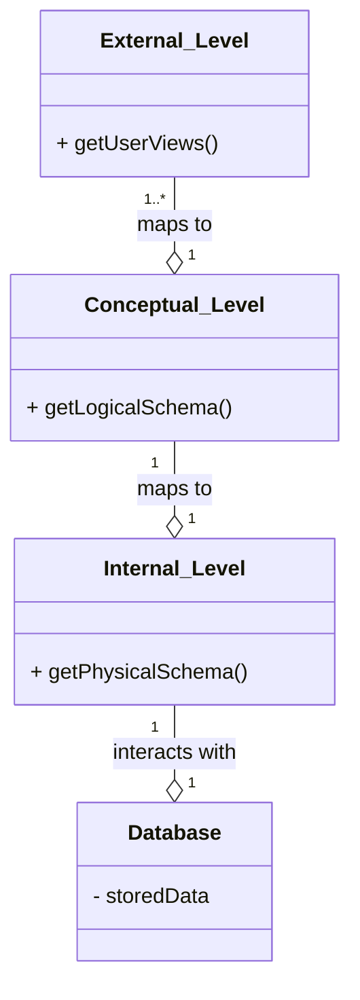
*Note: This `classDiagram` illustrates the three levels of the ANSI-SPARC architecture as distinct components and their relationships. `o--` represents optionality in mapping, while `1` and `*` indicate cardinality.*

## Context & Framework
#### How the Parts Talk to Each Other
The levels of the ANSI-SPARC architecture communicate through predefined mappings, enabling data independence. The DBMS is responsible for managing these mappings:
*   **External/Conceptual Mapping:** Translates user-specific views to the overall conceptual schema.
*   **Conceptual/Internal Mapping:** Translates the conceptual schema into the physical storage representation defined by the internal schema.
These mappings allow changes at one level (e.g., reorganizing physical storage) to be absorbed by the mapping, preventing them from propagating to higher levels (e.g., user applications), which is the essence of [[Data_Independence]].

## The Mastery Deep Dive
#### Opening the Hood: What's Inside?
The ANSI-SPARC architecture defines three distinct levels:
1.  **External Level:**
    *   This is the **users' view of the database**.
    *   It describes only that part of the database that is **relevant to a particular user or group of users**. Different users can have different external views, tailored to their specific needs and access privileges. For example, a student might see their grades and courses, while a faculty member sees the courses they teach and their students' grades.
2.  **Conceptual Level:**
    *   This represents the **community view of the database** for the entire organization.
    *   It describes **what data is stored in the database** and the **relationships among the data**, independent of any specific DBMS or physical storage details. This level provides a global, logical schema of the entire database, integrating all external views.
3.  **Internal Level:**
    *   This describes the **physical representation of the database on the computer**.
    *   It details **how the data is stored in the database**, including file organization, indexing structures, and storage allocation. This is the view that the operating system and the DBMS itself use to interact with the physical data.

#### Component Interactions
The ANSI-SPARC architecture facilitates interaction by using a DBMS to manage the mappings between these three levels. For example, when a user makes a request at the External Level, the DBMS uses the External/Conceptual mapping to translate it into an operation on the Conceptual Schema. This Conceptual operation is then translated into physical operations on the Internal Schema via the Conceptual/Internal mapping. This layered approach ensures that users and applications do not need to be aware of the underlying physical storage details, greatly simplifying development and maintenance.

## Constraints & Limitations
#### The Engineering Trade-off
While the ANSI-SPARC architecture offers significant benefits in terms of data independence and modularity, it also introduces engineering trade-offs. The multiple layers of abstraction and the need for the DBMS to manage complex mappings between schemas add overhead, which can sometimes impact performance. The initial design and implementation of these schemas and mappings require careful planning and expertise. Over-designing the levels of abstraction can lead to unnecessary complexity, while insufficient abstraction can compromise data independence.

## Significance & Application
The [[ANSI_SPARC_Three_Level_Architecture]] is a cornerstone of modern database system design. It provides a robust framework for achieving **data independence**, allowing changes to the logical or physical structure of the database without affecting application programs or user views. This significantly reduces maintenance costs, enhances flexibility, and improves the overall robustness of database systems. Its principles are applied in virtually all commercial database management systems, ensuring that data can be managed in complex, evolving environments.

## The Worked Example
Consider a database storing employee information. We'll examine how "age" might be viewed at different levels.

```text
**1. External Level (View for HR Manager):**
*   The HR manager needs to see employee details including `staffNo`, `fName`, `lName`, and `age`.
*   Their view is specific and might omit sensitive data like salary or detailed home addresses.
*   Example: `(sNo: SL41, fName: Julie, lName: Lee, age: 40)`

**2. Conceptual Level (Overall Company View):**
*   This schema defines the entire `Staff` entity with all its attributes: `staffNo`, `fName`, `lName`, `DOB` (Date of Birth), `salary`, `branchNo`, etc.
*   Crucially, `age` is *not* stored directly. Instead, `DOB` is stored, and `age` is derived from `DOB` using a calculation.
*   Example: `Staff(staffNo, fName, lName, DOB, salary, branchNo)`

**3. Internal Level (Physical Storage View):**
*   This describes how the `Staff` data is physically stored on disk.
*   `DOB` might be stored as a `DATE` data type, using a specific byte format.
*   The entire `Staff` record might be stored as a `struct` in C/C++ or a similar low-level representation.
*   Example:
    ```c
    struct STAFF {
        int staffNo;
        char fName[15];
        char lName[15];
        struct date dateOfBirth; // Stored physically
        float salary;
        int branchNo;
        // ... other physical storage details like pointer to next record
    };
    ```
    *   `age` is *never* physically stored at this level; it's a computation.

**Outcome:** The HR manager (External) sees `age`, the conceptual model stores `DOB` and derives `age`, and the internal model stores `DOB` in a raw format. Changes to how `age` is *derived* (e.g., using current date vs. year end) would only affect the conceptual-to-external mapping, not the physical storage of `DOB`, illustrating `Logical_Data_Independence`.

```
*Note: This text block demonstrates how the `age` attribute is represented and handled across the three levels, highlighting data derivation and independence.*

## The Proving Ground
*Test your mastery. Cover the solutions below to test yourself first.*

#### Level 1: The Sanity Check (Verification)
**The Component Check:** List the three levels of the [[ANSI_SPARC_Three_Level_Architecture]].
> **Solution:** The three levels are the External Level, Conceptual Level, and Internal Level.

#### Level 2: The Crucible (Mastery & Edge Cases)
**The Broken System:** A new regulation requires adding a sensitive data field to the internal physical storage of a database. Explain which levels of the [[ANSI_SPARC_Three_Level_Architecture]] should *ideally* remain unaffected by this change to physical storage, and why.
> **Solution:** Ideally, both the **External Level** (user views) and the **Conceptual Level** (overall logical view) should remain unaffected by a change to the internal physical storage (Internal Level). This is the principle of [[Physical_Data_Independence]]. The DBMS, through its Conceptual/Internal mapping, should absorb the physical storage changes, translating the conceptual schema's needs into the new physical representation without requiring changes to application programs or user views. This ensures that the logical perception of the data remains stable even when its physical implementation evolves, as detailed in `# The Mastery Deep Dive` and `# Context & Framework`.

## Key Takeaways
*   ANSI-SPARC defines External (user view), Conceptual (logical view), and Internal (physical storage) levels.
*   It separates user perception from physical data storage for flexibility.
*   Mappings between levels are managed by the DBMS to achieve data independence.

## Knowledge Graph Connections
| Concept | Connection / Relationship |
| :
-------------------------- | :
------------------------------------------------------------------------------------------ |
| [[Data_Independence]]       | The ANSI-SPARC architecture is the primary framework for achieving data independence.      |
| [[Database_Management_System]] | Modern DBMSs are designed following the principles of this three-level architecture.      |
| [[Data_Models]]             | Each level corresponds to a specific type of data model (External, Conceptual, Internal).  |
| [[Schema_Mapping]]          | The mappings between these levels are crucial for the architecture's functionality.        |
---

---

## Components Of A DBMS


## Definition
Before proceeding, ensure you master [[Database_Management_System]] and [[Database_Languages]].
The Components of a DBMS refer to the interconnected software modules and physical structures that collectively form a Database Management System, enabling it to define, create, maintain, and control database access. These components interact seamlessly to process user requests, manage data storage, enforce security, and ensure data integrity. Think of a DBMS as a complex machine, like a car: it has an engine (database manager), a steering wheel (query processor), a fuel tank (database), and a manual (system catalog) – all working together to get you from point A to point B (data management).

## The Mental Model
Imagine a bustling airport control tower (the DBMS) managing flights (data operations).
*   **Users/Programmers/DBA:** The people giving instructions (pilots, ground crew, air traffic controllers).
*   **DDL Compiler:** The team that designs and updates the runways and airport layout (database schema).
*   **Query Processor:** The dispatch team that takes a flight request and plans the optimal route.
*   **Database Manager:** The main air traffic controller, coordinating all movements and ensuring safety.
*   **File Manager:** The hangar management team, storing and retrieving planes from their physical spots.
*   **System Catalog:** The airport's master database of all flights, planes, crew, and rules.
*   **Database:** The actual planes on the ground or in the air (the stored data).

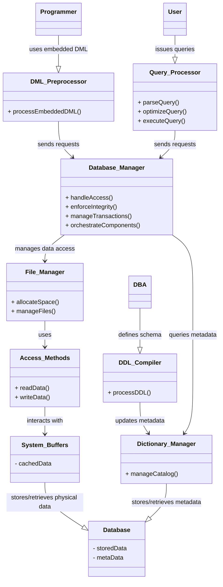
*Note: This `classDiagram` illustrates the key software components of a DBMS and their relationships. Arrows indicate interaction or dependency.*

## Context & Framework
#### How the Parts Talk to Each Other
The overall architecture of a DBMS demonstrates a sophisticated division of labor. Different users (programmers, end-users, DBAs) interact with specialized components designed to handle their specific requests. These components then communicate internally, often through the **Database Manager**, to access and manipulate the data stored in the database. This modular approach ensures efficient processing, allows for optimization, and isolates different functionalities, making the system more robust and maintainable.

## The Mastery Deep Dive
#### Opening the Hood: What's Inside?
A DBMS typically consists of several interacting components:
1.  **DDL Compiler:** Processes DDL (Data Definition Language) statements, which define the database schema. It translates these definitions into internal formats that are stored in the System_Catalog.
2.  **DML Preprocessor:** For DML (Data Manipulation Language) statements embedded in application programs, this component converts them into common function calls (e.g., C++ functions) within the host language.
3.  **Query Processor:** Handles interactive queries (e.g., SQL `SELECT` statements). It parses the query, optimizes it to find the most efficient execution plan, and then executes the plan.
4.  **Database Manager (DM):** This is the core component of the DBMS. It acts as an interface between low-level data and application programs/queries. Its responsibilities include:
    *   **Authorization Control:** Verifies user permissions for requested operations.
    *   **Integrity Checker:** Ensures data adheres to defined integrity constraints.
    *   **Transaction Manager:** Guarantees atomicity, consistency, isolation, and durability (ACID properties) for transactions.
    *   **Scheduler:** Manages the order of concurrent operations to prevent conflicts.
    *   **Buffer Manager:** Manages the main memory (buffer pool) for database data, minimizing disk I/O.
    *   **Recovery Manager:** Handles database recovery after failures.
5.  **Dictionary Manager:** Manages the System_Catalog, which is the repository of metadata (data about data) for the database.
6.  **File Manager:** Manages the allocation of disk space and the file structures used to store the actual database data.
7.  **Access Methods:** Low-level routines that provide ways to read and write data to disk, often utilizing indexes for efficient retrieval.
8.  **System Buffers:** Areas in main memory used to cache data blocks retrieved from disk, speeding up subsequent access.
9.  **Database and System Catalog:** The physical storage where the actual data and metadata (from the System Catalog) reside.

## Constraints & Limitations
#### The Engineering Trade-off
The intricate design of DBMS components, while powerful, introduces significant engineering trade-offs. The complexity of managing these interactions for optimal performance, concurrency, and fault tolerance is substantial. Each component must be highly optimized, and their seamless integration is critical. For instance, the **Query Processor** needs advanced algorithms for optimization, which can be computationally intensive. The **Transaction Manager** and **Concurrency Control Services** must balance strong consistency guarantees with high throughput, often involving complex locking mechanisms that can lead to contention. These trade-offs highlight the continuous challenge in building high-performance, reliable, and scalable database systems.

## Significance & Application
Understanding the [[Components_of_a_DBMS]] is crucial for database administrators (DBAs) to tune performance, diagnose issues, and ensure data integrity and security. For developers, it provides insight into how their applications interact with the database and helps in writing efficient queries. In academic contexts, it forms the foundation for studying database internals, distributed databases, and data warehousing. The modular nature of these components allows for specialized development and optimization, contributing to the robustness and efficiency of modern DBMSs.

## The Worked Example
This example traces a simple `INSERT` statement through the relevant DBMS components to illustrate their interaction.

```text
**Scenario:** A user wants to insert a new student record: `INSERT INTO Students (StudentID, Name) VALUES (123, 'Alice');`

1.  **User/Application Program:** Issues the `INSERT` statement.
2.  **Query Processor (or DML Preprocessor if from app):**
    *   **Parser:** Checks the syntax of the `INSERT` statement.
    *   **Optimizer:** May perform basic optimization, though `INSERT` is typically straightforward.
3.  **Database Manager:**
    *   **Authorization Control:** Checks if the user has permission to insert into the `Students` table.
    *   **Integrity Checker:** Verifies if `StudentID` 123 is unique (if it's a primary key) and if 'Alice' adheres to any `Name` constraints.
    *   **Transaction Manager:** Initiates a transaction for this `INSERT` operation.
4.  **File Manager:** Determines where in the physical storage the new student record should be placed.
5.  **Access Methods:** Writes the new record data to the appropriate disk blocks.
6.  **System Buffers:** Data might be written to buffers first, then flushed to disk.
7.  **Database (Physical Storage):** The new record is physically added.
8.  **Dictionary Manager (and System Catalog):** If this `INSERT` changes schema-level statistics (e.g., number of rows), the catalog is updated.
9.  **Database Manager:** Commits the transaction if successful, making the change permanent.

```
*Note: This text block illustrates the flow of an `INSERT` operation through the DBMS components.*

## The Proving Ground
*Test your mastery. Cover the solutions below to test yourself first.*

#### Level 1: The Sanity Check (Verification)
**The Component Check:** Name three primary components of a typical DBMS architecture.
> **Solution:** Three primary components are the DDL Compiler, Query Processor, and Database Manager.

#### Level 2: The Crucible (Mastery & Edge Cases)
**The Broken System:** A database administrator observes that despite highly optimized SQL queries, the system's performance is consistently poor. Investigation reveals a bottleneck in the "File Manager" component. Explain what the File Manager is responsible for and how a failure in this component could cause widespread performance degradation.
> **Solution:** The **File Manager** component of a DBMS is responsible for **managing the allocation of disk space and the file structures** used to store the actual database data. It handles the physical organization of data on storage devices. A bottleneck or failure in the File_Manager_Architecture would cause widespread performance degradation because it is the gatekeeper for all physical data access. Even with optimized queries from the Query Processor, if the File Manager cannot efficiently locate, read, or write data blocks on disk, every data retrieval or update operation will be severely slowed down. This directly impacts the overall throughput and responsiveness of the entire DBMS, as explained in `# Opening the Hood: What's Inside?`.

## Key Takeaways
*   DBMS comprises modules for DDL compilation, DML processing, and query execution.
*   The Database Manager is the core, handling authorization, integrity, transactions, and recovery.
*   The System Catalog (managed by Dictionary Manager) stores metadata about the database.

## Knowledge Graph Connections
| Concept | Connection / Relationship |
| :
-------------------------- | :
------------------------------------------------------------------------------------------ |
| [[Database_Management_System]] | These are the constituent parts that make up a DBMS and enable its functionality.          |
| [[Database_Languages]]      | The DDL Compiler and DML Preprocessor components directly handle database languages.      |
| System_Catalog          | The System Catalog is a fundamental component, managed by the Dictionary Manager.          |
| [[Functions_of_a_DBMS]]     | Each function of a DBMS is implemented by these various interacting components.            |
| [[Multi_User_DBMS_Architectures]] | The arrangement and interaction of these components vary across different architectures.   |
---

---

## Components Of DBMS Environment


## Definition
Before proceeding, ensure you master [[Database_Management_System]] and [[Components_of_a_DBMS]].
The Components of DBMS Environment refer to the **five basic, interacting elements that constitute a complete Database Management System setup**: Hardware, Software, Data, Procedures, and People. These components work together to ensure the efficient and effective management of an organization's data assets. Understanding each component is crucial for successful database design, implementation, and operation. Imagine a complete orchestra: you need instruments (hardware), musical scores (software), the music itself (data), the conductor's instructions (procedures), and the musicians (people) to make it work harmoniously.

## The Mental Model
Think of running a digital archive.
*   **Hardware:** The physical computers, servers, storage disks, and network cables.
*   **Software:** The operating system, the DBMS itself, and any applications that interact with the archive.
*   **Data:** The actual digital documents, images, and metadata stored in the archive.
*   **Procedures:** The rules for how to submit new documents, how to search for old ones, and how to back up the archive.
*   **People:** The archivists, IT staff, and users who interact with the system.

All five are essential for the archive to function.

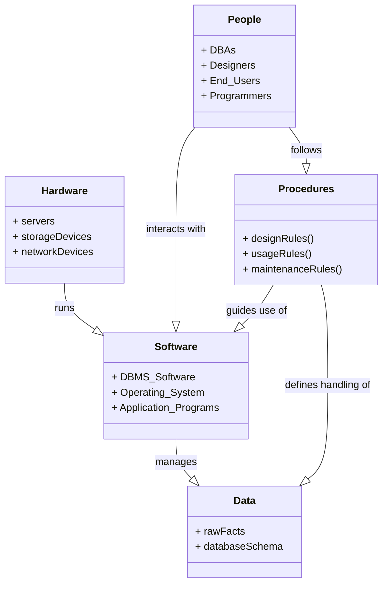
*Note: This `classDiagram` illustrates the five fundamental components of a DBMS environment and their high-level interdependencies.*

## Context & Framework
#### How the Parts Talk to Each Other
The components of a DBMS environment are interdependent, forming a cohesive ecosystem. Hardware provides the physical foundation for software to run, which in turn manages the data. People interact with the software and data by following defined procedures. This intricate interplay ensures that data is consistently processed, maintained, and accessed according to organizational rules and user needs. A failure or weakness in any one component can impact the entire system.

## The Mastery Deep Dive
#### Opening the Hood: What's Inside?
The five basic components of a DBMS environment are:

1.  **Hardware:** This refers to all the physical, electronic components that make up the computer system. It can range from a personal computer to a network of powerful servers and storage devices. Hardware includes:
    *   Processors (CPU)
    *   Main Memory (RAM)
    *   Input/Output Devices (keyboards, monitors)
    *   Storage Devices (hard drives, SSDs, tape drives for backup)
    *   Network Devices (routers, switches)
    This provides the computing and storage capacity for the DBMS.

2.  **Software:** This encompasses all the programs and applications that interact with the hardware and manage the data. Key software components include:
    *   The **DBMS itself**: The core software that manages the database.
    *   **Operating System (OS)**: Manages the computer's hardware and software resources (e.g., Windows, Linux).
    *   **Network Software**: Facilitates communication between different computers in a distributed environment.
    *   **Application Programs**: User-facing software that interacts with the database to perform specific tasks.

3.  **Data:** This is the most crucial component, representing the raw facts, figures, text, images, etc., that the organization collects and stores. It includes:
    *   The **actual data** stored in the database.
    *   The **schema**: A description of this data, defining its structure, data types, and relationships. The schema is itself a form of metadata.

4.  **Procedures:** These are the explicit instructions and rules that should be applied to the design, implementation, and use of the database and the DBMS. Procedures cover:
    *   How to install and configure the DBMS.
    *   How to create and maintain database schemas.
    *   How to perform backups and recovery.
    *   Security protocols for data access.
    *   Guidelines for application development and user interaction.

5.  **People:** This includes all the users, administrators, and developers who interact with the DBMS. Different roles include:
    *   **Database Administrators (DBAs):** Responsible for the overall control of the DBMS, including security, performance, and integrity.
    *   **Database Designers:** Responsible for identifying the data to be stored and choosing appropriate structures.
    *   **Application Programmers:** Develop the programs that interact with the database.
    *   **End-Users:** The people who use the database to perform their daily tasks.

## Constraints & Limitations
#### The Engineering Trade-off
The effective functioning of a DBMS environment requires careful integration and management of all five components, which presents engineering trade-offs. Investing heavily in high-performance hardware and sophisticated software without adequate procedures or skilled people can lead to inefficient operation. Conversely, having excellent procedures and personnel but outdated hardware or limited software can create bottlenecks. The optimal design involves balancing resources across all components, recognizing that underperforming in one area can significantly limit the effectiveness of the others.

## Significance & Application
Understanding the [[Components_of_DBMS_Environment]] is fundamental for successful database management. It provides a holistic view, emphasizing that a DBMS is not just software but a complete system involving technology, information, and human interaction. This knowledge is essential for IT professionals to design, implement, troubleshoot, and maintain robust database systems, ensuring they meet organizational needs for data integrity, security, availability, and performance.

## The Worked Example
This example demonstrates a common failure point when one of the DBMS environment components is neglected.

```text
**Scenario:** A tech startup rapidly deploys a new product with a powerful cloud-based DBMS and hires skilled developers. However, they neglect to define clear **Procedures** for database backups, user access management, or how to handle data breaches.

**Impact of Neglecting Procedures:**
*   **Hardware/Software:** The cloud infrastructure and DBMS software are robust.
*   **Data:** Data is being collected.
*   **People:** Skilled developers are building applications.
*   **Missing Procedures:**
    *   No defined backup schedule or restoration process: A data loss event (e.g., accidental deletion, cyberattack) would be catastrophic, as there's no clear way to recover data, despite the powerful hardware and software.
    *   No clear user access rules: New employees might be granted excessive permissions, leading to security vulnerabilities and potential data misuse.
    *   No incident response plan: A data breach would cause panic and chaotic response, exacerbating damage.

**Outcome:** Despite investing in top-tier technology and talent, the lack of well-defined **Procedures** cripples the system's reliability, security, and recoverability. This highlights that all five components must be robust for a DBMS environment to be truly effective.

```
*Note: This text block illustrates the critical importance of `Procedures` in a DBMS environment.*

## The Proving Ground
*Test your mastery. Cover the solutions below to test yourself first.*

#### Level 1: The Sanity Check (Verification)
**The Component Check:** List the five basic components of a DBMS environment.
> **Solution:** The five basic components are Hardware, Software, Data, Procedures, and People.

#### Level 2: The Crucible (Mastery & Edge Cases)
**The Broken System:** A company invests heavily in cutting-edge DBMS software and powerful hardware but neglects the "Procedures" and "People" components of its [[Components_of_DBMS_Environment]]. Predict the likely problems this company will face in effectively utilizing its database system, even with advanced technology.
> **Solution:** A company neglecting "Procedures" and "People" in its [[Components_of_DBMS_Environment]], despite having cutting-edge software and hardware, will likely face severe problems. Without proper **Procedures** (e.g., for data entry, backup, recovery, security protocols), the system will suffer from **data inconsistency**, **loss of data integrity**, **security vulnerabilities**, and a **chaotic response to failures**. Without skilled **People** (DBAs, designers, trained users), the powerful DBMS will be **misconfigured, underutilized, or misused**, leading to poor performance, ineffective data management, and a failure to meet organizational objectives. The advanced technology alone cannot compensate for a lack of human expertise and well-defined operational guidelines, as explained in `# Opening the Hood: What's Inside?` and `# Constraints & Limitations`.

## Key Takeaways
*   A DBMS environment comprises Hardware, Software, Data, Procedures, and People.
*   Hardware provides physical resources; software runs the DBMS and applications.
*   Data includes raw facts and the schema (its description).
*   Procedures are rules for design, use, and maintenance; people are the users and managers.

## Knowledge Graph Connections
| Concept | Connection / Relationship |
| :
-------------------------- | :
------------------------------------------------------------------------------------------ |
| [[Database_Management_System]] | These components form the complete ecosystem within which a DBMS operates.                 |
| [[Components_of_a_DBMS]]    | The DBMS software itself is a critical part of the overall software component of the environment. |
| [[DBMS_Benefits_and_Drawbacks]] | The success in realizing DBMS benefits depends on the effective integration of all these components. |
| [[Multi_User_DBMS_Architectures]] | Different architectures determine how the software and hardware components are distributed. |
---

---

## DBMS Benefits And Drawbacks


## Definition
Before proceeding, ensure you master [[Database_Management_System]] and [[Data_Independence]].
DBMS Benefits and Drawbacks refers to the comprehensive set of advantages gained and challenges faced when implementing and utilizing a Database Management System. These systems are designed to overcome the limitations of traditional file-based data management, but they introduce their own set of complexities and costs. Thinking of a DBMS is like hiring a highly skilled project manager for your data: they bring immense organization and efficiency, but also command a salary and require specific tools.

## The Mental Model
Imagine you're running a small cafe.
**Before DBMS (File-Based):** You have separate notebooks for "Orders," "Customers," and "Ingredients." If a customer changes their address, you might have to update multiple notebooks. If you want to know which ingredient is most popular with which customer, it's a manual, error-prone task.
**With DBMS:** You have a centralized system. A customer's address is stored once. When you want a report, the system instantly links orders to customers and ingredients. This is faster and more accurate, but setting up the system (the initial investment and learning curve) requires effort.

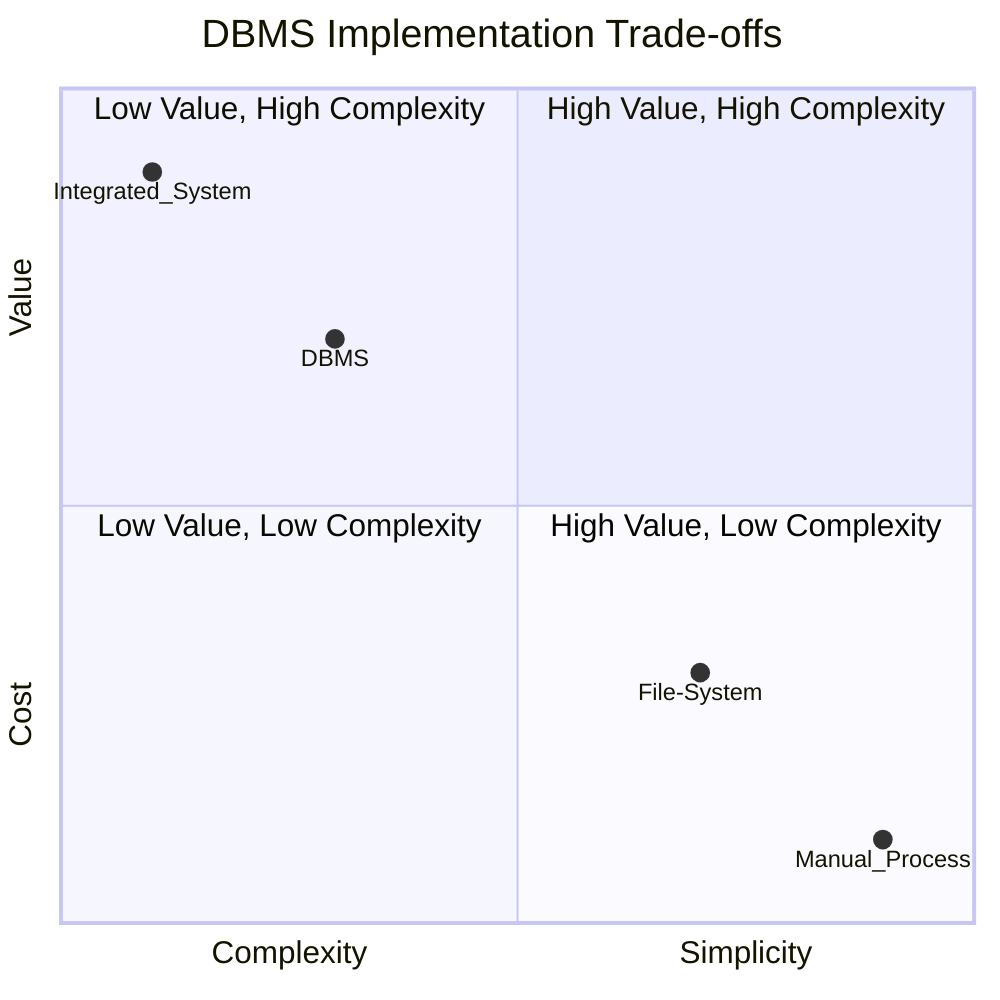
*Note: The x and y axes range from 0.0 to 1.0. Lower values on the x-axis indicate higher complexity, higher values indicate greater simplicity. Lower values on the y-axis indicate higher cost, higher values indicate greater value. This chart visually represents the trade-offs of different data management approaches.*

## Context & Framework
#### The Hard Choice: Option A or Option B?
Organizations often face the critical decision of whether to invest in a DBMS. This decision is rarely black and white, as it involves weighing the significant operational and strategic advantages against the considerable resource commitments. The choice impacts everything from data integrity and security to development costs and system performance. Understanding this inherent trade-off is crucial for informed decision-making in database management.

## The Mastery Deep Dive
#### The Hard Choice: Option A or Option B?
The decision to adopt or upgrade a DBMS presents a hard choice between enhanced data management capabilities and increased system overhead. On one hand, a DBMS offers **control of data redundancy**, ensuring data consistency across the organization by storing information in a single, well-defined location. It also provides **improved data integrity** through enforced rules and constraints, leading to more reliable information. Furthermore, features like **improved security** (controlling access to specific data) and **data sharing** among multiple users foster a more collaborative and secure data environment. These benefits directly contribute to **increased productivity** and the ability to extract **more information from the same amount of data**, leading to better business insights.

On the other hand, a DBMS introduces **complexity** in terms of design, implementation, and administration. It often comes with a significant **cost** (software licenses, specialized hardware), and requires **additional hardware costs** to handle the processing demands. The **cost of conversion** from existing systems can also be substantial. These systems can sometimes impact **performance** if not properly optimized, and a **higher impact of a failure** means that any system downtime can be more catastrophic due to centralized data. Balancing these conflicting requirements is the core challenge.

#### The Devil's Advocate: Why might this be wrong?
While the benefits of a DBMS are compelling, it's essential to consider the counter-arguments. For very small, simple applications with minimal data and a single user, the overhead of a full-fledged DBMS (complexity, cost, size) might outweigh the advantages. In such niche scenarios, a simpler file-based system, despite its inherent limitations, might appear more 'efficient' due to lower initial investment and reduced administrative burden. The challenge lies in accurately assessing the future growth and complexity of data needs.

## Constraints & Limitations
#### The Hard Choice: Option A or Option B?
Implementing a DBMS involves navigating a complex web of conflicting requirements. Balancing the desire for robust data integrity and security with the need for high performance and cost-effectiveness is a continuous challenge. Organizations must consider their unique operational context, the volume and velocity of their data, and their budget to make informed decisions about DBMS features and configurations. Over-engineering a solution can lead to unnecessary complexity and cost, while under-engineering can result in critical data management failures.

## Significance & Application
The decision to adopt a DBMS is a strategic one, impacting an organization's ability to operate efficiently, make informed decisions, and remain competitive. The benefits are particularly pronounced in industries that rely heavily on data, such as finance, healthcare, and logistics, where data integrity, security, and accessibility are paramount. Understanding these trade-offs is vital for IT professionals, business analysts, and decision-makers in evaluating and justifying database investments.

## The Worked Example
This example illustrates the decision-making process for choosing between a simple file system and a DBMS for a small online retail store.

```text
**Scenario:** A small online store (2 employees) tracks 50 products and 100 customer orders per month. They currently use CSV files.

**Option A: Continue with CSV Files**
*   **Pros:** Low cost, simple to implement for current scale.
*   **Cons:**
    *   **Data Redundancy:** Customer address stored in multiple order files.
    *   **Data Inconsistency:** Manual updates lead to different addresses in different files.
    *   **Security:** Anyone with access to the server can view all data.
    *   **Concurrency:** Two employees editing the same customer record at the same time can lead to data loss.
    *   **Integrity:** No checks to ensure product IDs are valid.

**Option B: Implement a Basic DBMS (e.g., SQLite or PostgreSQL)**
*   **Pros:**
    *   **Control of Data Redundancy:** Centralized customer data, single update point.
    *   **Data Consistency:** Enforced integrity rules prevent conflicting data.
    *   **Improved Security:** User roles/permissions can restrict access.
    *   **Concurrency Control:** Multiple users can access/update data safely.
    *   **Data Integrity:** Can define rules (e.g., product ID must exist).
*   **Cons:**
    *   **Complexity:** Requires learning SQL, database administration.
    *   **Cost:** Potential licensing for commercial DBMS, hardware upgrades.
    *   **Size:** DBMS software itself consumes resources.

**Decision:** For growth, even a small store will quickly find CSV files unmanageable. The initial overhead of a basic DBMS is a worthwhile investment to mitigate future data integrity and scalability issues.

```
*Note: This text block illustrates a trade-off analysis.*

## The Proving Ground
*Test your mastery. Cover the solutions below to test yourself first.*

#### Level 1: The Sanity Check (Verification)
**The Fact Check:** List three key advantages of employing a Database Management System.
> **Solution:** Three key advantages include control of data redundancy, improved data integrity, and improved security.

#### Level 2: The Crucible (Mastery & Edge Cases)
**The Lose-Lose Scenario:** A startup with limited resources needs to manage a growing dataset. They face the choice between investing heavily in a full-featured DBMS (high cost, complexity) or continuing with file-based data storage (poor data integrity, security risks). Justify the 'least bad' choice, explaining the critical factors that make it preferable despite its drawbacks.
> **Solution:** The "least bad" choice for a growing startup would be to **invest in a full-featured DBMS**, even with its high initial cost and complexity. While file-based storage has low initial cost, it presents **insurmountable issues for growth**, specifically: **poor data integrity** (no enforced rules leading to errors), **high data redundancy** (wasting space and causing inconsistencies), **lack of concurrency control** (data corruption with multiple users), and **negligible security**. These issues quickly become critical as data grows, leading to higher long-term costs in terms of data loss, operational inefficiencies, and security breaches. The DBMS, despite initial hurdles, provides the **foundational robustness, scalability, and integrity features** essential for long-term data management, aligning with its role in `defining, creating, maintaining, and controlling access` as discussed in the [[Database_Management_System]] note and the trade-offs explored in `# The Hard Choice` section.

## Key Takeaways
*   DBMS offers control of redundancy, improved integrity, security, and data sharing.
*   Drawbacks include complexity, cost, resource demands, and higher impact of failure.
*   The choice to implement a DBMS requires balancing these benefits and drawbacks against organizational needs.

## Knowledge Graph Connections
| Concept | Connection / Relationship |
| :
-------------------------- | :
------------------------------------------------------------------------------------------ |
| [[Database_Management_System]] | These are the specific advantages and disadvantages inherent to using a DBMS.             |
| [[Data_Independence]]       | Improved maintenance through data independence is a key advantage of DBMS.                 |
| [[Multi_User_DBMS_Architectures]] | Different DBMS architectures aim to optimize these benefits and mitigate drawbacks.        |
| [[Relational_Data_Model]]   | The relational model specifically addresses issues like data redundancy and consistency. |
---

---

## Data Independence


## Definition
Before proceeding, ensure you master [[ANSI_SPARC_Three_Level_Architecture]] and [[Database_Management_System]].
Data Independence is a fundamental concept in database systems that refers to the **ability of upper layers of the database architecture to remain immune to changes in lower layers**. Essentially, it means that modifications to the schema at one level should not require changes to the schema at higher levels. This isolation is critical for maintaining flexibility, reducing development costs, and ensuring the longevity of database applications. Imagine changing the engine of a car (physical implementation) without needing to redesign the dashboard (user view) or change how the driver operates it.

## The Mental Model
Think of a website that displays product prices.
**Without Data Independence:** If the database changes how it stores prices (e.g., from `DECIMAL` to `INT` representing cents), every part of the website code that displays prices might need to be rewritten.
**With Data Independence:** The website only requests "product price." The database system handles the conversion or mapping internally. Changes in storage format don't affect the application code. This is because there's a layer of abstraction (like an adapter) that shields the application from internal database changes.

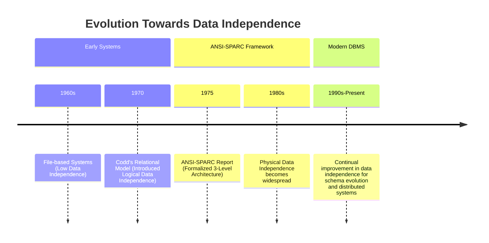
*Note: This `timeline` illustrates the historical progression of data independence in database systems.*

## Context & Framework
#### The Problem: Why Did We Invent This?
Historically, applications were tightly coupled to the physical storage structures of data. Any change to how data was stored (e.g., adding a new field, changing a file format) required extensive modifications to all application programs that accessed that data. This lack of flexibility led to high maintenance costs and hindered system evolution. Data independence was invented to break this rigid coupling, allowing databases to evolve without forcing a cascade of changes across all dependent applications.

## The Mastery Deep Dive
#### Version 1.0 vs. Today
The concept of data independence directly addresses the rigid coupling between application programs and data storage that characterized early file-based systems. Before data independence, applications were deeply "aware" of physical storage details. This meant that even minor changes to the physical layout of data would necessitate significant rewrites of application code, making systems inflexible and costly to maintain. The development of data independence, particularly formalized through the [[ANSI_SPARC_Three_Level_Architecture]], provided critical layers of abstraction. This allowed the evolution of databases from tightly integrated, dependent systems to modular architectures where different aspects of data management could change independently.

#### The "Same Story, Different Setting"
The concept of abstraction, which underpins data independence, is a pervasive theme in computer science. Similar to how an operating system abstracts away hardware complexities from applications, or how object-oriented programming hides implementation details behind interfaces, data independence shields higher-level database components from lower-level changes. This design philosophy promotes modularity, maintainability, and reusability across various computing domains.

## Constraints & Limitations
#### The Engineering Trade-off
Achieving high levels of [[Data_Independence]] involves engineering trade-offs. The introduction of multiple abstraction layers and schema mappings (as seen in the [[ANSI_SPARC_Three_Level_Architecture]]) adds complexity to the DBMS itself and can introduce some performance overhead due to the translation processes. While the benefits of flexibility and reduced maintenance often outweigh these costs for complex systems, simpler applications might find the overhead unnecessary. The challenge lies in designing a DBMS that provides sufficient independence without sacrificing unacceptable levels of performance or introducing excessive architectural complexity.

## Significance & Application
Data independence is a cornerstone of modern database design and a key reason for the widespread adoption of Database Management Systems. It drastically reduces the cost and effort required to maintain and evolve database applications by allowing schema modifications at one level without affecting others. This flexibility enables organizations to adapt their databases to changing business needs and technological advancements with greater agility, making systems more robust and long-lived.

## The Worked Example
This example demonstrates a situation where Data Independence prevents application code changes despite a database schema change.

```text
**Scenario:** A company database initially stores `Employee` records with a single `Address` column (e.g., "123 Main St, Anytown, CA 90210"). An application `PayrollApp` accesses this `Address`.

**Change:** The DBA decides to split the `Address` column into `Street`, `City`, `State`, and `ZipCode` for better data granularity and querying.

**Without Data Independence:**
*   The `PayrollApp`'s code explicitly accesses `Employee.Address`.
*   After the database change, `Employee.Address` no longer exists.
*   The `PayrollApp` breaks and requires extensive modification to access `Employee.Street`, `Employee.City`, etc., and then reconstruct the full address.

**With Data Independence (via ANSI-SPARC architecture and mappings):**
*   The `PayrollApp`'s external view still expects an `Address` field.
*   The **External/Conceptual Mapping** (managed by the DBMS) is updated. It now knows to construct the `Address` for `PayrollApp` by concatenating `Street`, `City`, `State`, and `ZipCode` from the conceptual schema.
*   The `PayrollApp` continues to access `Employee.Address` without any code changes. The underlying schema change is hidden.

**Outcome:** The `PayrollApp` is immune to the change in the conceptual schema, demonstrating [[Logical_Data_Independence]]. If the DBA later decides to store `Street` in a different file format (a physical change), [[Physical_Data_Independence]] would prevent even the conceptual schema from needing modification.

```
*Note: This text block illustrates how data independence shields an application from schema changes.*

## The Proving Ground
*Test your mastery. Cover the solutions below to test yourself first.*

#### Level 1: The Sanity Check (Verification)
**The Fact Check:** What is the main concept behind [[Data_Independence]] in a DBMS?
> **Solution:** The main concept behind Data Independence is that upper layers of the database architecture are immune to changes in lower layers.

#### Level 2: The Crucible (Mastery & Edge Cases)
**The Broken System:** A software team decides to directly embed physical storage details (e.g., file paths, record offsets) into their application code. Discuss how this decision fundamentally compromises [[Data_Independence]], leading to extreme maintenance difficulties and a high risk of application breakage with even minor database schema changes.
> **Solution:** Directly embedding physical storage details into application code **completely compromises [[Data_Independence]]** because it tightly couples the application to the lowest level of the database architecture. Any change to the physical storage (e.g., moving a file, changing a record format, upgrading hardware) will directly break the application, requiring extensive and costly code rewrites. This eliminates the flexibility and evolvability that data independence provides, making the system brittle and difficult to maintain. This scenario directly opposes the purpose of the [[ANSI_SPARC_Three_Level_Architecture]] which aims to insulate applications from such low-level changes, as explained in `# The Problem: Why Did We Invent This?` and `# Constraints & Limitations`.

## Key Takeaways
*   Data independence means changes at one schema level don't affect higher levels.
*   It is achieved through abstraction layers and schema mappings in a DBMS.
*   This concept reduces maintenance costs and increases application flexibility.

## Knowledge Graph Connections
| Concept | Connection / Relationship |
| :
-------------------------- | :
------------------------------------------------------------------------------------------ |
| [[ANSI_SPARC_Three_Level_Architecture]] | This architecture is the foundational framework for achieving data independence.           |
| [[Database_Management_System]] | Data independence is a key benefit and design goal of modern DBMSs.                       |
| [[Logical_Data_Independence]] | A specific type of data independence, focusing on the conceptual and external levels.      |
| [[Physical_Data_Independence]] | A specific type of data independence, focusing on the internal and conceptual levels.      |
| [[Schema_Mapping]]          | Schema mappings are the mechanisms that enable data independence between levels.           |
---

---

## Data Models


## Definition
Before proceeding, ensure you master [[Database_Management_System]] and [[Relational_Data_Model]].
A Data Model is an **integrated collection of concepts for describing data, relationships between data, and constraints on the data within an organization**. Its primary **purpose is to represent data in an understandable way**, providing an abstract blueprint for the database's structure and behavior. Data models dictate how information is organized and accessed, serving as the foundation upon which a database is built. Imagine a data model as the architectural plan for a building: it defines the rooms, their relationships, and the rules of construction before a single brick is laid.

## The Mental Model
Think of data models as different ways of drawing a map for a city.
*   **Object-based:** Focuses on the "landmarks" (entities) and their individual characteristics and behaviors, like describing a building's unique features and how people interact with it.
*   **Record-based:** Focuses on standard "street layouts" (fixed format records), like mapping out a grid of streets and blocks, where each block has a consistent size.
*   **Physical:** Focuses on the actual "underground infrastructure" (physical storage), like detailing where the water pipes and electrical lines are buried.

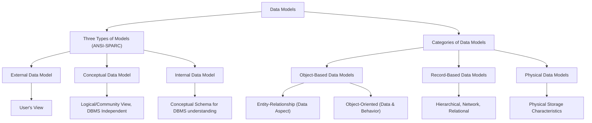
*Note: This `graph TD` diagram illustrates the classification of data models based on ANSI-SPARC and general categories.*

## Context & Framework
#### The Family Tree
Data models form a crucial "family tree" in database design, starting from highly abstract views down to concrete physical implementations. This hierarchy is essential for achieving data independence, as defined by the ANSI-SPARC architecture. Each level of modeling serves a distinct purpose, from capturing user requirements to optimizing physical storage, while remaining conceptually linked.

## The Mastery Deep Dive
#### The Translator: Converting English to Math
Data models comprise a structural part (defining types of data, relationships, and constraints), a manipulative part (defining operations on data), and potentially a set of integrity rules.

**Categories of Data Models:**
*   **Object-Based Data Models:** These are based on the concept of an **Entity** (a distinct object) and its relationships.
    *   **[[Entity_Relationship_Data_Model]] (ERM):** Primarily considers the data aspect and relationships between entities.
    *   **Object-Oriented Data Model:** Considers both data and behavior (methods) associated with objects.
*   **Record-Based Data Models:** These models are based on fixed-format records, where each record has a fixed number of fields, and each field is of a fixed length. Examples include the Hierarchical, Network, and [[Relational_Data_Model]]s.
*   **Physical Data Models:** These models describe the physical storage characteristics of the database on disk, focusing on how data is actually stored.

**Three Types of Models (In-line with ANSI-SPARC):**
The ANSI-SPARC architecture defines three levels of data models, each providing a different perspective:
1.  An **External Data Model**: Represents each user's view of the organization, sometimes called the Universe of Discourse (UoD). It shows only the data relevant to a particular user.
2.  A **Conceptual Data Model**: Represents the logical (or community) view of the entire organization's data. It is DBMS independent and describes *what data is stored* and *relationships among the data*.
3.  An **Internal Data Model**: Represents the conceptual schema in such a way that it can be understood by the DBMS. It describes *how data is stored* in the database.

**Conceptual Modelling** is the process of developing a conceptual data model, an accurate representation of an organization's data requirements, independent of implementation details. **Logical Modeling** assumes knowledge of the underlying data model of the target DBMS, translating the conceptual model into a specific DBMS-ready design.

## Constraints & Limitations
#### The Engineering Trade-off
Choosing the right data model involves significant engineering trade-offs. A highly abstract conceptual model is flexible but needs to be translated into a more concrete logical model for implementation. Record-based models like the relational model excel at structured data but may struggle with highly complex or semi-structured data, where object-based models might be more suitable. Physical data models optimize for performance and storage but are hardware-dependent and can be inflexible. Each model type has strengths and weaknesses, requiring designers to select the most appropriate one for their specific data and application needs.

## Significance & Application
Data models are the bedrock of database design and implementation. They provide a common language for designers, developers, and users to understand the data requirements of an organization. A well-designed data model ensures data integrity, consistency, and efficient retrieval, which are critical for the success of any data-driven application. Understanding the different types and levels of data models is essential for effective database system development and management.

## The Worked Example
This example shows how a simple real-world concept of "Student Enrollment" is represented across different levels of data models.

```text
**Scenario:** A university wants to manage student enrollments in courses.

**1. External Data Model (Student's View):**
*   A student only sees their enrolled courses, their grades, and their personal contact information. They don't see other students' grades or faculty salaries.
*   View: `StudentName`, `CourseTitle`, `Grade`.

**2. Conceptual Data Model (University's Logical View):**
*   This is the holistic view of all data. It defines entities like `Student`, `Course`, `Faculty`, `Enrollment`.
*   Relationships: `Student` `ENROLLS_IN` `Course` (many-to-many), `Faculty` `TEACHES` `Course` (one-to-many).
*   Attributes: For `Student` - `StudentID`, `Name`, `DOB`. For `Course` - `CourseID`, `Title`, `Credits`. For `Enrollment` - `StudentID`, `CourseID`, `Grade`.
*   Constraints: `StudentID` must be unique. `Grade` must be A-F.

**3. Internal Data Model (DBMS's View/Physical Description):**
*   This describes how the conceptual model is actually stored in the specific DBMS.
*   Example:
    *   `Student` table stored as a B-tree index on `StudentID`.
    *   `Course` table stored as a heap file.
    *   `Enrollment` table linked via foreign keys, stored as a clustered index on (`StudentID`, `CourseID`).
    *   Data types: `StudentID` as `INT`, `CourseName` as `VARCHAR(50)`.
*   This level reveals details like file organization, indexing strategies, and actual data types supported by the DBMS.

**Outcome:** Each model provides a necessary layer of abstraction, from what a specific user sees (External) to the full organizational logic (Conceptual), down to how the DBMS physically handles the data (Internal).

```
*Note: This text block demonstrates the application of the three ANSI-SPARC data models to a single scenario.*

## The Proving Ground
*Test your mastery. Cover the solutions below to test yourself first.*

#### Level 1: The Sanity Check (Verification)
**The Neighbor Check:** State the primary purpose of a [[Data_Models]].
> **Solution:** The primary purpose of a data model is to represent data, relationships, and constraints in an understandable way.

#### Level 2: The Crucible (Mastery & Edge Cases)
**The Impostor:** A data analyst presents a diagram showing relationships between tables and columns. While useful, they mistakenly call it a "physical data model." Explain why this is incorrect and describe what a true Physical_Data_Models would represent.
> **Solution:** The analyst's diagram describing table and column relationships is likely a **logical data model** (like a relational schema or an ER diagram at a conceptual level), which focuses on *what* data is stored and *how it relates logically*. It's incorrect to call it a "physical data model" because a true Physical_Data_Models would represent *how the data is physically stored* on disk. This includes details like file organizations (e.g., sequential, indexed sequential), indexing strategies (e.g., B-trees, hash indexes), specific storage devices, and internal record formats, which are low-level details abstracted away by logical models, as discussed in `# The Mastery Deep Dive` about `Categories_of_Data_Models` and `Three_Types_of_Models (ANSI-SPARC)`.

## Key Takeaways
*   Data models define data, relationships, and constraints in an understandable way.
*   Categories include Object-based (ER, OO), Record-based (Hierarchical, Network, Relational), and Physical models.
*   ANSI-SPARC defines three levels: External (user view), Conceptual (logical view), and Internal (DBMS's physical view).

## Knowledge Graph Connections
| Concept | Connection / Relationship |
| :
-------------------------- | :
------------------------------------------------------------------------------------------ |
| [[Database_Management_System]] | DBMSs are built upon and manage data according to specific data models.                    |
| [[Relational_Data_Model]]   | The relational model is a prominent example of a record-based data model.                  |
| [[Entity_Relationship_Data_Model]] | The ER model is a widely used example of an object-based conceptual data model.          |
| [[ANSI_SPARC_Three_Level_Architecture]] | This architecture provides the framework for the three types of data models.             |
| [[Data_Independence]]       | Data models at different levels facilitate logical and physical data independence.         |
---

---

## Database Languages


## Definition
Before proceeding, ensure you master [[Database_Management_System]] and [[Data_Models]].
Database Languages are specialized programming languages used to **define, manipulate, and control access to data within a database management system (DBMS)**. They provide the interface through which users and applications interact with the database, allowing for tasks ranging from creating table structures to querying specific information and managing user permissions. Think of database languages as the specific dialects you use to "talk" to the database, each serving a distinct purpose in managing the digital library.

## The Mental Model
Imagine you're building a house. You have two main tools:
1.  **Blueprints and Specifications (DDL):** This is how you define the structure of the house—the number of rooms, where the walls go, the foundation. You're creating the *framework*.
2.  **Tools to Move Things Around (DML):** Once the house is built, these are the tools you use to put furniture in rooms, paint walls, or rearrange items. You're *interacting with the contents* within the existing structure.

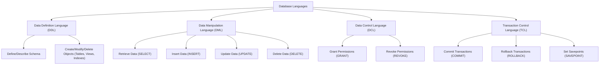
*Note: This `graph TD` diagram illustrates the different categories of database languages and their primary functions.*

## Context & Framework
#### The Family Tree
Database languages can be broadly categorized, creating a hierarchy of purpose and function. At the top level are languages for defining the structure (DDL) and manipulating the data (DML). These categories further branch into more specialized types, reflecting increasing levels of abstraction and automation over time. Understanding this hierarchy is key to grasping how different language elements contribute to the overall database management process.

## The Mastery Deep Dive
#### The Translator: Converting English to Math
Database languages allow users to communicate with the DBMS in a structured, formal way.
**Data Definition Language (DDL)** is used by the Database Administrator (DBA) or users to **describe and name the entities, attributes, and relationships** required for the application, along with any associated integrity and security constraints. Examples include `CREATE TABLE`, `ALTER TABLE`, and `DROP TABLE`. Its purpose is to define the database schema.

**Data Manipulation Language (DML)** provides the basic operations for **manipulating data** held in the database. This includes retrieving, inserting, updating, and deleting data. DMLs can be further classified:
*   **Procedural DML** requires the user to tell the system *exactly how* to manipulate data (e.g., specifying file paths and record sequences). This is common in older systems or low-level programming.
*   **Non-Procedural DML** allows the user to state *what data is needed* rather than *how it is to be retrieved*. SQL's `SELECT` statement is a prime example, where the user specifies criteria, and the DBMS handles the optimization of data retrieval. This provides greater data independence.

**Fourth Generation Languages (4GLs)** are a step above traditional DMLs, often incorporating automated tools (like **Automated CASE tools**) and higher-level constructs to simplify database application development. They aim to be even more user-friendly and declarative, reducing programming effort.

#### Component Interactions
Database languages are the primary interface between users, application programs, and the DBMS. When a DDL statement is issued, a DDL compiler processes it to update the system catalog. DML statements are processed by a query processor, which optimizes and executes the data manipulation requests. This interaction ensures that language commands are correctly interpreted and executed against the database, adhering to its defined schema and constraints.

## Constraints & Limitations
#### The Engineering Trade-off
The choice and application of database languages involve inherent engineering trade-offs. While powerful, DDL requires careful planning to define robust schemas, as changes can impact dependent applications. DMLs, especially non-procedural ones, offer flexibility but rely heavily on the DBMS's query optimizer for efficient execution. Procedural DMLs offer fine-grained control but sacrifice data independence. The use of 4GLs can accelerate development but might introduce limitations in terms of customization or performance for highly specialized tasks.

## Significance & Application
Database languages are fundamental to the operation and development of any database system. They are essential tools for DBAs, developers, and data analysts to manage database structures, query and update information, and ensure data security and integrity. Proficiency in these languages, especially SQL (a blend of DDL and DML), is a core skill in the field of data management and software development.

## The Worked Example
This example demonstrates both DDL and DML statements, showing how they define structure and manipulate data.

```sql
-- DDL Example: Creating a new table for 'Courses'
CREATE TABLE Courses (
    courseID      VARCHAR(10) PRIMARY KEY,
    courseName    VARCHAR(50) NOT NULL,
    credits       INT CHECK (credits > 0)
);
-- This defines the structure of the Courses table.

-- DML Example: Inserting data into the 'Courses' table
INSERT INTO Courses (courseID, courseName, credits)
VALUES ('CS101', 'Introduction to Programming', 3);
-- This manipulates (adds) data within the defined structure.

-- DML Example: Updating data in the 'Courses' table
UPDATE Courses
SET credits = 4
WHERE courseID = 'CS101';
-- This manipulates (modifies) existing data.

-- DML Example: Retrieving data from the 'Courses' table (Non-Procedural DML)
SELECT *
FROM Courses
WHERE credits > 3;
-- This asks for *what* data is needed (courses with >3 credits), not *how* to find it.
```
*Note: This SQL code showcases examples of DDL (CREATE TABLE) and DML (INSERT, UPDATE, SELECT) statements, demonstrating their distinct roles.*

## The Proving Ground
*Test your mastery. Cover the solutions below to test yourself first.*

#### Level 1: The Sanity Check (Verification)
**The Neighbor Check:** List the two primary categories of database languages and their main purpose.
> **Solution:** The two primary categories are Data Definition Language (DDL) for defining schema, and Data Manipulation Language (DML) for manipulating data.

#### Level 2: The Crucible (Mastery & Edge Cases)
**The Impostor:** A database administrator issues a command `ALTER TABLE Employees ADD COLUMN hire_date DATE;`. This command looks like it belongs to DML due to "manipulation," but it's actually DDL. Explain why this command is DDL and not DML, highlighting the core difference in what DDL affects.
> **Solution:** The command `ALTER TABLE Employees ADD COLUMN hire_date DATE;` is DDL because it **modifies the schema (structure) of the database table**, not the actual data content within the rows. DDL commands (like `CREATE`, `ALTER`, `DROP`) define or change the database's blueprint. DML commands (like `INSERT`, `UPDATE`, `DELETE`, `SELECT`) operate on the *data instances* (records/tuples) that exist *within* that defined structure, as clarified in `# The Translator: Converting English to Math`. The key difference is that DDL changes the *rules* for the data, while DML changes the *data itself* according to those rules.

## Key Takeaways
*   Database languages define (DDL) and manipulate (DML) data in a DBMS.
*   DDL defines the database schema and constraints (e.g., `CREATE TABLE`).
*   DML performs data operations like retrieval, insertion, update, and deletion (`SELECT`, `INSERT`).
*   DML can be procedural (how to) or non-procedural (what is needed).

## Knowledge Graph Connections
| Concept | Connection / Relationship |
| :
-------------------------- | :
------------------------------------------------------------------------------------------ |
| [[Database_Management_System]] | Database languages are the primary interface for interacting with a DBMS.                 |
| [[Data_Models]]             | DDL is used to implement the structural components of a chosen data model.                 |
| [[Relational_Data_Model]]   | SQL, a prominent database language, is primarily used with the relational data model.      |
| [[ANSI_SPARC_Three_Level_Architecture]] | Database languages are used to define and manage schemas at different levels of this architecture. |
---

---

## Database Management System


## Definition
Before proceeding, ensure you master [[Data_Models]] and [[Database_Languages]].
A Database Management System (DBMS) is a software system that **enables users to define, create, maintain, and control access to a database**. It acts as an intermediary between users and the database, facilitating structured data storage and retrieval. Think of a DBMS as a highly organized librarian for your digital information, who not only stores books but also keeps track of who can read which book, ensures no two copies conflict, and retrieves specific information upon request. It's the engine behind any modern data-driven application.

## The Mental Model
Imagine a bustling library. The "Client" is a student who needs a specific book. The "Server" is the librarian who manages all the books, retrieves them, and checks them out. The network is the pathway the student uses to communicate their request to the librarian, and for the librarian to deliver the book.

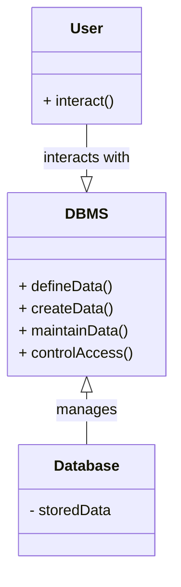
*Note: This `classDiagram` shows the core components: `User` (interacting entity), `DBMS` (management system), and `Database` (data store). Arrows indicate interaction and management roles.*

## Context & Framework
#### Opening the Hood: What's Inside?
At its core, a DBMS comprises several interconnected components working in harmony. These include a **Query Processor** to interpret user commands, a **Storage Manager** to handle data access, and a **Transaction Manager** to ensure data consistency and recovery. Each component plays a vital role in translating user requests into actions on the physical data, enforcing rules, and optimizing performance. This layered architecture allows for a separation of concerns, making the system more modular and robust.

## The Mastery Deep Dive
#### Component Interactions
The primary way a user or application interacts with a DBMS is by issuing requests, often in the form of SQL statements, to the DBMS. The DBMS then interprets these requests, validates them against defined rules, and executes the necessary operations on the database. This process often involves coordinating with various internal components, such as the query optimizer to find the most efficient way to retrieve data, and the concurrency control mechanisms to handle multiple simultaneous users without conflicts. Understanding this request-response cycle is fundamental to comprehending how a DBMS operates.

#### How the Parts Talk to Each Other
Different parts of a DBMS communicate through well-defined interfaces and protocols. For example, when a user executes an SQL query, the **Query Processor** first parses and validates the query. It then passes an optimized execution plan to the **Database Manager**, which coordinates with the **File Manager** and **Access Methods** to retrieve the actual data from storage. The results are then assembled and returned to the user. This structured communication ensures that each component can perform its specialized task efficiently and reliably.

## Constraints & Limitations
#### The Engineering Trade-off
Implementing and maintaining a DBMS involves significant engineering trade-offs. While providing numerous benefits like data integrity and security, DBMSs introduce complexity, require substantial hardware resources (size), and can be costly in terms of software licenses and conversion efforts. Furthermore, a failure in the DBMS itself can have a higher impact compared to a simpler file-based system, as it affects all data and applications. These factors necessitate careful planning and resource allocation.

## Significance & Application
A DBMS is indispensable for any organization dealing with large volumes of data that require efficient storage, retrieval, and management. It provides the infrastructure for critical business functions such as inventory management, customer relationship management (CRM), financial transactions, and scientific data analysis. In academic settings, understanding DBMS is foundational for computer science students, enabling them to design and implement robust data-driven applications.

## The Worked Example
This example demonstrates a basic interaction with a conceptual DBMS, showing how a user request is processed.

```text
User Request: "Find all students enrolled in 'Database Systems'."

1.  **Application Program:** Submits an SQL query: `SELECT * FROM Students WHERE Course = 'Database Systems';`
2.  **DBMS Query Processor:**
    *   **Parser:** Checks query syntax.
    *   **Optimizer:** Determines the most efficient way to retrieve the data (e.g., use an index on the 'Course' column).
3.  **DBMS Database Manager:**
    *   **Access Methods:** Locates the physical data blocks on disk containing student records.
    *   **Buffer Manager:** Loads required data blocks from disk into memory.
    *   **Concurrency Control (if multi-user):** Ensures no other user is modifying the same data simultaneously.
4.  **DBMS Execution:** Reads relevant student records from memory.
5.  **Result Set:** Returns the matching student data to the application program.
6.  **Application Program:** Displays the student list to the user.
```
*Note: This text block illustrates the logical flow of a query within a DBMS.*

## The Proving Ground
*Test your mastery. Cover the solutions below to test yourself first.*

#### Level 1: The Sanity Check (Verification)
**The Component Check:** Identify the fundamental roles of a database management system in handling data for users and applications.
> **Solution:** A DBMS allows users to define, create, maintain, and control access to a database.

#### Level 2: The Crucible (Mastery & Edge Cases)
**The Broken System:** A small business attempts to manage its data using only spreadsheets. Analyze the inherent problems and explain how introducing a [[Database_Management_System]] would address these issues, considering aspects beyond simple storage.
> **Solution:** Managing data with spreadsheets leads to severe issues like **data redundancy** (same data copied multiple times), **data inconsistency** (different versions of the same data), lack of **data integrity** (no enforced rules), and poor **security** (easy unauthorized access). A DBMS addresses these by providing a centralized, structured system with **data definition** (schemas), **data integrity constraints**, **concurrency control** for multiple users, and robust **security mechanisms**, ensuring reliable and consistent data access. This directly ties into the DBMS's core function of *defining, creating, maintaining, and controlling access* to the database, as discussed in the `# Definition` and `# The Mastery Deep Dive` sections.

## Key Takeaways
*   A DBMS is software for defining, creating, maintaining, and controlling database access.
*   It acts as a crucial intermediary, translating user requests into actions on physical data.
*   The system involves inherent trade-offs between its benefits (integrity, security) and drawbacks (complexity, cost).

## Knowledge Graph Connections
| Concept | Connection / Relationship |
| :
-------------------------- | :
------------------------------------------------------------------------------------------ |
| [[Data_Models]]             | DBMSs implement and manage data according to specific data models.                         |
| [[Database_Languages]]      | DBMSs process and respond to commands written in database languages.                        |
| [[DBMS_Benefits_and_Drawbacks]] | DBMS features provide significant advantages but also introduce complexities.             |
| [[Components_of_a_DBMS]]    | The functionality of a DBMS is achieved through its various integrated components.          |
---

---

## Functions Of A DBMS


## Definition
Before proceeding, ensure you master [[Database_Management_System]] and System_Catalog.
The Functions of a DBMS refer to the diverse set of capabilities and services provided by a Database Management System to effectively manage and control data. These functions extend beyond simple storage, encompassing everything from defining data structures and ensuring data integrity to supporting multiple users concurrently and recovering from failures. Think of a DBMS as a highly specialized digital city manager: it's not just about building houses (storing data), but also about setting zoning laws (data definition), managing traffic (concurrency), providing utility services (recovery), and keeping a city directory (system catalog).

## The Mental Model
Imagine you are managing a large, constantly changing library:
*   **Data Storage, Retrieval, Update:** The core task of getting books in and out, and changing their records.
*   **User-Accessible Catalog:** The library's public index, telling you what books are available and where.
*   **Transaction Support:** Ensuring that if someone checks out a book, it's either fully checked out or not at all (no half-checked-out books).
*   **Concurrency Control:** Managing multiple people checking out books simultaneously without conflicts.
*   **Recovery Services:** If the library burns down, having a backup plan to restore all the books and records.
*   **Authorization Services:** Deciding who can access which books (e.g., restricted section).
*   **Integrity Services:** Ensuring all books are properly categorized and follow library rules.
*   **Data Independence:** Changing how books are physically shelved without affecting how users search for them.
*   **Utility Services:** Tasks like importing new books in bulk or archiving old ones.

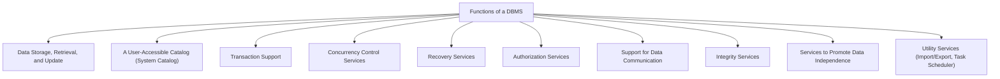
*Note: This `graph TD` diagram enumerates the key functions provided by a DBMS.*

## Context & Framework
#### The Family Tree
The functions of a DBMS can be broadly grouped into categories that reflect its core responsibilities: managing data itself, managing interactions with data, and managing the overall system health. This multi-faceted role ensures that a DBMS is not merely a storage container but an intelligent system capable of intricate data governance and robust operational support. Each function is critical to achieving the overarching goals of data integrity, security, and availability.

## The Mastery Deep Dive
#### Opening the Hood: What's Inside?
The capabilities of a DBMS are comprehensive, spanning several key areas:
*   **Data Storage, Retrieval, and Update:** This is the most fundamental function, allowing users to store new data, fetch existing data, and modify information efficiently.
*   **A User-Accessible Catalog (System Catalog):** The System_Catalog is a repository of metadata, storing information *about the data* in the database (e.g., table names, column types, relationships, user permissions). It's essentially the DBMS's "data about data," making the system self-describing.
*   **Transaction Support:** Ensures that a sequence of database operations is treated as a single, atomic unit. This means either all operations in the transaction complete successfully, or none of them do, maintaining data consistency.
*   **Concurrency Control Services:** Manages simultaneous access by multiple users to prevent conflicts and ensure that data remains consistent, even when many operations are happening at once.
*   **Recovery Services:** Provides mechanisms to restore the database to a consistent state after hardware or software failures, protecting against data loss.
*   **Authorization Services:** Manages user permissions, allowing the DBA to define who can access what data and what operations they can perform, enforcing data security.
*   **Support for Data Communication:** Handles interactions with various client applications and network protocols to facilitate data exchange.
*   **Integrity Services:** Enforces a set of rules and constraints (e.g., primary key uniqueness, referential integrity) to ensure the accuracy and consistency of data.
*   **Services to Promote Data Independence:** Enables changes to the database schema at one level (e.g., physical storage) without affecting other levels (e.g., user views).
*   **Utility Services:** Includes a range of tools for tasks like importing/exporting data, monitoring performance, and scheduling maintenance tasks.

## Constraints & Limitations
#### The Engineering Trade-off
The extensive functionality of a DBMS, while highly beneficial, comes with engineering trade-offs. Implementing robust concurrency control and recovery mechanisms adds significant complexity and resource overhead. Balancing strict data integrity rules with the need for high performance can be a challenge. Providing data independence requires multiple layers of schema mapping, which can introduce processing costs. Designers must carefully weigh these factors, selecting features and configurations that align with the specific requirements and constraints of their application.

## Significance & Application
The various functions of a DBMS collectively contribute to its role as a powerful and indispensable tool for modern data management. They ensure that data is not only stored but also protected, made reliable, and accessible in a controlled and efficient manner. These functions are critical for maintaining the operational integrity of businesses, supporting decision-making processes, and enabling the development of complex, data-intensive applications across all sectors.

## The Worked Example
This example demonstrates how a DBMS's transaction and recovery services work together during a simple bank transfer to ensure data integrity.

```text
**Scenario:** Transfer $100 from Account A to Account B.

**Without DBMS Transaction/Recovery:**
1.  Debit $100 from Account A.
2.  System crashes *before* crediting Account B.
3.  Result: $100 is lost from Account A, never reaching Account B. **Data Inconsistency.**

**With DBMS Transaction/Recovery:**
1.  **BEGIN TRANSACTION;**
2.  Debit $100 from Account A. (Temporary change)
3.  If successful: Credit $100 to Account B. (Temporary change)
4.  If both successful: **COMMIT;** (All changes become permanent)
5.  If any step fails (e.g., system crash after step 2): **ROLLBACK;** (All temporary changes are undone, Account A is restored to its original state).

**Outcome:** The DBMS treats the debit and credit as an **atomic unit**. If anything goes wrong, the entire transaction is rolled back, guaranteeing that the database remains in a consistent state. This is a core part of its `Transaction Support` and `Recovery Services` functions.

```
*Note: This text block illustrates the atomic nature of transactions and the role of recovery in maintaining consistency.*

## The Proving Ground
*Test your mastery. Cover the solutions below to test yourself first.*

#### Level 1: The Sanity Check (Verification)
**The Neighbor Check:** List three core functions that a DBMS performs.
> **Solution:** Three core functions are Data Storage, Retrieval, and Update; a User-Accessible Catalog; and Transaction Support.

#### Level 2: The Crucible (Mastery & Edge Cases)
**The Impostor:** A database system advertises "built-in reporting tools" as its primary strength. While useful, explain why these reporting tools are *not* considered a fundamental function of the DBMS itself, but rather a utility or application layer feature.
> **Solution:** While built-in reporting tools are valuable, they are **utility services** or application-level features, not fundamental functions of the DBMS core. The core `Functions_of_a_DBMS` are those absolutely essential for managing the database's integrity, security, and basic operations (like storage, retrieval, transaction management, concurrency control, and recovery). Reporting tools typically *use* the data managed by these core functions to present information, but they are not directly involved in the low-level management and preservation of the data itself. A DBMS can operate perfectly well without integrated reporting, as discussed in `# Opening the Hood: What's Inside?`.

## Key Takeaways
*   DBMS functions include data storage/retrieval, transaction/concurrency control, and recovery.
*   The System Catalog provides metadata, making the database self-describing.
*   Authorization, integrity, data communication, and data independence are also key functions.

## Knowledge Graph Connections
| Concept | Connection / Relationship |
| :
-------------------------- | :
------------------------------------------------------------------------------------------ |
| [[Database_Management_System]] | These functions define the capabilities and services provided by a DBMS.                   |
| System_Catalog          | The System Catalog is a specific function of a DBMS, storing metadata about the database.  |
| [[Components_of_a_DBMS]]    | Each function is implemented by one or more components within the DBMS architecture.       |
| [[DBMS_Benefits_and_Drawbacks]] | The provision of these functions explains the advantages of using a DBMS.                  |
---

---

## History Of Database Systems


## Definition
Before proceeding, ensure you master [[Database_Management_System]] and [[Data_Models]].
The History of Database Systems traces the evolution of methods for storing, organizing, and retrieving data over several decades, driven by increasing data volumes and the need for more complex data relationships. This journey from early file processing to modern distributed databases reflects continuous innovation to address limitations in data independence, flexibility, and query capabilities. Imagine the history of databases like the evolution of transportation: from simple carts (file systems) to trains (hierarchical/network), then cars (relational), and finally complex air traffic control systems (object-oriented/distributed).

## The Mental Model
Think of the evolution of filing cabinets:
*   **1st Gen (Hierarchical/Network):** Like a rigid, single-topic filing cabinet. You can only put a file in one specific drawer, and if you want to find something related to it, you have to follow a very specific path. Very fast if you know the exact path, but hard to reorganize or find unexpected connections.
*   **2nd Gen (Relational):** Like a highly organized library with index cards (tables). Each card (record) has unique identifiers, and you can cross-reference any card with any other, making it very flexible. You don't care *where* the book is, just *what* it is and its category.
*   **3rd Gen (Object-Orientational/Relational):** Imagine the library now having smart books that not only contain information but also know how to perform actions (methods) related to their content.

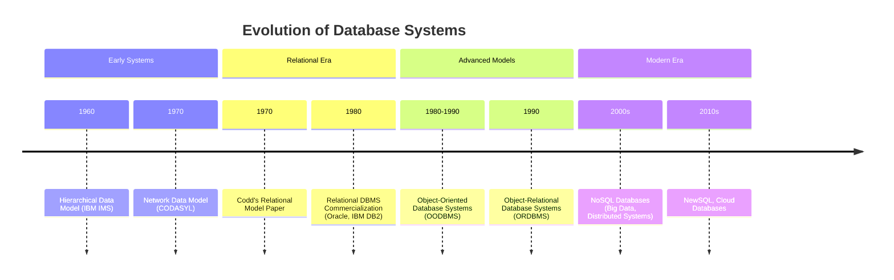
*Note: `timeline` diagrams display chronological events to illustrate evolution.*

## Context & Framework
#### The Problem: Why Did We Invent This?
The evolution of database systems has been a direct response to the inherent limitations of earlier data storage methods, primarily file processing systems. These older systems suffered from issues like **data redundancy**, **inconsistency**, difficulty in **data sharing**, and **poor data independence**. Each generation of database models introduced innovations to address these problems, seeking to provide more flexible, robust, and efficient ways to manage increasingly complex data.

## The Mastery Deep Dive
#### Version 1.0 vs. Today
The journey of database systems began with **First-Generation Data Models**, which include the **Hierarchical Data Model** and the **Network Data Model**. These models represented data in tree-like structures (hierarchical) or more complex graph structures (network), allowing for defined relationships. However, they were characterized by a "navigational" and "procedural" approach, meaning users needed to know the physical database structure to access data, and operations were record-at-a-time. Adding new record types or relationships often required database redefinition.

The **Second-Generation Data Model** introduced the revolutionary **Relational Data Model**, primarily conceptualized by Dr. Edgar F. Codd. This model views data as a collection of two-dimensional tables (relations), where rows are tuples and columns are attributes. Relationships are established by shared data values between fields. The key innovation was its "declarative" approach, allowing users to state *what* data they needed rather than *how* to retrieve it, providing greater data independence and flexibility.

The **Third-Generation Data Models** emerged to address the limitations of relational models in handling complex, multimedia, or object-oriented data. This includes **Object-Relational Data Models** (ORDBMS), which extend relational systems with object-oriented features, and **Object-Oriented Data Models** (OODBMS), which directly store data as objects, incorporating both data and behavior. These generations sought to integrate the strengths of object-oriented programming with database capabilities, offering richer data types and more complex structures.

#### The "Same Story, Different Setting"
The fundamental challenges driving database evolution – managing complexity, ensuring data integrity, and providing flexible access – are echoed in many other areas of computer science, such as the development of programming languages (from procedural to object-oriented) or operating system architectures. Each iteration seeks to abstract away underlying complexities and provide a more powerful, user-friendly interface for managing resources.

## Constraints & Limitations
#### The Engineering Trade-off
Each generation of database systems, while addressing previous limitations, introduced its own set of engineering trade-offs. First-generation models offered high performance for specific queries but lacked flexibility. The relational model provided unparalleled flexibility and data independence but sometimes at the cost of performance for very complex relationships. Third-generation models aimed to bridge the gap but often struggled with standardization and adoption. These trade-offs highlight the continuous struggle to balance efficiency, flexibility, and ease of use in data management.

## Significance & Application
Understanding the history of database systems is crucial for appreciating the design principles and challenges of modern databases. It provides context for why certain architectural choices were made and helps in selecting the most appropriate database technology for a given application. The progression from rigid, navigation-based systems to flexible, declarative, and object-aware models reflects the increasing demands for complex data handling and distributed computing in various industries.

## The Worked Example
This example traces a simple query through the conceptual differences of a Hierarchical model versus a Relational model to demonstrate the shift in data access.

```text
**Scenario:** Find the salary of "John White" who works in "London".

**1. Hierarchical Data Model (Conceptual Trace):**
*   **Challenge:** You must navigate a predefined path.
*   **Path:** Start at "Branch (London)" -> Find "Staff (John White)" -> Get "Salary".
*   **Constraint:** If John White was in a different branch, the query path would change. If you wanted all staff in London, you'd navigate the branch and then list all its children. The structure dictates access.

**2. Relational Data Model (Conceptual Trace):**
*   **Challenge:** You don't need to know the physical links.
*   **Query (SQL-like):** `SELECT salary FROM Staff WHERE fName = 'John' AND IName = 'White' AND branchNo IN (SELECT branchNo FROM Branch WHERE city = 'London');`
*   **Flexibility:** The query declares *what* data is needed. The DBMS optimizer determines the *how* (e.g., using indexes, joining tables). John White could be in any branch, and the query structure remains largely the same, making it robust to changes in underlying data storage.

**Outcome:** The Relational model provides greater logical independence, allowing more flexible queries without needing to know the "physical" navigation paths, which was a significant improvement over the hierarchical and network models.

```
*Note: This text block illustrates a comparison of access methods between data models.*

## The Proving Ground
*Test your mastery. Cover the solutions below to test yourself first.*

#### Level 1: The Sanity Check (Verification)
**The Fact Check:** Name the three main generations of database systems.
> **Solution:** The three main generations are First-generation (Hierarchical and Network), Second-generation (Relational), and Third-generation (Object-Relational and Object-Oriented).

#### Level 2: The Crucible (Mastery & Edge Cases)
**The Lose-Lose Scenario:** A legacy system uses a first-generation Hierarchical_Data_Model. A new requirement emerges for complex many-to-many relationships that are cumbersome to implement. Discuss the fundamental limitations of the Hierarchical_Data_Model that lead to this difficulty, and why an immediate migration might not be feasible, creating a difficult choice between maintaining legacy complexity or undergoing a costly overhaul.
> **Solution:** The Hierarchical_Data_Model inherently supports **one-to-many relationships** (a parent can have many children, but a child only one parent). Implementing many-to-many relationships requires complex workarounds (e.g., duplicating data, creating junction records with redundant pointers), which lead to **increased data redundancy, inconsistency, and complex navigational logic**. An immediate migration is often not feasible due to **high conversion costs**, **application rewrites**, and potential **business disruption**. This creates a "lose-lose" scenario where maintaining the legacy system incurs ongoing technical debt and inefficiency, while migrating requires significant upfront investment and risk, highlighting the strategic trade-offs in database evolution discussed in `# The Problem: Why Did We Invent This?` and `# Constraints & Limitations`.

## Key Takeaways
*   Database systems evolved through three generations to address limitations of prior models.
*   First-generation (Hierarchical, Network) offered rigid, procedural access.
*   Second-generation (Relational) introduced flexible, declarative, table-based data management.
*   Third-generation (Object-Relational, Object-Oriented) integrated object-oriented concepts for complex data.

## Knowledge Graph Connections
| Concept | Connection / Relationship |
| :
-------------------------- | :
------------------------------------------------------------------------------------------ |
| [[Database_Management_System]] | The evolution of data models is central to the development of DBMS capabilities.           |
| [[Relational_Data_Model]]   | The relational model is a key innovation from the second generation of databases.          |
| [[Data_Models]]             | The different generations represent distinct approaches to data modeling.                  |
| [[DBMS_Benefits_and_Drawbacks]] | Historical shifts were driven by attempts to maximize benefits and minimize drawbacks.     |
---

---

## Multi User DBMS Architectures


## Definition
Before proceeding, ensure you master [[Database_Management_System]] and [[Client_Server_Architecture]].
Multi-User DBMS Architectures refer to the various structural designs used to implement Database Management Systems that support simultaneous access and interaction by multiple users. These architectures define how application processing, database management, and data storage functions are distributed across a network. They evolved from centralized 'dumb' terminal systems to increasingly distributed and flexible models to meet the demands of modern business environments. Imagine designing a city's water supply: from a single well with buckets (teleprocessing) to a central reservoir with pipes to each house (file-server), and then a sophisticated network of local pumps and purification plants (client-server).

## The Mental Model
Think of different ways a group of people might share a complex puzzle.
*   **Teleprocessing (The "Boss" Does It All):** One person is the "puzzle master." Everyone else just tells the puzzle master what piece they want, and the master finds and places it. All the work happens in one central brain.
*   **File-Server (The "Shared Box"):** Everyone gets a copy of the puzzle *pieces* (the database files), but each person has their own small table to work on (their workstation running the DBMS). If someone places a piece, they have to shout across the room to see if anyone else has a conflicting piece. It's easy to create chaos.
*   **Client-Server (The "Collaborative Team"):** Each person has their own small board (client) to visualize their part, but there's a dedicated "puzzle coordinator" (server) who ensures pieces are correctly placed, handles all conflicts, and maintains the master puzzle board. Everyone trusts the coordinator.

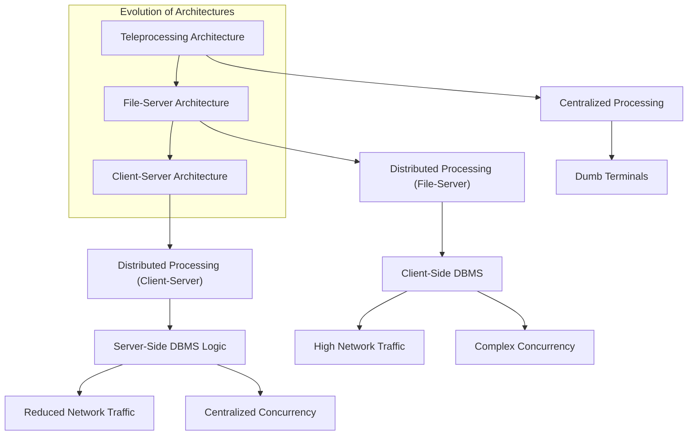
*Note: This `graph TD` diagram illustrates the evolution and key characteristics of multi-user DBMS architectures. Arrows indicate progression or relationship.*

## Context & Framework
#### Opening the Hood: What's Inside?
The choice of a multi-user DBMS architecture profoundly impacts system performance, scalability, and maintainability. Each architecture distributes the "intelligence" and workload differently across the network. Understanding these distributions is key to grasping their advantages and disadvantages. From early centralized processing to modern distributed models, the aim has always been to optimize resource utilization and user experience for multiple simultaneous interactions with a shared database.

## The Mastery Deep Dive
#### Follow the Ball: A Slow-Motion Trace
Multi-User DBMS Architectures have evolved significantly:

1.  **Teleprocessing:**
    *   **Architecture:** The traditional model where there is a **single central processing unit (CPU)** that runs the application programs and the DBMS. A number of 'dumb' terminals are cabled to this main computer. These terminals are incapable of functioning on their own.
    *   **Processing Flow:** User input from a terminal is sent to the central CPU, processed, and the output is sent back for display. The central computer carries out all the work, including formatting data for display.
    *   **Disadvantage:** Places a **tremendous burden on the central computer**, leading to performance bottlenecks as the number of users increases. It also lacks flexibility and resilience.

2.  **File-Server Architecture:**
    *   **Architecture:** The processing is distributed across a network, typically a Local Area Network (LAN). The **file-server holds the database files**, but the **applications and the DBMS run on each individual workstation** requesting those files.
    *   **Processing Flow:** A workstation runs the DBMS, which sends requests for data files to the file-server. The file-server acts simply as a shared hard disk drive, returning entire data files or blocks of files. The workstation then processes this data locally.
    *   **Disadvantages:**
        *   **Large amount of network traffic:** Entire files or large blocks are transferred, even for small data requests.
        *   **Full copy of the DBMS required on each workstation:** Increases resource consumption on client machines.
        *   **Complex concurrency, recovery, and integrity control:** Multiple DBMS instances on different workstations accessing the same files simultaneously lead to complex coordination issues and higher risk of data corruption.

These architectures laid the groundwork for the more advanced [[Client_Server_Architecture]], which addressed many of their limitations by intelligently distributing processing tasks.

#### Component Interactions
In multi-user architectures, components like user terminals, workstations, and servers interact by sending requests and responses across a network. The way these interactions are structured (e.g., whether the DBMS runs on the client or a dedicated server) defines the architecture's characteristics. This influences where processing logic resides, the volume of network traffic, and how data integrity and concurrency are managed for shared access.

## Constraints & Limitations
#### The Engineering Trade-off
The choice of a multi-user DBMS architecture involves critical engineering trade-offs between cost, performance, scalability, and manageability. Teleprocessing, while simple in its early form, quickly hits scalability limits. File-server architectures offer some distribution but introduce massive network overhead and complex concurrency problems. These limitations highlight the continuous challenge of designing systems that can efficiently serve many users accessing shared data reliably, pushing the evolution towards more sophisticated models.

## Significance & Application
Understanding different [[Multi_User_DBMS_Architectures]] is essential for designing and implementing database systems that can effectively support collaborative work and large user bases. From the historical context of teleprocessing and file-server models, one can appreciate the innovations that led to modern client-server and tiered architectures, which are ubiquitous in today's networked applications, from corporate intranets to global web services.

## The Worked Example
This example illustrates the difference in network traffic between a file-server architecture and a more optimized approach for a simple data request.

```text
**Scenario:** A user wants to retrieve the name of a single customer from a large `Customers` table (10,000 records, 1MB total size).

**1. File-Server Architecture:**
*   **User Action:** Runs an application on their workstation that issues a `SELECT` query.
*   **DBMS (on Workstation):** Needs to process the query. To do this, it requests the entire `Customers` data file from the file-server.
*   **File-Server Action:** Sends the entire 1MB `Customers` file over the network to the workstation.
*   **Workstation Action:** Receives the 1MB file, loads it, processes the `SELECT` query locally, and extracts the customer name (e.g., 20 bytes).
*   **Network Traffic:** High (1MB for 20 bytes of actual data needed).

**2. More Optimized Architecture (e.g., Client-Server):**
*   **User Action:** Runs a client application that sends a `SELECT` query to a database server.
*   **Client Application Action:** Sends the query string (e.g., "SELECT Name FROM Customers WHERE CustomerID = 'C123'") over the network (a few KB).
*   **Database Server Action (running DBMS):** Receives the query, processes it directly on the server where the data resides, and extracts only the relevant customer name.
*   **Database Server Action:** Sends *only the customer name* (e.g., 20 bytes) back to the client.
*   **Network Traffic:** Low (a few KB for the query, 20 bytes for the result).

**Outcome:** The file-server architecture generates significantly more network traffic because the DBMS processing is client-side, requiring large data transfers. This highlights a key disadvantage and why more intelligent architectures evolved.

```
*Note: This text block demonstrates the network traffic implications of different multi-user architectures.*

## The Proving Ground
*Test your mastery. Cover the solutions below to test yourself first.*

#### Level 1: The Sanity Check (Verification)
**The Component Check:** Name two common architectures used to implement multi-user database management systems.
> **Solution:** Two common architectures are Teleprocessing and File-Server.

#### Level 2: The Crucible (Mastery & Edge Cases)
**The Broken System:** A small office uses a file-server architecture for its database. As the number of users grows, they experience severe network slowdowns and data corruption issues. Explain the fundamental disadvantages of the File_Server_Architecture that lead to these problems, particularly regarding network traffic and concurrency control.
> **Solution:** The File_Server_Architecture inherently leads to severe network slowdowns because a full copy of the DBMS runs on each workstation, requiring **entire database files or large blocks of data to be transferred across the network** for almost every operation. This generates a **large amount of network traffic**. Data corruption issues arise due to complex **concurrency control**; with multiple independent DBMS instances simultaneously accessing and modifying the same physical files, coordinating updates and ensuring data consistency becomes extremely difficult, leading to conflicts and potential data loss, as detailed in `# The Mastery Deep Dive`. This architectural flaw makes it unscalable for growing user bases.

## Key Takeaways
*   Multi-user architectures define how DBMS functions are distributed across a network.
*   Teleprocessing is a centralized model with dumb terminals, prone to bottlenecks.
*   File-server architectures distribute processing to workstations but cause high network traffic and complex concurrency.

## Knowledge Graph Connections
| Concept | Connection / Relationship |
| :
-------------------------- | :
------------------------------------------------------------------------------------------ |
| [[Database_Management_System]] | These architectures describe different ways a DBMS can be deployed to serve multiple users. |
| [[Client_Server_Architecture]] | Client-server architecture evolved to address the limitations of teleprocessing and file-server models. |
| [[DBMS_Benefits_and_Drawbacks]] | Architectural choices directly impact the advantages and disadvantages experienced by users. |
| [[Components_of_a_DBMS]]    | The distribution of DBMS components defines the nature of these multi-user architectures.   |
---

---

## Schema Mapping


## Definition
Before proceeding, ensure you master [[Data_Independence]] and [[ANSI_SPARC_Three_Level_Architecture]].
Schema Mapping refers to the **process of transforming requests and data between different levels of the ANSI-SPARC three-level architecture**, primarily between external views, the conceptual schema, and the internal schema. These mappings are the mechanisms that make **data independence** possible, allowing changes at one level to be absorbed without affecting others. The DBMS is solely responsible for managing these transformations. Imagine schema mapping as a universal translator that allows different departments in a company to speak their own jargon while still sharing and understanding core information, all handled by a central language expert (the DBMS).

## The Mental Model
Think of a postal service.
*   **External View (Your Address):** You know your personal mailing address.
*   **Conceptual Schema (City Map):** The city has a comprehensive map of all streets and house numbers.
*   **Internal Schema (GPS Coordinates/Delivery Route):** The postal worker's GPS or internal routing system translates your address into precise coordinates and an optimized delivery path.

**Schema Mapping** is the process by which:
1.  Your friend uses your mailing address (External) which the postal service translates to a point on the city map (Conceptual).
2.  The city map address (Conceptual) is then translated by the postal service's internal system into an exact delivery route (Internal) for the mail carrier.
Changes to the postal worker's internal routing (Internal) don't change your mailing address (External) or the city map (Conceptual).

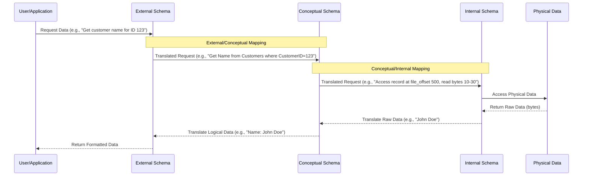
*Note: This `sequenceDiagram` illustrates the flow of a data request from a user through the three schema levels, with the DBMS managing the mappings at each step.*

## Context & Framework
#### How the Parts Talk to Each Other
[[Schema_Mapping]] is the explicit mechanism that allows the different levels of the [[ANSI_SPARC_Three_Level_Architecture]] to communicate and interact effectively. These mappings translate data definitions and requests from one level to another, ensuring that each level can operate independently while still contributing to a coherent, unified database system. The DBMS acts as the central orchestrator, using these mappings to perform the necessary transformations seamlessly.

## The Mastery Deep Dive
#### Follow the Ball: A Slow-Motion Trace
[[Schema_Mapping]] is the provision within a DBMS for achieving [[Data_Independence]] by defining how different schema levels relate. The DBMS is fully responsible for managing these mappings. There are two primary types:

1.  **External/Conceptual Mapping:**
    *   This mapping enables the DBMS to **translate data requests and definitions between an external schema (a user's view) and the conceptual schema (the overall logical view)**.
    *   It allows the DBMS to map names and structures in the user's view onto the relevant part of the conceptual schema. For example, if a user's external view has a column `Customer_Age`, but the conceptual schema stores `Customer_DateOfBirth`, the external/conceptual mapping defines how `Customer_Age` is derived from `Customer_DateOfBirth`.
    *   This mapping is crucial for [[Logical_Data_Independence]], ensuring that changes to the conceptual schema do not affect existing external views or application programs.

2.  **Conceptual/Internal Mapping:**
    *   This mapping enables the DBMS to **translate data requests and definitions between the conceptual schema and the internal schema (the physical storage representation)**.
    *   It defines how the logical records and relationships in the conceptual schema are represented in terms of physical storage. This involves mapping logical data types to physical data types, specifying file organizations, and defining indexing strategies.
    *   This mapping is essential for [[Physical_Data_Independence]], allowing changes to physical storage structures (e.g., using different file organizations, moving data to new devices) without affecting the conceptual schema. The DBMS uses this mapping to find the actual records or combinations of records in physical storage that constitute a logical record in the conceptual schema.

#### Component Interactions
When a user or application issues a query through an external schema, the DBMS first uses the **External/Conceptual Mapping** to translate this request into terms understood by the conceptual schema. Then, the **Conceptual/Internal Mapping** takes this conceptual request and translates it into specific physical operations (e.g., file reads, index lookups) on the internal schema. This multi-stage translation process, entirely managed by the DBMS, ensures that data can be accessed and manipulated efficiently while maintaining the separation and independence of the different schema levels.

## Constraints & Limitations
#### The Engineering Trade-off
While [[Schema_Mapping]] is vital for data independence, it comes with engineering trade-offs. The mappings themselves add a layer of indirection, which can introduce a performance overhead as the DBMS performs translations for every data request. Designing and maintaining these mappings, especially in complex database systems with numerous external views and evolving physical storage strategies, can be a significant administrative task. Achieving perfect transparency for all changes across all levels is a continuous challenge, often requiring careful balancing between flexibility and performance.

## Significance & Application
[[Schema_Mapping]] is the technical backbone that underpins data independence, a critical feature for the flexibility and longevity of database systems. By providing clear rules for translation between schema levels, it allows for independent evolution of data views, logical models, and physical storage. This enables database administrators to optimize storage and performance without breaking applications, and allows developers to build applications without needing to know the intricate physical details of data storage.

## The Worked Example
This example shows how schema mappings handle a query from an external view, translating it through the conceptual and internal levels.

```text
**Scenario:** An application `ReportGenerator` (using an external schema) requests "Get all employees earning over $50,000".

**1. External View's Request:** `SELECT EmployeeName, EmployeeSalary FROM MyEmployeesView WHERE EmployeeSalary > 50000;`
    *   `EmployeeName` is perceived as one field.
    *   `EmployeeSalary` is perceived as one field.

**2. External/Conceptual Mapping (DBMS translates):**
    *   The conceptual schema has `Staff` table with `fName`, `lName`, `salary`.
    *   The mapping translates `EmployeeName` to `fName || ' ' || lName` (concatenation).
    *   The mapping translates `EmployeeSalary` to `salary`.
    *   Conceptual Query: `SELECT fName || ' ' || lName, salary FROM Staff WHERE salary > 50000;`

**3. Conceptual/Internal Mapping (DBMS translates):**
    *   The internal schema describes `Staff` records on disk, where `fName` is `char[15]`, `lName` is `char[15]`, `salary` is `float`.
    *   The mapping translates the logical `Staff` table to specific file names, record structures, and access methods for these `char` and `float` fields.
    *   Internal Operations: Access `STAFF_FILE`, read bytes for `fName`, `lName`, `salary` fields, apply comparison, return matching records.

**Outcome:** The `ReportGenerator` application (External) remains completely unaware of how `EmployeeName` is constructed or how `salary` is physically stored. The DBMS handles all the complex transformations through schema mappings, ensuring that the application can function independently.

```
*Note: This text block illustrates a query's journey through external, conceptual, and internal schemas via schema mappings.*

## The Proving Ground
*Test your mastery. Cover the solutions below to test yourself first.*

#### Level 1: The Sanity Check (Verification)
**The Transformation: Before and After:** What is the primary role of [[Schema_Mapping]] in a DBMS architecture?
> **Solution:** The primary role of Schema Mapping is to transform requests and data between different levels of the ANSI-SPARC three-level architecture, enabling data independence.

#### Level 2: The Crucible (Mastery & Edge Cases)
**The Reality Check: Theory vs. Real Life:** A new database application is being developed where the external view directly exposes physical storage details (e.g., specific table files, disk blocks) to the user. Explain how this design choice completely undermines the purpose of [[Schema_Mapping]] and [[Data_Independence]].
> **Solution:** This design choice completely undermines the purpose of [[Schema_Mapping]] and [[Data_Independence]] because it **bypasses the abstraction layers** that these concepts are designed to provide. If an external view directly exposes physical storage details, then any change to the internal schema (e.g., reorganizing disk blocks, changing file names, migrating to new storage hardware) would directly break the external view and any applications using it. This eliminates both [[Logical_Data_Independence]] and [[Physical_Data_Independence]], making the system incredibly brittle, expensive to maintain, and resistant to any performance optimizations or architectural evolutions, as explained in `# The Mastery Deep Dive` about `External/Conceptual Mapping` and `Conceptual/Internal Mapping`.

## Key Takeaways
*   Schema mapping transforms data requests and definitions between schema levels.
*   External/Conceptual mapping links user views to the logical conceptual schema.
*   Conceptual/Internal mapping links the conceptual schema to physical storage.
*   The DBMS manages these mappings to enable data independence.

## Knowledge Graph Connections
| Concept | Connection / Relationship |
| :
-------------------------- | :
------------------------------------------------------------------------------------------ |
| [[Data_Independence]]       | Schema mappings are the core mechanisms that facilitate both logical and physical data independence. |
| [[ANSI_SPARC_Three_Level_Architecture]] | Schema mappings operate between the three defined levels of this architecture.             |
| [[Logical_Data_Independence]] | External/Conceptual mapping directly supports logical data independence.                   |
| [[Physical_Data_Independence]] | Conceptual/Internal mapping directly supports physical data independence.                  |
| [[Database_Management_System]] | The DBMS is responsible for implementing and managing all schema mappings.                 |
---

---

## Client Server Architecture


## Definition
Before proceeding, ensure you master [[Multi_User_DBMS_Architectures]] and [[Database_Management_System]].
Client-Server Architecture is a distributed computing model where **client processes request resources or services from a server process, which provides those resources or services**. This architecture was developed to overcome the disadvantages of earlier multi-user approaches like teleprocessing and file-server systems, enabling a more decentralized and scalable business environment. It's like a restaurant: the client is a customer ordering food, and the server is the chef preparing and delivering it, allowing specialization and efficient service. There is no requirement that the client and server must reside on the same machine.

## The Mental Model
Imagine a bustling restaurant.
*   **Client (Customer):** You sit at your table (your device) and tell the waiter what you want (send a request). You don't know how the food is cooked.
*   **Server (Chef/Kitchen):** The kitchen (server) receives many orders, prepares them (processes data), and sends the finished food back to the waiters. It handles all the complex cooking logic and resource management.
*   **Waiter (Network):** Facilitates communication between you and the kitchen.

The key is the clear division of labor and trust in the kitchen to handle the complex work.

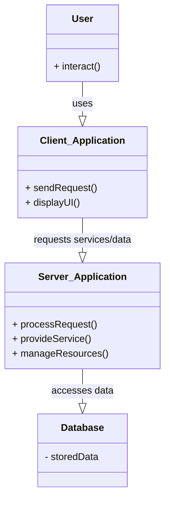
*Note: This `classDiagram` illustrates the key components of a Client-Server Architecture and their primary interactions. Arrows indicate relationships between components.*

## Context & Framework
#### How the Parts Talk to Each Other
In [[Client_Server_Architecture]], the client and server communicate via network protocols. The client sends requests (e.g., an SQL query, a web page request) to the server. The server processes these requests, often interacting with a database or other backend services, and then sends a response back to the client. This interaction model ensures that tasks are distributed, allowing clients to focus on user interface and presentation, while servers handle data management, business logic, and security.

## The Mastery Deep Dive
#### Opening the Hood: What's Inside?
[[Client_Server_Architecture]] inherently involves two distinct processes:
1.  **Client Process:** This is the service requester. It typically runs on the user's device (e.g., a desktop, laptop, smartphone) and is responsible for the **user interface and presentation logic**. Clients initiate requests for resources or services from the server.
2.  **Server Process:** This is the service provider. It runs on a dedicated, more powerful machine and is responsible for **managing resources, performing business logic, and controlling access to shared data** (the database). Servers passively wait for client requests, process them, and return the results.

This clear separation of concerns allows for specialization: clients are optimized for user interaction, while servers are optimized for data processing, security, and scalability. Unlike older architectures, there's no requirement for the client and server to reside on the same physical machine, enabling distributed and flexible deployments.

#### Component Interactions
The primary interaction in a [[Client_Server_Architecture]] is request-response. A client application initiates a request to the server, specifying the desired service or data. The server, which houses the DBMS and often the application logic, receives this request, processes it (which may involve accessing the database), and then sends a response back to the client. This model minimizes network traffic (only requests and results are sent, not entire data files) and centralizes critical database management functions like concurrency control and data integrity on the server, significantly improving robustness and scalability compared to file-server systems.

## Constraints & Limitations
#### The Engineering Trade-off
While offering significant advantages, [[Client_Server_Architecture]] also involves engineering trade-offs. It introduces a dependency on network reliability; if the network connection fails, the client cannot communicate with the server. Server scalability can become a bottleneck if not properly managed, as a single server might struggle to handle a very high volume of client requests. The initial setup and configuration can be more complex than simpler architectures. These factors require careful design and resource allocation to ensure optimal performance and availability.

## Significance & Application
[[Client_Server_Architecture]] is the dominant paradigm for modern software development, forming the basis for virtually all internet-based applications, enterprise systems, and distributed computing environments. Its ability to support large numbers of users, enhance data security, and centralize data management logic has made it indispensable. Understanding this architecture is fundamental for anyone involved in developing, deploying, or managing networked applications and databases.

## The Worked Example
This example shows how a web browser (client) interacts with a web server (server) to retrieve a webpage and dynamically load data.

```text
**Scenario:** A user wants to view their online banking statement.

**1. Client (Web Browser):**
    *   User types `mybank.com` into the browser.
    *   Browser sends an HTTP `GET` request for the homepage to the bank's web server.

**2. Server (Web Server / Application Server):**
    *   Web server receives the request.
    *   Application server processes the request, authenticates the user.
    *   Application server then sends an SQL query to the database (which also runs on a server, potentially the same machine or a different one) to retrieve the user's account balance and recent transactions.
    *   Database processes the query and returns the data to the application server.
    *   Application server formats the data into an HTML page.

**3. Client (Web Browser):**
    *   Browser receives the HTML page and renders it, displaying the user's banking statement.

**Outcome:** The client (browser) focuses on presentation, while the server handles authentication, business logic, database access, and data formatting. Only the request and the final rendered page (or data) are sent over the network, making it efficient.

```
*Note: This text block illustrates the request-response cycle in a client-server web application.*

## The Proving Ground
*Test your mastery. Cover the solutions below to test yourself first.*

#### Level 1: The Sanity Check (Verification)
**The Component Check:** What are the two core processes or roles in a [[Client_Server_Architecture]]?
> **Solution:** The two core processes are the client process (requester) and the server process (provider).

#### Level 2: The Crucible (Mastery & Edge Cases)
**The Broken System:** A [[Client_Server_Architecture]] is implemented, but the client application performs all data validation and business logic. The server only handles raw data storage and retrieval. Explain why this setup, while technically client-server, introduces significant scalability and security vulnerabilities.
> **Solution:** This setup, despite being technically client-server, introduces significant **scalability and security vulnerabilities**. If the client performs all data validation and business logic, then:
1.  **Scalability:** Each client must be "fat" (resource-heavy), processing complex logic, and if business rules change, every client application needs updating. This is inefficient for large numbers of users.
2.  **Security:** Malicious users can bypass client-side validation by directly manipulating requests sent to the server. If the server only provides raw data, it cannot enforce data integrity or access controls effectively, making the database vulnerable to corruption or unauthorized access.

This violates the principle of centralizing business logic and security on the server for shared, controlled access, as described in `# The Mastery Deep Dive` about `Client_Server_Architecture`. The server should be actively involved in processing and validating requests, not just storing data.

## Key Takeaways
*   Client-server architecture distributes tasks between service-requesting clients and service-providing servers.
*   It overcomes limitations of older architectures by centralizing data management and business logic on the server.
*   This model enhances scalability, security, and reduces network traffic.

## Knowledge Graph Connections
| Concept | Connection / Relationship |
| :
-------------------------- | :
------------------------------------------------------------------------------------------ |
| [[Multi_User_DBMS_Architectures]] | Client-server is a prominent and advanced type of multi-user DBMS architecture.          |
| [[Database_Management_System]] | Client-server architecture is a common deployment model for DBMSs.                         |
| [[Two_Tier_Architecture]]   | Two-tier architecture is a specific implementation of the client-server model.             |
| [[Three_Tier_Architecture]] | Three-tier architecture is an evolution of client-server, adding an application server layer. |
| [[DBMS_Benefits_and_Drawbacks]] | Client-server architecture aims to maximize benefits and minimize drawbacks of DBMS usage. |
---

---

## Entity Relationship Data Model


## Definition
Before proceeding, ensure you master [[Data_Models]] and [[Database_Management_System]].
The Entity-Relationship (ER) Data Model is an **object-based data model used to describe data and relationships between data in an organization at a conceptual level**. It represents real-world entities (things or objects) and the associations (relationships) between them. The ER model provides a high-level, semantic view of data, making it a powerful tool for initial database design. Imagine drawing a clear map of all the important "things" in your business (customers, products, orders) and showing how they are connected (customers "place" orders, orders "contain" products).

## The Mental Model
Imagine organizing your contacts.
*   **Entity (Person):** A contact in your phone (John Doe). It has attributes like Name, Phone Number, Email.
*   **Relationship (Works At):** John Doe "Works At" a specific company. This connects the "Person" entity to a "Company" entity.
*   **Cardinality:** One person "Works At" one company (1:1), but one company "Employs" many people (1:M).
An ER diagram visually represents these concepts, providing a blueprint for the logical structure of your data.

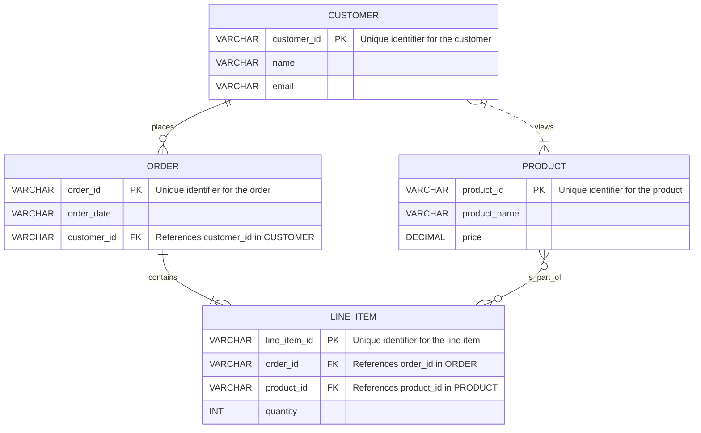
*Note: This `erDiagram` illustrates entities (CUSTOMER, ORDER, LINE_ITEM, PRODUCT), their attributes, and relationships. The cardinality symbols (e.g., `||--o{` for "exactly one to zero or many") define the nature of the connections.*

**Notation Legend for ER Diagram:**
| Cardinality | Meaning                               |
| :
---------- | :
------------------------------------ |
| `|o--o|`    | Zero or one to zero or one            |
| `||--||`    | Exactly one to exactly one            |
| `|o--||`    | Zero or one to exactly one            |
| `||--o{`    | Exactly one to zero or many           |
| `}o--o|`    | Zero or many to zero or one           |
| `}o--||`    | Zero or many to exactly one           |
| `}|--o{`    | One or many to zero or many           |
| `}|--||`    | One or many to exactly one            |
| `PK`        | Primary Key                           |
| `FK`        | Foreign Key                           |
| `UK`        | Unique Key                            |

## Context & Framework
#### Opening the Hood: What's Inside?
The [[Entity_Relationship_Data_Model]] serves as a critical bridge between real-world organizational data requirements and their logical database design. It helps in precisely identifying the core entities, their defining attributes, and the intricate ways these entities interact. By creating a high-level conceptual schema, ER modeling enables database designers to capture the full breadth of data needs before delving into the specifics of a particular database management system (DBMS) or its implementation details.

## The Mastery Deep Dive
#### Opening the Hood: What's Inside?
The ER model primarily focuses on three core constructs:
1.  **Entities**: These are real-world objects or concepts about which data is collected. An entity can be a person (e.g., `Student`), a place (e.g., `Campus`), an event (e.g., `Registration`), or a concept (e.g., `Course`). Each entity type is represented as a distinct component in an ER diagram.
2.  **Attributes**: These are the properties or characteristics that describe an entity. For example, a `Student` entity might have attributes like `StudentID`, `Name`, `Date_of_Birth`, and `Email`. Attributes are fundamental in providing descriptive information for each entity.
3.  **Relationships**: These represent associations between two or more entities. For instance, a `Student` entity might have a `Registers_For` relationship with a `Course` entity. Relationships are crucial for defining how different entities interact and depend on each other.

The strength of the ER model lies in its ability to visually represent these components through ER diagrams, making complex data structures easier to understand and communicate among stakeholders.

#### How the Parts Talk to Each Other
In an [[Entity_Relationship_Data_Model]], entities "talk" to each other through relationships. The nature of this communication is defined by **cardinality**, which specifies the number of instances of one entity that can be associated with the number of instances of another entity. Common cardinalities include:
*   **One-to-One (1:1)**: A `Person` has one `Passport`.
*   **One-to-Many (1:M)**: A `Department` has many `Employees`.
*   **Many-to-Many (M:N)**: `Students` `Enroll_In` many `Courses`, and `Courses` have many `Students`.
Correctly identifying cardinalities is vital for accurately modeling real-world constraints and ensuring data integrity.

## Constraints & Limitations
#### The Engineering Trade-off
While the [[Entity_Relationship_Data_Model]] is excellent for conceptual design, it has engineering trade-offs. It is a high-level model, meaning it doesn't directly map to physical database structures. Translating an ER diagram into a [[Relational_Data_Model]] (which can then be implemented in a DBMS) requires careful normalization and adherence to relational rules. Furthermore, complex business rules or behavioral aspects are not easily represented in a pure ER model, often requiring extensions or additional modeling techniques. The challenge lies in balancing the clarity of conceptual design with the specificity needed for implementation.

## Significance & Application
The [[Entity_Relationship_Data_Model]] is widely used in the initial phases of database design to capture and represent the data requirements of an application or organization. It helps in creating a clear, unambiguous, and high-level blueprint that can be easily understood by both technical and non-technical stakeholders. ER diagrams are indispensable for developing well-structured databases that accurately reflect real-world scenarios and serve as a foundation for subsequent logical and physical design steps.

## The Worked Example
This example demonstrates a conceptual ER diagram for a simple "Order Processing" system, focusing on entities, attributes, and relationships.

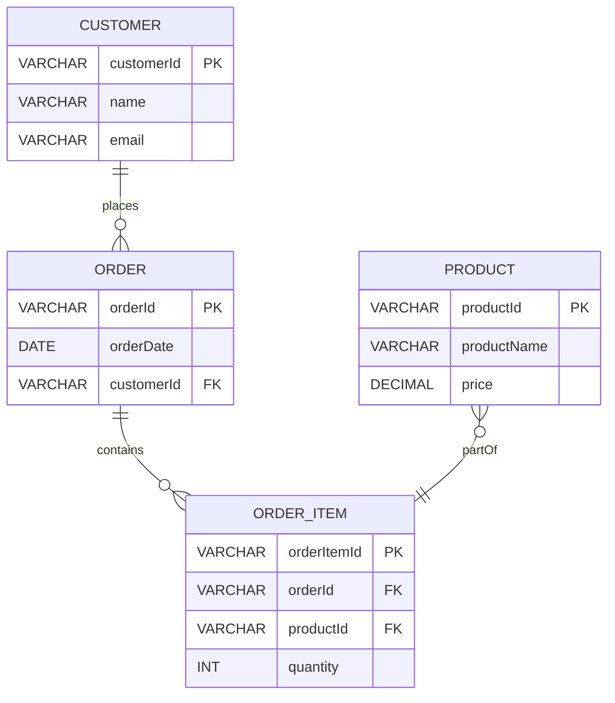
*Note: This `erDiagram` for an order processing system shows how customers place orders, orders contain items, and items are parts of products. It includes primary (PK) and foreign (FK) keys, illustrating basic relationship modeling.*

## The Proving Ground
*Test your mastery. Cover the solutions below to test yourself first.*

#### Level 1: The Sanity Check (Verification)
**The Component Check:** Define an "entity" and a "relationship" within the context of an [[Entity_Relationship_Data_Model]].
> **Solution:** An **entity** is a real-world object or concept about which data is collected (e.g., Student, Course). A **relationship** is an association between two or more entities (e.g., Student `enrolls_in` Course).

#### Level 2: The Crucible (Mastery & Edge Cases)
**The Broken System:** An ER diagram is designed for a social media platform, but a user's `Posts` are shown as an attribute of the `User` entity, rather than a separate entity. Explain why this design choice is problematic for data integrity and flexibility, and how to correct it within the [[Entity_Relationship_Data_Model]].
> **Solution:** Representing `Posts` as an attribute of the `User` entity is problematic because it leads to **data redundancy** (if a user has multiple posts, the `User` entity would need to duplicate post data or store it as a complex, non-atomic attribute) and **poor flexibility**. This violates the principle of atomic attributes and makes querying specific posts or analyzing post-related data very difficult. The correct approach in an [[Entity_Relationship_Data_Model]] is to model `Post` as a **separate entity** with its own attributes (e.g., `PostID`, `Content`, `Timestamp`) and establish a **one-to-many relationship** where a `User` `CREATES` many `Posts`. This ensures data integrity, avoids redundancy, and allows for flexible queries on both users and posts, as discussed in `# How the Parts Talk to Each Other`.

## Key Takeaways
*   The ER model describes data and relationships using entities, attributes, and relationships.
*   Entities are real-world objects, attributes are their properties, and relationships are associations between entities.
*   Cardinality defines the number of instances involved in a relationship (1:1, 1:M, M:N).

## Knowledge Graph Connections
| Concept | Connection / Relationship |
| :
-------------------------- | :
------------------------------------------------------------------------------------------ |
| [[Data_Models]]             | The ER model is a prominent type of object-based conceptual data model.                    |
| [[Database_Management_System]] | ER diagrams are used in the initial design phase before implementing a DBMS.               |
| [[Relational_Data_Model]]   | ER diagrams are often translated into relational schemas for implementation in RDBMS.      |
| Conceptual_Modelling    | The ER model is a primary tool for conceptual modeling in database design.                 |
---

---

## Logical Data Independence


## Definition
Before proceeding, ensure you master [[Data_Independence]] and [[ANSI_SPARC_Three_Level_Architecture]].
Logical Data Independence refers to the **immunity of external schemas to changes in the conceptual schema**. In simpler terms, it means that changes to the overall logical structure of the database (e.g., adding or removing entities, attributes, or relationships) should not require changes to existing user views or application programs that access the database. This is a crucial aspect of [[Data_Independence]], ensuring that applications remain stable even as the underlying logical database model evolves to meet new requirements. Imagine changing the floor plan of an entire apartment building (conceptual schema) without requiring individual tenants (external schemas/applications) to re-learn where their specific apartment (their view) is located.

## The Mental Model
Consider a shopping website where you see "Product Details" (your external view).
*   **Conceptual Schema Change:** The database administrator decides to split the "Description" field of a `Product` into "Short_Description" and "Long_Description" for better categorization.
*   **Without Logical Data Independence:** The website code that previously accessed `Product.Description` would break and need to be rewritten to combine the new fields.
*   **With Logical Data Independence:** The DBMS, through its external/conceptual mapping, can present a virtual "Description" field to the website, combining `Short_Description` and `Long_Description` seamlessly. The website code remains unchanged, preserving its immunity to the conceptual schema modification.

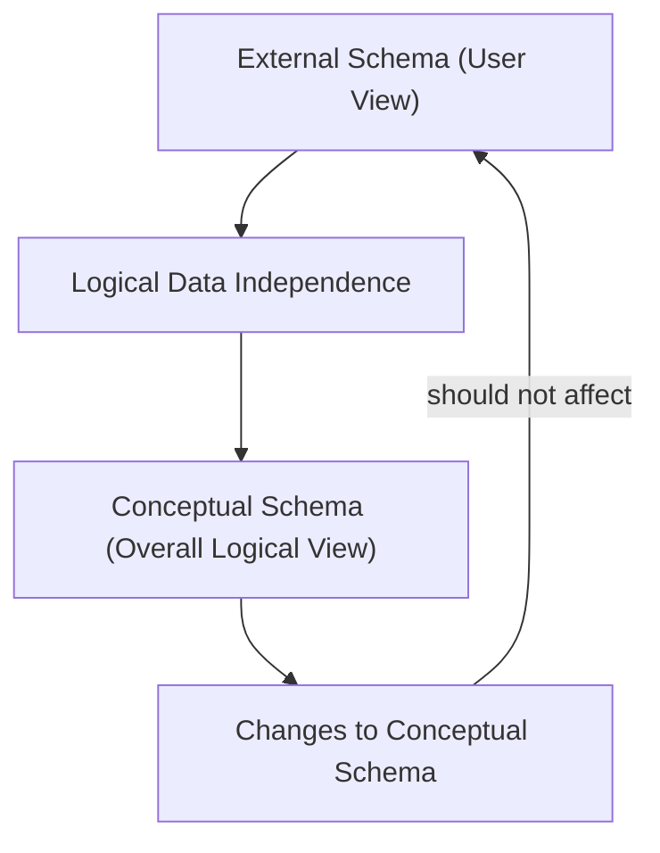
*Note: This `graph TD` diagram illustrates that changes to the Conceptual Schema should not impact the External Schema due to Logical Data Independence.*

## Context & Framework
#### The Problem: Why Did We Invent This?
Before [[Logical_Data_Independence]], applications were highly sensitive to changes in the database's logical structure. If a new attribute was added to a table, or an existing table was split, application programs might break or require significant modifications, even if they didn't directly use the changed parts. This tight coupling made database evolution costly and risky. Logical data independence was introduced to decouple applications from the evolving logical structure, making systems more flexible and maintainable.

## The Mastery Deep Dive
#### The Translator: Converting English to Math
[[Logical_Data_Independence]] specifically refers to the ability of external schemas (user views) to remain immune to changes made in the conceptual schema (the community view of the entire database). This means that:
*   **Conceptual schema changes** (e.g., addition or removal of entities, attributes, or relationships, or reorganizing existing data into new tables) **should not require changes to external schemas or rewrites of application programs**.
*   This is achieved through the **External/Conceptual Mapping**, which the DBMS is responsible for managing. When an application requests data, the DBMS uses this mapping to translate the request from the external view to the potentially altered conceptual schema.

For example, if an attribute is removed from the conceptual schema, the DBMS can provide a default value to external views that still expect it. If two attributes are combined into one, the DBMS can split the single attribute into two for external views. While specific users might indirectly be affected by some conceptual changes (e.g., a feature they used might be deprecated), the *goal* is to minimize the impact on existing application programs.

#### Component Interactions
[[Logical_Data_Independence]] is facilitated by the **Schema_Mapping** components within the DBMS, particularly the External/Conceptual Mapping. This mapping acts as a translator, allowing applications to continue interacting with a stable external view even if the underlying conceptual schema has changed. When a query comes from an external view, the DBMS uses the mapping to resolve the query against the current conceptual schema, providing the necessary data without the application needing to be aware of the internal structural modifications.

## Constraints & Limitations
#### The Engineering Trade-off
While highly beneficial, achieving [[Logical_Data_Independence]] comes with engineering trade-offs. The DBMS must maintain and manage the complex mappings between external and conceptual schemas, which can add overhead to query processing. The design of external views themselves needs to be carefully considered to maximize independence while still providing necessary functionality. In scenarios with extremely complex conceptual schema changes, maintaining perfect logical independence for all external views can become challenging, sometimes requiring compromises.

## Significance & Application
[[Logical_Data_Independence]] is a critical feature for developing robust, scalable, and maintainable database applications. It allows database administrators to modify the logical structure of the database (e.g., to improve performance, add new features, or reorganize data) without disrupting existing applications. This significantly reduces maintenance costs, accelerates development cycles, and enables organizations to adapt their data models to evolving business requirements with greater agility.

## The Worked Example
This example illustrates how a change to the conceptual schema is handled without affecting an external application due to Logical Data Independence.

```text
**Scenario:** A company's database has a `Customers` table with a `PhoneNumber` column. An application `SalesApp` uses an external view that displays `CustomerID`, `Name`, and `PhoneNumber`.

**Change to Conceptual Schema:** The DBA decides to split the single `PhoneNumber` column into two new columns: `HomePhoneNumber` and `MobilePhoneNumber` in the conceptual schema, to better support different contact types. The original `PhoneNumber` column is removed.

**Impact with Logical Data Independence:**
1.  The `SalesApp` continues to query its external view expecting a `PhoneNumber` column.
2.  The DBMS's **External/Conceptual Mapping** component detects this.
3.  The mapping is designed to automatically concatenate `HomePhoneNumber` and `MobilePhoneNumber` (or prioritize one if both exist) from the conceptual schema to present a single `PhoneNumber` column to the `SalesApp`'s external view.
4.  The `SalesApp` code **does not need to be changed**. It still receives a `PhoneNumber` column, even though it's now derived from two separate columns in the conceptual schema.

**Outcome:** The `SalesApp` maintains its immunity to the conceptual schema change, demonstrating the power of [[Logical_Data_Independence]] in isolating applications from logical data model evolution.

```
*Note: This text block demonstrates how `Logical_Data_Independence` handles a conceptual schema change by modifying the mapping, not the application.*

## The Proving Ground
*Test your mastery. Cover the solutions below to test yourself first.*

#### Level 1: The Sanity Check (Verification)
**The Impostor:** Define [[Logical_Data_Independence]] in the context of database schemas.
> **Solution:** Logical Data Independence refers to the immunity of external schemas (user views) to changes in the conceptual schema (overall logical database structure).

#### Level 2: The Crucible (Mastery & Edge Cases)
**The Impostor:** A database design change involves splitting a single `Address` attribute into `Street`, `City`, and `ZipCode` attributes at the conceptual level. An application program that previously accessed the single `Address` field now breaks. Explain why this indicates a *lack* of [[Logical_Data_Independence]] and what mechanisms should have prevented this.
> **Solution:** This scenario indicates a **lack of [[Logical_Data_Independence]]** because the application program, which relies on a stable external view, was directly affected by a change in the conceptual schema (splitting `Address`). Ideally, the DBMS's **External/Conceptual Mapping** should have been updated to synthesize the `Address` field from the new `Street`, `City`, and `ZipCode` attributes for the application's external view. The application should have remained immune to this conceptual reorganization, continuing to "see" a single `Address` field. The fact that it broke means the abstraction layer was insufficient, and the application was too tightly coupled to the conceptual design, as explained in `# The Translator: Converting English to Math` and `# Context & Framework`.

## Key Takeaways
*   Logical data independence protects external schemas from conceptual schema changes.
*   This ensures application stability when entities, attributes, or relationships are modified logically.
*   It is achieved via DBMS-managed External/Conceptual mappings.

## Knowledge Graph Connections
| Concept | Connection / Relationship |
| :
-------------------------- | :
------------------------------------------------------------------------------------------ |
| [[Data_Independence]]       | Logical data independence is a specific type of data independence.                         |
| [[ANSI_SPARC_Three_Level_Architecture]] | It describes the immunity between the external and conceptual levels of this architecture. |
| [[Schema_Mapping]]          | External/Conceptual mapping is the mechanism that enables logical data independence.       |
| [[Database_Management_System]] | A key feature implemented by DBMSs to provide flexibility in database design.              |
---

---

## Physical Data Independence


## Definition
Before proceeding, ensure you master [[Data_Independence]] and [[ANSI_SPARC_Three_Level_Architecture]].
Physical Data Independence refers to the **immunity of the conceptual schema to changes in the internal schema**. This means that modifications to the physical storage structure of the database (e.g., changing file organizations, storage devices, indexing strategies) should not require changes to the overall logical view of the database or to any application programs. It's a critical component of [[Data_Independence]], allowing database administrators to optimize physical storage for performance or cost without impacting the applications built upon the conceptual model. Imagine upgrading the internal wiring or plumbing of a building (physical changes) without affecting the architectural blueprints (conceptual schema) or how people use the rooms (external views).

## The Mental Model
Consider a large photo library stored on a server.
*   **Internal Schema Change:** The system administrator decides to change how photos are physically stored: moving them from one type of hard drive to another, or changing the indexing method (e.g., from a linear list to a more efficient tree structure).
*   **Without Physical Data Independence:** Every application that displays photos would need to know the new storage location or indexing method and would break.
*   **With Physical Data Independence:** The file browser or photo application only requests "list all photos." The database system handles the new physical storage details internally. The application remains unaware of the storage change, as the conceptual schema (which defines "Photo" with attributes like "Name", "Date") is preserved.

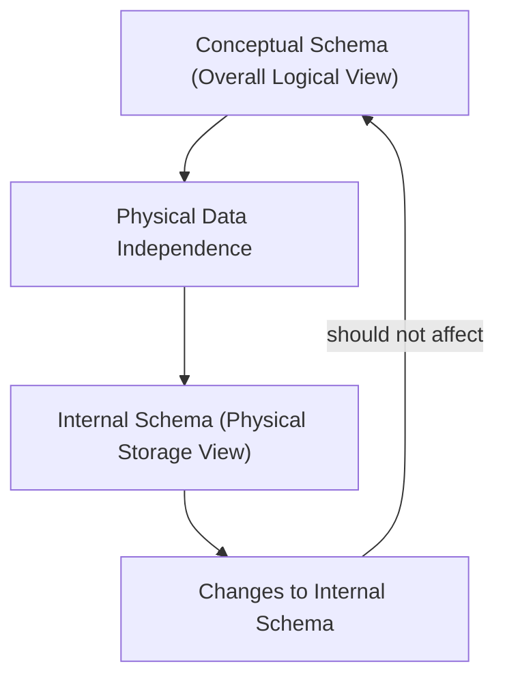
*Note: This `graph TD` diagram illustrates that changes to the Internal Schema should not impact the Conceptual Schema due to Physical Data Independence.*

## Context & Framework
#### The Problem: Why Did We Invent This?
In early database systems, changes to physical storage (e.g., moving data files, changing disk types) often necessitated modifications to the conceptual schema and, consequently, to application programs. This tight coupling made it difficult and expensive to optimize database performance or upgrade hardware without disrupting operations. [[Physical_Data_Independence]] was introduced to address this, allowing the physical implementation to be optimized independently of the logical and external views, thus promoting greater flexibility and maintainability.

## The Mastery Deep Dive
#### The Translator: Converting English to Math
[[Physical_Data_Independence]] specifically refers to the ability of the conceptual schema to remain immune to changes made in the internal schema. This implies that:
*   **Internal schema changes** (e.g., using different file organizations, altering storage structures or devices, modifying indexing techniques) **should not require changes to the conceptual schema or external schemas**.
*   This is achieved through the **Conceptual/Internal Mapping**, which is managed by the DBMS. This mapping translates requests from the conceptual schema into the appropriate operations on the physical storage, effectively shielding the conceptual level from physical implementation details.

For instance, if a database switches from storing records sequentially to using a B-tree indexing structure, the conceptual schema remains unchanged because the *logical* representation of data is unaffected. The DBMS's Conceptual/Internal mapping simply updates its translation rules to reflect the new physical access methods. This allows DBAs to tune performance and manage storage efficiently without impacting application logic.

#### Component Interactions
[[Physical_Data_Independence]] is primarily enabled by the **Conceptual/Internal Mapping** component within the DBMS. This mapping layer translates the logical data requests from the conceptual schema into the physical operations required by the internal schema. When the internal schema changes, this mapping is updated to reflect the new physical organization, allowing the conceptual schema and all higher levels to continue operating as if no change occurred. This seamless translation is what ensures the immunity of higher-level schemas to low-level storage modifications.

## Constraints & Limitations
#### The Engineering Trade-off
Achieving [[Physical_Data_Independence]], while vital, involves engineering trade-offs. The DBMS must maintain a sophisticated Conceptual/Internal mapping, which adds a layer of complexity and can introduce a slight performance overhead during data access, as requests need to be translated. Furthermore, completely isolating all conceptual aspects from *any* physical detail can be challenging, particularly for very specific performance tuning requirements where some conceptual design choices might implicitly favor certain physical implementations. The goal is to strike a balance where the benefits of flexibility and maintainability outweigh these inherent costs.

## Significance & Application
[[Physical_Data_Independence]] is crucial for the long-term maintainability and performance optimization of database systems. It empowers database administrators to make changes to the physical storage structure – such as upgrading hardware, migrating data to new storage devices, or implementing different indexing strategies – without requiring any modifications to the conceptual schema or the application programs that rely on it. This greatly reduces system downtime, lowers maintenance costs, and enables efficient scaling and performance tuning of the database infrastructure.

## The Worked Example
This example demonstrates how a change in physical storage is handled without affecting the conceptual schema due to Physical Data Independence.

```text
**Scenario:** A company's database stores `Product` records. The conceptual schema defines `Product` with attributes like `ProductID`, `Name`, `Price`, and `Quantity_On_Hand`. Internally, these records are stored in a simple heap file (records are stored unsorted).

**Change to Internal Schema:** To improve retrieval speed for `ProductID`, the DBA decides to implement a B-tree index on the `ProductID` column, and potentially reorganize the `Product` records into a clustered file based on `ProductID`.

**Impact with Physical Data Independence:**
1.  The conceptual schema, which defines `Product(ProductID, Name, Price, Quantity_On_Hand)`, **remains unchanged**.
2.  The DBMS's **Conceptual/Internal Mapping** component is updated. It now knows that when a query for `ProductID` comes from the conceptual level, it should utilize the new B-tree index for faster access.
3.  Application programs (which query for products) and external views (which display product information) **do not need to be changed**. They continue to interact with the database as if no physical change occurred. The efficiency gain is transparent.

**Outcome:** The conceptual schema and higher levels are immune to the physical storage modifications, demonstrating the power of [[Physical_Data_Independence]] in allowing low-level optimizations without rippling changes through the entire system.

```
*Note: This text block demonstrates how `Physical_Data_Independence` handles an internal schema change by modifying the mapping, not the conceptual schema.*

## The Proving Ground
*Test your mastery. Cover the solutions below to test yourself first.*

#### Level 1: The Sanity Check (Verification)
**The Impostor:** Define [[Physical_Data_Independence]] and explain its relationship to the internal schema.
> **Solution:** Physical Data Independence refers to the immunity of the conceptual schema to changes in the internal schema. The internal schema describes how data is physically stored in the database.

#### Level 2: The Crucible (Mastery & Edge Cases)
**The Impostor:** A database system is migrated to solid-state drives (SSDs) from traditional hard disk drives (HDDs) to improve performance. After the migration, application programs that do not interact with the physical storage directly unexpectedly fail. Explain why this demonstrates a failure in [[Physical_Data_Independence]] and what the ideal outcome should have been.
> **Solution:** This scenario demonstrates a **failure in [[Physical_Data_Independence]]**. The migration from HDDs to SSDs is a change at the **internal schema level** (physical storage device). Ideally, such a change should be completely transparent to the conceptual schema and all higher-level application programs. The fact that application programs, which *do not* directly interact with physical storage, failed means that they were inadvertently dependent on some aspect of the previous physical implementation. The ideal outcome would have been for the DBMS's **Conceptual/Internal Mapping** to absorb this change, allowing applications to continue functioning without modification and transparently benefiting from the performance improvement of the SSDs, as discussed in `# The Translator: Converting English to Math` and `# Context & Framework`.

## Key Takeaways
*   Physical data independence protects the conceptual schema from internal schema changes.
*   This allows physical storage optimizations (e.g., indexing, device changes) without affecting logical views.
*   It is enabled by DBMS-managed Conceptual/Internal mappings.

## Knowledge Graph Connections
| Concept | Connection / Relationship |
| :
-------------------------- | :
------------------------------------------------------------------------------------------ |
| [[Data_Independence]]       | Physical data independence is a specific and crucial type of data independence.            |
| [[ANSI_SPARC_Three_Level_Architecture]] | It describes the immunity between the internal and conceptual levels of this architecture. |
| [[Schema_Mapping]]          | Conceptual/Internal mapping is the mechanism that enables physical data independence.      |
| [[Database_Management_System]] | A key feature implemented by DBMSs to allow for flexible physical storage management.      |
---

---

## Relational Data Model


## Definition
Before proceeding, ensure you master [[History_of_Database_Systems]] and [[Database_Management_System]].
The Relational Data Model (RDM), introduced by Dr. Edgar F. Codd in 1970, is a **second-generation database model based on the mathematical concepts of set theory and predicate logic**. It organizes data into two-dimensional tables called "relations," where each table consists of rows (tuples) and columns (attributes). This model revolutionizes data management by providing a simple, logical, and highly flexible way to represent and query data, overcoming the rigidity of earlier hierarchical and network models. Think of it as organizing information into interconnected spreadsheets, where each sheet is perfectly structured, and you can easily link data between them using common columns.

## The Mental Model
Imagine a meticulously organized library. Instead of a single complex hierarchy, you have distinct card catalogs (tables) for "Books," "Authors," and "Borrowers." Each card (row) in the "Books" catalog has details like title, ISBN, and an Author ID. The "Authors" catalog has Author ID, name, etc. To find all books by a specific author, you simply match the Author ID across the two catalogs. The system doesn't care about the physical location of the cards; it only cares about the logical connections between the data.

```text
-- Example: Defining a 'Branch' table in SQL (a relational database language)

CREATE TABLE Branch (
    branchNo VARCHAR(4) PRIMARY KEY,
    street   VARCHAR(20),
    city     VARCHAR(15),
    postCode VARCHAR(8)
);

-- Example: Defining a 'Staff' table
CREATE TABLE Staff (
    staffNo    VARCHAR(4) PRIMARY KEY,
    fName      VARCHAR(15),
    lName      VARCHAR(15),
    position   VARCHAR(10),
    sex        CHAR(1),
    DOB        DATE,
    salary     DECIMAL(7,2),
    branchNo   VARCHAR(4),
    FOREIGN KEY (branchNo) REFERENCES Branch(branchNo)
);
```
*Note: This SQL code defines the structure (schema) for two tables, illustrating how a relational database is designed. `PRIMARY KEY` and `FOREIGN KEY` establish relationships between tables.*

## Context & Framework
#### How the Parts Talk to Each Other
In the [[Relational_Data_Model]], data is organized into tables, and these tables communicate or relate to each other through shared attributes, typically involving primary and foreign keys. A **primary key** uniquely identifies each row in a table, while a **foreign key** in one table refers to the primary key in another table, establishing a link. This mechanism allows for flexible relationships without the need for physical pointers, a significant improvement over earlier models. The structure of these tables and their relationships forms the logical schema of the database.

## The Mastery Deep Dive
#### The Translator: From "Lego" to "Jargon"
The [[Relational_Data_Model]] introduces specific terminology that maps to its table-based structure. A **Relation** is essentially a table. A **Tuple** is a row in that table, representing a single record. An **Attribute** is a column in the table, representing a specific characteristic or field of the record. The **Data Value** is the specific entry within an attribute. This clear mapping from intuitive table concepts to formal mathematical terms is crucial for understanding relational database theory and for writing precise queries.

#### Component Interactions
The power of the [[Relational_Data_Model]] lies in its ability to define flexible and complex relationships between data without requiring users to navigate physical storage structures. Users interact with the relational database using declarative languages like SQL, where they specify *what* data they want, not *how* to retrieve it. The DBMS's query optimizer then translates this high-level request into an efficient plan for accessing the underlying tables and joining related data, ensuring optimal performance. This abstraction is a cornerstone of data independence.

## Constraints & Limitations
#### The Engineering Trade-off
While the [[Relational_Data_Model]] offers significant advantages in flexibility and data independence, it also presents engineering trade-offs. The overhead of ensuring data integrity (e.g., through ACID properties for transactions) and optimizing complex queries across multiple tables can sometimes impact performance compared to highly specialized, less flexible models. Furthermore, handling very large volumes of unstructured or semi-structured data can be challenging for traditional relational databases, leading to the development of alternative models like NoSQL.

## Significance & Application
The [[Relational_Data_Model]] remains the most dominant database model today, forming the basis for countless applications in finance, education, healthcare, and virtually every industry that requires structured data management. Its strengths in data integrity, flexible querying, and transaction management make it ideal for systems where consistency and reliability are paramount. Understanding this model is fundamental for anyone working with databases, from designers and developers to data analysts.

## The Worked Example
This example demonstrates a basic SQL query and how it interacts with two relational tables to retrieve combined information.

```sql
-- Table: Branch
-- | branchNo | street       | city    | postCode |
-- |----------|--------------|---------|----------|
-- | B005     | 22 Deer Rd   | London  | SW1 4EH  |
-- | B003     | 163 Main St  | Glasgow | G11 9QX  |

-- Table: Staff
-- | staffNo | fName | lName | position  | salary | branchNo |
-- |---------|-------|-------|-----------|--------|----------|
-- | SL41    | Julie | Lee   | Assistant | 9000   | B005     |
-- | SA9     | Mary  | Howe  | Assistant | 9000   | B007     |
-- | SG5     | Susan | Brand | Manager   | 24000  | B003     |

-- Query: Find the first name and last name of all staff who work in the 'London' branch.

SELECT S.fName, S.lName
FROM Staff AS S
JOIN Branch AS B
ON S.branchNo = B.branchNo
WHERE B.city = 'London';

-- Result:
-- | fName | lName |
-- |-------|-------|
-- | Julie | Lee   |
```
*Note: This SQL code demonstrates joining two tables (`Staff` and `Branch`) based on a common `branchNo` attribute and filtering results. The `JOIN` and `WHERE` clauses showcase the declarative nature of relational queries.*

## The Proving Ground
*Test your mastery. Cover the solutions below to test yourself first.*

#### Level 1: The Sanity Check (Verification)
**The Component Check:** Define what a "relation" (table), "tuple" (row), and "attribute" (column) refer to in the context of the [[Relational_Data_Model]].
> **Solution:** A **relation** is a table. A **tuple** is a row in that table. An **attribute** is a column in that table.

#### Level 2: The Crucible (Mastery & Edge Cases)
**The Broken System:** A developer attempts to create a flat-file system where all related data for an entity is stored in a single, large text file. Explain why this approach inherently violates principles of the [[Relational_Data_Model]] and leads to significant data redundancy and inconsistency issues.
> **Solution:** Storing all related data in a single, large flat file violates the principle of **normalization** and the table-based structure of the [[Relational_Data_Model]]. For example, if an employee's details (name, address) and all their project assignments were in one file, and the employee worked on multiple projects, their details would be **duplicated for each project** they are on. This leads to massive **data redundancy** and, crucially, **data inconsistency**; if the employee's address changes, it must be updated in multiple places, making it highly probable for conflicting addresses to exist. The relational model solves this by separating concerns into distinct tables (e.g., `Employees` table, `Projects` table, `Employee_Projects` linking table), where each piece of information is stored once, as discussed in `# The Translator: From "Lego" to "Jargon"` and `# Component Interactions`.

## Key Takeaways
*   The Relational Data Model organizes data into 2D tables (relations) with rows (tuples) and columns (attributes).
*   Relationships are established by shared attribute values, providing logical flexibility over physical links.
*   It uses a declarative approach, allowing users to specify what data is needed, not how to retrieve it.

## Knowledge Graph Connections
| Concept | Connection / Relationship |
| :
-------------------------- | :
------------------------------------------------------------------------------------------ |
| [[History_of_Database_Systems]] | The relational model is the defining characteristic of the second generation of databases. |
| [[Database_Management_System]] | Relational DBMS (RDBMS) are the most common type of DBMS implementations.                 |
| [[Data_Models]]             | It is a specific type of data model, offering a structured approach to data organization.  |
| [[Data_Independence]]       | The relational model significantly improved logical data independence compared to predecessors. |
---

---

## Three Tier Architecture


## Definition
Before proceeding, ensure you master [[Client_Server_Architecture]] and [[Two_Tier_Architecture]].
Three-Tier Architecture is an evolution of the [[Client_Server_Architecture]] that introduces an intermediary "Application Server" tier between the client and the database server. This architecture partitions the application's workload into three logical tiers: the Presentation Tier (Client), the Application Tier (Business Logic), and the Data Tier (Database Server). It was developed to address the scalability and maintenance challenges of [[Two_Tier_Architecture]], particularly for large, complex, and highly distributed business environments. Imagine a modern restaurant: the customer (Client) orders from the waiter (Application Server), who communicates with the kitchen (Database Server) to fulfill the order, allowing each role to specialize and scale independently.

## The Mental Model
Think of a large online banking system.
*   **First Tier (Client):** Your web browser or mobile app. It's "thin" – primarily responsible for the user interface and sending requests. It doesn't store business logic or directly access the database.
*   **Second Tier (Application Server):** This is a powerful server (or cluster of servers) running the core banking application. It handles all the "business logic" (e.g., calculating interest, verifying transaction rules). It receives requests from clients, processes them, and then communicates with the database.
*   **Third Tier (Database Server):** This is the dedicated database system. Its sole job is to store and retrieve data reliably, and enforce data integrity rules. It doesn't contain business logic.

This separation means the client is lightweight, business logic is centralized, and the database focuses on data.

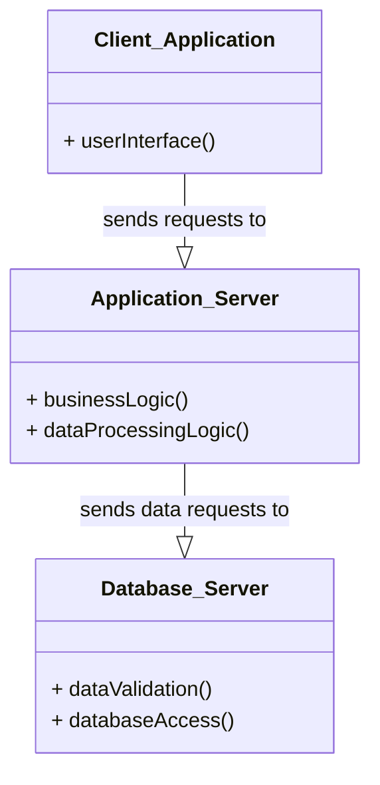
*Note: This `classDiagram` illustrates the three distinct tiers (`Client_Application`, `Application_Server`, `Database_Server`) and their relationships.*

## Context & Framework
#### How the Parts Talk to Each Other
In a [[Three_Tier_Architecture]], the client communicates with the application server, and the application server, in turn, communicates with the database server. The client (Presentation Tier) sends user requests to the Application Server (Business Logic Tier). The Application Server processes these requests, applies business rules, and then sends data-specific commands (e.g., SQL queries) to the Database Server (Data Tier). The Database Server executes these commands and returns results to the Application Server, which then formats them and sends them back to the client. This tiered communication enforces a clear separation of concerns, crucial for scalability and maintainability.

## The Mastery Deep Dive
#### Opening the Hood: What's Inside?
[[Three_Tier_Architecture]] partitions the system into three distinct layers, each typically running on separate hardware for optimal performance and scalability:
1.  **First Tier: Client (Presentation Tier):**
    *   This is the user's interface, typically a web browser or a "thin client" application.
    *   Its sole responsibility is to handle the **user interface** and presentation.
    *   It contains **no business logic or direct database access**. It simply sends requests to the application server and displays the responses. This makes clients very lightweight and easy to deploy and update.
2.  **Second Tier: Application Server (Business Logic Tier):**
    *   This is the intermediary layer between the client and the database.
    *   It contains all the **business logic** and **data processing logic**. This centralizes complex operations like calculations, workflow management, and applying business rules.
    *   It receives requests from clients, processes them, and translates them into appropriate database operations. It then communicates with the database server.
3.  **Third Tier: Database Server (Data Tier):**
    *   This is the backend system running the DBMS.
    *   Its responsibilities are limited to **data validation** (enforcing database integrity constraints) and **database access** (storing, retrieving, updating data).
    *   It holds the actual database and focuses purely on efficient and reliable data management, isolated from complex business rules.

This clear separation enhances modularity, scalability, and security.

#### Component Interactions
Interaction in a [[Three_Tier_Architecture]] is sequential and hierarchical. A client initiates a request, which first goes to the application server. The application server acts as a broker, executing business logic and then translating the request into database commands (if necessary) to send to the database server. The database server processes these commands and returns the results to the application server, which then formats the final response for the client. This structured flow ensures that data integrity and business rules are consistently applied at a central point, improving overall system robustness.

## Constraints & Limitations
#### The Engineering Trade-off
While offering significant advantages, [[Three_Tier_Architecture]] also involves engineering trade-offs. The increased number of layers adds complexity to the system's design, development, and deployment, requiring more sophisticated infrastructure. Communication overhead between tiers can introduce latency if not carefully managed and optimized. Debugging issues can also be more challenging due to the distributed nature of the application. These factors necessitate robust monitoring, logging, and experienced development teams.

## Significance & Application
[[Three_Tier_Architecture]] is the standard for modern enterprise applications, web applications, and large-scale distributed systems. Its ability to provide superior scalability, flexibility, security, and maintainability (by allowing independent development and scaling of each tier) makes it ideal for environments with high user loads and complex business requirements. It overcomes the limitations of two-tier systems by centralizing business logic and enabling the use of thin clients, dramatically reducing client-side administration overhead.

## The Worked Example
This example shows how a user's request for an item from an e-commerce website is processed through a three-tier system.

```text
**Scenario:** A customer wants to add an item to their shopping cart on an e-commerce website.

**1. First Tier (Client - Web Browser):**
    *   Customer clicks "Add to Cart" button.
    *   Browser sends a request (e.g., `POST /addToCart?itemId=X&quantity=1`) to the Application Server.

**2. Second Tier (Application Server):**
    *   Receives the `addToCart` request.
    *   Executes business logic:
        *   Checks if `itemId` is valid.
        *   Verifies if `quantity` is in stock by querying the Database Server: `SELECT stock FROM Products WHERE ItemID = X;`
        *   Updates the customer's shopping cart in the database by sending an `INSERT` or `UPDATE` command to the Database Server.
        *   Calculates new total price.
    *   Sends a response (e.g., "Item added to cart") back to the client.

**3. Third Tier (Database Server):**
    *   Receives `SELECT` and `INSERT`/`UPDATE` queries from the Application Server.
    *   Executes these queries on the actual database tables (e.g., `Products`, `ShoppingCarts`).
    *   Ensures data integrity (e.g., no negative stock, valid item IDs).
    *   Returns results (e.g., `stock = 50`) to the Application Server.

**Outcome:** The client is lightweight, the business logic is centralized on the Application Server, and the Database Server focuses purely on data management. This allows the application server to scale independently of the database, handling many concurrent user requests efficiently.

```
*Note: This text block illustrates the flow of an e-commerce transaction through a three-tier architecture.*

## The Proving Ground
*Test your mastery. Cover the solutions below to test yourself first.*

#### Level 1: The Sanity Check (Verification)
**The Component Check:** What are the three main tiers in a [[Three_Tier_Architecture]]?
> **Solution:** The three main tiers are the Client (Presentation Tier), the Application Server (Business Logic Tier), and the Database Server (Data Tier).

#### Level 2: The Crucible (Mastery & Edge Cases)
**The Broken System:** In a [[Three_Tier_Architecture]], a developer mistakenly places critical business logic directly within the "Database Server" tier, bypassing the "Application Server." Explain how this subverts the benefits of the three-tier model, leading to reduced flexibility and potential performance bottlenecks.
> **Solution:** Placing critical business logic directly within the "Database Server" tier in a [[Three_Tier_Architecture]] fundamentally **subverts the benefits** of this model. It reintroduces the "fat server" problem that three-tier architecture was designed to solve. This leads to:
1.  **Reduced Flexibility:** Business logic becomes tightly coupled with the database, making it harder to change or reuse the logic without impacting the database schema or requiring complex stored procedures.
2.  **Performance Bottlenecks:** The database server becomes overloaded with both data management and complex business computations, leading to a single point of failure and hindering its ability to scale efficiently under heavy load. The Application Server, designed for this logic, is bypassed, wasting its resources.

This essentially reverts some of the advantages gained over [[Two_Tier_Architecture]], making the system less scalable and harder to maintain, as explained in `# Opening the Hood: What's Inside?` and `# Constraints & Limitations`.

## Key Takeaways
*   Three-tier architecture adds an Application Server between the client and database server.
*   Tiers: Client (UI), Application Server (business logic), Database Server (data management).
*   It improves scalability, flexibility, security, and reduces client-side administration.

## Knowledge Graph Connections
| Concept | Connection / Relationship |
| :
-------------------------- | :
------------------------------------------------------------------------------------------ |
| [[Client_Server_Architecture]] | Three-tier architecture is an advanced and more scalable form of client-server architecture. |
| [[Two_Tier_Architecture]]   | It evolved to address the scalability and maintenance limitations of two-tier systems.      |
| [[Database_Management_System]] | The database server in a three-tier architecture runs the DBMS.                            |
| [[Multi_User_DBMS_Architectures]] | It is the standard architecture for high-scale multi-user database applications.           |
---

---

## Two Tier Architecture


## Definition
Before proceeding, ensure you master [[Client_Server_Architecture]] and [[Database_Management_System]].
Two-Tier Architecture is a type of [[Client_Server_Architecture]] where the application logic is primarily divided between two layers: the client and the database server. In this model, the client typically handles the user interface and some application logic, while the database server manages data storage, retrieval, and server-side validation. It's a direct connection between the client and the database, making it suitable for smaller-scale applications but presenting challenges for enterprise-level scalability. Imagine a small shop where the cashier (client) directly interacts with the stockroom (database server) to get products for customers.

## The Mental Model
Think of a classic desktop application like an old accounting software.
*   **First Tier (Client):** This is the application running on your computer. It provides the user interface (buttons, forms) and often contains much of the "business logic" (how calculations are made, how data is presented).
*   **Second Tier (Database Server):** This is the database system (like SQL Server or Oracle) running on a separate machine. Its job is to store the data, retrieve it when asked, and enforce basic rules (like ensuring unique invoice numbers).

The client directly "talks" to the database server.

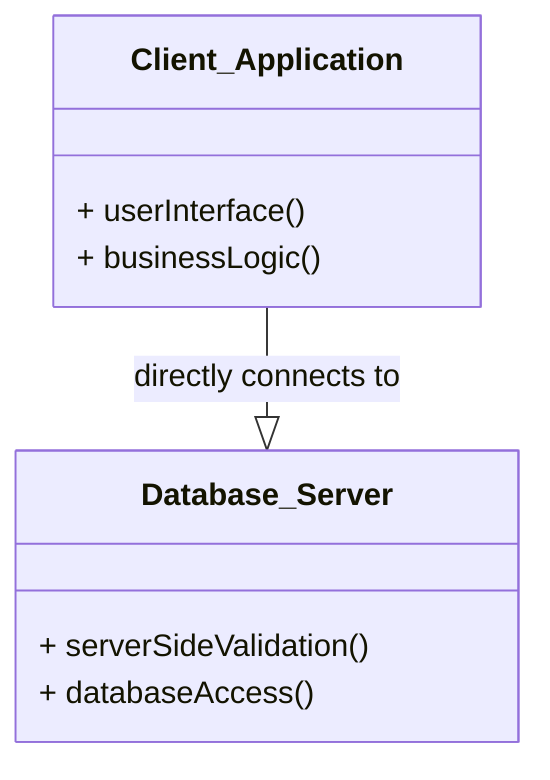
*Note: This `classDiagram` illustrates the two tiers: `Client_Application` and `Database_Server`, and their direct relationship.*

## Context & Framework
#### How the Parts Talk to Each Other
In a [[Two_Tier_Architecture]], the client application establishes a direct connection with the database server. The client sends SQL queries or other data requests directly to the database server, which processes them and returns the results. This direct communication simplifies development for smaller applications but places a significant portion of the application's processing load (including much of the business logic) on the client, which can become problematic for scalability and maintainability in larger deployments.

## The Mastery Deep Dive
#### Opening the Hood: What's Inside?
A [[Two_Tier_Architecture]] divides the system into two main components:
1.  **First Tier: Client:**
    *   This is the user's workstation where the application runs.
    *   Its responsible for the **user interface** (what the user sees and interacts with).
    *   Crucially, it often contains the **main business and data processing logic**. This means a lot of the application's "intelligence" resides on the client machine. These clients are sometimes referred to as "fat clients" because they require considerable resources (disk space, RAM, CPU) to run effectively.
2.  **Second Tier: Database Server:**
    *   This is typically a more powerful machine running the database management system (DBMS).
    *   Its primary responsibilities are **server-side validation** (ensuring data integrity rules are met) and **database access** (storing, retrieving, and updating data).
    *   The database server primarily acts as a central repository and enforcer of data rules.

The direct connection between the client and the database server is a defining characteristic, differentiating it from multi-tiered architectures that introduce intermediary layers.

#### Component Interactions
In a [[Two_Tier_Architecture]], interaction is direct and typically client-initiated. The client application, holding much of the business logic, sends queries and update requests directly to the database server. The database server executes these requests, performs any necessary server-side validation, and returns raw data to the client. The client then formats this data and presents it to the user. This direct interaction model means that any changes to the core business logic often require updates and redeployments to every client application.

## Constraints & Limitations
#### The Engineering Trade-off
The [[Two_Tier_Architecture]], while straightforward for small systems, faces significant engineering trade-offs when scaled. Its primary drawbacks are:
1.  **"Fat Clients":** Requiring substantial resources on each client machine (disk space, RAM, CPU) for the application and its logic. This makes client-side administration overhead high (e.g., deploying updates).
2.  **Scalability Challenges:** As the number of users (clients) increases, the direct connection to the database server can become a bottleneck. The server must handle not only data storage but also manage a growing number of direct connections and potentially complex client-initiated transactions, impacting overall performance.
3.  **Limited Flexibility:** Changes to business logic or the need to integrate with other systems often require modifying and redeploying all client applications, leading to higher maintenance costs.

These problems with scalability and administration are what prompted the move towards [[Three_Tier_Architecture]].

## Significance & Application
[[Two_Tier_Architecture]] was a significant improvement over file-server systems and remains suitable for small to medium-sized applications with a limited number of concurrent users. It is often seen in traditional desktop applications that connect directly to a backend database. However, its limitations in scalability and manageability have led to its decline for large-scale enterprise or web-based systems, which favor more distributed and flexible architectures like the three-tier model.

## The Worked Example
This example demonstrates a simple scenario in a two-tier system and highlights its "fat client" problem.

```text
**Scenario:** An employee uses a desktop inventory application to update product stock.

**1. Client Application (on employee's desktop):**
    *   The application's executable (`.exe`) is installed on the desktop.
    *   It contains the entire user interface.
    *   It contains the logic for calculating reorder points, applying discounts, and validating product IDs.
    *   It establishes a direct connection to the database server.

**2. Database Server (on a separate server machine):**
    *   Stores the `Products` table.
    *   Performs basic server-side validation (e.g., ensuring `stock` is a positive number).

**Action:** The employee enters new stock for 'Product A'.
*   The client application processes the input, validates it locally using its embedded business logic, and then sends an `UPDATE` query directly to the database server.
*   The database server updates the stock.

**Problem:** If the logic for calculating reorder points changes, every employee's desktop application needs to be updated and redeployed. This is the **"fat client" problem**, leading to significant **client-side administration overhead**.

```
*Note: This text block illustrates the "fat client" problem inherent in two-tier architectures.*

## The Proving Ground
*Test your mastery. Cover the solutions below to test yourself first.*

#### Level 1: The Sanity Check (Verification)
**The Component Check:** In a [[Two_Tier_Architecture]], what are the two main tiers?
> **Solution:** The two main tiers are the Client (First Tier) and the Database Server (Second Tier).

#### Level 2: The Crucible (Mastery & Edge Cases)
**The Broken System:** A large enterprise attempts to scale a [[Two_Tier_Architecture]] application to thousands of users. They encounter problems with "fat clients" and high client-side administration overhead. Explain why these issues are inherent to the two-tier model and what architectural shift is often recommended to address them.
> **Solution:** The issues of "fat clients" and high client-side administration overhead are **inherent to the [[Two_Tier_Architecture]]** because the client tier is responsible for a significant portion of the application's logic and user interface. This makes the client application resource-intensive ("fat") and means that any changes to business logic or features require every client installation to be updated, leading to substantial administrative effort for large user bases. The architectural shift often recommended to address these problems is the [[Three_Tier_Architecture]]. This model introduces an intermediary "Application Server" to centralize business logic, reducing the client to a "thin client" and simplifying administration, as discussed in `# Constraints & Limitations`.

## Key Takeaways
*   Two-tier architecture consists of a client (user interface, business logic) and a database server (data management).
*   Clients are "fat" due to embedded business logic, leading to high resource demands.
*   This architecture faces scalability challenges and high client-side administration overhead for large deployments.

## Knowledge Graph Connections
| Concept | Connection / Relationship |
| :
-------------------------- | :
------------------------------------------------------------------------------------------ |
| [[Client_Server_Architecture]] | Two-tier architecture is a specific implementation of the general client-server model.     |
| [[Database_Management_System]] | The database server in a two-tier architecture runs the DBMS.                            |
| [[Three_Tier_Architecture]] | Three-tier architecture evolved as a solution to the limitations of two-tier systems.      |
| [[Multi_User_DBMS_Architectures]] | It is one of the architectures used to support multiple users in a DBMS environment.     |
---

---

## CS1241 2 Database Management Systems DBMS Possible Questions


## Part I: The Conceptual Mastery Ladder
*Progress through these levels for every atomic concept. Do not move to the next concept until you can answer Level 3.*

### [[Database_Management_System]]
#### Level 1: Understanding (The Basics)
1.  **The Component Check:** Identify the fundamental roles of a database management system in handling data for users and applications.
#### Level 2: Competence (Application)
2.  **The Clean Build:** Describe how a DBMS provides a structured approach to defining, creating, maintaining, and controlling access to a database, using an example of a small inventory system.
#### Level 3: Mastery (The Crucible)
3.  **The Broken System:** A small business attempts to manage its data using only spreadsheets. Analyze the inherent problems and explain how introducing a [[Database_Management_System]] would address these issues, considering aspects beyond simple storage.

### [[DBMS_Benefits_and_Drawbacks]]
#### Level 1: Understanding (The Basics)
1.  **The Fact Check:** List three key advantages of employing a Database Management System.
#### Level 2: Competence (Application)
2.  **The Trade-off:** A company is evaluating whether to implement a new DBMS. Discuss the primary advantages and disadvantages they should consider before making their decision, focusing on data redundancy, consistency, and initial investment.
#### Level 3: Mastery (The Crucible)
3.  **The Lose-Lose Scenario:** A startup with limited resources needs to manage a growing dataset. They face the choice between investing heavily in a full-featured DBMS (high cost, complexity) or continuing with file-based data storage (poor data integrity, security risks). Justify the 'least bad' choice, explaining the critical factors that make it preferable despite its drawbacks.

### [[History_of_Database_Systems]]
#### Level 1: Understanding (The Basics)
1.  **The Fact Check:** Name the three main generations of database systems.
#### Level 2: Competence (Application)
2.  **The Trade-off:** Compare and contrast the key characteristics of first-generation (Hierarchical and Network) and second-generation (Relational) database systems, highlighting the fundamental problem each aimed to solve.
#### Level 3: Mastery (The Crucible)
3.  **The Lose-Lose Scenario:** A legacy system uses a first-generation Hierarchical_Data_Model. A new requirement emerges for complex many-to-many relationships that are cumbersome to implement. Discuss the fundamental limitations of the Hierarchical_Data_Model that lead to this difficulty, and why an immediate migration might not be feasible, creating a difficult choice between maintaining legacy complexity or undergoing a costly overhaul.

### [[Relational_Data_Model]]
#### Level 1: Understanding (The Basics)
1.  **The Component Check:** Define what a "relation" (table), "tuple" (row), and "attribute" (column) refer to in the context of the [[Relational_Data_Model]].
#### Level 2: Competence (Application)
2.  **The Clean Build:** Explain how the [[Relational_Data_Model]] stores information, using the concepts of rows and columns, and describe how relationships between data are established.
#### Level 3: Mastery (The Crucible)
3.  **The Broken System:** A developer attempts to create a flat-file system where all related data for an entity is stored in a single, large text file. Explain why this approach inherently violates principles of the [[Relational_Data_Model]] and leads to significant data redundancy and inconsistency issues.

### [[Database_Languages]]
#### Level 1: Understanding (The Basics)
1.  **The Neighbor Check:** List the two primary categories of database languages and their main purpose.
#### Level 2: Competence (Application)
2.  **The Sort:** Categorize the following tasks as primarily using a Data Definition Language (DDL) or a Data Manipulation Language (DML): creating a new table, inserting a record, modifying a table structure, and deleting data.
#### Level 3: Mastery (The Crucible)
3.  **The Impostor:** A database administrator issues a command `ALTER TABLE Employees ADD COLUMN hire_date DATE;`. This command looks like it belongs to DML due to "manipulation," but it's actually DDL. Explain why this command is DDL and not DML, highlighting the core difference in what DDL affects.

### [[Data_Models]]
#### Level 1: Understanding (The Basics)
1.  **The Neighbor Check:** State the primary purpose of a [[Data_Models]].
#### Level 2: Competence (Application)
2.  **The Sort:** Categorize Object-based, Record-based, and Physical data models by explaining what aspect of data (e.g., entity, structure, storage) each primarily focuses on.
#### Level 3: Mastery (The Crucible)
3.  **The Impostor:** A data analyst presents a diagram showing relationships between tables and columns. While useful, they mistakenly call it a "physical data model." Explain why this is incorrect and describe what a true Physical_Data_Models would represent.

### [[Entity_Relationship_Data_Model]]
#### Level 1: Understanding (The Basics)
1.  **The Component Check:** Define an "entity" and a "relationship" within the context of an [[Entity_Relationship_Data_Model]].
#### Level 2: Competence (Application)
2.  **The Clean Build:** Draw a simple ER diagram for a university system, showing entities like `Student` and `Course`, and a relationship between them. Include at least two attributes for each entity.
#### Level 3: Mastery (The Crucible)
3.  **The Broken System:** An ER diagram is designed for a social media platform, but a user's `Posts` are shown as an attribute of the `User` entity, rather than a separate entity. Explain why this design choice is problematic for data integrity and flexibility, and how to correct it within the [[Entity_Relationship_Data_Model]].

### [[Functions_of_a_DBMS]]
#### Level 1: Understanding (The Basics)
1.  **The Neighbor Check:** List three core functions that a DBMS performs.
#### Level 2: Competence (Application)
2.  **The Sort:** Explain how a DBMS's "Transaction Support" and "Concurrency Control Services" work together to ensure data integrity in a multi-user environment.
#### Level 3: Mastery (The Crucible)
3.  **The Impostor:** A database system advertises "built-in reporting tools" as its primary strength. While useful, explain why these reporting tools are *not* considered a fundamental function of the DBMS itself, but rather a utility or application layer feature.

### [[Components_of_a_DBMS]]
#### Level 1: Understanding (The Basics)
1.  **The Component Check:** Name three primary components of a typical DBMS architecture.
#### Level 2: Competence (Application)
2.  **The Clean Build:** Describe the role of the DDL Compiler and the Query Processor within the overall [[Components_of_a_DBMS]], explaining how they interact with users and the database.
#### Level 3: Mastery (The Crucible)
3.  **The Broken System:** A database administrator observes that despite highly optimized SQL queries, the system's performance is consistently poor. Investigation reveals a bottleneck in the "File Manager" component. Explain what the File_Manager_Architecture is responsible for and how a failure in this component could cause widespread performance degradation.

### [[ANSI_SPARC_Three_Level_Architecture]]
#### Level 1: Understanding (The Basics)
1.  **The Component Check:** List the three levels of the [[ANSI_SPARC_Three_Level_Architecture]].
#### Level 2: Competence (Application)
2.  **The Clean Build:** Describe the purpose of the External Level and the Conceptual Level in the [[ANSI_SPARC_Three_Level_Architecture]], explaining whose view of the database each level represents.
#### Level 3: Mastery (The Crucible)
3.  **The Broken System:** A new regulation requires adding a sensitive data field to the internal physical storage of a database. Explain which levels of the [[ANSI_SPARC_Three_Level_Architecture]] should *ideally* remain unaffected by this change to physical storage, and why.

### [[Data_Independence]]
#### Level 1: Understanding (The Basics)
1.  **The Fact Check:** What is the main concept behind [[Data_Independence]] in a DBMS?
#### Level 2: Competence (Application)
2.  **The Trade-off:** Explain how [[Data_Independence]] allows upper layers of the database architecture to remain unaffected by changes in lower layers, using an example of a change in data storage.
#### Level 3: Mastery (The Crucible)
3.  **The Lose-Lose Scenario:** A software team decides to directly embed physical storage details (e.g., file paths, record offsets) into their application code. Discuss how this decision fundamentally compromises [[Data_Independence]], leading to extreme maintenance difficulties and a high risk of application breakage with even minor database schema changes.

### [[Logical_Data_Independence]]
#### Level 1: Understanding (The Basics)
1.  **The Impostor:** Define [[Logical_Data_Independence]] in the context of database schemas.
#### Level 2: Competence (Application)
2.  **The Sort:** Explain why adding a new entity or attribute to the conceptual schema *should not* require changes to external schemas or application programs if [[Logical_Data_Independence]] is maintained.
#### Level 3: Mastery (The Crucible)
3.  **The Impostor:** A database design change involves splitting a single `Address` attribute into `Street`, `City`, and `ZipCode` attributes at the conceptual level. An application program that previously accessed the single `Address` field now breaks. Explain why this indicates a *lack* of [[Logical_Data_Independence]] and what mechanisms should have prevented this.

### [[Physical_Data_Independence]]
#### Level 1: Understanding (The Basics)
1.  **The Impostor:** Define [[Physical_Data_Independence]] and explain its relationship to the internal schema.
#### Level 2: Competence (Application)
2.  **The Sort:** Provide an example of a change to the internal schema (e.g., using a different file organization) that, due to [[Physical_Data_Independence]], should not require changes to the conceptual or external schemas.
#### Level 3: Mastery (The Crucible)
3.  **The Impostor:** A database system is migrated to solid-state drives (SSDs) from traditional hard disk drives (HDDs) to improve performance. After the migration, application programs that do not interact with the physical storage directly unexpectedly fail. Explain why this demonstrates a failure in [[Physical_Data_Independence]] and what the ideal outcome should have been.

### [[Schema_Mapping]]
#### Level 1: Understanding (The Basics)
1.  **The Transformation: Before and After:** What is the primary role of [[Schema_Mapping]] in a DBMS architecture?
#### Level 2: Competence (Application)
2.  **Follow the Ball: A Slow-Motion Trace:** Describe how External/Conceptual Mapping enables the DBMS to translate user views into the conceptual schema, using a concrete example of a user query.
#### Level 3: Mastery (The Crucible)
3.  **The Reality Check: Theory vs. Real Life:** A new database application is being developed where the external view directly exposes physical storage details (e.g., specific table files, disk blocks) to the user. Explain how this design choice completely undermines the purpose of [[Schema_Mapping]] and [[Data_Independence]].

### [[Multi_User_DBMS_Architectures]]
#### Level 1: Understanding (The Basics)
1.  **The Component Check:** Name two common architectures used to implement multi-user database management systems.
#### Level 2: Competence (Application)
2.  **The Clean Build:** Compare and contrast the "Teleprocessing" and "File-Server" architectures in terms of where the application processing and DBMS execution occur.
#### Level 3: Mastery (The Crucible)
3.  **The Broken System:** A small office uses a file-server architecture for its database. As the number of users grows, they experience severe network slowdowns and data corruption issues. Explain the fundamental disadvantages of the File_Server_Architecture that lead to these problems, particularly regarding network traffic and concurrency control.

### [[Client_Server_Architecture]]
#### Level 1: Understanding (The Basics)
1.  **The Component Check:** What are the two core processes or roles in a [[Client_Server_Architecture]]?
#### Level 2: Competence (Application)
2.  **The Clean Build:** Describe how a [[Client_Server_Architecture]] overcomes the disadvantages of older multi-user architectures like teleprocessing and file-server, focusing on distributed processing and resource management.
#### Level 3: Mastery (The Crucible)
3.  **The Broken System:** A [[Client_Server_Architecture]] is implemented, but the client application performs all data validation and business logic. The server only handles raw data storage and retrieval. Explain why this setup, while technically client-server, introduces significant scalability and security vulnerabilities.

### [[Two_Tier_Architecture]]
#### Level 1: Understanding (The Basics)
1.  **The Component Check:** In a [[Two_Tier_Architecture]], what are the two main tiers?
#### Level 2: Competence (Application)
2.  **The Clean Build:** Describe the typical responsibilities of the "Client" and "Database Server" in a [[Two_Tier_Architecture]], including where user interface and server-side validation logic reside.
#### Level 3: Mastery (The Crucible)
3.  **The Broken System:** A large enterprise attempts to scale a [[Two_Tier_Architecture]] application to thousands of users. They encounter problems with "fat clients" and high client-side administration overhead. Explain why these issues are inherent to the two-tier model and what architectural shift is often recommended to address them.

### [[Three_Tier_Architecture]]
#### Level 1: Understanding (The Basics)
1.  **The Component Check:** What are the three main tiers in a [[Three_Tier_Architecture]]?
#### Level 2: Competence (Application)
2.  **The Clean Build:** Explain how a [[Three_Tier_Architecture]] improves upon the [[Two_Tier_Architecture]] by introducing an "Application Server," specifically addressing issues of scalability and maintainability.
#### Level 3: Mastery (The Crucible)
3.  **The Broken System:** In a [[Three_Tier_Architecture]], a developer mistakenly places critical business logic directly within the "Database Server" tier, bypassing the "Application Server." Explain how this subverts the benefits of the three-tier model, leading to reduced flexibility and potential performance bottlenecks.

### [[Components_of_DBMS_Environment]]
#### Level 1: Understanding (The Basics)
1.  **The Component Check:** List the five basic components of a DBMS environment.
#### Level 2: Competence (Application)
2.  **The Clean Build:** Describe the roles of "Hardware" and "Software" within a [[Components_of_DBMS_Environment]], providing examples for each.
#### Level 3: Mastery (The Crucible)
3.  **The Broken System:** A company invests heavily in cutting-edge DBMS software and powerful hardware but neglects the "Procedures" and "People" components of its [[Components_of_DBMS_Environment]]. Predict the likely problems this company will face in effectively utilizing its database system, even with advanced technology.

## Part II: Unit Synthesis (The Final Boss)
*These questions require combining multiple concepts from the unit to solve a complex problem.*

#### Integrated Scenario: Designing a University Course Registration System
**The Setup:** You are tasked with designing the core database architecture for a new university course registration system. This system needs to handle thousands of students, hundreds of courses, and manage student registrations, grades, and faculty assignments. It must be accessible via a web portal and provide robust security.
**The Constraints:** The system must be highly scalable, resistant to data redundancy, ensure data consistency, and offer flexible access for different user roles (students, faculty, administrators). You anticipate frequent changes to the university's course catalog and student enrollment policies.
**The Challenge:**
(a) Design a suitable multi-user DBMS architecture ([[Multi_User_DBMS_Architectures]]) for this system, explaining your choice (e.g., [[Three_Tier_Architecture]] vs. [[Two_Tier_Architecture]]) and how it addresses the scalability and access requirements.
(b) Explain how the [[ANSI_SPARC_Three_Level_Architecture]] would be applied to this system, describing the "view" each level (External, Conceptual, Internal) would provide to different stakeholders (e.g., a student, a registrar, the database administrator).
(c) Discuss how [[Logical_Data_Independence]] and [[Physical_Data_Independence]] are crucial for the longevity and maintainability of this university system, particularly given the anticipated changes in course catalogs and policies.
(d) Recommend a primary [[Data_Models]] and [[Database_Languages]] to define and manage the core student and course data, justifying your choices.