# 3 Conceptual Database Design

Comprehensive resource for 3 Conceptual Database Design.


---

## 3 Conceptual Database Design Hub


## Overview
This unit introduces the foundational concepts of **Conceptual Database Design**, specifically focusing on the **Entity-Relationship (ER) Model**. It navigates through the initial phases of the Database Development Lifecycle, emphasizing how data requirements are gathered, analyzed, and transformed into a high-level, implementation-independent data model. Mastering this unit provides the essential blueprint for constructing robust and logically sound databases, ensuring that the database accurately reflects the real-world entities, their properties, and their complex interrelationships.

## Learning Objectives
*   Understand the context of conceptual database design within the broader Database Development Lifecycle.
*   Identify and differentiate between the three main phases of database design: conceptual, logical, and physical.
*   Grasp the fundamental components of the Entity-Relationship (ER) Model: entity types, relationship types, and attributes.
*   Distinguish between strong and weak entity types based on their existence dependency.
*   Classify relationship types by their degree (unary, binary, ternary) and recognize recursive relationships.
*   Categorize and represent various attribute types, including simple, composite, single-valued, multi-valued, and derived attributes.
*   Comprehend the different types of keys (candidate, primary, composite) and their role in uniquely identifying entities.
*   Apply structural constraints, specifically multiplicity (cardinality and participation), to define business rules within relationships.

## Unit Applications & Real-World Relevance
Conceptual Database Design is the architect's blueprint for any information system, crucial for ensuring data integrity and consistency. In the real world, it's used by **Data Architects** and **Database Designers** to model complex business domains, ranging from inventory management systems in retail to patient record systems in healthcare. For instance, designing a banking system requires a clear conceptual model to define `Customer` entities, `Account` entities, and the `Holds` relationship between them, including how `Account Number` uniquely identifies an account. Without a robust conceptual design, databases can become inconsistent, inefficient, and difficult to maintain, leading to critical errors in data processing and reporting.

## Active Learning Prompts
*   Consider a social media platform. Identify at least five key entities, their attributes, and relationships. How would you represent a "friendship" using the ER model, considering it's a mutual relationship?
*   Think about your university's student information system. Can you identify an example of a composite attribute and a multi-valued attribute that might be associated with a `Student` entity?
*   Imagine you're designing a database for a new online bookstore. What would be a crucial "business rule" you'd need to capture as a structural constraint between `Book` and `Customer` entities (e.g., how many books can a customer order)?

## Unit Challenges & Common Misconceptions
A common challenge in conceptual database design is accurately capturing the nuances of real-world business rules without over-complicating the model. Students often conflate attributes with entities, or struggle to correctly identify the cardinality and participation constraints in complex relationships, leading to ambiguity. Another misconception is that the conceptual model is too abstract and disconnected from implementation; however, a flawed conceptual design inevitably leads to significant issues in logical and physical design phases, requiring costly rework. Clearly distinguishing between the objectives of conceptual, logical, and physical design is essential to avoid these pitfalls.

## Connections
  - [[Database_Development_Methodology]]
    - [[Conceptual_Database_Design]]
    - [[Logical_Database_Design]]
    - [[Physical_Database_Design]]
  - [[Entity_Relationship_ER_Model]]
    - [[Entity_Types]]
      - [[Strong_Entity_Type]]
      - [[Weak_Entity_Type]]
    - [[Relationship_Types]]
      - [[Degree_of_a_Relationship]]
      - [[Recursive_Relationship]]
    - [[Attributes_in_ER_Model]]
      - [[Simple_Attribute]]
      - [[Composite_Attribute]]
      - [[Single_Valued_Attribute]]
      - [[Multi_Valued_Attribute]]
      - [[Derived_Attribute]]
      - [[Keys_in_ER_Model]]
        - [[Candidate_Key]]
        - [[Primary_Key]]
        - [[Composite_Key]]
  - [[Structural_Constraints_in_ER_Model]]
    - [[Multiplicity_in_ER_Model]]
      - [[Cardinality_in_ER_Model]]
      - [[Participation_in_ER_Model]]

## Next Steps for Deeper Understanding
To further deepen your understanding, explore advanced ER modeling concepts such as generalization, specialization, and aggregation. Investigate how conceptual models are translated into specific data models like the relational model during logical design, and consider tools used for automated ER diagramming. Additionally, studying real-world case studies of large-scale database designs can provide practical insights into the application of these principles.

## Possible Questions
[[CS1241_3_Conceptual_Database_Design_Possible_Questions]]
---

---

## Database Development Methodology


## Definition
Before proceeding, ensure you master [[Conceptual_Database_Design]] and [[Logical_Database_Design]].
A Database Development Methodology, often referred to as the Database System Development Life Cycle (DDLC), is a structured approach encompassing a series of phases or stages for designing, implementing, and maintaining a database system. It treats the database as a fundamental component of a larger information system, guiding its development from initial planning through to operational maintenance. Think of it like building a house: you don't just start laying bricks; you follow a structured plan, from initial blueprints to final touches, ensuring every step is accounted for and interconnected.

## The Mental Model
Imagine you're baking a multi-layered cake. The **Database Development Methodology** is your entire recipe book and the process you follow from deciding what kind of cake to make (planning), gathering ingredients (requirements), designing the cake layers (design), baking it (implementation), tasting it (testing), and keeping it fresh (maintenance). Each step is crucial, and skipping one can lead to a messy, unpalatable result.

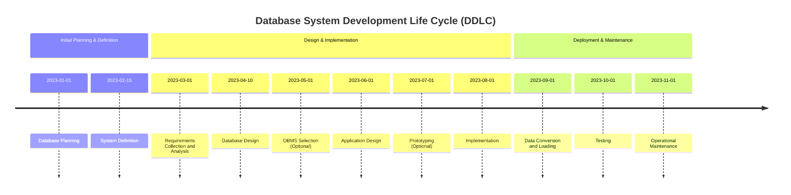
```mermaid
timeline
    title Database System Development Life Cycle (DDLC)
    dateFormat YYYY-MM-DD
    section Initial Planning & Definition
        2023-01-01 : Database Planning
        2023-02-15 : System Definition
    section Design & Implementation
        2023-03-01 : Requirements Collection and Analysis
        2023-04-10 : Database Design
        2023-05-01 : DBMS Selection (Optional)
        2023-06-01 : Application Design
        2023-07-01 : Prototyping (Optional)
        2023-08-01 : Implementation
    section Deployment & Maintenance
        2023-09-01 : Data Conversion and Loading
        2023-10-01 : Testing
        2023-11-01 : Operational Maintenance
```
*Note: This `timeline` illustrates the sequential progression of phases within the Database System Development Life Cycle, highlighting their typical order and interdependence.*

## Context & Framework
#### The Problem: Why Did We Invent This?
The Database Development Methodology emerged to address the complexities and potential chaos inherent in developing robust information systems. Historically, without a structured approach, database projects often suffered from scope creep, unmet user requirements, data inconsistencies, security vulnerabilities, and budget overruns. The methodology provides a standardized framework to mitigate these risks by enforcing systematic planning, clear communication, and phased execution, ensuring that the final database effectively supports organizational objectives.

## The Mastery Deep Dive
#### Version 1.0 vs. Today
Early database development often involved ad-hoc approaches, where databases were designed in isolation or as afterthoughts to application development. This led to monolithic systems with poor flexibility and scalability. Today's methodologies, while still rooted in core principles, are significantly more iterative and agile, incorporating user feedback at earlier stages through prototyping and emphasizing continuous integration and maintenance. The fundamental phases remain, but the tools and techniques within each phase have evolved to prioritize efficiency, adaptability, and user-centric design.

#### The "Same Story, Different Setting"
The structured approach of the DDLC is not unique to databases; it mirrors the Software Development Life Cycle (SDLC) used for broader software systems. Just as building a complex application requires distinct phases like planning, design, coding, and testing, a database—being a critical component—requires its own tailored lifecycle. This parallel highlights the universal need for systematic processes in engineering complex digital artifacts, where each phase builds upon the last, preventing costly errors and ensuring a cohesive final product.

## Constraints & Limitations
#### The Hard Choice: Option A or Option B?
Database development methodologies, while providing structure, can sometimes be perceived as rigid or time-consuming, especially in fast-paced environments. A key trade-off lies between strict adherence to every phase (which ensures thoroughness but can delay delivery) versus adopting more agile, adaptive strategies (which offer speed but might risk overlooking critical details if not managed carefully). Organizations must decide which approach best fits their project's scale, complexity, and risk tolerance, recognizing that a "one-size-fits-all" solution is rarely optimal.

## Significance & Application
The Database Development Methodology is academically significant as it provides a theoretical framework for understanding how complex data systems are conceived and brought to life. In the real world, it is indispensable for **Database Administrators (DBAs)**, **System Analysts**, and **Software Engineers** who are involved in designing and managing databases. Adhering to a methodology ensures that databases are scalable, secure, and performant, directly impacting an organization's ability to store, retrieve, and utilize critical information effectively. This systematic approach reduces errors, minimizes rework, and ultimately leads to more reliable and efficient information systems.

## The Worked Example
*Test your mastery. Cover the solutions below to test yourself first.*

Consider a university proposing a new online course registration system. They must implement a new database.

#### Level 1: The Sanity Check (Verification)
**The Question:** Identify the *first two* phases that the university should undertake in their database development methodology before any actual data modeling begins.
> **Solution:** The first two phases are `Database Planning` and `System Definition`.

#### Level 2: The Crucible (Mastery & Edge Cases)
**The Scenario:** During the `Requirements Collection and Analysis` phase, the university's IT department focuses heavily on interviewing faculty members about their grading and student tracking needs. However, they neglect to gather input from the Bursar's Office regarding financial holds on student accounts.
**The Challenge:**
(a) Explain how this oversight violates a core principle of the Database Development Methodology.
(b) Predict a potential critical issue that could arise during the `Application Design` or `Implementation` phases due directly to this omission.
(c) Describe how a robust DDLC would typically prevent such an issue.
> **Solution:**
> (a) This oversight violates the **`Requirements Collection and Analysis`** phase's principle of comprehensively gathering information from *all relevant stakeholders*. The Bursar's Office is a critical stakeholder whose data requirements (e.g., student financial status impacting registration eligibility) directly affect the core functionality of a course registration system.
> (b) A critical issue that could arise is the **inability to enforce financial holds on student registrations**. During `Application Design`, the logic for checking financial eligibility would be incomplete or missing. In `Implementation`, students with outstanding fees could register for courses, leading to significant financial losses or administrative complications for the university.
> (c) A robust DDLC, particularly in the `Requirements Collection and Analysis` phase, would typically involve diverse information gathering techniques such as **interviewing end users *individually and in a group***, **questionnaire surveys**, and **examining different documents like forms and reports** from all departments interacting with student registration. This comprehensive approach ensures that all necessary business rules and data requirements are identified and analyzed *before* proceeding to design, thereby preventing critical omissions like neglecting financial holds.

## Key Takeaways
*   The Database Development Methodology (DDLC) is a structured, phased approach for designing, implementing, and maintaining database systems, treating them as integral parts of wider information systems.
*   It encompasses distinct stages from initial planning and requirements gathering through design, implementation, testing, and ongoing maintenance to ensure robust and effective database solutions.
*   Adhering to the DDLC is crucial for mitigating risks like scope creep, data inconsistencies, and security issues, ultimately leading to more reliable and efficient information systems.

## Knowledge Graph Connections
| Concept                     | Connection / Relationship                                                                                                           |
| :
-------------------------- | :
---------------------------------------------------------------------------------------------------------------------------------- |
| [[Conceptual_Database_Design]] | The first and most abstract phase within the overall database development methodology.                                                          |
| [[Logical_Database_Design]]   | Follows conceptual design, mapping the conceptual model to a specific data model within the methodology.                               |
| [[Physical_Database_Design]]  | The final design phase, detailing the implementation on secondary storage within the overall development process.                       |
| Requirements_Collection_And_Analysis | A critical phase within the methodology that feeds into all subsequent design stages.                                                      |
| Information_System      | The broader context within which database development methodology operates, as the database is a fundamental component.                 |
---

---

## Entity Relationship ER Model


## Definition
Before proceeding, ensure you master [[Entity_Types]] and [[Relationship_Types]].
The Entity-Relationship (ER) Model is a high-level conceptual data model that describes the structure of a database in terms of entities, attributes, and relationships. It provides a graphical representation of the logical structure of a database using an ER Diagram (ERD), which serves as a blueprint for database design. The ER model helps in understanding and communicating the data requirements of an organization by illustrating how different pieces of information (entities) are categorized, what properties they possess (attributes), and how they are interconnected (relationships). Think of it as drawing a family tree, where each person is an entity, their characteristics (like age or profession) are attributes, and the lines connecting them represent relationships (like 'parent of' or 'married to').

## The Mental Model
Imagine you're an archaeologist creating a map of an ancient city. The **Entity-Relationship (ER) Model** is your system for drawing this map. Each type of building (temple, house, market) is an **Entity**. The unique features of each building (size, purpose, owner) are its **Attributes**. The roads and pathways connecting these buildings, or the relationships between different social classes, are your **Relationships**. This map helps you understand the entire structure and how everything fits together.

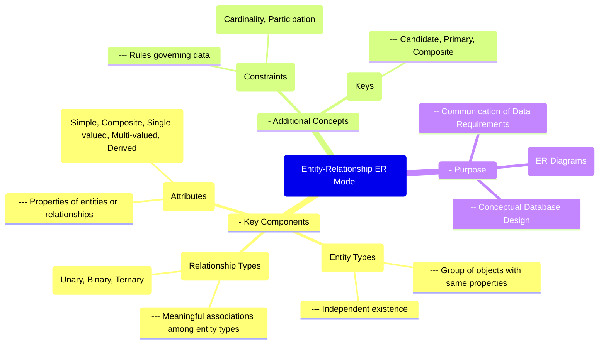
```mermaid
mindmap
  root(Entity-Relationship ER Model)
    - Key Components
      -- (Entity Types)
        --- Group of objects with same properties
        --- Independent existence
      -- (Relationship Types)
        --- Meaningful associations among entity types
        --- Degrees (Unary, Binary, Ternary)
      -- (Attributes)
        --- Properties of entities or relationships
        --- Types (Simple, Composite, Single-valued, Multi-valued, Derived)
    - Additional Concepts
      -- (Constraints)
        --- Rules governing data
        --- Multiplicity (Cardinality, Participation)
      -- (Keys)
        --- Candidate, Primary, Composite
    - Purpose
      -- Conceptual Database Design
      -- Graphical Representation (ER Diagrams)
      -- Communication of Data Requirements
```
*Note: This `mindmap` visually centers the Entity-Relationship Model, branching out to its key components (Entity Types, Relationship Types, Attributes) and additional concepts like Constraints and Keys, along with its overall purpose.*

## Context & Framework
#### Where Does it Live? (The Map)
The Entity-Relationship Model resides firmly within the [[Conceptual_Database_Design]] phase of the Database Development Life Cycle. It is the primary tool used to capture and represent an organization's data requirements at a high level, independent of any specific DBMS or physical implementation details. Its output, the ER Diagram, serves as the critical input for the subsequent [[Logical_Database_Design]] phase, where the conceptual model is translated into a specific data model (e.g., relational model) ready for implementation.

## The Mastery Deep Dive
#### Opening the Hood: What's Inside?
The ER model is primarily composed of three core building blocks:
*   **Entities**: These are the "nouns" of the database, representing real-world objects or concepts that have independent existence and are identifiable, such as `Student`, `Course`, or `Department`. They are typically represented as rectangles in an ER Diagram.
*   **Attributes**: These are the "adjectives" or properties that describe an entity or a relationship. For example, a `Student` entity might have attributes like `StudentID`, `StudentName`, and `DateOfBirth`. Attributes are often represented as ovals connected to entities.
*   **Relationships**: These are the "verbs" or associations between two or more entities. For instance, a `Student` `enrolls in` a `Course`. Relationships are typically represented as diamonds connecting entities.
These components work together to provide a comprehensive, structured view of the data landscape.

#### The Translator: From "Lego" to "Jargon"
The ER model provides an intuitive, graphical "Lego-like" way to build a database concept, which is then formally translated into academic jargon. For example:
*   An "object of interest" (Lego) becomes an `Entity` (Jargon).
*   "Characteristics of an object" (Lego) become `Attributes` (Jargon).
*   "How objects are connected" (Lego) becomes `Relationships` (Jargon).
*   "Rules for connections" (Lego) becomes `Structural Constraints` like `Multiplicity` (Jargon).
This translation is crucial for moving from an understandable, high-level design to a precise, formal specification required for database implementation.

## Constraints & Limitations
#### The Hard Choice: Option A or Option B?
While powerful, the ER Model has limitations, particularly when dealing with complex data types or intricate business rules that don't easily map to simple entity-relationship constructs. For instance, modeling hierarchies with multiple inheritance or time-varying data can become cumbersome. A key trade-off might be between maintaining a purely conceptual model (which can become overly complex for certain scenarios) versus introducing some pragmatic [[Logical_Database_Design]] considerations earlier to simplify the ER diagram. Designers must choose a balance, potentially supplementing ERDs with other modeling techniques for specific complexities.

## Significance & Application
The Entity-Relationship Model is academically significant as it forms the bedrock of conceptual data modeling, providing a universal language for database design. In the real world, it is an essential tool for **Database Architects**, **Data Analysts**, and **Business Process Modelers**. It is widely used in **system analysis and design**, helping to visualize and document data requirements for applications ranging from inventory management to social networks. By providing a clear and unambiguous representation of data, the ER model facilitates communication between technical developers and non-technical stakeholders, ensuring that the database accurately reflects business needs.

## The Worked Example
*Test your mastery. Cover the solutions below to test yourself first.*

Consider a simplified online university system that needs to track `Students`, `Courses`, and the act of `Enrollment`.

#### Level 1: The Sanity Check (Verification)
**The Question:** For the university system, identify which of the following would be represented as an **entity** in an ER Model: `Student_ID`, `Student_Name`, `Takes_Course`, `Course_Code`, `Professor`.
> **Solution:** `Professor` would be represented as an entity. `Student_ID`, `Student_Name`, and `Course_Code` are attributes. `Takes_Course` is a relationship.

#### Level 2: The Crucible (Mastery & Edge Cases)
**The Scenario:** A designer creates an ER diagram for this university system. Instead of creating a `Course` entity and an `Enrollment` relationship between `Student` and `Course`, they create a `Course_Enrollment` entity that has attributes for `Course_Code` and `Student_ID`, directly linking it to `Student`.
**The Challenge:**
(a) Identify a conceptual modeling principle that this design might implicitly violate or complicate.
(b) Explain why `Course_Enrollment` might be better represented as a **relationship type** rather than a pure entity in this simple scenario.
(c) Describe a scenario where `Course_Enrollment` *would* legitimately be treated as an entity in an ER diagram.
> **Solution:**
> (a) This design implicitly complicates the principle of **representing relationships as first-class citizens** and might lead to an overly entity-centric view, potentially blurring the distinction between entities and the associations between them. It might also complicate the identification of unique courses if `Course_Code` is only an attribute of `Course_Enrollment`.
> (b) `Course_Enrollment` might be better represented as a **relationship type** because it intrinsically describes an association or action (`enrolls in`) between two distinct entities (`Student` and `Course`). Its existence is dependent on both a student and a course, making it a natural fit for a relationship type.
> (c) `Course_Enrollment` *would* legitimately be treated as an **entity** if it possessed its own **independent attributes** beyond just the keys of the participating entities, or if it participated in further relationships. For example, if `Course_Enrollment` had attributes like `Enrollment_Date`, `Grade`, `Status` (e.g., 'Completed', 'Dropped'), or if an `Enrollment` could have an associated `Payment` entity, then it gains enough independent significance to be modeled as an entity itself (often called an associative entity or composite entity).

## Key Takeaways
*   The Entity-Relationship (ER) Model is a high-level conceptual data model using entities, attributes, and relationships to describe database structure.
*   ER Diagrams (ERDs) provide a graphical blueprint for database design, facilitating understanding and communication of data requirements.
*   It serves as the foundation for the conceptual database design phase, translating real-world concepts into a structured model before physical implementation.

## Knowledge Graph Connections
| Concept                     | Connection / Relationship                                                                   |
| :
-------------------------- | :
------------------------------------------------------------------------------------------ |
| [[Conceptual_Database_Design]] | This is the primary modeling tool utilized during the initial phase of database design.      |
| [[Entity_Types]]            | A fundamental building block of the ER model, representing real-world objects or concepts.    |
| [[Relationship_Types]]      | A fundamental building block of the ER model, describing associations between entities.       |
| [[Attributes_in_ER_Model]]  | A fundamental building block of the ER model, representing properties of entities or relationships. |
| [[Structural_Constraints_in_ER_Model]] | These define the rules governing relationships within the ER model, often visually represented. |
---

---

## Physical Database Design


## Definition
Before proceeding, ensure you master [[Conceptual_Database_Design]] and [[Logical_Database_Design]] because Physical Database Design fundamentally relies on these preceding stages to create an executable database schema.
Physical Database Design is the process of producing a description of the implementation of the database on secondary storage. It describes the base relations, file organizations, and indexes used to achieve efficient access to the data, and any associated integrity constraints and security measures. A simpler way to think about it is like building a house: logical design creates the blueprint and layout (what rooms are needed), while physical design specifies the actual materials, construction techniques, and infrastructure (how to build it to be strong and efficient).

## The Mental Model
Imagine you've meticulously planned a library (logical design), deciding which sections to have and how books relate to each other. Now, `Physical_Database_Design` is about *actually building* that library. It involves choosing the type of shelves (file organization), how to label and sort books for quick retrieval (indexing), deciding where the librarian's desk goes for security (user views/security), and figuring out the building's capacity (disk space). It's the tangible construction that makes the theoretical library functional.

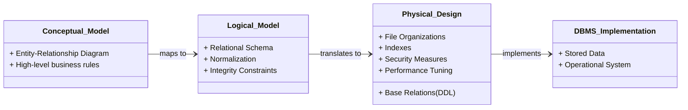
```mermaid
classDiagram
    direction LR
    class Conceptual_Model {
        + Entity-Relationship Diagram
        + High-level business rules
    }
    class Logical_Model {
        + Relational Schema
        + Normalization
        + Integrity Constraints
    }
    class Physical_Design {
        + Base Relations (DDL)
        + File Organizations
        + Indexes
        + Security Measures
        + Performance Tuning
    }
    class DBMS_Implementation {
        + Stored Data
        + Operational System
    }

    Conceptual_Model --> Logical_Model : maps to
    Logical_Model --> Physical_Design : translates to
    Physical_Design --> DBMS_Implementation : implements
```
```text
// Scenario 1: Design Flow
// Output:
// (Visual representation of the class diagram showing the progression from Conceptual Model to Logical Model, then to Physical Design, and finally to DBMS Implementation.)
// This diagram illustrates the sequential flow in database design. The Conceptual Model defines entities and relationships, which are then formalized into a Relational Schema (Logical Model). The Physical Design translates this logical schema into concrete DBMS constructs (tables, indexes, security), which are then implemented as the actual operational database (DBMS Implementation).
```
*Note: This `classDiagram` illustrates the high-level progression from conceptual modeling to the final DBMS implementation, highlighting the role of Physical Design as the bridge.*

## Context & Framework
#### System Architecture & Dependencies
`Physical_Database_Design` serves as the critical bridge between the abstract data models (conceptual and logical) and the concrete implementation within a Database Management System (DBMS). It is inherently dependent on the decisions made in the `Logical_Database_Design` phase, where the "what" of the data (entities, attributes, relationships) is established. Physical design then translates this "what" into the "how" – determining the physical storage structures, access methods, and security protocols tailored for a specific DBMS and its underlying hardware. This deep dependency ensures that the resulting physical database accurately reflects the business requirements while optimizing for performance.

## The Mastery Deep Dive
#### The Exploded View: What's Inside?
At its core, `Physical_Database_Design` involves a multi-faceted approach to realizing a database. It begins with **translating the logical data model**, which means mapping the relational schema (tables, columns, keys) into Data Definition Language (DDL) commands for the chosen DBMS. This includes defining `base relations` (tables), designing the representation of `derived data` (e.g., whether to store a calculated value or compute it on the fly), and establishing `general constraints` (rules that maintain data integrity beyond basic key constraints). This foundational step ensures that the logical blueprint is accurately reflected in the physical structure, setting the stage for subsequent optimizations.

#### Component Interactions: How the Parts Talk to Each Other
The various components of physical design interact to form a cohesive, efficient system. `File organizations` determine the physical arrangement of data records on disk, impacting how quickly entire tables can be scanned or specific records accessed. `Indexes` then act as accelerators, providing quick pointers to data records based on specific attribute values, thus speeding up queries significantly. `Security measures` are integrated to control who can access what data and how, while `user views` offer customized perspectives of the data without altering the underlying structure. Finally, `controlled redundancy` can be introduced through `denormalization` to enhance performance for frequently accessed data, balancing the benefits of normalization with the need for speed. All these elements must be harmonized to achieve optimal database performance and security.

## Constraints & Limitations
#### The Engineering Trade-off: Performance vs. Storage vs. Complexity
Physical database design inherently involves managing complex trade-offs. Optimizing for `query performance` often means creating numerous `indexes` or introducing `controlled redundancy` through `denormalization`. However, indexes consume additional `disk storage`, and redundancy can complicate `data consistency` and `update operations`. Conversely, a highly normalized design (minimal redundancy) simplifies updates and maintains high data integrity but might lead to slower query performance due to extensive `join` operations. The challenge lies in finding the optimal balance that meets the application's specific performance requirements while managing storage costs and maintaining a reasonable level of complexity for administration and development.

## Significance & Application
`Physical_Database_Design` is paramount for the operational efficiency and long-term viability of any database system. Academically, it bridges theoretical database concepts with practical implementation challenges. In the real world, effective physical design directly translates to: **high performance** (fast query response times, efficient data processing), **scalability** (ability to handle increasing data volumes and user loads), **data integrity** (enforcing business rules and preventing inconsistencies), and **robust security** (controlling access and protecting sensitive information). A poorly designed physical database can lead to slow applications, frustrated users, increased hardware costs, and even data loss, underscoring its critical importance for database administrators, developers, and system architects.

## The Worked Example
#### Example: Choosing a File Organization for a High-Volume Transaction System
Consider an online banking system where the `Transactions` table is extremely large (billions of rows) and experiences:
1.  **Very frequent insertions:** New transactions are added continuously.
2.  **Frequent retrievals by `TransactionID` (Primary Key):** Users checking their specific transaction history.
3.  **Less frequent, but still important, retrievals by `AccountID` and `TransactionDate` range:** For statements and fraud detection.

**Analysis:**
*   A simple `Heap` file organization would be poor for retrievals as it's unordered, requiring full table scans for most queries.
*   An `Indexed Sequential Access Method (ISAM)` or `B+-Tree` would be better for `TransactionID` lookups. A `B+-Tree` is generally preferred for very high-volume, dynamic data due to its self-balancing nature, which handles insertions and deletions gracefully without requiring periodic reorganization, unlike ISAM.

**Decision for File Organization:**
Given the high volume of insertions and the need for efficient retrieval by `TransactionID`, a **`B+-Tree` file organization** on the `TransactionID` is the most suitable choice. This will provide:
*   **Fast insertions:** Logarithmic time complexity for insertions, as the tree self-balances.
*   **Fast `TransactionID` lookups:** Logarithmic time to traverse the tree to find a specific transaction.

**Illustrative `CREATE TABLE` Snippet (Conceptual):**

```sql
-- Conceptual DDL for a Transactions table with a B+-Tree file organization.
-- Actual syntax varies significantly by DBMS (e.g., PostgreSQL, Oracle, SQL Server).
-- This example illustrates the intent.

CREATE TABLE Transactions (
    TransactionID       BIGINT PRIMARY KEY, -- Primary key for unique identification
    AccountID           BIGINT NOT NULL,    -- Foreign key to Accounts table
    TransactionDate     TIMESTAMP NOT NULL, -- Date and time of transaction
    Amount              DECIMAL(18, 2) NOT NULL, -- Transaction amount
    TransactionType     VARCHAR(50) NOT NULL, -- e.g., 'Deposit', 'Withdrawal', 'Transfer'
    Description         VARCHAR(255)
)
-- The file organization is typically specified outside the CREATE TABLE statement
-- or implicitly managed by the DBMS when a PRIMARY KEY is defined.
-- Example (conceptual, not standard SQL):
-- WITH FILE_ORGANIZATION = B_PLUS_TREE ON (TransactionID);

-- We would then add indexes for other frequent search criteria
-- For AccountID and TransactionDate range queries:
-- CREATE INDEX idx_account_date ON Transactions (AccountID, TransactionDate);
```
```text
// Scenario 1: Applying a B+-Tree organization
// Output:
// The `CREATE TABLE` statement defines the schema for the `Transactions` table, including data types and `PRIMARY KEY` for `TransactionID`.
// (Conceptual comment regarding `FILE_ORGANIZATION` indicates the intent to use a B+-Tree on `TransactionID` for fast, ordered access and efficient insertions/deletions.)
// (Comment regarding a secondary index on `(AccountID, TransactionDate)` for faster range queries and account-specific lookups.)
```
*Note: The actual syntax for specifying `FILE_ORGANIZATION` varies significantly by DBMS and is often implicitly handled when defining a `PRIMARY KEY` or explicitly managed through storage parameters. The SQL above is conceptual to illustrate the logical design choice.*

## The Proving Ground
*Test your mastery. Cover the solutions below to test yourself first.*

#### Level 1: The Sanity Check (Verification)
**The Question:** What is the fundamental difference between the "what" concern of `Logical_Database_Design` and the "how" concern of `Physical_Database_Design`?
> **Solution:** Logical Database Design focuses on *what* data needs to be stored and *what* relationships exist between data elements, without considering specific implementation details. Physical Database Design focuses on *how* that data will be physically stored and accessed on secondary storage to optimize performance, security, and integrity for a specific DBMS.

#### Level 2: The Crucible (Mastery & Edge Cases)
**The Scenario:** A new social media application expects viral growth, leading to billions of user posts. The `Posts` table is designed logically with `PostID` (PK), `UserID` (FK), `Content`, `Timestamp`, and `LikesCount`. The developers initially propose a simple heap file organization for the `Posts` table because they anticipate very high insertion rates and want to avoid the overhead of maintaining order.
**The Constraint:** However, the application's most critical feature is displaying a user's *most recent posts* instantly upon profile visit, and also showing a global feed of *trending posts* (highest `LikesCount` within the last hour).
**The Challenge:** Explain why the simple heap file organization for the `Posts` table, given these critical retrieval constraints, is a "broken system" that will inevitably lead to severe performance issues. Point to at least two specific inefficiencies introduced by the heap file and suggest the fundamental change needed in the physical design to address these.
> **Solution:** A heap file organization stores records without any specific order, meaning new posts are simply appended. This design is highly inefficient for the critical retrieval constraints:
> 1.  **Retrieving recent posts:** To find a user's most recent posts, the system would likely have to scan a significant portion, or even the entire `Posts` table, sorting by `Timestamp` after retrieval. This becomes extremely slow as the table grows, violating the "instantly" requirement.
> 2.  **Trending posts:** Identifying posts with the highest `LikesCount` within the last hour would also require scanning a large subset of the table and then sorting/aggregating, which is highly inefficient for a real-time "trending" feature.
> The fundamental change needed is to introduce **indexing** and potentially a more optimized `file organization`. Specifically, a `clustering index` or `primary index` on `PostID` (if that's the natural order of insertion) would help, but a **`secondary index` on `(UserID, Timestamp DESC)`** would dramatically speed up retrieving recent posts for a specific user. For trending posts, a **`secondary index` on `(Timestamp DESC, LikesCount DESC)`** would be beneficial, allowing efficient range queries and ordering. The key is to order or provide quick access paths to data based on the *frequently queried attributes*, not just `PostID`.

## Key Takeaways
*   Physical Database Design translates logical models into concrete DBMS implementation, focusing on `how` data is stored and accessed.
*   It involves designing `base relations`, `file organizations`, `indexes`, `security measures`, and considering `controlled redundancy`.
*   Decisions in physical design involve crucial trade-offs between performance, storage, and complexity, necessitating careful analysis of application `workload` and `transaction` patterns.

## Knowledge Graph Connections
| Concept                     | Connection / Relationship                                                                                              |
| :
-------------------------- | :
--------------------------------------------------------------------------------------------------------------------- |
| [[Conceptual_Database_Design]] | Physical design builds upon the high-level data understanding established during conceptual design.                       |
| [[Logical_Database_Design]] | The relational schema produced during logical design is translated into DDL during physical design.                      |
| [[Database_Management_System]] | Physical design is tailored to the specific features and capabilities of a chosen database management system.             |
| Data_Integrity          | Physical design implements specific constraints to ensure the integrity and consistency of stored data.                  |
| Performance_Optimization | The primary goal of physical design is to optimize the database for efficient data retrieval and transaction processing. |
---

---

## Structural Constraints In ER Model


## Definition
Before proceeding, ensure you master [[Multiplicity_in_ER_Model]] and [[Relationship_Types]].
**Structural Constraints** in the Entity-Relationship (ER) Model are rules that govern the relationships between [[Entity_Types]]. They define the limits on how entities can be related to each other, specifically dictating the number of possible occurrences of an entity type that may relate to a single occurrence of an associated entity type through a particular relationship. These constraints essentially represent the **business rules** established by the user or organization. The main type of structural constraint is [[Multiplicity_in_ER_Model]], which is further broken down into [[Cardinality_in_ER_Model]] and [[Participation_in_ER_Model]]. Think of them as the "rules of engagement" for how different groups of people (entities) can interact with each other.

## The Mental Model
Imagine you're a bouncer at an exclusive club. The **Structural Constraints** are your rules for who can enter and how many people they can bring with them. For example, "one member can bring up to two guests" is a structural constraint. It governs the relationship between a `Member` entity and a `Guest` entity.

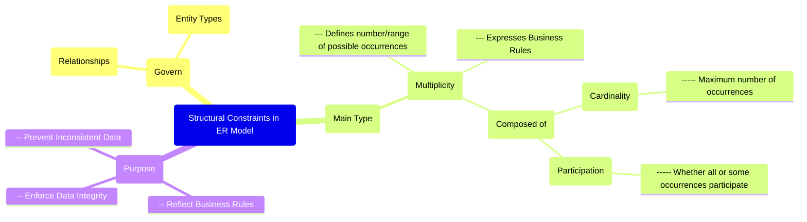
```mermaid
mindmap
  root(Structural Constraints in ER Model)
    - (Govern)
      -- (Relationships)
      -- Between (Entity Types)
    - (Main Type)
      -- (Multiplicity)
        --- Defines number/range of possible occurrences
        --- Expresses Business Rules
        --- (Composed of)
          ---- (Cardinality)
            ----- Maximum number of occurrences
          ---- (Participation)
            ----- Whether all or some occurrences participate
    - (Purpose)
      -- Enforce Data Integrity
      -- Reflect Business Rules
      -- Prevent Inconsistent Data
```
*Note: This `mindmap` centers `Structural Constraints in ER Model`, illustrating their purpose, what they govern, and their main components: Multiplicity, Cardinality, and Participation.*

## Context & Framework
#### Where Does it Live? (The Map)
[[Structural_Constraints_in_ER_Model]] are an essential element of the [[Entity_Relationship_ER_Model]], defining the semantic integrity of how [[Entity_Types]] relate to one another through [[Relationship_Types]]. They are crucial for accurately capturing the business rules of an organization during [[Conceptual_Database_Design]]. The overarching concept is [[Multiplicity_in_ER_Model]], which describes the quantitative aspects of a relationship, broken down into [[Cardinality_in_ER_Model]] (the maximum number of relationships) and [[Participation_in_ER_Model]] (whether involvement is mandatory or optional).

## The Mastery Deep Dive
#### Opening the Hood: What's Inside?
Structural constraints are vital because they directly enforce the rules that govern data. Without them, a database could easily store invalid or inconsistent information. For binary relationships (the most common degree), these constraints are expressed as:
*   **One-to-One (1:1)**: Each occurrence in one entity type relates to at most one occurrence in the other entity type. (e.g., `Employee` `Manages` `Department`, where one employee manages one department, and one department is managed by one employee).
*   **One-to-Many (1:*)**: Each occurrence in the first entity type relates to one or more occurrences in the second entity type, but each occurrence in the second entity type relates to at most one in the first. (e.g., `Department` `Has` `Employees`).
*   **Many-to-Many (*:*)**: Each occurrence in one entity type can relate to many occurrences in the other, and vice-versa. (e.g., `Student` `Enrolls_In` `Courses`).
These define the fundamental "allowed connections" between entities, reflecting real-world business policies.

#### The Translator: Hacker Slang to Exam Terms
When a business rule states "every employee *must* belong to a department" (Hacker Slang), this translates to a **total participation constraint** (Exam Term) for the `Employee` entity in the `Works_For` relationship with `Department`. Similarly, "a project can have *many* employees working on it" (Hacker Slang) translates to a **many-to-many cardinality** (Exam Term) between `Project` and `Employee`. This formalized language ensures that subjective business needs are precisely captured in the database design.

## Constraints & Limitations
#### The Hard Choice: Option A or Option B?
A common dilemma arises when business rules are ambiguous or change frequently. For example, if a "customer may or may not have an order," that implies optional participation. But what if the rule is "a customer must have at least one order to be considered active"? This changes the participation constraint. The trade-off is between **flexibility for future changes** (designing for looser constraints) and **strict data integrity** (enforcing current, tight constraints). Overly strict constraints might break the system if business rules evolve, while overly loose constraints risk allowing invalid data. The designer must strike a balance and communicate these implications.

## Significance & Application
Structural Constraints are academically significant as they provide the formal mechanisms for representing business rules directly within the data model. In the real world, it's an indispensable skill for **Database Designers**, **Business Analysts**, and **Data Architects**. They are applied in virtually every database design to ensure that the data accurately reflects the real-world rules it is meant to model. For example, ensuring that an `Order` *must* be placed by an existing `Customer` (mandatory participation) or that a `Product` can be in `Many` `Orders` (many-to-many cardinality) prevents inconsistent data, enforces business logic, and guarantees the integrity of the information system.

## The Worked Example
*Test your mastery. Cover the solutions below to test yourself first.*

Consider a simplified database for a company that tracks `Employees` and `Departments`.

#### Level 1: The Sanity Check (Verification)
**The Question:** For the relationship `Employee Works_For Department`, if every employee must belong to exactly one department, what is the cardinality from `Employee` to `Department`?
> **Solution:** The cardinality from `Employee` to `Department` is **one** (1).

#### Level 2: The Crucible (Mastery & Edge Cases)
**The Scenario:** A designer initially models the relationship `Department Has Employee` with a cardinality of "one-to-many" (1:*) from `Department` to `Employee`. However, the business rule states that a department *must* have at least one employee, and an employee *must* belong to a department.
**The Challenge:**
(a) Based on the business rule, describe the specific participation constraint for the `Department` entity in the `Has` relationship.
(b) Explain why a simple "one-to-many" cardinality with default optional participation would fail to capture both aspects of the business rule.
(c) How would the participation constraint for `Employee` be defined in this scenario?
> **Solution:**
> (a) The specific participation constraint for the `Department` entity in the `Has` relationship is **total participation** (or mandatory participation), with a minimum cardinality of one (1). This means a `Department` occurrence *must* participate in the `Has` relationship with at least one `Employee`.
> (b) A simple "one-to-many" cardinality with default optional participation would fail to capture both aspects because:
>    1.  **Department Participation:** Default optional participation would allow a `Department` to exist without any `Employee`s, which violates the rule that a department *must* have at least one employee.
>    2.  **Employee Participation:** Default optional participation would also allow an `Employee` to exist without a `Department`, which violates the rule that an employee *must* belong to a department.
> (c) The participation constraint for `Employee` in the `Works_For` (or `Has`) relationship would also be **total participation** (mandatory participation), with a minimum cardinality of one (1).

## Key Takeaways
*   Structural constraints are rules in the ER Model that govern relationships between entity types, reflecting business rules.
*   [[Multiplicity_in_ER_Model]] is the main type, defining the number or range of possible related occurrences, encompassing cardinality (maximum) and participation (mandatory/optional).
*   These constraints are vital for enforcing data integrity, preventing inconsistencies, and ensuring the database accurately models real-world interactions and policies.

## Knowledge Graph Connections
| Concept                     | Connection / Relationship                                                                   |
| :
-------------------------- | :
------------------------------------------------------------------------------------------ |
| [[Multiplicity_in_ER_Model]] | This is the main type of structural constraint, defining quantitative limits on relationships. |
| [[Relationship_Types]]      | Structural constraints explicitly govern how these associations between entities operate.     |
| [[Entity_Types]]            | Structural constraints define the interaction rules for occurrences of these classifications. |
| [[Cardinality_in_ER_Model]] | This is a component of multiplicity, defining the maximum number of relationship occurrences. |
| [[Participation_in_ER_Model]] | This is a component of multiplicity, determining whether all or some entities participate in a relationship. |
| [[Entity_Relationship_ER_Model]] | Structural constraints are a critical part of the ER model for representing business rules. |
---

---

## Attributes In ER Model


## Definition
Before proceeding, ensure you master [[Simple_Attribute]] and [[Multi_Valued_Attribute]].
In the Entity-Relationship (ER) Model, an **Attribute** is a property or characteristic that describes an [[Entity_Types]] or a [[Relationship_Types]]. Attributes provide specific details about the entities or relationships, differentiating one occurrence from another. For example, a `Student` entity might have attributes like `StudentID`, `StudentName`, `DateOfBirth`, and `Email`. An **Attribute Domain** is the set of allowable values for one or more attributes. Think of attributes as the various fields you would fill out on a form to describe a person or an item.

## The Mental Model
Imagine you're describing a car. The **Attributes** are all the details you'd list: its `Color`, `Make`, `Model`, `Year`, and `License_Plate_Number`. The car itself is the entity, and these details are its properties.

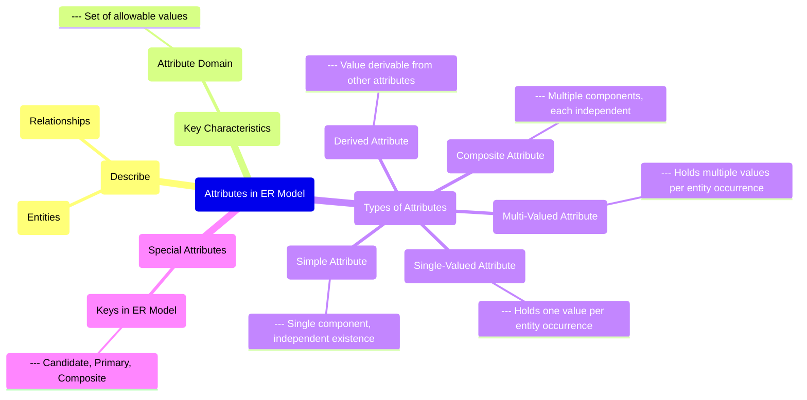
```mermaid
mindmap
  root(Attributes in ER Model)
    - (Describe)
      -- (Entities)
      -- (Relationships)
    - (Key Characteristics)
      -- (Attribute Domain)
        --- Set of allowable values
    - (Types of Attributes)
      -- (Simple Attribute)
        --- Single component, independent existence
      -- (Composite Attribute)
        --- Multiple components, each independent
      -- (Single-Valued Attribute)
        --- Holds one value per entity occurrence
      -- (Multi-Valued Attribute)
        --- Holds multiple values per entity occurrence
      -- (Derived Attribute)
        --- Value derivable from other attributes
    - (Special Attributes)
      -- (Keys in ER Model)
        --- Candidate, Primary, Composite
```
*Note: This `mindmap` centers `Attributes in ER Model`, branching out to show what they describe, their key characteristics, and various classifications, including their relationship to different types of `Keys`.*

## Context & Framework
#### Where Does it Live? (The Map)
[[Attributes_in_ER_Model]] are integral to both [[Entity_Types]] and [[Relationship_Types]] within the [[Entity_Relationship_ER_Model]]. They provide the descriptive power that allows us to distinguish individual instances of entities or specific occurrences of relationships. Attributes are classified based on their structure (simple, composite), the number of values they can hold (single-valued, multi-valued), and whether their value is stored directly or computed (derived). They also play a critical role in forming [[Keys_in_ER_Model]] (candidate, primary, composite), which are essential for unique identification.

## The Mastery Deep Dive
#### Opening the Hood: What's Inside?
Attributes come in several forms, each with distinct characteristics:
*   **Simple Attributes**: Cannot be broken down into smaller components (e.g., `StudentID`, `Age`).
*   **Composite Attributes**: Can be divided into smaller, meaningful components (e.g., `Address` composed of `Street`, `City`, `ZipCode`).
*   **Single-Valued Attributes**: Hold only one value for each entity occurrence (e.g., `DateOfBirth` for a person).
*   **Multi-Valued Attributes**: Can hold multiple values for each entity occurrence (e.g., `PhoneNumber` for a person who has multiple numbers).
*   **Derived Attributes**: Their values can be calculated from other attributes and are not stored directly (e.g., `Age` derived from `DateOfBirth` and current date).
Understanding these distinctions is crucial for accurately representing data properties and ensuring proper data storage and retrieval.

#### The Translator: From "Lego" to "Jargon"
The informal idea of "details about a thing" (Lego) is translated into the formal term `Attributes` (Jargon). When we talk about "details that can be broken down further" versus "details that can't" (Lego), we're referring to `Composite Attributes` and `Simple Attributes` (Jargon), respectively. Similarly, "details where there can be many of them" becomes `Multi_Valued Attributes` (Jargon). This standardized language is essential for precise communication in database design.

## Constraints & Limitations
#### The Hard Choice: Option A or Option B?
A common design challenge is deciding whether a specific piece of information should be modeled as a [[Simple_Attribute]], a [[Composite_Attribute]], or even be promoted to its own [[Entity_Types]]. For example, should `Address` be a composite attribute of a `Customer`, or should `Address` be a separate entity with its own ID, related to `Customer`? The trade-off is between **simplicity** (attribute) and **flexibility/granularity** (separate entity). A separate `Address` entity offers more flexibility if an address might need to participate in its own relationships (e.g., `Address Is_Location_Of Building`) or if multiple customers could share the same address. Conversely, keeping it as an attribute is simpler if address details are never needed independently.

## Significance & Application
Understanding Attributes is academically significant as it forms the basis for defining the properties of data elements in an ER model. In the real world, it's a fundamental skill for **Data Analysts**, **Database Designers**, and **Application Developers**. It is applied whenever data needs to be captured and stored, from designing fields in a customer relationship management (CRM) system to defining properties for products in an e-commerce catalog. Correctly identifying and categorizing attributes ensures that all necessary data points are collected, properly structured, and can be accurately queried and reported.

## The Worked Example
*Test your mastery. Cover the solutions below to test yourself first.*

Consider a university database that stores information about `Students`.

#### Level 1: The Sanity Check (Verification)
**The Question:** For a `Student` entity, identify a common attribute that would be considered a simple attribute.
> **Solution:** `StudentID` (or `FirstName`, `LastName`).

#### Level 2: The Crucible (Mastery & Edge Cases)
**The Scenario:** The university decides to track student `Degrees`. A student can hold multiple degrees (e.g., Bachelor's, Master's). A designer initially models `Degree` as a simple, single-valued attribute of `Student`.
**The Challenge:**
(a) Identify the specific type of attribute that `Degree` should ideally be, given the requirement that a student can hold multiple degrees.
(b) Explain why modeling it as a simple, single-valued attribute would be problematic for capturing this requirement.
(c) Describe how the `Degree` attribute would typically be represented in an ER diagram to reflect its correct type.
> **Solution:**
> (a) Given that a student can hold multiple degrees, `Degree` should ideally be modeled as a [[Multi_Valued_Attribute]].
> (b) Modeling `Degree` as a simple, single-valued attribute would be problematic because it can only store *one* value per `Student` occurrence. To store multiple degrees, one would either have to:
>    1.  Create multiple `Degree` columns (e.g., `Degree1`, `Degree2`), which is inflexible and limits the number of degrees.
>    2.  Store all degrees in a single `Degree` column as a comma-separated list, making it difficult to query individual degrees or maintain data integrity.
>    Neither option adheres to good database design principles.
> (c) In a traditional ER diagram, a multi-valued attribute like `Degree` would typically be represented by a **double-lined ellipse** connected to the `Student` entity.

## Key Takeaways
*   Attributes are properties that describe entities or relationships in the ER Model, providing specific details and differentiating occurrences.
*   They are classified by structure (simple, composite), value count (single-valued, multi-valued), and derivation (derived).
*   Correctly identifying and categorizing attributes is fundamental for capturing data requirements, forming keys, and ensuring accurate data representation in a database.

## Knowledge Graph Connections
| Concept                     | Connection / Relationship                                                                   |
| :
-------------------------- | :
------------------------------------------------------------------------------------------ |
| [[Entity_Relationship_ER_Model]] | This is a fundamental component of the ER model, defining properties of entities and relationships. |
| [[Entity_Types]]            | Attributes describe the characteristics and properties of these real-world objects.           |
| [[Relationship_Types]]      | Attributes can also describe specific properties of an association between entities.          |
| [[Keys_in_ER_Model]]        | Attributes are the building blocks that form candidate, primary, and composite keys.        |
| [[Simple_Attribute]]        | This is a specific classification of attributes that cannot be broken down further.           |
| [[Composite_Attribute]]     | This is a specific classification of attributes that can be broken down into sub-components.  |
| [[Single_Valued_Attribute]] | This is a specific classification of attributes that hold only one value per entity.          |
| [[Multi_Valued_Attribute]]  | This is a specific classification of attributes that can hold multiple values per entity.     |
| [[Derived_Attribute]]       | This is a specific classification of attributes whose values are calculated, not stored.      |
---

---

## Candidate Key


## Definition
Before proceeding, ensure you master [[Primary_Key]] and [[Composite_Key]].
A **Candidate Key** is a minimal set of [[Attributes_in_ER_Model]] that **uniquely identifies** each occurrence of an [[Entity_Types]]. "Minimal" means that if any attribute is removed from the set, the remaining attributes are no longer sufficient to guarantee uniqueness. An entity type can have one or more candidate keys. For example, for a `Student` entity, `StudentID` could be a candidate key, and `(Social_Security_Number)` could be another. Think of a candidate key as any distinct identifier that could, theoretically, be used as the primary way to refer to a specific item without confusion.

## The Mental Model
Imagine you have a class roster. Both `Student_ID` and a combination of `(First_Name, Last_Name, Date_Of_Birth)` might be unique for each student. Both of these are **Candidate Keys** because they can uniquely identify a student, and if you remove any part of them, they might lose their uniqueness (e.g., just `First_Name` isn't unique).

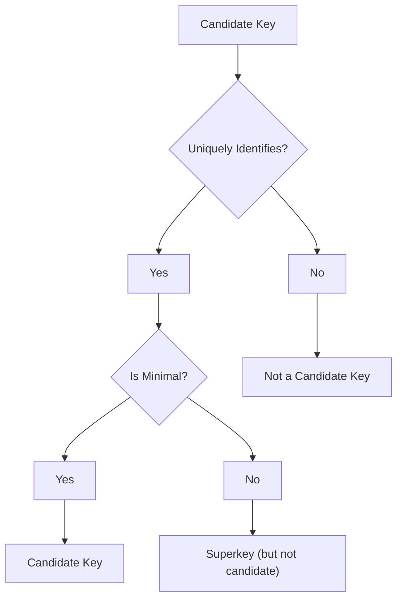
```mermaid
graph TD
    A["Candidate Key"] --> B{"Uniquely Identifies?"}
    B --> C["Yes"]
    C --> D{"Is Minimal?"}
    D --> E["Yes"]
    E --> F["Candidate Key"]
    D --> G["No"]
    G --> H["Superkey (but not candidate)"]
    B --> I["No"]
    I --> J["Not a Candidate Key"]
```
*Note: This `graph TD` illustrates the criteria for an attribute set to be classified as a Candidate Key, focusing on uniqueness and minimality.*

## Context & Framework
#### The Family Tree
[[Candidate_Key]]s are the foundational concept within [[Keys_in_ER_Model]]. They represent all potential unique identifiers for an [[Entity_Types]]. From the pool of candidate keys, one is chosen to be the [[Primary_Key]], which then becomes the main identifier for the entity. Any candidate key that consists of more than one attribute is specifically referred to as a [[Composite_Key]]. Understanding candidate keys is crucial because it ensures that all potential avenues for unique identification are considered before a definitive primary key is selected, impacting data integrity and query efficiency.

## The Mastery Deep Dive
#### Opening the Hood: What's Inside?
The two defining characteristics of a candidate key are:
*   **Uniqueness**: Each value of the candidate key must uniquely identify a single occurrence of the entity. No two instances of the entity can have the same value for that candidate key.
*   **Minimality**: No proper subset of the attributes in the candidate key can be used to uniquely identify the entity. If a candidate key has multiple attributes, removing any one of them would break the uniqueness property.
For example, for a `Car` entity:
*   `VIN` (Vehicle Identification Number) is a candidate key (unique and minimal).
*   `(License_Plate_Number, State)` is a candidate key (unique and minimal).
*   `(Model, Year)` is likely *not* unique.
*   `(VIN, Make)` is unique but *not minimal* because `VIN` alone is unique.
This rigorous definition ensures that the chosen key is both effective and efficient.

#### Spot the Impostor: Clarifying that a candidate key is any minimal set of attributes that can uniquely identify an entity.
A common "impostor" scenario involves identifying a `Superkey` as a `Candidate_Key`. A superkey is any attribute or set of attributes that uniquely identifies an entity, but it doesn't necessarily have to be minimal. For example, if `StudentID` is a candidate key, then `(StudentID, FirstName)` is a superkey but *not* a candidate key because `FirstName` is not needed for uniqueness (it's not minimal). The "minimal" aspect is critical for a candidate key. Confusing these leads to inefficient database designs with redundant unique constraints.

## Constraints & Limitations
#### The Devil's Advocate: Why might this be wrong?
Identifying all possible candidate keys, especially for entities with many attributes, can be a complex and sometimes subjective task, relying heavily on accurate understanding of business rules. What appears unique in one context might not be in another (e.g., `(FirstName, LastName)` might be unique in a small class but not across an entire university). The trade-off is between **exhaustive identification** (to prevent future collisions) and **practicality/overhead** (too many complex candidate keys can complicate design and maintenance). Over-analyzing every possible combination can lead to analysis paralysis.

## Significance & Application
Understanding Candidate Keys is academically significant as it introduces the concept of unique identification and lays the groundwork for selecting the most appropriate primary key. In the real world, it's a fundamental skill for **Database Designers** and **Data Architects**. It is applied during the initial data modeling phases to identify all attributes or combinations of attributes that could serve as unique identifiers for entities. This ensures that the chosen [[Primary_Key]] is indeed the best fit, leading to robust data integrity and efficient database operations.

## The Worked Example
*Test your mastery. Cover the solutions below to test yourself first.*

Consider a `Book` entity in a bookstore database. It has the following attributes: `ISBN`, `Title`, `Author`, `Publication_Year`, `Publisher`. Assume `ISBN` is unique. Assume `(Title, Author, Publication_Year)` together are also unique.

#### Level 1: The Sanity Check (Verification)
**The Question:** Identify two distinct **Candidate_Key**s for the `Book` entity from the given attributes.
> **Solution:** Two distinct Candidate Keys are: `ISBN` and `(Title, Author, Publication_Year)`.

#### Level 2: The Crucible (Mastery & Edge Cases)
**The Scenario:** A designer identifies `(ISBN, Title)` as a candidate key. They argue that both `ISBN` and `Title` are necessary because `Title` provides more descriptive information.
**The Challenge:**
(a) Based on the definition of a **Candidate_Key**, explain why `(ISBN, Title)` is **not** a valid candidate key in this context.
(b) What term would correctly describe `(ISBN, Title)` in this situation?
(c) Discuss the potential negative consequences of choosing `(ISBN, Title)` as a primary key, despite its uniqueness.
> **Solution:**
> (a) `(ISBN, Title)` is **not** a valid [[Candidate_Key]] in this context because it violates the **minimality** property. Since `ISBN` alone is stated to be unique, including `Title` is redundant for the purpose of unique identification. If `Title` can be removed and `ISBN` still uniquely identifies the book, then `(ISBN, Title)` is not minimal.
> (b) In this situation, `(ISBN, Title)` would correctly be described as a **Superkey** (a set of attributes that uniquely identifies an entity, but is not necessarily minimal).
> (c) Choosing `(ISBN, Title)` as a primary key, despite its uniqueness, would have potential negative consequences:
>    *   **Increased Storage Overhead:** Storing a longer, redundant key takes up more space in the table and any indexes built on it.
>    *   **Reduced Performance:** Longer keys can slightly slow down key comparisons during searches, joins, and indexing operations.
>    *   **Unnecessary Complexity:** It introduces an unnecessary attribute into the key, making the schema less elegant and potentially confusing for developers.
>    *   **Violation of Normalization Principles:** Specifically, it would violate principles aimed at reducing redundancy if `Title` is already present as a non-key attribute and not strictly needed for identification.

## Key Takeaways
*   A candidate key is a minimal set of attributes that uniquely identifies each occurrence of an entity type, guaranteeing both uniqueness and minimality.
*   An entity can have multiple candidate keys, from which one is chosen as the primary key.
*   Correctly identifying candidate keys is crucial for ensuring robust data integrity, preventing redundancy, and making informed decisions about primary key selection in database design.

## Knowledge Graph Connections
| Concept                     | Connection / Relationship                                                                   |
| :
-------------------------- | :
------------------------------------------------------------------------------------------ |
| [[Keys_in_ER_Model]]        | This is the foundational concept for any set of attributes that can uniquely identify an entity. |
| [[Primary_Key]]             | This is the chosen key, selected from the set of candidate keys, to be the main identifier. |
| [[Composite_Key]]           | If a candidate key consists of multiple attributes, it is specifically referred to as this.   |
| [[Attributes_in_ER_Model]] | Candidate keys are composed of these properties, or a subset of them.                         |
| [[Entity_Relationship_ER_Model]] | Candidate keys are essential for logical correctness and data integrity within the ER model. |
---

---

## Cardinality In ER Model


## Definition
Before proceeding, ensure you master [[Multiplicity_in_ER_Model]] and [[Participation_in_ER_Model]].
**Cardinality** in the Entity-Relationship (ER) Model describes the **maximum number** of possible [[Relationship_Types]] occurrences for an [[Entity_Types]] participating in a given relationship type. It represents the "upper limit" of how many times an entity instance can be associated with instances of another entity type through a specific relationship. Cardinality is a key component of [[Multiplicity_in_ER_Model]], which specifies the full range of participation. Common cardinalities include one-to-one (1:1), one-to-many (1:*), and many-to-many (*:*). Think of it like the maximum number of items you're allowed to check out from a library: "You can check out up to 5 books at a time." The "5" is the cardinality.

## The Mental Model
Imagine a single-lane bridge. Only **one** car can cross at a time. That "one" represents **Cardinality**: the maximum limit of participants at any given moment for a specific interaction. If it were a multi-lane highway, the cardinality might be "many."

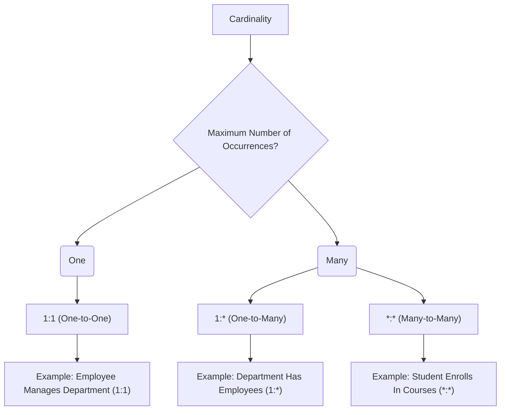
```mermaid
graph TD
    A["Cardinality"] --> B{"Maximum Number of Occurrences?"}
    B --> C("One")
    B --> D("Many")
    C --> E["1:1 (One-to-One)"]
    E --> F["Example: Employee Manages Department (1:1)"]
    D --> G["1:* (One-to-Many)"]
    G --> H["Example: Department Has Employees (1:*)"]
    D --> I["*:* (Many-to-Many)"]
    I --> J["Example: Student Enrolls In Courses (*:*)"]
```
*Note: This `graph TD` illustrates the concept of Cardinality, classifying relationships into One-to-One, One-to-Many, and Many-to-Many based on the maximum number of occurrences.*

## Context & Framework
#### The Family Tree
[[Cardinality_in_ER_Model]] is a fundamental component of [[Multiplicity_in_ER_Model]], which falls under the umbrella of [[Structural_Constraints_in_ER_Model]]. It works in conjunction with [[Participation_in_ER_Model]] to fully define the quantitative aspects of [[Relationship_Types]] between [[Entity_Types]]. Correctly specifying cardinality is crucial for accurately translating business rules that involve quantitative limits into the [[Entity_Relationship_ER_Model]], ensuring that the database can enforce these maximum associations.

## The Mastery Deep Dive
#### Opening the Hood: What's Inside?
Cardinality defines the "upper bound" of a relationship. It's usually expressed from the perspective of each entity type within the relationship:
*   **One-to-One (1:1)**: An occurrence of entity A relates to at most one occurrence of entity B, and vice-versa. (e.g., a `Country` `Has` `1:1` `Capital_City`).
*   **One-to-Many (1:*)**: An occurrence of entity A can relate to many occurrences of entity B, but an occurrence of entity B relates to at most one occurrence of entity A. (e.g., a `Department` `Has` `1:*` `Employees`).
*   **Many-to-Many (*:*)**: An occurrence of entity A can relate to many occurrences of entity B, and an occurrence of entity B can relate to many occurrences of entity A. (e.g., `Student` `Enrolls_In` `*:*` `Courses`).
These define the highest possible number of links an entity instance can have in a given relationship.

#### Spot the Impostor: Clarifying that cardinality describes the *maximum* number of related occurrences.
A common "impostor" is confusing cardinality with participation. Cardinality is *only* concerned with the **maximum limit** of connections. For example, if a `Professor` can `Teach` "many" `Courses`, the cardinality is "many." Whether a professor *must* teach any course (minimum of one) or *may* teach zero courses is a matter of [[Participation_in_ER_Model]], not cardinality. The impostor assumes "many" implies "at least one," but "many" only defines the upper bound, not the lower bound.

## Constraints & Limitations
#### The Devil's Advocate: Why might this be wrong?
Sometimes, a business rule might be misinterpreted as a strict cardinality when flexibility is actually required. For example, initially modeling `Department` `Manages` `Employee` as 1:1 (one department managed by exactly one employee, and one employee manages exactly one department) might seem correct. However, if the business later introduces matrix management or interim roles where an employee might manage zero departments or multiple departments, this strict 1:1 cardinality would break. The trade-off is between **enforcing strict, current rules** (precise cardinality) and **designing for future organizational flexibility** (more flexible cardinality, possibly 0:* or *:* if roles are dynamic).

## Significance & Application
Understanding Cardinality is academically significant as it provides the quantitative definition for relationship limits, essential for translating business rules into a precise data model. In the real world, it's an indispensable skill for **Database Designers** and **System Analysts**. It is applied whenever data relationships need to be precisely defined, from establishing how `Customers` `Place` `Orders` (typically 1:*) to modeling complex hierarchies where an `Employee` `Supervises` `Employees` (1:* recursively). Correctly specifying cardinality ensures that the database accurately enforces the maximum number of associations between entities, preventing data inconsistencies and reflecting organizational policies.

## The Worked Example
*Test your mastery. Cover the solutions below to test yourself first.*

Consider a database for a small publishing house tracking `Authors` and `Books`.

#### Level 1: The Sanity Check (Verification)
**The Question:** For the relationship `Author Writes Book`, if an author can write many books, and a book can have only one author, what is the cardinality from `Author` to `Book` and from `Book` to `Author`?
> **Solution:** From `Author` to `Book` is **One-to-Many (1:*)**. From `Book` to `Author` is **One-to-One (1:1)**. (Overall a 1:* relationship).

#### Level 2: The Crucible (Mastery & Edge Cases)
**The Scenario:** A designer models the relationship `Course Offered_In Semester` with a cardinality of 1:* from `Course` to `Semester` (meaning one course can be offered in many semesters, but a semester can offer many courses). The business rule is that a specific course can only be offered in a maximum of **one** semester per academic year.
**The Challenge:**
(a) Explain why the 1:* cardinality from `Course` to `Semester` is incorrect for the stated business rule.
(b) Describe the correct cardinality for the relationship `Course Offered_In Semester` to enforce the rule "a specific course can only be offered in a maximum of one semester per academic year."
(c) Discuss a common mistake related to cardinality when dealing with associative entities that link three or more entities.
> **Solution:**
> (a) The 1:* cardinality from `Course` to `Semester` is incorrect because it implies that a single `Course` can be related to *many* `Semester` occurrences. The business rule, however, states that a specific course can only be offered in a *maximum of one* semester *per academic year*. The `1:*` notation doesn't restrict it to "one per year."
> (b) To enforce the rule "a specific course can only be offered in a maximum of one semester per academic year," the cardinality of the relationship `Course Offered_In Semester` should effectively be seen as **1:1** *within the context of an academic year*. More precisely, if `Semester` implicitly includes `Year` (e.g., "Fall 2025"), then it means one `Course` is associated with at most one `Semester` record that year. If `Semester` is just "Fall" or "Spring", then a new associative entity `Course_Offering` (with `Course_ID`, `Semester_ID`, `Year`) would be needed, and its key would enforce the uniqueness.
> (c) A common mistake related to cardinality when dealing with associative entities that link three or more entities (e.g., a ternary relationship like `Student Registers_For Course In Semester`) is incorrectly breaking it down into multiple binary 1:* relationships. This often fails to capture the true *simultaneous* dependency or the specific cardinality of the interaction between all three entities, leading to an inaccurate representation of the business rule (e.g., not ensuring that a student's registration for a course is only valid for *one specific semester*). The correct approach requires carefully analyzing whether the relationship truly depends on the simultaneous existence of all entities involved.

## Key Takeaways
*   Cardinality defines the maximum number of relationship occurrences for an entity type, acting as the upper limit for associations.
*   It is a key component of multiplicity, specifying the "how many" aspect of relationships (1:1, 1:*, *:*).
*   Correctly specifying cardinality is crucial for enforcing business rules that dictate quantitative limits on relationships and for maintaining data consistency in the ER model.

## Knowledge Graph Connections
| Concept                     | Connection / Relationship                                                                   |
| :
-------------------------- | :
------------------------------------------------------------------------------------------ |
| [[Multiplicity_in_ER_Model]] | This is a fundamental component of multiplicity, specifying the maximum number of occurrences. |
| [[Participation_in_ER_Model]] | This works in conjunction with cardinality to define the full range of multiplicity.        |
| [[Structural_Constraints_in_ER_Model]] | Cardinality is a type of structural constraint that imposes quantitative limits on relationships. |
| [[Relationship_Types]]      | Cardinality defines the maximum associations that entity occurrences can have through these. |
| [[Entity_Types]]            | Cardinality describes the limits of how instances of these classifications can relate.        |
| [[Entity_Relationship_ER_Model]] | Cardinality is essential for representing the quantitative aspects of relationships within the ER model. |
---

---

## Composite Attribute


## Definition
Before proceeding, ensure you master [[Simple_Attribute]] and [[Multi_Valued_Attribute]].
A **Composite Attribute** is an [[Attributes_in_ER_Model]] that is composed of **multiple components**, each with its own independent existence and meaning. Unlike a [[Simple_Attribute]], it can be naturally subdivided into smaller, more granular attributes. For example, `Address` (composed of `Street`, `City`, `State`, `ZipCode`) or `Full_Name` (composed of `FirstName` and `LastName`) are composite attributes. In a traditional Entity-Relationship (ER) Model, it is often indicated by an ellipse with smaller ellipses branching off it, representing its components. Think of it like a "full meal deal" at a restaurant: it's one item on the menu, but it's clearly made up of a burger, fries, and a drink, each of which is a distinct component.

## The Mental Model
Imagine a Russian nesting doll. The outermost doll represents a **Composite Attribute** (e.g., `Address`). When you open it, you find smaller dolls inside, each representing a component `Simple_Attribute` (e.g., `Street`, `City`, `ZipCode`). The composite attribute is the whole, but it is clearly made of distinct, smaller parts.

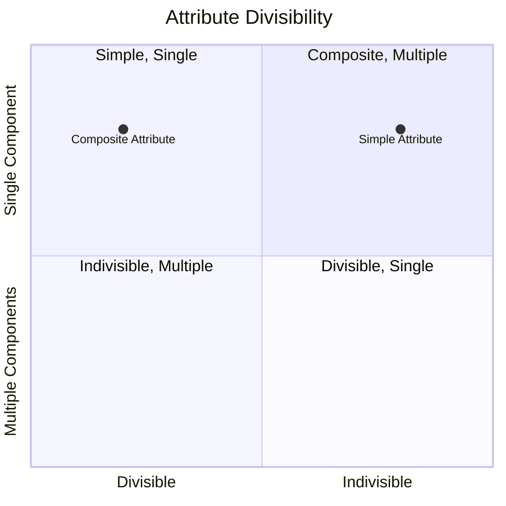
```mermaid
quadrantChart
    title Attribute Divisibility
    x-axis "Divisible" --> "Indivisible"
    y-axis "Multiple Components" --> "Single Component"
    quadrant-1 "Composite, Multiple"
    quadrant-2 "Simple, Single"
    quadrant-3 "Indivisible, Multiple"
    quadrant-4 "Divisible, Single"
    "Composite Attribute": [0.2, 0.8]
    "Simple Attribute": [0.8, 0.8]
```
*Note: This `quadrantChart` visually differentiates `Composite Attributes` from `Simple Attributes` based on their divisibility and number of components.*

## Context & Framework
#### The Family Tree
Within the hierarchy of [[Attributes_in_ER_Model]], the composite attribute represents a structured, non-atomic property. It stands in direct contrast to a [[Simple_Attribute]], which cannot be further broken down. Recognizing composite attributes is crucial for achieving a more granular and normalized database design, especially during the translation from conceptual to [[Logical_Database_Design]]. By decomposing composite attributes into their simple components, data redundancy can be reduced, and querying capabilities can be significantly enhanced.

## The Mastery Deep Dive
#### Opening the Hood: What's Inside?
The key characteristic of a composite attribute is its **decomposability into meaningful sub-components**. Each of these sub-components can, in turn, be either a simple or another composite attribute, though typically we decompose until all components are simple. For example, `Address` might be composite:
*   `Address`
    *   `Street_Address` (Simple)
    *   `City` (Simple)
    *   `State` (Simple)
    *   `Zip_Code` (Simple)
The ability to access and manipulate these sub-components independently is the primary driver for identifying an attribute as composite. If an application frequently needs to sort by `City` or filter by `Zip_Code`, then `Address` must be treated as composite.

#### Spot the Impostor: Correcting the misconception that composite attributes are atomic, instead highlighting their structured nature.
A common misconception is treating a `Composite_Attribute` as if it were a `Simple_Attribute`. The "impostor" here is an attribute like `Full_Name` being modeled as simple, when business requirements dictate the need to access `FirstName` and `LastName` independently (e.g., for personalized greetings or sorting). If any part of the attribute has independent semantic meaning or is routinely used for querying, filtering, or validation, it is a composite attribute and should be decomposed. The structure of the attribute is key to its classification, not merely its single visual representation in prose.

## Constraints & Limitations
#### The Devil's Advocate: Why might this be wrong?
While decomposing composite attributes into their simple components is generally good practice for normalization and querying, there can be situations where, for performance reasons or if a component is *never* accessed independently, a designer might choose to keep it as a single, concatenated string. For example, storing a `Full_Address` as one string might be faster for simple display purposes if no part of the address needs to be queried separately. The trade-off is between **normalization/flexibility** (decomposition) and **readability/performance for specific use cases** (keeping it as a single string). However, this usually comes with costs for future flexibility and data integrity if requirements change.

## Significance & Application
Understanding Composite Attributes is academically significant as it reinforces the concept of data granularity and the importance of decomposition for proper data modeling. In the real world, it's a fundamental skill for **Database Designers** and **Data Modelers**. It is applied extensively when designing schemas for various systems, such as breaking down `Customer_Name` into `FirstName` and `LastName`, or `Order_Date` into `Date` and `Time`. Correctly identifying and decomposing composite attributes ensures that data is stored in its most appropriate granular form, improving querying flexibility, reducing data redundancy, and facilitating data integrity.

## The Worked Example
*Test your mastery. Cover the solutions below to test yourself first.*

Consider a database for an online forum that tracks `Users`.

#### Level 1: The Sanity Check (Verification)
**The Question:** For a `User` entity, would `Date_of_Birth` be considered a simple or composite attribute?
> **Solution:** `Date_of_Birth` would typically be considered a simple attribute.

#### Level 2: The Crucible (Mastery & Edge Cases)
**The Scenario:** The forum decides to track `User_Login_Credentials`. A designer initially models `Login_Credentials` as a single `TEXT` attribute that stores both the `Username` and `Password` concatenated (e.g., "john_doe:secure_password").
**The Challenge:**
(a) Explain why `Login_Credentials`, as described, is a prime example of an attribute that should be modeled as a **composite attribute**.
(b) Identify the individual simple attributes that would compose `Login_Credentials`.
(c) Describe how modeling `Login_Credentials` as a composite attribute (or its components as separate attributes) provides practical benefits for the forum system.
> **Solution:**
> (a) `Login_Credentials` is a prime example of an attribute that should be modeled as a composite attribute because it is naturally made up of at least two distinct and independently meaningful components: `Username` and `Password`. These components are used separately for authentication and other operations.
> (b) The individual simple attributes that would compose `Login_Credentials` are `Username` and `Password`.
> (c) Modeling `Login_Credentials` as a composite attribute (or its components as separate attributes) provides practical benefits such as:
>    *   **Enhanced Security:** `Password` can be stored securely (e.g., hashed) separately from `Username`, and access controls can be applied to each independently.
>    *   **Improved Authentication:** `Username` and `Password` can be retrieved and validated individually during the login process.
>    *   **Greater Flexibility:** Allows for separate policies or operations on `Username` (e.g., uniqueness checks) versus `Password` (e.g., complexity requirements).
>    *   **Clearer Data Semantics:** Each piece of information retains its distinct meaning, preventing ambiguity and making the database schema easier to understand and maintain.

## Key Takeaways
*   A composite attribute is a property of an entity or relationship that is composed of multiple, individually meaningful sub-components.
*   Unlike simple attributes, composite attributes can be naturally subdivided, allowing for more granular data representation.
*   Correctly identifying and decomposing composite attributes enhances data granularity, improves querying flexibility, and reduces data redundancy, supporting effective database design.

## Knowledge Graph Connections
| Concept                     | Connection / Relationship                                                                   |
| :
-------------------------- | :
------------------------------------------------------------------------------------------ |
| [[Attributes_in_ER_Model]] | This is a specific classification of attributes, representing their decomposable nature.      |
| [[Simple_Attribute]]        | This is the contrasting classification, representing attributes that cannot be broken down further. |
| [[Single_Valued_Attribute]] | Composite attributes are often also single-valued, even though their components are distinct. |
| [[Entity_Relationship_ER_Model]] | Composite attributes are key for detailing properties of entities and relationships with structured sub-parts. |
| [[Logical_Database_Design]] | Decomposing composite attributes is a crucial step towards normalization in this phase.       |
---

---

## Composite Key


## Definition
Before proceeding, ensure you master [[Candidate_Key]] and [[Primary_Key]].
A **Composite Key** is a [[Candidate_Key]] (which can also be chosen as the [[Primary_Key]]) that consists of **two or more attributes** that, when combined, uniquely identify each occurrence of an [[Entity_Types]]. No single attribute within the composite key is sufficient for unique identification on its own; it is their combination that guarantees uniqueness. For example, for an `Enrollment` entity, a composite key might be `(StudentID, CourseID)`. In an Entity-Relationship (ER) Diagram, all attributes forming the composite key are underlined. Think of it like a street address that needs both a `Street_Name` and a `House_Number` to be unique within a city. Neither alone is enough.

## The Mental Model
Imagine a lock that requires two different keys inserted simultaneously to open. Both keys are necessary, and neither works alone. That's a **Composite Key**: a combination of two or more attributes that together provide unique identification.

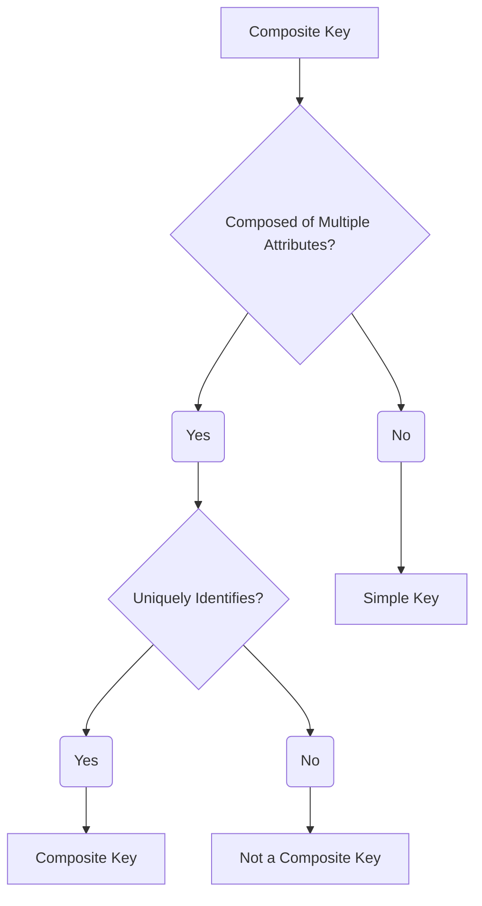
```mermaid
graph TD
    A["Composite Key"] --> B{Composed of Multiple Attributes?}
    B --> C("Yes")
    C --> D{Uniquely Identifies?}
    D --> E("Yes")
    E --> F["Composite Key"]
    D --> G("No")
    G --> H["Not a Composite Key"]
    B --> I("No")
    I --> J["Simple Key"]
```
*Note: This `graph TD` illustrates the definition of a Composite Key, emphasizing its multi-attribute composition for unique identification.*

## Context & Framework
#### The Family Tree
A [[Composite_Key]] is a specific type of [[Candidate_Key]] (and potentially the [[Primary_Key]]) within [[Keys_in_ER_Model]]. It is typically used when an [[Entity_Types]] cannot be uniquely identified by a single attribute and requires the combination of several attributes. This often occurs with [[Weak_Entity_Type]]s, where their primary key is formed by combining the primary key of their owner entity with their own partial discriminator. Understanding composite keys is vital for modeling complex relationships and dependencies accurately within the [[Entity_Relationship_ER_Model]].

## The Mastery Deep Dive
#### Opening the Hood: What's Inside?
The core principle of a composite key is that **individual components are not unique on their own**, but their combination is.
*   **`Enrollment` Entity**: `(StudentID, CourseID)`
    *   `StudentID` alone is not unique (a student enrolls in many courses).
    *   `CourseID` alone is not unique (many students enroll in one course).
    *   But `(StudentID, CourseID)` combined is unique (a student enrolls in a specific course only once).
This structure is particularly common in **associative entities** (entities that represent a many-to-many relationship) or for [[Weak_Entity_Type]]s, where the identifying attributes are drawn from both the weak entity and its strong owner. It directly reflects a business rule that requires multiple pieces of information to pinpoint a unique record.

#### Spot the Impostor: Clarifying that a composite key combines two or more attributes for unique identification.
A common "impostor" scenario involves confusing a composite key with a simple primary key that happens to have multiple non-key attributes. The key distinction is that *all* attributes within the composite key are essential for its unique identification. If any attribute can be removed from the set while maintaining uniqueness, then it's not a minimal composite key (it's a superkey). For example, if `ProductID` alone is unique, then `(ProductID, ProductName)` is a composite *superkey* but not a minimal composite *candidate key*, as `ProductName` is redundant for uniqueness.

## Constraints & Limitations
#### The Devil's Advocate: Why might this be wrong?
While composite keys are necessary for many logical designs, they can introduce some implementation complexities. Longer, multi-attribute keys can increase storage space (in the base table and in foreign keys that reference it), potentially reduce query performance (due to more complex key comparisons in indexes and joins), and make SQL statements more verbose. The trade-off is between **logical accuracy/semantic meaning** (composite key reflects reality) and **implementation simplicity/performance** (a single, simple, often surrogate, primary key is usually faster). Designers often use a surrogate primary key (e.g., `EnrollmentID`) even if a natural composite key exists, then apply a unique constraint to the composite attributes.

## Significance & Application
Understanding Composite Keys is academically significant as it clarifies how complex entities are uniquely identified, especially in many-to-many relationships and with weak entities. In the real world, it's a fundamental skill for **Database Designers** and **Data Modelers**. It is applied extensively when designing schemas for:
*   **Junction tables**: Linking two entities in a many-to-many relationship (e.g., `Order_Item` linking `Order` and `Product` via `(OrderID, ProductID)`).
*   **Weak entities**: Identifying entities that depend on another entity's primary key (e.g., `(BuildingID, RoomNumber)` for a `Room`).
*   **Historical data**: `(EmployeeID, EffectiveDate)` for an `Employee_Salary_History`.
Correctly using composite keys ensures that unique identification is maintained even for entities that are inherently defined by multiple related properties.

## The Worked Example
*Test your mastery. Cover the solutions below to test yourself first.*

Consider a database for a university that tracks `Course_Offerings`. A `Course_Offering` is a specific instance of a `Course` in a particular `Semester`.

#### Level 1: The Sanity Check (Verification)
**The Question:** For the `Course_Offering` entity, would `(Course_ID, Semester_ID)` likely form a **Composite_Key**?
> **Solution:** Yes, `(Course_ID, Semester_ID)` would likely form a **Composite_Key**.

#### Level 2: The Crucible (Mastery & Edge Cases)
**The Scenario:** A designer is creating a `Flight_Leg` entity, representing a single segment of a flight (e.g., "Flight 101 from London to Paris"). The attributes are `Flight_Number`, `Segment_Number`, `Departure_Airport_Code`, `Arrival_Airport_Code`, and `Departure_Time`. The designer proposes `(Flight_Number, Segment_Number)` as the primary key.
**The Challenge:**
(a) Explain why `(Flight_Number, Segment_Number)` is a suitable **Composite_Key** for `Flight_Leg` in this context.
(b) Discuss whether `(Flight_Number, Departure_Airport_Code, Arrival_Airport_Code)` could also be a composite key, and identify any potential issues compared to the proposed key.
(c) Describe a scenario where `Segment_Number` alone would be a primary key, making `Flight_Leg` identifiable by a simple key.
> **Solution:**
> (a) `(Flight_Number, Segment_Number)` is a suitable [[Composite_Key]] for `Flight_Leg` because:
>    1.  `Flight_Number` alone is not unique (a flight has multiple segments).
>    2.  `Segment_Number` alone is not unique (multiple flights have a segment 1).
>    3.  Together, `(Flight_Number, Segment_Number)` uniquely identifies a specific flight segment (e.g., "Flight 101, Segment 1"). It is minimal as neither part can be removed while maintaining uniqueness for a flight leg.
> (b) `(Flight_Number, Departure_Airport_Code, Arrival_Airport_Code)` *could* potentially be a composite key, assuming a flight doesn't have multiple legs between the same two airports. However, it is **less ideal** than `(Flight_Number, Segment_Number)` because:
>    *   **Less Stable:** `Segment_Number` is a more stable, sequential identifier within a flight. If a flight route changes (e.g., an intermediate stop is added or removed), the `Departure_Airport_Code` and `Arrival_Airport_Code` might change for existing segments, potentially altering the primary key value (which is generally undesirable for primary keys).
>    *   **Not Strictly Minimal:** `Segment_Number` is often designed to intrinsically capture the order and uniqueness within a flight. The airport codes, while unique for a given segment, might be redundant if `Segment_Number` already guarantees uniqueness in conjunction with `Flight_Number`.
> (c) `Segment_Number` alone would be a primary key, making `Flight_Leg` identifiable by a simple key, if `Flight_Leg` represented *all possible flight segments globally*, each assigned a truly unique `Segment_Number` independent of any specific `Flight_Number`. This would imply that `Segment_Number` is a surrogate key globally unique across all flights and segments, rather than a sequential identifier within a flight.

## Key Takeaways
*   A composite key consists of two or more attributes that, when combined, uniquely identify an entity occurrence, where no single attribute is sufficient alone.
*   It is a specific type of candidate key (and often the primary key) essential for entities whose identity is defined by multiple properties or foreign keys.
*   Correctly using composite keys ensures unique identification for complex entities, particularly in many-to-many relationships and with weak entities, though it can introduce implementation trade-offs.

## Knowledge Graph Connections
| Concept                     | Connection / Relationship                                                                   |
| :
-------------------------- | :
------------------------------------------------------------------------------------------ |
| [[Keys_in_ER_Model]]        | This is a specific type of key, defined by its multi-attribute composition.                   |
| [[Candidate_Key]]           | A composite key can be a candidate key if it is a minimal set of attributes.                |
| [[Primary_Key]]             | A composite key can be chosen as the primary key if it uniquely identifies the entity.        |
| [[Attributes_in_ER_Model]] | Composite keys are formed by combining two or more of these properties.                       |
| [[Weak_Entity_Type]]        | The primary key of a weak entity is always a composite key, including the owner's primary key. |
| [[Entity_Relationship_ER_Model]] | Composite keys are fundamental for representing the unique identity of complex entities within the ER model. |
---

---

## Conceptual Database Design


## Definition
Before proceeding, ensure you master [[Entity_Relationship_ER_Model]] and [[Structural_Constraints_in_ER_Model]].
Conceptual Database Design is the initial phase in the Database Development Life Cycle where a high-level model of the data requirements for an enterprise is constructed, entirely **independent of any physical considerations** such as the specific Database Management System (DBMS) or hardware. Its primary goal is to capture what data is needed and how different data elements relate to each other, using tools like the Entity-Relationship (ER) model. Think of it as creating an abstract blueprint of a building, focusing on rooms, their sizes, and how they connect, without worrying about the type of concrete or wiring to be used.

## The Mental Model
Imagine you're planning a trip. **Conceptual Database Design** is like sketching out the itinerary: where you want to go, who you'll travel with, and the key activities you want to do. You're not worrying about booking flights or hotels yet (those are physical details), just the overarching plan and relationships between destinations and activities. It’s about the *what*, not the *how*.

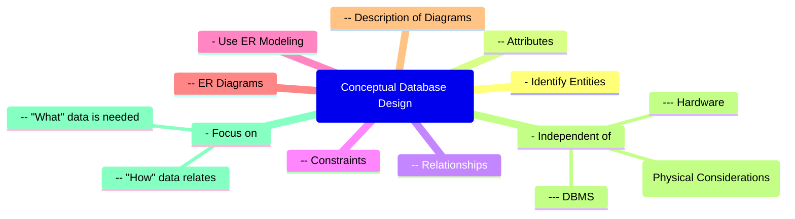
```mermaid
mindmap
  root(Conceptual Database Design)
    - Identify Entities
    -- Attributes
    -- Relationships
    -- Constraints
    - Use ER Modeling
    -- ER Diagrams
    -- Description of Diagrams
    - Independent of
      -- (Physical Considerations)
      --- DBMS
      --- Hardware
    - Focus on
      -- "What" data is needed
      -- "How" data relates
```
*Note: This `mindmap` visualizes Conceptual Database Design at its core, branching out into its key activities and the fundamental principles of independence and focus.*

## Context & Framework
#### How the Parts Talk to Each Other
In the broader context of the Database Development Methodology, conceptual database design acts as the crucial bridge between user requirements and the technical implementation phases. It translates the often ambiguous and informal descriptions of an organization's data needs into a structured and formal representation, typically using an [[Entity_Relationship_ER_Model]]. This model then serves as the foundation for the subsequent [[Logical_Database_Design]] and [[Physical_Database_Design]] phases, ensuring that all later technical decisions are aligned with the original business requirements.

## The Mastery Deep Dive
#### The "Duh!" Moment (Intuitive Proof)
The independence from physical considerations in conceptual database design is intuitively logical. Before you decide what kind of engine (DBMS) to put in a car, you first need to design the car itself – its chassis, passenger capacity, and basic functions. If you start designing the car around a specific engine too early, you might limit your design choices or make it difficult to switch engines later. Similarly, focusing solely on the data requirements and their interconnections at the conceptual stage ensures a flexible and adaptable model that can be mapped to various DBMS platforms later without significant overhaul.

#### Spot the Impostor: Clarifying common misunderstandings about the boundaries and objectives of conceptual design.
A common misunderstanding is confusing conceptual design with either the requirements analysis phase or the logical design phase. While it builds upon requirements, conceptual design moves beyond raw descriptions to form a structured, model-based representation. Unlike logical design, it deliberately *avoids* specific data model constructs (like tables and columns) and, most importantly, any DBMS-specific features. Its boundary is defined by its universal, abstract nature, focusing purely on the "what" of the data, not the "how" of its storage or retrieval.

## Constraints & Limitations
#### The Devil's Advocate: Why might this be wrong?
While conceptual database design's independence from physical considerations is a strength, it can also be a point of contention. Critics might argue that a purely abstract model, detached from real-world DBMS constraints, could be overly idealistic or impractical, potentially leading to designs that are difficult or inefficient to implement in a chosen system. The challenge lies in ensuring that the conceptual model, while abstract, remains grounded enough in the underlying business reality that its translation to logical and physical designs is feasible and performant.

## Significance & Application
Conceptual Database Design is academically significant as it introduces the fundamental principles of data modeling and the power of abstraction in system design. In the real world, it is a critical skill for **Database Architects**, **Business Analysts**, and **System Designers**. It is applied in virtually every industry, from designing databases for complex financial systems to simple contact management applications. A well-executed conceptual design is the bedrock of a successful database system, directly impacting data quality, system maintainability, and the ability to adapt to future business changes.

## The Worked Example
*Test your mastery. Cover the solutions below to test yourself first.*

Consider a small online book rental service. The initial requirements indicate that the system needs to keep track of `Books`, `Customers`, and `Rentals`.

#### Level 1: The Sanity Check (Verification)
**The Question:** For the online book rental service, identify the primary entities that would be identified during the conceptual database design phase.
> **Solution:** The primary entities would be `Book`, `Customer`, and `Rental`.

#### Level 2: The Crucible (Mastery & Edge Cases)
**The Scenario:** During the conceptual design for this book rental service, a junior designer proposes including fields like `book_table_index` and `customer_shard_id` in the ER diagram, arguing they are important for performance.
**The Challenge:**
(a) Identify which core principle of conceptual database design this proposal violates.
(b) Explain why including such fields at this stage is problematic.
(c) Describe the correct approach for handling performance-related concerns like indexing and sharding within the Database Development Life Cycle.
> **Solution:**
> (a) This proposal violates the core principle that **conceptual database design should be independent of all physical considerations**.
> (b) Including `book_table_index` and `customer_shard_id` at this stage is problematic because these are **physical implementation details** related to database performance optimization and data distribution. Introducing them prematurely binds the conceptual model to specific physical choices, limiting flexibility, potentially overcomplicating the model, and making it harder to adapt the design if the underlying DBMS or hardware changes.
> (c) The correct approach is to defer such performance-related concerns to the **physical database design phase**. At that stage, after the logical model is established for a specific DBMS, decisions about indexing, sharding, file organizations, and other physical optimizations are made to achieve efficient access to data, based on the chosen DBMS and expected usage patterns.

## Key Takeaways
*   Conceptual database design is the first phase in the DDLC, focusing on creating a high-level, DBMS-independent data model.
*   Its primary activities involve identifying entities, attributes, relationships, and constraints, often using the Entity-Relationship (ER) model.
*   The phase is strictly independent of physical considerations (like specific DBMS or hardware) to ensure a flexible and adaptable design that accurately reflects real-world data requirements.

## Knowledge Graph Connections
| Concept                     | Connection / Relationship                                                                   |
| :
-------------------------- | :
------------------------------------------------------------------------------------------ |
| [[Database_Development_Methodology]] | This is the initial, abstract phase within the overall database development process.         |
| [[Logical_Database_Design]]   | This design phase follows conceptual design, translating its abstract model into a specific data model. |
| [[Physical_Database_Design]]  | This design phase implements the database on secondary storage, based on the logical design. |
| [[Entity_Relationship_ER_Model]] | This is the primary modeling tool used to represent conceptual database designs.            |
| Requirements_Collection_And_Analysis | The preceding phase that provides the input for conceptual database design.                  |
---

---

## Degree Of A Relationship


## Definition
Before proceeding, ensure you master [[Relationship_Types]] and [[Recursive_Relationship]].
The **Degree of a Relationship** refers to the number of [[Entity_Types]] that participate in a particular [[Relationship_Types]]. It is a fundamental characteristic used to classify relationships in the Entity-Relationship (ER) Model. Common degrees include:
*   **Unary (or Recursive)**: Involves one entity type.
*   **Binary**: Involves two entity types.
*   **Ternary**: Involves three entity types.
*   **N-ary**: Involves 'n' entity types.
Think of it like counting the number of "players" involved in a specific "game" (relationship). A one-player game is unary, a two-player game is binary, and so on.

## The Mental Model
Imagine you're choreographing a dance. The **Degree of a Relationship** is like counting how many distinct *types* of dancers are involved in a specific dance move. If a dancer is performing a solo (unary), two dancers are pairing up (binary), or three are forming a trio (ternary), the "degree" tells you the count of unique participant types.

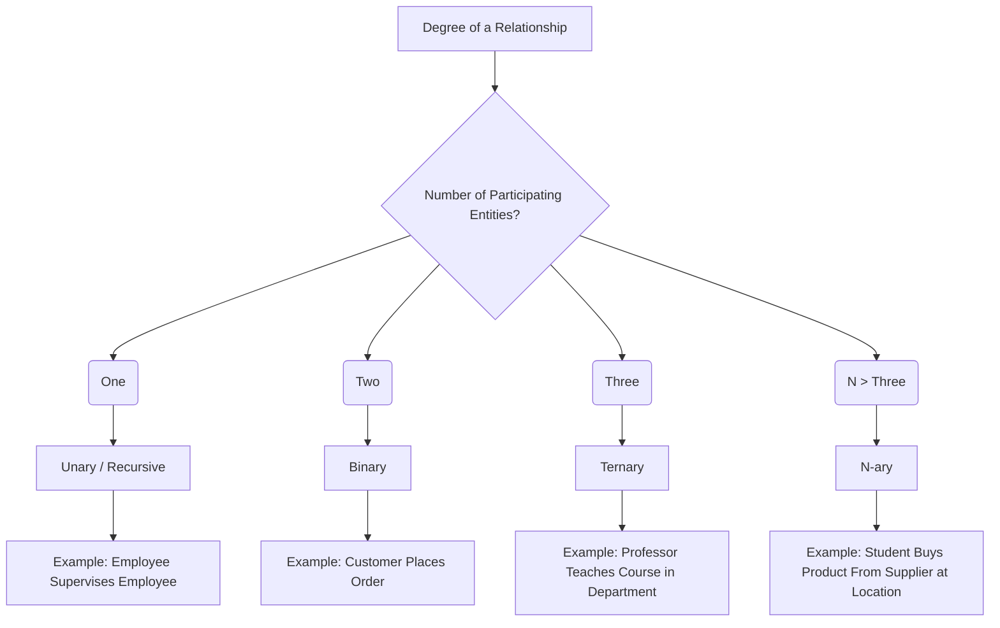
```mermaid
graph TD
    A["Degree of a Relationship"] --> B{Number of Participating Entities?}
    B --> C("One")
    B --> D("Two")
    B --> E("Three")
    B --> F("N > Three")
    C --> G["Unary / Recursive"]
    D --> H["Binary"]
    E --> I["Ternary"]
    F --> J["N-ary"]
    G --> K["Example: Employee Supervises Employee"]
    H --> L["Example: Customer Places Order"]
    I --> M["Example: Professor Teaches Course in Department"]
    J --> N["Example: Student Buys Product From Supplier at Location"]
```
*Note: This `graph TD` illustrates the classification of relationship degrees: Unary, Binary, Ternary, and N-ary, with examples for each.*

## Context & Framework
#### The Family Tree
The concept of [[Degree_of_a_Relationship]] is a core classifier within the broader category of [[Relationship_Types]]. It provides a structural understanding of how many distinct [[Entity_Types]] are involved in a given association. While binary relationships are the most common, recognizing and correctly modeling unary (or [[Recursive_Relationship]]s), ternary, and n-ary relationships is crucial for accurately representing complex business interactions and avoiding design flaws in the [[Entity_Relationship_ER_Model]].

## The Mastery Deep Dive
#### Opening the Hood: What's Inside?
Let's break down the common degrees:
*   **Unary Relationship**: Involves a single entity type. This entity type relates to itself. A classic example is `Employee Supervises Employee`, where both the supervisor and the supervisee are instances of the `Employee` entity type. These are also known as [[Recursive_Relationship]]s.
*   **Binary Relationship**: The most common type, involving two distinct entity types. For instance, `Student Enrolls_In Course` involves the `Student` entity type and the `Course` entity type.
*   **Ternary Relationship**: Involves three distinct entity types. An example might be `Supplier Supplies Part To Project`, where `Supplier`, `Part`, and `Project` are all involved in a single relationship. This is often used when a binary relationship between two entities is not sufficient to fully describe a dependency involving a third entity.
While less common, relationships involving four or more entity types are called **N-ary** or **Quaternary** (for four) relationships.

#### The Translator: Converting English to Math
The human language description of how objects interact (e.g., "A student takes a course") needs to be translated into the formal, quantifiable language of ER modeling. The "Degree of a Relationship" is that mathematical translation:
*   "A single entity relates to itself" $\implies$ Unary (Degree 1)
*   "Two distinct entities relate to each other" $\implies$ Binary (Degree 2)
*   "Three distinct entities relate simultaneously" $\implies$ Ternary (Degree 3)
This conversion ensures unambiguous representation in the ER diagram.

## Constraints & Limitations
#### The Hard Choice: Option A or Option B?
A common design dilemma involves deciding whether a complex interaction among three or more entities should be modeled as a single **ternary (or n-ary) relationship** or decomposed into multiple **binary relationships**. The trade-off is between representing the inherent simultaneity of an interaction (ternary) versus potentially simpler, more decomposable binary links. Often, a ternary relationship is appropriate only if the association among all three entities *simultaneously* has its own unique meaning or attributes that cannot be adequately captured by combining multiple binary relationships. Misusing a ternary relationship can sometimes lead to redundancy or incorrect constraints.

## Significance & Application
Understanding the Degree of a Relationship is academically significant as it provides the structural grammar for composing complex data models. In the real world, it's a crucial skill for **Database Designers** and **System Architects**. It is applied when translating complex business rules into an ER model, ensuring that the number of entities involved in an interaction is correctly represented. For instance, in an e-commerce system, understanding the degree helps model `Customer` `Orders` `Product` (binary) versus `Customer` `Registers` `Product` `At` `Store` (ternary or quaternary), ensuring the most accurate and efficient data representation.

## The Worked Example
*Test your mastery. Cover the solutions below to test yourself first.*

Consider different scenarios for a small business's database.

#### Level 1: The Sanity Check (Verification)
**The Question:** What is the degree of the relationship `Employee Manages Department`?
> **Solution:** The degree of the relationship `Employee Manages Department` is **Binary** (two participating entity types: `Employee` and `Department`).

#### Level 2: The Crucible (Mastery & Edge Cases)
**The Scenario:** A business tracks `Students` who `Register_For` `Courses`. The registration process also involves a `Semester`. A designer models this as two binary relationships: `Student Registers_For Course` and `Course Offered_In Semester`.
**The Challenge:**
(a) Explain why combining these two binary relationships might not fully capture the business rule if a specific student's registration for a specific course is only valid for a specific semester.
(b) How would this scenario be more accurately modeled using a single relationship type, and what would be its degree?
(c) Describe a limitation of using a binary decomposition if a specific attribute, like `Final_Grade`, is tied to the `Student`'s performance in a `Course` during a particular `Semester`.
> **Solution:**
> (a) Combining these two binary relationships (`Student Registers_For Course` and `Course Offered_In Semester`) might not fully capture the business rule because it doesn't explicitly state that a student's registration for a course is *bound to a specific semester*. It would allow a student to register for a course, and that course to be offered in a semester, but wouldn't guarantee that *that specific student's registration* is for `Course A` in `Semester X`. You could have a `Student` registered for `Course A` and `Course A` offered in `Semester X`, but the model wouldn't confirm that *this student's registration* is for `Course A` in `Semester X`.
> (b) This scenario would be more accurately modeled using a **Ternary relationship** (degree 3) called `Registers` among `Student`, `Course`, and `Semester`. This explicitly represents the simultaneous association of a student taking a particular course in a given semester.
> (c) A limitation of using a binary decomposition is that an attribute like `Final_Grade` is intrinsically tied to the *combination* of `Student`, `Course`, and `Semester`. If only binary relationships are used, placing `Final_Grade` would be ambiguous. Attaching it to `Student Registers_For Course` would imply a student has one grade per course across all semesters, which is incorrect. Attaching it to `Course Offered_In Semester` would be even more ambiguous as it doesn't involve the `Student`. The ternary relationship `Registers` naturally accommodates `Final_Grade` as an attribute of the combined association.

## Key Takeaways
*   The degree of a relationship specifies the number of participating entity types in an association (unary, binary, ternary, n-ary).
*   Unary relationships involve a single entity type relating to itself (recursive), while binary involves two, and ternary involves three.
*   Correctly identifying the degree is crucial for accurately translating complex business rules into the structural representation of an ER model, ensuring semantic integrity.

## Knowledge Graph Connections
| Concept                     | Connection / Relationship                                                                   |
| :
-------------------------- | :
------------------------------------------------------------------------------------------ |
| [[Relationship_Types]]      | This is a key characteristic used to classify and understand various types of relationships.  |
| [[Entity_Types]]            | The degree is determined by counting the number of these participating in the relationship. |
| [[Recursive_Relationship]]  | This is a specific type of relationship that has a unary degree.                              |
| [[Structural_Constraints_in_ER_Model]] | The degree of a relationship influences how structural constraints like multiplicity are applied. |
| [[Entity_Relationship_ER_Model]] | The degree is a fundamental aspect of representing associations within the ER model.          |
---

---

## Derived Attribute


## Definition
Before proceeding, ensure you master [[Attributes_in_ER_Model]] and [[Single_Valued_Attribute]].
A **Derived Attribute** is an [[Attributes_in_ER_Model]] that represents a value that is **derivable** (calculable) from the value of a related attribute or a set of attributes, not necessarily within the same [[Entity_Types]]. Its value is not explicitly stored in the database but is computed whenever it is needed. For example, `Age` can be derived from `DateOfBirth` and the current date; `Total_Price` can be derived from `Quantity` and `Unit_Price`. In a traditional Entity-Relationship (ER) Model, a derived attribute is represented by a dotted-lined oval or ellipse. Think of it like the "total" line on a grocery receipt: it's not an item you buy, but it's calculated from the sum of all the individual item prices.

## The Mental Model
Imagine a calculator. You input two numbers (e.g., `Quantity` and `Price`), and it *calculates* the `Total`. The `Total` is the **Derived Attribute**; it's not something you directly store, but something you compute from other stored values.

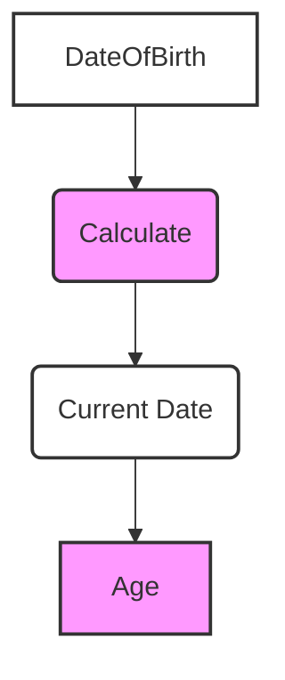
```mermaid
graph TD
    A[DateOfBirth] --> B(Calculate)
    B --> C(Current Date)
    C --> D[Age]
    style A fill:#fff,stroke:#333,stroke-width:2px;
    style B fill:#f9f,stroke:#333,stroke-width:2px;
    style C fill:#fff,stroke:#333,stroke-width:2px;
    style D fill:#f9f,stroke:#333,stroke-width:2px;
```
*Note: This `graph TD` illustrates how `Age` (a derived attribute) is calculated from `DateOfBirth` and the `Current Date`.*

## Context & Framework
#### The "Duh!" Moment (Intuitive Proof)
The concept of derived attributes is intuitively logical because it prevents data redundancy and potential inconsistencies. If `Age` were stored directly alongside `DateOfBirth`, it would need to be constantly updated (e.g., daily or yearly) to remain accurate. If this update process failed, `Age` could become inconsistent with `DateOfBirth`. By deriving `Age` on the fly, you ensure its accuracy is always tied to the source (`DateOfBirth`), eliminating the need for redundant storage and complex update mechanisms. It's simply a dynamic view of existing data.

## The Mastery Deep Dive
#### Opening the Hood: What's Inside?
Derived attributes possess several key characteristics:
*   **Non-Stored**: Their values are not physically stored in the database.
*   **Calculated on Demand**: Their values are computed at the moment they are requested (or through a materialized view for performance).
*   **Source Dependency**: They always rely on one or more base attributes for their calculation. These base attributes can be from the same entity, a related entity, or even system functions (like `CURRENT_DATE`).
*   **Consistency Guarantee**: Because they are calculated, their values are always consistent with their source data.
Common examples include `Experience_Years` (from `Hire_Date`), `Number_Of_Orders` (by counting associated `Order` entities), or `Grade_Point_Average` (from individual course grades).

#### The Translator: Converting English to Math
When you describe something whose value is "found out by looking at other numbers" (English), you're talking about a `Derived Attribute` (Exam Term). The mathematical formalization of this is:
$$ \boxed{\displaystyle \text{Derived\_Value} = f(\text{Other\_Attributes})} $$
This means the derived attribute is a *function* of other attributes. For example, for `Age`:
$$ \boxed{\displaystyle \text{Age} = \text{CURRENT\_DATE} - \text{DateOfBirth}} $$
This mathematical representation makes the derivation explicit and unambiguous, showing exactly how the value is computed from its sources.

## Constraints & Limitations
#### The Devil's Advocate: Why might this be wrong?
While derived attributes offer benefits in data consistency and reduced redundancy, they come with a potential trade-off: **performance overhead**. Computing values on the fly, especially for complex derivations or large datasets, can be slower than retrieving a pre-stored value. If a derived attribute is frequently accessed, and its calculation is computationally intensive, storing it (and updating it via triggers or scheduled jobs) might be a more performant option, despite introducing redundancy. The decision to derive or store often hinges on the frequency of access versus the cost of calculation and maintenance.

## Significance & Application
Understanding Derived Attributes is academically significant as it introduces the concept of computed data and the trade-offs between storage and calculation. In the real world, it's a valuable skill for **Database Designers**, **Business Intelligence Developers**, and **Reporting Analysts**. It is applied whenever data can be logically inferred from existing information, such as calculating `Total_Sales` for a month from individual `Transaction` records, or `Employee_Tenure` from their `Hire_Date`. Correctly identifying and managing derived attributes optimizes storage, ensures data consistency, and simplifies data maintenance, preventing update anomalies.

## The Worked Example
*Test your mastery. Cover the solutions below to test yourself first.*

Consider a simplified database for a company tracking its `Employees`.

#### Level 1: The Sanity Check (Verification)
**The Question:** If the `Employee` entity has a `Salary` attribute and a `Bonus_Percentage` attribute, would `Total_Compensation` (calculated as `Salary` + (`Salary` * `Bonus_Percentage`)) be a derived attribute?
> **Solution:** Yes, `Total_Compensation` would be a derived attribute.

#### Level 2: The Crucible (Mastery & Edge Cases)
**The Scenario:** An `Order` entity has `Quantity` and `UnitPrice` attributes. A designer initially stores `LineItem_Total` (which is `Quantity` * `UnitPrice`) as a direct attribute of the `Order` entity, updating it every time `Quantity` or `UnitPrice` changes.
**The Challenge:**
(a) Explain the data consistency issue that could arise if `LineItem_Total` is stored directly and an update to `Quantity` fails to propagate to `LineItem_Total`.
(b) Describe how modeling `LineItem_Total` as a derived attribute would resolve this consistency issue.
(c) Discuss a scenario where, despite the consistency benefits, storing `LineItem_Total` might be preferred over deriving it.
> **Solution:**
> (a) If `LineItem_Total` is stored directly and an update to `Quantity` fails to propagate, a **data inconsistency** would arise. The `LineItem_Total` would no longer accurately reflect the product of `Quantity` and `UnitPrice`, leading to incorrect financial calculations, reporting errors, and distrust in the data.
> (b) Modeling `LineItem_Total` as a derived attribute would resolve this consistency issue because its value would **always be computed on the fly** from the current `Quantity` and `UnitPrice`. There would be no `LineItem_Total` value to update or fail to update, ensuring it is perpetually synchronized with its source attributes.
> (c) Storing `LineItem_Total` might be preferred over deriving it in scenarios where:
>    1.  **High Read Volume / Low Write Volume:** The `LineItem_Total` is accessed extremely frequently (e.g., millions of times per second for reporting), but `Quantity` or `UnitPrice` rarely changes. In this case, the overhead of re-calculating the value for every read could be higher than the storage and update cost.
>    2.  **Complex Calculation:** The derivation of `LineItem_Total` involves a very complex, resource-intensive calculation across many related tables. Storing the pre-computed value can avoid repeated expensive computations.
>    3.  **Historical Accuracy (Snapshot):** If `LineItem_Total` needs to represent the total *at the time of the order* (e.g., reflecting prices that might change later), and `Quantity` or `UnitPrice` could be updated for other reasons, storing it provides a historical snapshot that deriving would not.

## Key Takeaways
*   A derived attribute is an attribute whose value is calculable from other attributes, rather than being explicitly stored in the database.
*   It is computed on demand, ensuring data consistency by eliminating redundancy and preventing update anomalies.
*   While offering consistency benefits, derived attributes introduce a trade-off with potential performance overhead, necessitating careful consideration of storage versus calculation costs.

## Knowledge Graph Connections
| Concept                     | Connection / Relationship                                                                   |
| :
-------------------------- | :
------------------------------------------------------------------------------------------ |
| [[Attributes_in_ER_Model]] | This is a specific classification of attributes, representing their computed nature.          |
| [[Single_Valued_Attribute]] | Derived attributes are typically single-valued, producing one calculated result.              |
| [[Entity_Types]]            | Derived attributes often describe properties of entities, calculated from other entity attributes. |
| Data_Consistency        | Derived attributes inherently promote this by eliminating redundant storage and update anomalies. |
| Performance_Optimization | The decision to store vs. derive an attribute often involves a trade-off related to this.     |
---

---

## Entity Types


## Definition
Before proceeding, ensure you master [[Strong_Entity_Type]] and [[Weak_Entity_Type]].
In the Entity-Relationship (ER) Model, an **Entity Type** is a classification or a template for a group of objects that share the same properties and are identified by an enterprise as having an independent existence. It represents a concept or object in the real world that is distinguishable from other objects. An **Entity Occurrence** (or instance) is a uniquely identifiable object of an entity type. For example, `Student` is an entity type, while "John Doe, ID 12345" is an entity occurrence of the `Student` entity type. Think of an `Entity Type` as the blueprint for a car (e.g., "Sedan"), and an `Entity Occurrence` as a specific car produced from that blueprint (e.g., "My 2023 Honda Civic, VIN XYZ").

## The Mental Model
Imagine you're sorting toys into different bins. Each bin represents an **Entity Type** (e.g., "Action Figures," "Building Blocks," "Stuffed Animals"). Every individual toy you put into a bin is an **Entity Occurrence** (e.g., your specific "Captain America" action figure goes into the "Action Figures" bin). The bins define the common characteristics, and the individual toys are the actual items.

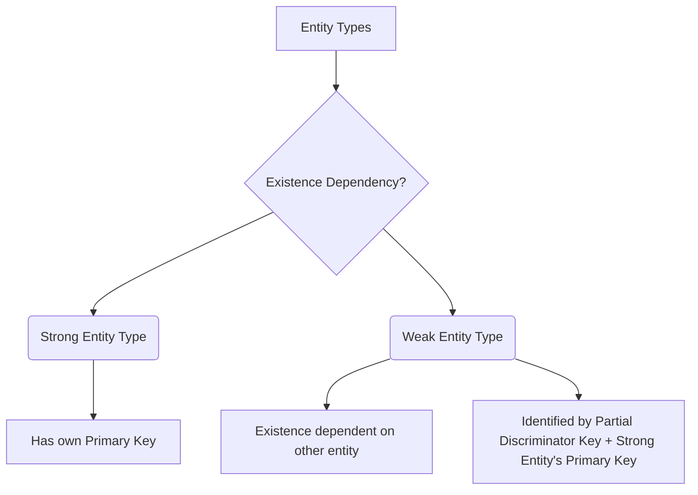
```mermaid
graph TD
    A["Entity Types"] --> B{Existence Dependency?}
    B --> C(Strong Entity Type)
    B --> D(Weak Entity Type)
    C --> E["Has own Primary Key"]
    D --> F["Existence dependent on other entity"]
    D --> G["Identified by Partial Discriminator Key + Strong Entity's Primary Key"]
```
*Note: This `graph TD` illustrates the classification of Entity Types into Strong and Weak based on their existence dependency and key characteristics.*

## Context & Framework
#### The Family Tree
Within the [[Entity_Relationship_ER_Model]], entity types form the core "nodes" of the data structure. They are fundamental for categorizing and organizing information. The primary distinction among entity types is based on their **existence dependency**, leading to the classification of [[Strong_Entity_Type]]s and [[Weak_Entity_Type]]s. Strong entities can exist independently, possessing their own unique identifiers, while weak entities rely on another entity for their existence and part of their identification, creating a hierarchical relationship in the overall data model.

## The Mastery Deep Dive
#### Opening the Hood: What's Inside?
At a high level, entity types can be broadly categorized by their independence:
*   **Strong Entity Types**: These are robust and self-sufficient. They can exist without being dependent on another entity type for their identification. Think of a `Customer` or a `Product`. Each customer or product has its own unique identifier (a primary key) that doesn't rely on any other entity.
*   **Weak Entity Types**: These are fragile and dependent. They cannot exist meaningfully on their own and require a relationship with another (strong) entity type for their full identification. An example might be `Dependent` (of an employee) or `Room` (within a building). A dependent's identity might rely on the employee they're associated with, and a room's number is only unique within a specific building.
Understanding this distinction is crucial for correctly modeling relationships and keys within the ER diagram.

#### The Translator: From "Lego" to "Jargon"
The simple idea of "things we want to track" (Lego) gets formalized into `Entity Types` (Jargon). When we differentiate between "things that can exist on their own" and "things that need something else to exist" (Lego), we are translating that into `Strong Entity Type` and `Weak Entity Type` (Jargon) respectively. This formal language ensures precision and consistency in database design.

## Constraints & Limitations
#### The Hard Choice: Option A or Option B?
Deciding whether a concept should be modeled as an attribute or an entity can be a subtle but critical design choice. For instance, is `Phone_Number` an attribute of a `Person` entity, or should `Phone_Number` be its own entity related to `Person`? The trade-off lies in **granularity and future flexibility**. Treating it as an attribute is simpler but limits future expansion (e.g., if a phone number needs its own type or multiple owners). Treating it as an entity is more complex upfront but allows for greater flexibility (e.g., recording phone type, service provider, or multiple numbers per person). The decision depends on how much detail and independence the "thing" requires in the system.

## Significance & Application
Understanding Entity Types is academically significant as it's the first step in abstracting real-world concepts into a structured data model. In the real world, it's a fundamental skill for **Data Modelers** and **System Analysts**. It is applied in designing any database, from small business inventory systems to large-scale enterprise resource planning (ERP) systems. Correctly identifying entity types ensures that the database captures all essential information and that the schema is logically sound, laying a robust foundation for all subsequent database operations.

## The Worked Example
*Test your mastery. Cover the solutions below to test yourself first.*

Consider a simplified online ordering system where customers can place orders, and each order can have multiple items.

#### Level 1: The Sanity Check (Verification)
**The Question:** For this online ordering system, identify two distinct entity types.
> **Solution:** Two distinct entity types are `Customer` and `Order`. (Another could be `Product` or `Order_Item`).

#### Level 2: The Crucible (Mastery & Edge Cases)
**The Scenario:** A designer models `Order_Item` (representing a specific product within an order, e.g., "3 apples in Order #123") as an entity type. They include `Quantity` and `UnitPrice` as attributes. However, they struggle to define a unique primary key for `Order_Item` without referencing the `Order` it belongs to and the `Product` it represents.
**The Challenge:**
(a) Based on the struggle to define a primary key, what specific type of entity is `Order_Item` most likely to be in this context?
(b) Explain why `Order_Item` cannot have an independent primary key in this scenario.
(c) Describe how the primary key of `Order_Item` would typically be composed, involving its related entities.
> **Solution:**
> (a) Based on the struggle to define an independent primary key and its inherent dependency, `Order_Item` is most likely a [[Weak_Entity_Type]].
> (b) `Order_Item` cannot have an independent primary key because its existence and identity are **existence-dependent** on both an `Order` and a `Product`. A specific `Order_Item` (e.g., "3 apples") only makes sense in the context of a particular `Order` (e.g., Order #123) and a specific `Product` (e.g., 'Apple'). Without this context, `Quantity` and `UnitPrice` alone cannot uniquely identify it globally.
> (c) The primary key of `Order_Item` would typically be composed of a **combination of the primary key of the `Order` entity (e.g., `OrderID`), the primary key of the `Product` entity (e.g., `ProductID`), and potentially a partial discriminator key from `Order_Item` itself (e.g., `LineItemNumber`)** if multiple distinct `Order_Item`s could exist for the same `Product` within the same `Order`. This composite key ensures unique identification within the context of its owning entities.

## Key Takeaways
*   An Entity Type is a classification for objects sharing properties, possessing independent existence, while an Entity Occurrence is a unique instance of that type.
*   Entity types are categorized into Strong (independent, with own primary key) and Weak (existence-dependent, identified via relationship with strong entity).
*   Correctly identifying and classifying entity types is foundational for accurate data modeling and ensuring the logical integrity of a database design.

## Knowledge Graph Connections
| Concept                     | Connection / Relationship                                                                   |
| :
-------------------------- | :
------------------------------------------------------------------------------------------ |
| [[Entity_Relationship_ER_Model]] | This is a fundamental component of the ER model, representing real-world objects or concepts. |
| [[Strong_Entity_Type]]      | This is a sub-classification of entity types, characterized by independent existence.           |
| [[Weak_Entity_Type]]        | This is a sub-classification of entity types, characterized by existence dependence on another entity. |
| [[Attributes_in_ER_Model]]  | These are properties that describe an entity type.                                            |
| [[Keys_in_ER_Model]]        | These are used to uniquely identify occurrences of an entity type.                            |
---

---

## Keys In ER Model


## Definition
Before proceeding, ensure you master [[Candidate_Key]] and [[Primary_Key]].
In the Entity-Relationship (ER) Model, **Keys** are a special type of [[Attributes_in_ER_Model]] (or a set of attributes) that uniquely identify each occurrence of an [[Entity_Types]]. They are crucial for maintaining data integrity, establishing relationships between entities, and ensuring efficient data retrieval. The three main types of keys in ER modeling are [[Candidate_Key]]s, [[Primary_Key]]s, and [[Composite_Key]]s. Think of keys as unique identifiers, like a fingerprint or a social security number, that allow you to distinguish one individual (entity occurrence) from all others.

## The Mental Model
Imagine a large filing cabinet filled with folders. The **Keys** are the unique labels on each folder that allow you to quickly find exactly the right one, without confusing it with any other. They are your system for organization and retrieval.

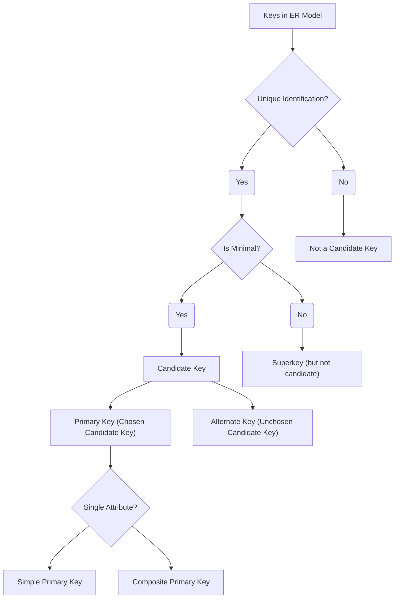
```mermaid
graph TD
    A["Keys in ER Model"] --> B{Unique Identification?}
    B --> C("Yes")
    C --> D{Is Minimal?}
    D --> E("Yes")
    E --> F["Candidate Key"]
    D --> G("No")
    G --> H["Superkey (but not candidate)"]
    B --> I("No")
    I --> J["Not a Candidate Key"]
    F --> K["Primary Key (Chosen Candidate Key)"]
    F --> L["Alternate Key (Unchosen Candidate Key)"]
    K --> M{Single Attribute?}
    M --> N["Simple Primary Key"]
    M --> O["Composite Primary Key"]
```
*Note: This `graph TD` illustrates the classification of Keys in the ER Model, starting from Candidate Keys and branching into Primary and Composite Keys based on their role and composition.*

## Context & Framework
#### The Family Tree
[[Keys_in_ER_Model]] are a specialized subset of [[Attributes_in_ER_Model]] that serve a critical role in [[Entity_Relationship_ER_Model]] by providing unique identification for [[Entity_Types]]. They are foundational for establishing integrity constraints and are indispensable during the translation to [[Logical_Database_Design]]. The hierarchy begins with [[Candidate_Key]]s, which are all possible minimal sets of attributes that can uniquely identify an entity. From these, one is selected as the [[Primary_Key]], and if this primary key consists of multiple attributes, it is known as a [[Composite_Key]].

## The Mastery Deep Dive
#### Opening the Hood: What's Inside?
The concept of keys revolves around ensuring that every record in a database can be uniquely identified.
*   **Candidate Key**: This is any attribute (or combination of attributes) that can uniquely identify a tuple (record) in a relation (table) and is minimal (no subset of the attributes can uniquely identify the tuple). For a `Student` entity, `StudentID` might be a candidate key, and `(FirstName, LastName, DateOfBirth)` might also be a candidate key if no two students have the exact same name and birthdate.
*   **Primary Key**: From the set of candidate keys, one is chosen by the database designer to be the primary key. This is the main identifier for the entity and is often used to establish relationships with other entities. It must be unique and non-null.
*   **Composite Key**: If a candidate key (and thus potentially the primary key) consists of two or more attributes, it is called a composite key. For example, `(Course_Number, Semester_Year)` might be a composite primary key for a `Course_Offering` entity.
These distinctions are vital for precision in database design.

#### The Translator: Converting English to Math
The informal idea of "a unique tag for each item" (English) is translated into `Keys` (Exam Term). When we talk about "any combination of tags that uniquely identifies an item, without any extra tags" (English), that's a `Candidate_Key` (Exam Term). The "chosen best tag" becomes the `Primary_Key` (Exam Term). If this "chosen tag" is actually "multiple tags together" (English), it's a `Composite_Key` (Exam Term). This rigorous terminology ensures unambiguous identification.

## Constraints & Limitations
#### The Devil's Advocate: Why might this be wrong?
Choosing the "best" primary key, especially when multiple [[Candidate_Key]]s exist, can be subjective and sometimes problematic, relying heavily on accurate understanding of business rules. For example, a `Social_Security_Number` might seem like a good primary key for a `Person` entity due to its uniqueness. However, it raises privacy concerns, might not be universally available (e.g., for foreign nationals), and can be cumbersome to use. Using a system-generated, auto-incrementing `Person_ID` as a primary key is often preferred, but then `Social_Security_Number` must still be maintained as a unique (alternate) key. The trade-off is between **natural identifiers** (which often carry semantic meaning but can be problematic) and **surrogate keys** (which are simple and stable but lack inherent meaning).

## Significance & Application
Understanding Keys is academically significant as it introduces the foundational concepts of unique identification and data integrity in database systems. In the real world, it's an indispensable skill for **Database Designers**, **Developers**, and **Data Architects**. It is applied in every database system to:
*   **Uniquely identify records**: Ensuring that each entity occurrence can be distinguished.
*   **Establish relationships**: Foreign keys (which reference primary keys) link tables together.
*   **Enforce data integrity**: Ensuring that no two records have the same primary key value.
*   **Optimize performance**: Indexes are often built on keys to speed up data retrieval.
Correctly defining keys is fundamental for building robust, reliable, and efficient database systems.

## The Worked Example
*Test your mastery. Cover the solutions below to test yourself first.*

Consider a university database for managing `Courses`. Each course has a `Course_Code` (e.g., "CS1241"), a `Course_Title` (e.g., "Database Systems"), and is `Offered_In_Semester` (e.g., "Fall 2025"). Assume `Course_Code` is globally unique.

#### Level 1: The Sanity Check (Verification)
**The Question:** For the `Course` entity, which attribute would be the most suitable **Primary_Key**?
> **Solution:** `Course_Code` would be the most suitable **Primary_Key**.

#### Level 2: The Crucible (Mastery & Edge Cases)
**The Scenario:** A designer is considering two candidate keys for a `Student` entity: `StudentID` (a system-generated unique number) and `(FirstName, LastName, DateOfBirth)` (assuming this combination is unique). They choose `StudentID` as the primary key.
**The Challenge:**
(a) Explain why `(FirstName, LastName, DateOfBirth)` is still considered a **Candidate_Key** even if it's not chosen as the primary key.
(b) What term is used for a candidate key that is not selected as the primary key?
(c) Discuss a potential benefit of having `(FirstName, LastName, DateOfBirth)` as an unchosen candidate key, particularly for querying purposes.
> **Solution:**
> (a) `(FirstName, LastName, DateOfBirth)` is still considered a [[Candidate_Key]] because it is a minimal set of attributes that can uniquely identify each occurrence of the `Student` entity, even though another candidate key (`StudentID`) was chosen as the primary key. Its uniqueness property remains valid.
> (b) A candidate key that is not selected as the primary key is often referred to as an **Alternate Key** (or secondary key).
> (c) A potential benefit of having `(FirstName, LastName, DateOfBirth)` as an unchosen candidate key is that it can still be used to **efficiently query or identify students based on these natural attributes**, even if `StudentID` is the primary identifier. For instance, a user might remember a student's name and birthdate but not their ID. Having this as a unique key (often with an index) can speed up searches based on these natural identifiers without having to scan the entire table.

## Key Takeaways
*   Keys in the ER Model are special attributes (or sets of attributes) that uniquely identify each entity occurrence, ensuring data integrity.
*   Candidate keys are minimal sets of attributes that can uniquely identify an entity, from which one is chosen as the primary key.
*   A composite key consists of two or more attributes that together form a candidate or primary key, crucial for identifying entities with multiple determining properties.

## Knowledge Graph Connections
| Concept                     | Connection / Relationship                                                                   |
| :
-------------------------- | :
------------------------------------------------------------------------------------------ |
| [[Attributes_in_ER_Model]] | Keys are a specific type of attribute (or combination of attributes) that serve a unique identification role. |
| [[Entity_Types]]            | Keys are used to uniquely identify individual occurrences within these classifications.        |
| [[Candidate_Key]]           | This is the foundational concept for any set of attributes that can uniquely identify an entity. |
| [[Primary_Key]]             | This is the chosen, definitive unique identifier for an entity, selected from its candidate keys. |
| [[Composite_Key]]           | This specifies that a primary or candidate key is composed of multiple attributes.           |
| [[Entity_Relationship_ER_Model]] | Keys are essential for the structural integrity and relational modeling within the ER model.  |
---

---

## Logical Database Design


## Definition
Before proceeding, ensure you master [[Conceptual_Database_Design]] and [[Physical_Database_Design]].
Logical Database Design is the phase in the Database Development Life Cycle where the conceptual data model is transformed into a model based on a **specific data model** (e.g., relational, network, hierarchical), while remaining **independent of a particular DBMS's physical considerations**. It defines the structure of data in terms of tables, columns, primary keys, foreign keys, and relationships, adhering to the rules of the chosen data model. Imagine it as taking the abstract blueprint of a building (conceptual design) and translating it into architectural drawings that specify the exact dimensions of rooms, placement of doors, and type of walls, without yet considering the brand of paint or the material of the pipes.

## The Mental Model
Think of **Logical Database Design** as organizing a messy collection of notes into a well-structured spreadsheet. You decide on the columns (attributes), rows (records), and how different sheets relate to each other (relationships). You're choosing the *format* (spreadsheet, i.e., relational model) for your information, but you're not yet thinking about which specific spreadsheet software (DBMS) you'll use or where you'll save the file (physical considerations).

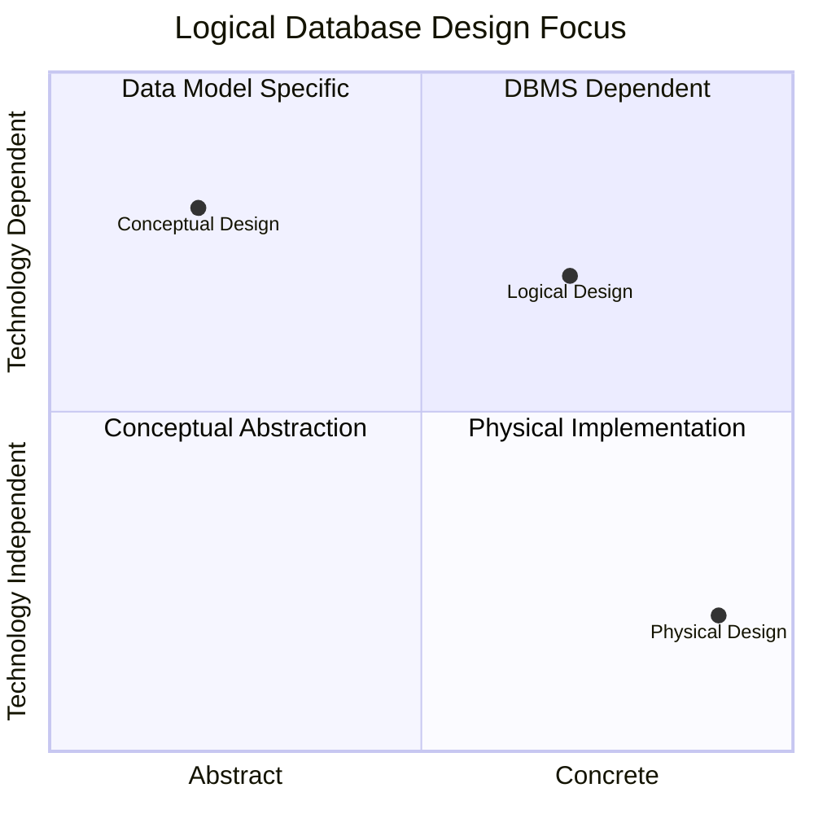
```mermaid
quadrantChart
    title Logical Database Design Focus
    x-axis "Abstract" --> "Concrete"
    y-axis "Technology Independent" --> "Technology Dependent"
    quadrant-1 "DBMS Dependent"
    quadrant-2 "Data Model Specific"
    quadrant-3 "Conceptual Abstraction"
    quadrant-4 "Physical Implementation"
    "Conceptual Design": [0.2, 0.8]
    "Logical Design": [0.7, 0.7]
    "Physical Design": [0.9, 0.2]
```
*Note: This `quadrantChart` visually positions Logical Database Design as more concrete and data model-specific than Conceptual Design, but still less technology-dependent than Physical Design.*

## Context & Framework
#### The Problem: Why Did We Invent This?
Logical database design bridges the gap between the high-level, abstract representation of data (from [[Conceptual_Database_Design]]) and the practical realities of database implementation. It was invented to provide a structured way to translate generalized data requirements into a format that a computer system can understand and process, adhering to the rules of a chosen data model. Without this intermediary step, directly moving from a conceptual idea to a physical implementation would be prone to errors, inconsistencies, and a lack of adherence to established data principles, making the database difficult to manage and query.

## The Mastery Deep Dive
#### Spot the Impostor: Addressing typical confusions regarding the specific focus and independence of logical design.
A common confusion arises when distinguishing logical design from both conceptual and physical design. Unlike conceptual design, logical design *is* dependent on a specific data model (e.g., the relational model, which defines tables and foreign keys). However, it differs from physical design by *avoiding* specific DBMS physical considerations, such as storage structures (e.g., B-trees, hash files), indexing strategies, or hardware specifications. Its independence lies in defining the data structure in a universally understood way *for a given data model*, before committing to a particular vendor's implementation.

#### The Cheat Code: How to Remember This
To remember the role of logical design, think of it as "L for Language-Specific (Data Model) but L for Lacking (Physical Details)." It's where you commit to a specific data modeling language (like the relational model with its tables and relationships) but you still *lack* the granular details of how that language will be *physically stored* by a particular database system. This mnemonic helps delineate its unique position between pure abstraction and concrete implementation.

## Constraints & Limitations
#### The Devil's Advocate: Why might this be wrong?
While logical database design aims for independence from physical considerations, the choice of a specific data model (e.g., relational) inherently brings its own set of constraints and assumptions. For instance, the relational model's emphasis on normalization might lead to a design that performs poorly for certain analytical queries, necessitating denormalization later in physical design. This highlights that "independence" at the logical stage is relative; the chosen data model can influence downstream performance and flexibility, potentially requiring compromises or adjustments in later stages if not carefully considered against anticipated use cases.

## Significance & Application
Logical Database Design is academically significant as it teaches the principles of transforming abstract data requirements into structured, coherent models, often emphasizing Normalization techniques. In the real world, it is a core skill for **Database Designers**, **Data Modelers**, and **Software Architects**. It is applied across all industries, serving as the blueprint for creating actual database schemas. For example, when designing a database for an e-commerce platform, logical design would define tables like `Customers`, `Orders`, and `Products`, specify their attributes, and establish relationships between them using foreign keys, ensuring data integrity and efficient querying.

## The Worked Example
*Test your mastery. Cover the solutions below to test yourself first.*

Following a conceptual design for a library system that identified `Book`, `Member`, and `Loan` as entities, the team moves to logical design. They decide to use the relational model.

#### Level 1: The Sanity Check (Verification)
**The Question:** For the `Book` entity from the library system, list two common relational database constructs that would be defined for it during logical database design.
> **Solution:** Two common constructs would be: `Table name (e.g., Books)` and `Column names (e.g., ISBN, Title, Author)`.

#### Level 2: The Crucible (Mastery & Edge Cases)
**The Scenario:** During logical design, the team creates a `Members` table with `MemberID` as the primary key and includes `FirstName`, `LastName`, and `MemberAddress`. For `MemberAddress`, they create a single column of type `TEXT` to store the entire address (e.g., "123 Main St, Anytown, USA 12345").
**The Challenge:**
(a) Identify a potential problem with this design choice for `MemberAddress` from a logical database design perspective.
(b) Suggest an improvement to the `MemberAddress` representation that aligns better with logical design principles.
(c) Explain how this improvement would benefit the database system.
> **Solution:**
> (a) A potential problem with using a single `TEXT` column for `MemberAddress` is that it violates the principle of **atomicity** in logical design (specifically, it's a composite attribute being treated as simple). It makes it difficult to query or manipulate individual components of the address (e.g., city, zip code) without complex string parsing.
> (b) An improvement would be to **decompose `MemberAddress` into multiple, atomic columns**, such as `Street_Address`, `City`, `State`, and `Zip_Code`.
> (c) This improvement would benefit the database system by:
>    *   **Enhancing data integrity:** Ensuring that each component of the address is stored in its appropriate format and can be individually validated.
>    *   **Improving query flexibility:** Allowing users to easily search or filter members based on specific address components (e.g., all members in 'Anytown').
>    *   **Facilitating reporting:** Enabling easier generation of reports that require address breakdowns.
>    *   **Supporting normalization:** Aligning with normalization principles by ensuring that each attribute is atomic and non-reducible.

## Key Takeaways
*   Logical database design transforms the conceptual model into a specific data model (e.g., relational), independent of physical DBMS considerations.
*   It defines structural elements like tables, columns, primary keys, foreign keys, and relationships according to the chosen data model's rules.
*   This phase acts as a crucial bridge, formalizing data structures from abstract requirements before physical implementation, ensuring data integrity and query efficiency.

## Knowledge Graph Connections
| Concept                     | Connection / Relationship                                                                                                           |
| :
-------------------------- | :
---------------------------------------------------------------------------------------------------------------------------------- |
| [[Database_Development_Methodology]] | This design phase follows conceptual design and precedes physical design within the overall development process.                       |
| [[Conceptual_Database_Design]] | This is the preceding phase, providing the abstract data model that logical design translates into a specific data model.           |
| [[Physical_Database_Design]]  | This is the subsequent phase, where the logical design is implemented with specific storage structures and optimizations.              |
| [[Entity_Relationship_ER_Model]] | This model is often used to represent the conceptual design, which is then translated into the logical model.                     |
| Relational_Model        | This is a common specific data model that the conceptual design is mapped to during logical design.                                    |
---

---

## Multi Valued Attribute


## Definition
Before proceeding, ensure you master [[Single_Valued_Attribute]] and [[Composite_Attribute]].
A **Multi-Valued Attribute** is an [[Attributes_in_ER_Model]] that can hold **multiple values** for each occurrence of an [[Entity_Types]] (or relationship type). This means that for a single instance of an entity, that attribute can have a collection of data associated with it, rather than just one. For example, `Phone_Number` for a `Person` (if a person has multiple phone numbers), `Skills` for an `Employee`, or `Degrees` for a `Student` are typically multi-valued attributes. In a traditional Entity-Relationship (ER) Model, it is usually represented by a double-lined oval or ellipse. Think of it as a field on a resume where you can list multiple "Skills."

## The Mental Model
Imagine a backpack. You can put **multiple** items inside it – books, pens, a water bottle. That's a **Multi-Valued Attribute**: a property that can contain a collection of distinct values for a single entity instance.

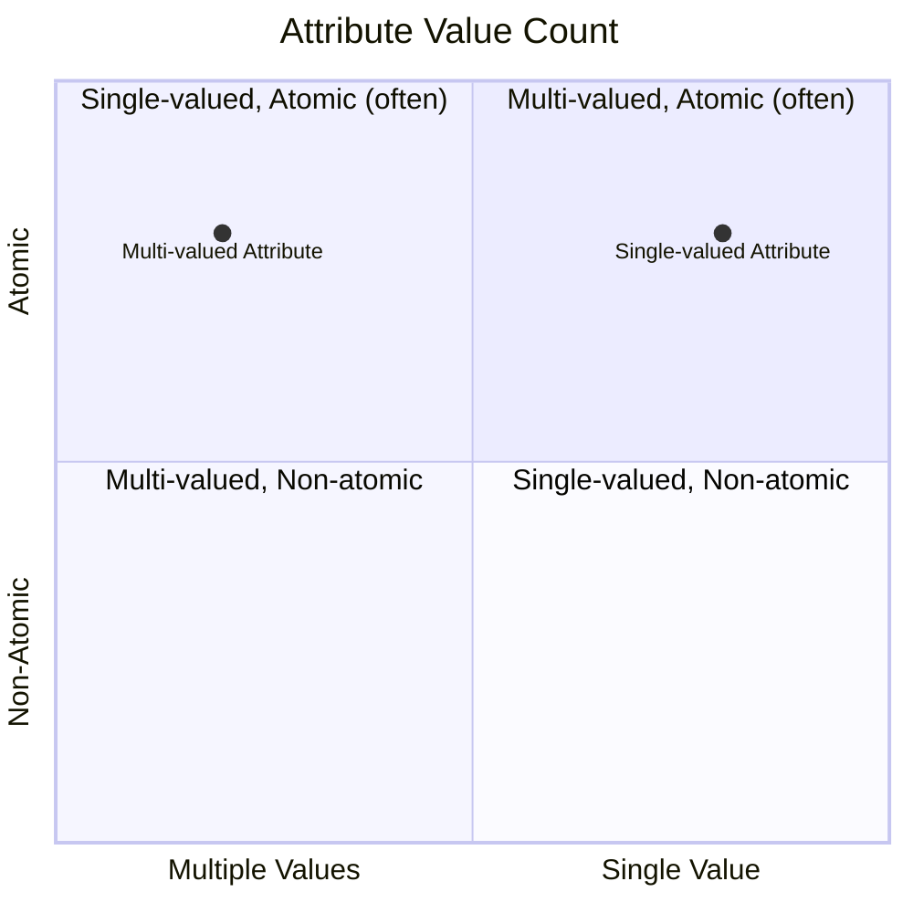
```mermaid
quadrantChart
    title Attribute Value Count
    x-axis "Multiple Values" --> "Single Value"
    y-axis "Non-Atomic" --> "Atomic"
    quadrant-1 "Multi-valued, Atomic (often)"
    quadrant-2 "Single-valued, Atomic (often)"
    quadrant-3 "Multi-valued, Non-atomic"
    quadrant-4 "Single-valued, Non-atomic"
    "Multi-valued Attribute": [0.2, 0.8]
    "Single-valued Attribute": [0.8, 0.8]
```
*Note: This `quadrantChart` visually differentiates `Multi-Valued Attributes` from `Single-Valued Attributes` based on the number of values they can hold.*

## Context & Framework
#### The Family Tree
Within the broad classification of [[Attributes_in_ER_Model]], the multi-valued attribute is distinct because it violates the principle of atomicity if represented directly as a single column in a relational database. It directly contrasts with a [[Single_Valued_Attribute]], which can only hold one value per entity occurrence. Multi-valued attributes often signal the need for further normalization during the translation from conceptual to [[Logical_Database_Design]], typically by creating a separate entity and an identifying relationship to store the multiple values.

## The Mastery Deep Dive
#### Opening the Hood: What's Inside?
The defining characteristic of a multi-valued attribute is its **ability to hold a set of values for a single entity instance**. For example, a `Student` may have multiple `Degrees` (e.g., "B.Sc. in CS", "M.Sc. in Data Science"). Each of these degrees is a distinct value of the `Degrees` attribute. Similarly, an `Employee` can have multiple `Skills` (e.g., "Python", "SQL", "Cloud Computing"). The key is that each skill is a separate piece of information, and an employee can possess many such skills. This characteristic often necessitates special handling in database implementation, typically by creating a new entity to hold these multiple values.

#### Spot the Impostor: Addressing the ability of multi-valued attributes to store several values for a single entity occurrence.
A common "impostor" scenario involves a multi-valued attribute that is inappropriately stored as a single, concatenated string (e.g., "Python, Java, C++" in a `Skills` field). While this technically "stores" multiple values, it compromises data integrity, makes querying specific skills extremely difficult (e.g., "find all employees with Python skills"), and violates Normalization principles. A true multi-valued attribute should be represented in a way that allows each individual value to be treated independently, often by creating a separate table for that attribute and linking it back to the original entity.

## Constraints & Limitations
#### The Devil's Advocate: Why might this be wrong?
Modeling an attribute as multi-valued inherently adds complexity to the database design, as it typically requires creating a new table to store these values (e.g., a `Person_PhoneNumbers` table to store multiple phone numbers for a `Person`). This increases the number of tables and potentially the complexity of queries (requiring joins). The trade-off is between **conceptual accuracy and data integrity** (multi-valued) versus **simplicity of schema** (single-valued, even if inaccurate). If the number of possible values is strictly limited and never changes (e.g., exactly two emergency contacts), a designer might opt for multiple single-valued attributes (e.g., `EmergencyContact1`, `EmergencyContact2`) to avoid the complexity of a separate table.

## Significance & Application
Understanding Multi-Valued Attributes is academically significant as it highlights the challenge of representing non-atomic data and introduces strategies for achieving Normalization. In the real world, it's a critical skill for **Database Designers** and **Data Modelers**. It is applied whenever an entity can possess a collection of values for a specific property. Examples include:
*   `Student` with multiple `Degrees`
*   `Book` with multiple `Authors`
*   `Employee` with multiple `Email_Addresses`
Correctly identifying and modeling multi-valued attributes ensures that all relevant data is captured without truncation, supports efficient querying of individual values, and prevents data redundancy, leading to a more robust and flexible database schema.

## The Worked Example
*Test your mastery. Cover the solutions below to test yourself first.*

Consider a database for a social media platform that tracks `User` profiles.

#### Level 1: The Sanity Check (Verification)
**The Question:** For a `User` entity, if a user can list multiple `Interests` (e.g., "hiking", "reading", "coding"), would `Interests` be considered a multi-valued attribute?
> **Solution:** Yes, `Interests` would be considered a multi-valued attribute.

#### Level 2: The Crucible (Mastery & Edge Cases)
**The Scenario:** A designer wants to model the `Achievements` a user has earned. Each `Achievement` has a `Title` and a `Date_Achieved`. A user can have multiple achievements. The designer initially proposes creating three columns in the `User` table: `Achievement1_Title`, `Achievement1_Date`, `Achievement2_Title`, `Achievement2_Date`, and so on, up to `Achievement5_Title`, `Achievement5_Date`.
**The Challenge:**
(a) Explain why this approach of using multiple fixed columns for achievements is problematic for a multi-valued concept like `Achievements`.
(b) Describe how `Achievements` should ideally be modeled in an ER diagram to properly handle its multi-valued nature, considering it has both a `Title` and a `Date_Achieved`.
(c) Discuss the advantages of the ideal modeling approach over the fixed-column approach.
> **Solution:**
> (a) This fixed-column approach is problematic because:
>    1.  **Inflexibility:** It imposes an arbitrary limit (e.g., 5 achievements). If a user has more than 5, data is lost. If they have fewer, many columns remain `NULL`, wasting space.
>    2.  **Redundancy/Wasted Space:** Many columns will be null for users with few achievements.
>    3.  **Querying Difficulty:** Querying for all users who achieved a specific `Title` or for achievements within a date range becomes extremely complex, requiring checks across multiple columns.
> (b) `Achievements` should ideally be modeled by promoting it to its own [[Weak_Entity_Type]] (or a separate strong entity if `Achievement` had a global unique ID independent of the user) named `Achievement`, with its own attributes `Title` and `Date_Achieved`. This `Achievement` entity would then be related to the `User` entity through an identifying relationship. In an ER diagram, `User` would be a strong entity (single rectangle), `Achievement` would be a weak entity (double rectangle), and the connecting relationship would be an identifying relationship (double diamond).
> (c) The advantages of the ideal modeling approach are:
>    *   **Flexibility:** No artificial limit on the number of achievements a user can have.
>    *   **No Data Redundancy:** Each achievement is stored as a separate record, eliminating `NULL` waste.
>    *   **Efficient Querying:** Easy to query for specific achievements, achievements by date, or all achievements for a user.
>    *   **Improved Data Integrity:** Easier to apply validation rules to `Title` and `Date_Achieved` for each individual achievement.
>    *   **Scalability:** The design naturally scales as the number of achievements grows.

## Key Takeaways
*   A multi-valued attribute can hold multiple values for each occurrence of an entity or relationship type, representing a collection of distinct pieces of information.
*   It is often represented by a double-lined ellipse in ER diagrams and typically requires normalization into a separate entity or table during logical design.
*   Correctly identifying and modeling multi-valued attributes ensures comprehensive data capture, supports flexible querying of individual values, and prevents data redundancy, leading to a more robust and flexible database schema.

## Knowledge Graph Connections
| Concept                     | Connection / Relationship                                                                   |
| :
-------------------------- | :
------------------------------------------------------------------------------------------ |
| [[Attributes_in_ER_Model]] | This is a specific classification of attributes based on the number of values they can hold. |
| [[Single_Valued_Attribute]] | This is the contrasting classification, representing attributes that can hold only one value.  |
| [[Composite_Attribute]]     | A multi-valued attribute can also be composite, meaning each of its multiple values has sub-components. |
| [[Entity_Types]]            | Multi-valued attributes describe a collection of properties associated with these objects.    |
| [[Logical_Database_Design]] | Multi-valued attributes often necessitate creating new entities or tables during this phase for normalization. |
---

---

## Multiplicity In ER Model


## Definition
Before proceeding, ensure you master [[Cardinality_in_ER_Model]] and [[Participation_in_ER_Model]].
**Multiplicity** in the Entity-Relationship (ER) Model is a [[Structural_Constraints_in_ER_Model]] that specifies the **number (or range)** of possible occurrences of an [[Entity_Types]] that may relate to a single occurrence of an associated entity type through a particular [[Relationship_Types]]. It essentially describes the "how many" aspect of a relationship and directly represents the **business rules** governing those connections. Multiplicity is composed of two fundamental types of restrictions: [[Cardinality_in_ER_Model]] (the maximum number of relationships) and [[Participation_in_ER_Model]] (whether participation is mandatory or optional). Think of it as the numerical limit and requirement for engagement in any interaction between two groups.

## The Mental Model
Imagine a rule at a concert venue: "Each ticket holder (Entity A) can bring exactly one guest (Entity B)." Here, **Multiplicity** defines that `1` ticket holder relates to `1` guest. If the rule was "Each performer (Entity A) can have many fans (Entity B)," then `1` performer relates to `*` (many) fans.

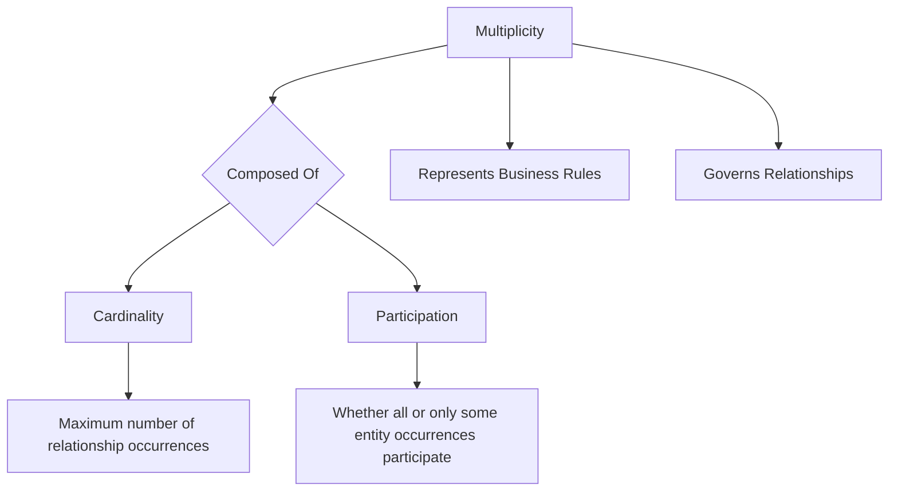
```mermaid
graph TD
    A["Multiplicity"] --> B{Composed Of}
    B --> C["Cardinality"]
    C --> D["Maximum number of relationship occurrences"]
    B --> E["Participation"]
    E --> F["Whether all or only some entity occurrences participate"]
    A --> G["Represents Business Rules"]
    A --> H["Governs Relationships"]
```
*Note: This `graph TD` illustrates the composition of Multiplicity into Cardinality and Participation, highlighting its role in representing business rules within relationships.*

## Context & Framework
#### The Family Tree
[[Multiplicity_in_ER_Model]] is the overarching concept within [[Structural_Constraints_in_ER_Model]] that quantifies relationship limits. It provides a detailed specification of how [[Entity_Types]] interact through [[Relationship_Types]]. This fundamental concept is further delineated into two critical components: [[Cardinality_in_ER_Model]], which defines the *maximum* number of related occurrences, and [[Participation_in_ER_Model]], which specifies whether an entity's involvement in a relationship is *mandatory* or *optional*. Understanding multiplicity is paramount for accurately translating complex business rules into a precise and unambiguous [[Entity_Relationship_ER_Model]].

## The Mastery Deep Dive
#### Opening the Hood: What's Inside?
Multiplicity is often expressed using notations like `(min..max)`, where `min` is the minimum number of relationship occurrences and `max` is the maximum.
*   `1..1`: Exactly one (e.g., a `Department` `Is_Managed_By` `1..1` `Employee`).
*   `0..1`: Zero or one (optional, e.g., a `Manager` `Manages` `0..1` `Department`).
*   `1..*`: One or many (mandatory, e.g., an `Employee` `Works_For` `1..*` `Projects`).
*   `0..*`: Zero or many (optional, e.g., a `Customer` `Places` `0..*` `Orders`).
These notations combine both cardinality (the 'max' part) and participation (the 'min' part) into a single, comprehensive statement about the relationship's quantitative constraints. This precision is essential for preventing invalid data from being stored in the database.

#### The Translator: Hacker Slang to Exam Terms
When a business describes a rule as "each student *can* take *many* courses, but *must* take *at least one*" (Hacker Slang), this directly translates to a multiplicity constraint. For the `Student` entity participating in the `Enrolls_In` relationship with `Course`, the constraint from `Student` to `Course` would be `1..*` (Exam Term). From `Course` to `Student`, it would typically be `0..*` or `1..*` depending on whether a course must have students. This translation captures the precise numerical requirements of the business rule.

## Constraints & Limitations
#### The Devil's Advocate: Why might this be wrong?
Sometimes, business rules are interpreted too rigidly when defining multiplicity, leading to an inflexible database design. For example, if a rule states "a product must belong to exactly one category," this would be modeled as `1..1` from `Product` to `Category`. However, if the business later decides a product can belong to *multiple* categories, the `1..1` constraint would require a schema change, potentially incurring significant rework. The trade-off is between **strict enforcement of current business rules** (precise multiplicity) and **future adaptability** (looser constraints or more flexible modeling patterns if ambiguity is anticipated). A designer needs to foresee potential changes and design for appropriate flexibility.

## Significance & Application
Understanding Multiplicity is academically significant as it provides the quantitative foundation for defining precise relationship semantics in the ER Model. In the real world, it's an indispensable skill for **Database Designers**, **Business Analysts**, and **System Architects**. It is applied whenever entities interact in a database, ensuring that the number of related occurrences aligns with business logic. For instance:
*   `Customer` `Places` `1..*` `Orders` (a customer must place at least one order).
*   `Employee` `Manages` `0..1` `Department` (an employee may or may not manage a department).
*   `Doctor` `Treats` `1..*` `Patient` (a doctor treats one or more patients).
Correctly specifying multiplicity is critical for enforcing data integrity, validating relationships, and building a database that accurately models the complexities of an organization's operations.

## The Worked Example
*Test your mastery. Cover the solutions below to test yourself first.*

Consider a simplified database for a company that tracks `Employees` and `Projects`.

#### Level 1: The Sanity Check (Verification)
**The Question:** For the relationship `Employee Works_On Project`, if an employee can work on many projects, and a project can have many employees, what is the multiplicity for this relationship?
> **Solution:** The multiplicity for this relationship is **Many-to-Many (*:*)** (or `0..*` to `0..*` if optional, or `1..*` to `1..*` if mandatory).

#### Level 2: The Crucible (Mastery & Edge Cases)
**The Scenario:** A designer models the `Department` `Manages` `Employee` relationship with a multiplicity of `(1..1)` from `Department` to `Employee`. This means each department must be managed by exactly one employee. However, the business rule states that an employee can *optionally* manage a department, and a department *must* be managed by exactly one employee.
**The Challenge:**
(a) Explain why the multiplicity `(1..1)` from `Department` to `Employee` correctly captures the department's side of the business rule.
(b) Identify the correct multiplicity for the `Employee` entity in the `Manages` relationship (from `Employee` to `Department`), considering an employee can *optionally* manage a department.
(c) Discuss a potential issue that could arise if an employee's participation in managing a department was incorrectly set as mandatory (`1..1`) when it should be optional.
> **Solution:**
> (a) The multiplicity `(1..1)` from `Department` to `Employee` correctly captures the department's side of the business rule because it signifies that for every `Department` occurrence, there *must be at least one* (`min=1`) and *at most one* (`max=1`) `Employee` managing it. This perfectly matches "each department must be managed by exactly one employee."
> (b) The correct multiplicity for the `Employee` entity in the `Manages` relationship (from `Employee` to `Department`) would be `(0..1)`. This means an `Employee` occurrence may participate in managing zero (`min=0`) or one (`max=1`) `Department`.
> (c) If an employee's participation in managing a department was incorrectly set as mandatory (`1..1`) when it should be optional, a potential issue is that **you would not be able to store any employee in the database who does *not* currently manage a department**. This would lead to data entry errors, force the creation of dummy departments or employees, or simply make the database unable to accurately represent the real-world scenario where many employees are not managers. It violates data integrity and flexibility.

## Key Takeaways
*   Multiplicity in the ER Model defines the number or range of possible related entity occurrences in a relationship, directly representing business rules.
*   It combines cardinality (maximum count) and participation (mandatory/optional involvement) into a single constraint, often expressed as `(min..max)`.
*   Precisely defining multiplicity is essential for enforcing data integrity, ensuring that relationships accurately reflect real-world constraints, and preventing the storage of inconsistent data.

## Knowledge Graph Connections
| Concept                     | Connection / Relationship                                                                   |
| :
-------------------------- | :
------------------------------------------------------------------------------------------ |
| [[Structural_Constraints_in_ER_Model]] | This is the primary type of structural constraint that quantifies relationship limits.    |
| [[Cardinality_in_ER_Model]] | This is a component of multiplicity, specifying the maximum number of relationship occurrences. |
| [[Participation_in_ER_Model]] | This is a component of multiplicity, determining whether entity involvement is mandatory or optional. |
| [[Entity_Relationship_ER_Model]] | Multiplicity is a core concept for representing business rules and quantitative aspects of relationships within the ER model. |
| [[Relationship_Types]]      | Multiplicity explicitly governs how entity occurrences interact through these associations.    |
| [[Entity_Types]]            | Multiplicity specifies the numerical limits for how these classifications relate to each other. |
---

---

## Participation In ER Model


## Definition
Before proceeding, ensure you master [[Multiplicity_in_ER_Model]] and [[Cardinality_in_ER_Model]].
**Participation** in the Entity-Relationship (ER) Model determines whether **all or only some** occurrences of an [[Entity_Types]] must (or may) participate in a particular [[Relationship_Types]]. It represents the "lower limit" of how many times an entity instance *must* be associated with instances of another entity type. Participation is a key component of [[Multiplicity_in_ER_Model]], which specifies the full range of involvement. The two types of participation are **total (mandatory)** and **partial (optional)**. Think of it like a rule for a sports team: "Every player *must* play at least one game" (total participation), or "Players *may* attend practice" (partial participation).

## The Mental Model
Imagine a school play casting call. If "Every student *must* audition," that's **Total Participation**. If "Students *may* audition," that's **Partial Participation**. It defines the minimum requirement for an entity to be involved in a relationship.

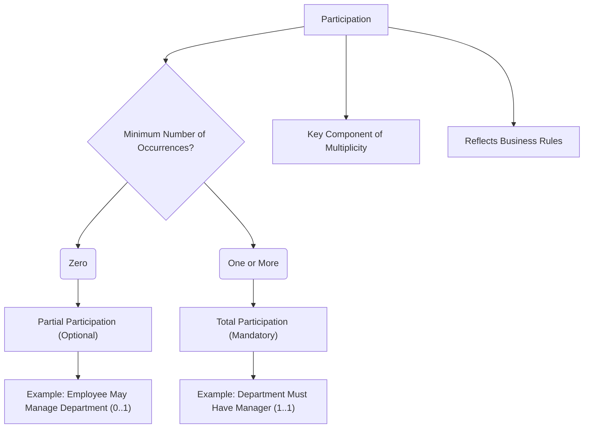
```mermaid
graph TD
    A["Participation"] --> B{"Minimum Number of Occurrences?"}
    B --> C("Zero")
    C --> D["Partial Participation (Optional)"]
    D --> E["Example: Employee May Manage Department (0..1)"]
    B --> F("One or More")
    F --> G["Total Participation (Mandatory)"]
    G --> H["Example: Department Must Have Manager (1..1)"]
    A --> I["Key Component of Multiplicity"]
    A --> J["Reflects Business Rules"]
```
*Note: This `graph TD` illustrates the two types of Participation (Partial and Total) based on the minimum number of relationship occurrences, with examples.*

## Context & Framework
#### The Family Tree
[[Participation_in_ER_Model]] is a critical component of [[Multiplicity_in_ER_Model]], which falls under the broader category of [[Structural_Constraints_in_ER_Model]]. It works hand-in-hand with [[Cardinality_in_ER_Model]] to provide a complete quantitative description of [[Relationship_Types]] between [[Entity_Types]]. Understanding participation is essential for accurately enforcing business rules that dictate whether an entity's involvement in a relationship is a requirement or an option, directly impacting data integrity in the [[Entity_Relationship_ER_Model]].

## The Mastery Deep Dive
#### Opening the Hood: What's Inside?
Participation focuses on the "minimum" number of relationship occurrences:
*   **Total Participation (Mandatory)**: Every occurrence of an entity type *must* participate in the relationship. This is typically represented by a double line connecting the entity rectangle to the relationship diamond in an ER diagram, or a minimum multiplicity of '1' (e.g., `1..1`, `1..*`). For example, if every `Employee` `Must_Work_For` a `Department`, then `Employee` has total participation in `Works_For`.
*   **Partial Participation (Optional)**: An occurrence of an entity type *may or may not* participate in the relationship. This is typically represented by a single line connecting the entity rectangle to the relationship diamond, or a minimum multiplicity of '0' (e.g., `0..1`, `0..*`). For example, a `Professor` `May_Teach` a `Course` (they might be on sabbatical), so `Professor` has partial participation in `Teaches`.
These define the minimum requirements for an entity's involvement in a relationship.

#### Spot the Impostor: Addressing whether participation in a relationship is total (mandatory) or partial (optional).
A common "impostor" is confusing total participation with a 1:1 cardinality. While a 1:1 relationship often involves mandatory participation on both sides, mandatory participation simply means the *minimum* number of connections is one. For example, `Department` `Has` `1:*` `Employees`. If a `Department` *must* have at least one employee, then `Department` has total participation, even though the cardinality is "many" for employees. The impostor incorrectly assumes "many" automatically implies optional. The distinction is between *minimum quantity* (participation) and *maximum quantity* (cardinality).

## Constraints & Limitations
#### The Devil's Advocate: Why might this be wrong?
Overly strict mandatory participation constraints (`min=1`) can sometimes lead to practical problems if the business rules aren't perfectly understood or if data is created out of order. For example, if `Employee` `Must_Work_For` `Department` (total participation), you cannot create an `Employee` record until a `Department` record exists and is assigned. If the order of data entry is inverted, or if an employee temporarily doesn't have a department (e.g., during onboarding), the database will reject the entry. The trade-off is between **strong data integrity enforcement** (mandatory participation) and **operational flexibility/ease of data entry** (optional participation). Sometimes, a softer constraint is needed, with business logic in the application layer enforcing the "should be" rather than the database enforcing the "must be."

## Significance & Application
Understanding Participation is academically significant as it provides the mechanism for defining mandatory or optional involvement in relationships, crucial for accurate business rule modeling. In the real world, it's an indispensable skill for **Database Designers** and **Application Developers**. It is applied whenever the existence or validity of an entity depends on its connection to another. For instance:
*   An `Order_Item` `Must_Belong_To` an `Order` (total participation of `Order_Item` in `Belongs_To`).
*   A `Student` `May_Enroll_In` a `Club` (partial participation of `Student` in `Enrolls_In`).
*   A `Course` `Must_Have` `Professor` (total participation of `Course` in `Has`).
Correctly specifying participation is vital for preventing orphaned records, enforcing referential integrity, and ensuring that the database accurately reflects the business logic.

## The Worked Example
*Test your mastery. Cover the solutions below to test yourself first.*

Consider a database for an online forum that tracks `Users` and `Posts`.

#### Level 1: The Sanity Check (Verification)
**The Question:** For the relationship `User Creates Post`, if a user *must* create at least one post to be registered, what is the participation of the `User` entity in the `Creates` relationship?
> **Solution:** The participation of the `User` entity is **Total Participation (Mandatory)**.

#### Level 2: The Crucible (Mastery & Edge Cases)
**The Scenario:** A designer models the relationship `Forum Has Moderator` with total participation from `Forum` to `Moderator` (meaning every forum must have at least one moderator) and partial participation from `Moderator` to `Forum` (meaning a moderator may or may not be assigned to a forum). However, the business rule for new forums states that a forum can be created *without* an assigned moderator initially, but one must be assigned within 24 hours.
**The Challenge:**
(a) Explain why the initial modeling of total participation from `Forum` to `Moderator` is problematic for the business rule of creating forums without immediate moderators.
(b) Describe the correct participation constraint for `Forum` in the `Has` relationship to accommodate the temporary lack of a moderator.
(c) Discuss how the business rule "one must be assigned within 24 hours" would typically be enforced if the database design allows for initial optional participation.
> **Solution:**
> (a) The initial modeling of total participation from `Forum` to `Moderator` is problematic because it implies that a `Forum` record **cannot be created in the database without immediately being linked to a `Moderator`**. This directly contradicts the business rule allowing a forum to be created *without* an assigned moderator initially. The database would enforce this as a hard constraint, preventing the creation of new forums as per the new business process.
> (b) To accommodate the temporary lack of a moderator, the correct participation constraint for `Forum` in the `Has` relationship should be **Partial Participation (Optional)**. This would allow a `Forum` entity to exist in the database without being immediately linked to a `Moderator`.
> (c) The business rule "one must be assigned within 24 hours" would typically be enforced through **application-level logic or a scheduled job**, rather than a direct database constraint. For example:
>    *   **Application Logic:** The application code would, upon forum creation, set a `creation_timestamp` and then enforce that a moderator must be linked if the current time exceeds `creation_timestamp + 24 hours`.
>    *   **Scheduled Job:** A daily or hourly database job could identify `Forum` records older than 24 hours that still lack a `Moderator` and flag them for attention, or even trigger an alert to administrators.
>    This approach separates the immediate structural integrity (database allows null) from the temporal business logic (application enforces within 24 hours).

## Key Takeaways
*   Participation determines whether all (total/mandatory) or only some (partial/optional) entity occurrences must be involved in a relationship.
*   It defines the minimum number of relationship occurrences, complementing cardinality to specify the full range of multiplicity.
*   Correctly defining participation is vital for enforcing business rules related to mandatory existence or optional involvement, preventing orphaned records, and ensuring data integrity.

## Knowledge Graph Connections
| Concept                     | Connection / Relationship                                                                   |
| :
-------------------------- | :
------------------------------------------------------------------------------------------ |
| [[Multiplicity_in_ER_Model]] | This is a fundamental component of multiplicity, specifying the minimum number of occurrences. |
| [[Cardinality_in_ER_Model]] | This works in conjunction with participation to define the full range of multiplicity.        |
| [[Structural_Constraints_in_ER_Model]] | Participation is a type of structural constraint that imposes mandatory or optional involvement limits. |
| [[Relationship_Types]]      | Participation explicitly dictates the required involvement of entities in these associations. |
| [[Entity_Types]]            | Participation describes whether instances of these classifications must relate or may relate. |
| [[Entity_Relationship_ER_Model]] | Participation is essential for representing existence dependencies and business rules within the ER model. |
---

---

## Primary Key


## Definition
Before proceeding, ensure you master [[Candidate_Key]] and [[Composite_Key]].
A **Primary Key** is a [[Candidate_Key]] that is **chosen by the database designer** to uniquely identify each occurrence of an [[Entity_Types]]. It is the main, single identifier for an entity and is used to enforce entity integrity, which states that no primary key value can be null, and all values must be unique. In an Entity-Relationship (ER) Diagram, the attribute(s) forming the primary key are typically underlined. Think of it as the single, official identification number (like a `Passport_Number` or `StudentID`) that is designated to uniquely identify a person or item, even if other forms of identification exist.

## The Mental Model
Imagine a library system where every book has a unique call number. That call number is the **Primary Key**. While books also have titles and authors, the call number is the *chosen*, definitive way the library uses to uniquely identify and locate each specific book.

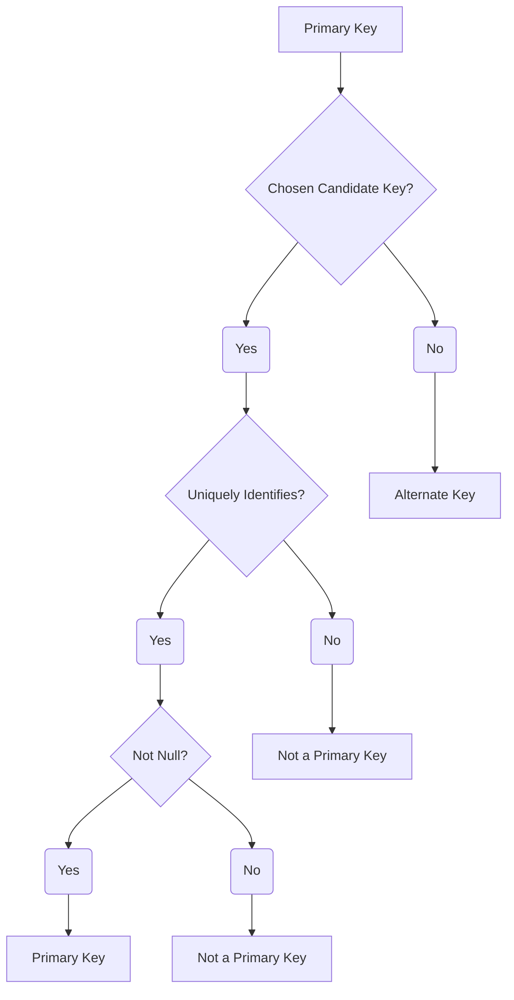
```mermaid
graph TD
    A["Primary Key"] --> B{Chosen Candidate Key?}
    B --> C("Yes")
    C --> D{Uniquely Identifies?}
    D --> E("Yes")
    E --> F{Not Null?}
    F --> G("Yes")
    G --> H["Primary Key"]
    F --> I("No")
    I --> J["Not a Primary Key"]
    D --> K("No")
    K --> L["Not a Primary Key"]
    B --> M("No")
    M --> N["Alternate Key"]
```
*Note: This `graph TD` illustrates the criteria for an attribute (or set of attributes) to be designated as a Primary Key, emphasizing its uniqueness, non-nullability, and selection from candidate keys.*

## Context & Framework
#### The Family Tree
The [[Primary_Key]] is the cornerstone of unique identification within [[Keys_in_ER_Model]]. It is selected from the set of one or more [[Candidate_Key]]s available for an [[Entity_Types]]. The primary key's importance extends beyond merely identifying records; it also serves as the target for Foreign_Keys (not explicitly in ER but critical in logical design), which are used to establish relationships between different entities. If the primary key comprises multiple attributes, it is known as a [[Composite_Key]]. The decision of which candidate key to elevate to primary key status is a critical design choice, impacting both data integrity and system performance.

## The Mastery Deep Dive
#### Opening the Hood: What's Inside?
The selection of a primary key is a crucial design decision due to its implications for data integrity and system functionality. A primary key must adhere to two main rules:
*   **Uniqueness**: Each value for the primary key must be distinct for every occurrence of the entity. No two rows can have the same primary key value.
*   **Non-Nullability (Entity Integrity)**: The primary key cannot contain null values. Every entity occurrence must have a defined primary key value.
These rules ensure that every record is always uniquely identifiable and consistently referenced. For example, in a `Customer` table, `CustomerID` is typically chosen as the primary key. It's unique for each customer, and no customer can exist without a `CustomerID`.

#### Spot the Impostor: Addressing its specific selection among candidate keys to be the main identifier.
A common "impostor" scenario involves confusing any unique identifier with the *chosen* primary key. An entity might have several [[Candidate_Key]]s (e.g., `StudentID`, `Social_Security_Number`, `(Email, DateOfBirth)`). While all are unique, only one can be designated as the `Primary_Key`. The others become `Alternate Keys`. The "impostor" is claiming all unique identifiers are primary keys. The critical distinction is the designer's explicit choice for the *main* identifier, which often considers stability, simplicity, and business relevance.

## Constraints & Limitations
#### The Devil's Advocate: Why might this be wrong?
While a primary key is vital for unique identification, the choice can sometimes be controversial. Using "natural" primary keys (like `ISBN` for a `Book`) might seem intuitive but can be problematic if the definition of uniqueness changes or if the value is long and complex. Conversely, using "surrogate" primary keys (system-generated IDs like `CustomerID`) is simpler and more stable but lacks inherent meaning. The trade-off is between **semantic meaning and stability**. A natural key offers immediate context but might be prone to business rule changes, while a surrogate key is stable but requires an additional unique index on the natural attribute(s) if unique access by those is needed.

## Significance & Application
Understanding Primary Keys is academically significant as it is a cornerstone of relational database theory and a fundamental concept in data integrity. In the real world, it's an indispensable skill for **Database Designers**, **Developers**, and **Data Modelers**. It is applied in virtually every database to:
*   **Enforce unique identification**: Guarantees that each record is distinct.
*   **Establish relationships**: Forms the target for foreign keys in other tables.
*   **Maintain data integrity**: Ensures non-null and unique values.
*   **Optimize performance**: Often the basis for clustering indexes, speeding up data access.
Correctly defining primary keys is paramount for building robust, consistent, and efficient database systems that accurately reflect business realities.

## The Worked Example
*Test your mastery. Cover the solutions below to test yourself first.*

Consider a simplified online ordering system. The `Order` entity has `OrderID` (a unique system-generated number) and `Order_Date`. The `Customer` entity has `CustomerID` and `Customer_Email` (which is unique for each customer).

#### Level 1: The Sanity Check (Verification)
**The Question:** For the `Customer` entity, which attribute would be the most appropriate **Primary_Key**?
> **Solution:** `CustomerID` would be the most appropriate **Primary_Key**.

#### Level 2: The Crucible (Mastery & Edge Cases)
**The Scenario:** For the `Order` entity, the designer decides to use `(Order_Date, CustomerID)` as the primary key, assuming a customer will never place more than one order on the same day. However, later, the business rules change, and customers are now allowed to place multiple orders on the same day.
**The Challenge:**
(a) Explain how the original choice of `(Order_Date, CustomerID)` as the primary key for `Order` becomes problematic with the changed business rule.
(b) What type of key is `(Order_Date, CustomerID)` in this problematic scenario?
(c) Propose a more robust primary key for the `Order` entity that can accommodate the new business rule, justifying your choice.
> **Solution:**
> (a) The original choice of `(Order_Date, CustomerID)` as the primary key becomes problematic because it **violates the uniqueness property** of a primary key. With the new business rule allowing customers to place multiple orders on the same day, `(Order_Date, CustomerID)` would no longer uniquely identify each order, as a customer could have two orders with the same date.
> (b) In this problematic scenario, `(Order_Date, CustomerID)` would still be a [[Composite_Key]], but it would no longer be a valid [[Primary_Key]] because it fails the uniqueness constraint.
> (c) A more robust primary key for the `Order` entity would be `OrderID`.
>    *   **Justification:** `OrderID` is described as a "unique system-generated number," which inherently guarantees uniqueness regardless of `Order_Date` or `CustomerID` combinations. It provides a stable, simple, and unambiguous identifier for each order, effectively accommodating the new business rule without modification.

## Key Takeaways
*   A primary key is the chosen candidate key that uniquely identifies each entity occurrence, enforcing entity integrity (unique and non-null values).
*   It serves as the main identifier for an entity, foundational for establishing relationships and maintaining data consistency.
*   The selection of a primary key is a critical design decision, balancing uniqueness, stability, and business relevance, with significant implications for database integrity and performance.

## Knowledge Graph Connections
| Concept                     | Connection / Relationship                                                                   |
| :
-------------------------- | :
------------------------------------------------------------------------------------------ |
| [[Keys_in_ER_Model]]        | This is the chosen, definitive unique identifier for an entity.                               |
| [[Candidate_Key]]           | The primary key is selected from the set of these potential unique identifiers.             |
| [[Composite_Key]]           | If the primary key consists of multiple attributes, it is referred to as this.              |
| [[Entity_Types]]            | The primary key uniquely identifies individual occurrences within these classifications.      |
| Data_Integrity          | The primary key is fundamental for enforcing this crucial database property.                  |
| [[Entity_Relationship_ER_Model]] | The primary key is a cornerstone of representing entity identity within the ER model.         |
---

---

## Recursive Relationship


## Definition
Before proceeding, ensure you master [[Relationship_Types]] and [[Degree_of_a_Relationship]].
A **Recursive Relationship** is a special type of [[Relationship_Types]] where the **same [[Entity_Types]] participates more than once** in the relationship, playing different roles. It's essentially a unary relationship (degree one) because only one entity type is involved, but occurrences of that entity type relate to other occurrences of the *same* entity type. To clarify the meaning of each participation, **role names** are often assigned. A classic example is `Employee Supervises Employee`, where one employee acts as the `Supervisor` and another as the `Supervisee`. Think of a single person having a "best friend" relationship with another person: both are "persons," but one is the "best friend" and the other is "their best friend."

## The Mental Model
Imagine a mirror reflecting the same person, but in two different hats – one person is the "boss," and the other is the "employee." The **Recursive Relationship** is that mirror, showing the same entity type (`Person`) in two distinct roles (`Boss`, `Employee`) within a single relationship.

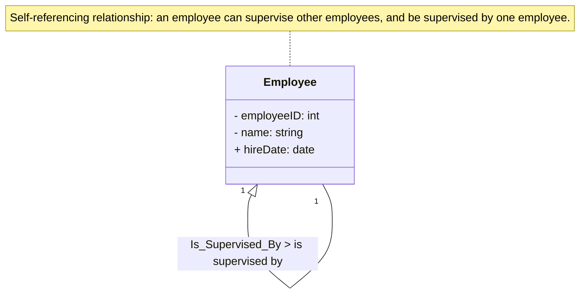
```mermaid
classDiagram
    class Employee {
        - employeeID: int
        - name: string
        + hireDate: date
    }

    Employee "1" -- "0..*" Employee : Supervises > supervises
    Employee "1" <|-- "1" Employee : Is_Supervised_By > is supervised by

    note for Employee "Self-referencing relationship: an employee can supervise other employees, and be supervised by one employee."
```
*Note: This `classDiagram` illustrates a recursive relationship for the `Employee` entity, showing how employees can supervise other employees and be supervised themselves. The role names `Supervises` and `Is_Supervised_By` clarify the direction and context of the self-association.*

## Context & Framework
#### How the Parts Talk to Each Other
Within the realm of [[Relationship_Types]], recursive relationships demonstrate a sophisticated form of self-referential interaction. They are a specific instance of a **unary relationship**, meaning their [[Degree_of_a_Relationship]] is one. The crucial aspect is the assignment of **role names** (e.g., `Supervisor`, `Supervisee`) to each participation, which explicitly defines the distinct function an entity occurrence plays when relating to another occurrence of the same entity type. This mechanism ensures clarity and avoids ambiguity in modeling hierarchical or network-like structures within a single entity set.

## The Mastery Deep Dive
#### The Exploded View
A recursive relationship, despite involving only one entity type, can be viewed as having two distinct "sides" or "participations," each playing a different role.
*   **Role 1 (e.g., Supervisor)**: The entity instance initiating the relationship or acting in a primary capacity.
*   **Role 2 (e.g., Supervisee)**: The entity instance receiving the relationship or acting in a secondary capacity.
For the `Employee Supervises Employee` example, `Employee A` (playing the `Supervisor` role) relates to `Employee B` (playing the `Supervisee` role). Both `Employee A` and `Employee B` are instances of the `Employee` entity type, but their roles define their interaction within that specific relationship occurrence. The relationship itself has its own multiplicity constraints, just like any other relationship.

#### The Translator: Hacker Slang to Exam Terms
When you're describing a hierarchical structure where "someone is above someone else" (Hacker Slang), in the context of database design, this translates to a `Recursive Relationship` (Exam Term). The "someone above" becomes the `Supervisor` (Role Name), and the "someone else" becomes the `Supervisee` (Role Name). This formalization ensures that the hierarchy is clearly understood and correctly implemented in the database schema.

## Constraints & Limitations
#### The Hard Choice: Option A or Option B?
When modeling hierarchies, a designer might face the choice between a recursive relationship (using a foreign key that references the primary key of the same table) or an alternative approach like a separate "parent-child" table or even path enumeration techniques (for very deep hierarchies). The trade-off is between **simplicity for direct relationships** (recursive foreign key) versus **ease of querying complex paths** (separate tables or path enumeration). Simple hierarchies are best with recursive relationships. Very deep or frequently traversed hierarchies might benefit from more complex, but optimized, alternatives to avoid performance issues with self-joins.

## Significance & Application
Recursive Relationships are academically significant as they demonstrate the flexibility of the ER model in representing complex, self-referential data structures. In the real world, it's a critical skill for **Database Designers** and **Application Developers** working with hierarchical data. Common applications include modeling:
*   **Organizational hierarchies**: `Employee Supervises Employee`.
*   **Bill-of-materials**: `Part Comprises Part` (e.g., a car consists of engines, and an engine consists of cylinders).
*   **Family trees**: `Person Is_Child_Of Person`.
Correctly implementing recursive relationships ensures that hierarchical data is stored efficiently and can be queried effectively, supporting features like reporting lines or product breakdowns.

## The Worked Example
*Test your mastery. Cover the solutions below to test yourself first.*

Consider a social media platform where users can follow other users. A user can follow many others, and be followed by many others.

#### Level 1: The Sanity Check (Verification)
**The Question:** For the social media platform, if we model `User` as an entity, would the `Follows` relationship (where a user follows another user) be a recursive relationship?
> **Solution:** Yes, the `Follows` relationship would be a recursive relationship.

#### Level 2: The Crucible (Mastery & Edge Cases)
**The Scenario:** A designer wants to model a `Friend` relationship between `Person` entities. They define a recursive relationship named `Friend_Of` where one `Person` plays the `Initiator` role and the other plays the `Recipient` role. However, `Friend` relationships are generally symmetric (if A is a friend of B, B is a friend of A).
**The Challenge:**
(a) Explain why using distinct `Initiator` and `Recipient` role names for a symmetric relationship like `Friend` might be conceptually redundant or problematic.
(b) Describe how a symmetric recursive relationship (like `Friend_Of`) should ideally be modeled in an ER diagram to reflect its nature.
(c) Suggest a scenario where distinct role names *would* be appropriate for a recursive relationship between `Person` entities.
> **Solution:**
> (a) Using distinct `Initiator` and `Recipient` role names for a symmetric relationship like `Friend` is conceptually redundant because the relationship inherently implies mutual participation without a directional bias. If A is a friend of B, the `Initiator` (`A`) and `Recipient` (`B`) roles are interchangeable, and forcing a distinction adds unnecessary complexity and potential for misinterpretation without capturing additional semantic meaning.
> (b) A symmetric recursive relationship should ideally be modeled by simply defining the relationship type (`Friend_Of`) between the `Person` entity and itself, often **without explicit role names** if the roles are truly interchangeable. The multiplicity would reflect the many-to-many nature (e.g., `Person` `*--*` `Friend_Of` `Person`).
> (c) Distinct role names *would* be appropriate for a recursive relationship between `Person` entities in an **asymmetric** context, such as `Mentors` (where `Person A` plays `Mentor` and `Person B` plays `Mentee`), or `Is_Sibling_Of` (where `Person A` plays `Older_Sibling` and `Person B` plays `Younger_Sibling`), if such a distinction is meaningful for the database.

## Key Takeaways
*   A recursive relationship is a unary relationship where the same entity type participates multiple times, playing different roles.
*   Role names are crucial for clarifying the specific function each entity occurrence plays within the self-referential association.
*   They are essential for modeling hierarchical or network-like structures within a single entity set, ensuring accurate representation of complex relationships.

## Knowledge Graph Connections
| Concept                     | Connection / Relationship                                                                   |
| :
-------------------------- | :
------------------------------------------------------------------------------------------ |
| [[Relationship_Types]]      | This is a specific type of relationship that involves a single entity type.                   |
| [[Degree_of_a_Relationship]] | This type of relationship inherently has a degree of one (unary).                             |
| [[Entity_Types]]            | The same entity type participates multiple times in this self-referential relationship.       |
| [[Structural_Constraints_in_ER_Model]] | Multiplicity constraints apply to each role within a recursive relationship.                |
| [[Entity_Relationship_ER_Model]] | This is a key construct within the ER model for representing hierarchies and self-associations. |
---

---

## Relationship Types


## Definition
Before proceeding, ensure you master [[Entity_Types]] and [[Degree_of_a_Relationship]].
In the Entity-Relationship (ER) Model, a **Relationship Type** is a set of meaningful associations among two or more [[Entity_Types]]. It describes how different entities are connected or interact in the real world. A **Relationship Occurrence** (or instance) is a uniquely identifiable association that includes one occurrence from each participating entity type. For example, `Enrolls_In` is a relationship type between `Student` and `Course` entity types, while "John Doe enrolls in Database Systems" is a relationship occurrence. Think of it as the "verb" that connects the "nouns" (entities) in a sentence, illustrating actions or logical links between them.

## The Mental Model
Imagine you're building a network of roads. The **Relationship Types** are the *kinds* of roads you can build (e.g., "connects," "supervises," "owns"). The towns are your **Entity Types**. When you actually build a specific road between two towns, that's a **Relationship Occurrence**. It's about defining the possible connections between different places.

```mermaid
graph TD
    A["Relationship Types"] --> B{Degree of Relationship?}
    B --> C("Unary/Recursive")
    B --> D("Binary")
    B --> E("Ternary")
    B --> F("Quaternary/N-ary")
    C --> G["Employee Supervises Employee"]
    D --> H["Student Enrolls In Course"]
    E --> I["Supplier Provides Part To Project"]
    F --> J["Customer Orders Product From Supplier At Location"]
```
*Note: This `graph TD` illustrates the classification of Relationship Types by their degree, from Unary to N-ary, with corresponding examples.*

## Context & Framework
#### The Family Tree
Within the [[Entity_Relationship_ER_Model]], relationship types are crucial for defining how [[Entity_Types]] interact. They are classified primarily by their [[Degree_of_a_Relationship]], which refers to the number of participating entity types. This classification includes unary (or [[Recursive_Relationship]]s), binary, ternary, and n-ary relationships. Additionally, relationships can possess their own [[Attributes_in_ER_Model]], especially in complex scenarios where the association itself holds descriptive properties. Correctly identifying relationship types and their characteristics is essential for accurately modeling business rules.

## The Mastery Deep Dive
#### Opening the Hood: What's Inside?
Relationship types are characterized by:
*   **Participating Entity Types**: The specific entities involved in the association (e.g., `Student` and `Course` in `Enrolls_In`).
*   **Degree**: The number of entity types participating in the relationship. This is a critical property covered in [[Degree_of_a_Relationship]].
*   **Role Names**: Labels given to each participating entity type, indicating the part it plays in the relationship. For example, in a `Supervises` relationship between `Employee` and `Employee`, one `Employee` might play the role of `Supervisor` and the other, `Supervisee`.
*   **Attributes (Optional)**: In some cases, a relationship itself might have attributes that describe the association. For example, `Enrollment_Date` could be an attribute of the `Enrolls_In` relationship.
These components collectively define the nature and characteristics of how entities are linked.

#### The Translator: From "Lego" to "Jargon"
The simple idea of "how things connect" (Lego) gets formalized into `Relationship Types` (Jargon). When we talk about "how many different kinds of things are involved in this connection" (Lego), we are translating that into the `Degree of a Relationship` (Jargon). Furthermore, specifying "what role each thing plays in the connection" (Lego) becomes `Role Names` (Jargon). This precise vocabulary eliminates ambiguity in database design.

## Constraints & Limitations
#### The Hard Choice: Option A or Option B?
A common design dilemma is whether a complex many-to-many relationship should be modeled directly (as a relationship with attributes) or as an **associative entity** (also known as a composite entity). For example, `Student_Takes_Course` could be a relationship with `Grade` as an attribute. Alternatively, `Enrollment` could be an entity with `Enrollment_ID`, `Grade`, and foreign keys to `Student` and `Course`. The trade-off involves **simplicity for direct relationships** (recursive foreign key) versus **expandability** (separate entity). A direct relationship is simpler but can become cumbersome if the relationship itself needs to participate in further relationships. An associative entity offers greater flexibility for future expansions but adds a layer of complexity to the model.

## Significance & Application
Understanding Relationship Types is academically significant as it clarifies how data integrity is maintained through inter-entity connections and introduces the concept of structural constraints. In the real world, it is a core skill for **Data Architects** and **Business Intelligence Developers**. It is applied in designing any complex information system, from social networks (e.g., `User` `Friends` `User`) to supply chain management (e.g., `Supplier` `Supplies` `Product`) to correctly identifying and modeling relationship types ensures that the database accurately reflects the operational dynamics and business rules of an organization.

## The Worked Example
*Test your mastery. Cover the solutions below to test yourself first.*

Consider a simplified online course management system for a university.

#### Level 1: The Sanity Check (Verification)
**The Question:** For the university system, identify a relationship type that would exist between `Professor` and `Course`.
> **Solution:** A relationship type would be `Teaches` (or `Instructs`).

#### Level 2: The Crucible (Mastery & Edge Cases)
**The Scenario:** A designer models a relationship between `Student` and `Club` as `Joins`. They include `Join_Date` as an attribute of this `Joins` relationship. Later, they realize that a student can be an `Officer` of a club, which also has a `Role_Start_Date` and `Role_End_Date`.
**The Challenge:**
(a) Explain why trying to add `Officer` details (like `Role_Start_Date`) directly as an attribute of the `Joins` relationship is problematic.
(b) Suggest how this complex scenario might be better modeled in an ER diagram, considering `Officer` as a distinct role or type of association.
(c) Describe how the concept of "role names" could be used to clarify a different type of complex relationship involving the `Student` entity.
> **Solution:**
> (a) Trying to add `Officer` details directly as an attribute of the `Joins` relationship is problematic because `Officer` is a distinct, potentially temporary role with its own specific attributes (`Role_Start_Date`, `Role_End_Date`) that don't apply to every `Joins` occurrence. This would lead to null values for most `Joins` relationships and conflate two distinct semantic concepts (joining a club vs. holding a position in a club) into one relationship.
> (b) This complex scenario might be better modeled by creating a **separate relationship type** (e.g., `Holds_Position`) between `Student` and `Club` (or a specific `Club_Position` entity), which would have attributes like `Role_Start_Date` and `Role_End_Date`. Alternatively, if `Officer` has enough unique characteristics, it could be modeled as a **specialized entity type** related to `Student`.
> (c) The concept of "role names" could be used to clarify a [[Recursive_Relationship]] involving the `Student` entity, such as `Mentors` (where `Person A` plays `Mentor` and `Person B` plays `Mentee`). This clearly distinguishes the function each student performs in the self-referencing relationship.

## Key Takeaways
*   Relationship types define meaningful associations between two or more entity types in an ER model.
*   They are characterized by participating entities, degree (number of participating entities), optional role names, and can sometimes possess attributes.
*   Correctly modeling relationship types is vital for representing business rules and ensuring the structural integrity of the database, facilitating clear communication of data interactions.

## Knowledge Graph Connections
| Concept                     | Connection / Relationship                                                                   |
| :
-------------------------- | :
------------------------------------------------------------------------------------------ |
| [[Entity_Relationship_ER_Model]] | This is a fundamental component of the ER model, describing associations between entities.    |
| [[Entity_Types]]            | Relationships define how these core objects or concepts are connected or interact.            |
| [[Degree_of_a_Relationship]] | This is a key characteristic used to classify and understand relationship types.              |
| [[Recursive_Relationship]]  | This is a specific type of relationship where the same entity type participates multiple times. |
| [[Attributes_in_ER_Model]]  | Relationships can sometimes possess their own attributes that describe the association itself. |
---

---

## Simple Attribute


## Definition
Before proceeding, ensure you master [[Composite_Attribute]] and [[Single_Valued_Attribute]].
A **Simple Attribute** is an [[Attributes_in_ER_Model]] that is composed of a **single component** and cannot be further subdivided into smaller, meaningful parts. It possesses an independent existence and represents an atomic piece of information. For example, `StudentID`, `FirstName`, `Age`, or `Salary` are all simple attributes. In a traditional Entity-Relationship (ER) Model, it is typically represented by an oval or ellipse. Think of it as a single word that clearly conveys a distinct piece of information, like "red" for color, or "5" for a quantity, which cannot be broken down further without losing its original meaning.

## The Mental Model
Imagine a single, distinct ingredient in a recipe, like "flour" or "sugar." This is a **Simple Attribute**. You can't break "flour" down into smaller, meaningful cooking ingredients. It's atomic. Contrast this with a "cake mix," which is made of many ingredients (a composite attribute).

```mermaid
quadrantChart
    title Attribute Divisibility
    x-axis "Divisible" --> "Indivisible"
    y-axis "Multiple Components" --> "Single Component"
    quadrant-1 "Composite, Multiple"
    quadrant-2 "Simple, Single"
    quadrant-3 "Indivisible, Multiple"
    quadrant-4 "Divisible, Single"
    "Composite Attribute": [0.2, 0.8]
    "Simple Attribute": [0.8, 0.8]
```
*Note: This `quadrantChart` visually differentiates `Simple Attributes` from `Composite Attributes` based on their divisibility and number of components.*

## Context & Framework
#### The Family Tree
Within the taxonomy of [[Attributes_in_ER_Model]], the simple attribute stands as the most fundamental, indivisible unit of data. It directly contrasts with a [[Composite_Attribute]], which can be broken down into further simple components. Understanding simple attributes is essential for ensuring that data is stored at its most atomic level, preventing redundancy and facilitating precise querying. This distinction is critical for applying normalization principles later in [[Logical_Database_Design]].

## The Mastery Deep Dive
#### Opening the Hood: What's Inside?
The defining characteristic of a simple attribute is its **indivisibility**. It represents the smallest unit of information that is meaningful in the context of the database. When you break down an address into `Street`, `City`, `State`, and `ZipCode`, each of these components would then be considered a simple attribute. Even if an attribute like `PhoneNumber` is stored as a single string, if the business never needs to query its area code or local number separately, it can be modeled as a simple attribute. The determination of whether an attribute is simple or composite is based on the application's requirements for querying and analysis.

#### Spot the Impostor: Clarifying that simple attributes cannot be further broken down.
A common "impostor" scenario occurs when an attribute that *could* be broken down is mistakenly treated as simple. For instance, `Full_Name` (e.g., "John Doe") might be modeled as a simple attribute. However, if the application frequently needs to sort by `LastName` or address people by `FirstName`, then `Full_Name` is actually a [[Composite_Attribute]] composed of `FirstName` and `LastName`. The key test is whether any part of the attribute needs to be accessed, updated, or manipulated independently. If so, it's not truly simple.

## Constraints & Limitations
#### The Devil's Advocate: Why might this be wrong?
While the ideal is to decompose attributes into their simplest, most atomic forms, sometimes over-decomposition can introduce unnecessary complexity. For instance, breaking down `Street_Address` into `House_Number`, `Street_Name`, `Street_Type` (e.g., "Lane," "Road") might be overly granular if the application never needs to query or validate these sub-components individually. The trade-off is between **absolute atomicity** and **practical usability**. An excessively fine-grained decomposition can increase the number of columns and complicate data entry and querying without providing commensurate benefits.

## Significance & Application
Understanding Simple Attributes is academically significant as it underpins the concept of atomicity, a core principle in database design. In the real world, it's a fundamental skill for **Database Designers** and **Data Modelers**. It is applied in defining the most basic, indivisible data elements in any database table. For example, when designing a customer table, `CustomerID`, `FirstName`, `LastName`, and `Email` would typically be modeled as simple attributes, ensuring that each piece of information is distinct and manageable. Correctly identifying simple attributes ensures data integrity and supports efficient querying.

## The Worked Example
*Test your mastery. Cover the solutions below to test yourself first.*

Consider a database for tracking university courses.

#### Level 1: The Sanity Check (Verification)
**The Question:** For a `Course` entity, would `Course_Title` (e.g., "Database Systems") be typically considered a simple attribute?
> **Solution:** Yes, `Course_Title` would typically be considered a simple attribute.

#### Level 2: The Crucible (Mastery & Edge Cases)
**The Scenario:** A designer models `Course_Code` (e.g., "CS1241") as a simple attribute of a `Course` entity. However, the university frequently needs to query courses by their `Department_Prefix` (e.g., "CS" for Computer Science) and their `Course_Number` (e.g., "1241").
**The Challenge:**
(a) Based on the given requirement, explain why `Course_Code`, despite appearing simple, should ideally **not** be modeled as a simple attribute.
(b) What type of attribute would `Course_Code` become if it needs to be broken down into `Department_Prefix` and `Course_Number`?
(c) Describe the practical benefits of modeling `Course_Code` in this improved way.
> **Solution:**
> (a) `Course_Code`, despite appearing simple, should ideally **not** be modeled as a simple attribute because the requirement states the university frequently needs to query courses by its `Department_Prefix` and `Course_Number`. This indicates that `Course_Code` is **not atomic** from the application's perspective; its sub-components have independent meaning and are functionally relevant for querying.
> (b) If `Course_Code` needs to be broken down into `Department_Prefix` and `Course_Number`, it would become a [[Composite_Attribute]].
> (c) The practical benefits of modeling `Course_Code` as a composite attribute (or two separate simple attributes, `Department_Prefix` and `Course_Number`) include:
>    *   **Improved Querying:** Users can directly query for all courses offered by a specific department (e.g., `WHERE Department_Prefix = 'CS'`) or all courses with a specific number.
>    *   **Enhanced Data Integrity:** Each component can be validated independently (e.g., `Department_Prefix` against a list of valid departments).
>    *   **Greater Flexibility:** Allows for more granular analysis and reporting without needing complex string manipulation functions.

## Key Takeaways
*   A simple attribute is an indivisible property of an entity or relationship, representing an atomic piece of information.
*   It cannot be further subdivided into smaller, meaningful components, making it the most fundamental unit of data in an ER model.
*   Correctly identifying simple attributes is crucial for achieving data atomicity, ensuring data integrity, and facilitating precise querying and manipulation.

## Knowledge Graph Connections
| Concept                     | Connection / Relationship                                                                   |
| :
-------------------------- | :
------------------------------------------------------------------------------------------ |
| [[Attributes_in_ER_Model]] | This is a specific classification of attributes, representing their indivisible nature.       |
| [[Composite_Attribute]]     | This is the contrasting classification, representing attributes that can be broken down into sub-components. |
| [[Single_Valued_Attribute]] | Simple attributes are often also single-valued, holding one atomic piece of information.      |
| [[Entity_Relationship_ER_Model]] | Simple attributes are elementary components used to describe entities and relationships.      |
| [[Logical_Database_Design]] | The concept of atomicity in simple attributes is fundamental for normalization in this phase. |
---

---

## Single Valued Attribute


## Definition
Before proceeding, ensure you master [[Multi_Valued_Attribute]] and [[Simple_Attribute]].
A **Single-Valued Attribute** is an [[Attributes_in_ER_Model]] that holds **only one value** for each occurrence of an [[Entity_Types]] (or relationship type). This means that for any given instance of an entity, that attribute will have exactly one piece of data associated with it, or be null if no value exists. For example, `DateOfBirth` for a `Person`, `StudentID` for a `Student`, or `Price` for a `Product` are typically single-valued attributes. Think of it as a field on a passport where there's only one entry allowed for "Date of Birth."

## The Mental Model
Imagine a unique identifier, like a Social Security Number or a Driver's License Number. Each person has only **one** of these. That's a **Single-Valued Attribute**: a property where each instance of the entity can possess only a single, distinct value.

```mermaid
quadrantChart
    title Attribute Value Count
    x-axis "Multiple Values" --> "Single Value"
    y-axis "Non-Atomic" --> "Atomic"
    quadrant-1 "Multi-valued, Atomic (often)"
    quadrant-2 "Single-valued, Atomic (often)"
    quadrant-3 "Multi-valued, Non-atomic"
    quadrant-4 "Single-valued, Non-atomic"
    "Multi-valued Attribute": [0.2, 0.8]
    "Single-valued Attribute": [0.8, 0.8]
```
*Note: This `quadrantChart` visually differentiates `Single-Valued Attributes` from `Multi-Valued Attributes` based on the number of values they can hold.*

## Context & Framework
#### The Family Tree
Within the broad classification of [[Attributes_in_ER_Model]], the single-valued attribute is fundamental for capturing discrete, individual pieces of information. It directly contrasts with a [[Multi_Valued_Attribute]], which can store a collection of values for a single entity occurrence. Most attributes are inherently single-valued, often being also [[Simple_Attribute]]s or [[Composite_Attribute]]s. Understanding this distinction is crucial for accurately representing cardinality constraints on attribute values and ensuring data integrity in the [[Entity_Relationship_ER_Model]].

## The Mastery Deep Dive
#### Opening the Hood: What's Inside?
The defining characteristic of a single-valued attribute is its **uniqueness per entity instance**. For example, a `Book` entity might have a `Publication_Year` attribute. Each book instance will have only one publication year. Even if an attribute is composite (like `Address`), it is still considered single-valued if each entity occurrence has only one address, albeit an address composed of multiple parts. The "single value" refers to the entire conceptual attribute, not necessarily that it must be a single, indivisible data element.

#### Spot the Impostor: Clarifying that a single-valued attribute holds only one value per entity occurrence.
A common "impostor" scenario involves a single-valued attribute that is mistakenly modeled as multi-valued, or vice-versa. For example, if a `Person` entity has an `Email` attribute, and the business rule states each person can only have *one primary email address*, then it's a single-valued attribute. However, if the business later decides to track *all* email addresses (work, personal, secondary), then it becomes a [[Multi_Valued_Attribute]]. The key is to understand the explicit business rule governing the number of values an attribute can hold for each entity instance.

## Constraints & Limitations
#### The Devil's Advocate: Why might this be wrong?
While most attributes are naturally single-valued, rigidly enforcing this can sometimes oversimplify real-world data. For instance, a `PhoneNumber` attribute for a `Person` might seem single-valued, but in reality, many people have a home phone, a work phone, and a mobile phone. Forcing this into a single-valued attribute would either lead to loss of information or complex, non-normalized storage (e.g., storing multiple numbers as a comma-separated string). The trade-off is between **modeling simplicity** (single-valued) and **real-world fidelity/flexibility** (potentially multi-valued or a separate entity).

## Significance & Application
Understanding Single-Valued Attributes is academically significant as it introduces the concept of unique attribute values per entity instance, crucial for defining unambiguous data. In the real world, it's a fundamental skill for **Database Designers** and **Data Modelers**. It is applied extensively in defining attributes for almost all entities, such as `EmployeeID`, `Product_Name`, `Order_Date`, and `Customer_Age`. Correctly identifying single-valued attributes ensures that each piece of information uniquely describes its corresponding entity occurrence, maintaining data integrity and simplifying data retrieval.

## The Worked Example
*Test your mastery. Cover the solutions below to test yourself first.*

Consider a database for an online forum tracking `Users`.

#### Level 1: The Sanity Check (Verification)
**The Question:** For a `User` entity, would `Username` be considered a single-valued attribute?
> **Solution:** Yes, `Username` would be considered a single-valued attribute.

#### Level 2: The Crucible (Mastery & Edge Cases)
**The Scenario:** The forum decides to track the `Spoken_Language` of each user. A designer initially models `Spoken_Language` as a single-valued attribute, assuming each user only speaks one language. However, the requirement is that users can speak *multiple* languages.
**The Challenge:**
(a) Explain why modeling `Spoken_Language` as a single-valued attribute would be insufficient for this new requirement.
(b) Identify the correct type of attribute that `Spoken_Language` should be modeled as, given the updated requirement.
(c) Describe the potential data integrity issues that would arise if `Spoken_Language` were incorrectly left as a single-valued attribute despite the multi-language requirement.
> **Solution:**
> (a) Modeling `Spoken_Language` as a single-valued attribute would be insufficient because a single-valued attribute can only store *one* piece of information for each user. If a user speaks multiple languages, this attribute would only be able to capture one of them, leading to a loss of information or an inaccurate representation of the user's language proficiencies.
> (b) Given the updated requirement that users can speak multiple languages, `Spoken_Language` should be modeled as a [[Multi_Valued_Attribute]].
> (c) Potential data integrity issues would include:
>    *   **Data Loss:** Only one language could be stored per user, losing information about other languages spoken.
>    *   **Inconsistency:** Users might try to store multiple languages in a single field (e.g., "English, Spanish"), making querying and validation difficult and inconsistent.
>    *   **Redundancy:** To store multiple languages, one might create separate `Spoken_Language1`, `Spoken_Language2` columns, leading to empty fields and inflexible design.
>    *   **Querying Difficulty:** Retrieving all users who speak Spanish would require complex string matching if multiple languages were crammed into a single field, leading to inefficient queries.

## Key Takeaways
*   A single-valued attribute holds only one value for each occurrence of an entity or relationship type.
*   It represents a discrete, individual piece of information that uniquely describes an entity instance.
*   Correctly identifying single-valued attributes is crucial for ensuring the accurate and unambiguous representation of data and maintaining data integrity within a database.

## Knowledge Graph Connections
| Concept                     | Connection / Relationship                                                                   |
| :
-------------------------- | :
------------------------------------------------------------------------------------------ |
| [[Attributes_in_ER_Model]] | This is a specific classification of attributes based on the number of values they can hold. |
| [[Multi_Valued_Attribute]]  | This is the contrasting classification, representing attributes that can hold multiple values. |
| [[Simple_Attribute]]        | Single-valued attributes are often simple, though they can also be composite.               |
| [[Composite_Attribute]]     | A composite attribute can still be single-valued if an entity has only one instance of that composite attribute. |
| [[Entity_Relationship_ER_Model]] | Single-valued attributes are elementary components used to define properties of entities and relationships. |
---

---

## Strong Entity Type


## Definition
Before proceeding, ensure you master [[Weak_Entity_Type]] and [[Primary_Key]].
A **Strong Entity Type** is an entity type that is **not existence-dependent** on some other entity type. This means that an occurrence of a strong entity type can exist independently and does not require another entity for its identification. It always possesses its own unique identifier, known as a [[Primary_Key]]. In an Entity-Relationship (ER) Diagram, a strong entity type is typically represented by a single rectangle. Think of it like a standalone tree in a forest: it can exist and be identified uniquely without needing another tree to support its existence or identify it.

## The Mental Model
Imagine a **Strong Entity Type** as a sovereign nation. It has its own borders, government, and unique identity (its **Primary Key**). It doesn't rely on any other nation for its existence or its fundamental identity. It can interact with other nations, but its core being is independent.

```mermaid
quadrantChart
    title Strong vs. Weak Entity Dependence
    x-axis "Dependent" --> "Independent"
    y-axis "No Primary Key" --> "Has Primary Key"
    quadrant-1 "Strong & Independent"
    quadrant-2 "Independent, but not entity"
    quadrant-3 "Dependent, no PK"
    quadrant-4 "Independent, has PK"
    "Weak Entity": [0.3, 0.3]
    "Strong Entity": [0.7, 0.7]
    "Attribute": [0.1, 0.1]
```
*Note: This `quadrantChart` visually differentiates Strong and Weak Entity Types based on their independence and primary key ownership.*

## Context & Framework
#### The Family Tree
Within the broader classification of [[Entity_Types]], the strong entity type serves as the anchor. It is the fundamental building block upon which other, less independent entities might rely. A strong entity is always identifiable by its own unique attributes, specifically its [[Primary_Key]], which may be composed of one or more [[Simple_Attribute]]s or [[Composite_Attribute]]s. Understanding strong entities is crucial before grasping [[Weak_Entity_Type]]s, which are defined by their dependence on strong entities.

## The Mastery Deep Dive
#### Opening the Hood: What's Inside?
The key characteristic of a strong entity type is its **self-sufficiency in identification**. It possesses a set of attributes that, in combination, can uniquely identify each occurrence (instance) of that entity type, without needing to borrow or inherit identifiers from another entity. This unique identifier is then chosen as its [[Primary_Key]]. For instance, a `Student` entity typically has a `StudentID` as its primary key. The student can exist and be uniquely identified even if they are not currently enrolled in any course or associated with a specific department.

#### Spot the Impostor: Clarifying the independent nature of strong entities and their unique identification.
A common mistake is to confuse a strong entity with one that merely participates in a relationship. While strong entities participate in relationships, their *existence* and *identification* are not dependent on those relationships. The "impostor" scenario involves an entity that appears strong but whose primary key actually includes or depends on the primary key of another entity. For example, if `Department` required `CompanyID` as part of its primary key, `Department` would not be considered a purely strong entity if `CompanyID` is the primary key of a `Company` entity, as it would exhibit [[Weak_Entity_Type]] characteristics. A truly strong entity's primary key is intrinsically unique to itself.

## Constraints & Limitations
#### The Devil's Advocate: Why might this be wrong?
While the concept of a strong entity emphasizes independence, in complex real-world scenarios, true "absolute" independence can be debated. For example, an `Employee` entity might be considered strong, but in a multinational corporation, `EmployeeID` might only be unique within a `CompanyID`. This suggests a subtle dependency on the `Company` entity, blurring the lines of absolute strength. The trade-off is often between a theoretically pure model of strong entities and a pragmatic approach that acknowledges some contextual dependencies, which might be better handled by a [[Weak_Entity_Type]] or through composite primary keys.

## Significance & Application
Understanding Strong Entity Types is academically significant as it provides the foundational concept for modeling independent objects in a database. In the real world, it is fundamental for **Database Designers** and **Data Modelers**. It is applied when identifying the core, self-contained components of any system, such as `Customers`, `Products`, `Employees`, or `Orders`. Properly identifying strong entities ensures that the most stable and independently identifiable data elements are correctly structured, forming a reliable backbone for the entire database.

## The Worked Example
*Test your mastery. Cover the solutions below to test yourself first.*

Consider a simplified database for a music streaming service.

#### Level 1: The Sanity Check (Verification)
**The Question:** For the music streaming service, would `Artist` be considered a strong entity type?
> **Solution:** Yes, `Artist` would be considered a strong entity type.

#### Level 2: The Crucible (Mastery & Edge Cases)
**The Scenario:** A designer models `Album` as an entity. They propose that an `Album` can be uniquely identified by its `AlbumTitle` alone, even if different artists could potentially have albums with the same title.
**The Challenge:**
(a) Based on the definition of a strong entity type, explain why `AlbumTitle` alone is likely **not** a suitable primary key for `Album` in this scenario.
(b) Suggest how `Album` could be designed to act as a strong entity type, ensuring its unique identification even with duplicate titles.
(c) Describe a scenario where `Album` might legitimately be modeled as a [[Weak_Entity_Type]] and how its identification would change.
> **Solution:**
> (a) `AlbumTitle` alone is likely not a suitable primary key because a strong entity type **must have a unique identifier (primary key)** that uniquely identifies each occurrence. If different artists can have albums with the same title (e.g., two different bands both release an album called "Greatest Hits"), then `AlbumTitle` by itself cannot uniquely identify a specific `Album` occurrence.
> (b) `Album` could be designed to act as a strong entity type by assigning it an **Album_ID (a unique identifier generated by the system)** as its primary key. Alternatively, a composite primary key consisting of `AlbumTitle` combined with the Artist_ID (primary key of the `Artist` entity) would ensure uniqueness, though this would imply a strong dependency on `Artist` for identification, making it less "purely" strong in some contexts. The system-generated `Album_ID` is often preferred for true strong entity status.
> (c) `Album` might legitimately be modeled as a [[Weak_Entity_Type]] if it were considered existence-dependent on an `Artist` and its primary key *always* relied on the `Artist_ID` combined with a discriminator like `AlbumTitle` or `ReleaseYear` to uniquely identify it. In this case, `Album` would not have an independent `Album_ID` of its own, and its full identification would be through the `Artist` entity.

## Key Takeaways
*   A strong entity type is not existence-dependent on other entities and possesses its own unique primary key for identification.
*   It serves as a fundamental, independent building block in an ER model, forming the basis for relationships with other entities.
*   Correctly identifying strong entities is crucial for ensuring the stability and unique identifiability of core data elements within a database.

## Knowledge Graph Connections
| Concept                     | Connection / Relationship                                                                   |
| :
-------------------------- | :
------------------------------------------------------------------------------------------ |
| [[Entity_Types]]            | This is a specific classification of entity types based on their independence.                |
| [[Weak_Entity_Type]]        | This is the contrasting classification, representing entities that are existence-dependent.   |
| [[Primary_Key]]             | This is an essential component of a strong entity type, ensuring its unique identification.   |
| [[Attributes_in_ER_Model]]  | Strong entities possess attributes that form their primary key.                               |
| [[Entity_Relationship_ER_Model]] | Strong entities are the core independent components represented in ER diagrams.              |
---

---

## Weak Entity Type


## Definition
Before proceeding, ensure you master [[Strong_Entity_Type]] and [[Composite_Key]].
A **Weak Entity Type** is an entity type that is **existence-dependent** on some other entity type. This means that an occurrence of a weak entity type cannot exist in the database without an occurrence of its owner entity type. Furthermore, a weak entity type does not possess its own [[Primary_Key]]; its identification relies on the primary key of its owner (a [[Strong_Entity_Type]]) combined with its own **partial discriminator key**. In an Entity-Relationship (ER) Diagram, a weak entity type is represented by a double rectangle, and its identifying relationship with the strong entity is represented by a double diamond. Think of it like a specific apartment unit within an apartment building: it cannot exist without the building itself, and its unit number (`#101`) is only unique within that particular building, not globally.

## The Mental Model
Imagine a **Weak Entity Type** as a province or state within a country. It has some local characteristics (its **partial discriminator key**), but its full identity and existence are fundamentally tied to, and dependent on, the larger country (the [[Strong_Entity_Type]]). If the country ceases to exist, so too does the province in that context.

```mermaid
quadrantChart
    title Strong vs. Weak Entity Dependence
    x-axis "Dependent" --> "Independent"
    y-axis "No Primary Key" --> "Has Primary Key"
    quadrant-1 "Strong & Independent"
    quadrant-2 "Independent, but not entity"
    quadrant-3 "Dependent, no PK"
    quadrant-4 "Independent, has PK"
    "Weak Entity": [0.3, 0.3]
    "Strong Entity": [0.7, 0.7]
    "Attribute": [0.1, 0.1]
```
*Note: This `quadrantChart` visually differentiates Strong and Weak Entity Types based on their independence and primary key ownership.*

## Context & Framework
#### The Family Tree
Within the hierarchy of [[Entity_Types]], the weak entity type is a specialized category that expresses a crucial form of dependence. Its existence is always contingent on a [[Strong_Entity_Type]], often called its **owner entity** or **parent entity**. The relationship between a strong entity and its weak entity is known as an **identifying relationship**. Understanding this relationship is vital for correctly modeling how composite keys are formed for weak entities, which combine the owner's primary key with the weak entity's partial discriminator.

## The Mastery Deep Dive
#### Opening the Hood: What's Inside?
The core anatomy of a weak entity involves two key elements:
*   **Existence Dependency**: A weak entity literally cannot exist without its owner entity. For example, a `Dependent` record (for an employee's family member) cannot exist without the `Employee` record itself. If the employee leaves, their dependents' records, in that context, cease to be relevant.
*   **Partial Discriminator Key**: While a weak entity doesn't have a *full* primary key of its own, it possesses a **partial key** (also called a discriminator) that uniquely identifies weak entity occurrences *within the context of a particular owner entity*. For instance, a `Room_Number` (e.g., '101') is only unique within a specific `Building`. The combination of the `Building`'s primary key and `Room_Number` then forms the `Room`'s full [[Composite_Key]].
This dual nature of dependence and contextual uniqueness is fundamental to weak entities.

#### Spot the Impostor: Addressing the reliance of weak entities on strong entities for their existence and identification.
A common "impostor" scenario is misidentifying an entity as weak when it actually has a perfectly good, independent primary key of its own. If an entity like `Course_Section` has a globally unique `Section_ID` (e.g., a UUID), even if it relates to a `Course`, it would be a strong entity. Its identity is independent. A true weak entity *must* rely on its owner's primary key for its full identification. If it can be identified purely by its own attributes, it's a strong entity, regardless of other relationships.

## Constraints & Limitations
#### The Devil's Advocate: Why might this be wrong?
Modeling an entity as weak can sometimes introduce unnecessary complexity if the "weak" entity could genuinely exist independently with its own unique identifier. For example, while `Dependent` might typically be weak, if the database needed to track `Dependent`s even after the `Employee` leaves (e.g., for alumni network), then `Dependent` might warrant its own `Dependent_ID` and thus become a strong entity. The trade-off is between representing true existence dependency accurately versus simplifying the model by making all entities strong (and possibly losing some semantic information) for ease of implementation. Over-using weak entities when not strictly necessary can also lead to more complex querying.

## Significance & Application
Understanding Weak Entity Types is academically significant as it highlights important nuances in modeling data with dependencies and introduces the concept of identifying relationships. In the real world, it's a valuable skill for **Database Designers** when dealing with hierarchical or part-of relationships where entities truly rely on others for their existence. Common applications include modeling `Dependents` of employees, `Rooms` within a building, `Line_Items` within an order, or `Sections` of a course. Correctly identifying and modeling weak entities ensures data integrity by enforcing existence dependencies and accurately representing complex real-world associations.

## The Worked Example
*Test your mastery. Cover the solutions below to test yourself first.*

Consider a university database that tracks `Departments` and the various `Courses` offered within each department. Each `Course` has a unique `Course_Number` (e.g., "101", "205") that is only unique *within* a particular `Department`.

#### Level 1: The Sanity Check (Verification)
**The Question:** Is the `Course` entity type, as described, a strong or weak entity type?
> **Solution:** `Course` is a [[Weak_Entity_Type]].

#### Level 2: The Crucible (Mastery & Edge Cases)
**The Scenario:** To uniquely identify a `Course` occurrence (e.g., "CS 101" vs. "MATH 101"), the designer decides to combine `Department_Name` (from the `Department` entity) with `Course_Number` (from the `Course` entity).
**The Challenge:**
(a) Explain why `Course_Number` alone is insufficient to uniquely identify a `Course` occurrence in this context.
(b) How is `Course_Number` referred to in the context of a weak entity type?
(c) Describe the full primary key for the `Course` entity type, using the terms `Department_ID` (primary key of `Department`) and `Course_Number`.
> **Solution:**
> (a) `Course_Number` alone is insufficient because it is only unique *within* a particular `Department`. For instance, both the Computer Science department and the Mathematics department could offer a "101" course. To distinguish "CS 101" from "MATH 101", the `Department` context is required.
> (b) In the context of a weak entity type, `Course_Number` is referred to as a **partial discriminator key**.
> (c) The full primary key for the `Course` entity type would be a [[Composite_Key]] formed by `Department_ID` (the primary key of the owner `Department` entity) combined with `Course_Number` (the partial discriminator key of the `Course` entity).

## Key Takeaways
*   A weak entity type is existence-dependent on a strong entity type and cannot exist without its owner.
*   It does not have its own primary key; instead, its identification relies on the primary key of its owner combined with its own partial discriminator key.
*   Weak entities are commonly used to model components of a whole or dependent entities in hierarchical relationships, enforcing critical data integrity constraints.

## Knowledge Graph Connections
| Concept                     | Connection / Relationship                                                                   |
| :
-------------------------- | :
------------------------------------------------------------------------------------------ |
| [[Entity_Types]]            | This is a specific classification of entity types based on their dependence.                  |
| [[Strong_Entity_Type]]      | This is the owner entity that a weak entity type is existence-dependent on.                   |
| [[Primary_Key]]             | The primary key of the strong entity is a component of the weak entity's composite key.       |
| [[Composite_Key]]           | The full unique identifier for a weak entity is always a composite key.                       |
| [[Entity_Relationship_ER_Model]] | Weak entities are a core concept for representing dependent objects in ER diagrams.           |
---

---

## CS1241 3 Conceptual Database Design Possible Questions


## Part I: The Conceptual Mastery Ladder
*Progress through these levels for every atomic concept. Do not move to the next concept until you can answer Level 3.*

### [[Database_Development_Methodology]]
#### Level 1: Understanding (The Basics)
1.  **The Fact Check:** List the main phases of the Database System Development Life Cycle in their correct order.
#### Level 2: Competence (Application)
2.  **The Trade-off:** Imagine a small startup decides to skip the "Requirements Collection and Analysis" phase for their new application's database. Explain one significant problem that is likely to arise from this decision, and propose a specific counter-measure.
#### Level 3: Mastery (The Crucible)
3.  **The Lose-Lose Scenario:** A project manager is forced to choose between either severely cutting the "Database Planning" phase or the "Testing" phase due to budget constraints. Both options have significant negative consequences. Justify which 'least bad' choice the project manager should make, explaining the primary risks of each.

### [[Conceptual_Database_Design]]
#### Level 1: Understanding (The Basics)
4.  **The Fact Check:** Define conceptual database design, emphasizing its independence from physical considerations.
#### Level 2: Competence (Application)
5.  **The Trade-off:** Explain why it is crucial for conceptual database design to be independent of specific DBMS technologies. What benefits does this independence provide during the initial design phases?
#### Level 3: Mastery (The Crucible)
6.  **The Impostor:** You are presented with a document describing a database model. It includes details about specific SQL data types (e.g., `VARCHAR(255)`), indexing strategies, and table partitioning. Is this a conceptual database design document? Explain why or why not.

### [[Logical_Database_Design]]
#### Level 1: Understanding (The Basics)
7.  **The Fact Check:** What is the primary characteristic that differentiates logical database design from conceptual database design?
#### Level 2: Competence (Application)
8.  **The Trade-off:** A team has completed their conceptual design and is moving to logical design. They are considering two different data models: the relational model and the hierarchical model. For a university student information system, justify why the relational model would generally be a better choice, considering its flexibility and query capabilities.
#### Level 3: Mastery (The Crucible)
9.  **The Impostor:** You observe a database designer discussing the creation of views and stored procedures. Is this activity primarily part of the logical database design phase? Justify your answer.

### [[Physical_Database_Design]]
#### Level 1: Understanding (The Basics)
10. **The Fact Check:** What is the main objective of physical database design?
#### Level 2: Competence (Application)
11. **The Trade-off:** A database administrator is debating whether to create an index on a specific column in a large `Orders` table. Explain the performance trade-off involved in adding an index, considering both read and write operations.
#### Level 3: Mastery (The Crucible)
12. **The Impostor:** During a meeting, a developer suggests denormalizing a table to improve query performance. Is this a decision typically made during the conceptual or physical database design phase? Explain your reasoning.

### [[Entity_Relationship_ER_Model]]
#### Level 1: Understanding (The Basics)
13. **The Fact Check:** Name the three fundamental components of the Entity-Relationship (ER) model.
#### Level 2: Competence (Application)
14. **The Sort:** You are given a list of real-world items: `Customer`, `Order_Date`, `Places_Order`, `Product_ID`, `Supplier`. Categorize each item as either an `Entity`, `Attribute`, or `Relationship` in the context of an e-commerce database.
#### Level 3: Mastery (The Crucible)
15. **The Impostor:** An ER diagram shows a direct relationship between `Customer` and `Invoice_Number`. Identify the flaw in this design and suggest a more appropriate representation according to ER modeling principles.

### [[Entity_Types]]
#### Level 1: Understanding (The Basics)
16. **The Fact Check:** Distinguish between an entity type and an entity occurrence.
#### Level 2: Competence (Application)
17. **The Sort:** Given the entity types `Student`, `Course`, `Enrollment`, and `Dependent`, where `Dependent` cannot exist without a `Student`, categorize each as either a `Strong_Entity_Type` or a `Weak_Entity_Type`.
#### Level 3: Mastery (The Crucible)
18. **The Impostor:** You are designing a database for a library system. Is `Book_Copy` (a specific physical copy of a book, identified by a barcode) a strong or weak entity type if `Book` (the abstract title) already exists? Justify your answer.

### [[Strong_Entity_Type]]
#### Level 1: Understanding (The Basics)
19. **The Fact Check:** What characteristic makes an entity type "strong"?
#### Level 2: Competence (Application)
20. **The Sort:** Consider a database for a car dealership. Would `Car_Model` (e.g., "Toyota Camry") or `Specific_Car_Inventory` (e.g., "VIN: 123ABC...") be considered a strong entity type? Justify your choice.
#### Level 3: Mastery (The Crucible)
21. **The Impostor:** An ER diagram depicts `Department` as a strong entity. However, its primary key is `Department_Name` combined with `Company_ID`, and `Company` is another strong entity. Is `Department` truly a strong entity in this context? Explain.

### [[Weak_Entity_Type]]
#### Level 1: Understanding (The Basics)
22. **The Fact Check:** Explain the concept of existence dependence in relation to a weak entity type.
#### Level 2: Competence (Application)
23. **The Sort:** In a university database, `Course_Section` (e.g., "CS101 - Fall 2025, Section A") typically has a `Section_ID` which is unique only within a given `Course`. Is `Course_Section` a strong or weak entity type? Explain.
#### Level 3: Mastery (The Crucible)
24. **The Impostor:** A database for a music streaming service contains `Song_Version` (e.g., "Acoustic Remix" of a song), which has a `Version_Number` that is only unique within the context of a `Song` entity. If `Song_Version` also has its own `Version_ID` (a globally unique identifier), is it still a weak entity type? Justify.

### [[Relationship_Types]]
#### Level 1: Understanding (The Basics)
25. **The Fact Check:** Define a relationship type in the context of the ER model.
#### Level 2: Competence (Application)
26. **The Sort:** Consider the relationships: `Employee_Manages_Employee`, `Student_Enrolls_in_Course`, and `Supplier_Provides_Part_to_Project`. For each, determine its degree (unary, binary, or ternary).
#### Level 3: Mastery (The Crucible)
27. **The Impostor:** You find a relationship type in an ER diagram labeled "Works_For" connecting `Employee` to `Department` and `Project`. The designer claims it's a binary relationship between `Employee` and `Department` with `Project` as an attribute. Is this claim accurate? Explain the typical representation for this scenario.

### [[Degree_of_a_Relationship]]
#### Level 1: Understanding (The Basics)
28. **The Fact Check:** What does the "degree" of a relationship refer to?
#### Level 2: Competence (Application)
29. **The Sort:** Identify the degree of the following relationship occurrences:
    (a) `John` supervises `Mary`.
    (b) `Alice` rents `Apartment_101` from `Landlord_Bob`.
    (c) `Sarah` buys `Book_X` using `Payment_Method_Y` from `Seller_Z`.
#### Level 3: Mastery (The Crucible)
30. **The Impostor:** A relationship is drawn with three lines connecting to a single diamond. The designer labels it as two separate binary relationships. Is this necessarily incorrect, or could it be a valid (though potentially confusing) representation? Explain.

### [[Recursive_Relationship]]
#### Level 1: Understanding (The Basics)
31. **The Fact Check:** Describe a recursive relationship and provide a simple real-world example.
#### Level 2: Competence (Application)
32. **The Clean Build:** You need to model a "parent-child" relationship within an `Employee` entity type (where an employee can be a parent to another employee, representing a hierarchy). Sketch out how this would look in a simplified ER diagram, including role names.
#### Level 3: Mastery (The Crucible)
33. **The Broken System:** An ER diagram shows a `Person` entity type with two distinct recursive relationships: `Knows` (symmetric) and `Supervises` (asymmetric). A new designer attempts to combine these into a single recursive relationship with multiple role names. Explain why this approach is problematic and what conceptual integrity issues it introduces.