# 4 Logical Database Design

Comprehensive resource for 4 Logical Database Design.


---

## 4 Logical Database Design Hub


## Overview
Logical Database Design is the crucial phase in database development where the conceptual data model, often represented by an Entity-Relationship (E-R) model, is transformed into a logical data model, typically a relational schema. This process involves a systematic translation of entities, attributes, and relationships into tables, columns, and keys, respectively. A primary goal is to produce a structurally sound and efficient database design that accurately reflects business requirements and minimizes data redundancy.

## Learning Objectives
*   Translate an E-R model into a logical data model by deriving appropriate relations.
*   Validate the logical data model using the technique of normalization to ensure structural correctness.
*   Understand the purpose and process of normalization in relational database design.
*   Identify potential problems associated with redundant data, such as update anomalies.
*   Define functional dependency and understand its characteristics in the context of normalization.
*   Identify and apply the rules for First Normal Form (1NF), Second Normal Form (2NF), and Third Normal Form (3NF).
*   Recognize the specific conditions and benefits of Boyce-Codd Normal Form (BCNF).

## Unit Applications & Real-World Relevance
Logical database design is fundamental to almost every data-driven application, from small business inventory systems to large-scale enterprise resource planning (ERP) solutions and complex scientific databases. In the real world, a well-designed logical model ensures data integrity, improves query performance, reduces storage costs, and simplifies data maintenance. It is a critical skill for database administrators, software engineers, and data architects who are responsible for building robust and scalable information systems. Without a solid logical design, databases can become prone to inconsistencies, slow performance, and difficult evolution.

## Active Learning Prompts
*   Consider a common online shopping scenario. How would you represent entities like 'Customer', 'Product', and 'Order' in an E-R diagram, and then what relations would you derive from it?
*   Think about a student registration system. Identify a potential update anomaly if the database design is not properly normalized.
*   Discuss how the concept of "full functional dependency" prevents certain types of data redundancy. Provide a real-world example beyond the Staff/Branch scenario.

## Unit Challenges & Common Misconceptions
One common challenge is accurately translating complex E-R relationships, especially recursive and superclass/subclass structures, into an optimal set of relational tables. Students often confuse partial and transitive dependencies, which are critical for achieving higher normal forms. Another misconception is that normalization always leads to better performance; while it reduces redundancy and anomalies, over-normalization can sometimes lead to excessive joins and degraded query performance, necessitating denormalization for specific use cases (a topic beyond this unit). Ensuring that functional dependencies are derived from the *semantics* of the data rather than just sample data is also a frequent stumbling block.

## Connections
  - [[Translating_E_R_to_Logical_Model]]
    - [[Mapping_Entities_to_Relations]]
    - [[Mapping_Attributes_to_Relations]]
    - [[Mapping_Relationships_to_Relations]]
      - [[One_to_One_Binary_Relationships]]
      - [[One_to_Many_Binary_Relationships]]
      - [[Many_to_Many_Binary_Relationships]]
      - [[Weak_Entity_Types]]
      - [[Recursive_Relationships]]
      - [[Superclass_Subclass_Relationships]]
    - [[Normalization_in_Database_Design]]
      - [[Data_Redundancy_and_Update_Anomalies]]
      - [[Lossless_Join_and_Dependency_Preservation]]
      - [[Functional_Dependencies]]
        - [[Characteristics_of_Functional_Dependencies]]
        - [[Transitive_Dependencies]]
      - [[Unnormalized_Form_UNF]]
      - [[First_Normal_Form_1NF]]
      - [[Second_Normal_Form_2NF]]
      - [[Third_Normal_Form_3NF]]
      - [[Boyce_Codd_Normal_Form_BCNF]]

## Next Steps for Deeper Understanding
To deepen your understanding, explore advanced normalization forms like Fourth Normal Form (4NF) and Fifth Normal Form (5NF), which address multi-valued dependencies and join dependencies, respectively. Additionally, investigate the practical considerations of denormalization in data warehousing and online analytical processing (OLAP) systems, where read performance often takes precedence over strict normalization. Consider learning about object-relational mapping (ORM) frameworks and how they bridge the gap between object-oriented programming and relational databases.

## Possible Questions
[[CS1241_4_Logical_Database_Design_Possible_Questions]]
---

---

## Functional Dependencies


## Definition
Before proceeding, ensure you master Attributes and [[Normalization_in_Database_Design]].
A functional dependency (FD) is a constraint between two sets of attributes in a relation (table) that describes how the value of one set of attributes determines the value of another set of attributes. Specifically, for attributes A and B of a relation R, B is **functionally dependent** on A (denoted as `A → B`) if, at any given time, each value of A in R is associated with exactly one value of B in R. Functional dependencies are a crucial concept in database normalization, serving as the basis for identifying and removing redundancies and anomalies. Think of it like a unique ID card: your ID number (`A`) uniquely determines your name (`B`). You wouldn't expect two different names for the same ID number.

## The Mental Model
Imagine a phonebook. If you look up a `Name` (`A`), you might find several `PhoneNumber`s (`B`) (e.g., John Smith has two numbers). So `Name → PhoneNumber` is NOT a functional dependency. However, if you look up a `Social_Security_Number` (`A`), you'll find *exactly one* `Name` (`B`). So `Social_Security_Number → Name` IS a functional dependency. It's about a consistent, one-way "determination." The thing on the left (the `determinant`) always points to *one and only one* specific value on the right.

--- START_CODE:latex ---
$$
\boxed{\displaystyle A \to B \iff \forall t_1, t_2 \in R, (t_1[A] = t_2[A] \implies t_1[B] = t_2[B])}
$$
--- END_CODE:latex ---
*Note: This LaTeX block formally defines a functional dependency ($A \to B$). It states that for any two tuples ($t_1, t_2$) in a relation ($R$), if the values of attribute A are equal in both tuples ($t_1[A] = t_2[A]$), then the values of attribute B must also be equal in both tuples ($t_1[B] = t_2[B]$). This ensures that each value of A is associated with exactly one value of B.*

| Symbol | Name                      | Unit        | Analogy                                        |
| :
----- | :
------------------------ | :
---------- | :
--------------------------------------------- |
| $A$    | Determinant Attributes    | Columns     | The "lookup key" (e.g., `EmployeeID`)        |
| $B$    | Dependent Attributes      | Columns     | The "determined value" (e.g., `EmployeeName`) |
| $\to$  | Functionally Determines   | Relationship | "Uniquely identifies"                          |
| $\iff$ | If and Only If            | Logical     | "Means the same as"                            |
| $\forall$ | For All                 | Quantifier  | "In every single case"                         |
| $t_1, t_2$ | Tuples (Rows)           | Rows        | Any two specific records in the table          |
| $R$    | Relation (Table)          | Table       | The entire set of data you're examining        |
| $t[X]$ | Value of attribute X in tuple t | Value     | The specific data in a cell                  |
| $\implies$ | Implies                 | Logical     | "Leads to" or "means that"                     |
---

## Context & Framework
#### The "Duh!" Moment (Intuitive Proof)
Functional dependencies represent the inherent meaning and constraints of the data, which often feel intuitively obvious in well-designed systems. If `StudentID` is unique, then it's a "duh" moment that `StudentID` must determine `StudentName`. This intuitive understanding is formalized by FDs, providing a rigorous language to describe how data elements relate. This foundation is crucial because normalization relies on breaking down relations based on these precise rules to eliminate redundancies.

#### System Architecture & Dependencies
Functional dependencies are fundamental to the conceptual integrity of the database's schema. They define the implicit rules that govern data relationships, which then inform the explicit design choices in the logical model. By identifying these dependencies, database designers can pinpoint potential sources of redundancy and anomaly. The goal is to design an architecture where these implicit rules are explicitly captured and enforced through primary and foreign keys, ensuring that the database behaves consistently according to its underlying data semantics.

## The Mastery Deep Dive
#### Identifying Functional Dependencies
Identifying all functional dependencies between a set of attributes is crucial for normalization. This process primarily relies on understanding the **semantics** (meaning) of the attributes and the relationships between them, rather than just looking at sample data (which can be misleading).
1.  **Understand Attribute Semantics:** What does each attribute represent? What are the business rules governing its values?
2.  **Examine Relationships:** For any two attributes A and B, ask: "If I know the value of A, can I *always* uniquely determine the value of B?"
    *   If yes, then `A → B`.
    *   If no (i.e., A can be associated with multiple values of B), then `A → B` does not hold.
3.  **Consider Candidate Keys:** Any candidate key (including the primary key) of a relation will functionally determine all other attributes in that relation.
4.  **Minimal Determinants:** Determinants (the left-hand side of the FD) should have the minimal number of attributes necessary to maintain the dependency. This leads to the concept of **full functional dependency**.

**Example:** Consider a `STAFF` relation with attributes `staffNo`, `sName`, `position`, `salary`.
*   `staffNo` → `sName` (Each staff number identifies exactly one staff name).
*   `staffNo` → `position` (Each staff number identifies exactly one position).
*   `staffNo` → `salary` (Each staff number identifies exactly one salary).
*   Therefore, `staffNo` → `sName, position, salary`.

#### The "Oops!" List: Where Everyone Fails
*   **Inferring from Sample Data:** A common mistake is to look at a small sample of data and declare a functional dependency. For instance, if in a `STAFF` table, all `staffNo`s for `sName = 'John Doe'` are `S001`, you might incorrectly infer `sName → staffNo`. However, if the business rule allows for two different `John Doe`s with `staffNo`s `S001` and `S002`, then `sName → staffNo` does not hold for all time. FDs are properties of the *schema's meaning*, not just current data.
*   **Confusing Causality:** FDs describe determination, not necessarily direct causality. `ZipCode → City` is a valid FD, but `City → ZipCode` is not (a city can have multiple zip codes).

## Constraints & Limitations
#### The Engineering Trade-off
The process of identifying functional dependencies relies heavily on the database designer's understanding of the enterprise's data semantics and business rules. If this understanding is incomplete or incorrect, the identified functional dependencies will be flawed, leading to an inadequately normalized database. This means that while functional dependencies are a powerful theoretical tool, their practical application is constrained by the quality of initial requirements gathering and domain knowledge.

## Significance & Application
Functional dependencies are the bedrock of normalization and thus of good relational database design. Academically, they provide the formal language to define normal forms and analyze relations. Professionally, database designers actively identify FDs during the logical design phase to ensure that redundancy is minimized, update anomalies are prevented, and data integrity is maintained. Without a clear understanding of FDs, it's impossible to systematically arrive at a robust and efficient database schema.

## The Worked Example
Consider a `STUDENT_ENROLLMENT` table with the following attributes:
`StudentID`, `StudentName`, `CourseID`, `CourseName`, `InstructorID`, `InstructorName`, `Grade`

Let's assume the following business rules:
*   Each `StudentID` uniquely identifies a `StudentName`.
*   Each `CourseID` uniquely identifies a `CourseName`.
*   Each `InstructorID` uniquely identifies an `InstructorName`.
*   An `Instructor` teaches a specific `Course`.
*   A `Student` takes a `Course` and receives a `Grade`.

From these rules, we can identify the following functional dependencies:

1.  `StudentID` → `StudentName`
    *   (If you know the student's ID, you know their name.)
2.  `CourseID` → `CourseName`
    *   (If you know the course's ID, you know its name.)
3.  `InstructorID` → `InstructorName`
    *   (If you know the instructor's ID, you know their name.)
4.  `CourseID` → `InstructorID` (assuming one instructor per course for simplicity, as suggested by "An Instructor teaches a specific Course")
    *   (If you know the course ID, you know the instructor ID for that course.)
5.  `InstructorID` → `CourseID` (This might not hold. An instructor can teach multiple courses).
6.  `StudentID, CourseID` → `Grade`
    *   (A specific student's grade in a specific course is uniquely determined by the combination of StudentID and CourseID.)
7.  `CourseID` → `InstructorName` (Transitive: `CourseID` → `InstructorID` → `InstructorName`)

## The Proving Ground
*Test your mastery. Cover the solutions below to test yourself first.*

#### Level 1: The Variable ID (Verification)
**The Question:** Define functional dependency, denoted `A → B`.
> **Solution:** A functional dependency `A → B` means that for any given value of attribute A in a relation, there is exactly one corresponding value of attribute B. In other words, A uniquely determines B.

#### Level 2: The Standard Solver (Mastery & Edge Cases)
**The Scenario:** Given a `STUDENT_COURSE` relation with attributes `StudentID`, `CourseID`, `StudentName`, `CourseTitle`, and `InstructorName`. If `StudentID` determines `StudentName`, and `CourseID` determines `CourseTitle` and `InstructorName`, identify the functional dependencies present.
> **Solution:**
> 1.  `StudentID` → `StudentName`
> 2.  `CourseID` → `CourseTitle`
> 3.  `CourseID` → `InstructorName`
> (Also implicitly, `(StudentID, CourseID)` would determine all other attributes, if this were an enrollment record, but the question focuses on the provided individual dependencies.)

#### Level 3: The Impossible Case (Mastery & Edge Cases)
**The Scenario:** Consider a relation `PRODUCT_SALE` with attributes `ProductID`, `SaleDate`, `CustomerID`, `CustomerName`. If `ProductID` and `SaleDate` together determine `CustomerID`, and `CustomerID` determines `CustomerName`, identify a transitive dependency that exists.
> **Solution:** A transitive dependency exists because `CustomerID` (a non-key attribute if `(ProductID, SaleDate)` is the PK) determines `CustomerName`.
>
> The transitive dependency is:
> `(ProductID, SaleDate) → CustomerID → CustomerName`
>
> Here, `CustomerName` is transitively dependent on `(ProductID, SaleDate)` via `CustomerID`.

## Key Takeaways
*   Functional dependencies (`A → B`) describe that attribute A uniquely determines attribute B.
*   They are a property of the data's meaning, not just sample data.
*   F.D.s are essential for analyzing relations and applying normalization rules.
*   Any candidate key of a relation functionally determines all other attributes in that relation.

## Knowledge Graph Connections
| Concept                     | Connection / Relationship                                                                                                               |
| :
-------------------------- | :
-------------------------------------------------------------------------------------------------------------------------------------- |
| [[Normalization_in_Database_Design]] | Functional dependencies are the theoretical basis and primary tool for the normalization process.                                     |
| Attributes              | F.D.s define the determination relationship between different attributes within a relation.                                               |
| [[Characteristics_of_Functional_Dependencies]] | This concept elaborates on the properties, such as full functional dependency, that F.D.s must possess.                         |
| [[Transitive_Dependencies]] | Transitive dependencies are a specific type of F.D. that violates 3NF and needs to be removed during normalization.                       |
| [[First_Normal_Form_1NF]]   | While 1NF primarily deals with repeating groups, understanding F.D.s is foundational to subsequent normal forms.                        |
| [[Second_Normal_Form_2NF]]  | 2NF specifically addresses partial functional dependencies.                                                                           |
| [[Third_Normal_Form_3NF]]   | 3NF specifically addresses transitive functional dependencies.                                                                        |
| [[Boyce_Codd_Normal_Form_BCNF]] | BCNF is a stricter form of normalization based on functional dependencies, where every determinant must be a candidate key.             |
---

---

## Normalization In Database Design


## Definition
Before proceeding, ensure you master [[Data_Redundancy_and_Update_Anomalies]] and [[Functional_Dependencies]].
Normalization is a systematic technique for creating a set of relations (tables) that effectively support the data requirements of an enterprise, primarily by minimizing data redundancy and preventing update anomalies. It involves a series of steps, each corresponding to a specific "normal form" (1NF, 2NF, 3NF, BCNF), which progressively refine the database schema to achieve a structurally sound and efficient design. Think of normalization as a rigorous cleaning and organizing process for your database tables, ensuring everything is in its proper place and nothing is unnecessarily duplicated.

## The Mental Model
Imagine you've just moved into a new house, and all your belongings are in a giant pile in the living room (`Unnormalized Form`). Normalization is like organizing these items. First, you put all items of the same type together (`First Normal Form`). Then, you make sure each box only contains things that truly belong there and aren't just there because they're part of a larger, mixed group (`Second Normal Form`). Finally, you ensure that nothing in a box can be determined by something *else* in that same box that isn't the box's main label (`Third Normal Form`). The goal is to make everything easy to find, update, and prevent clutter.

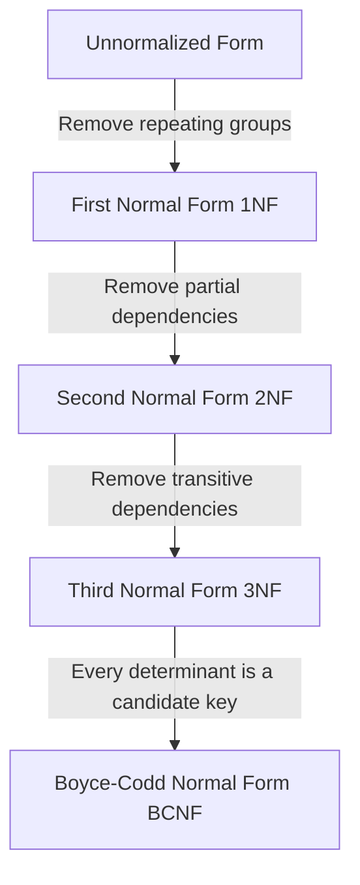
*Note: This `graph TD` diagram visually traces a relation through the stages of normalization, starting from an Unnormalized Form (UNF) and progressing through First Normal Form (1NF), Second Normal Form (2NF), Third Normal Form (3NF), and ultimately to Boyce-Codd Normal Form (BCNF). Each arrow indicates the specific type of dependency removed to achieve the next normal form.*

## Context & Framework
#### System Architecture & Dependencies
Normalization plays a critical role in shaping the internal architecture of a relational database. It ensures that attributes with a close logical relationship are grouped into the same relation, leading to a minimal number of attributes necessary to support data requirements. This process directly influences how tables are structured, how data is distributed across them, and how foreign key dependencies are established. The outcome is a database that is easier to maintain, takes up minimal storage space, and reduces the opportunities for data inconsistencies, thereby supporting robust application development.

## The Mastery Deep Dive
#### Follow the Ball: A Slow-Motion Trace
Let's trace a hypothetical relation, `StudentCourseInstructor`, through the normalization process.
**Initial State: `StudentCourseInstructor` (UNF)**
Imagine a single table containing all student, course, and instructor information, where a student can take multiple courses, and each course has an instructor. This table likely has repeating groups (e.g., student name and address repeated for every course they take), or all course details (title, credits) repeated for every student in it.
`STUDENT_COURSE_INSTRUCTOR(StudentID, StudentName, CourseID, CourseName, InstructorID, InstructorName)` (Where `CourseID`, `CourseName`, `InstructorID`, `InstructorName` is a repeating group for each `StudentID`).

1.  **To 1NF (Remove Repeating Groups):**
    We break out the repeating group into a new table or flatten the existing one. Let's flatten for simplicity here.
    `STUDENT_COURSE_INSTRUCTOR(StudentID, StudentName, CourseID, CourseName, InstructorID, InstructorName)`
    *   **Primary Key:** `(StudentID, CourseID)`
    *   *Problem:* This is 1NF, but `StudentName` depends only on `StudentID`, and `CourseName`, `InstructorID`, `InstructorName` depend only on `CourseID`. These are **partial dependencies**.

2.  **To 2NF (Remove Partial Dependencies):**
    We decompose the `STUDENT_COURSE_INSTRUCTOR` table into relations where non-primary-key attributes are fully functionally dependent on the primary key.
    *   `STUDENT(StudentID, StudentName)`
        *   PK: `StudentID`
    *   `COURSE_INSTRUCTOR(CourseID, CourseName, InstructorID, InstructorName)`
        *   PK: `CourseID`
    *   `ENROLLMENT(StudentID, CourseID)`
        *   PK: `(StudentID, CourseID)`
        *   FKs: `StudentID` references `STUDENT`, `CourseID` references `COURSE_INSTRUCTOR`
    *   *Problem:* `COURSE_INSTRUCTOR` is in 2NF, but `InstructorID` and `InstructorName` depend only on `CourseID`. Also, `InstructorName` depends on `InstructorID`. This reveals a **transitive dependency** (`CourseID → InstructorID → InstructorName`).

3.  **To 3NF (Remove Transitive Dependencies):**
    We decompose `COURSE_INSTRUCTOR` to remove the transitive dependency `CourseID → InstructorID → InstructorName`.
    *   `STUDENT(StudentID, StudentName)`
        *   PK: `StudentID`
    *   `COURSE(CourseID, CourseName, InstructorID)`
        *   PK: `CourseID`
        *   FK: `InstructorID` references `INSTRUCTOR`
    *   `INSTRUCTOR(InstructorID, InstructorName)`
        *   PK: `InstructorID`
    *   `ENROLLMENT(StudentID, CourseID)`
        *   PK: `(StudentID, CourseID)`
        *   FKs: `StudentID` references `STUDENT`, `CourseID` references `COURSE`
    *   *Result:* All relations are now in 3NF. They are minimal, attributes are logically grouped, and redundancy is minimized.

#### The Transformation: Before and After
Before normalization, we had a single, complex `STUDENT_COURSE_INSTRUCTOR` table with issues like `StudentName` repeating for every course a student took, and `CourseName` repeating for every student taking that course. After normalization to 3NF, we have multiple smaller, focused tables: `STUDENT`, `COURSE`, `INSTRUCTOR`, and `ENROLLMENT`. Each table manages a distinct set of facts, linking through foreign keys. This transformation reduces redundancy, simplifies data updates, and ensures the integrity of the data model.

## Constraints & Limitations
#### The Engineering Trade-off
While normalization is highly beneficial for data integrity and redundancy reduction, an engineering trade-off exists regarding query performance. A highly normalized database, particularly one reaching BCNF or higher, often results in many smaller tables. Retrieving comprehensive information might then require numerous JOIN operations, which can sometimes be computationally expensive. In scenarios like data warehousing or reporting systems, where read performance is paramount and updates are infrequent, designers may strategically choose to *denormalize* certain tables to reduce joins, accepting a controlled amount of redundancy for faster query execution.

## Significance & Application
Normalization is a cornerstone of relational database design, both academically and professionally. It provides a formal framework for designing robust, efficient, and consistent databases, preventing common data anomalies. In the real world, virtually every well-designed relational database, from banking systems to e-commerce platforms, utilizes normalization principles to ensure data accuracy, reduce storage costs, and simplify maintenance, leading to more reliable and scalable applications.

## The Worked Example
Consider an `ORDER_DETAILS` table:
`ORDER_DETAILS(OrderID, OrderDate, CustomerID, CustomerName, ProductID, ProductName, Price, Quantity)`
Assumed functional dependencies:
*   `OrderID` → `OrderDate`, `CustomerID`, `CustomerName`
*   `CustomerID` → `CustomerName` (transitive via `OrderID` if `OrderID` is PK)
*   `ProductID` → `ProductName`, `Price`
*   `OrderID, ProductID` → `Quantity` (composite PK for order items)

**Normalization Steps:**

1.  **UNF to 1NF:** Assume `OrderID, ProductID` is the initial key. If `ProductName` or `Price` were repeating for multiple `Quantity` values, we'd flatten or create new tables. Here, it seems already flattened.
    `ORDER_DETAILS` is in 1NF (all attributes are atomic, no repeating groups).

2.  **1NF to 2NF:** Check for partial dependencies on the primary key `(OrderID, ProductID)`.
    *   `OrderID` → `OrderDate`, `CustomerID`, `CustomerName` (Partial dependency, depends only on `OrderID`)
    *   `ProductID` → `ProductName`, `Price` (Partial dependency, depends only on `ProductID`)
    *   Remove these partial dependencies:
        *   Create `ORDERS(OrderID, OrderDate, CustomerID, CustomerName)`
        *   Create `PRODUCTS(ProductID, ProductName, Price)`
        *   Remaining: `ORDER_ITEMS(OrderID, ProductID, Quantity)`
    *   `ORDER_ITEMS` is 2NF, `ORDERS` and `PRODUCTS` are 2NF.

3.  **2NF to 3NF:** Check for transitive dependencies (non-key attributes dependent on other non-key attributes) in the 2NF relations.
    *   In `ORDERS(OrderID, OrderDate, CustomerID, CustomerName)`:
        *   `CustomerID` → `CustomerName` (Transitive dependency: `OrderID` → `CustomerID` → `CustomerName`)
    *   Remove this transitive dependency:
        *   Create `CUSTOMERS(CustomerID, CustomerName)`
        *   Update `ORDERS(OrderID, OrderDate, CustomerID)` (FK `CustomerID` references `CUSTOMERS`)
    *   Result: All tables are now in 3NF.

**Final 3NF Relations:**
*   `CUSTOMERS(CustomerID, CustomerName)`
*   `ORDERS(OrderID, OrderDate, CustomerID (FK))`
*   `PRODUCTS(ProductID, ProductName, Price)`
*   `ORDER_ITEMS(OrderID (FK), ProductID (FK), Quantity)`

## The Proving Ground
*Test your mastery. Cover the solutions below to test yourself first.*

#### Level 1: The Fact Check (Verification)
**The Question:** What is the primary purpose of normalization in database design?
> **Solution:** To produce a set of suitable relations that support the data requirements of an enterprise by minimizing data redundancy and preventing update anomalies.

#### Level 2: The Trade-off (Mastery & Edge Cases)
**The Scenario:** Explain two distinct benefits of a well-normalized database design in terms of data management.
> **Solution:**
> 1.  **Reduced Data Redundancy:** Normalization ensures that each piece of information is stored in only one place (with the exception of foreign keys), significantly reducing duplication. This minimizes storage space and ensures consistency across the database.
> 2.  **Prevention of Update Anomalies:** By eliminating redundancy, normalization removes the possibility of insertion, deletion, and modification anomalies. This makes the database easier to maintain, as updates require a minimal number of operations and are less prone to inconsistencies.

#### Level 3: The Lose-Lose Scenario (Mastery & Edge Cases)
**The Scenario:** A project manager insists on a completely unnormalized database for a new application, arguing it simplifies development and speeds up reads. As a database designer, how would you counter this argument by highlighting the long-term "lose-lose" consequences, balancing development ease with data integrity and maintenance costs?
> **Solution:** You would counter by explaining the long-term "lose-lose" consequences:
> 1.  **Data Inconsistency (Lose-Lose for Reliability):** While initial reads might seem faster (fewer joins), an unnormalized database inevitably leads to massive data redundancy. If the same piece of information is stored in multiple places, updating it in one location but not another (which is very common in complex systems) will lead to inconsistent data. This makes the data unreliable, eroding trust in the application and leading to faulty decisions, ultimately *losing* the benefit of "fast reads" if the data itself is questionable.
> 2.  **Maintenance Nightmares & Development Overhead (Lose-Lose for Productivity):** The "simplified development" argument is short-sighted. Without normalization, every update or deletion operation becomes incredibly complex and error-prone, as developers must meticulously track and modify every instance of redundant data. This leads to significantly increased development time for maintenance, bug fixing, and adding new features, *losing* valuable development time on maintenance rather than new features. Furthermore, wasted storage space and slower write operations for redundant data will eventually *lose* any perceived performance gains.
> 3.  **Scalability Challenges (Lose-Lose for Future Growth):** An unnormalized schema is difficult to scale and evolve. Adding new data types or extending functionality often requires massive schema changes and complex refactoring, incurring significant technical debt and stifling future growth, which is a *lose-lose* for the business's long-term vision.

## Key Takeaways
*   Normalization is a formal process to refine database schema, reducing redundancy and anomalies.
*   It involves stages: UNF, 1NF, 2NF, 3NF, and sometimes BCNF.
*   The primary benefits include minimizing data redundancy and preventing insertion, deletion, and modification anomalies.
*   While promoting integrity, over-normalization can sometimes lead to more complex joins, which is an engineering trade-off.

## Knowledge Graph Connections
| Concept                     | Connection / Relationship                                                                                                               |
| :
-------------------------- | :
-------------------------------------------------------------------------------------------------------------------------------------- |
| [[Data_Redundancy_and_Update_Anomalies]] | Normalization is the primary technique used to eliminate data redundancy and prevent update anomalies.                                  |
| [[Functional_Dependencies]] | Functional dependencies are the theoretical basis and primary tool used to analyze and decompose relations during normalization.           |
| [[Unnormalized_Form_UNF]]   | UNF is the starting point of the normalization process, from which a relation is progressively refined.                                   |
| [[First_Normal_Form_1NF]]   | 1NF is the first step in normalization, addressing repeating groups and atomic attributes.                                            |
| [[Second_Normal_Form_2NF]]  | 2NF builds upon 1NF by addressing partial functional dependencies.                                                                    |
| [[Third_Normal_Form_3NF]]   | 3NF builds upon 2NF by addressing transitive functional dependencies.                                                                 |
| [[Boyce_Codd_Normal_Form_BCNF]] | BCNF is a stricter form of 3NF, ensuring that every determinant is a candidate key.                                                   |
| [[Lossless_Join_and_Dependency_Preservation]] | These are critical properties that must be maintained when decomposing relations during normalization.                                |
---

---

## Translating E R To Logical Model


## Definition
Before proceeding, ensure you master Entity_Relationship_Model and Relational_Model.
Translating the E-R Model to a Logical Data Model is the process of transforming a high-level, conceptual representation of data (the Entity-Relationship model) into a more detailed, implementation-ready schema, typically a relational data model. This involves converting entities into tables, attributes into columns, and relationships into appropriate foreign key constraints or new tables, while ensuring data integrity and minimizing redundancy. Think of it as taking a blueprint of a house (E-R) and converting it into detailed construction plans (logical data model) that a builder can follow.

## The Mental Model
Imagine you have a hand-drawn sketch of a car's engine (the E-R model), showing components like "Engine Block," "Pistons," and "Crankshaft" and how they connect. Translating this to a logical model is like taking that sketch and creating a structured list of parts, specifying their material, dimensions, and how each part is bolted to another. The "Engine Block" becomes a primary table, "Pistons" might become another table with a link back to the Engine Block, and their connections become the rules for how to assemble them.

```mermaid
erDiagram
    CUSTOMER {
        CustomerID 
        CustomerName
    }
    ORDER {
        OrderID 
        OrderDate
        CustomerID
    }

    CUSTOMER ||--o{ ORDER : places
```
*Note: This `erDiagram` visually represents a simple E-R model (Customer places Order) and simultaneously illustrates its direct translation into a relational schema with `CUSTOMER` and `ORDER` tables. The relationship `places` is integrated into the `ORDER` table via a Foreign Key `CustomerID`.*

## Context & Framework
#### Opening the Hood: What's Inside?
The Entity-Relationship (E-R) model is composed of entities, attributes, and relationships. Entities represent real-world objects or concepts, attributes describe the properties of entities, and relationships define how entities are associated. When translating, each of these E-R components has a direct counterpart in the relational model. Entities transform into relations (tables), simple attributes become columns in those relations, and relationships are primarily handled by introducing foreign keys or creating new relations, depending on their cardinality and participation constraints.

## The Mastery Deep Dive
#### How the Parts Talk to Each Other
The core of E-R to relational translation lies in establishing how the conceptual parts (entities, relationships) will communicate as relational parts (tables, foreign keys). Strong entities form independent relations with their primary key. Weak entities depend on their owner's primary key to form their own composite primary key. Relationships of different cardinalities dictate whether primary keys are posted as foreign keys or if new relations are required. For instance, in a one-to-many relationship, the primary key of the 'one' side is posted as a foreign key to the 'many' side, ensuring that instances on the 'many' side can correctly reference their corresponding instance on the 'one' side.

#### The Translator: From "Lego" to "Jargon"
The translation process effectively maps the intuitive "Lego" blocks of the E-R model to the rigorous "Jargon" of the relational model. An E-R `Entity` becomes a `Relation` (or `Table`). An E-R `Attribute` becomes a `Column`. An E-R `Primary Key` remains a `Primary Key` in the relation. A `Composite Attribute` is decomposed into multiple `Columns`. A `Multi-valued Attribute` necessitates a `new Relation` with a composite primary key. Finally, `Relationships` are translated into `Foreign Keys` or `Associative Relations`, linking related tables and enforcing referential integrity.

## Constraints & Limitations
#### The Engineering Trade-off
Translating an E-R model to a logical data model involves engineering trade-offs, particularly when dealing with complex relationships like superclass/subclass hierarchies or recursive relationships. While there are standard mapping rules, choosing the most efficient and maintainable relational representation sometimes requires careful consideration of performance, storage, and future extensibility. For example, a superclass/subclass relationship can be mapped using several strategies (single table, multiple tables with shared primary key, or separate tables with foreign keys), each with its own advantages and disadvantages regarding data retrieval complexity and null value prevalence.

## Significance & Application
E-R to logical model translation is foundational in database systems. Academically, it bridges conceptual understanding with practical implementation. In real-world applications, it's the critical step where abstract business requirements are converted into a concrete, implementable database schema. This skill ensures that database designs are structurally sound, adhere to data integrity principles, and are ready for efficient data storage and retrieval in applications ranging from e-commerce to scientific research.

## The Worked Example
Let's consider a simple E-R model for a library:
*   **Entity:** `BOOK` (Attributes: `ISBN` (PK), `Title`, `PublicationYear`)
*   **Entity:** `AUTHOR` (Attributes: `AuthorID` (PK), `FirstName`, `LastName`)
*   **Relationship:** `WRITES` (Many-to-Many between BOOK and AUTHOR)

Here’s the step-by-step translation to a logical data model:

1.  **Map Strong Entities:**
    *   **BOOK Entity:** Becomes the `BOOK` relation.
        `BOOK(ISBN, Title, PublicationYear)`
        `Primary Key: ISBN`
    *   **AUTHOR Entity:** Becomes the `AUTHOR` relation.
        `AUTHOR(AuthorID, FirstName, LastName)`
        `Primary Key: AuthorID`

2.  **Map Many-to-Many Relationship (`WRITES`):**
    *   A new relation `WRITES` is created to represent this M:M relationship.
    *   It includes the primary keys of the participating entities as foreign keys.
    *   These foreign keys, combined, form the primary key of the new relation.
        `WRITES(ISBN, AuthorID)`
        `Primary Key: (ISBN, AuthorID)`
        `Foreign Key: ISBN references BOOK(ISBN)`
        `Foreign Key: AuthorID references AUTHOR(AuthorID)`

**Final Logical Model Relations:**
*   `BOOK(ISBN, Title, PublicationYear)`
*   `AUTHOR(AuthorID, FirstName, LastName)`
*   `WRITES(ISBN, AuthorID)`

## The Proving Ground
*Test your mastery. Cover the solutions below to test yourself first.*

#### Level 1: The Component Check (Verification)
**The Question:** What are the relational equivalents for an E-R entity, a simple attribute, and a one-to-many relationship?
> **Solution:** An E-R entity translates to a relation (table), a simple attribute translates to a column, and a one-to-many relationship translates to a foreign key in the 'many' side relation.

#### Level 2: The Clean Build (Mastery & Edge Cases)
**The Scenario:** You have an E-R model with `STUDENT` (StudentID (PK), StudentName, Email) and `DEPARTMENT` (DeptID (PK), DeptName). They have a 1:M relationship `ENROLLS_IN`, where a student enrolls in exactly one department, and a department can have many students. `Email` is a unique attribute. How would you represent this in a logical data model, highlighting all keys?
> **Solution:**
> `STUDENT(StudentID, StudentName, Email, DeptID)`
> `Primary Key: StudentID`
> `Candidate Key: Email`
> `Foreign Key: DeptID references DEPARTMENT(DeptID)`
>
> `DEPARTMENT(DeptID, DeptName)`
> `Primary Key: DeptID`
>
> The `DeptID` from the 'one' side (`DEPARTMENT`) is posted as a foreign key in the 'many' side (`STUDENT`) relation.

#### Level 3: The Broken System (Mastery & Edge Cases)
**The Scenario:** A designer translates an E-R model for `ORDER` (OrderID (PK), OrderDate) and `PRODUCT` (ProductID (PK), ProductName) with a M:M relationship `CONTAINS` (with attribute `Quantity`) into a relational schema. They create `ORDER(OrderID, OrderDate)`, `PRODUCT(ProductID, ProductName)`, and `CONTAINS(OrderID, Quantity)`. Identify the flaw in this translation.
> **Solution:** The flaw is in the `CONTAINS` relation. For a many-to-many relationship with an attribute, the new relation `CONTAINS` must include the primary keys of *both* participating entities (`OrderID` from `ORDER` and `ProductID` from `PRODUCT`) to form its composite primary key, in addition to its own attribute (`Quantity`). The current `CONTAINS` relation only includes `OrderID` and `Quantity`, failing to link to `PRODUCT`. The correct `CONTAINS` relation should be `CONTAINS(OrderID, ProductID, Quantity)`, with `(OrderID, ProductID)` as the composite primary key.

## Key Takeaways
*   E-R to logical model translation systematically converts conceptual entities, attributes, and relationships into relational tables, columns, and keys.
*   The primary rules involve mapping strong entities to relations, decomposing composite attributes, creating new relations for multi-valued attributes and M:M relationships, and posting foreign keys for 1:M relationships.
*   Correct translation is vital for ensuring database integrity, minimizing redundancy, and supporting efficient data management in the final relational schema.

## Knowledge Graph Connections
| Concept                     | Connection / Relationship                                                                                                               |
| :
-------------------------- | :
-------------------------------------------------------------------------------------------------------------------------------------- |
| Entity_Relationship_Model | The E-R model is the source conceptual design that is translated into the logical data model.                                           |
| Relational_Model        | The target logical data model into which E-R components are transformed.                                                                |
| [[Mapping_Entities_to_Relations]] | A specific rule applied during the overall E-R to logical model translation process.                                                |
| [[Mapping_Relationships_to_Relations]] | A specific set of rules applied during E-R to logical model translation, depending on cardinality and participation.              |
| [[Normalization_in_Database_Design]] | This process is a prerequisite to normalization, which further refines the logical data model for structural correctness.           |
---

---

## Boyce Codd Normal Form BCNF


## Definition
Before proceeding, ensure you master [[Third_Normal_Form_3NF]] and Candidate_Keys.
Boyce-Codd Normal Form (BCNF) is a stricter form of Third Normal Form (3NF) and is considered one of the highest levels of normalization. A relation (table) is in BCNF if and only if **every determinant is a candidate key**. A determinant is any attribute or set of attributes on the left-hand side of a functional dependency. While 3NF addresses functional dependencies where a non-key attribute determines another non-key attribute (transitive dependencies), BCNF goes further by ensuring that *any* attribute that determines another attribute *must* be a candidate key, even if the determined attribute is part of a candidate key. This form fully eliminates redundancy based on functional dependencies. Think of it as a rule where only the "boss" (candidate key) can give orders (determine attributes).

## The Mental Model
Imagine a specialized course registration system where a `Student` can sign up for `Courses`, and `Instructors` teach `Courses`.
*   `Student, Course → Instructor` (A student taking a course is taught by one instructor for that instance).
*   `Instructor → Course` (An instructor teaches only one specific course for simplicity, but teaches many students in it).
Here, `Instructor` determines `Course`, but `Instructor` itself is not a candidate key for the whole table `(Student, Course, Instructor)`. This would violate BCNF. To get to BCNF, you'd split this into:
*   `Student_Instructor (Student, Instructor)`
*   `Instructor_Course (Instructor, Course)`
Now, in `Instructor_Course`, `Instructor` is the "boss" (PK) and determines `Course`.

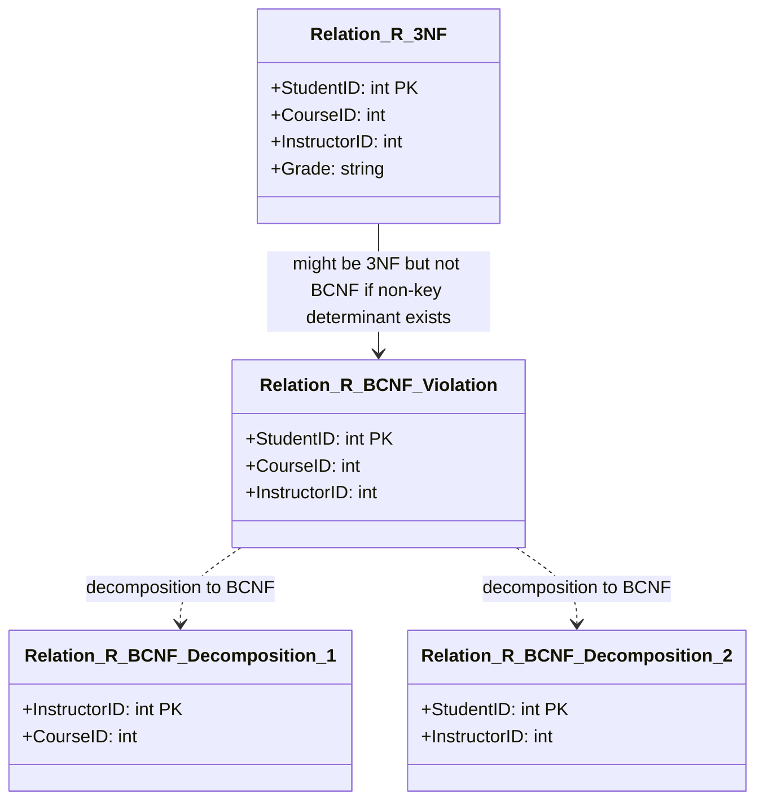
*Note: This `classDiagram` illustrates how a relation in 3NF might still violate BCNF and how it's decomposed. `Relation_R_3NF` is a hypothetical 3NF table. `Relation_R_BCNF_Violation` shows a scenario where a non-key determinant (e.g., `InstructorID`) determines another attribute (`CourseID`), even if `CourseID` is part of a candidate key, causing a BCNF violation. The dotted lines indicate the decomposition into `Relation_R_BCNF_Decomposition_1` and `Relation_R_BCNF_Decomposition_2` to achieve BCNF.*

## Context & Framework
#### The Engineering Trade-off
BCNF is typically applied to resolve extremely subtle forms of redundancy that 3NF might miss, usually involving relations with multiple, overlapping `Candidate_Keys`. While achieving BCNF ensures the highest level of normalization based on functional dependencies, it comes with an engineering trade-off: in rare cases, a BCNF decomposition might not be `Dependency_Preserving`. This means enforcing some original functional dependencies might require joining tables, which can be less efficient. Database designers must weigh the benefits of eliminating the last vestiges of redundancy against the potential for more complex dependency enforcement.

#### The Translator: From "Lego" to "Jargon"
BCNF acts as the ultimate "boss" in the normalization hierarchy, ensuring that all "orders" (functional determinations) come directly from a "boss" (candidate key). While 3NF ensures that non-key attributes don't determine other non-key attributes, BCNF expands this to say, "If anything determines anything else, the determiner *must* be a candidate key." This rigorous jargon ensures an absolute elimination of functional dependency-based redundancy. If a dependency `A → B` exists, and `A` is not a candidate key, it's like a non-boss giving orders, and BCNF fixes this by restructuring the "chain of command."

## The Mastery Deep Dive
#### Rules for Boyce-Codd Normal Form (BCNF)
A relation is in BCNF if and only if:
*   **Every determinant is a candidate key.**

**Key Concepts:**
*   **Determinant:** Any attribute or set of attributes on the left-hand side of a functional dependency.
*   **Candidate Key:** An attribute or set of attributes that uniquely identifies tuples in a relation. A relation can have multiple candidate keys, and one is chosen as the primary key.

#### Difference between 3NF and BCNF
*   **3NF allows:** A functional dependency `A → B` to exist if `B` is a primary-key attribute (or part of a primary key) AND `A` is not a candidate key. This means 3NF permits a non-key attribute to determine a *part* of a candidate key, as long as the determined attribute is a prime attribute (part of *some* candidate key).
*   **BCNF insists:** For the same `A → B` dependency, `A` **must** be a candidate key (or superkey). BCNF is stricter and does not make exceptions for primary-key attributes.

**When does a 3NF relation *not* satisfy BCNF?**
A relation can be in 3NF but not in BCNF when:
1.  The relation has two (or more) composite candidate keys.
2.  The candidate keys overlap (i.e., share at least one common attribute).
3.  A non-prime attribute determines a prime attribute (a part of a candidate key).
4.  A non-key attribute determines a part of a candidate key, AND the determinant is not itself a candidate key.

This scenario is quite rare in practice.

**Example of a BCNF Violation:**
Consider `STUDENT_COURSE_INSTRUCTOR(StudentID, CourseID, InstructorID)`.
Assume FDs:
1.  `(StudentID, CourseID)` → `InstructorID` (Primary Key: `(StudentID, CourseID)`)
2.  `InstructorID` → `CourseID` (An instructor teaches only one course, but many students can take it).

*   This relation is in 3NF because there are no transitive dependencies (no non-key attribute determines another non-key attribute). `InstructorID` determines `CourseID`, but `CourseID` is part of the primary key.
*   However, it violates BCNF. The determinant `InstructorID` determines `CourseID`, but `InstructorID` is **not** a candidate key for the `STUDENT_COURSE_INSTRUCTOR` relation (because `InstructorID` alone cannot uniquely identify `StudentID`).

#### Converting 3NF to BCNF (Decomposition)
To convert a relation from 3NF to BCNF, the violating functional dependency (`A → B`, where `A` is not a candidate key) needs to be removed by decomposition.
**Steps:**
1.  Identify the functional dependency `A → B` where `A` is a determinant but not a candidate key.
2.  Create a **new relation** with `A` as its primary key and `B` as its non-key attribute(s).
3.  Remove `B` from the original relation.
4.  Ensure `A` remains in the original relation as a foreign key, referencing the primary key of the new relation.

**Applying to `STUDENT_COURSE_INSTRUCTOR` example:**
*   Violating FD: `InstructorID → CourseID` (Determinant `InstructorID` is not a candidate key).
*   New relation: `INSTRUCTOR_COURSE(InstructorID, CourseID)`. `InstructorID` is PK.
*   Remove `CourseID` from `STUDENT_COURSE_INSTRUCTOR`.
*   Original relation: `STUDENT_INSTRUCTOR(StudentID, InstructorID)`. `InstructorID` is an FK to `INSTRUCTOR_COURSE`.

**Resulting BCNF relations:**
*   `INSTRUCTOR_COURSE(InstructorID, CourseID)`
*   `STUDENT_INSTRUCTOR(StudentID, InstructorID)`

## Constraints & Limitations
#### The Engineering Trade-off
The major limitation of BCNF is that achieving it might sometimes lead to a **loss of dependency preservation**. This means that after decomposition to BCNF, some original functional dependencies might not be enforceable solely by checking the individual decomposed relations; you might need to join tables to verify them. This is the classic trade-off between achieving the highest possible normal form (BCNF, eliminating all redundancy due to FDs) and maintaining dependency preservation (which simplifies integrity checking). In practice, if dependency preservation is critical, designers might opt to stay in 3NF, even if a BCNF violation exists.

## Significance & Application
BCNF provides the most stringent criteria for eliminating data redundancy based on functional dependencies. Academically, it represents a deeper understanding of functional dependencies and their implications for schema design. Practically, BCNF is most relevant for highly sensitive or complex databases where even subtle forms of redundancy are unacceptable, and where the trade-off of potentially losing dependency preservation is carefully considered against the benefits of maximum redundancy elimination. It is particularly valuable for analytical systems or scenarios where update anomalies must be absolutely minimized.

## The Worked Example
Consider a relation `CLIENT_ADVISOR(ClientID, AdvisorName, AdvisorLocation)`.
Assume functional dependencies:
1.  `ClientID` → `AdvisorName` (Each client has one advisor)
2.  `AdvisorName` → `AdvisorLocation` (Each advisor is based at one location)
3.  `(ClientID, AdvisorName)` is a candidate key (meaning a client can only be advised by a specific advisor once).
4.  `ClientID → AdvisorLocation` (Transitive through `AdvisorName`).

This relation is in 3NF (no transitive dependencies via `ClientID` as the primary key, `AdvisorName` is a non-key attribute that determines `AdvisorLocation` but `AdvisorName` is not a prime attribute here as per 3NF definition).
However, it violates BCNF:
The determinant `AdvisorName` determines `AdvisorLocation`, but `AdvisorName` is **not** a candidate key for `CLIENT_ADVISOR`.

**Decomposition to BCNF:**

1.  Identify violating FD: `AdvisorName → AdvisorLocation`. `AdvisorName` is the determinant, but not a candidate key for `CLIENT_ADVISOR`.
2.  Create a new relation for the violating FD:
    `ADVISOR_DETAILS(AdvisorName, AdvisorLocation)`. `AdvisorName` is PK.
3.  Remove `AdvisorLocation` from `CLIENT_ADVISOR`.
4.  `AdvisorName` remains in `CLIENT_ADVISOR` as a foreign key.

**Resulting BCNF relations:**
*   `CLIENT(ClientID, AdvisorName (FK))`
*   `ADVISOR_DETAILS(AdvisorName, AdvisorLocation)`

## The Proving Ground
*Test your mastery. Cover the solutions below to test yourself first.*

#### Level 1: The Fact Check (Verification)
**The Question:** What is the defining rule for a relation to be in Boyce-Codd Normal Form (BCNF)?
> **Solution:** A relation is in BCNF if and only if every determinant is a candidate key.

#### Level 2: The Sort (Mastery & Edge Cases)
**The Scenario:** Explain the key difference between a relation in 3NF and one in BCNF, providing a scenario where a 3NF relation might not be in BCNF.
> **Solution:**
> **Key Difference:**
> *   **3NF** focuses on eliminating transitive dependencies (where a non-key attribute determines another non-key attribute). It allows certain functional dependencies `A → B` where `A` is not a candidate key, specifically if `B` is a prime attribute (part of *some* candidate key).
> *   **BCNF** is stricter. It requires that *every* determinant (left-hand side of an FD) in the relation must be a candidate key. It makes no exceptions for prime attributes.
>
> **Scenario where 3NF is not BCNF:**
> Consider a relation `TEACHING(Student, Subject, Instructor)`.
> Assume:
> 1.  `Student, Subject → Instructor` (PK: `(Student, Subject)`) - A student taking a subject has a specific instructor.
> 2.  `Instructor → Subject` (An instructor teaches only one subject, but teaches many students in it).
>
> This relation is in 3NF because there are no transitive dependencies (no non-key attribute determines another non-key attribute).
> However, it is **not in BCNF** because `Instructor` is a determinant (`Instructor → Subject`), but `Instructor` is **not** a candidate key for the `TEACHING` relation (an instructor teaches many students). This violates the BCNF rule that every determinant must be a candidate key.

#### Level 3: The Impostor (Mastery & Edge Cases)
**The Scenario:** You have a `STUDENT_ADVISOR` relation with attributes `StudentID`, `AdvisorID`, `CourseCode`. The candidate keys are `(StudentID, CourseCode)` and `(AdvisorID, CourseCode)`. There's also a dependency `AdvisorID → StudentID`. A colleague states this relation is in 3NF and therefore also in BCNF. Identify if this is a "False Friend" and explain why this 3NF relation is not in BCNF.
> **Solution:** This is a **"False Friend"** statement.
>
> **Explanation:**
> 1.  **Is it in 3NF?** Yes, it is. There are no non-prime attributes that are transitively dependent on the primary key, nor are there non-prime attributes partially dependent on the primary key (assuming a primary key of `(StudentID, CourseCode)` or `(AdvisorID, CourseCode)`).
> 2.  **Is it in BCNF?** No, it is **not** in BCNF.
>     *   The functional dependency `AdvisorID → StudentID` exists.
>     *   Here, `AdvisorID` is a determinant.
>     *   However, `AdvisorID` by itself is **not a candidate key** for the `STUDENT_ADVISOR` relation (since it cannot uniquely determine `CourseCode`).
>     *   Since a determinant (`AdvisorID`) is not a candidate key, the relation violates the BCNF rule.
>
> This is a classic example of a relation that is in 3NF but not in BCNF, specifically because a non-candidate-key attribute (`AdvisorID`) determines another prime attribute (`StudentID`, which is part of candidate key `(StudentID, CourseCode)`).

## Key Takeaways
*   BCNF is the strictest normal form, requiring every determinant to be a candidate key.
*   A relation can be in 3NF but not BCNF, typically when multiple overlapping candidate keys exist, and a non-candidate-key determinant exists.
*   Converting to BCNF involves decomposition, which might sometimes lead to a loss of `Dependency_Preservation`.
*   BCNF eliminates all redundancy based on functional dependencies, offering the highest level of structural integrity for FDs.

## Knowledge Graph Connections
| Concept                     | Connection / Relationship                                                                                                               |
| :
-------------------------- | :
-------------------------------------------------------------------------------------------------------------------------------------- |
| [[Third_Normal_Form_3NF]]   | BCNF is a stricter normal form that refines relations beyond the requirements of 3NF, addressing subtle redundancy issues.                |
| [[Normalization_in_Database_Design]] | BCNF represents one of the highest levels in the overall process of database normalization.                                           |
| [[Functional_Dependencies]] | BCNF's definition is entirely based on functional dependencies, specifically that all determinants must be candidate keys.                |
| Candidate_Keys          | Understanding candidate keys is crucial for applying BCNF, as every determinant in a BCNF relation must be a candidate key.             |
| [[Data_Redundancy_and_Update_Anomalies]] | BCNF aims to eliminate all remaining forms of data redundancy that are based on functional dependencies, thus preventing update anomalies. |
| [[Lossless_Join_and_Dependency_Preservation]] | Achieving BCNF often ensures lossless-join, but it may sometimes compromise dependency preservation, which is a key engineering trade-off. |
---

---

## Characteristics Of Functional Dependencies


## Definition
Before proceeding, ensure you master [[Functional_Dependencies]] and Primary_Keys.
The characteristics of functional dependencies (FDs) describe the specific properties that make them useful for database normalization. Key characteristics include: they are a property of the meaning (semantics) of attributes, they must hold for all possible values in a relation (not just sample data), and their determinants (the left-hand side) should be **minimal**. This minimality leads to the concept of **full functional dependency**, where an attribute B is fully functionally dependent on A if B depends on A but not on any proper subset of A. Understanding these characteristics is crucial for correctly identifying FDs and applying normalization rules. Think of it like a legal contract: it defines precise terms, applies universally (not just specific cases), and its conditions must be as concise as possible.

## The Mental Model
Imagine you have a compound key for a lock, like "Key A + Key B." If both Key A and Key B are needed to open the lock, then the lock's opening is `fully functionally dependent` on "Key A + Key B." If Key A alone could also open the lock, then the lock's opening is *partially* dependent on "Key A + Key B" because Key A is a `proper subset` (a part) of the compound key. Normalization wants only "full" dependencies on the primary key to avoid problems.

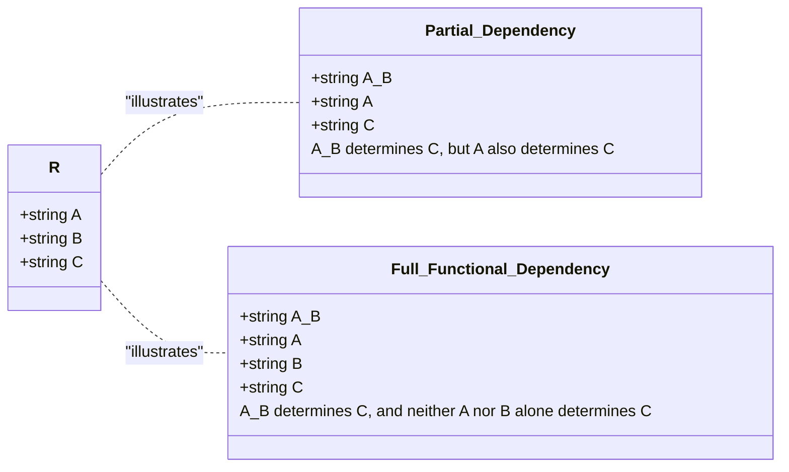
*Note: This `classDiagram` visually compares Partial Dependency and Full Functional Dependency. It shows that for a Partial Dependency (`A + B --> C`), a subset of the determinant (`A --> C`) also determines the dependent attribute. In contrast, for a Full Functional Dependency (`A + B --> C`), no proper subset of the determinant (`A` or `B` individually) determines `C`, emphasizing minimality.*

## Context & Framework
#### How the Parts Talk to Each Other
The characteristics of functional dependencies dictate how attributes "talk" to each other within a relation. For example, the `staffNo` attribute uniquely determines `sName`. This is a property of the data's meaning, not just a coincidence in a few records. The `determinant` (left-hand side) acts as the speaker, and the `dependent` (right-hand side) is the listener, consistently responding with one piece of information. This framework is vital because it formalizes the implicit business rules and data relationships, making them explicit and amenable to the systematic analysis required by normalization.

#### The Translator: From "Lego" to "Jargon"
The concept of "full functional dependency" is a direct translation from the intuitive idea of "all parts of the key are necessary" into formal database jargon. If a composite primary key `(StudentID, CourseID)` determines `Grade`, then `Grade` is fully functionally dependent on `(StudentID, CourseID)` if neither `StudentID` alone nor `CourseID` alone can determine `Grade`. This precision, moving from a general understanding to a strict definition, is crucial for `Second Normal Form (2NF)`, which specifically targets and removes partial functional dependencies.

## The Mastery Deep Dive
#### Property of Semantics (Meaning)
*   **The Rule:** Functional dependencies are a property of the *meaning* or *semantics* of the attributes within a relation. They are derived from the real-world business rules, not just observed data.
*   **Example:** `ISBN → Title`. The `ISBN` (International Standard Book Number) *by definition* uniquely identifies a book's `Title`. You wouldn't expect two different books to share the same `ISBN`. This is a semantic rule.
*   **Why it Matters:** Relying solely on sample data to infer FDs is risky, as a sample might coincidentally satisfy a dependency that doesn't hold for all possible future data.

#### Holds for All Time
*   **The Rule:** A functional dependency `A → B` must hold for *all possible* values that can ever exist in the relation, not just the current snapshot of data.
*   **Example:** In a `STAFF` table, if `staffNo='S001'` is `sName='John Doe'` and `staffNo='S002'` is `sName='Jane Smith'`, you might infer `sName → staffNo` from *this sample*. But if a new `staffNo='S003'` is also `sName='John Doe'` (different person, same name), then `sName → staffNo` is violated.
*   **Why it Matters:** Database design must be robust for future data, not just current data. FDs are design constraints, not just observations.

#### Minimal Determinant (Full Functional Dependency)
*   **The Rule:** The determinant (the attribute or group of attributes on the left-hand side of the `→`) must have the minimal number of attributes necessary to maintain the functional dependency with the attribute(s) on the right-hand side. This is called **full functional dependency**.
*   **Formal Definition:** An attribute B is **fully functionally dependent** on attribute A (or a set of attributes A) if B is functionally dependent on A, but **not** on any proper subset of A.
    *   **Partial Functional Dependency:** Occurs when a non-key attribute is dependent on only *part* of a composite primary key. This violates `Second Normal Form (2NF)`.
*   **Example:** Consider `ORDER_ITEM(OrderID, ProductID, OrderDate, ProductName)`.
    *   Assume `(OrderID, ProductID)` is the primary key.
    *   `OrderID → OrderDate` (Partial dependency: `OrderDate` depends only on `OrderID`, not `ProductID`).
    *   `ProductID → ProductName` (Partial dependency: `ProductName` depends only on `ProductID`, not `OrderID`).
    *   ` (OrderID, ProductID) → ProductName` (This holds, but `ProductName` is *also* dependent on `ProductID` alone, so `ProductName` is **partially functionally dependent** on `(OrderID, ProductID)`).
    *   **Full FD Example:** If `(EmployeeID, ProjectID)` determines `HoursWorked`, and neither `EmployeeID` alone nor `ProjectID` alone determines `HoursWorked`, then `HoursWorked` is fully functionally dependent on `(EmployeeID, ProjectID)`.
*   **Why it Matters:** Eliminating partial functional dependencies is the core objective of 2NF, as they introduce redundancy and update anomalies.

## Constraints & Limitations
#### The Engineering Trade-off
The critical limitation in applying these characteristics is the reliance on the database designer's semantic understanding. If business rules are ambiguous, incomplete, or incorrectly interpreted, even a rigorous application of these characteristics can lead to an incorrect set of FDs, and consequently, a suboptimal or flawed normalized schema. This emphasizes the importance of thorough requirements gathering and close collaboration with domain experts.

## Significance & Application
Understanding the characteristics of FDs is paramount for proper database normalization. Academically, it formalizes the conditions under which normal forms are violated and how to correct them. Professionally, database designers use these properties to accurately identify redundancies, predict update anomalies, and decompose relations correctly to achieve higher normal forms, resulting in efficient, consistent, and maintainable databases.

## The Worked Example
Consider a relation `EMP_PROJ_SKILL(EmpID, ProjID, EmpName, ProjName, Skill)`
Assume the primary key is `(EmpID, ProjID, Skill)`.
And the following business rules/functional dependencies:
1.  `EmpID` → `EmpName` (Each employee ID determines one employee name)
2.  `ProjID` → `ProjName` (Each project ID determines one project name)
3.  `(EmpID, ProjID, Skill)` → `EmpName, ProjName` (The full key determines all attributes)

Let's analyze the dependencies against the "Full Functional Dependency" characteristic:

*   `EmpID` → `EmpName` is a **partial functional dependency** because `EmpName` depends on `EmpID`, which is a proper subset of the primary key `(EmpID, ProjID, Skill)`.
*   `ProjID` → `ProjName` is also a **partial functional dependency** because `ProjName` depends on `ProjID`, which is a proper subset of the primary key `(EmpID, ProjID, Skill)`.

These partial dependencies indicate that the table is not in Second Normal Form (2NF) and needs decomposition to resolve the redundancy they cause. For example, `EmpName` would be repeated for every project and skill an employee has.

## The Proving Ground
*Test your mastery. Cover the solutions below to test yourself first.*

#### Level 1: The Fact Check (Verification)
**The Question:** What does "full functional dependency" imply about the determinant of a functional dependency?
> **Solution:** It implies that the determinant (the left-hand side) has the minimal number of attributes necessary to maintain the functional dependency with the attribute(s) on the right-hand side, meaning the dependent attribute does not depend on any *proper subset* of the determinant.

#### Level 2: The Sort (Mastery & Edge Cases)
**The Scenario:** Distinguish between a partial functional dependency and a full functional dependency using a clear example for each.
> **Solution:**
> *   **Partial Functional Dependency:** Occurs when a non-key attribute is functionally dependent on only *part* of a composite primary key.
>     *   *Example:* In `ORDER_DETAILS(OrderID, ProductID, OrderDate, ProductName)`, with primary key `(OrderID, ProductID)`, `OrderDate` is partially functionally dependent on `OrderID` because `OrderID → OrderDate` holds, and `OrderID` is a proper subset of the primary key.
> *   **Full Functional Dependency:** Occurs when a non-key attribute is functionally dependent on an entire composite primary key, and not on any proper subset of that key.
>     *   *Example:* In `ASSIGNMENT(EmployeeID, ProjectID, HoursWorked)`, with primary key `(EmployeeID, ProjectID)`, `HoursWorked` is fully functionally dependent on `(EmployeeID, ProjectID)` if neither `EmployeeID` alone nor `ProjectID` alone determines `HoursWorked`.

#### Level 3: The Impostor (Mastery & Edge Cases)
**The Scenario:** You are analyzing a relation `ORDER_ITEM(OrderID, ItemID, OrderDate, ItemName, Price)`. A colleague claims that `OrderID, ItemID → Price` is a full functional dependency. Identify if this is a "False Friend" statement and explain why, considering that `ItemID` alone determines `ItemName` and `Price`.
> **Solution:** This is a **"False Friend"** statement.
>
> **Explanation:** The claim that `OrderID, ItemID → Price` is a *full* functional dependency is incorrect because `Price` is functionally dependent on `ItemID` alone (`ItemID → Price`). Since `ItemID` is a proper subset of the determinant `(OrderID, ItemID)`, the dependency `OrderID, ItemID → Price` is actually a **partial functional dependency**, not a full one. `Price` does not require the `OrderID` component of the composite key for its determination. This situation indicates a violation of Second Normal Form (2NF).

## Key Takeaways
*   Functional dependencies are semantic properties, holding for all time, not just sample data.
*   The determinant of an FD should be minimal.
*   **Full functional dependency** means a dependent attribute relies on the *entire* determinant, not just a subset.
*   **Partial functional dependency** (where a dependent attribute relies on only a *part* of a composite key) is a common violation of 2NF.

## Knowledge Graph Connections
| Concept                     | Connection / Relationship                                                                                                               |
| :
-------------------------- | :
-------------------------------------------------------------------------------------------------------------------------------------- |
| [[Functional_Dependencies]] | These characteristics define the properties and validity of functional dependencies.                                                    |
| Primary_Keys            | Understanding full functional dependency is crucial when dealing with composite primary keys in relation to 2NF.                         |
| [[Second_Normal_Form_2NF]]  | The definition of 2NF directly relies on the concept of full functional dependency, specifically addressing partial dependencies.          |
| Partial_Functional_Dependency | Partial functional dependency is a key characteristic that, when present, indicates a violation of 2NF.                               |
| [[Data_Redundancy_and_Update_Anomalies]] | Identifying partial functional dependencies helps in understanding and eliminating sources of data redundancy and anomalies.         |
| [[Normalization_in_Database_Design]] | These characteristics provide the analytical tools required to perform effective normalization.                                   |
---

---

## Data Redundancy And Update Anomalies


## Definition
Before proceeding, ensure you master [[Normalization_in_Database_Design]] and Relational_Tables.
Data redundancy refers to the undesirable situation in a database where the same piece of information is stored multiple times in multiple places. While some redundancy is necessary (e.g., foreign keys), excessive and uncontrolled redundancy can lead to significant problems known as update anomalies. Update anomalies are inconsistencies or errors that can arise when data in a redundant database is inserted, deleted, or modified, because not all copies of the redundant data are updated consistently. Think of it like having the same phone number written on three different contact lists; if you change your number on one list but forget the others, you now have inconsistent information.

## The Mental Model
Imagine you have a company's staff list printed out. If each employee's record includes their branch's full address (e.g., "Main Street, City A"), and 50 employees work at that branch, the address "Main Street, City A" is written 50 times. This is `Data Redundancy`. Now, what if the branch moves to a new address? You'd have to find and update all 50 employee records. If you miss even one, you have an `Update Anomaly` – some employees point to the old address, some to the new. This is why normalization breaks this into two lists: one for "Employees" and one for "Branches," with Employees just having a "Branch ID" to link them.

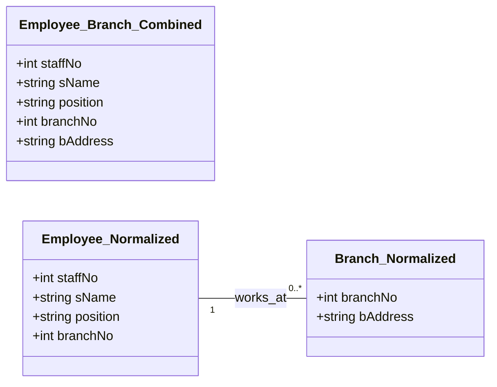
*Note: This `classDiagram` illustrates the concept of data redundancy and how normalization addresses it. `Employee_Branch_Combined` shows an unnormalized scenario where branch details are repeated for each employee. `Employee_Normalized` and `Branch_Normalized` demonstrate the normalized approach, where `branchNo` acts as a foreign key in `Employee_Normalized`, minimizing redundancy.*

## Context & Framework
#### How to Break It (The Villain's Plan)
Data redundancy lays the perfect groundwork for update anomalies, which can be thought of as "the villain's plan" to undermine data integrity. When information is duplicated, any operation (insert, delete, modify) that affects one copy but not all copies introduces inconsistency. This framework explains why a database designer's major aim is to group attributes into relations to minimize this redundancy. The consequences of these anomalies range from inaccurate reporting to application failures, making the elimination of redundancy a critical goal in database design.

#### The Engineering Trade-off
Implementing a database with minimal data redundancy (achieved through normalization) offers substantial engineering benefits. It drastically reduces the number of operations required to update data, which in turn significantly lowers the opportunities for data inconsistencies. This translates directly to more reliable data and simplified application logic. Furthermore, by storing each piece of unique information only once, the database requires less file storage space, leading to minimized costs and more efficient resource utilization. This trade-off prioritizes data integrity and long-term maintainability over potentially faster (but risky) denormalized read operations.

## The Mastery Deep Dive
#### The Villain's Plan: How Data Redundancy Leads to Anomalies
Data redundancy, while seemingly benign, is the root cause of **update anomalies**, which are inconsistencies arising from operations on a database. There are three main types:

1.  **Insertion Anomaly:**
    *   **The Problem:** Occurs when you cannot insert a new record without also inserting information about another, unrelated entity. Or, conversely, you cannot add information about one entity without having complete information about another.
    *   **Example:** In a `StaffBranch` table (`staffNo, sName, branchNo, bAddress`), you cannot add a new `Branch` (`branchNo, bAddress`) unless there is at least one `Staff` member to assign to it. If you try to add a new branch with no staff, you'd have to insert null values for staff attributes, which is problematic if `staffNo` is part of the primary key.
    *   **Consequence:** Impossibility of recording certain facts, or forced (and potentially invalid) data entry.

2.  **Deletion Anomaly:**
    *   **The Problem:** Occurs when deleting a record results in the unintended loss of other, crucial data that was associated with the deleted record.
    *   **Example:** In the `StaffBranch` table, if the last `Staff` member assigned to a specific `Branch` is deleted, all information about that `Branch` (`branchNo, bAddress`) might also be inadvertently deleted, even if the branch still exists and is important.
    *   **Consequence:** Loss of dependent data, resulting in incomplete information.

3.  **Modification Anomaly (Update Anomaly):**
    *   **The Problem:** Occurs when updating a piece of data requires multiple changes across different records, and if even one change is missed, it leads to inconsistencies.
    *   **Example:** In the `StaffBranch` table, if the `bAddress` for `branchNo 'B001'` needs to be changed, and there are 20 staff members assigned to `B001`, you would have to update `bAddress` in all 20 staff records. If you only update 19, the database now contains two different addresses for `branchNo 'B001'`.
    *   **Consequence:** Data inconsistency, which means different parts of the database (or different reports) will show conflicting information.

#### The Shield: How Normalization Stops the Villain
Normalization is the "shield" against these anomalies. By systematically decomposing relations into smaller, well-structured relations, it ensures that each non-key attribute is fully functionally dependent on the primary key, and no non-key attribute is transitively dependent on the primary key. This process ensures:
*   Each piece of information is stored in only one place (or as part of a foreign key for linking).
*   New information about one entity can be added without needing data about another (solving insertion anomalies).
*   Deleting information about one entity does not accidentally delete information about another (solving deletion anomalies).
*   Updating information only requires a single change in one location (solving modification anomalies).
This decomposition maintains the lossless-join and dependency preservation properties, ensuring that the original information can always be accurately reconstructed from the normalized tables.

## Constraints & Limitations
#### The Engineering Trade-off
While normalization effectively eliminates data redundancy and update anomalies, a perceived limitation or engineering trade-off is the potential for increased complexity in querying. Retrieving comprehensive information that spans multiple entities (e.g., "all staff members and their branch addresses") requires joining several tables, which can sometimes be more complex to write and potentially slightly slower than querying a single, denormalized table. However, this trade-off is generally accepted because the benefits of data integrity, reduced storage, and ease of maintenance far outweigh the minor performance implications for most transactional databases.

## Significance & Application
Understanding data redundancy and update anomalies is foundational to database design. Academically, it motivates the need for normalization. Professionally, it guides designers to create robust systems where data is reliable and consistent. In real-world applications (e.g., banking, healthcare, e-commerce), preventing these anomalies is critical to avoid financial errors, incorrect patient diagnoses, or failed transactions, directly impacting business operations and user trust.

## The Worked Example
Consider a simplified `ORDERS_PRODUCTS` table:
`ORDERS_PRODUCTS(OrderID, CustomerID, CustomerName, OrderDate, ProductID, ProductName, ProductPrice, Quantity)`

Assume the following:
*   `OrderID, ProductID` is the primary key (PK).
*   `OrderID` -> `CustomerID`, `CustomerName`, `OrderDate`
*   `CustomerID` -> `CustomerName`
*   `ProductID` -> `ProductName`, `ProductPrice`

**Data Redundancy:**
*   `CustomerName` is repeated for every order placed by the same `CustomerID`.
*   `OrderDate` is repeated for every product within the same `OrderID`.
*   `ProductName` and `ProductPrice` are repeated for every `ProductID` in an `ORDER`.

**Update Anomalies Illustration:**

1.  **Insertion Anomaly:**
    *   You cannot add a new `Product` (`ProductID, ProductName, ProductPrice`) to the database unless it is part of an existing `OrderID`. If a new product is added to inventory but hasn't been ordered yet, it cannot be recorded.

2.  **Deletion Anomaly:**
    *   If `OrderID='100'` is deleted because the customer canceled, and `ProductID='P1'` was only in `OrderID='100'`, then all information about `P1` (`ProductName`, `ProductPrice`) is lost from the database.

3.  **Modification Anomaly:**
    *   If `CustomerName` for `CustomerID='C1'` needs to be changed (e.g., due to a marriage), you would have to update `CustomerName` in every record where `CustomerID='C1'` appears. Forgetting to update even one record would lead to `C1` having two different names in the database.

## The Proving Ground
*Test your mastery. Cover the solutions below to test yourself first.*

#### Level 1: The Fact Check (Verification)
**The Question:** Define data redundancy in the context of relational databases.
> **Solution:** Data redundancy is the storage of the same piece of information multiple times in different places within a database.

#### Level 2: The Trade-off (Mastery & Edge Cases)
**The Scenario:** Describe the three main types of update anomalies (insertion, deletion, modification) and provide a small example for each that illustrates the problem.
> **Solution:**
> 1.  **Insertion Anomaly:** The inability to insert a new record without simultaneously entering information about another, unrelated entity. *Example: In a combined `Employee_Department` table where `Department_Name` repeats for each employee, you cannot add a new department until an employee is assigned to it (if `EmployeeID` is part of the primary key).*
> 2.  **Deletion Anomaly:** The unintended loss of critical data when a record is deleted because other, dependent data was stored redundantly within that record. *Example: If the last employee in a `Department` is deleted from a `Employee_Department` table, all information about that `Department` (e.g., `Department_Location`) might also be lost.*
> 3.  **Modification Anomaly:** The need to make multiple changes across different records to update a single piece of information, leading to inconsistencies if all copies are not updated. *Example: If a `Project` title is stored with every `Employee` assigned to it, and the `Project` title changes, every employee's record for that project needs to be updated. Missing one update leads to inconsistent project titles.*

#### Level 3: The Lose-Lose Scenario (Mastery & Edge Cases)
**The Scenario:** Your team has inherited an existing database with significant data redundancy. The lead developer suggests ignoring it to meet a tight deadline for a new feature. Explain how proceeding with this redundancy could lead to a "lose-lose" situation for future development and data reliability.
> **Solution:** Proceeding with significant data redundancy to meet a deadline is a "lose-lose" for future development and data reliability due to:
> 1.  **Increased Future Development Costs (Lose for Productivity):** Any new feature requiring data modification will encounter the update anomaly problem. Developers will constantly have to write complex, error-prone code to ensure all redundant copies of data are updated consistently, or risk data integrity issues. This means simple changes become difficult, time-consuming, and expensive, *losing* valuable development time on maintenance rather than new features.
> 2.  **Unreliable Data (Lose for Trust and Decision-Making):** The inherent risk of modification anomalies means that data inconsistencies are highly likely. Different reports or parts of the application could show conflicting information (e.g., a customer's address being different in their order history vs. their profile). This directly impacts data reliability, leading to bad business decisions, customer dissatisfaction, and a *loss* of trust in the system's data, making any "fast reads" effectively worthless if the information itself is incorrect.

## Key Takeaways
*   Data redundancy is the undesirable duplication of information.
*   It leads to update anomalies: insertion, deletion, and modification.
*   These anomalies cause data inconsistencies, loss of data, and difficulty in maintaining the database.
*   Minimizing redundancy is a primary goal of relational database design, achieved through normalization.

## Knowledge Graph Connections
| Concept                     | Connection / Relationship                                                                                                               |
| :
-------------------------- | :
-------------------------------------------------------------------------------------------------------------------------------------- |
| [[Normalization_in_Database_Design]] | Normalization is the technique explicitly designed to minimize data redundancy and prevent update anomalies.                                |
| Relational_Tables       | Update anomalies manifest as problems within unnormalized or poorly designed relational tables.                                           |
| [[First_Normal_Form_1NF]]   | 1NF addresses issues related to repeating groups, which contribute to redundancy.                                                       |
| [[Second_Normal_Form_2NF]]  | 2NF tackles partial functional dependencies, which are a source of redundancy leading to anomalies.                                       |
| [[Third_Normal_Form_3NF]]   | 3NF eliminates transitive functional dependencies, further reducing redundancy and avoiding anomalies.                                  |
---

---

## First Normal Form 1NF


## Definition
Before proceeding, ensure you master [[Unnormalized_Form_UNF]] and Attributes.
First Normal Form (1NF) is the most basic level of database normalization. A relation (table) is in 1NF if and only if the intersection of each row and column contains one and only one atomic value. This means that: 1. There are no repeating groups within the table. 2. Each column contains only single, indivisible values (i.e., no multi-valued attributes stored in a single cell). 3. All attributes are related to the primary key. Achieving 1NF eliminates a significant source of data redundancy and sets the foundation for higher normal forms. Think of it as ensuring every cell in your spreadsheet contains just one piece of information, not a list.

## The Mental Model
Imagine you have a shopping list for a party. If your list looks like: "Guest 1: Milk, Eggs, Bread; Guest 2: Chips, Soda", this is `UNF` because the items are a `repeating group`. To get to `1NF`, you'd break it down so each item for each guest is on its own separate line: "Guest 1: Milk; Guest 1: Eggs; Guest 1: Bread; Guest 2: Chips; Guest 2: Soda". Now, each "cell" (Guest/Item pairing) has just one piece of information, and there are no lists inside other lists.

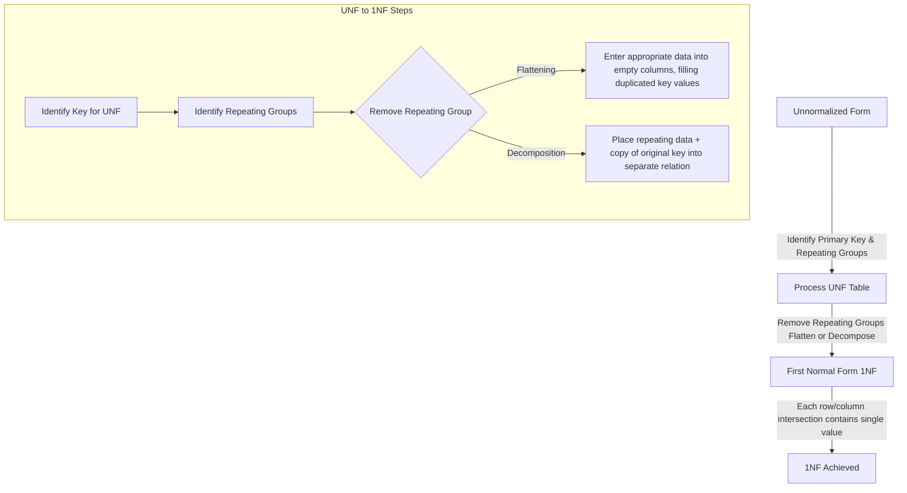
*Note: This `graph TD` diagram illustrates the transformation process from Unnormalized Form (UNF) to First Normal Form (1NF). It highlights the key steps of identifying repeating groups and then shows two methods (flattening or decomposing) to remove them, ensuring that each cell in the resulting 1NF table contains only a single atomic value.*

## Context & Framework
#### System Architecture & Dependencies
Achieving First Normal Form is the initial architectural clean-up of a database schema. It fundamentally changes how data is structured by removing repeating groups, which often represent implicit one-to-many relationships hidden within a single row. This process creates a flatter, more structured set of tables where each column holds atomic values. This newfound atomicity is crucial because it allows for the explicit definition of functional dependencies and proper primary key identification, which are dependencies for achieving higher normal forms and building a robust database architecture.

#### The "Pilot's Checklist" (Do Not Skip)
The conversion from UNF to 1NF is a critical "pilot's checklist" item that must be executed meticulously. It directly addresses the most egregious forms of data redundancy and ambiguity. The two primary methods—flattening the table or placing repeating data into a separate relation—are essential tools. Flattening involves duplicating the primary key of the original table for each entry in the repeating group, filling in otherwise empty cells. Decomposing involves creating a new table for the repeating group, using the original primary key (as a foreign key) and the repeating group's identifier (or the entire group if no identifier) to form a new primary key.

## The Mastery Deep Dive
#### Rules for First Normal Form (1NF)
A relation is in 1NF if and only if:
1.  **No Repeating Groups:** Each intersection of a row and column contains only one value. There are no sets of attributes that repeat within a single tuple (row). This directly addresses the main issue of `Unnormalized_Form_UNF`.
2.  **Atomic Values:** Each attribute (column) must contain atomic (indivisible) values. This means no multi-valued attributes stored in a single cell (e.g., a comma-separated list of values in one column) and no composite attributes whose components are not individually accessible.
3.  **Unique Rows:** Each row must be unique, typically ensured by a primary key (though 1NF itself doesn't strictly *require* a formal primary key, its existence is implied for uniqueness).

#### Converting UNF to 1NF
The process of converting an Unnormalized Form (UNF) table to 1NF involves removing the repeating groups. There are two main approaches:

1.  **Flattening the Table (Filling Empty Columns):**
    *   This involves duplicating the non-repeating data for each occurrence of the repeating group.
    *   **Steps:**
        *   Identify the primary key of the UNF table.
        *   Identify the repeating group(s).
        *   For each instance of the repeating group, create a new row.
        *   Fill the "empty" columns (non-repeating data) by duplicating the original primary key and any other non-repeating attributes.
    *   **Example:**
        **UNF:**
        | OrderID | CustomerName | (ProductID, ProductName, Quantity) |
        | :
------ | :
----------- | :
--------------------------------- |
        | O101    | Alice        | (P01, Laptop, 1), (P02, Mouse, 2)  |

        **1NF (Flattened):**
        | OrderID | CustomerName | ProductID | ProductName | Quantity |
        | :
------ | :
----------- | :
-------- | :
---------- | :
------- |
        | O101    | Alice        | P01       | Laptop      | 1        |
        | O101    | Alice        | P02       | Mouse       | 2        |
        *   **Primary Key for 1NF:** `(OrderID, ProductID)` (composite key).

2.  **Decomposing into Separate Relations:**
    *   This involves creating a new relation for the repeating group.
    *   **Steps:**
        *   Identify the primary key of the UNF table.
        *   Identify the repeating group(s).
        *   Create a new relation for the repeating group, including all its attributes.
        *   Add a copy of the original (non-repeating) primary key to this new relation. This becomes a foreign key.
        *   The primary key of the new relation is typically the composite of the original primary key and a unique identifier from the repeating group.
    *   **Example (from UNF above):**
        **1NF (Decomposed):**
        *   **`ORDERS` Relation:**
            | OrderID | CustomerName |
            | :
------ | :
----------- |
            | O101    | Alice        |
            *   **PK:** `OrderID`
        *   **`ORDER_ITEMS` Relation:**
            | OrderID | ProductID | ProductName | Quantity |
            | :
------ | :
-------- | :
---------- | :
------- |
            | O101    | P01       | Laptop      | 1        |
            | O101    | P02       | Mouse       | 2        |
            *   **PK:** `(OrderID, ProductID)`
            *   **FK:** `OrderID` references `ORDERS(OrderID)`

Both methods achieve 1NF, but decomposition is generally preferred as it isolates the repeating group, further reducing redundancy and laying the groundwork for higher normal forms more cleanly.

## Constraints & Limitations
#### The Engineering Trade-off
While achieving 1NF is fundamental, it often leaves significant data redundancy and `Update_Anomalies` unresolved. For instance, in the flattened `ORDER_DETAILS` example, `CustomerName` is still repeated for every item in an order, and `ProductName` and `Price` are repeated for every order that includes that product. Therefore, 1NF is a necessary first step, but it is rarely sufficient for a robust database design, necessitating progression to 2NF and 3NF.

## Significance & Application
First Normal Form is the absolute minimum requirement for a table to be considered a "relation" in a relational database. Academically, it introduces the core concept of atomicity and eliminates the most primitive forms of data structuring issues. Professionally, every relational database must satisfy 1NF. It provides the essential, well-defined structure that allows for the precise application of `Functional_Dependencies` and the further refinement of the database schema through higher normal forms, forming the base layer of data integrity.

## The Worked Example
Let's convert a `STUDENT_COURSES` table in UNF to 1NF using decomposition, as it's the more common and structurally sound approach.

**UNF Table:**
| StudentID | StudentName | EnrollmentDate | (CourseID, CourseTitle, Credits, Grade) |
| :
-------- | :
---------- | :
------------- | :
-------------------------------------- |
| S001      | Alice       | 2024-09-01     | (C101, Intro DB, 3, A), (C102, Prog I, 4, B) |
| S002      | Bob         | 2024-09-01     | (C101, Intro DB, 3, C)                 |
| S003      | Charlie     | 2024-09-02     | (C103, Netwks, 3, A), (C104, AI, 4, A) |

**Conversion to 1NF (Decomposition):**

1.  **Identify Primary Key of UNF:** `StudentID` (conceptually for the student's part). The repeating group is `(CourseID, CourseTitle, Credits, Grade)`.

2.  **Create a new relation for the non-repeating attributes:**
    `STUDENTS(StudentID, StudentName, EnrollmentDate)`
    *   Primary Key: `StudentID`

3.  **Create a new relation for the repeating group:**
    `ENROLLMENTS(StudentID, CourseID, CourseTitle, Credits, Grade)`
    *   The primary key of the original (non-repeating) part (`StudentID`) is copied to this new relation.
    *   `CourseID` is the unique identifier within the repeating group.
    *   The primary key of `ENROLLMENTS` becomes the composite key `(StudentID, CourseID)`.
    *   `StudentID` in `ENROLLMENTS` is a foreign key referencing `STUDENTS(StudentID)`.

**Resulting 1NF Relations:**
*   `STUDENTS(StudentID, StudentName, EnrollmentDate)`
*   `ENROLLMENTS(StudentID (FK), CourseID, CourseTitle, Credits, Grade)`

## The Proving Ground
*Test your mastery. Cover the solutions below to test yourself first.*

#### Level 1: The Tool Check (Verification)
**The Question:** What is the defining rule for a relation to be in First Normal Form (1NF)?
> **Solution:** A relation is in First Normal Form (1NF) if the intersection of each row and column contains one and only one atomic value, meaning there are no repeating groups.

#### Level 2: The Routine Run (Mastery & Edge Cases)
**The Scenario:** Take the `CUSTOMER_ORDER` unnormalized table from question 50 (Batch 3, UNF note's Proving Ground) which has `CustomerID`, `CustomerName`, `(OrderID, OrderDate)`, and `(ProductID, ProductName, Quantity)` as repeating groups. Show the step-by-step process to convert it into 1NF using decomposition.
> **Solution:**
> **UNF Table:**
> | CustomerID | CustomerName | (OrderID, OrderDate) | (ProductID, ProductName, Quantity) |
> | :
--------- | :
----------- | :
------------------- | :
--------------------------------- |
> | C1         | Alice        | (O100, 2025-01-01)   | (P01, Laptop, 1), (P02, Mouse, 2)  |
> | C1         | Alice        | (O101, 2025-01-05)   | (P03, Keyboard, 1)                 |
> | C2         | Bob          | (O102, 2025-01-03)   | (P04, Monitor, 1)                  |
>
> **Step-by-Step Conversion to 1NF (Decomposition):**
> 1.  **Identify the outermost repeating group:** `(OrderID, OrderDate)` associated with each `CustomerID`.
> 2.  **Create a `CUSTOMERS` table for non-repeating attributes related to `CustomerID`:**
>     `CUSTOMERS(CustomerID, CustomerName)`
>     *   Primary Key: `CustomerID`
> 3.  **Create an `ORDERS` table for the first repeating group:** This table will link back to `CUSTOMERS`.
>     `ORDERS(OrderID, OrderDate, CustomerID)`
>     *   Primary Key: `OrderID`
>     *   Foreign Key: `CustomerID` references `CUSTOMERS(CustomerID)`
> 4.  **Identify the innermost repeating group:** `(ProductID, ProductName, Quantity)` associated with each `OrderID`.
> 5.  **Create an `ORDER_ITEMS` table for this innermost repeating group:** This table will link back to `ORDERS`.
>     `ORDER_ITEMS(OrderID, ProductID, ProductName, Quantity)`
>     *   Primary Key: `(OrderID, ProductID)` (composite key)
>     *   Foreign Key: `OrderID` references `ORDERS(OrderID)`
>
> **Resulting 1NF Relations:**
> *   `CUSTOMERS(CustomerID, CustomerName)`
> *   `ORDERS(OrderID, OrderDate, CustomerID (FK))`
> *   `ORDER_ITEMS(OrderID (FK), ProductID, ProductName, Quantity)`

#### Level 3: The Disaster Drill (Mastery & Edge Cases)
**The Scenario:** A `PRODUCT_SUPPLIER` table has `ProductID`, `ProductName`, `SupplierName`, `SupplierAddress` (a composite attribute with `Street`, `City`, `Zip`). This table also has a `SupplierPhoneNumbers` column which contains multiple phone numbers separated by semicolons. Explain two distinct violations of 1NF in this table and describe the exact steps to rectify them.
> **Solution:**
> **Two Distinct Violations of 1NF:**
> 1.  **Multi-valued Attribute (`SupplierPhoneNumbers`):** The `SupplierPhoneNumbers` column contains multiple phone numbers within a single cell (e.g., "123-4567; 890-1234"). This violates 1NF because each cell should hold only one atomic value.
> 2.  **Composite Attribute (`SupplierAddress`):** The `SupplierAddress` attribute is composite, consisting of `Street`, `City`, and `Zip`. While it might appear as a single column, its components are not atomic or individually accessible without parsing, violating the atomicity principle of 1NF.
>
> **Exact Steps to Rectify:**
> 1.  **Rectify `SupplierPhoneNumbers` (Multi-valued Attribute):**
>     *   **Step 1a:** Create a new table, for example, `SUPPLIER_PHONES`.
>     *   **Step 1b:** This new table will have two columns: `SupplierID` (the primary key of the original `PRODUCT_SUPPLIER` table, acting as a foreign key) and `PhoneNumber`.
>     *   **Step 1c:** The primary key of `SUPPLIER_PHONES` will be the composite key `(SupplierID, PhoneNumber)`.
>     *   **Step 1d:** Remove the `SupplierPhoneNumbers` column from the original `PRODUCT_SUPPLIER` table.
>
> 2.  **Rectify `SupplierAddress` (Composite Attribute):**
>     *   **Step 2a:** Remove the `SupplierAddress` column from the original `PRODUCT_SUPPLIER` table.
>     *   **Step 2b:** Add three new atomic columns to the `PRODUCT_SUPPLIER` table: `SupplierStreet`, `SupplierCity`, and `SupplierZip`.
>
> **Resulting Tables (after rectification):**
> *   `PRODUCT_SUPPLIER(ProductID, ProductName, SupplierID, SupplierName, SupplierStreet, SupplierCity, SupplierZip)`
> *   `SUPPLIER_PHONES(SupplierID (FK), PhoneNumber)`

## Key Takeaways
*   1NF ensures atomic values at the intersection of each row and column, eliminating repeating groups.
*   The conversion from UNF to 1NF typically involves either flattening the table or, preferably, decomposing it into separate relations.
*   Achieving 1NF is the foundational step for all further normalization, providing a structured base.

## Knowledge Graph Connections
| Concept                     | Connection / Relationship                                                                                                               |
| :
-------------------------- | :
-------------------------------------------------------------------------------------------------------------------------------------- |
| [[Unnormalized_Form_UNF]]   | 1NF is the direct result of transforming an Unnormalized Form by removing repeating groups.                                             |
| [[Normalization_in_Database_Design]] | 1NF is the first and most fundamental step in the overall normalization process.                                                      |
| Attributes              | 1NF dictates that all attributes must hold atomic values, preventing multi-valued or composite attributes within a single cell.         |
| [[Data_Redundancy_and_Update_Anomalies]] | Achieving 1NF significantly reduces redundancy and helps mitigate some update anomalies, though not all.                              |
| Relational_Tables       | A table must be in 1NF to truly be considered a "relation" in a relational database.                                                    |
| Primary_Keys            | Identifying a primary key (often composite) for the 1NF table is crucial for unique row identification after removing repeating groups.    |
---

---

## Lossless Join And Dependency Preservation


## Definition
Before proceeding, ensure you master [[Normalization_in_Database_Design]] and [[Functional_Dependencies]].
When decomposing a relation into smaller relations during the normalization process, two critical properties must be preserved: **Lossless-Join Property** and **Dependency Preservation Property**. The **Lossless-Join Property** ensures that all original information can be perfectly reconstructed when the decomposed relations are joined back together, without generating any spurious (incorrect or extra) tuples or losing any original tuples. The **Dependency Preservation Property** ensures that all original functional dependencies can still be enforced by enforcing constraints on the individual decomposed relations, without needing to check across multiple tables simultaneously. These properties are paramount for a successful and integrity-preserving decomposition. Think of it like taking apart a complex machine: you want to make sure you can put it back together perfectly (lossless join) and that all its operational rules still apply to its individual components (dependency preservation).

## The Mental Model
Imagine you have a single, long scroll with all a kingdom's records. You decide to cut it into smaller, organized scrolls (decomposition).
**Lossless-Join:** When you reassemble those smaller scrolls, you must get back the *exact original* long scroll – no missing information, and no extra, fake information appearing.
**Dependency Preservation:** If the original scroll had rules like "Every subject must have a unique ID," those rules must still hold true on your smaller scrolls. You shouldn't have to tape all the scrolls together just to check if a rule is followed. Each smaller scroll (or a simple combination) should allow you to verify its own part of the rules.

--- START_CODE:latex ---
$$
\boxed{\displaystyle R \text{ decomposed into } R_1, R_2 \text{ is Lossless if } R_1 \bowtie R_2 = R}
$$
$$
\boxed{\displaystyle \text{Dependencies F are preserved if } F^+ = (F_1 \cup F_2)^+}
$$
--- END_CODE:latex ---
*Note: This LaTeX block formally defines the Lossless-Join Property and the Dependency Preservation Property. The Lossless-Join Property states that joining the decomposed relations ($R_1 \bowtie R_2$) must result in the original relation ($R$). The Dependency Preservation Property states that the closure of the original set of functional dependencies ($F^+$) must be equal to the closure of the union of the functional dependencies in the decomposed relations ($(F_1 \cup F_2)^+$), ensuring all original dependencies can be enforced.*

| Symbol | Name                      | Unit      | Analogy                                        |
| :
----- | :
------------------------ | :
-------- | :
--------------------------------------------- |
| $R$    | Original Relation         | Table     | The complete, undivided original dataset      |
| $R_1, R_2$ | Decomposed Relations    | Tables    | The smaller, organized datasets after splitting |
| $\bowtie$ | Natural Join Operator   | Operation | Taping the smaller scrolls back together       |
| $F$    | Original Functional Dependencies | Rules   | The complete set of rules for the original data |
| $F_1, F_2$ | Functional Dependencies in $R_1, R_2$ | Rules | The rules that apply to each smaller scroll   |
| $F^+$  | Closure of Dependencies   | Set       | All possible rules implied by the original rules |
| $\cup$ | Union                     | Set       | Combining the rules from the smaller scrolls   |
---

## Context & Framework
#### The "Duh!" Moment (Intuitive Proof)
The existence of the lossless-join and dependency preservation properties is intuitively obvious once you understand the purpose of normalization. If you're breaking a large table into smaller ones to remove redundancy and anomalies, it's a "duh" moment that you *must* be able to put it back together to see all the original information. Otherwise, what was the point of breaking it? Similarly, if the goal is to enforce data integrity, then the rules (`functional dependencies`) that define that integrity *must* still be enforceable on the new, smaller tables without heroic efforts. These properties form the fundamental framework that validates whether a decomposition is "good" or "bad."

#### System Architecture & Dependencies
These two properties are paramount to the architectural integrity of a normalized database. A decomposition without the lossless-join property would lead to incomplete or incorrect data retrieval, breaking the very foundation of reliable querying. Without dependency preservation, the system would struggle to enforce data integrity rules efficiently, potentially requiring complex, expensive, or even impossible cross-table checks at the application level. Therefore, these properties ensure that the logical database design remains functionally equivalent and robust after normalization, providing a stable and reliable foundation for applications built upon it.

## The Mastery Deep Dive
#### Lossless-Join Property Explained
A decomposition of a relation $R$ into relations $R_1, R_2, ..., R_n$ is a **lossless-join decomposition** if, when these decomposed relations are naturally joined, the result is exactly the original relation $R$. This means no information is lost (all original tuples are present) and no spurious (incorrect, unintended) tuples are generated.

**Formal Condition for Binary Decomposition ($R$ into $R_1, R_2$):**
The decomposition of $R$ into $R_1$ and $R_2$ is lossless-join if and only if at least one of the following functional dependencies holds in the original relation $R$:
1.  $(R_1 \cap R_2) \rightarrow R_1$
2.  $(R_1 \cap R_2) \rightarrow R_2$

Where:
*   $R_1 \cap R_2$ represents the common attributes between $R_1$ and $R_2$. This common attribute(s) acts as the "bridge" for the join.

**Intuition:** The common attribute(s) must be a candidate key (or contain a candidate key) for *at least one* of the decomposed relations. If it's a candidate key for $R_1$, then for every value of the common attribute, there's only one corresponding tuple in $R_1$, ensuring the join doesn't create extra rows.

#### Dependency Preservation Property Explained
A decomposition of a relation $R$ into relations $R_1, R_2, ..., R_n$ is a **dependency-preserving decomposition** if all the original functional dependencies (F) can be enforced by simply enforcing the functional dependencies that exist *within each individual decomposed relation* ($F_1, F_2, ..., F_n$). In simpler terms, you don't need to join tables together to check if a specific functional dependency holds; it can be verified locally within one or more of the smaller tables.

**Formal Condition:**
The closure of the set of functional dependencies in the original relation ($F^+$) must be equal to the closure of the union of the functional dependencies in the decomposed relations ($(F_1 \cup F_2 \cup ... \cup F_n)^+$).

**Intuition:** If a functional dependency $X \rightarrow Y$ exists in the original relation $R$, then either $X \rightarrow Y$ must exist in one of the decomposed relations ($R_i$), or a combination of dependencies within the decomposed relations must logically imply $X \rightarrow Y$.

#### The "Oops!" List: Where Everyone Fails
*   **Lossless-Join Failure:** Trying to decompose a table without a common attribute that is a superkey (or contains a superkey) for at least one of the resulting relations. This leads to "spurious tuples" (extra, incorrect rows) when rejoined.
*   **Dependency Preservation Failure:** Decomposing a table in a way that breaks a functional dependency across the new tables, making it impossible to enforce without explicitly joining them. This often happens with transitive dependencies if not carefully handled. For instance, decomposing `R(A, B, C)` with `A -> B` and `B -> C` into `R1(A, B)` and `R2(A, C)`. Here, `B -> C` is not preserved in either $R_1$ or $R_2$.

## Constraints & Limitations
#### The Engineering Trade-off
It is not always possible to achieve both BCNF (Boyce-Codd Normal Form) and dependency preservation simultaneously. In some scenarios, preserving all dependencies might require staying in 3NF, even if a BCNF decomposition is possible. This is an engineering trade-off: a designer must weigh the benefits of higher normalization (BCNF) against the cost of potentially more complex or less efficient dependency enforcement. For most practical applications, 3NF with dependency preservation is preferred over BCNF without it, especially if the violated dependency is crucial for business rules.

## Significance & Application
Lossless-join and dependency preservation are fundamental theoretical underpinnings of relational database design, ensuring that normalization is a valid and beneficial process. Academically, they explain why certain decompositions are considered "good" and others "bad." Practically, database designers rely on these principles to create robust schemas. Without them, normalized databases would be either unusable (due to data loss/spurious data) or prone to integrity violations, making these properties essential for reliable data management in all applications.

## The Worked Example
Consider a relation `R(A, B, C, D)` with functional dependencies $F = \{A \rightarrow B, B \rightarrow C, A \rightarrow D\}$.
Let's decompose `R` into $R_1(A, B, D)$ and $R_2(B, C)$.

**1. Check for Lossless-Join Property:**
*   Common attributes: $R_1 \cap R_2 = \{B\}$
*   Check if $B \rightarrow R_1$ (i.e., $B \rightarrow A, B \rightarrow D$) or $B \rightarrow R_2$ (i.e., $B \rightarrow C$)
*   From $F$, we have $B \rightarrow C$. So, $B \rightarrow R_2$ holds.
*   Therefore, this decomposition is **Lossless-Join**.

**2. Check for Dependency Preservation Property:**
*   Original dependencies: $F = \{A \rightarrow B, B \rightarrow C, A \rightarrow D\}$
*   Dependencies in $R_1(A, B, D)$: From $F$, we have $A \rightarrow B$ and $A \rightarrow D$. So, $F_1 = \{A \rightarrow B, A \rightarrow D\}$.
*   Dependencies in $R_2(B, C)$: From $F$, we have $B \rightarrow C$. So, $F_2 = \{B \rightarrow C\}$.
*   Union of dependencies in decomposed relations: $F_1 \cup F_2 = \{A \rightarrow B, A \rightarrow D, B \rightarrow C\}$
*   The closure of this union $(F_1 \cup F_2)^+$ contains all original dependencies $F$.
*   Therefore, this decomposition is **Dependency-Preserving**.

This decomposition is both lossless-join and dependency-preserving, making it a "good" decomposition.

## The Proving Ground
*Test your mastery. Cover the solutions below to test yourself first.*

#### Level 1: The Variable ID (Verification)
**The Question:** Briefly explain the "lossless-join property" in database decomposition.
> **Solution:** The lossless-join property ensures that if a relation is decomposed into smaller relations, joining those smaller relations back together will perfectly reconstruct the original relation, without losing any data or creating any incorrect (spurious) data.

#### Level 2: The Standard Solver (Mastery & Edge Cases)
**The Scenario:** Why are both the lossless-join property and the dependency preservation property considered crucial when decomposing a relation during normalization?
> **Solution:**
> 1.  **Lossless-Join Property:** It is crucial because without it, information would be lost or incorrect data would be generated when querying across the decomposed tables. This would undermine the very purpose of the database, as data retrieval would be unreliable.
> 2.  **Dependency Preservation Property:** It is crucial because it ensures that all business rules and data integrity constraints (represented by functional dependencies) can still be efficiently enforced after decomposition. Without it, enforcing constraints might require complex and expensive join operations, or it might become practically impossible to maintain data integrity.

#### Level 3: The Impossible Case (Mastery & Edge Cases)
**The Scenario:** You are given a relation `R(A, B, C)` with functional dependencies `A → B` and `B → C`. If you decompose `R` into `R1(A, B)` and `R2(A, C)`, would this decomposition be dependency-preserving? Justify your answer.
> **Solution:** No, this decomposition would **not** be dependency-preserving.
>
> **Justification:**
> *   The original functional dependencies are `F = {A → B, B → C}`.
> *   In `R1(A, B)`, the functional dependency `A → B` is preserved.
> *   In `R2(A, C)`, there are no new functional dependencies that arise directly from `A` and `C` based on the given `F`. Specifically, `B → C` is **not** preserved in `R1` or `R2` individually.
> *   To check if `B → C` holds, you would need to join `R1` and `R2` back together (or perform a complex check across both tables), which violates the definition of dependency preservation. Therefore, since `B → C` cannot be enforced by examining `R1` and `R2` separately, the decomposition is not dependency-preserving.

## Key Takeaways
*   Lossless-join ensures no data is lost or spuriously generated when decomposed relations are rejoined.
*   Dependency preservation ensures all original functional dependencies can be enforced locally on decomposed relations.
*   Both properties are critical for valid and integrity-preserving database decomposition during normalization.
*   A decomposition must meet these criteria to be considered a "good" decomposition.

## Knowledge Graph Connections
| Concept                     | Connection / Relationship                                                                                                               |
| :
-------------------------- | :
-------------------------------------------------------------------------------------------------------------------------------------- |
| [[Normalization_in_Database_Design]] | These properties are essential criteria for evaluating the correctness and effectiveness of any normalization decomposition.             |
| [[Functional_Dependencies]] | Functional dependencies are the basis for determining both lossless-join and dependency preservation.                                     |
| Relational_Decomposition | Lossless-join and dependency preservation are the two most important properties that a relational decomposition must satisfy.             |
| Data_Integrity          | Dependency preservation directly contributes to maintaining data integrity by allowing efficient enforcement of constraints.              |
| Update_Anomalies        | By ensuring correct reconstruction and dependency enforcement, these properties indirectly help prevent update anomalies.                   |
---

---

## Many To Many Binary Relationships


## Definition
Before proceeding, ensure you master Binary_Relationships and Associative_Entities.
Many-to-many (M:M or \*:*) binary relationships represent an association between two entities where one instance of the first entity can be related to multiple instances of the second entity, and one instance of the second entity can also be related to multiple instances of the first. This reciprocal multiplicity makes direct foreign key posting problematic. To map M:M relationships to a relational model, a **new associative relation (or bridge table)** is always created, containing the primary keys of both participating entities as foreign keys, which together form its composite primary key. Think of students enrolling in courses: one student can take many courses, and one course can have many students.

## The Mental Model
Imagine a classroom where many students (`Entity A`) are learning many subjects (`Entity B`). One student can take multiple subjects, and one subject can be taken by multiple students. You can't just put "all subjects" in a student's record, or "all students" in a subject's record – that would be messy and redundant. Instead, you create a separate "Enrollment List" (`Associative Relation`). This list simply pairs up "Student ID" with "Subject ID," and potentially adds details like "Grade" for that specific pairing. Each entry on this list is unique, and it acts as the bridge connecting the two main entities.

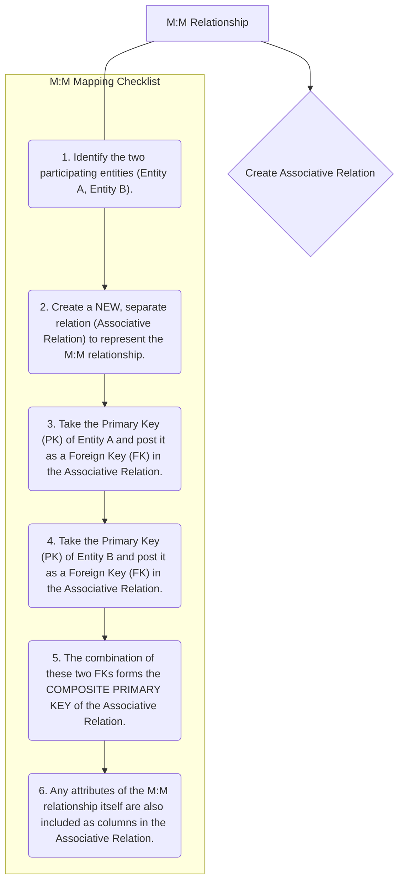
*Note: This `graph TD` diagram provides a "Pilot's Checklist" for mapping many-to-many (M:M) binary relationships. It clearly outlines the steps for creating an associative relation, incorporating foreign keys from both participating entities, and forming a composite primary key.*

## Context & Framework
#### System Architecture & Dependencies
The creation of an associative relation for M:M mappings fundamentally alters the database architecture by introducing an intermediary table. This intermediary table depends on both participating entities for its existence, enforcing a crucial set of referential integrity constraints. For example, an `ENROLLMENT` record (linking `STUDENT` and `COURSE`) cannot exist unless both the `STUDENT` and `COURSE` records it references are present. This structure ensures that all relationships are valid and prevents inconsistent data, while also allowing for attributes specific to the relationship (e.g., a `Grade` in an `ENROLLMENT` relationship) to be stored accurately.

## The Mastery Deep Dive
#### The "Pilot's Checklist" (Do Not Skip)
Mapping M:M relationships is a distinct process that always involves creating a new table.
- [ ] **1. Identify the Two Participating Entities:** Clearly define Entity A and Entity B, along with their respective primary keys. These are the two entities involved in the M:M relationship.
- [ ] **2. Create a NEW, Separate Relation (Associative Relation):** This new table will serve as the bridge between Entity A and Entity B. Its name should reflect the relationship (e.g., `ENROLLMENT` for `STUDENT` and `COURSE`, or `PRODUCT_ORDER` for `PRODUCT` and `ORDER`).
- [ ] **3. Post Primary Key of Entity A as Foreign Key:** Take the primary key attribute(s) of Entity A and add it as a column (or columns) to the new associative relation. This attribute(s) functions as a foreign key, referencing Entity A's original relation.
- [ ] **4. Post Primary Key of Entity B as Foreign Key:** Similarly, take the primary key attribute(s) of Entity B and add it as a column (or columns) to the new associative relation. This attribute(s) functions as a foreign key, referencing Entity B's original relation.
- [ ] **5. Form the Composite Primary Key:** The combination of these two foreign keys (the primary key of Entity A and the primary key of Entity B) together forms the **composite primary key** of the new associative relation. This composite key uniquely identifies each instance of the relationship.
- [ ] **6. Include Relationship Attributes:** If the M:M relationship itself has any attributes (e.g., `Date_Enrolled`, `Grade`, `Quantity`), these are also included as non-key columns in the new associative relation.

#### How the Parts Talk to Each Other
In an M:M relationship, the associative entity (the "bridge table") acts as the central switchboard through which the other two entities communicate. For example, in a `CUSTOMER` `BUYS` `PRODUCT` scenario, the `PURCHASE_ITEM` table links specific `CustomerID`s with specific `ProductID`s. When you want to know what products a customer bought, you go to `PURCHASE_ITEM`, find all entries with that `CustomerID`, and then use the `ProductID`s to look up details in the `PRODUCT` table. Similarly, to see who bought a specific `PRODUCT`, you reverse the process. This intermediary table is essential for maintaining integrity and enabling flexible querying.

## Constraints & Limitations
#### The Engineering Trade-off
The primary engineering trade-off with M:M relationships is the introduction of an extra table and an additional join operation required to retrieve related data. While this is necessary for correctness and normalization, it can sometimes introduce a slight performance overhead compared to a hypothetical (but incorrect) direct linking. However, the benefits in terms of data integrity, reduced redundancy, and the ability to store relationship-specific attributes far outweigh this minor cost. Attempts to avoid the associative table typically lead to severe redundancy and update anomalies.

## Significance & Application
Correctly mapping M:M relationships is critical in almost all complex database designs. Academically, it's a fundamental concept for understanding database normalization and relational integrity. In the real world, it's applied in countless scenarios: `DOCTOR` to `PATIENT` (visits), `AUTHOR` to `BOOK` (writes), `STUDENT` to `CLUB` (joins), ensuring that complex, multi-faceted relationships between business entities are accurately and efficiently managed within the database.

## The Worked Example
Let's map an M:M relationship:

**Scenario:** `STUDENT` (attributes: `StudentID` (PK), `Name`) `TAKES` `COURSE` (attributes: `CourseID` (PK), `Title`) with relationship attribute `Grade`:
*   A `STUDENT` can `TAKE` many `COURSE`s.
*   A `COURSE` can be `TAKEN` by many `STUDENT`s.
*   The `Grade` is specific to a student's performance in a particular course.

**Mapping Steps:**

1.  **Participating Entities:** `STUDENT` (PK: `StudentID`), `COURSE` (PK: `CourseID`)
2.  **Create Associative Relation:** `ENROLLMENT`
3.  **Post PK of `STUDENT` as FK:** `StudentID` in `ENROLLMENT` (FK to `STUDENT`)
4.  **Post PK of `COURSE` as FK:** `CourseID` in `ENROLLMENT` (FK to `COURSE`)
5.  **Form Composite PK:** `(StudentID, CourseID)` is the composite PK of `ENROLLMENT`.
6.  **Include Relationship Attribute:** `Grade` in `ENROLLMENT`.

**Resulting Relations:**
*   `STUDENT(StudentID, Name)`
*   `COURSE(CourseID, Title)`
*   `ENROLLMENT(StudentID (FK), CourseID (FK), Grade)`

## The Proving Ground
*Test your mastery. Cover the solutions below to test yourself first.*

#### Level 1: The Tool Check (Verification)
**The Question:** What is the standard approach for representing an M:M binary relationship in a relational schema?
> **Solution:** Create a new associative relation (or bridge table) that includes the primary keys of both participating entities as foreign keys, which together form its composite primary key.

#### Level 2: The Routine Run (Mastery & Edge Cases)
**The Scenario:** Given an M:M relationship between `STUDENT` and `PROJECT` with a relationship attribute `Role`, describe how you would map this to relations, including the primary key of the new relationship table.
> **Solution:**
> 1.  Create a new associative relation, for example, `STUDENT_PROJECT`.
> 2.  Include the primary key of `STUDENT` (`StudentID`) as a foreign key in `STUDENT_PROJECT`.
> 3.  Include the primary key of `PROJECT` (`ProjectID`) as a foreign key in `STUDENT_PROJECT`.
> 4.  The primary key of the `STUDENT_PROJECT` relation will be the composite key `(StudentID, ProjectID)`.
> 5.  The relationship attribute `Role` is also included as a non-key column in the `STUDENT_PROJECT` relation.

#### Level 3: The Disaster Drill (Mastery & Edge Cases)
**The Scenario:** A database tracks `AUTHOR`s and `BOOK`s with an M:M relationship. A junior designer created a new `AUTHOR_BOOK` table but made `AuthorID` its primary key. Explain why this is incorrect and what the correct composite primary key should be.
> **Solution:**
> **Why it's Incorrect:** If `AuthorID` is the sole primary key of the `AUTHOR_BOOK` table, it implies that each author can be listed only once in this table. This contradicts the nature of a many-to-many relationship, where a single author can write *multiple* books, and thus `AuthorID` would appear multiple times for different books. This would violate the primary key's uniqueness constraint and prevent an author from being linked to more than one book.
>
> **Correct Composite Primary Key:** For an M:M relationship, the primary key of the associative table must be a **composite key** consisting of the primary keys of *both* participating entities. In this case, the correct composite primary key for the `AUTHOR_BOOK` table should be `(AuthorID, BookID)`. This composite key ensures that each unique pairing of an author and a book is recorded only once, accurately representing the many-to-many relationship.

## Key Takeaways
*   M:M relationships always require an associative relation (bridge table) in the relational model.
*   This associative relation's primary key is a composite of the primary keys of the two entities it links.
*   Relationship attributes for M:M relationships are stored in the associative relation.

## Knowledge Graph Connections
| Concept                     | Connection / Relationship                                                                                                       |
| :
-------------------------- | :
-------------------------------------------------------------------------------------------------------------------------------------- |
| [[Mapping_Relationships_to_Relations]] | This is a specific and essential type of relationship mapping, crucial for handling complex associations.                           |
| Binary_Relationships    | M:M relationships are a fundamental type of binary relationship, describing reciprocal multiplicity between two entities.             |
| Associative_Entities    | Associative entities are the relational construct specifically designed to represent M:M relationships.                               |
| Foreign_Keys            | The primary keys of the related entities become foreign keys within the associative relation to establish the links.                   |
| Composite_Keys          | The foreign keys in an associative relation typically combine to form its composite primary key.                                      |
| Primary_Keys            | Primary keys of the original entities are used to form both the foreign keys and the composite primary key of the associative relation. |
---

---

## Mapping Attributes To Relations


## Definition
Before proceeding, ensure you master Attribute_Types and Relational_Columns.
Mapping attributes to relations is the process of converting the descriptive properties of entities (attributes from the E-R model) into columns within the corresponding relational tables. This step requires careful consideration of the attribute's type (simple, composite, multi-valued, derived, stored) to ensure data atomicity and avoid redundancy. Each attribute is designated as a column, but composite and multi-valued attributes require special handling to maintain the integrity of the relational model. Think of it as detailing the specific data points that will be stored within each table, ensuring each piece of information has its own, appropriate slot.

## The Mental Model
Imagine you're cataloging books in a library. Each book has properties (`Attributes`) like `Title`, `Author`, `Publication_Date`, and `Keywords`. Mapping these to a relation (`Table`) means that for a `BOOK` table, `Title` would be a simple column. `Author` might be a `composite attribute` (First Name, Last Name), so it breaks down into two columns. `Keywords` might be `multi-valued` (many keywords per book), so it gets its own separate table. This process ensures that each piece of information fits neatly into the structured rows and columns of your database.

```mermaid
graph TD
    A[Attribute] --> B{Relational_Column}
    subgraph Attribute Mapping Checklist
        ("1. Identify each attribute type for an entity.") --> step2
        step2("2. For simple, single-valued attributes: Directly add as a column.") --> step3
        step3("3. For composite attributes: Decompose into constituent simple attributes, each becoming a column.") --> step4
        step4("4. For multi-valued attributes: Create a new separate relation.") --> step5
        step5("5. In the new relation for multi-valued attributes, include the primary key of the original entity as a foreign key.") --> step6
        step6("6. The primary key of the new relation will be the original entity's primary key combined with the multi-valued attribute.")
    end
    A --- step1
```
*Note: This `graph TD` diagram presents a "Pilot's Checklist" for mapping various attribute types to relational columns or new relations. It outlines the specific steps for handling simple, composite, and multi-valued attributes during the E-R to relational translation.*

## Context & Framework
#### System Architecture & Dependencies
The precise mapping of attributes directly influences the granularity and structure of data within each relation. Simple attributes directly populate columns, forming the basic data points. Composite attributes necessitate a decomposition into their atomic components, ensuring that each column holds a single, indivisible value. Multi-valued attributes, being incompatible with the single-value-per-cell rule of relational tables, require the creation of a new, separate relation. This new relation becomes dependent on the original entity's primary key for identification, establishing a clear architectural dependency within the schema.

## The Mastery Deep Dive
#### The "Pilot's Checklist" (Do Not Skip)
Mapping attributes is a critical step to ensure that the relational model adheres to atomicity and avoids repeating groups.
- [ ] **Simple Attributes:** These are the easiest. Directly add each simple, single-valued attribute as a column in the relation that corresponds to its entity. For example, `Name`, `Age`, `Salary`.
- [ ] **Composite Attributes:** An attribute composed of several other attributes (e.g., `Address` composed of `Street`, `City`, `PostalCode`). The composite attribute itself is ignored. Instead, each of its constituent simple attributes becomes a separate column in the relation. For example, `Address` becomes `Street`, `City`, `PostalCode` columns.
- [ ] **Multi-valued Attributes:** An attribute that can hold multiple values for a single entity instance (e.g., `Phone_Number` for an `EMPLOYEE`). These cannot be directly mapped as a single column.
    - [ ] Create a **new, separate relation** for the multi-valued attribute.
    - [ ] This new relation will have two columns:
        1.  The primary key of the original entity (as a foreign key).
        2.  The multi-valued attribute itself.
    - [ ] The primary key of this new relation will be the composite of these two columns.
        *Example*: `EMPLOYEE(EmployeeID, Name)` has multi-valued `Phone_Number`. Create `EMPLOYEE_PHONE(EmployeeID, PhoneNumber)`. `(EmployeeID, PhoneNumber)` is the PK of `EMPLOYEE_PHONE`, `EmployeeID` is FK to `EMPLOYEE`.
- [ ] **Derived Attributes:** Attributes whose values can be calculated from other attributes (e.g., `Age` from `DateOfBirth`). These are typically **not** stored as columns to avoid redundancy, but can be generated when needed.
- [ ] **Stored Attributes:** Attributes that are explicitly maintained (opposite of derived). These become regular columns.

#### Opening the Hood: What's Inside?
When dissecting an entity's attributes for mapping, we essentially "open the hood" to see how each property functions. A simple attribute like `ProductName` is a self-contained unit, directly translating to a `ProductName` column. A `CustomerAddress` (composite) requires breaking it down into `Street`, `City`, `ZipCode` columns to respect atomicity. A `CoursePrerequisites` (multi-valued) cannot fit into a single cell, so it spawns a new table (`COURSE_PREREQ`) to hold each prerequisite as a separate entry, linked back to the original `COURSE` by its ID. This granular approach ensures no information is lost and all data is structured correctly for the relational model.

## Constraints & Limitations
#### The Engineering Trade-off
The critical engineering trade-off in attribute mapping concerns multi-valued attributes. While creating a separate table for each multi-valued attribute (as prescribed by normalization principles) ensures atomicity and avoids redundancy, it can lead to an increased number of tables and potentially more joins in complex queries. This might sometimes be perceived as a performance overhead. The decision to strictly normalize or to use a less normalized approach (e.g., storing comma-separated values, though generally discouraged) involves balancing data integrity and design purity against perceived query simplicity or performance in specific contexts.

## Significance & Application
Accurate attribute mapping is fundamental for achieving a well-structured and normalized database. It directly impacts data integrity, prevents update anomalies, and ensures efficient data storage. In education, it's a core concept in database design courses. In industry, developers and database administrators rely on these rules to build robust systems where data is consistently stored, easily queryable, and free from internal contradictions, forming the basis for reliable applications.

## The Worked Example
Let's map attributes for an `EMPLOYEE` entity:
*   `EmployeeID` (Simple, PK)
*   `FullName` (Composite: `FirstName`, `LastName`)
*   `SkillSet` (Multi-valued: e.g., 'Java', 'SQL', 'Python')
*   `DateOfBirth` (Simple, Stored)
*   `Age` (Derived from `DateOfBirth`)

**Mapping Steps:**

1.  **`EmployeeID`**: Becomes `EmployeeID` column, designated as Primary Key.
2.  **`FullName`**: Ignored. Its components `FirstName` and `LastName` become separate columns.
3.  **`SkillSet`**: Requires a new relation.
    *   Create `EMPLOYEE_SKILLS` relation.
    *   Columns: `EmployeeID` (FK to `EMPLOYEE`) and `Skill`.
    *   Primary Key: `(EmployeeID, Skill)` (composite).
4.  **`DateOfBirth`**: Becomes `DateOfBirth` column.
5.  **`Age`**: Typically not mapped as a column, as it can be derived from `DateOfBirth`.

**Resulting Relations:**
*   `EMPLOYEE(EmployeeID, FirstName, LastName, DateOfBirth)`
*   `EMPLOYEE_SKILLS(EmployeeID, Skill)`

## The Proving Ground
*Test your mastery. Cover the solutions below to test yourself first.*

#### Level 1: The Tool Check (Verification)
**The Question:** How are atomic (single-valued) attributes typically mapped to a relation?
> **Solution:** They are directly added as columns in the corresponding relation.

#### Level 2: The Routine Run (Mastery & Edge Cases)
**The Scenario:** Given a `BOOK` entity with a composite attribute `Author_Name` (composed of `FirstName` and `LastName`) and a multi-valued attribute `Keywords`, describe the mapping process for these attributes to a relational schema.
> **Solution:**
> 1.  **Composite Attribute (`Author_Name`):** The composite attribute `Author_Name` itself is ignored. Its constituent simple attributes, `FirstName` and `LastName`, are added as separate columns to the `BOOK` relation.
> 2.  **Multi-valued Attribute (`Keywords`):** A new relation, for example, `BOOK_KEYWORDS`, is created. This relation will have two columns: `ISBN` (the primary key of `BOOK`, acting as a foreign key) and `Keyword`. The primary key of `BOOK_KEYWORDS` will be the composite key `(ISBN, Keyword)`.

#### Level 3: The Disaster Drill (Mastery & Edge Cases)
**The Scenario:** During attribute mapping, a multi-valued attribute `Phone_Number` for an `EMPLOYEE` entity was simply added as a new column in the `EMPLOYEE` relation. Explain the immediate data integrity and redundancy issues this creates and outline the correct mapping procedure to fix it.
> **Solution:**
> **Issues Created:**
> 1.  **Atomicity Violation:** A single column `Phone_Number` would have to store multiple values (e.g., "123-4567; 890-1234"), violating the first normal form (1NF) rule that each column should hold a single, atomic value.
> 2.  **Redundancy:** If an employee has multiple phone numbers, you might have to create multiple rows for the same employee, duplicating other employee information (e.g., `EmployeeName`, `Address`) for each phone number.
> 3.  **Querying Difficulty:** Retrieving, updating, or deleting specific phone numbers would be complex, requiring string parsing.
>
> **Correct Mapping Procedure to Fix It:**
> 1.  Create a **new relation**, for example, `EMPLOYEE_PHONE`.
> 2.  This new relation will contain two columns: `EmployeeID` (the primary key of the `EMPLOYEE` entity, acting as a foreign key) and `PhoneNumber`.
> 3.  The **primary key** of the `EMPLOYEE_PHONE` relation will be the composite key `(EmployeeID, PhoneNumber)`. This ensures each phone number is uniquely associated with an employee without redundancy in the `EMPLOYEE` table.

## Key Takeaways
*   Simple attributes map directly to columns.
*   Composite attributes are decomposed into their constituent simple attributes, each becoming a separate column.
*   Multi-valued attributes require the creation of a new, separate relation with a composite primary key formed by the original entity's primary key and the multi-valued attribute.

## Knowledge Graph Connections
| Concept                     | Connection / Relationship                                                                                 |
| :
-------------------------- | :
---------------------------------------------------------------------------------------------------------------------- |
| [[Translating_E_R_to_Logical_Model]] | This is a fundamental component of the overall E-R to logical model translation process.                                                |
| Attribute_Types         | Understanding different attribute types is crucial for applying the correct mapping rules.                                |
| Relational_Columns      | Columns are the direct output of mapping attributes into the relational model.                                            |
| [[First_Normal_Form_1NF]]   | Correct attribute mapping, especially for multi-valued attributes, helps achieve 1NF by ensuring atomicity.               |
| Primary_Keys            | Involved in forming the composite primary key for relations created from multi-valued attributes.                         |
---

---

## Mapping Entities To Relations


## Definition
Before proceeding, ensure you master [[Entity_Types]] and Relational_Tables.
Mapping entities to relations is the foundational step in transforming an E-R model into a logical database design. It involves taking each entity type identified in the conceptual E-R model and converting it into a corresponding relation (or table) in the relational schema. During this process, the entity's attributes become columns in the table, and its unique identifier (primary key) is established. Think of this as defining the main "containers" in your database, where each container represents a distinct type of object or concept.

## The Mental Model
Imagine you're sorting a collection of LEGO bricks. Each distinct type of brick (e.g., a "2x4 brick," a "minifigure," a "wheel") is an `Entity`. Mapping these entities to relations is like deciding that for each unique type, you'll create a dedicated box (`Relation`/`Table`) labeled with its type. Inside each box, you'll list its characteristics (like color, size, number of studs) as `Columns`. The unique ID for each brick type, like its part number, becomes the `Primary Key`.

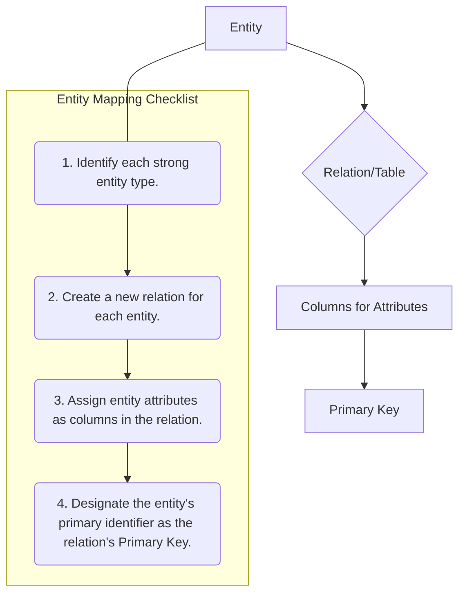
*Note: This `graph TD` diagram provides a "Pilot's Checklist" for mapping entities to relations, detailing the sequential steps involved. It shows the logical flow from an Entity to its corresponding Relation with columns and a Primary Key.*

## Context & Framework
#### System Architecture & Dependencies
The mapping of entities to relations forms the architectural backbone of the logical data model. Every other component, such as attributes and relationships, depends on these base relations. Correctly identifying and translating strong entities ensures that core data structures are stable and accurately reflect the real-world objects they represent. Weak entities are also mapped to relations, but their primary key is partially or fully dependent on an owner strong entity, creating a direct dependency in the schema.

## The Mastery Deep Dive
#### The "Pilot's Checklist" (Do Not Skip)
Mapping entities to relations is a straightforward, checklist-driven process.
- [ ] **Identify all Strong Entity Types:** Scan your E-R diagram for every entity that has its own unique identifier (primary key).
- [ ] **Create a New Relation:** For each identified strong entity, create a new relational table. The name of the relation should typically be the plural form of the entity name (e.g., `EMPLOYEE` entity becomes `Employees` table, or simply `EMPLOYEE` if following specific naming conventions).
- [ ] **Map Attributes to Columns:** All simple, single-valued attributes of the entity are directly included as columns in the newly created relation.
- [ ] **Designate the Primary Key:** The entity's primary identifier (the attribute or set of attributes that uniquely identifies each entity instance) becomes the primary key of the new relation. This primary key will also be used to link to other relations.
- [ ] **Handle Weak Entities (Special Case):** For each weak entity, a new relation is also created. Its primary key will be a composite key consisting of its partial key and the primary key of its owner (identifying) entity, which is posted as a foreign key.

#### Opening the Hood: What's Inside?
When an entity like `CUSTOMER` (with attributes `CustomerID`, `Name`, `Address`) is mapped, the "Engine Block" (`CUSTOMER` entity) transforms into a `CUSTOMER` table. The `CustomerID` becomes the unique `Primary Key`. `Name` and `Address` become regular `Columns`. If `Address` was initially a composite attribute, it would be further decomposed (e.g., `Street`, `City`, `PostalCode`), adhering to atomicity principles within the relational model. This detailed view ensures that all data properties are preserved and structured for storage.

## Constraints & Limitations
#### The Engineering Trade-off
A key engineering trade-off in entity mapping arises with weak entities and how their existence is contingent on a strong entity. While a separate table is typically created for weak entities, deciding on their primary key involves incorporating the owner entity's primary key. This design decision directly impacts how instances of the weak entity can be uniquely identified and how referential integrity is maintained. Incorrectly defining the primary key for a weak entity can lead to data integrity issues or difficulty in uniquely referencing its instances.

## Significance & Application
Correctly mapping entities to relations is the cornerstone of logical database design. It directly impacts data organization, integrity, and future query efficiency. In academic settings, it's the fundamental skill taught for relational database design. In real-world applications, robust entity mapping ensures that the core business objects are accurately represented, providing a solid, non-redundant foundation for the entire database system.

## The Worked Example
Let's map two entities:
1.  **Strong Entity: `COURSE`**
    *   Attributes: `CourseID` (PK), `CourseName`, `Credits`
    *   Mapping:
        *   Create relation: `COURSE`
        *   Columns: `CourseID`, `CourseName`, `Credits`
        *   Primary Key: `CourseID`
    *   Resulting Relation: `COURSE(CourseID, CourseName, Credits)`

2.  **Weak Entity: `DEPENDENT`**
    *   Attributes: `DependentName` (Partial Key), `Relationship`
    *   Owner Entity: `EMPLOYEE` (Strong Entity, with PK `EmployeeID`)
    *   Mapping:
        *   Create relation: `DEPENDENT`
        *   Columns: `DependentName`, `Relationship`, plus the `EmployeeID` from the owner.
        *   Primary Key: Composite key of `(EmployeeID, DependentName)`
        *   Foreign Key: `EmployeeID` references `EMPLOYEE(EmployeeID)`
    *   Resulting Relation: `DEPENDENT(EmployeeID, DependentName, Relationship)`

## The Proving Ground
*Test your mastery. Cover the solutions below to test yourself first.*

#### Level 1: The Tool Check (Verification)
**The Question:** When mapping an entity from a conceptual E-R model to a logical data model, what is the direct equivalent in the relational model?
> **Solution:** A relation (or table).

#### Level 2: The Routine Run (Mastery & Edge Cases)
**The Scenario:** List the key steps involved in mapping a strong entity `DEPARTMENT` (with attributes `DepartmentID`, `DepartmentName`) to a relation, ensuring its primary key is correctly identified.
> **Solution:**
> 1.  Identify `DEPARTMENT` as a strong entity.
> 2.  Create a new relation (table) named `DEPARTMENT`.
> 3.  Add `DepartmentID` and `DepartmentName` as columns.
> 4.  Designate `DepartmentID` as the primary key of the `DEPARTMENT` relation.

#### Level 3: The Disaster Drill (Mastery & Edge Cases)
**The Scenario:** A database designer forgot to assign a primary key during the mapping of the `PRODUCT` entity, instead only listing `ProductName` and `Description` as attributes. What immediate issues would arise if this design were implemented, and what is the crucial recovery step?
> **Solution:** If `PRODUCT` is created without a primary key, immediate issues would include:
> 1.  **No unique identification:** It would be impossible to uniquely identify individual products, leading to ambiguity.
> 2.  **Referential integrity violations:** Other tables could not reliably reference specific products, breaking relationships.
> 3.  **Data redundancy:** It becomes harder to prevent duplicate `ProductName` and `Description` entries without a unique identifier.
>
> The crucial recovery step is to **add a suitable primary key attribute** (e.g., `ProductID` with an auto-incrementing integer or UUID) to the `PRODUCT` relation and ensure it is designated as the primary key.

## Key Takeaways
*   Each strong E-R entity translates directly into a distinct relation (table) in the logical data model.
*   Attributes of the entity become columns in the relation, and the entity's identifier becomes the relation's primary key.
*   Weak entities also become relations, but their primary key is composite, including the primary key of their owning entity.

## Knowledge Graph Connections
| Concept                     | Connection / Relationship                                                                                                       |
| :
-------------------------- | :
-------------------------------------------------------------------------------------------------------------------------------------- |
| [[Translating_E_R_to_Logical_Model]] | This is a fundamental component of the overall E-R to logical model translation process.                                                |
| [[Entity_Types]]            | Entities, particularly strong entities, are the conceptual source for creating relations in the logical model.                            |
| Relational_Tables       | Relations (tables) are the direct output of mapping entities from the E-R model.                                                        |
| Primary_Keys            | The primary key of an entity is directly translated to the primary key of the corresponding relation.                                   |
| [[Weak_Entity_Types]]       | Weak entities have a specific mapping rule that incorporates their owner entity's primary key into their own relation.                    |
---

---

## Mapping Relationships To Relations


## Definition
Before proceeding, ensure you master [[Relationship_Types]] and Foreign_Keys.
Mapping relationships to relations is the intricate process of representing the associations between entities from an E-R model within a relational database schema. This involves translating various relationship cardinalities (one-to-one, one-to-many, many-to-many) and participation constraints (mandatory, optional) into foreign key constraints or, in some cases, the creation of new relations (associative tables). The goal is to preserve the conceptual links between entities in a structurally sound and referentially integrated manner within the logical data model. Think of it as creating the "bridges" or "links" between your database tables, allowing them to communicate and share related information.

## The Mental Model
Imagine you have a collection of recipe cards (`Entities`) and a collection of ingredient labels (`Entities`). A "Recipe Uses Ingredient" is a `Relationship`. Mapping this relationship means deciding how to connect your `Recipe` tables to your `Ingredient` tables. If one recipe uses many ingredients, you might add a foreign key to the `Ingredient` table that points back to the `Recipe` table. If many recipes use many ingredients, you'd create a separate "Recipe_Ingredients" table to link them all, acting as a bridge between the two.

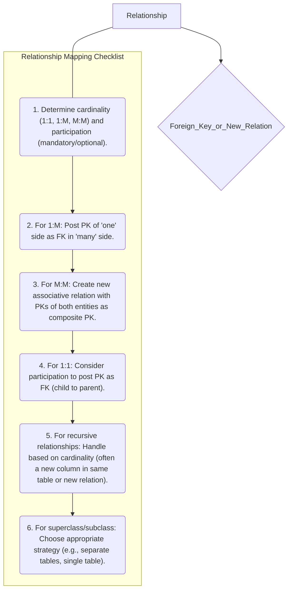
*Note: This `graph TD` diagram provides a "Pilot's Checklist" for mapping various types of relationships to relations. It highlights the decision points based on cardinality and suggests the general approach for each relationship type, leading to either a foreign key or a new associative relation.*

## Context & Framework
#### System Architecture & Dependencies
Relationships are the glue that binds the entity-relations together in the logical data model, forming a cohesive system architecture. The mapping process establishes explicit dependencies between tables through foreign key constraints, which are vital for maintaining referential integrity. For example, a foreign key in the `ORDER` table referencing the `CUSTOMER` table implies that an order cannot exist without a corresponding customer. This framework ensures that data across different tables remains consistent and valid, preventing orphaned records or illogical data states.

## The Mastery Deep Dive
#### The "Pilot's Checklist" (Do Not Skip)
Mapping relationships is often the most complex part of E-R to relational translation due to the variety of cardinalities and participation constraints.
- [ ] **One-to-Many (1:M) Binary Relationships:**
    - [ ] Identify the 'one side' (parent entity) and the 'many side' (child entity).
    - [ ] Post a copy of the primary key (PK) attribute(s) of the **parent entity** into the relation representing the **child entity**. This copied PK acts as a foreign key (FK).
    - [ ] Any attributes of the relationship itself are also posted to the 'many side' (child entity's relation).
    *Example*: `DEPARTMENT` (one) `HAS` `EMPLOYEE` (many). `DeptID` (PK of `DEPARTMENT`) is posted as `DeptID` (FK) in `EMPLOYEE` relation.
- [ ] **Many-to-Many (M:M) Binary Relationships:**
    - [ ] Create a **new, separate relation** (often called an associative entity or bridge table) to represent the M:M relationship.
    - [ ] Post a copy of the PK attribute(s) of **both participating entities** into this new relation. These become foreign keys.
    - [ ] These foreign keys, in combination, form the **composite primary key** of the new relation.
    - [ ] Any attributes of the relationship itself are also included as columns in this new relation.
    *Example*: `STUDENT` `ENROLLS_IN` `COURSE`. Create `ENROLLMENT(StudentID, CourseID, Grade)`. `(StudentID, CourseID)` is PK, `StudentID` is FK to `STUDENT`, `CourseID` is FK to `COURSE`.
- [ ] **One-to-One (1:1) Binary Relationships:**
    - [ ] This is more flexible. The choice depends on participation constraints.
    - [ ] **Mandatory on both sides:** Combine entities into one relation, choosing one PK as the new relation's PK and the other as an alternate key.
    - [ ] **Mandatory on one side, optional on other:** Post PK of the optional side (parent) as FK into the mandatory side (child).
    - [ ] **Optional on both sides:** Create a new relation with both PKs as FKs (forming a composite PK), or choose one arbitrarily to post as an FK to the other.
- [ ] **Recursive Relationships:**
    - [ ] Handled similarly to binary relationships based on their cardinality (1:1, 1:M, M:M) but involve linking to the same entity.
    - [ ] Often involves adding a foreign key to the entity's own table (e.g., `ManagerID` in `EMPLOYEE` referencing `EmployeeID` in `EMPLOYEE`).
- [ ] **Superclass/Subclass Relationships:**
    - [ ] Multiple strategies exist (e.g., single table, multiple tables with shared primary key, or separate tables with foreign keys). The choice depends on disjointness, participation, and frequency of access.
    - [ ] The general approach is to identify the superclass as the parent and subclass as the child.

#### How the Parts Talk to Each Other
Relationships define how information flows and is linked across different parts of the database. When `CUSTOMER` `PLACES` `ORDER` (1:M), the `CustomerID` in the `ORDER` table acts as the "bridge" that connects each order record back to the specific customer who placed it. This foreign key is the mechanism through which the parts (tables) talk to each other, allowing you to retrieve a customer's details when looking at their order, or list all orders for a given customer. This ensures that the logical schema maintains the intended associations defined in the E-R model.

## Constraints & Limitations
#### The Engineering Trade-off
The primary engineering trade-off in mapping relationships, especially for 1:1 and superclass/subclass types, lies in choosing between consolidating data into fewer tables versus maintaining separate, distinct tables. Consolidating might reduce the number of joins needed for queries, potentially improving performance but could lead to a higher prevalence of null values if data is sparse. Conversely, keeping entities in separate tables increases the number of joins but might offer better flexibility and clearer semantic separation. The decision often balances perceived query complexity against data sparsity and future maintenance.

## Significance & Application
Accurate relationship mapping is paramount for the integrity and functionality of any relational database. It ensures that the database reflects the real-world connections between entities, preventing inconsistent data and enabling complex queries. In an academic context, mastering these rules is fundamental to database design. Professionally, database developers rely on precise relationship mapping to build robust, referentially sound systems that power applications requiring interconnected data, such as inventory management, human resources, and financial systems.

## The Worked Example
Let's map a few relationship types:

1.  **One-to-Many (1:M): `DEPARTMENT` (one) `HAS` `EMPLOYEE` (many)**
    *   `DEPARTMENT` (PK: `DeptID`)
    *   `EMPLOYEE` (PK: `EmpID`)
    *   Mapping: Post `DeptID` from `DEPARTMENT` into `EMPLOYEE`.
    *   Result: `DEPARTMENT(DeptID, DeptName)`
              `EMPLOYEE(EmpID, EmpName, DeptID (FK))`

2.  **Many-to-Many (M:M): `STUDENT` (many) `ENROLLS_IN` `COURSE` (many) with `Grade` attribute**
    *   `STUDENT` (PK: `StudentID`)
    *   `COURSE` (PK: `CourseID`)
    *   Mapping: Create a new associative table `ENROLLMENT`.
    *   Result: `STUDENT(StudentID, StudentName)`
              `COURSE(CourseID, CourseName)`
              `ENROLLMENT(StudentID (FK), CourseID (FK), Grade)`
              *(PK of ENROLLMENT is (StudentID, CourseID))*

3.  **One-to-One (1:1): `EMPLOYEE` (optional) `MANAGES` `DEPARTMENT` (mandatory)**
    *   `EMPLOYEE` (PK: `EmpID`)
    *   `DEPARTMENT` (PK: `DeptID`)
    *   Mapping: Post `EmpID` from `EMPLOYEE` (optional side/parent) into `DEPARTMENT` (mandatory side/child).
    *   Result: `EMPLOYEE(EmpID, EmpName)`
              `DEPARTMENT(DeptID, DeptName, EmpID (FK))`

## The Proving Ground
*Test your mastery. Cover the solutions below to test yourself first.*

#### Level 1: The Tool Check (Verification)
**The Question:** What general principle guides the mapping of relationships between entities to relations in a logical data model?
> **Solution:** Relationships are primarily mapped by introducing foreign key constraints between existing tables or by creating new associative tables for many-to-many relationships.

#### Level 2: The Routine Run (Mastery & Edge Cases)
**The Scenario:** Outline the primary steps for mapping a 1:M (one-to-many) relationship named `WORKS_FOR` between `DEPARTMENT` (one side) and `EMPLOYEE` (many side). Include how primary and foreign keys are handled.
> **Solution:**
> 1.  Identify `DEPARTMENT` as the 'one side' (parent entity) and `EMPLOYEE` as the 'many side' (child entity).
> 2.  Take the primary key of the `DEPARTMENT` entity (e.g., `DeptID`).
> 3.  Post a copy of this `DeptID` into the `EMPLOYEE` relation. This copied attribute becomes a foreign key in the `EMPLOYEE` relation, referencing the `DeptID` in the `DEPARTMENT` relation.
> 4.  The `DeptID` in the `DEPARTMENT` relation remains its primary key, and the `EmpID` (or similar) in the `EMPLOYEE` relation remains its primary key.

#### Level 3: The Disaster Drill (Mastery & Edge Cases)
**The Scenario:** A database for a university mistakenly mapped a M:M (many-to-many) relationship between `STUDENT` and `COURSE` by simply posting the primary key of `STUDENT` into the `COURSE` relation. Describe why this is incorrect and what the correct mapping strategy should be, assuming the relationship itself has an attribute `Grade`.
> **Solution:**
> **Why it's Incorrect:**
> 1.  **Redundancy:** If `StudentID` is posted into the `COURSE` relation, and a course has many students, `CourseID`, `CourseName`, and other course details would be duplicated for every student enrolled in that course.
> 2.  **Atomicity/Multi-valued Issue:** Conversely, if `CourseID` is posted into the `STUDENT` relation, a student taking multiple courses would require the `CourseID` column to hold multiple values, violating 1NF (atomicity).
> 3.  **Loss of Relationship Attribute:** The `Grade` attribute, which belongs to the specific enrollment of a student in a course, cannot be meaningfully placed in either the `STUDENT` or `COURSE` relation without causing redundancy or data loss.
>
> **Correct Mapping Strategy:**
> 1.  Create a **new associative relation**, typically named `ENROLLMENT` (or `STUDENT_COURSE`).
> 2.  This `ENROLLMENT` relation will include the primary key of `STUDENT` (`StudentID`) and the primary key of `COURSE` (`CourseID`) as **foreign keys**.
> 3.  These two foreign keys (`StudentID`, `CourseID`) will collectively form the **composite primary key** of the `ENROLLMENT` relation, uniquely identifying each student-course pairing.
> 4.  The relationship attribute `Grade` is also included as a column in the `ENROLLMENT` relation.
>
> **Resulting Relations (example):**
> *   `STUDENT(StudentID, StudentName)`
> *   `COURSE(CourseID, CourseName)`
> *   `ENROLLMENT(StudentID (FK), CourseID (FK), Grade)`

## Key Takeaways
*   1:M relationships are mapped by posting the PK of the 'one' side as an FK in the 'many' side.
*   M:M relationships require a new associative relation (bridge table) with the PKs of both entities forming its composite PK.
*   1:1 relationships depend on participation constraints to determine the FK placement.
*   Special handling is required for recursive and superclass/subclass relationships.

## Knowledge Graph Connections
| Concept                     | Connection / Relationship                                                                                                               |
| :
-------------------------- | :
-------------------------------------------------------------------------------------------------------------------------------------- |
| [[Translating_E_R_to_Logical_Model]] | This is a fundamental component of the overall E-R to logical model translation process.                                                |
| [[Relationship_Types]]      | Understanding different relationship types (1:1, 1:M, M:M) is crucial for applying the correct mapping rules.                             |
| Foreign_Keys            | Foreign keys are the primary mechanism for representing relationships between tables in the relational model.                             |
| Associative_Entities    | M:M relationships often translate into associative entities (new relations) in the logical model.                                       |
| Cardinality             | The cardinality of a relationship directly dictates the mapping strategy (e.g., where a foreign key is placed).                           |
| Participation_Constraints | Participation constraints influence the optimal mapping strategy, especially for 1:1 and superclass/subclass relationships.             |
---

---

## One To Many Binary Relationships


## Definition
Before proceeding, ensure you master Binary_Relationships and Foreign_Keys.
One-to-many (1:M) binary relationships describe an association between two entities where one instance of the first entity can be related to multiple instances of the second entity, but each instance of the second entity can only be related to at most one instance of the first. This is one of the most common relationship types in database design. When mapping to a relational model, the primary key of the 'one side' entity is always placed as a foreign key in the 'many side' entity, ensuring correct referential integrity. Think of it like a single teacher (`one`) teaching many students (`many`), but each student only has one primary teacher for a given class.

## The Mental Model
Imagine a single "Department" (`one` side) that employs many "Employees" (`many` side). An Employee, however, only works for one Department. When you build your database, you don't want to list the entire Department's details (name, budget, location) in every Employee's record. Instead, you just add the Department's unique ID (its `Primary Key`) to each Employee's record. This ID in the Employee table acts as a "pointer" or a `Foreign Key` back to the full Department details. This way, many employees point to one department, achieving the 1:M link without redundancy.

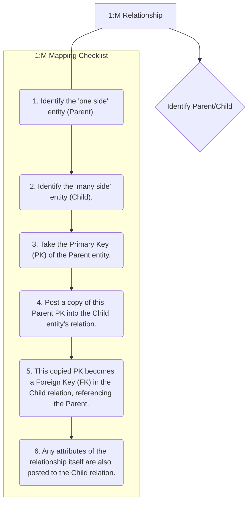
*Note: This `graph TD` diagram provides a "Pilot's Checklist" for mapping one-to-many (1:M) binary relationships. It outlines the clear, sequential steps involved in identifying parent and child entities and correctly placing the foreign key to establish the relationship.*

## Context & Framework
#### System Architecture & Dependencies
1:M relationships form a crucial part of the hierarchical dependencies within a database schema. The foreign key placed in the 'many side' entity creates a direct dependency on the 'one side' entity, ensuring referential integrity. This means an instance on the 'many side' (e.g., an `ORDER`) cannot exist without a corresponding instance on the 'one side' (e.g., a `CUSTOMER`). This architectural choice simplifies data retrieval and updates, as changes to the 'one side' entity automatically cascade or are constrained based on the existence of 'many side' records, maintaining a consistent data model.

## The Mastery Deep Dive
#### The "Pilot's Checklist" (Do Not Skip)
Mapping 1:M relationships is a relatively straightforward process with a clear rule:
- [ ] **1. Identify the 'One Side' Entity (Parent):** This is the entity that can be related to multiple instances of the other entity. Its primary key will be propagated.
- [ ] **2. Identify the 'Many Side' Entity (Child):** This is the entity where each instance can only be related to at most one instance of the 'one side' entity. This is where the foreign key will be placed.
- [ ] **3. Take the Primary Key (PK) of the Parent Entity:** Obtain the unique identifier attribute(s) of the 'one side' entity.
- [ ] **4. Post a copy of this Parent PK into the Child Entity's Relation:** Add a new column (or columns, if the PK is composite) to the relation representing the 'many side' entity. The name of this new column should clearly indicate that it's a foreign key (e.g., `DeptID` in `EMPLOYEE` when `DEPARTMENT` is the parent).
- [ ] **5. Designate this Copied PK as a Foreign Key (FK):** Explicitly define this new column(s) in the child relation as a foreign key that references the primary key of the parent relation. This establishes the link and enforces referential integrity.
- [ ] **6. Include Relationship Attributes (if any) in the Child Relation:** If the 1:M relationship itself has attributes (which is rare, as relationship attributes typically belong to the 'many' side anyway in a 1:M relationship), these attributes are also included in the 'many side' (child) relation.

#### How the Parts Talk to Each Other
In a 1:M relationship, the "parent" entity (on the 'one' side) is like a central authority, and the "child" entities (on the 'many' side) are its dependents. For example, a `UNIVERSITY` (`one` side) has many `DEPARTMENTS` (`many` side). Each `DEPARTMENT` record contains the `UniversityID` (a foreign key) that points back to the specific `UNIVERSITY` it belongs to. This `UniversityID` is the direct line of communication, allowing you to trace from any `DEPARTMENT` to its `UNIVERSITY`, and from a `UNIVERSITY` to all its `DEPARTMENTS` by matching IDs.

## Constraints & Limitations
#### The Engineering Trade-off
While mapping 1:M relationships is straightforward, an engineering trade-off might emerge if the 'one side' entity is rarely accessed, but its primary key is very large (e.g., a long UUID). Posting such a large foreign key into potentially millions of 'many side' records could lead to increased storage consumption and slightly slower join operations. However, this is generally a minor concern compared to the benefits of normalization and referential integrity. The fundamental rule of placing the FK in the 'many' side is almost always followed for 1:M relationships.

## Significance & Application
1:M relationships are ubiquitous in relational databases, making their correct mapping essential. Academically, it's a core concept illustrating the power of foreign keys for data linking. Practically, almost every business application, from inventory systems (one `PRODUCT_CATEGORY` to many `PRODUCTS`) to customer relationship management (one `CUSTOMER` to many `ORDERS`), relies on correctly implemented 1:M relationships to organize and access related data efficiently.

## The Worked Example
Let's map a 1:M relationship:

**Scenario:** `CUSTOMER` (attributes: `CustomerID` (PK), `Name`) `PLACES` `ORDER` (attributes: `OrderID` (PK), `OrderDate`):
*   A `CUSTOMER` can `PLACE` many `ORDER`s.
*   An `ORDER` is `PLACE`d by exactly one `CUSTOMER`.

**Mapping Steps:**

1.  **'One Side' Entity (Parent):** `CUSTOMER` (PK: `CustomerID`)
2.  **'Many Side' Entity (Child):** `ORDER` (PK: `OrderID`)
3.  **Take Parent PK:** `CustomerID`
4.  **Post to Child Relation:** Add `CustomerID` as a column in the `ORDER` relation.
5.  **Designate as FK:** `CustomerID` in `ORDER` is a foreign key referencing `CustomerID` in `CUSTOMER`.

**Resulting Relations:**
*   `CUSTOMER(CustomerID, Name)`
*   `ORDER(OrderID, OrderDate, CustomerID (FK))`

## The Proving Ground
*Test your mastery. Cover the solutions below to test yourself first.*

#### Level 1: The Tool Check (Verification)
**The Question:** Which entity in a 1:M relationship is designated as the 'parent entity'?
> **Solution:** The entity on the 'one side' of the relationship.

#### Level 2: The Routine Run (Mastery & Edge Cases)
**The Scenario:** Consider a 1:M relationship where `PUBLISHER` is on the 'one side' and `BOOK` is on the 'many side'. Detail the steps to map this relationship to relations, including where the foreign key will reside.
> **Solution:**
> 1.  Identify `PUBLISHER` as the 'one side' (parent) entity and `BOOK` as the 'many side' (child) entity.
> 2.  Take the primary key of the `PUBLISHER` entity (e.g., `PublisherID`).
> 3.  Post a copy of this `PublisherID` into the `BOOK` relation.
> 4.  This copied `PublisherID` becomes a foreign key in the `BOOK` relation, referencing the `PublisherID` in the `PUBLISHER` relation. The foreign key will reside in the `BOOK` relation.

#### Level 3: The Disaster Drill (Mastery & Edge Cases)
**The Scenario:** A `CUSTOMER` (one side) and `ORDER` (many side) relationship was mapped, but the `customerID` was added to the `CUSTOMER` table as a foreign key referencing the `ORDER` table. Explain the fundamental error and correct the mapping.
> **Solution:**
> **Fundamental Error:** The fundamental error is placing the foreign key (`CustomerID`) in the `CUSTOMER` table, which is the 'one' side of the relationship, and having it reference the `ORDER` table, which is the 'many' side. This violates the core principle of 1:M mapping. If a customer can place many orders, then the `CUSTOMER` table would either have to duplicate customer information for each order (redundancy) or the `CustomerID` column would need to hold multiple `OrderID` values (violating atomicity), neither of which correctly models the relationship.
>
> **Correct Mapping:**
> 1.  Identify `CUSTOMER` as the 'one' side (parent) and `ORDER` as the 'many' side (child).
> 2.  The primary key of the `CUSTOMER` table (e.g., `CustomerID`) should be posted as a foreign key in the `ORDER` table.
> 3.  The `ORDER` table would then have a `CustomerID` column that links each order to its corresponding customer.
>
> **Example:**
> *   `CUSTOMER(CustomerID, CustomerName)`
> *   `ORDER(OrderID, OrderDate, CustomerID (FK))`

## Key Takeaways
*   The primary key of the 'one side' entity (parent) is always placed as a foreign key in the 'many side' entity (child).
*   This mapping establishes referential integrity, ensuring that records on the 'many side' always link back to a valid record on the 'one side'.
*   Relationship attributes in a 1:M relationship are typically placed in the 'many side' (child) relation.

## Knowledge Graph Connections
| Concept                     | Connection / Relationship                                                                                                       |
| :
-------------------------- | :
-------------------------------------------------------------------------------------------------------------------------------------- |
| [[Mapping_Relationships_to_Relations]] | This is a specific type of relationship mapping, representing a common form of association.                                         |
| Binary_Relationships    | 1:M relationships are a fundamental type of binary relationship, establishing a link between two distinct entities.                   |
| Foreign_Keys            | Foreign keys are the explicit mechanism used to implement 1:M relationships, ensuring referential integrity.                            |
| Cardinality             | The 1:M cardinality directly dictates the rule for placing the foreign key in the 'many' side relation.                                 |
| Primary_Keys            | The primary key of the 'one side' entity is copied to serve as the foreign key in the 'many' side.                                    |
---

---

## One To One Binary Relationships


## Definition
Before proceeding, ensure you master Binary_Relationships and Participation_Constraints.
One-to-one (1:1) binary relationships represent an association between two entities where each instance of the first entity is related to at most one instance of the second entity, and vice-versa. When mapping these to a relational model, the strategy for introducing a foreign key is crucial and depends heavily on the participation constraints (mandatory or optional) of each entity in the relationship. This ensures that the unique, singular connection between instances is accurately preserved in the database schema. Think of it as a marriage: one person (usually) to one other person.

## The Mental Model
Imagine you have a single key that opens a single lock. This is a 1:1 relationship. If every key *must* have a lock, and every lock *must* have a key, they are both `mandatory`. If a key can exist without a lock, or a lock without a key, there's `optional` participation. When mapping, you decide whether to put the key's ID on the lock, or the lock's ID on the key, or even a separate "Key_Lock_Pairing" list, based on who *needs* whom.

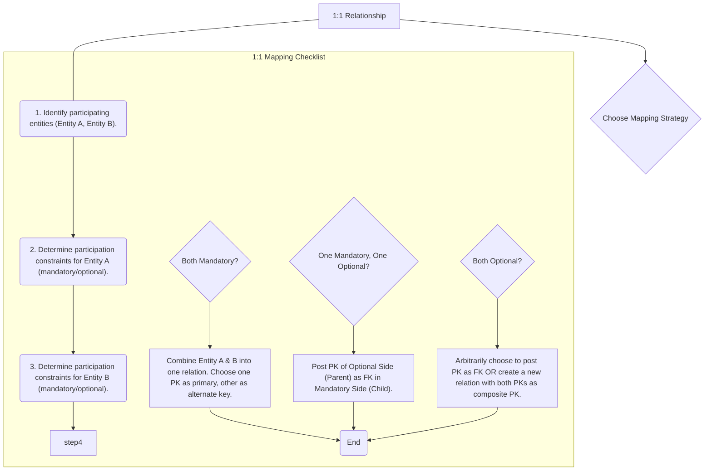
*Note: This `graph TD` diagram provides a "Pilot's Checklist" for mapping one-to-one (1:1) binary relationships. It guides the decision-making process based on the participation constraints (mandatory/optional) of the participating entities, leading to different mapping strategies.*

## Context & Framework
#### System Architecture & Dependencies
The mapping of 1:1 relationships influences the overall database architecture by determining whether two conceptually distinct entities are combined into a single table or remain separate with a direct foreign key link. This decision impacts query complexity and data sparsity. For instance, if an `EMPLOYEE` is related 1:1 to a `PARKING_SPOT`, and both are mandatory, combining them reduces joins. However, if `PARKING_SPOT` is optional for `EMPLOYEE`, keeping them separate and linking via a foreign key in `PARKING_SPOT` (referencing `EMPLOYEE`) might be more appropriate.

## The Mastery Deep Dive
#### The "Pilot's Checklist" (Do Not Skip)
Mapping 1:1 relationships requires careful consideration of the participation constraints to make the most appropriate design choice.
- [ ] **1. Identify Participating Entities:** Clearly define Entity A and Entity B, along with their respective primary keys.
- [ ] **2. Determine Participation Constraints:** For each entity, specify if its participation in the relationship is mandatory (every instance *must* participate) or optional (an instance *may* or *may not* participate).

- [ ] **Scenario A: Mandatory participation on both sides of a 1:1 relationship**
    - [ ] **Strategy:** Combine the entities involved into **one single relation**.
    - [ ] Choose one of the primary keys of the original entities to be the primary key of the new combined relation. The other (if it exists as a separate identifier) is used as an alternate key.
    - *Example:* `EMPLOYEE` and `EMPLOYEE_PROFILE` are 1:1 and both mandatory. Combine into `EMPLOYEE(EmployeeID, Name, ProfileDetails, ...)` where `EmployeeID` is PK.

- [ ] **Scenario B: Mandatory participation on one side of a 1:1 relationship**
    - [ ] **Strategy:** Identify the parent and child entities. The entity with **optional participation** is designated as the **parent entity**. The entity with **mandatory participation** is designated as the **child entity**.
    - [ ] Post a copy of the primary key of the **parent entity** into the relation representing the **child entity**. This copied PK acts as a foreign key.
    - [ ] If the relationship has attributes, these attributes should follow the primary key to the child relation.
    - *Example:* `EMPLOYEE` (optional) `HAS_CAR` `COMPANY_CAR` (mandatory). `EmployeeID` (PK of `EMPLOYEE`) is posted as `EmployeeID` (FK) in `COMPANY_CAR` relation.

- [ ] **Scenario C: Optional participation on both sides of a 1:1 relationship**
    - [ ] **Strategy 1 (Arbitrary Posting):** The designation of parent and child entities is arbitrary. You can choose to post the primary key of one entity as a foreign key into the other.
    - [ ] **Strategy 2 (New Relation):** Create a new relation to represent the relationship itself. This new relation would contain the primary keys of both participating entities as foreign keys, and these two foreign keys would together form the composite primary key of the new relation.
    - *Example:* `EMPLOYEE` (optional) `HAS` `KEY_CARD` (optional). Can post `EmployeeID` to `KEY_CARD` or `KeyCardID` to `EMPLOYEE`, or create `EMPLOYEE_KEY_CARD(EmployeeID, KeyCardID)` with composite PK.

#### Opening the Hood: What's Inside?
When dissecting a 1:1 relationship, we're essentially looking for who "owns" the relationship or who is more dependent. If `EMPLOYEE` (optional) `MANAGES` `DEPARTMENT` (mandatory), it means every `DEPARTMENT` *must* have a `MANAGER` (an `EMPLOYEE`), but an `EMPLOYEE` doesn't *have* to manage a `DEPARTMENT`. So, the `DEPARTMENT` is the "child" that needs to point to its "parent" (`EMPLOYEE`). Therefore, the `EmployeeID` from `EMPLOYEE` is copied into the `DEPARTMENT` table as a foreign key. This ensures that every `DEPARTMENT` record correctly links to an existing `EMPLOYEE` record.

## Constraints & Limitations
#### The Engineering Trade-off
The critical engineering trade-off with 1:1 relationships, particularly when both sides are optional, is choosing between combining relations or creating a separate relation for the relationship. Combining can reduce joins but may lead to a large table with many nulls if the relationship is sparse. Creating a separate table adds a join but keeps the base entities cleaner and avoids nulls in the main tables. The decision balances performance needs (fewer joins) against data storage efficiency and semantic clarity.

## Significance & Application
Understanding how to map 1:1 relationships is important for database designers to create efficient and logically sound schemas. In academic settings, it highlights the importance of cardinality and participation in design choices. In practice, proper 1:1 mapping ensures that unique entity associations are correctly maintained, which is crucial for systems managing specialized roles (e.g., `EMPLOYEE` and `CEO_DETAILS`), exclusive assignments (e.g., `STUDENT` and `DORM_ROOM`), or system configurations where a single item is linked to a single setting.

## The Worked Example
Let's map a 1:1 relationship:

**Scenario:** `PROFESSOR` (attributes: `ProfID` (PK), `Name`) `HEADS` `DEPARTMENT` (attributes: `DeptID` (PK), `DeptName`):
*   A `PROFESSOR` may or may not head a `DEPARTMENT` (Optional participation).
*   A `DEPARTMENT` must have exactly one `PROFESSOR` as its head (Mandatory participation).

**Mapping Steps:**

1.  **Identify Entities and Participation:**
    *   `PROFESSOR`: Optional
    *   `DEPARTMENT`: Mandatory
2.  **Apply Rule:** Mandatory on one side, optional on the other. The optional side (`PROFESSOR`) is the parent, and the mandatory side (`DEPARTMENT`) is the child.
3.  **Post Primary Key:** Post the primary key of the parent (`ProfID` from `PROFESSOR`) as a foreign key into the child relation (`DEPARTMENT`).

**Resulting Relations:**
*   `PROFESSOR(ProfID, Name)`
*   `DEPARTMENT(DeptID, DeptName, ProfID (FK))`

## The Proving Ground
*Test your mastery. Cover the solutions below to test yourself first.*

#### Level 1: The Tool Check (Verification)
**The Question:** What is the primary factor used to decide how to map a 1:1 binary relationship to relations?
> **Solution:** The participation constraints (mandatory or optional) of each entity in the relationship.

#### Level 2: The Routine Run (Mastery & Edge Cases)
**The Scenario:** Describe the mapping strategy for a 1:1 relationship between `MANAGER` and `DEPARTMENT` where `MANAGER` has optional participation and `DEPARTMENT` has mandatory participation in the relationship.
> **Solution:** In this scenario, `MANAGER` is the parent entity (optional participation), and `DEPARTMENT` is the child entity (mandatory participation). The primary key of the `MANAGER` entity (e.g., `ManagerID`) would be posted as a foreign key into the `DEPARTMENT` relation.

#### Level 3: The Disaster Drill (Mastery & Edge Cases)
**The Scenario:** Two entities, `EMPLOYEE` and `COMPANY_CAR`, have a 1:1 relationship with optional participation on both sides. A designer combined them into one relation `EMPLOYEE_CAR` with `EmployeeID` as PK and `CarID` as an alternate key. Explain why this might not be the most flexible solution and suggest an alternative mapping.
> **Solution:**
> **Why it might not be the most flexible solution:**
> 1.  **Data Sparsity:** If many employees do *not* have a company car, and many company cars are currently unassigned, the `EMPLOYEE_CAR` table would contain many null values in the `CarID` (if `EmployeeID` is PK) or `EmployeeID` (if `CarID` is PK) columns, leading to wasted storage and potentially complex queries to find assigned items.
> 2.  **Semantic Overload:** Combining two distinct entities (Employee and Car) into one relation, especially when their association is optional, can reduce the clarity of the database schema.
>
> **Alternative Mapping:**
> A more flexible solution would be to create a **separate relation (table) specifically for the `HAS_CAR` relationship**. This `EMPLOYEE_HAS_CAR` relation would contain the primary key of `EMPLOYEE` (`EmployeeID`) and the primary key of `COMPANY_CAR` (`CarID`), both serving as foreign keys. Their combination `(EmployeeID, CarID)` would form the primary key of this new relationship table. This approach ensures that only assigned cars and employees are recorded, avoiding nulls and maintaining semantic clarity.
> *Example Relations:*
> *   `EMPLOYEE(EmployeeID, EmpName)`
> *   `COMPANY_CAR(CarID, Make, Model)`
> *   `EMPLOYEE_HAS_CAR(EmployeeID (FK), CarID (FK))` (PK is `(EmployeeID, CarID)`)

## Key Takeaways
*   1:1 relationships require careful consideration of participation constraints (mandatory vs. optional) for proper mapping.
*   If both sides are mandatory, entities can often be combined into a single relation.
*   If one side is mandatory and the other optional, the PK of the optional (parent) entity is posted as an FK in the mandatory (child) entity.
*   If both sides are optional, either one PK can be arbitrarily posted as an FK in the other table, or a new relation for the relationship itself can be created.

## Knowledge Graph Connections
| Concept                     | Connection / Relationship                                                                                                       |
| :
-------------------------- | :
-------------------------------------------------------------------------------------------------------------------------------------- |
| [[Mapping_Relationships_to_Relations]] | This is a specific type of relationship mapping within the broader E-R to logical model translation.                                |
| Binary_Relationships    | 1:1 relationships are a fundamental type of binary relationship.                                                                        |
| Participation_Constraints | Participation constraints are the key determinant for choosing the correct mapping strategy for 1:1 relationships.                        |
| Foreign_Keys            | Foreign keys are the primary mechanism used to represent the connection between entities in a 1:1 mapping.                              |
| Primary_Keys            | Involved in both the selection of the foreign key and the potential creation of alternate keys.                                         |
---

---

## Recursive Relationships


## Definition
Before proceeding, ensure you master [[Relationship_Types]] and Self_Referencing_Tables.
Recursive relationships are a special type of relationship where an entity type is related to itself. This means instances of the same entity type can play different roles in an association. For example, an `Employee` can `manage` other `Employees`. When mapping recursive relationships to a relational model, the strategy depends on the cardinality (1:1, 1:M, M:M) and participation (mandatory, optional) of the relationship, similar to binary relationships, but often involves adding a foreign key to the entity's own table or creating a new associative table for many-to-many recursive relationships. Think of a family tree where `Person` is related to `Person` (e.g., parent-child).

## The Mental Model
Imagine a stack of books, where each "Book" (`Entity`) might have a "Prequel Book" (`Relationship`). Each book is an entity, but it refers to *another* book. You don't create a separate "Prequel_Book" entity. Instead, in your `BOOK` table, you add a `PrequelBookID` column. This `PrequelBookID` is a `Foreign Key` that points back to the `BookID` *within the same `BOOK` table*. This way, a book record can "refer to itself" or another instance of itself.

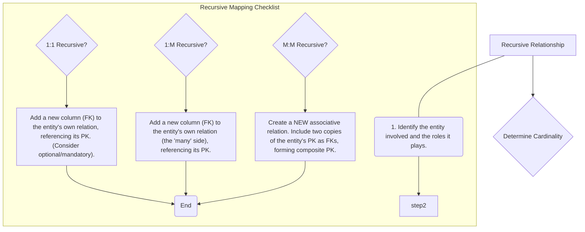
*Note: This `graph TD` diagram provides a "Pilot's Checklist" for mapping recursive relationships. It guides the decision-making process based on the cardinality of the recursive relationship, leading to different mapping strategies within the same entity's relation or the creation of a new associative relation.*

## Context & Framework
#### System Architecture & Dependencies
Recursive relationships create self-referencing dependencies within a single table or by linking a table to an associative table of itself. For example, an `EMPLOYEE` table might have a `ManagerID` column that is a foreign key referencing the `EmployeeID` within the *same* `EMPLOYEE` table. This architectural pattern allows for hierarchical structures (e.g., organizational charts, bill of materials) to be modeled effectively. It ensures that any `ManagerID` (if present) must correspond to an existing `EmployeeID`, thus maintaining referential integrity within the self-referencing structure.

## The Mastery Deep Dive
#### The "Pilot's Checklist" (Do Not Skip)
Mapping recursive relationships follows similar principles to binary relationships, but the foreign key always refers back to the same entity.
- [ ] **1. Identify the Entity and its Roles:** Determine the entity type that participates in the relationship with itself (e.g., `EMPLOYEE`) and the two roles it plays (e.g., `manager` and `subordinate`).
- [ ] **2. Determine Cardinality of the Recursive Relationship:**
    - [ ] **One-to-One (1:1) Recursive:**
        - [ ] Add a new column to the entity's own relation (e.g., `SupervisorID` in `EMPLOYEE`).
        - [ ] This new column acts as a foreign key referencing the primary key of the same relation (e.g., `EmployeeID`).
        - [ ] Consider participation: If mandatory on both sides, it might be integrated. If optional, the FK can be null.
        *Example*: `PERSON` `IS_MARRIED_TO` `PERSON` (1:1, optional). `PERSON(PersonID, Name, SpouseID (FK))`
    - [ ] **One-to-Many (1:M) Recursive:**
        - [ ] This is the most common. The 'one' side (e.g., `manager`) defines the primary key, and the 'many' side (e.g., `subordinate`) receives the foreign key.
        - [ ] Add a new column to the entity's own relation (the 'many' side), which is a foreign key referencing the primary key of the same relation (e.g., `ManagerID` in `EMPLOYEE` referencing `EmployeeID`).
        *Example*: `EMPLOYEE` `MANAGES` `EMPLOYEE` (1:M). `EMPLOYEE(EmployeeID, Name, ManagerID (FK))`
    - [ ] **Many-to-Many (M:M) Recursive:**
        - [ ] Similar to a regular M:M relationship, a **new associative relation** must be created.
        - [ ] This new relation will contain two copies of the entity's primary key, each acting as a foreign key, referring back to the original entity.
        - [ ] These two foreign keys will together form the composite primary key of the associative relation.
        *Example*: `PART` `IS_COMPOSED_OF` `PART` (M:M, for Bill of Materials). Create `PART_COMPOSITION(ComponentID (FK), SubcomponentID (FK), Quantity)`. PK is `(ComponentID, SubcomponentID)`.

#### How the Parts Talk to Each Other
In a recursive relationship like `Employee` `manages` `Employee`, the `ManagerID` column in the `EMPLOYEE` table is the mechanism by which employees "talk" to their managers (who are also employees). If `ManagerID` is `null`, that employee has no manager (or is the top-level manager). If `ManagerID` contains an `EmployeeID`, that employee directly reports to the employee identified by that `ManagerID`. This internal referencing allows for the dynamic creation of organizational hierarchies or complex self-referential structures within a single set of employee data.

## Constraints & Limitations
#### The Engineering Trade-off
The primary engineering trade-off for recursive relationships, particularly 1:M, is the potential for managing hierarchical queries. While a single foreign key can model the immediate parent-child relationship, querying the entire hierarchy (e.g., "all subordinates of a given manager, no matter how deep") requires specialized recursive SQL queries (e.g., Common Table Expressions - CTEs) which can be more complex to write and less performant than simple joins for shallow hierarchies. However, this is inherent to modeling hierarchies within a relational database.

## Significance & Application
Recursive relationships are vital for modeling hierarchical structures in databases, common in areas such as organizational charts (`EMPLOYEE` manages `EMPLOYEE`), bill of materials (`PART` composed of `PART`), or prerequisites (`COURSE` requires `COURSE`). Academically, they challenge the understanding of foreign keys. Professionally, they enable the construction of dynamic, self-referential data structures that efficiently represent complex, nested dependencies within a single entity type.

## The Worked Example
Let's map a 1:M recursive relationship:

**Scenario:** `EMPLOYEE` (attributes: `EmployeeID` (PK), `Name`) `MANAGES` `EMPLOYEE`:
*   An `EMPLOYEE` can `MANAGE` many other `EMPLOYEE`s.
*   An `EMPLOYEE` is `MANAGED` by at most one other `EMPLOYEE`.
*   The top-level manager has no manager.

**Mapping Steps:**

1.  **Identify Entity:** `EMPLOYEE`
    *   **Cardinality:** 1:M (one manager to many subordinates)
2.  **Add Foreign Key to Same Relation:** Add a new column `ManagerID` to the `EMPLOYEE` table.
3.  **Designate as FK:** `ManagerID` is a foreign key referencing `EmployeeID` within the `EMPLOYEE` table itself. This column can be null for top-level managers.

**Resulting Relation:**
*   `EMPLOYEE(EmployeeID, Name, ManagerID (FK))`

## The Proving Ground
*Test your mastery. Cover the solutions below to test yourself first.*

#### Level 1: The Tool Check (Verification)
**The Question:** What is a recursive relationship in the context of an E-R model?
> **Solution:** A relationship where an entity type is related to itself, meaning instances of the same entity type can play different roles in an association.

#### Level 2: The Routine Run (Mastery & Edge Cases)
**The Scenario:** Describe two different ways to represent a 1:1 recursive relationship where `EMPLOYEE` 'manages' `EMPLOYEE`, considering optional participation on both sides.
> **Solution:**
> 1.  **Adding a Foreign Key to the Same Table:** Add a new column, for example, `ReportsToEmployeeID`, to the `EMPLOYEE` table. This `ReportsToEmployeeID` would be a foreign key referencing the `EmployeeID` within the `EMPLOYEE` table itself. Since participation is optional on both sides, this `ReportsToEmployeeID` column would be nullable.
>     *Example:* `EMPLOYEE(EmployeeID, Name, ReportsToEmployeeID (FK))`
> 2.  **Creating a New Associative Relation:** Create a new table, for example, `EMPLOYEE_MANAGEMENT`. This table would contain two columns, `Employee1ID` and `Employee2ID`, both foreign keys referencing `EmployeeID` in the `EMPLOYEE` table. Their combination `(Employee1ID, Employee2ID)` would form the primary key. This approach is more common for M:M recursive, but can be used for 1:1 optional, albeit with more overhead.

#### Level 3: The Disaster Drill (Mastery & Edge Cases)
**The Scenario:** A 1:M recursive relationship `SUPERVISES` exists on the `EMPLOYEE` entity. A designer created a `SUPERVISOR` table and linked it back to `EMPLOYEE` with a foreign key. Identify the flaw and explain the simpler, more effective mapping strategy.
> **Solution:**
> **Flaw:** Creating a separate `SUPERVISOR` table is redundant and unnecessarily complex. In a recursive relationship, the 'supervisor' is simply another `EMPLOYEE` instance. Creating a separate table duplicates employee information and breaks the natural hierarchy that can be modeled within a single table. It also makes querying for supervisors or subordinates more cumbersome.
>
> **Simpler, More Effective Mapping Strategy:** For a 1:M recursive relationship like `SUPERVISES`, the most effective strategy is to **add a foreign key column directly to the `EMPLOYEE` table itself**. This column, often named `SupervisorID` (or `ReportsToID`), would store the `EmployeeID` of the employee's supervisor. This `SupervisorID` is a foreign key that references the `EmployeeID` column within the *same* `EMPLOYEE` table. This allows for clear hierarchical representation without creating redundant tables. The `SupervisorID` would be nullable for employees who are at the top of the hierarchy.

## Key Takeaways
*   Recursive relationships involve an entity relating to itself.
*   Mapping strategy depends on cardinality (1:1, 1:M, M:M) and participation.
*   For 1:M recursive, a foreign key is added to the entity's own table, referencing its own primary key.
*   For M:M recursive, a new associative relation is created, similar to regular M:M mapping.

## Knowledge Graph Connections
| Concept                     | Connection / Relationship                                                                                                       |
| :
-------------------------- | :
-------------------------------------------------------------------------------------------------------------------------------------- |
| [[Mapping_Relationships_to_Relations]] | This is a specific mapping technique for self-referential associations within the broader E-R to relational translation.           |
| [[Relationship_Types]]      | Recursive relationships are a unique subtype of relationship that describes self-associations.                                          |
| Self_Referencing_Tables | Recursive relationships are directly implemented using self-referencing foreign keys within a single table or an associative table.     |
| Foreign_Keys            | Foreign keys are used to link instances within the same table or to an associative table in recursive mappings.                           |
| Primary_Keys            | The entity's primary key is referenced by the foreign key within the self-referencing structure.                                        |
| Cardinality             | The cardinality of the recursive relationship (1:1, 1:M, M:M) determines the specific mapping strategy to be used.                       |
---

---

## Second Normal Form 2NF


## Definition
Before proceeding, ensure you master [[First_Normal_Form_1NF]] and Full_Functional_Dependency.
Second Normal Form (2NF) is the next level of database normalization, building upon 1NF. A relation (table) is in 2NF if and only if it is in **First Normal Form (1NF)** AND every non-primary-key attribute is **fully functionally dependent** on the primary key. This means that no non-primary-key attribute can be dependent on only a *proper subset* of a composite primary key (i.e., there are no partial functional dependencies). Achieving 2NF further reduces data redundancy and eliminates update anomalies associated with partial dependencies. Think of it as ensuring that every detail in a report about a multi-part item (like an order item) genuinely belongs to the *entire* item's identifier, not just one part of it.

## The Mental Model
Imagine a combined report for "Order Items" that lists the `Order ID`, `Product ID`, `Order Date`, and `Product Name`. If the `Order ID` and `Product ID` together form the unique identifier (primary key), `Order Date` only depends on the `Order ID`, and `Product Name` only depends on the `Product ID`. This means `Order Date` and `Product Name` are **partially dependent** on the primary key. To get to `2NF`, you'd split this into three reports: one for "Orders" (with `Order Date`), one for "Products" (with `Product Name`), and a linking report for "Order Items" (just `Order ID` and `Product ID`). Each report now only contains information fully related to its main identifier.

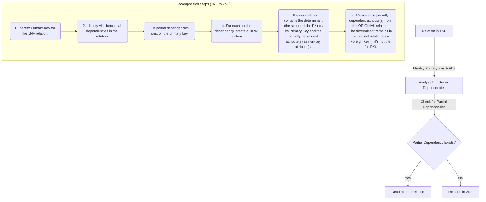
*Note: This `graph TD` diagram outlines the process of converting a 1NF relation to Second Normal Form (2NF). It emphasizes the critical step of identifying and removing partial functional dependencies by decomposing the relation into new, more focused relations. The determinant of the partial dependency becomes the primary key of the new relation.*

## Context & Framework
#### How the Parts Talk to Each Other
Second Normal Form (2NF) ensures a more refined conversation between attributes and the primary key. Before 2NF, some attributes might be whispering to just *part* of a composite primary key, creating confusion and redundancy. 2NF forces every non-key attribute to speak directly and exclusively to the *entire* primary key. This clarification is vital for database architecture, as it isolates facts that don't depend on the whole key into their own tables. This structural integrity is a foundational dependency for moving to 3NF and for building a truly robust relational model.

#### The Translator: From "Lego" to "Jargon"
The concept of "full functional dependency" is the precise jargon used to enforce 2NF. It's the "Lego" instruction that says, "If this block (attribute) attaches to a multi-part structure (composite key), it must attach to *all* parts, not just one side." A partial dependency is like a piece stuck to only half a block. By ensuring full functional dependency, 2NF translates potential data integrity failures into distinct, well-defined tables, making the database's structure clear and preventing the anomalies that arise from facts that aren't fully dependent on their identifier.

## The Mastery Deep Dive
#### Rules for Second Normal Form (2NF)
A relation is in 2NF if and only if:
1.  It is in **First Normal Form (1NF)**.
2.  Every **non-primary-key attribute** is **fully functionally dependent** on the primary key. This means there are **no partial functional dependencies**.

**Partial Functional Dependency (Reminder):** Occurs when a non-primary-key attribute is dependent on only *part* of a composite primary key.

#### Converting 1NF to 2NF
The process of converting a 1NF relation to 2NF involves identifying and removing partial functional dependencies.

**Steps:**
1.  **Identify the Primary Key:** Determine the primary key (which might be a composite key) for the 1NF relation.
2.  **Identify All Functional Dependencies:** List all functional dependencies present in the relation.
3.  **Check for Partial Dependencies:** Examine if any non-primary-key attribute is functionally dependent on only a proper subset of the primary key.
4.  **Remove Partial Dependencies (Decomposition):**
    *   For each partial dependency identified:
        *   Create a **new relation**.
        *   The **determinant** of the partial dependency (the subset of the primary key) becomes the **primary key** of this new relation.
        *   The **partially dependent attribute(s)** are moved to this new relation as non-key attributes.
        *   The partially dependent attributes are **removed from the original relation**.
        *   The determinant (the subset of the original PK) **remains in the original relation** as a foreign key, ensuring the link is maintained.

**Example:**
Consider a 1NF relation `ORDER_DETAILS(OrderID, ProductID, CustomerName, OrderDate, ProductName, Price, Quantity)`.
Assume `(OrderID, ProductID)` is the primary key.

**Functional Dependencies:**
*   `OrderID` → `CustomerName`, `OrderDate` (Partial dependency on `OrderID`)
*   `ProductID` → `ProductName`, `Price` (Partial dependency on `ProductID`)
*   `OrderID, ProductID` → `Quantity` (Fully dependent on the composite PK)

**Conversion to 2NF:**

1.  **Remove `OrderID` → `CustomerName, OrderDate`:**
    *   Create new relation: `ORDERS(OrderID, CustomerName, OrderDate)`
    *   `OrderID` is PK of `ORDERS`.
    *   Remove `CustomerName`, `OrderDate` from `ORDER_DETAILS`.
    *   `OrderID` remains in `ORDER_DETAILS` as a foreign key.

2.  **Remove `ProductID` → `ProductName, Price`:**
    *   Create new relation: `PRODUCTS(ProductID, ProductName, Price)`
    *   `ProductID` is PK of `PRODUCTS`.
    *   Remove `ProductName`, `Price` from `ORDER_DETAILS`.
    *   `ProductID` remains in `ORDER_DETAILS` as a foreign key.

**Resulting 2NF Relations:**
*   `ORDERS(OrderID, CustomerName, OrderDate)`
*   `PRODUCTS(ProductID, ProductName, Price)`
*   `ORDER_ITEMS(OrderID (FK), ProductID (FK), Quantity)`
    *   `ORDER_ITEMS` now has `(OrderID, ProductID)` as its primary key, and `Quantity` is fully dependent on it.
    *   `OrderID` is FK to `ORDERS`, `ProductID` is FK to `PRODUCTS`.

## Constraints & Limitations
#### The Engineering Trade-off
While 2NF eliminates partial dependencies and reduces redundancy, it does not address transitive dependencies (where a non-key attribute depends on another non-key attribute). This means a relation in 2NF can still contain redundancy and be susceptible to update anomalies, particularly modification anomalies. Therefore, 2NF is a necessary improvement over 1NF but is typically not the final goal of normalization; progression to `Third_Normal_Form_3NF` is usually required.

## Significance & Application
Second Normal Form is a crucial step in database normalization, ensuring that each non-key attribute in a relation directly relates to the entire primary key. Academically, it formalizes the concept of eliminating partial dependencies. Professionally, achieving 2NF significantly reduces data redundancy and prevents update anomalies that arise when attributes are only partially dependent on the primary key, leading to a more consistent and maintainable database schema, especially for composite primary keys.

## The Worked Example
Consider a 1NF relation for `EMPLOYEE_PROJECT_HOURS`:
`EMPLOYEE_PROJECT_HOURS(EmpID, ProjID, EmpName, ProjName, HoursWorked)`
Primary Key: `(EmpID, ProjID)`

Functional Dependencies:
1.  `EmpID` → `EmpName` (Partial dependency: `EmpName` depends on `EmpID` only)
2.  `ProjID` → `ProjName` (Partial dependency: `ProjName` depends on `ProjID` only)
3.  `(EmpID, ProjID)` → `HoursWorked` (Full functional dependency)

**Conversion to 2NF:**

1.  **Remove `EmpID` → `EmpName`:**
    *   Create new relation: `EMPLOYEES(EmpID, EmpName)`
    *   `EmpID` is PK of `EMPLOYEES`.
    *   Remove `EmpName` from original relation.
    *   `EmpID` remains in original relation as a foreign key.

2.  **Remove `ProjID` → `ProjName`:**
    *   Create new relation: `PROJECTS(ProjID, ProjName)`
    *   `ProjID` is PK of `PROJECTS`.
    *   Remove `ProjName` from original relation.
    *   `ProjID` remains in original relation as a foreign key.

**Resulting 2NF Relations:**
*   `EMPLOYEES(EmpID, EmpName)`
*   `PROJECTS(ProjID, ProjName)`
*   `ASSIGNMENTS(EmpID (FK), ProjID (FK), HoursWorked)`
    *   `ASSIGNMENTS` has `(EmpID, ProjID)` as its primary key, and `HoursWorked` is fully dependent on it.
    *   `EmpID` is FK to `EMPLOYEES`, `ProjID` is FK to `PROJECTS`.

## The Proving Ground
*Test your mastery. Cover the solutions below to test yourself first.*

#### Level 1: The Tool Check (Verification)
**The Question:** What two conditions must a relation satisfy to be in Second Normal Form (2NF)?
> **Solution:** A relation must be in First Normal Form (1NF), and every non-primary-key attribute must be fully functionally dependent on the primary key (i.e., there are no partial functional dependencies).

#### Level 2: The Routine Run (Mastery & Edge Cases)
**The Scenario:** Consider a 1NF relation `ORDER_DETAILS(OrderID, ProductID, CustomerID, CustomerName, Quantity, Price)`. Assume `OrderID, ProductID` is the primary key. If `CustomerID → CustomerName` and `ProductID → Price`, demonstrate the steps to convert this relation to 2NF.
> **Solution:**
> **Initial 1NF Relation and FDs:**
> `ORDER_DETAILS(OrderID, ProductID, CustomerID, CustomerName, Quantity, Price)`
> Primary Key: `(OrderID, ProductID)`
> Functional Dependencies:
> 1.  `OrderID` → `CustomerID`, `CustomerName` (Partial dependency on `OrderID`)
> 2.  `ProductID` → `Price` (Partial dependency on `ProductID`)
> 3.  `CustomerID` → `CustomerName` (This is a transitive dependency that 2NF doesn't address, but it's important to note for 3NF later).
> 4.  `(OrderID, ProductID)` → `Quantity` (Full functional dependency)
>
> **Steps to Convert to 2NF:**
> 1.  **Address Partial Dependency `OrderID` → `CustomerID`, `CustomerName`:**
>     *   Create a new relation: `ORDERS(OrderID, CustomerID, CustomerName)`
>     *   `OrderID` is the primary key of `ORDERS`.
>     *   Remove `CustomerID`, `CustomerName` from `ORDER_DETAILS`. `OrderID` remains as a foreign key.
> 2.  **Address Partial Dependency `ProductID` → `Price`:**
>     *   Create a new relation: `PRODUCTS(ProductID, Price)`
>     *   `ProductID` is the primary key of `PRODUCTS`.
>     *   Remove `Price` from `ORDER_DETAILS`. `ProductID` remains as a foreign key.
>
> **Resulting 2NF Relations:**
> *   `ORDERS(OrderID, CustomerID, CustomerName)` (Note: `CustomerID → CustomerName` is still a transitive dependency in this table, to be addressed in 3NF).
> *   `PRODUCTS(ProductID, Price)`
> *   `ORDER_ITEMS(OrderID (FK), ProductID (FK), Quantity)`

#### Level 3: The Disaster Drill (Mastery & Edge Cases)
**The Scenario:** A `PROJECT_ASSIGNMENT` table is in 1NF with `(ProjectID, EmployeeID)` as its primary key. It also contains `ProjectName`, `EmployeeName`, and `HourlyRate`. Functional dependencies are `ProjectID → ProjectName` and `EmployeeID → EmployeeName, HourlyRate`. Explain why this table is not in 2NF and precisely outline the decomposition required to achieve 2NF.
> **Solution:**
> **Why the table is not in 2NF:**
> The `PROJECT_ASSIGNMENT` table is not in 2NF because it contains **partial functional dependencies**.
> 1.  `ProjectName` is dependent only on `ProjectID`, which is a proper subset of the composite primary key `(ProjectID, EmployeeID)`.
> 2.  `EmployeeName` and `HourlyRate` are dependent only on `EmployeeID`, which is also a proper subset of the composite primary key `(ProjectID, EmployeeID)`.
> These partial dependencies violate the 2NF rule that all non-primary-key attributes must be fully functionally dependent on the entire primary key.
>
> **Decomposition Required to Achieve 2NF:**
> 1.  **For the partial dependency `ProjectID → ProjectName`:**
>     *   Create a new relation named `PROJECTS`.
>     *   `PROJECTS` will have `ProjectID` as its primary key and `ProjectName` as its non-key attribute.
>     *   Remove `ProjectName` from the `PROJECT_ASSIGNMENT` table.
> 2.  **For the partial dependency `EmployeeID → EmployeeName, HourlyRate`:**
>     *   Create a new relation named `EMPLOYEES`.
>     *   `EMPLOYEES` will have `EmployeeID` as its primary key and `EmployeeName` and `HourlyRate` as its non-key attributes.
>     *   Remove `EmployeeName` and `HourlyRate` from the `PROJECT_ASSIGNMENT` table.
>
> **Resulting 2NF Relations:**
> *   `PROJECTS(ProjectID, ProjectName)`
> *   `EMPLOYEES(EmployeeID, EmployeeName, HourlyRate)`
> *   `PROJECT_ASSIGNMENT(ProjectID (FK), EmployeeID (FK))`
>     *   The `PROJECT_ASSIGNMENT` table now only contains the components of its original primary key. Its primary key remains `(ProjectID, EmployeeID)`. `ProjectID` is an FK to `PROJECTS`, and `EmployeeID` is an FK to `EMPLOYEES`.

## Key Takeaways
*   2NF builds on 1NF by requiring every non-primary-key attribute to be fully functionally dependent on the entire primary key.
*   It eliminates partial functional dependencies, where a non-key attribute depends only on a subset of a composite primary key.
*   Achieving 2NF typically involves decomposing the original relation into smaller, more focused relations.

## Knowledge Graph Connections
| Concept                     | Connection / Relationship                                                                                                               |
| :
-------------------------- | :
-------------------------------------------------------------------------------------------------------------------------------------- |
| [[First_Normal_Form_1NF]]   | A relation must be in 1NF as a prerequisite to being in 2NF.                                                                          |
| [[Normalization_in_Database_Design]] | 2NF is the second step in the hierarchical process of database normalization.                                                           |
| Full_Functional_Dependency | The definition of 2NF directly relies on the concept of full functional dependency and the absence of partial functional dependencies.    |
| Partial_Functional_Dependency | 2NF is specifically designed to identify and eliminate partial functional dependencies, which are a source of redundancy.               |
| [[Data_Redundancy_and_Update_Anomalies]] | By removing partial dependencies, 2NF significantly reduces data redundancy and prevents associated update anomalies.                 |
| Primary_Keys            | Understanding composite primary keys is crucial for identifying partial functional dependencies and applying 2NF rules.                   |
| [[Third_Normal_Form_3NF]]   | 2NF is a necessary step before achieving 3NF, which addresses transitive dependencies.                                                  |
---

---

## Superclass Subclass Relationships


## Definition
Before proceeding, ensure you master [[Entity_Types]] and Generalization_Specialization.
Superclass/subclass relationships (also known as generalization/specialization hierarchies) represent a hierarchical association between a general entity type (superclass) and one or more specialized entity types (subclasses). Subclasses inherit attributes and relationships from their superclass, but also possess their own unique attributes and relationships. When mapping these to a relational model, several strategies exist, chosen based on factors like disjointness, completeness (participation), and attribute distribution, ensuring that both shared and specialized characteristics are accurately represented without redundancy. Think of `Vehicle` as a superclass with subclasses `Car` and `Truck`.

## The Mental Model
Imagine a broad category "Animal" (`Superclass`). Within "Animal," you have more specific types like "Mammal" and "Bird" (`Subclasses`). Both Mammals and Birds are Animals (they inherit "lives," "eats"), but Mammals have "fur" and "give live birth," while Birds have "feathers" and "lay eggs." When mapping this, you need to decide: do you put all animal characteristics and *all possible* mammal/bird characteristics into one giant "Animal" table (with many empty fields)? Or do you create a main "Animal" table and separate "Mammal" and "Bird" tables that only store their unique traits and link back to the Animal table? The best choice depends on how often you need to see all animals versus just one type.

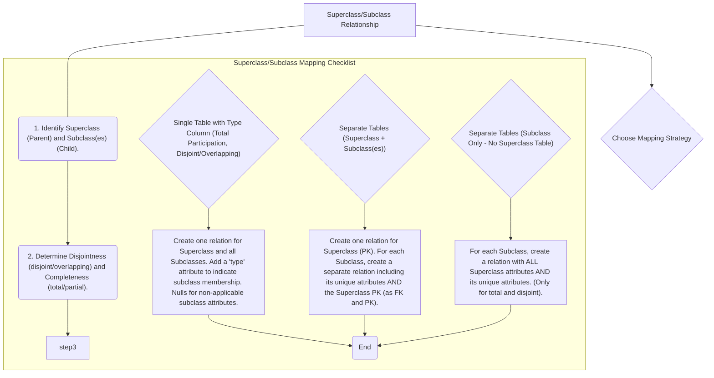
*Note: This `graph TD` diagram provides a "Pilot's Checklist" for mapping superclass/subclass relationships. It guides the decision-making process based on disjointness and completeness constraints, outlining three primary mapping strategies for these complex hierarchies.*

## Context & Framework
#### System Architecture & Dependencies
Superclass/subclass mappings fundamentally shape the hierarchical and inheritance-like aspects of a database schema. Each mapping strategy (single table, multiple tables with shared primary key, or separate tables for subclasses only) creates different architectural dependencies and data distributions. For instance, using separate tables for subclasses establishes strong referential integrity: a `CAR` record is dependent on a `VEHICLE` record, with `VIN` acting as both a primary and foreign key. This framework ensures that common attributes are managed efficiently while specialized attributes are handled appropriately, providing flexibility in modeling complex entities.

## The Mastery Deep Dive
#### The "Pilot's Checklist" (Do Not Skip)
Mapping superclass/subclass relationships involves choosing one of several strategies, based on the `disjointness` (whether an instance of the superclass can belong to more than one subclass) and `completeness` (whether every instance of the superclass *must* belong to at least one subclass).

- [ ] **1. Identify Superclass and Subclass(es):** Clearly define the general superclass entity (e.g., `PERSON`) and its specialized subclass entities (e.g., `STUDENT`, `FACULTY`).
- [ ] **2. Determine Disjointness and Completeness:**
    -   **Disjoint:** An instance of the superclass belongs to at most one subclass (`d`).
    -   **Overlapping:** An instance of the superclass can belong to multiple subclasses (`o`).
    -   **Total (Mandatory Participation):** Every instance of the superclass must belong to at least one subclass.
    -   **Partial (Optional Participation):** An instance of the superclass may not belong to any subclass.

- [ ] **Strategy A: Single Table with Type Column (Table-per-Hierarchy)**
    - [ ] **Applicability:** Works well for both disjoint and overlapping, and total or partial participation.
    - [ ] **Method:** Create **one single relation** that includes all attributes of the superclass AND all unique attributes of all subclasses.
    - [ ] Add a special "type" or "discriminator" attribute to indicate which subclass an instance belongs to.
    - [ ] Non-applicable subclass attributes for a given row will contain `NULL` values.
    - *Example*: `PERSON(PersonID, Name, DateOfBirth, StudentID, Major, FacultyID, Department, Type)` (`Type` could be 'Student' or 'Faculty').

- [ ] **Strategy B: Separate Tables (Superclass Table + Subclass Tables) (Table-per-Concrete-Class or Table-per-Type)**
    - [ ] **Applicability:** Best for disjoint relationships, especially if partial participation is allowed, or if subclasses have many unique attributes/relationships.
    - [ ] **Method:**
        1.  Create one relation for the **Superclass**, containing all its common attributes and its primary key.
        2.  For **each Subclass**, create a separate relation. This subclass relation contains only its unique attributes AND the primary key of the superclass.
        3.  The superclass primary key in the subclass table acts as both its **primary key** and a **foreign key** referencing the superclass table.
    - *Example*: `PERSON(PersonID, Name, DateOfBirth)`
                `STUDENT(PersonID (PK,FK), StudentID, Major)`
                `FACULTY(PersonID (PK,FK), FacultyID, Department)`

- [ ] **Strategy C: Separate Tables (Subclass Only - No Superclass Table) (Table-per-Subclass)**
    - [ ] **Applicability:** Only for **total and disjoint** relationships.
    - [ ] **Method:** For **each Subclass**, create a separate relation. Each subclass relation includes **all** attributes of the superclass AND its own unique attributes. There is no separate superclass table.
    - *Example*: (If `PERSON` is *always* either `STUDENT` or `FACULTY`, and never both)
                `STUDENT(PersonID, Name, DateOfBirth, StudentID, Major)`
                `FACULTY(PersonID, Name, DateOfBirth, FacultyID, Department)`
                *(Here `PersonID` is PK in both tables)*

#### How the Parts Talk to Each Other
In the "Separate Tables (Superclass + Subclass(es))" strategy, the `PersonID` in the `STUDENT` table is the direct link (foreign key and primary key) that connects a student record back to its corresponding general `PERSON` record. This allows `STUDENT` and `FACULTY` to inherit common "person-ness" from the `PERSON` table, while still maintaining their unique characteristics. This shared `PersonID` acts as a common language, enabling all parts of the hierarchy to communicate and reference each other accurately.

## Constraints & Limitations
#### The Engineering Trade-off
The engineering trade-off for superclass/subclass relationships is significant.
*   **Single Table (Strategy A):** Simpler for querying *all* instances (e.g., "all persons"), but leads to many `NULL` values for non-applicable subclass attributes, wasting space and potentially complicating queries for specific subclass data.
*   **Separate Tables (Superclass + Subclass(es)) (Strategy B):** Reduces `NULL`s, clearer semantic separation, but requires joins to retrieve complete information about a subclass instance (e.g., a student's name and major).
*   **Separate Tables (Subclass Only) (Strategy C):** Avoids joins for subclass-specific queries but duplicates superclass attributes across multiple tables, increasing redundancy and making updates to common attributes more complex.

The choice is a trade-off between query performance, storage efficiency, and ease of maintenance, and should be based on the specific access patterns and business requirements.

## Significance & Application
Superclass/subclass mapping is crucial for modeling complex, real-world hierarchies in database systems, enabling code reusability and more structured data. Academically, it's an advanced E-R concept. Practically, it's used in diverse fields like human resources (`EMPLOYEE` as superclass, `HOURLY_EMPLOYEE`, `SALARIED_EMPLOYEE` as subclasses), product catalogs (`PRODUCT` as superclass, `ELECTRONICS`, `CLOTHING`), and financial systems, allowing for efficient management of entities with both common and specialized characteristics.

## The Worked Example
Let's map a Superclass/Subclass relationship using Strategy B (Superclass Table + Subclass Tables):

**Scenario:** `STAFF` (attributes: `StaffID` (PK), `Name`, `StartDate`) is a superclass with two disjoint and total subclasses: `PERMANENT_STAFF` (unique attributes: `PensionPlanNo`, `Salary`) and `CONTRACT_STAFF` (unique attributes: `ContractEndDate`, `HourlyRate`).

**Mapping Strategy (Strategy B chosen due to disjoint and total, but allows for clear separation):**

1.  **Superclass Table:** `STAFF`
    *   Attributes: `StaffID` (PK), `Name`, `StartDate`
    *   Result: `STAFF(StaffID, Name, StartDate)`

2.  **Subclass Table: `PERMANENT_STAFF`**
    *   Attributes: `PensionPlanNo`, `Salary`
    *   Inherits `StaffID` from `STAFF` as PK and FK.
    *   Result: `PERMANENT_STAFF(StaffID (PK,FK), PensionPlanNo, Salary)`

3.  **Subclass Table: `CONTRACT_STAFF`**
    *   Attributes: `ContractEndDate`, `HourlyRate`
    *   Inherits `StaffID` from `STAFF` as PK and FK.
    *   Result: `CONTRACT_STAFF(StaffID (PK,FK), ContractEndDate, HourlyRate)`

## The Proving Ground
*Test your mastery. Cover the solutions below to test yourself first.*

#### Level 1: The Tool Check (Verification)
**The Question:** What are superclass/subclass relationships, and why are they complex to map to relations?
> **Solution:** Superclass/subclass relationships are hierarchical associations between a general entity (superclass) and specialized entities (subclasses). They are complex to map because subclasses inherit attributes and relationships from the superclass while also having their own unique ones, requiring careful strategies to avoid redundancy and manage data distribution.

#### Level 2: The Routine Run (Mastery & Edge Cases)
**The Scenario:** Outline one common option for representing a superclass `PERSON` with subclasses `STUDENT` and `FACULTY` in a relational schema, assuming disjoint and mandatory participation.
> **Solution:** A common option for this scenario (disjoint and mandatory) is **Strategy B: Separate Tables (Superclass Table + Subclass Tables)**.
> 1.  Create a `PERSON` table with common attributes (e.g., `PersonID` (PK), `Name`, `DateOfBirth`).
> 2.  Create a `STUDENT` table with its unique attributes (e.g., `StudentID`, `Major`) and include `PersonID` as both its primary key and a foreign key referencing the `PERSON` table.
> 3.  Create a `FACULTY` table with its unique attributes (e.g., `FacultyID`, `Department`) and include `PersonID` as both its primary key and a foreign key referencing the `PERSON` table.

#### Level 3: The Disaster Drill (Mastery & Edge Cases)
**The Scenario:** A superclass `VEHICLE` has subclasses `CAR` and `TRUCK`. A designer decided to create separate tables for `CAR` and `TRUCK`, each duplicating common `VEHICLE` attributes like `VIN` and `Manufacturer`. Explain the potential redundancy and a better approach for this scenario.
> **Solution:**
> **Potential Redundancy:** If `CAR` and `TRUCK` tables each contain all common `VEHICLE` attributes (like `VIN`, `Manufacturer`, `Model`), this leads to significant data redundancy. If `VIN` or `Manufacturer` details need to be updated, they would have to be updated in potentially multiple tables, increasing the risk of inconsistencies (e.g., a `CAR` record having one `Manufacturer` while a `TRUCK` record has another for the same conceptual vehicle if the design allowed for overlapping subclasses, or simply if the data entry was inconsistent).
>
> **Better Approach:** A much better approach is **Strategy B: Separate Tables (Superclass Table + Subclass Tables)**.
> 1.  Create a **`VEHICLE` table** as the superclass, containing all common attributes (e.g., `VIN` (PK), `Manufacturer`, `Model`, `Year`).
> 2.  Create separate subclass tables for `CAR` and `TRUCK`.
> 3.  The `CAR` table would contain only its unique attributes (e.g., `NumberOfDoors`, `CarType`) and have `VIN` as both its primary key and a foreign key referencing the `VEHICLE` table.
> 4.  The `TRUCK` table would contain only its unique attributes (e.g., `PayloadCapacity`, `AxleConfiguration`) and also have `VIN` as both its primary key and a foreign key referencing the `VEHICLE` table.
>
> This design eliminates redundancy for common attributes, centralizes their management in the `VEHICLE` table, and maintains clear separation for subclass-specific details, while still allowing for full vehicle information to be retrieved via a simple join.

## Key Takeaways
*   Superclass/subclass relationships model hierarchical data (general to specific).
*   Mapping strategies (single table, superclass + subclass tables, subclass only) depend on disjointness and completeness.
*   The chosen strategy impacts redundancy, data sparsity, query complexity, and maintenance.

## Knowledge Graph Connections
| Concept                     | Connection / Relationship                                                                                                       |
| :
-------------------------- | :
-------------------------------------------------------------------------------------------------------------------------------------- |
| [[Mapping_Relationships_to_Relations]] | This is an advanced and complex type of relationship mapping within E-R to relational translation.                                  |
| [[Entity_Types]]            | Superclass and subclass are specialized types of entities that participate in hierarchical relationships.                             |
| Generalization_Specialization | This concept is synonymous with superclass/subclass relationships, forming the basis for their mapping.                             |
| Foreign_Keys            | Foreign keys (often combined with primary keys) are used to link subclass tables to superclass tables.                                |
| Primary_Keys            | Primary keys, particularly shared ones, are central to linking superclass and subclass tables.                                        |
| Disjointness_Constraint | The disjointness constraint (disjoint or overlapping) is a key factor in choosing the appropriate mapping strategy.                     |
| Completeness_Constraint | The completeness constraint (total or partial participation) also significantly influences the mapping strategy for these hierarchies.  |
---

---

## Third Normal Form 3NF


## Definition
Before proceeding, ensure you master [[Second_Normal_Form_2NF]] and [[Transitive_Dependencies]].
Third Normal Form (3NF) is a level of database normalization that builds upon 2NF. A relation (table) is in 3NF if and only if it is in **Second Normal Form (2NF)** AND in which no non-primary-key attribute is **transitively dependent** on the primary key. This means that if `A → B` and `B → C` exist in a relation, then `B` must be a superkey (or candidate key) for `A`, or `C` must be part of the primary key, effectively eliminating situations where a non-key attribute determines another non-key attribute. Achieving 3NF further reduces data redundancy and prevents update anomalies, especially modification anomalies associated with transitive dependencies. Think of it as ensuring every detail in a report directly relates to the main subject, not indirectly through another detail.

## The Mental Model
Imagine you have a class roster that lists `StudentID`, `StudentName`, `AdvisorID`, `AdvisorName`, and `AdvisorOfficeNumber`. `StudentID` is the key. `StudentID` determines `AdvisorID`, and `AdvisorID` determines `AdvisorName` and `AdvisorOfficeNumber`. This means `AdvisorName` and `AdvisorOfficeNumber` are `transitively dependent` on `StudentID` (through `AdvisorID`). To reach `3NF`, you'd split this: one list for `Students` (with their `AdvisorID`), and another list for `Advisors` (with their `AdvisorName` and `AdvisorOfficeNumber`). Now, if an advisor changes their office, you only update it once in the `Advisor` list.

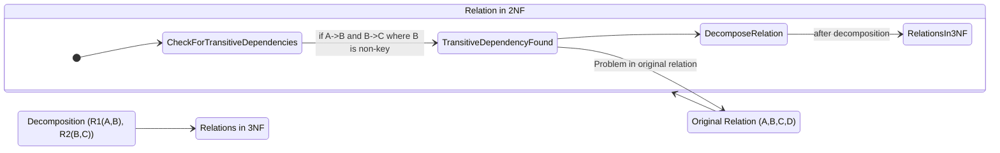
*Note: This `stateDiagram-v2` visualizes the process of achieving Third Normal Form (3NF) from a 2NF relation. It highlights the crucial step of "CheckForTransitiveDependencies" and shows that if a transitive dependency is found, the relation is decomposed to produce relations in 3NF. This diagram adheres strictly to Mermaid syntax, including proper state declarations and transitions.*

## Context & Framework
#### How the Parts Talk to Each Other
Third Normal Form enforces an even stricter conversation within relations: non-key attributes must only "talk" directly to the primary key, not to other non-key attributes. This eliminates indirect dependencies, which often manifest as `Transitive_Dependencies`. The framework of 3NF ensures that the database architecture is highly cohesive, with each table representing a single subject, and all its non-key attributes describing that subject directly. This structural clarity is a foundational dependency for building robust, anomaly-free relational database systems.

#### The Engineering Trade-off
Recognizing and eliminating transitive dependencies is a critical engineering trade-off. While it means decomposing a table into two or more smaller tables, potentially requiring an extra JOIN operation for certain queries, the benefits are substantial. This trade-off prioritizes data integrity and ease of maintenance over a slight increase in query complexity. The resulting 3NF tables are less prone to update anomalies, reducing the risk of inconsistent data and making the database significantly more reliable and easier to manage in the long run.

## The Mastery Deep Dive
#### The "Pilot's Checklist" (Do Not Skip)
Achieving Third Normal Form is about eliminating transitive dependencies to further streamline relations.

- [ ] **1. Ensure the Relation is in 2NF:** 3NF is built upon 2NF, so all partial functional dependencies must already be removed.
- [ ] **2. Identify the Primary Key:** Understand the primary key (PK) of the 2NF relation.
- [ ] **3. Identify All Functional Dependencies (FDs):** List all FDs within the relation.
- [ ] **4. Check for Transitive Dependencies:** Look for FDs of the form `A → B` and `B → C`, where `A` is the primary key (or part of it), `B` is a non-key attribute (or set of non-key attributes), and `C` is also a non-key attribute. Crucially, `B` must not be a superkey (candidate key) of the original relation.
- [ ] **5. Remove Transitive Dependencies (Decomposition):**
    *   For each transitive dependency `A → B → C` identified:
        *   Create a **new relation** with `B` as its primary key and `C` as its non-key attribute(s).
        *   Remove `C` from the **original relation**.
        *   `B` (the determinant of `C`) remains in the original relation but now acts as a foreign key, referencing the primary key `B` in the new relation.

**Example:**
Consider a 2NF relation `BOOK_DETAILS(BookID, Title, PublisherID, PublisherName, PublisherCity)`.
Assume `BookID` is the primary key.

**Functional Dependencies:**
*   `BookID` → `Title`, `PublisherID`, `PublisherName`, `PublisherCity`
*   `PublisherID` → `PublisherName`, `PublisherCity` (This is the transitive dependency)

Here:
*   `A = BookID` (Primary Key)
*   `B = PublisherID` (Non-key attribute)
*   `C = PublisherName, PublisherCity` (Non-key attributes)

We have `BookID → PublisherID` and `PublisherID → PublisherName, PublisherCity`.
Thus, `PublisherName` and `PublisherCity` are transitively dependent on `BookID` via `PublisherID`.

**Conversion to 3NF:**

1.  **Create a new relation for the transitive dependency:**
    *   `PUBLISHER(PublisherID, PublisherName, PublisherCity)`
    *   `PublisherID` is the primary key of `PUBLISHER`.
2.  **Remove the transitively dependent attributes from the original relation:**
    *   Remove `PublisherName` and `PublisherCity` from `BOOK_DETAILS`.
3.  **Ensure the determinant remains as a foreign key:**
    *   `PublisherID` remains in the `BOOK_DETAILS` relation as a foreign key, referencing `PUBLISHER(PublisherID)`.

**Resulting 3NF Relations:**
*   `BOOK(BookID, Title, PublisherID (FK))`
*   `PUBLISHER(PublisherID, PublisherName, PublisherCity)`

## Constraints & Limitations
#### The Engineering Trade-off
The primary "limitation" of 3NF is that it does not completely eliminate all types of redundancy in certain specific, rare cases (addressed by Boyce-Codd Normal Form - BCNF). Specifically, if a relation has multiple overlapping candidate keys and one of them is a determinant for a non-key attribute, 3NF might still allow some redundancy. However, for most practical database designs, 3NF is considered a highly robust and sufficient level of normalization, balancing data integrity with query performance.

## Significance & Application
Third Normal Form (3NF) is widely considered the gold standard for relational database design in most transactional systems. Academically, it formalizes the removal of transitive dependencies, which are a common source of redundancy. Professionally, achieving 3NF is critical for building highly maintainable, consistent, and anomaly-free databases. It ensures data is organized logically, simplifying updates, preventing inconsistencies, and forming a robust foundation for applications.

## The Worked Example
Let's convert a 2NF relation to 3NF.

**2NF Relation:** `COURSE_INSTRUCTOR(CourseID, CourseName, InstructorID, InstructorName)`
Primary Key: `CourseID`

Functional Dependencies:
1.  `CourseID` → `CourseName, InstructorID, InstructorName`
2.  `InstructorID` → `InstructorName` (Transitive dependency: `CourseID` → `InstructorID` → `InstructorName`)

Here:
*   `A = CourseID` (Primary Key)
*   `B = InstructorID` (Non-key attribute)
*   `C = InstructorName` (Non-key attribute)

**Conversion to 3NF:**

1.  **Create a new relation for the transitive dependency:**
    *   `INSTRUCTORS(InstructorID, InstructorName)`
    *   `InstructorID` is the primary key of `INSTRUCTORS`.
2.  **Remove `InstructorName` from `COURSE_INSTRUCTOR`.**
3.  **`InstructorID` remains in `COURSE_INSTRUCTOR` as a foreign key.**

**Resulting 3NF Relations:**
*   `COURSE(CourseID, CourseName, InstructorID (FK))`
*   `INSTRUCTORS(InstructorID, InstructorName)`

## The Proving Ground
*Test your mastery. Cover the solutions below to test yourself first.*

#### Level 1: The Tool Check (Verification)
**The Question:** What three conditions must a relation satisfy to be in Third Normal Form (3NF)?
> **Solution:** A relation must be in First Normal Form (1NF), Second Normal Form (2NF), and no non-primary-key attribute is transitively dependent on the primary key.

#### Level 2: The Routine Run (Mastery & Edge Cases)
**The Scenario:** Take a 2NF relation `BOOK_PUBLISHER(BookID, Title, PublisherID, PublisherName, PublisherCity)`. Assume `BookID` is the primary key and `PublisherID → PublisherName, PublisherCity`. Demonstrate the steps to convert this relation to 3NF.
> **Solution:**
> **Initial 2NF Relation and FDs:**
> `BOOK_PUBLISHER(BookID, Title, PublisherID, PublisherName, PublisherCity)`
> Primary Key: `BookID`
> Functional Dependencies:
> 1.  `BookID` → `Title`, `PublisherID`, `PublisherName`, `PublisherCity`
> 2.  `PublisherID` → `PublisherName`, `PublisherCity` (Transitive dependency via `PublisherID`)
>
> **Steps to Convert to 3NF:**
> 1.  **Identify Transitive Dependency:** `PublisherName` and `PublisherCity` are transitively dependent on `BookID` via `PublisherID`.
> 2.  **Create a new relation for `PublisherID` and its determined attributes:**
>     *   `PUBLISHERS(PublisherID, PublisherName, PublisherCity)`
>     *   `PublisherID` is the primary key of `PUBLISHERS`.
> 3.  **Remove `PublisherName` and `PublisherCity` from the original `BOOK_PUBLISHER` relation.**
> 4.  **`PublisherID` remains in the `BOOK_PUBLISHER` relation as a foreign key**, referencing `PUBLISHERS(PublisherID)`.
>
> **Resulting 3NF Relations:**
> *   `BOOK(BookID, Title, PublisherID (FK))`
> *   `PUBLISHERS(PublisherID, PublisherName, PublisherCity)`

#### Level 3: The Disaster Drill (Mastery & Edge Cases)
**The Scenario:** A `COURSE_SCHEDULE` table is in 2NF with `(CourseID, SectionNo)` as its primary key. It includes `CourseName`, `InstructorID`, `InstructorName`, `InstructorOffice`. Functional dependencies are `CourseID → CourseName` and `InstructorID → InstructorName, InstructorOffice`. Explain why this table violates 3NF and detail the decomposition steps to achieve 3NF.
> **Solution:**
> **Why the table violates 3NF:**
> The table `COURSE_SCHEDULE` violates 3NF because it contains **transitive dependencies**.
> 1.  The primary key is `(CourseID, SectionNo)`.
> 2.  We have the dependency `(CourseID, SectionNo) → InstructorID` (implicitly, as an instructor is assigned to a course section).
> 3.  We also have `InstructorID → InstructorName, InstructorOffice`.
>
> Therefore, `InstructorName` and `InstructorOffice` are transitively dependent on the primary key `(CourseID, SectionNo)` via `InstructorID` (a non-key attribute). This is the definition of a 3NF violation.
>
> **Decomposition Steps to Achieve 3NF:**
> 1.  **For the transitive dependency `InstructorID → InstructorName, InstructorOffice`:**
>     *   Create a new relation named `INSTRUCTORS`.
>     *   `INSTRUCTORS` will have `InstructorID` as its primary key and `InstructorName` and `InstructorOffice` as its non-key attributes.
>     *   Remove `InstructorName` and `InstructorOffice` from the `COURSE_SCHEDULE` table.
> 2.  **The `InstructorID` attribute remains in the `COURSE_SCHEDULE` table as a foreign key**, referencing `INSTRUCTORS(InstructorID)`.
>
> **Resulting 3NF Relations:**
> *   `COURSE_SCHEDULE(CourseID, SectionNo, CourseName, InstructorID (FK))`
>     *   Primary Key: `(CourseID, SectionNo)`
>     *   Foreign Key: `InstructorID` references `INSTRUCTORS(InstructorID)`
> *   `INSTRUCTORS(InstructorID, InstructorName, InstructorOffice)`
>     *   Primary Key: `InstructorID`

## Key Takeaways
*   3NF builds on 2NF by eliminating transitive dependencies.
*   A transitive dependency exists when a non-key attribute depends on another non-key attribute, which in turn depends on the primary key.
*   Removing transitive dependencies involves decomposing the relation into smaller tables, ensuring `Lossless_Join_and_Dependency_Preservation`.
*   3NF is a widely adopted standard for reducing redundancy and preventing update anomalies.

## Knowledge Graph Connections
| Concept                     | Connection / Relationship                                                                                                               |
| :
-------------------------- | :
-------------------------------------------------------------------------------------------------------------------------------------- |
| [[Second_Normal_Form_2NF]]  | A relation must be in 2NF as a prerequisite to being in 3NF.                                                                          |
| [[Normalization_in_Database_Design]] | 3NF is the third step in the hierarchical process of database normalization, aiming to reduce redundancy further.                       |
| [[Transitive_Dependencies]] | The primary goal of 3NF is to identify and eliminate transitive dependencies from a relation.                                           |
| [[Functional_Dependencies]] | Transitive dependencies are a specific type of functional dependency that violates 3NF and is addressed by decomposition.                 |
| [[Data_Redundancy_and_Update_Anomalies]] | By removing transitive dependencies, 3NF significantly reduces data redundancy and prevents modification anomalies.                   |
| [[Lossless_Join_and_Dependency_Preservation]] | When decomposing to achieve 3NF, these properties must be maintained to ensure the integrity and reconstructability of data.        |
| [[Boyce_Codd_Normal_Form_BCNF]] | BCNF is a stricter normal form that addresses some subtle issues not fully covered by 3NF, particularly regarding candidate keys.         |
---

---

## Transitive Dependencies


## Definition
Before proceeding, ensure you master [[Functional_Dependencies]] and [[Second_Normal_Form_2NF]].
A transitive dependency is a specific type of functional dependency that violates Third Normal Form (3NF) and occurs when a non-key attribute in a relation is functionally dependent on another non-key attribute, which in turn is functionally dependent on the primary key. Formally, if A, B, and C are attributes of a relation such that `A → B` and `B → C`, then C is transitively dependent on A via B, provided that A is not functionally dependent on B or C (i.e., B is not a superkey of A, and C is not functionally dependent on A directly, independent of B). The presence of a transitive dependency indicates indirect reliance and introduces redundancy, which can lead to update anomalies. Think of it like a chain of command: A gives orders to B, and B gives orders to C. C indirectly relies on A through B.

## The Mental Model
Imagine you have an `Employee` (A), their `Department Head` (B), and the `Department Head's Office Number` (C).
`Employee (A) → Department Head (B)`: Each employee has one department head.
`Department Head (B) → Department Head's Office Number (C)`: Each department head has one office number.
Therefore, `Employee (A) → Department Head's Office Number (C)` *transitively* through `Department Head (B)`.
The problem: if `Department Head's Office Number` (C) is stored in the `Employee` (A) table, and a `Department Head` changes their `Office Number`, you'd have to update every `Employee` who reports to them. This is redundant because the office number *only* depends on the department head, not on each individual employee.

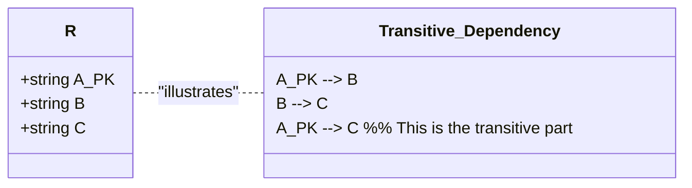
*Note: This `classDiagram` illustrates a transitive dependency. It shows a relation `R` with attributes `A`, `B`, and `C`. The functional dependencies `A --> B` and `B --> C` are present, which leads to `A --> C` (transitivity). Crucially, it highlights that `B` and `C` are non-key attributes relative to `A` and `B` is not a determinant for `A`, confirming the transitive nature.*

## Context & Framework
#### The Villain's Plan: How Transitive Dependency Leads to Anomalies
Transitive dependencies are a subtle yet potent "villain" that allows redundancy to creep into database designs, even after achieving Second Normal Form (2NF). They create indirect dependencies that lead to update anomalies. When `A → B` and `B → C` exist (and `B` is not a candidate key for `A`), any change to `C` (which directly depends on `B`) would require updating every record where that `B` value appears, even if `A` is the primary key. This is a classic source of modification anomalies, as ensuring consistency across all redundant `C` values becomes a significant challenge.

#### The Engineering Trade-off
Recognizing a transitive dependency is crucial because its existence directly violates 3NF and introduces redundancy. The engineering trade-off for eliminating transitive dependencies involves decomposing the relation into smaller, more focused relations. This decomposition reduces redundancy and improves data integrity, making updates simpler and less prone to errors. While it might increase the number of tables and potentially require an additional join for certain queries, the benefits of avoiding update anomalies typically outweigh this minor overhead in a well-designed transactional database.

## The Mastery Deep Dive
#### Understanding Transitive Dependency
A transitive dependency exists in a relation `R` if:
1.  `A → B` (A functionally determines B)
2.  `B → C` (B functionally determines C)
3.  `A → C` (This is implied transitively by the first two)
4.  **Crucially:** `B` is a **non-key attribute** (or a set of non-key attributes) with respect to `A`, meaning `B` is not a candidate key for `R`, and `A` is not functionally dependent on `B` (i.e., `B` does not determine `A`).
5.  Also, `C` is a non-key attribute.

**Why it's a problem:** If `C` is stored in the same table as `A` and `B`, and `B` is not a primary key, then `C` will be redundantly repeated for every instance of `A` that shares the same `B` value. When `B` changes, or `C` changes for a given `B`, all records containing that `B` value would need to be updated.

**Example:**
Consider the `STAFF_BRANCH` relation:
`STAFF_BRANCH(staffNo, sName, position, salary, branchNo, bAddress)`
Assume `staffNo` is the primary key.
Functional Dependencies:
1.  `staffNo` → `sName, position, salary, branchNo, bAddress`
2.  `branchNo` → `bAddress`

Here:
*   `A = staffNo` (Primary Key)
*   `B = branchNo` (Non-key attribute)
*   `C = bAddress` (Non-key attribute)

We have `staffNo → branchNo` and `branchNo → bAddress`.
Thus, `bAddress` is transitively dependent on `staffNo` via `branchNo`.
This violates Third Normal Form (3NF).

#### Removing Transitive Dependencies (Achieving 3NF)
To remove a transitive dependency and achieve 3NF, the relation is decomposed. The attributes involved in the transitive dependency are moved into a new relation.
**Steps:**
1.  Identify the functional dependency `B → C` that represents the transitive dependency.
2.  Create a **new relation** containing `B` as its primary key and `C` as its non-key attribute(s).
3.  Remove `C` from the original relation.
4.  Ensure `B` remains in the original relation as a foreign key, referencing the primary key of the new relation.

**Applying to `STAFF_BRANCH` example:**
*   Transitive dependency: `staffNo → branchNo → bAddress`
*   New relation from `branchNo → bAddress`: Create `BRANCH(branchNo, bAddress)`. `branchNo` is PK.
*   Remove `bAddress` from `STAFF_BRANCH`.
*   Original relation `STAFF(staffNo, sName, position, salary, branchNo)` remains. `branchNo` is now an FK to `BRANCH`.

**Resulting 3NF relations:**
*   `STAFF(staffNo, sName, position, salary, branchNo (FK))`
*   `BRANCH(branchNo, bAddress)`

## Constraints & Limitations
#### The Engineering Trade-off
The only "limitation" of removing transitive dependencies is the need for an additional JOIN operation when retrieving data that was previously available in a single table (e.g., staff name and branch address). This is a well-understood and acceptable engineering trade-off. The minor performance cost of a join is overwhelmingly offset by the significant gains in data integrity, reduced redundancy, and simplified update operations achieved by moving to 3NF.

## Significance & Application
Transitive dependencies are a critical concept for understanding and achieving Third Normal Form (3NF), which is a widely accepted standard for good relational database design. Academically, it formalizes a common type of redundancy that leads to update anomalies. Professionally, database designers must diligently identify and eliminate transitive dependencies to build robust, efficient, and easily maintainable databases, ensuring data consistency for critical business operations.

## The Worked Example
Consider a `STUDENT_ADVISOR_DEPARTMENT` relation:
`STUDENT_ADVISOR_DEPARTMENT(StudentID, StudentName, AdvisorID, AdvisorName, DeptName)`
Assume `StudentID` is the primary key.
Functional Dependencies:
1.  `StudentID` → `StudentName, AdvisorID`
2.  `AdvisorID` → `AdvisorName, DeptName`
3.  `AdvisorID` → `DeptName` (This is the key transitive dependency, as `AdvisorID` is a non-key attribute and determines other non-key attributes)

Here:
*   `A = StudentID` (Primary Key)
*   `B = AdvisorID` (Non-key attribute)
*   `C = AdvisorName, DeptName` (Non-key attributes determined by `B`)

We have `StudentID → AdvisorID` and `AdvisorID → AdvisorName, DeptName`.
Thus, `AdvisorName` and `DeptName` are transitively dependent on `StudentID` via `AdvisorID`.
This violates Third Normal Form (3NF).

**Removing Transitive Dependency:**

1.  Create a new relation for `AdvisorID` and the attributes it determines:
    `ADVISOR_DETAILS(AdvisorID, AdvisorName, DeptName)` (Here, `AdvisorID` becomes the PK).
2.  Remove `AdvisorName` and `DeptName` from the original `STUDENT_ADVISOR_DEPARTMENT` relation.
3.  The original `STUDENT` table now has `AdvisorID` as a foreign key.

**Resulting 3NF relations:**
*   `STUDENT(StudentID, StudentName, AdvisorID (FK))`
*   `ADVISOR_DETAILS(AdvisorID, AdvisorName, DeptName)`

## The Proving Ground
*Test your mastery. Cover the solutions below to test yourself first.*

#### Level 1: The Fact Check (Verification)
**The Question:** Define a transitive dependency involving attributes A, B, and C.
> **Solution:** A transitive dependency exists when A, B, and C are attributes of a relation such that `A → B` and `B → C`, then C is transitively dependent on A via B. Crucially, B must be a non-key attribute (or non-superkey) with respect to A, and C must be a non-key attribute.

#### Level 2: The Sort (Mastery & Edge Cases)
**The Scenario:** In a `STAFF_BRANCH` relation with attributes `StaffID`, `StaffName`, `BranchNo`, `BranchAddress`, `BranchNo → BranchAddress` and `StaffID → BranchNo`. Identify the transitive dependency.
> **Solution:** The transitive dependency is `StaffID → BranchNo → BranchAddress`.
> Here, `BranchAddress` is transitively dependent on `StaffID` through `BranchNo`.

#### Level 3: The Impostor (Mastery & Edge Cases)
**The Scenario:** Consider a relation `FLIGHT_DETAIL(FlightNo, DepartureCity, ArrivalCity, DepartureTime)`. A student states that `DepartureCity → DepartureTime` is a transitive dependency via `FlightNo → DepartureCity`. Identify if this statement is a "False Friend" and explain why, given that `DepartureCity` does not uniquely determine `DepartureTime` independently.
> **Solution:** This statement is a **"False Friend"**.
>
> **Explanation:** For `DepartureCity → DepartureTime` to be a transitive dependency via `FlightNo → DepartureCity`, two conditions must hold:
> 1.  `FlightNo → DepartureCity`
> 2.  `DepartureCity → DepartureTime`
>
> The problem statement explicitly states that `DepartureCity` does **not** uniquely determine `DepartureTime` independently (`DepartureCity` does not determine `DepartureTime`). A `DepartureCity` (e.g., London) can have many `DepartureTime`s throughout the day for different flights. Therefore, the dependency `DepartureCity → DepartureTime` does not hold. Without this second functional dependency, there cannot be a transitive dependency in the chain `FlightNo → DepartureCity → DepartureTime`. The concept of "transitive dependency" requires both links in the chain (`A→B` and `B→C`) to be valid functional dependencies.

## Key Takeaways
*   Transitive dependencies occur when a non-key attribute depends on another non-key attribute, which in turn depends on the primary key (`A → B → C`).
*   They violate Third Normal Form (3NF) and introduce redundancy, leading to update anomalies.
*   Removing transitive dependencies involves decomposing the relation into smaller tables, with the intermediate attribute (B) becoming a primary key in the new table and a foreign key in the original.

## Knowledge Graph Connections
| Concept                     | Connection / Relationship                                                                                                               |
| :
-------------------------- | :
-------------------------------------------------------------------------------------------------------------------------------------- |
| [[Functional_Dependencies]] | Transitive dependencies are a specific form of functional dependency that needs to be addressed during normalization.                     |
| [[Third_Normal_Form_3NF]]   | The primary goal of 3NF is to eliminate transitive dependencies from a relation.                                                      |
| [[Second_Normal_Form_2NF]]  | A relation must already be in 2NF before considering the elimination of transitive dependencies to achieve 3NF.                           |
| [[Data_Redundancy_and_Update_Anomalies]] | Transitive dependencies are a direct source of data redundancy and lead to modification anomalies.                                |
| [[Characteristics_of_Functional_Dependencies]] | Understanding the properties of FDs (like minimality and what constitutes a non-key attribute) is essential for identifying transitive dependencies. |
---

---

## Unnormalized Form UNF


## Definition
Before proceeding, ensure you master Relational_Tables and [[First_Normal_Form_1NF]].
Unnormalized Form (UNF) refers to a table that contains one or more "repeating groups." A repeating group occurs when multiple values for a single attribute (or a set of attributes) are stored within a single row for a specific primary key value. This directly violates the principle of atomicity, where each column should contain a single, indivisible value. UNF is the starting point of the normalization process, representing raw, unstructured data that needs to be refined to achieve better database design. Think of it as a spreadsheet cell that contains a comma-separated list of items, rather than each item having its own row.

## The Mental Model
Imagine you have a single recipe card for "Pizza." On that card, under "Ingredients," you just list: "Dough, Tomato Sauce, Cheese, Pepperoni, Mushrooms." This entire list of ingredients is a `repeating group` for the "Pizza" recipe. The card itself is `Unnormalized Form`. To make it normalized, you'd want each ingredient to be on its own separate line or linked to a separate list of ingredients, so you can easily manage each one individually.

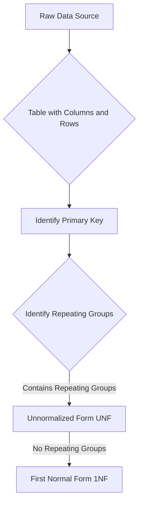
*Note: This `graph TD` diagram illustrates the characteristics of Unnormalized Form (UNF). It shows the process from a raw data source to a table, where the presence of "Repeating Groups" defines a table as being in UNF. It also shows the direct path to 1NF once these repeating groups are eliminated.*

## Context & Framework
#### The Family Tree
Unnormalized Form sits at the very root of the normalization "family tree." It represents the most basic, often direct, translation of raw data (like a paper form or spreadsheet) into a table-like structure, without any formal rules applied yet. All subsequent normal forms (1NF, 2NF, 3NF, etc.) are descendants of UNF, each building upon the previous one by removing specific types of data anomalies. Understanding UNF is crucial because it highlights the initial problems (primarily repeating groups and non-atomic values) that normalization aims to solve.

#### System Architecture & Dependencies
In terms of system architecture, a database in Unnormalized Form would be highly prone to `Data_Redundancy_and_Update_Anomalies`. Its structure, containing repeating groups within single rows, makes it inefficient for querying, updating, and maintaining data. This state demonstrates the direct architectural problem that a logical database design seeks to overcome through normalization. The dependencies between attributes are unclear, and relationships are often implicitly hidden within these repeating groups, rather than explicitly defined through foreign keys.

## The Mastery Deep Dive
#### Characteristics of Unnormalized Form
The defining characteristic of a table in Unnormalized Form is the presence of **repeating groups**.
*   **Repeating Group:** A set of one or more attributes that can have multiple values for a single primary key instance. This means a single cell in a table might contain a list of values, or a set of columns (`Item1_Name`, `Item1_Quantity`, `Item2_Name`, `Item2_Quantity`) is repeated within a row.
*   **Non-Atomic Values:** Implicitly, the existence of repeating groups often means that columns contain non-atomic values (e.g., a single cell containing "Book A, Book B, Book C" for a `Books_Read` column).

**How to Create an Unnormalized Table (Initial Step from a Source):**
1.  **Transform Data Source:** Take raw data from an information source (like a form, report, or spreadsheet) and convert it into a basic table format with columns and rows.
2.  **Identify Primary Key:** Nominate an attribute or group of attributes that could uniquely identify each "conceptual" row, even if it has repeating groups.

**Example of an Unnormalized Table (`ORDER`):**

| OrderID | CustomerName | OrderDate | (ProductID, ProductName, Quantity) |
| :
------ | :
----------- | :
-------- | :
--------------------------------- |
| O101    | Alice        | 2025-01-15 | (P01, Laptop, 1), (P02, Mouse, 2)  |
| O102    | Bob          | 2025-01-16 | (P03, Keyboard, 1)                 |

*   Here, `(ProductID, ProductName, Quantity)` is a **repeating group** because multiple sets of these attributes exist for a single `OrderID`. This `ORDER` table is in UNF.

## Constraints & Limitations
#### The Engineering Trade-off
The primary limitation of Unnormalized Form is its severe vulnerability to data redundancy and all three types of update anomalies (insertion, deletion, modification). It is extremely difficult to query and manipulate data efficiently due to the lack of clear structure within repeating groups. While it might seem "simple" to store everything in one big row, this simplicity is an illusion that leads to immense complexity and cost in terms of data integrity, application development, and maintenance over the long term. Thus, UNF is almost never suitable for operational databases.

## Significance & Application
Unnormalized Form (UNF) is primarily a conceptual starting point in database design. Academically, it serves to illustrate the problems that normalization aims to solve. In real-world data processing, data may briefly exist in a UNF state (e.g., during data extraction, transformation, and loading (ETL) from legacy systems or flat files) before being normalized for insertion into a relational database. It is a state to be moved *away* from as quickly and systematically as possible.

## The Worked Example
Consider a `STUDENT_COURSES` form that contains:
*   `StudentID`
*   `StudentName`
*   `EnrollmentDate`
*   **A list of courses taken by the student, where each course has:**
    *   `CourseID`
    *   `CourseTitle`
    *   `Credits`
    *   `Grade`

**Converting to an Unnormalized Table:**

| StudentID | StudentName | EnrollmentDate | (CourseID, CourseTitle, Credits, Grade) |
| :
-------- | :
---------- | :
------------- | :
-------------------------------------- |
| S001      | Alice       | 2024-09-01     | (C101, Intro DB, 3, A), (C102, Prog I, 4, B) |
| S002      | Bob         | 2024-09-01     | (C101, Intro DB, 3, C)                 |
| S003      | Charlie     | 2024-09-02     | (C103, Netwks, 3, A), (C104, AI, 4, A) |

In this `STUDENT_COURSES` table:
*   `(CourseID, CourseTitle, Credits, Grade)` is a **repeating group** because for each `StudentID`, there can be multiple sets of these course-related attributes.
*   The `StudentID` can be considered the (conceptual) primary key for the row, even though the row itself contains repeating data.

This table is clearly in Unnormalized Form (UNF).

## The Proving Ground
*Test your mastery. Cover the solutions below to test yourself first.*

#### Level 1: The Neighbor Check (Verification)
**The Question:** What characteristic defines an unnormalized form (UNF) table?
> **Solution:** An unnormalized form (UNF) table is defined by the presence of one or more repeating groups, meaning that multiple values for an attribute or a set of attributes are stored within a single row.

#### Level 2: The Sort (Mastery & Edge Cases)
**The Scenario:** You have a form for `CUSTOMER_ORDER` that lists `CustomerID`, `CustomerName`, and then for each order, `OrderID`, `OrderDate`, and repeating `ProductID`, `ProductName`, `Quantity`. Represent this information in an unnormalized table structure.
> **Solution:**

| CustomerID | CustomerName | (OrderID, OrderDate) | (ProductID, ProductName, Quantity) |
| :
--------- | :
----------- | :
------------------- | :
--------------------------------- |
| C1         | Alice        | (O100, 2025-01-01)   | (P01, Laptop, 1), (P02, Mouse, 2)  |
| C1         | Alice        | (O101, 2025-01-05)   | (P03, Keyboard, 1)                 |
| C2         | Bob          | (O102, 2025-01-03)   | (P04, Monitor, 1)                  |

*   In this structure, `(OrderID, OrderDate)` could be considered a repeating group for `CustomerID`, and `(ProductID, ProductName, Quantity)` is a repeating group within each order. This clearly illustrates the unnormalized form.

#### Level 3: The Impostor (Mastery & Edge Cases)
**The Scenario:** A table contains `CourseID`, `CourseName`, and `StudentNames` (a comma-separated list of names). Is this table in UNF, and if so, what is the 'repeating group'?
> **Solution:** Yes, this table is in UNF.
>
> The 'repeating group' is the `StudentNames` column itself. Although it's a single column, it contains multiple, individual values (a list of student names) within a single cell, which violates the atomicity requirement. This makes `StudentNames` a multi-valued attribute, which is a form of a repeating group for the `CourseID` primary key.

## Key Takeaways
*   UNF is a table containing one or more repeating groups.
*   A repeating group is multiple values for an attribute or set of attributes within a single row.
*   UNF is the starting point for normalization, needing refinement to become usable in a relational database.
*   It inherently leads to significant data redundancy and update anomalies.

## Knowledge Graph Connections
| Concept                     | Connection / Relationship                                                                                                               |
| :
-------------------------- | :
-------------------------------------------------------------------------------------------------------------------------------------- |
| [[Normalization_in_Database_Design]] | UNF is the initial, unrefined state from which the normalization process begins.                                                        |
| Relational_Tables       | UNF describes a type of table structure that needs to be transformed into proper relational tables.                                     |
| [[First_Normal_Form_1NF]]   | The primary goal of converting UNF to 1NF is to eliminate repeating groups.                                                               |
| [[Data_Redundancy_and_Update_Anomalies]] | UNF inherently suffers from severe data redundancy and all types of update anomalies due to its unstructured nature.                      |
| Attributes              | The concept of repeating groups often involves non-atomic attributes, which is a fundamental violation of relational principles addressed by 1NF. |
---

---

## Weak Entity Types


## Definition
Before proceeding, ensure you master [[Entity_Types]] and Identifying_Relationships.
Weak entity types are entities in an E-R model that cannot be uniquely identified by their own attributes alone. Instead, their identification is dependent on the primary key of another entity type, known as the "owner" or "identifying" entity, through an identifying relationship. When mapping weak entities to a relational model, a new relation is created for the weak entity, and its primary key is formed by combining its partial key (if it has one) with the primary key of its owner entity (which is posted as a foreign key). Think of it like a `Dependent` (`weak entity`) whose existence and unique identification rely entirely on a specific `Employee` (`owner entity`).

## The Mental Model
Imagine you're trying to uniquely identify a "Room Number" within a large building. A "Room Number" by itself (like '101') isn't unique across the whole campus. It only becomes unique when you know which "Building" it's in (e.g., 'Building A, Room 101'). Here, "Room" is the `weak entity`, and "Building" is the `owner entity`. When mapping, the "Room" table needs both its `RoomNumber` and the `BuildingID` from the "Building" table to form its complete, unique ID.

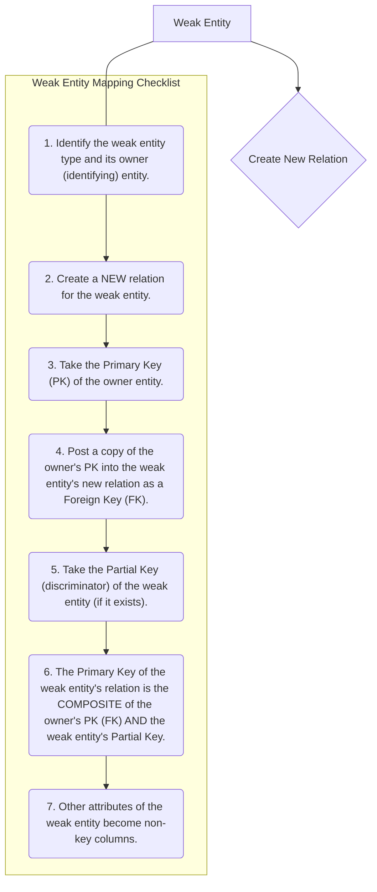
*Note: This `graph TD` diagram provides a "Pilot's Checklist" for mapping weak entity types. It clearly outlines the steps for creating a new relation, incorporating the owner entity's primary key as a foreign key, and forming a composite primary key for the weak entity.*

## Context & Framework
#### System Architecture & Dependencies
Weak entities introduce a direct and mandatory dependency in the database schema. The relation representing the weak entity cannot exist without its owner entity, as its primary key is partly or wholly derived from the owner's primary key. This architectural choice enforces strong referential integrity, preventing "orphaned" weak entity records. For example, a `DEPENDENT` record requires an `EMPLOYEE` record, and its `DependentID` is unique only within that `EmployeeID`. This ensures a hierarchical structure where the owner entity provides the context for the weak entity's identity.

## The Mastery Deep Dive
#### The "Pilot's Checklist" (Do Not Skip)
Mapping weak entities is a specific process that always involves combining keys.
- [ ] **1. Identify the Weak Entity and its Owner:** Clearly distinguish the weak entity type (e.g., `DEPENDENT`) and its identifying owner entity (e.g., `EMPLOYEE`).
- [ ] **2. Create a NEW Relation for the Weak Entity:** A separate table is always created for the weak entity. Its name should reflect the entity (e.g., `DEPENDENT`).
- [ ] **3. Take the Primary Key (PK) of the Owner Entity:** Obtain the unique identifier attribute(s) of the strong owner entity (e.g., `EmployeeID` from `EMPLOYEE`).
- [ ] **4. Post a Copy of the Owner's PK into the Weak Entity's Relation as a Foreign Key:** Add the owner's primary key as a column (or columns) to the new weak entity relation. This attribute(s) functions as a foreign key, referencing the owner entity's original relation.
- [ ] **5. Identify the Partial Key of the Weak Entity (if any):** The partial key (also called discriminator) is the attribute(s) that uniquely identifies instances of the weak entity *within the context of its owner*. For `DEPENDENT`, this might be `DependentName`.
- [ ] **6. Form the Composite Primary Key of the Weak Entity Relation:** The primary key of the weak entity's relation is the **composite of the owner's primary key (now a foreign key in the weak entity's table) AND the weak entity's partial key.** This composite key ensures global uniqueness.
    *Example*: For `DEPENDENT` (partial key `DependentName`) owned by `EMPLOYEE` (PK `EmployeeID`), the `DEPENDENT` table's PK is `(EmployeeID, DependentName)`.
- [ ] **7. Include Other Attributes:** Any other attributes of the weak entity become non-key columns in its new relation.

#### Opening the Hood: What's Inside?
When we "open the hood" of a weak entity, we discover its identity is not self-contained. For an `ORDER_ITEM` (`weak entity`) that belongs to an `ORDER` (`owner entity`), its `ItemNumber` is only unique *within* a specific `ORDER`. To make `ORDER_ITEM` globally unique in a relational table, we *must* combine its `ItemNumber` (partial key) with the `OrderID` (primary key of its owner, `ORDER`). Thus, the `ORDER_ITEM` table's primary key becomes `(OrderID, ItemNumber)`. The `OrderID` also serves as a foreign key, explicitly linking it back to the `ORDER` table and solidifying its dependence.

## Constraints & Limitations
#### The Engineering Trade-off
The engineering trade-off for weak entities is minor, primarily related to the size of the composite primary key. Since the owner's primary key is incorporated, a weak entity's primary key can become longer, potentially affecting index size and query performance slightly for very large tables. However, this is a necessary structural decision to ensure data integrity and unique identification, so the benefits far outweigh the minimal overhead. Strict adherence to this mapping rule is crucial.

## Significance & Application
Understanding and correctly mapping weak entities is crucial for database design, particularly when modeling real-world scenarios where some entities cannot exist independently (e.g., `LINE_ITEM` within an `INVOICE`, `ROOM` within a `BUILDING`, `VERSION` of a `PRODUCT`). Academically, it reinforces the concept of identification dependence. Practically, it ensures that all data instances have a proper, unique, and referentially sound identity within the database, preventing inconsistencies and enabling accurate data retrieval.

## The Worked Example
Let's map a weak entity:

**Scenario:** `ORDER_ITEM` (attributes: `ItemNumber` (partial key), `Quantity`) is a weak entity owned by `ORDER` (attributes: `OrderID` (PK), `OrderDate`):
*   `ItemNumber` is unique only within a given `OrderID`.

**Mapping Steps:**

1.  **Weak Entity:** `ORDER_ITEM`
    *   **Owner Entity:** `ORDER` (PK: `OrderID`)
    *   **Partial Key of Weak Entity:** `ItemNumber`
2.  **Create New Relation:** `ORDER_ITEM`
3.  **Post Owner PK as FK:** `OrderID` from `ORDER` is posted as `OrderID` (FK) in `ORDER_ITEM`.
4.  **Form Composite PK:** The primary key of `ORDER_ITEM` becomes `(OrderID, ItemNumber)`.
5.  **Other Attributes:** `Quantity` becomes a non-key column.

**Resulting Relations:**
*   `ORDER(OrderID, OrderDate)`
*   `ORDER_ITEM(OrderID (FK), ItemNumber, Quantity)`

## The Proving Ground
*Test your mastery. Cover the solutions below to test yourself first.*

#### Level 1: The Tool Check (Verification)
**The Question:** Why is the primary key of a weak entity often dependent on its owner entity?
> **Solution:** Because a weak entity cannot be uniquely identified by its own attributes alone; its uniqueness requires the context provided by its owner entity's primary key.

#### Level 2: The Routine Run (Mastery & Edge Cases)
**The Scenario:** Consider a `DEPENDENT` entity that is weak with respect to `EMPLOYEE`. If `DEPENDENT` has attributes `DependentName` and `Relationship`, and `EMPLOYEE` has `EmployeeID` (PK), describe how to form the primary key for the `DEPENDENT` relation.
> **Solution:** The primary key for the `DEPENDENT` relation will be a **composite key** consisting of:
> 1.  The primary key of the owner `EMPLOYEE` entity (`EmployeeID`), which will also be a foreign key in the `DEPENDENT` table.
> 2.  The partial key of the `DEPENDENT` entity (`DependentName`).
> So, the primary key of `DEPENDENT` would be `(EmployeeID, DependentName)`.

#### Level 3: The Disaster Drill (Mastery & Edge Cases)
**The Scenario:** A weak entity `ORDER_ITEM` (attributes: `ItemNumber`, `Quantity`) is owned by `ORDER` (attributes: `OrderID`, `OrderDate`). A mapping was done such that `ORDER_ITEM`'s primary key is just `ItemNumber`. Explain why this creates an issue and how to correctly define the primary key.
> **Solution:**
> **Issue Created:** If `ORDER_ITEM`'s primary key is solely `ItemNumber`, it implies that `ItemNumber` must be unique across *all* orders. This is incorrect for a weak entity. For example, `ItemNumber '1'` for `OrderID '101'` is a different concept from `ItemNumber '1'` for `OrderID '102'`. Using just `ItemNumber` as the PK would prevent multiple orders from having an `ORDER_ITEM` with the same `ItemNumber`, or it would lead to overwriting existing `ORDER_ITEM` data if `ItemNumber` is reused across orders. This violates the unique identification requirement for each specific order item.
>
> **Correct Primary Key Definition:** The primary key of the `ORDER_ITEM` relation must be a **composite key** formed by combining the primary key of its owner entity (`OrderID`) with its own partial key (`ItemNumber`). Thus, the correct primary key would be `(OrderID, ItemNumber)`. This ensures that each `ORDER_ITEM` is uniquely identified within the context of a specific `ORDER`.

## Key Takeaways
*   Weak entities cannot be uniquely identified without their owner entity.
*   Mapping involves creating a new relation for the weak entity.
*   The primary key of the weak entity's relation is a composite key, combining its partial key with the primary key of its owner entity (as a foreign key).

## Knowledge Graph Connections
| Concept                     | Connection / Relationship                                                                                                       |
| :
-------------------------- | :
-------------------------------------------------------------------------------------------------------------------------------------- |
| [[Mapping_Relationships_to_Relations]] | This is a specific mapping technique for identifying (weak) relationships within the overall E-R to relational translation.           |
| [[Entity_Types]]            | Weak entities are a specific type of entity that requires unique handling during mapping.                                               |
| Identifying_Relationships | Weak entities are always connected to their owner via an identifying relationship, which is key to their mapping.                       |
| Primary_Keys            | The formation of a composite primary key is central to correctly mapping weak entities.                                                 |
| Foreign_Keys            | The primary key of the owner entity becomes a foreign key in the weak entity's relation, establishing the dependency.                   |
| Composite_Keys          | Weak entities inherently rely on composite keys for unique identification in the relational model.                                      |
---

---

## CS1241 4 Logical Database Design Possible Questions


## Part I: The Conceptual Mastery Ladder
*Progress through these levels for every atomic concept. Do not move to the next concept until you can answer Level 3.*

### [[Translating_E_R_to_Logical_Model]]
#### Level 1: Understanding (The Basics)
1.  **The Component Check:** What are the three basic rules for translating an E-R model into a logical data model as outlined in the lecture?
#### Level 2: Competence (Application)
2.  **The Clean Build:** Imagine an E-R model with an entity `STUDENT` (attributes: `StudentID`, `Name`, `Address`) and a `COURSE` entity (attributes: `CourseID`, `Title`). How would you translate these into relations, specifically noting the primary keys and column names?
#### Level 3: Mastery (The Broken System)
3.  **The Broken System:** You are given a partially translated logical model from an E-R diagram. The `STUDENT_ADDRESS` relation contains `StudentID`, `Street`, `City`, `PostalCode`, and `AddressID` as the primary key. If `Address` was a composite attribute in the E-R model with `Street`, `City`, and `PostalCode` as its components, identify the flaw in this translation and propose a correction.

### [[Mapping_Entities_to_Relations]]
#### Level 1: Understanding (The Basics)
4.  **The Tool Check:** When mapping an entity from a conceptual E-R model to a logical data model, what is the direct equivalent in the relational model?
#### Level 2: Competence (Application)
5.  **The Routine Run:** List the key steps involved in mapping a strong entity `DEPARTMENT` (with attributes `DepartmentID`, `DepartmentName`) to a relation, ensuring its primary key is correctly identified.
#### Level 3: Mastery (The Disaster Drill)
6.  **The Disaster Drill:** A database designer forgot to assign a primary key during the mapping of the `PRODUCT` entity, instead only listing `ProductName` and `Description` as attributes. What immediate issues would arise if this design were implemented, and what is the crucial recovery step?

### [[Mapping_Attributes_to_Relations]]
#### Level 1: Understanding (The Basics)
7.  **The Tool Check:** How are atomic (single-valued) attributes typically mapped to a relation?
#### Level 2: Competence (Application)
8.  **The Routine Run:** Given a `BOOK` entity with a composite attribute `Author_Name` (composed of `FirstName` and `LastName`) and a multi-valued attribute `Keywords`, describe the mapping process for these attributes to a relational schema.
#### Level 3: Mastery (The Disaster Drill)
9.  **The Disaster Drill:** During attribute mapping, a multi-valued attribute `Phone_Number` for an `EMPLOYEE` entity was simply added as a new column in the `EMPLOYEE` relation. Explain the immediate data integrity and redundancy issues this creates and outline the correct mapping procedure to fix it.

### [[Mapping_Relationships_to_Relations]]
#### Level 1: Understanding (The Basics)
10. **The Tool Check:** What general principle guides the mapping of relationships between entities to relations in a logical data model?
#### Level 2: Competence (Application)
11. **The Routine Run:** Outline the primary steps for mapping a 1:M (one-to-many) relationship named `WORKS_FOR` between `DEPARTMENT` (one side) and `EMPLOYEE` (many side). Include how primary and foreign keys are handled.
#### Level 3: Mastery (The Disaster Drill)
12. **The Disaster Drill:** A database for a university mistakenly mapped a M:M (many-to-many) relationship between `STUDENT` and `COURSE` by simply posting the primary key of `STUDENT` into the `COURSE` relation. Describe why this is incorrect and what the correct mapping strategy should be, assuming the relationship itself has an attribute `Grade`.

### [[One_to_One_Binary_Relationships]]
#### Level 1: Understanding (The Basics)
13. **The Tool Check:** What is the primary factor used to decide how to map a 1:1 binary relationship to relations?
#### Level 2: Competence (Application)
14. **The Routine Run:** Describe the mapping strategy for a 1:1 relationship between `MANAGER` and `DEPARTMENT` where `MANAGER` has optional participation and `DEPARTMENT` has mandatory participation in the relationship.
#### Level 3: Mastery (The Disaster Drill)
15. **The Disaster Drill:** Two entities, `EMPLOYEE` and `COMPANY_CAR`, have a 1:1 relationship with optional participation on both sides. A designer combined them into one relation `EMPLOYEE_CAR` with `EmployeeID` as PK and `CarID` as an alternate key. Explain why this might not be the most flexible solution and suggest an alternative mapping.

### [[One_to_Many_Binary_Relationships]]
#### Level 1: Understanding (The Basics)
16. **The Tool Check:** Which entity in a 1:M relationship is designated as the 'parent entity'?
#### Level 2: Competence (Application)
17. **The Routine Run:** Consider a 1:M relationship where `PUBLISHER` is on the 'one side' and `BOOK` is on the 'many side'. Detail the steps to map this relationship to relations, including where the foreign key will reside.
#### Level 3: Mastery (The Disaster Drill)
18. **The Disaster Drill:** A `CUSTOMER` (one side) and `ORDER` (many side) relationship was mapped, but the `customerID` was added to the `CUSTOMER` table as a foreign key referencing the `ORDER` table. Explain the fundamental error and correct the mapping.

### [[Many_to_Many_Binary_Relationships]]
#### Level 1: Understanding (The Basics)
19. **The Tool Check:** What is the standard approach for representing an M:M binary relationship in a relational schema?
#### Level 2: Competence (Application)
20. **The Routine Run:** Given an M:M relationship between `STUDENT` and `PROJECT` with a relationship attribute `Role`, describe how you would map this to relations, including the primary key of the new relationship table.
#### Level 3: Mastery (The Disaster Drill)
21. **The Disaster Drill:** A database tracks `AUTHOR`s and `BOOK`s with an M:M relationship. A junior designer created a new `AUTHOR_BOOK` table but made `AuthorID` its primary key. Explain why this is incorrect and what the correct composite primary key should be.

### [[Weak_Entity_Types]]
#### Level 1: Understanding (The Basics)
22. **The Tool Check:** Why is the primary key of a weak entity often dependent on its owner entity?
#### Level 2: Competence (Application)
23. **The Routine Run:** Consider a `DEPENDENT` entity that is weak with respect to `EMPLOYEE`. If `DEPENDENT` has attributes `DependentName` and `Relationship`, and `EMPLOYEE` has `EmployeeID` (PK), describe how to form the primary key for the `DEPENDENT` relation.
#### Level 3: Mastery (The Disaster Drill)
24. **The Disaster Drill:** A weak entity `ORDER_ITEM` (attributes: `ItemNumber`, `Quantity`) is owned by `ORDER` (attributes: `OrderID`, `OrderDate`). A mapping was done such that `ORDER_ITEM`'s primary key is just `ItemNumber`. Explain why this creates an issue and how to correctly define the primary key.

### [[Recursive_Relationships]]
#### Level 1: Understanding (The Basics)
25. **The Tool Check:** What is a recursive relationship in the context of an E-R model?
#### Level 2: Competence (Application)
26. **The Routine Run:** Describe two different ways to represent a 1:1 recursive relationship where `EMPLOYEE` 'manages' `EMPLOYEE`, considering optional participation on both sides.
#### Level 3: Mastery (The Disaster Drill)
27. **The Disaster Drill:** A 1:M recursive relationship `SUPERVISES` exists on the `EMPLOYEE` entity. A designer created a `SUPERVISOR` table and linked it back to `EMPLOYEE` with a foreign key. Identify the flaw and explain the simpler, more effective mapping strategy.

### [[Superclass_Subclass_Relationships]]
#### Level 1: Understanding (The Basics)
28. **The Tool Check:** What are superclass/subclass relationships, and why are they complex to map to relations?
#### Level 2: Competence (Application)
29. **The Routine Run:** Outline one common option for representing a superclass `PERSON` with subclasses `STUDENT` and `FACULTY` in a relational schema, assuming disjoint and mandatory participation.
#### Level 3: Mastery (The Disaster Drill)
30. **The Disaster Drill:** A superclass `VEHICLE` has subclasses `CAR` and `TRUCK`. A designer decided to create separate tables for `CAR` and `TRUCK`, each duplicating common `VEHICLE` attributes like `VIN` and `Manufacturer`. Explain the potential redundancy and a better approach for this scenario.

### [[Normalization_in_Database_Design]]
#### Level 1: Understanding (The Basics)
31. **The Fact Check:** What is the primary purpose of normalization in database design?
#### Level 2: Competence (Application)
32. **The Trade-off:** Explain two distinct benefits of a well-normalized database design in terms of data management.
#### Level 3: Mastery (The Lose-Lose Scenario)
33. **The Lose-Lose Scenario:** A project manager insists on a completely unnormalized database for a new application, arguing it simplifies development and speeds up reads. As a database designer, how would you counter this argument by highlighting the long-term "lose-lose" consequences, balancing development ease with data integrity and maintenance costs?

### [[Data_Redundancy_and_Update_Anomalies]]
#### Level 1: Understanding (The Basics)
34. **The Fact Check:** Define data redundancy in the context of relational databases.
#### Level 2: Competence (Application)
35. **The Trade-off:** Describe the three main types of update anomalies (insertion, deletion, modification) and provide a small example for each that illustrates the problem.
#### Level 3: Mastery (The Lose-Lose Scenario)
36. **The Lose-Lose Scenario:** Your team has inherited an existing database with significant data redundancy. The lead developer suggests ignoring it to meet a tight deadline for a new feature. Explain how proceeding with this redundancy could lead to a "lose-lose" situation for future development and data reliability.

### [[Lossless_Join_and_Dependency_Preservation]]
#### Level 1: Understanding (The Basics)
37. **The Variable ID:** Briefly explain the "lossless-join property" in database decomposition.
#### Level 2: Competence (Application)
38. **The Standard Solver:** Why are both the lossless-join property and the dependency preservation property considered crucial when decomposing a relation during normalization?
#### Level 3: Mastery (The Impossible Case)
39. **The Impossible Case:** You are given a relation `R(A, B, C)` with functional dependencies `A → B` and `B → C`. If you decompose `R` into `R1(A, B)` and `R2(A, C)`, would this decomposition be dependency-preserving? Justify your answer.

### [[Functional_Dependencies]]
#### Level 1: Understanding (The Basics)
40. **The Variable ID:** Define functional dependency, denoted `A → B`.
#### Level 2: Competence (Application)
41. **The Standard Solver:** Given a `STUDENT_COURSE` relation with attributes `StudentID`, `CourseID`, `StudentName`, `CourseTitle`, and `InstructorName`. If `StudentID` determines `StudentName`, and `CourseID` determines `CourseTitle`, `InstructorName`, identify the functional dependencies present.
#### Level 3: Mastery (The Impossible Case)
42. **The Impossible Case:** Consider a relation `PRODUCT_SALE` with attributes `ProductID`, `SaleDate`, `CustomerID`, `CustomerName`. If `ProductID` and `SaleDate` together determine `CustomerID`, and `CustomerID` determines `CustomerName`, identify a transitive dependency that exists.

### [[Characteristics_of_Functional_Dependencies]]
#### Level 1: Understanding (The Basics)
43. **The Fact Check:** What does "full functional dependency" imply about the determinant of a functional dependency?
#### Level 2: Competence (Application)
44. **The Sort:** Distinguish between a partial functional dependency and a full functional dependency using a clear example for each.
#### Level 3: Mastery (The Impostor)
45. **The Impostor:** You are analyzing a relation `ORDER_ITEM(OrderID, ItemID, OrderDate, ItemName, Price)`. A colleague claims that `OrderID, ItemID → Price` is a full functional dependency. Identify if this is a "False Friend" statement and explain why, considering that `ItemID` alone determines `ItemName` and `Price`.

### [[Transitive_Dependencies]]
#### Level 1: Understanding (The Basics)
46. **The Fact Check:** Define a transitive dependency involving attributes A, B, and C.
#### Level 2: Competence (Application)
47. **The Sort:** In a `STAFF_BRANCH` relation with attributes `StaffID`, `StaffName`, `BranchNo`, `BranchAddress`, `BranchNo → BranchAddress` and `StaffID → BranchNo`. Identify the transitive dependency.
#### Level 3: Mastery (The Impostor)
48. **The Impostor:** Consider a relation `FLIGHT_DETAIL(FlightNo, DepartureCity, ArrivalCity, DepartureTime)`. A student states that `DepartureCity → DepartureTime` is a transitive dependency via `FlightNo → DepartureCity`. Identify if this statement is a "False Friend" and explain why, given that `DepartureCity` does not uniquely determine `DepartureTime` independently.

### [[Unnormalized_Form_UNF]]
#### Level 1: Understanding (The Basics)
49. **The Neighbor Check:** What characteristic defines an unnormalized form (UNF) table?
#### Level 2: Competence (Application)
50. **The Sort:** You have a form for `CUSTOMER_ORDER` that lists `CustomerID`, `CustomerName`, and then for each order, `OrderID`, `OrderDate`, and repeating `ProductID`, `ProductName`, `Quantity`. Represent this information in an unnormalized table structure.
#### Level 3: Mastery (The Impostor)
51. **The Impostor:** A table contains `CourseID`, `CourseName`, and `StudentNames` (a comma-separated list of names). Is this table in UNF, and if so, what is the 'repeating group'?

### [[First_Normal_Form_1NF]]
#### Level 1: Understanding (The Basics)
52. **The Tool Check:** What is the defining rule for a relation to be in First Normal Form (1NF)?
#### Level 2: Competence (Application)
53. **The Routine Run:** Take the `CUSTOMER_ORDER` unnormalized table from question 50. Show the step-by-step process to convert it into 1NF.
#### Level 3: Mastery (The Disaster Drill)
54. **The Disaster Drill:** A `PRODUCT_SUPPLIER` table has `ProductID`, `ProductName`, `SupplierName`, `SupplierAddress` (a composite attribute with `Street`, `City`, `Zip`). This table also has a `SupplierPhoneNumbers` column which contains multiple phone numbers separated by semicolons. Explain two distinct violations of 1NF in this table and describe the exact steps to rectify them.

### [[Second_Normal_Form_2NF]]
#### Level 1: Understanding (The Basics)
55. **The Tool Check:** What two conditions must a relation satisfy to be in Second Normal Form (2NF)?
#### Level 2: Competence (Application)
56. **The Routine Run:** Consider a 1NF relation `ORDER_DETAILS(OrderID, ProductID, CustomerID, CustomerName, Quantity, Price)`. Assume `OrderID, ProductID` is the primary key. If `CustomerID → CustomerName` and `ProductID → Price`, demonstrate the steps to convert this relation to 2NF.
#### Level 3: Mastery (The Disaster Drill)
57. **The Disaster Drill:** A `PROJECT_ASSIGNMENT` table is in 1NF with `(ProjectID, EmployeeID)` as its primary key. It also contains `ProjectName`, `EmployeeName`, and `HourlyRate`. Functional dependencies are `ProjectID → ProjectName` and `EmployeeID → EmployeeName, HourlyRate`. Explain why this table is not in 2NF and precisely outline the decomposition required to achieve 2NF.

### [[Third_Normal_Form_3NF]]
#### Level 1: Understanding (The Basics)
58. **The Tool Check:** What three conditions must a relation satisfy to be in Third Normal Form (3NF)?
#### Level 2: Competence (Application)
59. **The Routine Run:** Take a 2NF relation `BOOK_PUBLISHER(BookID, Title, PublisherID, PublisherName, PublisherCity)`. Assume `BookID` is the primary key and `PublisherID → PublisherName, PublisherCity`. Demonstrate the steps to convert this relation to 3NF.
#### Level 3: Mastery (The Disaster Drill)
60. **The Disaster Drill:** A `COURSE_SCHEDULE` table is in 2NF with `(CourseID, SectionNo)` as its primary key. It includes `CourseName`, `InstructorID`, `InstructorName`, `InstructorOffice`. Functional dependencies are `CourseID → CourseName` and `InstructorID → InstructorName, InstructorOffice`. Explain why this table violates 3NF and detail the decomposition steps to achieve 3NF.

### [[Boyce_Codd_Normal_Form_BCNF]]
#### Level 1: Understanding (The Basics)
61. **The Fact Check:** What is the defining rule for a relation to be in Boyce-Codd Normal Form (BCNF)?
#### Level 2: Competence (Application)
62. **The Sort:** Explain the key difference between a relation in 3NF and one in BCNF, providing a scenario where a 3NF relation might not be in BCNF.
#### Level 3: Mastery (The Impostor)
63. **The Impostor:** You have a `STUDENT_ADVISOR` relation with attributes `StudentID`, `AdvisorID`, `CourseCode`. The candidate keys are `(StudentID, CourseCode)` and `(AdvisorID, CourseCode)`. There's also a dependency `AdvisorID → StudentID`. A colleague states this relation is in 3NF and therefore also in BCNF. Identify if this is a "False Friend" and explain why this 3NF relation is not in BCNF.

## Part II: Unit Synthesis (The Final Boss)
*These questions require combining multiple concepts from the unit to solve a complex problem.*

#### Integrated Scenario: Designing a University Course Registration System
**The Setup:** You are tasked with designing a logical database for a simplified university course registration system. You need to manage students, courses, instructors, and registrations.
**Initial E-R Considerations:**
*   `STUDENT` (StudentID, StudentName, Major, DateOfBirth)
*   `COURSE` (CourseID, CourseName, Credits, Department)
*   `INSTRUCTOR` (InstructorID, InstructorName, OfficeNumber)
*   `REGISTRATION` (StudentID, CourseID, Semester, Grade) - This is a many-to-many relationship between STUDENT and COURSE, with additional attributes.
*   A `SECTION` of a `COURSE` is taught by an `INSTRUCTOR`. One instructor can teach multiple sections, but a section is taught by only one instructor.
**The Constraints:**
*   You must minimize data redundancy as much as possible, aiming for at least 3NF for all relations.
*   You need to handle composite and multi-valued attributes if you decide to introduce them.
*   The system must easily retrieve all courses a student is registered for, and all students registered in a particular course section.
**The Challenge:**
(a)  Derive a complete set of normalized relations (up to 3NF) for this scenario, clearly identifying primary and foreign keys for each relation.
(b)  Justify the normalization steps you took from an assumed Unnormalized Form (UNF) through 1NF, 2NF, and 3NF for at least one of your derived relations, specifically explaining how you addressed partial and transitive dependencies.
(c)  Identify one potential update anomaly that could occur if you *only* achieved 1NF for your `REGISTRATION` related tables and explain which type of anomaly it is.