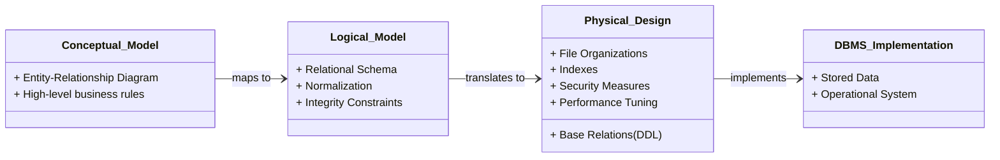
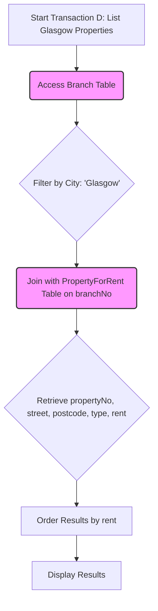
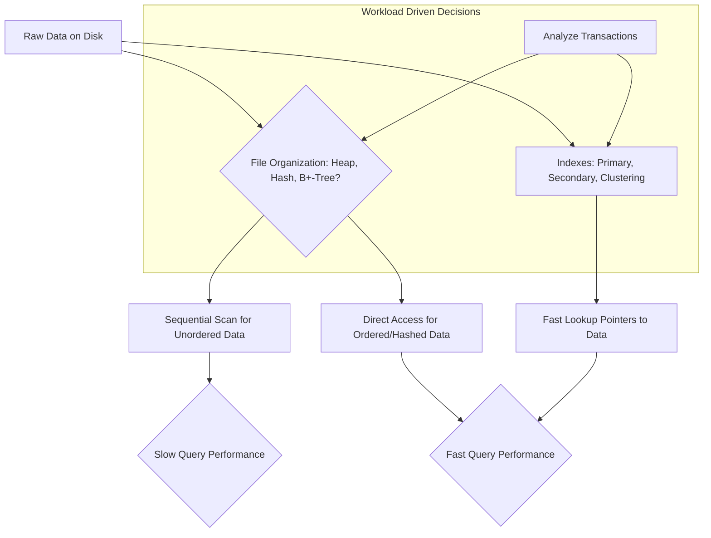

# 5 Physical Database Design

Comprehensive resource for 5 Physical Database Design.


---

## 5 Physical Database Design Hub


## Overview
Physical Database Design is the critical process of transforming a conceptual and logical data model into a concrete, executable schema for a specific Database Management System (DBMS). It dictates *how* the database will be implemented on secondary storage, focusing on optimizing performance, ensuring data integrity, and establishing robust security mechanisms. This stage moves beyond the abstract "what" of data to the practical "how," addressing crucial aspects like file organizations, indexing strategies, and physical storage considerations. It is fundamentally about bridging the gap between theoretical data models and their real-world operational efficiency.

## Learning Objectives
*   Understand the purpose of physical database design and its distinction from logical design.
*   Learn how to map a logical database design to a physical database design for a target DBMS.
*   Acquire the skills to design base relations, derived data representation, and general constraints.
*   Explore methods for selecting appropriate file organizations and secondary indexes to improve performance.
*   Develop the ability to estimate database size and design user views.
*   Learn to design effective security mechanisms and consider controlled redundancy.
*   Understand how to monitor and tune an operational database system for optimal efficiency.

## Unit Applications & Real-World Relevance
Physical database design is the bedrock of any high-performing, scalable, and secure data system. In the real world, its applications are ubiquitous across virtually all industries. For instance, in **e-commerce platforms**, efficient physical design ensures rapid product lookups, smooth transaction processing, and responsive user experiences, even under heavy load. In **financial institutions**, it underpins the integrity and speed of banking transactions, fraud detection, and regulatory compliance. For **large-scale data analytics**, proper indexing and file organization are paramount for quickly querying massive datasets. Without meticulous physical design, databases would suffer from slow queries, data inconsistencies, security vulnerabilities, and ultimately, system failures, making it a cornerstone for system architects and database administrators.

## Active Learning Prompts
*   Consider a scenario where a database design team decides to skip the physical design phase and directly implement a logical model. What immediate and long-term problems would they likely encounter regarding performance, security, and maintenance?
*   Think about your favorite online application (e.g., social media, streaming service). Identify at least three areas where physical database design decisions (like indexing or denormalization) would critically impact your user experience.
*   How would the "peak load" of a database for an airline booking system differ from that of a scientific research database, and how might these differences influence the physical design choices, particularly for file organizations and indexing?

## Unit Challenges & Common Misconceptions
A major challenge in physical database design is navigating the inherent trade-offs between performance, storage space, and data integrity. For example, adding more indexes can speed up read operations but slow down write operations and consume more disk space. A common misconception is that a perfectly normalized logical design automatically translates to an optimal physical design; in reality, strategic denormalization is often necessary for performance in specific scenarios. Another challenge lies in predicting and adapting to changing `workload` patterns, requiring continuous `monitoring and tuning` of the operational system. Balancing these competing objectives requires a deep understanding of the application's requirements, the characteristics of the DBMS, and the underlying hardware infrastructure.

## Connections
  - [[Physical_Database_Design]]
    - [[Translating_Logical_Data_Model_for_DBMS]]
      - [[Designing_Base_Relations]]
      - [[Designing_Derived_Data_Representation]]
      - [[Designing_General_Constraints]]
    - [[Designing_File_Organizations_and_Indexes]]
      - [[Analyzing_Transactions]]
      - [[Choosing_File_Organizations]]
      - [[Choosing_Indexes]]
        - [[Index_Guidelines]]
    - [[Estimating_Disk_Space_Requirements]]
    - [[Designing_User_Views]]
    - [[Designing_Security_Measures]]
    - [[Controlled_Redundancy_and_Denormalization]]
    - [[Monitoring_and_Tuning_Operational_Systems]]

## Next Steps for Deeper Understanding
To further deepen your understanding, explore specific examples of SQL Data Definition Language (DDL) commands for defining tables, indexes, and constraints in popular DBMS like PostgreSQL, MySQL, or Oracle. Investigate advanced indexing techniques such as full-text indexes or bitmap indexes. Research case studies of large-scale database systems and how their physical designs evolved to meet performance demands. Finally, delve into database administration topics like query optimization and performance profiling tools, which are direct extensions of robust physical design.

## Possible Questions
[[CS1241_5_Physical_Database_Design_Possible_Questions]]

---

---

## Controlled Redundancy And Denormalization


## Definition
Before proceeding, ensure you master Database_Normalization and Performance_Optimization because `Controlled_Redundancy_and_Denormalization` fundamentally involves making strategic compromises with normalization to achieve performance gains.
`Controlled_Redundancy_and_Denormalization` refers to a refinement process in `Physical_Database_Design` where `database normalization` rules are deliberately relaxed, or redundant data is intentionally introduced, to improve the `Performance_Optimization` of the system, particularly for frequent or critical `read transactions`. While normalization aims to eliminate `data redundancy` to ensure `data integrity`, `denormalization` strategically reintroduces it when the performance cost of frequent `JOIN` operations (on normalized tables) becomes unacceptable. It's a pragmatic trade-off, accepting a minimal loss of some benefits of a fully normalized design in favor of increased processing efficiency. A simpler way to think about it is meticulously organizing your clothes by type (normalization), but then deciding to keep a "ready-to-go outfit" (denormalization) pre-assembled for fast access, even if it means some items are duplicated.

## The Mental Model
Imagine you have a detailed recipe book (`normalized database`). Each recipe (`table`) is perfect, with no repeated ingredients or steps. But if you're making a popular dish every day, always looking up every sub-recipe from scratch (`JOINs`) is slow. `Controlled_Redundancy_and_Denormalization` is like writing down a full, combined recipe for that popular dish (even if some ingredients/steps are duplicated from other recipes). It means faster cooking (`Performance_Optimization`), but if you change an ingredient in the original sub-recipe, you must remember to change it in your combined recipe too (`data consistency` challenge).

## Context & Framework
#### System Architecture & Dependencies
`Controlled_Redundancy_and_Denormalization` is a critical `Performance_Optimization` technique within `Physical_Database_Design`. It directly modifies the schema generated during `Logical_Database_Design` (which emphasizes `database normalization`) by intentionally introducing `data redundancy`. This decision is typically driven by `Analyzing_Transactions` which identifies frequent, performance-critical `read transactions` that are hindered by complex `JOIN` operations. The implementation affects `Estimating_Disk_Space_Requirements` (due to increased data `Data_Volume`) and can impact `data consistency` if not carefully managed. It fundamentally adjusts the `DBMS_Implementation` to prioritize speed for specific workloads.

## The Mastery Deep Dive
#### The Hard Choice: Normalization vs. Performance
The decision to introduce `Controlled_Redundancy_and_Denormalization` is a strategic `engineering trade-off` in `Physical_Database_Design`.
*   **Result of Normalization:** A `database normalization` results in a design that is structurally consistent with minimal `data redundancy`, ensuring high `data integrity` and ease of maintenance.
*   **Performance Impairment:** However, sometimes a normalized database does not provide maximum `processing efficiency`. Queries that require extensive `JOIN` operations across many tables (to reconstruct information that was split for normalization) can be very slow, especially for large tables or complex reports.
*   **Accepting the Trade-off:** It `may be necessary to accept loss of some benefits` of a fully normalized design (e.g., increased `data redundancy`, potential for `update anomalies`) in favor of `Performance_Optimization` for critical read operations.

`Denormalization` refers to a refinement to a relational schema such that the degree of `normalization` for a modified relation is less than the degree of at least one of the original relations. It can also be used more loosely to refer to situations where two relations are combined into one new relation, which is still normalized but contains more nulls than original relations.

**Situations to Consider `Denormalization` (specifically to speed up frequent or critical transactions):**
1.  **Combining 1:1 relationships:** If two tables have a 1:1 relationship and are always accessed together, merging them can avoid a `JOIN`.
2.  **Duplicating non-key attributes in 1:* relationships to reduce `JOIN`s:** In a 1-to-many relationship, duplicating a frequently accessed attribute from the "one" side into the "many" side can eliminate a `JOIN` for many queries. For example, storing `CustomerName` in the `Order` table if it's often retrieved with order details.
3.  **Duplicating `foreign key` attributes in 1:* relationships to reduce `JOIN`s:** Similar to above, but specifically duplicating the FK from the "one" side into the "many" side if it's used for frequent filtering or grouping.
4.  **Duplicating attributes in \*:* relationships to reduce `JOIN`s:** More complex, but can involve creating a summary table.
5.  **Introducing repeating groups:** Storing multiple values in a single column (e.g., `PhoneNumbers` as a comma-separated list), which violates first normal form. This is generally discouraged but might be considered in niche, read-heavy analytical scenarios.
6.  **Creating extract tables:** Pre-calculating and storing data from complex queries into a separate summary table (often a `materialized view`).
7.  **Partitioning relations:** Splitting a large table into smaller, more manageable pieces (e.g., by date range). This is more of a physical storage optimization than direct `denormalization`, but often used in conjunction.

`Denormalization` makes `implementation more complex` (due to `data consistency` management), `often sacrifices flexibility` (changes to base attributes require careful updates to redundant copies), and `may speed up retrievals but it slows down updates` (as redundant copies must be updated). The choice must be rigorously justified by `Performance_Optimization` gains for specific, critical `read transactions`.

## Constraints & Limitations
#### The Engineering Trade-off: Consistency vs. Query Speed
The primary constraint in `Controlled_Redundancy_and_Denormalization` is the inherent `engineering trade-off` between `data consistency` and `query speed`. While `denormalization` can significantly boost `read performance` by reducing `JOIN` operations and pre-calculating results, it actively introduces `data redundancy`. This redundancy directly challenges `data consistency` because if a duplicated piece of data is updated in one location, *all* its redundant copies must also be updated.
*   **Increased Update Complexity:** Maintaining `data consistency` in a `denormalized` schema requires careful planning, often involving `database triggers`, batch jobs, or complex application-level logic to ensure all redundant copies are synchronized. This adds `write overhead` and can make the `DBMS_Implementation` more complex and error-prone.
*   **Sacrificed Flexibility:** A `denormalized` structure is less flexible to schema changes. If business rules change or new data access patterns emerge, a `denormalized` schema might require significant rework.
The challenge is to identify critical `read transactions` where the `Performance_Optimization` gains from `denormalization` demonstrably outweigh the increased complexity, `write overhead`, and risk to `data consistency`. It's a decision rarely taken lightly and always involves a `least bad` choice.

## Significance & Application
`Controlled_Redundancy_and_Denormalization` is a powerful `Performance_Optimization` technique in `Physical_Database_Design` for systems facing `read transaction` bottlenecks. Academically, it serves as a practical counterpoint to the theoretical ideals of `database normalization`. In the real world, it's applied to:
*   **Accelerate Critical Reports:** Data warehouses and business intelligence systems frequently use `denormalization` to speed up complex analytical queries that would otherwise involve many slow `JOIN`s.
*   **Improve User Interface Responsiveness:** For highly visible data frequently displayed to users (e.g., aggregated sums, commonly grouped attributes), `denormalization` can provide near-instantaneous load times.
*   **Enhance Scalability:** By reducing `JOIN` operations, it can reduce the load on the database server, allowing it to handle more concurrent `read transactions`.
*   **Manage Specific `Workload` Patterns:** When specific `read transactions` are overwhelmingly dominant and slow, `denormalization` offers a targeted solution.
However, it is *not* a blanket solution and must be applied judiciously, with a clear understanding of its implications for `data integrity` and `update complexity`. It's a tool used when the cost of `JOIN`s exceeds the cost of managing `data redundancy`.

## The Worked Example
#### Example: Denormalizing for a `CustomerOrderSummary` Report
Consider `Customer` and `Order` tables.
*   `Customer`: `CustomerID` (PK), `CustomerName`, `CustomerAddress`.
*   `Order`: `OrderID` (PK), `CustomerID` (FK), `OrderDate`, `TotalAmount`.

A frequent, critical report needs to display `OrderID`, `OrderDate`, `TotalAmount`, and `CustomerName` for all orders. In a fully normalized schema, this requires a `JOIN` between `Order` and `Customer`.

**Denormalization Strategy:**
Duplicate `CustomerName` into the `Order` table.

**Schema after Denormalization:**
*   `Customer`: `CustomerID` (PK), `CustomerName`, `CustomerAddress`.
*   `Order`: `OrderID` (PK), `CustomerID` (FK), `CustomerName` (redundant), `OrderDate`, `TotalAmount`.

**Advantages of Denormalization:**
*   **Reduced `JOIN`s:** The report query now only needs to access the `Order` table, eliminating the `JOIN` with `Customer`. This will significantly speed up retrieval for this critical report.
*   **Improved Read Performance:** Less disk I/O and CPU for report generation.

**Disadvantages of Denormalization:**
*   **Increased `Data Redundancy`:** `CustomerName` is now stored in two places.
*   **`Data Consistency` Challenge:** If a `CustomerName` changes in the `Customer` table, the redundant `CustomerName` in all associated `Order` records *must also be updated* to maintain consistency. This requires a `trigger` or application logic.
*   **Increased `Disk Space`:** `Order` table now consumes more space due to the duplicated `CustomerName`.

**Illustrative Comparison Table:**

```text
// Scenario 1: Normalized vs. Denormalized for Customer Order Report
| Feature                 | Normalized Approach (JOIN)                  | Denormalized Approach (Duplicate CustomerName)        |
| :
---------------------- | :
------------------------------------------ | :
---------------------------------------------------- |
| **`CustomerName` Retrieval** | Requires JOIN with `Customer` table         | Direct read from `Order` table                        |
| **Report Performance**  | Slower due to JOIN overhead                 | Faster due to eliminated JOIN                         |
| **`Data Redundancy`**   | Minimal                                     | `CustomerName` duplicated in `Order` table            |
| **`Data Consistency`**  | High, update `CustomerName` once            | Requires extra steps (e.g., trigger) to maintain      |
| **`Update Complexity`** | Simpler, only update `Customer` table       | More complex, update `Customer` and all `Order` records |
```
*Note: This `denormalization` is beneficial if the report is very frequent and performance-critical, and the `CustomerName` updates are relatively infrequent, allowing the cost of managing consistency to be absorbed.*

## The Proving Ground
*Test your mastery. Cover the solutions below to test yourself first.*

#### Level 1: The Sanity Check (Verification)
**The Question:** Define `denormalization` within the context of refining a relational schema, specifically highlighting its relationship to the degree of `normalization`.
> **Solution:** `Denormalization` refers to a refinement to a relational schema such that the degree of `normalization` for a modified relation is less than the degree of at least one of the original relations, typically by intentionally introducing `data redundancy`.

#### Level 2: Competence (Application)
**The Scenario:** An `InvoiceLineItem` table (`InvoiceID` (PK, FK), `LineNumber` (PK), `ProductID` (FK), `Quantity`, `UnitPrice`). A `Product` table (`ProductID` (PK), `ProductName`, `ProductDescription`). A very frequent report needs to list `InvoiceID`, `LineNumber`, `Quantity`, `UnitPrice`, and `ProductName`.
**The Challenge:** Explain a practical scenario in this database where `controlled redundancy` (`denormalization`) could be introduced to improve the `Performance_Optimization` of the frequently executed `read query` (the report), outlining both the performance gain and the potential drawbacks introduced.
> **Solution:**
> **Scenario for `Denormalization`:** Duplicating the `ProductName` from the `Product` table into the `InvoiceLineItem` table.
>
> **Performance Gain:** The report (which needs `ProductName` with every line item) would no longer require a `JOIN` operation between `InvoiceLineItem` and `Product` tables. This directly eliminates the overhead of the `JOIN`, resulting in significantly `faster retrieval` for the frequent report query, thereby achieving `Performance_Optimization`.
>
> **Potential Drawbacks:**
> 1.  **Increased `Data Redundancy`:** `ProductName` is now stored in two places, violating normalization principles.
> 2.  **`Data Consistency` Challenge:** If `ProductName` changes in the `Product` table, a mechanism (e.g., a `database trigger` on the `Product` table for `UPDATE`s, or application-level logic) *must* be implemented to update all corresponding `ProductName` entries in `InvoiceLineItem`. Failure to do so would lead to `inconsistent data`.
> 3.  **Increased `Disk Space`:** The `InvoiceLineItem` table would consume more `secondary storage` due to the duplicated `ProductName` column.
> 4.  **`Update Complexity`:** Maintaining consistency adds complexity to `write operations` and potentially degrades write performance on `Product` name changes.

#### Level 3: Mastery (The Crucible)
**The Scenario:** A critical analytical report frequently joins a high-volume `EventsLog` table (billions of entries, `EventID` (PK), `UserID`, `Timestamp`, `EventType`) with a `UserProfiles` table (millions of entries, `UserID` (PK), `UserName`, `UserRegion`) to retrieve `UserName` and `UserRegion` for events.
**The Constraint:** `UserName` and `UserRegion` are frequently displayed in the report. `EventsLog` grows constantly. `UserProfiles` are updated regularly (e.g., user changes `UserName` or `UserRegion`). Both the report performance and `UserProfiles` update speed are paramount.
**The Challenge:** If both the report performance and `UserProfiles` update speed are critical, propose a "least bad" compromise strategy that leverages `Controlled_Redundancy_and_Denormalization` while attempting to balance these competing demands, justifying your approach between `read speed` and `write consistency`.
> **Solution:**
> This is a classic "lose-lose" scenario due to the conflicting paramount needs of `read speed` for a `denormalized` report and `write consistency` for frequently updated `UserProfiles`.
>
> **"Least Bad" Compromise Strategy: `Materialized View` with Stale Data Tolerance for Reporting, and Separate User Update Mechanism.**
>
> 1.  **For Report Performance (`read speed`):**
>     *   Create a `Materialized View` (e.g., `EventsLog_UserSummary_MV`) that `denormalizes` `UserName` and `UserRegion` from `UserProfiles` into a summary of `EventsLog`. This materialized view would pre-join `EventsLog` and `UserProfiles`, storing `EventID`, `Timestamp`, `EventType`, `UserName`, `UserRegion`.
>     *   **Justification:** Querying the `materialized view` will be extremely fast as it's a pre-computed, physical table, eliminating the complex `JOIN`s on `EventsLog` (billions of rows) during report generation. This directly addresses the `Performance_Optimization` requirement for the report.
>
> 2.  **For `UserProfiles` Update Speed (`write consistency`):**
>     *   Maintain `UserProfiles` as a highly normalized, independent table.
>     *   **Update Mechanism:** `UserProfiles` should be updated directly and independently without immediate, synchronous triggers attempting to update the `materialized view`.
>     *   **Materialized View Refresh Strategy:** The `EventsLog_UserSummary_MV` should be configured for **periodic, asynchronous refreshes** (e.g., hourly or a few times a day). This means the `UserName` and `UserRegion` data in the report *might be slightly stale* (up to the last refresh), but this staleness is often acceptable for analytical reports, especially if the delay is short and communicated.
>     *   **Justification:** This decouples the high-speed `UserProfiles` updates from the `denormalized` report structure. Updates to `UserProfiles` are fast because they don't trigger immediate, synchronous cascades to the massive `materialized view`.
>
> **Balance between `Read Speed` and `Write Consistency`:**
> *   **`Read Speed` (Report):** Extremely high, as the report queries a fast `materialized view`.
> *   **`Write Consistency` (UserProfiles):** High for the `UserProfiles` table itself. The `materialized view` accepts a controlled degree of `staleness` for its `denormalized` data, which is a key `trade-off`. This avoids the `write overhead` and `locking contention` that would occur if every `UserProfiles` update synchronously triggered updates across billions of `EventsLog` records or a constantly refreshed live view. This `least bad` option prioritizes the highest volume operations (reading the report and updating user profiles) by strategically separating concerns and managing acceptable data latency for reporting.

## Key Takeaways
*   `Controlled_Redundancy_and_Denormalization` involves relaxing `database normalization` to improve `Performance_Optimization` for `read transactions`.
*   It introduces `data redundancy` to reduce `JOIN` operations, but increases `update complexity` and challenges `data consistency`.
*   Common strategies include duplicating attributes in 1:* relationships, combining 1:1 relationships, and creating `extract tables` (`materialized views`).
*   The decision is a strategic `engineering trade-off`, balancing `query speed` with `write overhead` and `data consistency` management.

## Knowledge Graph Connections
| Concept                       | Connection / Relationship                                                                                              |
| :
---------------------------- | :
--------------------------------------------------------------------------------------------------------------------- |
| Database_Normalization    | Denormalization is the deliberate relaxation of normalization rules to achieve performance benefits.                     |
| Performance_Optimization  | The primary goal of controlled redundancy and denormalization is to optimize database performance, especially for reads. |
| Data_Redundancy           | Controlled redundancy intentionally introduces duplicated data to avoid joins, requiring careful management.           |
| Data_Integrity            | Denormalization can challenge data integrity if redundant copies are not meticulously kept consistent.                  |
| Database_Triggers         | Often used to maintain consistency of redundant data by automatically updating duplicated values.                       |
| Materialized_View         | A form of denormalization where pre-computed results are stored physically to accelerate complex queries.            |
| [[Analyzing_Transactions]]    | Workload analysis (from analyzing transactions) identifies critical read transactions that may benefit from denormalization. |
| [[Engineering_Trade-offs]]    | Denormalization represents a significant engineering trade-off between read speed and write consistency/complexity.    |
---

---

## Designing User Views


## Definition
Before proceeding, ensure you master Data_Abstraction and Data_Security because `Designing_User_Views` fundamentally leverages data abstraction to enhance security and simplify data access for users.
`Designing_User_Views` is the process of creating virtual tables (views) that present a customized subset or aggregation of data from one or more underlying base relations (tables). Views do not store data themselves but derive their content dynamically from the base tables when queried. They are designed to meet specific user requirements identified during the `Requirements_Collection_and_Analysis` stage of the database system development lifecycle. Views serve multiple purposes, including `data abstraction` (simplifying complex data), `data security` (restricting access to sensitive information), and `data integration` (combining data from multiple tables). A simpler way to think about it is like creating a personalized lens for looking at a large spreadsheet: you can hide columns, filter rows, or show only totals, without actually changing the original spreadsheet.

## The Mental Model
Imagine a huge, detailed map of a city with every single street, building, and utility line.
*   A **`user view`** is like a specialized overlay for that map.
*   For a tourist, you might have a "Tourist View" showing only hotels and attractions.
*   For a delivery driver, a "Delivery View" showing traffic and one-way streets.
*   For the city planner, a "Zoning View" showing different development zones.
Each view simplifies the complex underlying map, showing only what's relevant to a specific user, and potentially hiding sensitive information.

## Context & Framework
#### System Architecture & Dependencies
`Designing_User_Views` is a key activity in `Physical_Database_Design`, allowing the database to cater to diverse user needs while maintaining a consistent underlying `DBMS_Implementation`. It is initiated by `Requirements_Collection_and_Analysis`, where specific user data access patterns and `data security` needs are identified. Views depend entirely on `base relations` for their data and can also incorporate `general constraints` indirectly if the underlying tables enforce them. They are integral to `data abstraction` and support `Designing_Security_Measures` by controlling what data is exposed. This phase ensures that the database offers tailored interfaces for different user groups without altering the core schema.

## The Mastery Deep Dive
#### Where do Users Get Stuck?: Simplifying Data Access
Users often get overwhelmed or confused by the full complexity of a database's `base relations`, especially when many tables need to be joined or when only a subset of columns is relevant. `Designing_User_Views` addresses this by providing `data abstraction`, presenting a simplified and customized perspective of the data.
*   **Data Abstraction and Simplification:** Views can hide complex `JOIN` operations, computations (e.g., showing `TotalOrderAmount` even if it's derived from `UnitPrice * Quantity`), or irrelevant columns. This simplifies queries for end-users and application developers, allowing them to interact with a more intuitive data model. For example, instead of joining `Customers`, `Orders`, and `OrderItems` to see a customer's order history, a `CustomerOrderHistory_View` could pre-join this, making a simple `SELECT * FROM CustomerOrderHistory_View WHERE CustomerID = X` possible.
*   **`Data Security`:** Views are powerful tools for implementing `data security`. By granting users access only to specific views rather than the underlying `base relations`, access can be restricted to:
    *   **Specific Rows:** A view can filter rows based on conditions (e.g., a `DepartmentSales_View` might only show sales for the user's department).
    *   **Specific Columns:** A view can exclude sensitive columns (e.g., `EmployeeContactInfo_View` might omit `Salary`).
    *   **Aggregated Data:** A view might only show summary data (e.g., `TotalSales_View`) without exposing individual transaction details.
This fine-grained control enhances `Data_Security` without needing complex permissions on the base tables themselves.
*   **Data Integration and Consistency:** Views can logically combine data from multiple `base relations`, presenting it as a single, coherent virtual table. This is especially useful for integrating data from different parts of the database or even different data sources (if the DBMS supports federated views). By abstracting the underlying data structures, views help maintain `data consistency` for users by presenting a unified, current picture of the data.

## Constraints & Limitations
#### The Engineering Trade-off: Simplification vs. Performance & Updatability
The primary constraint in `Designing_User_Views` is the engineering `trade-off` between `data abstraction` and simplification for users, versus potential `performance` overhead and limitations on `updatability`.
*   **Performance Overhead:** Views do not store data. Every time a view is queried, the DBMS must execute the underlying `SELECT` statement (which can involve complex joins, aggregations, or subqueries) to construct the virtual table. For complex views, this can lead to `performance degradation`, especially if the view is queried frequently. `Materialized views` (which do store data and are periodically refreshed) can mitigate this, but introduce `data consistency` challenges.
*   **Updatability Limitations:** Not all views are `updatable`. If a view involves `JOIN` operations, aggregate functions, `DISTINCT` clauses, or certain complex subqueries, the DBMS may not be able to unambiguously map an `UPDATE` or `INSERT` operation on the view back to the underlying `base relations`. This means some views can only be used for `read-only access`.
The challenge is to design views that effectively simplify user interaction and enhance `data security` without introducing unacceptable `performance` bottlenecks or functional limitations (like inability to update through the view) for critical use cases. This often requires careful consideration during `Performance_Optimization` and potentially implementing `materialized views` if read performance is paramount.

## Significance & Application
`Designing_User_Views` is a cornerstone of database usability and `data security`. Academically, it illustrates the power of `data abstraction` and information hiding. In real-world applications, views provide:
*   **Enhanced `Data Security`:** Critical for protecting sensitive information by exposing only necessary data to specific user roles or applications.
*   **Simplified Data Access:** Reduces the complexity of writing queries for users and application developers, leading to faster development and fewer errors.
*   **Improved `Data Abstraction`:** Insulates users and applications from changes in the underlying `base relations`. If a base table structure changes, only the view definition needs updating, not every application that uses the view.
*   **Data Consistency and Integration:** Presents a unified, logical view of data, even if it's spread across multiple tables or integrated from different sources.
Without carefully designed `user views`, databases would be harder to use, less secure, and more rigid in adapting to changing requirements. This makes them an essential tool for database architects and security administrators.

## The Worked Example
#### Example: Creating a `StaffPropertyDetails_View`
Consider the `Staff` and `PropertyForRent` tables. A manager needs to quickly see details about each staff member and the properties they are currently handling, but without exposing sensitive staff salary information or all property details (e.g., only `propertyNo`, `street`, `city`).

**Underlying Tables (simplified):**
*   `Staff`: `staffNo`, `fName`, `lName`, `salary`, `branchNo`
*   `PropertyForRent`: `propertyNo`, `street`, `city`, `postcode`, `rent`, `staffNo` (FK)

**User Requirements:**
*   See staff `fName`, `lName`.
*   See `propertyNo`, `street`, `city` for properties handled by that staff member.
*   Do NOT see `salary` or `postcode`/`rent`.

**Designing the View:**

```sql
CREATE VIEW StaffPropertyDetails_View AS
SELECT
    s.fName,            -- Staff first name
    s.lName,            -- Staff last name
    p.propertyNo,       -- Property number
    p.street,           -- Property street
    p.city              -- Property city
FROM
    Staff s
JOIN
    PropertyForRent p ON s.staffNo = p.staffNo;

-- Example query using the view
-- SELECT fName, lName, propertyNo, street, city FROM StaffPropertyDetails_View WHERE fName = 'John';
```
```text
// Scenario 1: Manager's Property Details View
// Output:
// The `StaffPropertyDetails_View` is created, selecting `fName`, `lName` from the `Staff` table and `propertyNo`, `street`, `city` from the `PropertyForRent` table.
// The `JOIN` condition links staff to their assigned properties via `staffNo`.
// (Comment: This view effectively hides the `salary` column from `Staff` and `postcode`, `rent` from `PropertyForRent`, simplifying access and enhancing security for specific user roles.)
```
*Note: This view effectively provides `data abstraction` by joining two tables and hiding sensitive/irrelevant columns, thereby enhancing `data security` and simplifying queries for users who only need specific staff-property information.*

## The Proving Ground
*Test your mastery. Cover the solutions below to test yourself first.*

#### Level 1: The Sanity Check (Verification)
**The Question:** What is the primary function of a `user view` in the context of database design?
> **Solution:** The primary function of a `user view` is to present a customized, simplified, and often restricted subset or aggregation of data from one or more underlying `base relations`, serving as a virtual table for `data abstraction` and `data security`.

#### Level 2: Competence (Application)
**The Scenario:** An `Employee` table contains `EmployeeID`, `Name`, `DepartmentID`, `Salary`, `HireDate`. A `Department` table contains `DepartmentID`, `DepartmentName`, `ManagerID`. Marketing analysts frequently need to see `EmployeeName`, `DepartmentName`, and `HireDate` for all employees, but they should **never** see `Salary`.
**The Challenge:** Describe a common user scenario where a `user view` would provide significant benefits for data access for the marketing analysts, contrasting it with direct access to the underlying base tables. Provide a conceptual SQL statement for this view.
> **Solution:**
> **User Scenario Benefit:**
> Without a view, marketing analysts would need to perform a `JOIN` operation between the `Employee` and `Department` tables every time they wanted this information, and they would need to remember to *explicitly exclude the `Salary` column* to maintain `data security`. This is prone to error and increases query complexity.
>
> A `user view` would provide significant benefits by:
> 1.  **Simplifying Access (`Data Abstraction`):** The view pre-joins the tables and selects only the relevant columns, so analysts can query a single, simple virtual table (e.g., `MarketingEmployeeView`) without knowing the underlying schema complexity or join conditions.
> 2.  **Enhancing `Data Security`:** By granting `SELECT` permission *only* on the view, and *not* on the base `Employee` table, the `Salary` column is permanently hidden from the analysts, ensuring they cannot inadvertently or maliciously access sensitive information.
>
> **Conceptual SQL Statement for the View:**
> ```sql
> CREATE VIEW MarketingEmployeeView AS
> SELECT
>     E.Name AS EmployeeName,
>     D.DepartmentName,
>     E.HireDate
> FROM
>     Employee E
> JOIN
>     Department D ON E.DepartmentID = D.DepartmentID;
> ```

#### Level 3: Mastery (The Crucible)
**The Scenario:** A complex `SalesPerformanceReport_View` is defined by joining five large tables (`Sales`, `Products`, `Customers`, `Regions`, `Time`), involving aggregation (e.g., `SUM(SalesAmount)`) and filtering (e.g., `SalesDate BETWEEN X AND Y`). Users complain that running this report view is extremely slow, often timing out.
**The Constraint:** Real-time data is not strictly required for this specific report; daily refreshes are acceptable.
**The Challenge:** Identify two distinct "friction points" in this view's design that could cause such `performance issues` and suggest a strategy to mitigate each.
> **Solution:**
> **Friction Point 1: Repeated Complex `JOIN` and Aggregation for Every Query.**
> *   **Explanation:** Since a standard view is a virtual table, every time `SalesPerformanceReport_View` is queried, the DBMS must re-execute the complex `JOIN` of five large tables, followed by aggregation and filtering. This is a highly resource-intensive operation, especially for large base tables, leading to `performance degradation` and timeouts.
> *   **Mitigation Strategy: Use a `Materialized View`.**
>     *   Instead of a standard view, create a `materialized view`. A materialized view physically stores the result set of the query (the join, aggregation, and filtering). Users then query this pre-computed, physical table, which is significantly faster.
>     *   Since daily refreshes are acceptable, the `materialized view` can be refreshed once a day (e.g., overnight), ensuring data is fresh enough without incurring real-time computation costs.
>
> **Friction Point 2: Lack of Optimized Access Paths on Underlying Tables for View's Operations.**
> *   **Explanation:** Even if the view itself is logically sound, if the underlying `base relations` lack appropriate `indexes` on the `JOIN` columns, `WHERE` clause filter columns, or `GROUP BY` columns, the query that forms the view will be inefficient. For example, if there's no index on `Sales.ProductID` and `Products.ProductID`, the `JOIN` operation will be very slow.
> *   **Mitigation Strategy: Optimize `Indexing Strategies` on Underlying `Base Relations`.**
>     *   Analyze the `SELECT` statement that defines `SalesPerformanceReport_View`.
>     *   Create `secondary indexes` on all attributes used in `JOIN` conditions (e.g., `Sales.ProductID`, `Products.ProductID`).
>     *   Create `secondary indexes` on attributes used in `WHERE` clauses (e.g., `Sales.SalesDate`).
>     *   Create `secondary indexes` (potentially composite indexes) on attributes used in `GROUP BY` clauses (`Time.Year`, `Regions.RegionName`).
>     *   These indexes will significantly speed up the execution of the view's underlying query, whether it's for a standard view or the refresh of a `materialized view`.

## Key Takeaways
*   `Designing_User_Views` creates `virtual tables` for `data abstraction`, simplifying access and enhancing `data security`.
*   Views can hide complexity, restrict access to rows/columns, and integrate data.
*   Trade-offs exist between `simplification`, `performance` (due to dynamic computation), and `updatability` (many views are read-only).
*   `Materialized views` can improve performance for complex, read-heavy views by storing pre-computed data.

## Knowledge Graph Connections
| Concept                       | Connection / Relationship                                                                                              |
| :
---------------------------- | :
--------------------------------------------------------------------------------------------------------------------- |
| Data_Abstraction          | Views provide a layer of data abstraction, presenting simplified data models to users.                                   |
| Data_Security             | Views are powerful tools for implementing fine-grained data security by restricting access to specific data subsets.  |
| Base_Relations            | User views derive their data dynamically from one or more underlying base relations (tables).                            |
| Requirements_Collection_And_Analysis | User views are designed to meet specific user data access requirements identified during this stage.             |
| Performance_Optimization  | The design of views must consider potential performance impacts due to dynamic query execution.                         |
| Materialized_View         | A specific type of view that stores its data physically, used to improve performance for complex read-heavy views.     |
| [[Designing_Security_Measures]] | User views are often a key component of a comprehensive database security strategy.                                    |
---

---

## Estimating Disk Space Requirements


## Definition
Before proceeding, ensure you master Secondary_Storage and Data_Volume because `Estimating_Disk_Space_Requirements` fundamentally deals with calculating the necessary storage on secondary storage for anticipated data volume.
`Estimating_Disk_Space_Requirements` is the process of calculating the amount of `secondary storage` (disk space) that a database will need, both for its initial deployment and to accommodate future growth. This involves considering the number of tables, the number and `data types` of attributes in each table, the average size of records, the projected number of records, and the anticipated `data growth` percentage over time. Accurate estimation is crucial for proper hardware provisioning, cost management, and preventing `storage-related performance issues`. A simpler way to think about it is planning how big a closet you need: you count how many clothes you have now, estimate how many new ones you'll buy, and factor in how much space each type of clothing takes up.

## The Mental Model
Imagine you're packing for a long trip. `Estimating_Disk_Space_Requirements` is like figuring out how many suitcases you need.
*   `Number of table`: How many different categories of items (shirts, pants, shoes).
*   `Number of attributes in each table`: How many specific items in each category.
*   `Size of bytes reserved for each attribute`: How much space each individual item takes (e.g., a thick sweater vs. a thin t-shirt).
*   `Number of Records per each table`: How many total pieces of clothing you have.
*   `The percentage of growth`: How many new clothes you expect to buy on your trip.
You need to calculate all this to ensure you don't run out of space halfway through!

## Context & Framework
#### System Architecture & Dependencies
`Estimating_Disk_Space_Requirements` is a foundational aspect of `Physical_Database_Design`, impacting hardware provisioning and system costs. It relies on the schema details defined during `Designing_Base_Relations` (number of tables, attributes, `data types`) and on the decisions made during `Choosing_File_Organizations_and_Indexes` (which can add significant overhead). It's also closely tied to `Data_Volume` and `data growth` projections. Accurate estimates prevent `storage-related performance issues` and ensure the `DBMS_Implementation` has sufficient `secondary storage` capacity. This forms a critical input for overall system planning and scalability.

## The Mastery Deep Dive
#### Let's Plug in Numbers: Calculating Storage Needs
`Estimating_Disk_Space_Requirements` involves a systematic calculation based on several key factors to determine both initial and future `secondary storage` needs.
1.  **Number of tables:** The total count of `base relations` in the database.
2.  **Number of attributes in each table:** The quantity of columns in each relation.
3.  **Size of bytes reserved for each attribute:** This is determined by the chosen `data type` and its defined length (e.g., `INT` often 4 bytes, `VARCHAR(255)` can vary, `DATE` often 3-8 bytes). Fixed-length types are straightforward; variable-length types require average length estimations.
4.  **Number of Records per each table:** The projected initial number of rows in each relation.
5.  **The percentage of growth in the number of records in each table:** An essential factor for future capacity planning, anticipating how much the data `Data_Volume` will increase over time.

**Calculation Steps (per table):**
*   **Calculate Record Size:** Sum the estimated byte sizes of all attributes for an average record. Account for any overhead per record (e.g., row header, nullability bitmaps, transaction IDs – these are DBMS-specific).
*   **Calculate Table Size (Initial):** `Record Size × Number of Records`.
*   **Calculate Index Size:** Each `index` also consumes space. The size depends on the indexed attributes' `data types`, the number of records, and index-specific overhead (e.g., B+-Tree nodes). This can often be a significant portion of total storage.
*   **Calculate Total Database Size (Initial):** Sum of all table sizes + sum of all index sizes + any system/log file overhead.
*   **Project Future Growth:** Apply the `percentage of growth` over the desired period (e.g., 1, 3, 5 years) to the `Number of Records` (and consequently table/index sizes) to determine future storage needs.

This meticulous process ensures that enough `secondary storage` is provisioned for the `DBMS_Implementation` to operate efficiently without encountering capacity limitations, which can lead to `storage-related performance issues`.

## Constraints & Limitations
#### The Engineering Trade-off: Accuracy vs. Effort & Uncertainty
The primary constraint in `Estimating_Disk_Space_Requirements` is the inherent `trade-off` between the `accuracy` of the estimate and the `effort` involved in its calculation, compounded by `uncertainty` about future `data growth` patterns.
*   **Effort:** A highly accurate estimate requires detailed knowledge of `DBMS`-specific storage overheads (page headers, row overhead, index overhead, transaction logs), average lengths of variable-length data, and precise projections of future `Data_Volume`. Gathering this detailed information can be time-consuming.
*   **Uncertainty:** Future `data growth` is often an estimation, subject to business changes, unforeseen usage patterns, or unexpected data acquisition. Underestimating growth can lead to `storage-related performance issues` and costly emergency hardware upgrades. Overestimating wastes resources.
The challenge is to achieve a "good enough" estimate that provides sufficient buffer without over-provisioning excessively, while acknowledging the inherent uncertainties. This often involves building in a `contingency factor` (e.g., adding 10-20% buffer) to the estimates and actively `monitoring and tuning operational systems` for actual growth rates.

## Significance & Application
`Estimating_Disk_Space_Requirements` is a critical `foundational` activity in database design, with direct business implications. Academically, it grounds abstract data models in tangible hardware realities. In the real world, accurate estimates enable:
*   **Effective Hardware Provisioning:** Ensures that sufficient `secondary storage` is purchased or allocated, avoiding costly last-minute upgrades or performance degradation due to full disks.
*   **Budgeting and Cost Management:** Provides data for IT infrastructure budgeting, including storage devices and cloud service costs.
*   **Scalability Planning:** Enables the organization to plan for future `Data_Volume` and ensure the database can scale without hitting bottlenecks.
*   **Performance Stability:** Prevents `storage-related performance issues` that can arise from critically low disk space, which can lead to database slowdowns or outages.
A failure to accurately estimate can result in unexpected expenses, system instability, and a poor user experience, highlighting the strategic importance of this often-overlooked design step.

## The Worked Example
#### Example: Calculating Disk Space for an `Employee` Table
Let's estimate the disk space for an `Employee` table with 100,000 records.

**Table Structure:**
*   `EmployeeID`: `INT` (4 bytes) - Primary Key
*   `FirstName`: `VARCHAR(50)` (average 10 bytes)
*   `LastName`: `VARCHAR(50)` (average 15 bytes)
*   `Email`: `VARCHAR(100)` (average 20 bytes) - Unique
*   `HireDate`: `DATE` (3 bytes)
*   `Salary`: `DECIMAL(10, 2)` (8 bytes)
*   `DepartmentID`: `INT` (4 bytes) - Foreign Key

**Assumptions (simplified, ignoring DBMS overhead like row headers, null bitmaps):**
*   Average `VARCHAR` actual length used.
*   No index space for now (will be added separately).

**1. Calculate Average Record Size:**
*   `EmployeeID`: 4 bytes
*   `FirstName`: 10 bytes (average)
*   `LastName`: 15 bytes (average)
*   `Email`: 20 bytes (average)
*   `HireDate`: 3 bytes
*   `Salary`: 8 bytes
*   `DepartmentID`: 4 bytes
*   **Total Record Size = 4 + 10 + 15 + 20 + 3 + 8 + 4 = 64 bytes**

**2. Calculate Initial Table Size:**
*   `Number of Records` = 100,000
*   `Initial Table Size` = `100,000 records * 64 bytes/record = 6,400,000 bytes`
*   `6,400,000 bytes = 6.4 MB` (MegaBytes)

**3. Estimate Index Space (Example: Primary Key Index on `EmployeeID`)**
*   Assume a `B+-Tree` index for `EmployeeID` (4 bytes per key + pointer overhead, roughly 1.5-2x data size for pointers in simple estimation).
*   Index Entry Size (approx): `4 bytes (EmployeeID) + ~8 bytes (pointer) = 12 bytes`
*   `Index Size` = `100,000 entries * 12 bytes/entry = 1,200,000 bytes`
*   `1,200,000 bytes = 1.2 MB`

**4. Project Future Growth (Example: 20% annual growth for 3 years):**
*   Year 1: `100,000 * 1.20 = 120,000 records`
*   Year 2: `120,000 * 1.20 = 144,000 records`
*   Year 3: `144,000 * 1.20 = 172,800 records`
*   Projected records after 3 years: `~173,000 records`
*   Projected Table Size after 3 years: `173,000 * 64 bytes/record = 11,072,000 bytes = 11.07 MB`
*   Projected Index Size after 3 years: `173,000 * 12 bytes/entry = 2,076,000 bytes = 2.07 MB`

**Total Estimated Storage (Data + PK Index) after 3 years = ~11.07 MB (data) + ~2.07 MB (index) = ~13.14 MB.**

--- START_CODE:latex ---
$$
\boxed{\displaystyle
\begin{aligned}
\text{Avg Record Size} &= \sum (\text{Attribute Size}) \\
\text{Initial Table Size} &= \text{Avg Record Size} \times \text{Initial Records} \\
\text{Projected Records}_{\text{Year } N} &= \text{Initial Records} \times (1 + \text{Growth Rate})^N \\
\text{Total Storage} &= \text{Table Size} + \sum (\text{Index Size}) + \text{Overhead}
\end{aligned}
}
$$
\quad \text{(Formula for Disk Space Estimation)}
--- END_CODE:latex ---
*   **Symbol:** $\text{Avg Record Size}$
    *   **Name:** Average Record Size
    *   **Unit:** Bytes
    *   **Analogy:** The total volume of one packed suitcase.
*   **Symbol:** $\text{Initial Table Size}$
    *   **Name:** Initial Table Size
    *   **Unit:** Bytes
    *   **Analogy:** The total volume of clothes you have right now.
*   **Symbol:** $\text{Projected Records}_{\text{Year } N}$
    *   **Name:** Projected Records in Year N
    *   **Unit:** Records
    *   **Analogy:** How many new clothes you expect to buy by year N.
*   **Symbol:** $\text{Total Storage}$
    *   **Name:** Total Storage
    *   **Unit:** Bytes
    *   **Analogy:** The total size of the closet needed.

## The Proving Ground
*Test your mastery. Cover the solutions below to test yourself first.*

#### Level 1: The Sanity Check (Verification)
**The Question:** List three crucial factors that must be considered when attempting to estimate the amount of disk space a database will require.
> **Solution:** (1) Number of tables, (2) Number of attributes in each table, (3) Size of bytes reserved for each attribute, (4) Number of records per each table, (5) The percentage of growth in the number of records in each table. (Any three are correct.)

#### Level 2: The Crucible (Mastery & Edge Cases)
**The Scenario:** A database table `SensorData` is projected to have 1,000,000 records. Each record consists of the following attributes: `SensorID` (INT, 4 bytes), `Timestamp` (DATETIME, 8 bytes), `ReadingType` (CHAR(10), 10 bytes), `Value` (FLOAT, 4 bytes). There is also a primary key index on `(SensorID, Timestamp)`. Assume an average index entry size is `(total key size + 8 bytes for pointer)`.
**The Challenge:** Calculate the approximate total disk space required for the data in this table *and* its primary key index.
> **Solution:**
> 1.  **Calculate Average Record Size (Data):**
>     *   `SensorID`: 4 bytes
>     *   `Timestamp`: 8 bytes
>     *   `ReadingType`: 10 bytes
>     *   `Value`: 4 bytes
>     *   **Total Record Size = 4 + 8 + 10 + 4 = 26 bytes**
> 2.  **Calculate Initial Table Size (Data):**
>     *   `Number of Records` = 1,000,000
>     *   `Initial Table Size` = `1,000,000 records * 26 bytes/record = 26,000,000 bytes = 26 MB`
> 3.  **Calculate Primary Key Index Entry Size:**
>     *   Key components: `SensorID` (4 bytes) + `Timestamp` (8 bytes) = 12 bytes
>     *   Index Entry Size = `12 bytes (key) + 8 bytes (pointer) = 20 bytes`
> 4.  **Calculate Primary Key Index Size:**
>     *   `Number of Index Entries` = 1,000,000
>     *   `Index Size` = `1,000,000 entries * 20 bytes/entry = 20,000,000 bytes = 20 MB`
> 5.  **Total Disk Space:**
>     *   `Total Disk Space = Initial Table Size + Index Size = 26 MB + 20 MB = 46 MB`

#### Level 3: Mastery (The Crucible)
**The Scenario:** A new IoT project plans to store telemetry data from millions of devices in a `DeviceTelemetry` table. Initial estimates predict 500 million records will be generated in the first year, with a consistent 10% month-over-month `data growth`. Each record (simplified) is 100 bytes. The `DBMS_Implementation` requires approximately 20% overhead for table structure and index management, *on top of* raw data and index sizes.
**The Constraint:** The project must budget for `secondary storage` for a full three years. An initial budget was set based on linear growth (10% * 12 months * 3 years).
**The Challenge:** Explain how the initial linear growth assumption will lead to a severe "impossible case" scenario where `storage-related performance issues` and unexpected costs will arise much earlier than anticipated. Calculate the approximate number of records and total storage needed after the first year using the correct *compound* growth, and contrast it with the linear growth expectation to highlight the magnitude of the problem. (Ignore index size for simplicity, focus on raw data + overhead).
> **Solution:**
> **1. Initial Linear Growth Expectation:**
> *   Monthly growth rate = 10%
> *   Annual linear growth for 1 year = 10% * 12 months = 120%
> *   Records after 1 year (linear expectation) = `500 million * (1 + 1.20) = 1.1 billion records`
> *   Records after 3 years (linear expectation) = `500 million * (1 + (1.20 * 3)) = 2.3 billion records`
>
> **2. Correct Compound Growth Calculation:**
> *   **Records after 1 year (12 months) with 10% month-over-month growth:**
>     `500,000,000 * (1 + 0.10)^12 = 500,000,000 * (1.1)^12`
>     `500,000,000 * 3.138428 = 1,569,214,000 records` (approx. 1.57 billion records)
> *   **Records after 3 years (36 months) with 10% month-over-month growth:**
>     `500,000,000 * (1.1)^36 = 500,000,000 * 30.916 = 15,458,000,000 records` (approx. 15.46 billion records)
>
> **3. Contrast and "Impossible Case" Explanation:**
> *   **Year 1 Discrepancy:** The initial linear expectation was 1.1 billion records. The *actual* compound growth is approximately 1.57 billion records. This is already a **43% underestimation** in the first year alone (`(1.57 - 1.1) / 1.1`).
> *   **Year 3 Discrepancy:** The linear expectation was 2.3 billion records. The *actual* compound growth is a staggering 15.46 billion records. This is an **over 600% underestimation**!
>
> This severe underestimation will lead to an "impossible case" scenario where `storage-related performance issues` and unexpected costs will arise much earlier than anticipated because:
> 1.  **Rapid Capacity Exhaustion:** The allocated `secondary storage` will fill up at an alarmingly fast rate, leading to emergency procurement, potential downtime, or forced data archiving/deletion.
> 2.  **Performance Degradation:** As storage fills up and the system struggles to allocate new space, database operations will slow down drastically. High `Data_Volume` itself also leads to performance issues (e.g., slower queries, longer backups) if not designed for.
> 3.  **Massive Cost Overruns:** Emergency hardware purchases are often more expensive, and scaling cloud storage unexpectedly can lead to significant unbudgeted expenses.
> 4.  **System Instability:** Critical database functions can fail if disk space runs out (e.g., transaction logs cannot write, temporary files fail to create).
>
> The magnitude of the problem is that exponential `data growth`, even at a seemingly modest monthly rate, quickly dwarfs linear projections, making initial planning critically insufficient and leading to unavoidable operational crises.

## Key Takeaways
*   `Estimating_Disk_Space_Requirements` involves calculating `secondary storage` needed based on `number of tables`, `attributes`, `record size`, `number of records`, and `data growth`.
*   Accurate estimates prevent `storage-related performance issues`, aid `hardware provisioning`, and `cost management`.
*   Compound `data growth` must be correctly accounted for to avoid severe underestimations, which can lead to "impossible case" scenarios.

## Knowledge Graph Connections
| Concept                          | Connection / Relationship                                                                                              |
| :
------------------------------- | :
--------------------------------------------------------------------------------------------------------------------- |
| Secondary_Storage            | The physical storage medium for which disk space requirements are being estimated.                                     |
| Data_Volume                  | A key factor in estimation, representing the total amount of data to be stored in the database.                        |
| Data_Types_And_Domains       | The data types of attributes directly determine their size in bytes, impacting record size calculations.              |
| Data_Growth                  | Projected increase in the number of records over time, crucial for long-term storage capacity planning.              |
| Performance_Optimization     | Adequate disk space is essential for performance; running out of space can cause severe performance issues.            |
| [[Designing_File_Organizations_and_Indexes]] | The chosen file organizations and indexes contribute significantly to the total disk space requirements.             |
| Hardware_Provisioning        | Accurate disk space estimates are vital for budgeting and acquiring the necessary hardware resources.                 |
---

---

## Monitoring And Tuning Operational Systems


## Definition
Before proceeding, ensure you master Performance_Optimization and Database_Workload because `Monitoring_and_Tuning_Operational_Systems` fundamentally involves continuous observation and adjustment to optimize performance for the evolving database workload.
`Monitoring_and_Tuning_Operational_Systems` (often referred to as database tuning or performance monitoring) is the continuous process of observing the behavior and performance of a live `Database Management System (DBMS)` and making adjustments to its configuration, physical design, or underlying hardware to correct inappropriate design decisions, reflect changing `Database_Workload` patterns, or optimize for peak efficiency. It involves measuring key performance indicators such as `transaction throughput`, `response time`, and `disk storage` utilization, understanding `hardware components` interaction, and applying targeted optimizations. A simpler way to think about it is like a car mechanic continuously checking a race car's engine during a race (monitoring) and making real-time adjustments (tuning) to ensure it performs optimally as track conditions or fuel levels change.

## The Mental Model
Imagine you've built a complex, high-speed factory. `Monitoring_and_Tuning_Operational_Systems` is like being the factory manager who constantly watches the production lines (`transactions`), checking how fast products are made (`throughput`), how long each product takes to go through (`response time`), and if you're running out of space for raw materials (`disk storage`). If a machine starts making noise, you investigate (`root cause analysis`) and fix it (`tuning`) to keep the factory running smoothly and efficiently. It's an ongoing job, not a one-time setup.

## Context & Framework
#### System Architecture & Dependencies
`Monitoring_and_Tuning_Operational_Systems` is the final and ongoing phase in the `Physical_Database_Design` lifecycle, directly interacting with the `DBMS_Implementation`. It continually evaluates the effectiveness of decisions made in previous stages, such as `Designing_File_Organizations_and_Indexes`, `Designing_Security_Measures`, and `Controlled_Redundancy_and_Denormalization`. This process relies on understanding the `Database_Workload` and identifying bottlenecks in `hardware components` and software configuration. The feedback loop from `monitoring` informs subsequent `tuning` efforts, ensuring the database continues to meet `Performance_Optimization` goals as requirements and data patterns evolve.

## The Mastery Deep Dive
#### "It's Not Working!" - The Fix-it Guide: Optimizing Performance
`Monitoring_and_Tuning_Operational_Systems` is an iterative process critical for sustained `Performance_Optimization`. It starts with `monitoring` and ends with `tuning` based on the insights gained.
1.  **Measuring Efficiency (Monitoring):** Number of factors may be used to measure efficiency:
    *   **`Transaction Throughput`:** The number of transactions processed within a given time interval. A higher throughput generally indicates better performance.
    *   **`Response Time`:** The elapsed time for the completion of a single transaction or query. Lower response times indicate faster operations and better user experience.
    *   **`Disk Storage`:** The amount of disk space required to store database files (data, indexes, logs). Monitoring this prevents `storage-related performance issues` and aids capacity planning.
    *   **CPU Utilization:** How busy the CPU is processing database operations.
    *   **Memory Usage:** How much RAM the DBMS is consuming.
    *   **I/O Activity:** The rate of reads and writes to disk.
    `No one factor is always correct`; a reasonable balance must be achieved.
2.  **Understanding Hardware Components & Their Interaction:** `Need to understand how the various hardware components interact and affect database performance`. This includes:
    *   **CPU:** Processing power for query execution, sorting, and complex calculations.
    *   **Memory (RAM):** Caching data, indexes, and query plans to reduce slow disk I/O.
    *   **Disk Subsystem (I/O):** Speed of reading/writing data from `secondary storage`.
    *   **Network:** Latency and bandwidth for client-server communication.
3.  **Tuning Strategies (Correcting Inappropriate Design Decisions or Reflecting Changing Requirements):**
    *   **Query Optimization:** Rewriting inefficient SQL queries.
    *   **`Indexing Strategies`:** Adding, modifying, or removing `indexes` based on `workload` analysis to speed up common queries.
    *   **`File Organizations`:** Reorganizing tables (e.g., changing from Heap to `B+-Tree` or `clustering index`) to improve access patterns.
    *   **`Denormalization`:** Introducing `controlled redundancy` for `read-heavy transactions`.
    *   **DBMS Configuration:** Adjusting parameters like buffer pool size, cache settings, or concurrency limits.
    *   **Hardware Upgrades:** Adding more CPU, RAM, or faster `secondary storage` when software optimizations are exhausted.
This continuous feedback loop ensures that the database remains performant and adapts to evolving `Database_Workload` patterns and application needs.

## Constraints & Limitations
#### The Engineering Trade-off: Performance vs. Cost & Complexity
The primary constraint in `Monitoring_and_Tuning_Operational_Systems` is the ongoing `engineering trade-off` between achieving optimal `Performance_Optimization` and managing the associated `cost` and `complexity`.
*   **Cost:** Tuning often involves investing in more expensive hardware (e.g., faster CPUs, more RAM, SSDs), licensed performance monitoring tools, and dedicated human expertise (database administrators). Aggressive `indexing` or `denormalization` can also increase `disk storage` costs.
*   **Complexity:** Tuning a live system is inherently complex. Changes can introduce new bottlenecks, unintended side effects, or system instability if not carefully planned, tested, and rolled out. The interaction between various `hardware components` and DBMS parameters can be intricate to diagnose.
*   **Limited Gains:** There are diminishing returns to tuning; eventually, hardware limits are reached, or the underlying application code itself becomes the bottleneck, beyond what database tuning can address.
The challenge is to invest wisely in tuning efforts that yield the most significant `Performance_Optimization` gains for the critical `Database_Workload` without incurring excessive costs or introducing unacceptable risks to system stability. This requires a pragmatic approach and clear business objectives.

## Significance & Application
`Monitoring_and_Tuning_Operational_Systems` is a continuous and indispensable process for the long-term health and efficiency of any database system. Academically, it integrates knowledge from database design, operating systems, and computer architecture. In the real world, it ensures:
*   **Sustained `Performance_Optimization`:** Databases can maintain high `transaction throughput` and low `response time` even as `Data_Volume` and `workload` patterns change.
*   **Proactive Problem Detection:** Identifies performance bottlenecks (e.g., slow queries, resource contention, `storage-related performance issues`) before they impact users.
*   **Cost Efficiency:** Maximizes the utilization of existing `hardware components` and software licenses, delaying costly upgrades where possible.
*   **Enhanced User Experience:** Keeps applications responsive and reliable, directly impacting user satisfaction and business operations.
*   **Adaptability:** Allows the database to adapt to evolving business requirements and technological advancements.
Failure to engage in continuous `monitoring and tuning` leads to gradual performance degradation, increasing user frustration, missed Service Level Agreements (SLAs), and potentially significant business losses. It transforms a well-designed database into an unusable bottleneck over time.

## The Worked Example
#### Example: Diagnosing a `Response Time` Issue
A university enrollment system is experiencing slow `response time` during peak registration periods. Users report long waits for course registration and viewing course catalogs. `Transaction throughput` appears to be acceptable, but `response time` is clearly degraded.

**Monitoring Data (Symptoms):**
*   High `CPU utilization` on the database server during peak times.
*   High `Disk I/O` for specific tables (`CourseOfferings`, `StudentEnrollment`).
*   Long `average query execution times` for `SELECT` statements on `CourseOfferings` and `INSERT` statements on `StudentEnrollment`.
*   `Response Time` for registration transaction: 10 seconds (vs. normal 2 seconds).

**Tuning Process (Diagnosis & Solutions):**
1.  **Identify Root Cause:**
    *   **High Disk I/O on `CourseOfferings`:** Suggests `Choosing_Indexes` issues or inefficient `file organizations` for read queries on this table. Specifically, queries filtering by `CourseID`, `Department`, or `Semester` might be doing full table scans.
    *   **High CPU and slow `INSERT`s on `StudentEnrollment`:** Could indicate issues with `indexing strategies` (too many indexes, or indexes on frequently updated columns) or `general constraints` that are expensive to evaluate on insertion.
2.  **Proposed Tuning Actions (Iterative):**
    *   **For `CourseOfferings` (Read Performance):**
        *   **Check/Add Indexes:** Ensure there are efficient `secondary indexes` on `CourseID`, `DepartmentID`, and `Semester` for `CourseOfferings` to speed up catalog views.
        *   **File Organization:** If `CourseOfferings` is primarily accessed by `CourseID` or `DepartmentID` for sequential reads, consider a `clustering index` on one of these attributes.
    *   **For `StudentEnrollment` (Write Performance):**
        *   **Review Indexes:** Examine existing `indexes` on `StudentEnrollment`. Are any indexes on `EnrollmentDate` or `Grade` (if frequently updated) contributing to overhead during `INSERT`s? Consider removing less critical indexes.
        *   **Optimize Constraints:** Review any `general constraints` on `StudentEnrollment` (e.g., `CHECK` constraints, triggers). Are they performing inefficient subqueries on every `INSERT`? Optimize their logic.
    *   **DBMS Configuration:** Adjust `buffer pool size` (memory cache) to ensure frequently accessed data/indexes for `CourseOfferings` are kept in RAM, reducing `Disk I/O`.
    *   **Hardware:** If software optimizations are insufficient, consider upgrading `secondary storage` to faster SSDs to improve overall `Disk I/O`.

This iterative process of `monitoring`, `diagnosing`, and `tuning` is crucial for maintaining acceptable `Performance_Optimization` in live systems.

## The Proving Ground
*Test your mastery. Cover the solutions below to test yourself first.*

#### Level 1: The Sanity Check (Verification)
**The Question:** Name two quantitative metrics commonly used to measure the efficiency and performance of an operational database system.
> **Solution:** `Transaction throughput` and `response time`. (Other valid answers include `Disk storage` utilization, CPU utilization, Memory usage, I/O activity).

#### Level 2: Competence (Application)
**The Scenario:** An operational database begins to exhibit consistently high `response time` for user queries, even though `transaction throughput` appears stable and `disk storage` remains well within limits. This issue is not correlated with `peak load` times.
**The Challenge:** Outline a general, iterative process for `monitoring and tuning` an operational database system to maintain or improve its performance over time, specifically addressing how you would diagnose this high `response time` issue.
> **Solution:**
> **Iterative Process for `Monitoring_and_Tuning`:**
> 1.  **Monitor Performance Metrics:** Continuously collect data on `response time`, `transaction throughput`, `disk storage`, CPU, memory, and I/O.
> 2.  **Identify Performance Bottlenecks:** Analyze the collected data. In this scenario, high `response time` but stable `transaction throughput` and `disk storage` suggest the issue is likely within the execution of individual queries, not a system-wide capacity problem or storage constraint.
> 3.  **Diagnose Root Cause for High `Response Time`:**
>     *   **Query Analysis:** Identify the specific slow queries or transactions. Use DBMS tools (e.g., query logs, `EXPLAIN PLAN` commands) to analyze their execution plans.
>     *   **`Indexing Strategies`:** Check if crucial queries are lacking appropriate `indexes` or if existing indexes are fragmented.
>     *   **Inefficient SQL:** Look for poorly written SQL (e.g., full table scans when indexes are possible, inefficient `JOIN`s, subqueries).
>     *   **DBMS Configuration:** Review relevant DBMS parameters (e.g., buffer pool size, query optimizer settings) that might be misconfigured.
> 4.  **Implement Tuning Actions:** Based on the diagnosis, apply targeted optimizations (e.g., create new indexes, rewrite queries, adjust DBMS parameters).
> 5.  **Test and Verify:** Thoroughly test changes in a staging environment. Once deployed, re-`monitor` to verify that `response time` has improved without introducing new issues.
> 6.  **Repeat:** `Database_Workload` evolves, so this process is continuous.

#### Level 3: Mastery (The Crucible)
**The Scenario:** A high-volume e-commerce database suddenly experiences a significant increase in CPU utilization and `Disk I/O` during non-peak hours, directly correlating with a noticeable degradation in `response time` for all `UPDATE` and `INSERT` operations. `SELECT` query performance remains relatively stable.
**The Constraint:** This issue appeared after a recent deployment that included adding several new `secondary indexes` to large, frequently updated tables.
**The Challenge:** Based on database `tuning principles` and the `Index_Guidelines`, identify two initial areas of investigation you would prioritize to diagnose the root cause of this performance degradation, and for each, suggest a specific `tuning action` that aligns with the context.
> **Solution:**
> **Prioritized Area 1: Impact of New `Secondary Indexes` on `Write Operations`.**
> *   **Justification:** The problem explicitly correlates with the deployment of new `secondary indexes` and manifests as degraded `response time` for `UPDATE` and `INSERT` operations, along with increased CPU and `Disk I/O`. This strongly suggests that the overhead of maintaining these new indexes is the root cause. Each `INSERT` or `UPDATE` on an indexed column now requires additional CPU cycles and `Disk I/O` to update the index structures.
> *   **Specific `Tuning Action`:**
>     1.  **Audit `Index_Guidelines`:** Review the newly added `secondary indexes` against guidelines like "Avoid indexing an attribute or relation that is frequently updated" (`Index_Guidelines` #8) and "Avoid indexing attributes that consist of long character strings" (`Index_Guidelines` #10).
>     2.  **Identify Redundant/Unnecessary Indexes:** Use `DBMS` tools to identify if any of the new `secondary indexes` are redundant or not being used by queries.
>     3.  **Remove/Consolidate Ineffective Indexes:** For indexes that violate the guidelines or are found to be ineffective/redundant, consider **dropping them** or **consolidating them into composite indexes** if multiple attributes are frequently queried together. This will reduce the `write overhead` and associated CPU/I/O.
>
> **Prioritized Area 2: `DBMS_Configuration` for `Write-Heavy Workloads`.**
> *   **Justification:** Increased `Disk I/O` and CPU during `UPDATE`/`INSERT` operations, even outside `peak load`, indicates that the DBMS might not be optimally configured to handle the new `write-heavy workload` with the added index maintenance.
> *   **Specific `Tuning Action`:**
>     1.  **Adjust Transaction Log/Redo Log Configuration:** Increase the size of transaction logs or redo log buffers. Faster writes to these logs reduce waiting times for `UPDATE`/`INSERT`s.
>     2.  **Optimize `Buffer Pool` / Cache Settings for Writes:** While `SELECT`s are stable, ensure that sufficient memory is allocated to cache index pages and recently modified data pages, minimizing synchronous writes to `secondary storage`.
>     3.  **Review Concurrency Control Parameters:** If `INSERT`/`UPDATE` operations are frequently locking resources due to index maintenance, review `concurrency control` settings to ensure efficient management of concurrent write operations without excessive blocking.
> These actions aim to directly alleviate the pressure on CPU and `Disk I/O` introduced by the increased `write overhead` from the new `secondary indexes`.

## Key Takeaways
*   `Monitoring_and_Tuning_Operational_Systems` is a continuous process of observing and adjusting `DBMS_Implementation` for `Performance_Optimization`.
*   Key metrics include `transaction throughput`, `response time`, and `disk storage` utilization.
*   Tuning involves optimizing queries, `indexing strategies`, `file organizations`, `denormalization`, and `DBMS configuration`.
*   It's an `engineering trade-off` balancing `performance` with `cost` and `complexity`, critical for `sustained efficiency` and `adaptability`.

## Knowledge Graph Connections
| Concept                          | Connection / Relationship                                                                                              |
| :
------------------------------- | :
--------------------------------------------------------------------------------------------------------------------- |
| Performance_Optimization     | The overarching goal of monitoring and tuning, aiming for the most efficient database operation.                         |
| Database_Workload            | Continuous monitoring helps understand the evolving workload, guiding tuning decisions.                                |
| Transaction_Throughput       | A key metric measured during monitoring, indicating the volume of transactions processed over time.                    |
| Response_Time                | A key metric measured during monitoring, indicating the speed of individual transaction completion.                    |
| Disk_Storage                 | Monitored for utilization to prevent storage-related performance issues and inform capacity planning.                  |
| Hardware_Components          | Understanding how CPU, RAM, and Disk interact is crucial for diagnosing and resolving performance bottlenecks.        |
| [[Choosing_Indexes]]             | Indexing strategies are often adjusted during tuning based on monitoring data to improve query performance.            |
| [[Controlled_Redundancy_and_Denormalization]] | Denormalization strategies are reviewed and applied during tuning to optimize for specific read-heavy workloads.       |
---

---

## Physical Database Design


## Definition
Before proceeding, ensure you master [[Conceptual_Database_Design]] and [[Logical_Database_Design]] because Physical Database Design fundamentally relies on these preceding stages to create an executable database schema.
Physical Database Design is the process of producing a description of the implementation of the database on secondary storage. It describes the base relations, file organizations, and indexes used to achieve efficient access to the data, and any associated integrity constraints and security measures. A simpler way to think about it is like building a house: logical design creates the blueprint and layout (what rooms are needed), while physical design specifies the actual materials, construction techniques, and infrastructure (how to build it to be strong and efficient).

## The Mental Model
Imagine you've meticulously planned a library (logical design), deciding which sections to have and how books relate to each other. Now, `Physical_Database_Design` is about *actually building* that library. It involves choosing the type of shelves (file organization), how to label and sort books for quick retrieval (indexing), deciding where the librarian's desk goes for security (user views/security), and figuring out the building's capacity (disk space). It's the tangible construction that makes the theoretical library functional.


```text
// Scenario 1: Design Flow
// Output:
// (Visual representation of the class diagram showing the progression from Conceptual Model to Logical Model, then to Physical Design, and finally to DBMS Implementation.)
// This diagram illustrates the sequential flow in database design. The Conceptual Model defines entities and relationships, which are then formalized into a Relational Schema (Logical Model). The Physical Design translates this logical schema into concrete DBMS constructs (tables, indexes, security), which are then implemented as the actual operational database (DBMS Implementation).
```
*Note: This `classDiagram` illustrates the high-level progression from conceptual modeling to the final DBMS implementation, highlighting the role of Physical Design as the bridge.*

## Context & Framework
#### System Architecture & Dependencies
`Physical_Database_Design` serves as the critical bridge between the abstract data models (conceptual and logical) and the concrete implementation within a Database Management System (DBMS). It is inherently dependent on the decisions made in the `Logical_Database_Design` phase, where the "what" of the data (entities, attributes, relationships) is established. Physical design then translates this "what" into the "how" – determining the physical storage structures, access methods, and security protocols tailored for a specific DBMS and its underlying hardware. This deep dependency ensures that the resulting physical database accurately reflects the business requirements while optimizing for performance.

## The Mastery Deep Dive
#### The Exploded View: What's Inside?
At its core, `Physical_Database_Design` involves a multi-faceted approach to realizing a database. It begins with **translating the logical data model**, which means mapping the relational schema (tables, columns, keys) into Data Definition Language (DDL) commands for the chosen DBMS. This includes defining `base relations` (tables), designing the representation of `derived data` (e.g., whether to store a calculated value or compute it on the fly), and establishing `general constraints` (rules that maintain data integrity beyond basic key constraints). This foundational step ensures that the logical blueprint is accurately reflected in the physical structure, setting the stage for subsequent optimizations.

#### Component Interactions: How the Parts Talk to Each Other
The various components of physical design interact to form a cohesive, efficient system. `File organizations` determine the physical arrangement of data records on disk, impacting how quickly entire tables can be scanned or specific records accessed. `Indexes` then act as accelerators, providing quick pointers to data records based on specific attribute values, thus speeding up queries significantly. `Security measures` are integrated to control who can access what data and how, while `user views` offer customized perspectives of the data without altering the underlying structure. Finally, `controlled redundancy` can be introduced through `denormalization` to enhance performance for frequently accessed data, balancing the benefits of normalization with the need for speed. All these elements must be harmonized to achieve optimal database performance and security.

## Constraints & Limitations
#### The Engineering Trade-off: Performance vs. Storage vs. Complexity
Physical database design inherently involves managing complex trade-offs. Optimizing for `query performance` often means creating numerous `indexes` or introducing `controlled redundancy` through `denormalization`. However, indexes consume additional `disk storage`, and redundancy can complicate `data consistency` and `update operations`. Conversely, a highly normalized design (minimal redundancy) simplifies updates and maintains high data integrity but might lead to slower query performance due to extensive `join` operations. The challenge lies in finding the optimal balance that meets the application's specific performance requirements while managing storage costs and maintaining a reasonable level of complexity for administration and development.

## Significance & Application
`Physical_Database_Design` is paramount for the operational efficiency and long-term viability of any database system. Academically, it bridges theoretical database concepts with practical implementation challenges. In the real world, effective physical design directly translates to: **high performance** (fast query response times, efficient data processing), **scalability** (ability to handle increasing data volumes and user loads), **data integrity** (enforcing business rules and preventing inconsistencies), and **robust security** (controlling access and protecting sensitive information). A poorly designed physical database can lead to slow applications, frustrated users, increased hardware costs, and even data loss, underscoring its critical importance for database administrators, developers, and system architects.

## The Worked Example
#### Example: Choosing a File Organization for a High-Volume Transaction System
Consider an online banking system where the `Transactions` table is extremely large (billions of rows) and experiences:
1.  **Very frequent insertions:** New transactions are added continuously.
2.  **Frequent retrievals by `TransactionID` (Primary Key):** Users checking their specific transaction history.
3.  **Less frequent, but still important, retrievals by `AccountID` and `TransactionDate` range:** For statements and fraud detection.

**Analysis:**
*   A simple `Heap` file organization would be poor for retrievals as it's unordered, requiring full table scans for most queries.
*   An `Indexed Sequential Access Method (ISAM)` or `B+-Tree` would be better for `TransactionID` lookups. A `B+-Tree` is generally preferred for very high-volume, dynamic data due to its self-balancing nature, which handles insertions and deletions gracefully without requiring periodic reorganization, unlike ISAM.

**Decision for File Organization:**
Given the high volume of insertions and the need for efficient retrieval by `TransactionID`, a **`B+-Tree` file organization** on the `TransactionID` is the most suitable choice. This will provide:
*   **Fast insertions:** Logarithmic time complexity for insertions, as the tree self-balances.
*   **Fast `TransactionID` lookups:** Logarithmic time to traverse the tree to find a specific transaction.

**Illustrative `CREATE TABLE` Snippet (Conceptual):**

```sql
-- Conceptual DDL for a Transactions table with a B+-Tree file organization.
-- Actual syntax varies significantly by DBMS (e.g., PostgreSQL, Oracle, SQL Server).
-- This example illustrates the intent.

CREATE TABLE Transactions (
    TransactionID       BIGINT PRIMARY KEY, -- Primary key for unique identification
    AccountID           BIGINT NOT NULL,    -- Foreign key to Accounts table
    TransactionDate     TIMESTAMP NOT NULL, -- Date and time of transaction
    Amount              DECIMAL(18, 2) NOT NULL, -- Transaction amount
    TransactionType     VARCHAR(50) NOT NULL, -- e.g., 'Deposit', 'Withdrawal', 'Transfer'
    Description         VARCHAR(255)
)
-- The file organization is typically specified outside the CREATE TABLE statement
-- or implicitly managed by the DBMS when a PRIMARY KEY is defined.
-- Example (conceptual, not standard SQL):
-- WITH FILE_ORGANIZATION = B_PLUS_TREE ON (TransactionID);

-- We would then add indexes for other frequent search criteria
-- For AccountID and TransactionDate range queries:
-- CREATE INDEX idx_account_date ON Transactions (AccountID, TransactionDate);
```
```text
// Scenario 1: Applying a B+-Tree organization
// Output:
// The `CREATE TABLE` statement defines the schema for the `Transactions` table, including data types and `PRIMARY KEY` for `TransactionID`.
// (Conceptual comment regarding `FILE_ORGANIZATION` indicates the intent to use a B+-Tree on `TransactionID` for fast, ordered access and efficient insertions/deletions.)
// (Comment regarding a secondary index on `(AccountID, TransactionDate)` for faster range queries and account-specific lookups.)
```
*Note: The actual syntax for specifying `FILE_ORGANIZATION` varies significantly by DBMS and is often implicitly handled when defining a `PRIMARY KEY` or explicitly managed through storage parameters. The SQL above is conceptual to illustrate the logical design choice.*

## The Proving Ground
*Test your mastery. Cover the solutions below to test yourself first.*

#### Level 1: The Sanity Check (Verification)
**The Question:** What is the fundamental difference between the "what" concern of `Logical_Database_Design` and the "how" concern of `Physical_Database_Design`?
> **Solution:** Logical Database Design focuses on *what* data needs to be stored and *what* relationships exist between data elements, without considering specific implementation details. Physical Database Design focuses on *how* that data will be physically stored and accessed on secondary storage to optimize performance, security, and integrity for a specific DBMS.

#### Level 2: The Crucible (Mastery & Edge Cases)
**The Scenario:** A new social media application expects viral growth, leading to billions of user posts. The `Posts` table is designed logically with `PostID` (PK), `UserID` (FK), `Content`, `Timestamp`, and `LikesCount`. The developers initially propose a simple heap file organization for the `Posts` table because they anticipate very high insertion rates and want to avoid the overhead of maintaining order.
**The Constraint:** However, the application's most critical feature is displaying a user's *most recent posts* instantly upon profile visit, and also showing a global feed of *trending posts* (highest `LikesCount` within the last hour).
**The Challenge:** Explain why the simple heap file organization for the `Posts` table, given these critical retrieval constraints, is a "broken system" that will inevitably lead to severe performance issues. Point to at least two specific inefficiencies introduced by the heap file and suggest the fundamental change needed in the physical design to address these.
> **Solution:** A heap file organization stores records without any specific order, meaning new posts are simply appended. This design is highly inefficient for the critical retrieval constraints:
> 1.  **Retrieving recent posts:** To find a user's most recent posts, the system would likely have to scan a significant portion, or even the entire `Posts` table, sorting by `Timestamp` after retrieval. This becomes extremely slow as the table grows, violating the "instantly" requirement.
> 2.  **Trending posts:** Identifying posts with the highest `LikesCount` within the last hour would also require scanning a large subset of the table and then sorting/aggregating, which is highly inefficient for a real-time "trending" feature.
> The fundamental change needed is to introduce **indexing** and potentially a more optimized `file organization`. Specifically, a `clustering index` or `primary index` on `PostID` (if that's the natural order of insertion) would help, but a **`secondary index` on `(UserID, Timestamp DESC)`** would dramatically speed up retrieving recent posts for a specific user. For trending posts, a **`secondary index` on `(Timestamp DESC, LikesCount DESC)`** would be beneficial, allowing efficient range queries and ordering. The key is to order or provide quick access paths to data based on the *frequently queried attributes*, not just `PostID`.

## Key Takeaways
*   Physical Database Design translates logical models into concrete DBMS implementation, focusing on `how` data is stored and accessed.
*   It involves designing `base relations`, `file organizations`, `indexes`, `security measures`, and considering `controlled redundancy`.
*   Decisions in physical design involve crucial trade-offs between performance, storage, and complexity, necessitating careful analysis of application `workload` and `transaction` patterns.

## Knowledge Graph Connections
| Concept                     | Connection / Relationship                                                                                              |
| :
-------------------------- | :
--------------------------------------------------------------------------------------------------------------------- |
| [[Conceptual_Database_Design]] | Physical design builds upon the high-level data understanding established during conceptual design.                       |
| [[Logical_Database_Design]] | The relational schema produced during logical design is translated into DDL during physical design.                      |
| [[Database_Management_System]] | Physical design is tailored to the specific features and capabilities of a chosen database management system.             |
| Data_Integrity          | Physical design implements specific constraints to ensure the integrity and consistency of stored data.                  |
| Performance_Optimization | The primary goal of physical design is to optimize the database for efficient data retrieval and transaction processing. |
---

---

## Analyzing Transactions


## Definition
Before proceeding, ensure you master Database_Workload and Performance_Optimization because `Analyzing_Transactions` fundamentally involves understanding the workload to optimize performance.
`Analyzing_Transactions` is the process of understanding the functionality and characteristics of the operations (transactions) that will run on the database, particularly focusing on their frequency, impact on performance, and criticality to the business. This analysis identifies which parts of the database are most heavily used, which attributes are frequently updated or searched, and when the database experiences `peak load`. The goal is to gather crucial information for making informed decisions about `file organizations`, `indexes`, and other physical design elements to achieve optimal `Performance_Optimization`. A simpler way to think about it is studying how people use a popular public library: do they mostly check out new books, return old ones, or look up specific authors? Knowing this helps you organize the library (database) to best serve their needs.

## The Mental Model
Imagine you're running a very busy restaurant. `Analyzing_Transactions` is like observing your kitchen and dining room during a typical shift. You note:
*   What dishes are ordered most frequently (`transactions that run frequently`)?
*   Which tasks cause bottlenecks (`significant impact on performance`)?
*   When are you busiest (`peak load`)?
*   What ingredients are used most (`attributes that are updated`)?
This understanding helps you re-organize your kitchen (database) layout, staff scheduling (resource allocation), and ingredient storage (file organization/indexes) to keep things running smoothly.

## Context & Framework
#### System Architecture & Dependencies
`Analyzing_Transactions` is a foundational activity within the `Designing_File_Organizations_and_Indexes` phase of `Physical_Database_Design`. The output of this analysis – a detailed understanding of the `Database_Workload` – directly informs decisions regarding `Choosing_File_Organizations` and `Choosing_Indexes`. It also provides critical input for `Estimating_Disk_Space_Requirements` and for subsequent `Monitoring_and_Tuning_Operational_Systems`. Without accurate transaction analysis, physical design choices would be based on guesswork, leading to suboptimal performance and potential scalability issues in the `DBMS_Implementation`.

## The Mastery Deep Dive
#### The "Pilot's Checklist": Understanding Database Workload
To effectively `Analyze_Transactions`, a systematic approach is necessary to understand the `Database_Workload` and identify performance-critical areas. The process involves:
1.  **Identifying Performance Criteria:**
    *   **Frequently Running Transactions:** Which transactions occur most often? These are prime candidates for `Performance_Optimization`.
    *   **Transactions with Significant Performance Impact:** Even if not frequent, some transactions (e.g., complex reports, bulk updates) can heavily consume resources and should be optimized.
    *   **Critical Business Transactions:** Transactions that are essential for the business (e.g., placing an order, processing a payment) must be highly performant and reliable.
    *   **Peak Load Times:** Identifying periods of high demand (e.g., end-of-month reporting, holiday sales) allows for designing systems that can handle maximum stress.
2.  **Mapping Transaction Paths:**
    *   **Transaction/Relation Cross-Reference Matrix:** A tabular representation showing which transactions access which `base relations` and what type of access (`INSERT`, `READ`, `UPDATE`, `DELETE`) is performed. This helps visualize dependencies and identify heavily used tables.
    *   **Transaction Usage Map:** A diagram (often a `flowchart TD` or similar) illustrating the flow of transactions and their interaction with different relations, often annotating with average and peak usage statistics. This provides a visual overview of data flow and hotspots.
3.  **Analyzing Data Usage:**
    *   **Attributes Updated:** Identifying which attributes are frequently modified helps in making decisions about `indexing` (avoid indexing frequently updated columns unless absolutely necessary).
    *   **Search Criteria Used:** Understanding the `WHERE` clauses of queries (e.g., `WHERE customerName = 'X'`) helps in designing effective `indexes`.
    *   **Ordering and Grouping:** Attributes used in `ORDER BY` or `GROUP BY` clauses are also strong candidates for `indexing` to speed up sorting and aggregation.

This comprehensive analysis helps pinpoint specific parts of the database that are likely to cause `Performance_Optimization` problems if not physically designed correctly.

## Constraints & Limitations
#### The Engineering Trade-off: Comprehensive Analysis vs. Resource Constraints
A significant constraint in `Analyzing_Transactions` is the practical impossibility of analyzing *every single transaction* in a complex system due to time and resource limitations. This forces an engineering trade-off: focus on the "most important" transactions. However, this introduces the risk of overlooking less frequent but critical transactions or unexpected `workload` patterns. Furthermore, the `workload` can change over time, rendering initial analyses obsolete. The challenge lies in developing a robust methodology for identifying the genuinely critical transactions (often using `transaction/relation cross-reference matrix` and `transaction usage maps`), and then having mechanisms (like `monitoring and tuning operational systems`) to adapt the physical design as the workload evolves, ensuring the database remains performant without incurring excessive analysis costs.

## Significance & Application
`Analyzing_Transactions` is foundational to effective `Physical_Database_Design` and `Performance_Optimization`. Academically, it emphasizes the importance of data-driven decision-making in system design. In the real world, it enables:
*   **Targeted Optimization:** By identifying hotspots and critical transactions, resources (e.g., `indexes`, faster hardware) can be applied precisely where they will have the greatest impact, avoiding wasted effort.
*   **Proactive Problem Solving:** Anticipating performance bottlenecks before implementation or during `monitoring and tuning operational systems` allows for proactive design adjustments, preventing costly outages or slowdowns.
*   **Efficient Resource Allocation:** Understanding `peak load` helps in provisioning appropriate hardware and software resources, avoiding over- or under-provisioning.
*   **Improved User Experience:** A database optimized for its actual workload translates directly to faster application response times and a better user experience. Without this analysis, physical design is effectively blind, leading to a database that might be technically sound but practically unusable under real-world loads.

## The Worked Example
#### Example: Using a Transaction Analysis Form and Usage Map
Consider a `PropertyForRent` database. We want to analyze a specific transaction (D): "List the property number, address, type, and rent of all properties in Glasgow, ordered by rent."

**1. Transaction Analysis Form (Summary):**
*   **Transaction:** (D) List the property number, address, type, and rent of all properties in Glasgow, ordered by rent.
*   **Transaction Volume:** Average: 50 per hour; Peak: 100 per hour (17.00 - 19.00 Mon-Sat).
*   **SQL Query:**
    ```sql
    SELECT propertyNo, p.street, p.postcode, type, rent
    FROM Branch b INNER JOIN PropertyForRent p ON b.branchNo = p.branchNo
    WHERE p.city = 'Glasgow'
    ORDER BY rent;
    ```
*   **Predicate:** `p.city = 'Glasgow'`
*   **Join Attributes:** `b.branchNo = p.branchNo`
*   **Ordering Attribute:** `rent`
*   **Attributes Updated:** `none`

**2. Transaction Usage Map (Simplified View for Transaction D):**
The transaction usage map would visually depict the flow and interaction. For Transaction D, it starts from a general request, accesses `Branch` (to get relevant branch numbers for Glasgow, assuming city is linked to branch), then `PropertyForRent` (to get property details and filter by city/join with branch).


```text
// Scenario 1: Tracing Transaction D
// Output:
// (Visual representation of the flowchart illustrating the steps of Transaction D.)
// Start Transaction D -> Access Branch Table -> Filter by City: 'Glasgow' -> Join with PropertyForRent Table -> Retrieve property details -> Order Results by rent -> Display Results.
// (Highlights `Branch Table` and `PropertyForRent Table` as key entities accessed.)
```
*Note: The `Transaction Usage Map` above is a simplified `flowchart TD` focusing on the steps for Transaction D. A full usage map would show all transactions and their interactions with relations, along with cardinality and frequency data, like the example in the lecture slides (Figure 17.4).*

**Analysis for `Physical_Database_Design` Decisions:**
*   **`PropertyForRent` and `Branch` are key relations:** These tables are accessed by this transaction.
*   **`p.city` and `p.branchNo` in `PropertyForRent` are frequently used in `WHERE` and `JOIN` clauses:** Strong candidates for `secondary indexes`.
*   **`rent` in `PropertyForRent` is used for `ORDER BY`:** Another strong candidate for a `secondary index` (or `clustering index` if appropriate) to speed up sorting.
*   **The transaction is read-only (`Attributes updated: none`):** This means `indexing` overhead on updates is not a concern for *this specific transaction*, making indexes more appealing.
*   **High `peak load` (100 per hour):** Emphasizes the need for efficient access to prevent slowdowns.

This analysis would then feed directly into `Choosing_File_Organizations` and `Choosing_Indexes`.

## The Proving Ground
*Test your mastery. Cover the solutions below to test yourself first.*

#### Level 1: The Sanity Check (Verification)
**The Question:** What are two specific types of diagrams or matrices that can be employed to identify which relations are most heavily used or accessed by various transactions?
> **Solution:** A `transaction/relation cross-reference matrix` and a `transaction usage map`.

#### Level 2: The Crucible (Mastery & Edge Cases)
**The Scenario:** An online game database has a `PlayerScore` table that records `PlayerID`, `GameID`, `Score`, and `Timestamp`. The two most important types of transactions are:
    1.  **Real-time Score Update:** `UPDATE PlayerScore SET Score = X WHERE PlayerID = Y AND GameID = Z;` (occurs constantly during gameplay).
    2.  **Leaderboard Display:** `SELECT PlayerID, Score FROM PlayerScore WHERE GameID = A ORDER BY Score DESC LIMIT 100;` (accessed frequently by many users).
**The Challenge:** Based on `Analyzing_Transactions` principles, identify which attributes in the `PlayerScore` table are prime candidates for:
    (a) `Indexing` to support `WHERE` clause conditions.
    (b) `Indexing` to support `ORDER BY` clauses.
    (c) Attributes that should be `carefully considered` before indexing due to high update frequency.
> **Solution:**
> (a) **Attributes for `WHERE` clause indexing:** `PlayerID` and `GameID` (from the update transaction).
> (b) **Attributes for `ORDER BY` clause indexing:** `Score` (from the leaderboard display transaction). A composite index on `(GameID, Score DESC)` would be particularly effective for the leaderboard.
> (c) **Attributes for careful consideration before indexing:** `Score` (as it's frequently updated by the real-time score update transaction). While indexing `Score` is critical for the leaderboard, the high update frequency means each score change requires updating the index, which adds overhead. This highlights a classic trade-off where the benefits for reads must outweigh the costs for writes.

#### Level 3: Mastery (The Crucible)
**The Scenario:** A new social media platform needs to analyze user engagement. They have `Post` records (`PostID`, `UserID`, `Timestamp`, `Likes`, `CommentsCount`). Two crucial operational needs are:
    1.  **User Feed Generation:** Fetching a user's `Posts` ordered by `Timestamp` in descending order.
    2.  **Trending Posts:** Identifying `Posts` with the highest `Likes` count within the last 24 hours.
**The Constraint:** The data volume is expected to be massive (billions of posts), and the database cannot afford to perform full table scans for these operations.
**The Challenge:**
(a) For **User Feed Generation**, describe the ideal `indexing strategy` and explain why it's optimal, considering both the `WHERE` clause (implicit `UserID` filter) and the `ORDER BY` (`Timestamp DESC`).
(b) For **Trending Posts**, describe the ideal `indexing strategy` and explain its optimization, considering the `WHERE` clause (`Timestamp` range) and `ORDER BY` (`Likes DESC`).
(c) Given that `Likes` and `CommentsCount` are frequently updated, discuss the `trade-offs` and potential `performance problems` this might introduce for your proposed indexes, and how you might manage them in a very high-volume system.
> **Solution:**
> (a) **User Feed Generation:**
>     *   **Ideal Indexing Strategy:** A **composite `secondary index` on `(UserID, Timestamp DESC)`**.
>     *   **Explanation:** This index allows the DBMS to efficiently locate a specific user's posts (`UserID`) and then retrieve them pre-sorted by `Timestamp` in descending order, directly from the index. This avoids a separate sort operation, which is highly beneficial for large datasets.
> (b) **Trending Posts:**
>     *   **Ideal Indexing Strategy:** A **composite `secondary index` on `(Timestamp DESC, Likes DESC)`**.
>     *   **Explanation:** This index allows for efficient range queries on `Timestamp` (e.g., last 24 hours) and then provides the `Likes` count in descending order within that range, again avoiding a full table scan and a separate sort.
> (c) **Trade-offs and Management for Frequently Updated Attributes (`Likes`, `CommentsCount`):**
>     *   **Trade-offs/Performance Problems:** When `Likes` or `CommentsCount` (if indexed) are updated, the corresponding index entries must also be updated. In a high-volume system with billions of posts and frequent updates (e.g., likes changing constantly), this can lead to:
>         *   **Increased Write Overhead:** Every `LIKE` operation becomes an `UPDATE` on the `Posts` table *and* an update on the `(Timestamp DESC, Likes DESC)` index, slowing down write transactions.
>         *   **Index Fragmentation:** Frequent updates and deletes can cause indexes to become fragmented, degrading read performance over time.
>         *   **Lock Contention:** Updates to heavily accessed index pages can lead to lock contention, slowing down concurrent operations.
>     *   **Management Strategies:**
>         *   **Sacrifice `CommentsCount` Index:** If `CommentsCount` is not as critical for real-time `ORDER BY`, avoid indexing it to reduce write overhead.
>         *   **Asynchronous Updates for `Likes`:** For `Likes`, consider an `asynchronous updating mechanism` for the index or the `Likes` counter itself. For example, instead of immediately updating the `Likes` count in the `Posts` table and its index for every single like, aggregate likes in a temporary cache and then apply batch updates to the database (and thus the index) every few seconds or minutes. This allows reads to be slightly stale but greatly reduces write contention.
>         *   **Materialized Views for Trending:** For `Trending Posts`, a `materialized view` or a dedicated `cache` that is *periodically refreshed* (e.g., every 5 minutes) might be more suitable than a live index. This provides fast reads for trending data at the cost of slight staleness, offloading the real-time aggregation and sorting burden from the primary `Posts` table and its indexes.

## Key Takeaways
*   `Analyzing_Transactions` identifies `workload` characteristics, critical operations, and `peak load` times.
*   Tools like `transaction/relation cross-reference matrices` and `transaction usage maps` help map data access patterns.
*   It's crucial for `Performance_Optimization` and informs decisions on `file organizations` and `indexes`.
*   The process involves trade-offs, especially for frequently updated attributes that are also candidates for indexing.

## Knowledge Graph Connections
| Concept                          | Connection / Relationship                                                                                              |
| :
------------------------------- | :
--------------------------------------------------------------------------------------------------------------------- |
| Database_Workload            | The primary input to transaction analysis, describing the types and frequencies of operations on the database.         |
| Performance_Optimization     | Transaction analysis directly supports performance optimization by identifying bottlenecks and critical paths.           |
| [[Designing_File_Organizations_and_Indexes]] | The insights from transaction analysis are crucial for making informed decisions about file organizations and indexes. |
| File_Organization_Strategies | Knowledge of transaction patterns helps in choosing the most suitable file organization for each relation.             |
| Indexing_Strategies          | Understanding search criteria, order-by clauses, and update frequencies guides the selection of appropriate indexes.   |
| Peak_Load                    | Identifying peak load times helps design the database to handle maximum demand without performance degradation.        |
---

---

## Choosing File Organizations


## Definition
Before proceeding, ensure you master Secondary_Storage and [[Analyzing_Transactions]] because `Choosing_File_Organizations` fundamentally depends on how data is stored on disk and the patterns of data access.
`Choosing_File_Organizations` is the process of selecting an efficient physical storage structure for each base relation (table) in a database. File organizations dictate *how* records (tuples) are physically arranged on `secondary storage`, impacting the speed of data retrieval, insertion, deletion, and modification. Common types include Heap, Hash, Indexed Sequential Access Method (ISAM), B+-Tree, and Clusters, each optimized for different `workload` patterns. The decision is heavily influenced by the `Analyzing_Transactions` phase, which identifies the database's typical `workload`. A simpler way to think about it is organizing a physical library: do you put books on shelves randomly (Heap), sort them alphabetically (Sequential), or group them by genre (Cluster) for faster access based on how people typically search?

## The Mental Model
Imagine you have a huge stack of customer order forms. `Choosing_File_Organizations` is deciding the best way to arrange them.
*   **Heap:** Just throw them into a box as they arrive. Fast to add, but finding a specific order means digging through the whole box.
*   **Sequential (like ISAM/B+-Tree):** Arrange them neatly by order number. Adding new orders takes time to find the right spot, but finding an order by its number is quick.
*   **Hash:** Assign each order a "bin number" based on its order ID. Jump directly to the bin to add or find an order. Very fast for direct lookups.
*   **Cluster:** Group all orders from the same customer together, even if their order IDs are different. Great for getting all orders from one customer quickly.
The choice depends on whether you mostly add, search, or group orders.

## Context & Framework
#### System Architecture & Dependencies
`Choosing_File_Organizations` is a crucial component of `Designing_File_Organizations_and_Indexes`, and its decisions directly impact the `Performance_Optimization` of the `DBMS_Implementation`. This process relies heavily on the `Database_Workload` analysis provided by `Analyzing_Transactions`. The selected file organization determines how efficiently `secondary storage` is utilized and sets the stage for the effectiveness of `indexes`. It is a foundational layer for all subsequent data access and manipulation within the database.

## The Mastery Deep Dive
#### Spot the Impostor: Differentiating File Organizations
When `Choosing_File_Organizations`, it's critical to understand the unique characteristics and trade-offs of each type. Different Database Management Systems (DBMS) offer varying levels of flexibility in selecting these, with some implicitly choosing based on key definitions.
*   **Heap File Organization:**
    *   **Description:** Records are stored in no particular order, typically appended to the end of the file as they are inserted.
    *   **Pros:** Very fast for insertions.
    *   **Cons:** Very slow for retrieval of specific records or ranges, as it often requires a full table scan. Inefficient for updates or deletions of non-sequential records.
*   **Sequential File Organization (e.g., used by ISAM/B+-Tree for data blocks):**
    *   **Description:** Records are stored in a specific sorted order based on a key attribute.
    *   **Pros:** Excellent for sequential processing and range queries.
    *   **Cons:** Insertions and deletions can be slow as they require maintaining sorted order, potentially involving reorganization.
*   **Hash File Organization:**
    *   **Description:** Records are stored based on a hash function applied to one or more key attributes, which directly maps them to a physical address.
    *   **Pros:** Extremely fast for direct retrieval of records using the hashing key.
    *   **Cons:** Inefficient for sequential processing or range queries. Can suffer from `collision` if the hash function is poor, leading to degraded performance.
*   **Indexed Sequential Access Method (ISAM) / B+-Tree:**
    *   **Description:** These are index-based organizations. While ISAM is older and less flexible, `B+-Tree` is widely used. Data blocks themselves might be clustered, but the primary access is through the tree structure.
    *   **Pros:** Good balance of efficient direct access, range queries, and reasonable insertion/deletion performance (B+-Tree is self-balancing).
    *   **Cons:** Can be slower for bulk loading than heap files; B+-Trees have maintenance overhead on updates.
*   **Clusters:**
    *   **Description:** Stores records from two or more different relations that are frequently joined together physically close on disk.
    *   **Pros:** Significantly speeds up join operations between the clustered relations.
    *   **Cons:** Can be slower for single-table access if that table is part of a cluster and accessed independently.

The `Analyzing_Transactions` data (frequency of insertions, retrievals, updates, range queries, joins) is critical for matching the `Database_Workload` to the strengths of a particular `file organization`.

## Constraints & Limitations
#### The Engineering Trade-off: Insertion Speed vs. Retrieval Speed vs. Storage
The fundamental constraint in `Choosing_File_Organizations` is balancing insertion speed, retrieval speed, and the potential impact on `secondary storage`.
*   **Insertion-Optimized (e.g., Heap):** Very fast for adding new records, but severely degrades `retrieval speed` as the database grows, requiring full table scans.
*   **Retrieval-Optimized (e.g., Hash, B+-Tree):** Provides rapid access for specific lookups or range queries, but might introduce overhead for insertions (e.g., maintaining tree balance in B+-Trees) or be inefficient for other access patterns.
*   **Storage Impact:** While `file organizations` primarily concern arrangement, some (like `Clusters`) might implicitly affect storage by co-locating data.
Furthermore, the chosen `file organization` directly affects the efficiency of `indexes`. A `clustering index` inherently relies on the physical ordering provided by the file organization. The specific `DBMS` in use can also impose constraints, as some systems automatically manage file organization or limit explicit choices. This means the decision is a strategic `Performance_Optimization` choice based on the dominant `workload` of the application.

## Significance & Application
`Choosing_File_Organizations` is a foundational decision in `Physical_Database_Design` that profoundly impacts database performance. Academically, it bridges abstract data models with low-level storage mechanics. In the real world, effective file organization ensures:
*   **Optimized I/O Operations:** Minimizes the number of disk reads and writes required for common operations, which is the slowest part of database processing.
*   **Faster Query Response Times:** Directly contributes to the speed at which users and applications can retrieve data.
*   **Efficient Transaction Processing:** Ensures that inserts, updates, and deletes are processed with acceptable latency.
*   **Resource Utilization:** Makes efficient use of `secondary storage` and system resources.
A poor choice of file organization can lead to a database that is inherently slow and resource-intensive, even if queries are well-written and indexes are in place. This makes it a critical consideration for any database architect aiming for a high-performing system.

## The Worked Example
#### Example: Choosing File Organization for a Student Enrollment System
Consider a `StudentEnrollment` table with attributes `StudentID`, `CourseID`, `EnrollmentDate`, `Grade`.
**Workload Analysis (from `Analyzing_Transactions`):**
*   **Frequent Insertions:** New enrollments are added constantly throughout the semester.
*   **Very frequent lookups by `StudentID` to retrieve all courses:** Advisors often need a student's full course history.
*   **Frequent lookups by `CourseID` to retrieve all students:** Instructors need student lists for their courses.
*   **Less frequent sequential scans:** For end-of-semester reporting on all enrollments.

**Evaluation of File Organizations:**
1.  **Heap File:** Good for insertions, but terrible for `StudentID` or `CourseID` lookups, requiring full table scans. Not suitable.
2.  **Hash File:** Excellent for direct lookups by `StudentID` (if hashing on `StudentID`), but poor for retrieving all courses for a student (if not hashed on `StudentID`) and for sequential scans. Not ideal for mixed workload.
3.  **B+-Tree (Clustered on `StudentID`):** If the `StudentEnrollment` table can be `clustered` (physically ordered) by `StudentID`, retrieving all courses for a student would be very efficient, as their records would be contiguous on disk. Lookups by individual `StudentID` would also be fast. This seems promising.
4.  **B+-Tree (Not Clustered, but with Primary Index on `(StudentID, CourseID)`):** This would ensure efficient lookups by the composite `PRIMARY KEY`.

**Decision:**
Given the emphasis on retrieving *all courses for a student*, a **`B+-Tree` file organization clustered on `StudentID`** (or if not explicitly clusterable, then ensuring the primary index on `StudentID` implies a strong ordering for that table) is often the most beneficial. This would group all enrollment records for a single student together on disk. This significantly reduces disk I/O when fetching a student's entire enrollment history. For `CourseID` lookups, `secondary indexes` would be necessary.

**Illustrative Comparison Table:**

```text
// Scenario 1: File Organization Comparison for Student Enrollment
| File Organization Type | Best For                             | Worst For                                   |
| :
--------------------- | :
----------------------------------- | :
------------------------------------------ |
| **Heap**               | High-volume insertions               | Specific record retrieval, range queries    |
| **Hash**               | Direct lookups by hash key           | Range queries, sequential processing        |
| **B+-Tree**            | Direct lookups, range queries, balanced inserts/deletes | Bulk loading (can be slower than heap)      |
| **Cluster**            | Joins between clustered tables       | Single-table access if not part of join pattern |

**Why B+-Tree (Clustered on StudentID) is chosen for StudentEnrollment:**
-   **Student-centric queries:** Grouping all a student's enrollment records together physically on disk means fewer disk reads when retrieving a student's full course history.
-   **Balanced performance:** Offers reasonable performance for insertions (due to self-balancing nature) and individual record lookups.
-   **Foundation for indexing:** The physical ordering complements the primary key and allows for efficient secondary indexes for other access patterns.
```
*Note: The choice of `clustering index` on `StudentID` for `StudentEnrollment` means the physical records are sorted by `StudentID`. While this optimizes queries for a single student, queries by `CourseID` would still require secondary indexing.*

## The Proving Ground
*Test your mastery. Cover the solutions below to test yourself first.*

#### Level 1: The Sanity Check (Verification)
**The Question:** List three common types of file organizations used to store base relations in a database.
> **Solution:** Heap, Hash, and B+-Tree (or Indexed Sequential Access Method - ISAM).

#### Level 2: The Crucible (Mastery & Edge Cases)
**The Scenario:** You have a `SensorReadings` table that captures high-frequency data, with attributes `ReadingID` (PK), `SensorID`, `Timestamp`, and `Value`. New readings are inserted at an extremely high rate (thousands per second). The most common query is to retrieve a specific reading by `ReadingID`. However, very frequent analytical queries also involve retrieving all readings for a particular `SensorID` within a given `Timestamp` range.
**The Challenge:** Categorize `Indexed Sequential Access Method (ISAM)`, `B+-Tree`, and `Heap` file organizations based on their strengths in handling the described `workload` (high-volume insertions, specific record retrieval by PK, and efficient range queries for `SensorID`/`Timestamp`). Which one is generally the most suitable?
> **Solution:**
> *   **Heap File:**
>     *   **Strengths:** Very high-volume insertions (excellent for this part of the workload).
>     *   **Weaknesses:** Specific record retrieval by `ReadingID` is very poor (full table scan), and range queries for `SensorID`/`Timestamp` are also very poor.
> *   **Indexed Sequential Access Method (ISAM):**
>     *   **Strengths:** Good for sequential processing and direct access for the indexed key. Better than Heap for `ReadingID` retrieval.
>     *   **Weaknesses:** Poor for high-volume insertions and deletions, as it struggles to maintain sorted order without frequent reorganizations. This makes it unsuitable for the high insertion rate.
> *   **B+-Tree:**
>     *   **Strengths:** Good for high-volume insertions (self-balancing trees handle updates efficiently). Excellent for specific record retrieval by `ReadingID` (logarithmic time). Very good for range queries on `SensorID`/`Timestamp` if appropriate composite indexes are built.
>     *   **Weaknesses:** Slightly slower for bulk insertions than Heap, but the overall benefits usually outweigh this.
>
> **Most Suitable:** The **`B+-Tree`** file organization is generally the most suitable. It provides a strong balance, offering efficient high-volume insertions due to its self-balancing nature, excellent performance for direct lookups by `ReadingID`, and a solid foundation for building `secondary indexes` to support the `SensorID`/`Timestamp` range queries effectively.

#### Level 3: Mastery (The Crucible)
**The Scenario:** A financial trading platform needs to store `TradeTransactions` with attributes `TradeID` (PK), `AccountID`, `StockSymbol`, `TradeType`, `TradeDate`, `Amount`.
**The Constraint:** The two most critical operations are:
    1.  Extremely fast retrieval of all transactions for a given `AccountID`.
    2.  Very fast processing of new `TradeTransactions` (high insertion rate).
**The Challenge:** A database architect proposes using a `Heap` file organization for `TradeTransactions`, stating it's ideal for the high insertion rate. Explain why this approach is a "false friend" for this specific financial trading scenario, highlighting why it's inadequate for operation 1 and proposing a more suitable `file organization` that balances both critical needs.
> **Solution:**
> The `Heap` file organization is a "false friend" for this financial trading scenario because, while it excels at high insertion rates (records are simply appended), it is **critically inadequate for "extremely fast retrieval of all transactions for a given `AccountID`"**.
>
> *   **Inadequacy for Operation 1:** With a `Heap` file, retrieving all transactions for a specific `AccountID` would require a **full table scan** of the entire `TradeTransactions` table. For a high-volume trading platform with millions or billions of transactions, this would be prohibitively slow and unacceptable for real-time user interfaces or immediate analytical needs. Users would experience severe delays when viewing their transaction history.
>
> **More Suitable File Organization:** A **`B+-Tree` file organization, with a `clustering index` on `AccountID`**, would be a significantly more suitable choice.
> *   **Justification:**
>     *   **Extremely fast retrieval for `AccountID`:** By clustering on `AccountID`, all transactions belonging to a specific account would be stored physically contiguous on disk. This dramatically reduces disk I/O for retrieving all transactions for a given `AccountID`, making the operation extremely fast.
>     *   **Very fast processing of new `TradeTransactions` (high insertion rate):** While a `B+-Tree` has more overhead for insertions than a `Heap` file, its self-balancing nature makes it highly efficient for high-volume dynamic data. The insertion cost is logarithmic, which is orders of magnitude faster than the linear scan cost of retrieving from a Heap file. The balanced performance makes it a far better compromise than the Heap file for a system with critical read performance requirements for specific groups of data.
> This approach balances both critical needs by optimizing reads for the most common grouping (AccountID) while maintaining efficient insertions suitable for high transaction volumes.

## Key Takeaways
*   `Choosing_File_Organizations` involves selecting the physical storage structure (`Heap`, `Hash`, `B+-Tree`, `Clusters`) for relations on `secondary storage`.
*   The decision is driven by `Analyzing_Transactions` and balancing `insertion speed`, `retrieval speed`, and `storage` costs.
*   Different organizations are optimized for different `workload` patterns, such as high-volume insertions, direct lookups, or sequential processing.

## Knowledge Graph Connections
| Concept                          | Connection / Relationship                                                                                              |
| :
------------------------------- | :
--------------------------------------------------------------------------------------------------------------------- |
| Secondary_Storage            | File organizations define how data is physically arranged and stored on secondary storage devices.                     |
| [[Analyzing_Transactions]]       | Transaction analysis provides the workload insights necessary to choose the most appropriate file organization.        |
| File_Organization_Strategies | Encompasses various methods like Heap, Hash, ISAM, B+-Tree, and Clusters for storing database records.                 |
| Performance_Optimization     | Choosing the right file organization is a crucial step for optimizing database performance.                            |
| Database_Workload            | The types and frequencies of operations that the database is expected to handle, which guide file organization choices. |
| [[Choosing_Indexes]]             | File organization decisions interact with indexing strategies to create efficient data access paths.                   |
---

---

## Choosing Indexes


## Definition
Before proceeding, ensure you master Data_Access_Methods and Performance_Optimization because `Choosing_Indexes` fundamentally involves selecting access structures to speed up data retrieval and improve performance.
`Choosing_Indexes` is the process of determining whether adding auxiliary data structures, known as indexes, to base relations (tables) will improve the overall `Performance_Optimization` of the database system. An index provides a fast lookup mechanism to locate data records based on the values of one or more attributes, avoiding full table scans. This decision involves selecting between different types of indexes (e.g., `primary`, `clustering`, `secondary`) and balancing the performance gains for retrieval against the overhead incurred during data modifications (insertions, updates, deletions) and the additional `secondary storage` requirements. A simpler way to think about it is adding a detailed index to a very large book: you can quickly jump to any topic (data) without having to read every single page (full table scan).

## The Mental Model
Imagine you have a huge, unorganized archive of historical documents. `Choosing_Indexes` is like deciding where to create a detailed table of contents or a cross-reference system.
*   **Primary Index:** The main way the documents are organized, like sorting them by date. Only one per archive.
*   **Clustering Index:** Physically re-arranges the documents on the shelf based on a specific topic. All documents on that topic are together. Only one physical arrangement.
*   **Secondary Index:** A separate card catalog or digital search index that points to documents based on keywords, authors, or subjects. Many of these can exist, allowing quick access from different angles without changing the main document order.
The goal is to make finding documents much faster, even if it takes a bit more effort to maintain the indexes when new documents arrive.

## Context & Framework
#### System Architecture & Dependencies
`Choosing_Indexes` is a critical step within the `Designing_File_Organizations_and_Indexes` phase, directly impacting the `Performance_Optimization` of the `DBMS_Implementation`. It is heavily influenced by the `Database_Workload` analysis from `Analyzing_Transactions`, which highlights frequent search criteria, join conditions, and `ORDER BY`/`GROUP BY` attributes. Indexes often work in conjunction with `file organizations` to provide efficient data `Data_Access_Methods`. While indexes improve read performance, they add overhead to `write operations` and increase `Estimating_Disk_Space_Requirements`. This decision is a crucial aspect of fine-tuning the database for optimal responsiveness.

## The Mastery Deep Dive
#### Spot the Impostor: Distinguishing Index Types
When `Choosing_Indexes`, it's essential to understand the different types and their implications for `Performance_Optimization`, `write operations`, and `secondary storage`.
*   **Primary Index:**
    *   **Description:** Typically created automatically when a `PRIMARY KEY` is defined. It organizes data according to the primary key values. If the data is physically ordered by the primary key, it is also a `clustering index`.
    *   **Purpose:** Ensures uniqueness and provides very fast direct access to records by the primary key.
    *   **Constraint:** Only one primary index per relation.
*   **Clustering Index:**
    *   **Description:** Physically reorders the data records in the relation according to the values of the indexed attribute(s). Records with similar values for the clustering key are stored together.
    *   **Purpose:** Excellent for range queries and retrieving groups of related records, as it minimizes disk I/O.
    *   **Constraint:** Only one clustering index per relation, as data can only be physically sorted in one way.
*   **Secondary Index:**
    *   **Description:** An auxiliary data structure that does *not* affect the physical order of data records. It stores the indexed key values and pointers to the actual data records.
    *   **Purpose:** Provides an alternative fast access path to data using non-key attributes or combinations of attributes.
    *   **Constraint:** Multiple secondary indexes can be created on a single relation.

The general approach is to keep tuples unordered (e.g., in a `Heap` file) and create as many `secondary indexes` as necessary, or to order tuples in the relation by specifying a `primary` or `clustering index`. If the ordering attribute chosen is a `key of the relation`, the index will be a `primary index`; otherwise, it will be a `clustering index`. `Secondary indexes` provide a mechanism for specifying an `additional key` for a base relation that can be used to retrieve data more efficiently. The choice depends heavily on the `Database_Workload` from `Analyzing_Transactions`.

## Constraints & Limitations
#### The Engineering Trade-off: Read Performance vs. Write Overhead & Storage
The core constraint in `Choosing_Indexes` is the balance between `read performance` gains and the `overhead` introduced for `write operations` (inserts, updates, deletes), along with increased `secondary storage` consumption.
*   **Read Performance Benefits:** Indexes can dramatically reduce query execution times by avoiding full table scans, especially for `WHERE` clauses, `JOIN` conditions, and `ORDER BY`/`GROUP BY` clauses.
*   **Write Overhead:** For every index, when a tuple is inserted, updated, or deleted, the corresponding index record(s) must also be updated. This adds computational cost and can lead to:
    *   **Slower Insertions:** New index records must be added to every secondary index.
    *   **Slower Updates:** If an indexed attribute is updated, the old index entry must be removed, and a new one inserted.
    *   **Increased Disk Space:** Each index consumes additional disk space.
    *   **Query Optimization Degradation:** The query optimizer might spend more time considering many available indexes, potentially leading to slower plan selection for some queries.
The decision involves a careful `Performance_Optimization` analysis: the `query performance` improvement must outweigh the combined `maintenance overhead` and `storage costs`. This often means prioritizing indexes for attributes frequently used in read-intensive, high-impact queries.

## Significance & Application
`Choosing_Indexes` is a powerful tool for `Performance_Optimization` and is crucial for the responsiveness of any database system. Academically, it ties directly into concepts of data structures and algorithms, showing their practical application. In the real world, effective `indexing strategies` lead to:
*   **Rapid Data Retrieval:** Users experience immediate responses to their queries, enhancing application usability.
*   **Efficient Joins:** Indexes on join columns significantly speed up complex queries involving multiple tables.
*   **Faster Sorting and Aggregation:** Queries with `ORDER BY` or `GROUP BY` clauses benefit immensely from appropriate indexes, avoiding costly in-memory sorts.
*   **Scalability:** Allows databases to handle larger datasets and more concurrent users without becoming sluggish.
However, incorrect or excessive indexing can actually degrade overall performance by increasing write overhead and consuming unnecessary resources. Therefore, it requires a nuanced understanding of `Database_Workload` and constant `monitoring and tuning operational systems`.

## The Worked Example
#### Example: Indexing Decisions for an Order Processing System
Consider an `Orders` table with attributes: `OrderID` (PK), `CustomerID` (FK), `OrderDate`, `TotalAmount`, `OrderStatus` (e.g., 'Pending', 'Shipped', 'Delivered').

**Workload Analysis (from `Analyzing_Transactions`):**
*   **Very frequent lookups by `OrderID`:** To view specific order details.
*   **Frequent retrieval of all orders for a `CustomerID`:** For customer history.
*   **Frequent queries for `OrderStatus = 'Pending'`:** To identify orders needing processing.
*   **Occasional queries to find orders by `OrderDate` range.**
*   **`OrderStatus` is frequently updated** (changes from 'Pending' to 'Shipped', etc.).

**Indexing Decisions:**
1.  **`OrderID`:** A `Primary Index` will automatically be created (assuming `OrderID` is the `PRIMARY KEY`). This ensures very fast, unique lookups by `OrderID`.
2.  **`CustomerID`:** A `Secondary Index` on `CustomerID` is highly beneficial. This will allow fast retrieval of all orders for a specific customer without scanning the entire table.
3.  **`OrderStatus`:** A `Secondary Index` on `OrderStatus` would speed up queries like `WHERE OrderStatus = 'Pending'`. However, `OrderStatus` is frequently updated. This is a trade-off. If the read performance for pending orders is critical, the index is justified, but the overhead on updates must be accepted. If the update frequency is extremely high, and the percentage of 'Pending' orders is very large, the benefit might diminish.
4.  **`OrderDate`:** A `Secondary Index` on `OrderDate` would speed up range queries. If queries often involve ranges (e.g., `OrderDate BETWEEN X AND Y`), a B+-Tree index would be very effective.

**Illustrative Comparison Table for Index Types:**

```text
// Scenario 1: Index Type Comparison
| Index Type         | Description                                        | Best For                                           | Worst For                                                 | Constraint                                   |
| :
----------------- | :
------------------------------------------------- | :
------------------------------------------------- | :
-------------------------------------------------------- | :
------------------------------------------- |
| **Primary Index**  | Based on Primary Key, ensures uniqueness           | Direct lookups by PK                               | Updates on indexed PK attribute (rare)                    | One per relation                             |
| **Clustering Index** | Physically reorders data by key                   | Range queries, retrieving groups of related records | High update/delete frequency on key (reordering data)     | One per relation                             |
| **Secondary Index** | Auxiliary structure, stores key and data pointers | Alternative access paths, non-key searches         | Many indexes can slow down writes, increase storage       | Multiple per relation                        |
```
*Note: For the `Orders` table, a primary index on `OrderID` is essential. Secondary indexes on `CustomerID` and `OrderDate` would optimize common queries. The decision for `OrderStatus` involves a deeper `Performance_Optimization` trade-off due to its update frequency, weighing read gains against write overhead.*

## The Proving Ground
*Test your mastery. Cover the solutions below to test yourself first.*

#### Level 1: The Sanity Check (Verification)
**The Question:** What is the primary benefit of strategically adding indexes to a database relation?
> **Solution:** The primary benefit is to improve `Performance_Optimization` by speeding up data retrieval operations, particularly for specific lookups, range queries, joins, and sorting, thereby avoiding full table scans.

#### Level 2: The Crucible (Mastery & Edge Cases)
**The Scenario:** A `Product` table stores `ProductID` (PK), `ProductName`, `Category`, `Price`, and `LastModifiedDate`.
**The Challenge:** Distinguish between a `primary index` and a `secondary index`, explaining the key differences in how they store data pointers, their impact on the physical order of data, and their implications for search performance. Provide an example of when each would be most beneficial for the `Product` table.
> **Solution:**
> *   **Primary Index:**
>     *   **Data Pointers:** Typically stores the primary key value and a pointer to the physical location of the full data record. In many DBMS, if the primary index is also a `clustering index`, the index *is* the physical data, or the data is stored in the same order as the index.
>     *   **Physical Order:** Can dictate the physical storage order of the data records in the table (if it's also a clustering index). There can only be one primary index.
>     *   **Search Performance:** Extremely fast for direct lookups using the primary key (`ProductID`).
>     *   **Example for `Product` table:** A primary index on `ProductID` would be created to ensure uniqueness and provide the fastest way to retrieve a specific product by its ID.
> *   **Secondary Index:**
>     *   **Data Pointers:** Stores the indexed attribute's value and a pointer to the `primary key` (or direct physical location) of the corresponding data record.
>     *   **Physical Order:** Does *not* affect the physical storage order of the data records. There can be multiple secondary indexes.
>     *   **Search Performance:** Provides an alternative fast access path for queries using the indexed attribute (`Category`, `ProductName`, `Price`). Can be slower than a primary index if it requires an additional lookup via the primary key to fetch the full record.
>     *   **Example for `Product` table:** A secondary index on `Category` would be beneficial for quickly finding all products within a specific category, without having to scan the entire table.

#### Level 3: Mastery (The Crucible)
**The Scenario:** A junior developer proposes adding a `secondary index` to the `ProductID` column of a `ProductSales` table, even though `ProductID` is already defined as the `PRIMARY KEY` of that table. The developer argues this will further speed up lookups by `ProductID`.
**The Challenge:** Explain why this specific index type might be an "impostor" in this scenario, providing a more appropriate `indexing strategy` for the primary key. Discuss the potential downsides of adding a redundant `secondary index` in this situation.
> **Solution:**
> This proposed `secondary index` on `ProductID` is an "impostor" because `ProductID` is already the `PRIMARY KEY`. When `ProductID` is defined as a `PRIMARY KEY`, the Database Management System (DBMS) *automatically creates an index* for it. This auto-generated index is typically the most efficient type for primary key lookups (often a `B+-Tree`), ensuring uniqueness and very fast access.
>
> **More Appropriate Indexing Strategy for a Primary Key:**
> The existing, automatically generated **`primary index`** on `ProductID` is already the optimal and most direct access path for `ProductID`. No additional index is needed or beneficial for lookups on `ProductID` itself. If the primary key is also designated as a `clustering index`, then the data records are physically ordered by `ProductID`, making lookups even more direct.
>
> **Potential Downsides of Adding a Redundant `Secondary Index`:**
> Adding another `secondary index` on `ProductID` when a primary index already exists would lead to several negative consequences:
> 1.  **Redundant Storage:** It would duplicate index data on disk, wasting `secondary storage` space, as both indexes would essentially store `ProductID` values and pointers to records.
> 2.  **Increased Write Overhead:** Every `INSERT`, `UPDATE`, or `DELETE` operation on the `ProductSales` table would now have to update *two* indexes for the `ProductID` column (the primary index and the redundant secondary index). This increases `write overhead`, consuming more CPU and I/O resources and potentially slowing down write transactions.
> 3.  **Query Optimizer Confusion:** While modern query optimizers are sophisticated, introducing redundant indexes can sometimes slightly increase the complexity for the optimizer to choose the "best" execution plan, although this is usually a minor concern compared to storage and write overhead.
> In essence, it provides no additional `Performance_Optimization` benefit for `ProductID` lookups while incurring unnecessary costs.

## Key Takeaways
*   `Choosing_Indexes` involves selecting `primary`, `clustering`, or `secondary` indexes to improve `Performance_Optimization`.
*   Indexes accelerate `read operations` (queries, joins, sorting) by providing fast `Data_Access_Methods`.
*   They incur `write overhead` (for `INSERT`/`UPDATE`/`DELETE`) and consume `secondary storage`.
*   `Primary indexes` uniquely identify records; `clustering indexes` physically order data; `secondary indexes` provide alternative access paths.

## Knowledge Graph Connections
| Concept                     | Connection / Relationship                                                                                              |
| :
-------------------------- | :
--------------------------------------------------------------------------------------------------------------------- |
| Data_Access_Methods     | Indexes are fundamental data access methods that provide efficient ways to retrieve records.                             |
| Performance_Optimization | The primary goal of choosing and designing indexes is to optimize the database for faster query execution.             |
| Secondary_Storage       | Indexes reside on secondary storage and consume additional space, requiring consideration during disk space estimation.  |
| [[Primary_Key]]             | Primary indexes are typically created automatically for primary key attributes, ensuring uniqueness and fast access.   |
| Clustering_Index        | A type of index that physically orders the data records on disk, optimizing for range queries and grouped retrieval.   |
| Secondary_Index         | Auxiliary indexes that provide alternative access paths to data without affecting its physical storage order.          |
| [[Analyzing_Transactions]]  | Transaction analysis provides the workload context needed to identify attributes requiring indexing for performance.     |
| [[Index_Guidelines]]        | Specific rules and best practices that inform decisions about when and how to apply indexes effectively.               |
---

---

## Designing Base Relations


## Definition
Before proceeding, ensure you master [[Relational_Data_Model]] and Data_Types_And_Domains because `Designing_Base_Relations` fundamentally involves defining tables and their attributes according to these principles.
`Designing_Base_Relations` is the process of deciding how to represent the core tables (relations) identified in the logical data model within the specific target Database Management System (DBMS). For each relation, this involves defining its name, a list of simple attributes (columns) with their data types, lengths, and nullability, as well as specifying primary keys (PKs), alternate keys (AKs), foreign keys (FKs), and their associated referential integrity constraints. A simpler way to think about it is meticulously crafting the foundational building blocks of your database, defining each table's structure down to every column and its rules.

## The Mental Model
Imagine you're organizing a large, complex filing cabinet system. `Designing_Base_Relations` is like setting up each individual folder (relation/table) in that cabinet. For each folder, you decide its exact name, what type of information each paperclip will hold (attributes), whether certain papers are mandatory (NOT NULL), which paper is the unique identifier for the folder (PK), and how folders relate to each other (FKs) for cross-referencing. It's about ensuring every piece of information has its proper, well-defined place.

## Context & Framework
#### System Architecture & Dependencies
`Designing_Base_Relations` is a foundational step within the `Translating_Logical_Data_Model_for_DBMS` phase. It takes the output of the `Logical_Database_Design` (the normalized relational schema) and translates it into the concrete `CREATE TABLE` statements for the `DBMS_Implementation`. The decisions made here directly impact `Data_Integrity` through the definition of keys and constraints, and they lay the groundwork for `Performance_Optimization` by establishing the columns upon which `file organizations` and `indexes` will later be built. This process is essentially constructing the schema that the DBMS will use to store and manage data.

## The Mastery Deep Dive
#### Opening the Hood: Constructing the Fundamental Tables
When `Designing_Base_Relations`, the goal is to define each table with precision, ensuring it accurately reflects the logical model and the capabilities of the target DBMS. For each relation, several critical elements must be defined:
*   **Relation Name:** The chosen name should be clear, concise, and adhere to naming conventions.
*   **Attributes (Columns):** A list of simple attributes, typically enclosed in brackets in a conceptual representation. Each attribute needs:
    *   **Domain:** This includes the `data type` (e.g., `INT`, `VARCHAR(255)`, `DATE`), `length` (where applicable), and any specific `constraints on the domain` (e.g., allowed ranges, formats).
    *   **Nullability:** Whether the attribute `can hold nulls` (`NULL` or `NOT NULL`), indicating if a value is optional or mandatory.
    *   **Default Value:** An `optional default value` for the attribute, which the DBMS will automatically assign if no value is explicitly provided during insertion.
    *   **Derived Status:** Whether the attribute is `derived`, and if so, how it `should be computed`. (This leads into the `Designing_Derived_Data_Representation` phase).
*   **Primary Keys (PKs), Alternate Keys (AKs), and Foreign Keys (FKs):** Define which attributes (or combinations of attributes) serve as unique identifiers for the relation and which link to other relations.
*   **Referential Integrity Constraints:** For all `FKs identified`, precise `referential integrity constraints` must be specified (e.g., `ON UPDATE CASCADE`, `ON DELETE SET NULL`, `ON DELETE RESTRICT`) to manage how changes in the referenced parent table affect the child table. This meticulous definition ensures the structural integrity and semantic correctness of the database.

## Constraints & Limitations
#### The Engineering Trade-off: Simplicity vs. Granularity
A key trade-off in `Designing_Base_Relations` lies between striving for simplicity and achieving sufficient granularity. Over-simplifying attribute definitions (e.g., using generic `VARCHAR` for everything) can lead to a loss of `Data_Integrity` and make `data validation` more difficult later. Conversely, excessive granularity (e.g., defining highly restrictive domains for every minor attribute) can increase the complexity of the DDL and make the schema harder to maintain or adapt to future requirements. The challenge is to define attributes with enough detail to enforce necessary business rules and optimize storage, without creating an overly rigid or cumbersome schema. Additionally, the specific features of the chosen DBMS (e.g., advanced data types, custom domain support) can impose limitations or offer opportunities for greater precision.

## Significance & Application
`Designing_Base_Relations` is fundamental because it establishes the concrete, persistent structure of the data within the database. Academically, it demonstrates the practical application of relational theory and data modeling principles. In real-world scenarios, it ensures that:
*   **Data is Stored Correctly:** Each piece of information has a defined type, length, and constraints, preventing garbage-in/garbage-out scenarios.
*   **Data Integrity is Maintained:** PKs, AKs, and FKs, along with referential integrity rules, enforce the relationships and uniqueness required by the business logic.
*   **Queries are Efficient:** Well-defined attributes with appropriate data types form the basis for efficient `indexing` and `file organizations`, contributing significantly to overall `Performance_Optimization`.
*   **Development is Streamlined:** A clear and well-defined schema reduces ambiguity for application developers, speeding up the development process. Any flaw here can cascade into significant problems during development and operation.

## The Worked Example
#### Example: DBDL for a PropertyForRent Relation
Consider the `PropertyForRent` relation from a real estate database. We need to define its attributes, keys, and constraints.

**Attributes and Domains:**
*   `propertyNo`: Variable length character string, length 5 (e.g., 'PA14'). Not null. PRIMARY KEY.
*   `street`: Variable length character string, length 25. Not null.
*   `city`: Variable length character string, length 15. Not null.
*   `postcode`: Variable length character string, length 8.
*   `type`: Single character, must be one of 'B', 'C', 'D', 'E', 'F', 'H', 'M', 'S'. Not null, default 'F'.
*   `rooms`: Integer, in the range 1-15. Not null, default 4.
*   `rent`: Monetary value, in the range 0.00-9999.99. Not null, default 600.
*   `ownerNo`: Variable length character string, length 5. Not null. FOREIGN KEY (references `PrivateOwner` and `BusinessOwner`).
*   `staffNo`: Variable length character string, length 5. Not null. FOREIGN KEY (references `Staff`).
*   `branchNo`: Fixed length character string, length 4. Not null. FOREIGN KEY (references `Branch`).

**Referential Integrity Constraints:**
*   `staffNo`: `ON UPDATE CASCADE`, `ON DELETE SET NULL`.
*   `ownerNo`: `ON UPDATE CASCADE`, `ON DELETE NO ACTION`.
*   `branchNo`: `ON UPDATE CASCADE`, `ON DELETE NO ACTION`.

**Translating to SQL DDL (`CREATE TABLE`):**

```sql
CREATE TABLE PropertyForRent (
    propertyNo      VARCHAR(5) PRIMARY KEY,
    street          VARCHAR(25) NOT NULL,
    city            VARCHAR(15) NOT NULL,
    postcode        VARCHAR(8),
    type            CHAR(1) DEFAULT 'F' NOT NULL
                    CHECK (type IN ('B', 'C', 'D', 'E', 'F', 'H', 'M', 'S')),
    rooms           INT DEFAULT 4 NOT NULL
                    CHECK (rooms >= 1 AND rooms <= 15),
    rent            DECIMAL(6, 2) DEFAULT 600.00 NOT NULL
                    CHECK (rent >= 0.00 AND rent <= 9999.99),
    ownerNo         VARCHAR(5) NOT NULL,
    staffNo         VARCHAR(5) NOT NULL,
    branchNo        VARCHAR(4) NOT NULL,

    FOREIGN KEY (staffNo) REFERENCES Staff(staffNo)
        ON UPDATE CASCADE ON DELETE SET NULL,
    FOREIGN KEY (ownerNo) REFERENCES PrivateOwner(ownerNo) -- Assuming PrivateOwner and BusinessOwner are merged/handled for FK
        ON UPDATE CASCADE ON DELETE NO ACTION,
    FOREIGN KEY (branchNo) REFERENCES Branch(branchNo)
        ON UPDATE CASCADE ON DELETE NO ACTION
);
```
```text
// Scenario 1: Defining a Real Estate Property Table
// Output:
// The `PropertyForRent` table is created with `propertyNo` as `PRIMARY KEY` (VARCHAR(5)).
// `street`, `city`, `postcode` are defined with their respective VARCHAR lengths.
// `type` is a `CHAR(1)` with a `DEFAULT 'F'`, `NOT NULL`, and a `CHECK` constraint for allowed values.
// `rooms` is an `INT` with `DEFAULT 4`, `NOT NULL`, and a `CHECK` constraint for range 1-15.
// `rent` is a `DECIMAL(6,2)` with `DEFAULT 600.00`, `NOT NULL`, and a `CHECK` constraint for range 0.00-9999.99.
// `ownerNo`, `staffNo`, `branchNo` are defined as `VARCHAR` and `CHAR` respectively, all `NOT NULL`.
// Three `FOREIGN KEY` constraints are defined:
// - `staffNo` references `Staff(staffNo)` with `ON UPDATE CASCADE ON DELETE SET NULL`.
// - `ownerNo` references `PrivateOwner(ownerNo)` with `ON UPDATE CASCADE ON DELETE NO ACTION`.
// - `branchNo` references `Branch(branchNo)` with `ON UPDATE CASCADE ON DELETE NO ACTION`.
```
*Note: The actual implementation for `ownerNo` referencing two parent tables (`PrivateOwner` and `BusinessOwner`) would typically involve a supertype/subtype relationship or careful management in the application layer if the DBMS doesn't directly support multiple parent references for a single FK.*

## The Proving Ground
*Test your mastery. Cover the solutions below to test yourself first.*

#### Level 1: The Sanity Check (Verification)
**The Question:** What are the four main components that must be defined for each base relation during the design process?
> **Solution:** The four main components are: the name of the relation, a list of simple attributes with their properties (domain, nullability, default values, derived status), primary keys (PKs), alternate keys (AKs), foreign keys (FKs), and their associated referential integrity constraints.

#### Level 2: The Crucible (Mastery & Edge Cases)
**The Scenario:** You are designing a `StudentEnrollment` table. The logical model specifies `StudentID` (PK, FK to `Students`), `CourseID` (PK, FK to `Courses`), `EnrollmentDate` (required), and `Grade` (optional, can be 'A', 'B', 'C', 'D', 'F', 'P' for pass, 'NP' for no pass). `EnrollmentDate` should automatically record the date of enrollment if not provided.
**The Constraint:** The DBMS strictly prohibits `ON DELETE CASCADE` for `FOREIGN KEY` constraints on tables with multiple primary key components.
**The Challenge:** Write the SQL `CREATE TABLE` statement for `StudentEnrollment`, ensuring `StudentID` and `CourseID` form a composite `PRIMARY KEY`. Define all attributes with appropriate data types, `NOT NULL` constraints, and default values. Implement referential integrity such that deleting a `Student` or `Course` will *prevent* the deletion if there are existing enrollments (`RESTRICT`). Include a `CHECK` constraint for the `Grade` field.
> **Solution:**
> ```sql
> CREATE TABLE StudentEnrollment (
>     StudentID       INT NOT NULL,
>     CourseID        INT NOT NULL,
>     EnrollmentDate  DATE DEFAULT CURRENT_DATE NOT NULL,
>     Grade           CHAR(2)
>                     CHECK (Grade IN ('A', 'B', 'C', 'D', 'F', 'P', 'NP')),
>     PRIMARY KEY (StudentID, CourseID),
>     FOREIGN KEY (StudentID) REFERENCES Students(StudentID)
>         ON UPDATE CASCADE ON DELETE RESTRICT,
>     FOREIGN KEY (CourseID) REFERENCES Courses(CourseID)
>         ON UPDATE CASCADE ON DELETE RESTRICT
> );
> ```

#### Level 3: Mastery (The Crucible)
**The Scenario:** A `ProductInventory` table needs to track `ProductID` (PK), `WarehouseID` (PK), `StockQuantity` (required, non-negative), and `LastUpdated` (required, defaults to current timestamp). The `ProductID` refers to a `Products` table, and `WarehouseID` refers to `Warehouses`.
**The Constraint:** The business rule dictates that if a `Product` is deleted, all its entries in `ProductInventory` should also be deleted (`CASCADE`). However, if a `Warehouse` is deleted, its inventory records should have their `WarehouseID` set to a special `NULL` (or a designated 'Unknown' warehouse ID if `NULL` is not desired) because products might still exist in other warehouses.
**The Challenge:** Write the SQL `CREATE TABLE` statement for `ProductInventory` that implements these specific referential integrity actions for both `ProductID` and `WarehouseID`. Ensure `StockQuantity` is non-negative and `LastUpdated` defaults to the current timestamp.
> **Solution:**
> ```sql
> CREATE TABLE ProductInventory (
>     ProductID       INT NOT NULL,
>     WarehouseID     INT NOT NULL,
>     StockQuantity   INT DEFAULT 0 NOT NULL
>                     CHECK (StockQuantity >= 0),
>     LastUpdated     TIMESTAMP DEFAULT CURRENT_TIMESTAMP NOT NULL,
>     PRIMARY KEY (ProductID, WarehouseID),
>     FOREIGN KEY (ProductID) REFERENCES Products(ProductID)
>         ON UPDATE CASCADE ON DELETE CASCADE, -- If product deleted, delete inventory records
>     FOREIGN KEY (WarehouseID) REFERENCES Warehouses(WarehouseID)
>         ON UPDATE CASCADE ON DELETE SET NULL -- If warehouse deleted, set WarehouseID to NULL
> );
> ```
> *Note:* If `WarehouseID` could not be `NULL` due to a `NOT NULL` constraint, then `ON DELETE SET NULL` would not be allowed. In that case, an `ON DELETE SET DEFAULT` or `ON DELETE NO ACTION` coupled with application logic to reassign items to an 'Unknown' warehouse would be necessary.

## Key Takeaways
*   `Designing_Base_Relations` defines the name, attributes (with `data types`, `lengths`, `nullability`, `defaults`), and `keys` for each table.
*   It includes specifying `primary`, `alternate`, and `foreign keys`, along with their `referential integrity constraints`.
*   This process ensures `data integrity` and provides the structural foundation for `performance optimization` and efficient `DBMS` operation.

## Knowledge Graph Connections
| Concept                            | Connection / Relationship                                                                                      |
| :
--------------------------------- | :
------------------------------------------------------------------------------------------------------------- |
| [[Relational_Data_Model]]          | Base relations are the fundamental building blocks of the relational data model.                                 |
| Data_Types_And_Domains         | Each attribute in a base relation is assigned a specific data type and conforms to a defined domain.           |
| [[Primary_Key]]                    | Uniquely identifies each tuple (row) within a base relation, crucial for entity integrity.                     |
| Foreign_Key                    | Links a base relation to another, enforcing referential integrity and establishing relationships.              |
| [[Referential_Integrity_Constraints]] | Rules applied to foreign keys to manage consistency when related data is updated or deleted.                   |
| Data_Definition_Language       | SQL DDL statements (like CREATE TABLE) are used to physically define base relations in the DBMS.               |
---

---

## Designing Derived Data Representation


## Definition
Before proceeding, ensure you master Data_Redundancy and Performance_Optimization because `Designing_Derived_Data_Representation` fundamentally involves making trade-offs between these two concerns.
`Designing_Derived_Data_Representation` is the process of deciding how to handle attributes whose values can be calculated or derived from other attributes in the database. These derived attributes can either be stored physically in the database (introducing controlled redundancy) or computed dynamically every time they are needed. The decision is based on a careful analysis of the trade-offs between storage cost, computational cost, data consistency, and performance constraints. A simpler way to think about it is like deciding whether to write down the total sum on a receipt (store it) or just keep the individual item prices and add them up every time someone asks for the total (calculate it).

## The Mental Model
Imagine you have a list of individual expenses for a month. The "derived data" is your `Total_Monthly_Expenses`. `Designing_Derived_Data_Representation` is the decision: do you manually calculate and write down the `Total_Monthly_Expenses` at the bottom of the list (store it), or do you just sum up all the individual expenses every time you want to know the total (calculate it)? Storing it is faster to access but might get outdated if an individual expense changes. Calculating it is always accurate but takes time each query.

## Context & Framework
#### System Architecture & Dependencies
`Designing_Derived_Data_Representation` is a crucial step within the `Translating_Logical_Data_Model_for_DBMS` phase, specifically concerning how to implement attributes that are not directly fundamental but are calculated from others. This decision directly impacts `Data_Redundancy` (if stored) and `Performance_Optimization` (read vs. write speed). It interacts with `file organizations` and `indexes` because stored derived data will occupy space within these structures, while dynamically computed data relies on efficient access to its source attributes. Ultimately, this choice influences the overall efficiency and maintainability of the `DBMS_Implementation`.

## The Mastery Deep Dive
#### The Hard Choice: Store vs. Calculate
When encountering a derived attribute in the logical data model, the core decision in `Designing_Derived_Data_Representation` is whether to store it or calculate it on demand.
*   **Storing Derived Data:** This option involves physically saving the calculated value in the database.
    *   **Pros:** `Faster retrieval` because the value is pre-computed and readily available.
    *   **Cons:** Introduces `controlled redundancy`, requiring mechanisms to ensure `consistency` with the source data whenever the source attributes change. This adds `storage cost` and `update complexity`.
*   **Calculating Derived Data:** This option involves computing the value every time it is requested.
    *   **Pros:** Always `up-to-date` and `eliminates redundancy` concerns, reducing storage space.
    *   **Cons:** `Slower retrieval` due to the overhead of repeated computation, especially for complex derivations or large datasets.

The optimal choice is based on balancing `additional cost to store` (storage space, consistency maintenance) and `cost to calculate` (CPU cycles, query time). If the derived data is `needed frequently` and the calculation is complex, storing it might be preferred. If it's `needed rarely` or changes very often, calculating it on demand might be more efficient. The "less expensive option is chosen subject to `performance constraints`."

## Constraints & Limitations
#### The Engineering Trade-off: Consistency vs. Query Speed
The primary constraint in `Designing_Derived_Data_Representation` is the inherent trade-off between `data consistency` and `query speed`. Storing derived data (`denormalization`) can dramatically improve read performance by eliminating joins or complex calculations at query time. However, this introduces the challenge of maintaining `data consistency`: any update to the base data *must* trigger a corresponding update to the derived data, otherwise the stored value becomes stale or inaccurate. This typically requires triggers, batch jobs, or careful application logic, adding `update complexity` and potentially impacting write performance. Conversely, always calculating the data ensures absolute consistency but can lead to unacceptable query latencies. The decision becomes a strategic engineering choice, often favoring query speed for frequently accessed, critical reports, while accepting the added complexity of consistency management.

## Significance & Application
`Designing_Derived_Data_Representation` is significant for fine-tuning database performance and manageability. Academically, it highlights the practical compromises often made from a purely normalized ideal. In real-world applications, strategic decisions in this area can lead to:
*   **Improved Query Performance:** For attributes like `TotalOrderAmount` or `Age` (derived from `DateOfBirth`), storing them can significantly speed up reporting and user interface displays.
*   **Reduced Computational Load:** Avoiding repeated complex calculations saves CPU cycles, especially on high-traffic systems.
*   **Optimized Storage (sometimes):** While storing adds redundancy, if the calculation itself is resource-intensive and the derived value is small, the overall system might be more efficient.
*   **Simplified Application Logic:** Applications might find it easier to retrieve a pre-calculated value rather than performing the derivation themselves.
However, it also requires careful consideration of data freshness and the mechanisms (e.g., triggers, materialized views) needed to keep stored derived data consistent with its sources.

## The Worked Example
#### Example: Deciding on `noOfProperties` for Staff Member
Consider an employee (`Staff`) table and a `PropertyForRent` table. A derived attribute, `noOfProperties`, represents the number of properties each staff member is currently handling.

**Option 1: Calculate Dynamically**
The `noOfProperties` could be calculated on demand using a `COUNT` aggregate function on the `PropertyForRent` table, grouped by `staffNo`.
```sql
SELECT s.staffNo, s.fName, s.lName,
       COUNT(p.propertyNo) AS noOfProperties
FROM Staff s
LEFT JOIN PropertyForRent p ON s.staffNo = p.staffNo
GROUP BY s.staffNo, s.fName, s.lName;
```
**Pros:** Always consistent, no storage overhead.
**Cons:** Can be slow if `PropertyForRent` is very large and this query is run frequently.

**Option 2: Store as a Derived Attribute**
We could add a `noOfProperties` column to the `Staff` table and update it whenever a property is assigned or unassigned.

**Decision Logic:**
*   **Frequency of need:** If `noOfProperties` is displayed frequently (e.g., on every staff profile view, in reports), storing it might be beneficial.
*   **Frequency of change:** If `PropertyForRent` assignments change very frequently, updating the `noOfProperties` column would introduce significant overhead and locking, impacting write performance.

Given that `noOfProperties` is likely `needed frequently` for reporting and staff management but `PropertyForRent` assignments might not change *constantly*, storing it might be a viable `Performance_Optimization` for reads, *provided* that robust `consistency` mechanisms are in place (e.g., triggers).

**Illustrative `Staff` Table with `noOfProperties` (Conceptual DDL):**

```sql
-- Conceptual DDL for Staff table with a stored derived attribute
CREATE TABLE Staff (
    staffNo        VARCHAR(5) PRIMARY KEY,
    fName          VARCHAR(255) NOT NULL,
    lName          VARCHAR(255) NOT NULL,
    branchNo       VARCHAR(4) NOT NULL,
    noOfProperties INT DEFAULT 0 NOT NULL CHECK (noOfProperties >= 0), -- Stored derived attribute

    FOREIGN KEY (branchNo) REFERENCES Branch(branchNo)
);

-- Example of a conceptual trigger to maintain consistency (syntax varies by DBMS)
/*
CREATE TRIGGER UpdateNoOfPropertiesAfterInsert
AFTER INSERT ON PropertyForRent
FOR EACH ROW
BEGIN
    UPDATE Staff
    SET noOfProperties = noOfProperties + 1
    WHERE staffNo = NEW.staffNo;
END;

CREATE TRIGGER UpdateNoOfPropertiesAfterDelete
AFTER DELETE ON PropertyForRent
FOR EACH ROW
BEGIN
    UPDATE Staff
    SET noOfProperties = noOfProperties - 1
    WHERE staffNo = OLD.staffNo;
END;
*/
```
```text
// Scenario 1: Storing Derived `noOfProperties`
// Output:
// The `Staff` table schema now includes a `noOfProperties` column defined as `INT` with a `DEFAULT 0` and `NOT NULL`, ensuring it's always present and non-negative.
// (Comments illustrate conceptual triggers for `AFTER INSERT` and `AFTER DELETE` on `PropertyForRent` to automatically increment or decrement `noOfProperties` in the `Staff` table, maintaining data consistency.)
```
*Note: The actual implementation of triggers varies significantly across DBMS (e.g., `CREATE TRIGGER` syntax in PostgreSQL, `FOR EACH ROW` in MySQL). The `noOfProperties` column needs to be explicitly managed by such triggers to ensure `data consistency`.*

## The Proving Ground
*Test your mastery. Cover the solutions below to test yourself first.*

#### Level 1: The Sanity Check (Verification)
**The Question:** What are the two main options for representing a derived attribute in a physical database design?
> **Solution:** The two main options are: (1) storing the derived data physically in the database, or (2) calculating the derived data dynamically every time it is needed.

#### Level 2: The Crucible (Mastery & Edge Cases)
**The Scenario:** An `Order` table contains `OrderID`, `CustomerID`, `OrderDate`, and `UnitPrice` (for a single item). The `TotalOrderAmount` is a derived attribute (`UnitPrice * Quantity`).
**The Challenge:** For an e-commerce application where `TotalOrderAmount` is displayed on *every* order confirmation page and in *every* invoice, and `Quantity` (not shown in schema but used for calculation) can be updated multiple times before an order is finalized, discuss the trade-offs of storing `TotalOrderAmount` versus calculating it dynamically. Recommend the preferred approach for this specific scenario and justify your choice.
> **Solution:**
> **Storing `TotalOrderAmount`:**
> *   **Pros:** `Faster retrieval` for order confirmations and invoices, as the value is pre-calculated. `Reduced computational load` during frequent reads.
> *   **Cons:** `Consistency` issues if `Quantity` or `UnitPrice` changes. Requires triggers or complex application logic to update `TotalOrderAmount` whenever `Quantity` or `UnitPrice` is modified, which can impact write performance.
> **Calculating `TotalOrderAmount` dynamically:**
> *   **Pros:** Always `up-to-date`, no consistency issues, saves storage space.
> *   **Cons:** Slower retrieval due to repeated computation, potentially impacting user experience if calculation is complex or involves many items.
>
> **Recommendation:** Given that `Quantity` can be updated multiple times before finalization, prioritizing `data consistency` during the update phase is crucial. Storing `TotalOrderAmount` would introduce significant `update complexity` and potential for stale data if triggers are not robust or application logic fails. Therefore, **calculating `TotalOrderAmount` dynamically** is the preferred approach until the order is finalized. Once the order is finalized (and `Quantity` is no longer changeable), a snapshot of `TotalOrderAmount` could be stored to optimize post-finalization reporting.

#### Level 3: Mastery (The Crucible)
**The Scenario:** A financial application needs to track `AccountBalances`. Each `Account` has a `CurrentBalance`, which is derived by summing all `Transaction` amounts associated with that account. Transactions occur constantly (hundreds per second), and `CurrentBalance` is displayed prominently on all user interfaces (also accessed hundreds of times per second).
**The Constraint:** Maintaining absolute, real-time consistency of `CurrentBalance` is paramount (users must always see their accurate balance), and query performance for `CurrentBalance` must be near-instantaneous.
**The Challenge:** This scenario presents a classic "lose-lose" situation regarding `Designing_Derived_Data_Representation`. Explain why both always calculating `CurrentBalance` and always storing `CurrentBalance` present severe challenges under these constraints. Then, propose a "least bad" compromise strategy that attempts to balance these competing demands, justifying your approach.
> **Solution:**
> 1.  **Always Calculating `CurrentBalance`:**
>     *   **Challenge:** Summing hundreds of thousands or millions of transactions for each `CurrentBalance` query would lead to `unacceptable query latencies`, especially at high query rates. This violates the "near-instantaneous" requirement.
> 2.  **Always Storing `CurrentBalance`:**
>     *   **Challenge:** With hundreds of transactions per second, continuously updating a stored `CurrentBalance` would lead to `severe write contention` and `locking issues` on the `Account` table. This would drastically slow down `transaction processing` and could still result in temporary `inconsistencies` if the stored balance isn't updated atomically with the transaction.
>
> **"Least Bad" Compromise Strategy (e.g., Event Sourcing + Materialized View/Cached Balance):**
> *   **Approach:** Instead of directly storing or calculating from raw transactions, use a combination of techniques:
>     1.  **Event Sourcing for Transactions:** All transactions are treated as events and appended to an immutable `TransactionLog`.
>     2.  **Materialized View / Cached Balance (with event-driven updates):** A `CurrentBalance` can be stored as a `materialized view` or a dedicated `cached balance` in the `Account` table. However, instead of using database triggers, an **asynchronous event-driven process** would update this stored balance. After a transaction is successfully committed, an event is published. A separate, dedicated service consumes these events and updates the `CurrentBalance` in the `Account` table.
> *   **Justification:**
>     *   **Read Performance:** The stored `CurrentBalance` in the `Account` table is available instantly for queries, satisfying the "near-instantaneous" requirement.
>     *   **Write Performance & Consistency:** Transactions can commit quickly without waiting for `CurrentBalance` updates, minimizing write contention. The asynchronous update mechanism ensures eventual consistency. While there might be a minuscule delay (milliseconds) between a transaction committing and the `CurrentBalance` reflecting it, this is often acceptable for high-volume financial systems if the delay is tightly controlled and transparent to the user (e.g., "pending transactions" display). This decouples the real-time transaction processing from the balance aggregation, making both more performant than the naive storage or calculation approaches.

## Key Takeaways
*   Deciding whether to store or dynamically calculate `derived data` involves a trade-off between `query speed` and `data consistency`.
*   Storing derived data (controlled redundancy) improves read performance but introduces `update complexity` and `consistency` challenges.
*   Calculating derived data on demand ensures consistency but can degrade `query performance`.
*   The optimal approach depends on the `frequency of access`, `frequency of change`, `complexity of calculation`, and strict `performance constraints`.

## Knowledge Graph Connections
| Concept                       | Connection / Relationship                                                                                              |
| :
---------------------------- | :
--------------------------------------------------------------------------------------------------------------------- |
| Data_Redundancy           | Storing derived data introduces controlled redundancy, requiring careful management for consistency.                     |
| Performance_Optimization  | The decision aims to optimize database performance, typically favoring read speed for frequently accessed data.           |
| Data_Consistency          | A critical concern when storing derived data, as it must accurately reflect changes in source data.                      |
| Data_Definition_Language  | DDL may include creating columns for stored derived data or defining views for dynamically computed data.              |
| Database_Triggers         | Often used to maintain consistency of stored derived data by reacting to changes in source attributes.                   |
---

---

## Designing File Organizations And Indexes


## Definition
Before proceeding, ensure you master Secondary_Storage and Performance_Optimization because `Designing_File_Organizations_and_Indexes` fundamentally dictates how data is stored and accessed to optimize performance on secondary storage.
`Designing_File_Organizations_and_Indexes` is the process of determining the optimal strategies for storing base relations (tables) and creating access structures (indexes) on secondary storage to achieve acceptable performance. This involves deciding how records (tuples) will be physically arranged on disk (`file organizations`) and which auxiliary data structures (`indexes`) will be used to speed up data retrieval. The goal is to optimize the way data is accessed and processed based on the typical workload and transaction patterns of the database. A simpler way to think about it is organizing a massive library: file organization is about how books are physically arranged on shelves, while indexes are like the card catalog or a sophisticated search engine that quickly points you to the exact book you need.

## The Mental Model
Imagine you have thousands of records of student data. `Designing_File_Organizations_and_Indexes` is like building a smart physical storage system for them.
*   **File Organization:** Do you just pile the records randomly (Heap file), sort them alphabetically by name (Sequential file), or use a system where you can go directly to a record based on their ID (Hash file)?
*   **Indexes:** Beyond the main organization, do you create a separate "lookup table" (index) for quick searches by student ID, or by major, even if the main pile isn't sorted that way? The goal is to make sure students (users) can find specific records (data) as quickly as possible.

## Context & Framework
#### System Architecture & Dependencies
`Designing_File_Organizations_and_Indexes` is a cornerstone of `Physical_Database_Design`, directly impacting the `DBMS_Implementation`'s read/write performance. It relies heavily on insights gained from `Analyzing_Transactions` to understand the database's `workload` and access patterns. The chosen `file organizations` dictate how tuples are physically stored, while `indexes` create fast access paths to those tuples. Both are critical for `Performance_Optimization` and influence `Estimating_Disk_Space_Requirements`. This phase essentially defines the low-level data access strategy within the overall database architecture.

## The Mastery Deep Dive
#### How the Parts Talk to Each Other: Storage, File Organization, and Indexes
The core objective of `Designing_File_Organizations_and_Indexes` is to optimize how data is physically stored and accessed to ensure the database operates efficiently under its typical `workload`.
*   **File Organizations:** These determine the physical layout of data records (`tuples`) on `secondary storage`. Different organizations (e.g., `Heap`, `Hash`, `ISAM`, `B+-Tree`, `Clusters`) offer varying strengths in terms of insertion speed, sequential access, and direct record retrieval. Choosing the right one is paramount.
*   **Indexes:** These are auxiliary data structures that provide fast access paths to data records based on the values of one or more attributes. Instead of scanning an entire table, an index allows the DBMS to directly locate relevant records. `Indexes` are essential for `Performance_Optimization` for query operations.

The interaction between these components is critical:
1.  **Understand Workload:** First, it's mandatory to `Analyze_Transactions` to understand the database's `workload` (frequent queries, updates, `peak load`).
2.  **Choose File Organizations:** Based on the workload, decide on the most efficient `file organization` for each `base relation`.
3.  **Choose Indexes:** Then, determine where `indexes` (e.g., `primary`, `clustering`, `secondary`) are needed to further improve query performance without incurring excessive overhead for updates or storage.
4.  **Estimate Disk Space:** Finally, `Estimate_Disk_Space_Requirements` to ensure enough physical storage is allocated for both the data and the chosen indexes.
This iterative process ensures that data is not only stored but also retrieved and managed in the most performant way possible.

## Constraints & Limitations
#### The Engineering Trade-off: Read Speed vs. Write Speed vs. Storage
The primary constraint in `Designing_File_Organizations_and_Indexes` is navigating the complex `Performance_Optimization` trade-offs among `read speed`, `write speed`, and `storage space`.
*   **Read Speed:** `Indexes` are excellent for accelerating read operations (queries) by providing fast lookup paths.
*   **Write Speed:** However, every index created adds overhead to write operations (`INSERT`, `UPDATE`, `DELETE`), as the index itself must also be updated. Too many indexes can significantly degrade write performance.
*   **Storage Space:** `Indexes` consume additional `secondary storage`. A database with many indexes will require more disk space than one with fewer.
The choice of `file organization` also impacts these factors. A `Heap` file is fast for insertions but slow for reads, while a `B+-Tree` offers a good balance. The challenge is to optimize for the most critical operations (e.g., frequent reads, or rapid inserts) while minimizing negative impacts on other aspects, all within budget for storage and acceptable performance thresholds. This often involves careful profiling and `monitoring and tuning operational systems`.

## Significance & Application
`Designing_File_Organizations_and_Indexes` is absolutely critical for the operational speed and scalability of any database. Academically, it illustrates the practical application of data structures and algorithms in a large-scale system. In the real world, effective design in this area directly translates to:
*   **High Query Performance:** Users experience fast response times, enabling interactive applications and rapid reporting.
*   **Efficient Data Access:** Applications can retrieve specific data records or ranges quickly, minimizing latency.
*   **Scalability:** The database can handle increasing volumes of data and higher transaction loads without degrading performance unacceptably.
*   **Reduced Hardware Costs:** Optimized access methods can reduce the need for more expensive hardware by making existing resources more efficient.
Conversely, poor file organization and missing or incorrectly designed indexes are primary causes of slow database performance, leading to frustrated users and inefficient operations, even with a perfectly logical design.

## The Worked Example
#### Example: Impact of File Organization and Indexing on Query Performance
Consider a simple `Customer` table with `CustomerID` (Primary Key), `CustomerName`, `City`, and `JoinDate`.
**Scenario 1: `Heap` File Organization (No Index)**
*   Data is stored in the order it's inserted, without any logical sorting.
*   **Query:** `SELECT * FROM Customer WHERE CustomerName = 'Alice';`
*   **Performance:** Requires a full table scan. The DBMS must read every record from disk to find 'Alice', which is extremely slow for large tables.

**Scenario 2: `B+-Tree` File Organization on `CustomerID` (Primary Index)**
*   Data records are physically ordered by `CustomerID`, and a `B+-Tree` index is built on `CustomerID`.
*   **Query:** `SELECT * FROM Customer WHERE CustomerID = 12345;`
*   **Performance:** Very fast. The `B+-Tree` index allows the DBMS to quickly navigate to the exact block containing `CustomerID = 12345` with minimal disk I/O (logarithmic time complexity).

**Scenario 3: `B+-Tree` File Organization on `CustomerID`, plus a `Secondary Index` on `CustomerName`**
*   **Query:** `SELECT * FROM Customer WHERE CustomerName = 'Bob';`
*   **Performance:** Faster than Scenario 1. The secondary index on `CustomerName` allows the DBMS to quickly find the `CustomerID`s corresponding to 'Bob', then use the primary index (or direct access if data pointers are included) to retrieve the full customer records. This avoids a full table scan, but might involve two index lookups (one for the secondary index, one for the primary index if data is not directly in the secondary index leaf nodes).

**Illustrative `Mermaid` Diagram:**


```text
// Scenario 1: Interplay of Storage and Access Methods
// Output:
// (Visual representation of the graph diagram showing how raw data is handled by file organizations, leading to sequential or direct access, which impacts query performance.)
// (Also shows that indexes provide fast lookup pointers, also leading to fast query performance.)
// (The 'Workload Driven Decisions' subgraph highlights that `Analyze Transactions` influences choices for both `File Organization` and `Indexes`.)
```
*Note: This `graph TD` illustrates the high-level relationship between raw data, file organizations, and indexes in impacting query performance. The decision to use a particular file organization or index is always driven by `Analyzing_Transactions` to understand the database's `workload`.*

## The Proving Ground
*Test your mastery. Cover the solutions below to test yourself first.*

#### Level 1: The Sanity Check (Verification)
**The Question:** What is the overarching objective when making decisions about `file organizations` and `indexes` during physical database design?
> **Solution:** The overarching objective is to determine optimal `file organizations` to store base relations and the `indexes` required to achieve acceptable `Performance_Optimization`, specifically how relations and tuples will be held on `secondary storage`.

#### Level 2: The Crucible (Mastery & Edge Cases)
**The Scenario:** A high-volume logging database stores `LogEntry` records with `LogID` (PK), `Timestamp`, `Severity`, `Message`. New log entries are inserted at a rate of thousands per second. The most frequent query retrieves log entries for a specific `LogID`, while a less frequent but critical operation involves analyzing all 'Error' severity messages within a given `Timestamp` range.
**The Challenge:**
1.  Explain why a simple `Heap` file organization, despite its fast insertion, would be inadequate for this scenario.
2.  Propose a combined strategy of `file organization` and `indexing` that would best balance the high insertion rate with the need for efficient retrieval by `LogID` and ranged `Timestamp`/`Severity` queries.
> **Solution:**
> 1.  **Inadequacy of Heap File:** While a `Heap` file is fast for insertions, retrieving by `LogID` would require a full table scan, becoming prohibitively slow for thousands of records per second. Similarly, querying by `Timestamp` range and `Severity` would also involve scanning large portions of the table, making the critical analysis operations inefficient.
> 2.  **Combined Strategy:**
>     *   **File Organization:** A **`B+-Tree` file organization** on the `LogID` (as the primary key). This offers a good balance, providing efficient insertions (logarithmic time) and extremely fast direct lookups by `LogID`.
>     *   **Indexing:** In addition to the primary index (if `B+-Tree` is chosen for the file organization), a **`secondary index` on `(Timestamp, Severity)`** (composite index) would significantly speed up the critical range queries for 'Error' messages within a specific time frame. The index would allow the DBMS to quickly narrow down to the relevant `Timestamp` range and then filter by `Severity` within the index structure.

#### Level 3: Mastery (The Crucible)
**The Scenario:** A university enrollment system has a `Student` table with `StudentID` (PK), `StudentName`, `Major`, `GPA`. The table is extremely large (hundreds of thousands of students).
**The Constraint:** The two most critical and frequent operations are:
    1.  Looking up student details by `StudentID` (millions of times a day).
    2.  Generating lists of students by `Major` in alphabetical order (hundreds of times a day, for departmental reports).
**The Challenge:** The current `file organization` is a `B+-Tree` on `StudentID`. Propose a strategy that optimizes *both* critical operations as much as possible, specifically considering the use of `primary`, `clustering`, and `secondary` indexes. Explain why your chosen approach is superior to just having a primary index on `StudentID` or a secondary index on `Major`.
> **Solution:**
> The current `B+-Tree` on `StudentID` already optimizes operation 1 (lookup by `StudentID`). To optimize both operations:
>
> **Proposed Strategy:**
> 1.  **Primary Index/File Organization:** Maintain the existing `B+-Tree` file organization (and thus the primary index) on `StudentID`. This is essential for very fast, direct lookups by `StudentID`.
> 2.  **Clustering Index:** Create a **`Clustering Index` on `Major`**.
> *   **Explanation:** A clustering index physically reorders the data rows on disk according to the indexed attribute (`Major` in this case). This means all students within the same `Major` would be stored together physically on disk, and within each major, they might be further sorted (e.g., by `StudentName` or `GPA` if specified in the clustering index definition).
> *   **Why it's superior:**
>     *   For operation 2 (listing students by `Major` in alphabetical order), a clustering index on `Major` would be **highly efficient**. The DBMS would only need to read contiguous blocks of data from disk, as all records for a given `Major` are grouped together. This minimizes disk I/O and avoids expensive sorts. A mere `secondary index` on `Major` would still require multiple random disk I/Os to fetch individual student records if they are scattered across different physical locations, even if the index itself is ordered.
>     *   While a relation can only have one clustering index, the `B+-Tree` on `StudentID` ensures efficient random access for primary key lookups. The trade-off is that insertions into the `Student` table would now involve maintaining two ordered structures (the primary index on `StudentID` and the physically clustered data by `Major`), which adds some overhead. However, the gains for highly frequent, range-based and sorted queries by `Major` would likely outweigh this.

## Key Takeaways
*   `Designing_File_Organizations_and_Indexes` optimizes data storage and retrieval on `secondary storage` for `Performance_Optimization`.
*   `File organizations` dictate physical data layout, while `indexes` provide fast access paths.
*   This process requires `Analyzing_Transactions` to understand `workload` and involves `Performance_Optimization` trade-offs between read speed, write speed, and storage.

## Knowledge Graph Connections
| Concept                     | Connection / Relationship                                                                                              |
| :
-------------------------- | :
--------------------------------------------------------------------------------------------------------------------- |
| Secondary_Storage       | File organizations and indexes determine how data is physically stored and accessed on secondary storage devices.      |
| Performance_Optimization | The primary goal of designing file organizations and indexes is to achieve optimal database performance.               |
| [[Analyzing_Transactions]]  | Transaction analysis provides the necessary workload information to make informed decisions about file organizations and indexes. |
| [[Choosing_File_Organizations]] | This specific decision involves selecting the best physical arrangement for data records on disk.                     |
| [[Choosing_Indexes]]        | This specific decision involves creating auxiliary data structures to speed up data retrieval operations.              |
| [[Estimating_Disk_Space_Requirements]] | The choice of file organizations and indexes directly impacts the overall disk space needed for the database.    |
---

---

## Designing General Constraints


## Definition
Before proceeding, ensure you master Integrity_Constraints and Business_Rules because `Designing_General_Constraints` fundamentally translates these abstract principles into concrete database enforcement mechanisms.
`Designing_General_Constraints` is the process of defining rules that enforce complex data integrity and business rules within the database, beyond the scope of basic primary key, foreign key, or not null constraints. These constraints ensure that data adheres to specific conditions, often involving multiple attributes within a single table or even across multiple tables. Different Database Management Systems (DBMS) offer varying levels of support for defining such enterprise constraints, typically through `CHECK` constraints, assertions, or triggers. A simpler way to think about it is establishing sophisticated "police checks" within your database that automatically verify if incoming or updated data violates any specific, non-negotiable business regulations.

## The Mental Model
Imagine you're managing a school's enrollment system. Basic rules (like a student must have a unique ID) are easy. But a "general constraint" might be: "A student cannot enroll in more than 5 courses in a semester unless they have a GPA over 3.5." `Designing_General_Constraints` is about building the database's internal "rule enforcer" that automatically checks and rejects any enrollment that breaks this complex rule, without requiring the application to remember it every time.

## Context & Framework
#### System Architecture & Dependencies
`Designing_General_Constraints` is an integral part of the `Translating_Logical_Data_Model_for_DBMS` phase, taking specific `Business_Rules` identified during conceptual or logical design and implementing them directly within the `DBMS_Implementation`. These constraints directly enforce `Data_Integrity`, preventing invalid or inconsistent data from entering the system. The specific syntax and capabilities for defining general constraints are highly dependent on the target `Database_Management_System`, as some offer more robust declarative options (like `CHECK` constraints or `assertions`) than others. This phase is crucial for ensuring the database accurately reflects the operational rules of the organization it supports.

## The Mastery Deep Dive
#### Opening the Hood: Implementing Specific Rules
`Designing_General_Constraints` focuses on implementing declarative or procedural rules within the DBMS to enforce complex `Data_Integrity` requirements. While primary and foreign keys enforce structural integrity, general constraints handle more nuanced business rules. The capabilities for defining these constraints vary significantly between DBMS.
*   **`CHECK` Constraints:** These are common in most modern SQL databases. They allow you to define a Boolean expression that must be true for every row in a table. For example, ensuring a `Salary` attribute is always positive, or that `EndDate` is always after `StartDate`. They typically apply to single rows but can involve multiple columns within that row.
*   **Assertions (Less Common):** Some DBMS support `assertions`, which are schema-level constraints that can span multiple tables or queries. These are powerful but less widely implemented due to their complexity and performance overhead.
*   **Triggers:** For very complex cross-table constraints or those requiring procedural logic (e.g., sending an email if a condition is met), `database triggers` can be used. These are pieces of code automatically executed in response to specific events (e.g., `INSERT`, `UPDATE`, `DELETE`) on a table.

The example provided illustrates a `CHECK` constraint that leverages a subquery to enforce a rule across multiple rows: `CONSTRAINT StaffNotHandlingTooMuch CHECK (NOT EXISTS (SELECT staffNo FROM PropertyForRent GROUP BY staffNo HAVING COUNT(*) > 100))`. This constraint ensures that no staff member is assigned to manage more than 100 properties, demonstrating how complex business logic can be embedded directly into the database schema, thereby guaranteeing `Data_Integrity` independent of application logic.

## Constraints & Limitations
#### The Engineering Trade-off: Declarative Power vs. Performance Overhead
A primary constraint in `Designing_General_Constraints` is balancing the desire for robust, declarative `Data_Integrity` enforcement with potential `performance overhead`. While `CHECK` constraints are efficient for single-row or simple multi-column rules, more complex general constraints (especially those involving subqueries, or cross-table assertions) can introduce significant overhead during `INSERT` or `UPDATE` operations, as the DBMS must evaluate the constraint for every affected row. Triggers, while flexible, also incur performance costs and can complicate debugging. Some `Database_Management_System` might not support advanced declarative constraints, forcing developers to implement `Business_Rules` in application code, which risks `data inconsistency` if not every application path adheres to the rule. The challenge is to identify which rules are critical enough to warrant database-level enforcement despite the potential performance impact, and which can be managed at the application layer.

## Significance & Application
`Designing_General_Constraints` is vital for embedding `Business_Rules` directly into the database schema, guaranteeing `Data_Integrity` at the most fundamental level. Academically, it bridges the gap between abstract business logic and concrete database implementation. In real-world applications, it ensures:
*   **Absolute Data Validity:** Data is checked and validated automatically by the database, regardless of which application or user attempts to modify it, preventing errors and inconsistencies.
*   **Reduced Application Complexity:** Business rules don't need to be re-implemented in every application that interacts with the database, leading to more robust and less error-prone code.
*   **Enhanced Security:** Prevents unauthorized or illogical data states from being created, even through direct database access.
*   **Improved Maintainability:** Business rules are defined in a central, explicit location (the schema), making them easier to understand, audit, and modify. Without general constraints, the database becomes a mere storage vessel without intelligence, relying entirely on fallible external applications for its integrity.

## The Worked Example
#### Example: Implementing a General Constraint for Staff Workload
Consider a business rule that states: "No staff member can be assigned to handle more than 100 properties at any given time." This rule directly impacts the `PropertyForRent` table and the `Staff` table.

**Logical Rule:** The `COUNT` of `propertyNo` for a given `staffNo` in `PropertyForRent` must not exceed 100.

**Implementation as a `CHECK` Constraint (using a subquery):**
This constraint needs to evaluate the count of properties per staff member in the `PropertyForRent` table. This kind of constraint, which references other rows or aggregates, is often implemented using a `CHECK` constraint with a subquery, or in some DBMS, as an `assertion` or `trigger`.

```sql
-- Add a general constraint to ensure no staff member handles too many properties.
-- This type of constraint typically needs to be added as a table constraint,
-- not an inline column constraint, as it involves an aggregation.
-- The exact syntax can vary by DBMS.

ALTER TABLE PropertyForRent
ADD CONSTRAINT StaffNotHandlingTooMuch
CHECK (NOT EXISTS (
    SELECT staffNo
    FROM PropertyForRent
    GROUP BY staffNo
    HAVING COUNT(*) > 100
));

-- Alternative (more flexible for some DBMS, or if specific error messages are needed)
-- using a trigger:
/*
CREATE FUNCTION check_staff_property_limit() RETURNS TRIGGER AS $$
DECLARE
    property_count INTEGER;
BEGIN
    SELECT COUNT(*) INTO property_count
    FROM PropertyForRent
    WHERE staffNo = NEW.staffNo OR staffNo = OLD.staffNo; -- Check for both old and new staff in case of update

    IF property_count > 100 THEN
        RAISE EXCEPTION 'Staff member % cannot handle more than 100 properties.', NEW.staffNo;
    END IF;
    RETURN NEW;
END;
$$ LANGUAGE plpgsql;

CREATE CONSTRAINT TRIGGER trg_staff_property_limit
AFTER INSERT OR UPDATE ON PropertyForRent
FOR EACH ROW
EXECUTE FUNCTION check_staff_property_limit();
*/
```
```text
// Scenario 1: Limiting Staff Property Assignments
// Output:
// An `ALTER TABLE` statement adds a `CONSTRAINT` named `StaffNotHandlingTooMuch` to the `PropertyForRent` table.
// The `CHECK` condition uses `NOT EXISTS` with a subquery that groups properties by `staffNo` and counts them.
// If any `staffNo` has a `COUNT(*)` greater than 100, the `NOT EXISTS` condition is false, and the constraint is violated, preventing the `INSERT` or `UPDATE` operation.
```
*Note: While `CHECK` constraints with subqueries are supported in some advanced SQL dialects (like PostgreSQL), other DBMS might require a `trigger` or `assertion` to implement complex cross-row or aggregate-based constraints. The example provided in the slides is a perfect illustration of such a `CHECK` constraint structure.*

## The Proving Ground
*Test your mastery. Cover the solutions below to test yourself first.*

#### Level 1: The Sanity Check (Verification)
**The Question:** What is the fundamental purpose of incorporating a "general constraint" into a target DBMS?
> **Solution:** The fundamental purpose of a general constraint is to enforce complex data integrity and `Business_Rules` that go beyond basic key (primary, foreign, unique) or `NOT NULL` constraints, directly within the `Database_Management_System`.

#### Level 2: The Crucible (Mastery & Edge Cases)
**The Scenario:** A `CourseRegistration` table has `StudentID`, `CourseID`, and `Credits`. The business rule states: "A student cannot register for more than a total of 18 credits across all courses in a single semester (assume `StudentID` and `CourseID` uniquely identify a registration for a semester)."
**The Challenge:** Write a SQL `CHECK` constraint that would enforce this rule directly on the `CourseRegistration` table.
> **Solution:**
> ```sql
> ALTER TABLE CourseRegistration
> ADD CONSTRAINT MaxCreditsPerStudent
> CHECK (NOT EXISTS (
>     SELECT StudentID
>     FROM CourseRegistration
>     GROUP BY StudentID
>     HAVING SUM(Credits) > 18
> ));
> ```

#### Level 3: Mastery (The Crucible)
**The Scenario:** You have a `Flight` table with `FlightID`, `DepartureTime`, `ArrivalTime`, and `DurationInHours`. A `Booking` table records `BookingID`, `FlightID` (FK to `Flight`), and `PassengerCount`.
**The Constraint:** A critical business rule states: "For any given flight, the `PassengerCount` across all bookings for that `FlightID` must never exceed the `Capacity` of the flight (assume `Capacity` is an attribute in the `Flight` table and is always positive)."
**The Challenge:** Explain why a simple `CHECK` constraint directly on the `Booking` table (like the `StaffNotHandlingTooMuch` example) *cannot* adequately enforce this constraint. Then, propose how you *would* enforce this rule, detailing the specific database object (e.g., trigger, assertion, or a combination) and the logic involved.
> **Solution:**
> A simple `CHECK` constraint directly on the `Booking` table, like `CHECK (PassengerCount <= Flight.Capacity)` or similar, *cannot adequately enforce this constraint* because `CHECK` constraints are typically evaluated *per row* or only on columns within the *same row*. They cannot easily perform aggregates (like `SUM(PassengerCount)`) across multiple rows (all bookings for a specific flight) and compare that aggregate to a value in another table (`Flight.Capacity`) during an `INSERT` or `UPDATE` on the `Booking` table.
>
> **Proposed Enforcement using a Trigger (most common and practical approach):**
> 1.  **Database Object:** A `Database Trigger`.
> 2.  **Logic:**
>     *   Create an `AFTER INSERT OR UPDATE` trigger on the `Booking` table.
>     *   When a new booking is inserted or an existing booking's `PassengerCount` is updated, the trigger would:
>         a.  Identify the `FlightID` of the affected booking.
>         b.  Calculate the `SUM(PassengerCount)` for *all* bookings associated with that `FlightID`.
>         c.  Retrieve the `Capacity` for that `FlightID` from the `Flight` table.
>         d.  Compare the calculated `SUM(PassengerCount)` with the `Flight.Capacity`.
>         e.  If `SUM(PassengerCount)` exceeds `Capacity`, raise an exception, thereby rolling back the `INSERT` or `UPDATE` transaction on the `Booking` table.
>
> **Conceptual Trigger Pseudocode:**
> ```
> CREATE TRIGGER check_flight_capacity
> AFTER INSERT OR UPDATE OF PassengerCount ON Booking
> FOR EACH ROW
> EXECUTE FUNCTION (
>     -- Calculate total passengers for the flight
>     total_passengers = SELECT SUM(PassengerCount) FROM Booking WHERE FlightID = NEW.FlightID;
>
>     -- Get flight capacity
>     flight_capacity = SELECT Capacity FROM Flight WHERE FlightID = NEW.FlightID;
>
>     IF total_passengers > flight_capacity THEN
>         RAISE EXCEPTION 'Total passengers exceed flight capacity for FlightID %', NEW.FlightID;
>     END IF;
> );
> ```
> This trigger ensures that the aggregate `PassengerCount` never exceeds the `Flight.Capacity`, enforcing the business rule dynamically as data changes.

## Key Takeaways
*   `General constraints` enforce complex `Business_Rules` beyond basic key and nullability constraints.
*   They are implemented using `CHECK` constraints (for row-level rules), `assertions` (schema-level, less common), or `database triggers` (for complex, procedural, or multi-table rules).
*   Their design involves balancing robust `Data_Integrity` with potential `Performance_Optimization` overhead.

## Knowledge Graph Connections
| Concept                     | Connection / Relationship                                                                                              |
| :
-------------------------- | :
--------------------------------------------------------------------------------------------------------------------- |
| Integrity_Constraints   | General constraints are a type of integrity constraint enforcing specific conditions on data.                            |
| Business_Rules          | General constraints directly implement and enforce business rules within the database schema.                            |
| Data_Integrity          | The primary goal of general constraints is to maintain the validity and consistency of stored data.                    |
| [[Database_Management_System]] | DBMS features (like CHECK constraints or triggers) determine how general constraints can be implemented.              |
| Data_Definition_Language | DDL statements are used to define general constraints, such as `ALTER TABLE ADD CONSTRAINT` or `CREATE TRIGGER`.       |
| Database_Triggers       | Often used for implementing complex general constraints that involve procedural logic or multiple tables.             |
---

---

## Designing Security Measures


## Definition
Before proceeding, ensure you master Data_Security and Access_Control because `Designing_Security_Measures` fundamentally involves implementing robust controls to protect database assets.
`Designing_Security_Measures` is the process of defining and implementing mechanisms to protect the database and its data from unauthorized access, modification, or destruction, as specified by user requirements and organizational policies. This involves `Access_Control`, which includes `designing users and user groups`, and `granting users the appropriate privilege` (permissions) for specific database objects (e.g., tables, views) and modes of operation (e.g., `SELECT`, `INSERT`, `UPDATE`, `DELETE`). The goal is to ensure `confidentiality`, `integrity`, and `availability` of data assets. A simpler way to think about it is setting up the security system for a highly sensitive vault: who gets a key, which parts of the vault can they open, and what actions are they allowed to perform inside?

## The Mental Model
Imagine a fortress (`Database`) with different rooms (`tables`, `views`) and valuable treasures (`data`). `Designing_Security_Measures` is like setting up the security team and protocols for this fortress:
*   **Users/User Groups:** Who are the guards, knights, and royalty? Each has different access levels.
*   **Privileges:** What keys does each person have? Can they just look in a room (`SELECT`), add new items (`INSERT`), change existing items (`UPDATE`), or remove items completely (`DELETE`)?
*   **Access Control:** The system that checks everyone's ID and keys before they enter a room or perform an action, ensuring only authorized personnel can access and manipulate the treasures.

## Context & Framework
#### System Architecture & Dependencies
`Designing_Security_Measures` is a critical part of `Physical_Database_Design`, essential for protecting the `DBMS_Implementation`. It is guided by `Data_Security` requirements established early in the `Requirements_Collection_and_Analysis` phase. The implementation of security measures relies heavily on `DBMS_Functionality` for `Access_Control` mechanisms (e.g., `GRANT`/`REVOKE` commands). `Designing_User_Views` often plays a supportive role by providing simplified and restricted data access points. This phase directly contributes to ensuring `confidentiality`, `integrity`, and `availability` of the entire database system.

## The Mastery Deep Dive
#### The Shield: Implementing Access and Privilege Definitions
Effective `Designing_Security_Measures` is paramount for protecting sensitive data. The core concept is `Access_Control`, which defines who can do what to which database objects. This involves three key aspects:
1.  **Who:** Identifying the individual `users` or `user groups` who will interact with the database. Grouping users (e.g., `Finance_Team`, `HR_Analysts`, `DB_Admins`) simplifies permission management.
2.  **What Object:** Specifying the database objects that require protection. This includes `base relations` (tables), `user views`, stored procedures, functions, and other schema objects.
3.  **With What Operation:** Defining the specific `privileges` (permissions) that each user or group is allowed to perform on each object. Common operations include:
    *   `SELECT`: Read data.
    *   `INSERT`: Add new data.
    *   `UPDATE`: Modify existing data.
    *   `DELETE`: Remove data.
    *   `REFERENCES`: Ability to create foreign keys referencing the table.
    *   `ALTER`: Modify the table structure.
    *   `EXECUTE`: Run stored procedures or functions.

These permissions are typically managed using `Data Control Language (DCL)` commands like `GRANT` and `REVOKE` in SQL. For example, `GRANT SELECT ON Employees TO HR_Analysts;` would allow the HR_Analysts group to read employee data, while `REVOKE DELETE ON Salaries FROM JuniorAdmins;` would remove their ability to delete salary records. This granular `Access_Control` ensures that each user or application process has precisely the minimum necessary `privileges` (principle of `least privilege`) to perform their tasks, thereby strengthening `Data_Security`.

## Constraints & Limitations
#### The Engineering Trade-off: Granular Control vs. Management Complexity
A significant constraint in `Designing_Security_Measures` is the engineering `trade-off` between achieving highly `granular Access_Control` and managing the resulting `complexity`. Implementing very fine-grained permissions (e.g., row-level security, column-level security, or many complex object-specific `privileges`) dramatically enhances `data security` by adhering strictly to the `least privilege` principle. However, this level of detail can lead to:
*   **Increased Management Overhead:** Administering a large number of users, groups, objects, and individual `privileges` becomes complex, time-consuming, and prone to errors.
*   **Performance Impact:** Very complex `Access_Control` checks (especially row-level security or custom policies) can introduce slight `performance degradation` as the DBMS must evaluate permissions for every data access.
*   **Configuration Drift:** Over time, permissions can drift from their intended state, creating vulnerabilities if not regularly audited.
The challenge is to design a security model that is robust enough to protect sensitive data effectively while remaining manageable and scalable for the organization's size and user base. This often involves judicious use of `user groups` and `Designing_User_Views` to simplify permission structures.

## Significance & Application
`Designing_Security_Measures` is an absolute necessity for any production database system, paramount for protecting an organization's most valuable asset: its data. Academically, it bridges database theory with real-world cybersecurity principles. In practice, robust `Data_Security` ensures:
*   **`Confidentiality`:** Sensitive data (e.g., customer financial information, employee salaries) is accessible only to authorized individuals.
*   **`Integrity`:** Data remains accurate, consistent, and unaltered by unauthorized entities, preventing corruption or fraudulent modifications.
*   **`Availability`:** Authorized users can access the data when needed, free from denial-of-service attacks or malicious deletion.
*   **Compliance:** Meets legal and regulatory requirements (e.g., GDPR, HIPAA) for data protection.
*   **Trust and Reputation:** Protects the organization's reputation and customer trust by preventing data breaches.
Failure to implement effective `security measures` can lead to catastrophic data breaches, financial losses, legal penalties, and severe damage to an organization's public image. This makes it a non-negotiable aspect of `Physical_Database_Design`.

## The Worked Example
#### Example: Implementing `Access_Control` for a `Sales` Database
Consider a `Sales` database with `Customer` and `Order` tables.
*   `Customer` table: Contains `CustomerID`, `Name`, `Address`, `CreditCardNumber`.
*   `Order` table: Contains `OrderID`, `CustomerID`, `OrderDate`, `TotalAmount`.

**Security Requirements:**
1.  `Sales_Agents` should be able to read all `Customer` details (except `CreditCardNumber`) and all `Order` details. They should also be able to `INSERT` new orders.
2.  `Finance_Analysts` should be able to read all `Order` details and the `TotalAmount` for all customers, but not their `CreditCardNumber` or `Address`. They should not be able to insert, update, or delete.
3.  `DB_Admins` have full control over all tables.

**Implementation with `GRANT`/`REVOKE` and `User Views`:**

```sql
-- 1. Create User Roles/Groups (conceptual, actual syntax varies by DBMS)
-- CREATE ROLE Sales_Agents;
-- CREATE ROLE Finance_Analysts;
-- CREATE ROLE DB_Admins;

-- 2. Create Views to restrict access for Sales_Agents and Finance_Analysts
-- Sales_Agents View (hides CreditCardNumber from Customer table)
CREATE VIEW SalesCustomerInfo_View AS
SELECT CustomerID, Name, Address FROM Customer;

-- Finance_Analysts View (shows only relevant Order info and Customer total amount, hides sensitive customer data)
CREATE VIEW FinanceOrderSummary_View AS
SELECT O.OrderID, O.CustomerID, O.OrderDate, O.TotalAmount, C.Name AS CustomerName
FROM "Order" O JOIN Customer C ON O.CustomerID = C.CustomerID;

-- 3. Grant Privileges
-- For Sales_Agents:
GRANT SELECT ON SalesCustomerInfo_View TO Sales_Agents;
GRANT SELECT, INSERT ON "Order" TO Sales_Agents; -- Sales_Agents can insert new orders directly
-- Note: Sales_Agents can't view CreditCardNumber via SalesCustomerInfo_View

-- For Finance_Analysts:
GRANT SELECT ON FinanceOrderSummary_View TO Finance_Analysts;
-- Note: Finance_Analysts can't see CreditCardNumber or Address, and only summarized customer data.

-- For DB_Admins (full control, usually granted implicitly or with ALL PRIVILEGES):
-- GRANT ALL PRIVILEGES ON Customer TO DB_Admins;
-- GRANT ALL PRIVILEGES ON "Order" TO DB_Admins;
```
```text
// Scenario 1: Implementing Access Control for a Sales Database
// Output:
// (Conceptual statements for creating `Sales_Agents` and `Finance_Analysts` roles.)
// Two views are created:
// - `SalesCustomerInfo_View`: Hides `CreditCardNumber` from the `Customer` table.
// - `FinanceOrderSummary_View`: Joins `Order` and `Customer` tables, displaying order details and customer name but omitting sensitive customer information like `CreditCardNumber` and `Address`.
// `Sales_Agents` are granted `SELECT` on `SalesCustomerInfo_View` and `SELECT, INSERT` on the `Order` table.
// `Finance_Analysts` are granted `SELECT` on `FinanceOrderSummary_View`.
// (Comment explaining that `DB_Admins` would typically have full privileges.)
```
*Note: The actual `CREATE ROLE` and `GRANT` syntax can vary by DBMS (e.g., `CREATE USER` vs. `CREATE ROLE`, specific privilege names). This example demonstrates the logical application of `Access_Control` using `user groups` and `Designing_User_Views` to achieve granular `data security`.*

## The Proving Ground
*Test your mastery. Cover the solutions below to test yourself first.*

#### Level 1: The Sanity Check (Verification)
**The Question:** Any robust database access control mechanism must explicitly specify three fundamental aspects. What are they?
> **Solution:** (1) Who (users/user groups), (2) What object (database objects like tables/views), (3) With what operation (privileges like SELECT, INSERT, UPDATE, DELETE).

#### Level 2: Competence (Application)
**The Scenario:** You have an `Employee` table (`EmployeeID`, `Name`, `DepartmentID`, `Salary`). A `Department` table (`DepartmentID`, `DepartmentName`). There is a user role `HR_Department` who needs to `SELECT` all data from both `Employee` and `Department` tables, but they should **only** be allowed to `UPDATE` the `DepartmentID` and `Name` columns in the `Employee` table, and only for employees within their own department.
**The Challenge:** Write generic SQL DCL commands to `GRANT` and `REVOKE` privileges to the `HR_Department` role for the `Employee` table, ensuring they can `SELECT` all data but only `UPDATE` specific columns (`DepartmentID`, `Name`) and for specific rows (their own department, if row-level security is supported conceptually). For the row-level update, if not directly supported by `GRANT`, describe the conceptual mechanism.
> **Solution:**
> ```sql
> -- 1. Grant SELECT privilege on both tables
> GRANT SELECT ON Employee TO HR_Department;
> GRANT SELECT ON Department TO HR_Department;
>
> -- 2. Grant UPDATE privilege on specific columns of the Employee table
> GRANT UPDATE (DepartmentID, Name) ON Employee TO HR_Department;
> ```
> **Conceptual Mechanism for Row-Level Update (if not directly supported by `GRANT`):**
> If the DBMS does not support row-level `UPDATE` privileges directly within the `GRANT` statement, this would typically be enforced using a `database trigger` or through an `updatable view` with `CHECK OPTION`.
> *   **Using a Trigger:** An `AFTER UPDATE` trigger could be created on the `Employee` table. This trigger would check if the `HR_Department` user (or the `DepartmentID` of the employee being updated) matches the `DepartmentID` associated with the current HR user. If the update is attempted on an employee outside their authorized department, the trigger would `RAISE EXCEPTION` to roll back the transaction.
> *   **Using an Updatable View with `CHECK OPTION`:** A view could be created that only shows employees from the HR Department. `GRANT UPDATE` on *this view* to `HR_Department`, and ensure the view is created `WITH CHECK OPTION`. This would prevent updates to employees who would then fall outside the view's filter (i.e., changing an employee's `DepartmentID` to one outside the HR department's scope, or attempting to update an employee not in the HR department).

#### Level 3: Mastery (The Crucible)
**The Scenario:** A `SensitiveProjects` table contains `ProjectID`, `ProjectName`, `Budget`, `ConfidentialityLevel`, `StartDate`, `EndDate`. All project members (`ProjectMember` role) need to `SELECT` `ProjectID`, `ProjectName`, `StartDate`, `EndDate` for projects with `ConfidentialityLevel = 'LOW'`. Only `ProjectManagers` (`ProjectManager` role) can `SELECT` `Budget` and `ConfidentialityLevel` for *any* project. No project member should ever be able to `UPDATE` `Budget` or `ConfidentialityLevel`. `DB_Admins` have full control.
**The Challenge:** Design a secure `privilege structure` using generic SQL `GRANT`/`REVOKE` statements and, if necessary, `user views`, to enforce these specific `data security` and `Access_Control` requirements.
> **Solution:**
> ```sql
> -- 1. Create Roles (conceptual, if not already existing)
> -- CREATE ROLE ProjectMember;
> -- CREATE ROLE ProjectManager;
> -- CREATE ROLE DB_Admins;
>
> -- 2. Create Views for specific access
>
> -- View for ProjectMembers (filters by ConfidentialityLevel and hides sensitive columns)
> CREATE VIEW LowConfidentialityProjects_View AS
> SELECT ProjectID, ProjectName, StartDate, EndDate
> FROM SensitiveProjects
> WHERE ConfidentialityLevel = 'LOW';
>
> -- View for ProjectManagers (selects Budget and ConfidentialityLevel from all projects)
> CREATE VIEW ProjectBudgetConfidentiality_View AS
> SELECT ProjectID, ProjectName, Budget, ConfidentialityLevel
> FROM SensitiveProjects;
>
> -- 3. Grant Privileges
>
> -- For ProjectMembers:
> -- Grant SELECT only on the restricted view for low-confidentiality projects
> GRANT SELECT ON LowConfidentialityProjects_View TO ProjectMember;
> -- Ensure they cannot update Budget or ConfidentialityLevel (explicitly or implicitly by not granting)
> REVOKE UPDATE (Budget, ConfidentialityLevel) ON SensitiveProjects FROM ProjectMember; -- Explicit revoke if broad update was granted
>
> -- For ProjectManagers:
> -- Grant SELECT on the view that includes Budget and ConfidentialityLevel for all projects
> GRANT SELECT ON ProjectBudgetConfidentiality_View TO ProjectManager;
> -- Ensure they cannot update Budget or ConfidentialityLevel (explicitly or implicitly)
> REVOKE UPDATE (Budget, ConfidentialityLevel) ON SensitiveProjects FROM ProjectManager; -- Explicit revoke if broad update was granted
>
> -- For DB_Admins (full control, usually granted implicitly or with ALL PRIVILEGES):
> -- GRANT ALL PRIVILEGES ON SensitiveProjects TO DB_Admins;
> ```> **Explanation:**
> *   `LowConfidentialityProjects_View` uses row-level (`WHERE ConfidentialityLevel = 'LOW'`) and column-level (`SELECT ProjectID, ProjectName, StartDate, EndDate`) filtering to give `ProjectMember` access only to what they need, without seeing `Budget` or `ConfidentialityLevel` directly.
> *   `ProjectBudgetConfidentiality_View` allows `ProjectManagers` to see `Budget` and `ConfidentialityLevel` for all projects, as per their requirement, but still restricts `UPDATE` access to these sensitive columns.
> *   `REVOKE UPDATE (Budget, ConfidentialityLevel) ON SensitiveProjects` is crucial to ensure that neither role can modify these sensitive fields directly on the base table. The principle of `least privilege` means only `DB_Admins` should typically have `UPDATE` permission on such sensitive columns.

## Key Takeaways
*   `Designing_Security_Measures` implements `Access_Control` to protect database assets (`confidentiality`, `integrity`, `availability`).
*   It defines `users`, `user groups`, and grants `privileges` (permissions: `SELECT`, `INSERT`, `UPDATE`, `DELETE`) on `database objects`.
*   `Data Control Language (DCL)` commands like `GRANT`/`REVOKE` are used for implementation.
*   `Designing_User_Views` is a key technique for simplifying `data abstraction` and restricting access.
*   Trade-offs exist between `granular control` and `management complexity`.

## Knowledge Graph Connections
| Concept                       | Connection / Relationship                                                                                              |
| :
---------------------------- | :
--------------------------------------------------------------------------------------------------------------------- |
| Data_Security             | The overarching goal achieved through the design and implementation of security measures.                              |
| Access_Control            | The core mechanism by which database security measures are implemented, defining who can do what to which objects.     |
| Privileges                | Specific permissions (e.g., SELECT, INSERT) granted to users or roles on database objects.                             |
| Users_And_Roles           | The entities (individuals or groups) to whom access control privileges are assigned.                                    |
| Database_Objects          | The specific tables, views, procedures, etc., that are protected by security measures.                                 |
| [[Designing_User_Views]]      | Views are often designed as part of security measures to restrict data exposure and simplify access.                   |
| Data_Control_Language     | SQL DCL commands (`GRANT`, `REVOKE`) are the primary means of implementing security measures.                          |
| Least_Privilege_Principle | A fundamental security principle guiding the design of security measures: users should only have minimum necessary access. |
---

---

## Translating Logical Data Model For DBMS


## Definition
Before proceeding, ensure you master [[Relational_Data_Model]] and Integrity_Constraints because translating a logical data model for a DBMS fundamentally involves mapping these abstract concepts to concrete database constructs.
`Translating_Logical_Data_Model_for_DBMS` is the process of converting the relational schema (tables, attributes, keys, and their relationships) from the logical design phase into a schema that can be implemented using the Data Definition Language (DDL) of a specific target Database Management System (DBMS). This involves understanding the functionality of the chosen DBMS regarding its support for defining various key types, data types, and integrity rules. A simpler way to think about it is taking a detailed architectural blueprint (logical model) and converting it into specific instructions for a construction crew (DBMS) using their specialized tools and terminology (DDL).

## The Mental Model
Imagine you have a beautifully drawn blueprint for a house, specifying all the rooms, their sizes, and how they connect. Now, you need to give this blueprint to a builder who specializes in, say, wooden houses. `Translating_Logical_Data_Model_for_DBMS` is like adapting that universal blueprint into specific instructions for the wooden house builder, ensuring every room, door, and window is defined using wooden construction techniques and terminology. You need to know if their tools support building a specific type of arch or if you need to simplify it.

## Context & Framework
#### System Architecture & Dependencies
The `Translating_Logical_Data_Model_for_DBMS` phase is entirely dependent on the output of the `Logical_Database_Design` stage, which provides the normalized relational schema. This logical schema acts as the source for `Physical_Database_Design`. The process then creates the foundational DDL for the `DBMS_Implementation`, defining the tables, attributes, and constraints. A key dependency is the specific DBMS chosen, as different systems have varying levels of support for complex data types, indexing options, and integrity constraints. This phase, therefore, determines the initial structure and capabilities of the operational database within its specific technological environment.

## The Mastery Deep Dive
#### How the Parts Talk to Each Other: DBMS Functionality
Effective translation of a logical data model hinges on a deep understanding of the target DBMS's capabilities. This knowledge is crucial for creating an implementable relational database schema. Specifically, one needs to ascertain:
*   **Support for Primary Keys (PKs), Foreign Keys (FKs), and Alternate Keys (AKs):** How does the DBMS define and enforce these? Are composite keys supported? What are the implications for referential integrity actions (e.g., `ON DELETE CASCADE`)?
*   **Required Data (NOT NULL):** Does the DBMS allow explicit definition of `NOT NULL` constraints for attributes that cannot contain missing values?
*   **Domains:** Does the DBMS support user-defined domains to enforce data type consistency and allowable values across multiple attributes?
*   **Relational Integrity Constraints:** Beyond basic key constraints, what other forms of integrity (e.g., entity, referential, domain) are supported natively?
*   **General Constraints:** Can the DBMS implement complex business rules that span multiple attributes or tables using `CHECK` constraints or triggers?
This detailed understanding ensures that the logical model's integrity rules are faithfully translated into the physical database, maintaining data quality.

## Constraints & Limitations
#### The Engineering Trade-off: DBMS Feature Set vs. Logical Fidelity
A significant constraint in `Translating_Logical_Data_Model_for_DBMS` is the potential mismatch between the richness of the logical data model and the feature set of the chosen DBMS. A logical model might define complex referential integrity rules or advanced domains, but the target DBMS might only offer basic support. This necessitates engineering trade-offs: either compromise on the strictness of the logical model's integrity in the physical implementation or resort to application-level enforcement (which can introduce inconsistencies if not meticulously managed). Furthermore, some DBMS might have proprietary syntaxes for specific features, requiring careful adaptation of generic DDL. Balancing the desire for full logical fidelity with the practical limitations and performance characteristics of the DBMS is a key challenge.

## Significance & Application
`Translating_Logical_Data_Model_for_DBMS` is critical because it's the point where a database design becomes tangible and executable. Academically, it underscores the importance of understanding the practical implications of theoretical data models. In the real world, this phase ensures that the database:
*   **Maintains Data Integrity:** By correctly implementing primary keys, foreign keys, and other constraints, the physical database enforces the business rules defined in the logical model, preventing invalid data from being stored.
*   **Is Functionally Correct:** The schema accurately reflects the structure and relationships required by the application.
*   **Is Optimized for the DBMS:** By leveraging the specific features and strengths of the chosen DBMS (e.g., specific data types, indexing options), the foundation for an efficient operational system is laid.
*   **Provides a Standardized Interface:** DDL provides a clear, machine-readable definition of the database structure, facilitating communication between developers and administrators. Without precise translation, even a perfect logical design would be unusable.

## The Worked Example
#### Example: Translating Basic Constraints to SQL DDL
Consider a logical data model with two entities: `Customer` and `Order`.

**Logical Model Representation:**
*   **Customer:**
    *   `CustomerID` (Primary Key, required)
    *   `CustomerName` (Required)
    *   `Email` (Unique, optional)
*   **Order:**
    *   `OrderID` (Primary Key, required)
    *   `CustomerID` (Foreign Key, references CustomerID in Customer table, required)
    *   `OrderDate` (Required, defaults to current date)
    *   `TotalAmount` (Required, must be non-negative)

**Translating to Generic SQL DDL:**

```sql
-- Table: Customer
CREATE TABLE Customer (
    CustomerID      INT PRIMARY KEY,
    CustomerName    VARCHAR(255) NOT NULL,
    Email           VARCHAR(255) UNIQUE
);

-- Table: Order
CREATE TABLE "Order" ( -- "Order" is a reserved keyword, so it's often quoted or renamed
    OrderID         INT PRIMARY KEY,
    CustomerID      INT NOT NULL,
    OrderDate       DATE DEFAULT CURRENT_DATE NOT NULL,
    TotalAmount     DECIMAL(10, 2) NOT NULL CHECK (TotalAmount >= 0),
    FOREIGN KEY (CustomerID) REFERENCES Customer(CustomerID)
        ON UPDATE CASCADE  -- If CustomerID in Customer changes, update in Order
        ON DELETE RESTRICT  -- Prevent deleting a Customer if they have existing Orders
);
```
```text
// Scenario 1: Basic Logical Model Translation
// Output:
// The `Customer` table is created with `CustomerID` as the `PRIMARY KEY`, `CustomerName` as `NOT NULL`, and `Email` as `UNIQUE`.
// The `Order` table is created with `OrderID` as `PRIMARY KEY`.
// `CustomerID` in `Order` is defined as `NOT NULL` and as a `FOREIGN KEY` referencing `Customer(CustomerID)`.
// `OrderDate` defaults to the `CURRENT_DATE` and is `NOT NULL`.
// `TotalAmount` is `NOT NULL` and includes a `CHECK` constraint ensuring it's non-negative.
// `ON UPDATE CASCADE` ensures `CustomerID` changes propagate, while `ON DELETE RESTRICT` prevents deletion of customers with orders.
```
*Note: The choice of `ON UPDATE CASCADE` and `ON DELETE RESTRICT` for the `FOREIGN KEY` constraint reflects specific business rules regarding referential integrity. Other options include `SET NULL` or `NO ACTION`.*

## The Proving Ground
*Test your mastery. Cover the solutions below to test yourself first.*

#### Level 1: The Sanity Check (Verification)
**The Question:** What is the primary purpose of `Translating_Logical_Data_Model_for_DBMS`?
> **Solution:** The primary purpose is to convert the abstract relational schema from the logical design into concrete Data Definition Language (DDL) commands that can be implemented and understood by a specific target Database Management System (DBMS).

#### Level 2: The Crucible (Mastery & Edge Cases)
**The Scenario:** A logical data model specifies an `Employee` entity with attributes `EmployeeID` (Primary Key), `EmployeeName` (required), `Email` (unique), `DepartmentID` (Foreign Key to `Department` table, required), and `HireDate` (required, defaults to current date). The target DBMS is a relatively old system that supports basic `PRIMARY KEY`, `FOREIGN KEY`, and `NOT NULL` constraints but *does not natively support `UNIQUE` constraints on non-key attributes or `DEFAULT` values for date columns*.
**The Challenge:** Write the SQL `CREATE TABLE` statement for the `Employee` table in this restrictive DBMS, and for the features not supported natively, describe how you would *simulate* their functionality using alternative methods (e.g., application-level logic, triggers, or unique indexes if available for non-keys).
> **Solution:**
> ```sql
> CREATE TABLE Employee (
>     EmployeeID      INT PRIMARY KEY,
>     EmployeeName    VARCHAR(255) NOT NULL,
>     Email           VARCHAR(255), -- UNIQUE not natively supported, handled externally
>     DepartmentID    INT NOT NULL,
>     HireDate        DATE NOT NULL, -- DEFAULT not natively supported, handled externally
>     FOREIGN KEY (DepartmentID) REFERENCES Department(DepartmentID)
> );
> ```
> **Simulation of Missing Features:**
> 1.  **`UNIQUE` constraint for `Email`:**
>     *   **Application-level logic:** Before inserting or updating an employee record, the application must query the `Employee` table to check if the `Email` already exists. If it does, the operation is rejected.
>     *   **Unique Index (if supported for non-keys):** Even if `UNIQUE` constraint isn't a native DDL keyword, some older DBMS might support creating a `UNIQUE INDEX` on the `Email` column, which enforces uniqueness.
> 2.  **`DEFAULT` value for `HireDate`:**
>     *   **Application-level logic:** The application must explicitly populate `HireDate` with the current date if no value is provided by the user.
>     *   **Database Trigger (if supported):** An `AFTER INSERT` or `BEFORE INSERT` trigger could be written to automatically set `HireDate` to the current system date if it's `NULL` on insertion.

## Key Takeaways
*   Translation converts a `logical data model` into a DBMS-specific `physical schema` using DDL.
*   This process requires understanding the target `DBMS`'s support for `PKs`, `FKs`, `AKs`, `NOT NULL` constraints, `domains`, and `general constraints`.
*   The phase ensures `data integrity`, `functional correctness`, and `optimization` for the chosen DBMS, bridging abstract design with concrete implementation.

## Knowledge Graph Connections
| Concept                       | Connection / Relationship                                                                                              |
| :
---------------------------- | :
--------------------------------------------------------------------------------------------------------------------- |
| [[Logical_Database_Design]]   | Provides the relational schema that is translated into the physical database design.                                     |
| Data_Definition_Language  | The primary language used to implement the translated logical model in the target DBMS.                                |
| Integrity_Constraints     | The rules and conditions (e.g., PK, FK, NOT NULL) established in the logical model are physically implemented.         |
| [[Database_Management_System]] | The capabilities and syntax of the chosen DBMS dictate how the logical model can be translated and implemented.       |
| [[Designing_Base_Relations]]  | A direct outcome of this translation process is the definition of the database's base relations (tables).                |
---

---

## Index Guidelines


## Definition
Before proceeding, ensure you master [[Choosing_Indexes]] and Performance_Optimization because `Index_Guidelines` provide specific best practices for optimizing database performance through effective indexing.
`Index_Guidelines` are a set of best practices and rules of thumb that inform decisions about when and how to apply `indexes` to database relations to maximize `Performance_Optimization` while minimizing negative impacts. These guidelines address scenarios where indexing is most beneficial (e.g., frequently accessed attributes in `WHERE` clauses, `JOIN` criteria, `ORDER BY`/`GROUP BY`) and also identify situations where indexing should be avoided (e.g., small tables, frequently updated attributes, long character strings). They are crucial for striking the right balance between faster data retrieval and the overhead associated with index maintenance and storage. A simpler way to think about it is a "cheat sheet" for using the library's card catalog effectively: it tells you when to make a new card, what kind of card to make, and when it's just not worth the effort.

## The Mental Model
Imagine you have a huge, physical dictionary. `Index_Guidelines` are the expert tips for creating and using the dictionary's index pages (indexes) efficiently.
*   **"Don't bother indexing very small sections"** (`Do not index small relations`).
*   **"Always have a quick lookup for the main word"** (`Index PK`).
*   **"If people often look up words by their origin, add a specific origin index"** (`Add secondary index to a FK if frequently accessed`).
*   **"But don't make an index for every single word in the definition, it's too much work!"** (`Avoid indexing attributes that consist of long character strings`).
These rules help you make smart indexing choices without getting bogged down.

## Context & Framework
#### System Architecture & Dependencies
`Index_Guidelines` directly support the `Choosing_Indexes` process, which is a key part of `Designing_File_Organizations_and_Indexes`. These guidelines help ensure that the selected indexes effectively contribute to `Performance_Optimization` for the `DBMS_Implementation`, based on the `Database_Workload` identified during `Analyzing_Transactions`. Adhering to these guidelines helps mitigate the `write overhead` and `secondary storage` implications associated with indexes, making them a practical application of theoretical `Performance_Optimization` principles.

## The Mastery Deep Dive
#### The Grip/Stance: Best Practices for Indexing
Effective `indexing strategies` are crucial for database `Performance_Optimization`. The following `Index_Guidelines` help database designers make informed decisions:
1.  **Do not index small relations:** For very small tables, a full table scan can often be faster than traversing an index structure, as the overhead of index lookup outweighs the benefit.
2.  **Index PK of a relation if it is not a key of the file organization:** While `PRIMARY KEY`s are usually indexed automatically, if the chosen `file organization` doesn't inherently index the PK (e.g., a `Heap` file), explicitly creating a `primary index` is essential.
3.  **Add `secondary index` to a `FK` if it is frequently accessed:** Foreign keys are often used in `JOIN` operations. Indexing them can significantly speed up these joins.
4.  **Add `secondary index` to any attribute heavily used as a `secondary key`:** Attributes frequently appearing in `WHERE` clauses for search criteria, or in `ORDER BY`/`GROUP BY` clauses, are prime candidates for secondary indexes.
5.  **Add `secondary index` on attributes involved in:**
    *   **Selection or `JOIN` criteria:** (e.g., `WHERE City = 'London'`, `ON Orders.CustomerID = Customers.CustomerID`).
    *   **`ORDER BY`:** To avoid costly sorting operations.
    *   **`GROUP BY`:** To facilitate faster aggregation.
    *   **Other operations involving sorting (such as `UNION` or `DISTINCT`):** Indexes can help pre-sort the data, speeding up these set operations.
6.  **Add `secondary index` on attributes involved in `built-in functions`:** If a function (e.g., `MAX()`, `MIN()`, `COUNT()`) frequently uses a specific attribute, indexing that attribute can optimize the function's execution.
7.  **Add `secondary index` on attributes that could result in an `index-only plan`:** An index-only plan occurs when all the data required by a query can be retrieved directly from the index, without needing to access the actual data table. This is the fastest type of query execution.
8.  **Avoid `indexing` an attribute or relation that is frequently `updated`:** Every update to an indexed attribute requires the index itself to be updated. High update frequency leads to significant `write overhead` and can degrade performance.
9.  **Avoid `indexing` an attribute if the query will retrieve a `significant proportion` of the relation:** If a query will return, say, more than 15-20% of the table's rows, a full table scan might be more efficient than using an index, as the overhead of index traversal and fetching many scattered data pages can outweigh the benefits.
10. **Avoid `indexing` attributes that consist of `long character strings`:** Indexes on very long strings consume a lot of `secondary storage` and can be less efficient to manage due to their size.

These `Index_Guidelines` provide a practical framework for making informed `indexing strategies` that optimize `Performance_Optimization` while managing associated costs.

## Constraints & Limitations
#### The Engineering Trade-off: Read Gains vs. Write Costs & Storage
The primary constraint in applying `Index_Guidelines` is the inherent engineering `trade-off` between improving `read performance` and incurring `write overhead` (for `INSERT`, `UPDATE`, `DELETE` operations) and increased `secondary storage` consumption. While guidelines help identify beneficial indexing opportunities, they also caution against over-indexing.
*   **Over-indexing:** Creating too many indexes, or indexes on inappropriate attributes (e.g., frequently updated ones), can lead to:
    *   **Significant `write overhead`:** Each index needs to be maintained during data modifications, slowing down these operations.
    *   **Increased `disk space`:** Each index consumes valuable storage space.
    *   **Slower query optimization:** The database optimizer might take longer to choose the best execution plan if presented with too many options.
The challenge is to find the sweet spot: sufficient `indexes` to support critical queries efficiently, but not so many that the database becomes slow for data modification or consumes excessive resources. This requires careful `Analyzing_Transactions` to understand the `Database_Workload` and often iterative `monitoring and tuning operational systems`.

## Significance & Application
`Index_Guidelines` are indispensable for `Physical_Database_Design` as they provide a practical roadmap for achieving `Performance_Optimization` through `Choosing_Indexes`. Academically, they ground theoretical indexing concepts in real-world application. In practice, adhering to these guidelines allows database professionals to:
*   **Boost Query Performance:** Significantly reduce response times for complex queries, user searches, and reports.
*   **Optimize Resource Usage:** Avoid wasting `secondary storage` and CPU cycles on ineffective or redundant indexes.
*   **Maintain Data Modification Speed:** Prevent indexes from becoming performance bottlenecks for `INSERT`, `UPDATE`, and `DELETE` operations.
*   **Enhance Scalability:** Enable the database to handle growing data volumes and `workload` efficiently.
Ignoring these guidelines can lead to a database that is slow, resource-hungry, and difficult to manage, undermining the overall effectiveness of the system, even if the underlying hardware is powerful.

## The Worked Example
#### Example: Applying Index Guidelines to a `CustomerOrders` Table
Consider a `CustomerOrders` table with attributes: `OrderID` (PK), `CustomerID` (FK), `OrderDate`, `DeliveryAddress`, `TotalAmount`, `OrderStatus`.

**Workload Analysis (from `Analyzing_Transactions`):**
*   **Frequent:** Lookup individual `OrderID`.
*   **Frequent:** Retrieve all orders for a specific `CustomerID`.
*   **Frequent:** Find `Pending` orders for processing (`OrderStatus = 'Pending'`).
*   **Occasional:** Sort orders by `OrderDate`.
*   **`OrderStatus` is frequently updated.**
*   `CustomerOrders` is a large table.

**Applying `Index_Guidelines`:**
1.  **`OrderID` (PK):** Already covered by guideline #2 (Index PK). A primary index will be automatically created, ensuring fast lookups.
2.  **`CustomerID` (FK):** Guideline #3 (`Add secondary index to a FK if it is frequently accessed`). Since retrieving all orders for a customer is frequent, a `secondary index` on `CustomerID` is highly recommended. This will speed up `JOIN` operations involving `Customers` and `CustomerOrders`.
3.  **`OrderStatus`:** Guideline #4 (`Add secondary index to any attribute heavily used as a secondary key`) applies, as it's used in `WHERE` clauses. However, guideline #8 (`Avoid indexing an attribute or relation that is frequently updated`) is a **CRITICAL CAUTION**.
    *   **Decision:** A secondary index on `OrderStatus` would speed up finding pending orders. The trade-off is the overhead on updates. If the query for pending orders is highly critical and returns a small proportion of the table, the index is likely beneficial, but its performance during updates must be closely `monitoring and tuning operational systems`.
4.  **`OrderDate`:** Guideline #5 (involved in `ORDER BY`) applies. A `secondary index` on `OrderDate` would speed up sorting and range queries.
5.  **`DeliveryAddress`:** Potentially a `long character string` (guideline #10). Unless frequently used for `WHERE` clauses or `GROUP BY` on its entirety, avoid indexing. If only parts of the address are searched, a full-text index might be more appropriate (if supported).
6.  **Table Size:** Guideline #1 (`Do not index small relations`). This table is large, so indexing is generally beneficial.

**Illustrative Recommendation for `CustomerOrders`:**
*   **Primary Index:** On `OrderID` (automatic).
*   **Secondary Index:** On `CustomerID`.
*   **Secondary Index:** On `OrderDate`.
*   **Secondary Index:** On `OrderStatus` (with caution, considering update frequency).

## The Proving Ground
*Test your mastery. Cover the solutions below to test yourself first.*

#### Level 1: The Sanity Check (Verification)
**The Question:** Name two general guidelines that recommend *against* indexing a particular attribute or relation.
> **Solution:** (1) Do not index small relations. (2) Avoid indexing an attribute or relation that is frequently updated. (3) Avoid indexing an attribute if the query will retrieve a significant proportion of the relation. (4) Avoid indexing attributes that consist of long character strings. (Any two of these are correct.)

#### Level 2: The Crucible (Mastery & Edge Cases)
**The Scenario:** You are managing a database for a frequently updated online news portal. The `Article` table (`ArticleID` (PK), `Title`, `AuthorID` (FK), `PublicationDate`, `LastModifiedDate`, `Content`) has a high volume of `INSERT`s and `UPDATE`s (especially to `LastModifiedDate` and `Content`). Journalists frequently query by `AuthorID` to see their articles and by `PublicationDate` range to see daily news summaries.
**The Challenge:** Outline three best practices or recommended scenarios from the `Index_Guidelines` for when to add a `secondary index` to this `Article` table, and for each, specify the attribute(s) you would index and briefly justify why, considering the high update frequency.
> **Solution:**
> 1.  **Guideline #3:** `Add secondary index to a FK if it is frequently accessed.`
>     *   **Attribute:** `AuthorID`.
>     *   **Justification:** `AuthorID` is a foreign key and is frequently used by journalists to retrieve their articles. Indexing it will significantly speed up these lookups, even with high insertions/updates elsewhere.
> 2.  **Guideline #5 (involved in `ORDER BY`/`GROUP BY`):** `Add secondary index on attributes involved in ORDER BY.`
>     *   **Attribute:** `PublicationDate`.
>     *   **Justification:** News summaries often involve sorting articles by `PublicationDate` or querying within `PublicationDate` ranges. An index on `PublicationDate` will greatly accelerate these operations.
> 3.  **Guideline #7:** `Add secondary index on attributes that could result in an index-only plan.`
>     *   **Attribute:** A composite index `(AuthorID, PublicationDate DESC)` or `(PublicationDate DESC, AuthorID)` could be considered if queries often fetch *only* these two pieces of information (e.g., "Get AuthorID and PublicationDate for all articles by Author X published recently").
>     *   **Justification:** While `Content` and `LastModifiedDate` are frequently updated (cautionary guideline #8), `AuthorID` and `PublicationDate` are primarily read for navigation and summaries. The benefits of fast retrieval for these common access patterns outweigh the overhead, especially if they can form an `index-only plan`.

#### Level 3: Mastery (The Crucible)
**The Scenario:** A high-traffic social media database has a `UserActivity` table that logs every user action (`ActivityID` (PK), `UserID` (FK), `ActionType`, `ActivityTimestamp`). New activities are inserted at an extremely high rate. The most common operations are:
    1.  Displaying a user's recent activity stream (query by `UserID` and `ActivityTimestamp DESC`).
    2.  Aggregating activity counts by `ActionType` over specific time windows (query by `ActivityTimestamp` range and `GROUP BY ActionType`).
**The Challenge:** Despite the high insertion rate, an internal audit reveals that the `UserID` column is *not indexed*, and the `ActivityTimestamp` column only has a basic `B+-Tree` index, leading to slow performance for both critical operations. Based on `Index_Guidelines`, propose a comprehensive and optimal `indexing strategy` for this `UserActivity` table. Discuss the `trade-offs` for your chosen indexes in a very high-volume, write-intensive environment, and suggest a strategy to manage these trade-offs.
> **Solution:**
> **Proposed Optimal Indexing Strategy:**
> 1.  **Primary Index:** On `ActivityID` (automatic if PK). This handles unique lookups for specific activities.
> 2.  **Composite Secondary Index for User Activity Stream:** Create a **composite `secondary index` on `(UserID, ActivityTimestamp DESC)`**.
>     *   **Justification:** This index directly supports operation 1 (`Displaying a user's recent activity stream`). It allows the database to quickly find all activities for a specific `UserID` and retrieve them already sorted by `ActivityTimestamp` in descending order, making the operation highly efficient. (Guideline #4, #5).
> 3.  **Composite Secondary Index for Activity Aggregation:** Create a **composite `secondary index` on `(ActivityTimestamp, ActionType)`**.
>     *   **Justification:** This index supports operation 2 (`Aggregating activity counts by ActionType over specific time windows`). It enables efficient range scans on `ActivityTimestamp` and then grouping by `ActionType` directly within the index, avoiding full table scans and potentially leading to `index-only plans` for count queries. (Guideline #4, #5, #7).
>
> **Trade-offs in a High-Volume, Write-Intensive Environment:**
> *   **Increased Write Overhead:** The most significant trade-off is the `write overhead`. With extremely high insertion rates, maintaining two additional `secondary indexes` means every new `UserActivity` record inserted requires updating three index structures (`ActivityID`'s primary index, and the two new composite secondary indexes). This will consume more CPU and I/O resources and will slow down `INSERT` operations compared to a table with no or minimal indexes.
> *   **Increased Storage Space:** Each new index consumes additional `secondary storage`.
>
> **Strategy to Manage Trade-offs:**
> 1.  **Deferred Index Maintenance (if supported by DBMS):** Some advanced DBMS allow for `deferred index maintenance` or `asynchronous index updates` for certain types of indexes, where updates are applied in batches rather than immediately. This can alleviate real-time write contention.
> 2.  **Partitioning:** Consider `partitioning` the `UserActivity` table, especially by `ActivityTimestamp` (e.g., daily or weekly partitions). This limits the scope of index updates to only the relevant partition for new data, improving insert performance. Queries can also benefit by only scanning relevant partitions.
> 3.  **Filtered Indexes (if supported):** If specific `ActionType`s are far more common for aggregation, `filtered indexes` could be created to only include certain `ActionType`s, reducing index size and maintenance.
> 4.  **Hardware Optimization:** Ensure the database server has sufficient CPU, RAM, and fast I/O (SSD storage) to handle the increased load from index maintenance.
> This strategy aims to leverage the significant read performance gains from the carefully chosen indexes while implementing mitigating measures to manage the unavoidable write overhead in a high-volume environment.

## Key Takeaways
*   `Index_Guidelines` provide rules for when to `index` (e.g., `PKs`, `FKs` used in `JOINs`, `WHERE`/`ORDER BY`/`GROUP BY` attributes, attributes for `index-only plans`).
*   They also advise when to `avoid indexing` (e.g., `small relations`, frequently `updated` attributes, attributes with `long character strings`, queries retrieving a `significant proportion` of data).
*   Adhering to these guidelines balances `read performance` with `write overhead` and `secondary storage` costs.

## Knowledge Graph Connections
| Concept                     | Connection / Relationship                                                                                              |
| :
-------------------------- | :
--------------------------------------------------------------------------------------------------------------------- |
| [[Choosing_Indexes]]        | Index guidelines directly inform the decisions made when choosing which indexes to create.                               |
| Performance_Optimization | The ultimate goal of following index guidelines is to optimize database performance for specific workloads.              |
| [[Analyzing_Transactions]]  | Workload analysis (from analyzing transactions) is critical for applying index guidelines effectively.                   |
| [[Primary_Key]]             | Guidelines recommend indexing primary keys, especially if not inherently indexed by file organization.                   |
| Foreign_Key             | Guidelines suggest indexing foreign keys when they are frequently used in join operations.                               |
| Secondary_Index         | Many guidelines pertain to the strategic creation and avoidance of secondary indexes for various use cases.            |
| Database_Workload       | The characteristics of the database workload dictate which guidelines are most relevant and impactful.                 |
| Data_Access_Methods     | Indexes improve data access methods, and guidelines help ensure these methods are applied efficiently.                 |
---

---

## CS1241 5 Physical Database Design Possible Questions


## Part I: The Conceptual Mastery Ladder
*Progress through these levels for every atomic concept. Do not move to the next concept until you can answer Level 3.*

### [[Physical_Database_Design]]
#### Level 1: Understanding (The Basics)
1.  **The Component Check:** What is the primary output generated during the physical database design process?
#### Level 2: Competence (Application)
2.  **The Clean Build:** Outline the six main phases typically involved in a comprehensive physical database design methodology.
#### Level 3: Mastery (The Crucible)
3.  **The Broken System:** A logical database model has been approved, but the physical design team decided to proceed with implementation without a detailed analysis of expected transaction types or frequencies. Describe three specific performance bottlenecks or operational inefficiencies that could predictably arise from this omission.

### [[Translating_Logical_Data_Model_for_DBMS]]
#### Level 1: Understanding (The Basics)
4.  **The Component Check:** List three distinct types of constraints that a target DBMS should ideally support to accurately translate a logical data model.
#### Level 2: Competence (Application)
5.  **The Clean Build:** Explain how to translate a composite primary key, a foreign key, and an attribute that must always have a value (not null) from a logical model into generic SQL Data Definition Language (DDL) syntax.
#### Level 3: Mastery (The Crucible)
6.  **The Broken System:** Imagine a legacy DBMS that *only* supports primary key definitions, lacking native support for foreign keys or `CHECK` constraints. Given a logical model with `Orders(OrderID PK, CustomerID FK)` and `Customers(CustomerID PK, CustomerType NOT NULL)`, describe how you would simulate the referential integrity for `CustomerID` and the `NOT NULL` constraint for `CustomerType` within this restrictive environment.

### [[Designing_Base_Relations]]
#### Level 1: Understanding (The Basics)
7.  **The Component Check:** What are the four essential elements that must be defined for each base relation (table) when designing base relations?
#### Level 2: Competence (Application)
8.  **The Clean Build:** Given a logical relation `Books` with attributes `ISBN` (Primary Key), `Title`, `AuthorID` (Foreign Key referencing an `Authors` table), `PublicationYear`, and `Price`, write the complete SQL `CREATE TABLE` statement for `Books`, ensuring all primary key, foreign key, and appropriate data type constraints are included.
#### Level 3: Mastery (The Crucible)
9.  **The Broken System:** A `LibraryHoldings` table contains `BookID` (PK), `CopyNumber` (PK), `Status` (`'Available'`, `'On Loan'`), and `LastCheckedOutDate`. Due to initial design oversight, `Status` can currently be `NULL`. Design the SQL `CREATE TABLE` statement for `LibraryHoldings` such that `Status` defaults to `'Available'` if not specified, can never be `NULL`, and `LastCheckedOutDate` can be `NULL` but defaults to the current date if a copy is newly acquired and has never been checked out.

### [[Designing_Derived_Data_Representation]]
#### Level 1: Understanding (The Basics)
10. **The Fact Check:** What are the two primary approaches for representing a derived attribute in a physical database design, and when might each be preferred?
#### Level 2: Competence (Application)
11. **The Trade-off:** A `Product` table has `StockQuantity` and `MinimumOrderQuantity`. A derived attribute, `AvailableForSale`, is true if `StockQuantity > MinimumOrderQuantity`. For an inventory system with high transaction volume (many updates to `StockQuantity`) but also frequent queries for `AvailableForSale`, discuss the advantages and disadvantages of storing `AvailableForSale` as a physical column versus calculating it dynamically.
#### Level 3: Mastery (The Crucible)
12. **The Lose-Lose Scenario:** A critical analytical dashboard requires `Daily_Revenue_Total`, derived from summing millions of individual `Sales` records. Storing this derived data risks displaying stale information, which is unacceptable for real-time decision-making. However, calculating it on-demand for every dashboard load causes significant performance delays, leading to poor user experience. Propose a "least bad" strategy to handle `Daily_Revenue_Total`, justifying your choice and outlining the explicit trade-offs you are making.

### [[Designing_General_Constraints]]
#### Level 1: Understanding (The Basics)
13. **The Component Check:** What is the fundamental purpose of incorporating a "general constraint" into a target DBMS?
#### Level 2: Competence (Application)
14. **The Clean Build:** Write a SQL `CHECK` constraint for a `Flight` table to ensure that `DepartureTime` is always strictly before `ArrivalTime`.
#### Level 3: Mastery (The Crucible)
15. **The Broken System:** Consider a `Registration` table with `StudentID`, `CourseID`, and `EnrollmentDate`. Design a `CONSTRAINT` using SQL that ensures no student can register for the *same course more than once*. Provide the SQL statement to implement this.

### [[Designing_File_Organizations_and_Indexes]]
#### Level 1: Understanding (The Basics)
16. **The Component Check:** What is the overarching objective when making decisions about `file organizations` and `indexes` during physical database design?
#### Level 2: Competence (Application)
17. **The Clean Build:** Explain how the concept of database `workload` (including frequently executed transactions and query patterns) directly influences the choices made for file organizations and indexing strategies.
#### Level 3: Mastery (The Crucible)
18. **The Broken System:** A large `EmployeeRecords` table (millions of rows) currently uses a simple heap file organization. This design was chosen for ease of initial implementation. However, the most frequent operation is retrieving employee details by `EmployeeID` (which is unique) or listing employees within a specific `Department` in alphabetical order. Explain why the heap file organization is highly inefficient for these common operations and what immediate performance problems it would cause.

### [[Analyzing_Transactions]]
#### Level 1: Understanding (The Basics)
19. **The Tool Check:** Name two specific types of diagrams or matrices that can be employed to identify which relations are most heavily used or accessed by various transactions.
#### Level 2: Competence (Application)
20. **The Routine Run:** Outline a three-step process for effectively analyzing database transactions to pinpoint areas that might lead to performance problems.
#### Level 3: Mastery (The Crucible)
21. **The Disaster Drill:** A critical online retail application experiences intermittent but severe performance degradation during off-peak hours, specifically affecting checkout processes. Initial logs show high `CPU utilization` on the database server during these periods, but not a significant increase in overall transaction volume. Based on transaction analysis principles, describe your immediate diagnostic steps to identify the root cause, focusing on factors other than peak load.

### [[Choosing_File_Organizations]]
#### Level 1: Understanding (The Basics)
22. **The Neighbor Check:** List three common types of file organizations used to store base relations in a database.
#### Level 2: Competence (Application)
23. **The Sort:** Categorize `Indexed Sequential Access Method (ISAM)`, `B+-Tree`, and `Heap` file organizations based on their strengths in handling `high-volume random record retrieval`, `efficient sequential processing`, and `rapid insertion/deletion of records (without strict order)`.
#### Level 3: Mastery (The Crucible)
24. **The Impostor:** A database administrator suggests using a `Heap` file organization for a `ProductCatalog` table, arguing it's efficient because new products are constantly added. Explain why this approach is a "false friend" for a catalog that also experiences frequent searches by product name and category, and propose a more suitable file organization.

### [[Choosing_Indexes]]
#### Level 1: Understanding (The Basics)
25. **The Neighbor Check:** What is the primary benefit of strategically adding indexes to a database relation?
#### Level 2: Competence (Application)
26. **The Sort:** Distinguish between a `primary index` and a `secondary index`, explaining the key differences in how they store data pointers and their implications for search performance.
#### Level 3: Mastery (The Crucible)
27. **The Impostor:** A junior developer proposes adding a secondary index to the `OrderID` column of a `SalesOrders` table, even though `OrderID` is already the primary key. Explain why this specific index type might be an "impostor" in this scenario, providing a more appropriate indexing strategy for the primary key.

### [[Index_Guidelines]]
#### Level 1: Understanding (The Basics)
28. **The Tool Check:** Name two general guidelines that recommend *against* indexing a particular attribute or relation.
#### Level 2: Competence (Application)
29. **The Routine Run:** Outline three best practices or recommended scenarios for when to add a secondary index to a database attribute.
#### Level 3: Mastery (The Crucible)
30. **The Disaster Drill:** A database for a social media platform frequently updates user profile information (e.g., status, last login). A new secondary index was recently added to the `LastLoggedInDateTime` column to speed up queries identifying active users. However, overall database write performance has significantly degraded since the index was added. Explain two specific reasons, based on indexing guidelines, why this particular index might be causing the performance issues.

### [[Estimating_Disk_Space_Requirements]]
#### Level 1: Understanding (The Basics)
31. **The Variable ID:** List three crucial factors that must be considered when attempting to estimate the amount of disk space a database will require.
#### Level 2: Competence (Application)
32. **The Standard Solver:** A database table is projected to have 50,000 records. Each record consists of the following attributes: `ProductID` (integer, 4 bytes), `ProductName` (varchar(100), average 30 bytes), `Description` (text, average 150 bytes), `CreationDate` (date, 3 bytes). Calculate the approximate total disk space required for the data in this table, ignoring any overhead for indexes or metadata.
#### Level 3: Mastery (The Crucible)
33. **The Impossible Case:** A company initially estimates its database will require 200 GB of storage, projecting a consistent 5% annual data growth. However, due to unexpected business expansion, the actual growth rate unexpectedly jumps to 15% annually after the first year. Explain how this discrepancy would severely impact capacity planning and lead to an "impossible case" scenario where the initial projections become critically insufficient much faster than anticipated.

### [[Designing_User_Views]]
#### Level 1: Understanding (The Basics)
34. **The Element ID:** What is the primary function of a `user view` in the context of database design?
#### Level 2: Competence (Application)
35. **The Flow Chart:** Describe a common user scenario where a `user view` would provide significant benefits for data access, contrasting it with direct access to underlying base tables.
#### Level 3: Mastery (The Crucible)
36. **The Friction Point:** A complex `SalesPerformanceReport_View` is defined by joining five large tables, involving aggregation and filtering. Users complain that running this report view is extremely slow, often timing out. Identify two distinct "friction points" in this view's design that could cause such performance issues and suggest a strategy to mitigate each.

### [[Designing_Security_Measures]]
#### Level 1: Understanding (The Basics)
37. **The Component Check:** Any robust database access control mechanism must explicitly specify three fundamental aspects. What are they?
#### Level 2: Competence (Application)
38. **The Clean Build:** Write generic SQL DDL commands to `GRANT` `SELECT` and `UPDATE` privileges on an `Inventory` table to a specific user role named `WarehouseManager`, and then `REVOKE` only the `UPDATE` privilege from that role.
#### Level 3: Mastery (The Crucible)
39. **The Broken System:** A large application has a single `Users` table and initially grants `DELETE` privileges on this table to *all* application users for simplicity, assuming application-level logic would prevent misuse. This is a severe security flaw. Design a more secure privilege structure using generic SQL `GRANT`/`REVOKE` statements that ensures only a dedicated `DBAdmin` role can `DELETE` from the `Users` table, while standard `ApplicationUser` roles can only `SELECT`.

### [[Controlled_Redundancy_and_Denormalization]]
#### Level 1: Understanding (The Basics)
40. **The Fact Check:** Define `denormalization` within the context of refining a relational schema, specifically highlighting its relationship to the degree of normalization.
#### Level 2: Competence (Application)
41. **The Trade-off:** Explain a practical scenario in a database where `controlled redundancy` (denormalization) could be introduced to improve the performance of a frequently executed read query, outlining both the performance gain and the potential drawbacks introduced.
#### Level 3: Mastery (The Crucible)
42. **The Lose-Lose Scenario:** A critical analytical report frequently joins a high-volume `EventsLog` table with a `UserProfiles` table to retrieve user details. Denormalizing by embedding a few key user profile attributes into `EventsLog` dramatically speeds up the report. However, `UserProfiles` are updated regularly, and maintaining consistency with the denormalized `EventsLog` becomes complex and resource-intensive, slowing down user profile updates. If both the report performance and user profile update speed are paramount, propose a "least bad" compromise strategy, justifying your choice between read speed and write consistency.

### [[Monitoring_and_Tuning_Operational_Systems]]
#### Level 1: Understanding (The Basics)
43. **The Tool Check:** Name two quantitative metrics commonly used to measure the efficiency and performance of an operational database system.
#### Level 2: Competence (Application)
44. **The Routine Run:** Outline a general, iterative process for monitoring and tuning an operational database system to maintain or improve its performance over time.
#### Level 3: Mastery (The Crucible)
45. **The Disaster Drill:** An operational database begins to exhibit consistently high `response time` for user queries, even though `transaction throughput` appears stable and `disk storage` remains well within limits. This issue is not correlated with `peak load` times. Based on database tuning principles, identify two initial areas of investigation you would prioritize to diagnose the root cause of this performance degradation.

## Part II: Unit Synthesis (The Final Boss)
*These questions require combining multiple concepts from the unit to solve a complex problem.*

#### Integrated Scenario: Optimizing an E-commerce Product Catalog
**The Setup:** You are designing the physical schema for a new e-commerce product catalog database. This system needs to support extremely fast product lookups by `ProductID` and `CategoryName`, frequent updates to product inventory, and periodic complex reports on product sales performance. The `Product` table initially holds `ProductID`, `ProductName`, `Description`, `CategoryID`, `InventoryCount`, `Price`. A separate `Categories` table holds `CategoryID`, `CategoryName`, `CategoryDescription`.
**The Constraints:** You have limited disk I/O budget for reads during peak hours, but updates must be consistent. Your DBMS supports `B+-Tree` indexes and can implement `CHECK` constraints but is not very efficient with complex `JOIN` operations in real-time queries.
**The Challenge:**
(a) Based on the given requirements and constraints, design the `CREATE TABLE` statements for `Product` and `Categories`, including appropriate primary keys, foreign keys, `NOT NULL` constraints, and an initial suggestion for a suitable `file organization` for the `Product` table.
(b) Propose an `indexing strategy` for the `Product` table that optimizes for fast lookups by `ProductID` and `CategoryName`, explaining your choices for `primary`, `clustering`, and `secondary` indexes.
(c) A critical report requires `ProductName`, `CategoryName`, and `TotalSales` (derived from an `Orders` table not shown). Given the `JOIN` inefficiency, discuss a potential `denormalization` strategy to optimize this specific report's performance. Explain the trade-offs involved in terms of data consistency and update complexity.