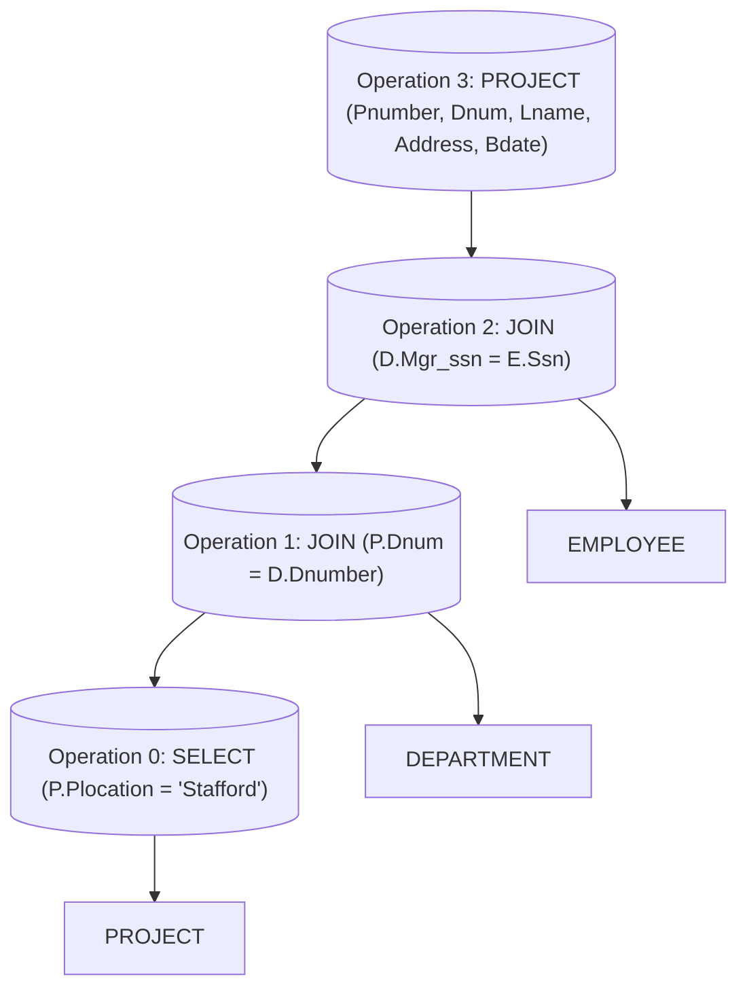
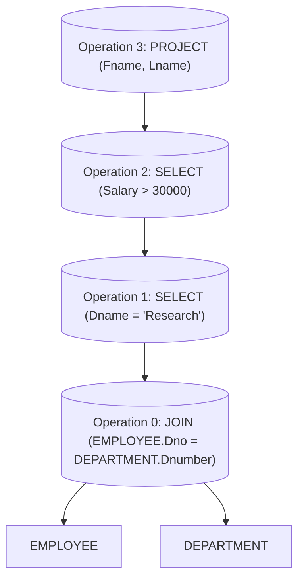

# 7 The Relational Algebra And The Relational Calculus

Comprehensive resource for 7 The Relational Algebra And The Relational Calculus.


---

## 7 The Relational Algebra And The Relational Calculus Hub


## Overview
This unit introduces the fundamental concepts of **Relational Algebra** and **Relational Calculus**, two essential formal languages used to define and manipulate data in relational databases. Relational Algebra provides a procedural approach, specifying *how* to retrieve data through a sequence of operations like selection, projection, and various join types. In contrast, Relational Calculus offers a declarative approach, focusing on *what* data to retrieve without detailing the retrieval process. Understanding these languages is crucial for grasping the theoretical underpinnings of database query languages like SQL and for developing efficient query optimization strategies.

## Learning Objectives
*   Define Relational Algebra and its basic operations, including SELECT, PROJECT, RENAME, UNION, INTERSECT, SET DIFFERENCE, and CARTESIAN PRODUCT.
*   Explain the various types of JOIN operations (Theta Join, Equijoin, Natural Join) and their applications in combining relations.
*   Describe the DIVISION operation and its use in complex queries involving "all" conditions.
*   Understand aggregate functions and how they are used with grouping to summarize data.
*   Differentiate between OUTER JOIN and OUTER UNION operations and their purpose in preserving information.
*   Explain the concept of a Query Tree and its role in query optimization.
*   Define Relational Calculus, contrasting its procedural nature with the declarative nature of Relational Algebra.
*   Describe Tuple Relational Calculus and Domain Relational Calculus, including the use of existential and universal quantifiers.
*   Relate the concepts of Relational Calculus to the structure of standard query languages like SQL and QUEL.

## Unit Applications & Real-World Relevance
Relational Algebra and Calculus are the theoretical bedrock for virtually all modern relational database systems. Database designers use these concepts to formulate precise queries, while database management systems (DBMS) leverage them internally for query parsing, optimization, and execution. For instance, understanding relational algebra helps in writing more efficient SQL queries, as it mirrors the internal operations performed by the database engine. In data analytics and big data, the principles of combining, filtering, and summarizing data, as defined by these formalisms, are directly applied, albeit often through higher-level tools and languages.

## Active Learning Prompts
*   Consider a complex business requirement that involves retrieving data from multiple interconnected tables. How would you formulate this request using both Relational Algebra and a descriptive English sentence (to represent Relational Calculus)?
*   Imagine you need to find all employees who *do not* have any dependents. Which Relational Algebra operations would you combine to achieve this, and why?
*   Think about the differences between an EQUIJOIN and a NATURAL JOIN. In what specific real-world scenarios would one be preferred over the other, and what are the implications for data integrity or redundancy?

## Unit Challenges & Common Misconceptions
A common challenge is distinguishing between the procedural nature of Relational Algebra and the declarative nature of Relational Calculus. Students often confuse the role of quantifiers in Relational Calculus, particularly the difference between existential (there exists) and universal (for all) quantifiers, leading to incorrect query formulations. Another misconception is underestimating the importance of operation order in Relational Algebra expressions, especially when dealing with non-commutative operations like SET DIFFERENCE or certain PROJECT sequences. Understanding type compatibility is also crucial to avoid errors in set operations like UNION and INTERSECTION.

## Connections
  - [[Relational_Algebra]]
    - [[SELECT_Operation]]
    - [[PROJECT_Operation]]
    - [[RENAME_Operation]]
    - [[UNION_Operation]]
    - [[INTERSECTION_Operation]]
    - [[SET_DIFFERENCE_Operation]]
    - [[CARTESIAN_PRODUCT_Operation]]
    - [[JOIN_Operation]]
      - [[Theta_Join]]
      - [[EQUIJOIN_Operation]]
      - [[NATURAL_JOIN_Operation]]
    - [[DIVISION_Operation]]
    - [[Aggregate_Functions]]
      - [[Grouping_with_Aggregation]]
    - [[OUTER_JOIN_Operations]]
    - [[OUTER_UNION_Operations]]
    - [[Query_Tree_Notation]]
    - [[Complete_Set_of_Relational_Operations]]
  - [[Relational_Calculus]]
    - [[Tuple_Relational_Calculus]]
      - [[Existential_Quantifiers]]
      - [[Universal_Quantifiers]]
      - [[SQL_and_QUEL_Relation_to_Tuple_Calculus]]
    - [[Domain_Relational_Calculus]]

## Next Steps for Deeper Understanding
To further deepen your understanding, explore the practical implementation of these concepts in SQL. Practice writing complex queries that involve multiple relational algebra operations. Investigate query optimization techniques used by database systems, as these are often directly based on algebraic transformations of query trees. Consider the historical context of database languages and how Relational Algebra and Calculus influenced their design.

## Possible Questions
[[CS1241_7_The_Relational_Algebra_and_The_Relational_Calculus_Possible_Questions]]

---

---

## Relational Algebra


## Definition
Before proceeding, ensure you master Set_Theory and Mathematical_Logic because Relational Algebra fundamentally uses concepts from set theory to define its operations and mathematical logic for its conditions.
**Relational Algebra** is a procedural query language for the relational model. It defines a set of fundamental operations that take one or two relations as input and produce a new relation as output. This property makes the algebra "closed," meaning all its objects (inputs and outputs) are relations. A simpler way to understand it is like a recipe book for data: it gives you exact steps (operations) to combine and filter your data (ingredients) to get a new dataset (the cooked meal).

## The Mental Model
Imagine Relational Algebra as a set of specialized tools in a data workshop. Each tool (operation) performs a specific task on a piece of raw material (a relation/table). For instance, one tool might *cut out* specific rows (SELECT), another might *trim* unnecessary columns (PROJECT), and yet another might *glue* two pieces together (JOIN). The crucial aspect is that every tool's output is always another piece of material, ready for the next tool, allowing you to build complex data structures step by step.

## Context & Framework
#### Opening the Hood: What's Inside?
Relational Algebra comprises several groups of operations, each serving a distinct purpose in manipulating relations. These operations include unary operations (like SELECT, PROJECT, RENAME that act on a single relation), set-theoretic operations (like UNION, INTERSECTION, DIFFERENCE that combine two relations), and binary operations (like JOIN and DIVISION that combine two relations based on specific conditions). Understanding these components is key to mastering how data can be systematically retrieved and transformed.

## The Mastery Deep Dive
#### Follow the Ball: A Slow-Motion Trace
A sequence of relational algebra operations forms a **relational algebra expression**. The beauty of this is that the result of an operation is always a new relation, which can then be used as input for another operation. This allows for complex queries to be built by chaining simple operations together. For instance, you might first `SELECT` specific rows, then `PROJECT` only certain columns, and then `JOIN` the result with another table. Each step progressively refines the data until the desired output is achieved.

#### The Translator: From "Lego" to "Jargon"
The simple idea of "combining and filtering data" translates into precise academic terminology within Relational Algebra. "Cutting out specific rows" becomes the **SELECT operation** (σ), "trimming columns" becomes the **PROJECT operation** (π), and "gluing pieces together" becomes the **JOIN operation** (⋈). The entire sequence of these operations is formally known as a **relational algebra expression**, which ultimately represents a database query or retrieval request.

## Constraints & Limitations
#### The Reality Check: Theory vs. Real Life
While Relational Algebra provides a powerful theoretical foundation for database querying, its direct implementation can sometimes be cumbersome for end-users compared to higher-level declarative languages like SQL. Expressing complex multi-step queries purely in algebraic notation can become lengthy and difficult to read. Furthermore, the procedural nature means specifying *how* to get the data, which might not always be the most optimal path for the database system; query optimizers often rewrite algebraic expressions to improve performance.

## Significance & Application
Relational Algebra is the mathematical foundation for relational databases and SQL. It provides a formal system for reasoning about queries and is crucial for database system developers who build query optimizers. Understanding Relational Algebra allows for a deeper comprehension of how database systems process queries internally, enabling users to write more efficient and effective SQL statements. It's also a fundamental concept taught in computer science and database theory courses.

## The Worked Example
Consider a `EMPLOYEE` relation `(SSN, FName, LName, Salary, Dno)`. We want to retrieve the first name, last name, and salary of all employees who work in department number 5.

**Relational Algebra Expression (single expression):**
$$ \boxed{\displaystyle \pi_{FName, LName, Salary}(\sigma_{Dno=5}(EMPLOYEE))} $$

**Relational Algebra Expression (sequence of operations):**
```text
DEP5_EMPS <- σ_Dno=5(EMPLOYEE)
RESULT <- π_FName, LName, Salary(DEP5_EMPS)
```
```text
// Scenario 1: Step-by-step evaluation of the query
// Input: EMPLOYEE table (containing all employee records)
// Step 1: DEP5_EMPS <- SELECT employees where Dno is 5
// Output (DEP5_EMPS, partial for illustration):
// | SSN       | FName | LName    | Salary | Dno |
// | --------- | ----- | -------- | ------ | --- |
// | 123456789 | John  | Smith    | 30000  | 5   |
// | 333445555 | Frank | Wong     | 40000  | 5   |
// | ...       | ...   | ...      | ...    | ... |
//
// Step 2: RESULT <- PROJECT FName, LName, Salary from DEP5_EMPS
// Output (RESULT):
// | FName | LName    | Salary |
// | ----- | -------- | ------ |
// | John  | Smith    | 30000  |
// | Frank | Wong     | 40000  |
// | ...   | ...      | ...    |
```
This example shows how a complex request can be broken down into individual, logical steps using relational algebra. The `SELECT` operation first filters the `EMPLOYEE` relation to find only those in department 5. The intermediate result `DEP5_EMPS` then becomes the input for the `PROJECT` operation, which extracts only the `FName`, `LName`, and `Salary` attributes, yielding the final desired relation.

## The Proving Ground
*Test your mastery. Cover the solutions below to test yourself first.*

#### Level 1: Understanding (The Basics)
**The Fact Check:** What is the "closure property" of Relational Algebra, and why is it significant?
> **Solution:** The closure property states that the result of any Relational Algebra operation is always another relation. This is significant because it allows operations to be chained together, where the output of one operation can serve as the input for the next, enabling the construction of complex queries.

#### Level 2: Competence (Application)
**The Trade-off:** Explain a scenario where writing a database query using a sequence of intermediate relational algebra operations might be advantageous over a single, highly nested expression.
> **Solution:** A sequence of intermediate operations can be advantageous for readability and debugging, especially with very complex queries. Each intermediate relation can be inspected, making it easier to understand the data transformation at each step and identify where an error might be occurring, similar to breaking down a complex programming task into smaller functions.

#### Level 3: Mastery (The Crucible)
**The Impossible Case:** A database administrator proposes designing a new relational database system where some of the core operations, such as "reporting," produce XML documents directly instead of relations. Critically analyze why this proposal fundamentally violates the principles of Relational Algebra and would prevent the system from being considered a true relational algebra implementation.
> **Solution:** This proposal violates the **closure property** of Relational Algebra. Relational Algebra strictly requires that all operations take relations as input and produce relations as output. If a "reporting" operation produces an XML document, it breaks this closure, as XML is not a relation. This means the output of the reporting operation cannot be used as input for further relational algebra operations, fundamentally undermining the chained, compositional nature of the algebra and preventing it from being a true relational algebra implementation.

## Key Takeaways
*   Relational Algebra is a procedural query language that defines operations on relations, producing new relations.
*   Its "closure property" enables complex queries by chaining operations, where the output of one becomes the input for the next.
*   Key operations include SELECT (rows), PROJECT (columns), RENAME, and various set and binary operations like UNION, INTERSECT, DIFFERENCE, and JOIN.

## Knowledge Graph Connections
| Concept                     | Connection / Relationship                                                                   |
| :
-------------------------- | :
------------------------------------------------------------------------------------------ |
| [[Database_Systems]]        | Relational Algebra is a foundational query language for database systems.                   |
| Relational_Model        | It operates directly on relations, which are the core component of the relational model.    |
| SQL                     | Relational Algebra forms the theoretical basis for declarative query languages like SQL.    |
| Query_Optimization      | Understanding Relational Algebra is essential for query optimization techniques.             |
---

---

## Relational Calculus


## Definition
Before proceeding, ensure you master First_Order_Logic and [[Relational_Algebra]] because Relational Calculus defines queries declaratively using logical predicates, contrasting with the procedural nature of Relational Algebra.
**Relational Calculus** is a formal, declarative query language for the relational model. Unlike Relational Algebra, which specifies *how* to retrieve data through a sequence of operations, Relational Calculus focuses on *what* data to retrieve without detailing the procedural steps. It allows users to define a desired set of tuples by specifying properties or conditions that the tuples must satisfy, much like defining a set in mathematics using predicates. This makes it a nonprocedural or declarative language, as it describes the characteristics of the target relation rather than the process of its construction.

## The Mental Model
Imagine you want to buy a specific type of car. With Relational Algebra, you'd give detailed instructions: "Go to the car lot, walk past the red sedans, find the blue SUVs, and then look for one with leather seats." With Relational Calculus, you simply state *what you want*: "A blue SUV with leather seats." You don't care *how* the dealership finds it; you just describe its properties. Relational Calculus is like this declarative description for data: you define the properties of the data you're looking for, and the database system figures out the best way to get it.

## Context & Framework
#### Declarative Paradigm
Relational Calculus provides a declarative way to express queries. Instead of specifying a sequence of operations to perform (like in Relational Algebra), a Relational Calculus expression defines a new relation by stating a condition (a logical predicate) that the tuples in the desired relation must satisfy. This aligns closely with how people naturally think about data retrieval: "I want X data that meets Y criteria," rather than "First do A, then B, then C to get X data."

## The Mastery Deep Dive
#### The Hard Choice: Option A or Option B?
The primary distinction between Relational Algebra and Relational Calculus lies in their approach: procedural vs. declarative. Relational Algebra is about the *process* (`how` to get the data), using operations as building blocks. Relational Calculus is about the *properties* (`what` data is desired), using logical formulas. While both have equivalent expressive power (they can formulate the same set of queries), the choice between understanding them depends on whether one prefers to think in terms of step-by-step data manipulation or logical conditions.

#### The Elevator Pitch
To explain Relational Calculus to a non-technical audience (or "boss"), you'd emphasize its simplicity of expression. "Instead of giving the computer a complex list of instructions for finding data, we simply tell it *what kind of data we need*. We describe the characteristics (like 'employees earning over $50,000 in the marketing department'), and the system intelligently figures out the most efficient way to fetch it. This saves us time and reduces errors from giving incorrect steps."

## Constraints & Limitations
#### The "Oops!" List: Where Everyone Fails
A common challenge with Relational Calculus, especially for beginners, is understanding and correctly applying the concept of **quantifiers** (existential $\exists$ and universal $\forall$). Formulating complex conditions with nested quantifiers can be logically challenging and prone to error. Another limitation is that while Relational Calculus is powerful, it doesn't immediately lend itself to a clear execution strategy. This makes query optimization more abstract than with the step-by-step nature of Relational Algebra.

## Significance & Application
Relational Calculus is of immense theoretical importance as it provides a formal basis for understanding the expressive power of relational query languages. It directly influenced the design of declarative query languages like SQL (Structured Query Language) and QUEL. Although users rarely write queries directly in Relational Calculus, its principles are deeply embedded in the underlying logic of modern database systems, particularly in how query optimizers interpret and transform user queries.

## The Worked Example
Let's consider a simple query: "Find the first name and last name of all employees whose salary is above $50,000."

In Relational Algebra, this would be: $\pi_{\text{FNAME, LNAME}}(\sigma_{\text{SALARY > 50000}}(EMPLOYEE))$

In Relational Calculus, we define the set of desired `(FNAME, LNAME)` tuples.

**Relational Calculus Expression:**
$$ \boxed{\displaystyle \{t.\text{FNAME}, t.\text{LNAME} \mid EMPLOYEE(t) \text{ AND } t.\text{SALARY} > 50000\}} $$
```text
// Scenario 1: Expressing "Employees with salary > 50000" in Relational Calculus.
// Input: An EMPLOYEE relation.
// Output:
// This expression defines a set of tuples containing (FNAME, LNAME) where 't' is a tuple variable ranging over the EMPLOYEE relation, and the condition is that the salary of 't' must be greater than 50000.
//
// Conceptual result:
// | FNAME    | LNAME   |
// | :
------- | :
------ |
// | James    | Borg    |
// | ... (other employees > 50000) |
```
This example highlights the declarative nature: we state that we want the `FNAME` and `LNAME` of a tuple `t`, given that `t` is in the `EMPLOYEE` relation AND `t.SALARY` is greater than `50000`. We don't specify how to filter or project, only the conditions that must be met.

## The Proving Ground
*Test your mastery. Cover the solutions below to test yourself first.*

#### Level 1: Understanding (The Basics)
**The Fact Check:** What is the fundamental difference in approach between Relational Algebra and Relational Calculus when defining a query?
> **Solution:** Relational Algebra is **procedural**, specifying *how* to retrieve data through operations. Relational Calculus is **declarative**, specifying *what* data to retrieve by defining its properties.

#### Level 2: Competence (Application)
**The Trade-off:** Imagine you are explaining the core logic of SQL's `SELECT...WHERE` statement. Would you primarily reference concepts from Relational Algebra or Relational Calculus to best explain *why* it works the way it does, and what advantage it offers to users?
> **Solution:** You would primarily reference **Relational Calculus**. SQL's `SELECT...WHERE` syntax is fundamentally declarative. Users describe the desired columns (`SELECT`) and the conditions (`WHERE`) that records must meet, without specifying the step-by-step procedure for retrieval. This offers users the advantage of focusing on the logical requirements of their data, rather than the intricate steps of execution.

#### Level 3: Mastery (The Crucible)
**The Impostor:** A new database researcher proposes a query language that only allows users to specify `SELECT` and `PROJECT` operations, arguing that this is sufficient because most common queries involve these. Explain why this language, despite using algebraic operations, would be fundamentally less expressive than a language based on Relational Calculus, specifically highlighting what types of common queries it would fail to express.
> **Solution:** This language would be fundamentally less expressive and **not relationally complete** because it is missing crucial operations that Relational Calculus can express.
>
> 1.  **Combining Relations:** It cannot naturally combine two independent relations (e.g., finding the `UNION` or `INTERSECTION` of two tables) without more complex, non-obvious workarounds that would not be considered native operations.
> 2.  **Referential Integrity / Joins:** It lacks the ability to express `JOIN` operations. While a `JOIN` can be derived from `CARTESIAN PRODUCT` and `SELECT`, without `CARTESIAN PRODUCT` (or a direct `JOIN`), linking data across tables based on relationships would be impossible.
> 3.  **"For All" Queries**: It cannot express "for all" type queries (e.g., "find students who took *all* courses in a department") which are easily expressed with the universal quantifier in Relational Calculus.
>
> In essence, by omitting operations like `UNION`, `SET DIFFERENCE`, `CARTESIAN PRODUCT`, and `RENAME` (which are part of the complete set of relational algebra and thus equivalent to relational calculus), the proposed language would be severely limited in its ability to handle common data integration, comparison, and complex filtering tasks.

## Key Takeaways
*   `Relational_Calculus` is a declarative query language that defines desired results based on conditions, not procedural steps.
*   It contrasts with `Relational_Algebra`'s procedural approach but has equivalent expressive power.
*   It forms the theoretical basis for declarative query languages like SQL.

## Knowledge Graph Connections
| Concept                     | Connection / Relationship                                                                   |
| :
-------------------------- | :
------------------------------------------------------------------------------------------ |
| Relational_Model        | `Relational_Calculus` is a formal query language for the `Relational_Model`.              |
| [[Relational_Algebra]]      | `Relational_Calculus` is equivalent in expressive power to `Relational_Algebra` but differs in its declarative approach. |
| First_Order_Logic       | `Relational_Calculus` is based on `First_Order_Logic` and the use of logical predicates.    |
| SQL                     | `Relational_Calculus` served as a key theoretical foundation for the development of `SQL`.  |
---

---

## Aggregate Functions


## Definition
Before proceeding, ensure you master [[Relational_Algebra]] and Basic_Statistics because Aggregate Functions operate on collections of values within relations to derive statistical summaries.
**Aggregate Functions** are operations in Relational Algebra that compute summary information from collections of values within a relation. Unlike other relational algebra operations that manipulate tuples, aggregate functions take a column of values as input and return a single scalar value as output. Common aggregate functions include `SUM`, `AVERAGE` (`AVG`), `MAXIMUM` (`MAX`), `MINIMUM` (`MIN`), and `COUNT`. These functions are essential for answering analytical queries about data, such as "what is the total salary?" or "how many employees are there?".

## The Mental Model
Imagine you have a long list of sales transactions (your relation), and each transaction has a `SaleAmount` column. If you want to know the *total revenue* for the day, you wouldn't look at individual transactions; you'd use a `SUM` aggregate function on the `SaleAmount` column. If you want the *highest single sale*, you'd use `MAX`. These functions compress a column of many values into one summary statistic, much like condensing a detailed report into a single key performance indicator (KPI).

## Context & Framework
#### Common Aggregate Functions and Their Purpose
Aggregate functions are used in simple statistical queries to summarize information from database tuples. They operate on collections of numeric values, or in the case of `COUNT`, on collections of any values (or tuples).
*   **`SUM`**: Calculates the total sum of values in a numeric column. For example, `SUM Salary(EMPLOYEE)` retrieves the total salary from the `EMPLOYEE` relation.
*   **`AVERAGE` (`AVG`)**: Computes the arithmetic mean of values in a numeric column. For example, `AVG Salary(EMPLOYEE)` computes the average salary.
*   **`MAXIMUM` (`MAX`)**: Finds the largest value in a numeric or comparable column. For example, `MAX Salary(EMPLOYEE)` retrieves the maximum salary.
*   **`MINIMUM` (`MIN`)**: Finds the smallest value in a numeric or comparable column. For example, `MIN Salary(EMPLOYEE)` retrieves the minimum salary.
*   **`COUNT`**: Counts the number of tuples or non-NULL values in a specified column. For example, `COUNT Ssn(EMPLOYEE)` computes the number of employees, often used with `COUNT(*)` to count all tuples.

## The Mastery Deep Dive
#### Anatomy of the Formula (Who is Who?)
The general notation for an aggregate function is $\mathcal{F}_{\text{aggregate function list}}(R)$, where:
*   $\mathcal{F}$ is the symbol used to denote the aggregate functional operation.
*   $\text{aggregate function list}$ specifies one or more aggregate functions to be applied, along with the attributes they operate on (e.g., `SUM Salary`, `COUNT Ssn`, `AVG Salary`).
*   $R$ is the input relation.

The result is a single tuple containing the computed aggregate values. For example, $\mathcal{F}_{\text{MAX Salary}}(EMPLOYEE)$ produces a relation with a single tuple and a single attribute (MAX_Salary) holding the maximum salary value.

#### Edge Case Analysis
A critical aspect of `COUNT` is its behavior with `NULL` values and duplicates. `COUNT(Attribute)` typically counts only non-NULL values in that attribute. `COUNT(*)` (or `COUNT(1)`) counts all tuples (rows), regardless of `NULL` values in any specific attribute, and does not remove duplicates. If you need to count distinct values, `COUNT(DISTINCT Attribute)` must be specified. This distinction is vital for accurate statistical reporting.

## Constraints & Limitations
#### The Engineering Trade-off
While aggregate functions are extremely useful, they reduce a large set of data to a single value, leading to a loss of individual tuple detail. Once aggregated, it's impossible to reconstruct the original individual records from the aggregate result alone. This is an inherent trade-off: you gain summary insight but lose granularity. Also, aggregate functions typically require scanning all relevant data, which can be computationally intensive for very large datasets, although database systems employ various indexing and optimization techniques to speed up these operations.

## Significance & Application
Aggregate functions are indispensable for business intelligence, reporting, and analytical queries. They allow users to gain insights into overall trends, performance, and statistics without needing to examine every single record. From calculating departmental budgets (`SUM`), identifying top performers (`MAX`), or determining average customer spending (`AVG`), these functions provide the summarized views necessary for decision-making. They are heavily utilized in the `SELECT` clause (with `GROUP BY`) in SQL.

## The Worked Example
Using the COMPANY database, let's compute the total salary, average salary, and number of employees in the `EMPLOYEE` relation.

**Input Relation: `EMPLOYEE`** (partial view)
| Fname    | Lname   | Ssn       | Salary | ... |
| :
------- | :
------ | :
-------- | :
----- | :-- |
| John     | Smith   | 123456789 | 30000  | ... |
| Franklin | Wong    | 333445555 | 40000  | ... |
| Alicia   | Zelaya  | 999887777 | 25000  | ... |
| Jennifer | Wallace | 987654321 | 43000  | ... |
| Joyce    | English | 453453453 | 25000  | ... |
| Ahmad    | Jabbar  | 987987987 | 25000  | ... |
| James    | Borg    | 888665555 | 55000  | ... |
(Assume this table has more entries, totalling 8 employees for the calculation based on lecture slides.)

**Relational Algebra Expression:**
$$ \boxed{\displaystyle RESULT \leftarrow \mathcal{F}_{\text{SUM Salary, AVG Salary, COUNT Ssn}}(EMPLOYEE)} $$
```text
// Scenario 1: Applying aggregate functions to the EMPLOYEE table
// Input: EMPLOYEE table. Let's assume total 8 employees.
// Sum of salaries: 30000 + 40000 + 25000 + 43000 + 25000 + 25000 + 55000 + (other salaries if 8 employees) = 278000 (example if sum of values is 278000)
// Average salary: 278000 / 8 = 34750
// Count of Ssn: 8 (assuming Ssn is unique and not null for all employees)
//
// Final Result:
// | SUM_Salary | AVG_Salary | COUNT_Ssn |
// | :
--------- | :
--------- | :
-------- |
// | 278000     | 34750      | 8         |
```
This example demonstrates how a single operation can derive multiple summary statistics from the entire `EMPLOYEE` relation, providing quick insights into the dataset.

## The Proving Ground
*Test your mastery. Cover the solutions below to test yourself first.*

#### Level 1: Understanding (The Basics)
**The Component Check:** Name the five common aggregate functions in Relational Algebra and state what type of value each returns (e.g., numeric, count).
> **Solution:**
> 1.  `SUM`: Returns a single numeric value (total).
> 2.  `AVERAGE` (`AVG`): Returns a single numeric value (mean).
> 3.  `MAXIMUM` (`MAX`): Returns a single numeric or comparable value (largest).
> 4.  `MINIMUM` (`MIN`): Returns a single numeric or comparable value (smallest).
> 5.  `COUNT`: Returns a single numeric value (number of items/tuples).

#### Level 2: Competence (Application)
**The Standard Solver:** You have a relation `SALES(SaleID, ProductID, Amount, Quantity)`. Write a Relational Algebra expression to find the total quantity of all products sold and the minimum `Amount` of any single sale.
> **Solution:** `F_SUM Quantity, MIN Amount (SALES)`

#### Level 3: Mastery (The Crucible)
**The Impossible Case:** A data analyst needs to calculate the average salary of employees and also list the names of all employees whose salary is below this average. They propose to do this in a single Relational Algebra expression by nesting an `AVG` function within a `SELECT` condition. Explain why this approach is fundamentally flawed in pure Relational Algebra and why aggregate functions cannot be directly used in `SELECT` conditions in this manner.
> **Solution:** This approach is fundamentally flawed in pure Relational Algebra because aggregate functions (like `AVG`) operate on an *entire column or group* of values and produce a *single scalar value*. The `SELECT` operation, however, evaluates its condition **tuple by tuple**. You cannot directly compare a tuple's individual `Salary` value to an aggregate `AVG Salary` *within the same `SELECT` operation* because the `AVG Salary` is not known until *after* all tuples have been considered and the aggregate calculated. This creates a logical ordering problem. In practice, this type of query typically requires two steps: first, calculate the average salary as an aggregate, and second, use that calculated average as a constant in a subsequent `SELECT` operation to filter individual employee tuples.

## Key Takeaways
*   Aggregate functions summarize data from collections of values in a relation, returning a single scalar output.
*   Common functions include `SUM`, `AVG`, `MAX`, `MIN`, and `COUNT`.
*   They lead to a loss of individual tuple granularity, representing a trade-off between detail and summary.

## Knowledge Graph Connections
| Concept                     | Connection / Relationship                                                                   |
| :
-------------------------- | :
------------------------------------------------------------------------------------------ |
| [[Relational_Algebra]]      | Aggregate functions are additional operations that extend the capabilities of Relational Algebra. |
| Statistical_Analysis    | They provide the basis for performing basic `Statistical_Analysis` directly within database queries. |
| Data_Summarization      | Aggregate functions are the primary tools for `Data_Summarization` in relational databases. |
| Query_Optimization      | Database systems apply specific `Query_Optimization` techniques to efficiently compute aggregate functions. |
---

---

## CARTESIAN PRODUCT Operation


## Definition
Before proceeding, ensure you master Set_Theory and Combinatorics because the CARTESIAN PRODUCT operation fundamentally relies on combinatorial principles from set theory to combine every element from one set with every element from another.
The **CARTESIAN PRODUCT operation**, also known as `CROSS PRODUCT`, is a binary operation in Relational Algebra, denoted by `x`. It combines every tuple from the first input relation (R) with every tuple from the second input relation (S) in a combinatorial fashion. The result is a new relation whose schema includes all attributes from R followed by all attributes from S. If R has $n_R$ tuples and S has $n_S$ tuples, the result $R \times S$ will have $n_R \times n_S$ tuples. Think of it like matching every shirt in your wardrobe with every pair of pants you own to create every possible outfit combination.

## The Mental Model
Imagine you have a list of all `EMPLOYEE` records (Relation R) and a separate list of all `DEPENDENT` records (Relation S). A `CARTESIAN PRODUCT` operation `EMPLOYEE x DEPENDENT` would create a new, much larger table where *every single employee* is paired up with *every single dependent*, regardless of whether that dependent actually belongs to that employee. This results in a comprehensive, but often "meaningless" in isolation, combination of all possible pairs.

## Context & Framework
#### Combinatorial Nature of CARTESIAN PRODUCT
The `CARTESIAN PRODUCT` operation directly stems from the mathematical concept of a Cartesian product of two sets. For two sets A and B, $A \times B$ is the set of all possible ordered pairs $(a, b)$ where $a \in A$ and $b \in B$. In relational algebra, this translates to combining each tuple from the first relation with each tuple from the second relation. The resulting relation's schema is the concatenation of the schemas of the two input relations. Crucially, the input relations do **not** need to be type compatible for this operation.

## The Mastery Deep Dive
#### Anatomy of the Formula (Who is Who?)
Given two relations, $R(A_1, A_2, ..., A_n)$ and $S(B_1, B_2, ..., B_m)$, the `CARTESIAN PRODUCT` $R \times S$ results in a new relation $Q$ with degree $n + m$ attributes. The schema of $Q$ will be $(A_1, A_2, ..., A_n, B_1, B_2, ..., B_m)$, in that order. Each tuple in $Q$ is formed by concatenating a tuple from $R$ with a tuple from $S$. If $n_R$ is the number of tuples in $R$ and $n_S$ is the number of tuples in $S$, then $R \times S$ will have $n_R \times n_S$ tuples.

#### Edge Case Analysis
While the `CARTESIAN PRODUCT` can be performed on any two relations regardless of their schemas, it often produces a very large and mostly "meaningless" relation if not immediately followed by other operations. For example, `EMPLOYEE x DEPARTMENT` would combine every employee with every department, creating a huge table where only a few rows represent actual employee-department relationships. This operation typically becomes "meaningful" only when followed by a `SELECT` operation to filter out the irrelevant combinations, usually to match related attributes.

## Constraints & Limitations
#### The "Oops!" List: Where Everyone Fails
The primary pitfall of the `CARTESIAN PRODUCT` is generating an excessively large number of tuples, potentially leading to performance issues or memory exhaustion, if not carefully managed. The $n_R \times n_S$ growth factor means even moderately sized relations can produce enormous results. Another common mistake is forgetting that the attributes in the resulting relation are simply concatenated, which can lead to ambiguous attribute names if both input relations share common attribute names (e.g., `EMPLOYEE.Name` and `DEPARTMENT.Name` both present in the result). This often necessitates a `RENAME` operation beforehand for clarity.

## Significance & Application
While rarely used in isolation due to its combinatorial nature, the `CARTESIAN PRODUCT` is a foundational operation that underpins more advanced operations like `JOIN`. It's essential when you need to consider *all possible combinations* of tuples from two relations, even if only a subset of those combinations is ultimately relevant. In practice, `CARTESIAN PRODUCT` followed by a `SELECT` operation based on a matching condition is precisely how a basic `JOIN` operation can be constructed from more primitive relational algebra operations.

## The Worked Example
Consider two simple relations:
**`CARS` Relation:**
| CarID | Model  |
| :
---- | :
----- |
| 1     | Sedan  |
| 2     | SUV    |

**`COLORS` Relation:**
| ColorID | Name   |
| :
------ | :
----- |
| C1      | Red    |
| C2      | Blue   |
| C3      | Green  |

**Relational Algebra Expression:**
$$ \boxed{\displaystyle RESULT \leftarrow CARS \times COLORS} $$
```text
// Scenario 1: Executing the CARTESIAN PRODUCT of CARS and COLORS
// Input: CARS table (2 tuples), COLORS table (3 tuples)
// Output:
// The CARTESIAN PRODUCT will combine each CARS tuple with each COLORS tuple.
// Total tuples = 2 * 3 = 6 tuples.
//
// Final Result:
// | CarID | Model | ColorID | Name  |
// | :
---- | :
---- | :
------ | :
---- |
// | 1     | Sedan | C1      | Red   |
// | 1     | Sedan | C2      | Blue  |
// | 1     | Sedan | C3      | Green |
// | 2     | SUV   | C1      | Red   |
// | 2     | SUV   | C2      | Blue  |
// | 2     | SUV   | C3      | Green |
```
This example clearly shows how every car is combined with every color, creating all possible car-color combinations.

## The Proving Ground
*Test your mastery. Cover the solutions below to test yourself first.*

#### Level 1: Understanding (The Basics)
**The Fact Check:** If Relation R has 5 attributes and 10 tuples, and Relation S has 3 attributes and 8 tuples, what will be the degree (number of attributes) and cardinality (number of tuples) of the result of `R x S`?
> **Solution:** The degree will be `5 + 3 = 8` attributes. The cardinality will be `10 * 8 = 80` tuples.

#### Level 2: Competence (Application)
**The Trade-off:** You need to find all possible pairings between employees and projects, including pairings where an employee might not actually work on a project, or a project might not have any employees assigned yet. Which Relational Algebra operation would you use as the initial step to generate all these potential pairings, and why?
> **Solution:** You would use the `CARTESIAN PRODUCT` (`EMPLOYEE x PROJECT`). This is because it generates every possible combination of an employee tuple with a project tuple, fulfilling the requirement of "all possible pairings" regardless of existing relationships. You would then typically apply a `SELECT` operation to filter for meaningful relationships if needed.

#### Level 3: Mastery (The Crucible)
**The Broken System:** A developer attempts to retrieve the names of all female employees and their dependents using the following sequence: `FEMALE_EMPS <- σ_SEX='F'(EMPLOYEE)`, `EMPNAMES <- π_FNAME,LNAME,SSN(FEMALE_EMPS)`, `EMP_DEPENDENTS <- EMPNAMES x DEPENDENT`. They then try to filter for actual dependents using `ACTUAL_DEPS <- σ_SSN=ESSN(EMP_DEPENDENTS)`. The query fails because `SSN` and `ESSN` are from different relations and cause ambiguity. How would you modify the initial `CARTESIAN PRODUCT` step and the subsequent `SELECT` to prevent this ambiguity and correctly retrieve the names of female employees and their dependents?
> **Solution:** The ambiguity arises because `EMP_DEPENDENTS` (the result of the `CARTESIAN PRODUCT`) contains two `SSN`-like attributes (`SSN` from `EMPNAMES` and `ESSN` from `DEPENDENT`) that are not clearly distinguished in the selection condition `σ_SSN=ESSN`.
>
> To resolve this, `RENAME` should be used on one of the relations before the `CARTESIAN PRODUCT` to avoid attribute name clashes and provide explicit, distinct names for the attributes being compared:
>
> 1.  `FEMALE_EMPS <- σ_SEX='F'(EMPLOYEE)`
> 2.  `EMPNAMES <- π_FNAME,LNAME,SSN(FEMALE_EMPS)`
> 3.  `RENAMED_DEPENDENT <- ρ_DEPENDENT(EmpSSN:ESSN, DepName:Dependent_name, Sex, Bdate, Relationship)(DEPENDENT)` (Renames `ESSN` in `DEPENDENT` to `EmpSSN`)
> 4.  `EMP_DEPENDENTS <- EMPNAMES x RENAMED_DEPENDENT`
> 5.  `ACTUAL_DEPS <- σ_SSN = EmpSSN(EMP_DEPENDENTS)`
> 6.  `RESULT <- π_FNAME,LNAME,DepName(ACTUAL_DEPS)`
>
> This ensures that `SSN` and `EmpSSN` are uniquely identifiable attributes in the `EMP_DEPENDENTS` relation, allowing the `SELECT` operation to correctly match employees with their dependents.

## Key Takeaways
*   The `CARTESIAN PRODUCT` (`x`) combines every tuple from one relation with every tuple from another relation.
*   The result's schema is the concatenation of the input schemas, and its cardinality is the product of the input cardinalities.
*   Input relations do not need to be type compatible.
*   Often used as a preliminary step before `SELECT` to form `JOIN`-like operations, it can create very large, initially "meaningless" relations.

## Knowledge Graph Connections
| Concept                     | Connection / Relationship                                                                   |
| :
-------------------------- | :
------------------------------------------------------------------------------------------ |
| [[Relational_Algebra]]      | `CARTESIAN PRODUCT` is a fundamental binary operation in Relational Algebra.              |
| Set_Theory              | It is based on the mathematical concept of the Cartesian product of sets.                   |
| Join_Operation          | `CARTESIAN PRODUCT` combined with `SELECT` forms the basis of the `JOIN` operation.         |
| Cardinality             | The cardinality of the result is the product of the cardinalities of the input relations.   |
---

---

## Complete Set Of Relational Operations


## Definition
Before proceeding, ensure you master [[Relational_Algebra]] and Set_Theory because a complete set of relational operations ensures that any query expressible in relational calculus can also be expressed using a combination of these fundamental algebraic operations.
A **Complete Set of Relational Operations** refers to a minimal set of Relational Algebra operations from which all other relational algebra operations can be derived or expressed. In essence, it means that any valid query that can be formulated in Relational Algebra can be constructed using only these fundamental operations. The generally recognized complete set includes six operations: `SELECT` ($\sigma$), `PROJECT` ($\pi$), `UNION` ($\cup$), `SET DIFFERENCE` ($-$), `CARTESIAN PRODUCT` ($\times$), and `RENAME` ($\rho$). This set is considered "relationally complete" because it is equivalent in expressive power to tuple relational calculus.

## The Mental Model
Imagine you have a basic toolkit with a few essential tools: a hammer, a screwdriver, a saw, a wrench, a tape measure, and a marker. With just these, you can build or fix almost anything. A "Complete Set of Relational Operations" is like that basic toolkit for manipulating data in a database. Even if you don't have a specialized power drill (like a `JOIN` operation), you can still achieve the same result by combining your basic tools in a few extra steps.

## Context & Framework
#### Defining a "Complete" Set
The concept of a "complete set" is crucial for understanding the expressive power of Relational Algebra. It implies that any complex data retrieval or manipulation task, no matter how intricate, can ultimately be broken down into a sequence of these six fundamental operations. This theoretical foundation is significant because it guarantees that Relational Algebra can express any query that is expressible in a first-order logic language like Relational Calculus, thus establishing its foundational role in database theory.

## The Mastery Deep Dive
#### The "Duh!" Moment (Intuitive Proof)
Intuitively, if you can filter rows (`SELECT`), choose columns (`PROJECT`), combine datasets (`UNION`, `CARTESIAN PRODUCT`), find differences between datasets (`SET DIFFERENCE`), and rename elements (`RENAME`), you have the building blocks to construct virtually any data transformation. The remaining operations, like `INTERSECTION` or `JOIN`, are merely convenient shorthand notations that can be expressed as a combination of these six fundamental operations.

#### The Translator: Converting English to Math
The "completeness" means that complex, high-level operations or declarative query requests can be translated into a series of these elementary algebraic steps. For example:
*   **`INTERSECTION`** can be derived from `UNION` and `SET DIFFERENCE`:
    $$ \boxed{\displaystyle R \cap S = (R \cup S) - ((R - S) \cup (S - R))} $$
    This formula shows that the intersection of R and S is equivalent to taking their union and then subtracting everything that is unique to R or unique to S.

*   A **`JOIN`** operation can be derived from `CARTESIAN PRODUCT` and `SELECT`:
    $$ \boxed{\displaystyle R \underset{\text{condition}}{\Join} S = \sigma_{\text{condition}}(R \times S)} $$
    This formula demonstrates that a join is effectively a Cartesian product followed by a selection that filters the tuples based on the join condition.

These derivations underscore the power and minimality of the complete set of operations.

## Constraints & Limitations
#### The Engineering Trade-off
While these six operations form a theoretically complete set, directly implementing complex queries using only these primitives can be verbose and difficult to read for humans. This is why more advanced or composite operations like `INTERSECTION`, `JOIN`, `DIVISION`, and `OUTER JOIN`s exist in extended Relational Algebra and practical query languages like SQL. These additional operations provide syntactic sugar and often lead to more intuitive and potentially more optimizable queries, balancing theoretical completeness with practical usability and performance.

## Significance & Application
The concept of a complete set of relational operations is a cornerstone of database theory. It ensures that Relational Algebra (and by extension, SQL, which is based on it) has sufficient expressive power to handle a wide range of data retrieval tasks. It also provides a formal basis for query optimization, as the DBMS can transform a complex query into an equivalent sequence of these fundamental operations, which can then be optimized for efficient execution.

## The Worked Example
Let's demonstrate how the `INTERSECTION` operation can be expressed using the six fundamental operations: `SELECT`, `PROJECT`, `UNION`, `SET DIFFERENCE`, `CARTESIAN PRODUCT`, and `RENAME`.

Given two relations, $R$ and $S$, both type-compatible.

**Derivation of $R \cap S$:**
1.  **Find tuples unique to R:**
    $$ \boxed{\displaystyle R\_UNIQUE \leftarrow R - S} $$
2.  **Find tuples unique to S:**
    $$ \boxed{\displaystyle S\_UNIQUE \leftarrow S - R} $$
3.  **Combine unique tuples from R and S:**
    $$ \boxed{\displaystyle UNIQUE\_BOTH \leftarrow R\_UNIQUE \cup S\_UNIQUE} $$
4.  **Find all tuples in either R or S (their UNION):**
    $$ \boxed{\displaystyle R\_UNION\_S \leftarrow R \cup S} $$
5.  **Subtract the unique tuples from the total union to find the common tuples (INTERSECTION):**
    $$ \boxed{\displaystyle R\_INTERSECTION\_S \leftarrow R\_UNION\_S - UNIQUE\_BOTH} $$
    This is equivalent to:
    $$ \boxed{\displaystyle R \cap S = (R \cup S) - ((R - S) \cup (S - R))} $$

```text
// Scenario 1: Deriving INTERSECTION using the six fundamental operations
// Input: Two type-compatible relations, R and S.
// Operations used: SET DIFFERENCE (-), UNION (U)
// Output:
// The process breaks down the INTERSECTION into a series of steps:
// 1. Identify elements only in R.
// 2. Identify elements only in S.
// 3. Combine these "only in" elements.
// 4. Find all elements present in either R or S.
// 5. Subtract the "only in" elements from the "all in" elements, leaving only the common elements.
```
This example systematically breaks down the `INTERSECTION` operation into a sequence of the six fundamental operations, illustrating their expressive power and how they can be combined to achieve more complex data manipulations.

## The Proving Ground
*Test your mastery. Cover the solutions below to test yourself first.*

#### Level 1: Understanding (The Basics)
**The Fact Check:** List the six operations that constitute a complete set of Relational Algebra operations.
> **Solution:** The six operations are `SELECT` ($\sigma$), `PROJECT` ($\pi$), `UNION` ($\cup$), `SET DIFFERENCE` ($-$), `CARTESIAN PRODUCT` ($\times$), and `RENAME` ($\rho$).

#### Level 2: Competence (Application)
**The Standard Solver:** Explain how the `JOIN` operation `R ⋈_condition S` can be expressed using only operations from the complete set of Relational Algebra operations.
> **Solution:** The `JOIN` operation `R ⋈_condition S` can be expressed as a `CARTESIAN PRODUCT` followed by a `SELECT` operation: `σ_condition(R × S)`. This means first taking the Cartesian product of R and S, and then applying a selection to filter the resulting tuples based on the specified join condition.

#### Level 3: Mastery (The Crucible)
**The Impossible Case:** A new database language is proposed that includes `SELECT`, `PROJECT`, `UNION`, and `SET DIFFERENCE` as its only operations. The designer claims it is "relationally complete." Critically evaluate this claim, identifying which crucial operation(s) are missing from the proposed set to achieve true relational completeness and why their absence limits the language's expressive power.
> **Solution:** The claim that the proposed language is "relationally complete" is **false**. While `SELECT`, `PROJECT`, `UNION`, and `SET DIFFERENCE` are powerful, the set is missing two crucial operations: `CARTESIAN PRODUCT` ($\times$) and `RENAME` ($\rho$).
>
> **Limitations due to absence:**
> *   **`CARTESIAN PRODUCT`**: Without `CARTESIAN PRODUCT`, it is impossible to combine information from two independent relations that do not share common attributes, or to initiate a `JOIN` operation (which is derived from `CARTESIAN PRODUCT` and `SELECT`). This severely limits the ability to retrieve data that spans multiple tables based on arbitrary relationships.
> *   **`RENAME`**: Without `RENAME`, it is impossible to perform self-joins (where a relation is joined with itself) or to combine relations that have identical attribute names but represent different conceptual entities (e.g., in a `CARTESIAN PRODUCT` followed by `SELECT` for a `JOIN`). This leads to ambiguity and prevents complex queries from being properly formulated.
>
> Therefore, this incomplete set would lack the expressive power to perform many fundamental data manipulation tasks that involve combining and relating data across distinct schemas.

## Key Takeaways
*   A `Complete_Set_of_Relational_Operations` includes `SELECT`, `PROJECT`, `UNION`, `SET DIFFERENCE`, `CARTESIAN PRODUCT`, and `RENAME`.
*   This set is relationally complete, meaning any other relational algebra operation can be derived from it.
*   It forms the theoretical foundation for the expressive power of relational query languages like SQL.

## Knowledge Graph Connections
| Concept                     | Connection / Relationship                                                                   |
| :
-------------------------- | :
------------------------------------------------------------------------------------------ |
| [[Relational_Algebra]]      | This `Complete_Set_of_Relational_Operations` defines the full expressive power of `Relational_Algebra`. |
| [[Relational_Calculus]]     | The `Complete_Set_of_Relational_Operations` has equivalent expressive power to `Relational_Calculus`. |
| Query_Expressiveness    | The completeness of this set guarantees `Query_Expressiveness` for all relational queries.  |
| Query_Optimization      | Understanding the derivation of operations from this set aids `Query_Optimization` strategies. |
---

---

## DIVISION Operation


## Definition
Before proceeding, ensure you master Set_Theory and [[PROJECT_Operation]] because the DIVISION operation fundamentally relies on set theory for its "for all" logic and often involves complex projections and set differences for its practical derivation.
The **DIVISION operation**, denoted by the symbol $\div$, is a binary Relational Algebra operation that is particularly useful for queries involving the "for all" or "every" condition. It operates on two relations, $R(Z)$ and $S(X)$, where the attributes of $X$ are a subset of the attributes of $Z$ (i.e., $X \subset Z$). The result is a new relation $T(Y)$, where $Y = Z - X$ (attributes of $R$ not in $S$). A tuple $t$ appears in $T(Y)$ if and only if, for every tuple $t_S$ in $S$, there exists a tuple $t_R$ in $R$ such that $t_R[Y] = t$ and $t_R[X] = t_S$. Think of it as finding all items in one list that are "paired up" with *every single item* in a second, smaller list.

## The Mental Model
Imagine you're trying to find a student who has taken *all* the required courses for their Computer Science major. You have a list of `STUDENT_COURSES` (Relation R, with `StudentID`, `CourseID`) and a list of `REQUIRED_CS_COURSES` (Relation S, with `CourseID`). The DIVISION operation would take `STUDENT_COURSES` and `REQUIRED_CS_COURSES` and return only the `StudentID`s of students who appear in `STUDENT_COURSES` with *every single `CourseID`* from the `REQUIRED_CS_COURSES` list. It's like a universal matching filter.

```mermaid
graph TD
    R_Relation[R (StudentID, CourseID)]
    S_Relation[S (CourseID)]
    Division_Op[("DIVISION (R ÷ S)")]
    Result_Relation[Result (StudentID)]

    R_Relation --> Division_Op
    S_Relation --> Division_Op
    Division_Op --> Result_Relation
```
```text
// Scenario 1: Conceptual illustration of the DIVISION operation
// Output:
// (A visual representation of the flowchart showing R_Relation and S_Relation feeding into Division_Op, which then outputs Result_Relation.)
// This diagram illustrates that the R_Relation (e.g., student enrollments) is divided by the S_Relation (e.g., required courses). The result is a new relation (Result_Relation) containing only the entities (e.g., student IDs) that are associated with *every* element in the S_Relation.
```
*Note: This `graph TD` illustrates how the `DIVISION` operation takes two relations as input and produces a third relation containing entities that satisfy a "for all" condition with respect to the second input relation.*

## Context & Framework
#### The "Duh!" Moment (Intuitive Proof)
Intuitively, when we pose a question like "Which suppliers supply *all* the parts that project X requires?", we are implicitly looking for a mechanism to test universal quantification. The `DIVISION` operation provides a direct, albeit complex, way to express this. It's the relational algebra equivalent of saying, "Find the things that are completely covered by another set." This type of query is difficult to express with simpler operations alone, making `DIVISION` a powerful, specialized tool.

## The Mastery Deep Dive
#### Anatomy of the Formula (Who is Who?)
Given $R(Z)$ and $S(X)$, where $Z = X \cup Y$ and $X \cap Y = \emptyset$. The `DIVISION` operation $R \div S$ produces a relation $T(Y)$.
*   $R(Z)$: The dividend relation, containing attributes from both the "universal" set ($X$) and the "identifier" set ($Y$). For example, `(StudentID, CourseID)`.
*   $S(X)$: The divisor relation, containing only the "universal" attributes ($X$) that must be matched. For example, `(CourseID)` for all required courses.
*   $T(Y)$: The resulting relation, containing only the "identifier" attributes ($Y$) that satisfy the "for all" condition. For example, `(StudentID)`.

The crucial condition is that for a tuple $t$ to be in $T(Y)$, for *every* tuple $t_S$ in $S$, there must exist a tuple $t_R$ in $R$ such that $t_R[Y] = t$ and $t_R[X] = t_S$. This ensures that the identifier ($t$) is associated with *all* the elements in the divisor set ($S$).

#### The Translator: Converting English to Math
The "for all" condition, which is often expressed using the universal quantifier ($\forall$) in Relational Calculus, is precisely what the `DIVISION` operation formalizes in Relational Algebra. It answers questions like "find entities that are related to *every single* instance of another entity set."
For example, to find the `StudentID` of students who have taken *all* courses from a set of `REQUIRED_COURSES`:
$$ \boxed{\displaystyle \text{STUDENT\_COURSES} \div \text{REQUIRED\_COURSES}} $$
This concisely captures the complex logic of checking every student against every required course.

#### Variable Dictionary
| Symbol | Name           | Unit       | Analogy                                   |
| :
----- | :
------------- | :
--------- | :
---------------------------------------- |
| $R$    | Dividend       | Relation   | The larger list of pairs (e.g., Student-Course) |
| $S$    | Divisor        | Relation   | The smaller list of "must-have" items (e.g., Required Courses) |
| $\div$ | Division       | Operation  | The "universal checker" filter            |
| $X$    | Common Attributes | Set of attributes | The item being matched (e.g., CourseID) |
| $Y$    | Result Attributes | Set of attributes | The identifier being sought (e.g., StudentID) |
| $Z$    | All Attributes  | Set of attributes | All attributes in R (e.g., StudentID, CourseID) |

## Constraints & Limitations
#### The "Oops!" List: Where Everyone Fails
The primary difficulty with `DIVISION` is its conceptual complexity and how to correctly apply it. It is not as intuitive as `SELECT` or `JOIN`. Furthermore, `DIVISION` requires specific structural constraints: the attributes of the divisor relation ($X$) must be a subset of the attributes of the dividend relation ($Z$), and $X$ and $Y$ must be disjoint. Violating these conditions makes the operation invalid. Another limitation is that `DIVISION` can often be expressed using a combination of other, more basic relational algebra operations (like `PROJECT`, `CARTESIAN PRODUCT`, and `SET DIFFERENCE`), which can be computationally more efficient in some database implementations due to specialized optimizations for those simpler operations.

## Significance & Application
The `DIVISION` operation is extremely valuable for complex queries that involve "for all" conditions, which are prevalent in many analytical scenarios. While rarely used directly by end-users (SQL uses subqueries and `NOT EXISTS` to simulate it), its understanding is crucial for:
*   **Database Designers and Optimizers**: To formally express and optimize complex queries.
*   **Data Analysis**: For tasks like identifying customers who purchased every product in a category, or suppliers who deliver all necessary components.
It provides a powerful mechanism to test for universal satisfaction of a condition across related data.

## The Worked Example
Consider two relations: `ENROLLS(StudentID, CourseID)` and `MANDATORY_COURSES(CourseID)`. We want to find the `StudentID` of students who are enrolled in *all* courses listed in `MANDATORY_COURSES`.

**Input Relations:**
**`ENROLLS` Relation:**
| StudentID | CourseID |
| :
-------- | :
------- |
| S101      | CS101    |
| S101      | MA101    |
| S101      | PH101    |
| S102      | CS101    |
| S102      | MA101    |
| S103      | PH101    |
| S104      | CS101    |
| S104      | MA101    |
| S104      | PH101    |

**`MANDATORY_COURSES` Relation:**
| CourseID |
| :
------- |
| CS101    |
| MA101    |
| PH101    |

**Relational Algebra Expression:**
$$ \boxed{\displaystyle RESULT \leftarrow ENROLLS \div MANDATORY\_COURSES} $$
```text
// Scenario 1: Dividing ENROLLS by MANDATORY_COURSES to find students taking all mandatory courses
// Input: ENROLLS table (StudentID, CourseID), MANDATORY_COURSES table (CourseID)
// Operation: DIVISION
// Output:
// The system identifies StudentID as the attribute in ENROLLS not in MANDATORY_COURSES.
// For each StudentID, it checks if they have a matching entry for *every* CourseID in MANDATORY_COURSES.
//
// - S101 has CS101, MA101, PH101 (all mandatory) -> Included
// - S102 has CS101, MA101 (missing PH101) -> Excluded
// - S103 has PH101 (missing CS101, MA101) -> Excluded
// - S104 has CS101, MA101, PH101 (all mandatory) -> Included
//
// Final Result:
// | StudentID |
// | :
-------- |
// | S101      |
// | S104      |
```
This example clearly demonstrates how the `DIVISION` operation correctly identifies students (`S101`, `S104`) who are enrolled in *all* courses specified in the `MANDATORY_COURSES` relation.

## The Proving Ground
*Test your mastery. Cover the solutions below to test yourself first.*

#### Level 1: Understanding (The Basics)
**The Fact Check:** What kind of query condition is the `DIVISION` operation in Relational Algebra primarily designed to address?
> **Solution:** The `DIVISION` operation is primarily designed to address queries that involve the "for all" or "every" condition.

#### Level 2: Competence (Application)
**The Trade-off:** Imagine you have two relations: `STUDENT_INTERESTS(StudentID, Interest)` and `ALL_HOBBIES(Interest)`. You want to find all `StudentID`s of students who have *every* interest listed in `ALL_HOBBIES`. Write the Relational Algebra expression for this using the `DIVISION` operation.
> **Solution:** `STUDENT_INTERESTS ÷ ALL_HOBBIES`

#### Level 3: Mastery (The Crucible)
**The Impossible Case:** A database system does not natively support the `DIVISION` operation. Explain how you could conceptually (using other Relational Algebra operations) derive the same result as `R(Z) ÷ S(X)` where $Z = X \cup Y$, using a combination of `PROJECT`, `CARTESIAN PRODUCT`, and `SET DIFFERENCE`.
> **Solution:** The `DIVISION` operation `R(Z) ÷ S(X)` can be derived using the following steps:
>
> 1.  **Project Y from R:** This gives us all possible 'identifier' values from R.
>     $$ \boxed{\displaystyle RESULT1 \leftarrow \pi_{Y}(R)} $$
> 2.  **Form the "ideal" combinations:** For every possible 'identifier' value (from RESULT1) and every 'universal' value (from S), create a Cartesian product. This represents what *should* exist if every identifier had every universal value.
>     $$ \boxed{\displaystyle RESULT2 \leftarrow RESULT1 \times S} $$
> 3.  **Find the missing combinations:** Identify the combinations that are in the "ideal" set (RESULT2) but are *not* present in the original R. These are the "missing links."
>     $$ \boxed{\displaystyle MISSING \leftarrow RESULT2 - R} $$
> 4.  **Project Y from missing combinations:** From the `MISSING` set, project only the 'identifier' attributes ($Y$). These are the identifiers that *failed* to match all universal values.
>     $$ \boxed{\displaystyle FAILING\_Y \leftarrow \pi_{Y}(MISSING)} $$
> 5.  **Subtract failing identifiers:** Finally, take the set of all possible 'identifier' values (RESULT1) and subtract those that failed (FAILING_Y). The remaining identifiers are those that successfully matched *all* universal values.
>     $$ \boxed{\displaystyle FINAL\_RESULT \leftarrow RESULT1 - FAILING\_Y} $$
>
> This complex derivation demonstrates that `DIVISION` is a composite operation that can be broken down into more primitive relational algebra operations, highlighting its logical equivalence despite its specialized nature.

## Key Takeaways
*   The `DIVISION_Operation` ($\div$) is a binary Relational Algebra operation for "for all" queries.
*   It operates on $R(Z)$ and $S(X)$ (where $X \subset Z$), producing $T(Y)$ ($Y = Z - X$).
*   A tuple $t$ in $T(Y)$ must be associated with *every* tuple in $S(X)$ within $R(Z)$.

## Knowledge Graph Connections
| Concept                     | Connection / Relationship                                                                   |
| :
-------------------------- | :
------------------------------------------------------------------------------------------ |
| [[Relational_Algebra]]      | `DIVISION_Operation` is a powerful, derived operation in Relational Algebra for complex queries. |
| Set_Theory              | It is conceptually rooted in set theory for its "for all" matching logic.                 |
| Universal_Quantifiers   | `DIVISION_Operation` is the relational algebra equivalent of queries using `Universal_Quantifiers`. |
| Query_Expressiveness    | It significantly enhances `Query_Expressiveness` for specific types of data relationships. |
---

---

## EQUIJOIN Operation


## Definition
Before proceeding, ensure you master [[JOIN_Operation]] and [[Relational_Operators]] because EQUIJOIN is a specific type of JOIN that exclusively uses equality comparisons as its join condition.
The **EQUIJOIN operation** is a special type of `JOIN` in Relational Algebra where the join condition consists **exclusively of equality comparisons** (`=`) between attributes. It combines related tuples from two relations (R and S) only when the values of the specified attributes are identical. While conceptually similar to a `Theta_Join`, the strict use of equality is its defining characteristic. In the result of an EQUIJOIN, there will always be one or more pairs of attributes that have identical values, with one attribute from each of the joined relations. Think of it as a precise merge of two lists that links items only if a specific identifier (like an ID number) is exactly the same on both lists.

## The Mental Model
Imagine you have a list of `ORDERS` with a `CustomerID` and a separate list of `CUSTOMERS` with their `CustomerID` and `CustomerName`. An EQUIJOIN between `ORDERS` and `CUSTOMERS` on the condition `ORDERS.CustomerID = CUSTOMERS.CustomerID` would create a new list where each order is correctly matched with the name of the customer who placed it. Every row in the resulting table would clearly show the matching `CustomerID` from both sides, even though they refer to the same logical entity.

## Context & Framework
#### Equality-Based Join Logic
The EQUIJOIN is a widely used and highly optimized form of join. Its restrictive nature (only equality comparisons) allows database systems to employ efficient algorithms, such as hash joins or merge-sort joins, for faster execution compared to general Theta Joins. The result of an EQUIJOIN will include all attributes from both input relations. A key aspect is that the attributes involved in the equality comparison will appear twice in the result (once for each original relation), both holding the same value.

## The Mastery Deep Dive
#### Anatomy of the Formula (Who is Who?)
The general form of an EQUIJOIN is $R \underset{R.A=S.B}{\Join} S$, where $R.A=S.B$ is an equality comparison between attribute $A$ from relation $R$ and attribute $B$ from relation $S$. This comparison can involve multiple equality conditions combined with `AND`. For example:
*   `EMPLOYEE ⋈_Dno=Dnumber DEPARTMENT` (joins employees with their departments)
*   `PROJECT ⋈_Dnum=Dnumber AND Plocation=Dlocation DEPT_LOCATIONS` (joins projects with department locations based on two equality conditions)

The schema of the result includes all attributes from $R$ followed by all attributes from $S$.

#### The "Oops!" List: Where Everyone Fails
A common "gotcha" with EQUIJOIN is the presence of redundant attributes. Since the join condition only uses equality, the attributes involved in the comparison appear twice in the result, even though their values are identical. For example, joining `EMPLOYEE` and `DEPARTMENT` on `Dno = Dnumber` will result in a relation containing *both* `Dno` and `Dnumber` columns, both holding the same value for each matched tuple. This redundancy is often undesirable in the final output and typically requires a subsequent `PROJECT` operation to remove one of the duplicate attributes.

## Constraints & Limitations
#### The Engineering Trade-off
While EQUIJOINs are generally very efficient, they are limited by the requirement for equality conditions. They cannot directly handle queries involving non-equality comparisons (e.g., "greater than," "less than"). If such conditions are needed, a more general `Theta_Join` must be used. The presence of redundant join attributes in the result also adds an extra step (projection) if a cleaner schema is desired, representing a minor overhead.

## Significance & Application
EQUIJOINs are the most frequently used type of join in practical database applications. They are essential for reconstructing meaningful relationships between tables that have been normalized (broken down into smaller, related tables to reduce data redundancy). Almost every query that combines data from different tables in SQL implicitly or explicitly uses the principles of EQUIJOIN (e.g., `SELECT ... FROM A JOIN B ON A.key = B.key`).

## The Worked Example
Using the COMPANY database, let's find the names of employees and the names of the departments they work in. We need to EQUIJOIN the `EMPLOYEE` and `DEPARTMENT` relations on the condition that `EMPLOYEE.Dno` matches `DEPARTMENT.Dnumber`.

**Input Relations:**
**`EMPLOYEE` Relation** (partial view)
| Fname    | Lname   | Dno |
| :
------- | :
------ | :-- |
| John     | Smith   | 5   |
| Franklin | Wong    | 5   |
| Alicia   | Zelaya  | 4   |
| Jennifer | Wallace | 4   |

**`DEPARTMENT` Relation** (partial view)
| Dname          | Dnumber |
| :
------------- | :
------ |
| Research       | 5       |
| Administration | 4       |
| Headquarters   | 1       |

**Relational Algebra Expression:**
$$ \boxed{\displaystyle EMP\_DEPT \leftarrow EMPLOYEE \underset{Dno=Dnumber}{\Join} DEPARTMENT} $$
```text
// Scenario 1: EQUIJOIN of EMPLOYEE and DEPARTMENT on Dno = Dnumber
// Input: EMPLOYEE and DEPARTMENT tables as shown above.
// Join Condition: EMPLOYEE.Dno = DEPARTMENT.Dnumber
// Output:
// The system combines tuples where Dno from EMPLOYEE matches Dnumber from DEPARTMENT.
//
// Final Result (EMP_DEPT - showing relevant columns):
// | Fname    | Lname   | Dno | Dname          | Dnumber |
// | :
------- | :
------ | :-- | :
------------- | :
------ |
// | John     | Smith   | 5   | Research       | 5       |
// | Franklin | Wong    | 5   | Research       | 5       |
// | Alicia   | Zelaya  | 4   | Administration | 4       |
// | Jennifer | Wallace | 4   | Administration | 4       |
```
This example clearly shows how each employee is matched with their respective department, and both the `Dno` and `Dnumber` columns (with identical values) are present in the result.

## The Proving Ground
*Test your mastery. Cover the solutions below to test yourself first.*

#### Level 1: Understanding (The Basics)
**The Component Check:** What is the sole type of comparison operator allowed in the join condition of an EQUIJOIN operation?
> **Solution:** The sole comparison operator allowed is the equality operator (`=`).

#### Level 2: Competence (Application)
**The Clean Build:** You have two relations: `SUPPLIERS(SupplierID, Name)` and `PRODUCTS(ProductID, Name, SupplierID)`. Write a Relational Algebra `EQUIJOIN` expression to list all suppliers and the products they supply.
> **Solution:** `SUPPLIERS ⋈_SupplierID=SupplierID PRODUCTS`

#### Level 3: Mastery (The Crucible)
**The Broken System:** A developer performs an `EQUIJOIN` between `EMPLOYEE` and `DEPARTMENT` on `Dno = Dnumber`. The resulting relation `EMP_DEPT_JOINED` includes both `Dno` and `Dnumber` attributes, which are always identical. The developer believes this redundancy is a flaw in the `EQUIJOIN` design and wants a way to automatically eliminate one of the duplicate columns without an explicit `PROJECT` operation. Explain why `EQUIJOIN` *intentionally* keeps both attributes, and introduce the specific join type that *does* automatically eliminate redundant attributes while maintaining the equality condition.
> **Solution:** `EQUIJOIN` intentionally keeps both `Dno` and `Dnumber` attributes because its fundamental definition is a `CARTESIAN PRODUCT` followed by a `SELECT` based on an equality condition. The schema of the result is simply the concatenation of the schemas of the two input relations; no attributes are automatically removed. This redundancy, while often undesired in final output, is inherent to the EQUIJOIN's direct construction.
>
> The join type that automatically eliminates one of the redundant attributes while maintaining an equality-based condition is the **NATURAL JOIN**. It is a specialized form of EQUIJOIN that implicitly joins on all common attributes with the same name and then projects out the duplicate common attributes.

## Key Takeaways
*   `EQUIJOIN` is a `JOIN` operation where the join condition uses **only equality comparisons**.
*   It combines tuples from two relations based on identical attribute values.
*   The result includes all attributes from both input relations, with the join attributes appearing twice (once for each original relation).

## Knowledge Graph Connections
| Concept                     | Connection / Relationship                                                                   |
| :
-------------------------- | :
------------------------------------------------------------------------------------------ |
| [[JOIN_Operation]]          | `EQUIJOIN` is a specific and common type of the `JOIN` operation.                         |
| [[Theta_Join]]              | `EQUIJOIN` is a specialized case of `Theta Join` where the condition is purely equality.  |
| [[Relational_Operators]]    | The join condition in `EQUIJOIN` is restricted to using the equality (`=`) operator.      |
| Duplicate_Attributes    | A characteristic of `EQUIJOIN` is the retention of duplicate join attributes in the result. |
---

---

## Existential Quantifiers


## Definition
Before proceeding, ensure you master [[Tuple_Relational_Calculus]] and Boolean_Logic because Existential Quantifiers are used within Tuple Relational Calculus expressions to assert the existence of at least one tuple satisfying a given condition.
The **Existential Quantifier**, denoted by the symbol $\exists$, means "there exists" or "for some." In `Tuple_Relational_Calculus`, it is used to bind a tuple variable within a formula, asserting that at least one tuple exists in the database that satisfies a specified condition. If a formula $F$ involves a tuple variable $t$, then $(\exists t)(F)$ is true if there is at least one tuple assigned to $t$ that makes the formula $F$ true. This quantifier is fundamental for expressing queries that involve finding tuples related to *any* other tuple meeting certain criteria.

## The Mental Model
Imagine you're trying to find employees who have *at least one* dependent. Instead of checking every single dependent for every single employee, the Existential Quantifier lets you simply state: "Find employee `E` such that *there exists* a dependent `D` where `D` belongs to `E`." You don't need to list all dependents; you just need to confirm that *at least one* exists for a given employee. It's like asking, "Is there *any* milk in the fridge?" – you just need to find one carton, not count them all.

## Context & Framework
#### The Symbol and its Meaning
The Existential Quantifier $\exists t$ is typically followed by a formula $F$ (e.g., $(\exists t)(F)$). The tuple variable $t$ is said to be "bound" by the quantifier within that scope. If the formula $F$ becomes true for at least one possible assignment of a tuple to $t$, then the entire quantified expression $(\exists t)(F)$ evaluates to true. If no such tuple $t$ can be found, the expression is false. This allows for succinct logical statements about the existence of data.

## The Mastery Deep Dive
#### The "Duh!" Moment (Intuitive Proof)
Intuitively, we often ask "is there anything that...?" This is the essence of the existential quantifier. For example, "Is there any customer who placed an order today?" Here, we are not asking to list all such customers, but merely confirming the existence of at least one. The $\exists$ quantifier formalizes this logical operation, allowing a database query to check for the presence of matching or related data without necessarily retrieving every single instance of it.

#### The Translator: Converting English to Math
Translating "there exists" type questions into `Tuple_Relational_Calculus` with the existential quantifier involves:
1.  **Identifying the main tuple variable** whose properties are being sought.
2.  **Introducing a second tuple variable** for the entity whose existence is being checked.
3.  **Using $\exists$ to bind the second variable**, followed by a conjunction (`AND`) of conditions: the range of the second variable and the relationship between the two variables.

**Example:** Retrieve the name and address of all employees who work for the 'Research' department.
Let `e` be a tuple variable for `EMPLOYEE` and `d` for `DEPARTMENT`.
$$ \boxed{\displaystyle \{e.\text{FNAME}, e.\text{LNAME}, e.\text{ADDRESS} \mid EMPLOYEE(e) \text{ AND } (\exists d)(DEPARTMENT(d) \text{ AND } d.\text{DNAME} = 'Research' \text{ AND } e.\text{DNUMBER} = d.\text{DNUMBER})\}} $$
This expression means: "The set of `FNAME`, `LNAME`, `ADDRESS` from `e` (an `EMPLOYEE` tuple) such that `e` is an `EMPLOYEE` AND *there exists* a `d` (a `DEPARTMENT` tuple) such that `d` is a `DEPARTMENT` AND `d.DNAME` is 'Research' AND `e.DNUMBER` equals `d.DNUMBER`."

## Constraints & Limitations
#### The Engineering Trade-off
While logically powerful, the existential quantifier, especially when nested or combined with complex conditions, can be challenging for database systems to optimize. Executing queries with `EXISTS` clauses might involve different strategies (e.g., semi-joins, correlated subqueries) depending on the complexity and the database optimizer's capabilities. Careless use can lead to performance bottlenecks if not formulated efficiently, representing a trade-off between conceptual elegance and practical query execution efficiency.

## Significance & Application
Existential quantifiers are crucial for expressing a wide range of queries in `Tuple_Relational_Calculus`, particularly those that involve relationships between different entities. They are directly mirrored in SQL's `EXISTS` clause and subqueries, allowing for powerful conditional filtering without explicitly performing a full join. For example, finding all customers who have *ever* placed an order (using `EXISTS` on the orders table).

## The Worked Example
Consider two relations: `EMPLOYEE(Ssn, Fname, Lname, Super_ssn)` and `PROJECTS_MANAGED(Ssn, Pname)`. We want to find the names of employees who manage at least one project.

Let `e` be a tuple variable for `EMPLOYEE` and `p` for `PROJECTS_MANAGED`.

**Tuple Relational Calculus Expression:**
$$ \boxed{\displaystyle \{e.\text{Fname}, e.\text{Lname} \mid EMPLOYEE(e) \text{ AND } (\exists p)(PROJECTS\_MANAGED(p) \text{ AND } e.\text{Ssn} = p.\text{Ssn})\}} $$
```text
// Scenario 1: Finding employees who manage at least one project.
// Input: EMPLOYEE and PROJECTS_MANAGED tables.
// Output:
// This expression means:
// "The set of Fname, Lname from tuple 'e' (an EMPLOYEE tuple)
// SUCH THAT:
//   'e' is an EMPLOYEE tuple AND
//   THERE EXISTS a tuple 'p' (a PROJECTS_MANAGED tuple)
//   SUCH THAT:
//     'p' is a PROJECTS_MANAGED tuple AND
//     'e'.Ssn is equal to 'p'.Ssn."
//
// This effectively finds employees (e) for whom there is a matching Ssn in the PROJECTS_MANAGED table, indicating they manage at least one project.
```
This example uses the existential quantifier to assert the existence of a matching `PROJECTS_MANAGED` tuple for an employee, thus identifying employees who manage at least one project without listing all the projects they manage.

## The Proving Ground
*Test your mastery. Cover the solutions below to test yourself first.*

#### Level 1: Understanding (The Basics)
**The Component Check:** What is the meaning of the Existential Quantifier ($\exists$) in `Tuple_Relational_Calculus`, and how does it affect the truth value of a formula?
> **Solution:** The Existential Quantifier ($\exists$) means "there exists" or "for some." It makes a formula true if at least one tuple exists that satisfies the condition within the formula.

#### Level 2: Competence (Application)
**The Clean Build:** Write a `Tuple_Relational_Calculus` expression to find the `StudentID` of students who are enrolled in *any* course with `CourseID = 'CS101'`. Use tuple variables `s` for `STUDENT` and `e` for `ENROLLMENT(StudentID, CourseID)`.
> **Solution:** $\{s.\text{StudentID} \mid STUDENT(s) \text{ AND } (\exists e)(ENROLLMENT(e) \text{ AND } s.\text{StudentID} = e.\text{StudentID} \text{ AND } e.\text{CourseID} = 'CS101')\}$

#### Level 3: Mastery (The Crucible)
**The Broken System:** A developer writes a `Tuple_Relational_Calculus` query to find all departments that have *at least one* employee, using the expression `$\{d.\text{Dname} \mid DEPARTMENT(d) \text{ AND } (\exists e)(e.\text{Dno} = d.\text{Dnumber})\}`. The query returns an error indicating an unbound variable. Identify the unbound variable and explain why the expression is syntactically incorrect, then provide the corrected expression.
> **Solution:** The unbound variable is `e` within the sub-formula `(e.Dno = d.Dnumber)`. While `e` is introduced by `$(\exists e)$`, its range (`EMPLOYEE(e)`) is missing. The expression is syntactically incorrect because every tuple variable introduced by a quantifier must also have its range relation specified.
>
> **Corrected Expression:**
> $$ \boxed{\displaystyle \{d.\text{Dname} \mid DEPARTMENT(d) \text{ AND } (\exists e)(EMPLOYEE(e) \text{ AND } e.\text{Dno} = d.\text{Dnumber})\}} $$
> This corrected expression explicitly states that `e` is a tuple variable ranging over the `EMPLOYEE` relation.

## Key Takeaways
*   The `Existential_Quantifier` ($\exists$) means "there exists" and binds a tuple variable, asserting the existence of at least one tuple satisfying a condition.
*   It is used in `TRC` to express "for some" or "at least one" type queries.
*   Directly analogous to SQL's `EXISTS` clause, it is fundamental for expressing relationships between entities.

## Knowledge Graph Connections
| Concept                     | Connection / Relationship                                                                   |
| :
-------------------------- | :
------------------------------------------------------------------------------------------ |
| [[Tuple_Relational_Calculus]] | `Existential_Quantifiers` are a key component for formulating expressions in `Tuple_Relational_Calculus`. |
| Quantifiers             | `Existential_Quantifiers` are one of two main types of `Quantifiers` in relational calculus. |
| First_Order_Logic       | The concept of `Existential_Quantifiers` originates from `First_Order_Logic`.               |
| SQL_EXISTS_Clause       | The `SQL_EXISTS_Clause` is the practical implementation of `Existential_Quantifiers`.     |
---

---

## Grouping With Aggregation


## Definition
Before proceeding, ensure you master [[Aggregate_Functions]] and [[Relational_Algebra]] because Grouping with Aggregation combines the power of aggregate functions with the ability to segment data based on common attributes.
**Grouping with Aggregation** is an extension of aggregate functions in Relational Algebra that allows calculations to be performed on *subsets* of tuples that share common values in one or more specified **grouping attributes**. Instead of returning a single aggregate value for the entire relation, it returns one aggregate value for *each distinct group* defined by the grouping attributes. This operation is essential for answering questions like "what is the average salary *per department*?" or "how many products are in *each category*?".

## The Mental Model
Imagine you have a spreadsheet of `EMPLOYEE` data including `Department` and `Salary`. If you just apply `AVG Salary`, you get one number for the whole company. But if you `GROUP BY Department` and then `AVG Salary`, it's like creating separate mini-spreadsheets for each department (`Sales`, `HR`, `IT`), calculating the average salary for each one independently, and then combining those individual averages into a single report. The `Department` column would appear alongside each department's average salary.

## Context & Framework
#### The Grouping Attribute
The core idea behind grouping is to partition a relation into smaller, non-overlapping groups of tuples. All tuples within a single group share the same value(s) for the specified **grouping attribute(s)**. Once these groups are formed, aggregate functions are applied independently to each group. The result includes the grouping attributes and the calculated aggregate values for each group. The order of attributes in the resulting relation is typically the grouping attributes first, followed by the aggregate function results.

## The Mastery Deep Dive
#### Anatomy of the Formula (Who is Who?)
The notation for grouping with aggregation is $\mathcal{G}_{\text{grouping attributes}, \text{aggregate function list}}(R)$, where:
*   $\mathcal{G}$ is the symbol representing the grouping operation, typically a stylized G.
*   $\text{grouping attributes}$ are the attributes by which the relation R is partitioned into groups. There can be one or more grouping attributes.
*   $\text{aggregate function list}$ specifies one or more aggregate functions to be applied to each group.
*   $R$ is the input relation.

For example, $\text{Dno} \mathcal{G}_{\text{COUNT Ssn, AVG Salary}}(EMPLOYEE)$ groups the `EMPLOYEE` relation by `Dno` and then computes the count of `Ssn` and average `Salary` for each distinct `Dno`.

#### Edge Case Analysis
When using grouping, it's crucial that any attributes you `PROJECT` or include in the final result must either be a **grouping attribute** or an **aggregate function** applied to a non-grouping attribute. You cannot include non-grouping attributes (e.g., an individual `Employee Name`) in the result of a grouped aggregation, as there would be no single value for that attribute per group. This restriction is often enforced by SQL systems as "non-aggregate column in SELECT list not in GROUP BY clause."

## Constraints & Limitations
#### The Engineering Trade-off
Grouping with aggregation can be computationally intensive, especially for large datasets with many distinct grouping values or multiple grouping attributes. It typically requires sorting the data by the grouping attributes or using hash-based techniques to form the groups, followed by an aggregate computation for each group. This process consumes significant resources (CPU and memory). Developers must balance the analytical insights provided by grouping against the potential performance overhead for very complex or large-scale aggregations.

## Significance & Application
Grouping with aggregation is a cornerstone of analytical queries and reporting in databases. It enables segmentation of data, allowing for comparisons and insights across different categories (e.g., sales performance by region, student grades by major). This operation is directly implemented by the `GROUP BY` clause in SQL, making it one of the most powerful and frequently used features in practical database querying for business intelligence and data analysis.

## The Worked Example
Using the `EMPLOYEE` relation from the COMPANY database, let's find the number of employees and the average salary for each department (`Dno`).

**Input Relation: `EMPLOYEE`** (partial view)
| Fname    | Lname   | Ssn       | Salary | Dno |
| :
------- | :
------ | :
-------- | :
----- | :-- |
| John     | Smith   | 123456789 | 30000  | 5   |
| Franklin | Wong    | 333445555 | 40000  | 5   |
| Alicia   | Zelaya  | 999887777 | 25000  | 4   |
| Jennifer | Wallace | 987654321 | 43000  | 4   |
| Joyce    | English | 453453453 | 25000  | 5   |
| Ahmad    | Jabbar  | 987987987 | 25000  | 4   |
| James    | Borg    | 888665555 | 55000  | 1   |

**Relational Algebra Expression:**
$$ \boxed{\displaystyle RESULT \leftarrow \text{Dno} \mathcal{G}_{\text{COUNT Ssn, AVG Salary}}(EMPLOYEE)} $$
```text
// Scenario 1: Grouping EMPLOYEE by Dno and then aggregating COUNT(Ssn) and AVG(Salary)
// Input: EMPLOYEE table as shown above.
// Grouping attribute: Dno
// Aggregates: COUNT(Ssn), AVG(Salary)
//
// Processing Steps:
// 1. Partition EMPLOYEE into groups based on unique Dno values.
//    - Group Dno=5: (John, 30k), (Franklin, 40k), (Joyce, 25k) -> 3 employees, sum=95k
//    - Group Dno=4: (Alicia, 25k), (Jennifer, 43k), (Ahmad, 25k) -> 3 employees, sum=93k
//    - Group Dno=1: (James, 55k) -> 1 employee, sum=55k
// 2. Apply aggregate functions to each group.
//    - For Dno=5: COUNT(Ssn)=3, AVG(Salary)=95000/3 ~ 31666.67
//    - For Dno=4: COUNT(Ssn)=3, AVG(Salary)=93000/3 = 31000
//    - For Dno=1: COUNT(Ssn)=1, AVG(Salary)=55000/1 = 55000
//
// Final Result:
// | Dno | COUNT_Ssn | AVG_Salary |
// | :-- | :
-------- | :
--------- |
// | 5   | 3         | 31666.67   |
// | 4   | 3         | 31000.00   |
// | 1   | 1         | 55000.00   |
```
This example demonstrates how grouping by `Dno` allows us to calculate departmental statistics (employee count and average salary) rather than just company-wide totals.

## The Proving Ground
*Test your mastery. Cover the solutions below to test yourself first.*

#### Level 1: Understanding (The Basics)
**The Component Check:** What is the primary purpose of a "grouping attribute" in the context of aggregation, and how does it change the output compared to a simple aggregate function on the entire relation?
> **Solution:** The primary purpose of a grouping attribute is to **partition the relation into subsets** (groups) based on common values in that attribute. Compared to simple aggregation, it returns one aggregate value *per group* rather than a single aggregate value for the entire relation.

#### Level 2: Competence (Application)
**The Standard Solver:** You have a relation `ORDERS(OrderID, CustomerID, OrderDate, TotalAmount)`. Write a Relational Algebra expression to find the total `TotalAmount` and the `COUNT` of orders for each distinct `CustomerID`.
> **Solution:** `CustomerID G_COUNT OrderID, SUM TotalAmount (ORDERS)`

#### Level 3: Mastery (The Crucible)
**The Broken System:** A marketing analyst attempts to retrieve the `CustomerID`, the number of orders they placed (`COUNT Orders`), and the average `ItemQuantity` per order from a `SALES(OrderID, CustomerID, ItemID, ItemQuantity)` relation. They write `CustomerID G_COUNT OrderID, AVG ItemQuantity (SALES)`. The query runs but yields incorrect average `ItemQuantity` values. Explain why the `AVG ItemQuantity` calculation might be misleading in this grouped aggregation, referencing how grouping works and how the `AVG` function handles multiple items per order. Suggest a conceptual fix.
> **Solution:** The `AVG ItemQuantity` calculation is misleading because the `AVG` function is applied *within* each `CustomerID` group, but it averages `ItemQuantity` values directly, which might represent individual line items rather than a consolidated "average quantity per order" if an `OrderID` can have multiple `ItemQuantity` entries. If multiple `ItemID`s exist for a single `OrderID` (meaning multiple items in one order), `AVG ItemQuantity` would average the quantities of individual items across all orders for that customer, not the average *total quantity* per order.
>
> **Conceptual Fix:** To get the average *total quantity per order* for each customer, you would first need to aggregate `ItemQuantity` *per order* (e.g., `SUM ItemQuantity` grouped by `OrderID, CustomerID`), then use *that intermediate result* to calculate the `AVG` of those order totals, grouped by `CustomerID`. This multi-step aggregation ensures that `AVG` is applied to the correct level of granularity.

## Key Takeaways
*   `Grouping_with_Aggregation` partitions a relation into groups based on common attribute values.
*   Aggregate functions are then applied independently to each group, returning one aggregate value per group.
*   It is crucial for analytical queries requiring segmented data summaries and directly corresponds to SQL's `GROUP BY` clause.

## Knowledge Graph Connections
| Concept                     | Connection / Relationship                                                                   |
| :
-------------------------- | :
------------------------------------------------------------------------------------------ |
| [[Aggregate_Functions]]     | `Grouping_with_Aggregation` extends `Aggregate_Functions` to operate on subsets of data.  |
| [[Relational_Algebra]]      | This is an advanced operation built upon the foundational principles of Relational Algebra. |
| Data_Analysis           | It is a fundamental technique for `Data_Analysis` and reporting, enabling data segmentation. |
| SQL_GROUP_BY_Clause     | The `SQL_GROUP_BY_Clause` directly implements the concept of grouping with aggregation.   |
---

---

## INTERSECTION Operation


## Definition
Before proceeding, ensure you master Set_Theory and Type_Compatibility because the INTERSECTION operation fundamentally relies on set theory for finding common elements and strict type compatibility for its operands.
The **INTERSECTION operation**, denoted by the symbol $\cap$, is a binary set operation in Relational Algebra that produces a new relation containing only those tuples that are present in *both* of the input relations (R and S). Similar to the `UNION` operation, duplicate tuples are automatically eliminated in the result. Think of it like finding common friends between two social circles: only the people who are members of *both* circles appear in the result.

## The Mental Model
Imagine you have two separate lists of students: one for "Honor Roll Students" (Relation R) and another for "Students on Scholarship" (Relation S). If you perform an INTERSECTION operation on these two lists, the result is a new list containing only those students who are *both* on the Honor Roll *and* on Scholarship. Students appearing on only one list are excluded. The resulting list is a subset of both original lists, containing only their common members.

## Context & Framework
#### INTERSECTION from a Set Theory Perspective
The `INTERSECTION` operation directly mirrors the mathematical concept of set intersection. For two sets A and B, the intersection $A \cap B$ is the set containing all elements that are common to both A and B. When applied to relations, this means a tuple is included in the result of $R \cap S$ only if it exists identically in both relation R and relation S. This strict requirement ensures that the operation precisely identifies shared data points.

## The Mastery Deep Dive
#### The "Duh!" Moment (Intuitive Proof)
Intuitively, when we want to find items that meet *two separate criteria simultaneously*, we are looking for the intersection. For example, if we have a list of active users and a list of premium users, and we want to find active *premium* users, we are seeking the intersection of these two groups. The relational algebra `INTERSECTION` operation formalizes this common-sense approach for tuples in a database.

#### The Translator: Converting English to Math
Translating natural language requests that involve "and" or "common to both" into a Relational Algebra `INTERSECTION` operation requires mapping these conjunctions directly. For instance, a query asking for "all customers who have placed orders AND have also signed up for the newsletter" clearly suggests an `INTERSECTION` between a `Customers_With_Orders` relation and a `Customers_With_Newsletter` relation. The outcome is a concise set of entities that satisfy both conditions.

Consider finding the SSNs of employees who *both* work in department 5 *and* directly supervise an employee who works in department 5.

**Step 1: Identify employees working in department 5 (and their SSNs).**
$$ \boxed{\displaystyle RESULT1 \leftarrow \pi_{SSN}(\sigma_{DNO=5}(EMPLOYEE))} $$
**Step 2: Identify supervisors of employees in department 5 (and their SSNs).**
$$ \boxed{\displaystyle RESULT2 \leftarrow \pi_{SUPERSSN}(\sigma_{DNO=5}(EMPLOYEE))} $$
**Step 3: Find the INTERSECTION of these two sets of SSNs.**
$$ \boxed{\displaystyle FINAL\_RESULT \leftarrow RESULT1 \cap RESULT2} $$

This sequence first finds SSNs of employees in department 5. Then, it finds SSNs of supervisors who manage employees in department 5. Finally, it uses `INTERSECTION` to find individuals who satisfy *both* conditions, meaning they are an employee in department 5 *and* also a supervisor of an employee in department 5.

## Constraints & Limitations
#### Edge Case Analysis
Similar to `UNION`, the `INTERSECTION` operation requires the two operand relations (R and S) to be **type compatible**. This means they must have the same number of attributes, and each corresponding pair of attributes must have compatible domains. If relations R and S are not type compatible, the `INTERSECTION` operation cannot be performed, resulting in an error. Also, `INTERSECTION` is a **commutative** and **associative** operation, meaning `R ∩ S = S ∩ R` and `(R ∩ S) ∩ T = R ∩ (S ∩ T)`. This property is useful for query optimization.

## Significance & Application
The `INTERSECTION` operation is critical for identifying commonalities between different sets of data. It is widely used in data analysis to find shared customers, products, or events across various business segments or conditions. For example, a marketing team might use `INTERSECTION` to find customers who are both high-value and frequently engage with promotions, allowing for highly targeted campaigns.

## The Worked Example
Let's consider two hypothetical relations, `JAVA_DEVELOPERS` and `PYTHON_DEVELOPERS`, both having `(Name, Years_Experience)` attributes. We want to find all distinct names of individuals who are *both* Java and Python developers.

**`JAVA_DEVELOPERS` Relation:**
| Name    | Years_Experience |
| :
------ | :
--------------- |
| Alice   | 5                |
| Bob     | 8                |
| Charlie | 3                |

**`PYTHON_DEVELOPERS` Relation:**
| Name    | Years_Experience |
| :
------ | :
--------------- |
| Charlie | 3                |
| David   | 6                |
| Alice   | 5                |

**Relational Algebra Expression:**
```text
RESULT_COMMON_DEVS <- JAVA_DEVELOPERS ∩ PYTHON_DEVELOPERS
```
```text
// Scenario 1: Executing the INTERSECTION operation on the two relations
// Input: JAVA_DEVELOPERS table (Alice, Bob, Charlie), PYTHON_DEVELOPERS table (Charlie, David, Alice)
// Output:
// The INTERSECTION operation finds tuples that are identical in both relations.
// Tuple (Alice, 5) exists in both.
// Tuple (Charlie, 3) exists in both.
// Tuple (Bob, 8) only in JAVA_DEVELOPERS.
// Tuple (David, 6) only in PYTHON_DEVELOPERS.
//
// Final Result:
// | Name    | Years_Experience |
// | :
------ | :
--------------- |
// | Alice   | 5                |
// | Charlie | 3                |
```
This example shows that `Alice` and `Charlie` are the individuals who appear in both the `JAVA_DEVELOPERS` and `PYTHON_DEVELOPERS` relations, including their years of experience, as their entire tuples are identical in both input relations.

## The Proving Ground
*Test your mastery. Cover the solutions below to test yourself first.*

#### Level 1: Understanding (The Basics)
**The Fact Check:** What is the specific condition a tuple must meet to be included in the result of an `INTERSECTION` operation between two relations, R and S?
> **Solution:** A tuple must be present identically in *both* relation R and relation S to be included in the result of an `INTERSECTION` operation.

#### Level 2: Competence (Application)
**The Trade-off:** You have two relations: `REGISTERED_USERS(UserID, Username, Email)` and `PREMIUM_SUBSCRIBERS(UserID, Username, SubscriptionTier)`. Can you directly apply the `INTERSECTION` operation to find users who are both registered and premium subscribers? If not, what preliminary step(s) would be required to make them union-compatible (and thus intersection-compatible for this purpose) for a query that seeks common UserIDs and Usernames?
> **Solution:** No, you cannot directly apply `INTERSECTION` because the relations are not type-compatible (different attribute names: `Email` vs. `SubscriptionTier`). To make them intersection-compatible for common UserIDs and Usernames, you would need to `PROJECT` both relations to `(UserID, Username)` first.
> Example: `(π_UserID,Username(REGISTERED_USERS)) ∩ (π_UserID,Username(PREMIUM_SUBSCRIBERS))`

#### Level 3: Mastery (The Crucible)
**The Impostor:** A data analyst needs to find customers who are present in *both* the `Customers_2023(CustID, Name)` table and the `Customers_2024(CustID, Name)` table. They correctly apply the `INTERSECTION` operation: `Customers_2023 ∩ Customers_2024`. However, they then realize that one customer, 'C101', appears in `Customers_2023` as `(C101, 'Alice')` and in `Customers_2024` as `(C101, 'Alicia')`, and this customer is *not* in the result. Explain why 'C101' was excluded from the intersection, referencing the strict rule of the `INTERSECTION` operation.
> **Solution:** 'C101' was excluded because the `INTERSECTION` operation requires tuples to be **identically present** in *both* relations. In this case, while `CustID` 'C101' is common, the entire tuple `(C101, 'Alice')` is not identical to `(C101, 'Alicia')`. The difference in the `Name` attribute means these are considered two distinct tuples by the `INTERSECTION` operation, thus preventing 'C101' from appearing in the result despite the common `CustID`. For the intersection to include 'C101', the full tuple for 'C101' (including the name) would need to be exactly the same in both `Customers_2023` and `Customers_2024`.

## Key Takeaways
*   The `INTERSECTION` operation ($\cap$) produces a new relation containing only tuples common to two input relations.
*   It is a binary set operation that requires type-compatible input relations and automatically eliminates duplicates.
*   `INTERSECTION` is commutative and associative, making it flexible for query formulation and optimization.

## Knowledge Graph Connections
| Concept                     | Connection / Relationship                                                                   |
| :
-------------------------- | :
------------------------------------------------------------------------------------------ |
| [[Relational_Algebra]]      | `INTERSECTION` is a fundamental binary operation in Relational Algebra.                   |
| Set_Theory              | The `INTERSECTION` operation is derived from the mathematical concept of set intersection.  |
| Type_Compatibility      | Relations must be type compatible to perform the `INTERSECTION` operation.                  |
| Duplicate_Elimination   | Like `UNION`, `INTERSECTION` ensures the resulting relation contains only unique tuples.    |
---

---

## JOIN Operation


## Definition
Before proceeding, ensure you master [[CARTESIAN_PRODUCT_Operation]] and [[SELECT_Operation]] because the JOIN operation is conceptually built upon a combination of these two operations.
The **JOIN operation**, denoted by the hourglass symbol `⋈` (often depicted as a bow-tie symbol), is a binary operation in Relational Algebra that combines related tuples from two input relations (R and S) into a single new relation. It is essentially a shorthand for a `CARTESIAN PRODUCT` followed by a `SELECT` operation that filters the combined tuples based on a specified **join condition**. The `JOIN` operation is crucial for any relational database with multiple relations, as it allows us to link and retrieve information across interconnected tables. Think of it as intelligently merging two related spreadsheets based on a common key, rather than just combining every row with every other row.

## The Mental Model
Imagine you have a spreadsheet of `EMPLOYEE` information (including `Dno` for Department Number) and another spreadsheet of `DEPARTMENT` information (including `Dnumber` for Department Number and `Dname` for Department Name). You want to see each employee's name alongside the name of their department. A `JOIN` operation on these two tables, using `Dno = Dnumber` as the condition, would link each employee to their correct department, effectively merging their respective rows into a single, more comprehensive record.

```mermaid
graph TD
    Employee_Table[EMPLOYEE (Dno, ...)]
    Department_Table[DEPARTMENT (Dnumber, Dname, ...)]

    Employee_Table -- Join Condition: Dno = Dnumber --> Joined_Result[Joined Relation (Employee & Department Data)]
```
```text
// Scenario 1: Conceptual illustration of a JOIN operation
// Output:
// (A visual representation of the flowchart showing EMPLOYEE_Table and DEPARTMENT_Table merging into Joined_Result via a Join Condition.)
// The diagram shows that the EMPLOYEE_Table and DEPARTMENT_Table are combined based on the join condition "Dno = Dnumber". This produces a new table (Joined_Result) that contains relevant information from both the employee and department tables, where records are matched when their department numbers are equal.
```
*Note: This `graph TD` illustrates how the `JOIN` operation merges two relations based on a specified condition to create a new, combined result.*

## Context & Framework
#### Essence of JOIN
The core idea behind `JOIN` is to eliminate the "meaningless" combinations produced by a `CARTESIAN PRODUCT` and retain only those combinations of tuples that are logically related based on a specific condition. This condition, known as the **join condition**, is a Boolean expression that typically compares attribute values from the two relations. The result's schema is the concatenation of the schemas of the two input relations, but the number of tuples is significantly reduced by the filtering.

## The Mastery Deep Dive
#### The Hard Choice: Option A or Option B?
When dealing with multiple relations, the `JOIN` operation becomes indispensable for retrieving combined information. The explicit choice is often between performing a `CARTESIAN PRODUCT` followed by `SELECT`, or directly using a `JOIN` operation. While conceptually equivalent, using `JOIN` directly is generally preferred in practice. It is more concise, easier to read, and database query optimizers are specifically designed to handle `JOIN` operations efficiently, often finding more optimal execution plans than if `CARTESIAN PRODUCT` and `SELECT` were specified separately.

#### The Devil's Advocate: Why might this be wrong?
A common pitfall is to define an overly broad or incorrect `join condition`. If the condition is too general, the `JOIN` might produce too many unrelated tuples (similar to a `CARTESIAN PRODUCT`). If the condition is too restrictive or incorrect, it might miss valid relationships or produce an empty result. For instance, joining `EMPLOYEE` and `DEPARTMENT` on `Salary = Dnumber` would be logically nonsensical and likely produce no meaningful results. The `join condition` must accurately reflect the logical relationship between the entities represented by the relations.

## Constraints & Limitations
#### The "Oops!" List: Where Everyone Fails
A primary source of errors with `JOIN` operations is incorrectly specifying the `join condition`. If the condition doesn't accurately reflect the logical relationship between the tables, the result will be incorrect. This can manifest as missing records (if the condition is too strict) or too many records (if the condition is too lenient, essentially becoming a `CARTESIAN PRODUCT` if no condition or a `TRUE` condition is given). Additionally, performance can be an issue with very large tables if the join condition is not optimized, potentially leading to slow query execution.

## Significance & Application
The `JOIN` operation is arguably the most important binary operation in relational algebra because it enables the fundamental process of integrating data from multiple related tables. Without `JOIN`, the power of normalized relational databases (where data is split into multiple tables to reduce redundancy) would be severely limited. It is the core mechanism behind the `JOIN` clause in SQL and is indispensable for complex data retrieval, reporting, and analytical tasks that require combining information from across a database.

## The Worked Example
Using the COMPANY database, we want to retrieve the name of the manager for each department. We need to combine the `DEPARTMENT` table with the `EMPLOYEE` table where `DEPARTMENT.Mgr_ssn` matches `EMPLOYEE.Ssn`.

**Input Relations:**
**`DEPARTMENT` Relation** (partial view)
| Dname          | Dnumber | Mgr_ssn   | Mgr_start_date |
| :
------------- | :
------ | :
-------- | :
------------- |
| Research       | 5       | 333445555 | 1988-05-22     |
| Administration | 4       | 987654321 | 1995-01-01     |
| Headquarters   | 1       | 888665555 | 1981-06-19     |

**`EMPLOYEE` Relation** (partial view)
| Fname    | Minit | Lname   | Ssn       | Sex | Salary | Super_ssn | Dno |
| :
------- | :
---- | :
------ | :
-------- | :-- | :
----- | :
-------- | :-- |
| John     | B     | Smith   | 123456789 | M   | 30000  | 333445555 | 5   |
| Franklin | T     | Wong    | 333445555 | M   | 40000  | 888665555 | 5   |
| Jennifer | S     | Wallace | 987654321 | F   | 43000  | 888665555 | 4   |
| James    | E     | Borg    | 888665555 | M   | 55000  | NULL      | 1   |

**Relational Algebra Expression:**
$$ \boxed{\displaystyle DEPT\_MGR \leftarrow DEPARTMENT \underset{Mgr\_ssn=Ssn}{\Join} EMPLOYEE} $$
```text
// Scenario 1: Joining DEPARTMENT and EMPLOYEE on Mgr_ssn = Ssn
// Input: DEPARTMENT table and EMPLOYEE table as shown above.
// Join Condition: DEPARTMENT.Mgr_ssn = EMPLOYEE.Ssn
// Output:
// The system combines tuples from DEPARTMENT with tuples from EMPLOYEE where the manager's SSN matches the employee's SSN.
//
// Final Result (DEPT_MGR):
// | Dname          | Dnumber | Mgr_ssn   | Mgr_start_date | Fname    | Minit | Lname   | Ssn       | Sex | Salary | Super_ssn | Dno |
// | :
------------- | :
------ | :
-------- | :
------------- | :
------- | :
---- | :
------ | :
-------- | :-- | :
----- | :
-------- | :-- |
// | Research       | 5       | 333445555 | 1988-05-22     | Franklin | T     | Wong    | 333445555 | M   | 40000  | 888665555 | 5   |
// | Administration | 4       | 987654321 | 1995-01-01     | Jennifer | S     | Wallace | 987654321 | F   | 43000  | 888665555 | 4   |
// | Headquarters   | 1       | 888665555 | 1981-06-19     | James    | E     | Borg    | 888665555 | M   | 55000  | NULL      | 1   |
```
This example demonstrates how the `JOIN` operation effectively merges department records with their corresponding manager's employee records based on the matching `Mgr_ssn` and `Ssn` attributes.

## The Proving Ground
*Test your mastery. Cover the solutions below to test yourself first.*

#### Level 1: Understanding (The Basics)
**The Component Check:** Conceptually, what two more primitive Relational Algebra operations can a `JOIN` operation be decomposed into?
> **Solution:** A `JOIN` operation can be decomposed into a `CARTESIAN PRODUCT` followed by a `SELECT` operation.

#### Level 2: Competence (Application)
**The Clean Build:** You have two relations: `ORDERS(OrderID, CustomerID, OrderDate)` and `CUSTOMERS(CustomerID, CustomerName, City)`. Write a Relational Algebra `JOIN` expression to retrieve the `OrderID`, `OrderDate`, and `CustomerName` for all orders.
> **Solution:** `π_OrderID, OrderDate, CustomerName(ORDERS ⋈_CustomerID=CustomerID CUSTOMERS)`

#### Level 3: Mastery (The Crucible)
**The Broken System:** A developer needs to retrieve a list of all employees and the names of the projects they work on. They attempt to join `EMPLOYEE` with `WORKS_ON` (which has `Essn` and `Pno`), and then with `PROJECT` (which has `Pnumber` and `Pname`). They write the expression: `(EMPLOYEE ⋈_Ssn=Essn WORKS_ON) ⋈_Pno=Pnumber PROJECT`. However, the query sometimes returns incorrect or incomplete results for employees who don't work on any project. Explain *why* this `JOIN` structure might fail to include employees without projects, referencing the nature of standard `JOIN` operations, and suggest how an `OUTER JOIN` could resolve this.
> **Solution:** A standard `JOIN` (often an `INNER JOIN` by default in Relational Algebra, if not specified otherwise like `OUTER JOIN`) only returns tuples where there is a match in *both* relations involved in the join. In the given expression, `(EMPLOYEE ⋈_Ssn=Essn WORKS_ON)` will *only* include employees who have a matching entry in `WORKS_ON` (i.e., they work on a project). Employees who do not work on any project would not have a match in `WORKS_ON` and would therefore be *excluded* from this intermediate result, and consequently from the final result.
>
> To resolve this and include all employees, even those without projects, an **OUTER JOIN** (specifically a **LEFT OUTER JOIN**) should be used.
> Example: `(EMPLOYEE ⟕_Ssn=Essn WORKS_ON) ⋈_Pno=Pnumber PROJECT`
> A `LEFT OUTER JOIN` between `EMPLOYEE` and `WORKS_ON` would retain all employee tuples, and if an employee has no matching `WORKS_ON` entry, the attributes from `WORKS_ON` would be padded with `NULL` values. This ensures that all employees are included, allowing their information to be potentially joined with `PROJECT` information where available, or to display `NULL` for project details if no match is found.

## Key Takeaways
*   The `JOIN` operation (`⋈`) combines related tuples from two relations based on a specified Boolean join condition.
*   It is a shorthand for a `CARTESIAN PRODUCT` followed by a `SELECT` operation that filters based on the join condition.
*   `JOIN` is fundamental for integrating data across multiple tables in a relational database.

## Knowledge Graph Connections
| Concept                     | Connection / Relationship                                                                   |
| :
-------------------------- | :
------------------------------------------------------------------------------------------ |
| [[Relational_Algebra]]      | `JOIN` is a fundamental binary operation in Relational Algebra for combining relations.   |
| [[CARTESIAN_PRODUCT_Operation]] | `JOIN` is built upon the `CARTESIAN PRODUCT` combined with `SELECT`.                      |
| [[SELECT_Operation]]        | The filtering aspect of `JOIN` is achieved through a selection condition.                 |
| Relational_Model        | `JOIN` enables the integration of data from multiple tables in a normalized relational model. |
---

---

## NATURAL JOIN Operation


## Definition
Before proceeding, ensure you master [[EQUIJOIN_Operation]] and Duplicate_Elimination because NATURAL JOIN builds upon EQUIJOIN by specifically addressing the redundancy of join attributes.
The **NATURAL JOIN operation**, often denoted by an asterisk `*`, is a specialized form of `EQUIJOIN` in Relational Algebra. Its key distinguishing feature is that it implicitly joins two relations (R and S) on **all attributes that have the same name** in both relations. After performing this implicit EQUIJOIN, it then **automatically removes one of each pair of the common (superfluous) attributes** from the result, effectively eliminating redundancy. This results in a cleaner, more intuitive output schema where each attribute appears only once. Think of it as a smart merge that not only links records by common identifiers but also tidies up the resulting list by showing each identifier only once.

## The Mental Model
Imagine you have an `EMPLOYEE` list with a `DepartmentID` and a `DEPARTMENT` list with `DepartmentID` and `DepartmentName`. A `NATURAL JOIN` between these two lists would automatically figure out that `DepartmentID` is the common link. It would then join them, and the resulting list would show each employee with their department's name, but `DepartmentID` would appear only once, not twice (e.g., `Employee.DepartmentID` and `Department.DepartmentID`). It's a clean, automatic way to combine related data without redundant columns.

## Context & Framework
#### Implicit Join Conditions
The defining characteristic of a `NATURAL JOIN` is its implicit join condition. Instead of explicitly stating `R.A = S.A` for every common attribute, the `NATURAL JOIN` automatically identifies all pairs of attributes with the same name in both relations and creates an equality condition for each pair, combined with `AND`. If there are no common attribute names, the `NATURAL JOIN` degenerates into a `CARTESIAN PRODUCT`. This implicit nature simplifies query writing but requires careful naming conventions in the database schema.

## The Mastery Deep Dive
#### The Engineering Trade-off
The `NATURAL JOIN` offers a cleaner result schema by automatically eliminating redundant join attributes, which is a significant advantage over `EQUIJOIN` for readability and usability. This makes the output more directly presentable and reduces the need for a subsequent `PROJECT` operation to tidy up the schema. However, this convenience comes with a caveat: it relies entirely on attribute naming. If attribute names are inconsistent or if unintended common names exist, the `NATURAL JOIN` might produce incorrect or unexpected results by joining on the wrong attributes, representing a trade-off between simplicity and explicit control.

#### The "Oops!" List: Where Everyone Fails
The biggest pitfall with `NATURAL JOIN` is its reliance on attribute naming conventions. If two relations have attributes with the same name that are *not* intended to be join attributes, `NATURAL JOIN` will still attempt to join on them, leading to incorrect results (a "false join"). Conversely, if attributes that *should* be used for joining have different names, the `NATURAL JOIN` won't use them, and the join condition will be incomplete, possibly leading to a `CARTESIAN PRODUCT` if no other common attributes exist. This highlights the importance of precise and consistent naming in database design.

## Constraints & Limitations
#### The Devil's Advocate: Why might this be wrong?
While `NATURAL JOIN` simplifies queries, its implicit nature can sometimes hide complexity or potential errors. If schema changes occur (e.g., a new attribute is added with a common name), a `NATURAL JOIN` might inadvertently change its behavior without an explicit query modification, leading to unexpected results. This lack of explicit control means that for mission-critical applications, or where precise control over join attributes is paramount, an `EQUIJOIN` (or `Theta_Join`) with explicit conditions might be preferred, even with the added verbosity.

## Significance & Application
The `NATURAL JOIN` is particularly useful when database schemas adhere to strict naming conventions, where common attribute names reliably indicate a joinable relationship. It simplifies query writing, especially for frequently combined tables. In many relational database systems, `NATURAL JOIN` is a convenient syntax sugar over a more verbose `EQUIJOIN` followed by a `PROJECT`.

## The Worked Example
Using the COMPANY database, let's perform a `NATURAL JOIN` between `DEPARTMENT` and `DEPT_LOCATIONS`. Both tables share the common attribute `Dnumber`.

**Input Relations:**
**`DEPARTMENT` Relation** (partial view)
| Dname          | Dnumber | Mgr_ssn   |
| :
------------- | :
------ | :
-------- |
| Research       | 5       | 333445555 |
| Administration | 4       | 987654321 |
| Headquarters   | 1       | 888665555 |

**`DEPT_LOCATIONS` Relation** (partial view)
| Dnumber | Dlocation  |
| :
------ | :
--------- |
| 1       | Houston    |
| 4       | Stafford   |
| 5       | Bellaire   |
| 5       | Sugarland  |

**Relational Algebra Expression:**
$$ \boxed{\displaystyle DEPT\_LOCS \leftarrow DEPARTMENT * DEPT\_LOCATIONS} $$
```text
// Scenario 1: NATURAL JOIN of DEPARTMENT and DEPT_LOCATIONS
// Input: DEPARTMENT table and DEPT_LOCATIONS table as shown above.
// Implicit Join Condition: DEPARTMENT.Dnumber = DEPT_LOCATIONS.Dnumber
// Output:
// The system automatically identifies Dnumber as the common attribute, joins on it, and removes the duplicate Dnumber.
//
// Final Result (DEPT_LOCS):
// | Dname          | Dnumber | Mgr_ssn   | Dlocation  |
// | :
------------- | :
------ | :
-------- | :
--------- |
// | Research       | 5       | 333445555 | Bellaire   |
// | Research       | 5       | 333445555 | Sugarland  |
// | Administration | 4       | 987654321 | Stafford   |
// | Headquarters   | 1       | 888665555 | Houston    |
```
This example shows that the `NATURAL JOIN` correctly links departments to their locations, with the `Dnumber` attribute appearing only once in the final result, demonstrating its cleaner output.

## The Proving Ground
*Test your mastery. Cover the solutions below to test yourself first.*

#### Level 1: Understanding (The Basics)
**The Component Check:** What two distinct actions does the `NATURAL JOIN` implicitly perform that differentiate it from a simple `EQUIJOIN`?
> **Solution:** The `NATURAL JOIN` implicitly (1) identifies all common attributes with the same name in both relations to form the join condition, and (2) automatically removes one of the duplicate common attributes from the result.

#### Level 2: Competence (Application)
**The Clean Build:** You have two relations: `AUTHORS(AuthorID, Name)` and `BOOKS(BookID, Title, AuthorID)`. Assuming `AuthorID` is the common attribute, write a Relational Algebra `NATURAL JOIN` expression to list authors and the books they have written.
> **Solution:** `AUTHORS * BOOKS`

#### Level 3: Mastery (The Crucible)
**The Impostor:** A database has two tables: `EMPLOYEES(EmpID, Name, Address)` and `DEPARTMENT_INFO(DeptID, DeptName, Address)`. A developer attempts to use `EMPLOYEES * DEPARTMENT_INFO` to join employees to their department's information, expecting a join on `DeptID` to some `EmpDeptID`. Explain why this `NATURAL JOIN` will likely produce an incorrect or highly unexpected result, and what fundamental principle of `NATURAL JOIN` is being violated by the schema design.
> **Solution:** This `NATURAL JOIN` will likely produce an incorrect or highly unexpected result because it will implicitly attempt to join on the `Address` attribute, as it is the only common attribute name between `EMPLOYEES` and `DEPARTMENT_INFO`. This is a "false join" because `EMPLOYEES.Address` (employee's residential address) and `DEPARTMENT_INFO.Address` (department's physical location) are logically distinct concepts, despite sharing the same attribute name. The fundamental principle being violated is that `NATURAL JOIN` relies on **consistent and unambiguous naming conventions** where common attribute names reliably signify a logical join key. The schema design fails here by reusing `Address` for two different conceptual meanings.

## Key Takeaways
*   `NATURAL JOIN` (`*`) implicitly joins relations on all common attributes with the same name.
*   It automatically eliminates one of the duplicate common attributes from the result, providing a cleaner schema.
*   Relies heavily on consistent naming conventions; susceptible to "false joins" if names are misleading.

## Knowledge Graph Connections
| Concept                     | Connection / Relationship                                                                   |
| :
-------------------------- | :
------------------------------------------------------------------------------------------ |
| [[JOIN_Operation]]          | `NATURAL JOIN` is a specialized form of the `JOIN` operation.                             |
| [[EQUIJOIN_Operation]]      | `NATURAL JOIN` is built upon the `EQUIJOIN` with an added projection to remove duplicates.  |
| Attribute_Naming        | Proper and consistent `Attribute_Naming` is critical for correct `NATURAL JOIN` behavior.   |
| Redundancy_Elimination  | A key feature of `NATURAL JOIN` is the automatic `Redundancy_Elimination` of join attributes. |
---

---

## OUTER JOIN Operations


## Definition
Before proceeding, ensure you master [[JOIN_Operation]] and NULL_Values because OUTER JOIN operations extend the standard JOIN to preserve unmatched tuples, filling missing attribute values with NULLs.
**OUTER JOIN operations** are a family of `JOIN` operations in Relational Algebra that extend the standard (inner) `JOIN` by preserving tuples from one or both input relations even if they do not have a matching tuple in the other relation. For these unmatched tuples, the attributes from the relation where no match was found are filled with **NULL values**. This is crucial for preventing "loss of information" that occurs with inner joins, where unmatched tuples are simply discarded. There are three main types: **LEFT OUTER JOIN**, **RIGHT OUTER JOIN**, and **FULL OUTER JOIN**.

## The Mental Model
Imagine you have a list of all `EMPLOYEES` and a list of `DEPARTMENT`s. A regular `JOIN` would only show employees who are *actually assigned* to a department. But what if you want to see *all employees*, even those not yet assigned to a department? A **LEFT OUTER JOIN** (Employee LEFT JOIN Department) would list every employee, and if an employee has no department, the department columns would simply be blank (NULL). Similarly, a **RIGHT OUTER JOIN** would list every department, even if some have no employees yet, and a **FULL OUTER JOIN** would list both, filling in blanks as needed.

## Context & Framework
#### The Need for Outer Joins
Standard `JOIN` operations (like `EQUIJOIN` or `NATURAL JOIN`) are often called `INNER JOIN`s because they only return tuples that have a match in *both* participating relations. Any tuple from either relation that does not satisfy the join condition is eliminated from the result, leading to a loss of information about those unmatched entities. Outer joins were developed to overcome this limitation, allowing for the preservation of all tuples from one or both relations, ensuring a more complete view of the data.

## The Mastery Deep Dive
#### Anatomy of the Formula (Who is Who?)
There are three main types of `OUTER JOIN` operations:

1.  **LEFT OUTER JOIN** ($\text{R} \underset{\text{condition}}{\Join} \text{S}$ or $R \underset{\text{condition}}{\Join} S$): Keeps every tuple from the **first (left) relation** R. If a tuple in R has no matching tuple in the second (right) relation S based on the `condition`, then the attributes of S in the join result are padded with `NULL` values.
```text
    // Relational Algebra Expression:
    // RESULT <- EMPLOYEE LEFT OUTER JOIN DEPARTMENT ON EMPLOYEE.Dno = DEPARTMENT.Dnumber
```

2.  **RIGHT OUTER JOIN** ($\text{R} \underset{\text{condition}}{\Join} \text{S}$ or $R \underset{\text{condition}}{\Join} S$): Keeps every tuple from the **second (right) relation** S. If a tuple in S has no matching tuple in the first (left) relation R based on the `condition`, then the attributes of R in the join result are padded with `NULL` values.
```text
    // Relational Algebra Expression:
    // RESULT <- EMPLOYEE RIGHT OUTER JOIN DEPARTMENT ON EMPLOYEE.Dno = DEPARTMENT.Dnumber
```

3.  **FULL OUTER JOIN** ($\text{R} \underset{\text{condition}}{\Join} \text{S}$ or $R \underset{\text{condition}}{\Join} S$): Keeps **all tuples from both relations** R and S. If a tuple in R has no match in S, or a tuple in S has no match in R, the attributes from the non-matching side are padded with `NULL` values.
```text
    // Relational Algebra Expression:
    // RESULT <- EMPLOYEE FULL OUTER JOIN DEPARTMENT ON EMPLOYEE.Dno = DEPARTMENT.Dnumber
```

Each `OUTER JOIN` type dictates which tuples are preserved and how missing information is represented (with `NULL`s).

## Constraints & Limitations
#### The "Oops!" List: Where Everyone Fails
A common error with `OUTER JOIN`s is misinterpreting `NULL` values. A `NULL` signifies "unknown" or "not applicable," not zero or an empty string. Performing arithmetic or comparison operations directly on `NULL`s can lead to unexpected results, as `NULL` often propagates (e.g., `NULL + 5 = NULL`). Furthermore, `OUTER JOIN`s can produce larger result sets than inner joins, potentially impacting performance due to the need to process and store unmatched tuples.

## Significance & Application
`OUTER JOIN` operations are crucial for comprehensive reporting and data analysis where it's important to see all records from one or both sides of a relationship, regardless of whether a match exists. They are widely used in scenarios such as:
*   Listing all customers and their orders (including customers with no orders).
*   Displaying all products and their suppliers (including products with no assigned supplier).
*   Generating reports that show all departments, even if some currently have no employees.
They prevent data loss and provide a more complete picture of the relationships within a database.

## The Worked Example
Using the COMPANY database, let's perform a `LEFT OUTER JOIN` between `EMPLOYEE` and `DEPARTMENT` on `EMPLOYEE.Dno = DEPARTMENT.Dnumber` to show all employees and their department names.

**Input Relations:**
**`EMPLOYEE` Relation** (partial view)
| Fname    | Minit | Lname   | Dno |
| :
------- | :
---- | :
------ | :-- |
| John     | B     | Smith   | 5   |
| Franklin | T     | Wong    | 5   |
| Alicia   | J     | Zelaya  | NULL|  *No department specified*
| Jennifer | S     | Wallace | 4   |
| Ramesh   | K     | Narayan | NULL|  *No department specified*
| Joyce    | A     | English | NULL|  *No department specified*
| Ahmad    | V     | Jabbar  | NULL|  *No department specified*
| James    | E     | Borg    | 1   |

**`DEPARTMENT` Relation** (partial view)
| Dname          | Dnumber |
| :
------------- | :
------ |
| Research       | 5       |
| Administration | 4       |
| Headquarters   | 1       |
| Sales          | 2       | *No employees listed in current `EMPLOYEE` subset*

**Relational Algebra Expression:**
$$ \boxed{\displaystyle RESULT \leftarrow EMPLOYEE \underset{Dno=Dnumber}{\Join} DEPARTMENT} $$
```text
// Scenario 1: LEFT OUTER JOIN of EMPLOYEE and DEPARTMENT on Dno = Dnumber
// Input: EMPLOYEE and DEPARTMENT tables as shown above.
// Join Condition: EMPLOYEE.Dno = DEPARTMENT.Dnumber
// Output:
// The system keeps all employee tuples. If an employee's Dno matches a Department's Dnumber, the department's info is included. Otherwise, department info is NULL.
//
// Final Result:
// | Fname    | Minit | Lname   | Dname          |
// | :
------- | :
---- | :
------ | :
------------- |
// | John     | B     | Smith   | Research       |
// | Franklin | T     | Wong    | Research       |
// | Alicia   | J     | Zelaya  | NULL           |
// | Jennifer | S     | Wallace | Administration |
// | Ramesh   | K     | Narayan | NULL           |
// | Joyce    | A     | English | NULL           |
// | Ahmad    | V     | Jabbar  | NULL           |
// | James    | E     | Borg    | Headquarters   |
```
This example clearly shows that all employees are listed, and for those without a matching department (`Alicia`, `Ramesh`, `Joyce`, `Ahmad`), the `Dname` attribute is filled with `NULL`.

## The Proving Ground
*Test your mastery. Cover the solutions below to test yourself first.*

#### Level 1: Understanding (The Basics)
**The Component Check:** What is the primary difference in the result set between an `INNER JOIN` and a `LEFT OUTER JOIN` on the same two relations and join condition?
> **Solution:** An `INNER JOIN` only returns tuples where there is a match in *both* relations, discarding unmatched tuples. A `LEFT OUTER JOIN` returns all tuples from the *left* relation, and matching tuples from the right; for unmatched left tuples, the right-side attributes are padded with `NULL`s.

#### Level 2: Competence (Application)
**The Clean Build:** You have two relations: `AUTHORS(AuthorID, Name)` and `BOOKS(BookID, Title, AuthorID)`. Write a Relational Algebra `RIGHT OUTER JOIN` expression to list *all books* and their authors, including books that might not yet have an assigned author.
> **Solution:** `AUTHORS ⟕_AuthorID=AuthorID BOOKS` (This syntax shows `BOOKS` as the right relation, ensuring all book tuples are kept.)

#### Level 3: Mastery (The Crucible)
**The Broken System:** A marketing team wants to get a complete list of all products, their categories, and any active promotions. They use `PRODUCTS ⋈_ProductID=ProductID PROMOTIONS`. They discover that products without promotions are missing from the report, and promotions without associated products are also missing. Explain why this happens with a standard `INNER JOIN` and propose a single Relational Algebra `OUTER JOIN` expression to ensure *both* all products *and* all promotions are included in the report, with `NULL`s for missing matches.
> **Solution:** A standard `INNER JOIN` (denoted by `⋈`) only includes tuples where there is a match in *both* the `PRODUCTS` and `PROMOTIONS` relations. This means any product without a promotion, and any promotion without a product, would be entirely excluded from the result, leading to loss of information.
>
> To include both all products and all promotions, a **FULL OUTER JOIN** is required.
>
> **Proposed Expression:** `PRODUCTS ⟗_ProductID=ProductID PROMOTIONS`
>
> This `FULL OUTER JOIN` would ensure that all product tuples are retained (padding `PROMOTIONS` attributes with `NULL` if no match), and all promotion tuples are retained (padding `PRODUCTS` attributes with `NULL` if no match), providing a comprehensive view of both entities regardless of existing relationships.

## Key Takeaways
*   `OUTER JOIN` operations preserve unmatched tuples from one or both relations, filling missing data with `NULL` values.
*   **Left Outer Join** (`⟕`) keeps all left-side tuples; **Right Outer Join** (`⟖`) keeps all right-side tuples; **Full Outer Join** (`⟗`) keeps all tuples from both.
*   Crucial for comprehensive reporting where data loss from unmatched records is unacceptable.

## Knowledge Graph Connections
| Concept                     | Connection / Relationship                                                                   |
| :
-------------------------- | :
------------------------------------------------------------------------------------------ |
| [[JOIN_Operation]]          | `OUTER JOIN` is an extension of the basic `JOIN` operation.                               |
| NULL_Values             | `NULL_Values` are used to represent missing information for unmatched tuples in `OUTER JOIN` results. |
| Data_Integrity          | `OUTER JOIN` helps maintain `Data_Integrity` by preventing the implicit loss of unmatched data. |
| Query_Semantics         | Understanding `OUTER JOIN` `Query_Semantics` is vital for precise data retrieval and reporting. |
---

---

## OUTER UNION Operations


## Definition
Before proceeding, ensure you master [[UNION_Operation]] and Type_Compatibility because OUTER UNION extends the UNION operation to relations that are only partially type compatible, filling non-common attributes with NULLs.
**OUTER UNION operations** are an extension of the `UNION` operation in Relational Algebra, designed to combine two relations that are **not fully type compatible** but share some common attributes. For relations $R(X, Y)$ and $S(X, Z)$ that are *partially compatible* (meaning they share a set of common attributes, $X$, but also have distinct attributes, $Y$ and $Z$), `OUTER UNION` combines all tuples from both relations. Attributes that are common (X) are represented only once in the result. Attributes unique to one relation ($Y$ or $Z$) are also kept, and `NULL` values are used to fill in the data for the attributes that do not exist in the original relation from which a tuple originated. Think of it as merging two lists that have some common fields but also unique fields, and for the unique fields, you just leave blanks if a record doesn't have that field.

## The Mental Model
Imagine you have a list of `STUDENT` records (`Name, SSN, Department, Advisor`) and a list of `INSTRUCTOR` records (`Name, SSN, Department, Rank`). These two lists are "partially compatible" because they share `Name, SSN, Department` but `STUDENT` has `Advisor` and `INSTRUCTOR` has `Rank`. An `OUTER UNION` between `STUDENT` and `INSTRUCTOR` would create a single, comprehensive list containing all unique `Name, SSN, Department` combinations. For each entry, if it's a student, it would show their `Advisor` (and `NULL` for `Rank`). If it's an instructor, it would show their `Rank` (and `NULL` for `Advisor`). If someone is both, both `Advisor` and `Rank` would appear.

## Context & Framework
#### The Concept of Partial Compatibility
Standard `UNION` requires strict type compatibility (same number of attributes, same names, compatible domains). `OUTER UNION` relaxes this constraint by allowing relations to be combined even if they have some unique attributes. The common attributes (X) are used to match and merge tuples. For unmatched tuples, or for attributes that are unique to one relation, `NULL` values are inserted into the appropriate columns in the resulting relation. This ensures that no information is lost, unlike a naive `UNION` that would simply fail on incompatible schemas.

## The Mastery Deep Dive
#### The "Duh!" Moment (Intuitive Proof)
Intuitively, we often encounter situations where we want a master list of entities, even if not all entities share *all* the same properties. For example, a "People" list for a university might include students, faculty, and staff. While they all have names and IDs, only students have a "Major," and only faculty have a "Rank." An `OUTER UNION` is the logical operation to combine these disparate groups into one comprehensive list, preserving all available information and indicating missing attributes with `NULL`s.

#### The Translator: Converting English to Math
The process of defining an `OUTER UNION` often involves clearly identifying the shared attributes ($X$) and the unique attributes ($Y$ and $Z$). A request like "combine all student data and instructor data, showing their advisors and ranks where applicable" clearly indicates the need for an `OUTER UNION`. The schema of the result will be $(X \cup Y \cup Z)$, with `NULL`s filling the gaps.

Given two relations:
*   $R(Name, SSN, Department, Advisor)$ (representing `STUDENT`)
*   $S(Name, SSN, Department, Rank)$ (representing `INSTRUCTOR`)

Here, $X = (Name, SSN, Department)$, $Y = (Advisor)$, and $Z = (Rank)$.
The result relation $T$ from $R \overline{\cup} S$ will have the schema $(Name, SSN, Department, Advisor, Rank)$.

## Constraints & Limitations
#### The Engineering Trade-off
While `OUTER UNION` is powerful for combining partially compatible schemas, it can lead to relations with many `NULL` values, especially if the input schemas are very different. An abundance of `NULL`s can make the resulting relation difficult to analyze, process, or interpret. It also means the resulting relation might be wider (more attributes) than either of the input relations. Furthermore, defining common attributes for matching can sometimes be ambiguous if attribute names are not perfectly aligned, requiring `RENAME` operations beforehand.

## Significance & Application
`OUTER UNION` is particularly valuable in data integration scenarios, especially when dealing with heterogeneous data sources or when merging information from different roles or entities that share some but not all characteristics. It's often used in:
*   Creating master lists of entities from fragmented data sources.
*   Generating comprehensive reports that combine related but not identical datasets.
*   Data warehousing tasks where various operational data stores need to be consolidated.
It ensures that all unique information from each contributing relation is preserved.

## The Worked Example
Consider two partially compatible relations: `EMPLOYEE_CONTACTS` and `VENDOR_CONTACTS`.
**`EMPLOYEE_CONTACTS` Relation:**
| Name    | Phone       | Email             | EmployeeID |
| :
------ | :
---------- | :
---------------- | :
--------- |
| Alice   | 555-1111    | alice@company.com | E101       |
| Bob     | 555-2222    | bob@company.com   | E102       |

**`VENDOR_CONTACTS` Relation:**
| Name    | Phone       | Email             | VendorID |
| :
------ | :
---------- | :
---------------- | :
------- |
| Alice   | 555-1111    | alice@vendor.com  | V001     |
| Charlie | 555-3333    | charlie@vendor.com| V002     |

Common attributes: `Name`, `Phone`, `Email`.
Unique attributes for `EMPLOYEE_CONTACTS`: `EmployeeID`.
Unique attributes for `VENDOR_CONTACTS`: `VendorID`.

**Relational Algebra Expression:**
$$ \boxed{\displaystyle ALL\_CONTACTS \leftarrow EMPLOYEE\_CONTACTS \overline{\cup} VENDOR\_CONTACTS} $$
```text
// Scenario 1: OUTER UNION of EMPLOYEE_CONTACTS and VENDOR_CONTACTS
// Input: EMPLOYEE_CONTACTS and VENDOR_CONTACTS tables as shown above.
// Common attributes: Name, Phone, Email
// Unique attributes: EmployeeID (for employees), VendorID (for vendors)
//
// Output:
// The system combines tuples, matching on common attributes.
//
// 1. Alice (555-1111) is in both, but emails are different. This means they are treated as two distinct conceptual tuples by OUTER UNION, unless a more precise match on all common attributes is intended. However, if the intent is to merge based on Name/Phone (assuming these are shared identifiers for the same person), then a match would occur. Given the email difference, they are distinct entities here.
// 2. Bob (555-2222) is only in EMPLOYEE_CONTACTS.
// 3. Charlie (555-3333) is only in VENDOR_CONTACTS.
//
// Final Result (conceptual, for illustration; actual implementation might merge on just Name if emails were to be merged or considered different):
// | Name    | Phone    | Email             | EmployeeID | VendorID |
// | :
------ | :
------- | :
---------------- | :
--------- | :
------- |
// | Alice   | 555-1111 | alice@company.com | E101       | NULL     |
// | Bob     | 555-2222 | bob@company.com   | E102       | NULL     |
// | Alice   | 555-1111 | alice@vendor.com  | NULL       | V001     |
// | Charlie | 555-3333 | charlie@vendor.com| NULL       | V002     |
```
This example shows how `OUTER UNION` can produce a comprehensive contact list, preserving all unique identifiers (EmployeeID, VendorID) and filling missing attributes with `NULL`s where a contact exists in one relation but not the other.

## The Proving Ground
*Test your mastery. Cover the solutions below to test yourself first.*

#### Level 1: Understanding (The Basics)
**The Component Check:** What is the key difference in the type compatibility requirements between a standard `UNION` operation and an `OUTER UNION` operation?
> **Solution:** A standard `UNION` requires relations to be strictly type-compatible (same number of attributes, same names, compatible domains). An `OUTER UNION` allows relations to be only *partially type-compatible*, meaning they can have different sets of attributes, as long as there are some common attributes for matching.

#### Level 2: Competence (Application)
**The Clean Build:** You have `COURSE_REGISTRATIONS(StudentID, CourseName, Grade)` and `COURSE_WAITLISTS(StudentID, CourseName, Position)`. Write a Relational Algebra `OUTER UNION` expression to combine all unique student-course entries from both registrations and waitlists, showing `Grade` or `Position` where applicable.
> **Solution:** `COURSE_REGISTRATIONS \overline{\cup} COURSE_WAITLISTS`
> (Assuming `StudentID` and `CourseName` are common attributes, and `Grade`/`Position` are unique, this `OUTER UNION` would work directly.)

#### Level 3: Mastery (The Crucible)
**The Broken System:** A university database has `STUDENTS(ID, Name, Major)` and `FACULTY(ID, Name, Department)`. A report needs a combined list of all unique people (students and faculty), showing their `Major` or `Department` as applicable. A developer attempts a `UNION` operation, which fails due to type incompatibility. They then consider a `FULL OUTER JOIN` on `ID=ID`. Explain why the `FULL OUTER JOIN` might not be the most appropriate or cleanest solution for this specific "master list" requirement compared to `OUTER UNION`, referencing how each operation handles attributes and redundancy.
> **Solution:** While a `FULL OUTER JOIN` on `ID=ID` (`STUDENTS ⟗_ID=ID FACULTY`) would combine all tuples and pad with `NULL`s, it would result in **redundant `Name` attributes** (e.g., `STUDENTS.Name`, `FACULTY.Name`) and **redundant `ID` attributes** (e.g., `STUDENTS.ID`, `FACULTY.ID`) in the output schema. This is because `FULL OUTER JOIN` concatenates all attributes from both input relations.
>
> An **OUTER UNION** (`STUDENTS \overline{\cup} FACULTY`) is a more appropriate and cleaner solution for this "master list" requirement. It would automatically identify `ID` and `Name` as common attributes, represent them only *once* in the result, and then include `Major` (with `NULL` for faculty) and `Department` (with `NULL` for students). This produces a much cleaner, less redundant schema that directly reflects the desired combined entity list without requiring additional `PROJECT` operations to remove duplicates.

## Key Takeaways
*   `OUTER UNION` (`$\overline{\cup}$`) combines two relations that are only partially type compatible.
*   It preserves all tuples from both relations, representing common attributes once and filling unique attributes with `NULL`s for unmatched tuples.
*   Crucial for data integration and creating comprehensive master lists from heterogeneous data sources.

## Knowledge Graph Connections
| Concept                     | Connection / Relationship                                                                   |
| :
-------------------------- | :
------------------------------------------------------------------------------------------ |
| [[UNION_Operation]]         | `OUTER UNION` is an advanced form of the `UNION` operation, relaxing type compatibility.    |
| Type_Compatibility      | `OUTER UNION` is designed for relations that exhibit `Partial_Type_Compatibility`.          |
| NULL_Values             | `NULL_Values` are used to fill in missing attributes for unmatched portions of tuples.      |
| Data_Integration        | `OUTER UNION` is a key operation for `Data_Integration` from disparate data sources.      |
---

---

## PROJECT Operation


## Definition
Before proceeding, ensure you master Attributes and Duplicate_Elimination because the PROJECT operation fundamentally focuses on selecting specific attributes and automatically eliminating duplicate tuples.
The **PROJECT operation**, denoted by the Greek letter $\pi$ (pi), is a unary Relational Algebra operation that creates a new relation containing only a subset of the specified attributes (columns) from a single input relation. It effectively performs a "vertical partitioning" of the relation, discarding other columns. Crucially, it also **removes any duplicate tuples** that may arise in the result because relations are mathematical sets and do not allow duplicate elements. Think of it like trimming a spreadsheet to show only specific columns, and then automatically removing any identical rows that result from that trimming.

## The Mental Model
Imagine you have a full contact list (your relation) with columns for Name, Address, Phone, Email, and Company. If you perform a PROJECT operation to select only the "Name" and "Email" columns, you end up with a new, narrower list containing just those two columns for each contact. If, after removing the other columns, two different original contacts now look identical (e.g., they share the same Name and Email), the PROJECT operation will keep only one instance of that duplicated `(Name, Email)` pair in the result.

## Context & Framework
#### Dissecting the PROJECT Operator
The general form of the `PROJECT` operation is $\pi_{\text{<attribute list>}}(R)$, where:
*   $\pi$ (pi) is the symbol for the PROJECT operator.
*   $\text{<attribute list>}$ is the desired list of attributes (columns) from relation R that you want to include in the result.
*   $R$ is the input relation from which attributes are to be selected.

The result of the `PROJECT` operation is a new relation whose schema consists solely of the attributes specified in the `<attribute list>`. The number of tuples in the result will always be less than or equal to the number of tuples in the input relation, due to the automatic duplicate elimination.

## The Mastery Deep Dive
#### Anatomy of the Formula (Who is Who?)
The `PROJECT` operation focuses on the vertical dimension of a relation. While the `SELECT` operation filters rows, `PROJECT` filters columns. The significance of duplicate elimination is paramount here: since relational algebra considers relations as sets, every tuple in the resulting relation *must* be unique. If projecting certain attributes causes multiple original tuples to become identical, only one instance will be retained. For example, if you `PROJECT` only the `Department` from an `EMPLOYEE` table, and multiple employees are in 'Sales', 'Sales' will appear only once in the result.

#### The "Oops!" List: Where Everyone Fails
A common misconception is that `PROJECT` simply picks columns without affecting row count. However, the duplicate elimination rule can significantly reduce the number of tuples, especially when projecting non-key attributes. Another critical point is that `PROJECT` is **not commutative**. That is, $\pi_{\text{list1}}(\pi_{\text{list2}}(R)) = \pi_{\text{list1}}(R)$ only if `<list2>` contains all attributes in `<list1>`. If `<list2>` omits an attribute from `<list1>`, the expression will fail. This non-commutativity is important for understanding query ordering and optimization.

## Constraints & Limitations
#### The Engineering Trade-off
The `PROJECT` operation involves a trade-off related to data loss and performance. By discarding columns, `PROJECT` can reduce the size of the intermediate and final relations, potentially improving performance. However, this also means that information from the discarded columns is permanently lost in the resulting relation. If those attributes are needed later in a complex query sequence, they must be included in the projection or the query redesigned. This highlights the importance of carefully selecting attributes to project.

## Significance & Application
The `PROJECT` operation is fundamental for queries that need to retrieve only specific pieces of information from a table, ignoring irrelevant details. It is directly analogous to specifying the column names in the `SELECT` clause of an SQL query. By focusing on only the necessary attributes, `PROJECT` helps in reducing the amount of data processed and displayed, which is crucial for efficiency and presenting concise results to users.

## The Worked Example
Using the `EMPLOYEE` relation from the COMPANY database, we want to list each employee's first name, last name, and salary.

**Input Relation: `EMPLOYEE`** (partial view)
| Fname    | Minit | Lname   | Ssn       | Salary | Dno |
| :
------- | :
---- | :
------ | :
-------- | :
----- | :-- |
| John     | B     | Smith   | 123456789 | 30000  | 5   |
| Franklin | T     | Wong    | 333445555 | 40000  | 5   |
| Alicia   | J     | Zelaya  | 999887777 | 25000  | 4   |
| Jennifer | S     | Wallace | 987654321 | 43000  | 4   |
| Joyce    | A     | English | 453453453 | 25000  | 5   |
| Ahmad    | V     | Jabbar  | 987987987 | 25000  | 4   |
| James    | E     | Borg    | 888665555 | 55000  | 1   |

**Relational Algebra Expression:**
$$ \boxed{\displaystyle \pi_{Lname, Fname, Salary}(EMPLOYEE)} $$
```text
// Scenario 1: Projecting Lname, Fname, and Salary from the EMPLOYEE table
// Input: EMPLOYEE table as shown above.
// Attributes to project: Lname, Fname, Salary
// Output:
// The system selects these columns for each tuple. No duplicates are created or eliminated in this specific scenario, as the combination of Lname, Fname, Salary is unique for each employee.
//
// Final Result:
// | Lname   | Fname    | Salary |
// | :
------ | :
------- | :
----- |
// | Smith   | John     | 30000  |
// | Wong    | Franklin | 40000  |
// | Zelaya  | Alicia   | 25000  |
// | Wallace | Jennifer | 43000  |
// | English | Joyce    | 25000  |
// | Jabbar  | Ahmad    | 25000  |
// | Borg    | James    | 55000  |
```
This example demonstrates how the `PROJECT` operation effectively creates a narrower relation, displaying only the specified attributes. In this specific case, the number of tuples remains the same because the combination of `Lname`, `Fname`, and `Salary` is unique for each employee.

## The Proving Ground
*Test your mastery. Cover the solutions below to test yourself first.*

#### Level 1: Understanding (The Basics)
**The Component Check:** What is the primary visual effect of the `PROJECT` operation on a relation, and what unique characteristic does the result possess regarding its tuples?
> **Solution:** The primary visual effect is a "vertical partitioning" where only specified columns are retained. The unique characteristic of the result's tuples is that all duplicates are automatically eliminated, ensuring each tuple in the result is unique.

#### Level 2: Competence (Application)
**The Clean Build:** Given a `DEPT_LOCATIONS` relation with attributes `(Dnumber, Dlocation)`, and knowing that a department can have multiple locations, write a Relational Algebra `PROJECT` expression to list all unique department numbers present in the relation.
> **Solution:** `π_Dnumber(DEPT_LOCATIONS)`

#### Level 3: Mastery (The Crucible)
**The Impossible Case:** Consider an `EMPLOYEE` table with `(SSN, Name, Department)` where `SSN` is the primary key. If you execute `π_Department(EMPLOYEE)`, explain why the number of tuples in the result will almost certainly be less than the number of tuples in the original `EMPLOYEE` table, and under what *specific condition* would the number of tuples remain the same?
> **Solution:** The number of tuples in `π_Department(EMPLOYEE)` will almost certainly be less than the number of tuples in `EMPLOYEE` because the `PROJECT` operation automatically eliminates duplicate tuples. Since multiple employees can belong to the same department, projecting only `Department` will likely result in many duplicate department names, which are then reduced to a set of unique department names. The number of tuples would remain the same as the original `EMPLOYEE` table *only if* every employee belonged to a unique department, meaning there were no two employees in the same department (a highly unrealistic scenario in most organizations).

## Key Takeaways
*   The `PROJECT` operation ($\pi$) selects specific columns (attributes) from a relation, discarding others.
*   It performs "vertical partitioning" and automatically eliminates any duplicate tuples in the result, ensuring uniqueness.
*   `PROJECT` is not commutative, meaning the order of multiple projection operations matters for the correctness of the expression.

## Knowledge Graph Connections
| Concept                     | Connection / Relationship                                                                   |
| :
-------------------------- | :
------------------------------------------------------------------------------------------ |
| [[Relational_Algebra]]      | `PROJECT` is a fundamental unary operation in Relational Algebra for column selection.      |
| Attributes              | The `PROJECT` operation explicitly defines which attributes are included in the result.     |
| Duplicate_Elimination   | Automatic duplicate elimination is a core behavior of the `PROJECT` operation.              |
| Set_Theory              | The result of a `PROJECT` operation is a mathematical set of tuples, hence no duplicates.   |
---

---

## Query Tree Notation


## Definition
Before proceeding, ensure you master [[Relational_Algebra]] and Data_Structures because Query Tree Notation visually represents relational algebra expressions using a tree data structure.
**Query Tree Notation** is an internal data structure used by database management systems (DBMS) to represent a relational algebra expression (a database query). It is a graphical, tree-like representation where:
*   **Leaf nodes** represent base relations (tables) from the database.
*   **Internal nodes** represent relational algebra operations (like `SELECT`, `PROJECT`, `JOIN`, `UNION`, etc.).
*   **Edges** indicate the flow of data, with the results of child operations feeding into parent operations.
This notation provides a clear visual feel for the complexity of a query and the operations involved, and it's a standard technique for estimating the work involved in executing the query and for query optimization.

## The Mental Model
Imagine you're building a complex query like a Lego structure. Each Lego brick is a basic operation (e.g., "filter by department," "select names"). A Query Tree is like the instruction manual that shows you how to stack these bricks to achieve the final result. The base plates are your original tables (leaf nodes). The different types of connections between bricks are your relational algebra operations (internal nodes). The entire stacked structure is your complete query, and the "top" brick is the final output.


```text
// Scenario 1: A query to find project details and employee information related to projects in 'Stafford'.
// Output:
// (A visual representation of the query tree with nodes for operations and base tables.)
//
// Diagram Description:
// - P_Table (PROJECT), D_Table (DEPARTMENT), E_Table (EMPLOYEE) are base relations (leaf nodes).
// - Op0 (SELECT) filters the PROJECT table for 'Stafford' location.
// - Op1 (JOIN) then combines the result of Op0 with the DEPARTMENT table based on Dnum.
// - Op2 (JOIN) then combines the result of Op1 with the EMPLOYEE table based on manager SSN.
// - Op3 (PROJECT) is the final operation, selecting specific attributes from the combined result.
```
*Note: This `graph TD` illustrates a Query Tree, where rectangular nodes represent base relations (tables) and rounded rectangular nodes represent relational algebra operations. The arrows show the flow of data from input relations up through intermediate operations to the final result.*

## Context & Framework
#### Components of a Query Tree
A Query Tree explicitly shows the sequence and dependencies of operations within a relational algebra expression. Each internal node specifies a particular relational algebra operation and its associated parameters (e.g., the selection condition for `SELECT`, the attribute list for `PROJECT`). The leaves of the tree are always the base tables stored in the database. The root of the tree represents the final operation whose result is the answer to the query.

## The Mastery Deep Dive
#### The Engineering Trade-off
Query Tree Notation is crucial for **Algebraic Query Optimization**. Database query optimizers work by taking an initial query tree (parsed directly from a SQL query, for example) and transforming it into an equivalent, but more efficient, query tree. These transformations leverage properties of relational algebra operations (e.g., commutativity of `SELECT`, pushing `SELECT` operations down the tree) to reduce the number of tuples or operations at earlier stages, thereby improving execution performance. This represents a significant trade-off: abstracting the query into a tree allows for systematic, rule-based improvements, even if the tree itself adds an internal layer of complexity.

#### The "Same Story, Different Setting"
The concept of a tree data structure is pervasive in computer science (e.g., parse trees for programming languages, directory structures in file systems). In the context of databases, the Query Tree applies this familiar structure to represent the logical flow of data manipulation. Just as a parse tree breaks down a sentence into its grammatical components, a Query Tree breaks down a query into its fundamental relational operations, providing a standardized way to analyze and optimize data retrieval.

## Constraints & Limitations
#### The "Oops!" List: Where Everyone Fails
A common misunderstanding is confusing the Query Tree with the physical execution plan. While closely related, the Query Tree is a *logical* representation of the query; the physical execution plan details the specific algorithms (e.g., hash join vs. nested loop join) and data access methods (e.g., index scan vs. table scan) chosen by the optimizer. Another challenge is manually constructing complex Query Trees, as they can become unwieldy for very elaborate queries, underscoring the need for automated query parsers and optimizers.

## Significance & Application
Query Tree Notation is fundamental to how database systems process and optimize queries. It serves as an intermediate representation that allows the query optimizer to analyze the query, identify potential inefficiencies, and apply various transformation rules to generate a more efficient execution plan. Without Query Trees, systematic query optimization would be incredibly difficult, making them a cornerstone of database performance and scalability.

## The Worked Example
Consider a request: "Find the names of all employees who work in the 'Research' department and earn more than $30,000."

We can break this down into relational algebra operations:
1.  Select employees in the 'Research' department from `EMPLOYEE` table.
2.  From the result, select those employees who earn more than $30,000.
3.  From that result, project the `Fname` and `Lname` attributes.

**Relational Algebra Expression:**
$$ \boxed{\displaystyle \pi_{\text{Fname, Lname}}(\sigma_{\text{Salary > 30000}}(\sigma_{\text{Dno = (SELECT Dnumber FROM DEPARTMENT WHERE Dname = 'Research')}}(EMPLOYEE)))} $$
(For simplicity, assume `Dno` can be directly matched with a Department ID derived from `Dname = 'Research'`.)


```text
// Scenario 1: Representing a query for employees in 'Research' department with salary > 30000.
// Output:
// (A visual representation of the query tree.)
//
// Diagram Description:
// - E_Table (EMPLOYEE) and D_Table (DEPARTMENT) are base relations.
// - Op0 (JOIN) initially combines EMPLOYEE and DEPARTMENT on Dno=Dnumber.
// - Op1 (SELECT) filters the joined result for Dname='Research'.
// - Op2 (SELECT) further filters for Salary > 30000.
// - Op3 (PROJECT) selects the final Fname and Lname.
```
This Query Tree visually represents the sequence of operations: first, a join to link employees to departments, then two selection operations to filter by department name and salary, and finally a projection to retrieve the desired employee names.

## The Proving Ground
*Test your mastery. Cover the solutions below to test yourself first.*

#### Level 1: Understanding (The Basics)
**The Element ID:** In a Query Tree, what do the leaf nodes represent, and what do the internal nodes represent?
> **Solution:** Leaf nodes represent the **base relations (tables)** in the database. Internal nodes represent **relational algebra operations** (e.g., SELECT, PROJECT, JOIN).

#### Level 2: Competence (Application)
**The Flow Chart:** Draw or describe the Query Tree for the Relational Algebra expression: `π_Lname, Fname (σ_Dno=5 (EMPLOYEE))`.
> **Solution:**
> A Query Tree would look like this:
>
> ```mermaid
> graph TD
>     Project_Lname_Fname[("PROJECT (Lname, Fname)")]
>     Select_Dno5[("SELECT (Dno=5)")]
>     Employee_Table[EMPLOYEE]
>
>     Employee_Table --> Select_Dno5
>     Select_Dno5 --> Project_Lname_Fname
> ```
> Description: The `EMPLOYEE` relation (leaf node) feeds into the `SELECT (Dno=5)` operation (internal node), which then feeds into the `PROJECT (Lname, Fname)` operation (root node).

#### Level 3: Mastery (The Crucible)
**The Broken System:** A junior DBA designs a Query Tree where a `PROJECT` operation to select a few columns occurs at the very top (root) of the tree, directly above a `JOIN` of two very large tables. An experienced DBA argues that this structure is inefficient. Explain *why* placing the `PROJECT` operation higher in the tree in this scenario is a performance "trap," and how the concept of "pushing down" operations in query optimization addresses this.
> **Solution:** Placing the `PROJECT` operation at the very top of the tree in this scenario is a performance "trap" because it means the `JOIN` operation (of two very large tables) will first generate an intermediate result that includes **all columns** from both tables. This intermediate result could be extremely wide and consume significant memory and processing time, even if most of those columns are ultimately discarded by the final `PROJECT`.
>
> The concept of "pushing down" operations in query optimization addresses this by moving `PROJECT` operations (and `SELECT` operations) **as low as possible** in the Query Tree. By pushing the `PROJECT` down to occur *before* or *during* the `JOIN` operation, only the necessary columns are carried through the computationally expensive join. This drastically reduces the size of the intermediate relations, leading to substantial improvements in performance by minimizing data transfer and memory usage.

## Key Takeaways
*   `Query_Tree_Notation` is a graphical representation of relational algebra expressions.
*   It uses leaf nodes for base relations and internal nodes for operations.
*   Crucial for database query optimizers to transform queries into efficient execution plans.

## Knowledge Graph Connections
| Concept                     | Connection / Relationship                                                                   |
| :
-------------------------- | :
------------------------------------------------------------------------------------------ |
| [[Relational_Algebra]]      | `Query_Tree_Notation` provides a visual and structural representation of `Relational_Algebra` expressions. |
| Query_Optimization      | The primary use of `Query_Tree_Notation` is for `Query_Optimization` in database systems.   |
| Data_Structures         | `Query_Tree_Notation` is a tree-based `Data_Structures` for logical query representation.   |
| [[Database_Management_System]] | `Query_Tree_Notation` is an internal component of a `Database_Management_System`'s query processor. |
---

---

## RENAME Operation


## Definition
Before proceeding, ensure you master [[Relational_Algebra]] and Schema because the RENAME operation directly modifies the schema elements (relation or attribute names) produced by relational algebra expressions.
The **RENAME operation**, denoted by the Greek letter $\rho$ (rho), is a unary Relational Algebra operation used to change the name of a relation, the names of its attributes, or both. This operation is purely for convenience and clarity; it does not change the data content or structure of the relation itself, only how it is referenced. Think of it like putting a new label on a file folder or renaming columns in a spreadsheet without altering the data inside.

## The Mental Model
Imagine you've created a temporary table (relation) in your database that holds the results of a complex calculation, but its default name, `TEMP_RESULT_001`, is not very descriptive. You also notice that one of its columns, `Calc_Val`, would be clearer if named `Final_Score`. The RENAME operation is your tool to fix these naming issues: you can change `TEMP_RESULT_001` to `Daily_Scores` and `Calc_Val` to `Final_Score` without touching any of the actual calculated numbers.

## Context & Framework
#### Syntax of the RENAME Operator
The `RENAME` operation offers flexible forms to change relation names, attribute names, or both:
*   **Rename relation only:** $\rho_S(R)$ - Changes the name of relation R to S. The attributes retain their original names.
*   **Rename attributes only:** $\rho_{B_1, B_2, ..., B_n}(R)$ - Changes the attribute names of relation R to $B_1, B_2, ..., B_n$, respectively. The relation name remains R.
*   **Rename both relation and attributes:** $\rho_{S(B_1, B_2, ..., B_n)}(R)$ - Changes the relation name to S and its attribute names to $B_1, B_2, ..., B_n$, respectively.

These forms allow precise control over the naming convention in intermediate or final query results, enhancing readability and preventing naming conflicts.

## The Mastery Deep Dive
#### The Engineering Trade-off
While `RENAME` doesn't affect the data itself, it plays a critical role in structuring queries for clarity and preventing ambiguity. In complex queries involving multiple operations or self-joins (where a relation is joined with itself), renaming relations or attributes becomes essential. Without `RENAME`, it would be impossible to distinguish between instances of the same relation or identical attribute names coming from different relations, leading to errors or unclear expressions. It's a trade-off between conceptual simplicity (no name changes) and practical necessity (avoiding ambiguity in complex expressions).

#### The "Same Story, Different Setting"
The need for `RENAME` often arises in situations where the same underlying concept needs to be viewed from different perspectives or when intermediate results need distinct identities. For example, if you need to compare an employee's salary to their manager's salary, you would join the `EMPLOYEE` relation with itself. To differentiate between the employee and the manager, you would `RENAME` one instance of the `EMPLOYEE` relation to `MANAGER` (and its attributes like `Ssn` to `MgrSsn`) before performing the join. This is analogous to how you might refer to the "same person" in different roles within a story.

## Constraints & Limitations
#### The "Oops!" List: Where Everyone Fails
A common error with `RENAME` is attempting to rename attributes without providing the correct number of new names. If you use the form $\rho_{B_1, ..., B_n}(R)$, the number of new attribute names ($n$) *must exactly match* the number of attributes in the original relation R. Mismatching the count will result in an error. Additionally, choosing new names that conflict with reserved keywords or existing attribute names within the same scope can also lead to problems.

## Significance & Application
The `RENAME` operation is highly useful for enhancing the readability of complex relational algebra expressions and for resolving potential naming conflicts, especially when dealing with operations like the Cartesian Product or various types of Joins where attribute names might clash. It provides the flexibility to create self-describing relations and attributes within a query's output, making the results more understandable and easier to integrate into subsequent operations or applications.

## The Worked Example
Consider an intermediate relation `DEP5_EMPS` (resulting from selecting employees in department 5), which has the same attributes as the `EMPLOYEE` table: `(Fname, Minit, Lname, Ssn, Bdate, Address, Sex, Salary, Super_ssn, Dno)`. We want to rename this relation to `Dept5Employees` and its attributes `Fname` to `FirstName` and `Lname` to `LastName`.

**Input Relation: `DEP5_EMPS`** (partial view)
| Fname   | Minit | Lname   | ... |
| :
------ | :
---- | :
------ | :-- |
| John    | B     | Smith   | ... |
| Franklin| T     | Wong    | ... |
| Joyce   | A     | English | ... |

**Relational Algebra Expression (Rename relation and specific attributes):**
$$ \boxed{\displaystyle RESULT \leftarrow \rho_{\text{Dept5Employees}(\text{FirstName, Minit, LastName, Ssn, Bdate, Address, Sex, Salary, Super\_ssn, Dno})}(DEP5\_EMPS)} $$
```text
// Scenario 1: Applying RENAME to both the relation and its attributes
// Input: DEP5_EMPS table as shown above.
// Rename relation to: Dept5Employees
// Rename attributes (Fname, Lname) to (FirstName, LastName) respectively, others remain as is implicitly or explicitly listed.
// Output:
// The resulting relation will be named 'Dept5Employees'.
// Its schema will be: (FirstName, Minit, LastName, Ssn, Bdate, Address, Sex, Salary, Super_ssn, Dno).
// The content (tuples) remains unchanged.
//
// Example of a tuple in RESULT:
// | FirstName | Minit | LastName | ... |
// | :
-------- | :
---- | :
------- | :-- |
// | John      | B     | Smith    | ... |
```
This example illustrates how `RENAME` provides precise control over the naming of relations and their attributes, which is particularly useful for enhancing clarity in multi-step queries or preparing relations for display.

## The Proving Ground
*Test your mastery. Cover the solutions below to test yourself first.*

#### Level 1: Understanding (The Basics)
**The Component Check:** What are the three main forms of the `RENAME` operation, and what does each typically modify?
> **Solution:**
> 1.  $\rho_S(R)$: Renames the relation (R) to a new name (S).
> 2.  $\rho_{B_1, ..., B_n}(R)$: Renames the attributes of the relation (R) to new names ($B_1, ..., B_n$).
> 3.  $\rho_{S(B_1, ..., B_n)}(R)$: Renames both the relation (R) to S and its attributes to $B_1, ..., B_n$.

#### Level 2: Competence (Application)
**The Clean Build:** You have a relation `CUSTOMER_ORDERS(CustID, OrderID, OrderDate)`. You need to use this relation in a sub-query where you want to treat it as `Current_Purchases` and its `OrderID` attribute as `Transaction_ID`. Write the Relational Algebra `RENAME` operation to achieve this.
> **Solution:** `ρ_Current_Purchases(CustID, Transaction_ID, OrderDate)(CUSTOMER_ORDERS)`

#### Level 3: Mastery (The Crucible)
**The Broken System:** A developer attempts to perform a self-join on the `EMPLOYEE` relation to find pairs of employees who work in the same department. They forget to `RENAME` one instance of the `EMPLOYEE` table before the join, resulting in an error. Explain why this error occurs, specifically referencing the problem with attribute names in the resulting relation, and how `RENAME` resolves it.
> **Solution:** The error occurs because without `RENAME`, when `EMPLOYEE` is joined with `EMPLOYEE` (effectively `EMPLOYEE ⋈ EMPLOYEE`), there will be duplicate attribute names in the resulting relation's schema (e.g., two `SSN` attributes, two `Name` attributes). Relational Algebra requires unique attribute names within a relation. The system cannot distinguish between `EMPLOYEE.SSN` and `EMPLOYEE.SSN` when both instances of the table use the same name.
>
> `RENAME` resolves this by allowing one instance of the `EMPLOYEE` relation to be given an alias (e.g., `MANAGER_EMPLOYEE`) and its attributes to be renamed (e.g., `MANAGER_EMPLOYEE.Ssn` as `MgrSsn`). This ensures that all attribute names in the result of the self-join are unique and clearly identifiable (e.g., `Employee.Ssn` vs. `Manager_Employee.MgrSsn`), thus preventing ambiguity and errors.

## Key Takeaways
*   The `RENAME` operation ($\rho$) allows changing the name of a relation, its attributes, or both.
*   It is a unary operation used primarily for convenience, clarity, and to resolve naming conflicts in complex queries.
*   `RENAME` is crucial for self-joins and operations that combine relations with identical attribute names to avoid ambiguity.

## Knowledge Graph Connections
| Concept                     | Connection / Relationship                                                                   |
| :
-------------------------- | :
------------------------------------------------------------------------------------------ |
| [[Relational_Algebra]]      | `RENAME` is a unary operation in Relational Algebra for schema modification.                |
| Schema                  | The `RENAME` operation directly manipulates the names within a relation's schema.           |
| Attribute               | `RENAME` allows for changing the identifier (name) of an attribute.                         |
| Self_Join               | `RENAME` is often essential when performing a self-join to distinguish between instances.   |
---

---

## SELECT Operation


## Definition
Before proceeding, ensure you master Boolean_Logic and [[Relational_Operators]] because the SELECT operation fundamentally relies on boolean expressions for its filtering condition.
The **SELECT operation**, denoted by the Greek letter $\sigma$ (sigma), is a unary Relational Algebra operation used to select a subset of the tuples (rows) from a single relation that satisfy a specified **selection condition**. This condition acts as a filter, keeping only the tuples where the condition evaluates to `TRUE` and discarding those where it's `FALSE`. Think of it like using a sieve: you pour all the data in, and only the pieces that meet your criteria pass through to the result.

## The Mental Model
Imagine you have a large spreadsheet (your relation) containing information about all employees in a company. The SELECT operation is like using the "Filter" function in a spreadsheet program. You set a specific rule, for example, "show me only employees from the 'Sales' department," and the filter hides all rows that don't match, leaving you with a smaller table containing only sales employees. The structure (columns) of the table remains unchanged; only the rows are affected.

## Context & Framework
#### How the Parts Talk to Each Other
The `SELECT` operation works by evaluating a Boolean expression (the selection condition) for each tuple in the input relation. This condition can involve various relational operators (ee.g., `=`, `>`, `<`, `AND`, `OR`, `NOT`) applied to attribute values. For a tuple to be included in the result, the entire Boolean expression for that tuple must evaluate to `TRUE`. This direct evaluation mechanism is fundamental to how `SELECT` filters data.

## The Mastery Deep Dive
#### Anatomy of the Formula (Who is Who?)
The general form of the `SELECT` operation is $\sigma_{\text{<selection condition>}}(R)$, where:
*   $\sigma$ (sigma) is the symbol for the SELECT operator.
*   $\text{<selection condition>}$ is a Boolean expression specified on the attributes of relation R. It can be a simple comparison (e.g., `Salary > 30000`) or a complex combination of conditions using logical operators (e.g., `Dno=4 AND Salary>25000`).
*   $R$ is the input relation from which tuples are to be selected.

The result of the `SELECT` operation is a new relation with the same schema (same attributes) as the input relation R, but containing only the tuples that satisfied the selection condition.

#### Step-by-Step Derivation
Consider the `EMPLOYEE` relation with attributes `(Fname, Minit, Lname, Ssn, Bdate, Address, Sex, Salary, Super_ssn, Dno)`.
**Example 1: Select employees whose department number is 4.**
$$ \boxed{\displaystyle \sigma_{Dno=4}(EMPLOYEE)} $$
**Example 2: Select employees whose salary is greater than $30,000.**
$$ \boxed{\displaystyle \sigma_{Salary > 30000}(EMPLOYEE)} $$
**Example 3: Select employees who work in department 4 AND make over $25,000 OR work in department 5 AND make over $30,000.**
$$ \boxed{\displaystyle \sigma_{(Dno=4 \text{ AND } Salary>25000) \text{ OR } (Dno=5 \text{ AND } Salary>30000)}(EMPLOYEE)} $$

These expressions demonstrate how `SELECT` can isolate specific subsets of data based on precise criteria. The complexity of the condition can vary, but the fundamental filtering mechanism remains consistent.

## Constraints & Limitations
#### Edge Case Analysis
A critical property of the `SELECT` operation is that it is **commutative**. This means that the order in which a cascade (sequence) of `SELECT` operations is applied does not affect the final result. For example, `σ_cond1(σ_cond2(R))` is equivalent to `σ_cond2(σ_cond1(R))`. This is because each `SELECT` operation independently filters tuples based on its condition; the order of applying these filters doesn't change which tuples ultimately satisfy both. This property is vital for query optimization, as the database system can reorder `SELECT` operations for efficiency.

## Significance & Application
The `SELECT` operation is one of the most fundamental and frequently used operations in Relational Algebra. It is the primary mechanism for retrieving subsets of rows from a table based on specific criteria. In practical terms, every `WHERE` clause in an SQL `SELECT` statement directly corresponds to a Relational Algebra `SELECT` operation. Mastery of this operation is crucial for filtering data, isolating relevant records, and forming the basis for more complex queries.

## The Worked Example
Using the `EMPLOYEE` relation (from the COMPANY database), let's perform a `SELECT` operation to find all employees who are female and earn less than $35,000.

**Input Relation: `EMPLOYEE`** (partial view for relevant attributes)
| Fname   | Lname   | Sex | Salary | Dno |
| :
------ | :
------ | :-- | :
----- | :-- |
| John    | Smith   | M   | 30000  | 5   |
| Franklin| Wong    | M   | 40000  | 5   |
| Alicia  | Zelaya  | F   | 25000  | 4   |
| Jennifer| Wallace | F   | 43000  | 4   |
| Joyce   | English | F   | 25000  | 5   |

**Relational Algebra Expression:**
$$ \boxed{\displaystyle \sigma_{Sex='F' \text{ AND } Salary < 35000}(EMPLOYEE)} $$
```text
// Scenario 1: Applying the filter for female employees earning less than $35,000
// Input: EMPLOYEE table as shown above.
// Condition: Sex='F' AND Salary < 35000
// Output:
// The system iterates through each tuple:
// 1. (John, Smith, M, 30000, 5) -> Sex='F' is FALSE. Tuple discarded.
// 2. (Franklin, Wong, M, 40000, 5) -> Sex='F' is FALSE. Tuple discarded.
// 3. (Alicia, Zelaya, F, 25000, 4) -> Sex='F' is TRUE, Salary < 35000 is TRUE. Condition is TRUE. Tuple selected.
// 4. (Jennifer, Wallace, F, 43000, 4) -> Sex='F' is TRUE, Salary < 35000 is FALSE. Condition is FALSE. Tuple discarded.
// 5. (Joyce, English, F, 25000, 5) -> Sex='F' is TRUE, Salary < 35000 is TRUE. Condition is TRUE. Tuple selected.
//
// Final Result:
// | Fname  | Lname   | Sex | Salary | Dno |
// | :
----- | :
------ | :-- | :
----- | :-- |
// | Alicia | Zelaya  | F   | 25000  | 4   |
// | Joyce  | English | F   | 25000  | 5   |
```
This example clearly illustrates how the `SELECT` operation, with its Boolean condition, acts as a precise filter, retaining only the tuples that satisfy all specified criteria.

## The Proving Ground
*Test your mastery. Cover the solutions below to test yourself first.*

#### Level 1: Understanding (The Basics)
**The Component Check:** What symbol is used to denote the `SELECT` operation in Relational Algebra, and what does the "selection condition" represent?
> **Solution:** The `SELECT` operation is denoted by $\sigma$ (sigma). The selection condition represents a Boolean (conditional) expression specified on the attributes of the relation, which determines which tuples are kept and which are discarded.

#### Level 2: Competence (Application)
**The Standard Solver:** Given a relation `PRODUCTS(ProductID, ProductName, Price, Category)`, write a Relational Algebra `SELECT` expression to find all products that belong to the 'Electronics' category and have a price greater than $100.
> **Solution:** `σ_Category='Electronics' AND Price > 100(PRODUCTS)`

#### Level 3: Mastery (The Crucible)
**The Broken System:** A junior developer writes the following query to find employees in department 5 with a salary over $60,000: `σ_Salary > 60000 (σ_Dno = 5 (EMPLOYEE))`. An experienced DBA suggests rewriting it as `σ_Dno = 5 AND Salary > 60000 (EMPLOYEE)`. The junior developer is concerned that combining the conditions into a single `SELECT` might lead to performance issues or incorrect results. Explain why the DBA's rewrite is valid and often preferable, referencing a key property of the `SELECT` operation.
> **Solution:** The DBA's rewrite is valid and often preferable due to the **commutativity property** of the `SELECT` operation. `σ_cond1(σ_cond2(R))` is equivalent to `σ_cond2(σ_cond1(R))`, and both are equivalent to `σ_cond1 AND cond2 (R)`. Combining multiple `SELECT` operations into a single one with a conjunctive condition (`AND`) is a common query optimization technique. It can potentially improve performance by reducing the number of passes over the data or by allowing the database engine to apply the combined filter more efficiently. The results will be identical because the logical outcome of applying `Dno = 5` and `Salary > 60000` (regardless of order or combination) will always yield the same set of tuples that satisfy both conditions.

## Key Takeaways
*   The `SELECT` operation ($\sigma$) filters rows from a single relation based on a Boolean selection condition.
*   It is a unary operation, meaning it acts on one input relation, producing a new relation with the same schema but fewer (or equal) tuples.
*   The `SELECT` operation is commutative, allowing its conditions to be reordered or combined without changing the final result, which is crucial for query optimization.

## Knowledge Graph Connections
| Concept                     | Connection / Relationship                                                                   |
| :
-------------------------- | :
------------------------------------------------------------------------------------------ |
| [[Relational_Algebra]]      | `SELECT` is one of the foundational unary operations in Relational Algebra.               |
| Boolean_Logic           | The selection condition for `SELECT` operations is based on Boolean logic.                  |
| Query_Optimization      | The commutativity of `SELECT` operations is a key principle used in query optimization.     |
| Tuple                   | The `SELECT` operation processes and filters individual tuples within a relation.         |
---

---

## SET DIFFERENCE Operation


## Definition
Before proceeding, ensure you master Set_Theory and Type_Compatibility because the SET DIFFERENCE operation fundamentally relies on set theory for finding unique elements and strict type compatibility for its operands.
The **SET DIFFERENCE operation**, also known as `MINUS` or `EXCEPT`, is a binary set operation in Relational Algebra, denoted by the symbol `-`. It produces a new relation containing only those tuples that are present in the *first* input relation (R) but **not** in the *second* input relation (S). Like `UNION` and `INTERSECTION`, duplicate tuples are automatically eliminated in the result. Think of it like comparing two lists and creating a new list of items that are only on the first list, excluding any items also found on the second.

## The Mental Model
Imagine you have a list of "All Registered Students" (Relation R) and another list of "Graduated Students" (Relation S). If you perform a SET DIFFERENCE operation `R - S`, the result is a list of students who are currently registered *but have not yet graduated*. Any student who appears on both lists (i.e., they are registered AND have graduated) is excluded from the result. This operation helps pinpoint elements unique to one set when compared against another.

## Context & Framework
#### Defining SET DIFFERENCE with Logic
The `SET DIFFERENCE` operation directly correlates to the mathematical concept of set difference. For two sets A and B, the difference $A - B$ is the set of all elements that are in A but not in B. When applied to relations, this implies a tuple will be included in the result of $R - S$ only if it exists in relation R and *does not* exist in relation S. This asymmetry, where the order of operands matters significantly, is a key distinguishing feature from `UNION` and `INTERSECTION`.

## The Mastery Deep Dive
#### The "Duh!" Moment (Intuitive Proof)
Intuitively, if we want to isolate items that belong exclusively to one group, excluding any overlap with another, the concept of set difference is essential. For example, if you have a list of all products (R) and a list of currently discontinued products (S), `R - S` would give you only the products that are still active. The relational algebra `SET DIFFERENCE` operation formalizes this filtering behavior for database tuples.

#### The Translator: Converting English to Math
Translating natural language requests that involve "but not," "only in," or "excluding" into a Relational Algebra `SET DIFFERENCE` operation requires precise mapping of these exclusionary terms. For instance, a query asking for "all employees who have never worked on a project" would involve taking the set of all employee SSNs and subtracting the set of SSNs of employees who *have* worked on a project. This yields the unique set of SSNs for employees who have no project history.

Consider finding the SSNs of employees who are in department 5 but *do not* supervise anyone in department 5.

**Step 1: Identify employees working in department 5 (and their SSNs).**
$$ \boxed{\displaystyle RESULT1 \leftarrow \pi_{SSN}(\sigma_{DNO=5}(EMPLOYEE))} $$
**Step 2: Identify supervisors of employees in department 5 (and their SSNs).**
$$ \boxed{\displaystyle RESULT2 \leftarrow \pi_{SUPERSSN}(\sigma_{DNO=5}(EMPLOYEE))} $$
**Step 3: Find the SET DIFFERENCE between these two sets of SSNs.**
$$ \boxed{\displaystyle FINAL\_RESULT \leftarrow RESULT1 - RESULT2} $$

This sequence first finds SSNs of employees in department 5. Then, it finds SSNs of supervisors who manage employees in department 5. Finally, it uses `SET DIFFERENCE` to identify individuals who are employees in department 5 but are *not* supervisors of employees in department 5.

## Constraints & Limitations
#### Edge Case Analysis
Like `UNION` and `INTERSECTION`, the `SET DIFFERENCE` operation mandates that the two operand relations (R and S) must be **type compatible**. This implies they must have the same number of attributes, and each corresponding pair of attributes must have compatible domains. A critical distinction is that `SET DIFFERENCE` is **not commutative**; `R - S` is generally not equal to `S - R`. This non-commutativity means the order of the operand relations is crucial and directly impacts the resulting set of tuples.

## Significance & Application
The `SET DIFFERENCE` operation is invaluable for identifying exclusions and subsets of data that meet specific criteria while not overlapping with others. It's frequently used in data quality checks, security analyses (e.g., finding users with access to system A but not system B), and inventory management (e.g., identifying products in stock but not currently on order). Its ability to pinpoint unique elements in one set relative to another makes it a powerful tool for focused data analysis.

## The Worked Example
Let's consider two hypothetical relations: `CURRENT_STUDENTS` and `GRADUATED_STUDENTS`, both having `(StudentID, Name)` attributes. We want to find students who are currently enrolled but have not yet graduated.

**`CURRENT_STUDENTS` Relation:**
| StudentID | Name    |
| :
-------- | :
------ |
| S101      | Alice   |
| S102      | Bob     |
| S103      | Charlie |
| S104      | David   |

**`GRADUATED_STUDENTS` Relation:**
| StudentID | Name    |
| :
-------- | :
------ |
| S101      | Alice   |
| S105      | Eve     |
| S104      | David   |

**Relational Algebra Expression:**
$$ \boxed{\displaystyle RESULT \leftarrow CURRENT\_STUDENTS - GRADUATED\_STUDENTS} $$
```text
// Scenario 1: Executing the SET DIFFERENCE operation (CURRENT_STUDENTS - GRADUATED_STUDENTS)
// Input: CURRENT_STUDENTS table (S101, S102, S103, S104), GRADUATED_STUDENTS table (S101, S105, S104)
// Output:
// The SET DIFFERENCE operation finds tuples present in CURRENT_STUDENTS but NOT in GRADUATED_STUDENTS.
// (S101, Alice) is in both, excluded.
// (S102, Bob) is only in CURRENT_STUDENTS, included.
// (S103, Charlie) is only in CURRENT_STUDENTS, included.
// (S104, David) is in both, excluded.
// (S105, Eve) is only in GRADUATED_STUDENTS, irrelevant for R-S.
//
// Final Result:
// | StudentID | Name    |
// | :
-------- | :
------ |
// | S102      | Bob     |
// | S103      | Charlie |
```
This example illustrates that `Bob` and `Charlie` are the students who are currently enrolled but have not yet graduated, as their tuples exist only in the `CURRENT_STUDENTS` relation and not in the `GRADUATED_STUDENTS` relation.

## The Proving Ground
*Test your mastery. Cover the solutions below to test yourself first.*

#### Level 1: Understanding (The Basics)
**The Fact Check:** If you have two relations, `R` and `S`, what specific criteria must a tuple satisfy to be included in the result of `R - S`?
> **Solution:** A tuple must be present in relation `R` AND *not* present in relation `S` to be included in the result of `R - S`.

#### Level 2: Competence (Application)
**The Trade-off:** You have a `CUSTOMERS_LOYALTY(CustID, Name, Points)` relation and a `CUSTOMERS_BLOCKED(CustID, Name, Reason)` relation. Both are type-compatible for `(CustID, Name)`. Write a Relational Algebra expression to find all loyalty customers who are *not* on the blocked list, listing their IDs and Names.
> **Solution:** `(π_CustID,Name(CUSTOMERS_LOYALTY)) - (π_CustID,Name(CUSTOMERS_BLOCKED))`

#### Level 3: Mastery (The Crucible)
**The Impossible Case:** A database system automatically optimizes set operations, sometimes reordering them for efficiency. Given the expression `(A - B) - C`, a new optimizer proposes reordering it to `A - (B - C)`. Explain why this reordering might produce an incorrect result, referencing the fundamental property of the `SET DIFFERENCE` operation.
> **Solution:** This reordering might produce an incorrect result because the `SET DIFFERENCE` operation is **not commutative**. `A - B` is generally not equal to `B - A`, and similarly, `(A - B) - C` is not generally equal to `A - (B - C)`. For instance, elements present in `C` but not in `B` would be included in `B - C`, and then excluded from `A` in the `A - (B - C)` expression, whereas they would not be touched by `(A - B) - C` unless they were also in `B`. The order of `SET DIFFERENCE` operations significantly impacts which elements are ultimately included or excluded from the final result.

## Key Takeaways
*   The `SET DIFFERENCE` operation (`-`) finds tuples present in the first relation but not in the second.
*   It is a binary set operation that requires type-compatible relations.
*   `SET DIFFERENCE` is **not commutative**, meaning the order of operands is critical for the result.

## Knowledge Graph Connections
| Concept                     | Connection / Relationship                                                                   |
| :
-------------------------- | :
------------------------------------------------------------------------------------------ |
| [[Relational_Algebra]]      | `SET DIFFERENCE` is a fundamental binary operation within Relational Algebra.             |
| Set_Theory              | The `SET DIFFERENCE` operation is based on the mathematical concept of set difference.      |
| Type_Compatibility      | Relations must have type compatibility to perform `SET DIFFERENCE`.                         |
| Commutativity           | `SET DIFFERENCE` is a non-commutative operation, making operand order crucial.            |
---

---

## Theta Join


## Definition
Before proceeding, ensure you master [[JOIN_Operation]] and Boolean_Logic because Theta Join is the most general form of the JOIN operation, allowing any boolean expression as its join condition.
The **Theta Join**, denoted $R \underset{\text{condition}}{\Join} S$, is the most general form of the `JOIN` operation in Relational Algebra. Unlike more restrictive join types, the join condition in a Theta Join (represented by $\text{condition}$, or theta ($\theta$)) can be **any general Boolean expression** involving attributes from both input relations (R and S). This condition is not limited to equality comparisons, allowing for a wide range of comparisons (e.g., `>`, `<`, `≠`, `AND`, `OR`). Think of it as a flexible merging process where you can specify any logical rule to link records between two datasets.

## The Mental Model
Imagine you have two lists of products: `PRODUCTS_IN_STOCK(ProductID, Name, Quantity)` and `SUPPLIER_PRICES(SupplierID, ProductID, Price)`. A regular join might only match products by `ProductID`. But what if you want to find pairs of products and suppliers where the `Quantity` in stock is *greater than* a certain threshold, *and* the `Price` from the supplier is *less than* a target value? A Theta Join allows you to define this complex, multi-part condition (`Quantity > 100 AND Price < 50`), giving you complete control over how the two tables are logically combined.

## Context & Framework
#### The General Case of JOIN
The Theta Join provides the ultimate flexibility for combining relations. Its `condition` (theta) can be any valid Boolean expression, including comparisons involving less than (`<`), greater than (`>`), not equals (`≠`), and combinations of these with logical `AND`, `OR`. This generality means that other join types, such as Equijoin and Natural Join, can be considered specific cases of a Theta Join. The ability to use arbitrary comparison operators makes Theta Join a powerful tool for complex data integration scenarios that go beyond simple equality matching.

## The Mastery Deep Dive
#### Anatomy of the Formula (Who is Who?)
The general form of a Theta Join between relations R and S is $R \underset{\theta}{\Join} S$, where $\theta$ represents the join condition. This condition can involve attributes from both R and S, and any comparison operators. For example:
*   `R.Ai < S.Bj` (comparing an attribute `Ai` from R with `Bj` from S using 'less than')
*   `R.Ak = S.Bl OR R.Ap < S.Bq` (a more complex condition using equality and inequality with OR)

Each tuple in the resulting relation is formed by concatenating a tuple from R and a tuple from S, *only if* the combined tuple satisfies the specified $\theta$ condition.

#### The Devil's Advocate: Why might this be wrong?
A key challenge with Theta Joins is ensuring the `condition` is both logically correct and computationally efficient. Overly complex or poorly chosen conditions can lead to very large intermediate results (if the condition is too loose) or unintentionally exclude relevant data (if too restrictive). Unlike Equijoins, where specific indexing can greatly speed up equality comparisons, non-equality comparisons in Theta Joins can sometimes be less efficient, requiring more extensive tuple comparisons.

## Constraints & Limitations
#### The Engineering Trade-off
While Theta Join offers unparalleled flexibility, this comes at a potential performance cost. Joins involving non-equality comparisons (`<`, `>`, `≠`) can be significantly more computationally expensive than equality-based joins, as they might not be able to leverage certain database indexing techniques as effectively. Database optimizers may have a harder time finding efficient execution plans for complex Theta Join conditions. Therefore, while powerful, it's an operation to be used judiciously, balancing the need for complex conditions against potential performance implications.

## Significance & Application
Theta Join is fundamental for queries that require combining relations based on non-equality relationships or complex multi-attribute criteria. For example, finding pairs of employees where one employee's `Salary` is *greater than* another employee's `Salary` (a self-join with a Theta condition). It's also essential in scenarios involving range comparisons, temporal data (e.g., finding events that *occurred before* another event), or spatial data (e.g., finding locations *within* a certain distance of another).

## The Worked Example
Consider two hypothetical relations: `EMPLOYEE(EmpID, Name, Salary)` and `PROJECT(ProjID, Name, Budget)`. We want to find pairs of employees and projects where the employee's `Salary` is greater than a specific project's `Budget`.

**Input Relations:**
**`EMPLOYEE` Relation:**
| EmpID | Name    | Salary |
| :
---- | :
------ | :
----- |
| E01   | Alice   | 70000  |
| E02   | Bob     | 85000  |
| E03   | Charlie | 60000  |

**`PROJECT` Relation:**
| ProjID | Name       | Budget |
| :
----- | :
--------- | :
----- |
| P1     | Alpha      | 65000  |
| P2     | Beta       | 80000  |
| P3     | Gamma      | 90000  |

**Relational Algebra Expression:**
$$ \boxed{\displaystyle RESULT \leftarrow EMPLOYEE \underset{Salary > Budget}{\Join} PROJECT} $$
```text
// Scenario 1: Theta Join between EMPLOYEE and PROJECT where Employee.Salary > Project.Budget
// Input: EMPLOYEE and PROJECT tables as shown above.
// Join Condition: EMPLOYEE.Salary > PROJECT.Budget
// Output:
// The system iterates through all possible combinations (Cartesian Product) and filters based on the condition.
//
// 1. (E01, Alice, 70000) with (P1, Alpha, 65000): 70000 > 65000 (TRUE) -> Included
// 2. (E01, Alice, 70000) with (P2, Beta, 80000): 70000 > 80000 (FALSE) -> Excluded
// 3. (E01, Alice, 70000) with (P3, Gamma, 90000): 70000 > 90000 (FALSE) -> Excluded
// 4. (E02, Bob, 85000) with (P1, Alpha, 65000): 85000 > 65000 (TRUE) -> Included
// 5. (E02, Bob, 85000) with (P2, Beta, 80000): 85000 > 80000 (TRUE) -> Included
// 6. (E02, Bob, 85000) with (P3, Gamma, 90000): 85000 > 90000 (FALSE) -> Excluded
// 7. (E03, Charlie, 60000) with (P1, Alpha, 65000): 60000 > 65000 (FALSE) -> Excluded
// ... (and so on for all combinations)
//
// Final Result:
// | EmpID | Name    | Salary | ProjID | Name  | Budget |
// | :
---- | :
------ | :
----- | :
----- | :
---- | :
----- |
// | E01   | Alice   | 70000  | P1     | Alpha | 65000  |
// | E02   | Bob     | 85000  | P1     | Alpha | 65000  |
// | E02   | Bob     | 85000  | P2     | Beta  | 80000  |
```
This example illustrates how Theta Join can combine employee and project records based on a non-equality condition (`Salary > Budget`), revealing specific relationships that go beyond simple matching of IDs.

## The Proving Ground
*Test your mastery. Cover the solutions below to test yourself first.*

#### Level 1: Understanding (The Basics)
**The Component Check:** What is the defining characteristic of the join condition in a Theta Join that differentiates it from other join types like Equijoin?
> **Solution:** The defining characteristic is that the join condition can be **any general Boolean expression**, not limited to equality comparisons, involving attributes from both relations.

#### Level 2: Competence (Application)
**The Clean Build:** You have two relations: `FLIGHTS(FlightID, DepartureTime, ArrivalTime)` and `CITIES(CityID, CityName)`. Write a Theta Join expression to find all flights whose `ArrivalTime` is *earlier than* the `DepartureTime` of another specific flight (let's call it `Flight_X`, with `Flight_X.DepartureTime`).
> **Solution:** `FLIGHTS ⋈_ArrivalTime < Flight_X.DepartureTime (FLIGHTS as Flight_X)`
> (Note: A self-join is implied here where `FLIGHTS` is joined with itself, aliased as `Flight_X` for the comparison.)

#### Level 3: Mastery (The Crucible)
**The Impossible Case:** A database system is being developed, and its query optimizer relies heavily on hashing and B-tree indexes for efficient equality comparisons in joins. The architects propose to make all joins implicitly Theta Joins, allowing any complex Boolean condition. Explain the potential performance "trap" this design choice could introduce compared to systems that optimize for Equijoins, and why it might lead to significantly slower query execution for common use cases.
> **Solution:** The performance "trap" is that while Theta Join is flexible, its generality can prevent the query optimizer from using highly efficient indexing and hashing techniques that are specifically designed for **equality comparisons**. For Equijoins, database systems can use hash joins or merge-sort joins, which are very fast. For Theta Joins with non-equality conditions (e.g., `<`, `>`), these optimizations are often not applicable. The optimizer might have to resort to less efficient methods, such as nested loop joins, where every tuple from one relation is compared with every tuple from the other relation. This would lead to significantly slower query execution for common equality-based joins that would otherwise be very fast, effectively sacrificing typical performance for theoretical flexibility.

## Key Takeaways
*   The `Theta Join` is the most general form of the `JOIN` operation.
*   Its join condition can be **any Boolean expression**, not limited to equality comparisons.
*   Provides great flexibility for complex relationships but can be less performant than equality-based joins.

## Knowledge Graph Connections
| Concept                     | Connection / Relationship                                                                   |
| :
-------------------------- | :
------------------------------------------------------------------------------------------ |
| [[JOIN_Operation]]          | `Theta Join` is the most general type of the `JOIN` operation.                            |
| Boolean_Logic           | The join condition of a `Theta Join` is based on any valid Boolean expression.              |
| Equijoin_Operation      | `Equijoin` is a specific, more restrictive case of `Theta Join`.                          |
| Query_Optimization      | `Theta Join` can pose challenges for query optimizers compared to `Equijoin` due to non-equality conditions. |
---

---

## Tuple Relational Calculus


## Definition
Before proceeding, ensure you master [[Relational_Calculus]] and Tuples because Tuple Relational Calculus operates by defining tuple variables that range over relations, specifying conditions on these tuples.
**Tuple Relational Calculus (TRC)** is a specific form of `Relational_Calculus` where variables range over **tuples** (rows) of the stored database relations. A TRC query defines the set of desired tuples by specifying a conditional expression involving one or more tuple variables. The basic form of a TRC query is $\{t \mid \text{COND}(t)\}$, which means "the set of all tuples $t$ such that $t$ satisfies the condition $\text{COND}(t)$." It focuses on identifying specific rows that meet certain criteria. Think of it as scanning through a spreadsheet row by row, and for each row, checking if it meets your criteria.

## The Mental Model
Imagine you have a full `EMPLOYEE` table. In `Tuple Relational Calculus`, you declare a "tuple variable" (e.g., `t`) that can represent any single row in that `EMPLOYEE` table. Then, you write a logical statement about `t`, such as "`t` is an employee AND `t.Salary` is greater than $50,000$ AND `t.Department` is 'Sales'." The system then finds all specific rows (`t`) from the `EMPLOYEE` table that make this entire statement true.

## Context & Framework
#### Basic Syntax and Structure
A TRC query starts by declaring the tuple variable(s) that will appear in the result, followed by a vertical bar (`|`) which means "such that," and then a conditional expression ($\text{COND}(t)$). This condition is a logical formula (similar to those in first-order logic) that specifies the properties that the chosen tuples must possess. The `EMPLOYEE(t)` part within the condition specifies that `t` is a tuple variable ranging over the `EMPLOYEE` relation.

## The Mastery Deep Dive
#### The "Duh!" Moment (Intuitive Proof)
Intuitively, when we search for information in a table, we're looking for specific rows (tuples) that satisfy certain characteristics. For example, if you want to find all books published before 1990, you scan through the book records and check each one's publication date. TRC formalizes this tuple-by-tuple evaluation by using tuple variables and defining conditions directly on their attributes.

#### The Translator: Converting English to Math
Translating natural language into TRC involves:
1.  **Identifying the desired attributes:** These appear to the left of the `|`.
2.  **Declaring tuple variables:** Assign a variable (e.g., `t`) to a relation (e.g., `EMPLOYEE(t)`).
3.  **Formulating the conditional expression:** This uses logical connectives (`AND`, `OR`, `NOT`) and comparison operators on the tuple variable's attributes.

For example, to find the first and last names of all employees whose salary is above $50,000$:
$$ \boxed{\displaystyle \{t.\text{FNAME}, t.\text{LNAME} \mid EMPLOYEE(t) \text{ AND } t.\text{SALARY} > 50000\}} $$
This expression means "the set of `FNAME` and `LNAME` values from tuple `t`, where `t` is an `EMPLOYEE` tuple AND its `SALARY` attribute is greater than 50000."

## Constraints & Limitations
#### The "Oops!" List: Where Everyone Fails
A common error in TRC is using "free" variables on the right side of the query without declaring their range or binding them with quantifiers. All tuple variables used in the condition must either appear to the left of the `|` (making them free variables in the result set) or be bound by an existential ($\exists$) or universal ($\forall$) quantifier within the condition itself. Forgetting to properly range or bind variables leads to ill-formed queries.

## Significance & Application
TRC is significant for its direct connection to declarative query languages like SQL. The `SELECT-FROM-WHERE` structure of SQL is directly analogous to TRC:
*   `SELECT` clause corresponds to the attributes to the left of the `|`.
*   `FROM` clause specifies the relations over which tuple variables range (e.g., `EMPLOYEE(t)`).
*   `WHERE` clause contains the conditional expression (`COND(t)`).
Understanding TRC helps in grasping the theoretical underpinnings and logical structure of SQL queries, particularly the predicate logic used in its filtering capabilities.

## The Worked Example
Consider the `EMPLOYEE` relation. We want to find the Social Security Number (`Ssn`) of all employees who are supervised by an employee with `Ssn` = '987654321'.

Let `e` be a tuple variable for `EMPLOYEE` and `s` be another tuple variable for `EMPLOYEE`.

**Tuple Relational Calculus Expression:**
$$ \boxed{\displaystyle \{e.\text{Ssn} \mid EMPLOYEE(e) \text{ AND } (\exists s)(EMPLOYEE(s) \text{ AND } s.\text{Ssn} = '987654321' \text{ AND } e.\text{Super\_ssn} = s.\text{Ssn})\}} $$
```text
// Scenario 1: Finding employees supervised by a specific Ssn.
// Input: EMPLOYEE table.
//
// This expression means:
// "The set of Ssn values from tuple 'e' (where 'e' is an EMPLOYEE tuple)
// SUCH THAT:
//   'e' is an EMPLOYEE tuple AND
//   THERE EXISTS a tuple 's' (where 's' is an EMPLOYEE tuple)
//   SUCH THAT:
//     's'.Ssn is '987654321' AND
//     'e'.Super_ssn is equal to 's'.Ssn."
//
// This effectively links employees (e) to their supervisors (s) and filters for the specific supervisor Ssn.
```
This example demonstrates the use of a tuple variable `e` for the resulting `Ssn` and an existential quantifier `($\exists$ s)` to find a supervisor `s` who meets the specified criteria, and then links `e` to `s` via `Super_ssn = Ssn`.

## The Proving Ground
*Test your mastery. Cover the solutions below to test yourself first.*

#### Level 1: Understanding (The Basics)
**The Component Check:** What is the fundamental concept that tuple variables in `Tuple_Relational_Calculus` range over?
> **Solution:** Tuple variables in `Tuple_Relational_Calculus` range over **tuples (rows)** of the stored database relations.

#### Level 2: Competence (Application)
**The Clean Build:** Write a `Tuple_Relational_Calculus` expression to retrieve the `Name` and `Age` of all students who are `Major='Computer Science'` from a `STUDENT(ID, Name, Major, Age)` relation.
> **Solution:** $\{s.\text{Name}, s.\text{Age} \mid STUDENT(s) \text{ AND } s.\text{Major} = 'Computer Science'\}$

#### Level 3: Mastery (The Crucible)
**The Broken System:** A developer wants to find employees who earn more than their direct supervisor using `Tuple_Relational_Calculus`. They attempt to write an expression `$\{e.Name \mid EMPLOYEE(e) \text{ AND } e.Salary > e.Supervisor.Salary\}`. Explain why `e.Supervisor.Salary` is an invalid (syntactically or logically incorrect) construct in a direct TRC expression of this form, and how one would correctly express this query using tuple variables and an existential quantifier.
> **Solution:** `e.Supervisor.Salary` is an invalid construct in a direct TRC expression of this form because a tuple variable (`e`) directly refers to a *single tuple* from a *single relation*. It does not inherently carry nested "object-like" references to other tuples (like its supervisor's tuple). While a supervisor is related, `e.Supervisor` is not a direct attribute within the `e` tuple itself that can then be dereferenced for `Salary`.
>
> To correctly express this query, you need **another tuple variable** to represent the supervisor and an **existential quantifier** to establish the relationship:
>
> $$ \boxed{\displaystyle \{e.\text{Name} \mid EMPLOYEE(e) \text{ AND } (\exists s)(EMPLOYEE(s) \text{ AND } e.\text{Super\_ssn} = s.\text{Ssn} \text{ AND } e.\text{Salary} > s.\text{Salary})\}} $$
>
> This expression correctly uses `e` for the employee and `s` for the supervisor, links them via `e.Super_ssn = s.Ssn`, and then applies the salary comparison `e.Salary > s.Salary`.

## Key Takeaways
*   `Tuple_Relational_Calculus` (`TRC`) uses variables that range over individual tuples of relations.
*   Queries are defined by specifying a conditional expression that tuples must satisfy.
*   The `SELECT-FROM-WHERE` structure of SQL is directly analogous to `TRC`'s query formulation.

## Knowledge Graph Connections
| Concept                     | Connection / Relationship                                                                   |
| :
-------------------------- | :
------------------------------------------------------------------------------------------ |
| [[Relational_Calculus]]     | `Tuple_Relational_Calculus` is a specific type of `Relational_Calculus`.                  |
| Tuples                  | `TRC` variables directly represent and operate on individual `Tuples` (rows).             |
| [[Existential_Quantifiers]] | `Existential_Quantifiers` are used in `TRC` to express conditions involving related tuples. |
| SQL                     | The logical structure of `TRC` heavily influenced the `WHERE` clause in `SQL`.            |
---

---

## UNION Operation


## Definition
Before proceeding, ensure you master Set_Theory and Type_Compatibility because the UNION operation fundamentally relies on the principles of set theory for combining elements and strict type compatibility for its operands.
The UNION operation in Relational Algebra, denoted by the symbol $U$, is a binary set operation that combines all tuples from two relations (R and S) into a single new relation. This new relation includes all tuples that are present in R, or in S, or in both R and S, with duplicate tuples being automatically eliminated. Think of it like merging two contact lists: you want all unique contacts from both lists, without any duplicates.

## The Mental Model
Imagine you have two separate lists of students: one for students enrolled in "Database Systems" (Relation R) and another for students enrolled in "Advanced Algorithms" (Relation S). If you perform a UNION operation on these two lists, the result is a single comprehensive list containing every student who is enrolled in *either* Database Systems, *or* Advanced Algorithms, or *both*. Crucially, if a student is on both lists, they only appear once in the final merged list.

## Context & Framework
#### The Foundation: What We Already Know
The UNION operation is directly inherited from fundamental concepts in set theory. In mathematics, the union of two sets A and B, denoted $A \cup B$, is the set containing all elements that are in A, or in B, or in both. Relational Algebra applies this principle to relations, where each relation is considered a set of tuples. This means that like mathematical sets, the resulting relation from a UNION operation will not contain duplicate tuples, ensuring data integrity and uniqueness.

## The Mastery Deep Dive
#### The "Duh!" Moment (Intuitive Proof)
Intuitively, if we have two groups of items, and we want to create a single group that includes *all* items from both original groups without repeating any, the concept of union naturally emerges. For instance, if a student is in class A and also in class B, they are still just one student in the larger school population. The UNION operation in relational algebra simply formalizes this intuitive idea for database tuples.

#### The Translator: Converting English to Math
The process of translating a natural language request involving "either/or" or "all distinct elements from both" into a Relational Algebra UNION operation requires careful mapping. For example, a query asking for "all social security numbers of employees who either work in department 5 OR directly supervise an employee who works in department 5" clearly indicates the need for a UNION, as it combines results from two separate conditions. Each condition forms a distinct relation, which are then combined.

Consider retrieving the social security numbers (SSN) of all employees who either work in department 5 or directly supervise an employee who works in department 5.

**Step 1: Identify employees working in department 5.**
$$ \boxed{\displaystyle DEP5\_EMPS \leftarrow \sigma_{DNO=5}(EMPLOYEE)} $$
**Step 2: Project their SSNs to form RESULT1.**
$$ \boxed{\displaystyle RESULT1 \leftarrow \pi_{SSN}(DEP5\_EMPS)} $$
**Step 3: Identify employees who supervise an employee in department 5.**
$$ \boxed{\displaystyle RESULT2\_TEMP \leftarrow \sigma_{DNO=5}(EMPLOYEE)} $$
$$ \boxed{\displaystyle RESULT2 \leftarrow \pi_{SUPERSSN}(RESULT2\_TEMP)} $$
**Step 4: Combine the SSNs from RESULT1 and RESULT2 using UNION.**
$$ \boxed{\displaystyle FINAL\_RESULT \leftarrow RESULT1 \cup RESULT2} $$

This sequence first identifies employees in department 5 and extracts their SSNs. Then, it identifies the supervisors of employees in department 5 and extracts their supervisor SSNs. Finally, it uses the UNION operation to combine these two sets of SSNs, ensuring no duplicates.

## Constraints & Limitations
#### The "Oops!" List: Where Everyone Fails
The most common pitfall with the `UNION` operation is violating the **type compatibility** rule. For two relations R and S to be union-compatible, they **must have the same number of attributes**, and **each corresponding pair of attributes must have compatible domains** (i.e., the same or compatible data types). Failing this will result in a runtime error, as the database system cannot meaningfully merge tuples with differing structures or incompatible data.

## Significance & Application
The `UNION` operation is fundamental for queries that require combining data from multiple sources or different conditions where the structure of the combined data is consistent. It's heavily used in reporting, data warehousing, and scenarios where a comprehensive list of distinct entities is needed from various logical partitions of a database. For example, generating a unified customer list from separate regional customer tables.

## The Worked Example
Let's consider two hypothetical relations, `PROGRAMMERS` and `DESIGNERS`, both having `(Name, Department, Salary)` attributes. We want to find all distinct names of individuals who are either programmers or designers.

**`PROGRAMMERS` Relation:**
| Name    | Department  | Salary |
| :
------ | :
---------- | :
----- |
| Alice   | Engineering | 80000  |
| Bob     | Engineering | 75000  |
| Charlie | Engineering | 90000  |

**`DESIGNERS` Relation:**
| Name    | Department  | Salary |
| :
------ | :
---------- | :
----- |
| Charlie | Design      | 85000  |
| David   | Design      | 70000  |
| Alice   | Engineering | 80000  |
**Relational Algebra Expression:**
```text
RESULT_NAMES <- π_Name(PROGRAMMERS) U π_Name(DESIGNERS)
```
```text
// Scenario 1: Executing the UNION operation on the Name attribute after projection
// Input: PROGRAMMERS table (Alice, Bob, Charlie), DESIGNERS table (Charlie, David, Alice)
// Output:
// The PROJECT operation (π_Name) on PROGRAMMERS yields: {Alice, Bob, Charlie}
// The PROJECT operation (π_Name) on DESIGNERS yields: {Charlie, David, Alice}
// The UNION operation combines these two sets, eliminating duplicates:
// {Alice, Bob, Charlie, David}
```
In this example, we first project the `Name` attribute from both the `PROGRAMMERS` and `DESIGNERS` relations. This creates two temporary relations, each containing only the names. Then, the `UNION` operation combines these two sets of names, automatically eliminating the duplicate 'Alice' and 'Charlie', resulting in a list of all unique individuals.

## The Proving Ground
*Test your mastery. Cover the solutions below to test yourself first.*

#### Level 1: Understanding (The Basics)
**The Fact Check:** If Relation A has 10 tuples and Relation B has 15 tuples, and 3 tuples are common to both, how many tuples will `A U B` produce?
> **Solution:** `A U B` will produce `10 + 15 - 3 = 22` tuples.

#### Level 2: Competence (Application)
**The Trade-off:** You have two relations: `STUDENTS(ID, Name, Major)` and `FACULTY(ID, Name, Department)`. Can you directly apply the `UNION` operation to these two relations? If not, what preliminary step(s) would be required to make them union-compatible for a query that seeks all distinct IDs and Names, regardless of being a student or faculty?
> **Solution:** No, you cannot directly apply `UNION` because the relations are not type-compatible (different attribute names: `Major` vs. `Department`). To make them union-compatible, you would need to `PROJECT` both relations to `(ID, Name)` first.
> Example: `(π_ID,Name(STUDENTS)) U (π_ID,Name(FACULTY))`

#### Level 3: Mastery (The Crucible)
**The Broken System:** A developer attempts to combine two tables, `EMPLOYEES_A (EmpID, Name, Dept)` and `EMPLOYEES_B (EmpID, EmployeeName, DepartmentName)`, using a `UNION` operation to get a comprehensive list of all employees. The operation fails with a "type incompatibility" error. Explain precisely why this error occurred, referencing the specific `UNION` rule that was violated, and propose a relational algebra expression (using `RENAME` and `UNION`) to correctly achieve the desired result.
> **Solution:** The error occurred because the `EMPLOYEES_A` and `EMPLOYEES_B` relations are not **type compatible**. Specifically, the attribute names (`Name` vs. `EmployeeName`, `Dept` vs. `DepartmentName`) for the corresponding positions are different, violating the `UNION` rule that requires corresponding attributes to have compatible domains and names (or at least compatible domains if `RENAME` is used).
>
> To correct this, `RENAME` operations must be applied to `EMPLOYEES_B` to align its attribute names with `EMPLOYEES_A` before performing the `UNION`:
> $$ \boxed{\displaystyle Corrected\_EMPLOYEES\_B \leftarrow \rho_{EmpID,Name,Dept}(EMPLOYEES\_B)} $$
> $$ \boxed{\displaystyle All\_Employees \leftarrow EMPLOYEES\_A \cup Corrected\_EMPLOYEES\_B} $$
> This ensures that both relations have the same number of attributes and identical attribute names for their corresponding positions, satisfying the type compatibility requirement for `UNION`.

## Key Takeaways
*   The `UNION` operation combines tuples from two relations into a single new relation, automatically eliminating duplicates.
*   Relations involved in a `UNION` operation must be "type compatible," meaning they have the same number of attributes and corresponding attributes have compatible domains.
*   `UNION` is a fundamental set-theoretic operation crucial for combining data from different sources or conditions in relational databases.

## Knowledge Graph Connections
| Concept                     | Connection / Relationship                                                                   |
| :
-------------------------- | :
------------------------------------------------------------------------------------------ |
| [[Relational_Algebra]]      | `UNION` is a fundamental binary operation within Relational Algebra.                        |
| Set_Theory              | The `UNION` operation in Relational Algebra is based on the mathematical concept of set union. |
| Type_Compatibility      | Relations must have type compatibility (same number of attributes, compatible domains) to perform `UNION`. |
| Duplicate_Elimination   | A key feature of `UNION` is the automatic elimination of duplicate tuples in the result.        |
---

---

## Universal Quantifiers


## Definition
Before proceeding, ensure you master [[Tuple_Relational_Calculus]] and Boolean_Logic because Universal Quantifiers are used within Tuple Relational Calculus expressions to assert that *all* tuples satisfy a given condition.
The **Universal Quantifier**, denoted by the symbol $\forall$, means "for all" or "for every." In `Tuple_Relational_Calculus`, it is used to bind a tuple variable within a formula, asserting that *every single tuple* (in the universe of discourse) satisfies a specified condition. If a formula $F$ involves a tuple variable $t$, then $(\forall t)(F)$ is true if *all possible* tuples assigned to $t$ make the formula $F$ true. This quantifier is fundamental for expressing queries that involve finding entities that satisfy a relationship with *every single* member of a given set, often leading to complex "all-to-all" type queries.

## The Mental Model
Imagine you want to find suppliers who can provide *all* the parts needed for a specific product. Instead of checking if a supplier has part A, then part B, then part C individually, the Universal Quantifier lets you simply state: "Find supplier `S` such that *for all* parts `P` needed for this product, `S` supplies `P`." It's like asking, "Is *all* the milk in the fridge spoiled?" – you need to check every carton to confirm.

## Context & Framework
#### The Symbol and its Interpretation
The Universal Quantifier $\forall t$ is followed by a formula $F$ (e.g., $(\forall t)(F)$). The tuple variable $t$ is "bound" by this quantifier. The entire quantified expression $(\forall t)(F)$ evaluates to true only if the formula $F$ is true for *every single possible tuple* that can be assigned to $t$. If even one tuple exists for which $F$ is false, then the entire expression is false. This strict requirement allows for precise logical statements about universal properties of data.

## The Mastery Deep Dive
#### The "Duh!" Moment (Intuitive Proof)
Intuitively, we often ask "does everything meet this condition?" This is the core of the universal quantifier. For example, "Did every student pass the exam?" To answer this, you must check every student's result. If even one failed, the answer is no. The $\forall$ quantifier formalizes this type of logical check, enabling database queries to verify universal compliance or coverage.

#### The Translator: Converting English to Math
Expressing "for all" or "every" type questions in `Tuple_Relational_Calculus` with the universal quantifier is often achieved using a pattern of negation and existential quantification, as direct universal quantification can be cumbersome. The common translation for "find X that are related to *all* of Y" is to say "find X such that there is *no* Y that X is *not* related to."

A common form for "find tuples $x$ such that for all $y$ (from set $Y$), $x$ is related to $y$" is:
$$ \boxed{\displaystyle \{x \mid \text{COND}_1(x) \text{ AND } (\forall y)(\text{COND}_2(y) \Rightarrow \text{RELATED}(x, y)) \}} $$
This is equivalent to:
$$ \boxed{\displaystyle \{x \mid \text{COND}_1(x) \text{ AND } \neg (\exists y)(\text{COND}_2(y) \text{ AND } \neg \text{RELATED}(x, y)) \}} $$
(i.e., there is no $y$ from set $Y$ that $x$ is NOT related to).

**Example:** Find the names of employees who work on all the projects controlled by department number 5.
This means: "Find employee `e` such that for all projects `x` (controlled by department 5), `e` works on `x`."
$$ \boxed{\displaystyle \{e.\text{LNAME}, e.\text{FNAME} \mid EMPLOYEE(e) \text{ AND } (\forall x)((\exists d)(PROJECT(x) \text{ AND } DEPARTMENT(d) \text{ AND } x.\text{DNUM}=d.\text{DNUMBER} \text{ AND } d.\text{DNUMBER}=5) \Rightarrow (\exists w)(WORKS\_ON(w) \text{ AND } w.\text{ESSN}=e.\text{SSN} \text{ AND } w.\text{PNUMBER}=x.\text{PNUMBER})) \}} $$
This is a complex expression, often simplified in practice by negation.

## Constraints & Limitations
#### The Engineering Trade-off
Directly implementing queries with universal quantifiers can be one of the most challenging tasks for database query optimizers. They often involve complex nested subqueries and negation, which can lead to inefficient execution plans. Performance can suffer significantly, especially with large datasets, as the system must effectively verify a condition for *every* relevant tuple. This represents a substantial trade-off: the logical power of the universal quantifier against the practical difficulty of efficient computation.

## Significance & Application
Universal quantifiers are essential for expressing "for all" or "all-to-all" type queries, which are common in many real-world scenarios, particularly in data analysis and business rules enforcement. Examples include:
*   Identifying customers who have purchased *every* product in a given category.
*   Finding students who have taken *all* courses offered by a specific professor.
*   Listing parts that are supplied by *all* vendors in a region.
While challenging to implement efficiently, their ability to precisely define conditions that must hold true universally across a set makes them invaluable.

## The Worked Example
Consider two relations: `SUPPLIES(SupplierID, PartID)` and `REQUIRED_PARTS(PartID)`. We want to find the `SupplierID` of suppliers who supply *all* parts listed in `REQUIRED_PARTS`.

Let `s` be a tuple variable for `SUPPLIES` and `rp` for `REQUIRED_PARTS`.

**Tuple Relational Calculus Expression (using negation):**
$$ \boxed{\displaystyle \{s.\text{SupplierID} \mid SUPPLIES(s) \text{ AND } \neg (\exists rp)(REQUIRED\_PARTS(rp) \text{ AND } \neg (\exists s')(SUPPLIES(s') \text{ AND } s'.\text{SupplierID} = s.\text{SupplierID} \text{ AND } s'.\text{PartID} = rp.\text{PartID})) \}} $$
```text
// Scenario 1: Finding suppliers who supply ALL required parts.
// Input: SUPPLIES and REQUIRED_PARTS tables.
// Output:
// This expression means:
// "The set of SupplierID values from tuple 's' (a SUPPLIES tuple)
// SUCH THAT:
//   's' is a SUPPLIES tuple AND
//   IT IS NOT TRUE THAT (THERE EXISTS a tuple 'rp' (a REQUIRED_PARTS tuple)
//   SUCH THAT:
//     'rp' is a REQUIRED_PARTS tuple AND
//     IT IS NOT TRUE THAT (THERE EXISTS a tuple 's'' (a SUPPLIES tuple)
//     SUCH THAT:
//       's'' is a SUPPLIES tuple AND
//       's''.SupplierID is equal to 's'.SupplierID AND
//       's''.PartID is equal to 'rp'.PartID)))."
//
// In simpler terms: Find suppliers (s) for whom there is NO required part (rp) that they (s) do NOT supply. This identifies suppliers who supply ALL required parts.
```
This example illustrates the complex, often negated structure needed to express universal quantification in `Tuple_Relational_Calculus`, asserting that no required part is left unsupplied by the target supplier.

## The Proving Ground
*Test your mastery. Cover the solutions below to test yourself first.*

#### Level 1: Understanding (The Basics)
**The Component Check:** What is the meaning of the Universal Quantifier ($\forall$) in `Tuple_Relational_Calculus`, and how does it differ from the Existential Quantifier?
> **Solution:** The Universal Quantifier ($\forall$) means "for all" or "for every." It makes a formula true only if *every single tuple* (in its scope) satisfies the condition. This differs from the Existential Quantifier ($\exists$), which only requires *at least one* tuple to satisfy the condition.

#### Level 2: Competence (Application)
**The Clean Build:** You have `EMPLOYEE(EmpID, Name)` and `SKILLS(EmpID, SkillName)`. Write a `Tuple_Relational_Calculus` expression to find the `Name` of employees who possess *every* skill listed in a `MANDATORY_SKILLS(SkillName)` relation. (Hint: Use negation to express "for all").
> **Solution:** `{e.Name | EMPLOYEE(e) AND ¬ (∃ ms)(MANDATORY_SKILLS(ms) AND ¬ (∃ s)(SKILLS(s) AND e.EmpID = s.EmpID AND s.SkillName = ms.SkillName)) }`
> This translates to: "Find employee names `e.Name` such that `e` is an `EMPLOYEE` AND it is NOT true that (there EXISTS a `mandatory skill` `ms` SUCH THAT `ms` is a `MANDATORY_SKILL` AND it is NOT true that (there EXISTS a `skill` `s` SUCH THAT `s` is a `SKILL` AND `e.EmpID` equals `s.EmpID` AND `s.SkillName` equals `ms.SkillName`))." In plain English: "Find employees for whom there is no mandatory skill that they don't possess."

#### Level 3: Mastery (The Crucible)
**The Broken System:** A new database designer is struggling to write a query in `Tuple_Relational_Calculus` to find all `DepartmentID`s that have *no* employees assigned to them. They try to use a simple universal quantifier: `$\{d.\text{DeptID} \mid DEPARTMENT(d) \text{ AND } (\forall e)(e.\text{DeptID} \neq d.\text{DeptID}) \}`. Explain why this expression is logically incorrect for the intended purpose and how the standard approach to expressing "none" or "not all" conditions using quantifiers in TRC would be structured.
> **Solution:** This expression is logically incorrect because `$(\forall e)(e.\text{DeptID} \neq d.\text{DeptID})$` would mean "for *every single employee* in the entire database, their `DeptID` is *not equal* to `d.DeptID`." This condition would only be true for a `d.DeptID` that has absolutely no employees *anywhere in the database*, which is not the intended "no employees assigned to *this specific department*." It's also likely to be false for most department IDs if there are any employees at all.
>
> The standard approach to expressing "no employees assigned to this department" (which is an inverse of "at least one employee") in TRC uses **negation of an existential quantifier**:
>
> **Corrected Expression:**
> $$ \boxed{\displaystyle \{d.\text{DeptID} \mid DEPARTMENT(d) \text{ AND } \neg (\exists e)(EMPLOYEE(e) \text{ AND } e.\text{Dno} = d.\text{DeptID}) \}} $$
>
> This expression means: "The set of `DeptID` values from tuple `d` (a `DEPARTMENT` tuple) such that `d` is a `DEPARTMENT` AND it is **NOT TRUE** that (there EXISTS a tuple `e` (an `EMPLOYEE` tuple) such that `e` is an `EMPLOYEE` AND `e.Dno` is equal to `d.DeptID`)." In simpler terms: "Find departments for which there is no employee associated with them."

## Key Takeaways
*   The `Universal_Quantifier` ($\forall$) means "for all" or "for every," binding a tuple variable to assert universal satisfaction of a condition.
*   It is used in `TRC` to express "all-to-all" or "every instance" type queries.
*   Often expressed using negation of the `Existential_Quantifier` for practical formulation.

## Knowledge Graph Connections
| Concept                     | Connection / Relationship                                                                   |
| :
-------------------------- | :
------------------------------------------------------------------------------------------ |
| [[Tuple_Relational_Calculus]] | `Universal_Quantifiers` are a key component for formulating expressions in `Tuple_Relational_Calculus`. |
| Quantifiers             | `Universal_Quantifiers` are one of two main types of `Quantifiers` in relational calculus.  |
| First_Order_Logic       | The concept of `Universal_Quantifiers` originates from `First_Order_Logic`.               |
| Division_Operation      | `Universal_Quantifiers` are logically equivalent to queries expressible by the `Division_Operation` in Relational Algebra. |
---

---

## Domain Relational Calculus


## Definition
Before proceeding, ensure you master [[Relational_Calculus]] and Domains because Domain Relational Calculus operates with domain variables that range over the values within attributes' domains.
**Domain Relational Calculus (DRC)** is another form of `Relational_Calculus`, which is equivalent in expressive power to both `Tuple_Relational_Calculus` and `Relational_Algebra`. However, unlike TRC, where variables range over entire tuples, in DRC, variables range over the **domains of attributes** (i.e., individual values within columns). A DRC query defines the set of desired values by specifying a conditional expression involving one or more domain variables. The basic form of a DRC query is $\{X_1, X_2, ..., X_n \mid \text{COND}(X_1, ..., X_n, ..., X_m)\}$, which means "the set of values $X_1, ..., X_n$ such that the condition `COND` is true for these and potentially other domain variables $X_{n+1}, ..., X_m$." It focuses on individual field values rather than entire rows.

## The Mental Model
Imagine you have a spreadsheet, and you're not interested in entire rows, but in specific cells. With `Domain_Relational_Calculus`, you declare a "domain variable" (e.g., `N` for employee name, `S` for salary) that represents a single value from a column's domain. Then, you write logical statements about these individual values, such as "Name `N` and Salary `S` exist in the `EMPLOYEE` table AND `S` is greater than $50,000$." The system then finds all combinations of `N` and `S` values that make the statement true.

## Context & Framework
#### Domain Variables vs. Tuple Variables
The key distinction between DRC and TRC lies in the type of variables used:
*   **TRC**: Variables (`t`) range over *tuples* (rows). Conditions refer to `t.Attribute`.
*   **DRC**: Variables (`X_i`) range over *individual attribute values* within a domain. Conditions refer directly to the domain variables.

To form a result relation of degree $n$ for a query, DRC must have $n$ domain variables, one for each attribute in the result.

## The Mastery Deep Dive
#### The "Duh!" Moment (Intuitive Proof)
Intuitively, sometimes when we query, we're not thinking "which row?" but "which value?". For example, "Which employee names appear in the 'Sales' department?" Here, we're looking for specific `Name` values. DRC formalizes this value-oriented perspective. By using domain variables, it directly expresses conditions on individual data points, which can sometimes feel more natural for certain types of queries.

#### The Translator: Converting English to Math
Translating natural language into DRC involves:
1.  **Identifying the desired individual values (attributes):** These are the domain variables to the left of the `|`.
2.  **Introducing additional domain variables:** For any attributes needed in the `COND` but not in the result.
3.  **Formulating the conditional expression:** This includes existential quantifiers to bind domain variables to relations, ensuring that combinations of these values exist in the database.

**Example:** Retrieve the birthdate and address of the employee whose name is 'John B. Smith'.
Let `u` be for `Bdate` and `v` for `Address`. Other domain variables `q, r, s, t, w, x, y, z` represent other attributes of `EMPLOYEE`.
$$ \boxed{\displaystyle \{u, v \mid (\exists q, r, s, t, w, x, y, z)(EMPLOYEE(q,r,s,t,u,v,w,x,y,z) \text{ AND } q='John' \text{ AND } r='B' \text{ AND } s='Smith')\}} $$
This means: "The set of values `u` (Bdate) and `v` (Address) such that *there exist* values `q` through `z` (representing all `EMPLOYEE` attributes) such that these values form an `EMPLOYEE` tuple AND `q` is 'John' AND `r` is 'B' AND `s` is 'Smith'."

## Constraints & Limitations
#### The Engineering Trade-off
DRC queries can become very verbose and complex, especially for relations with many attributes, as each attribute potentially requires its own domain variable. This can make them harder to read and write compared to TRC or SQL. While theoretically equivalent in power, the practical implementation and optimization of DRC queries can also be more challenging for DBMSs due to the fine-grained nature of domain variables.

## Significance & Application
While DRC is less commonly used directly by end-users than SQL (which is TRC-based), it is of theoretical importance and has influenced languages like `QBE (Query-By-Example)`. QBE provides a visual, tabular interface for constructing queries, where users fill in example values and domain variables into skeleton tables to define their conditions. This demonstrates a more user-friendly way to interact with a domain-calculus-based system. DRC contributes to the formal understanding of query language capabilities.

## The Worked Example
Consider an `EMPLOYEE` relation with attributes `(Fname, Lname, Salary, Dno)`. We want to find the `Fname` and `Lname` of employees who work in department 'Research' and earn over $30,000.

Let `f` be for `Fname`, `l` for `Lname`, `s` for `Salary`, `d` for `Dno`.
Let `dn` be for `Dname` (from `DEPARTMENT` table).

**Domain Relational Calculus Expression (simplified):**
$$ \boxed{\displaystyle \{f, l \mid (\exists \text{sal}, \text{dnum})(EMPLOYEE(f,l,\text{sal},\text{dnum}) \text{ AND } \text{sal} > 30000 \text{ AND } (\exists \text{dept\_name})(DEPARTMENT(\text{dnum}, \text{dept\_name}) \text{ AND } \text{dept\_name} = 'Research')) \}} $$
```text
// Scenario 1: Finding employees from 'Research' dept earning over $30,000 in DRC.
// Input: EMPLOYEE and DEPARTMENT tables.
// Output:
// This expression means:
// "The set of values 'f' (Fname) and 'l' (Lname)
// SUCH THAT:
//   THERE EXIST values 'sal' (Salary) and 'dnum' (Dno)
//   SUCH THAT:
//     These values (f, l, sal, dnum) form an EMPLOYEE tuple AND
//     'sal' > 30000 AND
//     THERE EXISTS a value 'dept_name' (Dname)
//     SUCH THAT:
//       These values (dnum, dept_name) form a DEPARTMENT tuple AND
//       'dept_name' = 'Research'."
//
// This links an employee's Fname/Lname to their salary and department number, and then links the department number to the department name 'Research'.
```
This example illustrates how DRC uses domain variables for individual attribute values and existential quantifiers to establish the existence of tuples in relations containing these values that satisfy the overall condition.

## The Proving Ground
*Test your mastery. Cover the solutions below to test yourself first.*

#### Level 1: Understanding (The Basics)
**The Component Check:** What is the fundamental difference in the type of variables used in `Domain_Relational_Calculus` compared to `Tuple_Relational_Calculus`?
> **Solution:** In `Domain_Relational_Calculus`, variables range over **individual attribute values (domains)**. In `Tuple_Relational_Calculus`, variables range over **entire tuples (rows)**.

#### Level 2: Competence (Application)
**The Clean Build:** Write a `Domain_Relational_Calculus` expression to retrieve the `Name` of all parts that cost more than $10 from a `PART(PartID, Name, Cost)` relation. Let `pn` be for `Name` and `pc` for `Cost`.
> **Solution:** $\{pn \mid (\exists \text{pid})(PART(\text{pid}, pn, \text{pc}) \text{ AND } pc > 10) \}$

#### Level 3: Mastery (The Crucible)
**The Impostor:** A database system implements a query language that allows users to write conditions like `WHERE Employee.Salary > 50000`. The developers claim this is a direct implementation of `Domain_Relational_Calculus` because it references individual attribute values (`Employee.Salary`). Explain why this claim is misleading and why such a syntax is more directly indicative of `Tuple_Relational_Calculus` (or SQL based on TRC) rather than pure DRC.
> **Solution:** The claim is misleading because referencing `Employee.Salary` directly in `WHERE Employee.Salary > 50000` is more indicative of **Tuple Relational Calculus (TRC)** or SQL, not pure `Domain_Relational_Calculus` (DRC).
>
> In pure DRC, the variables represent *domain values themselves*, and the relation is used to assert the existence of a tuple containing those values. A DRC expression for this would look more like:
> $$ \boxed{\displaystyle \{n \mid (\exists s)(EMPLOYEE(n, s) \text{ AND } s > 50000)\}} $$
> (where `n` is for Name, `s` for Salary, and `EMPLOYEE(n, s)` asserts existence of a tuple (Name, Salary) in the relation).
>
> The syntax `Employee.Salary` implies an underlying tuple variable (often implicit, like `e` in `Employee e WHERE e.Salary > 50000`) that *ranges over the `Employee` tuple*, and then accesses an attribute *of that tuple*. This is the direct mechanism of TRC, where tuple variables are primary. In contrast, DRC's variables are the individual values themselves, which are then bound to relations through existential quantifiers in the condition.

## Key Takeaways
*   `Domain_Relational_Calculus` (`DRC`) uses variables that range over individual attribute values (domains).
*   It is equivalent in expressive power to `TRC` and `Relational_Algebra`.
*   DRC queries can be verbose but have influenced languages like `Query-By-Example (QBE)`.

## Knowledge Graph Connections
| Concept                     | Connection / Relationship                                                                   |
| :
-------------------------- | :
------------------------------------------------------------------------------------------ |
| [[Relational_Calculus]]     | `Domain_Relational_Calculus` is a specific type of `Relational_Calculus`.                 |
| Domains                 | `DRC` variables directly represent and operate on values from `Domains` of attributes.      |
| [[Tuple_Relational_Calculus]] | `DRC` differs from `Tuple_Relational_Calculus` in the type of variables it uses (domain vs. tuple). |
| Query_By_Example        | `DRC` provided theoretical foundations for visual query languages like `Query_By_Example (QBE)`. |
---

---

## SQL And QUEL Relation To Tuple Calculus


## Definition
Before proceeding, ensure you master [[Tuple_Relational_Calculus]] and Declarative_Query_Language because SQL and QUEL are both declarative query languages that are theoretically based on Tuple Relational Calculus.
**SQL (Structured Query Language)** and **QUEL (Query Language)** are two prominent examples of declarative query languages that are fundamentally based on **Tuple Relational Calculus**. Both languages allow users to define what data they want to retrieve without specifying the procedural steps of *how* to retrieve it. Their syntactic structures, particularly the use of variables (explicit or implicit) ranging over tuples and conditions to filter those tuples, directly reflect the core principles of TRC. This theoretical grounding provides a formal basis for their expressive power and the capabilities of database management systems.

## The Mental Model
Imagine Tuple Relational Calculus as the fundamental blueprint for building a declarative query engine. SQL and QUEL are like two different cars built from that same blueprint. While they might look different on the outside (their syntax), their internal mechanics (how they logically process queries to find tuples based on conditions) are very similar because they share the same underlying TRC design philosophy. You describe the destination (the desired data), and the car's engine (the database system) figures out the best route.

## Context & Framework
#### SQL's Foundations in Tuple Calculus
The `SELECT-FROM-WHERE` block structure of SQL directly maps to the concepts of Tuple Relational Calculus:
*   **`SELECT <list of attributes>`**: Corresponds to the set of attributes projected from the tuple variable(s) (left of the `|` in TRC).
*   **`FROM <list of relations>`**: Specifies the relations over which the tuple variables (implicitly or explicitly declared) range (e.g., `EMPLOYEE(t)` in TRC).
*   **`WHERE <conditions>`**: Contains the conditional expression (`COND(t)`) that tuples must satisfy.

This direct mapping illustrates how SQL provides a user-friendly, practical syntax for expressing TRC queries.

#### The QUEL Language: A Historical Perspective
QUEL was another relational database query language, developed for the Ingres database system. It also used range variables over relations, making its connection to TRC very explicit. Its syntax included:
*   `RANGE OF <variable name> IS <relation name>`: Explicitly declares tuple variables and their range relations.
*   `RETRIEVE <list of attributes from range variables>`: Similar to SQL's `SELECT` clause, specifying what to retrieve.
*   `WHERE <conditions>`: Similar to SQL's `WHERE` clause.
Although QUEL is largely obsolete now, its design further solidifies the practical application of TRC principles.

## The Mastery Deep Dive
#### The "Duh!" Moment (Intuitive Proof)
The declarative nature of SQL (and QUEL) makes intuitive sense from a user's perspective. When a user asks "Give me all products where the price is greater than 100," they are implicitly thinking in terms of "find tuples that fit this description." This perfectly aligns with TRC's philosophy of describing the desired properties of data rather than the procedural steps to obtain it. The database system then takes on the complex task of translating this declarative request into an efficient execution plan.

#### The "Kill Sheet" Comparison: SQL vs. QUEL (and TRC)
While both SQL and QUEL are based on TRC, they have distinct syntactic differences. Understanding their relationship to TRC helps highlight their design philosophies:

| Feature                   | SQL (Modern)                                  | QUEL (Historical)                             | Tuple Relational Calculus (TRC)                  | **The "Gotcha" Difference**                                   |
| :
------------------------ | :
-------------------------------------------- | :
-------------------------------------------- | :
----------------------------------------------- | :
------------------------------------------------------------ |
| **Variable Declaration**  | Implicit (from `FROM` clause)                 | Explicit (`RANGE OF ... IS ...`)              | Explicit (`EMPLOYEE(t)`)                         | QUEL and TRC require explicit variable binding.               |
| **Query Structure**       | `SELECT-FROM-WHERE`                           | `RANGE-RETRIEVE-WHERE`                        | `{t.A, t.B | R(t) AND COND(t)}`                | TRC is purely logical; SQL/QUEL add practical syntax.       |
| **Focus**                 | Data Projection, Filtering, Aggregation       | Data Retrieval, Filtering                     | Defining sets of tuples based on predicates      | SQL offers broader feature set (DDL, DML, TCL, DCL).         |
| **Quantifiers**           | `EXISTS`, `NOT EXISTS` (implicit $\forall$) | `ANY`, `ALL`                                  | $\exists$, $\forall$ (fundamental)               | SQL's implicit $\forall$ through `NOT EXISTS` is a trickier concept. |
| **Attribute Reference**   | `TableName.Attribute` or `Alias.Attribute`    | `VariableName.Attribute`                      | `TupleVariable.Attribute`                        | SQL's flexibility in aliasing vs. QUEL/TRC's direct variable usage. |

## Constraints & Limitations
#### The Engineering Trade-off
The declarative nature of SQL and QUEL, while user-friendly, presents a significant challenge for database optimizers. The system must translate a high-level "what to retrieve" into an efficient "how to retrieve" execution plan, which involves complex algorithms and heuristics. If the optimizer is not robust, even a simple-looking query can lead to inefficient execution. This is a constant trade-off between user convenience and system complexity.

## Significance & Application
The theoretical link between SQL/QUEL and `Tuple_Relational_Calculus` is profound. It demonstrates that practical, widely used query languages are not arbitrary but are founded on a rigorous mathematical framework. This provides:
*   **Formal Semantics**: A clear, unambiguous interpretation of what a query means.
*   **Expressive Power**: A guarantee that the language can express all "relationally complete" queries.
*   **Basis for Optimization**: A foundation for query optimizers to transform declarative queries into equivalent, efficient procedural plans.
This connection underpins the reliability and effectiveness of modern relational database systems.

## The Worked Example
Let's take a `Tuple_Relational_Calculus` query and show its SQL equivalent.

**TRC Query:** Find the `Fname` and `Lname` of all employees who work in department number 5.
$$ \boxed{\displaystyle \{e.\text{Fname}, e.\text{Lname} \mid EMPLOYEE(e) \text{ AND } e.\text{Dno} = 5\}} $$

**SQL Equivalent:**
```sql
SELECT Fname, Lname
FROM EMPLOYEE
WHERE Dno = 5;
```
```text
// Scenario 1: Converting a TRC query to SQL
// Input: TRC query for employees in department 5.
// Output:
// The SQL query directly translates the TRC components:
// - 'SELECT Fname, Lname' corresponds to '{e.Fname, e.Lname}'.
// - 'FROM EMPLOYEE' corresponds to 'EMPLOYEE(e)' (declaring 'e' ranges over EMPLOYEE).
// - 'WHERE Dno = 5' corresponds to 'e.Dno = 5' (the condition).
```
This example vividly illustrates the direct correspondence between the logical structure of TRC and the practical syntax of SQL.

## The Proving Ground
*Test your mastery. Cover the solutions below to test yourself first.*

#### Level 1: Understanding (The Basics)
**The Fact Check:** Which three main clauses of an SQL `SELECT` statement directly correspond to the components of a `Tuple_Relational_Calculus` expression?
> **Solution:** The `SELECT`, `FROM`, and `WHERE` clauses of an SQL statement directly correspond to the components of a `Tuple_Relational_Calculus` expression.

#### Level 2: Competence (Application)
**The Trade-off:** Explain a practical advantage that SQL, being based on `Tuple_Relational_Calculus`, offers to database users compared to a hypothetical query language based purely on `Relational_Algebra`.
> **Solution:** SQL, being based on `Tuple_Relational_Calculus`, is **declarative**. This allows users to specify *what* data they want (the properties of the desired result) rather than *how* to get it (the step-by-step procedure). This simplifies query writing, makes queries more readable, and allows the database management system's optimizer to find the most efficient execution plan without user intervention, leading to better performance and reduced developer effort.

#### Level 3: Mastery (The Crucible)
**The Impostor:** A database system advertises its new query language, "ProcQuery," as "procedural yet powerful." Its syntax explicitly requires users to write sequences like `ITERATE_TABLE(Employees, E) THEN FILTER(E.Salary > 50000) THEN EXTRACT_ATTRIBUTES(E.Name)`. A critic argues that despite the keywords, ProcQuery is essentially implementing a procedural version of `Tuple_Relational_Calculus` rather than true procedural algebra. Identify the flaw in the critic's argument regarding "procedural algebra" versus "procedural TRC," and explain which one ProcQuery more closely resembles and why.
> **Solution:** The critic's argument has a flaw in claiming "procedural TRC" versus "procedural algebra." `Relational_Algebra` is inherently procedural; `Tuple_Relational_Calculus` is inherently declarative. There isn't a "procedural TRC" in the same sense as procedural algebra.
>
> ProcQuery, despite its procedural-sounding keywords, **more closely resembles a procedural implementation of `Relational_Algebra`** rather than `Tuple_Relational_Calculus`.
>
> *   **`ITERATE_TABLE(Employees, E)`** hints at a "tuple variable" concept (like `EMPLOYEE(e)`), but the subsequent `FILTER` and `EXTRACT_ATTRIBUTES` directly map to `SELECT` and `PROJECT` operations, which are core `Relational_Algebra` operations.
> *   The sequence `ITERATE -> FILTER -> EXTRACT` explicitly dictates the *order of operations* and the *intermediate results*, which is the hallmark of `Relational_Algebra`'s procedural nature.
> *   `Tuple_Relational_Calculus`, in its pure form, would simply state the conditions: `{E.Name | Employee(E) AND E.Salary > 50000}`. It would not specify an `ITERATE` or `FILTER` step.
>
> Therefore, ProcQuery is closer to a user-friendly, high-level procedural language that maps to `Relational_Algebra` operations.

## Key Takeaways
*   `SQL` and `QUEL` are declarative query languages grounded in `Tuple_Relational_Calculus`.
*   SQL's `SELECT-FROM-WHERE` structure directly maps to TRC's variables and conditional expressions.
*   The theoretical link provides formal semantics, guarantees expressive power, and aids query optimization.

## Knowledge Graph Connections
| Concept                     | Connection / Relationship                                                                   |
| :
-------------------------- | :
------------------------------------------------------------------------------------------ |
| [[Tuple_Relational_Calculus]] | `SQL_and_QUEL_Relation_to_Tuple_Calculus` demonstrates the practical application of `Tuple_Relational_Calculus` principles. |
| SQL                     | `SQL` is the most widely used query language whose `SELECT-FROM-WHERE` structure is based on `TRC`. |
| QUEL                    | `QUEL` is a historical query language that explicitly used range variables, mirroring `TRC`. |
| Declarative_Query_Language | Both `SQL` and `QUEL` exemplify `Declarative_Query_Language` design influenced by `TRC`.   |
---

---

## CS1241 7 The Relational Algebra And The Relational Calculus Possible Questions


## Part I: The Conceptual Mastery Ladder
*Progress through these levels for every atomic concept. Do not move to the next concept until you can answer Level 3.*

### [[Relational_Algebra]]
#### Level 1: Understanding (The Basics)
1.  **The Fact Check:** What is the primary characteristic that makes Relational Algebra a "procedural" language for database queries?
#### Level 2: Competence (Application)
2.  **The Trade-off:** Explain a scenario where choosing to write a complex query using a sequence of intermediate relational algebra operations might be preferred over a single, nested expression. Justify your choice.
#### Level 3: Mastery (The Crucible)
3.  **The Impossible Case:** Consider a Relational Algebra expression that attempts to combine two relations `R` and `S` using a `UNION` operation, where `R` has attributes `(A, B)` and `S` has attributes `(X, Y)`. Critically analyze why this operation would immediately fail from a theoretical perspective, referencing the core rules of set-theoretic operations in Relational Algebra.

### [[Relational_Calculus]]
#### Level 1: Understanding (The Basics)
4.  **The Fact Check:** What is the fundamental difference in approach between Relational Algebra and Relational Calculus when formulating a database query?
#### Level 2: Competence (Application)
5.  **The Trade-off:** Imagine you are explaining database querying to a non-technical manager. Would you use the concept of Relational Algebra or Relational Calculus to describe how data is retrieved, and why?
#### Level 3: Mastery (The Crucible)
6.  **The Impostor:** A colleague argues that because SQL queries often involve `SELECT`, `FROM`, and `WHERE` clauses in a specific order, SQL is purely a procedural language, making it equivalent to Relational Algebra. Identify the flaw in this reasoning, and explain how SQL's underlying foundation relates more closely to Relational Calculus.

### [[SELECT_Operation]]
#### Level 1: Understanding (The Basics)
7.  **The Component Check:** What is the primary purpose of the `SELECT` operation (σ) in Relational Algebra?
#### Level 2: Competence (Application)
8.  **The Clean Build:** Using the COMPANY database schema (EMPLOYEE table with attributes like `Fname`, `Lname`, `Salary`, `Dno`, `Sex`), write a Relational Algebra `SELECT` expression to retrieve all male employees who earn more than $50,000.
#### Level 3: Mastery (The Crucible)
9.  **The Broken System:** You are given the Relational Algebra expression: `σ Dno=5 (σ Salary>40000 (EMPLOYEE))`. A developer mistakenly argues that changing this to `σ Salary>40000 (σ Dno=5 (EMPLOYEE))` might lead to different results or an error. Explain why this assertion is incorrect by referencing a key property of the `SELECT` operation.

### [[PROJECT_Operation]]
#### Level 1: Understanding (The Basics)
10. **The Component Check:** What is the fundamental effect of the `PROJECT` operation (π) on a relation's schema and its tuples?
#### Level 2: Competence (Application)
11. **The Clean Build:** Using the COMPANY database (EMPLOYEE table), write a Relational Algebra `PROJECT` expression to retrieve the `Fname` and `Lname` of all employees.
#### Level 3: Mastery (The Crucible)
12. **The Impossible Case:** Consider an `EMPLOYEE` table with `(Fname, Lname, Ssn)` where `Ssn` is the primary key. If you apply `π Fname, Lname (EMPLOYEE)`, is it possible for the result to have fewer tuples than the original `EMPLOYEE` table? Justify your answer based on the properties of the `PROJECT` operation.

### [[RENAME_Operation]]
#### Level 1: Understanding (The Basics)
13. **The Component Check:** What is the primary function of the `RENAME` operation (ρ) in Relational Algebra?
#### Level 2: Competence (Application)
14. **The Clean Build:** You have a relation `EMPLOYEE_SALARIES` with attributes `(Employee_ID, Monthly_Salary)`. Write a `RENAME` operation that renames the relation to `EMP_PAY` and the attributes to `ID` and `Salary`.
#### Level 3: Mastery (The Crucible)
15. **The Broken System:** A complex query involves joining `EMPLOYEE` with `DEPARTMENT` and then `PROJECTING` certain attributes. During this process, an intermediate relation `TEMP_EMP_DEPT` is created. If you need to rename attributes within `TEMP_EMP_DEPT` for clarity, but accidentally use a `RENAME` operation that only changes the relation name to `FINAL_RESULT` without specifying new attribute names, what would be the impact on the attributes of `FINAL_RESULT`?

## Part II: Unit Synthesis (The Final Boss)
*These questions require combining multiple concepts from the unit to solve a complex problem.*

#### Integrated Scenario: University Course Management
**The Setup:** A university database has two relations:
*   `STUDENTS` (<u>StudentID</u>, StudentName, Major, EnrolledYear)
*   `COURSES_TAKEN` (<u>StudentID</u>, <u>CourseID</u>, Grade)

**The Constraints:**
*   You must identify students who have taken *all* courses offered by the 'Computer Science' department.
*   You cannot directly access a `COURSES` table to list all CS courses; you must derive this information from existing student enrollments.

**The Challenge:**
(a) Design a Relational Algebra expression that identifies the `StudentID` and `StudentName` of all students who have taken *every* 'Computer Science' course that *any* student has ever enrolled in.
(b) Explain the step-by-step logic of your Relational Algebra expression, detailing what each operation achieves and why it's necessary.
(c) Discuss the challenges or limitations of using this derived approach versus having a dedicated `COURSES` table.

---