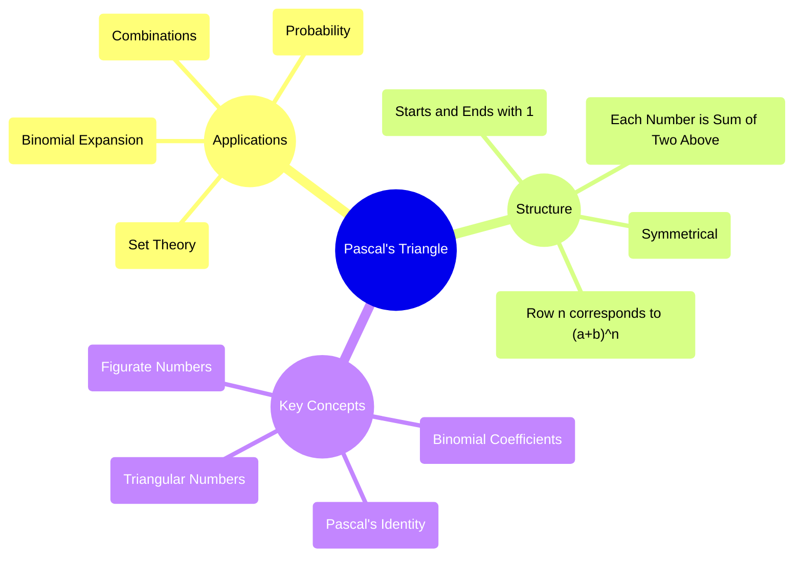

# Definition
Before proceeding, ensure you master [[Binomial_Expansion]] and [[Combinations]].
Pascal's Triangle is a triangular array of binomial coefficients that provides a visual and intuitive way to find the coefficients for [[Binomial_Expansion]]. Each number in the triangle is the sum of the two numbers directly above it. The rows of Pascal's Triangle correspond to the coefficients of $(a+b)^n$, where `n` is the row number (starting from n=0 at the top). It is a powerful tool not just for algebra, but also for combinatorics and probability. A simpler way to think about it is like building a pyramid of numbers where each brick's value is determined by the two bricks directly above it.

# The Mental Model
Imagine a branching path, where at each junction, you can go left or right. The number of paths to any point in the "triangle" formed by these junctions is represented by Pascal's Triangle. For example, to reach the number '2' in the row '1 2 1', you had one path from the '1' above and one path from the other '1' above, summing to 2.

*Note: This `mindmap` visualizes the core structure, applications, and related concepts of Pascal's Triangle.*

# Context & Framework
### The Map: Where Does it Live? (The Map)
Pascal's Triangle lives at the intersection of algebra, combinatorics, and probability. Each row of the triangle (starting with row 0) provides the coefficients for the expansion of $(a+b)^n$. For example, Row 0 is `1` (for $(a+b)^0$), Row 1 is `1 1` (for $(a+b)^1$), Row 2 is `1 2 1` (for $(a+b)^2$), and so on. These numbers are precisely the binomial coefficients $\binom{n}{r}$, where `n` is the row number and `r` is the position within the row (starting from 0).

# The Mastery Deep Dive
### The Map: Where Does it Live? (The Map)
The structure of Pascal's Triangle is inherently recursive and hierarchical. It starts with a single '1' at the apex (Row 0). Each subsequent row is constructed by placing '1's at the ends and summing adjacent numbers from the row above to get the numbers in between. This simple rule generates a rich pattern of numbers. The symmetry of the triangle (e.g., Row 4: 1 4 6 4 1) reflects the property that $\binom{n}{r} = \binom{n}{n-r}$. The numbers also embed other sequences, such as triangular numbers along diagonals.

### The "Oops!" List: Where Everyone Fails
A common error is miscounting the rows, particularly whether to start counting from Row 0 or Row 1. The convention is usually to start at Row 0 for $(a+b)^0$. Another mistake is incorrectly summing the numbers from the row above, especially at the edges. Forgetting the '1's at the beginning and end of each row is also a frequent oversight. These small errors will propagate, leading to incorrect binomial coefficients and thus incorrect expansions.

# Constraints & Limitations
### The "Oops!" List: Where Everyone Fails
Pascal's Triangle is most practical for finding binomial coefficients for relatively small integer exponents (`n`). As `n` grows, constructing the entire triangle becomes tedious and computationally intensive. For very large `n`, directly calculating binomial coefficients using the combination formula $\binom{n}{r} = \frac{n!}{r!(n-r)!}$ is more efficient. Furthermore, while the triangle shows binomial coefficients, it doesn't directly provide the expanded algebraic terms; one still needs to combine the coefficients with the correct powers of `a` and `b` according to the [[Binomial_Expansion]] formula.

# Significance & Application
Pascal's Triangle has profound significance:
*   **Combinatorics**: Each number represents the number of combinations $\binom{n}{r}$, essential for counting problems.
*   **Probability**: Used in the binomial probability distribution for calculating probabilities of success in repeated trials.
*   **Algebra**: Provides coefficients for binomial expansions, simplifying polynomial multiplication.
*   **Computer Science**: Explores in algorithms for generating combinations and in patterns within certain data structures.
*   **Mathematics**: Reveals properties of numbers, such as triangular numbers, powers of 2 (sum of rows), and Fibonacci numbers (along certain diagonals).

# The Worked Example
**Scenario:** Construct the first 6 rows of Pascal's Triangle (Row 0 to Row 5).

**Solution:**
*   **Row 0:** 1
*   **Row 1:** 1 1
*   **Row 2:** 1 2 1 (1+1=2)
*   **Row 3:** 1 3 3 1 (1+2=3, 2+1=3)
*   **Row 4:** 1 4 6 4 1 (1+3=4, 3+3=6, 3+1=4)
*   **Row 5:** 1 5 10 10 5 1 (1+4=5, 4+6=10, 6+4=10, 4+1=5)

This structure is a visual representation of the binomial coefficients needed for expansions like $(a+b)^5$.

# The Proving Ground
*Test your mastery. Cover the solutions below to test yourself first.*

### Level 1: The Sanity Check (Verification)
**The Question:** What are the binomial coefficients for $(x+y)^4$ as given by Pascal's Triangle?
> **Solution:** Row 4: 1 4 6 4 1.

### Level 2: The Crucible (Mastery & Edge Cases)
**The Scenario:** A high school student is trying to expand $(a+b)^6$ using Pascal's Triangle. They have correctly generated Row 5 (1 5 10 10 5 1).
1.  Generate Row 6 of Pascal's Triangle.
2.  Now, consider a situation where a student mistakenly interprets the row number as the number of terms in the expansion. Explain why this is incorrect and what the actual relationship between the row number and the number of terms is.
3.  A computer scientist is developing an algorithm to generate Pascal's Triangle. If their algorithm has a bug where it doesn't correctly handle the '1's at the edges of each row, explain how this single error would propagate and cause incorrect results throughout the entire triangle.
> **Solution:**
> 1.  **Row 6:** 1 (1+5)=6 (5+10)=15 (10+10)=20 (10+5)=15 (5+1)=6 1. So, Row 6 is: 1 6 15 20 15 6 1.
> 2.  The row number `n` for $(a+b)^n$ is *not* the number of terms. The actual relationship is that for an expansion $(a+b)^n$, there will be **`n+1` terms**. For example, for $(a+b)^2$, Row 2 (1 2 1) has 3 terms ($a^2 + 2ab + b^2$). Misinterpreting this would lead to either missing terms or generating too many.
> 3.  If an algorithm fails to correctly place the '1's at the edges, it breaks the fundamental recursive rule of Pascal's Triangle (each number is the sum of the two above it, with implied '0's outside the triangle). This error would immediately cause the numbers in the next row to be incorrect. For instance, if a '1' is missing at the beginning of a row, the first non-one number in the next row would be wrong, and this error would compound, leading to a completely corrupted triangle structure and incorrect binomial coefficients.

# Key Takeaways
*   `Pascal's Triangle` visually represents binomial coefficients for `Binomial Expansion`.
*   Each number is the sum of the two numbers directly above it.
*   Rows correspond to the exponent `n` in `(a+b)^n` (starting from Row 0).

# Knowledge Graph Connections
| Concept                     | Connection / Relationship                                                                   |
| :
-------------------------- | :
------------------------------------------------------------------------------------------ |
| [[Binomial_Expansion]]      | Pascal's Triangle directly provides the coefficients for binomial expansions.               |
| [[Combinations]]            | Each entry in Pascal's Triangle is a binomial coefficient, equivalent to `C(n,r)`.         |
| [[Pascal_s_Identity]]       | The rule for constructing Pascal's Triangle is a visual representation of Pascal's Identity. |
| Set_Theory              | The numbers in Pascal's Triangle also relate to the number of subsets of a set.           |
---