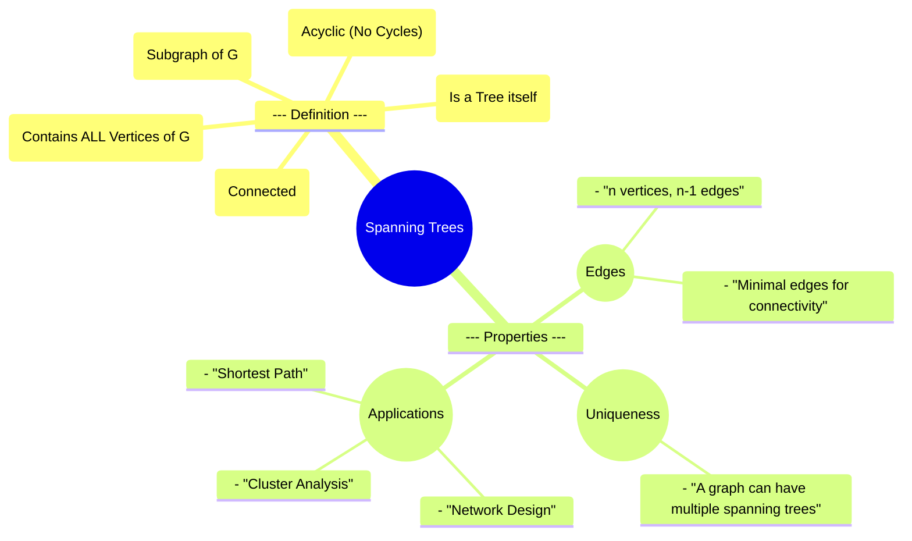

# Definition
Before proceeding, ensure you master [[Trees_and_Forests]] and [[Connected_Graphs]] because a spanning tree is a specific type of subgraph that retains all vertices of a connected graph while ensuring it is acyclic and connected, effectively forming a tree.
A **spanning tree** of a connected graph `G` is an acyclic connected [[Subgraph_Concepts]] of `G` which contains *all the vertices* of `G`. Essentially, it's a "skeleton" of the original graph that keeps it connected but removes any redundant edges that would form cycles. Every connected graph has at least one spanning tree. Think of it as finding the minimum set of roads needed to connect all cities in a region, without any circular routes.

# The Mental Model
Imagine a sprawling electrical grid connecting many homes (vertices) with numerous power lines (edges). Some lines might create redundant loops. A **spanning tree** is like stripping away all those redundant power lines, leaving just enough to ensure every home is still powered (connected), but without any circular paths that could cause inefficiencies or overloads. It's the simplest, cycle-free way to keep everything linked.

# Context & Framework
### Where Does it Live? (The Map)
Spanning trees are foundational in network design and optimization. They represent the most economical way to connect all nodes in a network without creating redundant paths (cycles). This is vital in situations where resources (e.g., cable, pipeline) are costly, and efficiency is paramount. For instance, designing a new communication network or a distribution system often begins by identifying a spanning tree to ensure basic connectivity with minimal infrastructure.

# The Mastery Deep Dive
### Mindmap

```text
// Scenario 1: Visualizing Spanning Tree Properties
// Output:
// A mindmap centered on "Spanning Trees".
// Main branches include "Definition", "Properties", and "Applications".
// The "Definition" branch details being a subgraph, containing all vertices, being connected, acyclic, and a tree.
// The "Properties" branch highlights "n vertices, n-1 edges" and "multiple spanning trees".
// The "Applications" branch lists "Network Design", "Cluster Analysis", and "Shortest Path".
// This mindmap provides a comprehensive overview of spanning trees.
```
*Note: This `mindmap` visually summarizes the definition, key properties, and practical applications of spanning trees, emphasizing their role as minimal connected subgraphs.*

# Constraints & Limitations
### The "Oops!" List: Where Everyone Fails
A common mistake is thinking that a connected graph has only *one* spanning tree. This is incorrect; most connected graphs have multiple spanning trees. Another trap is failing to ensure the spanning tree is actually "spanning" (i.e., includes *all* original vertices). Sometimes, a student might identify a tree subgraph that is connected and acyclic but leaves out some vertices of the original graph, which would not be a spanning tree. The "minimum edges for connectivity" property is key, as adding any edge would create a cycle.

# Significance & Application
Spanning trees are fundamental in graph theory and have immense practical significance:
*   **Minimum Spanning Tree (MST):** A critical concept where edges have weights (costs), and the goal is to find a spanning tree with the minimum possible total edge weight. Algorithms like Prim's and Kruskal's solve the MST problem, vital for:
    *   Designing cost-effective communication networks.
    *   Laying out power grids or pipelines.
    *   Cluster analysis in data science.
*   **Network Protocols:** Ethernet networks use a spanning tree protocol (STP) to prevent network loops and broadcast storms.
*   **Graph Algorithms:** Used as a subroutine in many other graph algorithms.
*   **Academic Relevance:** A central topic in algorithmic graph theory, demonstrating how a simple, elegant structure can solve complex optimization problems.

# The Worked Example
Consider the graph `G` below:
(Diagram from page 52 of the source - G: V, W, X, Y, Z, connected in a triangle V-W-Y with Z-Y and X-Y, forming two triangles and a common vertex Y)
Vertices: `V, W, X, Y, Z`
Edges: `(V,W), (W,Y), (Y,V), (Y,Z), (Y,X)` (This forms a K3 (VWY) with two pendant edges Y-Z and Y-X)

**Step-by-Step Drawing of Spanning Trees:**

1.  **Original Graph Analysis:**
    *   `G` is connected.
    *   `G` has cycles (e.g., `V - W - Y - V`).
    *   `n = 5` vertices. A spanning tree must have `n-1 = 4` edges.

2.  **Identify and remove edges to break cycles, keeping all vertices connected:**

    *   **Spanning Tree 1:** Remove one edge from the cycle `V-W-Y-V`. Let's remove `(V,W)`.
        *   Remaining edges: `(W,Y), (Y,V), (Y,Z), (Y,X)`
        *   This forms a tree: `Z-Y-W`, `Y-V`, `Y-X`. (A star graph centered at Y).
        *   Vertices: `V, W, X, Y, Z`. Edges: `4`. Connected. Acyclic. Valid.

    *   **Spanning Tree 2:** Remove `(W,Y)` instead.
        *   Remaining edges: `(V,W), (Y,V), (Y,Z), (Y,X)`
        *   This forms a tree: `Z-Y-V-W`, `Y-X`.
        *   Vertices: `V, W, X, Y, Z`. Edges: `4`. Connected. Acyclic. Valid.

    *   **Spanning Tree 3:** Remove `(Y,V)` instead.
        *   Remaining edges: `(V,W), (W,Y), (Y,Z), (Y,X)`
        *   This forms a tree: `Z-Y-W-V`, `Y-X`.
        *   Vertices: `V, W, X, Y, Z`. Edges: `4`. Connected. Acyclic. Valid.

This example shows that a single connected graph can have multiple distinct spanning trees.

# The Proving Ground
*Test your mastery. Cover the solutions below to test yourself first.*

### Level 1: The Sanity Check (Verification)
**The Question:** What is the relationship between the number of vertices and the number of edges in any spanning tree of a connected graph `G` with `n` vertices?
> **Solution:** A spanning tree of a graph `G` with `n` vertices will always have exactly `n-1` edges.

### Level 2: The Crucible (Mastery & Edge Cases)
**The Scenario:** You are managing a regional rail network with 6 cities (`C1` to `C6`) and 8 direct rail lines. The network is known to be connected.
**The Challenge:**
(a) You need to identify a subset of rail lines that connect all cities but contain no circular routes. How many rail lines will this subset contain?
(b) If the network is represented as `G`, what is the formal name for this subset of rail lines?
(c) If you find multiple such subsets, how would you decide which one is "best" for an emergency communication system (assuming all lines have equal capacity and reliability)?
> **Solution:**
> (a) For 6 cities (`n=6`), a spanning tree requires `n-1 = 5` rail lines. So, the subset will contain **5** rail lines.
>
> (b) This subset of rail lines forms a **spanning tree** of the graph `G`.
>
> (c) If all lines have equal capacity and reliability, and you need to ensure basic connectivity without circular routes, any spanning tree would suffice. The concept of "best" usually implies an optimization criteria (like minimum cost, maximum bandwidth, shortest path). With equal capacity and reliability, the choice between multiple spanning trees might be arbitrary or based on other non-graph-theoretic factors (e.g., existing infrastructure, ease of maintenance for a particular layout). In the context of a simple spanning tree, there isn't a "best" unless edge weights are introduced (leading to a Minimum Spanning Tree).

# Key Takeaways
*   A spanning tree is an acyclic, connected subgraph that includes all vertices of the original connected graph.
*   For a graph with `n` vertices, a spanning tree always has `n-1` edges.
*   Connected graphs typically have multiple spanning trees.
*   Spanning trees are fundamental for efficient network design and various algorithms.

# Knowledge Graph Connections
| Concept                     | Connection / Relationship                                         |
| :
-------------------------- | :
---------------------------------------------------------------- |
| [[Trees_and_Forests]]       | A spanning tree is a specific type of tree that "spans" a larger graph. |
| [[Connected_Graphs]]        | Spanning trees are derived from connected graphs.               |
| [[Subgraph_Concepts]]       | A spanning tree is a specialized form of subgraph.              |
| [[Cycles_and_Circuits_in_Graphs]] | The defining property of a spanning tree is its acyclic nature (no cycles). |
| [[Paths_and_Connectivity_in_Graphs]] | Spanning trees ensure connectivity while minimizing the number of edges. |
---