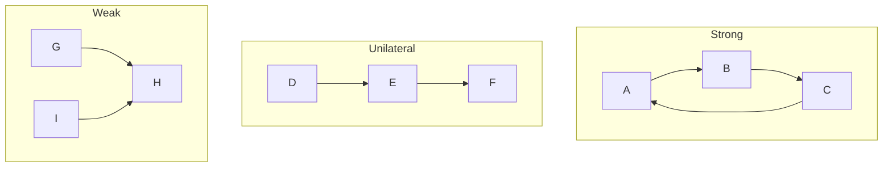

# Definition
Before proceeding, ensure you master [[Directed_Graph_Fundamentals]] to understand valid paths (following arrows).
Connectivity in digraphs is nuanced because paths are one-way. We distinguish between three levels of connectedness:
1.  **Strongly Connected:** You can get from $u \to v$ AND $v \to u$ for *every* pair of vertices. (The "Round Trip" standard).
2.  **Unilaterally Connected (Semi-Connected):** For every pair $u, v$, there is a path $u \to v$ OR $v \to u$. (The "One-Way" standard).
3.  **Weakly Connected:** The graph is connected if you ignore the direction of the arrows (treat it as undirected). (The "Structure" standard).

# The Mental Model
*   **Strong:** A city where you can drive from any house to any other house and back.
*   **Unilateral:** A river flowing downhill. You can go from Up to Down, but never back. Every point is connected to the flow, but only one way.
*   **Weak:** A group of islands connected by bridges, but some bridges are one-way pointing *away* from each other, making travel impossible between certain islands, even though they are physically linked.


```text
// Scenario: Visualizing Connectivity Types
// Output:
// Strong: Cycle A->B->C->A. (Round trip possible).
// Unilateral: Line D->E->F. (D can reach F, F cannot reach D. But they are connected one-way).
// Weak: G->H<-I. (G can reach H, I can reach H. But G cannot reach I, and I cannot reach G. Connected only if arrows ignored).
```
*Note: Strong implies Unilateral. Unilateral implies Weak.*

# Context & Framework
### The Hierarchy of Connection
Connectivity is hierarchical.
*   If **Strong**, it is automatically **Unilateral** and **Weak**.
*   If **Unilateral**, it is automatically **Weak**.
*   **Weak** is the bare minimum requirement to be considered a single "piece" rather than disjoint components.

# The Mastery Deep Dive
### The "Kill Sheet" (Distinguishing the Types)
| Feature | Strongly Connected | Unilaterally Connected | Weakly Connected |
| :
--- | :
--- | :
--- | :
--- |
| **Path $u \to v$** | Exists for ALL pairs. | Exists for at least one direction per pair. | Might not exist. |
| **Path $v \to u$** | Exists for ALL pairs. | Might not exist. | Might not exist. |
| **Undirected View** | Connected. | Connected. | Connected. |
| **Analogy** | Two-way Street Network. | River / Assembly Line. | Mixed One-way streets facing apart. |
| **Key Test** | Can I return to start? (Cycles). | Can I reach everyone from somewhere? | Is the graph in one piece? |

### Connected Components
*   **Strongly Connected Component (SCC):** The largest subgraph where every node is strongly connected to every other. Even in a weak graph, you might have small islands of strong connectivity (like a roundabout in a one-way city).

# Constraints & Limitations
### The "Disconnected" Trap
If the underlying graph (undirected) is disconnected (two separate islands), the digraph is **Disconnected**. It is not even Weakly connected.

# Significance & Application
*   **Routing Protocols:** Internet routers need Strong connectivity to ensure acknowledgement packets can return.
*   **Compiler Optimization:** identifying SCCs helps in analyzing loops in code.

# The Worked Example
**Graph:** $1 \to 2$, $2 \to 3$.
**Analysis:**
1.  **Test Strong:** Can 3 reach 1? No. $\implies$ Not Strong.
2.  **Test Unilateral:**
    *   Pair (1, 2): $1 \to 2$ exists. OK.
    *   Pair (2, 3): $2 \to 3$ exists. OK.
    *   Pair (1, 3): $1 \to 2 \to 3$ exists. OK.
    *   $\implies$ Unilaterally Connected.
3.  **Test Weak:** Ignore arrows. $1-2-3$. It is connected. $\implies$ Weakly Connected.
**Conclusion:** The graph is Unilaterally Connected (and Weakly).

# The Proving Ground
*Test your mastery. Cover the solutions below to test yourself first.*

### Level 1: The Sanity Check (Verification)
**The Question:** Is a cycle $A \to B \to C \to A$ Strongly Connected?
> **Solution:** Yes. From any node, you can traverse the cycle to reach any other node.

### Level 2: The Crucible (Mastery & Edge Cases)
**The Scenario:** Graph $G: A \to B$, $C \to B$. (V shape pointing to B). Classify the connectivity.
> **Solution:**
> *   Strong? No. A cannot reach C. C cannot reach A. B cannot reach anyone.
> *   Unilateral? Check pair (A, C). Path $A \to C$? No (blocked at B). Path $C \to A$? No (blocked at B). Since neither direction works for pair (A, C), it is **NOT** Unilateral.
> *   Weak? Ignore arrows: $A-B-C$. It is connected.
> *   **Result:** Weakly Connected.

# Key Takeaways
*   **Strong:** Round trip ($u \leftrightarrow v$).
*   **Unilateral:** One way ($u \to v$ OR $v \to u$).
*   **Weak:** Skeleton only (Undirected connected).
*   **Hierarchy:** Strong $\subset$ Unilateral $\subset$ Weak.

# Knowledge Graph Connections
| Concept | Connection / Relationship |
| :
--- | :
--- |
| [[Directed_Graph_Fundamentals]] | Connectivity describes the global structure formed by fundamental edges. |
| [[Matrix_Representations_of_Digraphs]] | Connectivity can be calculated using the Reachability Matrix ($R$). |
| [[Rooted_Tree_Structures]] | Trees are a specific class of Unilaterally Connected graphs (usually). |

---