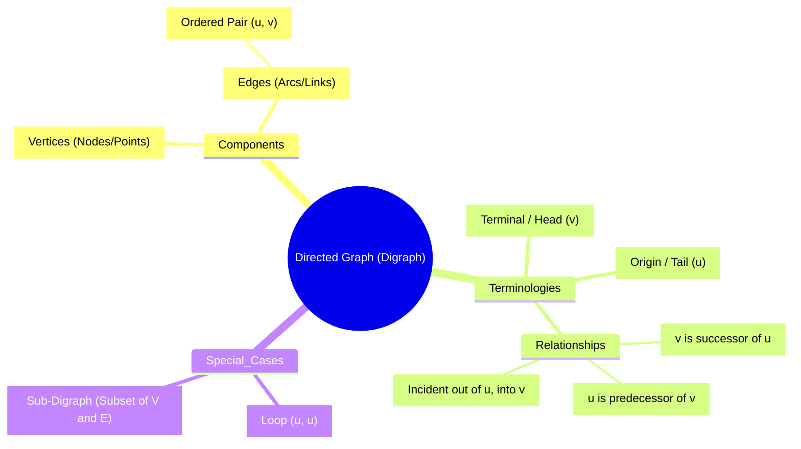

# Definition
Before proceeding, ensure you master the basic concept of **Sets and Relations** because Directed Graphs are formally defined as sets of vertices and ordered pairs (relations) of edges.
A Directed Graph (or Digraph) is a discrete structure consisting of a set of vertices (nodes) and a set of directed edges (arcs), where each edge connects an ordered pair of vertices. Unlike a standard graph where a connection is mutual (like a handshake), a directed graph represents a one-way relationship (like a tweet: you can mention someone, but they don't have to mention you back). Formally, $D = (V, E)$, where $E$ is a set of ordered pairs $(u, v)$.

# The Mental Model
Think of a city's road network where every single street is a **One-Way Street**. The intersections are the **Vertices**. The one-way streets are the **Directed Edges**. If you can drive from Intersection A to Intersection B, it doesn't automatically mean you can drive from B to A; you might need to take a different loop. A "loop" in this context would be a roundabout that just circles back to the same intersection.


```text
// Scenario: Visualizing the structure of a Digraph Concept
// Output:
// A central node "Directed Graph (Digraph)" branches into:
// 1. Components: containing Vertices and Edges (defined as Ordered Pairs).
// 2. Terminologies: defining Initial Node (Tail), Terminal Node (Head), and Relationships (Successor/Predecessor).
// 3. Special Cases: defining Loop (self-connection) and Sub-Digraph.
```
*Note: This mindmap organizes the core nomenclature of Directed Graphs, separating physical components from relational terms.*

# Context & Framework
### Where Does it Live? (The Map)
Directed Graphs reside at the intersection of Set Theory and Topology. They are the fundamental structure for any system involving **flow, state changes, or dependency**.
*   **Underlying Graph:** If you strip away the arrows (direction), you get the "Underlying Graph" (or undirected graph).
*   **Sub-Digraph:** Just like a subset, a sub-digraph consists of a selection of vertices from the original graph and a selection of edges that connect *only* those chosen vertices.
*   **Connected Components:** In disconnected graphs, these are the isolated "islands" of subgraphs.

# The Mastery Deep Dive
### The Anatomy of an Arrow
In a directed edge $e = (u, v)$:
*   **$u$ (The Tail):** The origin. The "From" point. $u$ is adjacent *to* $v$.
*   **$v$ (The Head):** The destination. The "To" point. $v$ is adjacent *from* $u$.
*   **Successor/Predecessor:** If the arrow points $u \to v$, $v$ is the successor (what comes next), and $u$ is the predecessor (what came before).

### Neighbors and Incidence
We don't just say an edge is "connected" to a vertex; we must be specific about *how*.
*   An edge is **incident out of** the tail ($u$).
*   An edge is **incident into** the head ($v$).
*   **Loop:** An edge $(u, u)$ that starts and ends at the same vertex.

# Constraints & Limitations
### The "False Friend" (Undirected vs. Directed)
Don't be fooled by the visual similarity to undirected graphs.
*   **The Trap:** In an undirected graph, $\{u, v\}$ is the same set as $\{v, u\}$. In a digraph, the ordered pair $(u, v)$ is **completely different** from $(v, u)$. $(u, v)$ means a road from $u$ to $v$. $(v, u)$ means a road from $v$ to $u$. Existence of one does not imply the other.
*   **Gotcha:** A "path" in a digraph *must* follow the arrows. You cannot walk against traffic.

# Significance & Application
Digraphs are crucial in computer science for:
*   **Garbage Collection:** Determining which memory objects are reachable.
*   **Deadlock Detection:** Analyzing resource allocation graphs in Operating Systems.
*   **Task Scheduling:** Ensuring prerequisites are met before a task begins.

# The Worked Example
**Task:** Identify the components of the following edge relation.
**Given:** Edge $e_1 = (A, B)$.
**Analysis:**
1.  **Origin (Tail):** $A$.
2.  **Terminal (Head):** $B$.
3.  **Relationship:** $B$ is the successor of $A$. $A$ is the predecessor of $B$.
4.  **Adjacency:** $A$ is adjacent *to* $B$. $B$ is adjacent *from* $A$.
5.  **Incidence:** Edge $e_1$ is incident *out of* $A$ and *into* $B$.

# The Proving Ground
*Test your mastery. Cover the solutions below to test yourself first.*

### Level 1: The Sanity Check (Verification)
**The Question:** In a directed edge $e = (X, Y)$, which vertex is the "Head" and which is the "Tail"?
> **Solution:** $X$ is the Tail (Origin), and $Y$ is the Head (Terminal).

### Level 2: The Crucible (Mastery & Edge Cases)
**The Scenario:** You have a digraph with vertices $\{1, 2, 3\}$. The edges are $E = \{(1, 2), (2, 3), (3, 1), (2, 2)\}$.
Identify: (a) All loops. (b) The successor(s) of Vertex 2. (c) Is this a sub-digraph of a graph containing edge $(1, 3)$?
> **Solution:**
> (a) Loop: $(2, 2)$ (starts and ends at 2).
> (b) Successors of 2: Vertices that 2 points to. From $(2, 3)$ and $(2, 2)$, successors are $\{3, 2\}$.
> (c) Yes, provided the vertices $\{1, 2, 3\}$ are in the larger graph. A sub-digraph can contain a subset of edges. The fact that the larger graph has $(1, 3)$ (which is missing here) doesn't prevent this from being a valid sub-digraph.

# Key Takeaways
*   A Digraph is defined by **Ordered Pairs**; direction is fundamental and non-negotiable.
*   Terminology is precise: **Tail $\to$ Head**, **Origin $\to$ Terminal**, **Adjacent To $\to$ Adjacent From**.
*   A **Loop** is a valid edge connecting a vertex to itself.

# Knowledge Graph Connections
| Concept | Connection / Relationship |
| :
--- | :
--- |
| [[Vertex_Degrees_in_Digraphs]] | Degree counting relies on separating "incident into" vs "incident out of". |
| [[Matrix_Representations_of_Digraphs]] | Matrices encode the $u \to v$ relationships numerically. |
| [[Connectivity_in_Directed_Graphs]] | Connectivity types depend entirely on the direction of paths. |

---