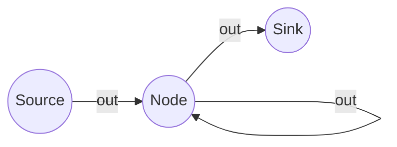

# Definition
Before proceeding, ensure you master [[Directed_Graph_Fundamentals]] to understand the distinction between "incident to" and "incident from".
Vertex Degree in a digraph is the count of edges associated with a vertex, split into two distinct metrics: **In-Degree** (number of edges arriving) and **Out-Degree** (number of edges leaving). This is unlike undirected graphs where there is just one "degree".
*   **In-Degree ($\text{deg}^-(v)$):** The number of edges ending at vertex $v$.
*   **Out-Degree ($\text{deg}^+(v)$):** The number of edges starting at vertex $v$.

# The Mental Model
Imagine a house (Vertex).
*   **Out-Degree:** The number of roads leading *away* from your house.
*   **In-Degree:** The number of roads leading *to* your house.
*   **Source:** A power plant. It produces output (Out-degree > 0) but receives nothing (In-degree = 0).
*   **Sink:** A drain. It receives everything (In-degree > 0) but produces nothing (Out-degree = 0).


```text
// Scenario 1: Analyzing Degrees
// Output:
// Node S (Source): In-degree=0, Out-degree=1.
// Node N (Node): In-degree=2 (from S and self-loop), Out-degree=2 (to K and self-loop).
// Node K (Sink): In-degree=1, Out-degree=0.
```
*Note: Node 'N' has a loop. A loop adds 1 to In-Degree AND 1 to Out-Degree.*

# Context & Framework
### The Handshaking Lemma (Directed Version)
In any digraph, the total "sending" must equal the total "receiving". Every arrow that starts somewhere must end somewhere.
**Theorem:**
$$ \sum_{v \in V} \text{deg}^-(v) = \sum_{v \in V} \text{deg}^+(v) = |E| $$
The sum of all in-degrees equals the sum of all out-degrees, which equals the total number of edges $|E|$.

### The Variable Dictionary
| Symbol | Name | Unit | Analogy |
| :
--- | :
--- | :
--- | :
--- |
| $\text{deg}^-(v)$ | In-Degree | Count (Integer) | Incoming emails. |
| $\text{deg}^+(v)$ | Out-Degree | Count (Integer) | Sent emails. |
| $|E|$ | Cardinality of Edges | Count (Integer) | Total emails sent in the system. |
| $\sum$ | Summation | Operator | The total count. |

# The Mastery Deep Dive
### The "Accounting" of Edges
When you draw a single directed edge $u \to v$:
1.  You add **1** to the Out-Degree of $u$.
2.  You add **1** to the In-Degree of $v$.
3.  You add **1** to the total edge count $|E|$.
Therefore, the global tally of "Outs" and "Ins" always rises in perfect lockstep. They are two sides of the same coin.

### Sources and Sinks
*   **Source:** $\text{deg}^-(v) = 0$. Pure origin. (e.g., The "Start" node in a flowchart).
*   **Sink:** $\text{deg}^+(v) = 0$. Pure destination. (e.g., The "End" or "Trash" node).
*   **Isolated Vertex:** $\text{deg}^-(v) = 0$ AND $\text{deg}^+(v) = 0$. It is not connected to anything.

# Constraints & Limitations
### The "Loop" Trap
A common mistake is miscounting loops.
*   **The Trap:** Thinking a loop only counts once.
*   **The Reality:** A loop $(v, v)$ is an edge leaving $v$ AND entering $v$. It contributes **1 to the Out-Degree** and **1 to the In-Degree** of the *same* vertex.

# Significance & Application
*   **Web Search:** "Authorities" (high in-degree) vs. "Hubs" (high out-degree).
*   **Supply Chain:** Sources are raw material factories; Sinks are consumers.

# The Worked Example
**Problem:** Calculate degrees for a graph with edges $E = \{(A, B), (A, C), (B, B), (C, A)\}$.
**Step-by-Step Derivation:**
$$ \begin{aligned} & \textbf{Vertex A:} \\ & \quad \text{Starts: } (A, B), (A, C) \implies \text{deg}^+(A) = 2 \\ & \quad \text{Ends: } (C, A) \implies \text{deg}^-(A) = 1 \\ \\ & \textbf{Vertex B:} \\ & \quad \text{Starts: } (B, B) \implies \text{deg}^+(B) = 1 \\ & \quad \text{Ends: } (A, B), (B, B) \implies \text{deg}^-(B) = 2 \quad \text{(Note loop counts for both)} \\ \\ & \textbf{Vertex C:} \\ & \quad \text{Starts: } (C, A) \implies \text{deg}^+(C) = 1 \\ & \quad \text{Ends: } (A, C) \implies \text{deg}^-(C) = 1 \end{aligned} $$

**Verification:**
Sum of Out-Degrees: $2 + 1 + 1 = 4$.
Sum of In-Degrees: $1 + 2 + 1 = 4$.
Total Edges: 4. The math holds.

# The Proving Ground
*Test your mastery. Cover the solutions below to test yourself first.*

### Level 1: The Sanity Check (Verification)
**The Question:** If a vertex has 3 arrows pointing in and 2 arrows pointing out, what is its In-Degree and Out-Degree? Is it a Source or Sink?
> **Solution:** In-Degree = 3, Out-Degree = 2. It is neither a Source (In > 0) nor a Sink (Out > 0).

### Level 2: The Crucible (Mastery & Edge Cases)
**The Scenario:** A graph has 4 vertices. The Out-Degrees are 2, 2, 3, and $x$. The In-Degrees are 1, 3, 2, and 2. Find $x$.
> **Solution:**
> Apply the Theorem: $\sum \text{deg}^+ = \sum \text{deg}^-$.
> Sum of In-Degrees = $1 + 3 + 2 + 2 = 8$.
> Sum of Out-Degrees = $2 + 2 + 3 + x = 7 + x$.
> $7 + x = 8 \implies x = 1$.

# Key Takeaways
*   **Split Degrees:** Always specify "In" or "Out".
*   **Theorem of Sums:** Total In = Total Out = Total Edges.
*   **Loop Rule:** A loop counts for both In and Out on the same node.

# Knowledge Graph Connections
| Concept | Connection / Relationship |
| :
--- | :
--- |
| [[Directed_Graph_Fundamentals]] | Degrees are properties of the vertices defined in fundamentals. |
| [[Matrix_Representations_of_Digraphs]] | Row/Column sums in matrices directly correspond to Out/In degrees. |
| [[Connectivity_in_Directed_Graphs]] | High degrees often correlate with stronger connectivity. |

---