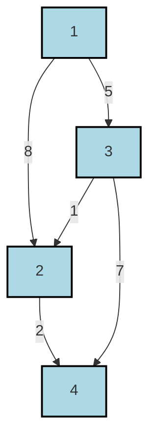

# Definition
Before proceeding, ensure you master [[Shortest_Path_Problem]] and [[Weighted_Graphs]] because Dijkstra's algorithm is a fundamental method for solving shortest path problems in graphs with non-negative edge weights.
**Dijkstra's Algorithm** is a greedy algorithm that solves the **single-source shortest path problem** for a graph with non-negative edge weights. It finds the shortest paths from a given source vertex to all other vertices in the graph. Imagine navigating a city where all roads have positive travel times; Dijkstra's algorithm efficiently calculates the quickest way to get from your starting point to every other intersection.

# The Mental Model
Think of Dijkstra's algorithm as an expanding ripple. You drop a stone (your starting point) into a pond (the graph). The ripples spread outwards. Each ripple represents the shortest distance found so far to a particular point. The algorithm always focuses on expanding the ripple from the "closest" unvisited point, locking in its shortest distance, until all points reachable from the source have been encompassed by the ripple.

# Context & Framework
### The Pilot's Checklist
Dijkstra's algorithm operates by maintaining a set of "permanently labeled" vertices (those for which the shortest path from the source has been finalized) and a set of "temporarily labeled" vertices (for which a current shortest path estimate exists but is not yet guaranteed to be minimal). It always selects the temporarily labeled vertex with the smallest current distance estimate to become permanently labeled, then updates the estimates of its neighbors. This iterative refinement process ensures that the algorithm always finds the shortest paths, provided all edge weights are non-negative.

# The Mastery Deep Dive
### The Pilot's Checklist (Do Not Skip)
Given a connected graph $G = (V, E)$ with vertices $1, \dots, n$ and edges $(i, j)$ having lengths $l_{ij} > 0$, Dijkstra's algorithm determines the lengths of shortest paths from vertex 1 to all other vertices $2, \dots, n$ as follows:

1.  **Initialization Step**:
    *   Set the **permanent label (PL)** for the source vertex (let's say vertex 1) as $L_1 = 0$.
    *   Initialize a set $PL\_Set = \{1\}$ (vertices with permanent labels).
    *   For all other vertices $j$ (where $j=2, \dots, n$), assign a **temporary label (TL)** $L_j = l_{1j}$ (the direct edge weight from vertex 1 to $j$). If there's no direct edge, set $L_j = \infty$.
    *   Initialize a set $TL\_Set = \{2, 3, \dots, n\}$ (vertices with temporary labels).
2.  **Fixing a Permanent Label**:
    *   Find a vertex $k$ in $TL\_Set$ for which its temporary label $L_k$ is the minimum among all temporary labels.
    *   Set $L_k = L_k$ (effectively making it permanent).
    *   Move vertex $k$ from $TL\_Set$ to $PL\_Set$.
    *   If $TL\_Set$ becomes empty, then all shortest paths have been found. Output the lengths $L_2, \dots, L_n$. Stop.
    *   Otherwise, continue to Step 3.
3.  **Updating Temporary Labels (Relaxation)**:
    *   For every vertex $j$ that is still in $TL\_Set$:
        *   Calculate a potential new path length to $j$ through the newly permanently labeled vertex $k$: $L_k + l_{kj}$.
        *   If this new path length is shorter than the current temporary label $L_j$ (i.e., $L_k + l_{kj} < L_j$), then update $L_j = L_k + l_{kj}$. This is called **relaxation**.
    *   Go back to Step 2.

The algorithm ends when all vertices have been moved from $TL\_Set$ to $PL\_Set$, meaning their shortest paths from the source have been finalized.

### The Disaster Drill
A critical flaw in applying Dijkstra's algorithm occurs if it is used on a graph containing **negative edge weights**. Because Dijkstra's algorithm greedily assumes that once a vertex is permanently labeled, its shortest distance is finalized, it cannot correctly handle scenarios where a later path through a negative edge could discover a shorter route to an already "finalized" vertex. This would lead to incorrect shortest path calculations.

# Constraints & Limitations
### The Warning Lights: Signs of Trouble
The most significant limitation of Dijkstra's algorithm is its strict requirement for **non-negative edge weights**. If a graph contains any negative edge weights, Dijkstra's algorithm will not guarantee the correct shortest paths. For such graphs, the [[Bellman_Ford_Algorithm]] is typically used. Additionally, Dijkstra's is a single-source algorithm; if shortest paths between *all pairs* of vertices are needed, other algorithms like Floyd-Warshall might be more efficient. The efficiency of Dijkstra's algorithm depends heavily on the data structure used for the priority queue to find the minimum temporary label; a naive implementation can be slow, while a Fibonacci heap can achieve near-optimal theoretical performance.

# Significance & Application
Dijkstra's algorithm is widely deployed in numerous real-world applications where non-negative edge weights are prevalent:
*   **GPS Navigation**: Calculating the shortest routes on road networks where distances or travel times are positive.
*   **Network Routing Protocols**: Used by routers to find the most efficient paths for data packets (e.g., OSPF protocol).
*   **Finding Paths in Games**: AI pathfinding for characters in video games.
*   **Telecommunications**: Optimizing call routing or message delivery in networks.
*   **Computer Graphics**: Shortest path calculations in image processing or geometric modeling.
Its conceptual simplicity and efficiency for non-negative weighted graphs make it a fundamental tool in algorithmic problem-solving.

# The Worked Example
Using Dijkstra's algorithm to the graph below, find shortest paths from vertex 1 to vertices 2, 3, 4.


```text
// Scenario 1: Initial Graph with edge weights.
// Output:
// (A visual representation of cities 1, 2, 3, 4 as nodes, connected by edges labeled with their respective distances (weights).
// Initial permanent labels (PL): {1} with L1=0
// Initial temporary labels (TL): {2,3,4} with L2=8, L3=5, L4=infinity
```

**Step-by-step application:**

**Iteration 1: Initial setup and permanent label for 1**
*   $PL\_Set = \{1\}$, $L_1 = 0$
*   $TL\_Set = \{2,3,4\}$
*   $L_2 = l_{1,2} = 8$
*   $L_3 = l_{1,3} = 5$
*   $L_4 = \infty$ (no direct edge 1-4)

**Iteration 2: Permanent label for 3 (smallest in TL_Set)**
*   Smallest in $TL\_Set$ is $L_3 = 5$ (vertex 3).
*   Move 3 to $PL\_Set$: $PL\_Set = \{1,3\}$. $TL\_Set = \{2,4\}$.
*   Update labels for neighbors of 3 still in $TL\_Set$:
    *   For 2: $L_3 + l_{3,2} = 5 + 1 = 6$. Current $L_2 = 8$. Since $6 < 8$, update $L_2 = 6$.
    *   For 4: $L_3 + l_{3,4} = 5 + 7 = 12$. Current $L_4 = \infty$. Since $12 < \infty$, update $L_4 = 12$.
*   Current $TL\_Set$ labels: $L_2 = 6$, $L_4 = 12$.

**Iteration 3: Permanent label for 2 (smallest in TL_Set)**
*   Smallest in $TL\_Set$ is $L_2 = 6$ (vertex 2).
*   Move 2 to $PL\_Set$: $PL\_Set = \{1,3,2\}$. $TL\_Set = \{4\}$.
*   Update labels for neighbors of 2 still in $TL\_Set$:
    *   For 4: $L_2 + l_{2,4} = 6 + 2 = 8$. Current $L_4 = 12$. Since $8 < 12$, update $L_4 = 8$.
*   Current $TL\_Set$ labels: $L_4 = 8$.

**Iteration 4: Permanent label for 4 (smallest in TL_Set)**
*   Smallest in $TL\_Set$ is $L_4 = 8$ (vertex 4).
*   Move 4 to $PL\_Set$: $PL\_Set = \{1,3,2,4\}$. $TL\_Set = \emptyset$.
*   $TL\_Set$ is empty. Stop.

**Resulting Shortest Paths and Lengths:**
*   Shortest path from 1 to 2: length $L_2 = 6$ (Path: 1 $\to$ 3 $\to$ 2)
*   Shortest path from 1 to 3: length $L_3 = 5$ (Path: 1 $\to$ 3)
*   Shortest path from 1 to 4: length $L_4 = 8$ (Path: 1 $\to$ 3 $\to$ 2 $\to$ 4)

# The Proving Ground
*Test your mastery. Cover the solutions below to test yourself first.*

### Level 1: Understanding (The Basics)
**The Tool Check:** Dijkstra's algorithm solves the single-source shortest path problem but has a critical constraint regarding the types of edge weights it can handle. What is this constraint?
> **Solution:** Dijkstra's algorithm requires all edge weights to be **non-negative (i.e., zero or positive)**.

### Level 2: Competence (Application)
**The Routine Run:** Describe the concept of "permanent labels" and "temporary labels" in Dijkstra's algorithm, explaining how they are updated and finalized as the algorithm progresses.
> **Solution:** **Permanent labels** are assigned to vertices for which the shortest path from the source has been definitively found and will not be improved. **Temporary labels** are current shortest path *estimates* that are subject to change as the algorithm explores more paths. Initially, only the source has a permanent label (0), and all others have temporary labels (direct edge weights from source or infinity). In each step, the temporary label with the smallest value becomes permanent, and this newly permanent vertex is used to update (relax) the temporary labels of its neighbors.

### Level 3: Mastery (The Disaster Drill)
**The Disaster Drill:** A navigation system using Dijkstra's algorithm for shortest routes encounters an unexpected, temporary road closure (effectively an edge with infinite weight) *after* it has already assigned a permanent label to a vertex that could have reached the destination via that now-closed road. How would the algorithm's subsequent steps be affected, and would it still find the correct shortest path, even if longer than initially anticipated?
> **Solution:** If an edge's weight becomes infinite *after* a vertex that relies on it for its shortest path has received a permanent label, Dijkstra's algorithm **will continue its execution based on the permanent labels already set**. It will *not* revisit permanently labeled vertices. Consequently, the algorithm **would still find a shortest path**, but it **would not be the correct (optimal) shortest path for the updated road network**. Any paths that previously relied on the now-closed road would be re-routed via other available (and potentially longer) paths, but the distances to vertices already permanently labeled via the closed road would remain incorrect. A **full re-run** of the algorithm from the start would be necessary to calculate the true shortest paths for the modified graph.

# Key Takeaways
*   Dijkstra's algorithm finds the single-source shortest paths in graphs with non-negative edge weights using a greedy approach.
*   It operates by iteratively finalizing shortest path distances to vertices through "permanent" and "temporary" labels.
*   Its primary limitation is its inability to handle negative edge weights, which necessitate alternative algorithms like Bellman-Ford.

# Knowledge Graph Connections
| Concept                     | Connection / Relationship                                                                   |
| :
-------------------------- | :
------------------------------------------------------------------------------------------ |
| [[Shortest_Path_Problem]]   | Dijkstra's algorithm is a solution to the shortest path problem.                            |
| [[Weighted_Graphs]]         | Dijkstra's algorithm is applied to weighted graphs (specifically with non-negative weights). |
| [[Bellman_Ford_Algorithm]]  | Bellman-Ford is an alternative shortest path algorithm that handles negative weights.       |
| Greedy_Algorithms       | Dijkstra's algorithm is an example of a greedy algorithm.                                   |
---