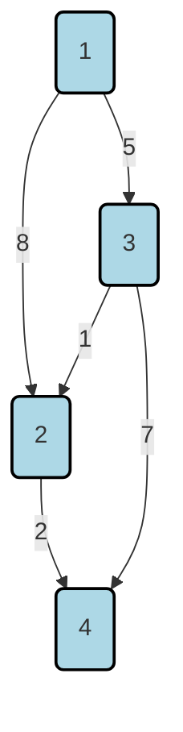

# Definition
Before proceeding, ensure you master [[Weighted_Graphs]] and Elements_Of_Graph_Theory because the shortest path problem relies on understanding weighted connections and graph traversal.
The **Shortest Path Problem** in graph theory is concerned with finding a path between two nodes (or vertices) in a graph such that the sum of the weights of its constituent edges is minimized. These weights typically represent "costs" such as distance, time, or expense. In simpler terms, if you have a map of cities and roads with travel times, the shortest path problem aims to find the quickest route from one city to another.

# The Mental Model
Imagine you're using a GPS navigation system. You input your starting location and your destination. The GPS doesn't just show you *any* route; it calculates the route that minimizes travel time or distance, considering traffic or road conditions. The cities are the "nodes," the roads are the "edges," and the travel times/distances are the "weights." The GPS is solving a shortest path problem to guide you efficiently.

# Context & Framework
### The Foundation: What We Already Know
The Shortest Path Problem is a cornerstone of graph theory and computational optimization, distinct from finding a [[Minimal_Spanning_Trees]]. While both involve weighted graphs, an MST connects *all* vertices with minimum total weight, whereas the shortest path problem focuses on optimizing a single path between two *specific* vertices. This fundamental difference means different algorithms are required. Two prominent algorithms used to solve this problem are [[1-Academic/Year_II/Semester_I/Discrete_Mathematics/5_Weighted_Graphs_And_Their_Applications/Dijkstras_Algorithm|Dijkstra_Algorithm]] and the [[Bellman_Ford_Algorithm]].

### The Translator: Converting English to Math
Given a weighted graph $G(V, E, w)$, where $V$ is the set of vertices, $E$ is the set of edges, and $w_{ij}$ is the weight of an edge $(v_i, v_j)$, the shortest path problem seeks to find a path from a source vertex $v_1$ to a destination vertex $v_k$ such that the sum of the weights of its edges is minimum.
The objective is to minimize:
$$ \boxed{\displaystyle w_{1,2} + w_{2,3} + w_{3,4} + \dots + w_{k-1,k}} $$
This sum represents the total weight (e.g., distance, cost, time) of the path.

### The "Duh!" Moment (Intuitive Proof)
**Bellman's Minimality Principle (or Optimality Principle):**
This principle states that if $P_j : 1 \to j$ is a shortest path from vertex 1 to vertex $j$ in a graph $G$, and $(i, j)$ is the last edge on this path, then the subpath $P_i : 1 \to i$ (obtained by removing the edge $(i, j)$ from $P_j$) must also be a shortest path from vertex 1 to vertex $i$.
Think of it this way: if your quickest route from home to the store goes through the park, then the part of your route from home to the entrance of the park must also be the quickest way to get to the park entrance. If there were a faster way to the park entrance, you would have taken it, making your overall route to the store faster too.

# Constraints & Limitations
### The "Oops!" List: Where Everyone Fails
A significant challenge for the shortest path problem arises when graphs contain **negative-weight cycles**. If a path is allowed to revisit vertices and passes through a cycle where the sum of edge weights is negative, it's possible to infinitely loop through that cycle, reducing the total path weight indefinitely. In such cases, the concept of a "shortest path" becomes ill-defined, as an infinitely short path could theoretically exist. Algorithms must either detect and report such cycles or be designed to handle only non-negative edge weights.

# Significance & Application
The shortest path problem is foundational for countless real-world applications:
*   **GPS and Navigation Systems**: Finding the fastest or shortest routes for vehicles and pedestrians.
*   **Network Routing**: Determining the most efficient path for data packets across computer networks, minimizing latency or hop count.
*   **Logistics and Supply Chain Management**: Optimizing delivery routes for goods, reducing fuel costs and delivery times.
*   **Robotics**: Path planning for robots to navigate environments efficiently.
*   **Resource Allocation**: Finding optimal sequences of operations in complex systems.
Its widespread applicability makes it one of the most studied problems in graph theory.

# The Worked Example
Consider a network of four cities (1, 2, 3, 4) with road distances (weights) as shown in the diagram. We want to find the shortest path from city 1 to city 4.


```text
// Scenario 1: Visualize the graph with edge weights.
// Output:
// (A visual representation of cities 1, 2, 3, 4 as nodes, connected by edges labeled with their respective distances (weights).
// Example paths and their sums:
// Path 1-2-4: 8 + 2 = 10
// Path 1-3-4: 5 + 7 = 12
// Path 1-3-2-4: 5 + 1 + 2 = 8
// The shortest path from 1 to 4 is 1-3-2-4 with a total weight of 8.
```
By inspecting the paths and their total weights, we can see that path 1 $\to$ 3 $\to$ 2 $\to$ 4 has a total weight of $5 + 1 + 2 = 8$, which is the minimum among all possible paths from 1 to 4. This simple example illustrates the core objective of the shortest path problem.

# The Proving Ground
*Test your mastery. Cover the solutions below to test yourself first.*

### Level 1: Understanding (The Basics)
**The Variable ID:** In the context of a package delivery network, if $w_{i,j}$ represents the delivery time between point $i$ and point $j$, what does the sum $w_{1,2} + w_{2,3} + \dots + w_{k-1,k}$ signify for the shortest path problem?
> **Solution:** The sum signifies the **total delivery time** for a specific path from the starting point 1 to the destination point $k$. The shortest path problem aims to minimize this total delivery time.

### Level 2: Competence (Application)
**The Standard Solver:** A delivery driver needs to find the quickest route from their depot (start node) to a specific customer's house (end node) through a city with varying traffic conditions. Given a weighted graph representing the city's streets and travel times as weights, formulate the objective function that the driver needs to minimize.
> **Solution:** Let $P = (v_0, v_1, \dots, v_k)$ be a path from the depot $v_0$ to the customer's house $v_k$, where $w(v_i, v_{i+1})$ is the travel time for each edge. The objective function the driver needs to minimize is $\sum_{i=0}^{k-1} w(v_i, v_{i+1})$.

### Level 3: Mastery (The Impossible Case)
**The Impossible Case:** Explain why a graph containing a negative-weight cycle poses a fundamental challenge to finding a "shortest path" in certain scenarios, particularly if the path is allowed to revisit vertices. What specific concept of a "shortest path" becomes ill-defined in such a graph?
> **Solution:** If a graph contains a negative-weight cycle and paths are allowed to revisit vertices, one could traverse the negative cycle an infinite number of times, continuously decreasing the total path weight. This would lead to an infinitely short path, meaning the concept of a finite "shortest path" is **ill-defined** or **non-existent** under these conditions. Algorithms designed for shortest paths must either specifically detect such cycles or restrict paths to be simple (no revisited vertices) to avoid this issue.

# Key Takeaways
*   The shortest path problem finds a path between two nodes in a weighted graph with the minimum total sum of edge weights.
*   It is distinct from MST problems, focusing on optimizing a single path between two specific vertices.
*   Negative-weight cycles pose a fundamental challenge, making the shortest path ill-defined if paths can revisit vertices.

# Knowledge Graph Connections
| Concept                     | Connection / Relationship                                                                   |
| :
-------------------------- | :
------------------------------------------------------------------------------------------ |
| [[Weighted_Graphs]]         | Shortest path problems are defined on weighted graphs.                                      |
| Elements_Of_Graph_Theory | It is a core problem in graph theory.                                                       |
| Dijkstras_Algorithm    | Dijkstra's algorithm solves shortest paths for non-negative weights.                        |
| [[Bellman_Ford_Algorithm]]  | Bellman-Ford algorithm solves shortest paths and handles negative weights (detects cycles). |
---