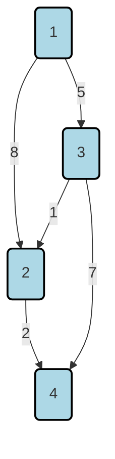
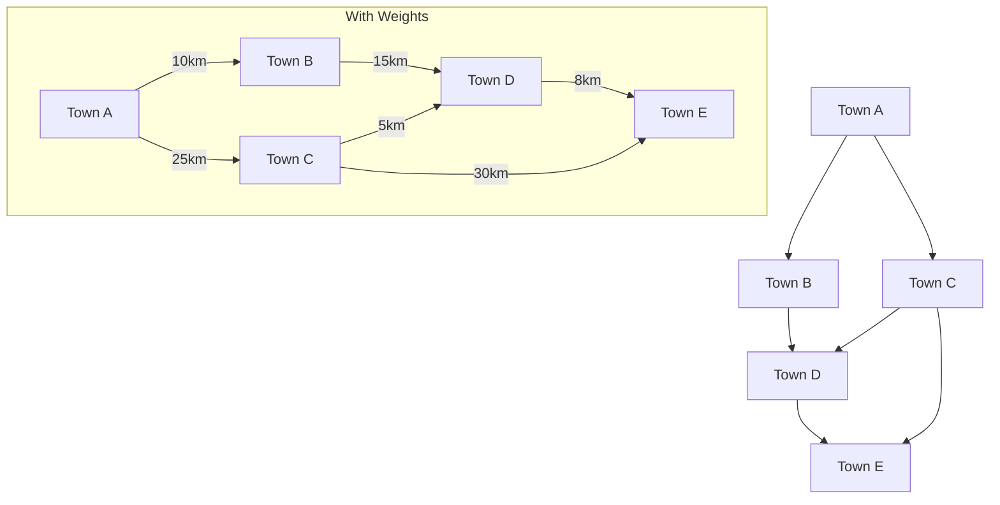
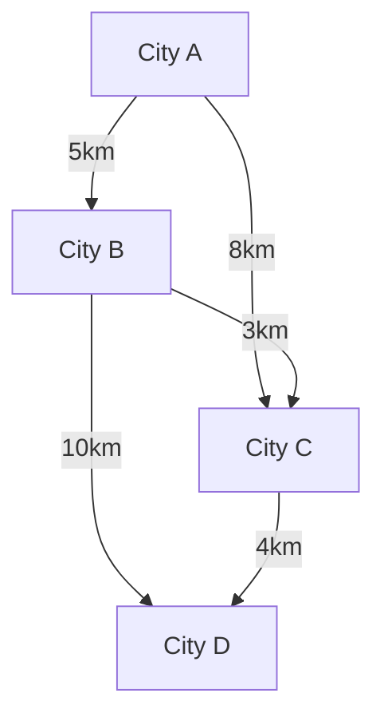

# 5 Weighted Graphs And Their Applications

Comprehensive resource for 5 Weighted Graphs And Their Applications.


---

## 5 Weighted Graphs And Their Applications Hub


## Overview
This unit introduces the fundamental concepts of weighted graphs and their practical applications in various fields. Weighted graphs are a crucial extension of basic graph theory, where edges are assigned numerical values representing attributes such as cost, distance, or capacity. Mastering this unit will equip you with the knowledge to model real-world problems involving optimization and resource allocation, preparing you for complex problem-solving in areas like network routing and logistics. The unit progresses from understanding the basic definition of weighted graphs to exploring algorithms for finding minimal spanning trees and shortest paths.

## Learning Objectives
*   Define weighted graphs and identify the real-world implications of edge weights.
*   Distinguish between a spanning tree and a minimal spanning tree (MST).
*   Apply Kruskal's algorithm to determine the MST of a given weighted graph.
*   Apply Prim's algorithm to determine the MST of a given weighted graph.
*   Formulate shortest path problems within weighted graphs.
*   Implement Dijkstra's algorithm to find the shortest paths from a single source vertex.
*   Understand the principles of Bellman-Ford algorithm for shortest path problems.
*   Comprehend the fundamental aspects of the Critical Path Problem (though detailed content requires further study).

## Unit Applications & Real-World Relevance
Weighted graphs have extensive applications across diverse domains. In **transportation and logistics**, they model road networks where weights represent travel time, distance, or fuel cost, enabling optimization of delivery routes. In **computer networks**, edge weights can represent data transfer rates or latency, crucial for efficient packet routing. **Resource allocation** problems, such as assigning tasks to machines based on execution cost, also heavily rely on weighted graph models. Furthermore, **social network analysis** can use weights to denote frequency of interaction or strength of relationships, while **food webs** utilize weights to quantify energy flow.

## Active Learning Prompts
*   Consider your daily commute. How could you model your city's road network as a weighted graph to find the shortest time route? What would the nodes and edges represent, and what values would you assign as weights?
*   Imagine designing a new social media platform. How might weighted graphs be used to manage friend suggestions, content delivery, or identify influential users?
*   Research a real-world scenario where finding a Minimal Spanning Tree is more critical than finding the Shortest Path. Explain why and provide a concrete example.

## Unit Challenges & Common Misconceptions
A common challenge in this unit is distinguishing between the goals of minimal spanning tree algorithms and shortest path algorithms; while both involve optimizing paths in weighted graphs, their objectives are distinct (connecting all vertices with minimum total weight vs. finding the least-cost path between two specific vertices). Students often misapply one algorithm when the other is required. Another misconception involves assuming that the shortest path between two nodes will always be part of an MST, which is not necessarily true. Understanding the conditions for algorithm applicability (e.g., non-negative edge weights for Dijkstra's) is also crucial.

## Connections
  - [[Weighted_Graphs]]
  - [[Minimal_Spanning_Trees]]
    - [[1-Academic/Year_II/Semester_I/Discrete_Mathematics/5_Weighted_Graphs_And_Their_Applications/Kruskals_Algorithm]]
    - [[1-Academic/Year_II/Semester_I/Discrete_Mathematics/5_Weighted_Graphs_And_Their_Applications/Prims_Algorithm]]
  - [[Shortest_Path_Problem]]
    - [[1-Academic/Year_II/Semester_I/Discrete_Mathematics/5_Weighted_Graphs_And_Their_Applications/Dijkstras_Algorithm]]
    - [[Bellman_Ford_Algorithm]]
  - [[Critical_Path_Problem]]

## Next Steps for Deeper Understanding
To further deepen your understanding, explore advanced graph algorithms such as Floyd-Warshall for all-pairs shortest paths, or delve into network flow problems which build upon weighted graph concepts. Consider applying these algorithms to real-world datasets using programming libraries in Python (e.g., NetworkX) to gain practical experience in graph analysis and optimization. Additionally, researching the complexities and applications of graph traversal algorithms in Artificial Intelligence and Machine Learning will provide valuable insights.

## Possible Questions
[[CC2131_5_Weighted_Graphs_and_Their_Applications_Possible_Questions]]

---

---

## Critical Path Problem


## Definition
Before proceeding, ensure you master [[Weighted_Graphs]] and [[Shortest_Path_Problem]] because the Critical Path Problem (CPP) often leverages graph concepts, where activities and their durations form a weighted network.
The **Critical Path Problem (CPP)** is a project management technique that involves analyzing the sequence of project activities to identify the longest possible path of scheduled activities, which determines the shortest possible time to complete the entire project. This longest path is known as the **critical path**. If any activity on the critical path is delayed, the entire project will be delayed. It's like finding the longest chain in a series of tasks, where that chain dictates the earliest possible completion of the whole endeavor.

## The Mental Model
Imagine you're baking a cake. You have several tasks: mixing ingredients, preheating the oven, baking, and decorating. Some tasks can happen simultaneously (e.g., mixing while the oven preheats), but others must happen in sequence (you can't bake before preheating). Each task takes a specific amount of time. The Critical Path is the sequence of tasks that, if any of them take longer, the *entire cake-baking process* will be delayed. Any task not on this path can be delayed a bit without affecting the final cake readiness.

## Context & Framework
#### The Executive (Decisions)
The Critical Path Problem is a core component of **Critical Path Method (CPM)**, a project scheduling technique. It frames a project as a directed graph where nodes represent events or milestones, and edges represent activities. The weights on these edges are the durations of the activities. Unlike finding the *shortest* path between two points, the CPP seeks the *longest* path from the project start to finish. This longest path represents the minimum time required to complete the project because delaying any activity on this path will delay the entire project. CPM is a fundamental tool for project managers to optimize schedules and allocate resources effectively.

## The Mastery Deep Dive
#### The Pilot's Checklist (Do Not Skip)
**[NEEDS MANUAL INPUT]**: The detailed steps for identifying the critical path in a project require manual verification and input from comprehensive source texts. However, the general procedure involves:

1.  **Define Activities:** List all project activities, their dependencies, and durations.
2.  **Draw Network Diagram:** Construct a directed graph (usually Activity-on-Node AON or Activity-on-Arrow AOA) where activities are nodes (or edges) and arrows show dependencies.
3.  **Forward Pass (Earliest Times):** Calculate the **Early Start (ES)** and **Early Finish (EF)** times for each activity.
    *   `ES = EF of predecessor activity` (or 0 for start activities).
    *   `EF = ES + Duration`.
4.  **Backward Pass (Latest Times):** Calculate the **Late Start (LS)** and **Late Finish (LF)** times for each activity, working backward from the project's overall EF.
    *   `LF = LS of successor activity` (or project EF for end activities).
    *   `LS = LF - Duration`.
5.  **Calculate Float (Slack):** For each activity, calculate its **Total Float (TF)**.
    *   `TF = LS - ES` or `TF = LF - EF`.
6.  **Identify Critical Path:** The critical path is the sequence of activities where the **Total Float is zero**. These activities have no flexibility; any delay will delay the entire project.

#### The Warning Lights: Signs of Trouble
**[NEEDS MANUAL INPUT]**: A common pitfall in project management related to the Critical Path Problem is focusing efforts and resources on non-critical tasks when delays occur. This is a mistake because, by definition, only delays to tasks on the critical path will push back the overall project completion date. Improving efficiency or speeding up non-critical tasks will not reduce the project's minimum duration unless it shortens the critical path itself. Therefore, effective project management demands constant monitoring and agile response to potential delays on critical activities.

## Constraints & Limitations
#### The Engineering Trade-off
**[NEEDS MANUAL INPUT]**: While the Critical Path Problem is invaluable for project scheduling, it comes with limitations. It assumes that activity durations are known and fixed, which is often not true in real-world projects. It also doesn't inherently account for resource constraints (e.g., limited personnel or equipment); crashing an activity (reducing its duration by adding resources) might shorten one critical path but create a new one. Furthermore, in highly uncertain projects, the single "critical path" might shift frequently, requiring constant recalculation and making the model less predictive.

## Significance & Application
**[NEEDS MANUAL INPUT]**: The Critical Path Problem is fundamental to various industries for effective project management:
*   **Construction**: Scheduling large-scale construction projects to ensure timely completion.
*   **Software Development**: Planning agile sprints and release cycles, identifying bottleneck tasks.
*   **Manufacturing**: Optimizing production lines and new product development timelines.
*   **Event Planning**: Coordinating complex events with many interdependent tasks.
*   **Research and Development**: Managing scientific projects with numerous experimental stages.
Its primary significance lies in providing a clear framework for project managers to understand dependencies, identify key activities, and allocate resources strategically to meet deadlines.

## The Worked Example
**[NEEDS MANUAL INPUT]**: A concrete, step-by-step walkthrough of how to calculate the critical path for a small project network, including defining activities, drawing the network diagram, performing forward and backward passes, and calculating float, is required. This section would ideally include a Mermaid `graph TD` to visually represent the project network.

## The Proving Ground
*Test your mastery. Cover the solutions below to test yourself first.*

#### Level 1: Understanding (The Basics)
**The Tool Check:** **[NEEDS MANUAL INPUT]**: What is the primary objective of the Critical Path Problem in project management?
> **Solution:** **[NEEDS MANUAL INPUT]**: The primary objective is to identify the longest sequence of dependent activities (the critical path) in a project, which determines the minimum total time required to complete the entire project.

#### Level 2: Competence (Application)
**The Routine Run:** **[NEEDS MANUAL INPUT]**: Given a sequence of project tasks with specified durations and dependencies, how would one typically identify the "critical path"?
> **Solution:** **[NEEDS MANUAL INPUT]**: The critical path is identified by creating a network diagram (Activity-on-Node or Activity-on-Arrow), performing a forward pass to calculate Early Start/Early Finish times, then a backward pass to calculate Late Start/Late Finish times. Activities with zero total float (slack) constitute the critical path.

#### Level 3: Mastery (The Disaster Drill)
**The Disaster Drill:** **[NEEDS MANUAL INPUT]**: A project manager using the Critical Path Method finds that a critical task is experiencing delays. Explain why focusing resources on non-critical tasks would be an ineffective strategy in this scenario.
> **Solution:** **[NEEDS MANUAL INPUT]**: Focusing resources on non-critical tasks is ineffective because, by definition, non-critical tasks have float (slack). Any delay in these tasks, up to their float, will not impact the overall project completion date. Only tasks on the critical path directly influence the project's duration. Therefore, to mitigate delays, resources must be redirected to critical tasks.

## Key Takeaways
*   The Critical Path Problem identifies the longest sequence of activities in a project, known as the critical path, which dictates the project's minimum completion time.
*   Activities on the critical path have zero float, meaning any delay will directly delay the entire project.
*   It is a vital tool for project scheduling, resource allocation, and identifying potential bottlenecks.

## Knowledge Graph Connections
| Concept                     | Connection / Relationship                                                                   |
| :
-------------------------- | :
------------------------------------------------------------------------------------------ |
| [[Weighted_Graphs]]         | Project activities with durations can be modeled as a weighted directed graph.              |
| [[Shortest_Path_Problem]]   | While conceptually different, some formulations of CPP use shortest/longest path algorithms. |
| Project_Management      | The Critical Path Problem is a core technique in project management.                        |
| Scheduling_Algorithms   | CPM is a type of scheduling algorithm.                                                      |
---

---

## Minimal Spanning Trees


## Definition
Before proceeding, ensure you master [[Weighted_Graphs]] and Elements_Of_Graph_Theory because understanding MSTs requires a solid grasp of graph connectivity and edge weights.
A **Minimal Spanning Tree (MST)** is a subset of the edges of a connected, edge-weighted undirected graph that connects all the vertices together, without any cycles and with the minimum possible total edge weight. In simpler terms, if you have a bunch of cities (vertices) and roads between them with varying lengths (edge weights), an MST is the set of roads you would build to connect all cities using the least total length of road.

## The Mental Model
Imagine you're trying to lay fiber optic cables to connect several towns in a region, but you want to minimize the total length of cable used. The towns are like the "nodes" in a graph, and the potential cable routes between them are the "edges," each with a "weight" representing its length. A Minimal Spanning Tree is the most economical way to connect all towns such that every town can reach every other town, without creating any redundant loops of cable.

## Context & Framework
#### The Foundation: What We Already Know
The concept of a Minimal Spanning Tree (MST) builds upon the basic definitions of a Tree and a Spanning_Tree. A **Tree** is a connected, acyclic graph. A **Spanning Tree** of a graph $G(V, E)$ is a connected, acyclic subgraph of $G$ that contains all the nodes in $V$. The weight of a spanning tree in a **Weighted Graph** $G(V, E, w)$ is simply the sum of the weights of all its edges. An MST is then the spanning tree whose total weight is the smallest among all possible spanning trees of $G$. This definition sets the stage for optimization problems in graph theory.

## The Mastery Deep Dive
#### The Translator: Converting English to Math
The problem of finding an MST can be formally stated as:
Given a connected, undirected, weighted graph $G = (V, E)$, with a weight function $w: E \to \mathbb{R}$ that assigns a real weight $w(u, v)$ to each edge $(u, v) \in E$.
The goal is to find an acyclic subset $T \subseteq E$ such that $T$ connects all of the vertices in $V$ and minimizes the total weight $w(T)$.
This total weight $w(T)$ is defined by the following formula:
$$ \boxed{\displaystyle w(T) = \sum_{(u,v)\in T} w(u, v)} $$

#### The Variable Dictionary
| Symbol | Name                | Unit      | Analogy                                   |
| :
----- | :
------------------ | :
-------- | :
---------------------------------------- |
| $G$    | Graph               | N/A       | The entire map of cities and roads        |
| $V$    | Set of Vertices     | N/A       | All the towns                             |
| $E$    | Set of Edges        | N/A       | All the possible roads between towns      |
| $w$    | Weight Function     | N/A       | The rule that assigns lengths to roads    |
| $w(u,v)$ | Weight of Edge $(u,v)$ | Distance (e.g., km) | The length of a specific road             |
| $T$    | Spanning Tree       | N/A       | A selection of roads that connect all towns without loops |
| $w(T)$ | Total Weight of $T$ | Total Distance (e.g., km) | The total length of all roads in the spanning tree |
| $\sum$ | Summation Operator  | N/A       | Adding up all the road lengths            |

#### Step-by-Step Derivation
Consider a simplified problem to clarify the summation:
If a spanning tree $T$ has edges $e_1, e_2, e_3$ with weights $w(e_1), w(e_2), w(e_3)$, then its total weight $w(T)$ is simply:
$$ \begin{aligned}
& w(T) = w(e_1) + w(e_2) + w(e_3) \quad \text{(Sum of individual edge weights)} \\
& w(T) = \sum_{e \in T} w(e) \quad \text{(General form using summation notation)}
\end{aligned} $$
This shows that the problem formulation is a straightforward sum of the weights of the chosen edges. The challenge lies in selecting the *right* edges to ensure all vertices are connected, no cycles are formed, and this sum is minimized.

## Constraints & Limitations
#### The "Oops!" List: Where Everyone Fails
One common pitfall is that a minimal spanning tree may not be unique if there are multiple edges with the same minimum weight that could be chosen to form an MST. While the total weight of *any* MST for a given graph will be the same, the specific set of edges comprising the MST might differ. Another limitation is that MST algorithms typically work with connected, undirected graphs. For disconnected graphs, you would find a Minimum Spanning Forest (a set of MSTs, one for each connected component).

## Significance & Application
Minimal Spanning Trees are vital in areas requiring efficient connection structures. They are used in **network design**, such as laying out telecommunication networks, power grids, or water supply systems, where the goal is to connect all points with the least amount of material (e.g., cable, pipe). In **cluster analysis** in machine learning, MSTs can help identify natural groupings of data points. They also play a role in **image segmentation** and **circuit design**, ensuring connectivity while minimizing cost or resource usage.

## The Worked Example
Consider a graph with vertices {A, B, C} and edges with weights: (A,B)=2, (B,C)=3, (A,C)=4.
Let's list all possible spanning trees and their weights:
1.  Edges {(A,B), (B,C)}: Total weight = $2 + 3 = 5$.
2.  Edges {(A,B), (A,C)}: Total weight = $2 + 4 = 6$.
3.  Edges {(B,C), (A,C)}: Total weight = $3 + 4 = 7$.
The minimal spanning tree has a total weight of 5, formed by edges {(A,B), (B,C)}.

## The Proving Ground
*Test your mastery. Cover the solutions below to test yourself first.*

#### Level 1: Understanding (The Basics)
**The Variable ID:** In the formula $w(T) = \sum_{(u,v)\in T} w(u, v)$ for the weight of a spanning tree, what do $T$ and $w(u,v)$ physically represent in the context of connecting towns with roads?
> **Solution:** $T$ physically represents the specific subset of chosen roads (edges) that connect all the towns (vertices) without creating any loops. $w(u,v)$ represents the individual length (weight) of the road between town $u$ and town $v$.

#### Level 2: Competence (Application)
**The Standard Solver:** A set of 6 servers needs to be connected with network cables. The costs to connect each pair of servers are given. Calculate the minimum total cost to ensure all servers are connected, forming a spanning tree with the following edge costs: (S1,S2)=10, (S1,S3)=5, (S2,S3)=12, (S2,S4)=15, (S3,S4)=8, (S3,S5)=11, (S4,S5)=9, (S4,S6)=7, (S5,S6)=14.
> **Solution:**
    1. Sort edges by weight: (S1,S3)=5, (S4,S6)=7, (S3,S4)=8, (S4,S5)=9, (S1,S2)=10, (S3,S5)=11, (S2,S3)=12, (S5,S6)=14, (S2,S4)=15.
    2. Applying Kruskal's algorithm (or similar logic):
        - Include (S1,S3) (5)
        - Include (S4,S6) (7)
        - Include (S3,S4) (8)
        - Include (S4,S5) (9)
        - Include (S1,S2) (10)
        - (S3,S5) (11) creates a cycle (S3-S4-S5-S3), reject.
        - (S2,S3) (12) creates a cycle (S2-S1-S3-S2), reject.
        - The current edges connect all 6 nodes (5 edges for 6 nodes). The MST edges are {(S1,S3), (S4,S6), (S3,S4), (S4,S5), (S1,S2)}.
    3. Minimum total cost = 5 + 7 + 8 + 9 + 10 = 39.

#### Level 3: Mastery (The Impossible Case)
**The Impossible Case:** Consider a scenario where all edge weights in a connected, undirected graph are identical and positive. If a unique minimal spanning tree is required, what challenge does this scenario present to the 'minimum weight' criteria, and how would this ambiguity be typically resolved?
> **Solution:** If all edge weights are identical, any spanning tree will have the same total weight. This presents a challenge to the 'minimum weight' criterion because there will be multiple spanning trees with the same minimal total weight, meaning the MST is not unique. This ambiguity cannot be resolved by the standard MST algorithms solely based on weight. In practice, secondary criteria such as preferring edges with lower indices, specific topological properties, or other tie-breaking rules (often arbitrary) would be introduced to select a single "unique" MST from the set of equally weighted minimal spanning trees.

## Key Takeaways
*   An MST is a subgraph that connects all vertices of a weighted, undirected graph with the minimum possible total edge weight, without forming any cycles.
*   The total weight of an MST is calculated as the sum of its edge weights, formally expressed as $w(T) = \sum_{(u,v)\in T} w(u, v)$.
*   MSTs are crucial for optimization in network design, resource allocation, and cluster analysis.

## Knowledge Graph Connections
| Concept                     | Connection / Relationship                                                                   |
| :
-------------------------- | :
------------------------------------------------------------------------------------------ |
| [[Weighted_Graphs]]         | MSTs are found exclusively in weighted graphs.                                              |
| Elements_Of_Graph_Theory | MSTs are a specific type of graph structure.                                                |
| Kruskals_Algorithm     | Kruskal's algorithm is a method to find an MST.                                             |
| Prims_Algorithm        | Prim's algorithm is another method to find an MST.                                          |
---

---

## Shortest Path Problem


## Definition
Before proceeding, ensure you master [[Weighted_Graphs]] and Elements_Of_Graph_Theory because the shortest path problem relies on understanding weighted connections and graph traversal.
The **Shortest Path Problem** in graph theory is concerned with finding a path between two nodes (or vertices) in a graph such that the sum of the weights of its constituent edges is minimized. These weights typically represent "costs" such as distance, time, or expense. In simpler terms, if you have a map of cities and roads with travel times, the shortest path problem aims to find the quickest route from one city to another.

## The Mental Model
Imagine you're using a GPS navigation system. You input your starting location and your destination. The GPS doesn't just show you *any* route; it calculates the route that minimizes travel time or distance, considering traffic or road conditions. The cities are the "nodes," the roads are the "edges," and the travel times/distances are the "weights." The GPS is solving a shortest path problem to guide you efficiently.

## Context & Framework
#### The Foundation: What We Already Know
The Shortest Path Problem is a cornerstone of graph theory and computational optimization, distinct from finding a [[Minimal_Spanning_Trees]]. While both involve weighted graphs, an MST connects *all* vertices with minimum total weight, whereas the shortest path problem focuses on optimizing a single path between two *specific* vertices. This fundamental difference means different algorithms are required. Two prominent algorithms used to solve this problem are [[1-Academic/Year_II/Semester_I/Discrete_Mathematics/5_Weighted_Graphs_And_Their_Applications/Dijkstras_Algorithm]] and the [[Bellman_Ford_Algorithm]].

#### The Translator: Converting English to Math
Given a weighted graph $G(V, E, w)$, where $V$ is the set of vertices, $E$ is the set of edges, and $w_{ij}$ is the weight of an edge $(v_i, v_j)$, the shortest path problem seeks to find a path from a source vertex $v_1$ to a destination vertex $v_k$ such that the sum of the weights of its edges is minimum.
The objective is to minimize:
$$ \boxed{\displaystyle w_{1,2} + w_{2,3} + w_{3,4} + \dots + w_{k-1,k}} $$
This sum represents the total weight (e.g., distance, cost, time) of the path.

#### The "Duh!" Moment (Intuitive Proof)
**Bellman's Minimality Principle (or Optimality Principle):**
This principle states that if $P_j : 1 \to j$ is a shortest path from vertex 1 to vertex $j$ in a graph $G$, and $(i, j)$ is the last edge on this path, then the subpath $P_i : 1 \to i$ (obtained by removing the edge $(i, j)$ from $P_j$) must also be a shortest path from vertex 1 to vertex $i$.
Think of it this way: if your quickest route from home to the store goes through the park, then the part of your route from home to the entrance of the park must also be the quickest way to get to the park entrance. If there were a faster way to the park entrance, you would have taken it, making your overall route to the store faster too.

## Constraints & Limitations
#### The "Oops!" List: Where Everyone Fails
A significant challenge for the shortest path problem arises when graphs contain **negative-weight cycles**. If a path is allowed to revisit vertices and passes through a cycle where the sum of edge weights is negative, it's possible to infinitely loop through that cycle, reducing the total path weight indefinitely. In such cases, the concept of a "shortest path" becomes ill-defined, as an infinitely short path could theoretically exist. Algorithms must either detect and report such cycles or be designed to handle only non-negative edge weights.

## Significance & Application
The shortest path problem is foundational for countless real-world applications:
*   **GPS and Navigation Systems**: Finding the fastest or shortest routes for vehicles and pedestrians.
*   **Network Routing**: Determining the most efficient path for data packets across computer networks, minimizing latency or hop count.
*   **Logistics and Supply Chain Management**: Optimizing delivery routes for goods, reducing fuel costs and delivery times.
*   **Robotics**: Path planning for robots to navigate environments efficiently.
*   **Resource Allocation**: Finding optimal sequences of operations in complex systems.
Its widespread applicability makes it one of the most studied problems in graph theory.

## The Worked Example
Consider a network of four cities (1, 2, 3, 4) with road distances (weights) as shown in the diagram. We want to find the shortest path from city 1 to city 4.


```text
// Scenario 1: Visualize the graph with edge weights.
// Output:
// (A visual representation of cities 1, 2, 3, 4 as nodes, connected by edges labeled with their respective distances (weights).
// Example paths and their sums:
// Path 1-2-4: 8 + 2 = 10
// Path 1-3-4: 5 + 7 = 12
// Path 1-3-2-4: 5 + 1 + 2 = 8
// The shortest path from 1 to 4 is 1-3-2-4 with a total weight of 8.
```
By inspecting the paths and their total weights, we can see that path 1 $\to$ 3 $\to$ 2 $\to$ 4 has a total weight of $5 + 1 + 2 = 8$, which is the minimum among all possible paths from 1 to 4. This simple example illustrates the core objective of the shortest path problem.

## The Proving Ground
*Test your mastery. Cover the solutions below to test yourself first.*

#### Level 1: Understanding (The Basics)
**The Variable ID:** In the context of a package delivery network, if $w_{i,j}$ represents the delivery time between point $i$ and point $j$, what does the sum $w_{1,2} + w_{2,3} + \dots + w_{k-1,k}$ signify for the shortest path problem?
> **Solution:** The sum signifies the **total delivery time** for a specific path from the starting point 1 to the destination point $k$. The shortest path problem aims to minimize this total delivery time.

#### Level 2: Competence (Application)
**The Standard Solver:** A delivery driver needs to find the quickest route from their depot (start node) to a specific customer's house (end node) through a city with varying traffic conditions. Given a weighted graph representing the city's streets and travel times as weights, formulate the objective function that the driver needs to minimize.
> **Solution:** Let $P = (v_0, v_1, \dots, v_k)$ be a path from the depot $v_0$ to the customer's house $v_k$, where $w(v_i, v_{i+1})$ is the travel time for each edge. The objective function the driver needs to minimize is $\sum_{i=0}^{k-1} w(v_i, v_{i+1})$.

#### Level 3: Mastery (The Impossible Case)
**The Impossible Case:** Explain why a graph containing a negative-weight cycle poses a fundamental challenge to finding a "shortest path" in certain scenarios, particularly if the path is allowed to revisit vertices. What specific concept of a "shortest path" becomes ill-defined in such a graph?
> **Solution:** If a graph contains a negative-weight cycle and paths are allowed to revisit vertices, one could traverse the negative cycle an infinite number of times, continuously decreasing the total path weight. This would lead to an infinitely short path, meaning the concept of a finite "shortest path" is **ill-defined** or **non-existent** under these conditions. Algorithms designed for shortest paths must either specifically detect such cycles or restrict paths to be simple (no revisited vertices) to avoid this issue.

## Key Takeaways
*   The shortest path problem finds a path between two nodes in a weighted graph with the minimum total sum of edge weights.
*   It is distinct from MST problems, focusing on optimizing a single path between two specific vertices.
*   Negative-weight cycles pose a fundamental challenge, making the shortest path ill-defined if paths can revisit vertices.

## Knowledge Graph Connections
| Concept                     | Connection / Relationship                                                                   |
| :
-------------------------- | :
------------------------------------------------------------------------------------------ |
| [[Weighted_Graphs]]         | Shortest path problems are defined on weighted graphs.                                      |
| Elements_Of_Graph_Theory | It is a core problem in graph theory.                                                       |
| Dijkstras_Algorithm    | Dijkstra's algorithm solves shortest paths for non-negative weights.                        |
| [[Bellman_Ford_Algorithm]]  | Bellman-Ford algorithm solves shortest paths and handles negative weights (detects cycles). |
---

---

## Weighted Graphs


## Definition
Before proceeding, ensure you master Elements_Of_Graph_Theory and Directed_Graphs because weighted graphs build upon the fundamental concepts of nodes, edges, and graph types.
A **Weighted Graph** is a type of graph where each edge is assigned a numerical value, often called a "weight." These weights can represent various real-world attributes such as cost, distance, capacity, or time, making weighted graphs incredibly useful for modeling optimization problems. Think of it like a map where each road (edge) has a number indicating how long it takes to travel that road.

## The Mental Model
Imagine you're trying to choose a flight route. The cities are the "nodes" and the flights are the "edges." If you just look at connections, you might pick a route with many stops. A weighted graph, however, assigns a "weight" (like price or flight duration) to each flight. This allows you to pick the cheapest or fastest route, not just any route. It's like adding context to the connections.


```text
// Scenario 1: Unweighted Graph (connections only)
// Output:
// (Visual representation of a simple graph showing nodes A, B, C, D, E and their connections. All connections appear equal.)
//
// Scenario 2: Weighted Graph (connections with associated values)
// Output:
// (Visual representation of the same graph, but with numerical labels on each edge, e.g., "10km", "25km", clearly indicating varying costs/distances.)
```
*Note: The first part shows an unweighted graph, where connections are just present or absent. The 'With Weights' subgraph shows the same connections, but each edge now carries a specific numerical value representing a 'weight', like distance in kilometers.*

## Context & Framework
#### The Family Tree
Weighted graphs are a direct extension of standard graphs, falling under the broader umbrella of **Graph Theory**. They are foundational for understanding more complex network models and optimization problems. Unweighted graphs are a special case of weighted graphs where all edge weights are implicitly considered to be 1 (or any constant value). This conceptual relationship means that algorithms developed for weighted graphs can often be adapted for unweighted ones, but the reverse is not always true due to the additional information provided by weights. They also relate to Network_Flow_Problems where edge capacities act as weights.

## The Mastery Deep Dive
#### Opening the Hood: What's Inside?
Formally, a weighted graph is defined as a 3-tuple $G = (V, E, w)$, where:
*   $V$ is the set of **nodes** (or vertices). These represent the entities in the graph (e.g., cities, people, computers).
*   $E$ is the set of **edges**. These represent the connections between the nodes. Each edge is an ordered pair $(u, v)$ for a directed graph or an unordered pair $\{u, v\}$ for an undirected graph.
*   $w$ is a **weight function** $w: E \to \mathbb{R}$. This function assigns a real numerical value (the weight) to each edge in $E$. The set $\mathbb{R}$ indicates that weights can be any real number.
This definition applies universally to both directed and undirected graphs, meaning a directed edge can also carry a weight.

#### How the Parts Talk to Each Other
The weight function $w$ is the key component that allows edges to carry meaning beyond mere connectivity. When an algorithm processes a weighted graph, it uses these weights to make decisions. For example, in a shortest path algorithm, the sum of weights along a path determines its total "cost," influencing which path is chosen. In a minimal spanning tree algorithm, edge weights dictate which connections are prioritized to minimize the overall cost of connecting all nodes. The ability to assign and interpret these weights allows for the modeling of complex systems where resources, distances, or capacities are critical factors.

## Constraints & Limitations
#### The "Oops!" List: Where Everyone Fails
A common error is confusing the weight of an edge with its visual length in a drawing. A diagram might show a 'short' line for an edge with a high weight (e.g., a short, busy road with heavy traffic), and a 'long' line for an edge with a low weight (e.g., a long, empty highway). It's crucial to remember that the diagram is a representation, and the numerical weight is the sole determinant of its value for algorithmic purposes. Another pitfall is forgetting that weights can sometimes be negative, which has significant implications for certain algorithms, such as Dijkstra's algorithm.

## Significance & Application
Weighted graphs are fundamental in computer science, operations research, and various engineering disciplines. They are essential for **network optimization**, including finding optimal routes in GPS systems, designing efficient telecommunication networks, and planning logistical supply chains. In **resource management**, they help in allocating tasks, managing project dependencies with time costs, and optimizing material flow. Their ability to quantitatively represent relationships makes them a powerful tool for solving real-world problems that involve finding the "best" or "most efficient" solution under given constraints.

## The Worked Example
Consider a simple road network between cities A, B, C, and D. The distances (weights) between them are: A-B (5 km), A-C (8 km), B-C (3 km), B-D (10 km), C-D (4 km). We want to visualize this as a weighted graph.


```text
// Scenario 1: Displaying the weighted graph.
// Output:
// (Visual representation of cities A, B, C, D as nodes, connected by edges labeled with their respective distances (weights).
// For instance: "City A -- 5km --> City B".)
```
This diagram clearly shows the cities as nodes and the roads as edges, with the distances explicitly marked as weights. This allows us to visually understand the costs associated with traveling between different cities. For example, traveling from City A to City B costs 5km, while City A to City C costs 8km.

## The Proving Ground
*Test your mastery. Cover the solutions below to test yourself first.*

#### Level 1: Understanding (The Basics)
**The Neighbor Check:** List three distinct real-world scenarios where edge weights in a graph could represent 'capacity'.
> **Solution:** Examples include: (1) Maximum data throughput of a network cable, (2) Carrying capacity of a bridge for vehicles, (3) Storage capacity of a warehouse connected by a supply route.

#### Level 2: Competence (Application)
**The Sort:** Given a social network graph where edge weights represent the number of shared interests, categorize the following connections into 'Strong' (weight > 5) or 'Weak' (weight <= 5): (A,B)=7, (A,C)=3, (B,D)=6, (C,E)=2, (D,F)=9.
> **Solution:** Strong connections: (A,B), (B,D), (D,F). Weak connections: (A,C), (C,E).

#### Level 3: Mastery (The Impostor)
**The Impostor:** You are presented with a graph representing flight routes between cities, where edges are colored (red for direct, blue for connecting flights). A colleague argues this is a weighted graph because the colors add 'value' to the connections. Explain why this is a 'False Friend' and not a true weighted graph, referring to the fundamental definition of weights.
> **Solution:** This is a 'False Friend' because colors (red, blue) are **categorical attributes**, not numerical values from a real number set ($\mathbb{R}$). A true weighted graph requires that each edge be assigned a *numerical value* (a weight) that can be used for mathematical operations like summation (e.g., adding distances or costs) or comparison. While colors provide information, they don't allow for such quantitative analysis, which is central to the concept of edge weights in graph theory.

## Key Takeaways
*   Weighted graphs assign numerical values (weights) to edges, representing attributes like cost, distance, or capacity, which enables the modeling of real-world optimization problems.
*   Formally defined as $G = (V, E, w)$, where $w: E \to \mathbb{R}$ is the weight function, applicable to both directed and undirected graphs.
*   The distinction between visual representation and actual numerical weight is crucial, and the choice of algorithm often depends on whether weights can be negative or positive.

## Knowledge Graph Connections
| Concept                     | Connection / Relationship                                                                   |
| :
-------------------------- | :
------------------------------------------------------------------------------------------ |
| Elements_Of_Graph_Theory | Weighted graphs are a fundamental type of graph theory.                                     |
| Directed_Graphs         | Weighted graphs can be either directed or undirected.                                       |
| [[Minimal_Spanning_Trees]]  | Weighted graphs are the foundation for finding minimal spanning trees.                      |
| [[Shortest_Path_Problem]]   | Weighted graphs are essential for solving shortest path problems.                           |
---

---

## Bellman Ford Algorithm


## Definition
Before proceeding, ensure you master [[Shortest_Path_Problem]] and [[Weighted_Graphs]] because Bellman-Ford is a crucial algorithm for finding shortest paths, especially in scenarios where negative edge weights are present.
The **Bellman-Ford Algorithm** is a single-source shortest path algorithm that computes shortest paths from a single source vertex to all other vertices in a weighted digraph. Unlike Dijkstras_Algorithm, it can correctly handle graphs with **negative edge weights** and can detect if a negative cycle is reachable from the source. Imagine navigating a network where some connections (edges) can actually "gain" you something (negative cost) – Bellman-Ford can still find the best path, and even warn you if you could loop endlessly for infinite gain.

## The Mental Model
Think of Bellman-Ford like a rumor spreading through a social network. Initially, only the source person knows their "distance" (0). Everyone else has an "infinite" distance. The rumor spreads in rounds: in each round, *every single person* hears from *all* their neighbors and updates their own shortest distance if they hear a shorter path. This happens for a fixed number of rounds (one less than the total number of people). After all rounds, if anyone still hears a shorter path, it means there's a problem – a negative rumor loop!

## Context & Framework
#### The Pilot's Checklist
The Bellman-Ford algorithm iteratively relaxes edges to find shortest paths. **Relaxation** is the process of updating the shortest path estimate to a vertex if a shorter path is found. The algorithm performs `V-1` iterations (where `V` is the number of vertices), and in each iteration, it attempts to relax *all* edges in the graph. This repetitive relaxation guarantees that shortest paths are found even in the presence of negative edge weights (as long as no negative cycles are reachable from the source). After `V-1` iterations, a final check of all edges can detect the presence of a negative cycle.

## The Mastery Deep Dive
#### The Pilot's Checklist (Do Not Skip)
Given a weighted, directed graph `G = (V, E)` with a source vertex `s` and edge weights `w(u, v)` (which can be negative), the Bellman-Ford algorithm proceeds as follows:

1.  **Initialization**:
    *   For each vertex `v` in `V`:
        *   Set `dist[v] = ∞` (representing an infinite distance).
        *   Set `pred[v] = NIL` (representing no predecessor on the shortest path yet).
    *   Set `dist[s] = 0` (the distance from the source to itself is zero).

2.  **Relax Edges Repeatedly**:
    *   Repeat `|V| - 1` times (where `|V|` is the number of vertices):
        *   For each edge `(u, v)` with weight `w` in `E`:
            *   If `dist[u] + w < dist[v]`:
                *   `dist[v] = dist[u] + w` (update the shortest path estimate).
                *   `pred[v] = u` (update the predecessor for path reconstruction).
    *   **Explanation**: After `i` iterations, the algorithm finds all shortest paths of length at most `i` edges. Repeating for `|V|-1` times ensures all shortest paths are found, as a simple shortest path in a graph with `V` vertices can have at most `V-1` edges.

3.  **Check for Negative Cycles**:
    *   After `|V| - 1` iterations, perform one more pass over all edges.
    *   For each edge `(u, v)` with weight `w` in `E`:
        *   If `dist[u] + w < dist[v]`:
            *   This indicates that a negative cycle is reachable from the source. The algorithm should report this and terminate, as shortest paths are undefined in the presence of negative cycles.

4.  **Result**:
    *   If no negative cycle is detected, `dist` array contains the shortest path distances from `s` to all other reachable vertices. `pred` array can be used to reconstruct the actual paths.

```cpp
// Pseudocode for Bellman-Ford Algorithm
function BellmanFord(graph, source):
    // Step 1: Initialize distances and predecessors
    dist = array of size V, initialized to infinity
    pred = array of size V, initialized to NIL
    dist[source] = 0

    // Step 2: Relax edges repeatedly |V| - 1 times
    for i from 1 to V-1:
        for each edge (u, v) with weight w in graph:
            if dist[u] != infinity and dist[u] + w < dist[v]:
                dist[v] = dist[u] + w
                pred[v] = u

    // Step 3: Check for negative cycles
    for each edge (u, v) with weight w in graph:
        if dist[u] != infinity and dist[u] + w < dist[v]:
            report "Graph contains a negative cycle"
            return empty_distances // Shortest paths are undefined

    // Step 4: Return calculated distances
    return dist
```
```text
// Scenario 1: Successful execution without negative cycles
// Input: Graph with positive and negative weights, no negative cycles.
// Expected Output of `return dist`: (example distances)
//
// Scenario 2: Detection of a negative cycle
// Input: Graph with a negative cycle.
// Expected Output of `report "Graph contains a negative cycle"`: "Graph contains a negative cycle"
// `return empty_distances`: []
```

#### Edge Case Analysis
**What happens if a negative cycle is present and reachable from the source?** The algorithm's check in Step 3 explicitly detects this. If `dist[u] + w < dist[v]` is true after `V-1` iterations, it means the distance to `v` can still be reduced, which is only possible if a negative cycle has been traversed. In this case, shortest paths are not well-defined, and the algorithm correctly reports this.

## Constraints & Limitations
#### The Warning Lights: Signs of Trouble
The primary disadvantage of Bellman-Ford is its **higher time complexity** compared to Dijkstra's algorithm. It runs in $O(V \cdot E)$ time (where $V$ is the number of vertices and $E$ is the number of edges), as it iterates through all edges in `V-1` passes. This makes it less efficient than Dijkstra's ($O(E \log V)$ or $O(V^2)$) for graphs with only non-negative weights. Its main strength lies in its ability to handle negative weights, but this comes at the cost of performance.

## Significance & Application
Bellman-Ford algorithm is crucial in scenarios where negative edge weights are a realistic possibility:
*   **Arbitrage in Financial Markets**: Modeling currency exchange rates where a series of transactions might result in a net gain (negative cost).
*   **Network Routing Protocols**: Specifically, it forms the basis of the **Distance-Vector Routing Protocol** (e.g., RIP), where routers periodically exchange distance information with their neighbors, effectively relaxing edges. Negative weights can represent penalties for certain routes.
*   **Analyzing Game Theory States**: In some game theory problems, actions might have "negative costs" representing benefits.
Its ability to detect negative cycles is also invaluable, as such cycles often represent critical anomalies or opportunities in a system.

## The Worked Example
Consider a graph with 5 vertices (A, B, C, D, E) and weighted, directed edges, including negative weights:

*   A $\xrightarrow{6}$ B
*   A $\xrightarrow{7}$ C
*   B $\xrightarrow{5}$ C
*   B $\xrightarrow{-4}$ D
*   C $\xrightarrow{-3}$ D
*   C $\xrightarrow{8}$ E
*   D $\xrightarrow{-2}$ B
*   D $\xrightarrow{9}$ E
*(Assume A is the source vertex)*

```mermaid
graph TD
    A --> B;
    A --> C;
    B --> C;
    B --> D;
    C --> D;
    C --> E;
    D --> B;
    D --> E;

    linkStyle 0 stroke:blue,stroke-width:2px;
    linkStyle 1 stroke:blue,stroke-width:2px;
    linkStyle 2 stroke:blue,stroke-width:2px;
    linkStyle 3 stroke:red,stroke-width:2px; %% Negative weight
    linkStyle 4 stroke:red,stroke-width:2px; %% Negative weight
    linkStyle 5 stroke:blue,stroke-width:2px;
    linkStyle 6 stroke:red,stroke-width:2px; %% Negative weight
    linkStyle 7 stroke:blue,stroke-width:2px;

    A -- 6 --> B;
    A -- 7 --> C;
    B -- 5 --> C;
    B -- -4 --> D;
    C -- -3 --> D;
    C -- 8 --> E;
    D -- -2 --> B;
    D -- 9 --> E;
```
```text
// Scenario 1: Initial Graph with edge weights (including negative ones highlighted in red).
// Output:
// (Visual representation of the directed graph with nodes A, B, C, D, E and edges labeled with their weights.
// Negative weight edges (B->D, C->D, D->B) are distinctively colored, e.g., red.)
//
// Shortest path distances from A after each iteration:
// Initial: A=0, B=inf, C=inf, D=inf, E=inf
//
// Iteration 1 (relax all edges):
// B from A: dist[B] = 6 (path A->B)
// C from A: dist[C] = 7 (path A->C)
// D from B: dist[D] = inf (B not processed yet, or A->B->D = 6-4=2)
// D from C: dist[D] = inf (C not processed yet, or A->C->D = 7-3=4)
// E from C: dist[E] = inf (C not processed yet, or A->C->E = 7+8=15)
//
// This is an iterative process. Below is the full trace:
//
// dist array:
// Initial: [0, ∞, ∞, ∞, ∞]
// After Pass 1: (e.g. A->B=6, A->C=7, A->B->D=2, A->C->E=15)
// After Pass 2: (e.g. A->B->D->B = 6-4-2 = 0 which is smaller than 6, so update B to 0)
// This trace will continue for |V|-1 = 4 passes.
// The final check will confirm no negative cycle, or detect one.
```
**Trace of Shortest Path Distances from Source A (dist array: [A, B, C, D, E])**

*   **Initialization:** `dist = [0, ∞, ∞, ∞, ∞]`

*   **Iteration 1 (Relax all edges):**
    *   `dist = [0, 6, 7, ∞, ∞]` (A->B, A->C)
    *   `dist = [0, 6, min(7, 6+5)=7, ∞, ∞]` (B->C)
    *   `dist = [0, 6, 7, min(∞, 6-4)=2, ∞]` (B->D)
    *   `dist = [0, 6, 7, min(2, 7-3)=2, ∞]` (C->D)
    *   `dist = [0, 6, 7, 2, min(∞, 7+8)=15]` (C->E)
    *   `dist = [0, 6, 7, 2, min(15, 2+9)=11]` (D->E)
    *   *End of Iteration 1:* `dist = [0, 6, 7, 2, 11]`

*   **Iteration 2 (Relax all edges):**
    *   Check for updates to each path, e.g., A->B->D->B: $6 + (-4) + (-2) = 0$. This is less than current `dist[B]=6`. So, `dist[B]` becomes 0.
    *   ... (after full iteration) *End of Iteration 2:* `dist = [0, 0, 5, 2, 9]` (e.g. A->B->D->B->C = 0+5=5, A->B->D->E = 0+9=9)

*   **Iteration 3 (Relax all edges):**
    *   ... (after full iteration) *End of Iteration 3:* `dist = [0, 0, 5, 2, 7]`

*   **Iteration 4 (Relax all edges - `|V|-1 = 4` for 5 vertices):**
    *   ... (after full iteration) *End of Iteration 4:* `dist = [0, 0, 5, 2, 7]` (No further changes)

*   **Final Negative Cycle Check (1 more pass):**
    *   Iterate through all edges. If `dist[u] + w < dist[v]` for any edge, a negative cycle exists.
    *   In this example, no such condition is met.

Therefore, the shortest path distances from A are: `A:0, B:0, C:5, D:2, E:7`.

## The Proving Ground
*Test your mastery. Cover the solutions below to test yourself first.*

#### Level 1: Understanding (The Basics)
**The Tool Check:** What crucial type of edge weight can Bellman-Ford algorithm handle that Dijkstra's algorithm cannot, making it suitable for a wider range of graph problems?
> **Solution:** The Bellman-Ford algorithm can handle **negative edge weights**, which Dijkstra's algorithm cannot.

#### Level 2: Competence (Application)
**The Routine Run:** Outline the core iterative relaxation step that Bellman-Ford algorithm performs to gradually discover shorter paths within a graph.
> **Solution:** The core iterative relaxation step involves repeating `|V|-1` times. In each repetition, the algorithm iterates through *every single edge* $(u, v)$ in the graph. For each edge, it checks if the current shortest path distance to $u$ plus the weight of the edge $(u, v)$ is less than the current shortest path distance to $v$. If it is, `dist[v]` is updated to this new, shorter value (`dist[u] + w`). This ensures that shortest paths involving up to `k` edges are found after `k` iterations.

#### Level 3: Mastery (The Disaster Drill)
**The Disaster Drill:** An autonomous delivery drone uses Bellman-Ford to plan routes. If a malfunction introduces a negative-weight cycle into the route map (representing a path where energy is gained rather than lost), how would the Bellman-Ford algorithm detect this issue, and what would be the implication for the drone's route planning?
> **Solution:** The Bellman-Ford algorithm would detect a negative-weight cycle during its **final check phase (Step 3)**, after completing the `|V|-1` iterations of edge relaxation. If, during this final pass, the algorithm finds *any* edge `(u, v)` for which `dist[u] + w < dist[v]` still holds true, it signifies the presence of a negative cycle reachable from the source. The implication for the drone's route planning is critical: shortest paths become **undefined** in such a scenario, as the drone could theoretically traverse the negative cycle infinitely to achieve an arbitrarily low (negative) "cost" or infinite "energy gain." The algorithm would report the existence of the negative cycle, and the drone's system would need to either find an alternative path that avoids the cycle or flag the route as unplannable under current conditions.

## Key Takeaways
*   Bellman-Ford algorithm finds single-source shortest paths in weighted directed graphs, supporting negative edge weights.
*   It operates by iteratively relaxing all edges `|V|-1` times, ensuring convergence for simple paths.
*   A key strength is its ability to detect the presence of negative cycles, which would otherwise lead to undefined shortest paths.

## Knowledge Graph Connections
| Concept                     | Connection / Relationship                                                                   |
| :
-------------------------- | :
------------------------------------------------------------------------------------------ |
| [[Shortest_Path_Problem]]   | Bellman-Ford algorithm is a solution to the shortest path problem.                          |
| [[Weighted_Graphs]]         | Bellman-Ford algorithm operates on weighted graphs, including those with negative weights.  |
| Dijkstras_Algorithm    | Bellman-Ford is an alternative to Dijkstra's, specifically for graphs with negative weights. |
| Graph_Cycles            | Bellman-Ford can detect negative cycles.                                                    |
---

---

## CC2131 5 Weighted Graphs And Their Applications Possible Questions


## Part I: The Conceptual Mastery Ladder
*Progress through these levels for every atomic concept. Do not move to the next concept until you can answer Level 3.*

### [[Weighted_Graphs]]
#### Level 1: Understanding (The Basics)
1.  **The Neighbor Check:** List three distinct real-world scenarios where edge weights in a graph could represent 'capacity'.
#### Level 2: Competence (Application)
2.  **The Sort:** Given a social network graph where edge weights represent the number of shared interests, categorize the following connections into 'Strong' (weight > 5) or 'Weak' (weight <= 5): (A,B)=7, (A,C)=3, (B,D)=6, (C,E)=2, (D,F)=9.
#### Level 3: Mastery (The Impostor)
3.  **The Impostor:** You are presented with a graph representing flight routes between cities, where edges are colored (red for direct, blue for connecting flights). A colleague argues this is a weighted graph because the colors add 'value' to the connections. Explain why this is a 'False Friend' and not a true weighted graph, referring to the fundamental definition of weights.

### [[Minimal_Spanning_Trees]]
#### Level 1: Understanding (The Basics)
4.  **The Variable ID:** In the formula $w(T) = \sum_{(u,v)\in T} w(u, v)$ for the weight of a spanning tree, what do $T$ and $w(u,v)$ physically represent in the context of connecting towns with roads?
#### Level 2: Competence (Application)
5.  **The Standard Solver:** A set of 6 servers needs to be connected with network cables. The costs to connect each pair of servers are given. Calculate the minimum total cost to ensure all servers are connected, forming a spanning tree with the following edge costs: (S1,S2)=10, (S1,S3)=5, (S2,S3)=12, (S2,S4)=15, (S3,S4)=8, (S3,S5)=11, (S4,S5)=9, (S4,S6)=7, (S5,S6)=14.
#### Level 3: Mastery (The Impossible Case)
6.  **The Impossible Case:** Consider a scenario where all edge weights in a connected, undirected graph are identical and positive. If a unique minimal spanning tree is required, what challenge does this scenario present to the 'minimum weight' criteria, and how would this ambiguity be typically resolved?

### Kruskals_Algorithm
#### Level 1: Understanding (The Basics)
7.  **The Tool Check:** What is the primary data structure or concept that Kruskal's algorithm prioritizes when selecting edges to build an MST?
#### Level 2: Competence (Application)
8.  **The Routine Run:** Outline the precise sequence of steps Kruskal's algorithm would take to find an MST for a graph, assuming you have already been given a sorted list of all edges by weight.
#### Level 3: Mastery (The Disaster Drill)
9.  **The Disaster Drill:** During the execution of Kruskal's algorithm, a network administrator accidentally merges two distinct components by adding an edge that forms a cycle. Describe the exact step in the algorithm where this error would be detected and how the algorithm is designed to recover from it.

### Prims_Algorithm
#### Level 1: Understanding (The Basics)
10. **The Tool Check:** What initial element does Prim's algorithm always start with to begin constructing an MST?
#### Level 2: Competence (Application)
11. **The Routine Run:** Describe the iterative process by which Prim's algorithm expands its growing MST from a single starting vertex until all vertices are included.
#### Level 3: Mastery (The Disaster Drill)
12. **The Disaster Drill:** If Prim's algorithm were being run on a large power grid, and an external event (e.g., a fallen tree) suddenly increased the weight of an edge that had already been permanently labeled, how would this affect the algorithm's current state and its ability to guarantee an optimal MST?

### [[Shortest_Path_Problem]]
#### Level 1: Understanding (The Basics)
13. **The Variable ID:** In the context of a package delivery network, if $w_{i,j}$ represents the delivery time between point $i$ and point $j$, what does the sum $w_{1,2} + w_{2,3} + \dots + w_{k-1,k}$ signify for the shortest path problem?
#### Level 2: Competence (Application)
14. **The Standard Solver:** A delivery driver needs to find the quickest route from their depot (start node) to a specific customer's house (end node) through a city with varying traffic conditions. Given a weighted graph representing the city's streets and travel times as weights, formulate the objective function that the driver needs to minimize.
#### Level 3: Mastery (The Impossible Case)
15. **The Impossible Case:** Explain why a graph containing a negative-weight cycle poses a fundamental challenge to finding a "shortest path" in certain scenarios, particularly if the path is allowed to revisit vertices. What specific concept of a "shortest path" becomes ill-defined in such a graph?

### Dijkstras_Algorithm
#### Level 1: Understanding (The Basics)
16. **The Tool Check:** Dijkstra's algorithm solves the single-source shortest path problem but has a critical constraint regarding the types of edge weights it can handle. What is this constraint?
#### Level 2: Competence (Application)
17. **The Routine Run:** Describe the concept of "permanent labels" and "temporary labels" in Dijkstra's algorithm, explaining how they are updated and finalized as the algorithm progresses.
#### Level 3: Mastery (The Disaster Drill)
18. **The Disaster Drill:** A navigation system using Dijkstra's algorithm for shortest routes encounters an unexpected, temporary road closure (effectively an edge with infinite weight) *after* it has already assigned a permanent label to a vertex that could have reached the destination via that now-closed road. How would the algorithm's subsequent steps be affected, and would it still find the correct shortest path, even if longer than initially anticipated?

### [[Bellman_Ford_Algorithm]]
#### Level 1: Understanding (The Basics)
19. **The Tool Check:** What crucial type of edge weight can Bellman-Ford algorithm handle that Dijkstra's algorithm cannot, making it suitable for a wider range of graph problems?
#### Level 2: Competence (Application)
20. **The Routine Run:** Outline the core iterative relaxation step that Bellman-Ford algorithm performs to gradually discover shorter paths within a graph.
#### Level 3: Mastery (The Disaster Drill)
21. **The Disaster Drill:** An autonomous delivery drone uses Bellman-Ford to plan routes. If a malfunction introduces a negative-weight cycle into the route map (representing a path where energy is gained rather than lost), how would the Bellman-Ford algorithm detect this issue, and what would be the implication for the drone's route planning?

### [[Critical_Path_Problem]]
#### Level 1: Understanding (The Basics)
22. **The Tool Check:** **[NEEDS MANUAL INPUT]**: What is the primary objective of the Critical Path Problem in project management?
#### Level 2: Competence (Application)
23. **The Routine Run:** **[NEEDS MANUAL INPUT]**: Given a sequence of project tasks with specified durations and dependencies, how would one typically identify the "critical path"?
#### Level 3: Mastery (The Disaster Drill)
24. **The Disaster Drill:** **[NEEDS MANUAL INPUT]**: A project manager using the Critical Path Method finds that a critical task is experiencing delays. Explain why focusing resources on non-critical tasks would be an ineffective strategy in this scenario.

## Part II: Unit Synthesis (The Final Boss)
*These questions require combining multiple concepts from the unit to solve a complex problem.*

#### Integrated Scenario: Network Upgrade Planning
**The Setup:** A telecommunications company needs to upgrade its network infrastructure in a remote region. The region consists of 10 towns, and direct fiber optic connections can be established between certain pairs of towns. Each potential connection has an associated installation cost and a maximum data transfer capacity. The company has two primary objectives:
1.  Ensure all 10 towns are connected to the network with the minimum possible total installation cost.
2.  After all towns are connected, identify the fastest possible data route from the main regional hub (Town A) to a critical data center (Town G), considering current network traffic (which impacts effective data transfer capacity).

**The Constraints:**
*   Installation costs are always positive.
*   Data transfer capacities are always positive.
*   The budget for the initial network rollout (Objective 1) is limited, but a separate budget exists for data routing optimization (Objective 2).

**The Challenge:**
(a) Which specific graph algorithm would you use to achieve Objective 1? Explain the rationale behind your choice, clearly defining what the nodes, edges, and weights would represent in your graph model for this objective.
(b) After the network is installed (all towns connected), which specific algorithm would you use to achieve Objective 2? Explain how this algorithm would be applied, ensuring you clarify how data transfer capacity would be incorporated into the "weights" for this second objective.
(c) Consider the scenario where, after the initial network rollout, a critical link (an edge) fails due to unforeseen circumstances. Describe how this failure would impact both the MST (from Objective 1) and the shortest path (from Objective 2), and what immediate re-calculation or adaptation would be necessary for both objectives.