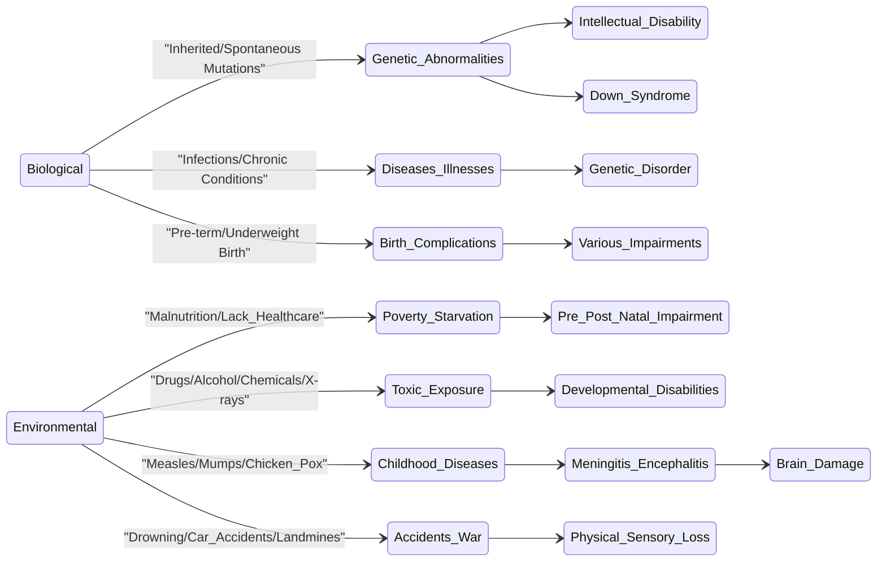

# Definition
Before proceeding, ensure you master [[Impairment]].
[[Causes_of_Impairment]] refers to the identifiable biological and environmental factors that lead to the "absence of or loss of functioning in a body part". These causes can range from genetic abnormalities and diseases to malnutrition, exposure to toxins, and unfortunate accidents. Understanding these causes is crucial for prevention, early intervention, and addressing the root medical or environmental contributors to [[Impairment]]. A simpler way to think about it is like identifying what "broke" a specific part of a machine: was it a faulty internal component (biological) or an external impact (environmental)?

# The Mental Model
Imagine a complex biological system, like a delicate ecosystem. The "causes of impairment" are like various stressors that can disrupt this ecosystem's balance. Some stressors are internal, inherent to the system itself (biological, like a genetic mutation in a species). Others are external, coming from the environment (environmental, like pollution or a natural disaster). Both types of stressors can lead to a part of the ecosystem (body part/function) becoming damaged or non-functional.

*Note: This `stateDiagram-v2` illustrates the primary categories of impairment causes (Biological and Environmental), with branches showing specific factors and the types of impairments they can lead to. It emphasizes the pathways from cause to effect.*

# Context & Framework
### The "Pilot's Checklist" (Do Not Skip)
Identifying the [[Causes_of_Impairment]] is like running a diagnostic checklist for a complex system. The primary categories are `Biological` and `Environmental`. Within `Biological`, factors like genetic abnormalities, certain diseases, and birth complications are critical. Under `Environmental`, issues such as poverty, exposure to toxins, childhood diseases, and accidents are key. A thorough checklist approach ensures that all potential contributing factors are considered when trying to understand the origin of an impairment.

# The Mastery Deep Dive
### The "It's Not Working!" - The Fix-it Guide
When an [[Impairment]] manifests, understanding its cause is the first step in a "fix-it guide."
1.  **Biological Causes:** These are often intrinsic to the body's systems.
    *   **Genetic Factors:** Abnormalities in genes (e.g., Down syndrome), genetic inheritance, and spontaneous mutations can lead to intellectual and multiple impairments. Sometimes, diseases or over-exposure to X-rays can induce genetic disorders.
    *   **Perinatal Issues:** Pre-term or underweight births are also significant biological factors that can result in various forms of impairment.
2.  **Environmental Causes:** These arise from external interactions with the individual.
    *   **Socio-economic Factors:** Poverty, malnutrition, and lack of access to healthcare, particularly during pre- and postnatal periods, can profoundly affect child development and cause impairment.
    *   **Toxic Exposures:** Maternal use of drugs, alcohol, tobacco, and exposure to toxic chemicals (e.g., lead, mercury) or certain illnesses (e.g., rubella, toxoplasmosis) during pregnancy can cause intellectual and other disabilities.
    *   **Childhood Illnesses:** Diseases like whooping cough, measles, and chicken pox, if leading to meningitis or encephalitis, can cause irreversible brain damage.
    *   **Accidents & Conflict:** Traumatic events such as drowning, car accidents, falls, landmines, or war can result in significant physical and sensory losses.

### The "Wikipedia One-Liner" (The rigorous exam definition)
The causes of impairment are the etiological factors, categorized broadly into biological (intrinsic, e.g., genetic, congenital) and environmental (extrinsic, e.g., toxic exposure, trauma, socio-economic deprivation) determinants, that directly contribute to the physiological or psychological absence or loss of bodily function.

# Constraints & Limitations
### The Warning Lights: Signs of Trouble
A critical trap when assessing [[Causes_of_Impairment]] is overlooking the "warning lights" – early indicators or risk factors that, if ignored, significantly increase the likelihood of impairment. For instance, the adverse effects of poverty, starvation, and lack of access to healthcare are major warning lights during pre- and postnatal periods. Similarly, maternal exposure to drugs or toxins and common childhood diseases without proper immunization are red flags. Failing to identify and act on these warning lights due to societal neglect or lack of awareness can lead to preventable impairments.

# Significance & Application
Understanding the [[Causes_of_Impairment]] is vital for public health initiatives, medical research, and policy development focused on prevention and early intervention. It enables targeted campaigns for maternal and child health, improved nutrition, immunization programs, and safety regulations to minimize accidents. This knowledge empowers societies to reduce the incidence of preventable impairments and improve overall population health.

# The Worked Example
Consider a child born with intellectual disability. We need to investigate potential causes.

**Step 1: Investigate Biological Causes.**
*   **Genetic history:** Are there known genetic conditions in the family? Could it be Down syndrome or another chromosomal abnormality?
*   **Maternal health during pregnancy:** Was the mother exposed to any diseases (e.g., rubella) or toxins? Were there any birth complications like prematurity?
    *   If genetic abnormalities are detected, it points to a `Biological` cause.

**Step 2: Investigate Environmental Causes.**
*   **Maternal lifestyle:** Did the mother use drugs, alcohol, or tobacco during pregnancy?
*   **Socio-economic conditions:** Was there severe maternal malnutrition or lack of prenatal care?
*   **Childhood illnesses:** Did the child suffer from severe infections like meningitis after birth?
*   **Exposure to toxins:** Was the child exposed to lead or mercury?
    *   If, for example, severe maternal malnutrition is identified, it points to an `Environmental` cause.

# The Proving Ground
*Test your mastery. Cover the solutions below to test yourself first.*

### Level 1: The Sanity Check (Verification)
**The Tool Check:** What are the two main scientific categories of causes for impairment?
> **Solution:** Biological and Environmental.

### Level 2: The Crucible (Mastery & Edge Cases)
**The Disaster Drill:** A child from a low-income family develops a severe hearing impairment after repeated, untreated ear infections during infancy. The family had limited access to healthcare due to financial constraints and geographic isolation. While the immediate cause of the hearing damage is biological (the infection), what "warning lights" (systemic issues) were blinking that highlight the predominant *category* of cause for this impairment from a broader societal perspective, and what could have been the "immediate recovery step" to prevent it?
> **Solution:** While the direct damage to the ear (biological) caused the hearing impairment, the predominant *category* of cause from a broader societal perspective is **Environmental**. The "warning lights" were the systemic issues of **poverty, lack of access to healthcare, and geographic isolation**. These environmental factors prevented early diagnosis and treatment of the ear infections. The "immediate recovery step" (or preventative measure) would have been to ensure accessible and affordable healthcare for the family, providing timely treatment for the ear infections to prevent irreversible damage and the subsequent impairment. This highlights how environmental disadvantages can indirectly lead to biological impairments.

# Key Takeaways
*   Impairments are caused by two major categories: Biological (e.g., genetics, birth complications) and Environmental (e.g., poverty, toxic exposure, accidents).
*   Biological causes originate internally, while environmental causes stem from external factors and interactions.
*   Understanding these causes is crucial for effective prevention, early intervention, and public health strategies.

# Knowledge Graph Connections
| Concept                     | Connection / Relationship                                                          |
| :
-------------------------- | :
--------------------------------------------------------------------------------- |
| [[Impairment]]              | This concept details the specific origins and factors leading to various impairments. |
| [[Specific_Types_of_Impairments]] | Understanding causes helps in categorizing and preventing different types of impairments. |
| [[Vulnerability]]           | Environmental causes of impairment, like poverty, often overlap with factors contributing to vulnerability. |
---