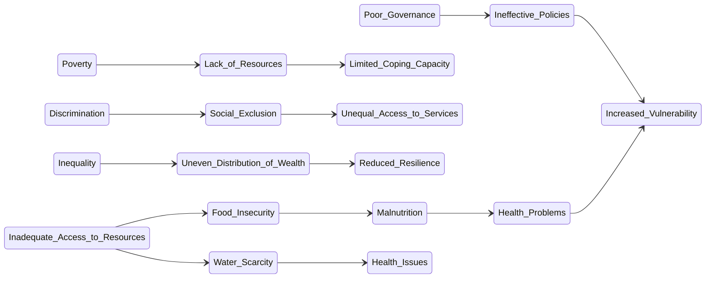

# Definition
Before proceeding, ensure you master [[Vulnerability]].
[[Causes_of_Vulnerability]] refer to the various factors, both systemic and situational, that increase an individual's or community's exposure to harm and diminish their capacity to cope. These include poor governance, poverty, discrimination, inequality, and inadequate access to resources and livelihoods. Understanding these causes is essential for developing effective strategies to mitigate [[Vulnerability]] and build resilience. A simpler way to think about it is like identifying all the reasons why a person might be susceptible to getting sick: it could be a weak immune system (internal factor) or exposure to a virus (external factor).

# The Mental Model
Imagine a sturdy ship at sea. Its "vulnerability" to sinking isn't just about a hole in its hull (an immediate threat). It's also about things like whether the crew is well-trained (poor governance if not), if the ship has enough supplies (poverty), if some crew members are not allowed access to safety equipment (discrimination), or if the lifeboats are insufficient for everyone (inequality). All these factors contribute to the ship's overall susceptibility to disaster.

*Note: This `stateDiagram-v2` illustrates the interconnected web of factors that contribute to vulnerability. It shows how poor governance, poverty, discrimination, inequality, and inadequate access to resources lead to various conditions that ultimately increase overall vulnerability.*

# Context & Framework
### The "Pilot's Checklist" (Do Not Skip)
When assessing [[Causes_of_Vulnerability]], a rigorous checklist is essential. Key factors include:
*   **Poor Governance:** Weak institutions, corruption, and lack of accountability.
*   **Poverty:** Limited financial resources, lack of assets, and insecure livelihoods.
*   **Discrimination:** Marginalization based on race, gender, religion, or other characteristics.
*   **Inequality:** Uneven distribution of resources, power, and opportunities.
*   **Inadequate Access to Resources and Livelihoods:** Lack of access to education, healthcare, clean water, land, or stable employment.
This comprehensive checklist helps ensure that no critical contributing factor is overlooked.

# The Mastery Deep Dive
### The "It's Not Working!" - The Fix-it Guide
When a community or group is identified as vulnerable, understanding the [[Causes_of_Vulnerability]] is the essential "fix-it guide" to intervene effectively:
1.  **Poor Governance:** Ineffective policies, corruption, and a lack of transparency can directly lead to a misallocation of resources, weak infrastructure, and a failure to protect citizens, thereby increasing their exposure to harm.
2.  **Poverty:** This is a fundamental cause, limiting access to essential services like healthcare, education, and safe housing, and reducing the capacity of individuals to recover from shocks (e.g., natural disasters, economic downturns).
3.  **Discrimination:** Systemic discrimination based on factors like ethnicity, gender, or disability can lead to social exclusion, unequal opportunities, and marginalization, making certain groups disproportionately susceptible to adverse impacts.
4.  **Inequality:** The uneven distribution of wealth, power, and opportunities creates stark differences in resilience. Those with fewer resources are less able to prepare for or recover from crises.
5.  **Inadequate Access to Resources and Livelihoods:** A lack of access to productive assets (e.g., land, capital), education, stable employment, healthcare, or clean water directly exposes individuals to various harms, from food insecurity to health crises.

### The "Wikipedia One-Liner" (The rigorous exam definition)
The causes of vulnerability are the systemic conditions, including governance failures, socio-economic disparities, discriminatory practices, and resource inequities, that collectively enhance the susceptibility of individuals or communities to hazards and diminish their inherent capacity for resilience and recovery.

# Constraints & Limitations
### The Warning Lights: Signs of Trouble
A crucial trap in addressing [[Causes_of_Vulnerability]] is ignoring the "warning lights" that signal underlying systemic issues. For instance, high rates of chronic malnutrition despite sufficient food production can indicate `Inequality` in food distribution or `Poverty` limiting access. Similarly, persistent ethnic tensions or lack of representation in decision-making are strong indicators of `Social_Vulnerability` driven by `Discrimination`. Failing to acknowledge these systemic warning lights leads to superficial interventions that do not address the root causes, resulting in recurring vulnerability.

# Significance & Application
Understanding [[Causes_of_Vulnerability]] is fundamental for effective humanitarian action, sustainable development, and social justice advocacy. It moves beyond symptomatic relief to addressing the structural issues that create and perpetuate vulnerability. This knowledge empowers governments, NGOs, and communities to design policies and programs that build long-term resilience and promote equitable opportunities for all.

# The Worked Example
Consider a marginalized indigenous community living in a resource-rich area, yet experiencing high levels of poverty and limited access to public services.

**Step 1: Identify Poor Governance.**
*   Lack of representation in local or national decision-making bodies.
*   Government policies that prioritize external corporate interests over indigenous land rights or resource management.

**Step 2: Identify Poverty.**
*   Low income levels, lack of stable employment opportunities for community members.
*   Limited access to capital or credit for economic development initiatives.

**Step 3: Identify Discrimination.**
*   Historical and ongoing discrimination leading to exclusion from mainstream economic and political systems.
*   Cultural and linguistic barriers that hinder access to services provided in dominant languages.

**Step 4: Identify Inequality.**
*   Uneven distribution of the wealth generated from local resources, with benefits primarily accruing to external entities.
*   Significant disparities in access to education, healthcare, and infrastructure compared to non-indigenous populations.

**Step 5: Identify Inadequate Access to Resources and Livelihoods.**
*   Limited control over ancestral lands and natural resources due to external encroachment.
*   Lack of access to quality education or training that would enable diverse livelihood options.

# The Proving Ground
*Test your mastery. Cover the solutions below to test yourself first.*

### Level 1: The Sanity Check (Verification)
**The Tool Check:** Name three known contributing factors to vulnerability.
> **Solution:** Poor governance, poverty, discrimination (or inequality, inadequate access to resource and livelihood).

### Level 2: The Crucible (Mastery & Edge Cases)
**The Disaster Drill:** A coastal fishing community is repeatedly devastated by severe storms. While the `Physical_Vulnerability` (proximity to the coast) is evident, identify two `Causes_of_Vulnerability` (from the broader list) that might be exacerbating their `Economic_Vulnerability` and preventing their recovery, and explain how these causes act as "warning lights" for systemic issues. What "immediate recovery step" (in terms of policy or intervention) could address these deeper causes?
> **Solution:** Two `Causes_of_Vulnerability` exacerbating their `Economic_Vulnerability` could be **Poverty** and **Inadequate_Access_to_Resources_and_Livelihoods**.
    *   **Poverty:** If the community has limited savings, lack of insurance, and insecure livelihoods (e.g., over-reliance on a single fishing method), each storm pushes them deeper into poverty, making recovery harder. This acts as a warning light for systemic economic disparities.
    *   **Inadequate_Access_to_Resources_and_Livelihoods:** If they lack access to alternative employment opportunities, capital for rebuilding boats/homes, or government relief funds, their economic recovery is severely hampered. This acts as a warning light for structural inequalities in resource distribution and support systems.
The "immediate recovery step" could be to establish a **community-led microfinance scheme** to provide low-interest loans for rebuilding, combined with **vocational training programs** to diversify livelihoods beyond fishing, and advocating for **government-subsidized disaster insurance** tailored for coastal communities. These interventions address the systemic economic and resource-access issues, not just the physical threat.

# Key Takeaways
*   Vulnerability is caused by systemic factors like poor governance, poverty, discrimination, inequality, and inadequate access to resources.
*   These causes create and perpetuate conditions that increase susceptibility to harm and reduce coping capacity.
*   Addressing the root causes of vulnerability is critical for building resilience and promoting social justice.

# Knowledge Graph Connections
| Concept                     | Connection / Relationship                                                                   |
| :
-------------------------- | :
------------------------------------------------------------------------------------------ |
| [[Vulnerability]]           | This concept explains the fundamental factors that contribute to the state of vulnerability.  |
| [[Categories_of_Vulnerability]] | The causes of vulnerability often manifest and are classified within these categories.      |
| [[Vulnerable_Groups_and_Characteristics]] | Specific vulnerable groups are disproportionately affected by these underlying causes.   |
---