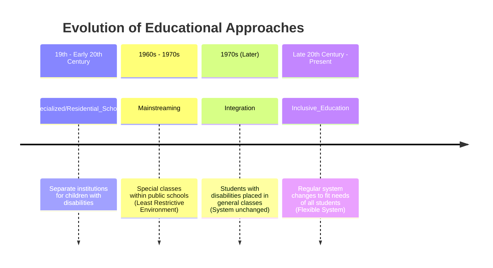

# Definition
Before proceeding, ensure you master [[Disability]].
[[Educational_Approaches_Towards_Inclusion]] refers to the historical progression and various methodologies adopted in educational systems to address the needs of children with disabilities, moving from segregated to more integrated and ultimately inclusive settings. These approaches include Specialized/Residential Schools, Mainstreaming, Integration, and Inclusive Education, each representing a distinct philosophy and practice in fostering educational access and participation. A simpler way to think about it is like the evolution of transportation: from separate carts (specialized schools) to shared roads with specific lanes (mainstreaming/integration) to a completely integrated and universally designed transit system (inclusive education).

# The Mental Model
Imagine a playground. Initially, children with disabilities were in a completely separate playground (Specialized Schools). Then, they were allowed into the main playground but had to stick to a designated small area (Mainstreaming). Later, they could play anywhere on the main playground, but the equipment wasn't changed for them, so they still struggled (Integration). Finally, the playground was completely redesigned with universally accessible equipment so *all* children could play together easily (Inclusive Education).

*Note: This `timeline` illustrates the historical development of educational approaches for children with disabilities, showing the progression from segregated specialized schools to the modern concept of inclusive education, highlighting key shifts in philosophy and practice.*

# Context & Framework
### The Problem: Why Did We Invent This?
The "invention" of different [[Educational_Approaches_Towards_Inclusion]] stemmed from the persistent problem of how to provide education for children with disabilities. Early societies often excluded or segregated them. As human rights and educational philosophies evolved, there was a growing recognition that these children had a right to education, leading to various attempts to integrate them into the system, each seeking to solve the problem of access and participation more effectively than the last.

# The Mastery Deep Dive
### Version 1.0 vs. Today: The Journey to Inclusive Education
The evolution of educational approaches reflects a profound paradigm shift:
1.  **Specialized/Residential Schools (Version 1.0):** Established in the 19th and 20th centuries, these were separate institutions exclusively for children with disabilities (e.g., schools for the deaf, blind). They offered specialized education but enforced segregation.
2.  **Mainstreaming (Version 2.0 - 1960s-70s):** Introduced special needs education classes within public schools, aiming for a "least restrictive environment." Children with disabilities were placed in general classes for part of the day, but their primary education was often separate.
3.  **Integration (Version 3.0 - 1970s):** Focused on placing students with disabilities directly into general classrooms, but critically, without changing the regular school system. The child was expected to "fit the system," characterized by "round pegs for round holes" and the child needing to adapt or fail.
4.  **Inclusive Education (Version 4.0 - Late 20th Century to Present):** This approach mandates that the *regular education system itself* must change to fit the diverse needs of *all* students, including those with disabilities. It is characterized by a flexible system, acknowledging that "children are different," and the belief that "all children can learn" through system adaptation.

### The "Same Story, Different Setting" (Connect historical event to modern tech pattern)
The evolution of educational approaches can be compared to the design of software applications for diverse users.
*   **Specialized Schools:** Analogous to creating entirely separate, bespoke applications for users with specific needs, which are often costly and create silos.
*   **Mainstreaming/Integration:** Similar to providing accessibility "patches" or add-ons to a standard application, where the core design remains unchanged, and users must adapt to the existing interface.
*   **Inclusive Education:** Represents a universal design approach, where the application (educational system) is built from the ground up to be inherently flexible, customizable, and accessible to the widest possible range of users, regardless of their individual characteristics. This ensures that the system itself adapts to diverse user needs, rather than forcing users to adapt to a rigid system.

# Constraints & Limitations
### The "Square Peg, Round Hole" Trap: Integration's Fatal Flaw
The primary constraint and a "trap" in the `Integration` approach was its fundamental philosophy: "Change the child to fit the system." This meant that while children with disabilities were physically present in general classrooms, the educational environment, curriculum, and teaching methods remained largely rigid and unadapted. This created a "square peg, round hole" scenario where students were set up to fail if they could not conform, implicitly reinforcing a deficit model and hindering true educational equity.

# Significance & Application
Understanding [[Educational_Approaches_Towards_Inclusion]] is crucial for educators, policymakers, and advocates working to create equitable and effective learning environments. It highlights the progressive shift from exclusion to genuine inclusion, emphasizing systemic change over individual adaptation. This historical perspective informs the development of inclusive curricula, pedagogical strategies, and policies that ensure all learners, regardless of ability, can thrive.

# The Worked Example
Consider a student with a specific learning disability (e.g., dyslexia) attending school through different historical approaches.

**Scenario 1: Specialized/Residential School Era.**
*   **Student's Experience:** The student would likely attend a separate school specifically for children with learning disabilities, entirely removed from mainstream peers.
*   **Focus:** Specialized instruction, but in a segregated setting.

**Scenario 2: Mainstreaming/Integration Era.**
*   **Student's Experience:** The student might spend most of the day in a "special education" classroom for reading and writing, joining general education classes only for non-academic subjects like art or physical education (mainstreaming). Or, they might be placed in a regular classroom but receive minimal adaptations for their dyslexia (integration), leading to potential struggles.
*   **Focus:** Physical presence, but with limited systemic change.

**Scenario 3: Inclusive Education Era.**
*   **Student's Experience:** The student is fully enrolled in a general education classroom. The teacher employs universal design for learning principles: providing texts in multiple formats (audio, digital), offering varied ways for students to demonstrate understanding (oral, written, project-based), and utilizing assistive technologies (text-to-speech software) for all students who benefit. The curriculum is flexible and adapted to meet diverse needs, with in-class support from special education professionals.
*   **Focus:** Systemic change and adaptation to meet the student's needs within the general education environment, ensuring full participation.

# The Proving Ground
*Test your mastery. Cover the solutions below to test yourself first.*

### Level 1: The Sanity Check (Verification)
**The Fact Check:** Which educational approach emphasized that the "system stays the same" and the "child must adapt or fail"?
> **Solution:** Integration.

### Level 2: The Crucible (Mastery & Edge Cases)
**The Lose-Lose Scenario:** A school district is faced with a choice: either invest a significant portion of its limited budget into creating highly specialized, fully equipped classrooms for students with severe developmental disabilities in one central location (effectively a new "specialized school"), or distribute those funds to provide extensive training and resources to *all* teachers in *every* mainstream school to support a wider range of diverse learners. Argue why the latter approach, despite its diffusion of resources, represents a more advanced stage in the `Evolution_of_Disability_Models` towards true inclusion, and explain the long-term "trade-off" for students.
> **Solution:** The latter approach (distributing funds for extensive training and resources to all teachers in every mainstream school) represents a more advanced stage in the `Evolution_of_Disability_Models` towards true inclusion. While the former (centralized specialized classrooms) might seem to offer concentrated resources, it reverts to a `Specialized/Residential_Schools` or `Mainstreaming` model, perpetuating segregation and the idea that students with severe developmental disabilities are "separate." The latter embodies the principles of `Inclusive_Education`: it actively changes the *system* (mainstream schools) to accommodate diverse learners.
    The long-term "trade-off" for students is between **specialized, potentially isolated expertise** (centralized specialized classrooms) versus **widespread, embedded support and social integration** (trained teachers in mainstream schools). While highly specialized classrooms might offer intensive, targeted interventions, they risk social isolation and creating parallel educational tracks. The inclusive approach, by building capacity within mainstream schools, promotes social belonging, models diversity for all students, and prepares students with disabilities for a more integrated societal life, ultimately aligning better with human rights principles of participation and non-discrimination.

# Key Takeaways
*   Educational approaches have evolved from segregated specialized schools to mainstreaming, integration, and finally, inclusive education.
*   Inclusive education mandates systemic change to accommodate diverse learning needs, promoting flexibility and the belief that all children can learn.
*   Older models (specialized schools, integration) often placed the burden of adaptation on the child, contrasting with the systemic adjustments of inclusive education.

# Knowledge Graph Connections
| Concept                     | Connection / Relationship                                                                   |
| :
-------------------------- | :
------------------------------------------------------------------------------------------ |
| [[Disability]]              | These educational approaches aim to address the barriers that contribute to disability in learning environments. |
| [[Evolution_of_Disability_Models]] | Each educational approach reflects the prevailing understanding of disability at different historical periods. |
| [[Disability_Models]]       | The shift towards inclusive education aligns with the principles of the Social and Human Rights-Based Models. |
---