# Definition
Before proceeding, ensure you master [[Impairment]].
[[Specific_Types_of_Impairments]] refers to the categorized classifications of identifiable physical, sensory, cognitive, mental health, and health-related conditions that constitute an [[Impairment]]. These classifications provide a framework for understanding the diverse manifestations of the absence or loss of functioning in a body part. Examples include Visual Impairment, Hearing Impairment, Intellectual Disability, and various health-related conditions like heart disease or epilepsy.

# The Mental Model
Imagine a vast library, and "Impairment" is the main subject area. "Specific Types of Impairments" are like the individual sections within that library: the "Visual Impairment" section, the "Hearing Impairment" section, the "Health-Related Impairment" section, and so on. Each section contains detailed information about a particular kind of book (impairment), helping to organize and understand the vast array of conditions.

```mermaid
graph TD
    A[Impairment] --> B(Visual_Impairment)
    A --> C(Hearing_Impairment)
    A --> D(Specific_Learning_Disability)
    A --> E(Speech_and_Language_Impairments)
    A --> F(Autism)
    A --> G(Emotional_and_Behavioral_Disorders)
    A --> H(Intellectual_Disability)
    A --> I(Physical_Orthopedic_Impairments)
    A --> J(Health_Related_Impairments)
    A --> K(Multiple_Impairment)

    J --> J1(Heart_Disease)
    J --> J2(Cystic_Fibrosis)
    J --> J3(AIDS)
    J --> J4(Hemophilia)
    J --> J5(Asthma)
    J --> J6(Diabetes)
    J --> J7(Nephrosis_Nephritis_Kidney_Disorders)
    J --> J8(Sickle_Cell_Anemia)
    J --> J9(Leukemia)
    J --> J10(Lead_Poisoning_Disorder)
    J --> J11(Rheumatic_Fever)
    J --> J12(Tuberculosis)
    J --> J13(Cancer)
    J --> J14(Epilepsy)
    J --> J15(Leprosy)

    K --> K1(Deaf_Blindness)
```

*Note: This `graph TD` diagram illustrates a hierarchical classification of various types of impairments, branching from the main concept of Impairment down to specific examples, including a detailed enumeration of health-related impairments.*

# Context & Framework
### The Family Tree
The [[Specific_Types_of_Impairments]] form a complex "family tree" under the broader umbrella of [[Impairment]]. This taxonomy helps to differentiate between conditions that affect different bodily functions or cognitive processes. For example, a `Visual_Impairment` is distinct from an `Intellectual_Disability`, though both are impairments. This categorization is essential for accurate diagnosis, specialized support, and tailored educational approaches.

# The Mastery Deep Dive
### The Comprehensive Taxonomy of Impairments
The major kinds of impairments include:
*   **Sensory Impairments:**
    *   `Visual_Impairment` (generic term for blindness and low vision).
    *   `Hearing_Impairment` (generic term for deafness and hard of hearing).
*   **Developmental/Cognitive Impairments:**
    *   `Specific_Learning_Disability` (e.g., dyslexia, dysgraphia, dyscalculia).
    *   `Autism` (a neurodevelopmental disorder).
    *   `Intellectual_Disability` (significant limitations in intellectual functioning and adaptive behavior).
*   **Communication Impairments:**
    *   `Speech_and_Language_Impairments` (including fluency disorders).
*   **Mental Health/Behavioral Impairments:**
    *   `Emotional_and_Behavioral_Disorders`.
*   **Physical Impairments:**
    *   `Physical_Orthopedic_Impairments`.
*   **Health-Related Impairments:** A broad category encompassing chronic and acute health conditions such as `Heart_Disease`, `Cystic_Fibrosis`, `AIDS`, `Hemophilia`, `Asthma`, `Diabetes`, `Kidney_Disorders` (Nephrosis & Nephritis), `Sickle_Cell_Anemia`, `Leukemia`, `Lead_Poisoning_Disorder`, `Rheumatic_Fever`, `Tuberculosis`, `Cancer`, `Epilepsy`, and `Leprosy`.
*   **Multiple Impairments:** Such as `Deaf_Blindness`, where an individual experiences more than one significant impairment concurrently.

### The "Wikipedia One-Liner" (The rigorous exam definition)
Specific types of impairments are the recognized, categorized distinctions of an absence or loss of functioning in a body part, encompassing a broad spectrum of sensory, physical, cognitive, communication, mental health, and systemic health conditions, often leading to activity limitations.

# Constraints & Limitations
### The Categorization Trap: Overlooking Nuance
A significant trap in dealing with [[Specific_Types_of_Impairments]] is the tendency to reduce individuals to their diagnostic label, overlooking the unique severity, co-occurring conditions, and personal experiences that define each person's impairment. Categorization, while necessary for identifying general needs and designing programs, can become a constraint if it leads to a "one-size-fits-all" approach that fails to acknowledge the vast heterogeneity within each impairment type. For example, two individuals with `Autism` may have vastly different support needs and strengths.

# Significance & Application
Detailed classification of [[Specific_Types_of_Impairments]] is critical for medical diagnosis, specialized educational planning, therapeutic interventions, and the development of assistive technologies. It allows for targeted research, resource allocation, and the creation of support systems that address the distinct challenges associated with each type of impairment, ultimately enhancing the quality of life and participation for affected individuals.

# The Worked Example
A school is developing an Individualized Education Program (IEP) for a student.

**Step 1: Identify the Impairment Type.**
The student has been diagnosed with Dyslexia. This falls under `Specific_Learning_Disability`, which is a `Specific_Type_of_Impairment`.

**Step 2: Understand the Characteristics of This Type.**
Dyslexia typically involves difficulties with reading, decoding, and sometimes spelling, despite normal intelligence.

**Step 3: Tailor Support Based on Type.**
Based on the specific type (Dyslexia), the IEP might include:
*   Phonological awareness training.
*   Multi-sensory teaching methods.
*   Extended time for reading and writing tasks.
*   Use of text-to-speech software.

# The Proving Ground
*Test your mastery. Cover the solutions below to test yourself first.*

### Level 1: The Sanity Check (Verification)
**The Neighbor Check:** List two sensory impairments.
> **Solution:** Visual Impairment and Hearing Impairment.

### Level 2: The Crucible (Mastery & Edge Cases)
**The Sort:** A child is frequently absent from school due to chronic asthma attacks. While asthma is a physical health condition, and thus an [[Impairment]], categorize the specific type of impairment it falls under, and explain how its chronic nature creates a distinct challenge for educational access compared to, for example, a temporary broken leg.
> **Solution:** Chronic asthma falls under the `Health_Related_Impairments` category. Its chronic nature creates a distinct challenge for educational access because it involves ongoing, unpredictable episodes that lead to sustained or intermittent absences, disrupting consistent learning and potentially requiring continuous management and accommodation. Unlike a temporary broken leg, which has a clear recovery timeline, chronic asthma requires long-term management and creates an ongoing risk of educational disruption, demanding flexible and continuous support from the school system to ensure the child's right to education is not impaired.

# Key Takeaways
*   Specific types of impairments categorize diverse conditions affecting body functions, ranging from sensory and physical to cognitive and health-related.
*   These classifications aid in diagnosis, specialized support, and tailored interventions for individuals with impairments.
*   Examples include visual impairment, intellectual disability, autism, and chronic health conditions like diabetes or epilepsy.

# Knowledge Graph Connections
| Concept                     | Connection / Relationship                                                                   |
| :
-------------------------- | :
------------------------------------------------------------------------------------------ |
| [[Impairment]]              | This concept provides the detailed classification and examples of various impairments.      |
| [[Causes_of_Impairment]]    | Different causes contribute to the onset and manifestation of these specific types of impairments. |
| [[Educational_Approaches_Towards_Inclusion]] | Understanding specific impairment types helps tailor inclusive educational strategies. |
---