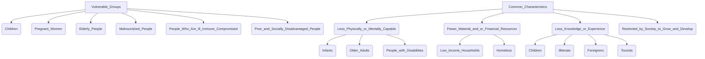

# Definition
Before proceeding, ensure you master [[Vulnerability]].
[[Vulnerable_Groups_and_Characteristics]] refers to the specific populations identified as being disproportionately susceptible to harm, injustice, or adverse impacts, alongside the defining features that contribute to their heightened [[Vulnerability]]. These groups often include children, pregnant women, elderly people, malnourished individuals, and those who are ill or immune-compromised. Their characteristics, such as limited physical/mental capability or fewer material/financial resources, amplify their exposure and reduce their coping capacity.

# The Mental Model
Imagine a convoy traveling through a dangerous landscape. While all vehicles face risks, certain ones are inherently more susceptible to damage or attack. The "Vulnerable Groups" are like the cars in the convoy carrying children, the elderly, or essential medical supplies; they require extra protection. Their "Characteristics" are the reasons why they need that extra protection, such as being slower, less armored, or carrying critical cargo.

*Note: This `graph TD` diagram illustrates the various "Vulnerable Groups" and then branches to their "Common Characteristics," further detailing examples within each characteristic, showing the interconnectedness of groups and their defining features.*

# Context & Framework
### The Family Tree
The concept of [[Vulnerable_Groups_and_Characteristics]] operates like a "family tree" within the broader domain of [[Vulnerability]]. Specific populations form distinct branches, each exhibiting a set of defining characteristics that elevate their susceptibility. For example, "Children" as a group share characteristics like being "less physically or mentally capable" and having "less knowledge or experience," which collectively render them vulnerable. This categorization helps to understand the multifactorial nature of their [[Vulnerability]].

# The Mastery Deep Dive
### The Exhaustive List of At-Risk Populations and Their Defining Features
Key vulnerable groups and their common characteristics include:
*   **Children:** Less physically or mentally capable, less knowledge or experience.
*   **Pregnant Women:** Physiologically more susceptible to certain harms, limited mobility.
*   **Elderly People:** Often less physically or mentally capable, sometimes with fewer financial resources.
*   **Malnourished People:** Physically weakened, compromised immune systems.
*   **People Who Are Ill or Immune-Compromised:** Physically weakened, higher susceptibility to disease.
*   **Poor and Socially Disadvantaged People:** Fewer material and/or financial resources, restricted by society to grow and develop.
    *   **Common Characteristics Across Groups:**
        *   **Less physically or mentally capable:** (e.g., infants, older adults, people with disabilities).
        *   **Fewer material and/or financial resources:** (e.g., low-income households, homeless).
        *   **Less knowledge or experience:** (e.g., children, illiterate individuals, foreigners, tourists).
        *   **Restricted by society to grow and develop according to their needs and potentials:** (This often encompasses discriminatory practices and systemic barriers).

### The "Wikipedia One-Liner" (The rigorous exam definition)
Vulnerable groups are identifiable populations disproportionately exposed to risks and lacking adequate coping mechanisms, primarily due to inherent or socially imposed characteristics such as age, health status, socioeconomic standing, or limited access to resources, rendering them susceptible to adverse outcomes.

# Constraints & Limitations
### The Labeling Trap: Reducing Individuals to Categories
A significant trap in identifying [[Vulnerable_Groups_and_Characteristics]] is the risk of reducing individuals to mere labels, which can lead to stigmatization or a generalized, rather than individualized, approach to support. While categorization is helpful for policy and broad intervention, it becomes a constraint if it ignores the unique resilience, agency, and specific needs of individuals within these groups. For example, not all elderly people are equally vulnerable; their socioeconomic status, health, and social support networks play crucial roles. This "labeling trap" can obscure individual strengths and lead to generic, ineffective solutions.

# Significance & Application
Identifying [[Vulnerable_Groups_and_Characteristics]] is foundational for designing targeted social protection programs, disaster relief efforts, public health initiatives, and human rights interventions. It ensures that resources are directed to those most in need, and that policies are developed to address specific vulnerabilities, thereby promoting equity and reducing disparities.

# The Worked Example
Consider a group of refugees fleeing a conflict zone.

**Step 1: Identify the Vulnerable Group.**
Refugees, particularly those with specific needs, fall into multiple categories of vulnerable groups.

**Step 2: Identify Associated Characteristics.**
*   **Fewer material and/or financial resources:** They have likely lost their homes, possessions, and sources of income.
*   **Less knowledge or experience:** They may be unfamiliar with the language, laws, or customs of their host country.
*   **Restricted by society to grow and develop:** They may face discrimination, legal barriers to employment, or limited access to education and healthcare due to their refugee status.
*   If children or pregnant women are among them, they also possess the `Less_Physically_or_Mentally_Capable` characteristic.

**Step 3: Tailor Interventions.**
Based on these characteristics, interventions would be tailored to provide:
*   Emergency aid (food, shelter, medical care).
*   Language and cultural orientation programs.
*   Legal assistance to secure status and rights.
*   Educational support and vocational training.

# The Proving Ground
*Test your mastery. Cover the solutions below to test yourself first.*

### Level 1: The Sanity Check (Verification)
**The Neighbor Check:** List three examples of commonly known vulnerable groups.
> **Solution:** Children, pregnant women, elderly people (or malnourished people, people who are ill or immune-compromised).

### Level 2: The Crucible (Mastery & Edge Cases)
**The Sort:** A remote indigenous community, largely self-sufficient, faces a sudden, severe drought that threatens their traditional farming and water sources. They have strong social bonds and traditional knowledge, but very limited access to external markets or government support. Identify the primary `Characteristics` that make this community vulnerable in this scenario, and explain how some characteristics (like strong social bonds) might *reduce* vulnerability while others exacerbate it.
> **Solution:** The primary `Characteristics` that make this community vulnerable in this scenario are **`Fewer_Material_and_or_Financial_Resources`** (due to limited access to external markets or government support, making them highly dependent on their own drought-affected resources) and potentially **`Less_Knowledge_or_Experience`** regarding modern drought-mitigation techniques or diverse income streams outside their traditional practices.
    *   However, their strong social bonds and traditional knowledge, while not directly listed as characteristics that *create* vulnerability, are critical `Characteristics` that would **reduce their `Social_Vulnerability`** by fostering collective action, internal support, and traditional coping mechanisms.
    *   The drought exacerbates their `Vulnerability` particularly through the `Fewer_Material_and_or_Financial_Resources` characteristic, as their traditional livelihoods are directly threatened, and they lack external buffers. This highlights how vulnerability is a complex interplay of inherent characteristics, external threats, and existing coping capacities.

# Key Takeaways
*   Vulnerable groups include children, pregnant women, the elderly, malnourished individuals, and those with health conditions, as well as the poor and socially disadvantaged.
*   Common characteristics contributing to their vulnerability include reduced physical/mental capability, limited resources, and lack of knowledge or societal restrictions.
*   Identifying these groups and their characteristics is essential for targeted support and equitable policy development.

# Knowledge Graph Connections
| Concept                     | Connection / Relationship                                                                   |
| :
-------------------------- | :
------------------------------------------------------------------------------------------ |
| [[Vulnerability]]           | This concept identifies the specific populations and their features contributing to vulnerability. |
| [[Categories_of_Vulnerability]] | Vulnerable groups often experience multiple, overlapping categories of vulnerability (e.g., poor people face economic and social vulnerability). |
| [[Causes_of_Vulnerability]] | The underlying causes of vulnerability (e.g., discrimination) often create these vulnerable groups or exacerbate their characteristics. |
---