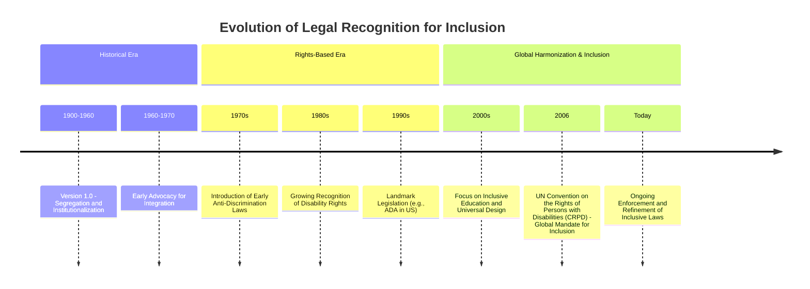

# Definition
Before proceeding, ensure you master [[Rationale_for_Inclusion]].
Legal Foundations of Inclusion refer to the fundamental principles of human rights and justice that underpin the mandate for inclusive practices. These foundations assert that all individuals possess an inherent right to full participation, and that any exclusion or discrimination based on disability is illegitimate and legally indefensible. They provide the compelling legal arguments for upholding equality and preventing segregation within society.

# The Mental Model
Imagine a sturdy courthouse. The [[Legal_Foundations_of_Inclusion]] are the very laws and ethical precedents inscribed on its walls: "All individuals have the right to learn and live together." These are the non-negotiable rules that dictate how society *must* operate, ensuring that no one is unjustly excluded from the courthouse itself or from the rights it represents. Any attempt to bar someone based on their disability is a direct violation of these foundational legal principles.

# Context & Framework
### The Right to Equal Participation and Non-Discrimination
The legal rationale for inclusion is unequivocally rooted in human rights. It asserts that all individuals inherently possess the right to learn and live together, emphasizing that human beings should never be devalued or discriminated against through exclusion or segregation on the basis of their disability. This foundation firmly declares that there are no legitimate grounds for separating individuals, particularly children in educational contexts, due to their disabilities.

# The Mastery Deep Dive
### Version 1.0 vs. Today: Legal Evolution

*Note: This `timeline` illustrates the historical evolution of legal recognition for inclusion, from early segregation to modern rights-based mandates.*

The legal landscape surrounding inclusion has undergone a significant transformation from "Version 1.0" (segregation and institutionalization) to the "Today" model of rights-based inclusion. Historically, legal frameworks often permitted or even mandated the separation of individuals with disabilities. However, over time, a growing recognition of universal human rights led to the development of anti-discrimination laws and specific disability rights legislation. The UN Convention on the Rights of Persons with Disabilities (CRPD) in 2006 marked a global shift, firmly establishing inclusion as a legal imperative. This evolution reflects the understanding that denying participation based on disability is a violation of fundamental human rights, moving away from a medical model to a social model of disability that demands societal adaptation, not individual "fixing".

### The Core Pillars of Legal Inclusion
1.  **Right to Learn and Live Together:** This is the foundational principle, asserting that all individuals, regardless of ability, have an inherent right to participate fully in mainstream society and educational settings.
2.  **No Devaluation or Discrimination:** Human beings should never be devalued or discriminated against by being excluded or separated due to their disability. This directly challenges practices that undermine an individual's dignity and worth.
3.  **No Legitimate Reasons for Separation:** The legal framework asserts that there are no valid justifications for separating children (or individuals in general) for their education or participation based on disability. This directly targets the historical practice of segregated schooling.

# Constraints & Limitations
### The "Same Story, Different Setting": The "Law without Implementation" Trap
A critical trap in legal inclusion is the existence of strong legislation that mandates inclusion, but without accompanying clear directives, strategies, and guidelines for implementation. This creates a "law without implementation" scenario, where the legal foundation is theoretically sound, but actual practice falls short. For example, a country might have a law stating that all public buildings must be accessible, but if there are no specific building codes, enforcement mechanisms, or funding allocations, the law remains largely aspirational. The [[Institutional_Barriers]] note explicitly highlights this issue, where policies "often lack directives, strategies and guidelines for implementation". This demonstrates that a legal framework, no matter how robust, is ineffective without strong institutional support and a commitment to operationalizing its principles.

# Significance & Application
The legal foundations of inclusion are paramount for human rights activists, lawyers, policymakers, and advocates for persons with disabilities. They provide the authoritative basis for challenging discriminatory practices, enforcing accessibility standards, and advocating for equitable resource allocation. In educational settings, they mandate inclusive schooling and the provision of necessary accommodations. Professionally, understanding these foundations is essential for ensuring compliance with national and international laws, promoting ethical practices, and contributing to a society where the rights of all individuals are upheld and protected.

# The Worked Example
*Test your mastery. Cover the solutions below to test yourself first.*

### Level 1: The Sanity Check (Verification)
**The Question:** What is the fundamental right that underpins the legal foundation for inclusion, particularly concerning individuals learning and living together?
> **Solution:** The fundamental right is that all individuals have the right to learn and live together.

### Level 2: The Crucible (Mastery & Edge Cases)
**The Scenario:** A country's new constitution includes a strong clause guaranteeing the right to education for all children, without discrimination based on disability. However, the existing national education budget prioritizes funding for traditional mainstream schools and provides very limited resources for teacher training in inclusive pedagogies or for accessible infrastructure modifications in local schools. A significant number of children with disabilities remain in private, specialized institutions or receive no formal education due to lack of suitable options.
**The Question:** Explain how this scenario, despite a strong constitutional provision, demonstrates a failure to fully uphold the [[Legal_Foundations_of_Inclusion]], specifically concerning the "no legitimate reasons to separate children" principle, and identify the type of barrier predominantly at play.
> **Solution:** This scenario demonstrates a failure to fully uphold the [[Legal_Foundations_of_Inclusion]] because:
> 1.  **Violation of "No Legitimate Reasons for Separation":** Despite the constitutional guarantee, the lack of resources for inclusive training and infrastructure effectively creates a *de facto* segregation. Children with disabilities are either forced into private, specialized institutions or denied education entirely because mainstream schools are not equipped to include them. This contradicts the principle that there are "no legitimate reasons to separate children for their education". The state is not creating the conditions for exercising the right.
> 2.  **Type of Barrier:** The predominant barrier at play here is [[Institutional_Barriers]]. While a legal framework (the constitution) exists, the critical failure lies in the "policies and action plans" (the national education budget and resource allocation) that "lack directives, strategies and guidelines for implementation". The institutional structures (funding mechanisms, resource priorities) are not aligned with the legal mandate, leading to the continued exclusion of persons with disabilities from mainstream education.

# Key Takeaways
*   Legal foundations for inclusion assert the inherent right of all individuals to learn and live together, free from discrimination or devaluation based on disability.
*   These foundations explicitly state that there are no legitimate reasons for separating individuals for their education or participation due to disability.
*   Effective legal inclusion requires not only strong legislation but also robust institutional support and clear implementation guidelines to overcome systemic barriers.

# Knowledge Graph Connections
| Concept                          | Connection / Relationship                                                                 |
| :
------------------------------- | :
---------------------------------------------------------------------------------------- |
| [[Rationale_for_Inclusion]]      | This is one of the core foundational arguments for the overall rationale of inclusion.      |
| [[Institutional_Barriers]]       | These barriers directly impede the effective implementation of legal foundations for inclusion. |
| [[Social_Foundations_of_Inclusion]] | Both legal and social foundations advocate for integrated living and learning.              |
| [[Educational_Foundations_of_Inclusion]] | Legal frameworks often mandate inclusive education based on these educational principles.   |
---