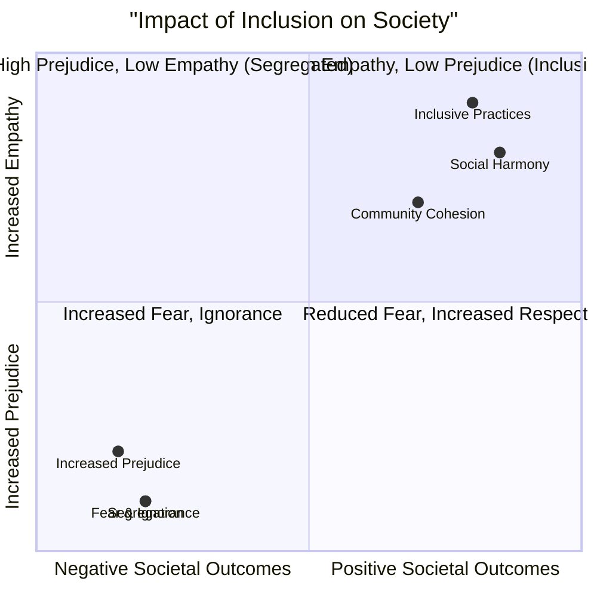

# Definition
Before proceeding, ensure you master [[Rationale_for_Inclusion]].
Social Foundations of Inclusion refer to the arguments that highlight the societal benefits and imperative for fostering inclusive environments, primarily focusing on how integration reduces prejudice, builds understanding, and prepares all individuals for harmonious coexistence within diverse communities. These foundations underscore the transformative impact of inclusion on social dynamics and interpersonal relationships.

# The Mental Model
Imagine a community garden where every type of plant (each individual) is planted together in the same soil, sharing resources and light. The [[Social_Foundations_of_Inclusion]] are the reasons *why* this diverse garden thrives: the plants learn to coexist, support each other's growth, and the overall garden becomes more resilient and beautiful than if each type of plant was grown in a separate, isolated plot. Segregation, in this analogy, would be placing each plant type in its own walled-off section, fostering ignorance about other plants.

# Context & Framework
### The Impact of Segregation vs. Integration on Social Cohesion
The social rationale for inclusion strongly argues against segregation, which inherently teaches individuals to be fearful, ignorant, and breeds prejudice. Conversely, it asserts that all individuals require an education and societal experiences that equip them to develop meaningful relationships and prepare them for active, integrated life within the broader community. Only inclusion possesses the inherent potential to diminish fear and cultivate friendship, respect, and mutual understanding among diverse populations.

# The Mastery Deep Dive
### Who Wins and Who Loses?: Stakeholder Analysis

*Note: This `quadrantChart` illustrates the impact of inclusive vs. segregated practices on societal outcomes, highlighting who "wins" (positive outcomes from inclusion) and who "loses" (negative outcomes from segregation).*

Inclusion, from a social perspective, is a clear "win" for society as a whole. Segregation leads to a "lose-lose" situation, where all stakeholders suffer from increased fear, ignorance, and prejudice. When societies embrace inclusion, everyone gains:
*   **Individuals with disabilities and vulnerable groups:** Gain acceptance, build relationships, and are better prepared for life in the wider community. They are no longer isolated.
*   **Individuals without disabilities:** Learn empathy, respect, and understanding from diverse interactions. They overcome ignorance and prejudice, becoming more tolerant and cooperative citizens.
*   **Society as a whole:** Becomes more cohesive, tolerant, and democratic. It benefits from the contributions of all its members, leading to stronger social fabric and sustainable development.
The "winners" are those who embrace diversity; the "losers" are those who cling to segregation.

### The Transformative Power of Interaction
1.  **Reduces Fear, Ignorance, and Prejudice:** Segregation inherently teaches individuals to be fearful of what is different, fostering ignorance and breeding prejudice against those outside their own group. Inclusion directly counteracts this by facilitating interaction and exposure.
2.  **Develops Relationships and Community Preparedness:** All individuals need environments that allow them to develop meaningful relationships across diverse backgrounds. Inclusive settings prepare everyone for life in a wider, heterogeneous community, fostering essential social skills and adaptability.
3.  **Builds Friendship, Respect, and Understanding:** Inclusion is uniquely capable of reducing the fear that often accompanies difference. Through shared experiences and mutual learning, it cultivates genuine friendships, deepens respect for diverse perspectives, and builds understanding among all members of society.

# Constraints & Limitations
### The Crystal Ball: What Happens Next? - The "Well-Intentioned Segregation" Trap
A significant trap in social inclusion is the "well-intentioned segregation" where separate programs or facilities are created with the aim of providing "better" or "more focused" support for a particular group (e.g., a special club just for students with autism, or a community center exclusively for a specific vulnerable population). While these may offer a sense of safety or specialized care, they inadvertently reinforce the very segregation that the [[Social_Foundations_of_Inclusion]] warns against. Over time, such separation can still foster ignorance and prevent the crucial cross-group interactions necessary to build true friendship, respect, and understanding within the wider community. The "Crystal Ball" predicts that, without active integration, these separate spaces will fail to achieve the broader social benefits of inclusion.

# Significance & Application
The social foundations of inclusion are essential for community organizers, social workers, educators, and anyone involved in fostering harmonious societies. They provide the rationale for initiatives that promote diversity, combat discrimination, and build cohesive communities. In policy-making, they underpin efforts to integrate marginalized groups into mainstream society and to design programs that encourage cross-cultural and cross-ability interactions. Understanding these foundations is crucial for dismantling societal barriers and cultivating environments where every individual feels a sense of belonging and mutual respect.

# The Worked Example
*Test your mastery. Cover the solutions below to test yourself first.*

### Level 1: The Sanity Check (Verification)
**The Question:** According to social foundations, what negative consequences does segregation tend to foster in individuals and communities?
> **Solution:** Segregation teaches individuals to be fearful, ignorant, and breeds prejudice.

### Level 2: The Crucible (Mastery & Edge Cases)
**The Scenario:** A new residential development is planned with two distinct community centers: one designed specifically for seniors with a focus on quiet activities and medical support, and another for young families with playgrounds and active social events. Both centers are well-resourced and accessible within their own design parameters.
**The Question:** Using the [[Social_Foundations_of_Inclusion]], explain how this segregated community center approach, despite good intentions, might inadvertently hinder the development of a truly inclusive society, particularly regarding the reduction of fear and the building of friendship and understanding.
> **Solution:** This segregated approach, despite good intentions, inadvertently hinders the development of a truly inclusive society by creating artificial divisions that go against the [[Social_Foundations_of_Inclusion]]:
> 1.  **Fosters Ignorance and Prejudice (Ageism):** By separating seniors and young families, the design inadvertently "teaches individuals to be fearful, ignorant and breeds prejudice" across age groups. Young families might not learn to appreciate the wisdom and experience of seniors, and seniors might not engage with the energy and perspectives of younger generations. This lack of interaction prevents the natural development of intergenerational empathy and understanding.
> 2.  **Limits Relationship Building:** The social foundation states that "All individuals need an education that will help them develop relationships and prepare them for life in the wider community". By limiting shared spaces and activities, the design restricts opportunities for organic friendships and respect to develop between different age demographics. True inclusion thrives on mixed interactions that naturally reduce fear and build understanding, which are diminished when groups are intentionally kept apart.

# Key Takeaways
*   Segregation fosters fear, ignorance, and prejudice, whereas inclusion actively diminishes these negative social outcomes.
*   Inclusion prepares individuals for life in diverse communities by promoting relationship development, respect, and understanding.
*   It is the only approach with the potential to build genuine friendships, respect, and mutual understanding among all members of society.
*   "Well-intentioned segregation" can inadvertently undermine the broader social benefits of inclusion.

# Knowledge Graph Connections
| Concept                          | Connection / Relationship                                                                 |
| :
------------------------------- | :
---------------------------------------------------------------------------------------- |
| [[Rationale_for_Inclusion]]      | This is one of the core foundational arguments for the overall rationale of inclusion.      |
| [[Educational_Foundations_of_Inclusion]] | Both social and educational foundations highlight the benefits of integrated learning.      |
| [[Foundations_for_Building_Inclusive_Society]] | These social foundations directly contribute to the values and outcomes of an inclusive society. |
| [[Social_and_Attitudinal_Barriers]] | Understanding these foundations helps to actively dismantle prejudice and discriminatory attitudes. |
---