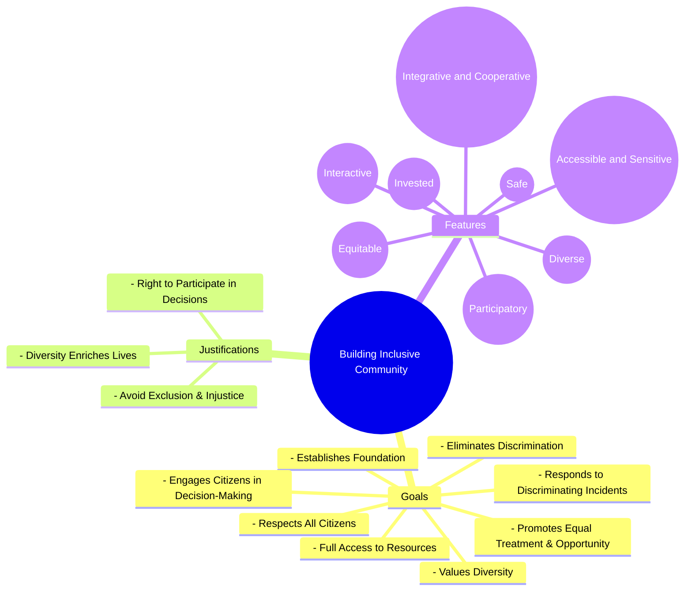

# Definition
Before proceeding, ensure you master Concept_Of_Inclusion and [[Definition_of_Inclusive_Culture]] because building an inclusive community is the active application of inclusive principles at a broader societal level, requiring a foundational understanding of what inclusion is and how it manifests as a culture. Building an inclusive community refers to the **deliberate and continuous process of establishing environments where all citizens are respected, have full access to resources, experience equal treatment and opportunity, and actively participate in decisions that affect their lives**. It is a commitment to eliminate all forms of discrimination and respond quickly to incidents that undermine diversity. Think of it like constructing a resilient city, not just for some, but where every citizen has their voice heard, their needs met, and their safety guaranteed.

# The Mental Model
Imagine a diverse group of people deciding to build a shared home. "Building an Inclusive Community" is the ongoing effort to make sure that home truly serves everyone. This means laying a strong foundation of respect and equal access (like accessible ramps and shared resources). It involves actively working to fix any "leaks" or "cracks" (discrimination) and ensuring everyone has a say in how the home is run (decision-making). It's also about celebrating the unique "decor" and "flavors" each person brings (valuing diversity) and quickly addressing any disputes or problems that arise (responding to incidents).


```text
// Scenario 1: Overview of elements for Building Inclusive Community
// Output:
// (A visual mindmap showing "Building Inclusive Community" at the root, branching into "Goals", "Justifications", and "Features".
// "Goals" branches into "Establishes Foundation", "Respects All Citizens", "Full Access to Resources", "Promotes Equal Treatment & Opportunity", "Eliminates Discrimination", "Engages Citizens in Decision-Making", "Values Diversity", "Responds to Discriminating Incidents".
// "Justifications" branches into "Avoid Exclusion & Injustice", "Right to Participate in Decisions", "Diversity Enriches Lives".
// "Features" branches into "Integrative and Cooperative", "Interactive", "Invested", "Diverse", "Equitable", "Accessible and Sensitive", "Participatory", "Safe".)
```
*Note: This `mindmap` illustrates the various goals, justifications, and features associated with building an inclusive community.*

# Context & Framework
### Where Does it Live? (The Map)
The concept of "Building Inclusive Community" maps directly onto the tangible actions and ongoing efforts within neighborhoods, cities, and national contexts. It exists not just in policy documents, but in the everyday interactions, public spaces, community initiatives, and decision-making structures that shape collective life. This process is fundamentally tied to the principles of social justice and equity, ensuring that the fabric of society is woven with threads of respect and opportunity for all.

# The Mastery Deep Dive
### Who are the Neighbors?
Building an inclusive community is deeply interconnected with several neighboring concepts. It operationalizes the core values of [[Definition_of_Inclusive_Culture]] such as fairness and representation, by putting them into practice at a community level. It relies on effective [[Leadership_for_Inclusive_Culture]] to champion these values and drive change. Furthermore, the success of building such a community is measured by the realization of its [[Characteristics_of_Inclusive_Community]], such as being integrative, interactive, and participatory. It ultimately aims to embed [[Inclusive_Values_in_Cultural_Norms]] within the very fabric of local life.

### The "Wikipedia One-Liner"
Building an inclusive community is the continuous effort to create a society that empowers and promotes the social, economic, and political inclusion of all individuals, irrespective of age, sex, disability, race, ethnicity, origin, religion, economic, or other status, thereby leaving no one behind. This involves establishing foundations of respect, ensuring access to resources, eliminating discrimination, fostering civic engagement, valuing diversity, and responding swiftly to discriminatory incidents.

# Constraints & Limitations
### Spot the Impostor (Don't be Fooled)
A community claiming to be inclusive but failing to engage all its citizens in decision-making processes, particularly those from marginalized groups, is an "impostor." True inclusion requires active participation, not just passive provision of services. If decisions affecting the community are made by a select few, even with good intentions, it undermines the principle that "all people have the right to be part of decisions that affect their lives." Similarly, valuing diversity superficially without actively responding to discriminatory incidents also falls short of building a truly inclusive community.

# Significance & Application
Building inclusive communities is crucial for societal stability, economic prosperity, and human rights. In urban planning, it informs decisions about accessible infrastructure and public spaces. In social policy, it drives initiatives for equitable housing, employment, and healthcare. For grassroots organizations, it provides a framework for advocacy and community development. This concept ensures that society's progress benefits everyone, preventing marginalization and fostering a sense of collective ownership and well-being.

# The Worked Example
This lecture slides focus on definitions and conceptual understanding. A worked example here would be a detailed case study illustrating the steps involved in building an inclusive community.

**Scenario:** The city of Harmonyville decides to launch a "Community for All" initiative to address disparities and foster greater inclusion.

**Step 1: Establishing Foundational Principles**
The city council passes a resolution affirming respect for all citizens and committing to equal treatment and opportunity, making this the cornerstone of the initiative. They launch public awareness campaigns about the importance of diversity and inclusion. This establishes a "foundation that respects all citizens, gives them full access to resources, and promotes equal treatment and opportunity," aligning with the first goal of `Building_Inclusive_Community`.

**Step 2: Eliminating Discrimination and Fostering Participation**
Harmonyville implements a new ombudsman office dedicated to investigating and quickly responding to incidents of discrimination, whether based on race, disability, or other factors. Simultaneously, they establish community forums and online platforms where all residents can voice concerns and contribute to policy-making, ensuring that decisions affecting their lives are truly participatory. This directly addresses the goals of "Works to eliminate all forms of discrimination" and "Engages all its citizens in decision-making processes that affect their lives."

**Step 3: Actively Valuing Diversity**
The city earmarks funds for cultural exchange programs, supports local businesses owned by marginalized groups, and integrates diverse perspectives into public art and historical narratives. They actively promote the unique contributions of all cultural groups residing in Harmonyville. This fulfills the objective to "Values diversity" and actively promotes the understanding that "Diversity enriches our lives, so it is worthwhile to value our community's diversity," a key justification for building inclusive communities.

**Step 4: Demonstrating Inclusive Leadership Behaviors**
The mayor and city council members undergo training on inclusive leadership, focusing on `Empowerment_of_Inclusive_Leaders` and `Accountability_of_Inclusive_Leaders`. They publicly commit to fostering an environment where all residents feel safe and heard, and actively promote `Courage_of_Inclusive_Leaders` by challenging existing norms that might perpetuate exclusion. This reinforces the features of an inclusive community, guided by `Leadership_for_Inclusive_Culture`.

By following these steps, Harmonyville actively constructs a community that not only acknowledges but champions inclusivity, ensuring that no resident is left behind.

# The Proving Ground
*Test your mastery. Cover the solutions below to test yourself first.*

### Level 1: The Sanity Check (Verification)
**The Fact Check:** What are two reasons why building an inclusive community is considered important?
> **Solution:** Two reasons are that acts of exclusion and injustice based on group identity should not be allowed to occur/continue, and all people have the right to be part of decisions that affect their lives.

### Level 2: The Crucible (Mastery & Edge Cases)
**The Impostor:** A newly developed urban area, "Prosperity Heights," is lauded for its beautiful parks, modern infrastructure, and high standard of living. The developers claim it's an "inclusive community" because it has diverse residents (based on visible demographics). However, new community association rules heavily favor homeowners in decision-making, effectively marginalizing renters. Additionally, despite the diverse population, there are no specific programs or initiatives to address the unique needs of different cultural or socio-economic groups, and complaints of subtle discrimination are dismissed. Analyze why Prosperity Heights, despite its claims, fails to fully embody an inclusive community, referencing specific features and justifications.
> **Solution:** Prosperity Heights is an "impostor" of an inclusive community for several reasons. Firstly, by favoring homeowners in decision-making and marginalizing renters, it fails to "Engage all its citizens in decision-making processes that affect their lives," violating a core goal. This also contradicts the justification that "All people have the right to be part of decisions that affect their lives and the groups they belong to." Secondly, despite claiming diversity, the lack of specific programs for unique cultural or socio-economic needs, and the dismissal of discrimination complaints, indicate a failure to truly "Value diversity" and "Respond quickly to racist and other discriminating incidents." It therefore lacks key `Characteristics_of_Inclusive_Community` such as being truly "Equitable," "Accessible and Sensitive," and "Participatory." A truly inclusive community goes beyond mere demographic presence; it actively works to eliminate discrimination, ensures equitable access, and fosters genuine participation for *all* its members.

# Key Takeaways
*   Building an inclusive community is an active and continuous process focused on respect, equitable access, and full participation for all citizens.
*   Key justifications include preventing injustice, upholding the right to participate in decisions, and valuing diversity for societal enrichment.
*   Inclusive communities are characterized by being integrative, interactive, invested, diverse, equitable, accessible, sensitive, participatory, and safe.

# Knowledge Graph Connections
| Concept                               | Connection / Relationship                                                          |
| :
------------------------------------ | :
--------------------------------------------------------------------------------- |
| [[Characteristics_of_Inclusive_Community]] | Are the defining attributes that an inclusive community strives to embody.        |
| [[Leadership_for_Inclusive_Culture]]  | Is essential for guiding and sustaining the efforts to build an inclusive community. |
| [[Inclusive_Values_in_Cultural_Norms]] | Form the ethical foundation upon which an inclusive community is built.            |
| [[Definition_of_Inclusive_Culture]]   | Building an inclusive community is the practical manifestation of an inclusive culture. |
---