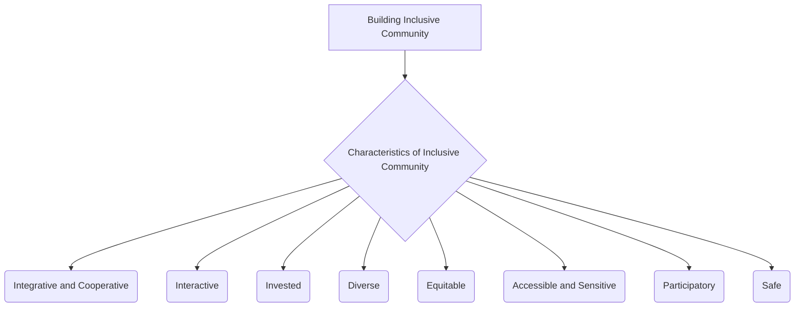

# Definition
Before proceeding, ensure you master [[Building_Inclusive_Community]] and [[Definition_of_Inclusive_Culture]] because understanding the characteristics of an inclusive community provides the specific attributes required for a community to genuinely embody inclusion. Characteristics of an inclusive community refer to the **distinguishing qualities and inherent features that define a collective wherein all individuals feel valued, respected, and have opportunities for full participation and belonging**. These qualities include being integrative and cooperative, interactive, invested, diverse, equitable, accessible and sensitive, participatory, and safe. They represent the observable traits and underlying principles that make a community genuinely welcoming and supportive of everyone. Think of it like a puzzle where every piece, regardless of its shape or color, fits together perfectly, contributing to a vibrant and complete picture, and the overall design ensures no piece is left out.

# The Mental Model
Imagine a thriving, bustling town square. The "Characteristics of an Inclusive Community" are like the vital signs of its health. If the square is **Integrative and Cooperative**, people work together. If it's **Interactive**, people talk and engage. If it's **Invested**, people care about it. If it's **Diverse**, many different types of people are there. If it's **Equitable**, everyone has fair access. If it's **Accessible and Sensitive**, everyone can get around and feel understood. If it's **Participatory**, everyone has a say. And if it's **Safe**, everyone feels secure. These are the qualities that make the town square truly vibrant and welcoming to all.


```text
// Scenario 1: Overview of the Characteristics of an Inclusive Community
// Output:
// (A flowchart showing "Building Inclusive Community" leading to "Characteristics of Inclusive Community", which then branches into "Integrative and Cooperative", "Interactive", "Invested", "Diverse", "Equitable", "Accessible and Sensitive", "Participatory", "Safe".)
```
*Note: This `graph TD` illustrates the various distinguishing characteristics of an inclusive community.*

# Context & Framework
### The Family Tree
The Characteristics of Inclusive Community are a direct branch extending from the foundational concept of [[Building_Inclusive_Community]]. They provide the specific, observable attributes that confirm whether a community is indeed inclusive. These characteristics are also deeply intertwined with the overarching [[Frameworks_of_Inclusive_Values]] (such as Equality, Rights, Respect for Diversity) and are often influenced by the effective application of the [[Seven_Pillars_of_Inclusion]]. They represent the tangible outcomes of a successful commitment to inclusion at a societal level.

# The Mastery Deep Dive
### The Cheat Code: How to Remember This
To remember the characteristics, think of the acronym **"III DEAPS"**:
*   **I**ntegrative and Cooperative: Working together, bringing people in.
*   **I**nteractive: Engaging in dialogue and shared activities.
*   **I**nvested: Caring and committing to the community.
*   **D**iverse: Comprising a wide range of individuals.
*   **E**quitable: Ensuring fair treatment and access.
*   **A**ccessible and Sensitive: Physical and social environments remove barriers.
*   **P**articipatory: Everyone has a say and can contribute.
*   **S**afe: Free from harm and discrimination.

This mnemonic helps to recall the multifaceted nature of a truly inclusive community.

### The "Wikipedia One-Liner"
Characteristics of an inclusive community are the defining features, such as being integrative and cooperative, interactive, invested, diverse, equitable, accessible and sensitive, participatory, and safe, which collectively ensure that all individuals feel valued, respected, and empowered to participate fully and belong within that collective. These attributes are crucial for assessing and fostering genuine societal inclusion.

# Constraints & Limitations
### Spot the Impostor (Don't be Fooled)
A common "impostor" of an inclusive community is one that claims to be "Diverse" (e.g., having many different ethnic groups) but lacks other critical characteristics. For instance, a diverse community that is not "Equitable" (unequal access to resources), not "Participatory" (only a few dominant voices in decision-making), or not "Safe" (unaddressed discrimination or hate incidents) is not truly inclusive. Mere demographic diversity, without the accompanying qualities of genuine engagement, fairness, and safety, creates an illusion of inclusion without the substance, making it an "impostor" of a genuinely inclusive community. All characteristics must be present for full integrity.

# Significance & Application
Understanding these characteristics provides a clear blueprint for community development and policy-making aimed at inclusion. Academically, they are central to urban studies, social work, and public administration, guiding research on community cohesion and well-being. Practically, they inform the design of public spaces, the development of social programs, and the evaluation of community initiatives. By striving for these characteristics, communities can foster environments where social capital is maximized, conflicts are constructively resolved, and every resident can thrive, contributing to a richer collective life.

# The Worked Example
This lecture slides focus on definitions and conceptual understanding. A worked example here would be a detailed case study illustrating the development of these characteristics in an inclusive community.

**Scenario:** The town of "Unityville" launches a comprehensive initiative to transform itself into a truly inclusive community, focusing on embodying its defined `Characteristics_of_Inclusive_Community`.

**Step 1: Fostering Integration, Cooperation, and Interaction**
Unityville establishes a "Community Connect" program that pairs new residents with long-term residents for mentorship and cultural exchange, promoting **Integrative and Cooperative** relationships. They organize regular "Town Hall Tuesdays" with open forums and small group discussions, encouraging **Interactive** engagement and dialogue among all citizens.

**Step 2: Cultivating Investment and Valuing Diversity**
The local government allocates a portion of its budget to community-led projects, empowering residents to invest in their shared spaces. Volunteer programs are heavily promoted, fostering collective ownership and demonstrating that citizens are **Invested**. The town actively celebrates its many cultural festivals, showcasing its **Diverse** population through parades, food fairs, and art exhibits, recognizing the richness each culture brings.

**Step 3: Ensuring Equity, Accessibility, and Sensitivity**
Unityville revamps its public transportation system to be fully accessible, including paratransit services, and builds a new community center with `Universal_Design` principles incorporated throughout. Educational programs are launched to raise awareness about various disabilities and cultural nuances, fostering an **Accessible and Sensitive** environment. Policies are reviewed to ensure **Equitable** access to housing, employment, and educational opportunities for all.

**Step 4: Promoting Participation and Ensuring Safety**
A "Youth Voice" council is established, giving younger residents a direct say in town decisions. Online platforms are created for direct feedback on public services, ensuring broad **Participatory** governance. The police department implements community policing strategies and anti-hate crime task forces, ensuring that all residents feel **Safe** and protected from discrimination or violence.

By systematically addressing each of these characteristics, Unityville transforms itself into a vibrant and truly inclusive community where every citizen feels a deep sense of belonging and empowerment.

# The Proving Ground
*Test your mastery. Cover the solutions below to test yourself first.*

### Level 1: The Sanity Check (Verification)
**The Fact Check:** List at least four distinguishing qualities that define an inclusive community.
> **Solution:** Integrative and cooperative, interactive, invested, diverse, equitable, accessible and sensitive, participatory, and safe (any four).

### Level 2: The Crucible (Mastery & Edge Cases)
**The Impostor:** A bustling metropolitan district, "Global City," is globally renowned for its immense "Diversity" due to its large international population. It boasts many cultural restaurants and annual festivals. However, many immigrant residents report facing significant language barriers in accessing public services, a lack of culturally sensitive healthcare options, and feeling unrepresented in local governance. Additionally, reported hate incidents targeting minorities are often slow to be addressed by authorities. Analyze why Global City, despite its celebrated diversity, is an "impostor" for a truly inclusive community, referencing specific characteristics.
> **Solution:** Global City, despite its "Diversity," is an "impostor" for a truly inclusive community because it fails to embody several other critical characteristics. The "significant language barriers," lack of "culturally sensitive healthcare options," and feeling "unrepresented in local governance" all indicate a failure to be **Accessible and Sensitive**. The lack of proportional representation in governance also means it's not truly **Participatory**. Furthermore, the slow response to "hate incidents targeting minorities" undermines the characteristic of being **Safe**. While the city has demographic diversity, it lacks the deep integration, equitable access, and responsive support systems necessary for all individuals to feel valued and fully included, thus failing to be genuinely **Integrative and Cooperative** or **Equitable**.

# Key Takeaways
*   Inclusive communities are defined by qualities like being integrative, cooperative, interactive, invested, diverse, equitable, accessible and sensitive, participatory, and safe.
*   These characteristics ensure all individuals feel valued, respected, and have opportunities for full participation and belonging.
*   Mere diversity is not sufficient; an inclusive community must embody all these qualities for genuine inclusion.

# Knowledge Graph Connections
| Concept                               | Connection / Relationship                                                          |
| :
------------------------------------ | :
--------------------------------------------------------------------------------- |
| [[Building_Inclusive_Community]]      | These characteristics are the defining features that contribute to building an inclusive community. |
| [[Frameworks_of_Inclusive_Values]]    | The characteristics are tangible manifestations of underlying inclusive value frameworks like Equality and Respect for Diversity. |
| [[Seven_Pillars_of_Inclusion]]        | The implementation of the Seven Pillars directly contributes to a community exhibiting these characteristics. |
| [[Definition_of_Inclusive_Culture]]   | These characteristics exemplify what an inclusive culture looks like in practice at a community level. |
---