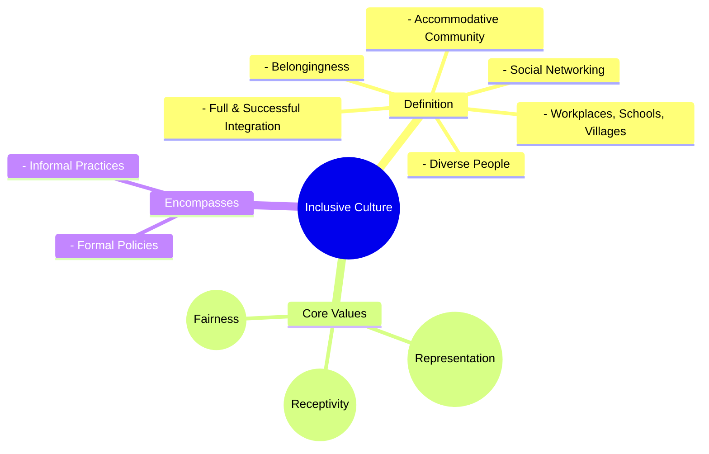

# Definition
Before proceeding, ensure you master Understanding_Disability_And_Vulnerability and Concept_Of_Inclusion because inclusive culture builds upon the foundational understanding of disability and the core principles of inclusion. Inclusive culture is a dynamic ecosystem where **diverse individuals are fully integrated and successfully participate** in all facets of society, such as workplaces, schools, and communities. It is not merely about presence but about the active creation of an accommodative environment that fosters belongingness and social networking. Think of it as a well-tended garden where every plant, no matter how different, has the right soil, light, and space to flourish, and its unique beauty contributes to the overall vibrancy of the garden.

# The Mental Model
Imagine a large, bustling city square. The "Inclusive Culture" of this square means that not only are there people from all walks of life present (diversity), but the square itself is designed and operates in a way that *actively encourages* everyone to participate. This includes accessible paths for wheelchairs, clear signage in multiple languages, benches for resting, and events that cater to various interests and age groups. It's about ensuring the city square's social behavior and customs make everyone feel welcome and able to engage, just as a librarian manages books for all patrons.


```text
// Scenario 1: Basic understanding of Inclusive Culture components
// Output:
// (A visual mindmap showing "Inclusive Culture" at the root, branching into "Definition", "Core Values", and "Encompasses".
// "Definition" branches into "Full & Successful Integration", "Diverse People", "Workplaces, Schools, Villages", "Accommodative Community", "Belongingness", "Social Networking".
// "Core Values" branches into "Representation", "Receptivity", "Fairness".
// "Encompasses" branches into "Formal Policies", "Informal Practices".)
```
*Note: This `mindmap` visualizes the multifaceted aspects and core components that define an inclusive culture.*

# Context & Framework
### Where Does it Live? (The Map)
Inclusive culture resides within the shared consciousness and observable behaviors of a collective group—be it a family, an organization, or an entire society. It is the unspoken agreement, the visible actions, and the underlying values that dictate how diversity is not just acknowledged but actively embraced and leveraged. This culture manifests in policies, leadership styles, communication patterns, and even the physical design of spaces.

# The Mastery Deep Dive
### Who are the Neighbors?
Inclusive culture is intricately linked to several "neighboring" concepts. It is the practical application of the Concept_Of_Inclusion, translating abstract principles into concrete actions. It relies on the presence of [[Representation_in_Inclusive_Culture]], ensuring diverse voices are heard, and requires [[Receptivity_in_Inclusive_Culture]]—an open-mindedness to differences. Furthermore, its foundation is built on [[Fairness_in_Inclusive_Culture]], guaranteeing equitable access and opportunities for all. Without these interconnected elements, an inclusive culture cannot truly flourish.

### The "Wikipedia One-Liner"
Formally, inclusive culture is defined as "the ideas, customs, and social behavior of a particular people or society" that proactively accommodate and integrate diverse individuals, ensuring their belongingness, participation, and social networking within that community or institution. This involves both explicit policies and implicit practices designed to respect differences and provide equitable access to resources and decision-making processes.

# Constraints & Limitations
### Spot the Impostor (Don't be Fooled)
A common misconception is mistaking superficial diversity for an inclusive culture. An organization might have diverse employees (representation), but if decision-making processes remain exclusive, communication styles are not adapted, or underlying biases persist, it lacks genuine receptivity and fairness. True inclusive culture goes beyond demographics; it requires continuous effort to dismantle barriers, challenge norms, and adapt practices to ensure meaningful participation for all. A mere head count of diverse individuals is an "impostor" for a truly inclusive culture.

# Significance & Application
Inclusive culture is vital for societal harmony and organizational effectiveness. Academically, it is a key focus in sociology, education, and organizational studies, informing theories of social justice and equity. Practically, it leads to more innovative workplaces, richer educational experiences, and more resilient communities. By fostering an environment where every voice is heard and valued, inclusive cultures drive progress and solve complex problems more effectively.

# The Worked Example
This lecture slides focus on definitions and conceptual understanding. A worked example here would be a detailed case study illustrating the principles of inclusive culture in action.

**Scenario:** A local community center decides to revamp its programs and facilities to be truly inclusive.

**Step 1: Assessing Current Culture & Needs (Representation & Receptivity)**
The center first forms a diverse committee, including people with disabilities, seniors, single parents, and recent immigrants. They conduct surveys and focus groups, actively listening to feedback on barriers to participation, such as inaccessible entrances, inconvenient program times, or lack of translated materials. This directly addresses `Representation_in_Inclusive_Culture` by including diverse voices in the planning process and `Receptivity_in_Inclusive_Culture` by actively seeking and respecting differences in needs and preferences.

**Step 2: Implementing Universal Design Principles (Dimensions of Inclusive Culture)**
Based on feedback, the center redesigns its entrance with a ramp alongside stairs, installs automatic doors, and ensures all restrooms are gender-neutral and accessible. Program schedules are diversified to accommodate working parents and varying cultural holidays. This demonstrates the application of `Universal_Design` as a key dimension of inclusive culture, ensuring the physical environment is organically accessible without special modification.

**Step 3: Ensuring Fairness in Programs (Fairness & Leadership)**
New program registration processes are simplified, offering online, phone, and in-person options, and providing financial assistance for low-income families. Staff receive training on unconscious bias and cultural competence. The center's director actively models inclusive behaviors, holding staff accountable for equitable treatment. This directly addresses `Fairness_in_Inclusive_Culture` by removing barriers to access and promoting equitable opportunities, reinforced by `Leadership_for_Inclusive_Culture`.

**Step 4: Continuous Evaluation & Adaptation (Building Inclusive Community)**
The center establishes an ongoing feedback mechanism and regularly reviews participation rates across different demographics. They celebrate diverse cultural events and integrate indigenous knowledge into specific workshops. If new barriers are identified, the center quickly adapts its practices. This shows a commitment to `Building_Inclusive_Community` by valuing diversity and responding quickly to ensure full engagement and accessibility, making the community center a truly inclusive space.

# The Proving Ground
*Test your mastery. Cover the solutions below to test yourself first.*

### Level 1: The Sanity Check (Verification)
**The Fact Check:** What are the three core values that an inclusive culture encompasses, as explicitly mentioned in the source material?
> **Solution:** Representation, Receptivity, and Fairness.

### Level 2: The Crucible (Mastery & Edge Cases)
**The Impostor:** A newly opened private club advertises itself as having "exclusive membership for successful individuals" and a "very diverse membership" in terms of professions and backgrounds. However, it implicitly restricts access based on high membership fees and a lengthy vetting process that often screens out individuals from marginalized communities. Does this club genuinely embody an "inclusive culture"? Explain why or why not, referencing the key aspects of inclusive culture.
> **Solution:** No, the club does not genuinely embody an inclusive culture. While it claims "diverse membership," its restrictive access based on high fees and an exclusionary vetting process directly violates the core value of [[Fairness_in_Inclusive_Culture]] by denying equitable access to resources and opportunities. It also fails in [[Representation_in_Inclusive_Culture]] if it systematically screens out marginalized communities, and lacks true [[Receptivity_in_Inclusive_Culture]] if its customs and social behavior (e.g., vetting process) do not respect differences and actively include a wide range of individuals. An inclusive culture involves the *full and successful integration* of diverse people, not just a superficial headcount within an exclusive, high-cost framework. This scenario illustrates a "false friend" or an "impostor" of inclusion because the underlying structures and practices contradict the stated value of diversity.

# Key Takeaways
*   Inclusive culture is about the full and successful integration of diverse people, fostered by accommodative communities that ensure belongingness and social networking.
*   Its core values are representation (presence across leadership), receptivity (respect for differences), and fairness (equitable access to resources and decision-making).
*   Genuine inclusive culture goes beyond superficial diversity, requiring continuous effort in formal policies and informal practices to dismantle barriers and ensure meaningful participation for all.

# Knowledge Graph Connections
| Concept                         | Connection / Relationship                                                          |
| :
------------------------------ | :
--------------------------------------------------------------------------------- |
| [[Representation_in_Inclusive_Culture]] | Is a core value ensuring diverse presence in an inclusive culture.                 |
| [[Receptivity_in_Inclusive_Culture]]    | Is a core value promoting respect for differences within an inclusive culture.     |
| [[Fairness_in_Inclusive_Culture]]       | Is a core value guaranteeing equitable access and opportunities in an inclusive culture. |
| [[Dimensions_of_Inclusive_Culture]]     | Are the structural elements that define and enable an inclusive culture.           |
| [[Building_Inclusive_Community]]        | Describes how an inclusive culture is actively established and maintained in practice. |
---