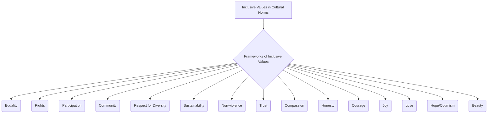

# Definition
Before proceeding, ensure you master [[Inclusive_Values_in_Cultural_Norms]] and Concept_Of_Inclusion because frameworks of inclusive values represent the broader ethical principles that underpin cultural norms, guiding how inclusion is conceptualized and enacted. Frameworks of inclusive values refer to the **comprehensive sets of fundamental ethical principles and moral ideals that guide the development and sustenance of an inclusive society**. These extend beyond operational pillars to encompass overarching concepts such as Equality, Rights, Participation, Community, Respect for Diversity, Sustainability, Non-violence, Trust, Compassion, Honesty, Courage, Joy, Love, Hope/Optimism, and Beauty. They provide a deeper philosophical grounding for why inclusion is important and what it ultimately strives to achieve. Think of them as the constitution or foundational philosophy of a society, outlining the core beliefs that shape all its laws and cultural practices.

# The Mental Model
Imagine a wise old tree with deep roots. The "Frameworks of Inclusive Values" are like these deep roots, providing the fundamental strength and nourishment for the entire tree (society). Values like Equality, Rights, Respect for Diversity, and Trust are the deep, unspoken beliefs that hold everything together and guide how the branches (policies) and leaves (daily interactions) grow. These values are the bedrock, ensuring the tree stands strong and provides shade and fruit for everyone, rather than just a select few.


```text
// Scenario 1: Overview of Frameworks of Inclusive Values
// Output:
// (A flowchart showing "Inclusive Values in Cultural Norms" leading to "Frameworks of Inclusive Values", which then branches into "Equality", "Rights", "Participation", "Community", "Respect for Diversity", "Sustainability", "Non-violence", "Trust", "Compassion", "Honesty", "Courage", "Joy", "Love", "Hope/Optimism", "Beauty".)
```
*Note: This `graph TD` illustrates the various values that constitute the frameworks of inclusive values within cultural norms.*

# Context & Framework
### The Family Tree
Frameworks of inclusive values represent a foundational layer beneath the concept of [[Inclusive_Values_in_Cultural_Norms]]. While the [[Seven_Pillars_of_Inclusion]] offer operational guidelines, these frameworks provide the broader ethical and moral principles that inform both the pillars and the overall cultural approach to inclusion. These values are often expressed in national constitutions, human rights declarations, and ethical codes of conduct, setting the aspirational standards for a just and equitable society.

# The Mastery Deep Dive
### The Cheat Code: How to Remember This
To remember the extensive list of values, categorize them:
*   **Fundamental Principles:** Equality, Rights, Participation, Community, Respect for Diversity
*   **Societal Well-being:** Sustainability, Non-violence
*   **Interpersonal Virtues:** Trust, Compassion, Honesty, Courage
*   **Emotional & Aspirational:** Joy, Love, Hope/Optimism, Beauty

This categorization helps to organize and recall the diverse range of values that constitute these frameworks.

### The "Wikipedia One-Liner"
Frameworks of inclusive values encompass fundamental ethical principles such as Equality, Rights, Participation, Respect for Diversity, and Sustainability, alongside virtues like Trust, Compassion, and Courage, which collectively establish the moral and philosophical underpinnings for genuinely inclusive cultural norms and societal structures. These overarching ideals guide the development and implementation of policies and practices aimed at fostering a just and equitable society.

# Constraints & Limitations
### Spot the Impostor (Don't be Fooled)
A major "impostor" of genuinely upholding inclusive value frameworks is **rhetorical commitment without practical action**. A society might proudly declare its commitment to "Equality" and "Rights," but if systemic discrimination persists in its institutions (e.g., unequal access to justice, education, or employment), or if "Respect for Diversity" is merely preached but not practiced in daily interactions, then these values remain hollow. The gap between proclaimed values and lived reality exposes the impostor. True integration requires consistent, tangible efforts to align all policies, practices, and individual behaviors with these foundational ethical principles, ensuring they are not just words on paper but active forces in cultural norms.

# Significance & Application
Frameworks of inclusive values provide the moral compass for building just and equitable societies. Academically, they are studied in philosophy, political science, sociology, and human rights, forming the theoretical basis for advocating for social change. Practically, they inspire the drafting of human rights charters, guide the development of ethical codes for organizations, and inform educational curricula aimed at fostering civic responsibility and empathy. By articulating these core values, societies set a clear vision for what it means to live together harmoniously and inclusively, transcending mere legal compliance to embed a deeper ethical commitment.

# The Worked Example
This lecture slides focus on definitions and conceptual understanding. A worked example here would be a detailed case study illustrating the integration of frameworks of inclusive values into cultural norms.

**Scenario:** A newly formed international non-profit organization, "Global Unity," aims to base its entire organizational culture and operations on robust `Frameworks_of_Inclusive_Values`.

**Step 1: Defining Core Values and Mission**
Global Unity's founding document explicitly lists its core values, including **Equality**, **Rights**, **Respect for Diversity**, **Sustainability**, and **Compassion**. These values are not just statements but are integrated into the organization's mission to promote global cooperation and support marginalized communities. All employees are trained on these values from their first day, ensuring a shared understanding of the ethical foundation.

**Step 2: Operationalizing Values in Policies and Practices**
Every organizational policy, from hiring and performance reviews to project selection and stakeholder engagement, is vetted against these core values. For instance, their hiring policy explicitly seeks diverse candidates and provides accommodations (upholding `Equality` and `Rights`). Project selection prioritizes initiatives that promote environmental and social `Sustainability` and empower local communities (`Community`, `Participation`). Communication protocols emphasize `Trust` and `Honesty` in all dealings.

**Step 3: Fostering Virtues and Interpersonal Behavior**
Global Unity actively cultivates virtues like `Compassion` and `Courage` among its staff through leadership development programs and conflict resolution training. Employees are encouraged to approach challenges with `Hope/Optimism` and to find `Joy` in collective achievements. Mentorship programs are designed to promote `Love` and mutual support among colleagues, creating a supportive and ethical work environment.

**Step 4: Continuous Ethical Reflection and Accountability**
The organization establishes an ethics committee to regularly review its operations against its stated values and to address any discrepancies or ethical dilemmas. Feedback mechanisms allow staff and beneficiaries to report concerns confidentially, ensuring `Accountability_of_Inclusive_Leaders` and continuous improvement in upholding the values. This demonstrates that these values are living principles, not just static declarations.

By integrating these frameworks of inclusive values into its foundational principles, operational policies, and internal culture, Global Unity establishes itself as an organization deeply committed to genuine inclusion and ethical practice.

# The Proving Ground
*Test your mastery. Cover the solutions below to test yourself first.*

### Level 1: The Sanity Check (Verification)
**The Fact Check:** Name three of the broader frameworks of inclusive values mentioned in the source material.
> **Solution:** Equality, Rights, and Participation (or any three from the provided list).

### Level 2: The Crucible (Mastery & Edge Cases)
**The Impostor:** A country's constitution proudly guarantees "Equality" and "Rights" for all its citizens. However, its legal system is notoriously slow and expensive, making effective access to justice impossible for low-income individuals. Furthermore, while "Respect for Diversity" is espoused in public discourse, government media frequently promotes a singular national identity that implicitly marginalizes minority cultures. Analyze why this country, despite its constitutional claims, is an "impostor" for genuinely upholding the full `Frameworks_of_Inclusive_Values`, specifically referencing the listed values.
> **Solution:** This country is an "impostor" for genuinely upholding the full `Frameworks_of_Inclusive_Values` because there's a significant gap between its stated constitutional values and its actual cultural norms and practices. While "Equality" and "Rights" are guaranteed on paper, the expensive and slow legal system effectively denies "equitable access to all resources and opportunities" (a component of fairness, linked to equality and rights), making these rights practically unattainable for low-income citizens. This undermines the value of Rights and Equality. Furthermore, while "Respect for Diversity" is publicly discussed, the government media's promotion of a "singular national identity" actively contradicts the spirit of Respect_For_Diversity by implicitly marginalizing minority cultures. This shows a failure to truly embed these values into cultural norms, exposing the "impostor" nature of its claims. The value of Participation might also be undermined if only certain groups feel empowered to engage with the legal or political system.

# Key Takeaways
*   Frameworks of inclusive values are comprehensive sets of ethical principles (e.g., Equality, Rights, Respect for Diversity, Trust) guiding an inclusive society.
*   They provide a deeper philosophical grounding for inclusion, extending beyond operational pillars to overarching ideals.
*   Genuine upholding requires aligning all policies, practices, and individual behaviors with these foundational principles.

# Knowledge Graph Connections
| Concept                               | Connection / Relationship                                                          |
| :
------------------------------------ | :
--------------------------------------------------------------------------------- |
| [[Inclusive_Values_in_Cultural_Norms]] | These frameworks provide the foundational ethical principles for inclusive cultural norms. |
| [[Seven_Pillars_of_Inclusion]]        | The Seven Pillars are an operational subset, informed by these broader value frameworks. |
| [[Building_Inclusive_Community]]      | Upholding these value frameworks is essential for creating a morally sound inclusive community. |
| [[Definition_of_Inclusive_Culture]]   | These frameworks articulate the aspirational ideals that define an inclusive culture. |
---