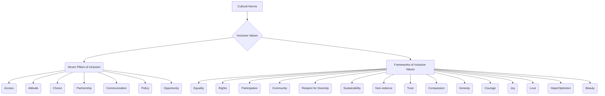

# Definition
Before proceeding, ensure you master [[Building_Inclusive_Community]] and [[Definition_of_Inclusive_Culture]] because understanding inclusive values in cultural norms requires knowledge of how inclusivity is built in a community and what constitutes an inclusive culture. Inclusive values in cultural norms refers to the **embedding of principles that promote equality, respect for diversity, participation, and sustainability into the shared beliefs, customs, and practices of a society**. This goes beyond mere policy to encompass the ethical foundations that guide behavior and interactions, ensuring that inclusion is not just an aspiration but a lived reality within the fabric of a culture. Think of it as the moral compass that directs a community towards a just and equitable future for all its members.

# The Mental Model
Imagine a family deciding on their "house rules." "Inclusive Values in Cultural Norms" are like the core beliefs that underpin these rules: everyone's voice matters, we respect each other's space, and we share responsibilities fairly. These aren't just written down; they become the unspoken ways the family interacts, celebrates, and solves problems. It's the moral code that guides behavior, ensuring that every family member feels a sense of belonging and contributes to the shared household.


```text
// Scenario 1: Overview of Inclusive Values within Cultural Norms
// Output:
// (A flowchart showing "Cultural Norms" leading to "Inclusive Values", which then branches into "Seven Pillars of Inclusion" and "Frameworks of Inclusive Values".
// "Seven Pillars of Inclusion" branches into "Access", "Attitude", "Choice", "Partnership", "Communication", "Policy", "Opportunity".
// "Frameworks of Inclusive Values" branches into "Equality", "Rights", "Participation", "Community", "Respect for Diversity", "Sustainability", "Non-violence", "Trust", "Compassion", "Honesty", "Courage", "Joy", "Love", "Hope/Optimism", "Beauty".)
```
*Note: This `graph TD` illustrates how inclusive values are structured within cultural norms, categorized into the Seven Pillars and broader frameworks.*

# Context & Framework
### The Family Tree
The concept of inclusive values in cultural norms forms a hierarchical tree, with the overarching cultural norms as the root. Branching from this are the two major categories: the [[Seven_Pillars_of_Inclusion]] and the broader [[Frameworks_of_Inclusive_Values]]. These pillars and frameworks then further subdivide into specific values such as access, equality, and respect for diversity. This structure helps to systematically understand the different layers and components of value systems that underpin an inclusive culture.

# The Mastery Deep Dive
### The Cheat Code: How to Remember This
To remember the Seven Pillars of Inclusion, think of the acronym **"AACCPOO"**:
*   **A**ccess: Ensuring everyone can reach resources and opportunities.
*   **A**ttitude: Fostering positive mindsets towards diversity.
*   **C**hoice: Empowering individuals to make their own decisions.
*   **P**artnership: Encouraging collaboration and shared responsibility.
*   **C**ommunication: Promoting clear, accessible, and respectful dialogue.
*   **P**olicy: Establishing rules that support inclusion.
*   **O**pportunity: Providing chances for growth and participation.

This mnemonic provides a simple way to recall the key operational components of inclusive values in action.

### The "Wikipedia One-Liner"
Inclusive values in cultural norms represent the active implementation of inclusive principles into the customs, ideas, and social behaviors of a society. This involves upholding principles like equality, rights, and respect for diversity through frameworks such as the Seven Pillars of Inclusion (Access, Attitude, Choice, Partnership, Communication, Policy, Opportunity) and broader value sets (e.g., trust, compassion, sustainability), ensuring that inclusion is intrinsically woven into the societal fabric.

# Constraints & Limitations
### Spot the Impostor (Don't be Fooled)
A common "impostor" scenario occurs when a society claims to uphold inclusive values, yet its cultural norms subtly perpetuate exclusion. For example, a community might advocate for "equality" but maintain unwritten social rules that marginalize certain groups or discourage their participation in cultural events. Similarly, a focus on "sustainability" might be framed narrowly (e.g., environmental protection) without considering the social equity implications for marginalized communities. True integration of inclusive values requires consistent alignment between stated values and actual cultural practices, addressing both overt and covert forms of exclusion.

# Significance & Application
Inclusive values embedded in cultural norms are the bedrock of a truly equitable society. Academically, this concept is central to cultural studies, ethics, and social development, examining how values shape collective identity and behavior. Practically, it guides educational initiatives to instill empathy and respect, informs human rights advocacy, and influences public discourse to promote solidarity. When values like trust and compassion become cultural norms, they foster social cohesion and resilience.

# The Worked Example
This lecture slides focus on definitions and conceptual understanding. A worked example here would be a detailed case study illustrating the integration of inclusive values into cultural norms.

**Scenario:** A multi-ethnic school, "Global Heights Academy," recognizes the importance of moving beyond mere diversity to deeply embed inclusive values into its daily cultural norms.

**Step 1: Instilling Core Inclusive Values**
The school begins by explicitly teaching and modeling the `Frameworks_of_Inclusive_Values` such as "Respect for Diversity," "Participation," and "Community." During assemblies and in classroom discussions, specific examples of these values in action are shared, and students are encouraged to reflect on their own behaviors. The school's mission statement is revised to clearly articulate these values.

**Step 2: Activating the Seven Pillars of Inclusion**
To operationalize these values, the school implements the `Seven_Pillars_of_Inclusion`. For "Access," they review all digital and physical learning materials for accessibility. For "Attitude," they launch a peer-mentoring program to foster positive interactions across different groups. "Choice" is promoted by offering diverse extracurricular activities and allowing students input in course selection. "Partnership" involves parent-teacher associations that are intentionally inclusive of all cultural backgrounds. "Communication" protocols ensure multilingual options and clear, respectful dialogue. "Policy" adjustments reflect fair disciplinary practices and support for all learning styles. "Opportunity" is enhanced by scholarships and programs targeting underrepresented students.

**Step 3: Addressing Cultural Norms Through Leadership**
School leaders actively demonstrate inclusive behaviors, showcasing `Leadership_for_Inclusive_Culture`. For example, the principal publicly acknowledges and addresses instances of microaggressions, modeling "Courage." Teachers are empowered to integrate diverse cultural perspectives into their lessons, fostering "Creativity" and "Collaboration" as cultural norms. This ensures that the inclusive values are not just abstract ideas but are actively woven into the school's social behavior and customs.

**Step 4: Continuous Reinforcement and Feedback**
The school establishes student councils and anonymous feedback mechanisms to continuously monitor the effectiveness of these efforts. They celebrate cultural festivals and recognize students who exemplify inclusive behaviors, reinforcing the "Joy" and "Hope/Optimism" derived from a truly inclusive cultural environment.

By systematically embedding these values and pillars into its cultural norms, Global Heights Academy creates a truly inclusive environment where every student feels respected, valued, and empowered to participate fully.

# The Proving Ground
*Test your mastery. Cover the solutions below to test yourself first.*

### Level 1: The Sanity Check (Verification)
**The Fact Check:** According to the source material, what is the most important way inclusion is seen in terms of cultural norms?
> **Solution:** Inclusion is most importantly seen as putting inclusive values into action.

### Level 2: The Crucible (Mastery & Edge Cases)
**The Impostor:** A tech company has a written "Diversity and Inclusion" policy that includes values like "Equality" and "Respect for Diversity." However, the company culture (unwritten norms) is highly competitive and individualistic, with a strong emphasis on long working hours that disproportionately affect employees with caregiving responsibilities. Furthermore, constructive criticism is often delivered harshly, leading to a climate where quieter voices are rarely heard, despite the policy's stated commitment to "Participation." Analyze why this company's cultural norms act as an "impostor" for its stated inclusive values, specifically referencing the Seven Pillars of Inclusion and other frameworks.
> **Solution:** This company's cultural norms create an "impostor" of inclusive values because the unwritten rules directly contradict its stated policies. The highly competitive and individualistic culture, with its emphasis on long hours, undermines the value of Equality from the `Frameworks_of_Inclusive_Values` by creating unequal burdens for employees, particularly those with caregiving responsibilities. This also negatively impacts the [[Seven_Pillars_of_Inclusion]], specifically **Access** (to work-life balance) and **Opportunity** (for those unable to meet the unofficial "long hours" norm). The harsh criticism and silencing of quieter voices directly violate the pillar of **Communication** (lack of respectful dialogue) and the framework value of Participation. Despite the written policy, the actual cultural norms fail to embody fundamental inclusive values, demonstrating a disconnect between rhetoric and reality.

# Key Takeaways
*   Inclusive values in cultural norms involve embedding principles like equality and respect for diversity into a society's shared beliefs and practices.
*   The `Seven_Pillars_of_Inclusion` (Access, Attitude, Choice, Partnership, Communication, Policy, Opportunity) provide a framework for putting these values into action.
*   Broader `Frameworks_of_Inclusive_Values` (e.g., Equality, Rights, Trust, Compassion) further define the ethical foundations.

# Knowledge Graph Connections
| Concept                               | Connection / Relationship                                                          |
| :
------------------------------------ | :
--------------------------------------------------------------------------------- |
| [[Seven_Pillars_of_Inclusion]]        | Are a specific framework of operational values crucial for cultural inclusion.     |
| [[Frameworks_of_Inclusive_Values]]    | Are broader ethical principles that guide the integration of inclusive values.     |
| [[Building_Inclusive_Community]]      | Relies on embedding inclusive values into cultural norms for long-term success.    |
| [[Definition_of_Inclusive_Culture]]   | These values define the ethical underpinnings of an inclusive culture.             |
| [[Leadership_for_Inclusive_Culture]]  | Is vital for championing and modeling inclusive values within cultural norms.      |
---