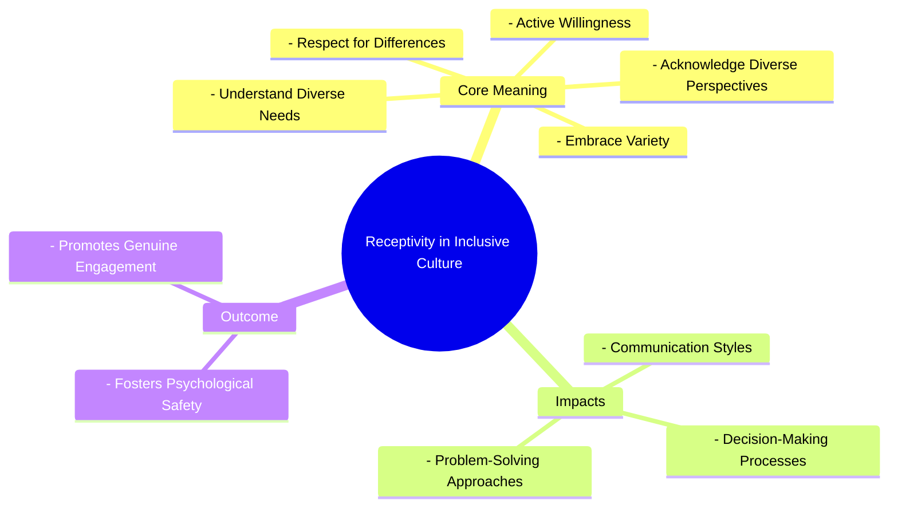

# Definition
Before proceeding, ensure you master [[Definition_of_Inclusive_Culture]] and Concept_Of_Inclusion because receptivity is a core value of an inclusive culture, building on the foundational understanding of what inclusion truly entails. Receptivity in inclusive culture refers to the **active willingness and capacity of individuals, communities, and institutions to acknowledge, understand, and genuinely respect differences among people**. It involves an open-minded approach to diverse perspectives, needs, and experiences, moving beyond mere tolerance to a proactive embrace of variety. Think of it like a sponge that eagerly absorbs all kinds of liquids, recognizing that each contributes to a richer, more complete solution, rather than just repelling what's unfamiliar.

# The Mental Model
Imagine a diverse group of musicians trying to create a new song together. "Receptivity" in this context means each musician isn't just playing their own part, but actively *listening* to the others, adjusting their tempo or volume, and being open to new melodies or rhythms suggested by their bandmates. It's about respecting that each instrument and style brings something unique, and being willing to adapt to create a richer, more harmonious piece of music. It's an active process of listening and adapting, not just allowing others to be present.


```text
// Scenario 1: Basic understanding of Receptivity in Inclusive Culture
// Output:
// (A visual mindmap showing "Receptivity in Inclusive Culture" at the root, branching into "Core Meaning", "Impacts", and "Outcome".
// "Core Meaning" branches into "Respect for Differences", "Active Willingness", "Acknowledge Diverse Perspectives", "Understand Diverse Needs", "Embrace Variety".
// "Impacts" branches into "Communication Styles", "Decision-Making Processes", "Problem-Solving Approaches".
// "Outcome" branches into "Fosters Psychological Safety", "Promotes Genuine Engagement".)
```
*Note: This `mindmap` visualizes the core meaning, impacts, and outcomes of receptivity within an inclusive culture.*

# Context & Framework
### Where Does it Live? (The Map)
Receptivity in inclusive culture lives in the daily interactions, meeting dynamics, feedback mechanisms, and conflict resolution approaches of any group. It is found in how leaders respond to suggestions, how teams incorporate dissenting opinions, and how communities engage with newcomers. This value is a prerequisite for effective cross-cultural communication and collaborative problem-solving, mapping directly onto the capacity of individuals and collectives to learn, adapt, and grow through engagement with difference.

# The Mastery Deep Dive
### Who are the Neighbors?
Receptivity is an essential neighbor to [[Representation_in_Inclusive_Culture]], as the presence of diverse voices is only valuable if there is an active willingness to listen to and respect those voices. It also works hand-in-hand with [[Fairness_in_Inclusive_Culture]], as being receptive to different needs often informs how equitable access and opportunities are provided. A culture of receptivity is a fundamental component of [[Building_Inclusive_Community]], enabling the community to genuinely value diversity and engage all its citizens. Without receptivity, genuine dialogue and integration are impossible.

### The "Wikipedia One-Liner"
Receptivity in inclusive culture is the active commitment to respect and understand differences, encompassing an open-minded approach to diverse perspectives, needs, and experiences, thereby fostering an environment where all individuals feel genuinely valued and heard. This core value moves beyond passive tolerance to a proactive embrace of the richness that diversity brings to a community or institution.

# Constraints & Limitations
### Spot the Impostor (Don't be Fooled)
A significant "impostor" of true receptivity is **passive tolerance**, where differences are merely "put up with" rather than genuinely embraced or integrated. An institution might state it "tolerates" all employees, but if it doesn't actively seek feedback from marginalized groups, adapt its communication styles, or genuinely consider alternative viewpoints in decision-making, it lacks true receptivity. This passive stance maintains existing power structures and marginalizes diverse voices, failing to create an environment where differences are truly valued and leveraged for collective benefit.

# Significance & Application
Receptivity is crucial for fostering psychological safety, promoting innovation, and building stronger relationships within diverse groups. Academically, it is a key concept in communication studies, organizational behavior, and conflict resolution, exploring how open-mindedness drives positive group dynamics. Practically, it guides active listening training, informs the design of inclusive feedback systems, and is vital for effective intercultural dialogue, ensuring that every individual's contribution is genuinely considered and appreciated.

# The Worked Example
This lecture slides focus on definitions and conceptual understanding. A worked example here would be a detailed case study illustrating the implementation of receptivity in an inclusive culture.

**Scenario:** A multi-national team at "GlobalConnect Corp" is struggling with communication and collaboration due to diverse cultural backgrounds and working styles. The leadership decides to focus on fostering `Receptivity_in_Inclusive_Culture`.

**Step 1: Implementing Active Listening Training**
GlobalConnect mandates a workshop on active listening and empathetic communication for all team members. The training focuses on techniques like paraphrasing, asking clarifying questions, and withholding judgment. Team members are encouraged to consciously practice these skills in meetings and daily interactions, fostering an environment where diverse perspectives are genuinely heard and understood. This directly builds "active willingness" to "acknowledge diverse perspectives" and "understand diverse needs."

**Step 2: Establishing Diverse Communication Channels**
Recognizing that not all cultures communicate directly or verbally, GlobalConnect introduces multiple channels for feedback and ideas, including anonymous suggestion boxes, structured online forums, and dedicated "safe spaces" for one-on-one dialogue with managers. This ensures that quieter voices or those who prefer indirect communication can also contribute effectively, demonstrating "respect for differences" in communication styles.

**Step 3: Integrating Diverse Problem-Solving Approaches**
For complex projects, teams are encouraged to intentionally invite different cultural approaches to problem-solving. For example, if one culture favors detailed planning upfront and another prefers iterative, agile development, the team facilitates discussions to find hybrid models that leverage both strengths. This proactive "embrace of variety" in working styles directly promotes an inclusive culture by valuing diverse methods.

**Step 4: Leadership Modeling Receptivity**
Team managers and project leads are trained to actively model receptive behaviors. They explicitly solicit differing opinions, avoid interrupting, and frequently summarize discussions to ensure all viewpoints have been captured. When conflicts arise, they facilitate dialogue rather than dictating solutions, demonstrating "respect for differences" and a genuine desire to understand underlying perspectives. This reinforces the cultural norm of receptivity from the top down.

Through these concerted efforts, GlobalConnect fosters a culture where receptivity is a tangible practice, leading to improved team cohesion and innovative solutions.

# The Proving Ground
*Test your mastery. Cover the solutions below to test yourself first.*

### Level 1: The Sanity Check (Verification)
**The Fact Check:** In the context of an inclusive culture, what is the core essence of "receptivity"?
> **Solution:** Receptivity means respect for differences.

### Level 2: The Crucible (Mastery & Edge Cases)
**The Impostor:** A university department claims to be very "open-minded" and frequently holds informal "brainstorming sessions" where all members are invited to share ideas. However, these sessions are dominated by a few vocal individuals, new faculty members or those from different academic backgrounds are often interrupted or their ideas are quickly dismissed, and decisions are still primarily made by the long-standing senior professors. Analyze why this department's "open-mindedness" is an "impostor" for genuine receptivity in an inclusive culture, referencing the core meaning and impact of receptivity.
> **Solution:** This department's "open-mindedness" is an "impostor" for genuine receptivity because it lacks the "active willingness" and "capacity to acknowledge, understand, and genuinely respect differences." While all members are "invited" (implying initial presence), the domination by vocal individuals, interruptions, and quick dismissal of new ideas directly contradict the "respect for differences" and willingness to "understand diverse needs and perspectives." The fact that decisions are still made by senior professors, despite brainstorming, shows that diverse voices are not truly influencing processes. This demonstrates a passive tolerance at best, not a proactive embrace of variety, failing to foster "psychological safety" and "genuine engagement" that true receptivity would ensure.

# Key Takeaways
*   Receptivity in inclusive culture is the active willingness to acknowledge, understand, and genuinely respect differences among people.
*   It involves open-mindedness to diverse perspectives, needs, and experiences, moving beyond mere tolerance to a proactive embrace of variety.
*   Genuine receptivity fosters psychological safety, promotes engagement, and enables communities to learn and adapt through diverse inputs.

# Knowledge Graph Connections
| Concept                         | Connection / Relationship                                                          |
| :
------------------------------ | :
--------------------------------------------------------------------------------- |
| [[Definition_of_Inclusive_Culture]] | Receptivity is a fundamental core value that defines an inclusive culture.         |
| [[Representation_in_Inclusive_Culture]] | Effective representation requires a receptive culture for diverse voices to be truly heard. |
| [[Fairness_in_Inclusive_Culture]] | Receptivity helps inform how fairness is achieved by understanding diverse needs for equitable access. |
| [[Building_Inclusive_Community]]  | A receptive environment is crucial for engaging all citizens and valuing diversity in a community. |
---