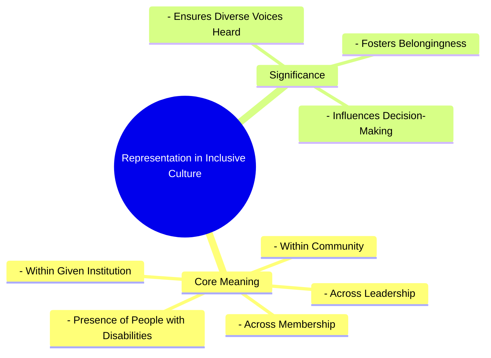

# Definition
Before proceeding, ensure you master [[Definition_of_Inclusive_Culture]] and Concept_Of_Inclusion because "representation" is a core value underpinning an inclusive culture, requiring a clear understanding of what that culture strives to achieve. Representation in inclusive culture refers to the **active presence and meaningful participation of diverse individuals, particularly those with disabilities, across a range of membership and leadership roles within a community or institution**. It goes beyond mere numbers to ensure that different voices are not only present but are also heard, valued, and able to influence decision-making processes. Think of it like a truly diverse orchestra where every instrument, from the smallest flute to the largest tuba, is not only present but also actively plays its part, contributing its unique sound to the overall harmony.

# The Mental Model
Imagine a large community meeting. "Representation" in an inclusive culture means that not only are people from all parts of the community (different ages, backgrounds, abilities) invited, but they are also actively seated at the main table, given microphones, and their opinions are genuinely sought and acted upon. It's not just about having a few people from diverse groups in the audience; it's about them being part of the organizing committee, leading discussions, and holding positions of influence.


```text
// Scenario 1: Basic understanding of Representation in Inclusive Culture
// Output:
// (A visual mindmap showing "Representation in Inclusive Culture" at the root, branching into "Core Meaning" and "Significance".
// "Core Meaning" branches into "Presence of People with Disabilities", "Across Membership", "Across Leadership", "Within Community", "Within Given Institution".
// "Significance" branches into "Ensures Diverse Voices Heard", "Influences Decision-Making", "Fosters Belongingness".)
```
*Note: This `mindmap` visualizes the core meaning and significance of representation within an inclusive culture.*

# Context & Framework
### Where Does it Live? (The Map)
Representation in inclusive culture is mapped across the organizational charts of institutions, the demographic breakdowns of community groups, and the composition of leadership bodies. It is found in classrooms, boardrooms, public forums, and media portrayals. This concept directly challenges historical patterns of exclusion and marginalization by advocating for the visible and active presence of those often underrepresented, ensuring that diverse perspectives are intrinsically woven into the fabric of decision-making and collective identity.

# The Mastery Deep Dive
### Who are the Neighbors?
Representation is a crucial neighbor to [[Fairness_in_Inclusive_Culture]], as it ensures equitable access to opportunities and decision-making power, rather than just nominal presence. It is also intimately linked with [[Receptivity_in_Inclusive_Culture]], as the presence of diverse voices is meaningless without a willingness to listen and value those differences. Furthermore, robust representation is a hallmark of a truly [[Building_Inclusive_Community]], where all citizens are engaged and respected. Without strong representation, the stated ideals of an inclusive culture remain largely theoretical.

### The "Wikipedia One-Liner"
Representation in inclusive culture is the fundamental value that mandates the active presence and leadership of people with disabilities and other diverse groups across all levels of an organization or community, thereby ensuring their voices contribute to decision-making and promoting a genuine sense of belonging. This core tenet moves beyond mere statistical presence to demand meaningful engagement and influence from all segments of society.

# Constraints & Limitations
### Spot the Impostor (Don't be Fooled)
A major "impostor" of genuine representation is **tokenism**, where a minimal presence of diverse individuals (e.g., one person with a disability on a board) is used to project an image of inclusivity without granting actual influence or addressing systemic barriers. This superficial presence often leads to "representatives" feeling isolated, overburdened, or ignored, ultimately hindering rather than fostering true inclusion. Real representation involves systemic changes that enable diverse individuals to thrive, contribute authentically, and hold genuine power, not just occupy a seat.

# Significance & Application
Representation is fundamental for challenging stereotypes, promoting empathy, and ensuring that policies and services truly meet the needs of all community members. Academically, it is studied in fields like sociology, political science, and media studies, exploring its impact on social equity and identity. Practically, it informs diversity quotas in hiring, mandates for accessible media content, and initiatives to increase political participation of marginalized groups. Strong representation leads to more informed decisions, richer cultural experiences, and greater social justice.

# The Worked Example
This lecture slides focus on definitions and conceptual understanding. A worked example here would be a detailed case study illustrating the implementation of representation in an inclusive culture.

**Scenario:** A large technology company, "TechForward," aims to enhance its inclusive culture by specifically strengthening the representation of people with disabilities (PWDs) at all levels.

**Step 1: Auditing Current Representation and Identifying Gaps**
TechForward conducts a comprehensive internal audit to understand the current representation of PWDs across various departments, management tiers, and project teams. They discover that while they have some PWDs in entry-level positions, there is a significant underrepresentation in leadership and product development roles. This initial step aligns with understanding the "presence of people with disabilities across a range of membership and leadership."

**Step 2: Implementing Targeted Recruitment and Mentorship Programs**
To address the leadership gap, TechForward launches a targeted recruitment drive specifically for experienced PWDs for senior and managerial positions. They partner with organizations specializing in disability employment. Simultaneously, a mentorship program is established, pairing junior PWD employees with senior leaders (both PWD and non-PWD) to foster professional development and prepare them for advancement. This directly impacts "Across Membership and Leadership within the given institution."

**Step 3: Ensuring Meaningful Participation in Decision-Making**
TechForward creates a "Disability Inclusion Council" comprising PWD employees from various levels. This council is tasked with advising the executive team on accessibility issues, product design (e.g., ensuring new software is screen-reader friendly), and workplace policies. Their recommendations are formally considered in strategic planning, ensuring that diverse voices are not just present but "influenc[ing] decision-making." This ensures their presence is not tokenistic but genuinely impactful.

**Step 4: Public Commitment and Accountability**
The CEO publicly commits to specific representation targets for PWDs in leadership roles over the next five years and includes these metrics in the company's annual diversity report. Department heads are held accountable for achieving these targets, demonstrating a genuine commitment to strengthening `Representation_in_Inclusive_Culture`.

By taking these steps, TechForward moves beyond passive acceptance to actively building a culture where PWDs are meaningfully represented and empowered.

# The Proving Ground
*Test your mastery. Cover the solutions below to test yourself first.*

### Level 1: The Sanity Check (Verification)
**The Fact Check:** In the context of an inclusive culture, where should the presence of people with disabilities be evident, according to the definition?
> **Solution:** The presence of people with disabilities should be evident across a range of membership and leadership within the community and given institution.

### Level 2: The Crucible (Mastery & Edge Cases)
**The Impostor:** A national sports organization creates a new "Inclusive Athletes" committee and appoints one athlete with a physical disability, one with a visual impairment, and one with a hearing impairment. The organization then declares its commitment to representation. However, the committee's meetings are always scheduled during regular training hours, its recommendations are rarely implemented, and the three athletes are the *only* visible members with disabilities in the entire organization's governance structure. Analyze why this scenario, despite appearing to address representation, falls short and is an "impostor" of genuine representation, referencing the core aspects of representation in inclusive culture.
> **Solution:** This scenario is an "impostor" of genuine representation because it fails on multiple fronts beyond mere presence. While it initially shows "presence of people with disabilities across a range of membership," the scheduling of meetings during training hours effectively creates a barrier to "meaningful participation," undermining their ability to influence decision-making. The fact that their recommendations are "rarely implemented" further indicates a lack of genuine influence, reducing their presence to tokenism. Moreover, if these three are the "only visible members with disabilities in the entire organization's governance structure," it highlights a severe lack of broader representation "across a range of membership and leadership" within the institution, failing to truly integrate diverse voices at multiple levels. True representation requires not just being present, but being heard, valued, and empowered to effect change.

# Key Takeaways
*   Representation in inclusive culture means active presence and meaningful participation of diverse individuals, especially those with disabilities, in all roles.
*   It ensures diverse voices are heard, valued, and influence decision-making, fostering a sense of belonging.
*   Genuine representation goes beyond tokenism, requiring systemic changes for authentic contribution and power-sharing.

# Knowledge Graph Connections
| Concept                         | Connection / Relationship                                                          |
| :
------------------------------ | :
--------------------------------------------------------------------------------- |
| [[Definition_of_Inclusive_Culture]] | Representation is a fundamental core value contributing to an inclusive culture.   |
| [[Fairness_in_Inclusive_Culture]] | Representation ensures fairness by providing equitable access to influence and opportunities. |
| [[Receptivity_in_Inclusive_Culture]] | Effective representation requires a receptive culture that values diverse perspectives. |
| [[Building_Inclusive_Community]]  | Strong representation is a key feature of a truly inclusive community.              |
---