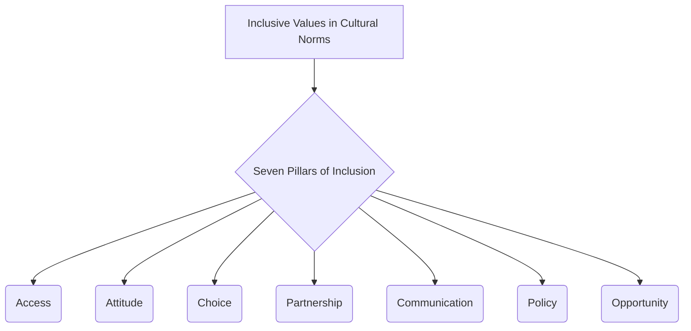

# Definition
Before proceeding, ensure you master [[Inclusive_Values_in_Cultural_Norms]] and Concept_Of_Inclusion because the Seven Pillars of Inclusion represent a practical framework for putting inclusive values into action within cultural norms, serving as a guide for implementing inclusion. The Seven Pillars of Inclusion refer to a **specific framework of operational values and principles that serve as foundational elements for fostering genuinely inclusive environments**. These pillars are: **Access, Attitude, Choice, Partnership, Communication, Policy, and Opportunity**. Each pillar outlines a distinct area where active effort is required to dismantle barriers, promote respect, and ensure equitable participation for all individuals within a society or institution. Think of them as the seven key supports holding up a magnificent archway, where each pillar is essential for the entire structure to stand strong and allow everyone to pass through freely.

# The Mental Model
Imagine a community garden. The "Seven Pillars of Inclusion" are like the different tools and rules that ensure everyone can participate and benefit from the garden. There's a pillar for making sure everyone can *get into* the garden (Access). Another for encouraging positive *feelings* about different types of plants and gardeners (Attitude). One for letting people *decide* what they want to grow (Choice). One for working *together* (Partnership). One for talking *clearly* to each other (Communication). One for the *rules* of the garden (Policy). And finally, one for making sure everyone has a *chance* to grow their favorite vegetables (Opportunity). All seven are needed for a thriving, inclusive garden.


```text
// Scenario 1: Overview of the Seven Pillars of Inclusion
// Output:
// (A flowchart showing "Inclusive Values in Cultural Norms" leading to "Seven Pillars of Inclusion", which then branches into "Access", "Attitude", "Choice", "Partnership", "Communication", "Policy", "Opportunity".)
```
*Note: This `graph TD` illustrates the Seven Pillars of Inclusion as key components of inclusive values in cultural norms.*

# Context & Framework
### The Family Tree
The Seven Pillars of Inclusion reside as a prominent branch under the broader concept of [[Inclusive_Values_in_Cultural_Norms]]. They are distinct from, but complementary to, other [[Frameworks_of_Inclusive_Values]] (such as Equality, Rights, etc.) by offering a more operational, action-oriented guide. These pillars are often referenced in policy development, organizational audits, and community development initiatives, providing a structured approach to assessing and improving inclusivity across various sectors. Each pillar represents a functional area where cultural norms can either support or hinder inclusion.

# The Mastery Deep Dive
### The Cheat Code: How to Remember This
To remember the Seven Pillars of Inclusion, think of the acronym **"AACCPOO"**:
*   **A**ccess: Ensuring all individuals can physically and intellectually reach resources and opportunities.
*   **A**ttitude: Fostering positive and respectful mindsets towards diversity.
*   **C**hoice: Empowering individuals to make autonomous decisions about their lives and participation.
*   **P**artnership: Promoting collaborative relationships among diverse stakeholders.
*   **C**ommunication: Ensuring clear, accessible, and respectful dialogue that reaches everyone.
*   **P**olicy: Establishing rules, laws, and guidelines that actively support inclusion.
*   **O**pportunity: Providing equitable chances for growth, learning, and contribution.

This mnemonic provides a simple yet comprehensive way to recall and apply this crucial framework.

### The "Wikipedia One-Liner"
The Seven Pillars of Inclusion are a foundational framework comprising Access, Attitude, Choice, Partnership, Communication, Policy, and Opportunity, which collectively guide the active implementation of inclusive values within cultural norms. Each pillar represents a critical area for fostering equitable participation, respect for diversity, and the dismantling of systemic barriers in any given society or institution.

# Constraints & Limitations
### Spot the Impostor (Don't be Fooled)
A common "impostor" of genuinely implementing the Seven Pillars is **selective application**. For example, an organization might focus heavily on providing physical "Access" (e.g., ramps, elevators) and boast about its "Policy" (e.g., anti-discrimination statements) but neglect "Attitude" (e.g., perpetuating unconscious biases among staff) or "Choice" (e.g., offering limited options for participation). This piecemeal approach creates an illusion of inclusion because while some pillars are addressed, the overall structure of inclusion remains weak, failing to provide comprehensive support and engagement for all individuals. All seven pillars must be considered holistically for true inclusive transformation.

# Significance & Application
The Seven Pillars of Inclusion provide a practical and actionable framework for organizations, governments, and communities to assess and enhance their inclusive practices. Academically, this framework is used in social policy analysis, educational design, and organizational development to evaluate the effectiveness of inclusion initiatives. Practically, it guides the development of accessibility audits, anti-bias training programs, user-centered design, and legislative reforms. By addressing each pillar, societies can systematically remove barriers and create environments where every individual feels genuinely valued and can participate fully.

# The Worked Example
This lecture slides focus on definitions and conceptual understanding. A worked example here would be a detailed case study illustrating the application of the Seven Pillars of Inclusion.

**Scenario:** A local government agency, "CivicConnect," is reviewing its public services to ensure they align with the `Seven_Pillars_of_Inclusion` and create a truly inclusive experience for all citizens.

**Step 1: Enhancing Access (Physical & Digital)**
CivicConnect ensures all government buildings have ramps, elevators, and accessible restrooms. Their official website is redesigned to meet WCAG accessibility standards, and all public documents are available in multiple formats (e.g., large print, Braille, digital text for screen readers). They also establish mobile service units to reach citizens in remote areas, expanding physical and digital access.

**Step 2: Cultivating a Positive Attitude**
All public-facing staff undergo mandatory training on disability awareness, cultural competence, and unconscious bias. The training emphasizes respectful language and active listening to foster positive `Attitude` towards diverse citizens. Public awareness campaigns are launched to celebrate the diversity within the community, promoting understanding and empathy.

**Step 3: Providing Choice and Encouraging Partnership**
For services like social support programs, CivicConnect offers multiple options for how services are delivered (e.g., in-person, phone, online, home visits), giving citizens `Choice` in how they engage. They actively seek `Partnership` with community organizations representing marginalized groups, involving them in the co-creation of new programs and services.

**Step 4: Improving Communication and Policy**
All public announcements and informational materials are disseminated through multiple accessible channels and in multiple languages relevant to the community. Official government `Policy` is reviewed and revised to explicitly state a commitment to inclusion, ensuring non-discrimination clauses are robust and grievance mechanisms are clear. New policies are enacted to proactively remove barriers rather than just react to complaints.

**Step 5: Ensuring Opportunity**
CivicConnect establishes internship and employment programs specifically targeting underrepresented groups, ensuring `Opportunity` for economic participation. They also provide grants for community-led initiatives that promote social inclusion and skill development for marginalized populations.

By systematically addressing each of the Seven Pillars, CivicConnect transforms its services into a model of genuine inclusion, ensuring all citizens can participate fully and equitably in civic life.

# The Proving Ground
*Test your mastery. Cover the solutions below to test yourself first.*

### Level 1: The Sanity Check (Verification)
**The Fact Check:** List the seven pillars of inclusion as identified in the source material.
> **Solution:** The seven pillars are Access, Attitude, Choice, Partnership, Communication, Policy, and Opportunity.

### Level 2: The Crucible (Mastery & Edge Cases)
**The Impostor:** A newly developed urban park proudly advertises its "inclusive design" with wide paved paths (Access) and clearly posted rules (Policy). However, the park's staff are frequently observed making dismissive comments about different cultural practices, there are no multilingual signs, and all recreational activities require high physical agility, with no alternative options. Analyze why this park, despite addressing two pillars, is an "impostor" for genuine inclusion according to the Seven Pillars of Inclusion.
> **Solution:** This park is an "impostor" for genuine inclusion because while it addresses "Access" (wide paths) and "Policy" (posted rules), it fundamentally neglects several other critical pillars. The staff's dismissive comments indicate a failure in fostering a positive **Attitude**. The absence of multilingual signs is a significant breakdown in **Communication**. Furthermore, offering only activities requiring "high physical agility" with no alternatives means there is no true **Choice** or **Opportunity** for many individuals to participate, and the park fails to provide equitable **Opportunity**. The selective application of pillars, while neglecting others, prevents the creation of a truly comprehensive and inclusive environment, making it an "impostor" of the full framework.

# Key Takeaways
*   The Seven Pillars of Inclusion (Access, Attitude, Choice, Partnership, Communication, Policy, Opportunity) form a framework for fostering inclusive environments.
*   Each pillar addresses a distinct area crucial for dismantling barriers and ensuring equitable participation for all.
*   Comprehensive application of all seven pillars is necessary to avoid selective and superficial inclusion.

# Knowledge Graph Connections
| Concept                               | Connection / Relationship                                                          |
| :
------------------------------------ | :
--------------------------------------------------------------------------------- |
| [[Inclusive_Values_in_Cultural_Norms]] | The Seven Pillars are an operational framework for putting inclusive values into cultural norms. |
| [[Frameworks_of_Inclusive_Values]]    | The Seven Pillars are a more specific, action-oriented subset of broader inclusive value frameworks. |
| [[Building_Inclusive_Community]]      | Applying the Seven Pillars is a practical strategy for building an inclusive community. |
| [[Definition_of_Inclusive_Culture]]   | These pillars provide concrete actions for achieving the definition of an inclusive culture. |
---