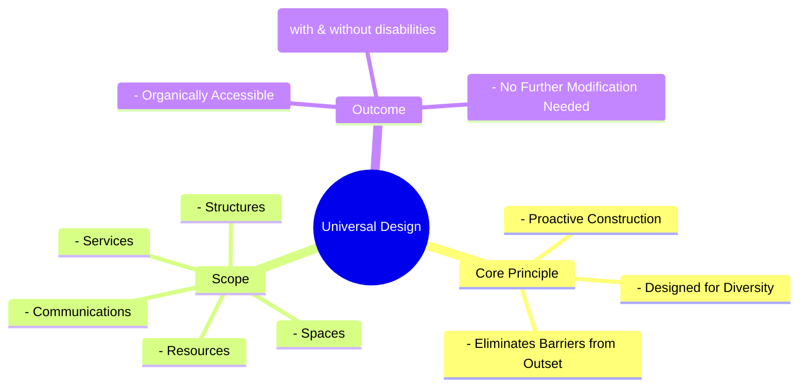

# Definition
Before proceeding, ensure you master [[Dimensions_of_Inclusive_Culture]] and Concept_Of_Inclusion because Universal Design is one of the foundational dimensions for achieving an inclusive culture, requiring an understanding of how inclusion is practically implemented. Universal Design refers to the **proactive construction and development of structures, spaces, services, communications, and resources that are inherently and organically accessible to the widest possible range of people, with and without disabilities, without requiring further modification or accommodation**. It is about designing for diversity from the outset, eliminating barriers before they arise, and fostering an environment where accessibility is the default, not an afterthought. Think of it like designing a building where the main entrance is a ramp *and* stairs, a single design choice that works seamlessly for everyone without needing a separate accessible entrance.

# The Mental Model
Imagine you're designing a playground. "Universal Design" means you don't just build a standard playground and then add a special accessible swing later. Instead, from the very beginning, you design the whole playground with different surfaces for different mobility aids, sensory play areas for children with various needs, and equipment that can be used by children of all abilities. It's about building a playground where *everyone* can play together, without anyone feeling like an add-on or needing special adjustments.


```text
// Scenario 1: Basic understanding of Universal Design principles
// Output:
// (A visual mindmap showing "Universal Design" at the root, branching into "Core Principle", "Scope", and "Outcome".
// "Core Principle" branches into "Proactive Construction", "Designed for Diversity", "Eliminates Barriers from Outset".
// "Scope" branches into "Structures", "Spaces", "Services", "Communications", "Resources".
// "Outcome" branches into "Organically Accessible", "For Range of People (with & without disabilities)", "No Further Modification Needed".)
```
*Note: This `mindmap` visualizes the core principle, scope, and outcomes of Universal Design.*

# Context & Framework
### Where Does it Live? (The Map)
Universal Design is found in architecture, urban planning, product development, information technology, and educational curriculum design. It applies to physical spaces (e.g., buildings, parks), digital interfaces (e.g., websites, apps), and services (e.g., public transportation, customer support). This concept directly aligns with the broader goal of [[Building_Inclusive_Community]] by ensuring that environments and tools are fundamentally accessible, promoting participation and equitable access as inherent features rather than special provisions.

# The Mastery Deep Dive
### Who are the Neighbors?
Universal Design is a crucial neighbor to [[Workplace_Accommodations_and_Accessibility]] as it proactively reduces the need for individualized accommodations by designing accessible environments from the start. It complements [[Recruitment_Training_and_Advancement]] by creating accessible workplaces and training materials, thereby removing barriers to employment and growth for persons with disabilities. Furthermore, it is a foundational element of the [[Dimensions_of_Inclusive_Culture]], providing the physical and informational infrastructure necessary for true inclusion. Without Universal Design, other dimensions of inclusivity can be significantly hampered.

### The "Wikipedia One-Liner"
Universal Design is the comprehensive approach to creating structures, environments, products, and services that are inherently usable by all people, to the greatest extent possible, without the need for adaptation or specialized design. It is a key dimension of inclusive culture, advocating for proactive accessibility from the conceptual stage, thereby minimizing barriers and fostering widespread participation for individuals with and without disabilities.

# Constraints & Limitations
### Spot the Impostor (Don't be Fooled)
A common "impostor" of Universal Design is **"accessible design" as an afterthought**. This occurs when a product or environment is initially designed without considering accessibility, and then modifications (e.g., adding a ramp to a building with only stairs) are made later. While these modifications improve accessibility, they are not Universal Design. Universal Design involves anticipating diverse user needs *from the very beginning* of the design process, making accessibility an intrinsic feature, not a retrofitted addition or a "special solution" for a specific group. An add-on ramp is an accessible modification, but not a universal design solution.

# Significance & Application
Universal Design has profound significance for promoting equity, efficiency, and enhanced user experience for everyone. Academically, it is studied in fields like architecture, industrial design, human-computer interaction, and education, influencing pedagogical approaches. Practically, it leads to smarter public infrastructure, more user-friendly technology, and more engaging learning environments. By ensuring products and environments are "organically accessible," Universal Design benefits not only people with disabilities but also seniors, parents with strollers, and anyone navigating temporary limitations.

# The Worked Example
This lecture slides focus on definitions and conceptual understanding. A worked example here would be a detailed case study illustrating the application of Universal Design principles.

**Scenario:** A tech company, "InnoApp," is developing a new social media application and wants to ensure it is designed using `Universal_Design` principles from the ground up, rather than adding accessibility features later.

**Step 1: User Research with Diverse Abilities**
Before writing any code, InnoApp's design team conducts extensive user research, including participants with various disabilities (e.g., visual impairments, motor impairments, cognitive disabilities) and diverse demographics. They gather insights on how different users interact with apps, what barriers they encounter, and what features would enhance their experience. This proactive step ensures "designing for diversity from the outset."

**Step 2: Designing for Multiple Input and Output Modalities**
The app's interface is designed to support multiple input methods (e.g., touch, voice commands, keyboard navigation) and output methods (e.g., visual display, screen reader compatibility, haptic feedback). For example, every image includes descriptive alt-text, and videos have synchronized captions and audio descriptions. This ensures "communications and resources are organically accessible" to a wide range of users, making it usable without specific modifications.

**Step 3: Ensuring Clear and Consistent Navigation**
The navigation structure is kept simple, intuitive, and consistent across all screens, minimizing cognitive load. Labels for buttons and icons are clear and unambiguous, and color contrast ratios meet accessibility standards to benefit users with low vision or color blindness. Text can be easily resized without breaking the layout. This proactive attention to clarity and usability benefits all users, not just those with disabilities.

**Step 4: Incorporating User-Adjustable Settings**
The app includes a robust settings menu that allows users to customize their experience, such as adjusting font sizes, choosing high-contrast themes, modifying animation speeds, and setting notification preferences. These user-adjustable settings empower individuals to tailor the app to their specific needs, ensuring it is "organically accessible" without needing developers to create separate "accessible versions."

By implementing these Universal Design principles, InnoApp creates a social media platform that is inherently inclusive, providing a seamless and engaging experience for the widest possible audience, aligning with its role as a dimension of `Inclusive_Culture`.

# The Proving Ground
*Test your mastery. Cover the solutions below to test yourself first.*

### Level 1: The Sanity Check (Verification)
**The Fact Check:** What is the core characteristic of resources developed using Universal Design, in terms of their accessibility?
> **Solution:** Resources developed using Universal Design are organically accessible to a range of people with and without disabilities, without further need for modification or accommodation.

### Level 2: The Crucible (Mastery & Edge Cases)
**The Impostor:** A software company develops a new operating system with a high-contrast mode and a screen reader built-in. They proudly market these features as evidence of their commitment to "Universal Design." However, the default user interface is extremely complex with tiny icons, relies heavily on complex mouse gestures for navigation, and frequently uses flashing animations that can trigger discomfort for sensitive users. Analyze why this operating system, despite its accessibility features, is an "impostor" for genuine Universal Design, referencing the core definition and proactive nature of Universal Design.
> **Solution:** This operating system is an "impostor" for genuine Universal Design because while it includes *some* accessibility features (high-contrast mode, screen reader), the fundamental design of its "structures, spaces, services, communications, and resources" (the default UI) is *not* "organically accessible to the widest possible range of people, with and without disabilities, without requiring further modification or accommodation." The complex UI, reliance on mouse gestures, and flashing animations create barriers from the outset. True Universal Design is about "proactive construction" and "designing for diversity from the outset," making accessibility the default experience for all. Adding accessibility features as a separate mode or tool *after* an inherently inaccessible default design is a form of accessible design (an afterthought), not Universal Design, which aims to eliminate the need for such separate features by building inclusivity into the core experience.

# Key Takeaways
*   Universal Design is the proactive creation of inherently accessible structures, spaces, services, and resources for all, without further modification.
*   It's about designing for diversity from the outset, eliminating barriers before they arise, making accessibility the default.
*   This dimension of inclusive culture benefits everyone, not just people with disabilities, by creating user-friendly environments.

# Knowledge Graph Connections
| Concept                         | Connection / Relationship                                                          |
| :
------------------------------ | :
--------------------------------------------------------------------------------- |
| [[Dimensions_of_Inclusive_Culture]] | Universal Design is a foundational dimension for establishing an inclusive culture. |
| [[Workplace_Accommodations_and_Accessibility]] | Universal Design reduces the need for individual accommodations by creating inherently accessible environments. |
| [[Recruitment_Training_and_Advancement]] | Universal Design ensures accessible training and workplaces, facilitating fair recruitment and advancement. |
| [[Building_Inclusive_Community]]  | Implementing Universal Design is a key step in creating physically and digitally inclusive communities. |
---