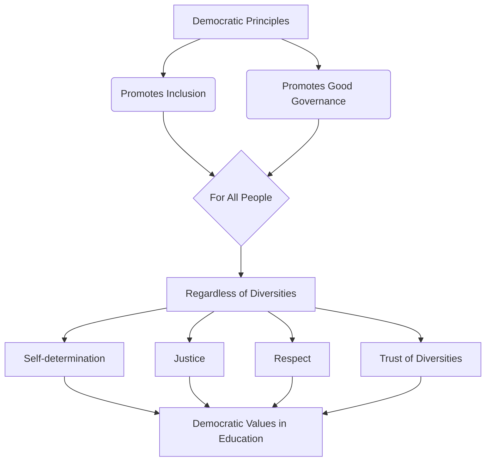

# Definition
Before proceeding, ensure you master Concept_Of_Inclusion and [[Peace_in_Inclusiveness]] because democratic principles for inclusive practices are the foundational philosophy guiding how societies integrate diversity to achieve peace.
Democratic principles for inclusive practices represent the philosophical underpinnings that advocate for the promotion of inclusion and good governance, ensuring the well-being and representation of all people, irrespective of their diversities. These principles extend the concept of "rule of the people" to encompass every human being, bringing values like self-determination, justice, respect, and trust into educational and societal frameworks. A simpler way to think about it is like a constitution for fairness: these principles lay down the fundamental rules that ensure everyone has a voice, is treated equally, and contributes to the collective good.

# The Mental Model
Imagine a large, interconnected web where every single strand represents an individual, and every node where strands connect represents a community or institution. "Democratic Principles for Inclusive Practices" are like the foundational laws of physics governing this web: they ensure every strand has equal tension, no strand can dominate or break another, and the entire web (society) can flex and adapt while maintaining its integrity and supporting all its parts.


```text
// Scenario 1: Breakdown of democratic principles for inclusive practices
// Output:
// A visual representation of the graph diagram:
// "Democratic Principles" lead to "Promotes Inclusion" and "Promotes Good Governance".
// Both "Promotes Inclusion" and "Promotes Good Governance" are "For All People".
// "For All People" means "Regardless of Diversities".
// "Regardless of Diversities" contributes to "Self-determination", "Justice", "Respect", and "Trust of Diversities".
// All these lead to "Democratic Values in Education".
```
*Note: This `graph TD` illustrates the hierarchical breakdown of democratic principles, showing how they promote inclusion and good governance for all people, irrespective of diversities, and instill core values in education.*

# Context & Framework
### The Rule of All, By All, For All
Democracy, when viewed through the lens of inclusive practices, is far more than a system of government; it is a philosophy that fundamentally shapes societal interaction. It moves beyond the traditional "rule of the majority" to genuinely embrace "the rule of the people, by the people, for the people," where "people" explicitly means all human beings, regardless of their diverse backgrounds. This framework posits that for democracy to truly flourish, it must actively promote inclusion and good governance, ensuring that the interests and contributions of every individual are valued. Education, in this context, becomes a crucial vehicle for instilling these democratic values, preparing citizens for active and equitable participation.

# The Mastery Deep Dive
### Hierarchical Breakdown: Pillars of Inclusive Democracy
The democratic principles for inclusive practices are built upon a series of interconnected pillars that ensure true representation and equity.

*   **Core Philosophy:**
    *   **Promotes Inclusion:** This is the active process of ensuring all individuals, regardless of their differences, are part of societal structures and decision-making.
    *   **Promotes Good Governance:** This involves transparent, accountable, and participatory leadership that acts in the best interest of all citizens.
*   **Universal Scope:**
    *   **"For the People" means "All Human Being, Regardless of Diversities":** This expands the traditional democratic ideal to explicitly include cultural, linguistic, socioeconomic, and other forms of diversity, ensuring no group is systematically overlooked or marginalized.
*   **Instilled Values (especially through Education):**
    *   **Self-determination:** The right and ability of individuals and groups to make choices about their own lives and futures.
    *   **Justice:** The fair and equitable treatment of all individuals under the law and within societal structures.
    *   **Respect:** Valuing the dignity, autonomy, and contributions of others, even when opinions differ.
    *   **Trust of Diversities:** Building confidence and reliance on the different perspectives and strengths that diverse groups bring to a society.

These pillars are not independent but mutually reinforcing, creating a democratic system that is both robust and truly representative. Schools play a pivotal role in this process by actively helping students to realize and embody these foundational democratic values.

# Constraints & Limitations
### The "Majority Rule" Trap
A significant trap in the application of democratic principles for inclusive practices is a narrow interpretation of "majority rule." While majority decision-making is a cornerstone of democracy, if it is not tempered by robust inclusive principles, it can lead to the marginalization and oppression of minority groups. This "majority rule" trap occurs when the needs, rights, and voices of minorities are overridden without due consideration, negotiation, or protection, under the guise of democratic process. For example, a decision made by a majority that negatively impacts a specific cultural minority without their meaningful input or safeguards is not truly inclusive, even if procedurally democratic. Such an approach undermines the very values of justice, respect, and trust of diversities that are essential for long-term societal peace and stability.

# Significance & Application
These principles are fundamental for developing equitable governance systems, fostering social cohesion, and ensuring that educational institutions prepare citizens for active, inclusive participation in society. They are applicable in policy-making, community development, and curriculum design.

# The Worked Example
This section details how a school implements democratic principles for inclusive practices.

Consider a secondary school aiming to foster a truly inclusive environment among its diverse student body.

**The Application:**
1.  **Promoting Inclusion and Good Governance:**
    *   **Student Council Reform:** Restructure the student council to ensure proportional representation from all major cultural, linguistic, and ability groups within the school. This ensures "promotes inclusion" and "good governance."
    *   **Open Forums:** Hold regular "town hall" style meetings where all students can voice concerns and contribute to school policy discussions.
2.  **Instilling Democratic Values in Education:**
    *   **Curriculum Integration:** Incorporate lessons on "self-determination," "justice," "respect," and "trust of diversities" into civics and social studies classes. Use case studies of historical and contemporary examples of these values in practice.
    *   **Peer Mediation Program:** Implement a peer mediation program where students are trained in conflict resolution skills, encouraging them to "respect for the differences" and "seek common ground" (linking to [[Conflict_Resolution_Mechanisms]]).
    *   **Fair Discipline Policies:** Develop transparent and consistently applied disciplinary policies that are perceived as fair by all students, reinforcing "justice" and building "trust."
3.  **Celebrating Diversity:**
    *   Organize "Diversity Weeks" where students from different backgrounds share their cultures, languages, and traditions, explicitly encouraging "acknowledging the validity of different cultural expressions and contributions" (linking to [[Achieving_Unity_in_Diversity]]).

By actively integrating these democratic principles, the school transforms from a mere learning institution into a microcosm of an inclusive society, preparing students to be active and responsible citizens.

# The Proving Ground
*Test your mastery. Cover the solutions below to test yourself first.*

### Level 1: The Sanity Check (Verification)
**The Fact Check:** What is the core philosophy of democracy as it relates to promoting inclusion and good governance?
> **Solution:** Democracy is the philosophy that promotes inclusion and good governance to the best interest of people.

### Level 2: The Crucible (Mastery & Edge Cases)
**The Sort:** Categorize a list of organizational policies as either reflecting democratic principles for inclusive practices or deviating from them: (a) Decisions made exclusively by senior management; (b) Employee committees with diverse representation contributing to policy; (c) Policies that explicitly protect minority group rights; (d) Favoring certain departments over others for resource allocation; (e) Regular, anonymous feedback mechanisms for all staff.
> **Solution:**
*   **Reflecting Democratic Principles for Inclusive Practices:** (b) Employee committees with diverse representation contributing to policy; (c) Policies that explicitly protect minority group rights; (e) Regular, anonymous feedback mechanisms for all staff.
*   **Deviating from Democratic Principles for Inclusive Practices:** (a) Decisions made exclusively by senior management; (d) Favoring certain departments over others for resource allocation.

### Level 3: Mastery (The Crucible)
**The Impostor:** A newly formed community group claims to be democratic, stating their policies are "for the majority." Explain why this statement alone might not align with the democratic principles for inclusive practices as defined in the unit.
> **Solution:** While "for the majority" is a common democratic concept, this statement alone might not align with democratic principles for inclusive practices because, as defined in the unit, "people" in the "rule of the people, by the people, for the people" explicitly means "all human being, regardless of the diversities." A sole focus on the majority can lead to the "majority rule" trap, where the needs, rights, and voices of minority groups are overlooked or suppressed, undermining values such as justice, respect, and trust of diversities that are fundamental to truly inclusive democratic practice.

# Key Takeaways
*   Democratic principles for inclusive practices extend "rule of the people" to all human beings, promoting inclusion and good governance regardless of diversities.
*   They instill values like self-determination, justice, respect, and trust, particularly through education.
*   A narrow focus on "majority rule" without safeguarding minority rights can undermine true inclusive democratic practice.

# Knowledge Graph Connections
| Concept                                          | Connection / Relationship                                                                                                           |
| :
----------------------------------------------- | :
---------------------------------------------------------------------------------------------------------------------------------- |
| [[Peace_in_Inclusiveness]]                       | These principles create the societal conditions necessary for peace through mutual understanding and positive relationships.        |
| [[Democratic_Values]]                            | These principles are the overarching philosophy that promotes and reinforces specific democratic values.                            |
| [[Importance_of_Democratic_Inclusive_Education]] | Democratic inclusive education is crucial for instilling these principles and their associated values in individuals.              |
| [[Respecting_Diverse_Needs_in_Inclusive_Education]] | Inclusive education, guided by these principles, practices respect for diverse needs, potentials, and learning styles.               |
| [[Sources_of_Conflict_Absence_of_Inclusiveness]] | By promoting inclusion and good governance, these principles directly counteract the individual sources and manifestations of conflict. |
---