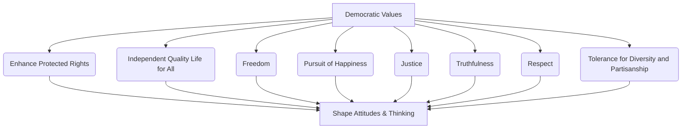

# Definition
Before proceeding, ensure you master [[Democratic_Principles_for_Inclusive_Practices]] and [[Peace_in_Inclusiveness]] because democratic values are the inherent moral compass derived from these principles, essential for fostering peace.
Democratic values are the fundamental moral and ethical principles that are actively promoted and upheld within a democratic society to ensure the well-being, rights, and participation of all its members. These values include enhanced protected rights, independent quality of life, freedom, pursuit of happiness, justice, truthfulness, respect, and tolerance for diversity. They serve as the guiding ideals that shape attitudes and ways of thinking, particularly instilled through inclusive education. A simpler way to think about it is like the operating system of a fair society: these values are the core code that ensures all functions (interactions, decisions, policies) run justly and equitably for everyone.

# The Mental Model
Imagine a sturdy, magnificent tree with deep roots and many branches. The "Democratic Principles for Inclusive Practices" are the strong roots anchoring the tree. The "Democratic Values" are the vital sap flowing through every part of the tree, nourishing its growth, ensuring every leaf (individual) is healthy, vibrant, and contributing to the overall strength and beauty of the tree (society). These values ensure fairness, growth, and resilience.


```text
// Scenario 1: Breakdown of democratic values
// Output:
// A visual representation of the graph diagram:
// "Democratic Values" lead to "Enhance Protected Rights", "Independent Quality Life for All", "Freedom", "Pursuit of Happiness", "Justice", "Truthfulness", "Respect", and "Tolerance for Diversity and Partisanship".
// All these values collectively "Shape Attitudes & Thinking".
```
*Note: This `graph TD` illustrates the hierarchical breakdown of various democratic values, showing how each contributes to shaping attitudes and thinking within an inclusive society.*

# Context & Framework
### The Moral Compass of an Inclusive Society
Democratic values form the crucial moral compass that guides the functioning of an inclusive society. They are not merely abstract ideals but concrete principles that influence individual behaviors, public policies, and the overall social fabric. By prioritizing concepts like justice, freedom, and respect for diversity, these values create an environment where every citizen can thrive and participate fully. Education, particularly inclusive education, plays a vital role in internalizing these values, making them a natural attitude and way of thinking for individuals. This framework recognizes that for democracy to be truly inclusive and sustainable, it must be deeply embedded in the shared values of its people, transcending political structures alone.

# The Mastery Deep Dive
### Hierarchical Breakdown: Core Democratic Values
Democratic values are a constellation of ethical principles, each contributing to the foundation of an inclusive society:

*   **Foundational Rights & Well-being:**
    *   **Enhance Protected Rights:** Ensuring fundamental human rights are not only acknowledged but actively safeguarded for all.
    *   **Independent Quality Life for All:** Striving for a society where every individual has the opportunity to achieve a dignified and fulfilling existence.
    *   **Freedom:** The power or right to act, speak, or think as one wants without hindrance or restraint, within the bounds of respecting others' freedoms.
    *   **Pursuit of Happiness:** The right to strive for personal well-being and contentment, recognized as a fundamental human aspiration.
*   **Ethical Conduct & Interpersonal Harmony:**
    *   **Justice:** Fairness in the way people are treated, ensuring equity and impartiality in laws and social systems.
    *   **Truthfulness:** Honesty and integrity in communication and actions, fostering trust within society.
    *   **Respect:** Deep appreciation for the worth, dignity, and unique contributions of every individual, especially those who are different.
    *   **Tolerance for Diversity and Partisanship:** The ability to accept and even value differences in opinion, belief, culture, and political affiliation, without resorting to discrimination or hostility.

These values collectively promote a way of thinking that is essential for mutual understanding, positive relationships, and conflict prevention, directly supporting the broader goal of peace in inclusiveness.

# Constraints & Limitations
### The "Lip Service" Trap
A common trap with democratic values is the "lip service" trap, where these values are verbally affirmed but not genuinely practiced or upheld. For example, a political leader might publicly speak about "justice" and "respect for diversity," but their policies or actions privately contradict these statements, leading to actual discrimination or inequality. This disparity between proclaimed values and lived reality erodes public trust, breeds cynicism, and undermines the very foundation of an inclusive democratic society. When values are merely rhetorical and not integrated into daily attitudes and behaviors, they become hollow, failing to shape the human mind as intended by inclusive education, and ultimately contributing to conflict rather than preventing it.

# Significance & Application
Democratic values are critical for shaping individual attitudes, influencing public policy, and fostering a culture of cooperation and fairness. They are central to inclusive education, aiming to cultivate active, responsible citizens committed to justice and diversity.

# The Worked Example
This section details how a community initiative promotes democratic values, specifically "respect" and "tolerance for diversity."

Consider a local council launching an initiative to reduce tensions between different cultural groups in a diverse neighborhood.

**The Application:**
1.  **Promoting "Respect":**
    *   **Intercultural Dialogue Sessions:** Organize facilitated dialogue sessions where members from different cultural groups can share their traditions, stories, and daily experiences. The facilitators emphasize active listening and mutual understanding, directly fostering "respect" by valuing each person's unique background.
    *   **"Meet Your Neighbor" Events:** Host social gatherings that encourage informal interactions between diverse residents, breaking down stereotypes and building personal connections based on "respect."
2.  **Promoting "Tolerance for Diversity and Partisanship":**
    *   **Public Awareness Campaign:** Launch a campaign with posters and digital content that visually celebrate the neighborhood's cultural and linguistic diversity, explicitly promoting "tolerance for diversity."
    *   **Civic Education Workshops:** Offer workshops on local governance that explain how diverse political views (partisanship) can contribute to a stronger community through respectful debate, fostering "tolerance for partisanship."
3.  **Integrating with Education (linking to [[Importance_of_Democratic_Inclusive_Education]]):**
    *   Collaborate with local schools to integrate these values into their curriculum through projects that highlight cultural exchange and respectful debate.

Through these initiatives, the community actively promotes democratic values, shaping attitudes, fostering mutual understanding, and strengthening the social fabric against division.

# The Proving Ground
*Test your mastery. Cover the solutions below to test yourself first.*

### Level 1: The Sanity Check (Verification)
**The Fact Check:** List three values that democratic principles promote.
> **Solution:** Enhance protected rights; independent quality life for all; freedom; pursuit of happiness; justice; truthfulness; respect; tolerance for diversity and partisanship. (Any three are acceptable).

### Level 2: The Crucible (Mastery & Edge Cases)
**The Sort:** Given a list of educational initiatives, identify which ones are most likely to instill democratic values in students: (a) Rote memorization of historical dates; (b) Debates on controversial social issues; (c) Community service projects; (d) Standardized tests focused on individual performance; (e) Peer-led discussions on ethical dilemmas.
> **Solution:**
*   **Most Likely to Instill Democratic Values:** (b) Debates on controversial social issues (promotes respect, tolerance, truthfulness); (c) Community service projects (promotes justice, respect, independent quality life for all); (e) Peer-led discussions on ethical dilemmas (promotes justice, respect, truthfulness, freedom of thought).
*   **Less Likely to Instill Democratic Values:** (a) Rote memorization of historical dates (focuses on recall, not values); (d) Standardized tests focused on individual performance (can undermine cooperation, focus on individual over collective).

### Level 3: Mastery (The Crucible)
**The Impostor:** A school implements a program focused on "order and discipline" to improve student behavior. While beneficial, explain why this program alone might not fully embody the democratic values crucial for inclusive education, and what might be missing.
> **Solution:** While "order and discipline" can be beneficial for a learning environment, this program alone might not fully embody democratic values because it primarily focuses on conformity and control, potentially overlooking critical elements such as "freedom," "self-determination," "respect for differences," and "tolerance for diversity and partisanship." Democratic values in inclusive education aim to develop independent thinkers who understand their rights and responsibilities, engage respectfully with diverse viewpoints, and participate actively in shaping their community. A program solely on order might inadvertently suppress individual expression or critical thinking if not balanced with opportunities for dialogue, justice, and respect for varied perspectives, as emphasized in the "Hierarchical Breakdown: Core Democratic Values" section.

# Key Takeaways
*   Democratic values are the moral principles of a fair society, including protected rights, quality of life, freedom, justice, respect, and tolerance for diversity.
*   They shape attitudes and ways of thinking, particularly instilled through inclusive education to foster active participation.
*   Merely paying "lip service" to these values without genuine practice can erode trust and undermine inclusive democratic foundations.

# Knowledge Graph Connections
| Concept                                          | Connection / Relationship                                                                                                           |
| :
----------------------------------------------- | :
---------------------------------------------------------------------------------------------------------------------------------- |
| [[Democratic_Principles_for_Inclusive_Practices]] | These values are the specific ethical and moral tenets promoted by the overarching democratic principles for inclusive practices.   |
| [[Importance_of_Democratic_Inclusive_Education]] | Democratic inclusive education is the primary means by which these values are instilled and nurtured in individuals.               |
| [[Peace_in_Inclusiveness]]                       | Upholding these values directly contributes to the mutual understanding and positive relationships characteristic of inclusive peace. |
| [[Respecting_Diverse_Needs_in_Inclusive_Education]] | Respect and tolerance for diversity are explicit democratic values that underpin the respect for diverse needs in education.        |
| [[Sources_of_Conflict_Absence_of_Inclusiveness]] | Promoting these values directly counteracts individual characteristics (e.g., prejudice, arrogance) that lead to conflict.          |
---