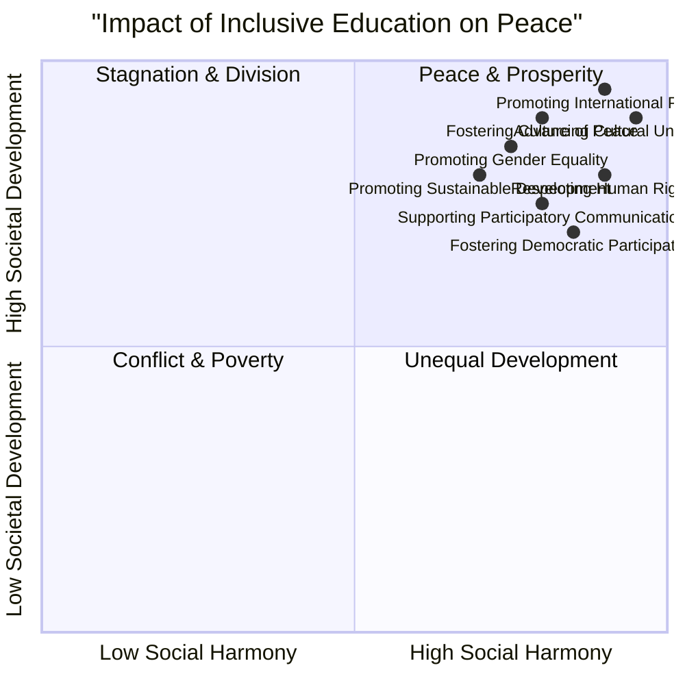

# Definition
Before proceeding, ensure you master [[Peace_in_Inclusiveness]] and Concept_Of_Inclusion because the role of inclusive education in peace is rooted in these foundational concepts.
The role of inclusive education in peace is its function as a foundational mechanism for cultivating a peaceful, democratic, and prosperous society by developing mutual understanding, positive relationships, and respect for diversity. It acts as a primary vehicle for instilling values, attitudes, and behaviors that prevent conflict and promote social cohesion. A simpler way to think about it is like planting seeds of harmony: inclusive education carefully cultivates these seeds in individuals, helping them grow into contributing members of a peaceful society.

# The Mental Model
Imagine a large, interconnected ecosystem, like a forest. Each tree and creature has a unique role, and the health of the entire forest depends on their peaceful coexistence and mutual support. Inclusive education acts as the "forest guardian," tending to each individual (tree/creature) from a young age, ensuring they learn to respect, understand, and cooperate with all other parts of the ecosystem, thereby maintaining the forest's overall peace and prosperity.


```text
// Scenario 1: Comprehensive impact of inclusive education
// Output:
// A visual representation of the quadrant chart showing multiple data points clustered in the "Peace & Prosperity" quadrant (top-right).
// Each data point (e.g., "Fostering Culture of Peace", "Promoting Sustainable Development") will be positioned based on its X and Y coordinates, indicating its contribution to social harmony and societal development.
// The overall visual indicates that inclusive education's various roles contribute strongly to both high social harmony and high societal development.
```
*Note: This `quadrantChart` qualitatively visualizes the positive impact of inclusive education across two axes: social harmony and societal development, demonstrating its broad influence on peace and prosperity.*

# Context & Framework
### The Educational Engine for Societal Harmony
Inclusive education extends far beyond classroom accessibility; it is a powerful engine for building a peaceful society. By bringing together diverse learners and fostering an environment of mutual respect and understanding, it directly counters the roots of conflict like prejudice and discrimination. Its framework integrates the teaching of values inherent in a culture of peace, such as conflict prevention, non-violence, and consensus-building, thereby equipping individuals with the social and emotional competencies necessary for harmonious coexistence. Without this intentional educational effort, societies risk perpetuating cycles of exclusion and division.

# The Mastery Deep Dive
### Qualitative Analysis: Inclusive Education's Impact
The impact of inclusive education on peace can be analyzed through several qualitative dimensions. Firstly, it fosters a **culture of peace** by explicitly promoting values, attitudes, and behaviors like dialogue, conflict resolution, and active non-violence. Secondly, it contributes to **sustainable economic and social development** by addressing root causes of conflict such as poverty and social inequalities, thereby reducing grievances. Thirdly, it actively promotes **respect for human rights** at all levels, establishing a foundation of justice that is crucial for peace. Furthermore, inclusive education drives **gender equality** in decision-making, broadens **cultural understanding** through dialogue, supports **democratic participation** and citizenship, and facilitates the **free flow of information**—all vital elements for preventing conflict and promoting international peace and security. Each of these contributions acts as a peace-multiplier, collectively leading to more stable and equitable societies.

# Constraints & Limitations
### The "Tokenism" Trap
A significant trap in inclusive education's role in peace is "tokenism," where inclusive practices are superficial rather than deeply integrated. For example, simply having diverse students in a classroom without actively fostering mutual understanding, addressing biases, or adapting pedagogical methods to cater to varied needs will not automatically lead to peace. If inclusive education is perceived as a mere checklist item or an add-on, it fails to instil the profound values of respect and dialogue. This superficial approach can even exacerbate divisions if differences are highlighted without the necessary tools for bridging them, undermining the very goal of promoting peace.

# Significance & Application
Inclusive education is paramount for cultivating peaceful and democratic societies. It provides the essential values and skills for conflict resolution, promotes social cohesion, and directly contributes to sustainable development by addressing inequalities. Its application spans from early childhood education to adult learning, impacting civic engagement and international relations.

# The Worked Example
This section details how inclusive education fosters specific competencies for peace.

Consider a primary school implementing an inclusive education program aimed at fostering a culture of peace.

**The Application:**
1.  **Fostering Conflict Prevention and Resolution:**
    *   **Classroom Integration:** Teachers use role-playing scenarios to demonstrate non-violent conflict resolution techniques (e.g., "agree on a mutually acceptable time and place to discuss the conflict," "listen and ask questions" from [[Conflict_Resolution_Mechanisms]]).
    *   **Curriculum:** Lessons explicitly teach about different cultures, promoting "respect for different points of view and the ability to see the world through the eyes of others" (a competency from [[Mechanisms_for_Sustainable_Peace]]).
2.  **Promoting Sustainable Economic Development:**
    *   **Project-Based Learning:** Students collaborate on projects addressing local community issues, understanding how "eradication of poverty and social inequalities" contributes to peace.
3.  **Promoting Respect for Human Rights:**
    *   **Civics Education:** Curriculum integrates discussion on the Universal Declaration of Human Rights, ensuring students understand their own rights and responsibilities, and those of others.
4.  **Promoting Gender Equality:**
    *   **Inclusive Activities:** Ensure all classroom activities and leadership roles are open to all genders, challenging stereotypes and promoting "gender equality in economic, social and political decision-making."

Through these integrated approaches, inclusive education actively shapes students' values and behaviors, laying a solid foundation for a peaceful and just society.

# The Proving Ground
*Test your mastery. Cover the solutions below to test yourself first.*

### Level 1: The Sanity Check (Verification)
**The Fact Check:** List three key areas where inclusive education is considered crucial for fostering peace.
> **Solution:** Fostering education that promotes values for a culture of peace, promoting sustainable economic and social development, and promoting respect for human rights.

### Level 2: The Crucible (Mastery & Edge Cases)
**The Trade-off:** A new educational policy is being debated: Option A focuses solely on academic achievement metrics (e.g., standardized test scores), while Option B integrates comprehensive inclusive practices promoting peace values (e.g., conflict resolution, cultural understanding). Justify which option aligns better with fostering peace, democracy, and development based on the unit's discussion of inclusive education's role.
> **Solution:** Option B, integrating comprehensive inclusive practices, aligns better. While academic achievement is valuable, Option A's sole focus ignores the broader foundational role of inclusive education in actively cultivating peace, sustainable development, and democratic participation by addressing social inequalities, fostering cultural understanding, and instilling non-violent conflict resolution skills, as outlined in the "Qualitative Analysis: Inclusive Education's Impact" section. Without these foundational elements, purely academic gains may not translate into a peaceful or truly developed society.

# Key Takeaways
*   Inclusive education is a foundational mechanism for building a peaceful, democratic, and prosperous society by fostering mutual understanding and respect for diversity.
*   It actively promotes a culture of peace, sustainable development, human rights, and gender equality, addressing root causes of conflict and inequality.
*   The impact of inclusive education goes beyond academic achievement, cultivating the social and emotional competencies vital for harmonious coexistence and societal progress.

# Knowledge Graph Connections
| Concept                                          | Connection / Relationship                                                                                 |
| :
----------------------------------------------- | :
-------------------------------------------------------------------------------------------------------- |
| [[Peace_in_Inclusiveness]]                       | Inclusive education is a foundational mechanism for creating and sustaining peace in diverse societies.   |
| [[Mechanisms_for_Sustainable_Peace]]             | Inclusive education contributes directly to the competencies required for sustainable peace.              |
| [[Democratic_Principles_for_Inclusive_Practices]] | Inclusive education instills the values of cooperation, fairness, and justice essential for democracy.    |
| [[Valuing_Diversity_and_Multicultural_Education]] | Inclusive education respects diversity while teaching youth to be effective members of a democratic society. |
---