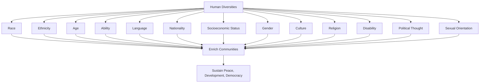

# Definition
Before proceeding, ensure you master [[Respecting_Diverse_Needs_in_Inclusive_Education]] and [[Democratic_Principles_for_Inclusive_Practices]] because understanding the various types of diversities is foundational to effectively implementing inclusive practices.
Types of diversities refer to the multifaceted categories of human differences that enrich communities and must be respected and accepted to sustain peace, development, and democracy. These categories encompass both visible and invisible attributes, including race, ethnicity, age, ability, language, nationality, socioeconomic status, gender, culture, religion, disability, political thought, and sexual orientation. Recognizing and valuing these distinctions is crucial for fostering a stronger sense of identity and well-being, and for dispelling negative stereotypes. A simpler way to think about it is like the ingredients in a vibrant, complex dish: each ingredient (type of diversity) adds a unique flavor and texture, and the richness of the final meal comes from thoughtfully combining and respecting all of them.

# The Mental Model
Imagine a vast, intricate tapestry woven from countless threads of different colors, textures, and materials. Each thread represents a "Type of Diversity." The strength, beauty, and resilience of the entire tapestry depend on every single thread being valued, respected, and integrated into the whole. If any thread is pulled out or ignored, the tapestry becomes weaker and less vibrant, highlighting the importance of every diversity type.


```text
// Scenario 1: Comprehensive list of human diversities and their impact
// Output:
// A visual representation of the graph diagram:
// "Human Diversities" branch out to individual types like "Race", "Ethnicity", "Age", "Ability", "Language", "Nationality", "Socioeconomic Status", "Gender", "Culture", "Religion", "Disability", "Political Thought", and "Sexual Orientation".
// All these types of diversity collectively "Enrich Communities".
// "Enrich Communities" leads to "Sustain Peace, Development, Democracy".
```
*Note: This `graph TD` illustrates a comprehensive hierarchical classification of various human diversities, showing how their collective presence enriches communities and sustains peace, development, and democracy.*

# Context & Framework
### The Rich Mosaic of Humanity
Humanity is characterized by an astonishing array of differences, and recognizing these "types of diversities" is the bedrock of inclusive thought and practice. This framework moves beyond a simplistic view of difference to enumerate the various dimensions along which individuals and groups vary, emphasizing that each dimension contributes uniquely to the richness and strength of communities. From the visible aspects like race and gender to the less visible elements such as political thought and socioeconomic status, every form of diversity must be respected and accepted. This comprehensive understanding is not just an academic exercise but a practical necessity for creating societies that are genuinely peaceful, democratic, and prosperous, as it directly influences social justice and individual well-being.

# The Mastery Deep Dive
### Hierarchical Breakdown: Comprehensive List of Diversities
Understanding the comprehensive list of diversities is crucial for inclusive practice, encompassing a wide range of human attributes:

*   **Identity & Background:**
    *   **Race:** Biological features (e.g., black and white, as in the source, but generally understood as social constructs related to ancestral origin and physical traits) - *Note: Standard industry definition differs slightly, but for this course, use biological features as defined in the source material.*
    *   **Ethnicity:** Social construct related to shared cultural heritage, nationality, language, or religion (e.g., Germans and Spaniards).
    *   **Nationality:** The status of belonging to a particular nation.
    *   **Language:** The system of communication used by a particular community or country.
    *   **Culture:** The shared language, beliefs, values, norms, behaviors, and material objects passed down through generations.
    *   **Religion:** A particular system of faith and worship.
    *   **Political Thought:** Individual or group beliefs and ideologies concerning governance and public policy.
*   **Demographics & Abilities:**
    *   **Age:** The length of time that a person has lived or a thing has existed.
    *   **Gender:** The state of being male or female (typically used with reference to social and cultural differences rather than biological ones).
    *   **Ability:** Capacity or power to do something, often referring to physical or cognitive functioning, including disabilities.
    *   **Disability:** A physical or mental condition that limits a person's movements, senses, or activities.
*   **Socioeconomic Factors:**
    *   **Socioeconomic Status:** An individual's or group's position within a hierarchical social structure, often determined by wealth, occupation, education, and income.
    *   **Sexual Orientation:** A person's sexual identity in relation to the gender to which they are attracted; the fact of being heterosexual, homosexual, or bisexual.

Recognizing these diverse elements is foundational to [[Valuing_Diversity_and_Multicultural_Education]] and subsequently for [[Achieving_Unity_in_Diversity]].

# Constraints & Limitations
### The "Token Diversity" Trap
A significant trap in recognizing types of diversities is falling into "token diversity," where only easily visible or palatable forms of diversity are acknowledged while more complex or controversial ones are ignored or downplayed. For example, an organization might celebrate racial diversity but fail to address disparities based on socioeconomic status or political thought, or might invite individuals with disabilities but not provide true accessibility. This "token diversity" trap creates a superficial sense of inclusion without genuinely valuing the full spectrum of human differences, leading to continued marginalization for those whose specific diversities are overlooked. It undermines the very goal of "sustaining peace, development, and democracy" that relies on respecting *all* diversities.

# Significance & Application
A comprehensive understanding of diversity types is essential for developing genuinely inclusive policies, educational curricula, and social programs. It enables communities to address systemic inequalities, combat prejudice, and foster environments where all individuals feel valued and can contribute their unique strengths.

# The Worked Example
This section details how a community project ensures it addresses a wide range of diversities.

Consider a local community development project aiming to create a new public park, ensuring it is inclusive for all residents.

**The Application:**
1.  **Comprehensive Needs Assessment:** Instead of just surveying a few visible groups, the project conducts a broad needs assessment, specifically reaching out to different:
    *   **Age groups:** (e.g., children, teenagers, elderly) to understand play equipment, seating needs, and walking paths.
    *   **Ability levels:** (e.g., individuals with physical disabilities, sensory impairments) to ensure accessible ramps, sensory gardens, and clear signage (linking to [[Respecting_Diverse_Needs_in_Inclusive_Education]]).
    *   **Language groups:** Offers surveys and consultation meetings in multiple languages to gather input from non-English speaking residents.
    *   **Socioeconomic backgrounds:** Designs areas that are free to use, considers transportation access, and avoids features that would exclude lower-income families.
    *   **Cultural groups:** Consults on design elements to avoid inadvertently excluding certain cultural practices or preferences (e.g., spaces for quiet contemplation vs. boisterous activity).
2.  **Diverse Design Team:** The project team itself is made up of individuals reflecting different genders, ethnicities, and ages, bringing diverse perspectives to the design process.
3.  **Accessible Features:**
    *   Installs universally designed playground equipment.
    *   Provides clear, multi-lingual signage.
    *   Ensures restrooms are gender-neutral and accessible.

By actively considering and integrating insights from these various "types of diversities," the project ensures the new park truly serves as an inclusive public space that enriches the entire community, demonstrating how comprehensive diversity recognition sustains development.

# The Proving Ground
*Test your mastery. Cover the solutions below to test yourself first.*

### Level 1: The Sanity Check (Verification)
**The Fact Check:** Name three examples of human diversities identified in the unit.
> **Solution:** Race, ethnicity, age, ability, language, nationality, socioeconomic status, gender, culture, religion, disability, political thought, sexual orientation. (Any three are acceptable).

### Level 2: Competence (Application)
**The Sort:** Classify a list of individual characteristics into either "recognized diversity elements" or "non-diversity elements" as per the unit: (a) Hair color, (b) Language spoken, (c) Favorite food, (d) Socioeconomic status, (e) Handedness (left or right), (f) Political thought.
> **Solution:**
*   **Recognized Diversity Elements:** (b) Language spoken; (d) Socioeconomic status; (f) Political thought.
*   **Non-Diversity Elements (as per unit's listed types):** (a) Hair color; (c) Favorite food; (e) Handedness.

### Level 3: Mastery (The Crucible)
**The Impostor:** A company advertises its "diverse workforce" by showcasing employees from different departments (e.g., marketing, engineering, HR) and with varying job titles. Explain why this might not fully represent the *types of diversities* emphasized in the unit, and what critical elements might be overlooked.
> **Solution:** While showcasing different departments and job titles represents professional diversity, it might not fully represent the *types of diversities* emphasized in the unit because it overlooks critical categories like race, ethnicity, age, ability, gender, socioeconomic status, religion, political thought, or sexual orientation. The unit's definition of diversity encompasses multifaceted human differences (e.g., "race (black and white) refers to biological features, whereas ethnicity (Germans and Spaniards) is social construct"), which are distinct from job roles or departments. This falls into the "token diversity" trap, creating a superficial sense of inclusion by focusing on easily visible organizational differences while potentially ignoring deeper, more personal, and sometimes more marginalized forms of diversity that are crucial for sustaining true peace, development, and democracy.

# Key Takeaways
*   Diversities are multifaceted human differences, including race, ethnicity, age, ability, language, gender, culture, religion, socioeconomic status, political thought, and sexual orientation.
*   Recognizing and valuing all these types of diversity is crucial for strengthening communities and sustaining peace, development, and democracy.
*   The "token diversity" trap occurs when only easily visible forms of diversity are acknowledged, leading to superficial inclusion and continued marginalization.

# Knowledge Graph Connections
| Concept                                          | Connection / Relationship                                                                                                           |
| :
----------------------------------------------- | :
---------------------------------------------------------------------------------------------------------------------------------- |
| [[Respecting_Diverse_Needs_in_Inclusive_Education]] | Understanding these diverse types is foundational for effectively respecting and accommodating unique needs in educational settings. |
| [[Valuing_Diversity_and_Multicultural_Education]] | A comprehensive understanding of these types is essential for authentically valuing diversity and implementing multicultural education. |
| [[Race_and_Ethnicity_Distinction]]               | Race and ethnicity are two distinct yet often conflated types of diversity, requiring clear understanding.                         |
| [[Achieving_Unity_in_Diversity]]                 | Recognizing these various types is the first step towards the complex goal of achieving unity across diverse groups.               |
| [[Inclusive_Development]]                        | Inclusive development aims to benefit all citizens, specifically addressing the needs of individuals across these diverse categories. |
---